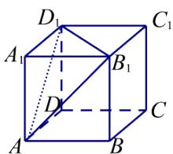
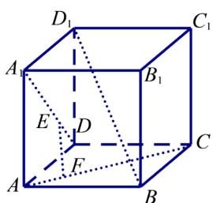
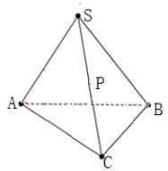

# 高中 数学 必修 第二册

# 第八章 立体几何初步 8.3

# 简单几何体的表面积与体积

# 一、单选题（共1题）

1.【单选题】空间中两条直线l,m和平面 $\alpha$ ，在下列条件下，能得到l//m的是()

A. $l, m$ 与 $\alpha$ 所成角相等  
B. $l, m$ 在 $\alpha$ 内的射影分别为 $l', m'$ ，且 $l' \parallel m'$   
C. $l \parallel \alpha$ , $m \parallel \alpha$   
D. $l \perp \alpha, m \perp \alpha$

# 二、填空题（共1题）

2.【填空题】在正方体 $ABCD - A_{1}B_{1}C_{1}D_{1}$ 中， $AB = 1$ ，则 $A_{1}$ 到平面 $AB_{1}D_{1}$ 的距离为

text_image

D₁
A₁
B₁
C₁
D
A
B
C

# 三、问答题（共2题）

3.【问答题】如图，正方体ABCD-

$A_{1}B_{1}C_{1}D_{1}$ 中，E、F分别为 $A_{1}D$ 、AC上的点，且 $EF\perp A_{1}D$ ， $EF\perp AC$ 。求证： $EF//BD_{1}$

text_image

D₁
C₁
A₁
B₁
E
D
C
F
A
B

4.【问答题】已知在 $\Delta ABC$ 中， $AC = BC = 1, AB = \sqrt{2}, S$ 是 $\Delta ABC$ 所在平面外一点， $SA = SB = 2$ ， $SC = \sqrt{5}$ $P$ 是 $SC$ 的中点，求 $P$ 到平面 $ABC$ 的距离.

