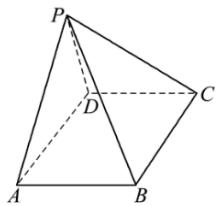
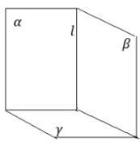
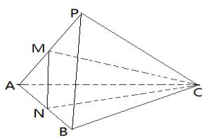

# 高中 数学 必修 第二册

# 第八章 立体几何初步 8.4

# 空间点、直线、平面之间的位置关系

# 一、单选题（共1题）

1.【单选题】如图，在四棱锥P-

ABCD中，底面ABCD为矩形，平面PAD⊥平面ABCD，则下列说法中错误的是（）

text_image

P
D
C
A
B

A. 平面PAB⊥平面PAD  
B. 平面 $PAD \perp$ 平面PDC  
C. $AB \perp PD$   
D. 平面PAD⊥平面PBC

# 二、问答题（共2题）

2.【问答题】已知三个平面 $\alpha,\beta,\gamma$ ，满足 $\alpha\perp\gamma,\beta\perp\gamma,\quad\alpha\cap\beta=l$ 求证： $l\perp\gamma$

3.【问答题】如图，在三棱锥P-

ABC中, 平面 $PAB \perp$ 平面 $PAC$ , $AB \perp BP$ , $M$ 、 $N$ 分别为 $PA$ 、 $AB$ 的中点. $AC = PC$ , 求证: $AB \perp$ 平面 $CMN$ .

text_image

P
M
A
N
B
C

