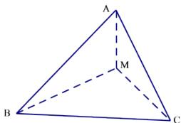
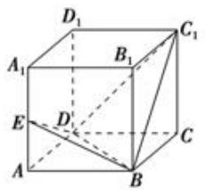
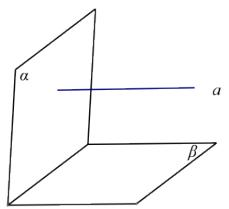

# 高中 数学 必修 第二册

# 第八章 立体几何初步 8.3

# 简单几何体的表面积与体积

# 一、单选题（共1题）

1.【单选题】在等腰直角 $\Delta ABC$ 中， $AB = BC = 1$ ， $M$ 为 $AC$ 的中点，沿 $BM$ 把 $\Delta$

ABC折成二面角，折后A与C的距离为 $\frac{\sqrt{6}}{2}$ ，则二面角C—BM—A的大小为（）

text_image

A
M
B
C

A. $120^{\circ}$   
B. $30^{\circ}$   
C. $60^{\circ}$   
D. $150^{\circ}$

# 二、填空题（共1题）

2.【填空题】如图，P是二面角 $\alpha - AB - \beta$ 的棱AB上一点，分别在 $\alpha$ ， $\beta$ 上引射线PM，PN。若 $\angle BPM = \angle BPN = 45^{\circ}$ ， $\angle MPN = 60^{\circ}$ ，则二面角 $\alpha - AB - \beta$ 的大小是\_\_\_\_。

text_image

A
M
α
P
B
N
β

# 三、问答题（共3题）

3.【问答题】如图，在四棱锥 $P - ABCD$ 中， $PA \perp$ 底面ABCD，底面ABCD为梯形， $AB \parallel CD$ ，且 $CD = 2AB$ . 若 $E$ 为线段 $PC$ 上一点，试确定点 $E$ 的位置，使得平面 $EBD \perp$ 平面ABCD，并说明理由.

text_image

Geometric diagram of a triangular pyramid with labeled vertices and internal points, including dashed lines indicating hidden edges.

4.【问答题】如图，正方体 $ABCD-A_{1}B_{1}C_{1}D_{1}$ 中，E是 $AA_{1}$ 的中点，求证：平面 $C_{1}BD\perp$ 平面BDE.

text_image

D₁
A₁ B₁ C₁
E D C
A B

5.【问答题】如图，已知直线 $a \perp$ 平面 $\alpha$ ，直线 $a \parallel$ 平面 $\beta$ 。求证：平面 $\alpha \perp$ 平面 $\beta$ 。

text_image

α
a
β

