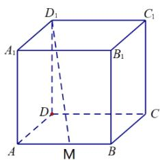

# 高中 数学 必修 第二册

# 第八章 立体几何初步 小结

# 一、单选题（共1题）

1.【单选题】如图，在棱长为1的正方体ABCD-

$A_{1}B_{1}C_{1}D_{1}$ 中，M为棱AB的中点，动点P在侧面 $BCC_{1}B_{1}$ 及其边界上运动，总有 $AP\perp D_{1}M$ ，则动点P的轨迹的长度为（）

text_image

D₁
C₁
A₁
B₁
D
C
A
M
B

A. $\frac{\sqrt{2}}{2}$   
B. $\frac{\sqrt{5}}{2}$   
C. $\frac{\pi}{16}$   
D. $\frac{\sqrt{3}}{2}$

# 二、填空题（共1题）

2.【填空题】在正三棱柱 $ABC-A_{1}B_{1}C_{1}$ 中，D是AB的中点，则在所有的棱中与直线CD和 $AA_{1}$ 都垂直的棱有\_\_\_\_.

# 三、复合题（共1题）

3.【复合题】如图，已知 $\triangle BCD$

中， $\angle BCD = 90^{\circ}$ ， $BC = CD = 1$ ， $AB \perp$ 平面 $BCD$ ， $\angle ADB = 60^{\circ}$ ， $E$ 、 $F$ 分别是 $AC$ 、 $AD$ 上的动点，且 $\frac{AE}{AC} = \frac{AF}{AD} = \lambda (0 < \lambda < 1)$

(1)【问答题】求证：不论 $\lambda$ 为何值，总有 $EF \perp$ 平面 $ABC$   
(2)【问答题】若 $\lambda=\frac{1}{2}$ ，求三棱锥A-BEF的体积.

# 四、问答题（共2题）

4. 【问答题】如图，已知平面 $\alpha \cap$ 平面 $\beta = l, EA \perp \alpha$ ，垂足为点 $A, EB \perp \beta$ ，垂足为点 $A$ ，直线 $a \subset \beta, a \perp AB,$ 求证： $l // a$

5.【问答题】如图，ABCD为正方形，SA⊥平面ABCD, 过A作垂直于SC的平面交SB、SC、SD分别于E、F、G，求证：AE⊥SB

text_image

C
B
F
E
D
G
S
A

