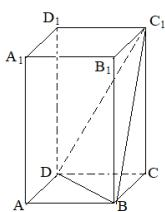
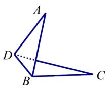

# 高中 数学 必修 第二册

# 第八章 立体几何初步 小结

# 一、单选题（共2题）

1.【单选题】如图，在四棱锥P-ABCD中， $\angle ABC=\angle BAD=90^{\circ}$ ，BC=2AD， $\triangle PAB$ 和 $\triangle PAD$ 都是等边三角形，则异面直线CD与PB所成角的大小为（）

text_image

Geometric diagram of a pyramid with labeled vertices and internal points

A. $90^{\circ}$   
B. $75^{\circ}$   
C. $60^{\circ}$   
D. $45^{\circ}$

2.【单选题】正四棱柱 $ABCD-A_{1}B_{1}C_{1}D_{1}$ 中， $AA_{1}=2AB$ ，则CD与平面 $BDC_{1}$ 所成角的正弦值等于( )

A. $\frac{2}{3}$   
B. $\frac{\sqrt{3}}{3}$   
C. $\frac{\sqrt{2}}{3}$   
D. $\frac{1}{3}A$

# 二、问答题（共1题）

3.【问答题】如图，已知 $\square ABCD$ 中， $AB = 3\sqrt{2}$ ， $AD = 2\sqrt{3}$ ， $BD = \sqrt{6}$

，沿BD将其折成一个锐二面角A-BD-C，折后AB⊥CD.求二面角A-BD-C的大小.

