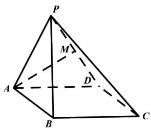

# 高中 数学 必修 第二册

# 第八章 立体几何初步 小结

# 一、单选题（共2题）

1.【单选题】下列命题正确的是（）

A. 三个点确定一个平面  
B. 一条直线和一个点确定一个平面  
C. 圆心和圆上两点可确定一个平面  
D. 梯形可确定一个平面

2.【单选题】过 $\triangle ABC$ 所在平面 $\alpha$ 外一点 P，作 $PO \perp \alpha$ ,

垂足为O，连接PA，PB，PC．若PA=PB=PC，则点O是△ABC的（）

A. 内心  
B. 外心  
C. 重心  
D. 垂心

# 二、填空题（共1题）

3.【填空题】已知平面 $\alpha,\beta$ 和直线a,b,c，且 $a\parallel b\parallel c,\quad a\subset\alpha,\quad b\subset\beta,\quad c\subset\beta$ ，则 $\alpha$ 与 $\beta$ 的位置关系是\_\_\_\_。

# 三、复合题（共2题）

4.【复合题】如图，在四棱锥P-

ABCD中，底面ABCD为正方形，侧面PAD为正三角形，侧面PAD⊥底面ABCD，M是PD的中点。

text_image

P
M
A
D
B
C

(1)【问答题】求证： $AM \perp$ 平面PCD;  
(2)【问答题】求侧面PBC与底面ABCD所成二面角的余弦值。

5.【复合题】如图，在三棱锥P-ABC中，PC⊥平面ABC，AB⊥BC，D，E分别是AB，PB的中点。

text_image

Geometric diagram of a triangular pyramid with labeled vertices and internal points

求证：

(1)【问答题】DE//平面PAC;   
(2)【问答题】 $AB \perp PB$ 。