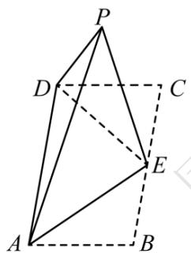
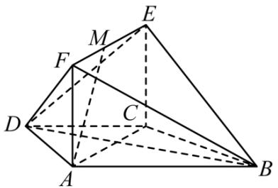
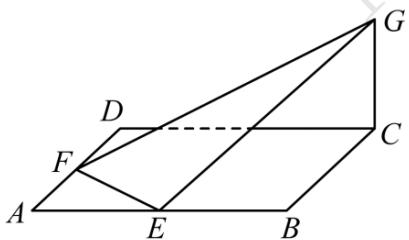

# 高中 数学 必修 第二册

# 第八章 立体几何初步 小结

# 一、复合题（共4题）

1.【复合题】如图，在三棱锥A-BCD中，平面ABD⊥平面BCD，AB=AD，O为BD的中点。

text_image

Geometric diagram of a tetrahedron with labeled vertices A, B, C, D and internal points E, O, showing solid and dashed edges.

(1)【问答题】求证： $OA \perp CD$ ;  
(2)【问答题】若 $\triangle OCD$ 是边长为1的等边三角形，点 $E$ 在棱 $AD$ 上， $DE=2EA$ ，且二面角 $E-BC-D$ 的大小为 $45^{\circ}$ ，求三棱锥 $A-BCD$ 的体积。

2.【复合题】如图，在矩形ABCD中， $AB=\sqrt{2}$ ，BC=2，E为BC的中点，把△ABE和△CDE分别沿AE，DE折起，使点B与点C重合于点P。

text_image

P
D
C
E
A
B

(1)【问答题】求证：平面 $PDE \perp$ 平面PAD;  
(2)【问答题】求二面角P - AD - E的大小。

3.【复合题】如图，在梯形ABCD中， $AB \parallel CD$ ， $AD = DC = CB = a$ ， $\angle ABC = 60^{\circ}$ ，平面ACEF⊥平面ABCD，四边形ACEF是矩形。

text_image

Geometric diagram of a polyhedron with labeled vertices and internal points, used for spatial geometry problems.

(1)【问答题】求证： $BC \perp$ 平面ACEF;  
(2)【问答题】在线段EF上是否存在点M，使得AM//平面BDE？若存在，求出FM的长；若不存在，请说明理由。

4.【复合题】如图，在四面体ABCD中， $\triangle ABC$ 是等边三角形，平面 $ABC \perp$ 平面ABD，M为棱AB的中点，AB = 2， $AD = 2\sqrt{3}$ ， $\angle BAD = 90^{\circ}$ 。

text_image

A
M
B
C
D

(1)【问答题】求证： $AD \perp BC;$   
(2)【问答题】求异面直线BC与MD所成角的余弦值;

# 二、问答题（共1题）

5.【问答题】如图，已知ABCD是边长为4的正方形，E，F分别是边AB，AD的中点，GC垂直于ABCD所在平面，且GC=2，求点B到平面EFG的距离。

text_image

Geometric diagram of a parallelogram with labeled vertices and internal points, used for spatial geometry problems.

