# 高中 数学 必修 第二册

# 第八章 立体几何初步 8.1 基本立体图形

# 一、复合题（共2题）

1.【复合题】判断下列命题是否正确，正确的在括号内画“√”，错误的画“×”。

(1)【判断题】长方体是直棱柱，四棱柱是长方体。（）  
(2)【判断题】棱锥的底面是多边形，其余各面为具有一个公共顶点的三角形。（）  
(3)【判断题】有两个面互相平行，其余四个面都是等腰梯形的六面体为棱台。（）

2.【复合题】如图为长方体 $ABCD-A_{1}B_{1}C_{1}D_{1}$

text_image

D₁
F
C₁
A₁
E
B₁
D
C
A
B

(1)【问答题】这个长方体是棱柱吗？如果是，是几棱柱？为什么？  
(2)【问答题】用平面BCFE

把这个长方体分成两部分后，各部分形成的几何体还是棱柱吗？如果是，是几棱柱？如果不是，请说明理由。

# 二、问答题（共1题）

3.【问答题】如图，长方体的长、宽、高分别为4 cm，3 cm，5 cm，一只蚂蚁从点A到点 $C_{1}$ 沿着表面爬行的最短距离是多少？

text_image

D₁ C₁
A₁ B₁
5 cm
D 3 cm C
A B 4 cm

# 高中 数学 必修 第二册

# 第八章 立体几何初步 8.1 基本立体图形

# 一、填空题（共1题）

1.【填空题】如图，一立在水平地面上的圆锥形物体的母线长为 $4 m$

，一只小虫从圆锥的底面圆上的点P出发，绕圆锥表面爬行一周后回到点P

处．若该小虫爬行的最短路程为 $4\sqrt{2}m$ ，则圆锥底面圆的半径等于\_\_\_\_m。

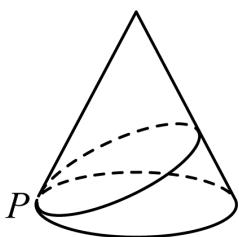

natural_image

Geometric diagram of a cone with an inscribed helical surface, labeled P (no text or symbols beyond label)

# 二、复合题（共1题）

2.【复合题】以下组合体分别是由哪些简单几何体构成的？

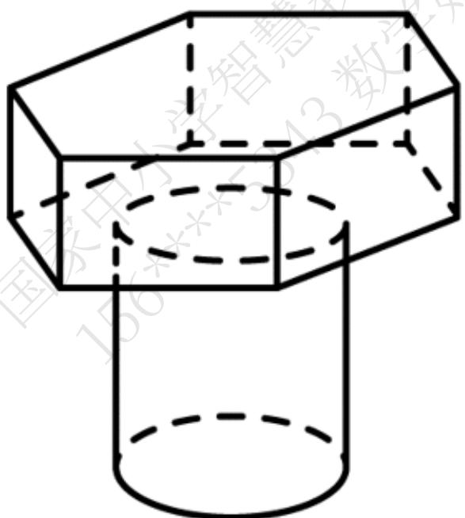

text_image

国家电力发展智慧
156米
43米

(1)【问答题】

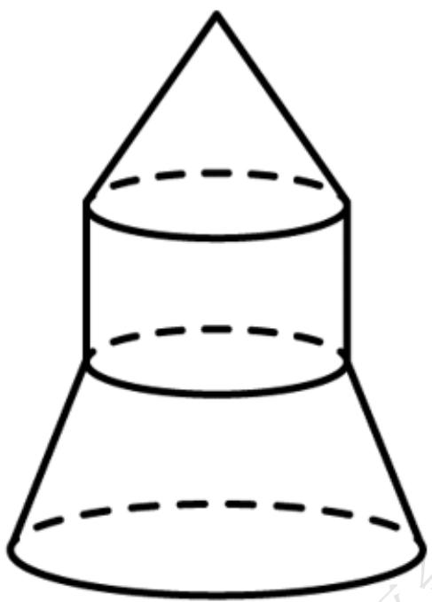

natural_image

Simple line drawing of a cone with dashed horizontal lines indicating depth (no text or symbols)

(2)【问答题】

# 三、问答题（共1题）

3.【问答题】如图，将等腰梯形ABCD绕边AB所在的直线旋转一周，由此形成的几何体是由哪些简单几何体构成的？

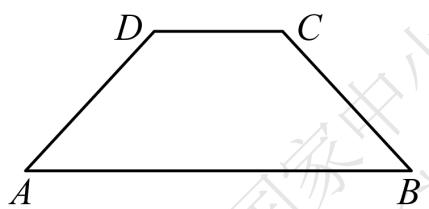

text_image

D
C
A
B

# 高中 数学 必修 第二册

# 第八章 立体几何初步 8.5 空间直线、平面的平行

# 一、单选题（共3题）

1.【单选题】如图所示，正方形 $O'A'B'C'$ 的边长为1cm

，它是用斜二测画法得到的一个水平放置的平面图形的直观图，则原图形的周长是（）

text_image

C'
B'
O'
A'
x'

A. 4cm   
B. 8cm   
C. $(2 + 3\sqrt{2})cm$   
D. $(2 + 2\sqrt{3})cm$

2.【单选题】用斜二测画法画水平放置的平面图形的直观图，其中说法不正确的是（）

A. 相等的线段在直观图中不一定相等  
B. 平行的线段在直观图中仍然平行  
C. 一个角的直观图仍是一个角  
D. 相等的角在直观图中仍然相等

3.【单选题】关于“斜二测画法”，下列说法不正确的是（）

A. 原图形中平行于x轴的线段, 其对应线段平行于 $x'$ 轴, 长度不变  
B. 原图形中平行于y轴的线段, 其对应线段平行于y'轴, 长度变为原来的一半  
C. 在画与直角坐标系xOy对应的坐标系 $x^{\prime}O^{\prime}y^{\prime}$ 时, $\angle x^{\prime}O^{\prime}y^{\prime}$ 必须是 $45^{\circ}$   
D. 在画直观图时, 由于选择坐标系的不同, 所得的直观图可能不同

# 二、填空题（共2题）

4.【填空题】如图所示， $\triangle ABC$ 是边长为 1 的等边三角形，那么 $\triangle ABC$ 的斜二测画法直观图 $\triangle A'B'C'$ 的面积是 \_\_\_\_。

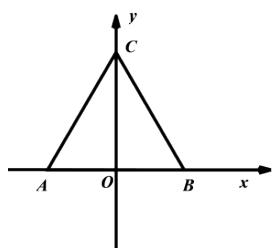

text_image

y
C
A O B x

5.【填空题】如图所示，在所有棱长均为l的直三棱柱 $ABC-A_{1}B_{1}C_{1}$ 上，有一只蚂蚁从点A出发，围着三棱柱的侧面爬行一周到达点 $A_{1}$ ，则爬行的最短路程为\_\_\_\_。

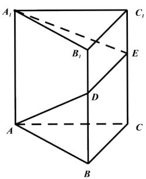

text_image

A₁
B₁
C₁
D
E
A
B
C

# 高中 数学 必修 第二册

# 第八章 立体几何初步 8.5 空间直线、平面的平行

# 一、单选题（共2题）

1.【单选题】正六棱柱的底面周长为12,侧面都是正方形,则此棱柱的体积为（）

A. $12 \sqrt{3}$   
B. 20   
C. 16   
D. $4\sqrt{3}$

2.【单选题】某组合体如图所示，上半部分是正四棱锥P-EFGH，下半部分是长方体ABCD-EFGH. 正四棱锥P-EFGH的高为 $\sqrt{3}$ ，EF=2,AE=1.则该组合体的表面积为（）

text_image

P
H
E
F
G
C
D
A
B

A. 20   
B. $4\sqrt{3} + 12$   
C. 16   
D. $4\sqrt{3} + 8$

# 二、填空题（共2题）

3.【填空题】已知一个正三棱台的两个底面的边长分别为3和9，侧棱长为5，则该棱台的表面积为\_\_\_\_。  
4.【填空题】如图，直四棱柱 $ABCD-A_{1}B_{1}C_{1}D_{1}$ 底面为菱形，且 $\angle BAD=60^{\circ}$

，侧棱长为3,对角线 $B_{D_{1}}=\sqrt{13}$ ，则三棱锥 $D_{1}-ACD$ 的表面积为\_\_\_\_。

text_image

D₁
A₁
B₁
C₁
D
A
B
C

# 三、问答题（共1题）

5. 【问答题】如图所示, 已知长方体 $ABCD - A_{1}B_{1}C_{1}D_{1}$ 的体积为V, P是棱 $D_{1}C_{1}$ 上的动点, Q是棱AB上的动点, 求三棱锥P - CDQ的体积。

text_image

D₁ P C₁
A₁ D B₁ C
A Q B

# 高中 数学 必修 第二册

# 第八章 立体几何初步 8.6 空间直线、平面的垂直

# 8.6.1 直线与直线垂直

# 一、单选题（共2题）

1.【单选题】若一个圆柱的表面积为 $12\pi$ ，则该圆柱的外接球的表面积的最小值为（）

A. $(12\sqrt{3} - 12)\pi$   
B. $(12\sqrt{5} - 12)\pi$   
C. $12\sqrt{3}\pi$   
D. $12\sqrt{5}\pi$

2.【单选题】一个圆柱的侧面展开图是一个正方形，这个圆柱的侧面积与表面积的比是（）。

A. $\frac{2\pi}{1+2\pi}$   
B. $\frac{4\pi}{1+4\pi}$   
C. $\frac{\pi}{1+2\pi}$   
D. $\frac{4\pi}{1+2\pi}$

# 二、填空题（共1题）

3.【填空题】某几何体的三视图如图所示，则该几何体的外接球的表面积为\_\_\_\_。

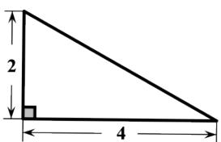

text_image

2
4

正视图

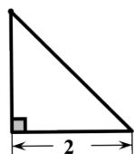  
侧视图

text_image

2
4

俯视图

# 三、复合题（共1题）

4.【复合题】如图所示是古希腊数学家阿基米德的墓碑文，墓碑上刻着一个圆柱，圆柱内有一个内切球，这个球的直径恰好与圆柱的高相等，相传这个图形表达了阿基米德最引以为自豪的发现.我们来研究这个具有对称美的几何体。

(1)【填空题】球的表面积与圆柱的表面积之比为\_\_\_\_。   
(2)【填空题】球的体积与圆柱的体积之比为\_\_\_\_。

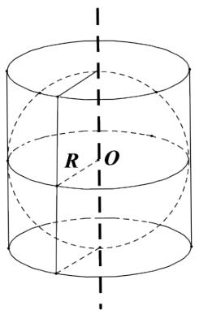

text_image

R
O

# 四、问答题（共1题）

5.【问答题】如图，圆锥PO的底面直径和高均是a，过PO的中点 $O'$

作平行于底面的截面，以该截面为底面挖去一个圆柱，求剩下几何体的体积。

text_image

P
O'
O'

# 高中 数学 必修 第二册

# 第八章 立体几何初步 8.6 空间直线、平面的垂直

# 8.6.2 直线与平面垂直

# 一、单选题（共1题）

1.【单选题】下列命题正确的是（）

A. 经过三点确定一个平面  
B. 经过一条直线和一个点确定一个平面  
C. 四边形确定一个平面  
D. 两两相交且不共点的三条直线确定一个平面

# 二、问答题（共2题）

2.【问答题】已知三个平面 $\alpha,\beta,\gamma$ 满足： $\alpha\cap\beta=c,\quad\beta\cap\gamma=a,\quad\gamma\cap\alpha=b$ ，若直线a和b不平行，如图所示，求证：三条直线a,b,c过同一点。

text_image

γ
a
β
c
b
α

3. 【问答题】如图， $\triangle ABC$ 在平面 $\alpha$ 外， $AB \cap \alpha = P, BC \cap \alpha = Q, AC \cap \alpha = R$ ，求证： $P, Q, R$ 三点共线。

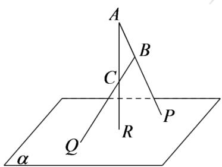

text_image

A
B
C
P
Q
R
α

# 高中 数学 必修 第二册

# 第八章 立体几何初步 8.6 空间直线、平面的垂直

# 8.6.2 直线与平面垂直

# 一、问答题（共3题）

1. 【问答题】如图，在正方体 $ABCD-A_{I}B_{I}C_{I}D_{I}$ 中，M, N, E, F分别是棱CD，AB， $D_{D_{I}}$ ，A， $A_{I}$ 上的点。若直线MN与EF交于点Q，求证：D，A，Q三点共线。

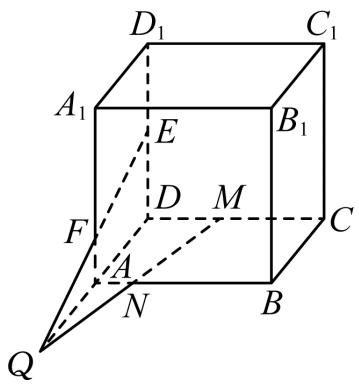

text_image

D₁
C₁
A₁
E
B₁
F
D
M
C
A
N
B
Q

2.【问答题】用符号语言表示下列语句，并画出图形：

(1) 三个平面 $\alpha, \beta, \gamma$ 相交于一点 $P$ , 且平面 $\alpha$ 与平面 $\beta$ 交于 $PA$ , 平面 $\alpha$ 与平面 $\gamma$ 交于 $PB$ , 平面 $\beta$ 与平面 $\gamma$ 交于 $PC$ ;

(2) 平面ABD与平面BCD相交于BD，平面ABC与平面ADC相交于AC。

3.【问答题】已知直线a//b，直线l与a，b都相交，求证：过a，b，l有且只有一个平面。

# 高中 数学 必修 第二册

# 第八章 立体几何初步 8.6 空间直线、平面的垂直

# 8.6.3平面与平面垂直

# 一、单选题（共1题）

1.【单选题】下列命题中，正确的有（）

A. 若直线 $l$ 上有无数个点不在平面 $\alpha$ 内，则 $l / / \alpha$   
B. 若直线 $l$ 与平面 $\alpha$ 平行，则 $l$ 与平面 $\alpha$ 内的任意一条直线都平行  
C. 如果两条平行直线中的一条与一个平面平行，那么另一条也与这个平面平行  
D. 若直线 $l$ 与平面 $\alpha$ 平行，则 $l$ 与平面 $\alpha$ 内的任意一条直线都没有公共点

# 二、填空题（共2题）

2.【填空题】如图，在正方体 $ABCD-A_{1}B_{1}C_{1}D_{1}$ 中，M,N分别为棱 $C_{1},D_{1},C_{1},C$ 的中点，有以下四个结论：

①直线AM与 $C_{C_{1}}$ 是相交直线；  
②直线AM与BN是相交直线；  
③直线BN与 $MB_{1}$ 是异面直线；  
④直线AM与 $D_{D_{1}}$ 是异面直线。

其中正确的结论为\_\_\_\_。

text_image

D₁ M C₁
A₁ B₁ N
D C
A B

3.【填空题】在正方体 $ABCD-A_{1}B_{1}C_{1}D_{1}$ 中，E,F分别为棱 $A_{A_{1}},C_{C_{1}}$ 的中点，则在空间中与三条直线 $A_{1}D_{1},EF,CD$ 都相交的直线有\_\_\_\_条。

# 三、复合题（共1题）

4.【复合题】填空题

(1)【填空题】若两个平面互相平行，则分别在这两个平行平面内的两条直线\_\_\_\_。

(2)【填空题】如果在两个平面内分别有一条直线, 这两条直线互相平行, 那么这两个平面的位置关系是\_\_\_\_。

# 四、问答题（共5题）

5.【问答题】如图，已知平面 $\alpha$ 和 $\beta$ 相交于直线 $l$ ，点 $A \in \alpha$ ，点 $B \in \alpha$ ，点 $C \in \beta$ ，且 $A \notin l$ ， $B \notin l$ ， $C \notin l$ 直线 $AB$ 与 $l$ 不平行，那么平面 $ABC$ 与平面 $\beta$ 的交线和直线 $l$ 有什么关系？证明你的结论。

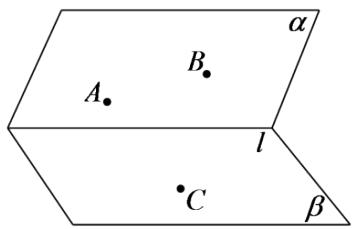

text_image

A
B
l
C
β
α

6.【问答题】如图，在正方体 $ABCD - A_{1}B_{1}C_{1}D_{1}$ 中，哪几条棱所在直线与棱 $AB$

所在直线是异面直线？哪几条棱所在直线与直线 $B_{I}C$ 是异面直线？哪几条棱所在直线与直线B $D_{I}$ 是异面直线？

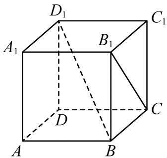

text_image

D₁
A₁ B₁ C₁
D
C
A B

7.【问答题】画图表示下列关系:

(1) $A \in \alpha, B \notin \alpha, A \in l, B \in l;$   
(2) $a \subset \alpha, b \subset \beta, \alpha \cap \beta = c, a // c, b \cap c = P$ 。

8.【问答题】如图，空间四边形ABCD中，平面EFHG分别交边AB，AD，CD，CB于E，F，H，G四点，其中E，F分别是AB，AD的中点，点G，H满足BG：GC=DH：HC

=1:2。试判断直线AC与平面EFHG的位置关系，并说明理由。

text_image

A
E
F
D
B
G
H
C

9.【问答题】如图，在三棱锥A-BCD中，E,G分别是BC,AB的中点，点F在CD上，点H在AD上，且有DF:FC=DH:HA=2:3.试判定直线EF,GH,BD的位置关系.

text_image

A
G
H
B
D
E
K
C

# 高中 数学 必修 第二册

# 第八章 立体几何初步 8.6 空间直线、平面的垂直

# 8.6.3平面与平面垂直

# 一、单选题（共1题）

1.【单选题】已知a,b是两条异面直线，直线c//a，那么c与b的位置关系（）

A. 一定是异面  
B. 一定是相交  
C. 不可能平行  
D. 不可能相交

# 二、多选题（共1题）

2.【多选题】（多选）如图，在四面体ABCD中，M,N,P,Q,E分别是AB,BC,CD,AD,AC的中点，则下列说法中正确的是（）

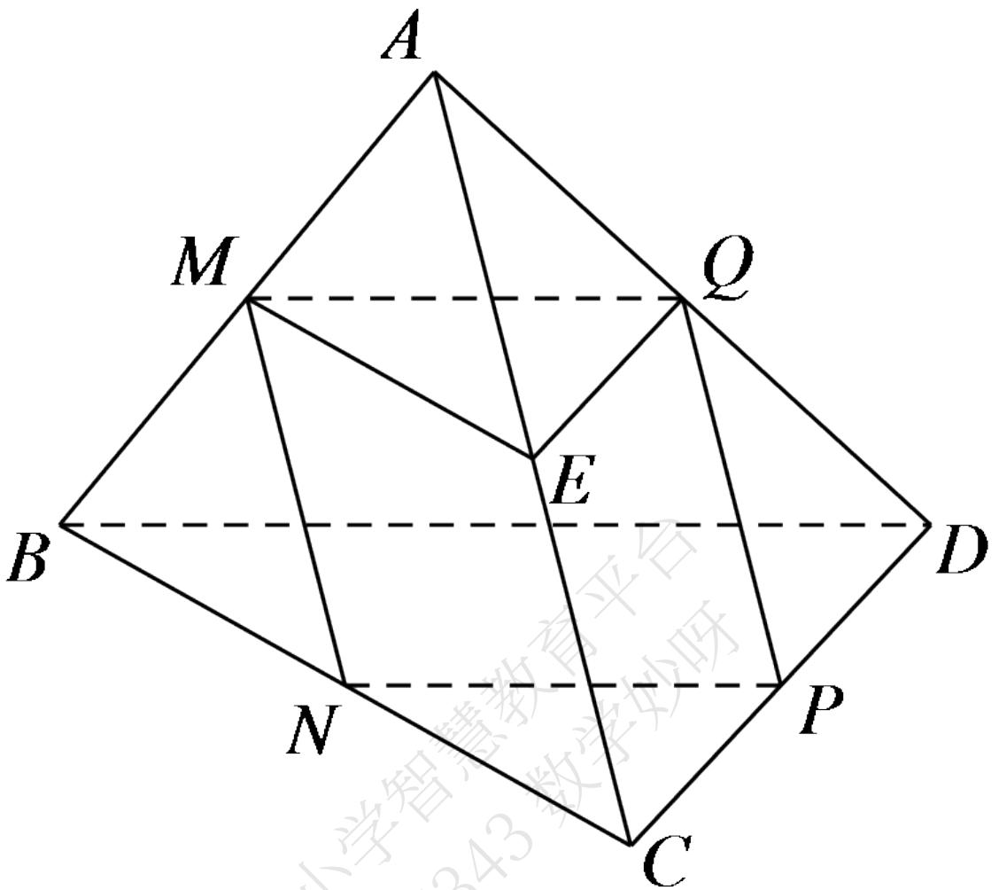

text_image

A
M
Q
E
B
D
N
P
C
小学智慧教育平台

A. M, N, P, Q 四点共面  
B. $\angle QME = \angle DBC$   
C. $\triangle BCD \sim \triangle MEQ$   
D. 四边形MNPQ为菱形

# 三、问答题（共2题）

3.【问答题】在梯形ABCD中， $AB // CD$ ，E,F分别为BC,AD的中点，将平面DCEF沿EF翻折起来，使CD到 $C_{I}D_{I}$ 的位置，G,H分别为 $AD_{I},BC_{I}$ 的中点，求证：四边形EFGH平行四边形。

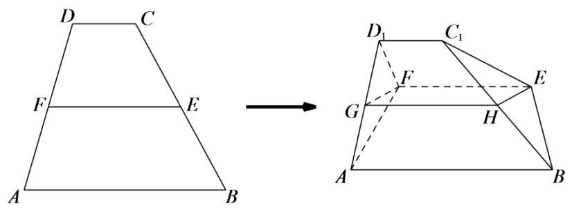

text_image

D C
F E
A B
D₁ C₁
F
G H
E
A B

4.【问答题】如图，在三棱锥 $P - ABC$ 中， $G, H$ 分别是 $PB, PC$ 的中点， $M, N$ 分别是 $\triangle PAB, \triangle PAC$ 的重心．求证： $GH // MN$ 。

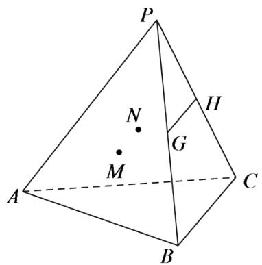

text_image

P
N
G
H
M
A
C
B

# 高中 数学 必修 第二册

# 第八章 立体几何初步 8.4

# 空间点、直线、平面之间的位置关系

# 一、单选题（共2题）

1. 【单选题】如图，P为平行四边形ABCD所在平面外一点，Q为PA的中点，O为AC与BD的交点，下列说法中错误的是（）

text_image

P
Q
A
O
B
C
D
国家中小学教育平台

A. $OQ \parallel$ 平面PCD  
B. PC // 平面BDQ  
C. AQ // 平面PCD  
D. CD // 平面PAB

2.【单选题】对于直线m,n和平面 $\alpha$ ，若 $n\subset\alpha$ ，则“ $m//n$ ”是“ $m//\alpha$ ”的（）

A. 充分不必要条件  
B. 必要不充分条件  
C. 充要条件

D. 既不充分也不必要条件

# 二、填空题（共1题）

3.【填空题】已知m,n是平面α外的两条直线，给出下列三个论断：①m//n；②m//α；③n//α，以其中两个为条件，余下的一个为结论，构造命题，写出你认为正确的一个命题\_\_\_\_。

# 三、复合题（共1题）

4. 【复合题】如图，四棱锥P-ABCD中，底面ABCD为平行四边形，F是AB的中点，E是PD的中点。

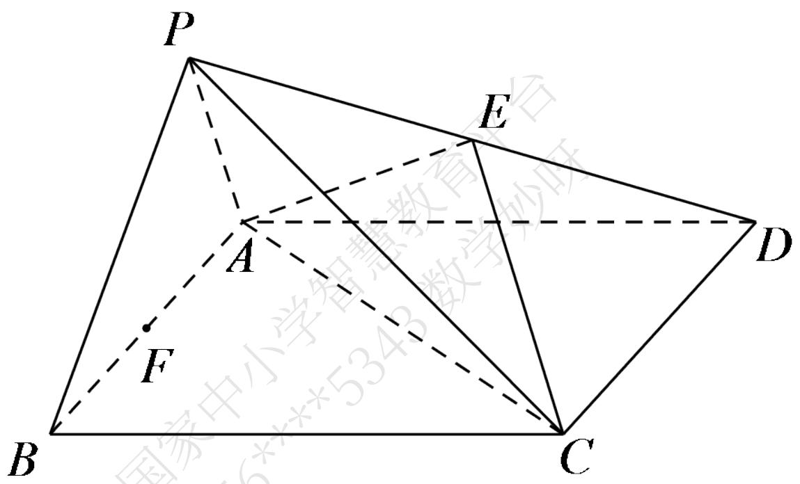

text_image

P
E
A
F
B
C
D
国家中小学智慧教育论坛

(1)【问答题】证明：PB//平面AEC;   
(2)【问答题】（2）在PC上求一点G，使FG平面AEC，并证明你的结论。

# 高中 数学 必修 第二册

# 第八章 立体几何初步 8.4

# 空间点、直线、平面之间的位置关系

# 一、单选题（共1题）

1. 【单选题】在正方体 $ABCD - A_{I}B_{I}C_{I}D_{I}$ 中，已知 $P, Q$ 分别是 $A_{A_{I}}, C_{C_{I}}$ 的中点，则过点 $B, P, Q$ 的截面是（）

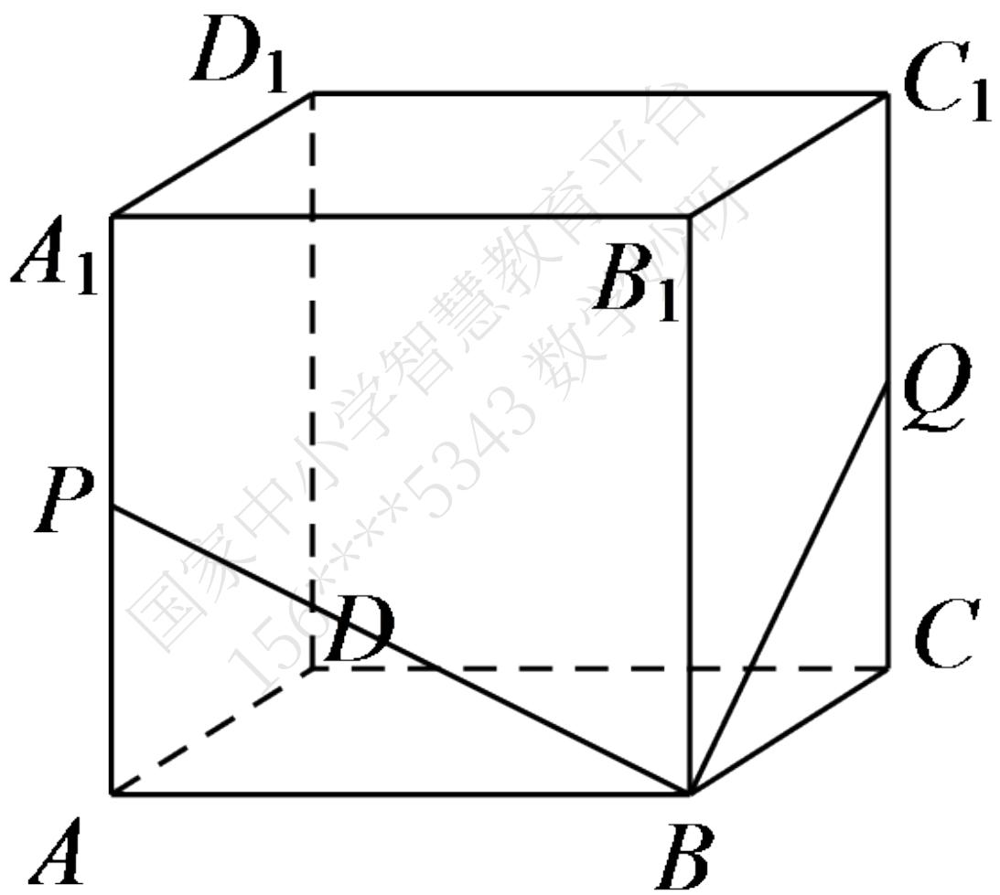

text_image

D₁
A₁
B₁
C₁
P
D
Q
C
A
B
国家中小学智慧教育平台

A. 正方形  
B. 邻边不等的矩形  
C. 不是正方形的菱形  
D. 邻边不等的平行四边形

# 二、多选题（共1题）

2.【多选题】（多选）已知正方体 $ABCD-A_{1}B_{1}C_{1}D_{1}$ 的棱 $C_{1}D_{1}$ 上存在一点E（不与端点重合），使得 $BD_{1}//$ 平面 $B_{1}CE$ ，则（）

A. $B_{D_1}$ 与 $CE$ 不平行  
B. $A_{C_{I}} \perp B_{D_{I}}$   
C. $D_{I}E = 2EC_{I}$   
D. $D_{I}E = EC_{I}$

# 三、填空题（共1题）

3.【填空题】如图，在四棱锥P-ABCD中，底面ABCD为菱形， $\angle BAD=60^{\circ}$ ，Q为AD的中点，点M在线段PC上， $PM=\lambda PC$ ，PA//平面MQB，则实数 $\lambda=$ \_\_\_\_。

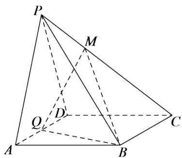

text_image

P
M
Q
D
A
B
C

# 四、问答题（共1题）

4.【问答题】如图，在五面体ABCDEF中，平面ABCD为平行四边形，过BC的平面交棱FD于点P，交棱FA于点Q．证明：PQ//平面ABCD。

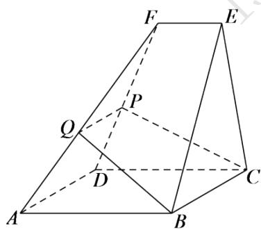

text_image

Geometric diagram of a polyhedron with labeled vertices and internal points, used for spatial geometry problems.

# 高中 数学 必修 第二册

# 第八章 立体几何初步 8.5 空间直线、平面的平行

# 一、单选题（共2题）

1.【单选题】下列四个正方体的图形中，A,B,C为正方体所在棱的中点，则能得出平面ABC//平面DEF的是（）

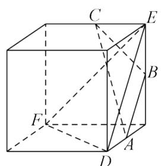

text_image

Geometric diagram of a cube with labeled vertices and internal diagonals, used for spatial geometry problems.

A.

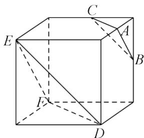

text_image

Geometric diagram of a cube with labeled vertices and internal diagonals, used for spatial geometry problems.

B.

text_image

Geometric diagram of a cube with labeled vertices and internal diagonals, used for spatial geometry problems.

C.

text_image

Geometric diagram of a cube with labeled vertices and internal diagonals, used for spatial geometry problems.

D.

2.【单选题】已知两个平面 $\alpha, \beta$ ，下列条件中能判断出 $\alpha / / \beta$ 的是（）

A. $\alpha$ 内不共线的三点到 $\beta$ 的距离相等;

B. l, m 是 $\alpha$ 内的两条直线，且 $l \parallel \beta$ ， $m \parallel \beta$ ;  
C. l, m 是两条异面直线，且 $l \parallel \alpha$ ， $l \parallel \beta$ ， $m \parallel \alpha$ ， $m \parallel \beta$ ;  
D. $\alpha$ 内的 $\triangle ABC$ 与 $\beta$ 内的 $\triangle A_{1}B_{1}C_{1}$ 全等，且 $A_{A_{1}} // B_{B_{1}}$ .

# 二、填空题（共1题）

3.【填空题】已知正方体 $ABCD-A_{1}B_{1}C_{1}D_{1}$ 的棱长为2，E为棱 $C_{C_{1}}$ 的中点，点M在正方形 $BC_{C_{1}}B_{1}$ 内（包括边界）运动，且直线AM//平面 $A_{1}DE$ ，则动点M的轨迹长度为\_\_\_\_。

# 三、问答题（共1题）

4.【问答题】如图，四棱锥P-ABCD中， $AB//DC$ ，AB=2DC，E为PB的中点。

(1) 求证: $CE$ // 平面 PAD;  
(2) 在线段 $AB$ 上是否存在一点 $F$ , 使得平面 $PAD$ 平面 $CEF$

？若存在，证明你的结论，若不存在，请说明理由。

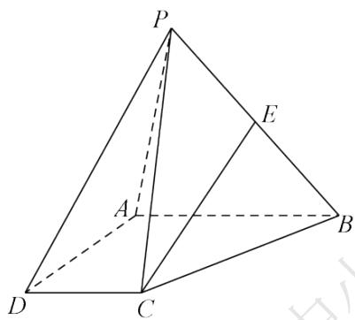

text_image

P
E
A
B
D
C

# 高中 数学 必修 第二册

# 第八章 立体几何初步 8.5 空间直线、平面的平行

# 一、单选题（共1题）

1. 【单选题】若平面 $\alpha //$ 平面 $\beta$ ，点 $A, C \in \alpha$ ， $B, D \in \beta$ ，则直线 $AC //$ 直线 $BD$ 的充要条件是（）.

A. AB // CD   
B. AD // CB   
C. AB 与 CD 相交  
D. A, B, C, D 四点共面

# 二、填空题（共1题）

2.【填空题】在棱长为2的正方体 $ABCD-A_{1}B_{1}C_{1}D_{1}$ 中，P是 $A_{1}B_{1}$ 的中点，过点 $A_{2}$ 作与平面PB $C_{1}$ 平行的截面，所得截面的面积是\_\_\_\_。

text_image

D₁
A₁ P B₁ C₁
D C
A B

# 三、问答题（共2题）

3.【问答题】如图，四棱柱 $ABCD-A_{1}B_{1}C_{1}D_{1}$ 的底面ABCD是正方形。

（1）证明：平面 $A_{1}BD$ // 平面 $C_{D_{1}}B_{1}$ ;  
(2) 若平面ABCD与平面 $B_{l}D_{l}C$ 交于直线l，证明： $B_{l}D_{l}/l$ 。

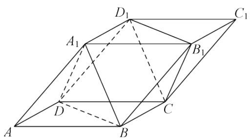

text_image

D₁
A₁
B₁
C₁
D
A
B
C

4. 【问答题】如图，已知平面 $\alpha //$ 平面 $\beta$ ， $P\notin\alpha$ ，且 $P\notin\beta$ ，过点 $P$ 的直线 $m$ 与 $\alpha, \beta$ 分别交于点 $A, C$ ，过点 $P$ 的直线 $n$ 与 $\alpha, \beta$ 分别交于点 $B, D$ ，且 $PA = 6, AC = 9, PD = 8$ ，求 $BD$ 的长。

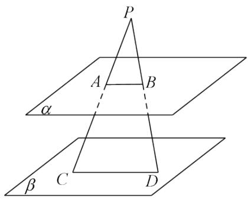

text_image

P
A B
α
β C D

# 高中 数学 必修 第二册

# 第八章 立体几何初步 8.5 空间直线、平面的平行

# 一、单选题（共1题）

1.【单选题】已知 $\alpha \cap \beta = l, a \in \alpha, b \in \beta$ ，且 $a, b$ 为异面直线，则以下结论中正确的是（）

A. a, b 都与 l 平行  
B. a, b 中至多有一条与 l 平行  
C. a, b 都与 l 相交  
D. a, b 中至多有一条与 l 相交

# 二、填空题（共1题）

2.【填空题】如图, 在三棱锥ABCD中, $E,F,M,N$ 分别为AB,AD,AC,BD的中点, $G$ 为棱BC上一点, 且满足 $BC=\lambda BG$ , 若 $\angle EFM=\angle BNG$ , 则实数 $\lambda$ 的值为\_\_\_\_。

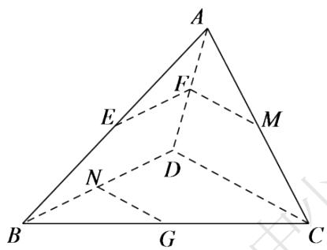

text_image

A
F'
E
M
N
D
B
G
C

# 三、复合题（共1题）

3.【复合题】判断下列命题是否正确，正确的在括号内画“v”，错误的画“×”。

(1)【问答题】如果直线a//b，那么a平行于经过b的任何平面（）  
(2)【问答题】如果直线a和平面 $\alpha$ 平行，那么a与 $\alpha$ 内的任何直线平行；()  
(3)【问答题】如果直线a,b和平面 $\alpha$ 满足 $a//\alpha$ ， $b//\alpha$ ，那么 $a//b;$ （）  
(4)【问答题】如果直线a,b和平面α满足a//b，a//α，b∉α，那么b//α. （）

# 四、问答题（共1题）

4.【问答题】如图所示，在空间四边形ABCD中，AC,BD为其对角线，E,F,G,H分别为AC,BC,BD,AD上的点，若四边形EFGH为平行四边形，求证：AB//平面EFGH。

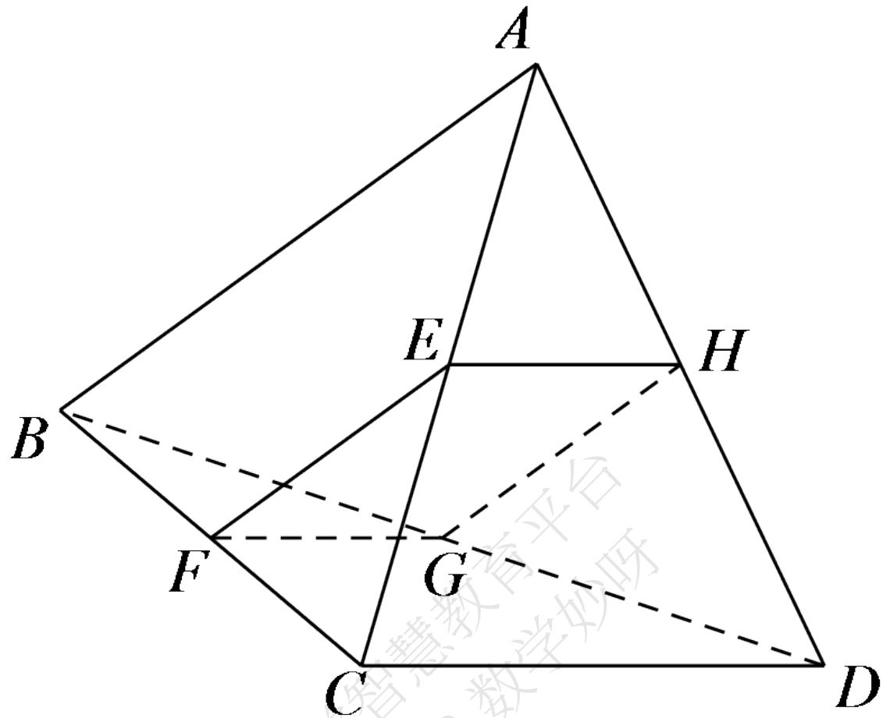

text_image

A
E
H
B
F
G
C
D

# 高中 数学 必修 第二册

# 第八章 立体几何初步 8.5 空间直线、平面的平行

# 一、单选题（共1题）

1.【单选题】已知四棱锥P-ABCD的底面四边形ABCD的对边互不平行，现用一平面 $\alpha$ 去截此四棱锥，且要使截面是平行四边形，则这样的平面 $\alpha$ （）

A. 有且只有一个  
B. 有四个   
C. 有无数个   
D. 不存在

# 二、填空题（共1题）

2.【填空题】如图，在正方体 $ABCD-A_{1}B_{1}C_{1}D_{1}$ 中，点E,F分别在AD,AC上，且 $A_{1}E=2ED$ ，CF=2FA，则EF与 $BD_{1}$ 的位置关系是\_\_\_\_。

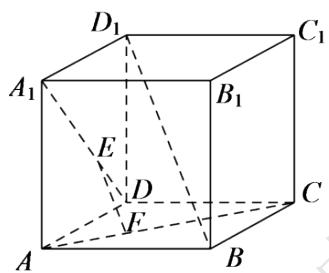

text_image

D₁
A₁
E
B₁
C₁
D
F
A
B

# 三、问答题（共1题）

3.【问答题】如图，已知AB,CD是夹在两个平行平面 $\alpha,\beta$ 之间不共面的两条线段，M,N分别为AB,CD的中点，求证： $MN//\alpha$ 。

text_image

A
C
β
M
N
B
D
α

# 高中 数学 必修 第二册

# 第八章 立体几何初步 8.5 空间直线、平面的平行

# 一、单选题（共1题）

1.【单选题】若a是空间中的一条直线,则在平面α内一定存在直线b与直线a()

A. 平行  
B. 相交  
C. 垂直   
D. 异面

# 二、填空题（共3题）

2.【填空题】在正三棱柱 $ABC-A_{1}B_{1}C_{1}$ 中，D为 $CC_{1}$ 的中点，AB=2， $AA_{1}=2\sqrt{2}$

，求直线 $AC_{1}$ 与BD所成角的大小为\_\_\_\_

text_image

A
B₁
C₁
D
A
B
C

3.【填空题】如图，平面α过正方体ABCD - $A_{1}B_{1}C_{1}D_{1}$ 的顶点 $A_{1}$ ，α // 平面 $C_{1}BD$ ，α ∩ 平面ABCD = m，α ∩ 平面 $ABB_{1}A_{1} = n$ ，则m, n所成角的正弦值为\_\_\_\_。

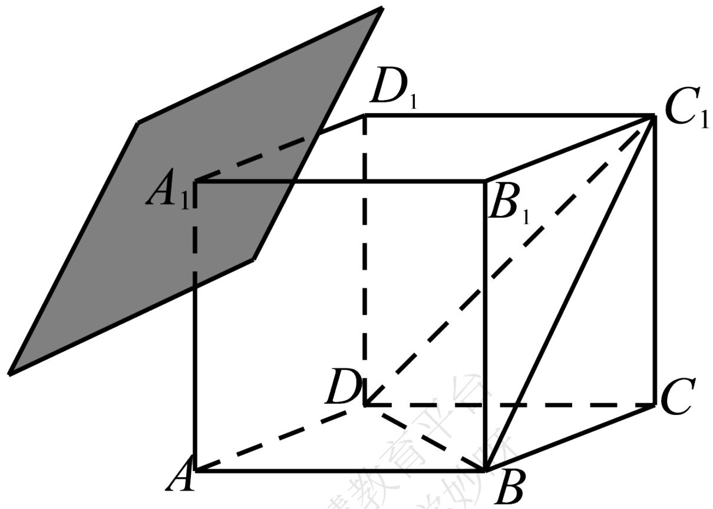

text_image

D₁
A₁
B₁
C₁
D
C
A
B

4.【填空题】如图,圆柱 $OO_{1}$ 中,底面半径为1, $OA\perp O_{1}B$ ,异面直线AB与 $OO_{1}$ 所成角的正切值为 $\frac{\sqrt{2}}{4}$ ,则该圆柱 $OO_{1}$ 的体积为\_\_\_\_

text_image

O₁
B
A
O

# 三、问答题（共1题）

5.【问答题】在直三棱柱 $ABC-A_{1}B_{1}C_{1}$ 中， $AC\perp BC$ ，求证： $AC\perp BC_{1}$

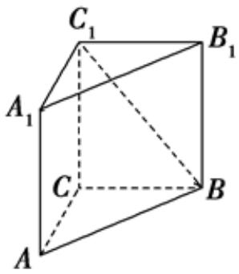

text_image

C₁
A₁
B₁
C
B
A

# 高中 数学 必修 第二册

# 第八章 立体几何初步 8.6 空间直线、平面的垂直

# 8.6.2 直线与平面垂直

# 一、单选题（共1题）

1.【单选题】如图所示的三棱锥P-

ABC中， $PA \perp$ 平面ABC， $BC \perp AC$ ，则图中直角三角形的个数为（）

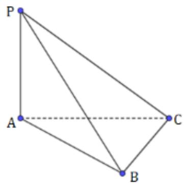

natural_image

Geometric diagram of a tetrahedron with vertices labeled P, A, B, C (no text or symbols beyond labels)

A. 4   
B. 3   
C. 2   
D. 1

# 二、填空题（共1题）

2.【填空题】已知正三棱锥P-ABC的所有棱长都相等，则PA与平面ABC所成角的余弦值为\_\_\_\_。

text_image

P
A
O
C
B

# 三、问答题（共1题）

3.【问答题】如图，在四棱锥P-ABCD中， $AD \perp$ 平面PDC，AD//BC， $PD \perp PB$ ，AD=1，BC=3，CD=4，PD=2．求直线AB与平面PBC所成角的余弦值。

# 高中 数学 必修 第二册

# 第八章 立体几何初步 8.3

# 简单几何体的表面积与体积

# 一、单选题（共1题）

1.【单选题】空间中两条直线l,m和平面 $\alpha$ ，在下列条件下，能得到l//m的是()

A. $l, m$ 与 $\alpha$ 所成角相等  
B. $l, m$ 在 $\alpha$ 内的射影分别为 $l', m'$ ，且 $l' \parallel m'$   
C. $l \parallel \alpha$ , $m \parallel \alpha$   
D. $l \perp \alpha, m \perp \alpha$

# 二、填空题（共1题）

2.【填空题】在正方体 $ABCD - A_{1}B_{1}C_{1}D_{1}$ 中， $AB = 1$ ，则 $A_{1}$ 到平面 $AB_{1}D_{1}$ 的距离为

text_image

D₁
A₁
B₁
C₁
D
A
B
C

# 三、问答题（共2题）

3.【问答题】如图，正方体ABCD-

$A_{1}B_{1}C_{1}D_{1}$ 中，E、F分别为 $A_{1}D$ 、AC上的点，且 $EF\perp A_{1}D$ ， $EF\perp AC$ 。求证： $EF//BD_{1}$

text_image

D₁
C₁
A₁
B₁
E
D
C
F
A
B

4.【问答题】已知在 $\Delta ABC$ 中， $AC = BC = 1, AB = \sqrt{2}, S$ 是 $\Delta ABC$ 所在平面外一点， $SA = SB = 2$ ， $SC = \sqrt{5}$ $P$ 是 $SC$ 的中点，求 $P$ 到平面 $ABC$ 的距离.

# 高中 数学 必修 第二册

# 第八章 立体几何初步 8.4

# 空间点、直线、平面之间的位置关系

# 一、单选题（共1题）

1.【单选题】如图，在四棱锥P-

ABCD中，底面ABCD为矩形，平面PAD⊥平面ABCD，则下列说法中错误的是（）

text_image

P
D
C
A
B

A. 平面PAB⊥平面PAD  
B. 平面 $PAD \perp$ 平面PDC  
C. $AB \perp PD$   
D. 平面PAD⊥平面PBC

# 二、问答题（共2题）

2.【问答题】已知三个平面 $\alpha,\beta,\gamma$ ，满足 $\alpha\perp\gamma,\beta\perp\gamma,\quad\alpha\cap\beta=l$ 求证： $l\perp\gamma$

3.【问答题】如图，在三棱锥P-

ABC中, 平面 $PAB \perp$ 平面 $PAC$ , $AB \perp BP$ , $M$ 、 $N$ 分别为 $PA$ 、 $AB$ 的中点. $AC = PC$ , 求证: $AB \perp$ 平面 $CMN$ .

text_image

P
M
A
N
B
C

# 高中 数学 必修 第二册

# 第八章 立体几何初步 8.3

# 简单几何体的表面积与体积

# 一、单选题（共1题）

1.【单选题】在等腰直角 $\Delta ABC$ 中， $AB = BC = 1$ ， $M$ 为 $AC$ 的中点，沿 $BM$ 把 $\Delta$

ABC折成二面角，折后A与C的距离为 $\frac{\sqrt{6}}{2}$ ，则二面角C—BM—A的大小为（）

text_image

A
M
B
C

A. $120^{\circ}$   
B. $30^{\circ}$   
C. $60^{\circ}$   
D. $150^{\circ}$

# 二、填空题（共1题）

2.【填空题】如图，P是二面角 $\alpha - AB - \beta$ 的棱AB上一点，分别在 $\alpha$ ， $\beta$ 上引射线PM，PN。若 $\angle BPM = \angle BPN = 45^{\circ}$ ， $\angle MPN = 60^{\circ}$ ，则二面角 $\alpha - AB - \beta$ 的大小是\_\_\_\_。

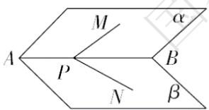

text_image

A
M
α
P
B
N
β

# 三、问答题（共3题）

3.【问答题】如图，在四棱锥 $P - ABCD$ 中， $PA \perp$ 底面ABCD，底面ABCD为梯形， $AB \parallel CD$ ，且 $CD = 2AB$ . 若 $E$ 为线段 $PC$ 上一点，试确定点 $E$ 的位置，使得平面EBD⊥平面ABCD，并说明理由.

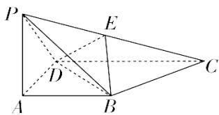

text_image

Geometric diagram of a triangular pyramid with labeled vertices and internal points, including dashed lines indicating hidden edges.

4.【问答题】如图，正方体 $ABCD-A_{1}B_{1}C_{1}D_{1}$ 中，E是 $AA_{1}$ 的中点，求证：平面 $C_{1}BD\perp$ 平面BDE.

text_image

D₁
A₁ B₁ C₁
E D C
A B

5.【问答题】如图，已知直线 $a \perp$ 平面 $\alpha$ ，直线 $a \parallel$ 平面 $\beta$ 。求证：平面 $\alpha \perp$ 平面 $\beta$ 。

text_image

α
a
β

# 高中 数学 必修 第二册

# 第八章 立体几何初步 小结

# 一、单选题（共1题）

1.【单选题】如图，在棱长为1的正方体ABCD-

$A_{1}B_{1}C_{1}D_{1}$ 中，M为棱AB的中点，动点P在侧面 $BCC_{1}B_{1}$ 及其边界上运动，总有 $AP\perp D_{1}M$ ，则动点P的轨迹的长度为（）

text_image

D₁
C₁
A₁
B₁
D
C
A
M
B

A. $\frac{\sqrt{2}}{2}$   
B. $\frac{\sqrt{5}}{2}$   
C. $\frac{\pi}{16}$   
D. $\frac{\sqrt{3}}{2}$

# 二、填空题（共1题）

2.【填空题】在正三棱柱 $ABC-A_{1}B_{1}C_{1}$ 中，D是AB的中点，则在所有的棱中与直线CD和 $AA_{1}$ 都垂直的棱有\_\_\_\_.

# 三、复合题（共1题）

3.【复合题】如图，已知 $\triangle BCD$

中， $\angle BCD = 90^{\circ}$ ， $BC = CD = 1$ ， $AB \perp$ 平面 $BCD$ ， $\angle ADB = 60^{\circ}$ ， $E$ 、 $F$ 分别是 $AC$ 、 $AD$ 上的动点，且 $\frac{AE}{AC} = \frac{AF}{AD} = \lambda (0 < \lambda < 1)$

(1)【问答题】求证：不论 $\lambda$ 为何值，总有 $EF \perp$ 平面 $ABC$   
(2)【问答题】若 $\lambda = \frac{1}{2}$ , 求三棱锥 $A - BEF$ 的体积.

# 四、问答题（共2题）

4. 【问答题】如图，已知平面 $\alpha \cap$ 平面 $\beta = l, EA \perp \alpha$ ，垂足为点 $A, EB \perp \beta$ ，垂足为点 $A$ ，直线 $a \subset \beta, a \perp AB,$ 求证： $l // a$

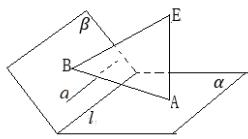

5.【问答题】如图，ABCD为正方形，SA⊥平面ABCD, 过A作垂直于SC的平面交SB、SC、SD分别于E、F、G，求证：AE⊥SB

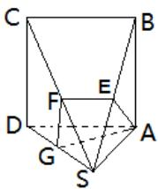

text_image

C
B
F
E
D
G
S
A

# 高中 数学 必修 第二册

# 第八章 立体几何初步 小结

# 一、单选题（共2题）

1.【单选题】如图，在四棱锥P-ABCD中， $\angle ABC=\angle BAD=90^{\circ}$ ，BC=2AD， $\triangle PAB$ 和 $\triangle PAD$ 都是等边三角形，则异面直线CD与PB所成角的大小为（）

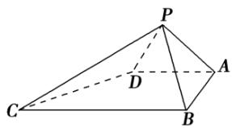

text_image

Geometric diagram of a pyramid with labeled vertices and internal points

A. $90^{\circ}$   
B. $75^{\circ}$   
C. $60^{\circ}$   
D. $45^{\circ}$

2.【单选题】正四棱柱 $ABCD-A_{1}B_{1}C_{1}D_{1}$ 中， $AA_{1}=2AB$ ，则CD与平面 $BDC_{1}$ 所成角的正弦值等于( )

A. $\frac{2}{3}$   
B. $\frac{\sqrt{3}}{3}$   
C. $\frac{\sqrt{2}}{3}$   
D. $\frac{1}{3}A$

# 二、问答题（共1题）

3.【问答题】如图，已知 $\square ABCD$ 中， $AB = 3\sqrt{2}$ ， $AD = 2\sqrt{3}$ ， $BD = \sqrt{6}$

，沿BD将其折成一个锐二面角A-BD-C，折后AB⊥CD.求二面角A-BD-C的大小.

# 高中 数学 必修 第二册

# 第八章 立体几何初步 小结

# 一、单选题（共2题）

1.【单选题】下列说法错误的是（）

A. 一个八棱柱有10个面  
B. 任意n面体都可以分割成n个棱锥  
C.棱台侧棱的延长线必相交于一点  
D. 矩形旋转一周一定形成一个圆柱

2.【单选题】长方体的一条对角线与它一个顶点处的三个面所成的角分别为 $\alpha, \beta, \gamma$ ，则（）

A. $cos^2\alpha + cos^2\beta + cos^2\gamma = 2$   
B. $cos^2\alpha + cos^2\beta + cos^2\gamma = \frac{3}{2}$   
C. $\sin^{2}\alpha + \sin^{2}\beta + \sin^{2}\gamma = 2$   
D. $\sin^{2}\alpha + \sin^{2}\beta + \sin^{2}\gamma = \frac{3}{2}$

# 二、填空题（共1题）

3.【填空题】如图， $ABC-A'B'C'$ 是棱长均为1的直三棱柱，则四棱锥 $C-AA'B'B$ 的体积是\_\_\_\_。

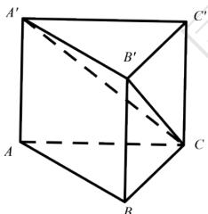

text_image

A'
B'
C'
A
B
C

# 三、复合题（共2题）

4.【复合题】如图，在三棱台ABC-中，平面ACFD⊥平面DBC， $\angle ACB=60^{\circ}$ ， $\angle ACD=45^{\circ}$ ， $AC=\sqrt{2}AD$ 。

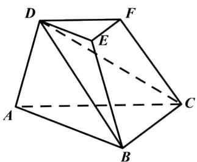

natural_image

Geometric diagram of a polyhedron with labeled vertices A, B, C, D, E, F (no text or symbols present)

(1)【问答题】证明： $AD \perp BC;$   
(2)【问答题】若 $AD=\sqrt{2}BC$ ，求直线DE与平面DBC所成角的正弦值。

5.【复合题】已知圆锥的侧面积等于 $2\pi c_{m}^{2}$ ，其侧面展开图是一个半圆，

(1)【填空题】则该圆锥的表面积为\_\_\_\_ $cm^{2}$ ;   
(2)【填空题】该圆锥内半径最大的球的体积为\_\_\_\_ $c_{m}^{3}$ 。

# 高中 数学 必修 第二册

# 第八章 立体几何初步 小结

# 一、单选题（共2题）

1.【单选题】下列命题正确的是（）

A. 三个点确定一个平面  
B. 一条直线和一个点确定一个平面  
C. 圆心和圆上两点可确定一个平面  
D. 梯形可确定一个平面

2.【单选题】过 $\triangle ABC$ 所在平面 $\alpha$ 外一点 P，作 $PO \perp \alpha$ ,

垂足为O，连接PA，PB，PC．若PA=PB=PC，则点O是△ABC的（）

A. 内心  
B. 外心  
C. 重心  
D. 垂心

# 二、填空题（共1题）

3.【填空题】已知平面 $\alpha,\beta$ 和直线a,b,c，且 $a\parallel b\parallel c,\quad a\subset\alpha,\quad b\subset\beta,\quad c\subset\beta$ ，则 $\alpha$ 与 $\beta$ 的位置关系是\_\_\_\_。

# 三、复合题（共2题）

4.【复合题】如图，在四棱锥P-

ABCD中，底面ABCD为正方形，侧面PAD为正三角形，侧面PAD⊥底面ABCD，M是PD的中点。

text_image

P
M
A
D
B
C

(1)【问答题】求证： $AM \perp$ 平面PCD;  
(2)【问答题】求侧面PBC与底面ABCD所成二面角的余弦值。

5.【复合题】如图，在三棱锥P-ABC中，PC⊥平面ABC，AB⊥BC，D，E分别是AB，PB的中点。

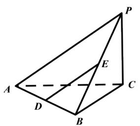

text_image

Geometric diagram of a triangular pyramid with labeled vertices and internal points

求证：

(1)【问答题】DE//平面PAC;   
(2)【问答题】 $AB \perp PB$ 。

# 高中 数学 必修 第二册

# 第八章 立体几何初步 小结

# 一、复合题（共4题）

1.【复合题】如图，在三棱锥A-BCD中，平面ABD⊥平面BCD，AB=AD，O为BD的中点。

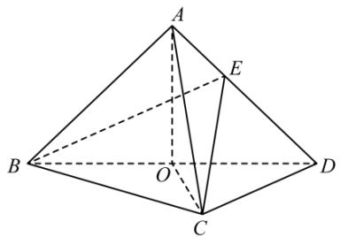

text_image

Geometric diagram of a tetrahedron with labeled vertices A, B, C, D and internal points E, O, showing solid and dashed edges.

(1)【问答题】求证： $OA \perp CD$   
(2)【问答题】若 $\triangle OCD$ 是边长为1的等边三角形，点 $E$ 在棱 $AD$ 上， $DE=2EA$ ，且二面角 $E-BC-D$ 的大小为 $45^{\circ}$ ，求三棱锥 $A-BCD$ 的体积。

2.【复合题】如图，在矩形ABCD中， $AB=\sqrt{2}$ ，BC=2，E为BC的中点，把△ABE和△CDE分别沿AE，DE折起，使点B与点C重合于点P。

text_image

P
D
C
E
A
B

(1)【问答题】求证：平面 $PDE \perp$ 平面PAD;  
(2)【问答题】求二面角P - AD - E的大小。

3.【复合题】如图，在梯形ABCD中， $AB \parallel CD$ ， $AD = DC = CB = a$ ， $\angle ABC = 60^{\circ}$ ，平面ACEF⊥平面ABCD，四边形ACEF是矩形。

text_image

Geometric diagram of a polyhedron with labeled vertices and internal points, used for spatial geometry problems.

(1)【问答题】求证： $BC \perp$ 平面ACEF;  
(2)【问答题】在线段EF上是否存在点M，使得AM//平面BDE？若存在，求出FM的长；若不存在，请说明理由。

4.【复合题】如图，在四面体ABCD中， $\triangle ABC$ 是等边三角形，平面 $ABC \perp$ 平面ABD，M为棱AB的中点，AB = 2， $AD = 2\sqrt{3}$ ， $\angle BAD = 90^{\circ}$ 。

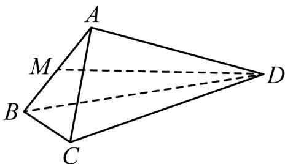

text_image

A
M
B
C
D

(1)【问答题】求证： $AD \perp BC;$   
(2)【问答题】求异面直线BC与MD所成角的余弦值;

# 二、问答题（共1题）

5.【问答题】如图，已知ABCD是边长为4的正方形，E，F分别是边AB，AD的中点，GC垂直于ABCD所在平面，且GC=2，求点B到平面EFG的距离。

text_image

Geometric diagram of a parallelogram with labeled vertices and internal points, used for spatial geometry problems.

