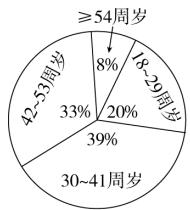
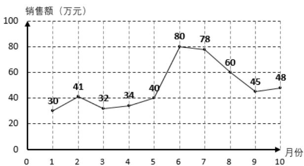
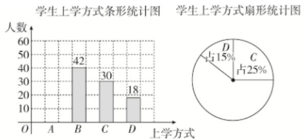
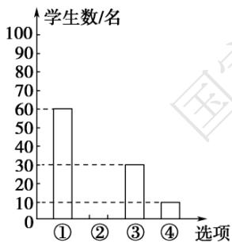
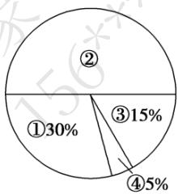

# 高中 数学 必修 第二册

# 第九章 统计 9.2 用样本估计总体

# 9.2.1总体取值规律的估计

# 一、单选题（共2题）

1. 【单选题】某保险公司为客户定制了5个险种：甲，一年期短险；乙，两全保险；丙，理财类保险；丁，定期寿险；戊，重大疾病保险，各种保险按相关约定进行参保与理赔。该保险公司对5个险种参保客户进行抽样调查，得出如下的统计图例，以下四个选项错误的是（）

pie

| Age Group | Percentage (%) |
|---|---|
| ≥54周岁 | 8 |
| 18~29周岁 | 20 |
| 30~41周岁 | 39 |
| 42~53周岁 | 33 |
| ≥54周岁 | 8 |

参保人数比例

line

| 岁龄 | 年龄 | 单位: 元 |
| :--- | :--- | :--- |
| 18~29 | | 4000 |
| 30~41 | | 4500 |
| 42~53 | | 5500 |
| 54~以上 | | 6000 |

不同年龄段人均参保费用

bar

| 险种 | 比例 |
|---|---|
| 甲 | 0.01 |
| 乙 | 0.02 |
| 丙 | 0.09 |
| 丁 | 0.55 |
| 戊 | 0.33 |

参保险种比例

A. 54周岁以上参保人数最少  
B. 丁险种更受参保人青睐  
C. 30周岁以上的人群约占参保人群的80%  
D. 18～29周岁人群参保总费用最少

2.【单选题】如图是某公司2021年1月到10月的销售额(单位：万元)的折线图，销售额在35万元以下为亏损，超过35万元为盈利，则下列说法错误的是（）

line

| 月份 | 销售额（万元） |
| ---- | -------------- |
| 1    | 30             |
| 2    | 41             |
| 3    | 32             |
| 4    | 34             |
| 5    | 40             |
| 6    | 80             |
| 7    | 78             |
| 8    | 60             |
| 9    | 45             |
| 10   | 48             |

A. 这10个月中销售额最低的是1月份

B. 从1月到6月销售额逐渐增加  
C. 这10个月中有3个月是亏损的  
D. 这10个月销售额的中位数是43万元

# 二、填空题（共1题）

3.【填空题】某学校为了了解本校学生的上学方式,在全校范围内随机抽查部分学生,了解到上学方式主要有:A—结伴步行,B—自行乘车,C—家人接送,D—

其他方式. 并将收集的数据整理绘制成如下两幅不完整的统计图. 根据图中信息, 本次抽查的学生中A类人数是\_\_\_\_.

bar

学生上学方式条形统计图 学生上学方式扇形统计图
| 上学方式 | 人数 |
| :--- | :--- |
| A | 42 |
| B | 30 |
| C | 18 |
学生上学方式条形统计图 学生上学方式扇形统计图
| 图例 | 
| 占 | 
| D | 15% |
| C | 25% |

# 三、复合题（共1题）

4.【复合题】为了了解学生参加体育活动的情况，学校对学生进行随机抽样调查，其中一个问题是“你平均每天参加体育活动的时间是多少？”，共有4个选项：①1.5小时以上；②1～1.5小时；③0.5～1小时；④0.5小时以下．下图是根据调查结果绘制的两幅不完整的统计图，请你根据统计图提供的信息解答以下问题：

bar

| 选项 | 学生数/名 |
|---|---|
| ① | 60 |
| ② | 30 |
| ③ | 10 |

pie

| Category | Percentage (%) |
|---|---|
| ① | 30 |
| ② | 15 |
| ③ | 5 |
The chart is divided into four segments with no explicit numerical labels. The percentages are explicitly labeled on each slice: ① (30%), ② (15%), ③ (5%), and ④ (5%). There is no additional data series or axis labels visible.

图(1)  
图(2)

(1)【问答题】本次一共调查了多少名学生？  
(2)【问答题】在图(1)中将②对应的部分补充完整;  
(3)【问答题】若该校有3000名学生，试估计全校学生平均每天参加体育活动的时间在0.5小时以下的人数.