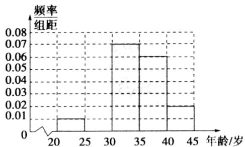

# 高中 数学 必修 第二册

# 第九章 统计 9.2 用样本估计总体

# 9.2.2总体百分位数的估计

# 一、单选题（共1题）

1.【单选题】已知甲、乙两组数据（已按从小到大的顺序排列）：

甲组：27、28、39、40、 $m$ 、50；乙组：24、 $n$

、34、43、48、52. 若这两组数据的第30百分位数、第80百分位数分别相等，则 $\frac{m}{n}$ 等于（）

A. $\frac{12}{7}$   
B. $\frac{10}{7}$   
C. $\frac{4}{3}$   
D. $\frac{7}{4}$

# 二、填空题（共2题）

2.【填空题】5,6,7,8,9,10,11,12,13,14的25%分位数为\_\_\_\_，75%分位数为\_\_\_\_，90%分位数为\_\_\_\_。  
3.【填空题】某校100名学生的数学测试成绩频率分布直方图如图所示，分数不低于a(a为整数)即为优秀，如果优秀的人数为20人，则a的估计值是\_\_\_\_。

histogram

| 分数 | 频率/组距 |
|---|---|
| 90-100 | 0.005 |
| 100-110 | 0.018 |
| 110-120 | 0.030 |
| 120-130 | 0.022 |
| 130-140 | 0.015 |
| 140-150 | 0.010 |

# 三、复合题（共1题）

4.【复合题】对某市“四城同创”活动中800名志愿者的年龄抽样调查统计后得到频率分布直方图（如图），但是年龄组为[25,30)的数据不慎丢失，则依据此图可得：

histogram

| 年龄/岁 | 频率/组距 |
| :--- | :--- |
| 20-25 | 0.01 |
| 30-35 | 0.07 |
| 35-40 | 0.06 |
| 40-45 | 0.02 |

(1)【填空题】年龄组为[25,30)对应小矩形的高度为\_\_\_\_；  
(2)【填空题】由频率分布直方图估计志愿者年龄的85%分位数为\_\_\_\_岁（结果保留整数）。