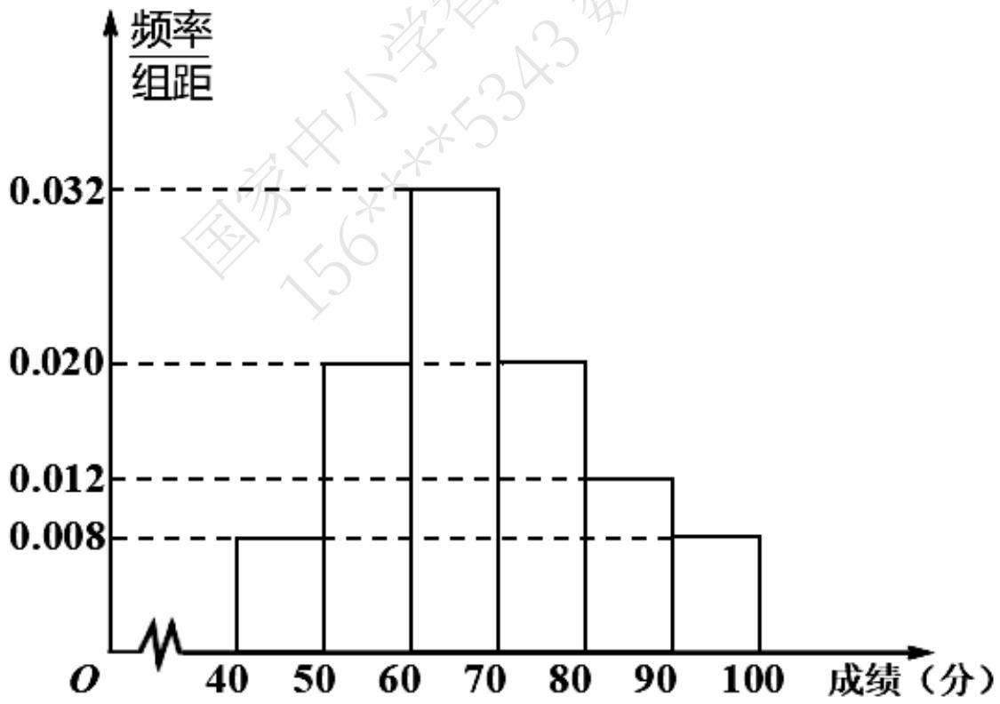

# 高中 数学 必修 第二册

# 第九章 统计 9.2 用样本估计总体

# 9.2.3总体集中趋势的估计

# 一、单选题（共1题）

1.【单选题】对于数据2，6，8，3，3，4，6，8，下列说法中正确的个数为（）

（1）平均数为5；（2）没有众数；（3）没有中位数.

A. 0   
B. 1   
C. 2   
D. 3

# 二、填空题（共2题）

2.【填空题】某校为了解学生体能素质，随机抽取了50名学生，进行体能测试，并将这50名学生成绩整理得如下频率分布直方图，根据此频率分布直方图，

histogram

| 成绩 (分) | 频率/组距 |
| --------- | --------- |
| 40-50     | 0.008     |
| 50-60     | 0.020     |
| 60-70     | 0.032     |
| 70-80     | 0.020     |
| 80-90     | 0.012     |
| 90-100    | 0.008     |

有下列5个结论：

（1）这50名学生中成绩在[80, 100]内的人数占比为20%;  
(2) 这50名学生中成绩在[60, 80)内的人数有26人;

（3）这50名学生成绩的中位数为70；  
（4）这50名学生成绩的众数为65；  
(5) 这50名学生的平均成绩 $\bar{x} = 68.2$ (同一组中的数据用该组区间的中点值做代表)。其中正确的序号是\_\_\_\_。

3.【填空题】已知一组数据a，b，3，5的中位数为7，平均数为8，则ab=\_\_\_\_。