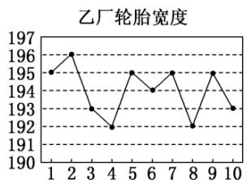

# 高中 数学 必修 第二册

# 第九章 统计 9.2 用样本估计总体

# 9.2.4总体离散程度的估计

# 一、单选题（共1题）

1. 【单选题】演讲比赛共有9位评委分别给出某位选手的原始评分，评定该选手的成绩时，从9个原始评分中去掉一个最高分、1个最低分，得到7个有效评分。7个有效评分与9个原始评分相比，不变的数字特征是（）

A. 中位数  
B. 平均数  
C. 方差  
D. 极差

# 二、填空题（共2题）

2.【填空题】已知一组数据 $x_{1},x_{2},x_{3},\ldots,x_{n}$ 的平均数为 $\bar{x}$ ，方差为 $S^{2}$ .若 $3_{x_{1}}+1,3_{x_{2}}+1,3_{x_{3}}+1,\ldots,3_{x_{n}}+1$ 的平均数比方差大4，则 $S^{2}-\bar{x}^{2}$ 的最大值为\_\_\_\_。  
3.【填空题】某工厂年前加紧手套生产，设该工厂连续5天生产的手套数依次为 $x_{1}$ ， $x_{2}$ ， $x_{3}$ ， $x_{4}$ ， $x_{5}$ （单位：万只），若这组数据 $x_{1}$ ， $x_{2}$ ， $x_{3}$ ， $x_{4}$ ， $x_{5}$ 的方差为1.44，且 $x_{1}^{2}$ ， $x_{2}^{2}$ ， $x_{3}^{2}$ ， $x_{4}^{2}$ ， $x_{5}^{2}$ 的平均数为4，则该工厂这5天平均每天生产手套\_\_\_\_万只.

# 三、复合题（共2题）

4. 【复合题】从某企业生产的某种产品中抽取100件，测量这些产品的一项质量指标值，由测量表得如下频数分布表：

<table><tr><td>质量指标值分组</td><td>[75, 85)</td><td>[85, 95)</td><td>[95, 105)</td><td>[105, 115)</td><td>[115, 125)</td></tr><tr><td>频数</td><td>6</td><td>26</td><td>38</td><td>22</td><td>8</td></tr></table>

(1)【问答题】估计这种产品质量指标值的方差（同一组中的数据用该组区间的中点值作代表）；  
(2)【问答题】根据以上抽样调查数据，能否认为该企业生产的这种产品符合“质量指标值不低于95的产品至少要占全部产品的80%”的规定？

5.【复合题】为了了解甲、乙两个工厂生产的轮胎的宽度是否达标，从两厂各随机选取了10个轮胎，将每个轮胎的宽度(单位：mm)记录下来并绘制出如下的折线图：

line

甲厂轮胎宽度
| Month | 宽度 (mm) |
|---|---|
| 1 | 195.0 |
| 2 | 194.0 |
| 3 | 196.0 |
| 4 | 193.0 |
| 5 | 194.0 |
| 6 | 197.0 |
| 7 | 196.0 |
| 8 | 195.0 |
| 9 | 193.0 |
| 10 | 197.0 |

line

乙厂轮胎宽度
| Month | 轮胎宽度 |
|---|---|
| 1 | 195 |
| 2 | 196 |
| 3 | 193 |
| 4 | 192 |
| 5 | 195 |
| 6 | 194 |
| 7 | 195 |
| 8 | 192 |
| 9 | 195 |
| 10 | 193 |

(1)【问答题】分别计算甲、乙两厂提供的10个轮胎宽度的平均值;  
(2)【问答题】若轮胎的宽度在[194, 196]内，则称这个轮胎是标准轮胎。试比较甲、乙两厂分别提供的10个轮胎中所有标准轮胎宽度的方差的大小，根据两厂的标准轮胎宽度的平均水平及其波动情况，判断这两个工厂哪个的轮胎相对更好。