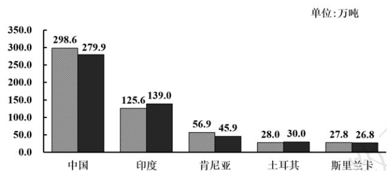

# 高中 数学 必修 第二册

# 第九章 统计 9.3 统计案例

# 公司员工的肥胖情况调查分析

# 一、单选题（共1题）

1.【单选题】茶叶源于中国，至今中国仍然是茶叶最大生产国，下图为2019-2020年全球主要茶叶生产国调查数据，根据该图，下列结论中不正确的是（）

2019-2020年全球主要茶叶生产国产量分布

bar

| 国家 | 数值 (万吨) |
| :--- | :--- |
| 中国 | 298.6 |
| 中国 | 279.9 |
| 印度 | 125.6 |
| 印度 | 139.0 |
| 肯尼亚 | 56.9 |
| 肯尼亚 | 45.9 |
| 土耳其 | 28.0 |
| 土耳其 | 30.0 |
| 斯里兰卡 | 27.8 |
| 斯里兰卡 | 26.8 |
单位: 万吨

A. 2019年图中5个国家茶叶产量的中位数为45.9  
B. 2020年图中5个国家茶叶产量比2019年增幅最大的是中国  
C. 2020年图中5个国家茶叶总产量超过2019年  
D. 2020年中国茶叶产量超过其他4个国家之和

# 二、复合题（共2题）

2.【复合题】某公司计划购买1台机器，该种机器使用三年后即被淘汰。机器有一易损零件，在购进机器时，可以额外购买这种零件作为备件，每个200元．在机器使用期间，如果备件不足再购买，则每个500元．现需决策在购买机器时应同时购买几个易损零件，为此搜集并整理了1100台这种机器在三年使用期内更换的易损零件数，得下面柱状图：

histogram

| 更换的易损零件数 | 频数 |
| :--- | :--- |
| 16 | 6 |
| 17 | 16 |
| 18 | 24 |
| 19 | 24 |
| 20 | 20 |
| 21 | 10 |

记x表示1台机器在三年使用期内需更换的易损零件数，y

表示1台机器在购买易损零件上所需的费用（单位：元），n

表示购机的同时购买的易损零件数。

(1)【问答题】若n=19，求y与x的函数解析式；

(2)【问答题】假设这100台机器在购机的同时每台都购买18个易损零件，或每台都购买19个易损零件，分别计算这100台机器在购买易损零件上所需费用的平均数，以此作为决策依据，购买1台机器的同时应购买18个还是19个易损零件？

3. 【复合题】某厂研制了一种生产高精产品的设备，为检验新设备生产产品的某项指标有无提高，用一台旧设备和一台新设备各生产了10件产品，得到各件产品该项指标数据如下：

<table><tr><td>旧设备</td><td>9.8</td><td>10.3</td><td>10.0</td><td>10.2</td><td>9.9</td><td>9.8</td><td>10.0</td><td>10.1</td><td>10.2</td><td>9.7</td></tr><tr><td>新设备</td><td>10.1</td><td>10.4</td><td>10.1</td><td>10.0</td><td>10.1</td><td>10.3</td><td>10.6</td><td>10.5</td><td>10.4</td><td>10.5</td></tr></table>

旧设备和新设备生产产品的该项指标的样本平均数分别记为 $\overline{x}$ 和 $\overline{y}$ ，样本方差分别记为 $s_1^2$ 和 $s_2^2$ 。

(1)【问答题】求 $\bar{x}$ ， $\bar{y}$ ， $s_{1}^{2}$ ， $s_{2}^{2}$ ;  
(2)【问答题】判断新设备生产产品的该项指标的均值较旧设备是否有显著提高（如果 $\bar{y}-\bar{x}\geq2\sqrt{\frac{s_{1}2+s_{2}2}{10}}$

，则认为新设备生产产品的该项指标的均值较旧设备有显著提高，否则不认为有显著提高）。