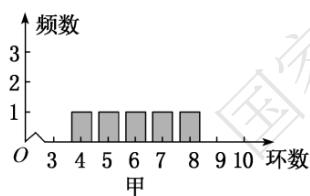
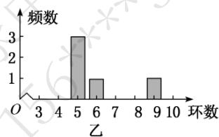

# 高中 数学 必修 第二册

# 第九章 统计 小结

# 一、单选题（共2题）

1.【单选题】某学校在举行的“新冠肺炎抗疫知识竞答”活动中，随机抽取了30名学生，统计了他们的测试成绩（单位：分），并得到如下表所示的数据，设这30名学生的测试成绩的中位数为m，众数为n，平均数为 $\bar{x}$ ，则（）

<table><tr><td>测试成绩(分)</td><td>40</td><td>50</td><td>60</td><td>70</td><td>80</td><td>90</td><td>100</td></tr><tr><td>人数</td><td>1</td><td>1</td><td>1</td><td>2</td><td>10</td><td>9</td><td>6</td></tr></table>

A. $\frac{m+n}{2}>\bar{x}$   
B. $\frac{m+n}{2}<\bar{x}$   
C. $\frac{m+n}{2}=\bar{x}$   
D. $m < \bar{x}$

2.【单选题】甲、乙两人在一次射击比赛中各射靶5次，两人成绩的条形计图如图所示，则( )

bar

| 环数 | 频数 |
| ---- | ---- |
| 0    | 0    |
| 3    | 0    |
| 4    | 1    |
| 5    | 1    |
| 6    | 1    |
| 7    | 1    |
| 8    | 1    |
| 9    | 0    |
| 10   | 0    |

bar

| 环数 | 频数 |
|---|---|
| 3 | 0 |
| 4 | 0 |
| 5 | 3 |
| 6 | 1 |
| 7 | 0 |
| 8 | 0 |
| 9 | 1 |
| 10 | 0 |

A. 甲的成绩的平均数小于乙的成绩的平均数  
B. 甲的成绩的中位数等于乙的成绩的中位数  
C. 甲的成绩的方差小于乙的成绩的方差  
D. 甲的成绩的极差小于乙的成绩的极差

# 二、填空题（共1题）

3.【填空题】在某地区某高传染性病毒流行期间，为了建立指标显示疫情已受控制，以便向该地区居民显示可以过正常生活，有公共卫生专家建议的指标是“连续7天每天新增感染人数不超过5人”，根据连续7天的新增病例数计算，下列各个选项中，一定符合上述指标的是\_\_\_\_。

(1) 平均数 $\bar{x} \leq 3$ ;

(2) 标准差 $S \leq 2$ ;  
(3) 平均数 $\bar{x} \leq 3$ 且标准差 $S \leq 2$ ;  
(4) 平均数 $\bar{x} \leq 3$ 且极差小于或等于2;  
(5)众数等于1且极差小于或等于4。

# 三、复合题（共1题）

4.【复合题】为了监控某种零件的一条生产线的生产过程，检验员每隔30

min从该生产线上随机抽取一个零件，并测量其尺寸（单位：cm）。下面是检验员在一天内依次抽取的16个零件的尺寸：

<table><tr><td>抽取次序</td><td>1</td><td>2</td><td>3</td><td>4</td><td>5</td><td>6</td><td>7</td><td>8</td></tr><tr><td>零件尺寸</td><td>9.95</td><td>10.12</td><td>9.96</td><td>9.96</td><td>10.01</td><td>9.92</td><td>9.98</td><td>10.04</td></tr><tr><td>抽取次序</td><td>9</td><td>10</td><td>11</td><td>12</td><td>13</td><td>14</td><td>15</td><td>16</td></tr><tr><td>零件尺寸</td><td>10.26</td><td>9.91</td><td>10.13</td><td>10.02</td><td>9.22</td><td>10.04</td><td>10.05</td><td>9.95</td></tr></table>

经计算得 $\overline{x} = \frac{1}{16}\sum_{i = 1}^{16}x_i = 9.97$ ， $s = \sqrt{\frac{1}{16}\sum_{i = 1}^{16}(x_i - \overline{x})^2} = \sqrt{\frac{1}{16}\sum_{i = 1}^{16}(x_i^2 -16\overline{x})^2}\approx 0.212$ ，其中

为抽取的第个零件的尺寸， $i=1,2,\ldots,16$ 。一天内抽检零件中，如果出现了尺寸在 $(\bar{x}-3s,\bar{x}+3s)$ 之外的零件，就认为这条生产线在这一天的生产过程可能出现了异常情况，需对当天的生产过程进行检查。

(1)【问答题】从这一天抽检的结果看，是否需对当天的生产过程进行检查？  
(2)【问答题】在 $(\bar{x}-3s,\bar{x}+3s)$   
之外的数据称为离群值，试剔除离群值，估计这条生产线当天生产的零件尺寸的均值与标准差。（精确到0.01）  
附： $\sqrt{0.008} \approx 0.09$ .