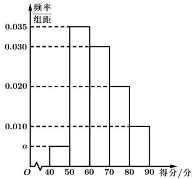
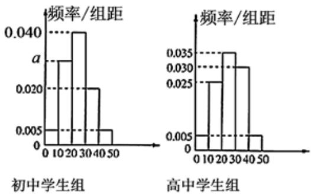
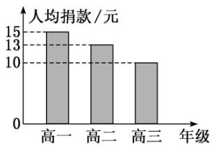
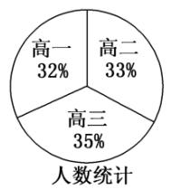
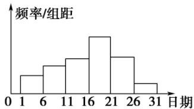
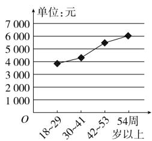
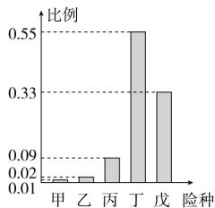
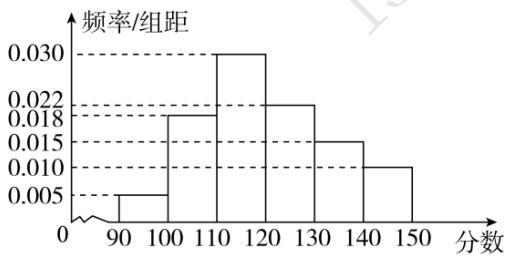
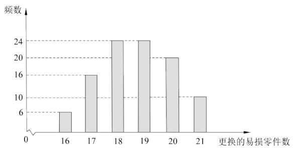

# 高中 数学 必修 第二册

# 第九章 统计 9.1 随机抽样

# 9.1.1简单随机抽样

# 一、填空题（共1题）

1.【填空题】已知下列抽样的方式：

（1）从无限多个个体中抽取100个个体作为样本；  
(2) 从20件玩具中一次性地抽取3件进行质量检验;  
（3）某班有54名同学，指定个子最高的5名同学参加学校组织的篮球赛；  
(4) 一彩民选号, 从装有36个大小、形状都相同的号签的盒子中无放回地逐个抽出6个号签. 其中, 不是简单随机抽样的序号是\_\_\_\_。

# 二、复合题（共1题）

2.【复合题】某市质监局要检查某公司某个时间段生产的500克袋装牛奶的质量是否达标，现从500袋牛奶中抽取10袋进行检验。

(1)【问答题】利用随机数法抽取样本时，应如何操作？  
(2)【问答题】如果用随机数学工具生成部分随机数如下所示，据此写出应抽取的袋装牛奶的编号。  
162, 277, 943, 949, 545, 354, 821, 737, 932, 354, 873, 520, 964, 384, 263, 491, 648, 642, 175, 331, 572, 455, 068, 877, 047, 447, 672, 172, 065, 025, 834, 216, 337, 663, 013, 785, 916, 955。

# 三、问答题（共1题）

3.【问答题】为了适应新高考改革，尽快推行文理不分科教学，对比目前文理科学生考试情况进行分析，决定从80名文科学生中抽取10人，从300名理科学生中抽取50人进行分析，你能选择合适的方法设计抽样方案吗？

# 高中 数学 必修 第二册

# 第九章 统计 9.1 随机抽样

# 9.1.1简单随机抽样

# 一、单选题（共2题）

1.【单选题】已知样本 $x_{1}$ ， $x_{2}$ ， $x_{3}$ ， $\cdots$ ， $xn$ 的平均数为x；样本 $y_{1}$ ， $y_{2}$ ， $y_{3}$ ， $\cdots$

， $y_{m}$ 的平均数为 $y(x \neq y)$ ，若样本 $X_1, X_2, X_3, \cdots, Xn, Y_1, Y_2, Y_3, \cdots$

， $y_{m}$ 的平均数 $z=ax+(1-a)y$ ；其中0<a<，则n， $m(n,m\in\mathbb{N}^{*})$ 的大小关系为（）

A. n=m

B. n > m

C. n < m

D. 不能确定

2.【单选题】设a, b, c的平均数为M, a与b的平均数为N, N与c的平均数为P. 若a>b>c, 则 M 与P的大小关系是（）

A. M=P

B. $M>P$

C. M
<tr><td></td><td>同意</td><td>不同意</td><td>合计</td></tr><tr><td>高一年级</td><td></td><td>2</td><td></td></tr><tr><td>高二年级</td><td></td><td>4</td><td></td></tr><tr><td>高三年级</td><td>1</td><td></td><td></td></tr></table>

# 三、复合题（共1题）

4.【复合题】某单位最近组织了一次健身活动，活动分为登山组和游泳组，且每个职工至多参加了其中一组.在参加活动的职工中，青年人占 $42.5\%$ ，中年人占 $47.5\%$ ，老年人占 $10\%$

登山组的职工占参加活动总人数的 $\frac{1}{4}$

，且该组中，青年人占 $50\%$ ，中年人占 $40\%$ ，老年人占 $10\%$ .为了了解各组不同的年龄层次的职工对本次活动的满意程度，现用分层抽样的方法从参加活动的全体职工中抽取一个容量为200的样本。试确定：

(1)【问答题】游泳组中，青年人、中年人、老年人分别所占的比例；  
(2)【问答题】游泳组中，青年人、中年人、老年人分别应抽取的人数。

# 四、问答题（共1题）

5.【问答题】一个单位有职工500人，其中不到35岁的有125人，35岁至49岁的有280人，50岁及50岁以上的有95人。为了了解这个单位职工与身体状态有关的某项指标，要从中抽取100名职工某项指标作为样本，职工年龄与这项指标有关，应该怎样抽取？

# 高中 数学 必修 第二册

# 第九章 统计 9.1 随机抽样

# 9.1.3 获取数据的途径

# 一、多选题（共1题）

1. 【多选题】某地区公共部门为了调查本地区中学生的吸烟情况，对随机抽出的编号为1-1000的1000名学生进行了调查。调查中使用了两个问题：

问题1：您的编号是否为奇数？

问题2：您是否吸烟？

被调查者随机从设计好的随机装置（内有除颜色外完全相同的白球100个，红球100个）中摸出一个小球，摸出的球再放回袋中，若摸出白球则回答问题1，若摸出红球则回答问题2，共有270人回答“是”，则下述正确的是（）

A. 估计被调查者中约有520人吸烟  
B. 估计约有20人对问题2的回答为 “是”  
C. 估计该地区约有4%的中学生吸烟  
D. 估计该地区约有2%的中学生吸烟

# 二、填空题（共1题）

2.【填空题】某地气象台记录了本地6月份的日最高气温(如下表所示),

<table><tr><td>日最高气温(单位:°C)</td><td>20</td><td>22</td><td>24</td><td>25</td><td>26</td><td>28</td><td>29</td><td>30</td></tr><tr><td>频数</td><td>5</td><td>4</td><td>6</td><td>6</td><td>4</td><td>2</td><td>2</td><td>1</td></tr></table>

气象台获取数据的途径是\_\_\_\_，本地6月份的日最高气温的平均数约为\_\_\_\_℃。

# 三、问答题（共1题）

3.【问答题】选择合适的抽样方法抽样,写出抽样过程。

(1)30个篮球, 其中甲厂生产的有21个, 乙厂生产的有9个. 抽取10个入样。  
(2)有甲厂生产的30个篮球, 其中一箱21个, 另一箱9个. 抽取3个入样。  
(3)有甲厂生产的300个篮球,抽取10个入样。

# 高中 数学 必修 第二册

# 第九章 统计 9.2 用样本估计总体

# 9.2.1总体取值规律的估计

# 一、多选题（共1题）

1.【多选题】在一次测验中共有500名同学参赛，经过评判，这500名考生的得分都在[40,90]之间，其得分的频率分布直方图如图，则下列结论正确的是（）

histogram

| 得分/分 | 频率/组距 |
| ------- | --------- |
| 40-50   | 0.001     |
| 50-60   | 0.035     |
| 60-70   | 0.030     |
| 70-80   | 0.020     |
| 80-90   | 0.010     |

A. 可求得 $a = 0.005$   
B. 得分在 $[50,60)$ 的同学最多  
C. 得分在 $[60,80)$ 之间的频率为 0.5  
D. 得分在 $[40,60)$ 之间的共有200人

# 二、填空题（共2题）

2. 【填空题】某中学有初中学生1800人，高中学生1200人. 为了解学生本学期课外阅读情况，现采用分层随机抽样的方法，从中抽取了100名学生，先统计了他们的课外阅读时间，然后按初中学生和高中学生分为两组，再将每组学生的阅读时间（单位：h）分为5组：[1,10)，[10,20)，[20,30)，[30,40)，[40,50)

，并分别加以统计，得到如图所示的频率分布直方图，试估计该校所有学生中，阅读时间不小于30h的学生人数为\_\_\_\_。

bar

| 分组 | 频率/组距 (a) | 频率/组距 (b) |
| :--- | :--- | :--- |
| 初中学生组 | 0.040 | 0.025 |
| 初中学生组 | 0.020 | 0.035 |
| 初中学生组 | 0.005 | 0.030 |
| 高中学生组 | 0.005 | 0.005 |
| 高中学生组 | 0.005 | 0.025 |
| 高中学生组 | 0.005 | 0.035 |
| 高中学生组 | 0.005 | 0.030 |
| 高中学生组 | 0.005 | 0.005 |

3.【填空题】如图是根据某中学为地震灾区捐款的情况而制作的统计图。已知该校在校学生3000人，根据统计图计算该校共捐款\_\_\_\_元。

bar

| 年级 | 人均捐款/元 |
|---|---|
| 高一 | 15 |
| 高二 | 13 |
| 高三 | 10 |

# 三、复合题（共2题）

4. 【复合题】在学校开展的综合实践活动中，某班进行了小制作评比，作品上交时间为5月1日至30日，评委会把同学们上交作品的件数按5天一组分组统计，绘制了频率分布直方图(如图所示)．已知从左到右各长方形的高的比为2：3：4：6：4：1，第三组的频数为12，请解答下列问题：

histogram

| 日期 | 频率/组距 |
|---|---|
| 0-1 | 1 |
| 1-6 | 2 |
| 6-11 | 3 |
| 11-16 | 4 |
| 16-21 | 5 |
| 21-26 | 4 |
| 26-31 | 1 |

(1)【问答题】本次活动共有多少件作品参加评比？  
(2)【问答题】哪组上交的作品数最多？有多少件？  
(3)【问答题】经过评比，第四组和第六组分别有10件、2件作品获奖，问这两组哪组获奖率较高？

5.【复合题】某市2021年4月1日～4月30日对空气污染指数的监测数据如下(主要污染物为可吸入颗粒物):

61, 76, 70, 56, 81, 91, 92, 91, 75, 81, 88, 67, 101, 103,

95, 91, 77, 86, 81, 83, 82, 82, 64, 79, 86, 85, 75, 71, 49, 45.

(1)【问答题】作出频率分布直方图;   
(2)【问答题】根据国家标准，污染指数在0～50之间时，空气质量为优；在51～100之间时，为良；在101～150之间时，为轻微污染；在151～200之间时，为轻度污染。

请你依据所给数据和上述标准，对该市的空气质量给出一个简短评价。

# 高中 数学 必修 第二册

# 第九章 统计 9.2 用样本估计总体

# 9.2.1总体取值规律的估计

# 一、单选题（共2题）

1. 【单选题】某保险公司为客户定制了5个险种：甲，一年期短险；乙，两全保险；丙，理财类保险；丁，定期寿险；戊，重大疾病保险，各种保险按相关约定进行参保与理赔。该保险公司对5个险种参保客户进行抽样调查，得出如下的统计图例，以下四个选项错误的是（）

pie

| Age Group | Percentage (%) |
|---|---|
| ≥54周岁 | 8 |
| 18~29周岁 | 20 |
| 30~41周岁 | 39 |
| 42~53周岁 | 33 |
| ≥54周岁 | 8 |

参保人数比例

line

| 岁龄 | 年龄 | 单位: 元 |
| :--- | :--- | :--- |
| 18~29 | | 4000 |
| 30~41 | | 4500 |
| 42~53 | | 5500 |
| 54~以上 | | 6000 |

不同年龄段人均参保费用

bar

| 险种 | 比例 |
|---|---|
| 甲 | 0.01 |
| 乙 | 0.02 |
| 丙 | 0.09 |
| 丁 | 0.55 |
| 戊 | 0.33 |

参保险种比例

A. 54周岁以上参保人数最少  
B. 丁险种更受参保人青睐  
C. 30周岁以上的人群约占参保人群的80%  
D. 18～29周岁人群参保总费用最少

2.【单选题】如图是某公司2021年1月到10月的销售额(单位：万元)的折线图，销售额在35万元以下为亏损，超过35万元为盈利，则下列说法错误的是（）

line

| 月份 | 销售额（万元） |
| ---- | -------------- |
| 1    | 30             |
| 2    | 41             |
| 3    | 32             |
| 4    | 34             |
| 5    | 40             |
| 6    | 80             |
| 7    | 78             |
| 8    | 60             |
| 9    | 45             |
| 10   | 48             |

A. 这10个月中销售额最低的是1月份

B. 从1月到6月销售额逐渐增加  
C. 这10个月中有3个月是亏损的  
D. 这10个月销售额的中位数是43万元

# 二、填空题（共1题）

3.【填空题】某学校为了了解本校学生的上学方式,在全校范围内随机抽查部分学生,了解到上学方式主要有:A—结伴步行,B—自行乘车,C—家人接送,D—

其他方式. 并将收集的数据整理绘制成如下两幅不完整的统计图. 根据图中信息, 本次抽查的学生中A类人数是\_\_\_\_.

bar

学生上学方式条形统计图 学生上学方式扇形统计图
| 上学方式 | 人数 |
|---|---|
| A | 42 |
| B | 30 |
| C | 18 |
D
占15%
C
占25%

# 三、复合题（共1题）

4.【复合题】为了了解学生参加体育活动的情况，学校对学生进行随机抽样调查，其中一个问题是“你平均每天参加体育活动的时间是多少？”，共有4个选项：①1.5小时以上；②1～1.5小时；③0.5～1小时；④0.5小时以下．下图是根据调查结果绘制的两幅不完整的统计图，请你根据统计图提供的信息解答以下问题：

bar

| 选项 | 学生数/名 |
|---|---|
| ① | 60 |
| ② | 30 |
| ③ | 10 |

pie

| Category | Percentage (%) |
|---|---|
| ① | 30 |
| ② | 15 |
| ③ | 5 |
The chart is divided into four segments with no explicit numerical labels. The percentages are explicitly labeled on each slice: ① (30%), ② (15%), ③ (5%), and ④ (5%). There is no additional data series or axis labels visible.

图(1)  
图(2)

(1)【问答题】本次一共调查了多少名学生？  
(2)【问答题】在图(1)中将②对应的部分补充完整;  
(3)【问答题】若该校有3000名学生，试估计全校学生平均每天参加体育活动的时间在0.5小时以下的人数.

# 高中 数学 必修 第二册

# 第九章 统计 9.2 用样本估计总体

# 9.2.2总体百分位数的估计

# 一、单选题（共1题）

1.【单选题】已知甲、乙两组数据（已按从小到大的顺序排列）：

甲组：27、28、39、40、 $m$ 、50；乙组：24、 $n$

、34、43、48、52. 若这两组数据的第30百分位数、第80百分位数分别相等，则 $\frac{m}{n}$ 等于（）

A. $\frac{12}{7}$   
B. $\frac{10}{7}$   
C. $\frac{4}{3}$   
D. $\frac{7}{4}$

# 二、填空题（共2题）

2.【填空题】5,6,7,8,9,10,11,12,13,14的25%分位数为\_\_\_\_，75%分位数为\_\_\_\_，90%分位数为\_\_\_\_。  
3.【填空题】某校100名学生的数学测试成绩频率分布直方图如图所示，分数不低于a(a为整数)即为优秀，如果优秀的人数为20人，则a的估计值是\_\_\_\_。

histogram

| 分数 | 频率/组距 |
|---|---|
| 90-100 | 0.005 |
| 100-110 | 0.018 |
| 110-120 | 0.030 |
| 120-130 | 0.022 |
| 130-140 | 0.015 |
| 140-150 | 0.010 |

# 三、复合题（共1题）

4.【复合题】对某市“四城同创”活动中800名志愿者的年龄抽样调查统计后得到频率分布直方图（如图），但是年龄组为[25,30)的数据不慎丢失，则依据此图可得：

histogram

| 年龄/岁 | 频率/组距 |
| :--- | :--- |
| 20 | 0.01 |
| 25 | 0.01 |
| 30 | 0.07 |
| 35 | 0.06 |
| 40 | 0.02 |
| 45 | 0.02 |

(1)【填空题】年龄组为[25,30)对应小矩形的高度为\_\_\_\_；  
(2)【填空题】由频率分布直方图估计志愿者年龄的85%分位数为\_\_\_\_岁（结果保留整数）。

# 高中 数学 必修 第二册

# 第九章 统计 9.2 用样本估计总体

# 9.2.3总体集中趋势的估计

# 一、单选题（共1题）

1.【单选题】对于数据2，6，8，3，3，4，6，8，下列说法中正确的个数为（）

（1）平均数为5；（2）没有众数；（3）没有中位数.

A. 0   
B. 1   
C. 2   
D. 3

# 二、填空题（共2题）

2.【填空题】某校为了解学生体能素质，随机抽取了50名学生，进行体能测试，并将这50名学生成绩整理得如下频率分布直方图，根据此频率分布直方图，

histogram

| 成绩 (分) | 频率/组距 |
| --------- | --------- |
| 40-50     | 0.008     |
| 50-60     | 0.020     |
| 60-70     | 0.032     |
| 70-80     | 0.020     |
| 80-90     | 0.012     |
| 90-100    | 0.008     |

有下列5个结论：

（1）这50名学生中成绩在[80, 100]内的人数占比为20%;  
(2) 这50名学生中成绩在[60, 80)内的人数有26人;

（3）这50名学生成绩的中位数为70；  
（4）这50名学生成绩的众数为65；  
(5) 这50名学生的平均成绩 $\bar{x} = 68.2$ (同一组中的数据用该组区间的中点值做代表)。其中正确的序号是\_\_\_\_。

3.【填空题】已知一组数据a，b，3，5的中位数为7，平均数为8，则ab=\_\_\_\_。

# 高中 数学 必修 第二册

# 第九章 统计 9.2 用样本估计总体

# 9.2.4总体离散程度的估计

# 一、单选题（共1题）

1. 【单选题】演讲比赛共有9位评委分别给出某位选手的原始评分，评定该选手的成绩时，从9个原始评分中去掉一个最高分、1个最低分，得到7个有效评分。7个有效评分与9个原始评分相比，不变的数字特征是（）

A. 中位数  
B. 平均数  
C. 方差  
D. 极差

# 二、填空题（共2题）

2.【填空题】已知一组数据 $x_{1},x_{2},x_{3},\ldots,x_{n}$ 的平均数为 $\bar{x}$ ，方差为 $S^{2}$ .若 $3_{x_{1}}+1,3_{x_{2}}+1,3_{x_{3}}+1,\ldots,3_{x_{n}}+1$ 的平均数比方差大4，则 $S^{2}-\bar{x}^{2}$ 的最大值为\_\_\_\_。  
3.【填空题】某工厂年前加紧手套生产，设该工厂连续5天生产的手套数依次为 $x_{1}$ ， $x_{2}$ ， $x_{3}$ ， $x_{4}$ ， $x_{5}$ （单位：万只），若这组数据 $x_{1}$ ， $x_{2}$ ， $x_{3}$ ， $x_{4}$ ， $x_{5}$ 的方差为1.44，且 $x_{1}^{2}$ ， $x_{2}^{2}$ ， $x_{3}^{2}$ ， $x_{4}^{2}$ ， $x_{5}^{2}$ 的平均数为4，则该工厂这5天平均每天生产手套\_\_\_\_万只.

# 三、复合题（共2题）

4. 【复合题】从某企业生产的某种产品中抽取100件，测量这些产品的一项质量指标值，由测量表得如下频数分布表：

<table><tr><td>质量指标值分组</td><td>[75, 85)</td><td>[85, 95)</td><td>[95, 105)</td><td>[105, 115)</td><td>[115, 125)</td></tr><tr><td>频数</td><td>6</td><td>26</td><td>38</td><td>22</td><td>8</td></tr></table>

(1)【问答题】估计这种产品质量指标值的方差（同一组中的数据用该组区间的中点值作代表）；  
(2)【问答题】根据以上抽样调查数据，能否认为该企业生产的这种产品符合“质量指标值不低于95的产品至少要占全部产品的80%”的规定？

5.【复合题】为了了解甲、乙两个工厂生产的轮胎的宽度是否达标，从两厂各随机选取了10个轮胎，将每个轮胎的宽度(单位：mm)记录下来并绘制出如下的折线图：

line

甲厂轮胎宽度
| Month | 宽度 (mm) |
|---|---|
| 1 | 195.0 |
| 2 | 194.0 |
| 3 | 196.0 |
| 4 | 193.0 |
| 5 | 194.0 |
| 6 | 197.0 |
| 7 | 196.0 |
| 8 | 195.0 |
| 9 | 193.0 |
| 10 | 197.0 |

line

乙厂轮胎宽度
| Month | 轮胎宽度 |
|---|---|
| 1 | 195 |
| 2 | 196 |
| 3 | 193 |
| 4 | 192 |
| 5 | 195 |
| 6 | 194 |
| 7 | 195 |
| 8 | 192 |
| 9 | 195 |
| 10 | 193 |

(1)【问答题】分别计算甲、乙两厂提供的10个轮胎宽度的平均值;  
(2)【问答题】若轮胎的宽度在[194, 196]内，则称这个轮胎是标准轮胎。试比较甲、乙两厂分别提供的10个轮胎中所有标准轮胎宽度的方差的大小，根据两厂的标准轮胎宽度的平均水平及其波动情况，判断这两个工厂哪个的轮胎相对更好。

# 高中 数学 必修 第二册

# 第九章 统计 9.3 统计案例

# 公司员工的肥胖情况调查分析

# 一、单选题（共1题）

1.【单选题】茶叶源于中国，至今中国仍然是茶叶最大生产国，下图为2019-2020年全球主要茶叶生产国调查数据，根据该图，下列结论中不正确的是（）

2019-2020年全球主要茶叶生产国产量分布

bar

| 国家 | 数值 (万吨) |
| :--- | :--- |
| 中国 | 298.6 |
| 中国 | 279.9 |
| 印度 | 125.6 |
| 印度 | 139.0 |
| 肯尼亚 | 56.9 |
| 肯尼亚 | 45.9 |
| 土耳其 | 28.0 |
| 土耳其 | 30.0 |
| 斯里兰卡 | 27.8 |
| 斯里兰卡 | 26.8 |
单位: 万吨

A. 2019年图中5个国家茶叶产量的中位数为45.9  
B. 2020年图中5个国家茶叶产量比2019年增幅最大的是中国  
C. 2020年图中5个国家茶叶总产量超过2019年  
D. 2020年中国茶叶产量超过其他4个国家之和

# 二、复合题（共2题）

2.【复合题】某公司计划购买1台机器，该种机器使用三年后即被淘汰。机器有一易损零件，在购进机器时，可以额外购买这种零件作为备件，每个200元．在机器使用期间，如果备件不足再购买，则每个500元．现需决策在购买机器时应同时购买几个易损零件，为此搜集并整理了1100台这种机器在三年使用期内更换的易损零件数，得下面柱状图：

histogram

| 更换的易损零件数 | 频数 |
| :--- | :--- |
| 16 | 6 |
| 17 | 16 |
| 18 | 24 |
| 19 | 24 |
| 20 | 20 |
| 21 | 10 |

记x表示1台机器在三年使用期内需更换的易损零件数，y

表示1台机器在购买易损零件上所需的费用（单位：元），n

表示购机的同时购买的易损零件数。

(1)【问答题】若n=19，求y与x的函数解析式；

(2)【问答题】假设这100台机器在购机的同时每台都购买18个易损零件，或每台都购买19个易损零件，分别计算这100台机器在购买易损零件上所需费用的平均数，以此作为决策依据，购买1台机器的同时应购买18个还是19个易损零件？

3. 【复合题】某厂研制了一种生产高精产品的设备，为检验新设备生产产品的某项指标有无提高，用一台旧设备和一台新设备各生产了10件产品，得到各件产品该项指标数据如下：

<table><tr><td>旧设备</td><td>9.8</td><td>10.3</td><td>10.0</td><td>10.2</td><td>9.9</td><td>9.8</td><td>10.0</td><td>10.1</td><td>10.2</td><td>9.7</td></tr><tr><td>新设备</td><td>10.1</td><td>10.4</td><td>10.1</td><td>10.0</td><td>10.1</td><td>10.3</td><td>10.6</td><td>10.5</td><td>10.4</td><td>10.5</td></tr></table>

旧设备和新设备生产产品的该项指标的样本平均数分别记为 $\overline{x}$ 和 $\overline{y}$ ，样本方差分别记为 $s_1^2$ 和 $s_2^2$ 。

(1)【问答题】求 $\bar{x}$ ， $\bar{y}$ ， $s_{1}^{2}$ ， $s_{2}^{2}$ ;  
(2)【问答题】判断新设备生产产品的该项指标的均值较旧设备是否有显著提高（如果 $\bar{y}-\bar{x}\geq2\sqrt{\frac{s_{1}2+s_{2}2}{10}}$

，则认为新设备生产产品的该项指标的均值较旧设备有显著提高，否则不认为有显著提高）。

# 高中 数学 必修 第二册

# 第九章 统计 小结

# 一、填空题（共1题）

1.【填空题】某企业三月中旬生产A，B，C三种产品共3000件，根据分层随机抽样的结果，该企业统计员制作了如下的统计表：

<table><tr><td>产品类别</td><td>A</td><td>B</td><td>C</td></tr><tr><td>产品数量/件</td><td rowspan="2"></td><td>1300</td><td rowspan="2"></td></tr><tr><td>样本量</td><td>130</td></tr></table>

由于不小心，表格中A，C产品的有关数据已被污染看不清楚，统计员记得A产品的样本量比C产品的样本量多10.

根据以上信息，可得C产品的数量是\_\_\_\_件。

# 二、复合题（共2题）

2. 【复合题】鱼卷是泉州十大名小吃之一, 不但本地人喜欢, 而且深受外来游客的赞赏。小张从事鱼卷生产和批发多年, 有着不少来自零售商和酒店的客户. 当地的习俗是农历正月不生产鱼卷, 客户正月所需要的鱼卷都会在上一年农历十二月底进行一次性采购。小张把去年年底采购鱼卷的数量 X(单位: 箱) 在

[100, 200) 的客户称为 “熟客”, 并把他们去年采购的数量制成下表:

<table><tr><td>采购量x</td><td>[100, 120)</td><td>[120, 140)</td><td>[140, 160)</td><td>[160, 180)</td><td>[180, 200)</td></tr><tr><td>客户数</td><td>10</td><td>10</td><td>5</td><td>20</td><td>5</td></tr></table>

(1)【问答题】根据表中的数据作出频率分布直方图,并估计采购数在168箱以上(含168箱)的“熟客”人数;

(2)【问答题】若去年年底“熟客”们采购的鱼卷数量占小张去年年底总的销售量的 $\frac{5}{8}$ , 估算小张去年年底总的销售量(同一组中的数据用该组区间的中点值为代表);

(3)【问答题】由于鱼卷受到游客们的青睐, 小张做了一份市场调查, 决定今年年底是否在网上出售鱼卷, 若不在网上出售鱼卷, 则按去年的价格出售, 每箱利润为20元, 预计销售量与去年持平; 若在网上出售鱼卷, 则需把每箱售价下调2至5元, 且每下调m元 $(2 \leq m \leq 5)$ 销售量可增加1000m箱, 求小张今年年底收入Y (单位: 元) 的最大值。

3.【复合题】某学校高一、高二、高三三个年级共有300名教师，为调查他们的备课时间情况，通过分层随机抽样获得了20名教师一周的备课时间（单位：小时），数据如下表：

<table><tr><td>高一年级</td><td>7</td><td>7.5</td><td>8</td><td>8.5</td><td>9</td><td></td><td></td><td></td></tr><tr><td>高二年级</td><td>7</td><td>8</td><td>9</td><td>10</td><td>11</td><td>12</td><td>13</td><td></td></tr><tr><td>高三年级</td><td>6</td><td>6.5</td><td>7</td><td>8.5</td><td>11</td><td>13.5</td><td>17</td><td>18.5</td></tr></table>

(1)【问答题】试求该校高三年级的教师人数;   
(2)【问答题】试估计该校教师一周的平均备课时间。

# 高中 数学 必修 第二册

# 第九章 统计 小结

# 一、单选题（共2题）

1.【单选题】某学校在举行的“新冠肺炎抗疫知识竞答”活动中，随机抽取了30名学生，统计了他们的测试成绩（单位：分），并得到如下表所示的数据，设这30名学生的测试成绩的中位数为m，众数为n，平均数为 $\bar{x}$ ，则（）

<table><tr><td>测试成绩(分)</td><td>40</td><td>50</td><td>60</td><td>70</td><td>80</td><td>90</td><td>100</td></tr><tr><td>人数</td><td>1</td><td>1</td><td>1</td><td>2</td><td>10</td><td>9</td><td>6</td></tr></table>

A. $\frac{m+n}{2}>\bar{x}$   
B. $\frac{m+n}{2}<\bar{x}$   
C. $\frac{m+n}{2}=\bar{x}$   
D. $m < \bar{x}$

2.【单选题】甲、乙两人在一次射击比赛中各射靶5次，两人成绩的条形计图如图所示，则( )

bar

| 环数 | 频数 |
| ---- | ---- |
| 0    | 0    |
| 3    | 0    |
| 4    | 1    |
| 5    | 1    |
| 6    | 1    |
| 7    | 1    |
| 8    | 1    |
| 9    | 0    |
| 10   | 0    |

bar

| 环数 | 频数 |
|---|---|
| 3 | 0 |
| 4 | 0 |
| 5 | 3 |
| 6 | 1 |
| 7 | 0 |
| 8 | 0 |
| 9 | 1 |
| 10 | 0 |

A. 甲的成绩的平均数小于乙的成绩的平均数  
B. 甲的成绩的中位数等于乙的成绩的中位数  
C. 甲的成绩的方差小于乙的成绩的方差  
D. 甲的成绩的极差小于乙的成绩的极差

# 二、填空题（共1题）

3.【填空题】在某地区某高传染性病毒流行期间，为了建立指标显示疫情已受控制，以便向该地区居民显示可以过正常生活，有公共卫生专家建议的指标是“连续7天每天新增感染人数不超过5人”，根据连续7天的新增病例数计算，下列各个选项中，一定符合上述指标的是\_\_\_\_。

(1) 平均数 $\bar{x} \leq 3$ ;

(2) 标准差 $S \leq 2$ ;  
(3) 平均数 $\bar{x} \leq 3$ 且标准差 $S \leq 2$ ;  
(4) 平均数 $\bar{x} \leq 3$ 且极差小于或等于2;  
(5)众数等于1且极差小于或等于4。

# 三、复合题（共1题）

4.【复合题】为了监控某种零件的一条生产线的生产过程，检验员每隔30

min从该生产线上随机抽取一个零件，并测量其尺寸（单位：cm）。下面是检验员在一天内依次抽取的16个零件的尺寸：

<table><tr><td>抽取次序</td><td>1</td><td>2</td><td>3</td><td>4</td><td>5</td><td>6</td><td>7</td><td>8</td></tr><tr><td>零件尺寸</td><td>9.95</td><td>10.12</td><td>9.96</td><td>9.96</td><td>10.01</td><td>9.92</td><td>9.98</td><td>10.04</td></tr><tr><td>抽取次序</td><td>9</td><td>10</td><td>11</td><td>12</td><td>13</td><td>14</td><td>15</td><td>16</td></tr><tr><td>零件尺寸</td><td>10.26</td><td>9.91</td><td>10.13</td><td>10.02</td><td>9.22</td><td>10.04</td><td>10.05</td><td>9.95</td></tr></table>

经计算得 $\overline{x} = \frac{1}{16}\sum_{i = 1}^{16}x_i = 9.97$ ， $s = \sqrt{\frac{1}{16}\sum_{i = 1}^{16}(x_i - \overline{x})^2} = \sqrt{\frac{1}{16}\sum_{i = 1}^{16}(x_i^2 -16\overline{x})^2}\approx 0.212$ ，其中

为抽取的第个零件的尺寸， $i=1,2,\ldots,16$ 。一天内抽检零件中，如果出现了尺寸在 $(\bar{x}-3s,\bar{x}+3s)$ 之外的零件，就认为这条生产线在这一天的生产过程可能出现了异常情况，需对当天的生产过程进行检查。

(1)【问答题】从这一天抽检的结果看，是否需对当天的生产过程进行检查？  
(2)【问答题】在 $(\bar{x}-3s,\bar{x}+3s)$   
之外的数据称为离群值，试剔除离群值，估计这条生产线当天生产的零件尺寸的均值与标准差。（精确到0.01）  
附： $\sqrt{0.008} \approx 0.09$ .