# 高中 数学 选择性必修 第一册

# 第三章 圆锥曲线的方程 3.1 椭圆

# 3.1.2椭圆的简单几何性质

# (答案解析)

# 一、单选题（共6题）

1.【单选题】直线y=2x被椭圆 $C:\frac{x^{2}}{8}+\frac{y^{2}}{4}=1$ 截得的弦长是()。

A. $\frac{4\sqrt{10}}{3}$   
B. $\frac{4\sqrt{10}}{9}$   
C. $\frac{2\sqrt{10}}{3}$   
D. $\frac{16}{9}$

【正确答案】A

【更多习题信息】

难易度：简单

知识点：椭圆的弦长

【智慧中小学APP扫码查看完整解析】

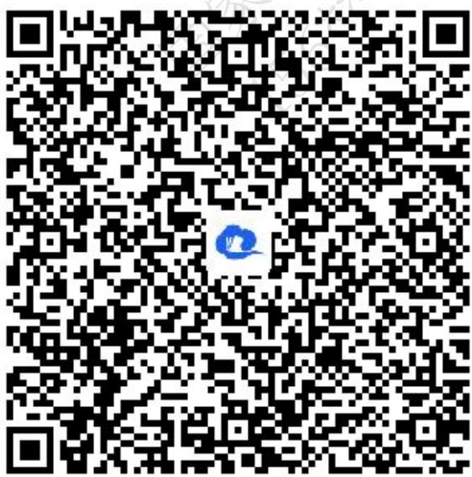

text_image

QR code with a blue logo in the center, likely linking to a digital resource or website.

2.【单选题】直线 $y=kx-k+1$ 与椭圆 $C\frac{x^{2}}{9}+\frac{y^{2}}{4}=1$ 的公共点个数是()

A. 2   
B. 1   
C. 0

D. 不确定

【正确答案】A

【更多习题信息】

难易度：偏难

知识点：直线与椭圆的位置关系及其应用

【智慧中小学APP扫码查看完整解析】

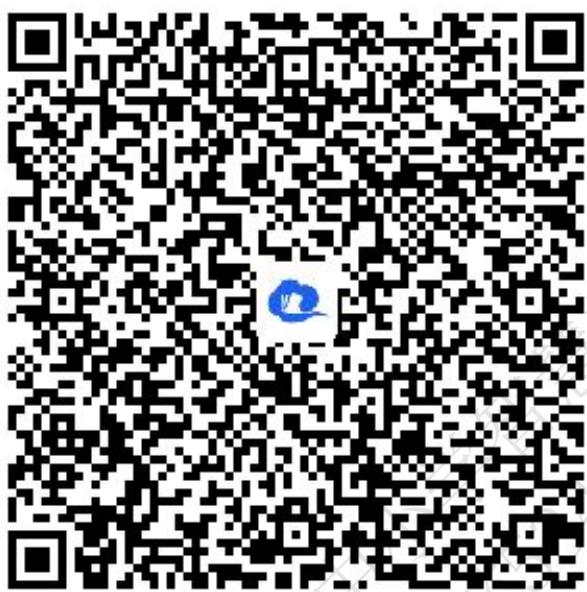

text_image

QR code with a blue logo in the center, likely linking to a digital resource or website.

3.【单选题】已知过椭圆 $C:\frac{x^{2}}{2}+y^{2}=1$ 的一个焦点作倾斜角为 $45^{\circ}$ 的直线l交椭圆于A，B两点，设O为坐标原点，则 $\overrightarrow{OA}\cdot\overrightarrow{OB}$ 等于()。

A.-3   
B. $-\frac{l}{3}$   
D. $\pm\frac{1}{3}$

C. $-\frac{1}{3}$ 或 -3

【正确答案】B

【更多习题信息】

难易度：适中

知识点：椭圆中与向量有关的问题

【智慧中小学APP扫码查看完整解析】

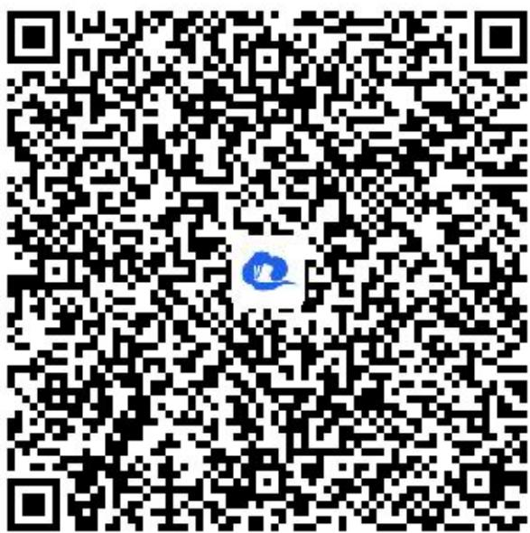

text_image

QR code with a blue logo in the center, likely linking to a digital resource or website.

4.【单选题】在椭圆 $C:\frac{x^{2}}{16}+\frac{y^{2}}{9}=1$ 中，以点 $M\left(2,\frac{3}{2}\right)$ 为中点的弦所在的直线方程为()

A. $3x + 4y = 0$   
B. 3x - 4y = 0   
C. $3x + 4y - 12 = 0$   
D. $3x - 4y + 12 = 0$

【正确答案】C

【更多习题信息】

难易度：适中

知识点：椭圆的焦点弦、中点弦问题

【智慧中小学APP扫码查看完整解析】

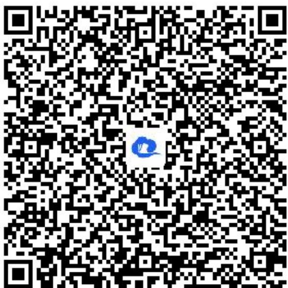

text_image

QR code with a blue logo in the center, likely linking to a digital resource or website.

5.【单选题】已知椭圆 $C\frac{x^{2}}{4}+\frac{y^{2}}{b^{2}}=1(0<b<2)$ 的左、右焦点分别为 $F_{1}$ ， $F_{2}$ ，直线l过 $F_{2}$ 且与椭圆相交于不同的两点A，B(A、B不在x轴上)，那么 $\Delta AB_{F_{1}}$ 的周长()

A. 是定值4  
B. 是定值8  
C. 不是定值，与直线l的倾斜角大小有关  
D. 不是定值，与b取值大小有关

【正确答案】B

【更多习题信息】

难易度：适中

知识点：椭圆中定点、定值、定直线问题

【智慧中小学APP扫码查看完整解析】

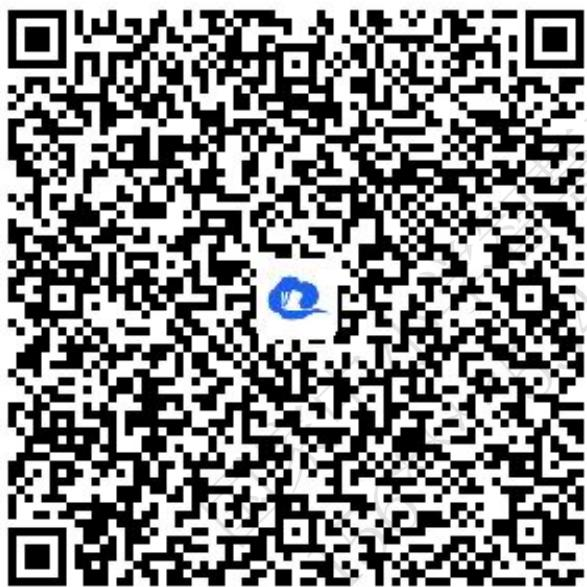

text_image

QR code with a blue logo in the center, likely linking to a digital resource or website.

6.【单选题】椭圆 $C:\frac{x^{2}}{4}+y^{2}=1$ 上一动点P到两个焦点 $F_{1}$ ， $F_{2}$ 的距离之积为q，则q取最大值时， $\Delta P_{F_{1}F_{2}}$ 的面积为()。

A. $\frac{\sqrt{3}}{2}$   
B. 1   
C. $\sqrt{3}$   
D. 2

【正确答案】C

【更多习题信息】

难易度：适中

知识点：椭圆中三角形（四边形）的面积

【智慧中小学APP扫码查看完整解析】

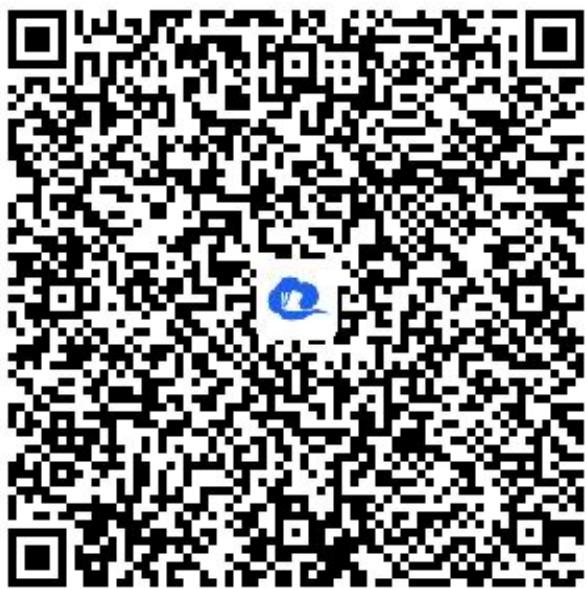

text_image

QR code with a blue logo in the center, likely linking to a digital resource or website.

# 二、填空题（共8题）

7.【填空题】已知椭圆 $C:\frac{x^{2}}{a^{2}}+\frac{y^{2}}{b^{2}}=1(a>b>0)$ 的离心率为 $\frac{\sqrt{3}}{2}$ ，过右焦点F且倾斜角为 $\frac{\pi}{4}$ 的直线与椭圆C形成的弦长为 $\frac{8}{5}$ ，且椭圆C上存在4个点M，N，P，Q构成矩形，则矩形MNPQ面积的最大值为\_\_\_\_。

【正确答案】4

【更多习题信息】

难易度：适中

知识点：椭圆中三角形（四边形）的面积

【智慧中小学APP扫码查看完整解析】

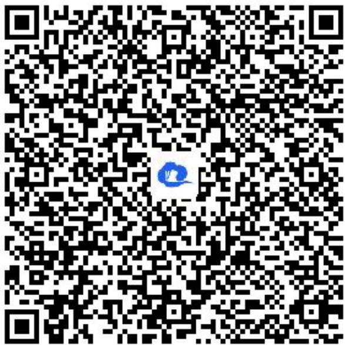

text_image

QR code with a blue logo in the center, likely linking to a digital resource or website.

8.【填空题】已知 $F_{1}$ 、 $F_{2}$ 分别为椭圆 $C:\frac{x^{2}}{2}+y^{2}=l$ 的左、右两个焦点，过 $F_{1}$ 作倾斜角为 $\frac{\pi}{4}$ 的弦AB，则 $\Delta F_{2}AB$ 的面积为\_\_\_\_。

【正确答案】 $\frac{4}{3}$

【更多习题信息】

难易度：适中

知识点：椭圆中三角形（四边形）的面积

【智慧中小学APP扫码查看完整解析】

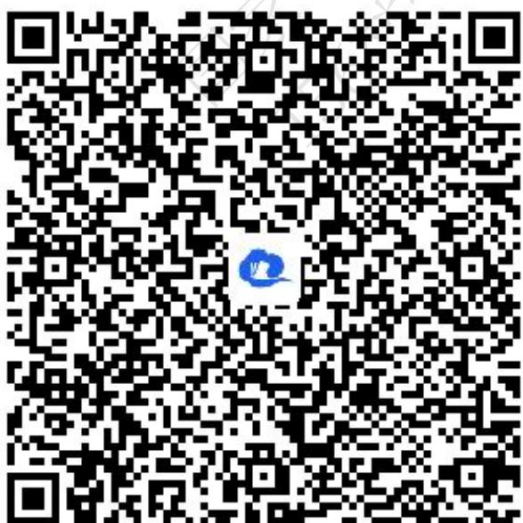

text_image

QR code with a blue logo in the center, likely linking to a digital resource or website.

9.【填空题】已知直线 $2kx - y + 1 = 0$ 与椭圆 $C: \frac{x^{2}}{9} + \frac{y^{2}}{m} = 1 (m > 0)$ 恒有公共点，则实数m的取值范围为\_\_\_\_。

【正确答案】\${}[1,9)\bigcup { \mkern 1mu } (9, + \infty ) {}\$

【更多习题信息】

难易度：偏难

知识点：直线与椭圆的位置关系及其应用

【智慧中小学APP扫码查看完整解析】

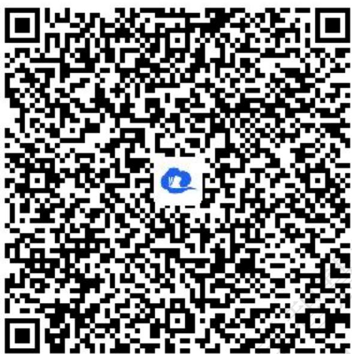

text_image

QR code with a blue logo in the center, likely linking to a digital resource or website.

10.【填空题】已知椭圆 $C:\frac{x^{2}}{a^{2}}+\frac{y^{2}}{b^{2}}=I(a>b>0)$ 的一条弦所在的直线方程是 $x-y+5=0$ ，弦的中点横坐标是-4，则椭圆的离心率是\_\_\_\_。

【正确答案】 $\frac{\sqrt{3}}{2}$

【更多习题信息】

难易度：适中

知识点：椭圆的焦点弦、中点弦问题

【智慧中小学APP扫码查看完整解析】

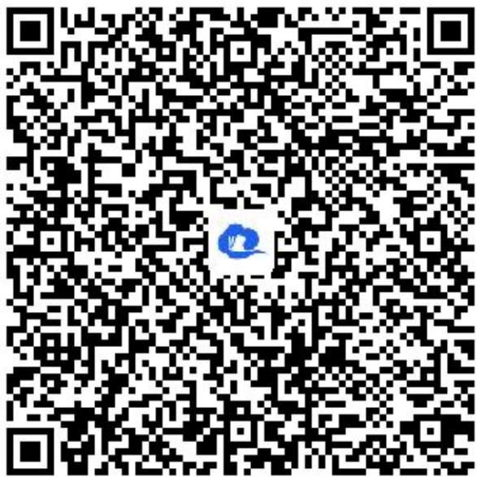

text_image

QR code with a blue logo in the center, likely linking to a digital resource or website.

11.【填空题】设点Q是椭圆C: $\frac{x^{2}}{2} + y^{2} = 1$

上除长轴两端点外的任意一点，则在x轴上存在两定点A，B，使得直线QA，QB的斜率之积为定值，该定值为\_\_\_\_。

【正确答案】 $-\frac{l}{2}$

【更多习题信息】

难易度：适中

知识点：椭圆中定点、定值、定直线问题

【智慧中小学APP扫码查看完整解析】

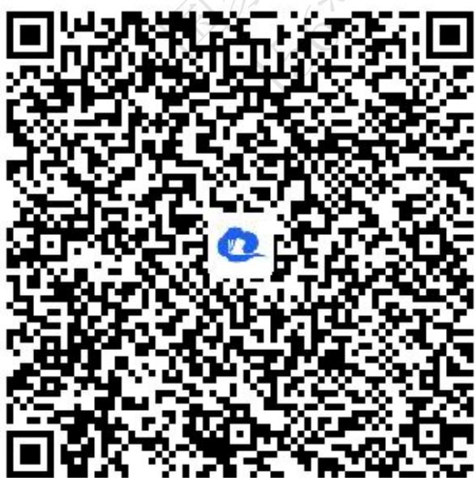

text_image

QR code with a blue logo in the center, likely linking to a digital resource or website.

12.【填空题】已知椭圆 $C\frac{x^{2}}{a^{2}}+\frac{y^{2}}{b^{2}}=I(a>b>0)$ 的左、右焦点分别为 $F_{1}$ ， $F_{2}$ ，过 $F_{2}$

的直线与椭圆C交于M，N两点，设线段 $N_{F_{1}}$ 的中点D，若 $\overrightarrow{MD} \cdot \overrightarrow{N_{F_{1}}} = 0$ ，且 $\overrightarrow{M_{F_{1}}} / \overrightarrow{D_{F_{2}}}$ ，则椭圆C的离心率为\_\_\_\_。

【正确答案】 $\frac{\sqrt{3}}{3}$

【更多习题信息】

难易度：适中

知识点：椭圆中与向量有关的问题

【智慧中小学APP扫码查看完整解析】

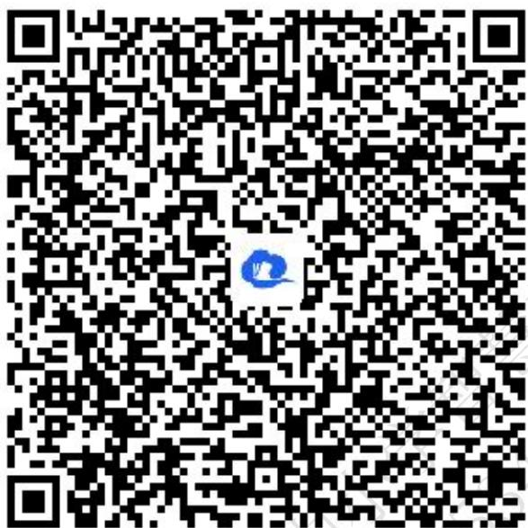

text_image

QR code with a blue logo in the center, likely linking to a digital resource or website.

13.【填空题】已知椭圆 $C:\frac{x^{2}}{2}+y^{2}=l$ 与直线 $y=x+m$ 交于A，B两点，且 $|AB|=\frac{4\sqrt{2}}{3}$ ，则实数m的值为\_\_\_\_。

【正确答案】 $\pm 1$

【更多习题信息】

难易度：简单

知识点：椭圆的弦长

【智慧中小学APP扫码查看完整解析】

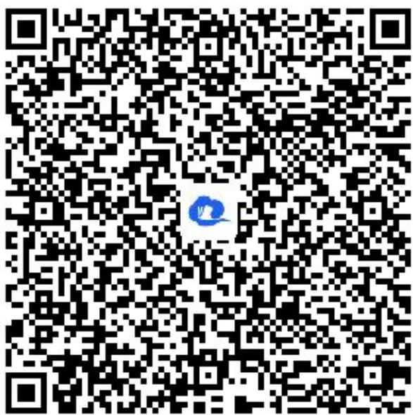

text_image

QR code with a blue logo in the center, likely linking to a digital resource or website.

14.【填空题】若点O和点F分别为椭圆 $C\frac{x^{2}}{4}+\frac{y^{2}}{3}=1$ 的中心和左焦点，点P为椭圆上的任意一点，则 $\overrightarrow{OP}\cdot\overrightarrow{FP}$ 的最大值为\_\_\_\_。

【正确答案】6

【更多习题信息】

难易度：适中

知识点：椭圆中与向量有关的问题

【智慧中小学APP扫码查看完整解析】

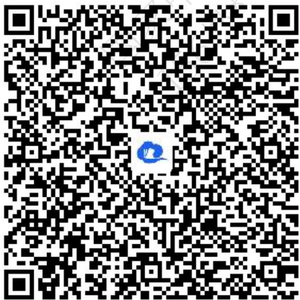

text_image

QR code with a blue logo in the center, likely linking to a digital resource or website.

# 三、问答题（共4题）

15.【问答题】椭圆 $C:\frac{x^{2}}{16}+\frac{y^{2}}{4}=1$ 上的点到直线 $x+2y-\sqrt{2}=0$ 的最大距离是多少？

【正确答案】 $\sqrt{10}$

【更多习题信息】

难易度：偏难

知识点：直线与椭圆的位置关系及其应用

【智慧中小学APP扫码查看完整解析】

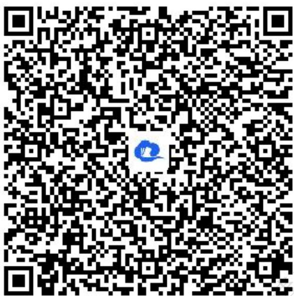

text_image

QR code with a blue logo in the center, likely linking to a digital resource or website.

16.【问答题】椭圆 $C:\frac{x^{2}}{7}+\frac{y^{2}}{b^{2}}=1$ ，过原点O斜率为 $\sqrt{3}$ 的直线与椭圆交于C，D，若 $|CD|=4$ ，求椭圆的标准方程.

【正确答案】 $\frac{x^2}{7} +\frac{2y^2}{7} = 1$

【更多习题信息】

难易度：简单

知识点：椭圆的弦长

【智慧中小学APP扫码查看完整解析】

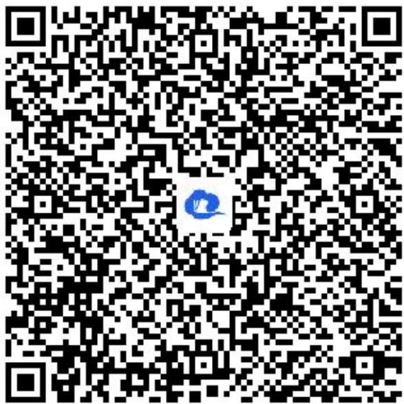

text_image

QR code with a blue logo in the center, likely linking to a digital resource or website.

17.【问答题】已知椭圆 $C:\frac{x^{2}}{4}+\frac{y^{2}}{2}=1$ 上的两个动点P，Q，设 $P(x_{1},y_{1})$ ， $Q(x_{2},y_{2})$ ，且 $x_{1}+x_{2}=2$ .
线段PQ的垂直平分线经过一个定点，求定点坐标.

【正确答案】 $\left(\frac{1}{2},0\right)$

【更多习题信息】

难易度：适中

知识点：椭圆中定点、定值、定直线问题

【智慧中小学APP扫码查看完整解析】

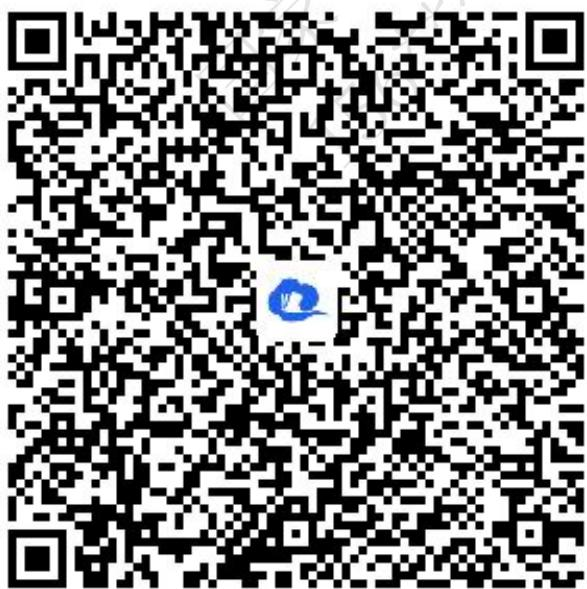

text_image

QR code with a blue logo in the center, likely linking to a digital resource or website.

18.【问答题】设直线 l 经过椭圆 $C: \frac{x^{2}}{4} + y^{2} = l$ 的右焦点且倾斜角为 $45^{\circ}$ ，若直线 l 与椭圆相交于 A，B 两点，求弦长 $|AB|$ 。

【正确答案】 $\frac{8}{5}$

【更多习题信息】

难易度：适中

知识点：椭圆的焦点弦、中点弦问题

【智慧中小学APP扫码查看完整解析】

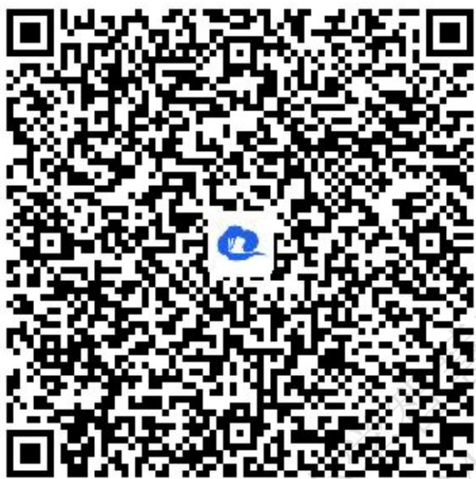

text_image

QR code with a blue logo in the center, likely linking to a digital resource or website.

