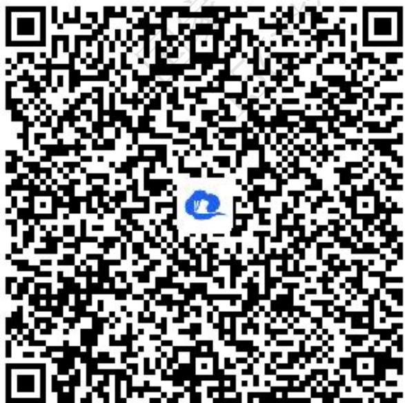
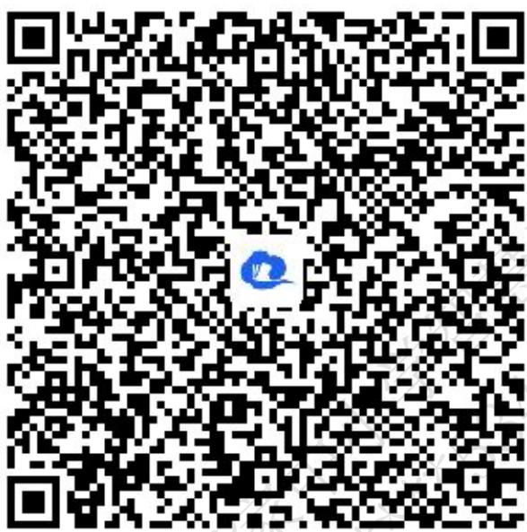
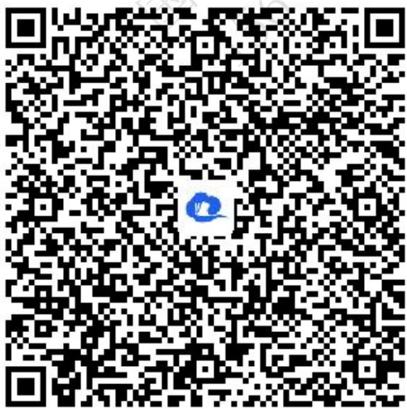
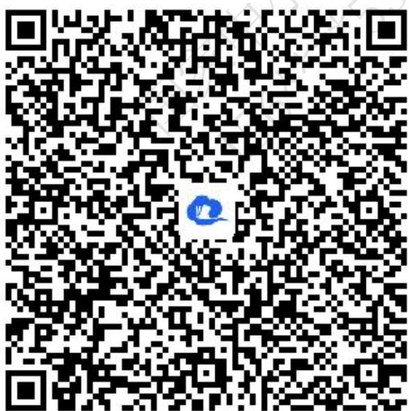

# 高中 数学 选择性必修 第一册 第三章 圆锥曲线的方程 3.1 椭圆

# 3.1.2 椭圆的简单几何性质 (答案解析)

# 一、单选题（共3题）

1.【单选题】下列椭圆的形状中更接近于圆的是()

A. $\frac{x^2}{16} +\frac{y^2}{12} = 1$   
B. $\frac{x^{2}}{4}+y^{2}=1$   
C. $\frac{x^{2}}{6}+\frac{y^{2}}{3}=1$   
D. $\frac{x^{2}}{9}+\frac{y^{2}}{8}=1$

【正确答案】D

【更多习题信息】

难易度：适中

知识点：椭圆的离心率

【智慧中小学APP扫码查看完整解析】

text_image

QR code with a blue logo in the center, likely linking to a digital resource or website.

2.【单选题】椭圆 $C_{1}:\frac{x^{2}}{25}+\frac{y^{2}}{16}=1$ 与椭圆 $C_{2}:\frac{x^{2}}{25-k}+\frac{y^{2}}{16-k}=1(k<16)$ 的()

A. 长轴长相等  
B. 短轴长相等  
C. 离心率相等   
D. 焦距相等

【正确答案】D

【更多习题信息】

难易度：适中

知识点：椭圆的顶点、长短轴

【智慧中小学APP扫码查看完整解析】

text_image

QR code with a blue logo in the center, likely linking to a digital resource or website.

3.【单选题】若椭圆 $C\frac{x^{2}}{9}+\frac{y^{2}}{m+9}=1$ 的离心率是 $\frac{1}{2}$ ，则实数m的值等于()

A. $-\frac{9}{4}$   
B. $\frac{l}{4}$   
D. $\frac{1}{4}$ 或3

C. $-\frac{9}{4}$ 或3

【正确答案】C

【更多习题信息】

难易度：适中

知识点：由椭圆的离心率求参数

【智慧中小学APP扫码查看完整解析】  

text_image

QR code with a blue circular logo in the center, likely linking to a digital resource or website.

# 二、填空题（共5题）

4.【填空题】以椭圆的两个焦点为直径的端点的圆与椭圆交于四个不同的点，顺次连接这四个点和两个焦点恰好组成一个正六边形，那么这个椭圆的离心率为\_\_\_\_。

【正确答案】 $\sqrt{3} - 1$

【更多习题信息】

难易度：适中

知识点：椭圆的离心率

【智慧中小学APP扫码查看完整解析】

text_image

QR code with a blue logo in the center, likely linking to a digital resource or website.

5.【填空题】已知椭圆 $C:\frac{x^{2}}{a^{2}}+\frac{y^{2}}{b^{2}}=1(a>b>0)$ 过点 $M(1,\frac{3}{2})$ ，且椭圆的短轴长为 $2\sqrt{3}$ ，则椭圆的标准方程是\_\_\_\_。

【正确答案】 $\frac{x^2}{4} +\frac{y^2}{3} = 1$

【更多习题信息】

难易度：适中

知识点：椭圆的顶点、长短轴

【智慧中小学APP扫码查看完整解析】

text_image

QR code with a blue logo in the center, likely linking to a digital resource or website.

6.【填空题】P是椭圆 $C:\frac{x^{2}}{a^{2}}+\frac{y^{2}}{b^{2}}=1(a>b>0)$ 上的一点，A为左顶点，F为右焦点， $PF\perp x$ 轴，若 $\tan\angle PAF=\frac{1}{2}$ ，则椭圆的离心率e为\_\_\_\_。

【正确答案】 $\frac{l}{2}$

【更多习题信息】

难易度：适中

知识点：椭圆的离心率

【智慧中小学APP扫码查看完整解析】

text_image

QR code with a blue logo in the center, likely linking to a digital resource or website.

7.【填空题】设e是椭圆 $C\cdot\frac{x^{2}}{8}+\frac{y^{2}}{k}=1$ 的离心率，且 $e\in(\frac{l}{2},1)$ ，则实数k的取值范围是\_\_\_\_。

【正确答案】 ${} (0,6)\bigcup { \mkern 1mu } (\frac{ {32} }{3}, + \infty )$

【更多习题信息】

难易度：适中

知识点：由椭圆的离心率求参数

【智慧中小学APP扫码查看完整解析】

text_image

QR code with a blue logo in the center, likely linking to a digital resource or website.

8.【填空题】已知椭圆C的短轴长为6，离心率为 $\frac{4}{5}$ ，则椭圆C的焦点F到长轴的一个顶点的距离为\_\_\_\_。

【正确答案】1或9

# 【更多习题信息】

难易度：适中

知识点：椭圆的顶点、长短轴

【智慧中小学APP扫码查看完整解析】

text_image

QR code with a blue logo in the center, likely linking to a digital resource or website.

# 三、问答题（共1题）

9.【问答题】已知椭圆 $C:\frac{x^{2}}{a^{2}}+\frac{y^{2}}{b^{2}}=1(a>b>0)$ 的左、右焦点分别为 $F_{1}$ ， $F_{2}$ ，离心率为 $\frac{\sqrt{3}}{3}$ ，过 $F_{2}$ 的直线交椭圆C于A，B两点，若 $\Delta A_{F_{1}}B$ 的周长为 $4\sqrt{3}$ ，求椭圆C的标准方程。

【正确答案】 $\frac{x^2}{3} +\frac{y^2}{2} = 1$

【更多习题信息】

难易度：适中

知识点：由椭圆的离心率求参数

【智慧中小学APP扫码查看完整解析】

text_image

QR code with a blue logo in the center, likely linking to a digital resource or website.

