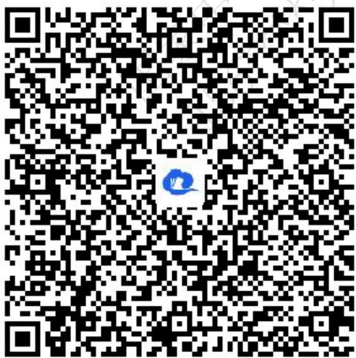
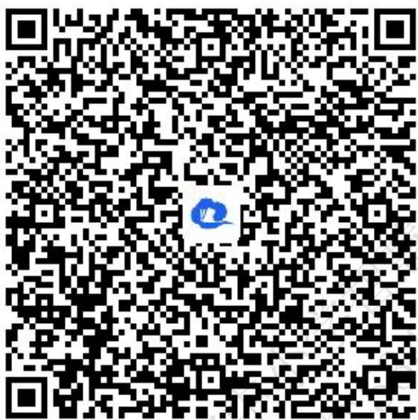
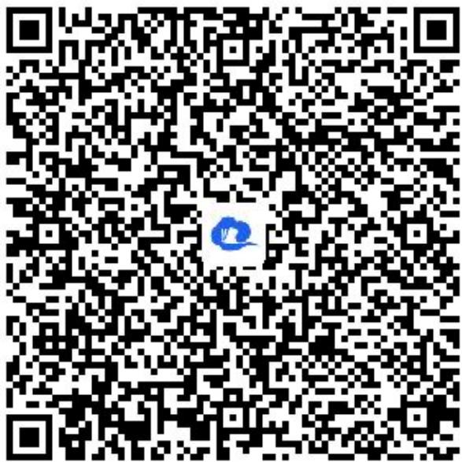
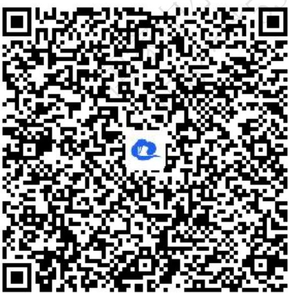
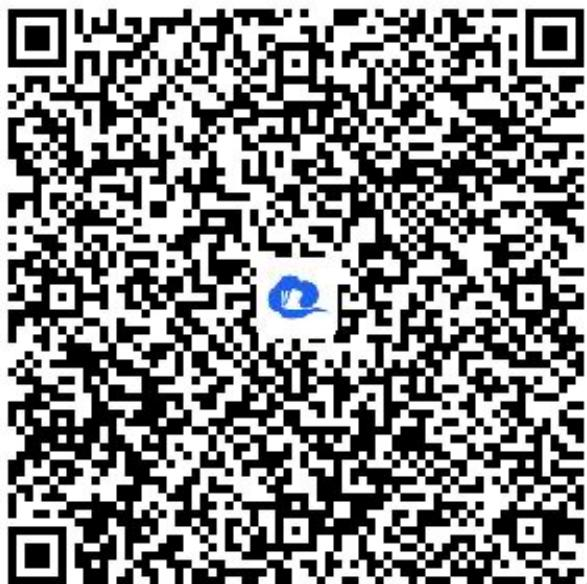
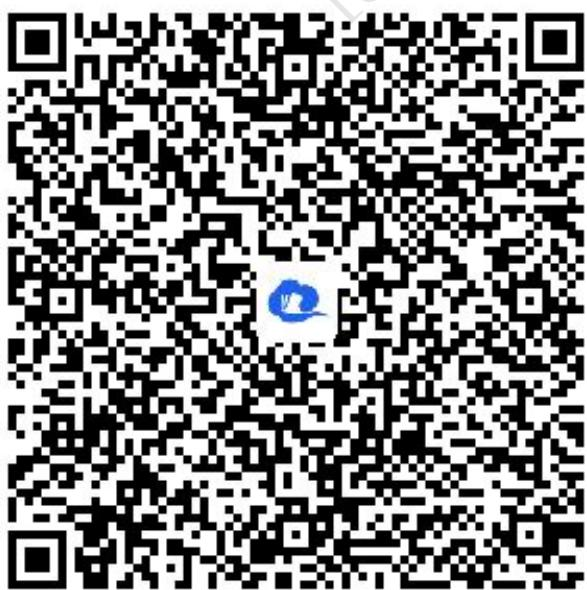

# 高中 数学 选择性必修 第一册

# 第三章 圆锥曲线的方程 3.2 双曲线

# 3.2.1双曲线及其标准方程

# (答案解析)

# 一、单选题（共2题）

1.【单选题】已知两定点 $F_{1}(-3,0)$ ， $F_{2}(3,0)$ ，在平面内满足下列条件的动点P的轨迹中，是双曲线的是（）

A. $||PF_{1}| - |PF_{2}|| = 5$   
B. $||P_{F_1}| - |P_{F_2}|| = 6$   
C. $||PF_1| - |PF_2|| = 7$   
D. $||PF_1| - |PF_2|| = 0$

【正确答案】A

【更多习题信息】

难易度：适中

知识点：双曲线的定义及辨析

【智慧中小学APP扫码查看完整解析】

text_image

QR code with a blue logo in the center, likely linking to a digital resource or website.

2.【单选题】在双曲线的标准方程中, 若实轴长为12 , 虚半轴长为8 , 则其方程是 ( )

A. $\frac{y^2}{36} -\frac{x^2}{64} = 1$

B. $\frac{x^2}{64} -\frac{y^2}{36} = 1$   
C. $\frac{x^{2}}{36}-\frac{y^{2}}{64}=1$   
D. $\frac{x^{2}}{36}-\frac{y^{2}}{64}=1$ 或 $\frac{y^{2}}{36}-\frac{x^{2}}{64}=1$

【正确答案】D

【更多习题信息】

难易度：适中

知识点：双曲线的标准方程

【智慧中小学APP扫码查看完整解析】

text_image

QR code with a blue logo in the center, likely linking to a digital resource or website.

# 二、填空题（共2题）

3.【填空题】已知双曲线 $x^{2}-\frac{y^{2}}{16}=1$ 左支上一点P到左焦点的距离等于4，那么点P到右焦点的距离等于\_\_\_\_。

【正确答案】6

【更多习题信息】

难易度：适中

知识点：双曲线的定义及辨析

【智慧中小学APP扫码查看完整解析】

text_image

QR code with a blue logo in the center, likely linking to a digital resource or website.

4.【填空题】若方程 $\frac{x^{2}}{2+m}-\frac{y^{2}}{m+1}=1$ 表示双曲线,则m的取值范围是\_\_\_\_.

【正确答案】 $(-∞,-2)∪(-1,+∞)$

【更多习题信息】

难易度：适中

知识点：双曲线的标准方程、定义及辨析

【智慧中小学APP扫码查看完整解析】

text_image

QR code with a blue circular logo in the center, likely linking to a digital resource or website.

# 三、问答题（共2题）

5.【问答题】求焦点为 $(-2,0)$ 、 $(2,0)$ ，且经过点 $(2,3)$ 的双曲线的标准方程.

【正确答案】

【更多习题信息】

难易度：适中

知识点：双曲线的标准方程、定义及辨析

【智慧中小学APP扫码查看完整解析】

text_image

QR code with a blue logo in the center, likely linking to a digital resource or website.

6.【问答题】已知动点 $P(x,y)$ 满足 $\sqrt{(x+5)^{2}+y^{2}}-\sqrt{(x-5)^{2}+y^{2}}=8$ ，求动点P的轨迹.

【正确答案】双曲线的右支

【更多习题信息】

难易度：适中

知识点：双曲线的标准方程、定义及辨析

【智慧中小学APP扫码查看完整解析】

text_image

QR code with a blue logo in the center, likely linking to a digital resource or website.

