# 高中 数学 选择性必修 第一册

# 第三章 圆锥曲线的方程 3.2 双曲线

# 3.2.2双曲线的简单几何性质

# (答案解析)

# 一、单选题（共3题）

1.【单选题】双曲线 $\frac{x^2}{a^2} -\frac{y^2}{b^2} = 1(a > 0,b > 0)$ 的离心率为 $\sqrt{3}$ ，则其渐近线方程为（）

A. $y = \pm 2x$   
B. $y = \pm \sqrt{2} x$   
C. $y = \pm \frac{1}{2} x$   
D. $y = \pm \frac{\sqrt{2}}{2}x$

【正确答案】B

【更多习题信息】

难易度：适中

知识点：双曲线的渐近线

【智慧中小学APP扫码查看完整解析】

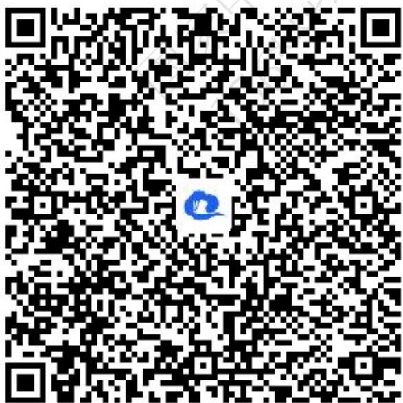

text_image

QR code with a blue logo in the center, likely linking to a digital resource or website.

2.【单选题】中心在原点，焦点在x轴上的双曲线的一条渐近线经过点(4, - 2)，则它的离心率为（）

A. $\sqrt{6}$   
B. $\sqrt{5}$   
C. $\frac{\sqrt{6}}{2}$   
D. $\frac{\sqrt{5}}{2}$

【正确答案】D

【更多习题信息】

难易度：适中

知识点：求双曲线的离心率

【智慧中小学APP扫码查看完整解析】

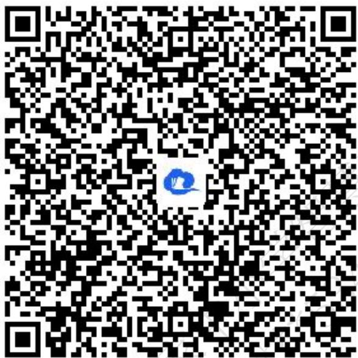

text_image

QR code with a blue logo in the center, likely linking to a digital resource or website.

3.【单选题】双曲线 $m_{x^{2}} + y^{2} = 1$ 的虚轴长是实轴长的2倍，则m等于（）

A. $-\frac{1}{4}$   
B.-4   
C. 4   
D. $\frac{1}{4}$

【正确答案】A

【更多习题信息】

难易度：适中

知识点：双曲线的顶点，实虚轴

【智慧中小学APP扫码查看完整解析】

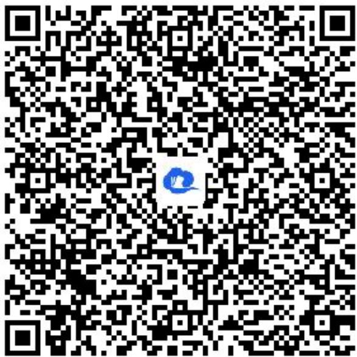

text_image

QR code with a blue logo in the center, likely linking to a digital resource or website.

# 二、填空题（共5题）

4.【填空题】已知双曲线方程为 $3m_{x}^{2}-m_{y}^{2}=1(m\neq0)$ ，则双曲线的渐近线方程为\_\_\_\_.

【正确答案】 $y=\pm\sqrt{3}x$

【更多习题信息】

难易度：适中

知识点：双曲线的渐近线

【智慧中小学APP扫码查看完整解析】

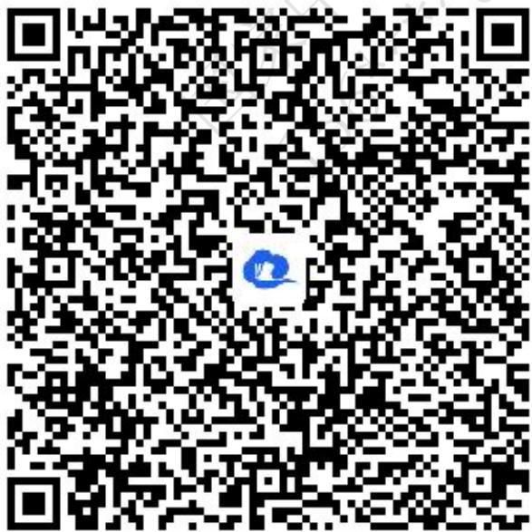

text_image

QR code with a blue logo in the center, likely linking to a digital resource or website.

5.【填空题】已知双曲线C的实半轴长为3，虚轴长为8，则双曲线C的焦点到实轴的一个端点的距离为\_\_\_\_。

【正确答案】2或8

【更多习题信息】

难易度：适中

知识点：双曲线的顶点，实虚轴

【智慧中小学APP扫码查看完整解析】

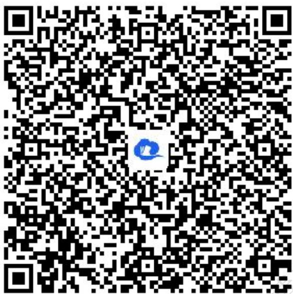

text_image

QR code with a blue logo in the center, likely linking to a digital resource or website.

6.【填空题】已知双曲线 $\frac{x^{2}}{4}+\frac{y^{2}}{k}=1$ 的离心率 $e\in(1,2)$ ，则实数k的取值范围是\_\_\_\_.

【正确答案】(-12,0)

【更多习题信息】

难易度：适中

知识点：由双曲线的离心率求参数

【智慧中小学APP扫码查看完整解析】

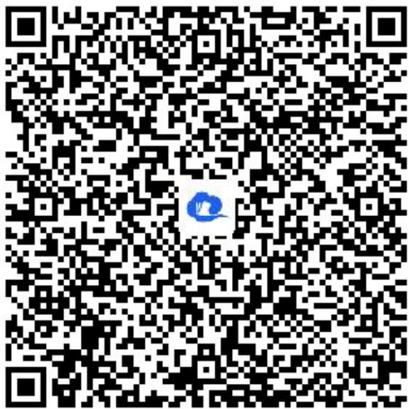

text_image

QR code with a blue logo in the center, likely linking to a digital resource or website.

7.【填空题】若双曲线 $\frac{x^2}{a^2} -\frac{y^2}{4} = 1(a > 0)$ 的离心率为 $\frac{\sqrt{5}}{2}$ ，则 $a = \_$ .

【正确答案】4

【更多习题信息】

难易度：适中

知识点：由双曲线的离心率求参数

【智慧中小学APP扫码查看完整解析】

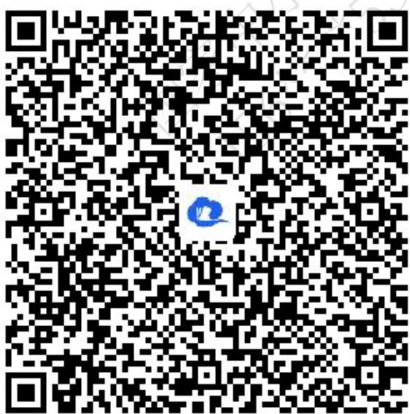

text_image

QR code with a blue logo in the center, likely linking to a digital resource or website.

8.【填空题】已知双曲线 $\frac{x^{2}}{a^{2}}-\frac{y^{2}}{b^{2}}=1(a>0,b>0)$ 与直线y=2x有公共点，则双曲线离心率的取值范围为\_\_\_\_.

【正确答案】 $(\sqrt{5}, + \infty)$

【更多习题信息】

难易度：适中

知识点：求双曲线的离心率的取值范围

【智慧中小学APP扫码查看完整解析】

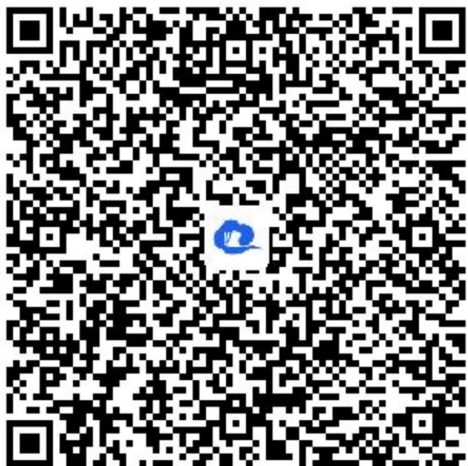

text_image

QR code with a blue logo in the center, likely linking to a digital resource or website.

# 三、问答题（共4题）

9.【问答题】双曲线 $C:\frac{x^{2}}{a^{2}}-\frac{y^{2}}{b^{2}}=1(a>0,b>0)$ 的左焦点为F，右顶点为A，虚轴的一个端点为B，若 $\triangle ABF$ 为等腰三角形，求双曲线C的离心率.

【正确答案】

【更多习题信息】

难易度：适中

知识点：求双曲线的离心率

【智慧中小学APP扫码查看完整解析】

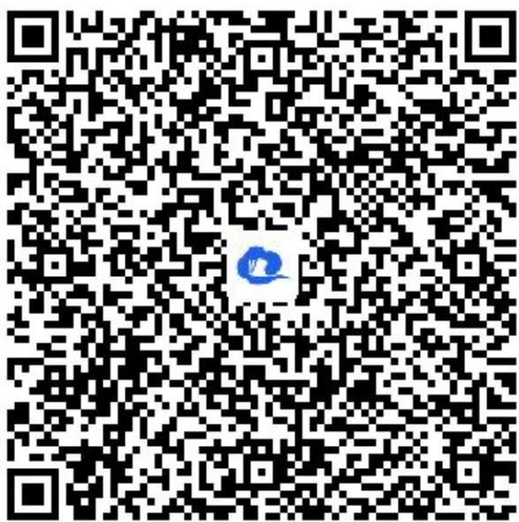

text_image

QR code with a blue logo in the center, likely linking to a digital resource or website.

10.【问答题】设点 $F_{1}$ 、 $F_{2}$ 分别是双曲线 $C:\frac{x^{2}}{a^{2}}-\frac{y^{2}}{2}=1(a>0)$ 的左、右焦点，过点 $F_{1}$ 且与x轴垂直的直线与双曲线C交于A、B两点．若 $\triangle ABF_{2}$ 的面积为 $2\sqrt{6}$ ，求双曲线的渐近线方程.

【正确答案】 $y=\pm\frac{\sqrt{2}}{2}x$

【更多习题信息】

难易度：适中

知识点：双曲线的渐近线

【智慧中小学APP扫码查看完整解析】

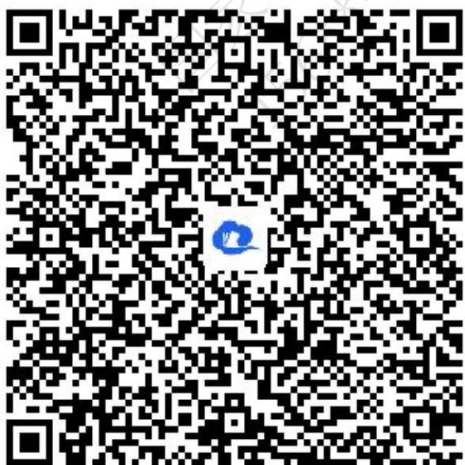

text_image

QR code with a blue logo in the center, likely linking to a digital resource or website.

11.【问答题】求双曲线 $3x^{2}-6y^{2}=-18$ 的实轴长、虚轴长、顶点坐标及焦点坐标.

【正确答案】实轴长 $2\sqrt{3}$ ，虚轴长 $2\sqrt{6}$ ，两个顶点坐标为 $(0, -\sqrt{3})$ ， $(0, \sqrt{3})$ ，两个焦点坐标为 $(0, -3)$ ， $(0, 3)$ 。

【更多习题信息】

难易度：适中

知识点：双曲线的顶点，实虚轴及焦点

【智慧中小学APP扫码查看完整解析】

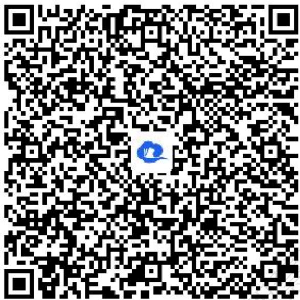

text_image

QR code with a blue logo in the center, likely linking to a digital resource or website.

12.【问答题】设双曲线 $C:\frac{x^{2}}{a^{2}}-\frac{y^{2}}{b^{2}}=1(a>0,b>0)$ 的左、右焦点分别为 $F_{1}$ ， $F_{2}$ ，离心率为 $\sqrt{3}$ ，P是双曲线C上一点，且 $\angle F_{1}PF_{2}=60^{\circ}$ 。若 $\triangle F_{1}PF_{2}$ 的面积为 $4\sqrt{3}$ ，求a的值。

【正确答案】 $a = \sqrt{2}$

【更多习题信息】

难易度：适中

知识点：由双曲线的离心率求参数

【智慧中小学APP扫码查看完整解析】

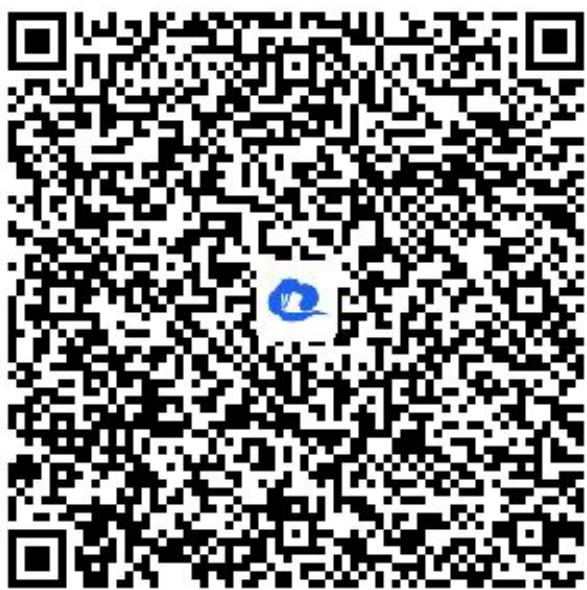

text_image

QR code with a blue logo in the center, likely linking to a digital resource or website.

