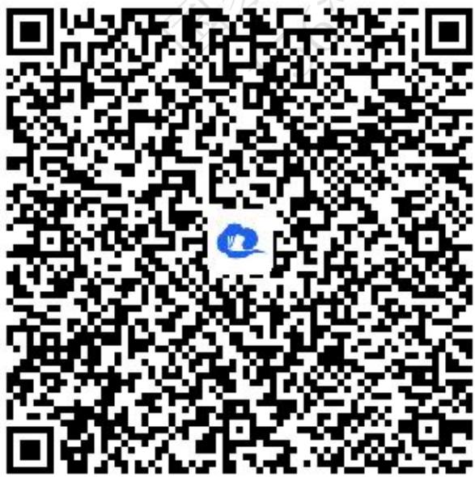
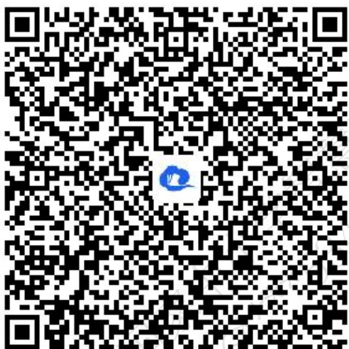
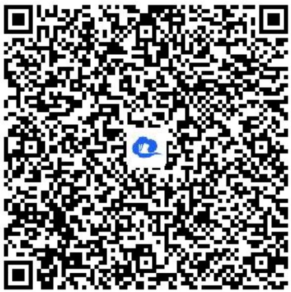
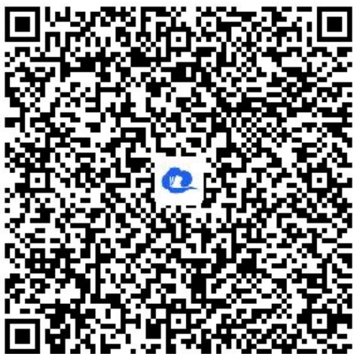
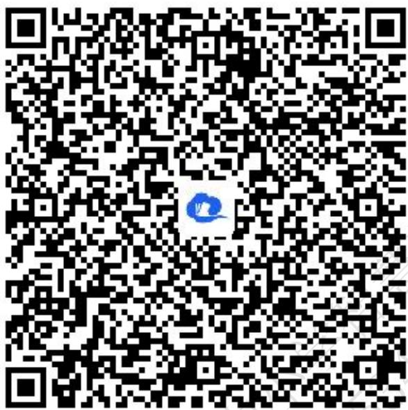
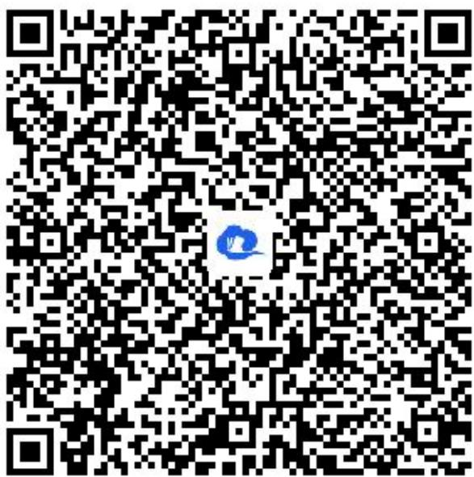
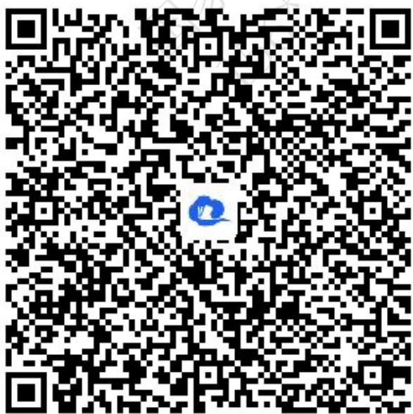
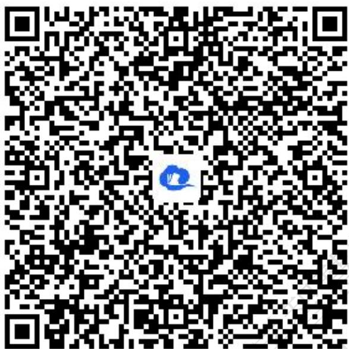
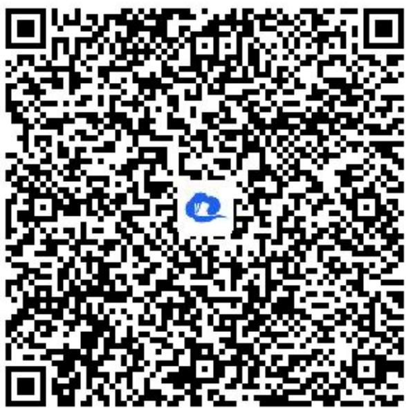

# 高中 数学 选择性必修 第一册

# 第三章 圆锥曲线的方程 3.2 双曲线

# 3.2.2双曲线的简单几何性质

# (答案解析)

# 一、单选题（共3题）

1. 【单选题】已知平面内两定点 $A(-5,0)$ , $B(5,0)$ , 动点 $M$ 满足 $|MA| - |MB| = 6$ , 则点 $M$ 的轨迹方程是（）

A. $\frac{x^{2}}{16}-\frac{y^{2}}{9}=1$   
B. $\frac{x^{2}}{16}-\frac{y^{2}}{9}=1(x\geq4)$   
C. $\frac{x^{2}}{9}-\frac{y^{2}}{16}=1$   
D. $\frac{x^2}{9} -\frac{y^2}{16} = 1(x\geq 3)$

【正确答案】D

【更多习题信息】

难易度：适中

知识点：与双曲线有关的轨迹问题

【智慧中小学APP扫码查看完整解析】

text_image

QR code with a blue logo in the center, likely linking to a digital resource or website.

2.【单选题】已知 $F_{1}$ ， $F_{2}$ 分别为双曲线 $C:x^{2}-y^{2}=1$ 的左、右焦点，点P在C上， $\angle F_{1}PF_{2}=60^{\circ}$ ，则 $|PF_{1}|\cdot|PF_{2}|=$ （）

A. 2   
B. 4   
C. 6   
D. 8

【正确答案】B

【更多习题信息】

难易度：适中

知识点：双曲线中焦点三角形问题

【智慧中小学APP扫码查看完整解析】

text_image

QR code with a blue logo in the center, likely linking to a digital resource or website.

3.【单选题】已知 $F_{1}$ ， $F_{2}$ 分别为双曲线 $\frac{x^{2}}{4}-\frac{y^{2}}{5}=1$ 的左、右焦点，点P为双曲线右支上一点，则 $|PF_{1}|$ 的最小值是（）

A. 7   
B. 5   
C. 3   
D. 1

【正确答案】B

【更多习题信息】

难易度：适中

知识点：双曲线上点到焦点距离的最值

【智慧中小学APP扫码查看完整解析】  

text_image

QR code with a blue circular logo in the center, likely linking to a digital resource or website.

# 二、填空题（共3题）

4.【填空题】设点P在双曲线 $\frac{x^{2}}{9}-\frac{y^{2}}{16}=1$ 上， $F_{1}$ ， $F_{2}$ 为双曲线的两个焦点，且 $|PF_{1}|:|PF_{2}|=1:3$ ，则 $\triangle F_{1}PF_{2}\triangle PF_{1}PF_{2}$ 的周长等于\_\_\_\_.

【正确答案】22

【更多习题信息】

难易度：适中

知识点：双曲线中焦点三角形问题

【智慧中小学APP扫码查看完整解析】

text_image

QR code with a blue logo in the center, likely linking to a digital resource or website.

5.【填空题】已知定圆 $F_{1}:(x+5)^{2}+y^{2}=1$ ，定圆 $F_{2}:(x-5)^{2}+y^{2}=1$ ，动圆M与定圆 $F_{1}$ ， $F_{2}$ 都外切，则动圆圆心M的轨迹方程为\_\_\_\_.

【正确答案】 $\frac{x^{2}}{\frac{9}{4}}-\frac{y^{2}}{\frac{91}{4}}=I(x\leq-\frac{3}{2})$

【更多习题信息】

难易度：适中

知识点：与双曲线有关的轨迹问题

【智慧中小学APP扫码查看完整解析】

text_image

QR code with a blue logo in the center, likely linking to a digital resource or website.

6.【填空题】已知 $F_{1}$ ， $F_{2}$ 为双曲线 $\frac{x^{2}}{5}-\frac{y^{2}}{4}=1$ 的左、右焦点，点A在双曲线的右支上，已知点 $P(3,1)$ ，则 $|AP|+|AF_{2}|$ 的最小值为\_\_\_\_

【正确答案】 $\sqrt{37} - 2\sqrt{5}$

【更多习题信息】

难易度：适中

知识点：双曲线上点到焦点距离的最值

【智慧中小学APP扫码查看完整解析】

text_image

QR code with a blue logo in the center, likely linking to a digital resource or website.

# 三、问答题（共3题）

7.【问答题】点P是双曲线 $\frac{x^{2}}{9}-\frac{y^{2}}{16}=1$ 右支上的一点，M是圆 $(x+5)^{2}+y^{2}=4$ 上的一点，点N的坐标为(5,0)，求 $|PM|-|PN|$ 的最大值.

【正确答案】8

【更多习题信息】

难易度：适中

知识点：双曲线上点到焦点、定点距离的最值

【智慧中小学APP扫码查看完整解析】

text_image

QR code with a blue logo in the center, likely linking to a digital resource or website.

8.【问答题】设 $F_{1}$ ， $F_{2}$ 是双曲线 $x^{2}-\frac{y^{2}}{24}=1$ 的两个焦点，P是双曲线上的一点，且 $3|PF_{1}|=4|PF_{2}|$ ，求 $\triangle F_{1}PF_{2}$ 的面积.

【正确答案】24

【更多习题信息】

难易度：适中

知识点：双曲线中焦点三角形问题

【智慧中小学APP扫码查看完整解析】

text_image

QR code with a blue logo in the center, likely linking to a digital resource or website.

9.【问答题】动点 $M(x,y)$ 与定点 $F(4,0)$ 的距离和它到定直线 $l:x=\frac{9}{4}$ 的距离的比是常数 $\frac{4}{3}$ ，求动点M的轨迹.

【正确答案】点M的轨迹是焦点在x轴上，实轴长为6、虚轴长为 $2\sqrt{7}$ 的双曲线

【更多习题信息】

难易度：适中

知识点：与双曲线有关的轨迹问题

【智慧中小学APP扫码查看完整解析】

text_image

QR code with a blue logo in the center, likely linking to a digital resource or website.

