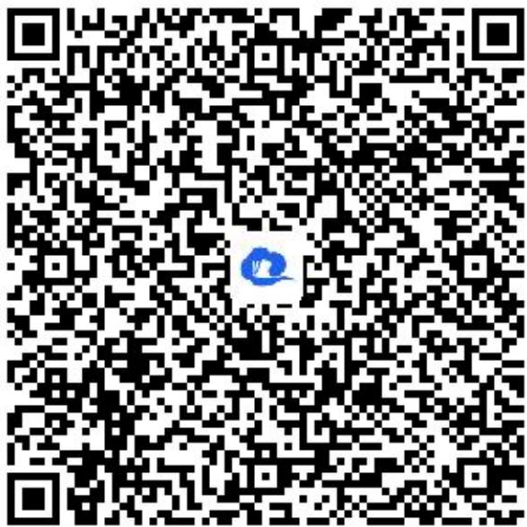
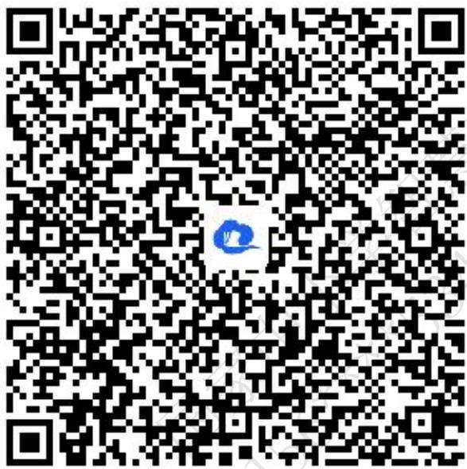

# 高中 数学 选择性必修 第一册

# 第三章 圆锥曲线的方程 3.3 抛物线

# 3.3.1抛物线及其标准方程

# (答案解析)

# 一、单选题（共6题）

1.【单选题】设抛物线 $C: y^{2}=2px(p>0)$ 的焦点为F, 点M在抛物线C上, $|MF|=5$ , 若以MF为直径的圆过点(0,2), 则抛物线C的标准方程为()

A. $y^{2}=4x$ 或 $y^{2}=8x$   
B. $y^{2}=2x$ 或 $y^{2}=8x$   
C. $y^{2}=4x$ 或 $y^{2}=16x$   
D. $y^{2}=2x$ 或 $y^{2}=16x$

【正确答案】C

【更多习题信息】

难易度：适中

知识点：抛物线的标准方程

【智慧中小学APP扫码查看完整解析】

text_image

QR code with a blue logo in the center, likely linking to a digital resource or website.

2.【单选题】过点 $A(3,0)$ 且与y轴相切的圆的圆心轨迹为()

A. 圆   
B. 椭圆

C. 直线  
D. 抛物线

【正确答案】D

【更多习题信息】

难易度：简单

知识点：抛物线定义及辨析

【智慧中小学APP扫码查看完整解析】

text_image

QR code with a blue logo in the center, likely linking to a digital resource or website.

3.【单选题】以坐标轴为对称轴,焦点在直线 $3x$ 、 $4y$ 、 $12=0$ 上的抛物线的标准方程为()

A. $x^{2}=16y$ 或 $y^{2}=12x$   
B. $y^{2}=16x$ 或 $x^{2}=12y$   
C. $y^{2}=16x$ 或 $x^{2}=12y$   
D. $x^{2} = 16y$ 或 $y^{2} = 12x$

【正确答案】C

【更多习题信息】

难易度：适中

知识点：抛物线的标准方程

【智慧中小学APP扫码查看完整解析】

text_image

QR code with a blue logo in the center, likely linking to a digital resource or website.

4.【单选题】已知抛物线的焦点为 $F(a,0)(a<0)$ ，则抛物线的标准方程是()

A. $y^{2}=2ax$   
B. $y^{2}=4ax$   
C. $y^{2}=$ 2ax   
D. $y^{2}=4ax$

【正确答案】B

【更多习题信息】

难易度：适中

知识点：抛物线的标准方程

【智慧中小学APP扫码查看完整解析】

text_image

QR code with a blue circular logo in the center, likely linking to a digital resource or website.

5.【单选题】在平面内，“点P到某定点的距离等于到某定直线的距离”是“点P的轨迹为抛物线”的（）

A. 充分不必要条件  
B. 必要不充分条件  
C. 充要条件  
D. 既不充分也不必要条件

【正确答案】B

【更多习题信息】

难易度：简单

知识点：抛物线定义及辨析

【智慧中小学APP扫码查看完整解析】

text_image

QR code with a blue logo in the center, likely linking to a digital resource or website.

6.【单选题】已知动点M的坐标满足方程 $5\sqrt{x^{2}+y^{2}}=|3x+4y-12|$ ，则动点M的轨迹是()

A. 椭圆   
B. 双曲线  
C. 抛物线  
D. 圆

【正确答案】C

【更多习题信息】

难易度：简单

知识点：抛物线定义及辨析

【智慧中小学APP扫码查看完整解析】

text_image

QR code with a blue logo in the center, likely linking to a digital resource or website.

