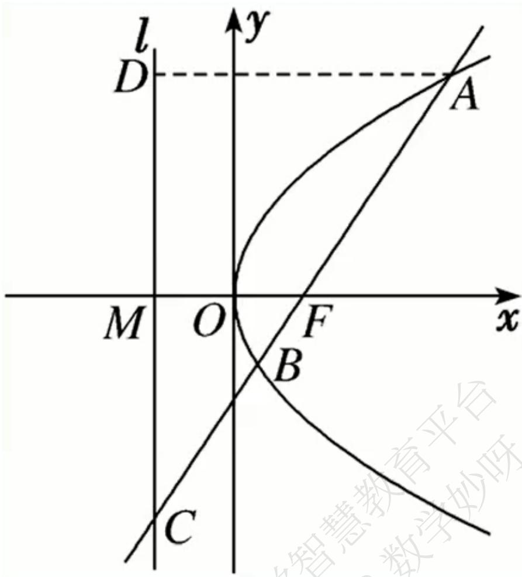

# 高中 数学 选择性必修 第一册

# 第三章 圆锥曲线的方程 3.3 抛物线

# 3.3.2抛物线的简单几何性质

# 一、单选题（共6题）

1.【单选题】抛物线 $y^{2}=4x$ 的焦点为F,点 $P(x,y)$ 为该抛物线上的动点,又已知点A(2,2)是一个定点,则 $|PA|+|PF|$ 的最小值是()

A. 4   
B. 3   
C. 2   
D. 1

2.【单选题】设点 $A(4,5)$ ，抛物线 $x^{2}=8y$ 的焦点为F，P为抛物线上与直线AF不共线的一点，则 $\triangle P_{AF}$ 周长的最小值为（）

A. 18   
B. 13   
C. 12   
D. 7

3.【单选题】如图，过抛物线 $y^{2}=2px(p>0)$ 的焦点F的直线交抛物线于点A，B，交其准线l于点C，若F是AC的中点，且 $|AF|=4$ ，则线段AB的长为（）

text_image

l
y
D
A
M O F x
B
C
智慧教育平台

A. 5   
B. 6   
C. $\frac{16}{3}$   
D. $\frac{20}{3}$

4.【单选题】过抛物线 $y^{2}=2px(p>0)$ 的焦点作直线交抛物线于 $P(x_{1},y_{1})$ ， $Q(x_{2},y_{2})$ 两点，若 $x_{1}+x_{2}=3p$ ，则 $|PQ|$ 等于（）

A. 4p   
B. 5p   
C. 6p   
D. 8p

5.【单选题】抛物线 $x^{2} = 4y$ 上一点 $A$ 的纵坐标为4，则点 $A$ 与抛物线焦点的距离为（）

A. 2   
B. 3   
C. 4

D. 5

6.【单选题】已知 $O$ 为坐标原点， $F$ 为抛物线 $C: y^{z} = 4x$ 的焦点， $P$ 为 $C$ 上一点，若 $|PF| = 4$ ，则 $\triangle POF$ 的面积为（）

A. 2   
B. $2\sqrt{2}$   
C. $2\sqrt{3}$   
D. 4