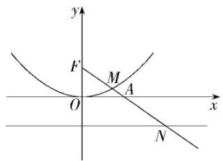

# 高中 数学 选择性必修 第一册

# 第三章 圆锥曲线的方程 3.3 抛物线

# 3.3.2抛物线的简单几何性质

# (答案解析)

# 一、单选题（共5题）

1. 【单选题】已知曲线 $C:y^{2}=2px(p>0)$ ，过它的焦点F作直线交曲线C于M,N两点，弦MN的垂直平分线交x轴于点P，可证明 $\frac{|PF|}{|MN|}$ 是一个定值m，则m=（）

A. $\frac{1}{2}$   
B. 1   
C. 2   
D. $\sqrt{2}$

【正确答案】A

【更多习题信息】

难易度：简单

知识点：抛物线中的定值问题

【智慧中小学APP扫码查看完整解析】

text_image

QR code with a blue logo in the center, likely linking to a digital resource or website.

2.【单选题】经过抛物线 $C:\chi^{2}=4y$ 的焦点F的直线交此抛物线于A,B两点，抛物线在A,B两点处的切线相交于点M，则点M所在的直线方程是（）

A. $x = -1$   
B. x = 1   
C. y = -1   
D. y = 1

【正确答案】C

【更多习题信息】

难易度：简单

知识点：抛物线中的定直线问题

【智慧中小学APP扫码查看完整解析】

text_image

QR code with a blue logo in the center, likely linking to a digital resource or website.

3.【单选题】已知直线l与抛物线 $y^{2}=6x$ 交于不同的两点A,B，直线OA,OB的斜率分别为 $k_{1},k_{2}$ ，且 $k_{1}\cdot k_{2}=\sqrt{3}$ ，则直线l恒过定点（）

A. $(-6\sqrt{3},0)$   
B. $(-3\sqrt{3},0)$   
C. $(-2\sqrt{3},0)$   
D. $(- \sqrt{3}, 0)$

【正确答案】C

【更多习题信息】

难易度：简单

知识点：抛物线中的定点题

【智慧中小学APP扫码查看完整解析】

text_image

QR code with a blue logo in the center, likely linking to a digital resource or website.

4.【单选题】过点(2,4)作直线与抛物线 $y^{2}=8x$ 只有一个公共点，这样的直线有()

A. 1条   
B. 2条   
C. 3条   
D. 4条

【正确答案】B

【更多习题信息】

难易度：适中

知识点：直线与抛物线的位置关系

【智慧中小学APP扫码查看完整解析】

text_image

QR code with a blue logo in the center, likely linking to a digital resource or website.

5.【单选题】如图, 已知点 $A(2,0)$ , 抛物线 $C: x^{2} = 4y$ 的焦点为 $F$ , 射线 $FA$ 与抛物线 $C$ 相交于点 $M$ , 与其准线相交于点 $N$ , 则 $|FM|: |MN| = (\quad)$

text_image

y
F
M
A
O
x
N

A. $2:\sqrt{5}$   
B. 1:2   
C. $1:\sqrt{5}$   
D. 1:3

【正确答案】C

【更多习题信息】

难易度：适中

知识点：直线与抛物线位置关系的应用

【智慧中小学APP扫码查看完整解析】

text_image

QR code with a blue logo in the center, likely linking to a digital resource or website.

# 二、多选题（共1题）

6.【多选题】(多选)已知抛物线C: $y^{2}=4px(p>0)$ 的焦点为F，过焦点的直线与抛物线分别交于A，B两点，与y轴的正半轴交于点S，与准线I交于点T，且 $|AF|=2|AS|$ ，则（）

A. $|TS|=2p$   
B. $\frac{|FB|}{|TS|}=2$

C. $|BF|=p$   
D. $|AF| = p$

【正确答案】ABD

【更多习题信息】

难易度：适中

知识点：直线与抛物线位置关系的应用

【智慧中小学APP扫码查看完整解析】

text_image

QR code with a blue logo in the center, likely linking to a digital resource or website.

