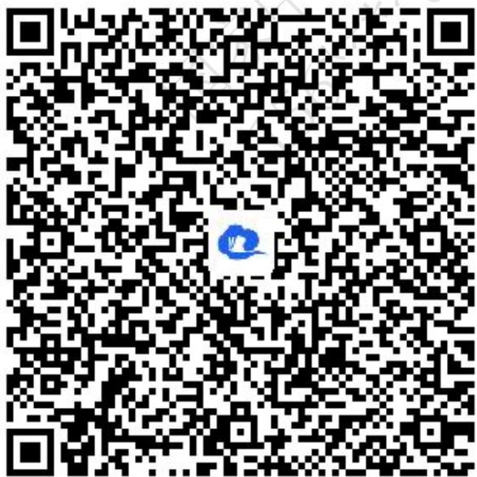
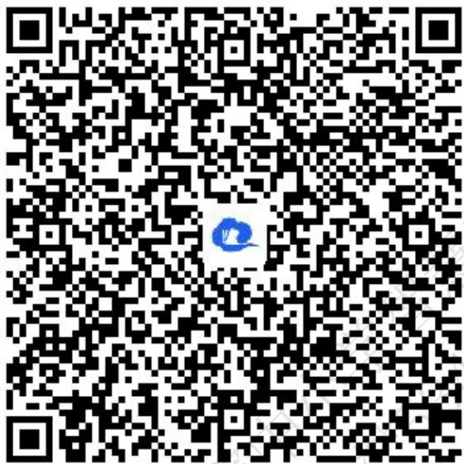
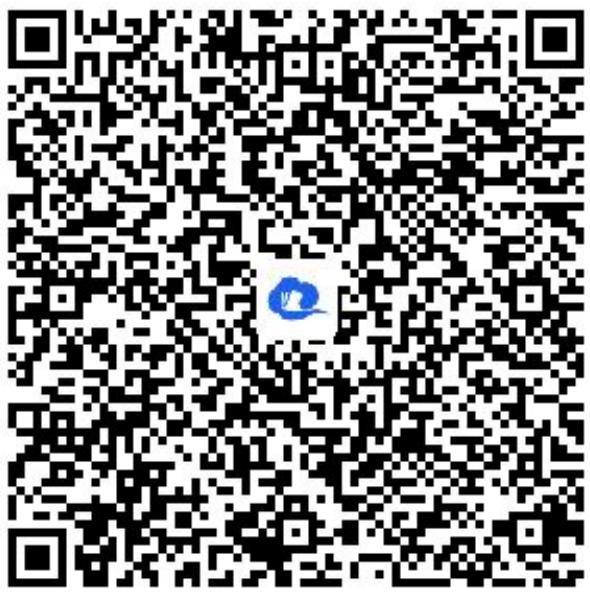
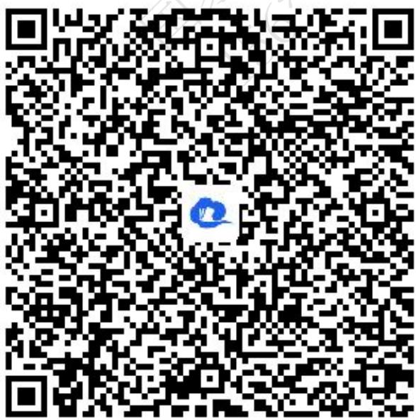

# 高中 数学 选择性必修 第一册

# 第三章 圆锥曲线的方程 小结

# (答案解析)

# 一、复合题（共3题）

1. 【复合题】已知 $O$ 为坐标原点，过点 $M(1,0)$ 的直线 $l$ 与抛物线 $C: y^2 = 2px (p > 0)$ 交于 $A, B$ 两点，且 $\overrightarrow{OA} \cdot \overrightarrow{OB} = -3$ .

(1)【问答题】求抛物线C的方程;  
(2)【问答题】过点M作直线 $l'\perp l$ 交抛物线C于P,Q两点，记 $\triangle OAB,\triangle OPQ$ 的面积分别为 $S_{1},S_{2}$ ，证明： $\frac{I}{S_{1}^{2}}+\frac{I}{S_{2}^{2}}$ 为定值.

【正确答案】

(1)【问答题】 $y^{2}=4x$   
(2)【问答题】 $\frac{1}{4}$

【更多习题信息】

难易度：适中

知识点：圆锥曲线中的定值问题

【智慧中小学APP扫码查看完整解析】

text_image

QR code with a blue logo in the center, likely linking to a digital resource or website.

2.【复合题】已知双曲线 $C:\frac{x^{2}}{a^{2}}-\frac{y^{2}}{b^{2}}=1(a>0,b>0)$ 的右焦点为F，半焦距C=2，点F到右准线 $x=\frac{a^{2}}{c}$ 的距离为 $\frac{1}{2}$ ，过点F作双曲线C的两条互相垂直的弦AB,CD，设AB,CD的中点分别为M,N.

(1)【问答题】求双曲线C的标准方程;   
(2)【问答题】证明：直线MN必过定点，并求出此定点坐标.

# 【正确答案】

(1)【问答题】 $\frac{x^2}{3} - y^2 = 1$   
(2)【问答题】(3,0)

# 【更多习题信息】

难易度：适中

知识点：圆锥曲线中的定点问题

【智慧中小学APP扫码查看完整解析】

text_image

QR code with a blue logo in the center, likely linking to a digital resource or website.

3.【复合题】已知椭圆 $C:\frac{x^{2}}{a^{2}}+\frac{y^{2}}{b^{2}}=1(a>b>0)$ 的离心率 $e=\frac{\sqrt{3}}{2}$ ，直线 $x+\sqrt{3}y-1=0$ 被以椭圆C的短轴为直径的圆截得的弦长为 $\sqrt{3}$ .

(1)【问答题】求椭圆C的方程;  
(2)【问答题】过点 $M(4,0)$ 的直线l交椭圆于A,B两个不同的点，且 $\lambda=|MA|\cdot|MB|$ ，求 $\lambda$ 的取值范围.

# 【正确答案】

(1)【问答题】 $\frac{x^{2}}{4}+y^{2}=1$   
(2)【问答题】 $\frac{39}{4}<\lambda\leq12$

# 【更多习题信息】

难易度：适中

知识点：圆锥曲线中的取值范围问题

【智慧中小学APP扫码查看完整解析】  

text_image

QR code with a blue circular logo in the center, likely linking to a digital resource or website.

# 二、问答题（共1题）

4.【问答题】设圆 $C:(x-1)^{2}+y^{2}=1$ ，过原点O作圆的任意弦，求所作弦的中点的轨迹方程.

【正确答案】 $(x-\frac{1}{2})^{2}+y^{2}=\frac{1}{4}(0<x\leqslant1)$

【更多习题信息】

难易度：适中

知识点：求轨迹方程

【智慧中小学APP扫码查看完整解析】

text_image

QR code with a blue logo in the center, likely linking to a digital resource or website.

