# 高中 数学 选择性必修 第一册

# 第二章 直线和圆的方程 2.1 直线的倾斜角与斜率

# 2.1.1倾斜角与斜率

# (答案解析)

# 一、单选题（共4题）

1.【单选题】“直线l的斜率不小于0”是“直线l的倾斜角为锐角”的（）

A. 充分不必要条件  
B. 必要不充分条件  
C. 充要条件  
D. 既不充分也不必要条件

【正确答案】B

【更多习题信息】

难易度：适中

知识点：斜率公式的应用

【智慧中小学APP扫码查看完整解析】

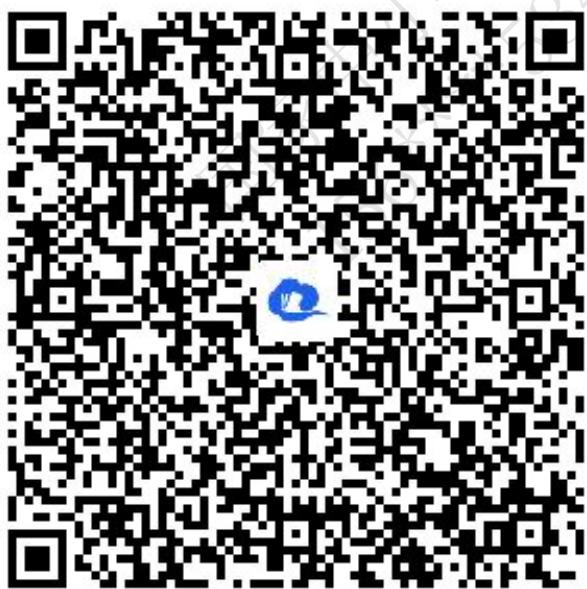

text_image

QR code with a blue logo in the center, likely linking to a digital resource or website.

2.【单选题】已知直线l经过点A（1，0）， $B(2,\sqrt{3})$ ，则直线l的倾斜角是（）

A. $30^{\circ}$   
B. $60^{\circ}$

C. $120^{\circ}$   
D. $150^{\circ}$

【正确答案】B

【更多习题信息】

难易度：适中

知识点：求直线的斜率，会确定倾斜角

【智慧中小学APP扫码查看完整解析】

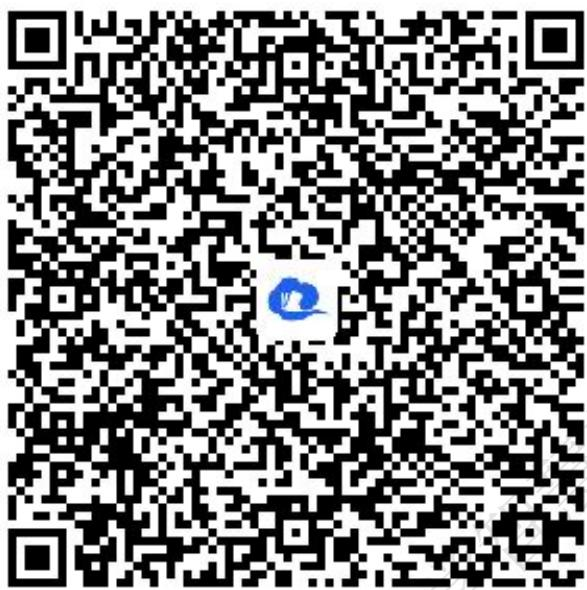

text_image

QR code with a blue logo in the center, likely linking to a digital resource or website.

3.【单选题】已知点A（2，m）\( {} \) \( ，B（3,3），直线AB的斜率为1，那么m的值为（ ）.

A. 1   
B. 2   
C. 3   
D. 4

【正确答案】B

【更多习题信息】

难易度：适中

知识点：过两点斜率公式

【智慧中小学APP扫码查看完整解析】

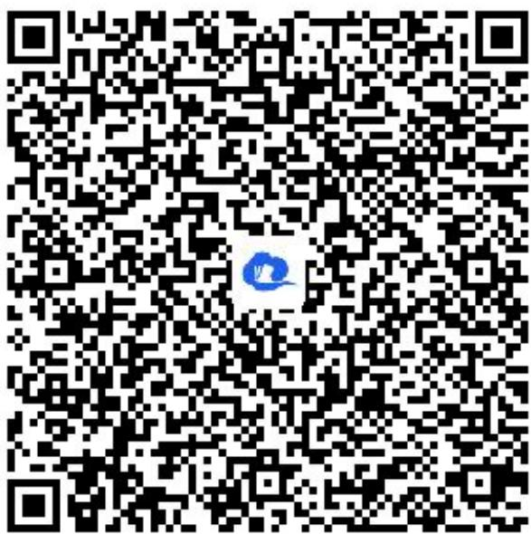

text_image

QR code with a blue logo in the center, likely linking to a digital resource or website.

4.【单选题】下列说法正确的是（）

A. 倾斜角为 $90^{\circ}$ 直线只有一条，即 $y$ 轴.  
B. 平行于x轴的直线的倾斜角是 $0^{\circ}$ 或 $180^{\circ}$ .  
C. 若直线的倾斜角为 $\alpha$ ，则 $\sin\alpha \geq 0$ .  
D. 直线的倾斜角 $\alpha$ 的集合 $\{\alpha | 0^{\circ} \leq \alpha \leq 180^{\circ}\}$ 与直线集合建立一一对应关系.

【正确答案】C

【更多习题信息】

难易度：适中

知识点：直线的倾斜角与方向向量

【智慧中小学APP扫码查看完整解析】

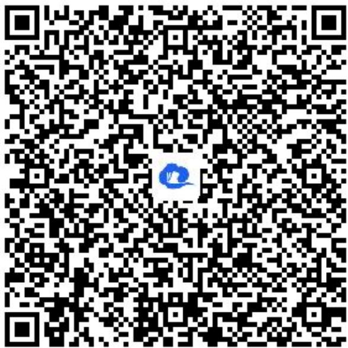

text_image

QR code with a blue logo in the center, likely linking to a digital resource or website.

# 二、填空题（共4题）

5.【填空题】已知三点 $A(a,2)$ ， $B(3,7)$ ， $C(-2,-9a)$ 在同一条直线上，实数a的值为\_\_\_\_。

【正确答案】2或 $\frac{2}{9}$

【提示】

【更多习题信息】

难易度：适中

知识点：过两点斜率公式

【智慧中小学APP扫码查看完整解析】

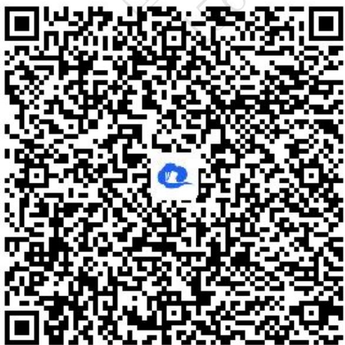

text_image

QR code with a blue logo in the center, likely linking to a digital resource or website.

6.【填空题】若图中直线 $l_{1}$ , $l_{2}$ , $l_{3}$ 的斜率分别为 $k_{1}$ , $k_{2}$ , $k_{3}$ , 则 $k_{1}$ , $k_{2}$ , $k_{3}$ 的大小关系是\_\_\_\_.

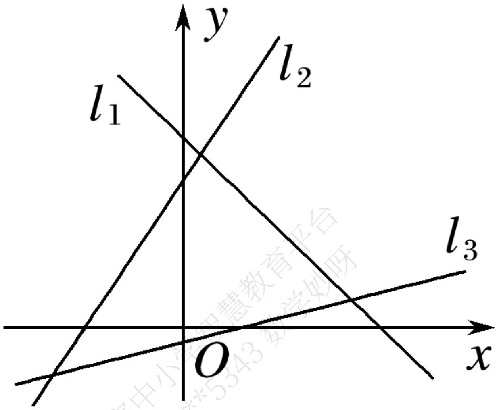

text_image

y
l₁
l₂
O
x
l₃

【正确答案】k1<k3<k2

【更多习题信息】

难易度：适中

知识点：求直线的斜率，会确定倾斜角

【智慧中小学APP扫码查看完整解析】

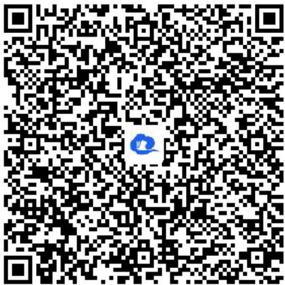

text_image

QR code with a blue logo in the center, likely linking to a digital resource or website.

7.【填空题】已知 $\triangle ABC$ 的顶点坐标为 $A(5, -1)$ ， $B(1, 1)$ ， $C(2, m)$ ，若 $\triangle ABC$ 为直角三角形，则 m 的值为 \_\_\_\_.

【正确答案】-7，3或 $\pm 2$

【更多习题信息】

难易度：适中

知识点：斜率公式的应用

【智慧中小学APP扫码查看完整解析】

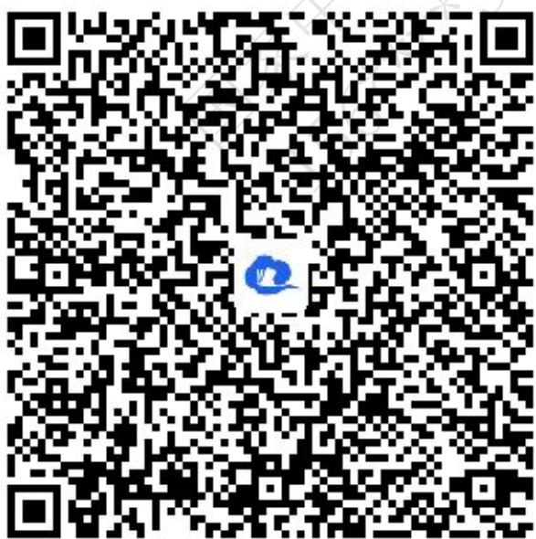

text_image

QR code with a blue logo in the center, likely linking to a digital resource or website.

8.【填空题】已知直线l的一方向向量为 $(-1,\sqrt{3})$ ．则直线l的倾斜角为\_\_\_\_．

【正确答案】 $120^{\circ}$

【更多习题信息】

难易度：适中

知识点：直线的倾斜角与方向向量

【智慧中小学APP扫码查看完整解析】

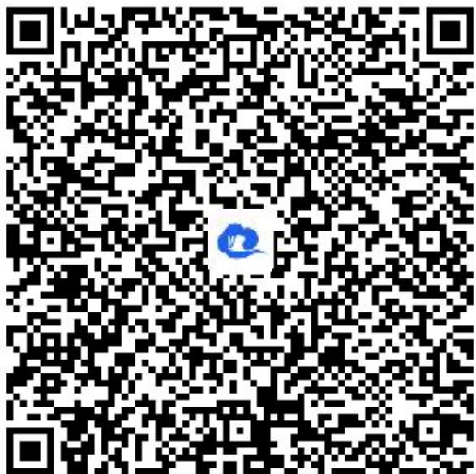

text_image

QR code with a blue logo in the center, likely linking to a digital resource or website.

# 三、问答题（共3题）

9.【问答题】点 $M(x,y)$ 在函数 $y=-2x+8$ 的图像上，当 $x\in[2,5]$ 时，求 $\frac{y+1}{x+1}$ 的取值范围.

【正确答案】 $\left[-\frac{1}{6},\frac{5}{3}\right]$

【更多习题信息】

难易度：适中

知识点：斜率公式的应用

【智慧中小学APP扫码查看完整解析】

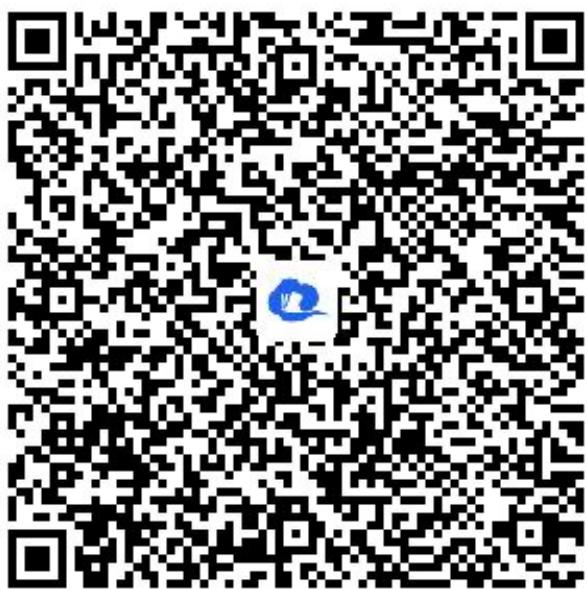

text_image

QR code with a blue circular logo in the center, likely linking to a digital resource or website.

10.【问答题】已知直线l经过两点 $A(2a,a^{2})$ ， $B(0,-1)$ ，求直线l的倾斜角的取值范围.

【正确答案】 $\theta \in [\frac{\pi}{4},\frac{3\pi}{4} ]$

【更多习题信息】

难易度：适中

知识点：过两点斜率公式

【智慧中小学APP扫码查看完整解析】

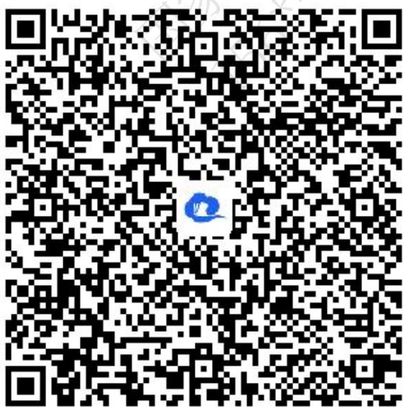

text_image

QR code with a blue logo in the center, likely linking to a digital resource or website.

11.【问答题】一条直线l与x轴相交，其向上的方向与y轴正方向所成的角为 $\alpha$ （ $0^{\circ} < \alpha < 90^{\circ}$ ），求其倾斜角.

【正确答案】当l方向向上的部分在y轴左侧时，倾斜角为 $90^{\circ} + \alpha$ ；

当l方向向上的部分在y轴右侧时，倾斜角为 $90^{\circ}-\alpha$ ，

【更多习题信息】

难易度：适中

知识点：斜率公式的应用

【智慧中小学APP扫码查看完整解析】

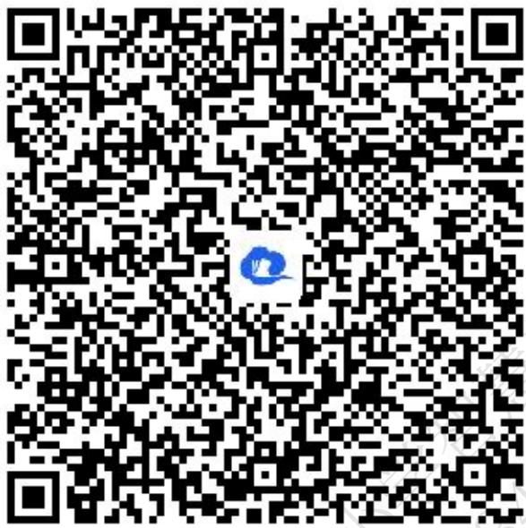

text_image

QR code with a blue logo in the center, likely linking to a digital resource or website.

