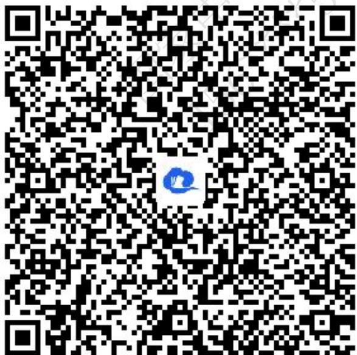
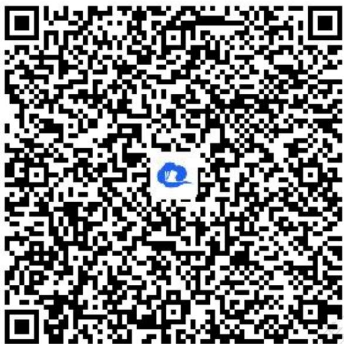
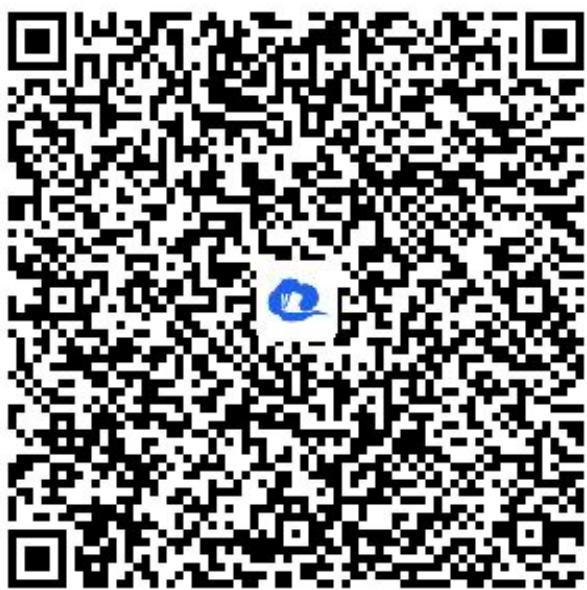

# 高中 数学 选择性必修 第一册

# 第二章 直线和圆的方程 2.1 直线的倾斜角与斜率

# 2.1.2两条直线平行和垂直的判定

# (答案解析)

# 一、单选题（共1题）

1.【单选题】直线 $l_{1}$ 的斜率为2， $l_{1}\parallel l_{2}$ ，直线 $l_{2}$ 过点(-1,1)且与y轴交于点p，则p点坐标为（）

A. $(3,0)$   
B. $(-3,0)$   
C. $(0,-3)$   
D. $(0,3)$

【正确答案】D

【更多习题信息】

难易度：适中

知识点：两条直线平行与垂直与倾斜角、斜率的关系

【智慧中小学APP扫码查看完整解析】

text_image

QR code with a blue logo in the center, likely linking to a digital resource or website.

# 二、填空题（共1题）

2.【填空题】直线 $l_{1}$ ， $l_{2}$ 的斜率 $k_{1}$ ， $k_{2}$ 是关于k的方程 $2k^{2}-4k+m=0$ 的两根；若 $l_{1}\perp l_{2}$ ，则m= \_\_\_\_. 若 $l_{1}//l_{2}$ ，则m= \_\_\_\_.

【正确答案】-2，2

【更多习题信息】

难易度：适中

知识点：两条直线平行与垂直与倾斜角、斜率的关系

【智慧中小学APP扫码查看完整解析】

text_image

QR code with a blue logo in the center, likely linking to a digital resource or website.

# 三、复合题（共1题）

3.【复合题】已知 $A(1,2), B(5,0), C(3,4)$

(1)【问答题】若A,B,C,D可以构成平行四边形，求点D的坐标；  
(2)【问答题】在（1）的条件下，判断 A,B,C,D 构成的平行四边形是否为菱形.

# 【正确答案】

(1)【问答题】 $(-1, 6)$ 或 $(7, 2)$ 或 $(3, -2)$ ;  
(2)【问答题】当D点在 $(-1, 6)$ 时，平行四边形ABCD为菱形；

当 $D$ 点在 $(7, 2)$ 时，平行四边形ABCD不是菱形；

当D点在 $(3, -2)$ 时，平行四边形ABCD不是菱形.

# 【更多习题信息】

难易度：适中

知识点：两条直线平行与垂直与倾斜角、斜率的关系

【智慧中小学APP扫码查看完整解析】

text_image

QR code with a blue logo in the center, likely linking to a digital resource or website.

