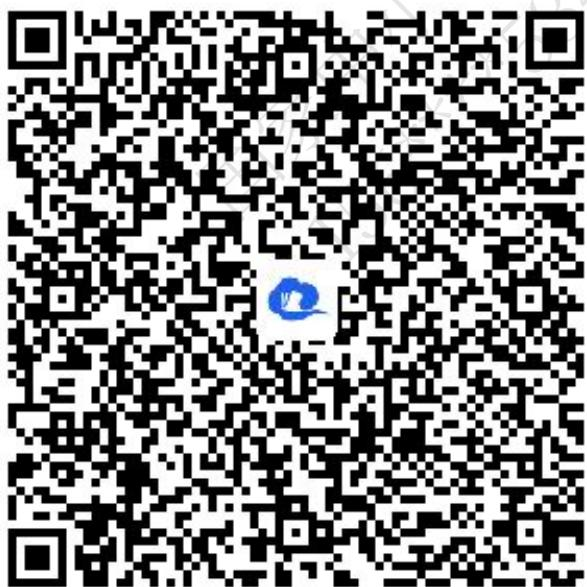
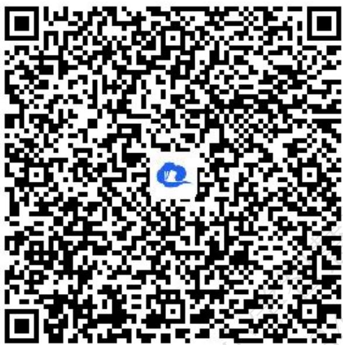
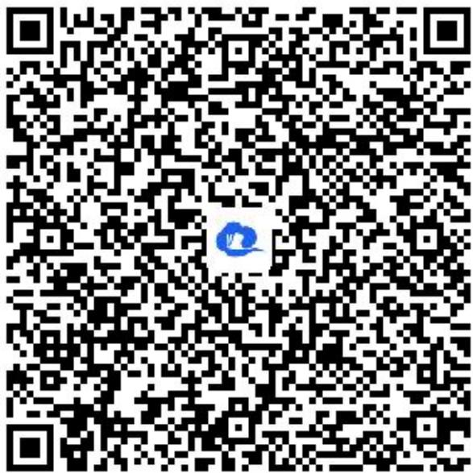
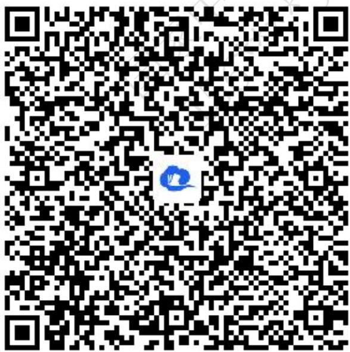
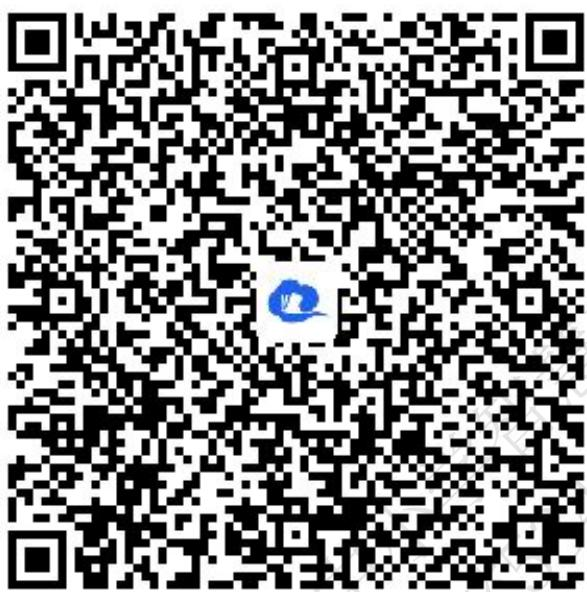
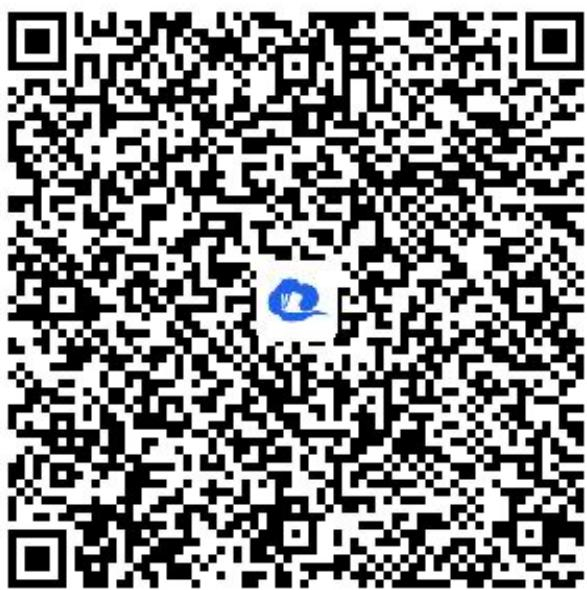

# 高中 数学 选择性必修 第一册

# 第二章 直线和圆的方程 2.2 直线的方程

# 2.2.1 直线的点斜式方程

# (答案解析)

# 一、单选题（共2题）

1.【单选题】直线 $x + \sqrt{3} y - 1 = 0$ 的倾斜角 $\alpha$ 为（）

A. $60^{\circ}$   
B. $120^{\circ}$   
C. $30^{\circ}$   
D. $150^{\circ}$

【正确答案】D

【更多习题信息】

难易度：适中

知识点：求直线的斜截式方程

【智慧中小学APP扫码查看完整解析】

text_image

QR code with a blue logo in the center, likely linking to a digital resource or website.

2.【单选题】在平面直角坐标系中，过点 $(-2,0)$ 且倾斜角为 $135^{\circ}$

的直线不经过（）在平面直角坐标系中，过点且倾斜角为

的直线不经过（ ）

A. 第一象限

B. 第二象限  
C. 第三象限  
D. 第四象限

【正确答案】A

【更多习题信息】

难易度：适中

知识点：求直线的点斜式方程

【智慧中小学APP扫码查看完整解析】

text_image

QR code with a blue logo in the center, likely linking to a digital resource or website.

# 二、填空题（共2题）

3.【填空题】过点(2,3)，且斜率为2的直线l的斜截式方程为\_\_\_\_。

【正确答案】y=2x-1

【更多习题信息】

难易度：适中

知识点：求直线的斜截式方程

【智慧中小学APP扫码查看完整解析】

text_image

QR code with a blue logo in the center, likely linking to a digital resource or website.

4.【填空题】设直线 $(a-1)x+(2a+3)y=2$ 经过定点A，则过点A且斜率为-2的直线方程为\_\_\_\_。

【正确答案】 $10x+5y+6=0$

【更多习题信息】

难易度：适中

知识点：求直线的点斜式方程

【智慧中小学APP扫码查看完整解析】

text_image

QR code with a blue logo in the center, likely linking to a digital resource or website.

# 三、复合题（共1题）

5.【复合题】已知 $\triangle ABC$ 三个顶点是 A(4,4)，B(-4,0)，C(2,0).

(1)【问答题】求AB边中线CD所在直线方程;   
(2)【问答题】求AB边上的高线所在方程;

# 【正确答案】

(1)【问答题】 $x+y-2=0$   
(2)【问答题】 $2x+y-4=0$

# 【更多习题信息】

难易度：适中

知识点：求直线的点斜式方程

【智慧中小学APP扫码查看完整解析】

text_image

QR code with a blue logo in the center, likely linking to a digital resource or website.

# 四、问答题（共1题）

6.【问答题】已知直线l的斜率为-1，且它与两坐标轴围成的三角形的面积为 $\frac{l}{2}$ ，求直线l的方程.

【正确答案】 $y=-x+1$ 或者y=-x-1

【更多习题信息】

难易度：适中

知识点：求直线的斜截式方程

【智慧中小学APP扫码查看完整解析】

text_image

QR code with a blue logo in the center, likely linking to a digital resource or website.

