# 高中 数学 选择性必修 第一册

# 第二章 直线和圆的方程 2.2 直线的方程

# 2.2.3 直线的一般式方程

# (答案解析)

# 一、单选题（共5题）

1.【单选题】如果 $AB < 0$ ， $BC > 0$ ，那么直线 $Ax + By + C = 0$ 不经过（）

A. 第一象限  
B. 第二象限  
C. 第三象限  
D. 第四象限

【正确答案】B

【更多习题信息】

难易度：适中

知识点：求直线的一般式方程

【智慧中小学APP扫码查看完整解析】

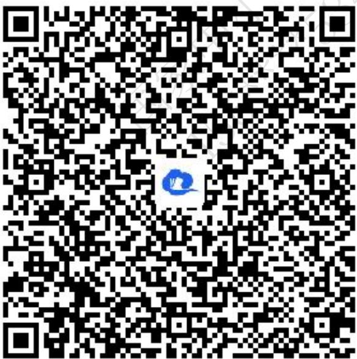

text_image

QR code with a blue logo in the center, likely linking to a digital resource or website.

2.【单选题】下列说法中正确的是

A. 若直线 $l_{1}$ 与 $l_{2}$ 的斜率相等，则 $l_{1} \parallel l_{2}$   
B. 若直线 $l_{1}$ 与 $l_{2}$ 互相平行，则它们的斜率相等

C. 在直线 $l_{1}$ 与 $l_{2}$ 中，若一条直线的斜率存在，另一条直线的斜率不存在，则 $l_{1}$ 与 $l_{2}$ 定相交  
D. 若直线 $l_{1}$ 与 $l_{2}$ 的斜率都不存在，则 $l_{1} \parallel l_{2}$

【正确答案】C

【更多习题信息】

难易度：适中

知识点：两条直线平行的判定及应用

【智慧中小学APP扫码查看完整解析】

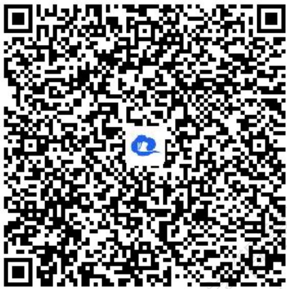

text_image

QR code image with a blue logo in the center, likely linking to a digital resource or website.

3.【单选题】如果平面直角坐标系内的两点 $A(a-1,a+1)$ ， $B(a,a)$ 关于直线l对称，那么直线l的方程为（）

A. $x - y + 1 = 0$   
B. $x + y + l = 0$   
C. $x - y - 1 = 0$   
D. $x + y - 1 = 0$

【正确答案】A

【更多习题信息】

难易度：适中

知识点：点直线间的对称问题

【智慧中小学APP扫码查看完整解析】

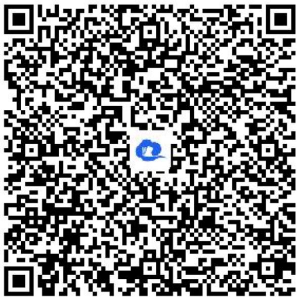

text_image

QR code with a blue logo in the center, likely linking to a digital resource or website.

4.【单选题】下列说法正确的是（）

A. $\frac{y-y_{1}}{x-x_{1}}=k$ 不能表示过点 $M(x_{1},y_{1})$ 且斜率为k的直线方程；  
B. 在x轴, y轴上的截距分别为a, b的直线方程为 $\frac{x}{a}+\frac{y}{b}=1$ ;  
C. 直线 $y = kx + b$ 与 y 轴的交点到原点的距离为 b;  
D. 平面内的所有直线的方程都可以用斜截式来表示.

【正确答案】A

【更多习题信息】

难易度：适中

知识点：综合应用求直线的方程

【智慧中小学APP扫码查看完整解析】

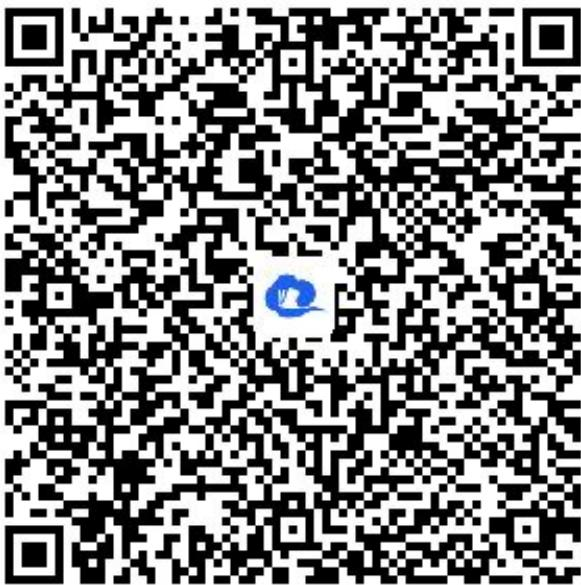

text_image

QR code with a blue logo in the center, likely linking to a digital resource or website.

5.【单选题】当点 $P(3,2)$ 到直线 $mx - y + 1 - 2m = 0$ 的距离最大时，m的值为（）

A. 3

B. 0

C.-1

D. 1

【正确答案】C

【更多习题信息】

难易度：适中

知识点：两条直线垂直的判定及应用

【智慧中小学APP扫码查看完整解析】

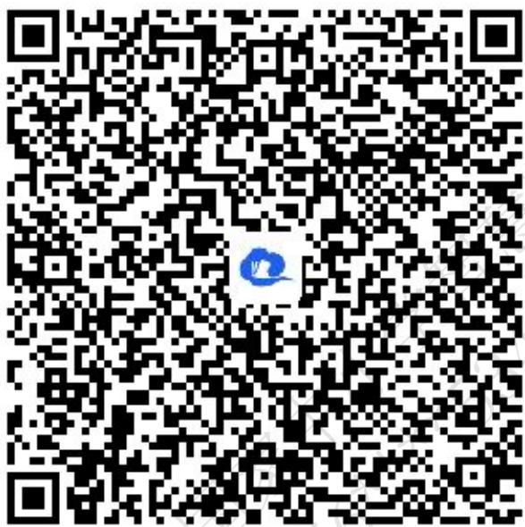

text_image

QR code with a blue logo in the center, likely linking to a digital resource or website.

# 二、填空题（共6题）

6.【填空题】过点(1,0)且与直线x-2y-2=0平行的直线方程是\_\_\_\_

【正确答案】x - 2y - 1 = 0

【更多习题信息】

难易度：适中

知识点：两条直线平行的判定及应用

【智慧中小学APP扫码查看完整解析】

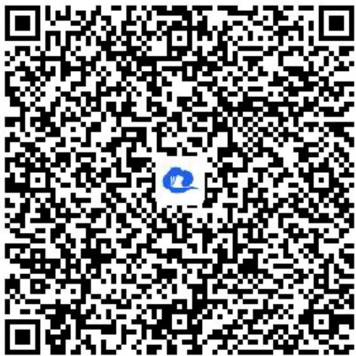

text_image

QR code with a blue logo in the center, likely linking to a digital resource or website.

7.【填空题】已知直线 $a_{1}x + b_{1}y + 1 = 0$ 和直线 $a_{2}x + b_{2}y + 1 = 0$ 都过点 $A(2,1)$ ，则过点 $P_{1}(a_{1},b_{1})$ 和点 $P_{2}(a_{2},b_{2})$ 的直线方程是\_\_\_\_。

【正确答案】 $2x + y + l = 0$

【更多习题信息】

难易度：适中

知识点：求直线的一般式方程

【智慧中小学APP扫码查看完整解析】

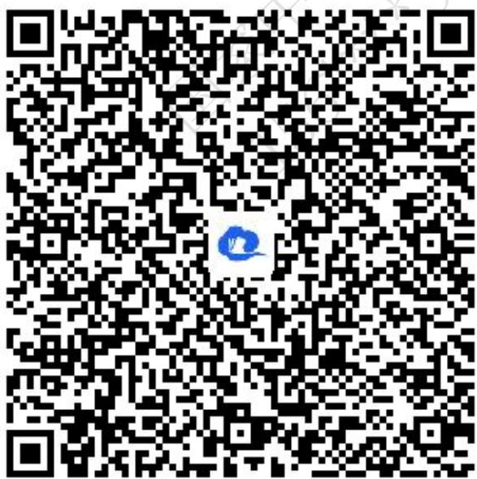

text_image

QR code with a blue logo in the center, likely linking to a digital resource or website.

8.【填空题】若直线 $l_{1}:(a+2)x+(1-a)y-3=0$ 与 $l_{2}:(a-1)x+(2a+3)y+2=0$ 互相垂直，则a的值为\_\_\_\_

【正确答案】 $a=\pm1$

【更多习题信息】

难易度：适中

知识点：两条直线垂直的判定及应用

【智慧中小学APP扫码查看完整解析】

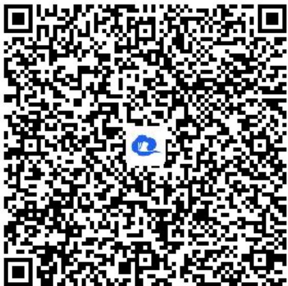

text_image

QR code with a blue logo in the center, likely linking to a digital resource or website.

9.【填空题】经过点 $P(-1,2)$ ，并且在两坐标轴上的截距的绝对值相等的直线有\_\_\_\_。

【正确答案】3

【更多习题信息】

难易度：适中

知识点：综合应用求直线的方程

【智慧中小学APP扫码查看完整解析】

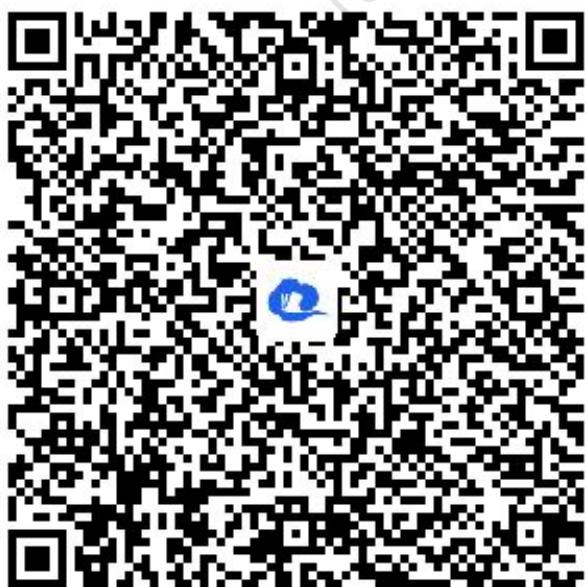

text_image

QR code with a blue logo in the center, likely linking to a digital resource or website.

10.【填空题】设 $m \in R$ ，动直线 $l_{1}: x + my - 1 = 0$ 过定点A，动直线 $l_{2}: mx - y - 2m + \sqrt{3} = 0$ 过定点B，若直线 $l_{1}$ 与 $l_{2}$ 相交于点P（异于点A,B），则 $\Delta PAB$ 周长的最大值为\_\_\_\_

【正确答案】 $2 + 2\sqrt{2}$

【更多习题信息】

难易度：适中

知识点：两条直线垂直的判定及应用

【智慧中小学APP扫码查看完整解析】

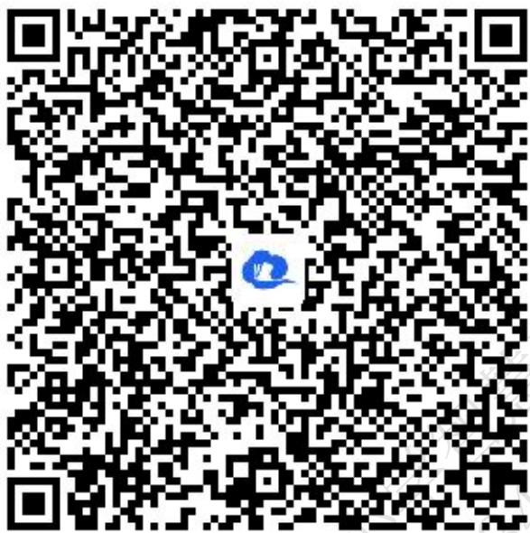

text_image

QR code with a blue logo in the center, likely linking to a digital resource or website.

11.【填空题】点(2, -3)关于直线x - y = 0对称的点的坐标为\_\_\_\_。

【正确答案】(-3,2).

【更多习题信息】

难易度：适中

知识点：点直线间的对称问题

【智慧中小学APP扫码查看完整解析】

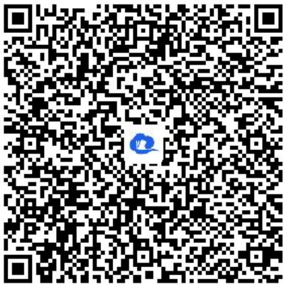

text_image

QR code with a blue logo in the center, likely linking to a digital resource or website.

# 三、复合题（共2题）

12.【复合题】已知直线 $l: kx - y + 1 + 2k = 0$

(1)【问答题】求证：直线l经过定点.   
(2)【问答题】若直线l交x轴负半轴于点A，交y轴正半轴于点B， $\triangle AOB$ 的面积为S，求S的最小值并求此时直线l的方程.

【正确答案】

(1)【问答题】证明见解析视频   
(2)【问答题】 $x - 2y + 4 = 0$ .

【更多习题信息】

难易度：适中

知识点：求直线的一般式方程

【智慧中小学APP扫码查看完整解析】

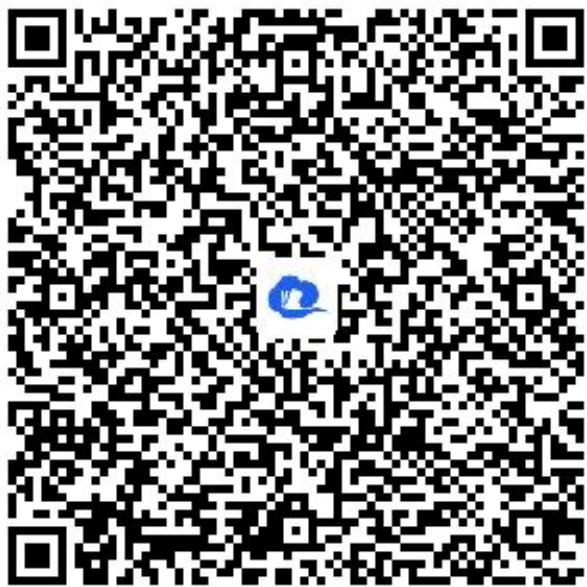

text_image

QR code with a blue logo in the center, likely linking to a digital resource or website.

13.【复合题】过点 $P(4,1)$ 作直线l分别交x轴，y轴正半轴于A，B两点，O为坐标原点.

(1)【问答题】当 $\triangle AOB$ 面积最小时，求直线 l 的方程；  
(2)【问答题】当 $|OA| + |OB|$ 取最小值时，求直线??的方程.

【正确答案】

(1)【问答题】 $x + 4y - 8 = 0$   
(2)【问答题】 $x + 2y - 6 = 0$

【更多习题信息】

难易度：适中

知识点：综合应用求直线的方程

【智慧中小学APP扫码查看完整解析】

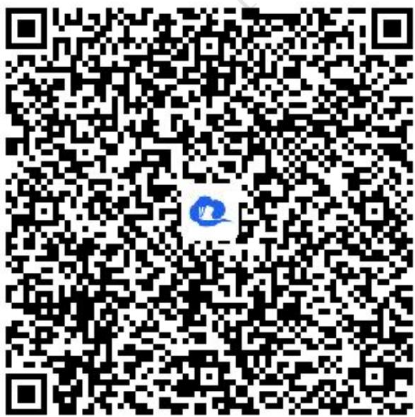

text_image

QR code with a blue logo in the center, likely linking to a digital resource or website.

# 四、问答题（共2题）

14.【问答题】已知直线 $l_{1}:x+my+6=0,\quad l_{2}:(m-2)x+3y+2m=0.$ 若 $l_{1}\parallel l_{2}$ ，求m的值.

【正确答案】 $m = -1$

【更多习题信息】

难易度：适中

知识点：两条直线平行的判定及应用

【智慧中小学APP扫码查看完整解析】

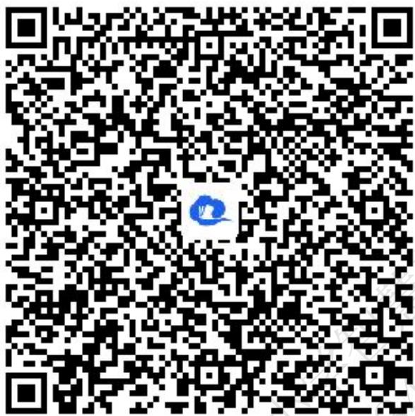

text_image

QR code with a blue logo in the center, likely linking to a digital resource or website.

15.【问答题】已知 $A(3,-1)$ ， $B(5,-2)$ ，点P在直线 $x+y=0$ 上，若使 $|PA|+|PB|$ 取最小值，求点P的坐标.

【正确答案】 $\left(\frac{13}{5},-\frac{13}{5}\right)$

【更多习题信息】

难易度：适中

知识点：点直线间的对称问题

【智慧中小学APP扫码查看完整解析】

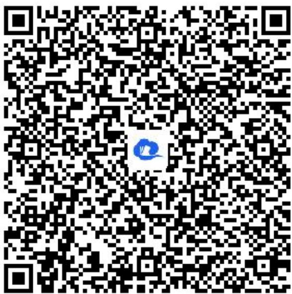

text_image

QR code with a blue logo in the center, likely linking to a digital resource or website.

