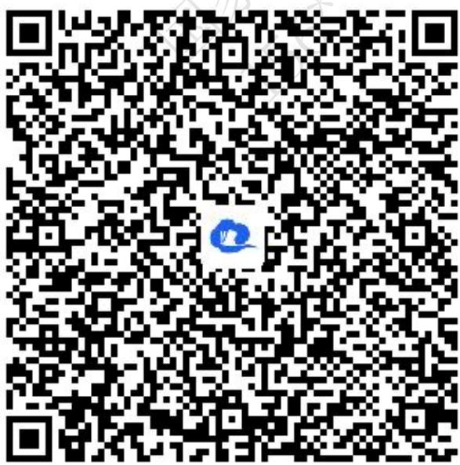
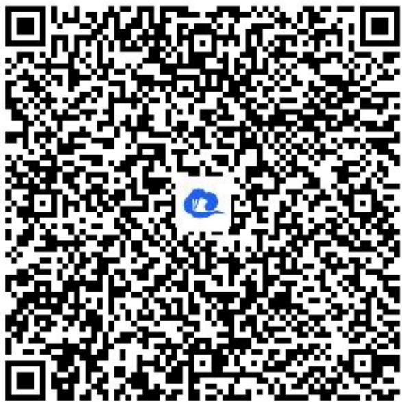
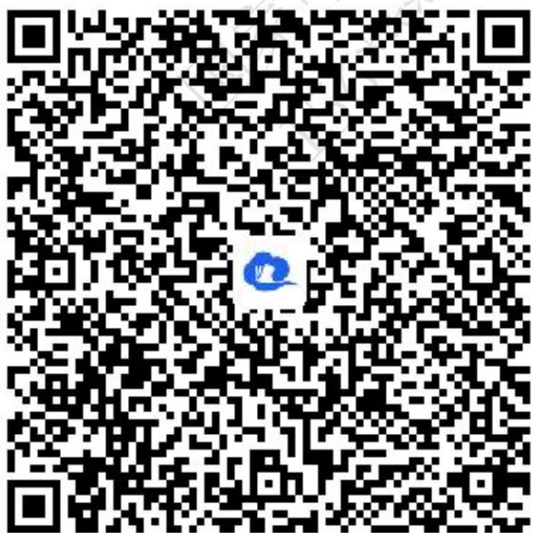
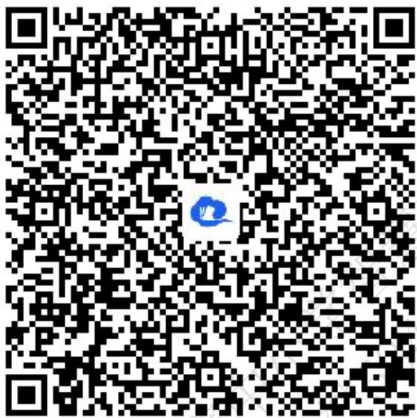
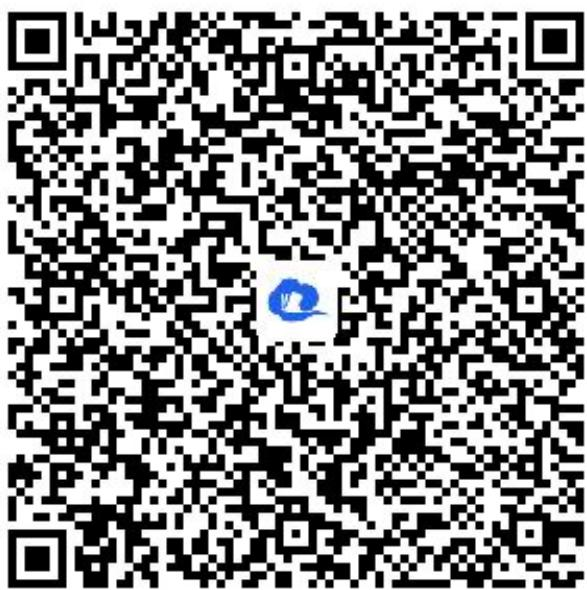

# 高中 数学 选择性必修 第一册

# 第二章 直线和圆的方程 2.3

# 直线的交点坐标与距离公式

# 2.3.1 两条直线的交点坐标

# (答案解析)

# 一、单选题（共2题）

1.【单选题】直线l经过两条直线 $x - y + 1 = 0$ 和 $2x + 3y + 2 = 0$ 的交点，且平行于直线 $x - 2y + 4 = 0$ ，则直线l的方程为（）

A. $x - 2y - 1 = 0$   
B. $x - 2y + 1 = 0$   
C. $2x - y + 2 = 0$   
D. $2x + y - 2 = 0$

【正确答案】B

【更多习题信息】

难易度：适中

知识点：两条直线的交点坐标

【智慧中小学APP扫码查看完整解析】

text_image

QR code with a blue logo in the center, likely linking to a digital resource or website.

2.【单选题】直线 $y = x$ 与直线 $x + y - 2 = 0$ 的交点坐标是（）

A. $(1,1)$   
B. $\left(\frac{1}{2},\frac{1}{2}\right)$   
C. $(1,2)$   
D. $(2,1)$

【正确答案】A

【更多习题信息】

难易度：简单

知识点：两条直线的交点坐标

【智慧中小学APP扫码查看完整解析】

text_image

QR code with a blue logo in the center, likely linking to a digital resource or website.

# 二、填空题（共2题）

3.【填空题】若关于x,y的二元一次方程组 $\left\{\begin{aligned}&4x+my=m-2\\ &mx+y+m=0\end{aligned}\right.$ 有无穷多组解，则m= \_\_\_\_.

【正确答案】-2

【更多习题信息】

难易度：适中

知识点：两条直线的交点坐标

【智慧中小学APP扫码查看完整解析】

text_image

QR code with a blue logo in the center, likely linking to a digital resource or website.

4.【填空题】已知直线l经过两条直线 $2x-3y+10=0$ 和 $3x+4y-2=0$ 的交点，且垂直于直线 $3x-2y+4=0$ ，则直线l方程为\_\_\_\_。

【正确答案】 $2x + 3y - 2 = 0$

【更多习题信息】

难易度：适中

知识点：两条直线的交点坐标

【智慧中小学APP扫码查看完整解析】

text_image

QR code with a blue logo in the center, likely linking to a digital resource or website.

# 三、复合题（共2题）

5.【复合题】已知直线 $l_{1}:3x+my-1=0,\quad l_{2}:3x-2y-5=0,\quad l_{3}:6x+y-5=0.$

(1)【问答题】若这三条直线交于一点，求实数m的值；  
(2)【问答题】若三条直线能构成三角形，求m满足的条件.

# 【正确答案】

(1)【问答题】m=2   
(2)【问答题】当 $m \neq \pm 2$ 且 $m \neq \frac{1}{2}$ 时，三条直线能构成三角形

# 【更多习题信息】

难易度：适中

知识点：两条直线的交点坐标

【智慧中小学APP扫码查看完整解析】

text_image

QR code with a blue logo in the center, likely linking to a digital resource or website.

6.【复合题】已知：直线 $l_{1}$ ： $x + y - 3 = 0$ 与直线 $l_{2}$ ： $2x - 3y - 1 = 0$ 交于点P.

(1)【问答题】求直线 $l_{1}$ 和 $l_{2}$ 交点P的坐标.  
(2)【问答题】若过点P的直线l与两坐标轴截距互为相反数，求l的直线方程.

# 【正确答案】

(1)【问答题】点P的坐标为（2,1）  
(2)【问答题】直线l为：x - y - 1 = 0或x - 2y = 0

# 【更多习题信息】

难易度：适中

知识点：两条直线的交点坐标

【智慧中小学APP扫码查看完整解析】

text_image

QR code with a blue logo in the center, likely linking to a digital resource or website.

