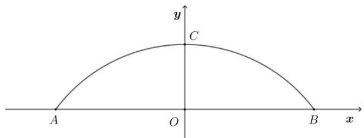

# 高中 数学 选择性必修 第一册

# 第二章 直线和圆的方程 2.4 圆的方程

# 2.4.1 圆的标准方程

# 一、单选题（共4题）

1.【单选题】以点 $A(-3,4)$ 为圆心，且与y轴相切的圆的标准方程为()

A. $(x + 3)^{2} + (y - 4)^{2} = 16$

B. $(x + 3)^{2} + (y + 4)^{2} = 16$

C. $(x + 3)^{2} + (y - 4)^{2} = 9$

D. $(x + 3)^{2} + (y + 4)^{2} = 9$

2.【单选题】若原点在圆 $(x-3)^{2}+(y+4)^{2}=m$ 的外部，则实数m的取值范围是()

A. $m > 25$

B. $m > 5$

C. 0 < m < 25

D. 0 < m < 5

3.【单选题】已知圆C经过两点 $A_{(0,2)},B(4,6)$ ，且圆心C在直线l:2x-y-3=0上，则圆C的方程()

A. $x^{2} + (y - 3)^{2} = 25$

B. $(x - 1)^{2} + (y + 1)^{2} = 10$

C. $(x - 3)^{2} + (y - 3)^{2} = 10$

D. $(x - 1)^{2} + (y + 1)^{2} = 58$

4.【单选题】已知点 $A(-2,1),B(0,-3)$ ，则以线段AB为直径的圆的方程为()

A. $(x - 1)^{2} + (y - 1)^{2} = 5$

B. $(x+1)^{2}+(y+1)^{2}=5$

C. $(x - 1)^{2} + (y - 1)^{2} = 20$

D. $(x + 1)^{2} + (y + 1)^{2} = 20$

# 二、多选题（共2题）

5.【多选题】（多选）已知圆的方程是 $(x - 2)^{2} + (y - 3)^{2} = 4$ ，则下列坐标表示点在圆内的有（）

A. $(-3,2)$   
B. $(3,2)$   
C. $(1,4)$   
D. $(1,1)$

6.【多选题】(多选)下列说法错误的是（）

A. 圆 $(x - 1)^2 + (y - 2)^2 = 5$ 的圆心为 $(1,2)$ ，半径为5  
B. 圆 $(x+2)^{2}+y^{2}=b^{2}(b\neq0)$ 的圆心为(-2,0)，半径为b  
C. 圆 $x^{2} + y^{2} = 3$ 的圆心为 $(0,0)$ ，半径为 $\sqrt{3}$   
D. 方程 $(x + 2)^{2} + (y + 2)^{2} = m$ 表示圆

# 三、填空题（共4题）

7.【填空题】若圆的方程为 $(x + \frac{k}{2})^2 +(y + 1)^2 = 1 - \frac{3}{4} k^2$

，则当圆的面积最大时，圆心坐标和半径分别为\_\_\_\_、\_\_\_\_。

8.【填空题】一圆与圆C: $(x+2)^{2}+(y+1)^{2}=4$

为同心圆且面积为圆C面积的两倍，此圆的标准方程为\_\_\_\_。

9.【填空题】已知两圆 $C_{1}:(x-5)^{2}+(y-3)^{2}=9$ 和 $C_{2}:(x-2)^{2}+(y+1)^{2}=8$

，则两圆圆心间的距离为\_\_\_\_。

10.【填空题】在平面直角坐标系中， $\triangle ABC$ 的三个顶点分别是 $(0,0), (-2,0), (0,-4)$

，求三角形的外接圆的标准方程为\_\_\_\_。

# 四、复合题（共1题）

11.【复合题】为了开发古城旅游观光资源，镇政府决定在护城河上建一座圆形拱桥，河面跨度AB为32米，拱桥顶点C离河面8米.

text_image

y
C
A
O
B
x

(1)【问答题】如果以跨度AB所在直线为x轴，以AB中垂线为y

轴建立如图的直角坐标系，试求出该圆形拱桥所在圆的方程；

(2)【问答题】现有游船船宽8米，船舱顶部为长方形，船顶离水面7米，为保证安全，要求行船顶部与拱桥顶部的竖直方向高度差至少要

0.5米．问这条船能否顺利通过这座拱桥，并说出理由.

# 五、问答题（共2题）

12.【问答题】平面直角坐标系中有 $A_{(0,1)},B_{(2,1)},C_{(3,4)},D_{(-1,2)}$

四点，这四点能否在同一个圆上？为什么？

13.【问答题】已知圆C经过原点O(0,0)且与直线y = 2x - 8相切于点P(4,0) $\{\}$ , 求圆C的方程.