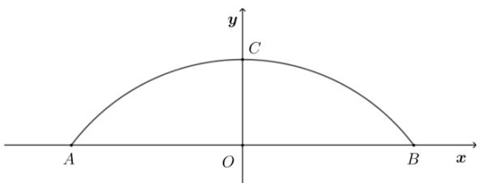

# 高中 数学 选择性必修 第一册

# 第二章 直线和圆的方程 2.4 圆的方程

# 2.4.1 圆的标准方程

# (答案解析)

# 一、单选题（共4题）

1.【单选题】以点 $A(-3,4)$ 为圆心，且与y轴相切的圆的标准方程为()

A. $(x + 3)^{2} + (y - 4)^{2} = 16$   
B. $(x + 3)^{2} + (y + 4)^{2} = 16$   
C. $(x + 3)^{2} + (y - 4)^{2} = 9$   
D. $(x + 3)^{2} + (y + 4)^{2} = 9$

【正确答案】C

【更多习题信息】

难易度：简单

知识点：求圆的标准方程

【智慧中小学APP扫码查看完整解析】

text_image

QR code with a blue logo in the center, likely linking to a digital resource or website.

2.【单选题】若原点在圆 $(x-3)^{2}+(y+4)^{2}=m$ 的外部，则实数m的取值范围是()

A. $m > 25$   
B. m > 5

C. 0 < m < 25   
D. 0 < m < 5

【正确答案】C

【更多习题信息】

难易度：简单

知识点：判断点与圆的位置关系

【智慧中小学APP扫码查看完整解析】

text_image

QR code with a blue logo in the center, likely linking to a digital resource or website.

3.【单选题】已知圆C经过两点 $A(0,2)$ , $B(4,6)$ ，且圆心C在直线l:2x - y - 3 = 0上，则圆C的方程()

A. $x^{2} + (y - 3)^{2} = 25$   
B. $(x - 1)^{2} + (y + 1)^{2} = 10$   
C. $(x - 3)^{2} + (y - 3)^{2} = 10$   
D. $(x-1)^{2}+(y+1)^{2}=58$

【正确答案】C

【更多习题信息】

难易度：适中

知识点：求圆的标准方程

【智慧中小学APP扫码查看完整解析】

text_image

QR code with a blue logo in the center, likely linking to a digital resource or website.

4.【单选题】已知点 $A(-2,1),B(0,-3)$ ，则以线段AB为直径的圆的方程为()

A. $(x - 1)^{2} + (y - 1)^{2} = 5$   
B. $(x + 1)^{2} + (y + 1)^{2} = 5$   
C. $(x - 1)^{2} + (y - 1)^{2} = 20$   
D. $(x + 1)^{2} + (y + 1)^{2} = 20$

【正确答案】B

【更多习题信息】

难易度：简单

知识点：求圆的标准方程

【智慧中小学APP扫码查看完整解析】

text_image

QR code with a blue logo in the center, likely linking to a digital resource or website.

# 二、多选题（共2题）

5.【多选题】（多选）已知圆的方程是 $(x - 2)^{2} + (y - 3)^{2} = 4$ ，则下列坐标表示点在圆内的有（）

A. $(-3,2)$   
B. $(3,2)$   
C. $(1,4)$   
D. $(1,1)$

【正确答案】BC

【更多习题信息】

难易度：简单

【智慧中小学APP扫码查看完整解析】

text_image

QR code with a blue logo in the center, likely linking to a digital resource or website.

6.【多选题】(多选)下列说法错误的是（）

A. 圆 $(x - 1)^2 + (y - 2)^2 = 5$ 的圆心为 $(1,2)$ ，半径为5  
B. 圆 $(x + 2)^{2} + y^{2} = b^{2}(b \neq 0)$ 的圆心为 $(-2,0)$ , 半径为 $b$   
C. 圆 $x^{2} + y^{2} = 3$ 的圆心为 $(0,0)$ ，半径为 $\sqrt{3}$   
D. 方程 $(x + 2)^{2} + (y + 2)^{2} = m$ 表示圆

【正确答案】ABD

【更多习题信息】

难易度：简单

知识点：由圆的标准方程确定圆心和半径

【智慧中小学APP扫码查看完整解析】  

text_image

QR code with a blue circular logo in the center, likely linking to a digital resource or website.

# 三、填空题（共4题）

7.【填空题】若圆的方程为 $(x+\frac{k}{2})^{2}+(y+1)^{2}=1-\frac{3}{4}k^{2}$ ，则当圆的面积最大时，圆心坐标和半径分别为\_\_\_\_、\_\_\_\_。

【正确答案】 $(0, -1)$ ，1

【更多习题信息】

难易度：适中

知识点：由圆的标准方程确定圆心和半径

【智慧中小学APP扫码查看完整解析】

text_image

QR code with a blue logo in the center, likely linking to a digital resource or website.

8.【填空题】一圆与圆C: $(x + 2)^{2} + (y + 1)^{2} = 4$

为同心圆且面积为圆C面积的两倍，此圆的标准方程为\_\_\_\_。

【正确答案】 $(x + 2)^{2} + (y + 1)^{2} = 8$

【更多习题信息】

难易度：简单

知识点：求圆的标准方程

【智慧中小学APP扫码查看完整解析】

text_image

QR code with a blue logo in the center, likely linking to a digital resource or website.

9.【填空题】已知两圆 $C_{1}:(x-5)^{2}+(y-3)^{2}=9$ 和 $C_{2}:(x-2)^{2}+(y+1)^{2}=8$ ，则两圆圆心间的距离为\_\_\_\_.

【正确答案】5

【更多习题信息】

难易度：简单

知识点：由圆的标准方程确定圆心和半径

【智慧中小学APP扫码查看完整解析】

text_image

QR code with a blue logo in the center, likely linking to a digital resource or website.

10.【填空题】在平面直角坐标系中， $\triangle ABC$ 的三个顶点分别是 $(0,0)\cdot(-2,0)\cdot(0,-4)$ ，求三角形的外接圆的标准方程为\_\_\_\_。

【正确答案】 $(x + 1)^{2} + (y + 2)^{2} = 5$

【更多习题信息】

难易度：适中

知识点：求圆的标准方程

【智慧中小学APP扫码查看完整解析】

text_image

QR code with a blue logo in the center, likely linking to a digital resource or website.

# 四、复合题（共1题）

11.【复合题】为了开发古城旅游观光资源，镇政府决定在护城河上建一座圆形拱桥，河面跨度AB为32米，拱桥顶点C离河面8米.

text_image

y
C
A O B x

(1)【问答题】如果以跨度AB所在直线为x轴，以AB中垂线为y

轴建立如图的直角坐标系，试求出该圆形拱桥所在圆的方程；

(2)【问答题】现有游船船宽8米，船舱顶部为长方形，船顶离水面7米，为保证安全，要求行船顶部与拱桥顶部的竖直方向高度差至少要

0.5米．问这条船能否顺利通过这座拱桥，并说出理由.

# 【正确答案】

(1)【问答题】 $B_{(16,0)}, C_{(0,8)}$ ，设圆心 $(0,b)$ ，圆的方程为： $x^{2}+(y-b)^{2}=r^{2}$ ，由圆过点B、C可得 $\left\{\begin{aligned}(8-b)^{2}&=r^{2}\\ 256+b^{2}&=r^{2}\end{aligned}\right.$ ，解得b=-12，r=20。∴拱桥所在的圆方程是： $x^{2}+(y+12)^{2}=400$   
(2)【问答题】可设船右上角竖直方向0.5米处点为 $p(4,7.5)$ ，代入圆方程左端得396.25<400，所以点P在圆内，故船可以通过.

【更多习题信息】

难易度：适中

知识点：判断点与圆的位置关系

【智慧中小学APP扫码查看完整解析】

text_image

QR code with a blue logo in the center, likely linking to a digital resource or website.

# 五、问答题（共2题）

12.【问答题】平面直角坐标系中有 $A_{(0,1)},B_{(2,1)},C_{(3,4)},D_{(-1,2)}$ 四点，这四点能否在同一个圆上？为什么？

【正确答案】能．理由如下：

设过 $A(0,1), B(2,1), C(3,4)$ 的圆的方程为 $(x - a)^2 + (y - b)^2 = r^2$ . 将 $A, B, C$ 三点的坐标分别代入有 $\begin{cases} a^2 + (1 - b)^2 = r^2 \\ (2 - a)^2 + (1 - b)^2 = r^2, \text{解得:} \\ (3 - a)^2 + (4 - b)^2 = r^2 \end{cases}$ 即圆的方程为 $(x - 1)^2 + (y - 3)^2 = 5$ . 将 $D(-1,2)$ 代入上式圆的方程，得 $(-1 - 1)^2 + (2 - 3)^2 = 5$ . 即 $D$ 点坐标适合此圆的方程．故 $A, B, C, D$ 四点在同一个圆上.

【更多习题信息】

难易度：适中

知识点：判断点与圆的位置关系

【智慧中小学APP扫码查看完整解析】

text_image

QR code with a blue logo in the center, likely linking to a digital resource or website.

13.【问答题】已知圆C经过原点O(0,0)且与直线y=2x-8相切于点P(4,0)\$\$\$\$,\$求圆C的方程.

【正确答案】法一：由已知，得圆心在经过点 $P(4,0)$ 且与y=2x-8垂直的直线 $y=-\frac{1}{2}x+2$ 上，它又在线段OP的中垂线x=2上，所以求得圆心 $C_{(2,1)}$ ，半径为 $\sqrt{5}$ 。所以圆C的方程为 $(x-2)^{2}+(y-1)^{2}=5$ 。法二：设圆C的方程为 $(x-a)^{2}+(y-b)^{2}=r^{2}$ ，可得 $\left\{\begin{aligned}\frac{a^{2}+b^{2}}{a-4}&=-\frac{1}{2}\\ (a-4)^{2}&+b^{2}=r^{2}\end{aligned}\right.$ ，解得 $\left\{\begin{aligned}a&=2\\ b&=1\\ r&=\sqrt{5}\end{aligned}\right.$ ，所以圆C的方程为 $(x-2)^{2}+(y-1)^{2}=5$ 。

【更多习题信息】

难易度：适中

知识点：求圆的标准方程

【智慧中小学APP扫码查看完整解析】

text_image

QR code with a blue logo in the center, likely linking to a digital resource or website.

