# 高中 数学 选择性必修 第一册

# 第二章 直线和圆的方程 2.4 圆的方程

# 2.4.2 圆的一般方程

# (答案解析)

# 一、单选题（共9题）

1.【单选题】已知点 $A(-1,5)$ ，设 $P(x,y)$ 是圆 $(x - 2)^{2} + (y - 1)^{2} = 1$ 上任意一点，则 $|AP|$ 的最小值是（ ）.

A. $\sqrt{7}$   
B. 4   
C. 6   
D. 3

【正确答案】B

【更多习题信息】

难易度：适中

知识点：圆的方程中的最值问题

【智慧中小学APP扫码查看完整解析】

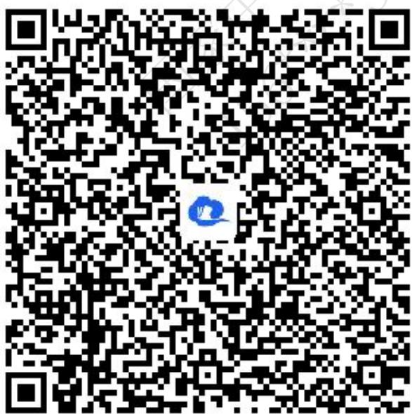

text_image

QR code with a blue logo in the center, likely linking to a digital resource or website.

2.【单选题】已知点 $P(-3,1)$ ，A为圆 $x^{2}+y^{2}=4$ 上一动点，则线段AP的中点M的轨迹方程是（）.

A. $\left(x-\frac{3}{2}\right)^{2}+\left(y-\frac{1}{2}\right)^{2}=1$   
B. $\left(x+\frac{3}{2}\right)^{2}+\left(y-\frac{1}{2}\right)^{2}=1$   
C. $\left(x-\frac{3}{2}\right)^{2}+\left(y+\frac{1}{2}\right)^{2}=1$   
D. $\left(x+\frac{3}{2}\right)^{2}+\left(y+\frac{1}{2}\right)^{2}=1$

【正确答案】B

【更多习题信息】

难易度：适中

知识点：与圆相关的轨迹问题

【智慧中小学APP扫码查看完整解析】

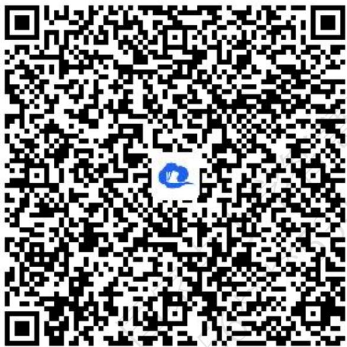

text_image

QR code with a blue logo in the center, likely linking to a digital resource or website.

3.【单选题】已知圆 $x^{2} + y^{2} - 2x + my = 0$ 上任意一点M关于直线 $x + y = 0$ 的对称点N也在圆上，则m的值为\$ {}

(\hspace {0.25em} \hspace {0.25em} \hspace {0.25em} \hspace {0.25em}) {}\$.

A.-1   
B. 1   
C. 2   
D.-2

【正确答案】C

【更多习题信息】

难易度：适中

知识点：圆的对称性的应用

【智慧中小学APP扫码查看完整解析】

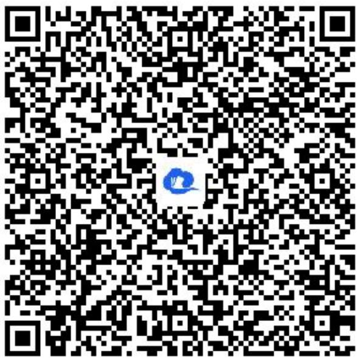

text_image

QR code with a blue logo in the center, likely linking to a digital resource or website.

4.【单选题】若圆C与圆 $(x+2)^{2}+(y-1)^{2}=1$ 关于原点对称，则圆C的方程为（）.

A. $(x - 2)^{2} + (y + 1)^{2} = 1$   
B. $(x - 2)^{2} + (y - 1)^{2} = 1$   
C. $(x - 1)^{2} + (y + 2)^{2} = 1$   
D. $(x + 1)^{2} + (y - 2)^{2} = 1$

【正确答案】A

【更多习题信息】

难易度：适中

知识点：圆的对称性的应用

【智慧中小学APP扫码查看完整解析】

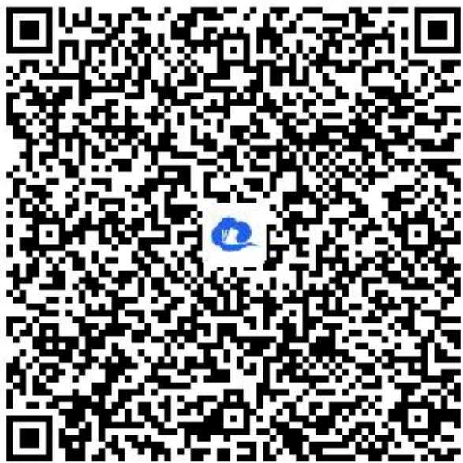

text_image

QR code with a blue logo in the center, likely linking to a digital resource or website.

5.【单选题】圆心为 $(1,-1)$ 且过原点的圆的一般方程是().

A. $x^{2} + y^{2} + 2x - 2y + 1 = 0$   
B. $x^{2} + y^{2} - 2x + 2y + 1 = 0$   
C. $x^{2} + y^{2} + 2x - 2y = 0$   
D. $x^{2} + y^{2} - 2x + 2y = 0$

【正确答案】D

【更多习题信息】

难易度：简单

知识点：求圆的一般方程

【智慧中小学APP扫码查看完整解析】

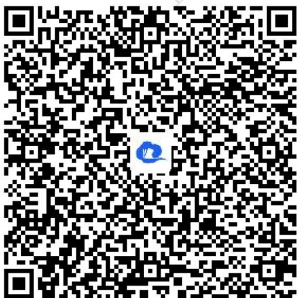

text_image

QR code with a blue logo in the center, likely linking to a digital resource or website.

6.【单选题】已知圆的方程是 $x^{2}+y^{2}-2x-4=0$ ，则该圆的圆心坐标及半径分别为（）.

A. $(1,0)$ 与5  
B. $(1,0)$ 与 $\sqrt{5}$   
C. $(-1,0)$ 与5  
D. $(-1,0)$ 与 $\sqrt{5}$

【正确答案】B

【更多习题信息】

难易度：简单

知识点：圆的一般方程与标准方程之间的互化

【智慧中小学APP扫码查看完整解析】

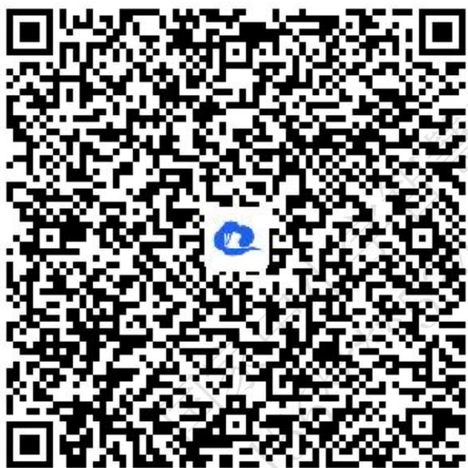

text_image

QR code with a blue logo in the center, likely linking to a digital resource or website.

7.【单选题】已知 $a\in R$ ，方程 $a^{2}x^{2}+(a+2)y^{2}+2ax+a=0$ 表示圆，则a的值为（）.

A. 1或-2   
B. 2或-1   
C.-1   
D. 2

【正确答案】C

【更多习题信息】

难易度：适中

知识点：二元二次方程表示的曲线与圆的关系

【智慧中小学APP扫码查看完整解析】  
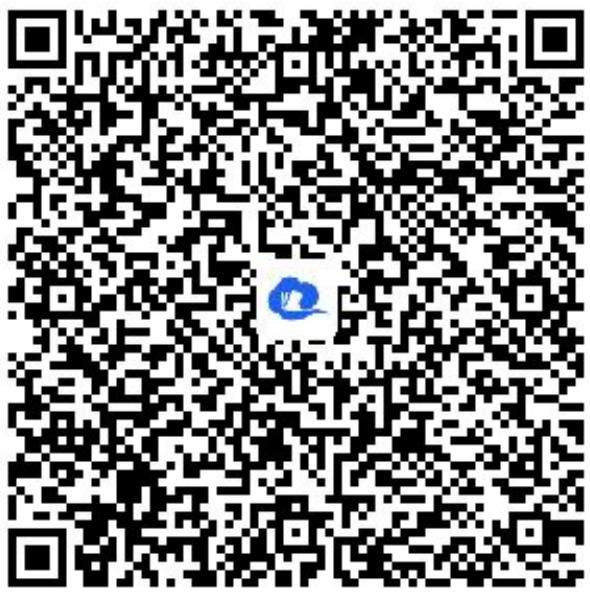

text_image

QR code with a blue circular logo in the center, likely linking to a digital resource or website.

8.【单选题】方程 $y=\sqrt{9-x^{2}}$ 表示的曲线是（）.

A. 一条射线  
B. 一个圆  
C. 两条射线  
D. 半个圆

【正确答案】D

【更多习题信息】

难易度：适中

知识点：二元二次方程表示的曲线与圆的关系

【智慧中小学APP扫码查看完整解析】

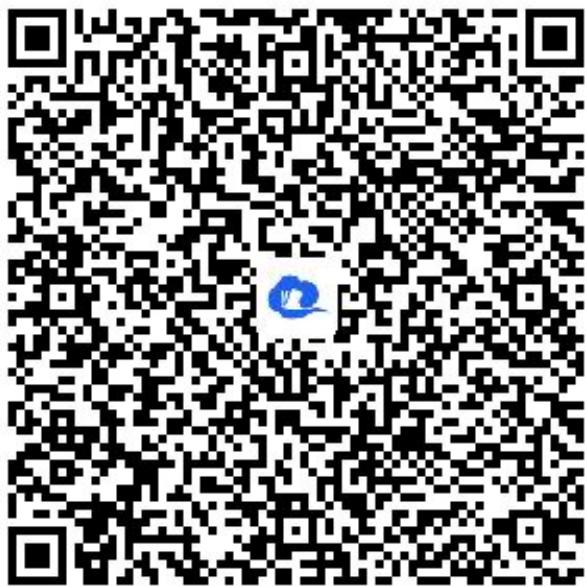

text_image

QR code with a blue logo in the center, likely linking to a digital resource or website.

9.【单选题】一束光线从点 $P(-1,1)$ 出发，经x轴反射到圆 $C:(x-2)^{2}+(y-3)^{2}=1$ 上的最短路程为（）.

A. 4   
B. 5   
C. $3\sqrt{2}-1$   
D. $2\sqrt{6}$

【正确答案】A

【更多习题信息】

难易度：适中

知识点：圆的方程中的最值问题

【智慧中小学APP扫码查看完整解析】

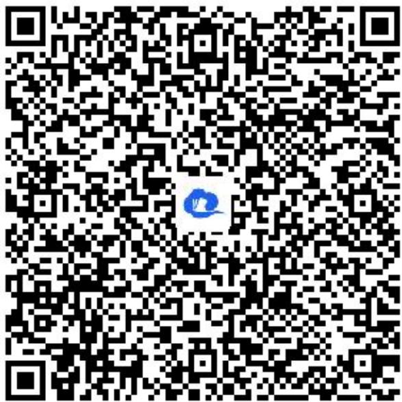

text_image

QR code with a blue logo in the center, likely linking to a digital resource or website.

# 二、多选题（共2题）

10.【多选题】（多选）关于x，y的方程 $x^{2}+y^{2}+4mx-2y+5m=0$ ，下列说法正确的为()。

A. 若方程表示圆，则实数 $m$ 的取值范围为 $m < \frac{1}{4}$   
B. 若方程表示圆，则所表示的圆的圆心一定在直线 y = 1 上  
C. 若方程不表示任何图形，则 $-\frac{1}{4}<m<1$   
D. 若方程表示圆，且该圆与 $x$ 轴的两个交点位于原点的两侧，则 $m < 0$

【正确答案】BD

【更多习题信息】

难易度：适中

知识点：二元二次方程表示的曲线与圆的关系

【智慧中小学APP扫码查看完整解析】

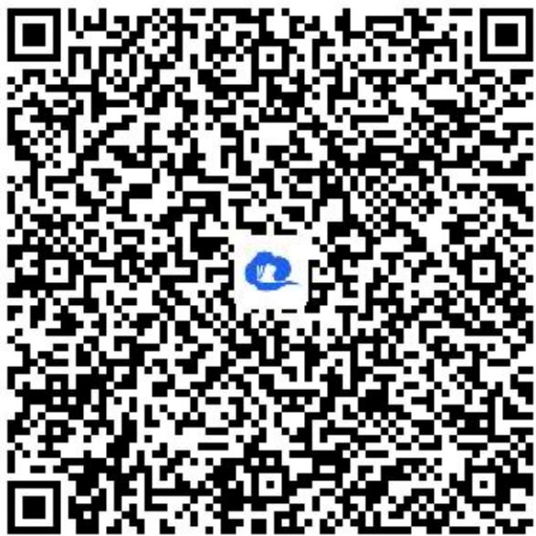

text_image

QR code with a blue logo in the center, likely linking to a digital resource or website.

11.【多选题】（多选题）已知圆 $C: x^{2} + y^{2} - 4x - 14y + 45 = 0$ 及点 $Q(-2,3)$ ，则下列说法正确的是( ).

A. 点C的坐标为(2,7)   
B. 点 $Q$ 在圆 $C$ 外  
C. 若点 $P(m,m+1)$ 在圆C上，则直线PQ的斜率为 $\frac{1}{4}$   
D. 若 $M$ 是圆 $C$ 上任一点，则 $\vert M Q\vert$ 的取值范围为 $[2 \sqrt{2}, 6 \sqrt{2}]$

【正确答案】ABD

【更多习题信息】

难易度：适中

知识点：圆的方程中的最值问题

【智慧中小学APP扫码查看完整解析】

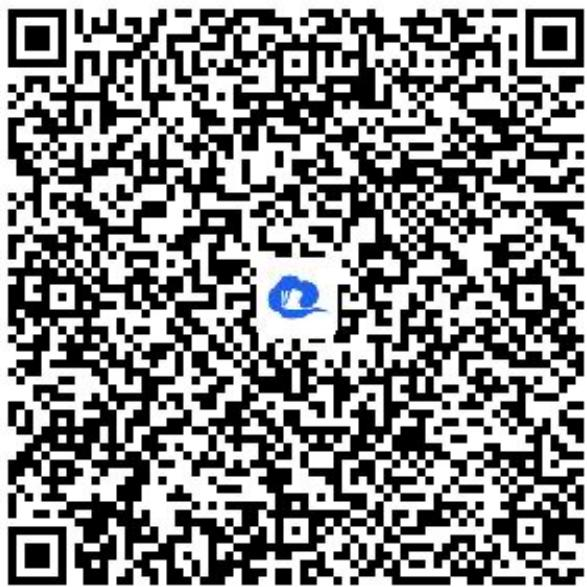

text_image

QR code with a blue logo in the center, likely linking to a digital resource or website.

# 三、填空题（共5题）

12.【填空题】公元前3世纪，古希腊数学家阿波罗尼斯在《平面轨迹》一书中，曾研究了众多的平面轨迹问题，其中有如下结果：平面内到定点距离之比等于已知数的动点轨迹为直线或圆。后世把这种圆称之为阿波罗尼斯圆。已知 $A(-1,0)$ ， $B(1,0)$ ，若动点P满足 $|PA|=2|PB|$ 。则点P的轨迹方程是\_\_\_\_。

【正确答案】 $\left(x - \frac{5}{3}\right)^2 +y^2 = \frac{16}{9}$

【更多习题信息】

难易度：适中

知识点：与圆相关的轨迹问题

【智慧中小学APP扫码查看完整解析】

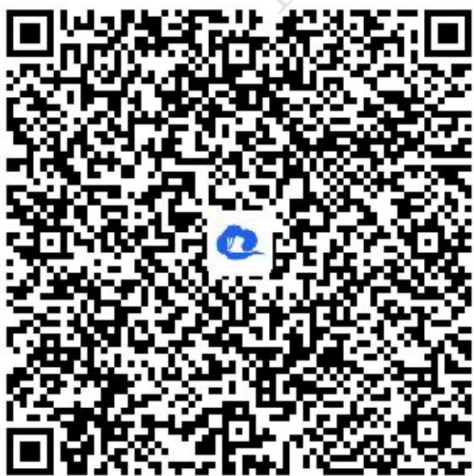

text_image

QR code with a blue logo in the center, likely linking to a digital resource or website.

13.【填空题】设A为圆 $(x-1)^{2}+y^{2}=1$ 上的动点，PA是圆的切线且 $|PA|=1$ ，则点P的轨迹方程是\_\_\_\_。

【正确答案】 $(x - 1)^{2} + y^{2} = 2$

【更多习题信息】

难易度：适中

知识点：与圆相关的轨迹问题

【智慧中小学APP扫码查看完整解析】

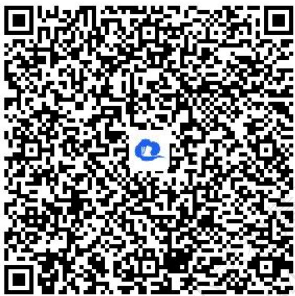

text_image

QR code with a blue logo in the center, likely linking to a digital resource or website.

14.【填空题】已知方程 $x^{2}+y^{2}+2x+2y+m=0$ 表示圆，则圆心坐标为\_\_\_\_；实数m的取值范围是\_\_\_\_。

【正确答案】 $(-1,-1)$ ， $(-∞,2)$

【更多习题信息】

难易度：适中

知识点：圆的一般方程与标准方程之间的互化

【智慧中小学APP扫码查看完整解析】

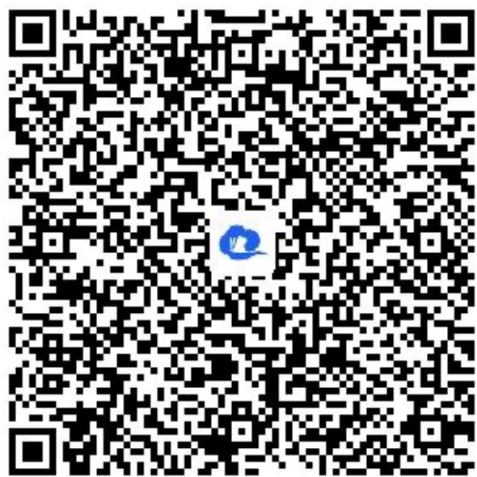

text_image

QR code with a blue logo in the center, likely linking to a digital resource or website.

15.【填空题】已知圆 $x^{2}+y^{2}-12x+16y+96=0$ 圆心为C，O为坐标原点，则以OC为直径的圆的标准方程为\_\_\_\_。

【正确答案】 $(x - 3)^{2} + (y + 4)^{2} = 25$

【更多习题信息】

难易度：适中

知识点：圆的一般方程与标准方程之间的互化

【智慧中小学APP扫码查看完整解析】

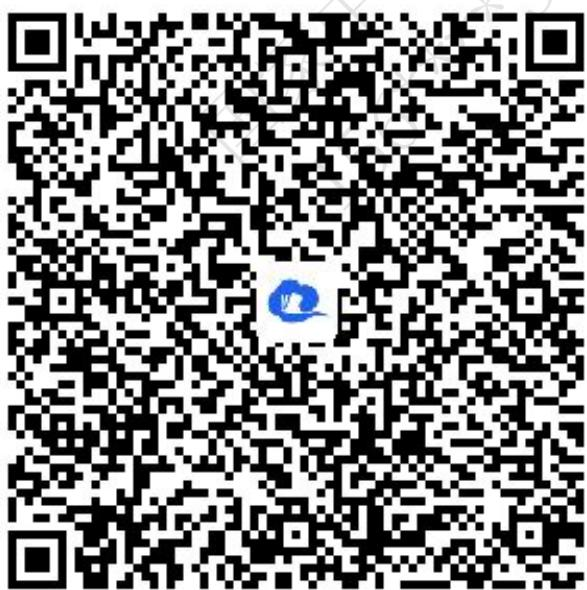

text_image

QR code with a blue logo in the center, likely linking to a digital resource or website.

16.【填空题】已知圆 $C_{1}:(x+2)^{2}+(y-1)^{2}=1$ ，圆 $C_{2}$ 与圆 $C_{1}$ 关于直线 $y=x+1$ 对称，则圆 $C_{2}$ 的标准方程是\_\_\_\_

【正确答案】 $x^{2} + (y + 1)^{2} = 1$

【更多习题信息】

难易度：适中

知识点：圆的对称性的应用

【智慧中小学APP扫码查看完整解析】

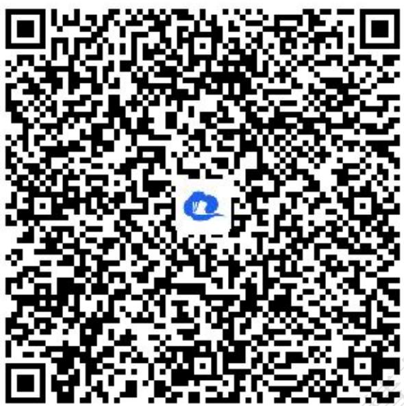

text_image

QR code with a blue circular logo in the center, likely linking to a digital resource or website.

# 四、复合题（共3题）

17.【复合题】已知圆C经过点(2,5),(5,2),(2,-1).

(1)【问答题】求圆C的方程;  
(2)【问答题】设点 $P(x,y)$ 在圆C上运动，求 $(x+2)^{2}+(y+1)^{2}$ 的最大值与最小值.

【正确答案】

(1)【问答题】设圆的方程为 $x^{2}+y^{2}+Dx+Ey+F=0$ . $\therefore\left\{\begin{aligned}&2D+5E+F=-29\\ &5D+2E+F=-29,\\ &2D-E+F=-5\end{aligned}\right.$ 解得 $\left\{\begin{aligned}D&=-4\\ E&=-4\\ F&=-1\end{aligned}\right.$ $\therefore x^{2} + y^{2} - 4x - 4y - 1 = 0$ 即 $(x - 2)^{2} + (y - 2)^{2} = 9$ .  
(2)【问答题】 $(x+2)^{2}+(y+1)^{2}$ 可看作点 $P(x,y)$ 与点 $(-2,-1)$ 距离的平方，圆心 $C(2,2)$ 与点 $(-2,-1)$ 的距离 $d=\sqrt{(2+2)^{2}+(2+1)^{2}}=5>3$ ，则点 $(-2,-1)$ 在圆C外，故点 $(-2,-1)$ 到圆C上点的距离最大值为 $d+R=8$ ，距离最小值为d-R=2．所以， $(x+2)^{2}+(y+1)^{2}$ 的最大值为64，最小值为4.

【更多习题信息】

难易度：适中

知识点：圆的方程中的最值问题

【智慧中小学APP扫码查看完整解析】

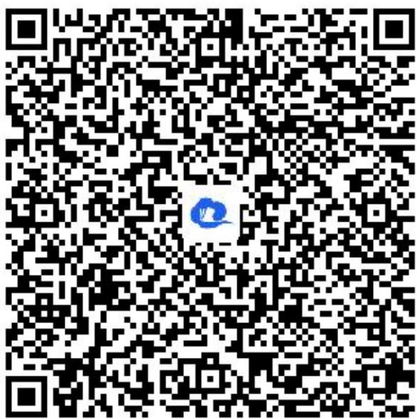

text_image

QR code with a blue logo in the center, likely linking to a digital resource or website.

18.【复合题】已知圆C的方程 $x^{2}+y^{2}-2ax+(2-4a)y+4a-4=0(a\in R)$ .

(1)【问答题】证明对任意实数a，圆C必过定点；  
(2)【问答题】求圆心C的轨迹方程;   
(3)【问答题】对 $a \in R$ ，求面积最小的圆C的方程.

【正确答案】

(1)【问答题】证明：分离参数a，化为 $x^{2}+y^{2}+2y-4+a(-2x-4y+4)=0$ ，又  
$\left\{ \begin{array}{l} x^{2} + y^{2} + 2y - 4 = 0 \\ -2x - 4y + 4 = 0 \end{array} \right.$ ，得： $\left\{ \begin{array}{l} x = 2 \\ y = 0 \end{array} \right.$ 或 $\left\{ \begin{array}{l} x = -\frac{2}{5}, \\ y = \frac{6}{5} \end{array} \right.$ ∴ 对任何实数 $a$ ，圆 $C$ 必过点 $A(2,0)$ 、 $B\left(-\frac{2}{5}, \frac{6}{5}\right)$ .  
(2)【问答题】解： $\because D^{2} + E^{2} - 4F = 4(5a^{2} - 8a + 5) > 0$ 恒成立，设 $C$ 的坐标为 $(x, y)$ ，则圆心 $C$ 的方程为 $\left\{ \begin{array}{l} x = a, \\ y = 2a - 1, \end{array} \right.$ 消去 $a$ ，得 $2x - y - 1 = 0$ ，圆心 $C$ 的轨迹方程为 $2x - y - 1 = 0$ .  
(3)【问答题】解：面积最小的圆就是以AB为一条直径的圆，圆心为 $\left(\frac{4}{5},\frac{3}{5}\right)$ ，半径为 $\frac{3\sqrt{5}}{5}$ ，方程是 $\left(x-\frac{4}{5}\right)^{2}+\left(y-\frac{3}{5}\right)^{2}=\frac{9}{5}$ .

【更多习题信息】

难易度：适中

知识点：圆过定点问题

【智慧中小学APP扫码查看完整解析】

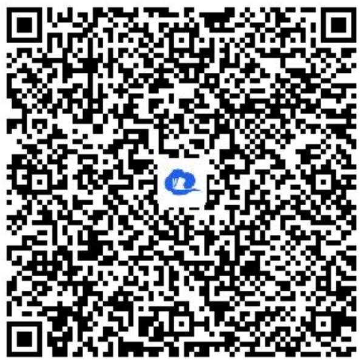

text_image

QR code with a blue logo in the center, likely linking to a digital resource or website.

19.【复合题】已知 $\triangle ABC$ 的顶点 $C(2, -8)$ ，直线 $AB$ 的方程为 $y = -2x + 11$ ， $AC$ 边上的高 $BH$ 所在直线的方程为 $x + 3y + 2 = 0$ .

(1)【问答题】求顶点A和B的坐标;   
(2)【问答题】求 $\triangle ABC$ 外接圆的一般方程.

【正确答案】

(1)【问答题】由 $\left\{\begin{aligned}y&=-2x+11\\ x&+3y+2=0\end{aligned}\right.$ 可得 $\left\{\begin{aligned}x&=7\\ y&=-3\end{aligned}\right.$ ，所以点B的坐标为 $(7,-3)$ ，由 $x+3y+2=0$ 可得 $y=-\frac{1}{3}x-\frac{2}{3}$ ，所以 $k_{BH}=-\frac{1}{3}$ 由AC⊥BH，可得 $k_{AC}=3$ ，因为C(2,-8)，所以直线AC的方程为： $y+8=3(x-2)$ ，即3x-y-14=0，由 $\left\{\begin{aligned}y&=-2x+11\\ 3x-y-14&=0\end{aligned}\right.$ 可得 $\left\{\begin{aligned}x&=5\\ y&=1\end{aligned}\right.$ ，所以点A的坐标为 $(5,1)$ .  
(2)【问答题】设 $\triangle ABC$ 的外接圆方程为 $x^{2} + y^{2} + Dx + Ey + F = 0$ ，将 $A(5,1)$ ， $B(7,-3)$ 和 $C(2,-8)$ 三点的坐标分别代入圆的方程可得： $\left\{\begin{aligned}&5D+E+F+26=0\\ &7D-3E+F+58=0\\ &2D-8E+F+68=0\end{aligned}\right.$ ，解得： $\left\{\begin{aligned}&D=-4\\ &E=6\\ &F=-12\end{aligned}\right.$ ，所以 $\triangle ABC$ 的外接圆的一般方程为 $x^{2}+y^{2}-4x+6y-12=0$ .

【更多习题信息】

难易度：适中

知识点：求圆的一般方程

【智慧中小学APP扫码查看完整解析】

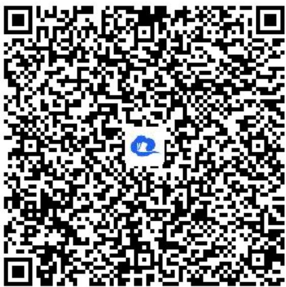

text_image

QR code with a blue logo in the center, likely linking to a digital resource or website.

# 五、问答题（共3题）

20.【问答题】已知圆 $C:x^{2}+y^{2}+Dx+Ey+3=0$ 的圆心在直线 $x+y-1=0$

上，且圆心在第二象限，半径为 $\sqrt{2}$ ，求圆C的一般方程.

【正确答案】由题意得：圆心 $C\left(-\frac{D}{2},-\frac{E}{2}\right)$ ,

因为圆心在直线 $x + y - 1 = 0$ 上，所以 $-\frac{D}{2} - \frac{E}{2} - 1 = 0$ ，即 $D + E = -2$ ，①又半径 $r = \frac{\sqrt{D^2 + E^2 - 12}}{2} = \sqrt{2}$ ，所以 $D^2 + E^2 = 20$ ，②由①②可得 $\left\{ \begin{array}{l} D = 2, \\ E = -4, \end{array} \right.$ 或 $\left\{ \begin{array}{l} D = -2, \\ E = 4. \end{array} \right.$

又圆心在第二象限，所以 $-\frac{D}{2} < 0$ ， $-\frac{E}{2} > 0$ ，即 $D > 0, E < 0.$ 所以 $\left\{ \begin{array}{l} D = 2, \\ E = -4, \end{array} \right.$ 所以圆一般方程为的 $x^2 + y^2 + 2x - 4y + 3 = 0$

【更多习题信息】

难易度：适中

知识点：求圆的一般方程

【智慧中小学APP扫码查看完整解析】

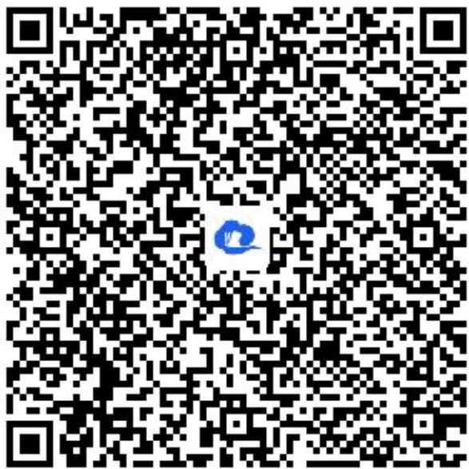

text_image

QR code with a blue logo in the center, likely linking to a digital resource or website.

21.【问答题】已知曲线C: $(\lambda + 1)x^{2} + (\lambda + 1)y^{2} - 2x - \lambda - 3 = 0, \lambda \in R.$ 则曲线C必过定点\_\_\_\_.

【正确答案】(-1,0)

【更多习题信息】

难易度：适中

知识点：圆过定点问题

【智慧中小学APP扫码查看完整解析】

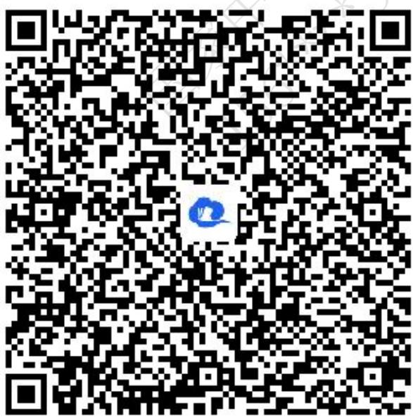

text_image

QR code with a blue logo in the center, likely linking to a digital resource or website.

22.【问答题】已知曲线 $C:x^{2}+y^{2}-2ax-2(a-1)y-1+2a=0$ ，则曲线C必过定点\_\_\_\_.

【正确答案】(1,0)

【更多习题信息】

难易度：简单

知识点：圆过定点问题

【智慧中小学APP扫码查看完整解析】

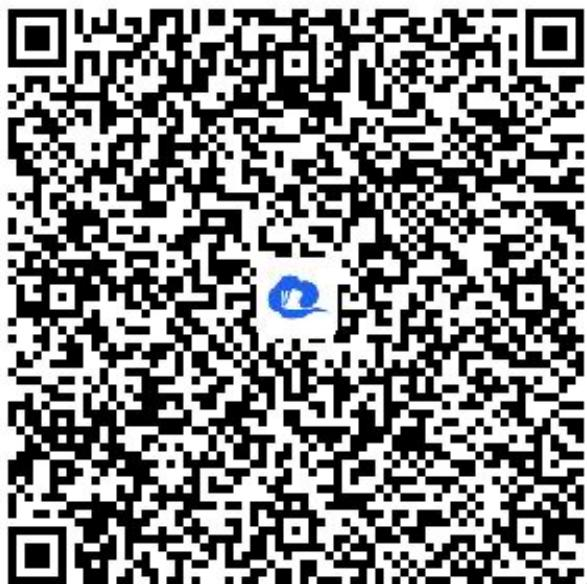

text_image

QR code with a blue logo in the center, likely linking to a digital resource or website.

