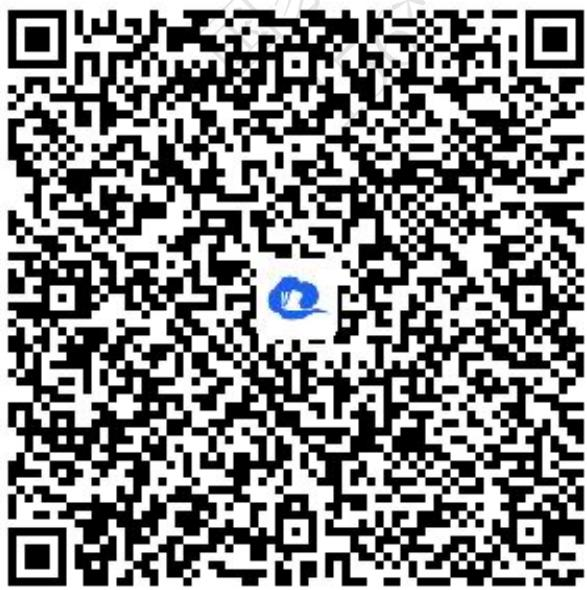
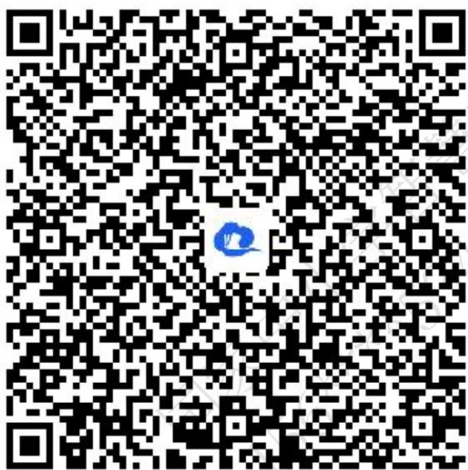
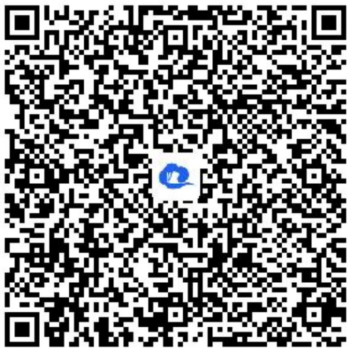
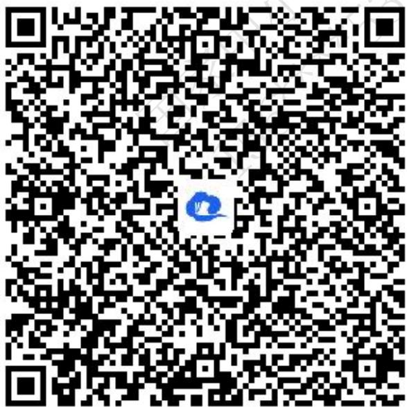
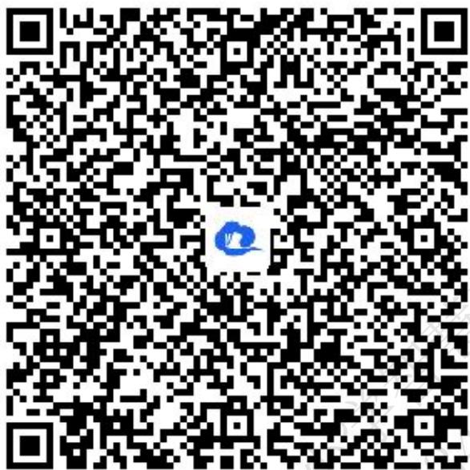
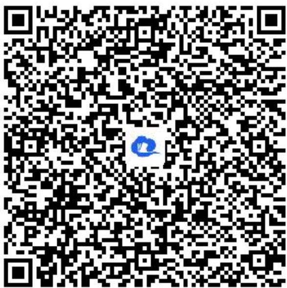

# 高中 数学 选择性必修 第一册

# 第二章 直线和圆的方程 2.5

# 直线与圆、圆与圆的位置关系

# 2.5.1 直线与圆的位置关系

# (答案解析)

# 一、单选题（共2题）

1.【单选题】点M在圆 $x^{2}+y^{2}=2$ 上，点N在直线l:y=x-3上，则 $|MN|$ 的最小值是（）

A. $\sqrt{2}$   
B. $\frac{\sqrt{2}}{2}$   
C. $\frac{3\sqrt{2}}{2}$   
D. 1

【正确答案】B

【更多习题信息】

难易度：简单

知识点：直线与圆的位置关系中的最值问题

【智慧中小学APP扫码查看完整解析】

text_image

QR code with a blue logo in the center, likely linking to a digital resource or website.

2.【单选题】已知直线 $l: x + my + 2 = 0$ ，若圆 $C: x^2 + y^2 - 6x + 4y - 3 = 0$ 上存在两点 $P, Q$ 关于直线 $l$ 对称，则 $m$ 的值为（）

A. $\frac{5}{2}$   
B. $\frac{3}{2}$   
C. $\frac{1}{2}$   
D. 5

【正确答案】A

【更多习题信息】

难易度：简单

知识点：利用直线与圆的位置关系求参

【智慧中小学APP扫码查看完整解析】

text_image

QR code with a blue logo in the center, likely linking to a digital resource or website.

# 二、填空题（共2题）

3.【填空题】直线 $kx - y - k = 0 (k \in R)$ 与圆 $x^{2} + y^{2} = 2$ 交点的个数为 \_\_\_\_.

【正确答案】2

【更多习题信息】

难易度：适中

知识点：直线与圆的位置关系的判断

【智慧中小学APP扫码查看完整解析】

text_image

QR code with a blue logo in the center, likely linking to a digital resource or website.

4.【填空题】过圆 $x^{2}+y^{2}=36$ 内的一点A(-2,4)引此圆的弦MN，则 $|MN|$ 的最小值为\_\_\_\_。

【正确答案】8

【更多习题信息】

难易度：适中

知识点：直线与圆的位置关系中的最值问题

【智慧中小学APP扫码查看完整解析】

text_image

QR code with a blue logo in the center, likely linking to a digital resource or website.

# 三、复合题（共2题）

5.【复合题】已知圆心为C的圆经过点A(0,2)和B(1,1)，且圆心C在直线 $l:x+y+5=0$ 上.

(1)【问答题】求圆C的标准方程;

(2)【问答题】2）若 $P(x,y)$ 是圆C上的动点，求3x-4y的最大值与最小值.

# 【正确答案】

(1)【问答题】 $(x+3)^{2}+(y+2)^{2}=25$   
(2)【问答题】最大值为24，最小值为-26

【更多习题信息】

难易度：偏难

知识点：直线与圆的位置关系中的最值问题

【智慧中小学APP扫码查看完整解析】

text_image

QR code with a blue logo in the center, likely linking to a digital resource or website.

6.【复合题】已知直线l过点 $M(-3,3)$ ，圆 $C:x^{2}+y^{2}+4y+m=0(m\in R)$ .

(1)【问答题】求圆C的圆心坐标及直线l截圆C弦长最长时直线l的方程;   
(2)【问答题】若过点M直线与圆C恒有公共点，求实数m的取值范围.

【正确答案】

(1)【问答题】 $(0,-2)$ ， $5x+3y+6=0;$   
(2)【问答题】 $m \leq -30.$

【更多习题信息】

难易度：适中

知识点：直线与圆的位置关系的判断及求参

【智慧中小学APP扫码查看完整解析】

text_image

QR code with a blue logo in the center, likely linking to a digital resource or website.

