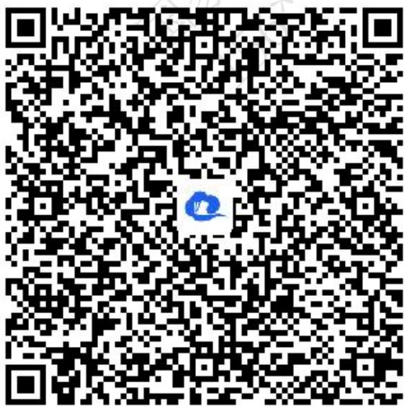
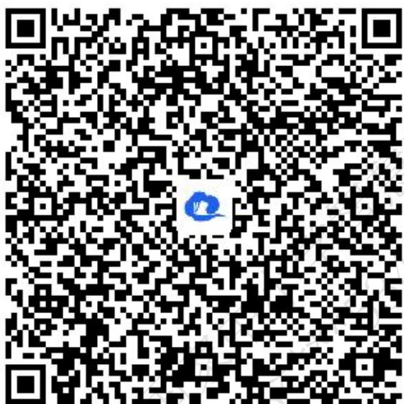
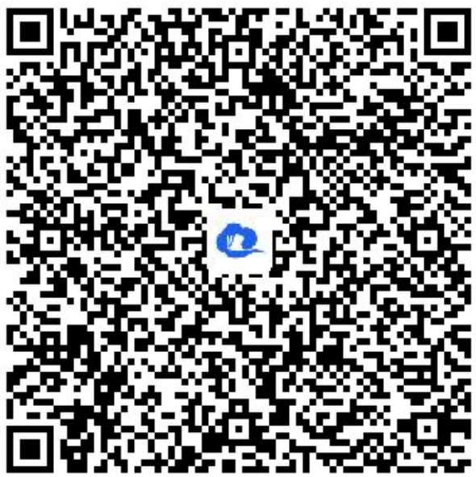
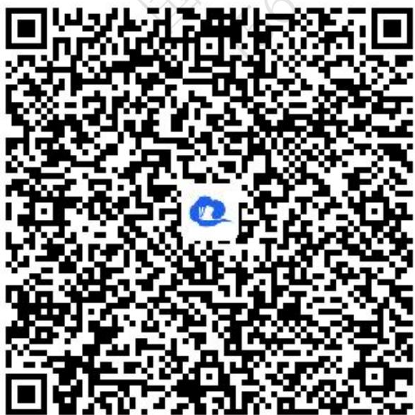
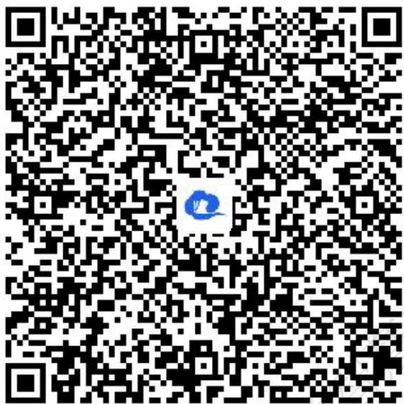
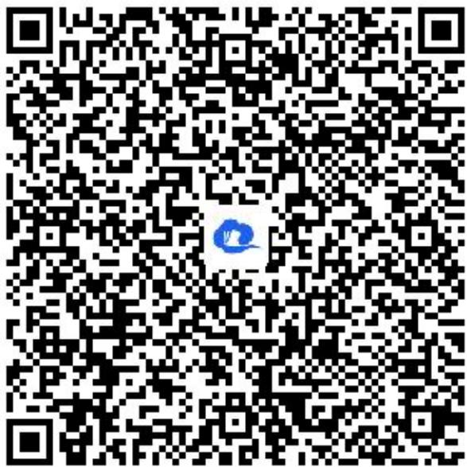
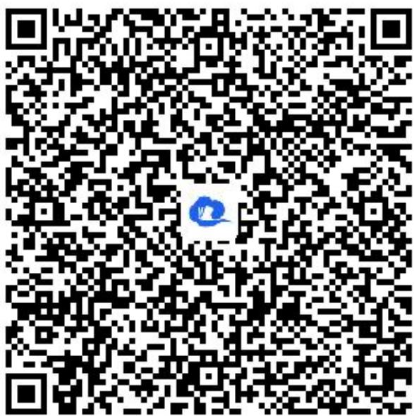
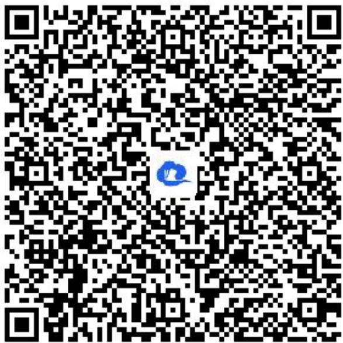
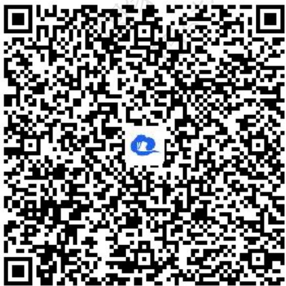

# 高中 数学 选择性必修 第一册

# 第二章 直线和圆的方程 2.5

# 直线与圆、圆与圆的位置关系

# 2.5.1 直线与圆的位置关系

# (答案解析)

# 一、单选题（共1题）

1.【单选题】若点 $P(1,1)$ 为圆 $x^{2}+y^{2}-6y=0$ 的弦AB的中点，则弦AB所在直线的方程为（）

A. $2x - y - 1 = 0$   
B. $x - 2y + 1 = 0$   
C. $x + 2y - 3 = 0$   
D. $2x + y - 3 = 0$

【正确答案】B

【更多习题信息】

难易度：简单

知识点：圆的弦长问题

【智慧中小学APP扫码查看完整解析】

text_image

QR code with a blue logo in the center, likely linking to a digital resource or website.

# 二、多选题（共2题）

2.【多选题】(多选)已知圆 $M:(x-1)^{2}+(y-1)^{2}=4$ ，直线 $l:x+y-6=0$ ，A为直线l上一点，若M上存在两点B,C，使得 $\angle BAC=60^{\circ}$ ，则点A的横坐标可能取值为（）

A. 0   
B. 2   
C. 4   
D. 6

【正确答案】BC

【更多习题信息】

难易度：简单

知识点：圆的切线应用

【智慧中小学APP扫码查看完整解析】

text_image

QR code with a blue logo in the center, likely linking to a digital resource or website.

3.【多选题】（多选）与圆 $x^{2} + (y - 2)^{2} = 2$ 相切，且在两坐标轴上的截距相等的直线方程为（）

A. $x + y = 0$   
B. $x - y = 0$   
C. $x - y - 4 = 0$   
D. $x + y - 4 = 0$

【正确答案】ABD

【更多习题信息】

难易度：简单

知识点：圆的切线方程

【智慧中小学APP扫码查看完整解析】  

text_image

QR code with a blue circular logo in the center, likely linking to a digital resource or website.

# 三、填空题（共3题）

4.【填空题】已知直线 $l:mx-y+1-4m=0(m\in R)$ 与圆 $C:x^{2}+(y-1)^{2}=25$ 交于两点P,Q，则弦长 $|PQ|$ 的取值范围是\_\_\_\_.

【正确答案】(6,10]

【更多习题信息】

难易度：适中

知识点：圆的弦长问题

【智慧中小学APP扫码查看完整解析】

text_image

QR code with a blue logo in the center, likely linking to a digital resource or website.

5.【填空题】过原点且与圆 $(x - 1)^2 +(y - \sqrt{3})^2 = 1$ 相切的直线方程为

【正确答案】x=0或 $y=\frac{\sqrt{3}}{3}x$

【更多习题信息】

难易度：适中

知识点：圆的切线应用

【智慧中小学APP扫码查看完整解析】

text_image

QR code with a blue logo in the center, likely linking to a digital resource or website.

6.【填空题】曲线 $y=\sqrt{1-x^{2}}$ 与直线 $y=k(x-1)+2$ 有两个交点，则实数k的取值范围是\_\_\_\_.

【正确答案】 $\left(\frac{3}{4},1\right]$

【更多习题信息】

难易度：适中

知识点：圆的切线应用

【智慧中小学APP扫码查看完整解析】

text_image

QR code with a blue logo in the center, likely linking to a digital resource or website.

# 四、复合题（共2题）

7.【复合题】已知点 $M(3,3)$ ，圆 $C:(x-1)^{2}+(y-2)^{2}=4$ .

(1)【问答题】求过点M且与圆C相切的直线方程;   
(2)【问答题】若直线 $ax - y + 4 = 0 (a \in R)$ 与圆 $C$ 相交于 $A$ ， $B$ 两点，且弦 $AB$ 的长为 $2\sqrt{3}$ ，求实数 $a$ 的值.

【正确答案】

(1)【问答题】x = 3 或 $3x + 4y - 2l = 0$ ;   
(2)【问答题】 $-\frac{3}{4}$ .

【更多习题信息】

难易度：偏难

知识点：圆的切线方程与圆的弦长问题

【智慧中小学APP扫码查看完整解析】

text_image

QR code with a blue logo in the center, likely linking to a digital resource or website.

8.【复合题】已知点 $P(x,y)$ 在圆 $x^{2}+(y-1)^{2}=1$ 上运动.

(1)【问答题】求 $\frac{y-1}{x-2}$ 的最大值;  
(2)【问答题】求 $2x + y$ 的最小值.

【正确答案】

(1)【问答题】 $\frac{\sqrt{3}}{3}$ ;  
(2)【问答题】 $1 - \sqrt{5}$

【更多习题信息】

难易度：偏难

知识点：圆的切线应用

【智慧中小学APP扫码查看完整解析】

text_image

QR code with a blue logo in the center, likely linking to a digital resource or website.

# 五、问答题（共1题）

9.【问答题】已知圆 $C:x^{2}+y^{2}-4x=0$ ，经过点 $P(1,\sqrt{3})$ 的一条直线与圆C交于A,B两点，若AB的弦长 $|AB|=2\sqrt{3}$ ，求直线AB的方程.

【正确答案】x=1， $x+\sqrt{3}y-4=0$

【更多习题信息】

难易度：适中

知识点：圆的弦长问题

【智慧中小学APP扫码查看完整解析】

text_image

QR code with a blue logo in the center, likely linking to a digital resource or website.

