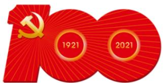

# 高中 数学 选择性必修 第一册

# 第二章 直线和圆的方程 2.5

# 直线与圆、圆与圆的位置关系

# 2.5.2 圆与圆的位置关系

# 一、单选题（共2题）

1. 【单选题】2021年是中国共产党百年华诞，3月24日，中宣部发布中国共产党成立100周年庆祝活动标识（图1），标识由党徽 数字“100”“1921”“2021”和56根光芒线组成，生动展现中国共产党团结带领中国人民不忘初心 牢记使命 艰苦奋斗的百年光辉历程。其中“100”的两个“0”设计为两个半径为R的相交大圆，分别内含一个半径为r的同心小圆，且同心小圆均与另一个大圆外切（图2）。已知 $R = (\sqrt{2} + 1)r$ ，则由其中一个圆心向另一个大圆引的切线长与两大圆的公共弦长之比为（）

text_image

100
1921 2021

庆祝中国共产党成立100周年  
The 100th Anniversary of the Founding of The Communist Party of China

text_image

145

图2  
图1

A. $\sqrt{2}$   
B. $\sqrt{\frac{2}{2}}$   
C. $\frac{\sqrt{2}+1}{3}\frac{\sqrt{2}+1}{3}$   
D. $3(\sqrt{2}-1)$

2.【单选题】已知圆 $C:x^{2}+y^{2}-2x+m=0$ 与圆 $(x+3)^{2}+(y+3)^{2}=36$ 内切，点P是圆C上一动点，则点P到直线 $5x+12y+8=0$ 的距离的最大值为（）

A. 2   
B. 3   
C. 4   
D. 5

# 二、多选题（共1题）

3.【多选题】（多选）若圆 $(x-a)^{2}+(y-a)^{2}=1(a>0)$ 上总存在到原点距离为3的点，则实数a的取值可以是（）

A. 1   
B. $\sqrt{2}$   
C. 2   
D. 3

# 三、填空题（共4题）

4.【填空题】设圆 $C_{1}:x^{2}+y^{2}-2x+4y=4$ ，圆 $C_{2}:x^{2}+y^{2}+6x-8y=0$ ，则圆 $C_{1}C_{2}$ 有公切线\_\_\_\_条.  
5.【填空题】已知圆 $C_{1}:(x-a)^{2}+(y+2)^{2}=4$ 与圆 $C_{2}:(x+b)^{2}+(y+2)^{2}=1$ 相内切，则 $a^{2}+b^{2}$ 的最小值为\_\_\_\_.  
6. 【填空题】若点 $A(a,b)$ 在圆 $x^{2}+y^{2}=4$ 上，则圆 $(x-a)^{2}+y^{2}=1$ 与圆 $x^{2}+(y-b)^{2}=1$ 的位置关系是\_\_\_\_.  
7.【填空题】已知圆 $C:(x-3)^{2}+(y-4)^{2}=9$ 和两点 $A(-m,0),B(m,0)(m>0)$ ，若圆C上存在点P，使得 $\angle APB=90^{\circ}$ ，则m的最大值为\_\_\_\_。

# 四、复合题（共2题）

8.【复合题】设圆 $C_{1}:(x-3)^{2}+(y+2)^{2}=4$ ，圆 $C_{2}:(x-5)^{2}+(y+4)^{2}=25$ .

(1)【问答题】判断圆 $C_{1}$ 与圆 $C_{2}$ 的位置关系;  
(2)【问答题】点A、B分别是圆 $C_{1}$ 、 $C_{2}$ 上的动点，P为直线y=x上的动点，求 $|PA|+|PB|$ 的最小值.

9.【复合题】已知圆 $C_{1}$ : $x^{2} + y^{2} - 2x - 6y - 1 = 0$ , $C_{2}$ : $x^{2} + y^{2} - 10x - 12y + 45 = 0$ .

(1)【问答题】求证： $C_{1}C_{2}$ 相交；  
(2)【问答题】求圆 $C_{1}C_{2}$ 的公共弦所在的直线方程.