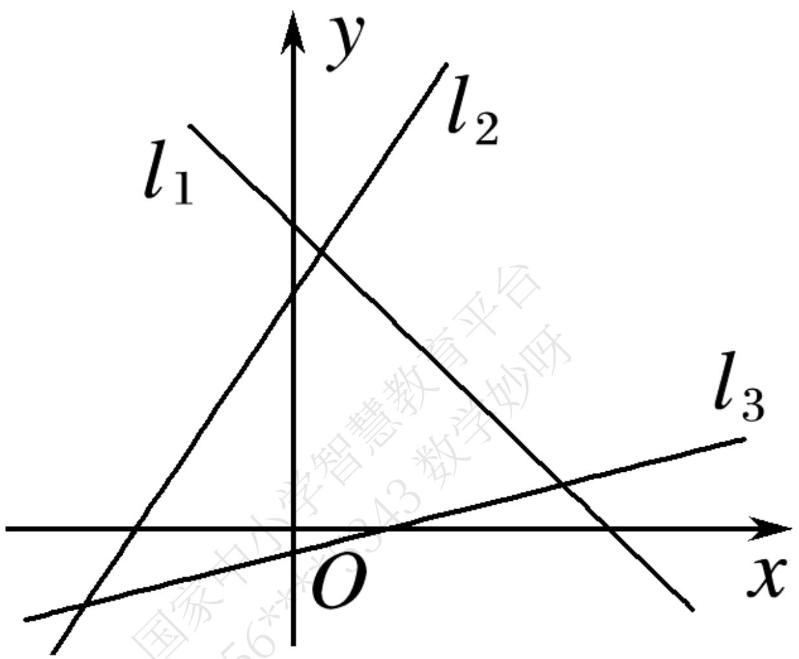
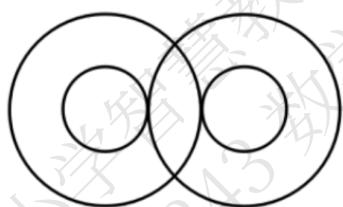
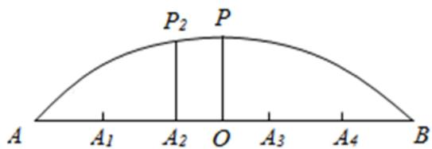
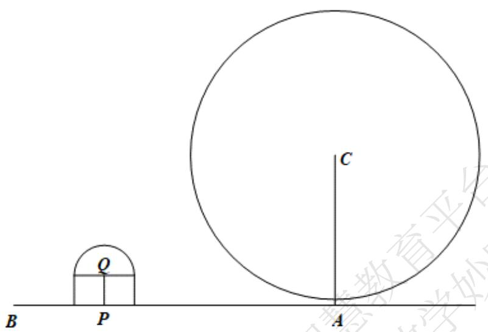

# 高中 数学 选择性必修 第一册

# 第二章 直线和圆的方程 2.1 直线的倾斜角与斜率

# 2.1.1倾斜角与斜率

# 一、单选题（共4题）

1.【单选题】“直线l的斜率不小于0”是“直线l的倾斜角为锐角”的（）

A. 充分不必要条件  
B. 必要不充分条件  
C. 充要条件  
D. 既不充分也不必要条件

2.【单选题】已知直线l经过点A（1，0）， $B(2,\sqrt{3})$ ，则直线l的倾斜角是（）

A. $30^{\circ}$   
B. $60^{\circ}$   
C. $120^{\circ}$   
D. $150^{\circ}$

3.【单选题】已知点A（2，m） ${}$ ${ }$ ，B（3,3），直线AB的斜率为1，那么m的值为（ ）.

A. 1   
B. 2   
C. 3   
D. 4

4.【单选题】下列说法正确的是（）

A. 倾斜角为 $90^{\circ}$ 直线只有一条，即y轴.  
B. 平行于x轴的直线的倾斜角是 $0^{\circ}$ 或 $180^{\circ}$ .  
C. 若直线的倾斜角为 $\alpha$ ，则 $\sin \alpha \geq 0$ .

D. 直线的倾斜角 $\alpha$ 的集合 $\{\alpha|0^{\circ} \leq \alpha \leq 180^{\circ}\}$ 与直线集合建立一一对应关系.

# 二、填空题（共4题）

5.【填空题】已知三点 $A(a,2)$ ， $B(3,7)$ ， $C(-2,-9a)$ 在同一条直线上，实数a的值为\_\_\_\_。  
6.【填空题】若图中直线 $l_{1}$ ， $l_{2}$ ， $l_{3}$ 的斜率分别为 $k_{1}$ ， $k_{2}$ ， $k_{3}$ ，则 $k_{1}$ ， $k_{2}$ ， $k_{3}$ 的大小关系是\_\_\_\_。

text_image

l₁
l₂
l₃
O
x
y
国家中小学智慧教育平台

7.【填空题】已知 $\triangle ABC$ 的顶点坐标为 $A(5, -1)$ ， $B(1, 1)$ ， $C(2, m)$ ，若 $\triangle ABC$ 为直角三角形，则 m 的值为 \_\_\_\_.  
8.【填空题】已知直线l的一方向向量为 $(-1,\sqrt{3})$ ．则直线l的倾斜角为\_\_\_\_．

# 三、问答题（共3题）

9.【问答题】点 $M(x,y)$ 在函数 $y=-2x+8$ 的图像上，当 $x\in[2,5]$ 时，求 $\frac{y+1}{x+1}$ 的取值范围.  
10.【问答题】已知直线l经过两点 $A(2a,a^{2})$ ， $B(0,-1)$ ，求直线l的倾斜角的取值范围.

11.【问答题】一条直线l与x轴相交，其向上的方向与y轴正方向所成的角为 $\alpha$ （ $0^{\circ} < \alpha < 90^{\circ}$ ），求其倾斜角.

# 高中 数学 选择性必修 第一册

# 第二章 直线和圆的方程 2.1 直线的倾斜角与斜率

# 2.1.2两条直线平行和垂直的判定

# 一、单选题（共1题）

1.【单选题】直线 $l_{1}$ 的斜率为2， $l_{1}\parallel l_{2}$ ，直线 $l_{2}$ 过点(-1,1)且与y轴交于点p，则p点坐标为（）

A. $(3,0)$

B. $(-3,0)$

C. $(0,-3)$

D. $(0,3)$

# 二、填空题（共1题）

2.【填空题】直线 $l_{1}$ ， $l_{2}$ 的斜率 $k_{1}$ ， $k_{2}$ 是关于k的方程 $2k^{2}-4k+m=0$ 的两根；若 $l_{1}\perp l_{2}$ ，则m=\_。若 $l_{1}//l_{2}$ ，则m=\_。

# 三、复合题（共1题）

3.【复合题】已知 $A(1,2), B(5,0), C(3,4)$

(1)【问答题】若A,B,C,D可以构成平行四边形，求点D的坐标；

(2)【问答题】在（1）的条件下，判断 A,B,C,D 构成的平行四边形是否为菱形.

# 高中 数学 选择性必修 第一册

# 第二章 直线和圆的方程 2.2 直线的方程

# 2.2.1 直线的点斜式方程

# 一、单选题（共2题）

1.【单选题】直线 $x + \sqrt{3} y - 1 = 0$ 的倾斜角 $\alpha$ 为（）

A. $60^{\circ}$   
B. $120^{\circ}$   
C. $30^{\circ}$   
D. $150^{\circ}$

2.【单选题】在平面直角坐标系中，过点 $(-2,0)$ 且倾斜角为 $135^{\circ}$

的直线不经过（）在平面直角坐标系中，过点且倾斜角为的直线不经过（）

A. 第一象限  
B. 第二象限  
C. 第三象限  
D. 第四象限

# 二、填空题（共2题）

3.【填空题】过点(2,3)，且斜率为2的直线l的斜截式方程为\_\_\_\_。

4.【填空题】设直线 $(a-1)x+(2a+3)y=2$ 经过定点A，则过点A且斜率为-2的直线方程为\_\_\_\_。

# 三、复合题（共1题）

5.【复合题】已知 $\triangle ABC$ 三个顶点是 A(4,4)，B(-4,0)，C(2,0).

(1)【问答题】求AB边中线CD所在直线方程;   
(2)【问答题】求AB边上的高线所在方程;

# 四、问答题（共1题）

6.【问答题】已知直线l的斜率为-1，且它与两坐标轴围成的三角形的面积为 $\frac{l}{2}$ ，求直线l的方程.

# 高中 数学 选择性必修 第一册

# 第二章 直线和圆的方程 2.2 直线的方程

# 2.2.2直线的两点式方程

# 一、单选题（共2题）

1.【单选题】若直线 $l$ 过点 $A(-2,0), B(0,3)$ ，则直线 $l$ 的方程为（）

A. $3x - 2y + 6 = 0$   
B. $2x - 3y + 6 = 0$   
C. $3x - 2y - 6 = 0$   
D. $3x + 2y - 6 = 0$

2.【单选题】过两点（-2,4）和（4，-1）的直线在y轴上的截距为（ ）

A. $\frac{14}{5}$   
B. $-\frac{14}{5}$   
C. $\frac{7}{3}$   
D. $-\frac{7}{3}$

# 二、填空题（共2题）

3. 【填空题】过点 $P(1,3)$ 的直线l与x,y轴的正方向分别交于A,B两点，若 $S_{VAOB}=6$ ，则直线l的方程为\_\_\_\_。

4.【填空题】一束光线经过点A(-1,2)由x

轴反射后，经过点B（2,1）射出，则反射光线所在直线方程是\_\_\_\_。

# 三、复合题（共1题）

5.【复合题】已知直线 $l: \frac{4}{m} + \frac{y}{4 - m} = 1$

(1)【问答题】若直线l的斜率是2，求m的值；   
(2)【问答题】当直线l与两坐标轴的正半轴围成三角形的面积最大时, 求此直线的方程.

# 四、问答题（共1题）

6.【问答题】已知点 $P(-1, 2m - 1)$ 在经过 $M(2, -1), N(-3, 4)$ 两点的直线上，求m的值.

# 高中 数学 选择性必修 第一册

# 第二章 直线和圆的方程 2.2 直线的方程

# 2.2.3直线的一般式方程

# 一、单选题（共5题）

1.【单选题】如果 $AB < 0$ ， $BC > 0$ ，那么直线 $Ax + By + C = 0$ 不经过（

A. 第一象限  
B. 第二象限  
C. 第三象限  
D. 第四象限

2.【单选题】下列说法中正确的是

A. 若直线 $l_{1}$ 与 $l_{2}$ 的斜率相等，则 $l_{1} \parallel l_{2}$   
B. 若直线 $l_{1}$ 与 $l_{2}$ 互相平行，则它们的斜率相等  
C. 在直线 $l_{1}$ 与 $l_{2}$ 中，若一条直线的斜率存在，另一条直线的斜率不存在，则 $l_{1}$ 与 $l_{2}$ 定相交  
D. 若直线 $l_{1}$ 与 $l_{2}$ 的斜率都不存在，则 $l_{1} \parallel l_{2}$

3.【单选题】如果平面直角坐标系内的两点 $A(a-1,a+1)$ , $B(a,a)$ 关于直线l对称，那么直线l的方程为（）

A. $x - y + 1 = 0$

B. $x + y + l = 0$

C. $x - y - 1 = 0$

D. $x + y - l = 0$

4.【单选题】下列说法正确的是（）

A. $\frac{y-y_{1}}{x-x_{1}}=k$ 不能表示过点 $M(x_{1},y_{1})$ 且斜率为k的直线方程；  
B. 在 $x$ 轴, $y$ 轴上的截距分别为 $a, b$ 的直线方程为 $\frac{x}{a} + \frac{y}{b} = 1$ ;  
C. 直线 $y = kx + b$ 与 y 轴的交点到原点的距离为 b;  
D. 平面内的所有直线的方程都可以用斜截式来表示.

5.【单选题】当点 $P(3,2)$ 到直线 $mx - y + 1 - 2m = 0$ 的距离最大时，m的值为（）

A. 3

B. 0   
C.-1   
D. 1

# 二、填空题（共6题）

6.【填空题】过点(1,0)且与直线x-2y-2=0平行的直线方程是\_\_\_\_  
7.【填空题】已知直线 $a_{1}x + b_{1}y + 1 = 0$ 和直线 $a_{2}x + b_{2}y + 1 = 0$ 都过点 $A(2,1)$ ，则过点 $P_{1}(a_{1},b_{1})$ 和点 $P_{2}(a_{2},b_{2})$ 的直线方程是\_\_\_\_。  
8.【填空题】若直线 $l_{1}:(a+2)^{x}+(1-a)y-3=0$ 与 $l_{2}:(a-1)^{x}+(2a+3)y+2=0$ 互相垂直，则a的值为\_\_\_\_  
9.【填空题】经过点 $P(-1,2)$ ，并且在两坐标轴上的截距的绝对值相等的直线有\_\_\_\_。  
10.【填空题】设 $m \in R$ ，动直线 $l_{1}: x + my - 1 = 0$ 过定点A，动直线 $l_{2}: mx - y - 2m + \sqrt{3} = 0$ 过定点B，若直线 $l_{1}$ 与 $l_{2}$ 相交于点P（异于点A,B），则 $\Delta PAB$ 周长的最大值为\_\_\_\_  
11.【填空题】点(2, -3)关于直线x - y = 0对称的点的坐标为\_\_\_\_。

# 三、复合题（共2题）

12.【复合题】已知直线 $l: kx - y + 1 + 2k = 0$

(1)【问答题】求证：直线l经过定点.   
(2)【问答题】若直线l交x轴负半轴于点A，交y轴正半轴于点B， $\triangle AOB$ 的面积为S，求S的最小值并求此时直线l的方程.  
13.【复合题】过点 $P_{(4,1)}$ 作直线l分别交x轴，y轴正半轴于A，B两点，O为坐标原点.

(1)【问答题】当 $\triangle AOB$ 面积最小时，求直线 l 的方程；  
(2)【问答题】当 $|OA| + |OB|$ 取最小值时，求直线??的方程.

# 四、问答题（共2题）

14.【问答题】已知直线 $l_{1}:x+my+6=0,\quad l_{2}:(m-2)x+3y+2m=0.$ 若 $l_{1}\parallel l_{2}$ ，求m的值.  
15.【问答题】已知 $A(3,-1)$ ， $B(5,-2)$ ，点P在直线 $x+y=0$ 上，若使 $|PA|+|PB|$ 取最小值，求点P的坐标.

# 高中 数学 选择性必修 第一册

# 第二章 直线和圆的方程 2.3

# 直线的交点坐标与距离公式

# 2.3.1 两条直线的交点坐标

# 一、单选题（共2题）

1.【单选题】直线l经过两条直线 $x - y + 1 = 0$ 和 $2x + 3y + 2 = 0$ 的交点，且平行于直线 $x - 2y + 4 = 0$ ，则直线l的方程为（）

A. $x - 2y - 1 = 0$   
B. $x - 2y + 1 = 0$   
C. $2x - y + 2 = 0$   
D. $2x + y - 2 = 0$

2.【单选题】直线y=x与直线 $x+y-2=0$ 的交点坐标是（）

A. $(1,1)$   
B. $\left(\frac{1}{2},\frac{1}{2}\right)$   
C. $(1,2)$   
D. $(2,1)$

# 二、填空题（共2题）

3.【填空题】若关于x,y的二元一次方程组 $\left\{\begin{aligned}&4x+my=m-2\\ &mx+y+m=0\end{aligned}\right.$ 有无穷多组解，则m= \_\_\_\_.  
4.【填空题】已知直线l经过两条直线 $2x-3y+10=0$ 和 $3x+4y-2=0$ 的交点，且垂直于直线 $3x-2y+4=0$ ，则直线l方程为\_\_\_\_。

# 三、复合题（共2题）

5.【复合题】已知直线 $l_{1}:3x+my-1=0,\quad l_{2}:3x-2y-5=0,\quad l_{3}:6x+y-5=0.$

(1)【问答题】若这三条直线交于一点，求实数m的值；  
(2)【问答题】若三条直线能构成三角形，求m满足的条件.

6.【复合题】已知：直线 $l_{1}$ ： $x + y - 3 = 0$ 与直线 $l_{2}$ ： $2x - 3y - 1 = 0$ 交于点P.

(1)【问答题】求直线 $l_{1}$ 和 $l_{2}$ 交点P的坐标.  
(2)【问答题】若过点P的直线l与两坐标轴截距互为相反数，求l的直线方程.

# 高中 数学 选择性必修 第一册

# 第二章 直线和圆的方程 2.3

# 直线的交点坐标与距离公式

# 2.3.2两点间的距离公式

# 一、单选题（共1题）

1.【单选题】已知 $A_{(2, - 3)}$ ， $B_{(5, - 7)}$ ，则 $\vert AB\vert =$ （

A. 3   
B. 4   
C. 5   
D. 6

# 二、填空题（共1题）

2.【填空题】在x轴上找一点M，使这点到点 $A(1,2)$ 和点 $B(5,-2)$ 的距离相等，则M的坐标为\_\_\_\_。

# 三、问答题（共1题）

3.【问答题】用坐标法证明：直角三角形斜边的中点到三个顶点的距离都相等.

# 高中 数学 选择性必修 第一册

# 第二章 直线和圆的方程 2.3

# 直线的交点坐标与距离公式

# 2.3.3点到直线的距离公式

# 一、单选题（共1题）

1.【单选题】若点 $P(3,1)$ 到直线l: $3x + 4y + a = 0 (a > 0)$ 的距离为3，则a = （）

A. 3   
B. 2   
C. $\frac{3}{2}$   
D. 1

# 二、填空题（共1题）

2.【填空题】已知点 $M(a,b)$ 在直线 $5x-12y+26=0$ 上，则 $\sqrt{a^{2}+b^{2}}$ 的最小值为\_\_\_\_.

# 三、复合题（共1题）

3.【复合题】已知 $\triangle ABC$ 的三个顶点的坐标为 $A_{(3,3)}$ 、 $B_{(2,-2)}$ 、 $C_{(-7,1)}$ ，试求：

(1)【问答题】BC边上的高所在的直线方程;  
(2)【问答题】 $\triangle ABC$ 的面积.

# 高中 数学 选择性必修 第一册

# 第二章 直线和圆的方程 2.3

# 直线的交点坐标与距离公式

# 2.3.4两条平行线间的距离

# 一、单选题（共1题）

1.【单选题】已知直线 $l_{1}:x-y+1=0$ 和直线 $l_{2}:x-y+3=0$ ，则 $l_{1}$ 与 $l_{2}$ 之间的距离是（）

A. $\sqrt{2}$   
B. $\frac{\sqrt{2}}{2}$   
C. 2   
D. $2\sqrt{2}$

# 二、填空题（共1题）

2.【填空题】与直线 $l_{1}:3x+2y-6=0$ 和直线 $l_{2}:6x+4y-3=0$ 等距离的直线方程是\_\_\_\_.

# 三、复合题（共1题）

3.【复合题】直线 $l_{1}:x+(1+m)y-2=0$ 和 $l_{2}:mx+2y+4=0,$

(1)【问答题】若两直线垂直，求m的值；  
(2)【问答题】若两直线平行，求两直线间的距离.

# 高中 数学 选择性必修 第一册

# 第二章 直线和圆的方程 2.4 圆的方程

# 2.4.1 圆的标准方程

# 一、单选题（共4题）

1.【单选题】以点 $A(-3,4)$ 为圆心，且与y轴相切的圆的标准方程为()

A. $(x + 3)^{2} + (y - 4)^{2} = 16$

B. $(x + 3)^{2} + (y + 4)^{2} = 16$

C. $(x + 3)^{2} + (y - 4)^{2} = 9$

D. $(x + 3)^{2} + (y + 4)^{2} = 9$

2.【单选题】若原点在圆 $(x - 3)^{2} + (y + 4)^{2} = m$ 的外部，则实数 $m$ 的取值范围是（）

A. $m > 25$

B. $m > 5$

C. 0 < m < 25

D. 0 < m < 5

3.【单选题】已知圆C经过两点 $A_{(0,2)},B(4,6)$ ，且圆心C在直线l:2x-y-3=0上，则圆C的方程()

A. $x^{2} + (y - 3)^{2} = 25$

B. $(x - 1)^{2} + (y + 1)^{2} = 10$

C. $(x - 3)^{2} + (y - 3)^{2} = 10$

D. $(x - 1)^{2} + (y + 1)^{2} = 58$

4.【单选题】已知点 $A(-2,1),B(0,-3)$ ，则以线段AB为直径的圆的方程为()

A. $(x - 1)^{2} + (y - 1)^{2} = 5$

B. $(x+1)^{2}+(y+1)^{2}=5$

C. $(x - 1)^{2} + (y - 1)^{2} = 20$

D. $(x + 1)^{2} + (y + 1)^{2} = 20$

# 二、多选题（共2题）

5.【多选题】（多选）已知圆的方程是 $(x - 2)^{2} + (y - 3)^{2} = 4$ ，则下列坐标表示点在圆内的有（）

A. $(-3,2)$   
B. $(3,2)$   
C. $(1,4)$   
D. $(1,1)$

6.【多选题】(多选)下列说法错误的是（）

A. 圆 $(x - 1)^2 + (y - 2)^2 = 5$ 的圆心为 $(1,2)$ ，半径为5  
B. 圆 $(x+2)^{2}+y^{2}=b^{2}(b\neq0)$ 的圆心为(-2,0)，半径为b  
C. 圆 $x^{2} + y^{2} = 3$ 的圆心为 $(0,0)$ ，半径为 $\sqrt{3}$   
D. 方程 $(x + 2)^{2} + (y + 2)^{2} = m$ 表示圆

# 三、填空题（共4题）

7.【填空题】若圆的方程为 $(x + \frac{k}{2})^2 +(y + 1)^2 = 1 - \frac{3}{4} k^2$

，则当圆的面积最大时，圆心坐标和半径分别为\_\_\_\_、\_\_\_\_。

8.【填空题】一圆与圆C: $(x+2)^{2}+(y+1)^{2}=4$

为同心圆且面积为圆C面积的两倍，此圆的标准方程为\_\_\_\_。

9.【填空题】已知两圆 $C_{1}:(x-5)^{2}+(y-3)^{2}=9$ 和 $C_{2}:(x-2)^{2}+(y+1)^{2}=8$

，则两圆圆心间的距离为\_\_\_\_。

10.【填空题】在平面直角坐标系中， $\triangle ABC$ 的三个顶点分别是 $(0,0), (-2,0), (0,-4)$

，求三角形的外接圆的标准方程为\_\_\_\_。

# 四、复合题（共1题）

11.【复合题】为了开发古城旅游观光资源，镇政府决定在护城河上建一座圆形拱桥，河面跨度AB为32米，拱桥顶点C离河面8米.

text_image

y
C
A
O
B
x

(1)【问答题】如果以跨度AB所在直线为x轴，以AB中垂线为y

轴建立如图的直角坐标系，试求出该圆形拱桥所在圆的方程；

(2)【问答题】现有游船船宽8米，船舱顶部为长方形，船顶离水面7米，为保证安全，要求行船顶部与拱桥顶部的竖直方向高度差至少要

0.5米．问这条船能否顺利通过这座拱桥，并说出理由.

# 五、问答题（共2题）

12.【问答题】平面直角坐标系中有 $A_{(0,1)},B_{(2,1)},C_{(3,4)},D_{(-1,2)}$

四点，这四点能否在同一个圆上？为什么？

13.【问答题】已知圆C经过原点O(0,0)且与直线y=2x-8相切于点P(4,0)\$\{\}\$,求圆C的方程.

# 高中 数学 选择性必修 第一册

# 第二章 直线和圆的方程 2.4 圆的方程

# 2.4.2 圆的一般方程

# 一、单选题（共9题）

1.【单选题】已知点 $A(-1,5)$ ，设 $P(x,y)$ 是圆 $(x-2)^{2}+(y-1)^{2}=1$ 上任意一点，则 $|AP|$ 的最小值是( ).

A. $\sqrt{7}$   
B. 4   
C. 6   
D. 3

2.【单选题】已知点 $P(-3,1)$ ，A为圆 $x^{2}+y^{2}=4$ 上一动点，则线段AP的中点M的轨迹方程是（）.

A. $\left(x - \frac{3}{2}\right)^2 +\left(y - \frac{1}{2}\right)^2 = 1$   
B. $\left(x+\frac{3}{2}\right)^{2}+\left(y-\frac{1}{2}\right)^{2}=1$   
C. $\left(x-\frac{3}{2}\right)^{2}+\left(y+\frac{1}{2}\right)^{2}=1$   
D. $\left(x+\frac{3}{2}\right)^{2}+\left(y+\frac{1}{2}\right)^{2}=1$

3.【单选题】已知圆 $x^{2} + y^{2} - 2x + my = 0$ 上任意一点M关于直线 $x + y = 0$ 的对称点N也在圆上,则m的值为\$ {}

(\hspace {0.25em} \hspace {0.25em} \hspace {0.25em} \hspace {0.25em}) {}\$.

A.-1   
B. 1   
C. 2   
D.-2

4.【单选题】若圆C与圆 $(x+2)^{2}+(y-1)^{2}=1$ 关于原点对称，则圆C的方程为（）.

A. $(x - 2)^{2} + (y + 1)^{2} = 1$   
B. $(x-2)^{2}+(y-1)^{2}=1$

C. $(x - 1)^{2} + (y + 2)^{2} = 1$   
D. $(x + 1)^{2} + (y - 2)^{2} = 1$

5.【单选题】圆心为(1, - 1)且过原点的圆的一般方程是().

A. $x^{2} + y^{2} + 2x - 2y + 1 = 0$   
B. $x^{2} + y^{2} - 2x + 2y + 1 = 0$   
C. $x^{2} + y^{2} + 2x - 2y = 0$   
D. $x^{2} + y^{2} - 2x + 2y = 0$

6.【单选题】已知圆的方程是 $x^{2}+y^{2}-2x-4=0$ ，则该圆的圆心坐标及半径分别为（）.

A. $(1,0)$ 与5  
B. $(1,0)$ 与 $\sqrt{5}$   
C. $(-1,0)$ 与5  
D. $(-1,0)$ 与 $\sqrt{5}$

7.【单选题】已知 $a\in R$ ，方程 $a^{2}x^{2}+(a+2)y^{2}+2ax+a=0$ 表示圆，则a的值为（）.

A. 1或-2   
B. 2或-1   
C.-1   
D. 2

8.【单选题】方程 $y=\sqrt{9-x^{2}}$ 表示的曲线是（）.

A. 一条射线  
B. 一个圆  
C. 两条射线  
D. 半个圆

9.【单选题】一束光线从点 $P(-1,1)$ 出发，经x轴反射到圆 $C:(x-2)^{2}+(y-3)^{2}=1$ 上的最短路程为（）.

A. 4   
B. 5   
C. $3\sqrt{2}-1$

D. $2\sqrt{6}$

# 二、多选题（共2题）

10.【多选题】（多选）关于x，y的方程 $x^{2}+y^{2}+4mx-2y+5m=0$ ，下列说法正确的为()。

A. 若方程表示圆，则实数 $m$ 的取值范围为 $m < \frac{1}{4}$   
B. 若方程表示圆，则所表示的圆的圆心一定在直线 y = 1 上  
C. 若方程不表示任何图形，则 $-\frac{1}{4}<m<1$   
D. 若方程表示圆，且该圆与x轴的两个交点位于原点的两侧，则m<0

11.【多选题】（多选题）已知圆 $C: x^{2} + y^{2} - 4x - 14y + 45 = 0$ 及点 $Q(-2,3)$

，则下列说法正确的是( ).

A. 点C的坐标为(2,7)   
B. 点Q在圆C外   
C. 若点 $P(m,m+1)$ 在圆C上，则直线PQ的斜率为 $\frac{1}{4}$   
D. 若 $M$ 是圆 $C$ 上任一点，则 $\vert MQ\vert$ 的取值范围为 $[2\sqrt{2}, 6\sqrt{2}]$

# 三、填空题（共5题）

12.【填空题】公元前3世纪，古希腊数学家阿波罗尼斯在《平面轨迹》一书中，曾研究了众多的平面轨迹问题，其中有如下结果：平面内到定点距离之比等于已知数的动点轨迹为直线或圆。后世把这种圆称之为阿波罗尼斯圆。已知 $A(-1,0)$ ， $B(1,0)$ ，若动点P满足 $|PA|=2|PB|$ 。则点P的轨迹方程是\_\_\_\_。  
13.【填空题】设A为圆 $(x-1)^{2}+y^{2}=1$ 上的动点，PA是圆的切线且 $|PA|=1$ ，则点P的轨迹方程是\_\_\_\_。  
14.【填空题】已知方程 $x^{2}+y^{2}+2x+2y+m=0$ 表示圆，则圆心坐标为\_\_\_\_；实数m的取值范围是\_\_\_\_。  
15.【填空题】已知圆 $x^{2}+y^{2}-12x+16y+96=0$ 圆心为C，O为坐标原点，则以OC为直径的圆的标准方程为\_\_\_\_。  
16.【填空题】已知圆 $C_{1}\cdot(x+2)^{2}+(y-1)^{2}=1$ ，圆 $C_{2}$ 与圆 $C_{1}$ 关于直线 $y=x+1$ 对称，则圆 $C_{2}$ 的标准方程是\_\_\_\_

# 四、复合题（共3题）

17.【复合题】已知圆C经过点(2,5),(5,2),(2,-1).

(1)【问答题】求圆C的方程;

(2)【问答题】设点 $P(x,y)$ 在圆C上运动，求 $(x+2)^{2}+(y+1)^{2}$ 的最大值与最小值.

18.【复合题】已知圆C的方程 $x^{2}+y^{2}-2ax+(2-4a)y+4a-4=0$ ( $a\in R$ ).

(1)【问答题】证明对任意实数a，圆C必过定点；

(2)【问答题】求圆心C的轨迹方程;

(3)【问答题】对 $a \in R$ ，求面积最小的圆C的方程.

19.【复合题】已知 $\triangle ABC$ 的顶点 $C(2, -8)$ , 直线 $AB$ 的方程为 $y = -2x + 11$ , $AC$ 边上的高 $BH$ 所在直线的方程为 $x + 3y + 2 = 0$ .

(1)【问答题】求顶点A和B的坐标;

(2)【问答题】求 $\triangle ABC$ 外接圆的一般方程.

# 五、问答题（共3题）

20.【问答题】已知圆 $C:x^{2}+y^{2}+Dx+Ey+3=0$ 的圆心在直线 $x+y-1=0$ 上，且圆心在第二象限，半径为 $\sqrt{2}$ ，求圆C的一般方程.

21.【问答题】已知曲线C: $(\lambda + 1)x^{2} + (\lambda + 1)y^{2} - 2x - \lambda - 3 = 0, \lambda \in R.$ 则曲线C必过定点 \_\_\_\_.

22.【问答题】已知曲线 $C:x^{2}+y^{2}-2ax-2(a-1)y-1+2a=0$ ，则曲线C必过定点\_\_\_\_。

# 高中 数学 选择性必修 第一册

# 第二章 直线和圆的方程 2.5

# 直线与圆、圆与圆的位置关系

# 2.5.1 直线与圆的位置关系

# 一、单选题（共2题）

1.【单选题】点 $M$ 在圆 $x^{2} + y^{2} = 2$ 上，点 $N$ 在直线 $l:y = x - 3$ 上，则 $\vert MN\vert$ 的最小值是（）

A. $\sqrt{2}$   
B. $\frac{\sqrt{2}}{2}$   
C. $\frac{3\sqrt{2}}{2}$   
D. 1

2.【单选题】已知直线 $l: x + my + 2 = 0$ ，若圆 $C: x^2 + y^2 - 6x + 4y - 3 = 0$ 上存在两点 $P, Q$ 关于直线 $l$ 对称，则 $m$ 的值为（）

A. $\frac{5}{2}$   
B. $\frac{3}{2}$   
C. $\frac{1}{2}$   
D. 5

# 二、填空题（共2题）

3.【填空题】直线 $kx - y - k = 0 (k \in R)$ 与圆 $x^{2} + y^{2} = 2$ 交点的个数为 \_\_\_\_.  
4.【填空题】过圆 $x^{2}+y^{2}=36$ 内的一点A(-2,4)引此圆的弦MN，则 $|MN|$ 的最小值为\_\_\_\_。

# 三、复合题（共2题）

5.【复合题】已知圆心为C的圆经过点A(0,2)和B(1,1)，且圆心C在直线 $l:x+y+5=0$ 上.

(1)【问答题】求圆C的标准方程;   
(2)【问答题】2）若 $P(x,y)$ 是圆C上的动点，求3x-4y的最大值与最小值.

6.【复合题】已知直线l过点 $M(-3,3)$ ，圆 $C:x^{2}+y^{2}+4y+m=0(m\in R)$ .

(1)【问答题】求圆C的圆心坐标及直线l截圆C弦长最长时直线l的方程;   
(2)【问答题】若过点 $M$ 直线与圆 $C$ 恒有公共点，求实数 $m$ 的取值范围.

# 高中 数学 选择性必修 第一册

# 第二章 直线和圆的方程 2.5

# 直线与圆、圆与圆的位置关系

# 2.5.1 直线与圆的位置关系

# 一、单选题（共1题）

1.【单选题】若点 $P(1,1)$ 为圆 $x^{2}+y^{2}-6y=0$ 的弦AB的中点，则弦AB所在直线的方程为（）

A. $2x - y - 1 = 0$

B. $x - 2y + 1 = 0$

C. $x + 2y - 3 = 0$

D. $2x + y - 3 = 0$

# 二、多选题（共2题）

2.【多选题】(多选)已知圆 $M:(x-1)^{2}+(y-1)^{2}=4$ ，直线 $l:x+y-6=0$ ，A为直线l上一点，若M上存在两点B,C，使得 $\angle BAC=60^{\circ}$ ，则点A的横坐标可能取值为（）

A. 0

B. 2

C. 4

D. 6

3.【多选题】（多选）与圆 $x^{2} + (y - 2)^{2} = 2$ 相切，且在两坐标轴上的截距相等的直线方程为（）

A. $x + y = 0$

B. $x - y = 0$

C. $x - y - 4 = 0$

D. $x + y - 4 = 0$

# 三、填空题（共3题）

4.【填空题】已知直线 $l:mx-y+1-4m=0(m\in R)$ 与圆 $C:x^{2}+(y-1)^{2}=25$ 交于两点P,Q，则弦长 $|PQ|$ 的取值范围是\_\_\_\_.

5.【填空题】过原点且与圆 $(x-1)^{2}+(y-\sqrt{3})^{2}=1$ 相切的直线方程为\_\_\_\_.  
6.【填空题】曲线 $y=\sqrt{1-x^{2}}$ 与直线 $y=k(x-1)+2$ 有两个交点，则实数k的取值范围是\_\_\_\_。

# 四、复合题（共2题）

7.【复合题】已知点 $M(3,3)$ ，圆 $C:(x-1)^{2}+(y-2)^{2}=4$ .

(1)【问答题】求过点M且与圆C相切的直线方程;   
(2)【问答题】若直线 $ax - y + 4 = 0 (a \in R)$ 与圆 $C$ 相交于 $A$ ， $B$ 两点，且弦 $AB$ 的长为 $2\sqrt{3}$ ，求实数 $a$ 的值.

8.【复合题】已知点 $P(x,y)$ 在圆 $x^{2}+(y-1)^{2}=1$ 上运动.

(1)【问答题】求 $\frac{y-1}{x-2}$ 的最大值;  
(2)【问答题】求 $2x + y$ 的最小值.

# 五、问答题（共1题）

9.【问答题】已知圆 $C:x^{2}+y^{2}-4x=0$ ，经过点 $P(1,\sqrt{3})$ 的一条直线与圆C交于A,B两点，若AB的弦长 $|AB|=2\sqrt{3}$ ，求直线AB的方程.

# 高中 数学 选择性必修 第一册

# 第二章 直线和圆的方程 2.5

# 直线与圆、圆与圆的位置关系

# 2.5.2 圆与圆的位置关系

# 一、单选题（共2题）

1. 【单选题】2021年是中国共产党百年华诞，3月24日，中宣部发布中国共产党成立100周年庆祝活动标识（图1），标识由党徽 数字“100”“1921”“2021”和56根光芒线组成，生动展现中国共产党团结带领中国人民不忘初心 牢记使命 艰苦奋斗的百年光辉历程。其中“100”的两个“0”设计为两个半径为R的相交大圆，分别内含一个半径为r的同心小圆，且同心小圆均与另一个大圆外切（图2）。已知 $R = (\sqrt{2} + 1)r$ ，则由其中一个圆心向另一个大圆引的切线长与两大圆的公共弦长之比为（）

text_image

100
1921 2021

庆祝中国共产党成立100周年  
The 100th Anniversary of the Founding of The Communist Party of China

text_image

145

图2  
图1

A. $\sqrt{2}$   
B. $\sqrt{\frac{2}{2}}$   
C. $\frac{\sqrt{2}+1}{3}\frac{\sqrt{2}+1}{3}$   
D. $3(\sqrt{2}-1)$

2.【单选题】已知圆 $C:x^{2}+y^{2}-2x+m=0$ 与圆 $(x+3)^{2}+(y+3)^{2}=36$ 内切，点P是圆C上一动点，则点P到直线 $5x+12y+8=0$ 的距离的最大值为（）

A. 2   
B. 3   
C. 4   
D. 5

# 二、多选题（共1题）

3.【多选题】（多选）若圆 $(x-a)^{2}+(y-a)^{2}=1(a>0)$ 上总存在到原点距离为3的点，则实数a的取值可以是（）

A. 1   
B. $\sqrt{2}$   
C. 2   
D. 3

# 三、填空题（共4题）

4.【填空题】设圆 $C_{1}:x^{2}+y^{2}-2x+4y=4$ ，圆 $C_{2}:x^{2}+y^{2}+6x-8y=0$ ，则圆 $C_{1}C_{2}$ 有公切线\_\_\_\_条.  
5.【填空题】已知圆 $C_{1}:(x-a)^{2}+(y+2)^{2}=4$ 与圆 $C_{2}:(x+b)^{2}+(y+2)^{2}=1$ 相内切，则 $a^{2}+b^{2}$ 的最小值为\_\_\_\_.  
6. 【填空题】若点 $A(a,b)$ 在圆 $x^{2}+y^{2}=4$ 上，则圆 $(x-a)^{2}+y^{2}=1$ 与圆 $x^{2}+(y-b)^{2}=1$ 的位置关系是\_\_\_\_.  
7.【填空题】已知圆 $C:(x-3)^{2}+(y-4)^{2}=9$ 和两点 $A(-m,0),B(m,0)(m>0)$ ，若圆C上存在点P，使得 $\angle APB=90^{\circ}$ ，则m的最大值为\_\_\_\_。

# 四、复合题（共2题）

8.【复合题】设圆 $C_{1}:(x-3)^{2}+(y+2)^{2}=4$ ，圆 $C_{2}:(x-5)^{2}+(y+4)^{2}=25$ .

(1)【问答题】判断圆 $C_{1}$ 与圆 $C_{2}$ 的位置关系;  
(2)【问答题】点A、B分别是圆 $C_{1}$ 、 $C_{2}$ 上的动点，P为直线y=x上的动点，求 $|PA|+|PB|$ 的最小值.

9.【复合题】已知圆 $C_{1}$ : $x^{2} + y^{2} - 2x - 6y - 1 = 0$ , $C_{2}$ : $x^{2} + y^{2} - 10x - 12y + 45 = 0$ .

(1)【问答题】求证： $C_{1}C_{2}$ 相交；  
(2)【问答题】求圆 $C_{1}C_{2}$ 的公共弦所在的直线方程.

# 高中 数学 选择性必修 第一册 第二章 直线和圆的方程 小结

# 一、单选题（共3题）

1.【单选题】已知圆的一条直径的两端点分别是 $A_{(0,0)}$ , $B_{(2,4)}$ ，则此圆的方程是（）

A. $(x - 1)^{2} + (y - 2)^{2} = 5$   
B. $(x - 1)^{2} + (y - 2)^{2} = 25$   
C. $(x - 5)^{2} + y^{2} = 5$   
D. $(x - 5)^{2} + y^{2} = 25$

2.【单选题】已知点 $A(2,-3)$ ， $B(-3,-2)$ 。若直线 $l:mx+y-m-1=0$ 与线段AB相交，则实数m的取值范围是（）

A. $\left(-\infty,-\frac{3}{4}\right]\cup[4,+\infty)$   
B. $\left[-\frac{3}{4},4\right]$   
C. $\left(\frac{1}{5},+\infty\right)$   
D. $\left[-4,\frac{3}{4}\right]$

3.【单选题】直线 $l_{1}$ 经过两点 $A(0,0),B(\sqrt{3},1)$ ，直线 $l_{2}$ 的倾斜角是直线 $l_{1}$ 的倾斜角的2倍，则 $l_{2}$ 的斜率为（）

A. $\frac{\sqrt{3}}{3}$   
B. $\frac{2\sqrt{3}}{3}$   
C. 1   
D. $\sqrt{3}$

# 二、填空题（共3题）

4.【填空题】过点 $(-1,2)$ 且到原点距离最大的直线方程为\_\_\_\_。

5.【填空题】无论m为何值，直线 $mx+(3m+1)y-1=0$ 必过定点坐标为\_\_\_\_。

6.【填空题】已知圆心c在直线 $x+2y-1=0$ 上，且该圆经过 $(3,0)$ 和 $(1,-2)$ 两点，则圆c的标准方程为\_\_\_\_。

# 三、复合题（共3题）

7.【复合题】已知圆 $C:x^{2}+y^{2}-4x-2y+m=0$ 与直线l:3x-4y-7=0相交于M,N两点且 $|MN|=2\sqrt{3}$ ;

(1)【问答题】求m的值;   
(2)【问答题】过点P作圆C的切线，切点为Q，再过P作圆 $C^{\prime}:(x+2)^{2}+(y+2)^{2}=1$ 的切线，切点为R，若 $|PQ|=|PR|$ ，求 $|OP|$ 的最小值(其中O为坐标原点).

8.【复合题】已知圆 $c:x^{2}+y^{2}-8y+12=0$ ，直线l： $l:ax+y+2a=0$ .

(1)【问答题】当a为何值时，直线l与圆c相切；  
(2)【问答题】当直线l与圆c相交于A,B两点，且 $|AB|=2\sqrt{2}$ 时，求直线l的方程.

9.【复合题】已知直线 $l_{1}:(m+2)x+my-8=0$ 与直线 $l_{2}:mx+y-4=0,m\in R$ .

(1)【问答题】若 $l_{1}\parallel l_{2}$ ，求m的值；  
(2)【问答题】若点 $P_{(1,m)}$ 在直线 $l_{2}$ 上，直线l过点P，且在两坐标轴上的截距之和为0，求直线l的方程.

# 高中 数学 选择性必修 第一册 第二章 直线和圆的方程 小结

# 一、单选题（共2题）

1.【单选题】已知 $P$ 是直线 $l:3x - 4y + 11 = 0$ 上的动点， $PA, PB$ 是圆 $x^{2} + y^{2} - 2x - 2y + 1 = 0$ 的两条切线， $C$ 是圆心，那么四边形PACB面积的最小值是（）

A. $\sqrt{2}$

B. $2\sqrt{2}$

C. $\sqrt{3}$

D. $2\sqrt{3}$

2.【单选题】圆 $C:x^{2}+y^{2}=4$ 关于直线 $l:x+y-1=0$ 对称的圆的方程为（）

A. $(x - 1)^{2} + (y - 1)^{2} = 4$

B. $(x + 1)^{2} + (y + 1)^{2} = 4$

C. $(x - 2)^{2} + (y - 2)^{2} = 4$

D. $(x + 2)^{2} + (y + 2)^{2} = 4$

# 二、填空题（共2题）

3.【填空题】如图是某圆拱形桥一孔圆拱的示意图. 这个图的圆拱跨度 $AB = 20m$ ，拱高 $OP = 4m$ ，建造时每间隔 $4m$ 需要用一根支柱支撑，则支柱 $A_{2}P_{2} =$ \_\_\_\_（参考数据： $\sqrt{30}$ ）

text_image

P₂ P
A A₁ A₂ O A₃ A₄ B

$= 5.478$ ， $\sqrt{33} = 5.744$ ，精确到 $0.01m)$

4.【填空题】圆 $x^{2}+y^{2}+2x-3=0$ 关于直线 $l: x+y-2=0$ 的对称圆的标准方程为 \_\_\_\_.

# 三、复合题（共1题）

5.【复合题】已知圆 $x^{2} + y^{2} + 8x - 4y = 0$ 与圆 $x^{2} + y^{2} = 20$ 关于直线 $y = kx + b$ 对称，

(1)【问答题】求k,b的值;

(2)【问答题】若这时两圆的交点为A,B（O为坐标原点），求 $\angle AOB$ 的度数.

# 四、问答题（共1题）

6.【问答题】如图，摩天轮底座中心A与附近的景观内某点B之间的距离AB为160m

. 摩天轮与景观之间有一建筑物，此建筑物由一个底面半径为 $15 \mathrm{~m}$ 的圆柱体与一个半径为 $15 \mathrm{~m}$ 的半球体组成. 圆柱的底面中心 $P$ 在线段 $A B$ 上，且 $P B$ 为 $45 \mathrm{~m}$ . 半球体球心 $Q$ 到地面的距离 $P Q$ 为 $15 \mathrm{~m}$ . 把摩天轮看做一个半径为 $72 \mathrm{~m}$ 的圆 $C$ , 且圆 $C$ 在平面 $B P Q$ 内, 点 $C$ 到地面的距离 $C A$ 为 $75 \mathrm{~m}$ . 把摩天轮均匀旋转一周需要 $30 \mathrm{~min}$ , 若某游客乘坐摩天轮（把游客看作圆 $C$ 上的一点）旋转一周, 求该游客能看到点 $B$ 的时长. (只考虑此建筑物对游客视线的遮挡)

text_image

B
P
Q
C
A

