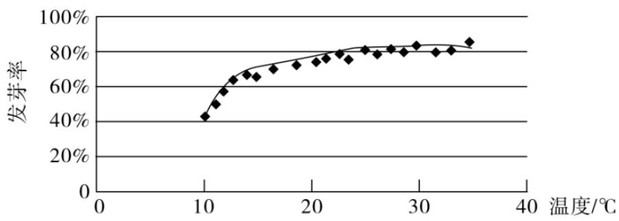
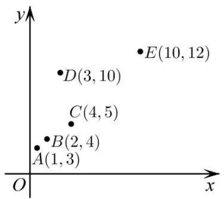
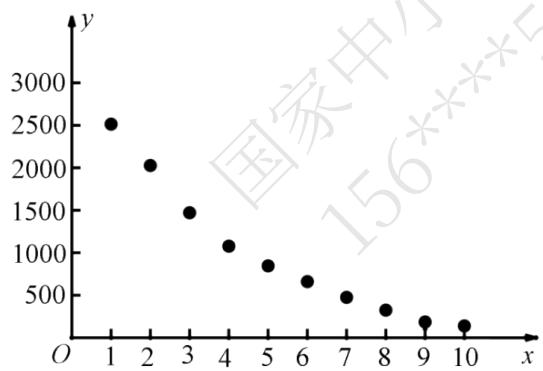
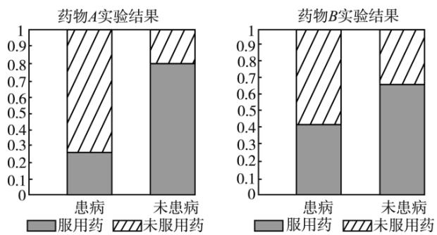
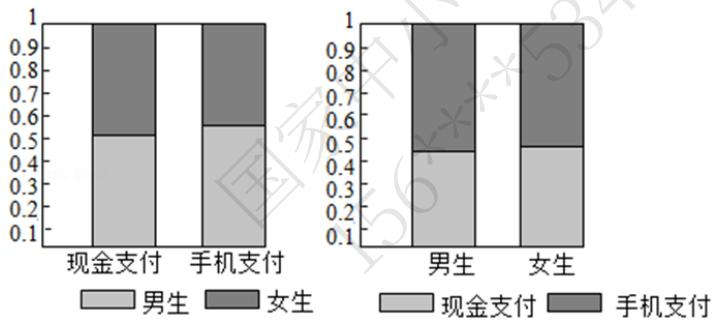
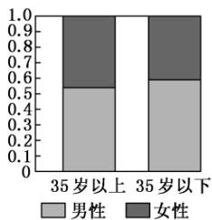
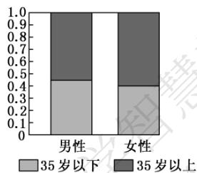

# 高中 数学 选择性必修 第二册 第四章 数列 直接证明与间接证明

# 一、单选题（共4题）

1.【单选题】给出下列说法：①回归直线 $\hat{y}=\hat{b}x+\hat{a}$ 恒过样本点的中心 $(\bar{x},\bar{y})$

，且至少过一个样本点；②两个变量相关性越强，则相关系数 $|r|$

就越接近1；③将一组数据的每个数据都加一个相同的常数后，方差不变；④在回归直线方程 $\hat{y}=2-0.5x$ 中，当解释变量x增加一个单位时，预报变量 $\hat{y}$

平均减少0.5个单位. 其中说法正确的是（）

A. ①②④   
B.②③④   
C. ①③④   
D. ②④

2.【单选题】用模型 $y = c_{e}^{kx}$ 拟合一组数据时，为了求出回归方程，设 $z = \ln y$ ，其变换后得到线性回归方程为 $z = 2x + \frac{1}{2}$ ，则 $c = (\quad)$

A. 0.5   
B. $e^{0.5}$   
C. 2   
D. $e^{2}$

3.【单选题】以下说法错误的是（）

A. 用样本相关系数 r 来刻画成对样本数据的相关程度时，若 $|r|$ 越大，则成对样本数据的线性相关程度越强  
B. 经验回归方程 $\hat{y} = \hat{b} x + \hat{a}$ 一定经过点 $(\bar{x}, \bar{y})$

C. 用残差平方和来刻画模型的拟合效果时，若残差平方和越小，则相应模型的拟合效果越好

D. 用决定系数 $R^2$ 来刻画模型的拟合效果时, 若 $R^2$ 越小, 则相应模型的拟合效果越好

4.【单选题】某校一个课外学习小组为研究某作物种子的发芽率 $y$ 和温度 $x$

（单位：°C）的关系，在20个不同的温度条件下进行种子发芽实验，由实验数据 $(x_{i},y_{i})$ $(i=1,2,\cdots,20)$ 得到下面的散点图：

line

| 温度/℃ | 发芽率 |
| ------- | ------ |
| 10      | 40%    |
| 12      | 55%    |
| 14      | 65%    |
| 16      | 70%    |
| 18      | 75%    |
| 20      | 78%    |
| 22      | 80%    |
| 24      | 82%    |
| 26      | 83%    |
| 28      | 84%    |
| 30      | 85%    |
| 32      | 86%    |
| 34      | 87%    |
| 36      | 88%    |

由此散点图，在 $10^{\circ} \mathrm{C}$ 至 $40^{\circ} \mathrm{C}$ 之间，下面四个回归方程类型中最适宜作为发芽率 $y$ 和温度 $x$ 的回归方程类型的是（）

A. $y = a + bx$   
B. $y = a + b x^{2}$   
C. $y = a + b_{e}^{x}$   
D. $y = a + b\ln x$

# 二、多选题（共3题）

5.【多选题】已知 $x$ 与 $y$ 之间的四组数据如下表:

<table><tr><td>x</td><td>2</td><td>3</td><td>4</td><td>5</td></tr><tr><td>y</td><td>1.5</td><td>m</td><td>n</td><td>3.5</td></tr></table>

上表数据中 y 的平均值为 2.5，若某同学对 m 赋了两个值，分别为 2，2.5

，得到两条回归直线的方程分别为 $\bar{y} = \hat{b}_{1}x + \hat{a}_{1}$ ， $\bar{y} = \hat{b}_{2}x + \hat{a}_{2}$ ，对应的相关系数分别为 $r_{1}$ ， $r_{2}$ ，则（）

A. 两条回归直线的交点为 $(3.5,2.5)$   
B. $\hat{a}_{1} > \hat{a}_{2}$   
C. $\hat{b}_{1} > \hat{b}_{2}$   
D. $r_{1} > r_{2}$

6.【多选题】下列说法正确的是（）

A. 对于独立性检验，随机变量 $\chi^2$   
的观测值值越小，判定“两变量有关系”犯错误的概率越小  
B. 在回归分析中，决定系数 $R^{2}$ 越大，说明回归模型拟合的效果越好  
C. 随机变量 $\xi \sim B_{(n,p)}$ ，若 $E_{(x)} = 30$ ， $D_{(x)} = 20$ ，则 $n = 45$   
D. 以 $\hat{y} = c e^{k x}$ 拟合一组数据时，经 $z = \ln y$ 代换后的线性回归方程为 $\hat{z} = 0.3x + 4$ ，则 $c = e^4$ ， $k = 0.3$

7.【多选题】如图，5个数据 $(x,y)$ ，去掉点 $D_{(3,10)}$ 后，下列说法正确的是（ ）

scatter

| Point | x  | y  |
|-------|----|----|
| A     | 1  | 3  |
| B     | 2  | 4  |
| C     | 4  | 5  |
| D     | 3  | 10 |
| E     | 10 | 12 |

A. 相关系数 $r$ 变大  
B. 残差平方和变大  
C. 变量 $x$ 与变量 $y$ 呈正相关  
D. 变量 $x$ 与变量 $y$ 的相关性变强

# 三、填空题（共2题）

8.【填空题】若有一组数据的总偏差平方和为100，决定系数 $R^{2}=0.75$ ，则其残差平方和为\_\_\_\_。  
9.【填空题】x和y的散点图如图所示，则下列说法中所有正确命题的序号为\_\_\_\_。

scatter

| x  | y    |
|----|------|
| 1  | 2500 |
| 2  | 2000 |
| 3  | 1500 |
| 4  | 1100 |
| 5  | 900  |
| 6  | 700  |
| 7  | 500  |
| 8  | 300  |
| 9  | 200  |
| 10 | 150  |

① x, y 是负相关关系;  
② x, y 之间不能建立线性回归方程;  
③在该相关关系中，若用 $y = c_{1} e^{c_{2} x}$ 拟合时的决定系数为 $R_{1}^{2}$ ，用 $\hat{y} = \hat{b} x + \hat{a}$ 拟合时的决定系数为 $R_{2}^{2}$ ，则 $R_{1}^{2} > R_{2}^{2}$ .

# 四、复合题（共1题）

10.【复合题】假设关于某种设备的使用年限 x （单位：年）与所支出的维修费用 y

(单位：万元)有如下统计资料：

<table><tr><td>x</td><td>2</td><td>3</td><td>4</td><td>5</td><td>6</td></tr><tr><td>y</td><td>2.2</td><td>3.8</td><td>5.5</td><td>6.5</td><td>7.0</td></tr></table>

已知 $\sum_{5}^{i = 1}x_i^2 = 90,\sum_{5}^{i = 1}y_i^2\approx 140.8,\sum_{5}^{i = 1}x_iy_i = 112.3,\sqrt{79}\approx 8.9,\sqrt{2}\approx 1.4.$

(1)【问答题】求 $\bar{x}$ ， $\bar{y}$ ;  
(2)【问答题】对x，y进行线性相关性检验.

# 高中 数学 选择性必修 第二册

# 第四章 数列 4.4\*数学归纳法

# 一、单选题（共3题）

1. 【单选题】已知一组样本数据 $(x_{1},y_{1}),(x_{2},y_{2}),\cdots,(x_{n},y_{n})$ ，根据这组数据的散点图分析 x 与 y 之间的线性相关关系，若求得其线性回归方程为 $\hat{y}=0.85x-85.7$ ，则在样本点 $(165,57)$ 处的残差为（）

A. -2.45

B. 2.45

C. 3.45

D. 54.55

2.【单选题】在 2009

年春节期间，某市物价部门，对本市五个商场销售的某商品的一天销售量及其价格进行调查，五个商场该商品的售价 x 元和销售量 y 件之间的一组数据如下表所示：

<table><tr><td>价格(元)</td><td>9</td><td>9.5</td><td>10</td><td>10.5</td><td>11</td></tr><tr><td>销售量(件)</td><td>11</td><td>10</td><td>8</td><td>6</td><td>5</td></tr></table>

通过分析，发现销售量 y 对商品价格 x 具有线性相关关系，则销售量 y 对商品的价格 x 的回归直线方程为（）

A. $\hat{y} = 3.2x - 24$   
B. $\hat{y} = -3.2x + 40$   
C. $\hat{y} = 3x - 24$   
D. $\hat{y} = -3x + 40$

3.【单选题】色差和色度是衡量毛绒玩具质量优劣的重要指标，现抽检一批产品测得数据列于表中：已知该产品的色度 $y$ 和色差 $x$ 之间满足线性相关关系，且 $\hat{y} = 0.8x + \hat{a}$

，现有一对测量数据为 $(30,23.6)$ ，则该数据的残差为（）

<table><tr><td>色差 x</td><td>21</td><td>23</td><td>25</td><td>27</td></tr><tr><td>色度 y</td><td>15</td><td>18</td><td>19</td><td>20</td></tr></table>

A. -0.96   
B. -0.8   
C. 0.8   
D. 0.96

# 二、多选题（共3题）

4.【多选题】已知由样本数据 $(x_{i},y_{i})(i=1,2,3,\cdots,10)$ 组成的一个样本，得到回归直线方程为 $\hat{y}=2x-0.4$ ，且 $\bar{x}=2$ ，去除两个歧义点 $(-2,1)$ 和 $(2,-1)$

后，得到新的回归直线的斜率为 3．则下列说法正确的是（）

A. 相关变量 $x$ ， $y$ 具有正相关关系  
B. 去除两个歧义点后的回归直线方程为 $\hat{y} = 3x - 3$   
C. 去除两个歧义点后，样本 $(4,8.9)$ 的残差为 -0.1  
D. 去除两个歧义点后，随 $x$ 值增加相关变量 $y$ 值增加速度变小

5.【多选题】某工厂研究某种产品的产量 x（单位：吨）与需求某种材料 y （单位：吨）之间的相关关系，在生产过程中收集了4组数据如表所示

<table><tr><td>x</td><td>3</td><td>4</td><td>6</td><td>7</td></tr><tr><td>y</td><td>2.5</td><td>3</td><td>4</td><td>5.9</td></tr></table>

根据表中的数据可得回归直线方程 $\hat{y}=0.7x+a$ ，则以下说法正确的是（）

A. $y$ 与 $x$ 的相关系数 $r < 0$   
B. 产量为8吨时预测所需材料约为5.95吨  
C. a = 0.35   
D. 产品产量增加1吨时，所需材料一定增加0.7吨

6.【多选题】已知具有相关关系的两个变量 x，y 的一组观测数据 $(x_{1}, y_{1})$ ， $(x_{2}, y_{2})$ ，…， $(x_{n}, y_{n})$ ，由此得到的线性方程为 $\hat{y} = \hat{b}x + \hat{a}$ ，则下列说法中正确的是（）

A. 回归直线 $\hat{y} = \hat{b}x + \hat{a}$ 至少经过点 $(x_{1}, y_{1})$ ， $(x_{2}, y_{2})$ ，…， $(x_{n}, y_{n})$ 中的一个点  
B. 若 $\bar{x} = \frac{I}{n_i} \sum_{i=1}^{n} x_i$ ， $\bar{y} = \frac{I}{n_i} \sum_{i=1}^{n} y_I$ ，则回归直线 $\hat{y} = \hat{b}x + \hat{a}$ 定经过点 $(\bar{x}, \bar{y})$   
C. 若点 $(x_{1},y_{1})$ ， $(x_{2},y_{2})$ ，…， $(x_{n},y_{n})$ 都在直线 $x-y+2=0$ 上，则变量 x，y 的相关系数 r=1  
D. 若变量 x 增加一个单位时，则变量 y 平均增加或减少 $\left|\hat{b}\right|$ 个单位

# 三、填空题（共1题）

7.【填空题】某工厂为了对新研发的一种产品进行合理定价，将该产品按事先拟定的价格进行试销，得到如下数据：由表中数据，求得线性回归方程为 $\hat{y} = -20x + \hat{a}$

.若在这些样本点中任取一点，则它在回归直线左下方的概率为\_\_\_\_。

<table><tr><td>单价x(元)</td><td></td><td></td><td></td><td></td><td></td><td></td></tr><tr><td>销量y(件)</td><td></td><td></td><td></td><td></td><td></td><td></td></tr></table>

# 四、复合题（共1题）

8.【复合题】某农科所对冬季昼夜温差大小与某反季节大豆品种发芽多少之间的关系进行分析研究，他们分别记录了12月1日至12月5日的每天昼夜温差与实验室每天每100颗种子中的发芽数，得到如下资料：

<table><tr><td>日期</td><td>12月1日</td><td>12月2日</td><td>12月3日</td><td>12月4日</td><td>12月5日</td></tr><tr><td>温差x(°C)</td><td>10</td><td>11</td><td>13</td><td>12</td><td>8</td></tr><tr><td>发芽数y(颗)</td><td>23</td><td>25</td><td>30</td><td>26</td><td>16</td></tr></table>

该农科所确定的研究方案是：先从这5组数据中选取2组，用剩下的3组数据求线性回归方程，再对被选取的2组数据进行检验.

附：回归直线的斜率和截距的最小二乘法估计公式分别为：

$$
\hat {b} = \frac {\sum_ {i = 1} ^ {n} x _ {i} y _ {i} - n \overline {{x}} \overline {{y}}}{\sum_ {i = 1} ^ {n} x _ {i} ^ {2} - n \overline {{x}} ^ {2}} \quad \hat {b} = \frac {\sum_ {i = 1} ^ {n} (x _ {i} - \bar {x}) (y _ {i} - \bar {y})}{\sum_ {i = 1} ^ {n} (x _ {i} - \bar {x}) ^ {2}}, \hat {a} = \bar {y} - \hat {b} \bar {x}
$$

(1)【问答题】若选取的是12月1日与12月5日的数据，请根据12月2日至12月4日的数据，求出y关于x的线性回归方程 $\hat{y} = \hat{b}x + \hat{a}$   
(2)【问答题】若由线性回归方程得到的估计数据与所选出的检验数据的误差均不超过2颗,则认为得到的线性回归方程是可靠的. 试问(1)中所得到的线性回归方程是可靠的吗?  
(3)【问答题】请预测温差为 $14^{\circ} \mathrm{C}$ 的发芽率

# 高中 数学 必修 第二册

# 第七章 复数 7.1 复数的概念

# 一、单选题（共3题）

1.【单选题】用模型 $y = a e^{kx}$ 拟合一组数 $(x_{i}, y_{i}) (i = 1, 2, \cdots, 10)$ ，若 $x_{1} + x_{2} + \cdots + x_{10} = 10$ ， $y_{1}y_{2}\cdots y_{10} = e^{70}$ ，设 z = lny，得变换后的线性回归方程为 $\hat{z} = \hat{b}x + 4$ ，则 ak = （）

A. 12   
B. $3e^{4}$   
C. $4e^{3}$   
D. 7

2.【单选题】某工厂为了对研发的一种产品进行合理定价，将该产品按事先拟定的价格进行试销，得到如下数据：

<table><tr><td>单价 x 元</td><td>9</td><td>9.2</td><td>9.4</td><td>9.6</td><td>9.8</td><td>10</td></tr><tr><td>销量 y 件</td><td>100</td><td>94</td><td>93</td><td>90</td><td>85</td><td>78</td></tr></table>

(参考数值: $\sum_{i=1}^{6}x_{i}y_{i}=5116,\quad\sum_{i=1}^{6}x_{i}^{2}-6\bar{x}^{2}=0.7$

）；预计在今后的销售中，销量与单价仍然服从这种线性相关关系，且该产品的成本是5元/件，为使工厂获得最大利润，该产品的单价应定为（）

A. 9.4元  
B. 9.5元  
C. 9.6元  
D. 9.7元

3.【单选题】设两个相关变量 x 和 y 分别满足 $x_{i}=i,\quad y_{i}=2^{i-1},\quad i=1,2,\cdots,6$ ，若相关变量 x 和 y 可拟合为非线性回归方程 $\hat{y}=2^{bx+a}$ ，则当 x=7 时，y 的估计值为（）

A. 32   
B. 63   
C. 64   
D. 128

# 二、多选题（共1题）

4.【多选题】已知具有线性相关关系的五个样本点 $A_{1}(0,0)$ ， $A_{2}(2,2)$ ， $A_{3}(3,2)$ ， $A_{4}(4,2)$ ， $A_{5}(6,4)$ ，用最小二乘法得到其回归直线 $l_{1}:\hat{y}=\hat{b}x+\hat{a}$ 。若过点 $A_{1}$ ， $A_{2}$ 的直线 $l_{2}$ ： $y=mx+n$ ，则下列命题中正确的是（）

A. $m > \hat{b}, \quad \hat{a} > n$   
B. 回归直线 $l_{1}$ 过点 $A_{3}$   
C. $\sum_{i=1}^{5}(y_i - \hat{b}_{x_i} - \hat{a})^2 \geqslant \sum_{i=1}^{5}(y_i - mx_i - n)^2$   
D. $\sum_{i=1}^{5}|y_i - \hat{b}_{x_i} - \hat{a}| \geqslant \sum_{i=1}^{5}|y_i - mx_i - n|$

# 三、填空题（共2题）

5.【填空题】已知变量 x，y 的关系可以用模型 $y = c \cdot e^{kx}$ 拟合，设 z = lny，其变换后得到一组数据如下：

<table><tr><td>x</td><td>4</td><td>6</td><td>8</td><td>10</td></tr><tr><td>z</td><td>2</td><td>3</td><td>5</td><td>6</td></tr></table>

由上表可得线性回归方程 $\hat{z}=0.7x+\hat{a}$ ，则 c= \_\_\_\_.

6.【填空题】在样本点 $(x_{i},y_{i})(i=1,2,\cdots,6)$ 的散点图中，所有的点都在曲线 $y=bx^{2}-\frac{1}{2}$ 附近波动. 经计算 $\sum_{i=1}^{6}x_{i}=12,\quad\sum_{i=1}^{6}y_{i}=14,\quad\sum_{i=1}^{6}x_{i}^{2}=23,$ 则实数 b 的值为 \_\_\_\_.

# 四、复合题（共1题）

7.【复合题】为优化城市环境，减少污染，某市积极号召市民出行骑电动自行车，该市统计了近五年市民拥有电动自行车的数量（单位：万辆），得到如下表格：

<table><tr><td>年份编号 x</td><td>1</td><td>2</td><td>3</td><td>4</td><td>5</td></tr><tr><td>年份</td><td>2017</td><td>2018</td><td>2019</td><td>2020</td><td>2021</td></tr><tr><td>电动自行车数量 y/万辆</td><td>40</td><td>80</td><td>130</td><td>190</td><td>220</td></tr></table>

(1)【问答题】求 y 关于 x 的线性回归方程;  
(2)【问答题】预测2025年该市电动自行车的数量.

参考数据 $\sum_{i = 1}^{5}y_{i} = 660,\sum_{i = 1}^{5}x_{i}y_{i} = 2450,\sum_{i = 1}^{5}(x_{i} - \overline{x})(y_{i} - \overline{y}) = \sum_{i = 1}^{5}x_{i}y_{i} - 5\overline{xy} = 470.$

# 高中 数学 必修 第二册

# 第七章 复数 7.2 复数的四则运算

# 一、单选题（共7题）

1. 【单选题】某工科院校对A、B两个专业的男、女生人数进行调查统计，得到以下表格：

<table><tr><td></td><td>专业A</td><td>专业B</td><td>合计</td></tr><tr><td>女生</td><td>12</td><td></td><td></td></tr><tr><td>男生</td><td></td><td>46</td><td>84</td></tr><tr><td>合计</td><td>50</td><td></td><td>100</td></tr></table>

如果认为工科院校中“性别”与“专业”有关，那么犯错误的概率不会超过（）

注： $\chi^2 = \frac{n(ad - bc)^2}{(a + b)(c + d)(a + c)(b + d)}$

<table><tr><td> $P(\chi^2 \geq x_a)$ </td><td>0.100</td><td>0.050</td><td>0.025</td><td>0.010</td><td>0.005</td></tr><tr><td> $x_a$ </td><td>2.706</td><td>3.841</td><td>5.024</td><td>6.635</td><td>7.879</td></tr></table>

A. 0.005   
B. 0.01   
C. 0.025   
D. 0.05

2. 【单选题】某村庄对该村内50名老年人、年轻人每年是否体检的情况进行了调查，统计数据如表所示：

<table><tr><td></td><td>每年体检</td><td>每年未体检</td><td>合计</td></tr><tr><td>老年人</td><td>a</td><td>7</td><td>c</td></tr><tr><td>年轻人</td><td>6</td><td>b</td><td>d</td></tr><tr><td>合计</td><td>e</td><td>f</td><td>50</td></tr></table>

已知抽取的老年人、年轻人各 25 名，则对列联表数据的分析错误的是（）

$$
\mathrm{A.} a = 1 8
$$

B. b = 19   
C. $c + d = 50$   
D. $e - f = 2$

3.【单选题】有两个分类变量X，Y，其列联表如下所示，

<table><tr><td></td><td> $Y_1$ </td><td> $Y_2$ </td></tr><tr><td> $X_1$ </td><td>a</td><td>20 - a</td></tr><tr><td> $X_2$ </td><td>15 - a</td><td>30 + a</td></tr></table>

其中a，15 - a均为大于5的整数，若在犯错误的概率不超过0.05的前提下认为X，Y有关，则a的值为（）

附： $\chi^2 = \frac{n(ad - bc)^2}{(a + b)(c + d)(a + c)(b + d)}$

其中 $n = a + b + c + d$

<table><tr><td> $P(\chi^2 \geq x_a)$ </td><td>0.100</td><td>0.050</td><td>0.010</td><td>0.001</td></tr><tr><td> $x_a$ </td><td>2.706</td><td>3.841</td><td>6.635</td><td>10.828</td></tr></table>

A. 8   
B. 9   
C. 8或9   
D. 6或8

4.【单选题】为考查A，B

两种药物预防某疾病的效果，进行动物实验，分别得到如下等高条形图：根据图中信息，在下列各项中，说法最佳的一项是（）

bar_stacked

药物A实验结果
| 类别 | 药物A 服用药 | 药物A 未服用药 | 药物B 服用药 | 药物B 未服用药 |
|---|---|---|---|---|
| 患病 | 0.25 | 0.42 | 0.67 | 0.18 |
| 未患病 | 0.80 | 0.15 | 0.67 | 0.23 |

A. 药物B的预防效果优于药物A的预防效果  
B. 药物A的预防效果优于药物B的预防效果  
C. 药物A，B对该疾病均有显著的预防效果

D. 药物A，B对该疾病均没有预防效果

5.【单选题】假设有两个分类变量X与Y，它们的可能取值分别为 $\{x_{1},x_{2}\}$ 和 $\{y_{1},y_{2}\}$ ，

其 $2 \times 2$ 列联表为:

<table><tr><td></td><td> $y_1$ </td><td> $y_2$ </td></tr><tr><td> $x_1$ </td><td>10</td><td>18</td></tr><tr><td> $x_2$ </td><td>m</td><td>26</td></tr></table>

则当m取下面何值时，X与Y的关系最弱（）

A. 8

B. 9

C. 14

D. 19

6.【单选题】为了解高校学生使用手机支付和现金支付的情况，抽取了部分学生作为样本，统计其喜欢的支付方式，并制作出如下等高条形图：

  
男生 女生  
现金支付 手机支付

根据图中的信息，下列结论中不正确的是（）

A. 样本中的男生数量多于女生数量  
B. 样本中喜欢手机支付的数量多余现金支付的数量  
C. 样本中多数男生喜欢手机支付  
D. 样本中多数女生喜欢手机支付

7.【单选题】在调查中发现 480 名男人中有 38 名患有色盲，520 名女人中有 6 名患有色盲。下列说法正确的是（）

A. 男人、女人中患色盲的频率分别为 0.038, 0.006

B. 男、女患色盲的概率分别为 $\frac{19}{240}$ ， $\frac{3}{260}$   
C. 男人中患色盲的比例比女人中患色盲的比例大，患色盲与性别是有关的  
D. 不能说明患色盲与性别是否有关

# 二、多选题（共3题）

8.【多选题】（多选）为了解阅读量多少与幸福感强弱之间的关系，一个调查机构根据所得到的数据，绘制了如下的 $2 \times 2$ 列联表（个别数据暂用字母表示）：

<table><tr><td></td><td>幸福感强</td><td>幸福感弱</td><td>总计</td></tr><tr><td>阅读量多</td><td>m</td><td>18</td><td>72</td></tr><tr><td>阅读量少</td><td>36</td><td>n</td><td>78</td></tr><tr><td>总计</td><td>90</td><td>60</td><td>150</td></tr></table>

计算得: $\chi^{2} \approx 12.981$ , 参照下表:

<table><tr><td> $P(\chi^{2} \geq x_{a})$ </td><td>0.100</td><td>0.050</td><td>0.025</td><td>0.010</td><td>0.005</td></tr><tr><td> $x_{a}$ </td><td>2.706</td><td>3.841</td><td>5.024</td><td>6.635</td><td>7.879</td></tr></table>

对于下面的选项，正确的为（）

A. 根据小概率值 $\alpha = 0.010$ 的独立性检验，可以认为 “阅读量多少与幸福感强弱无关”  
B. m = 52   
C. 根据小概率值 $\alpha = 0.005$

的独立性检验，可以在犯错误的概率不超过0.5%的前提下认为“阅读量多少与幸福感强弱有关”

D. n = 42

9.【多选题】（多选）某机构通过抽样调查，利用列联表和 $\chi^2$

统计量研究秃顶与患心脏病是否有关时，零假设为 $H_{0}$

；秃顶与患心脏病无关，经查对临界值表知 $P(\chi^{2}\geqslant2.706)\approx0.1,P(\chi^{2}\geqslant3.841)\approx0.05$

，下列说法正确的是（）

A. 若 $\chi^2 = 3.503$ ，当小概率值 $\alpha = 0.1$ 时，推断 $H_0$

不成立，即认为“秃顶与患心脏病有关联”

B. 若 $\chi^2 = 3.503$ ，当小概率值 $\alpha = 0.05$ 时，推断 $H_0$

不成立，即认为“秃顶与患心脏病有关联”

C. 若当小概率值 $\alpha = 0.05$ 时推断 $H_{0}$

不成立，即认为“秃顶与患心脏病有关联”，是说某人秃顶，那么他有 95%

的可能性患心脏病

D. 若当小概率值 $\alpha = 0.1$ 时推断 $H_{0}$

不成立，是指在犯错误的概率不大于0.1的前提下，认为“秃顶与患心脏病有关联”

# 10.【多选题】(多选)

2018年12月1日，贵阳市地铁1号线全线开通，在一定程度上缓解了市内交通的拥堵状况。为了了解市民对地铁1号线开通的关注情况，某调查机构在地铁开通后的某两天抽取了部分乘坐地铁的市民作为样本，分析其年龄和性别结构，并制作出如下等高条形图：

bar_stacked

| 年龄段 | 男性 | 女性 |
| :--- | :--- | :--- |
| 35岁以上 | 0.5 | 0.4 |
| 35岁以下 | 0.6 | 0.4 |

bar_stacked

| 性别 | 35岁以下 | 35岁以上 |
|---|---|---|
| 男性 | 0.4 | 0.5 |
| 女性 | 0.4 | 0.6 |

根据图中(35岁以上含35岁)的信息，下列结论中一定正确的是（）

A. 样本中男性比女性更关注地铁1号线全线开通  
B. 样本中多数女性是35岁以上  
C. 样本中35岁以下的男性人数比35岁以上的女性人数多  
D. 样本中35岁以上的人对地铁1号线的开通关注度更高

# 三、填空题（共2题）

11.【填空题】某大学为了解喜欢看篮球赛是否与性别有关，随机调查了部分学生，在被调查的学生中，男生人数是女生人数的2倍，男生喜欢看篮球赛的人数占男生人数的 $\frac{5}{6}$

，女生喜欢看篮球赛的人数占女生人数的 $\frac{1}{3}$ 。若被调查的男生人数为 n

，在犯错误的概率不超过0.05的前提下认为喜欢看篮球赛与性别有关，则n的最小值为\_\_\_\_。

附： $\chi^2 = \frac{n(ad - bc)^2}{(a + b)(c + d)(a + c)(b + d)}$

其中 $n = a + b + c + d$

<table><tr><td> $P(\chi^2 \geq x_a)$ </td><td>0.100</td><td>0.050</td><td>0.010</td><td>0.001</td></tr><tr><td> $x_a$ </td><td>2.706</td><td>3.841</td><td>6.635</td><td>10.828</td></tr></table>

12.【填空题】在吸烟与患肺病是否相关的判断中，有下面的说法：

①若 $\chi^2\geq 6.635$

，则在犯错误的概率不超过0.01的前提下，认为吸烟与患肺病有关系，那么在100个吸烟的人中必有99人患有肺病；

②从独立性检验可知在犯错误的概率不超过0.01的前提下，认为吸烟与患肺病有关系，若某人吸烟，则他有99%的可能患有肺病；  
③从独立性检验可知在犯错误的概率不超过0.05的前提下，认为吸烟与患肺病有关系时，是指有 $5\%$ 的可能性使得推断错误.

其中说法正确的是\_\_\_\_。

# 四、复合题（共3题）

13.【复合题】为研究患肺癌与是否吸烟有关，做了一次相关调查，其中部分数据丢失，但可以确定的是不吸烟人数与吸烟人数相同，吸烟患肺癌人数占吸烟总人数的 $\frac{4}{5}$ ；不吸烟的人数中，患肺癌与不患肺癌的比为 $1:4$ .

(1)【问答题】若吸烟不患肺癌的有4人，现从患肺癌的人中用分层抽样的方法抽取5人，再从这5人中随机抽取2人进行调查，求这两人都是吸烟患肺癌的概率；

(2)【问答题】在（1）的前提条件下，能不能在犯错误概率不超过 0.001 的前提下，认为患肺癌与吸烟有关？

附： $\chi^2 = \frac{n(ad - bc)^2}{(a + b)(c + d)(a + c)(b + d)}$

其中 $n = a + b + c + d$

<table><tr><td> $P(\chi^2 \geq x_a)$ </td><td>0.100</td><td>0.050</td><td>0.010</td><td>0.001</td></tr><tr><td> $x_a$ </td><td>2.706</td><td>3.841</td><td>6.635</td><td>10.828</td></tr></table>

14.【复合题】为推动实施健康中国战略，树立国家大卫生、大健康观念，手机APP也推出了多款健康运动软件，如“微信运动”，某运动品牌公司280名员工均在微信好友群中参与了“微信运动”，且公司每月进行一次评比，对该月内每日运动都达到10000步及以上的员工授予该月 “运动达人” 称号，其余员工均称为 “参与者”。为了进一步了解员工们的运动情况，选取了员工们在3月份的运动数据进行分析，统计结果如下：

<table><tr><td></td><td>运动达人</td><td>参与者</td><td>合计</td></tr><tr><td>男员工</td><td>120</td><td></td><td>160</td></tr><tr><td>女员工</td><td></td><td>40</td><td></td></tr><tr><td>合计</td><td></td><td></td><td>280</td></tr></table>

附： $\chi^2 = \frac{n(ad - bc)^2}{(a + b)(c + d)(a + c)(b + d)}$

其中 $n = a + b + c + d$

<table><tr><td> $P(\chi^{2} \geq x_{a})$ </td><td>0.100</td><td>0.050</td><td>0.010</td><td>0.001</td></tr><tr><td> $x_{a}$ </td><td>2.706</td><td>3.841</td><td>6.635</td><td>10.828</td></tr></table>

(1)【问答题】请补充完 $2 \times 2$ 列联表;   
(2)【问答题】根据 $2 \times 2$

列联表判断是否有90%的把握认为获得“运动达人”称号与性别有关?

15.【复合题】甲、乙两台机床生产同种产品，产品按质量分为一级品和二级品，为了比较两台机床产品的质量，分别用两台机床各生产了 200

件产品，产品的质量情况统计如下表:

<table><tr><td></td><td>一级品</td><td>二级品</td><td>合计</td></tr><tr><td>甲机床</td><td>150</td><td>50</td><td>200</td></tr><tr><td>乙机床</td><td>120</td><td>80</td><td>200</td></tr><tr><td>合计</td><td>270</td><td>130</td><td>400</td></tr></table>

附： $\chi^2 = \frac{n(ad - bc)^2}{(a + b)(c + d)(a + c)(b + d)}$

其中 $n = a + b + c + d$

<table><tr><td> $P(\chi^2 \geq x_a)$ </td><td>0.100</td><td>0.050</td><td>0.010</td><td>0.001</td></tr><tr><td> $x_a$ </td><td>2.706</td><td>3.841</td><td>6.635</td><td>10.828</td></tr></table>

(1)【问答题】甲机床、乙机床生产的产品中一级品的频率分别是多少?  
(2)【问答题】根据 $\alpha = 0.050$

的独立性检验，能否认为甲机床的产品质量与乙机床的产品质量有差异？