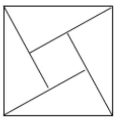
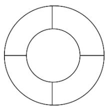
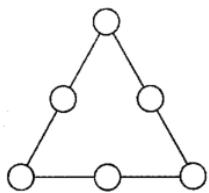
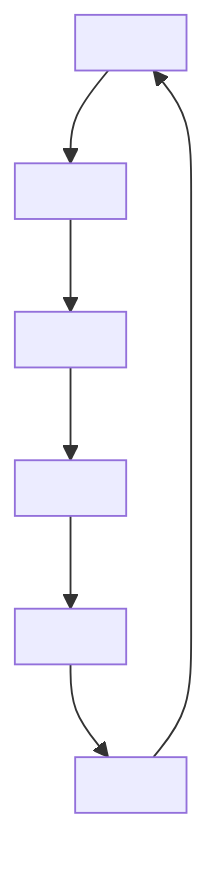
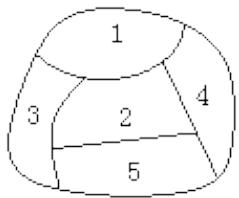

# 高中 数学 必修 第一册

# 第五章 三角函数 5.4 三角函数的图象和性质

# 5.4.3 正切函数的性质与图象

# 一、单选题（共6题）

1.【单选题】现有甲、乙、丙、丁四位同学要与两位老师站成一排合影留念，则甲同学不站两端且两位老师必须相邻的站法有（）

A. 72种

B. 144种

C. 288种

D. 576种

2.【单选题】设集合 $A=\{0,1,2,3,4,5,6,7\}$ ，如果方程 $x^{2}-mx-n=0(m,n\in A)$ 至少有一个根 $x_{0}\in A$ ，就称方程为合格方程，则合格方程的个数为（）

A. 13

B. 15

C. 17

D. 19

3.【单选题】如图为我国数学家赵爽（约3世纪初）在为《周髀算经》作注时验证勾股定理的示意图，现在提供5种颜色给其中5个小区域涂色，规定每个区域只涂一种颜色，相邻区域颜色不相同，则不同的涂色方案共有种

natural_image

Geometric pattern of nested squares forming a spiral (no text or symbols)

A. 120

B. 260

C. 340

D. 420

4.【单选题】将数字1, 2, 3, 4

，填入右侧的表格内，要求每行、每列的数字互不相同，如图所示，则不同的填表方式共有种

<table><tr><td>1</td><td>2</td><td>3</td><td>4</td></tr><tr><td>4</td><td>1</td><td>2</td><td>3</td></tr><tr><td>3</td><td>4</td><td>1</td><td>2</td></tr><tr><td>2</td><td>3</td><td>4</td><td>1</td></tr></table>

A. 432   
B. 576   
C. 720   
D. 864

5.【单选题】某师范类高校要安排6名大学生到3个高级中学进行教育教学实习，每个中学至少安排1人，其中甲中学至少要安排3人实习，则不同的安排方法种数为（）

A. 30   
B. 60   
C. 120   
D. 150

6.【单选题】如图，节日花坛中有5个区域，现有四种不同颜色的花卉可供选择，要求相同颜色的花不能相邻栽种，则符合条件的种植方案有（）种.

natural_image

Simple geometric diagram of two concentric circles divided by a central hole, with no text or symbols present.

A. 36   
B. 48   
C. 54   
D. 72

# 二、多选题（共2题）

7.【多选题】3个人坐在一排5个座位上，则下列说法正确的是（）

A. 共有60种不同的坐法

B. 空位不相邻的坐法有72种  
C. 空位相邻的坐法有24种  
D. 两端不是空位的坐法有27种

8.【多选题】现有不同的红球4个，黄球5个，绿球6个，则下列说法正确的是（）

A. 从中任选1个球，有15种不同的选法  
B. 若每种颜色选出1个球，有120种不同的选法  
C. 若要选出不同颜色的2个球，有31种不同的选法  
D. 若要不放回地依次选出2个球，有210种不同的选法

# 三、填空题（共3题）

9.【填空题】如图，在三角形三条边上的6个不同的圆内分别填入数字1，2，3中的一个.

(i) 当每条边上的三个数字之和为4时, 不同的填法有\_种;  
(ii) 当同一条边上的三个数字都不同时，不同的填法有种 \_\_\_\_.

flowchart

10.【填空题】某旅馆有三人间 两人间 单人间各一间可入住，现有三个成人带两个小孩前来投宿，若小孩不单独入住一个房间(必须有成人陪同)，且三间房都要安排给他们入住，则不同的安排方法有\_\_\_\_种.  
11.【填空题】若将五本不同的书全部分给三个同学，每人至少一本，则有\_\_\_\_种不同的分法.

# 四、复合题（共2题）

12.【复合题】用1、2、3、4、5、6、7这7个数字组成没有重复数字的四位数.

(1)【问答题】这些四位数中偶数有多少个?能被5整除的有多少个?  
(2)【问答题】这些四位数中大于6500的有多少个?

13.【复合题】已知甲、乙、丙、丁、戊、己6人。（以下问题用数字作答）

(1)【问答题】邀请这6人去参加一项活动，必须有人去，去几人自行决定，共有多少种不同的安排方法？

(2)【问答题】将这6人作为辅导员全部安排到3项不同的活动中，求每项活动至少安排1名辅导员的方法总数是多少？

# 高中 数学 选择性必修 第三册

# 第六章 计数原理 6.1

# 分类加法计数原理与分步乘法计数原理

# 一、单选题（共4题）

1.【单选题】某校A//B//C//D//E

五名学生分别上台演讲，若A须在B前面出场，且都不能在第3号位置，则不同的出场次序有（）种.

A. 18

B. 36

C. 60

D. 72

2.【单选题】计算 $C_{3}^{3} + C_{4}^{3} + \cdots + C_{9}^{3}$ 得到结果为（）

A. 210

B. 165

C. 126

D. 120

3.【单选题】 $k\in N_{+}$ ，且 $k\leqslant40$ ，则 $(50-k)(51-k)(52-k)\cdots(79-k)$ 用排列数符号表示为（）

A. $A_{79-k}^{50-k}$

B. $A_{79-k}^{29}$

C. $A_{79-k}^{30}$

D. $A_{50-k}^{30}$

4.【单选题】一个密码箱上有两个密码锁，只有两个密码锁的密码都对才能打开，两个密码锁都设有四个数位，每个数位的数字可以是1，3，5，7其中的任一个，现将左边密码锁的四个数字设成互不相同，右边密码锁的四个数字设成两个相同，另外两个也相同，则这样的密码设置的方法有（）

A. 1728

B. 1436

C. 864

D. 1288

# 二、填空题（共1题）

5.【填空题】某社区服务站将6名抗疫志愿者分到3个不同的社区参加疫情防控工作，要求每个社区至少1人，则不同的分配方案有\_\_\_\_种。（用数字填写答案）

# 三、复合题（共2题）

6.【复合题】计算:

(1)【问答题】 $(C_{100}^{2}+C_{100}^{97})\div A_{101}^{3}$   
(2)【问答题】 $C_{3}^{3}+C_{4}^{3}+\cdots+C_{10}^{3}$

7.【复合题】计算:

(1)【问答题】 $C_{8}^{5}+C_{99}^{99}\cdot C_{100}^{98}$ ;  
(2)【问答题】 $C_{5}^{0}+C_{5}^{1}+C_{5}^{2}+C_{5}^{3}+C_{5}^{4}+C_{5}^{5}$ ;  
(3)【问答题】 $C_{n}^{n-1}\cdot C_{n+1}^{n}$ 的值；

# 四、问答题（共2题）

8.【问答题】证明： $A_{n+1}^{m}-A_{n}^{m}=mA_{n}^{m-1}$

9.【问答题】解不等式 $A_{8}^{x}<6A_{8}^{x-2}$ ;

# 高中 数学 选择性必修 第三册

# 第六章 计数原理 6.2 排列与组合

# 6.2.1排列

# 一、单选题（共4题）

1. 【单选题】从正方体六个面的对角线中任取两条作为一对，其中所成的角为 $60^{\circ}$ 的共有（）

A. 24对   
B. 30对   
C. 48对   
D. 60对

2.【单选题】集合 $M = \{1,2,3,4,5\}$ ， $N = \{4,5,6\}$ ，以 $M$ 为定义域， $N$ 为值域的函数的个数为（）

A. 60   
B. 150   
C. 540   
D. $3^{5}$

3.【单选题】以正方体的顶点为顶点的四面体共有（）

A. 70种  
B. 64种  
C. 58种  
D. 52种

4.【单选题】用0，2，3，4，5，五个数字，组成没有重复数字的三位数，其中偶数共有（）。

A. 24个   
B. 30个   
C. 40个   
D. 60个

# 二、填空题（共4题）

5.【填空题】7人排队,其中甲乙丙3人顺序一定,共有多少不同的排法  
6.【填空题】一个晚会的节目有4个舞蹈,2个相声,3个独唱,舞蹈节目不能连续出场,则节目的出场顺序有多少种\_\_\_\_  
7.【填空题】如图，一个地区分为5个行政区域，现给地图着色，要求相邻区域不得使用同一颜色，现有四种颜色可供选择，则不同的着色方法共有\_\_\_\_种（以数字作答）

text_image

1
3
2
4
5

8.【填空题】7人站成一排，其中甲乙相邻且丙丁相邻，共有多少种不同的排法\_\_\_\_。

# 三、复合题（共3题）

9.【复合题】6本不同的书，按照以下要求处理，各有几种分法？

(1)【问答题】一堆1本，一堆2本，一堆3本；  
(2)【问答题】甲得1本，乙得2本，丙得3本；  
(3)【问答题】平均分给甲、乙、丙三人;  
(4)【问答题】平均分成三堆.

10.【复合题】解答题:

(1)【问答题】8人排成前后两排, 每排4人, 其中甲乙在前排, 丙在后排, 共有多少排法;  
(2)【问答题】有10个运动员名额，分给7个班，每班至少一个,有多少种分配方案?

11.【复合题】解答题:

(1)【问答题】由0，1，2，3，4，5六个数字可以组成多少个没有重复的比324105大的数？  
(2)【问答题】将数字1, 2, 3, 4填入标号为1, 2, 3, 4的四个方格里, 每格填一个数, 则每个方格的标号与所填数字均不相同的填法有几种。

# 四、问答题（共2题）

12.【问答题】小明家住二层，他每次回家上楼梯时都是一步迈两级或三级台阶。已知相邻楼层之间有16级台阶，那么小明从一层到二层共有多少种不同的走法？

13. 【问答题】在一次演唱会上共10名演员, 其中8人能唱歌, 5人会跳舞, 现要演出一个2人唱歌2人伴舞的节目, 有多少选派方法.

# 高中 数学 必修 第一册

# 第五章 三角函数 5.4 三角函数的图象和性质

# 5.4.3 正切函数的性质与图象

# 一、单选题（共3题）

1.【单选题】若 $\left(\sqrt{x} +\frac{2}{\sqrt[3]{x}}\right)^n$ 展开式中存在常数项，则正整数 $n$ 的最小值是（ ）

A. 5   
B. 6   
C. 7   
D. 8

2.【单选题】若 $(1 - 4x)^{2021} = a_{0} + a_{1}x + a_{2}x^{2} + \cdots + a_{2021}x^{2021}$ ，则 $\frac{a_{1}}{2} + \frac{a_{2}}{2^{2}} + \cdots + \frac{a_{2021}}{2^{2021}}$ 的值是（）

A.-2   
B.-1   
C. 0   
D. 1

3.【单选题】在 $\left(\frac{2}{x} - x^2\right)^6$ 的展开式中，常数项为（ ）

A. -60   
B. 60   
C. -240   
D. 240

# 二、多选题（共3题）

4.【多选题】对于 $\left(2x - \frac{1}{\sqrt{x}}\right)^6$ 的展开式，下列说法正确的是（ ）

A. 第2项的二项式系数为15  
B. $x^{3}$ 的系数是240  
C. 各项二项式系数的和是32  
D. 各项系数的和是1

5.【多选题】在 $\left(\frac{2}{x} - x\right)^{7}$ 的展开式中，下列说法正确的是（ ）

A. 不存在常数项  
B. 第4项和第5项二项式系数最大  
C. 第3项的系数最大  
D. 所有项的系数和为128

6.【多选题】已知 $(a + 2b)^n$ 的展开式中第6项的二项式系数最大，则 $n$ 的值可以为（ ）

A. 8   
B. 9   
C. 10   
D. 11

# 三、填空题（共2题）

7.【填空题】 $7^{11}$ 除以6的余数是\_\_\_\_。

8.【填空题】 $\left(\sqrt[3]{x}-\frac{1}{2}x\right)^{6}$ 的展开式中含 $x^{4}$ 项的系数为 \_\_\_\_.（用数字作答）

# 四、复合题（共2题）

9.【复合题】在 $\left(x^{2} + \frac{1}{\sqrt{x}}\right)^{5}$ 的展开式中，求：

(1)【问答题】含 $x^{5}$ 的项;  
(2)【问答题】展开式中常数项.

10.【复合题】已知二项式 $\left(x - \frac{l}{\sqrt[3]{x}}\right)^n$ 的展开式的各二项式系数的和等于128，

(1)【问答题】求n的值;   
(2)【问答题】求展开式中系数最大的项.