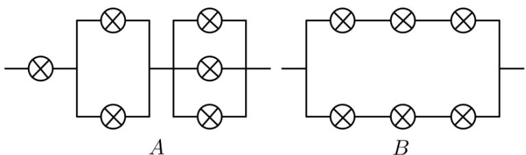
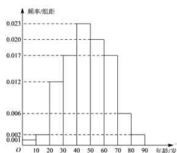
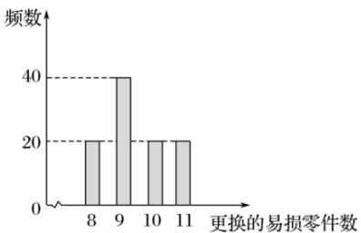

# 高中 数学 选择性必修 第三册

# 第七章 随机变量及其分布 小结

# 一、单选题（共6题）

1.【单选题】下列事件中，是随机事件的是（）

①经过有交通信号灯的路口，刚好是红灯；  
②投掷2颗质地均匀的骰子，点数之和为14;   
③抛掷一枚质地均匀的硬币，字朝上；  
④13个人中至少有2个人的生日在同一个月.

A. ①③

B. ③④

C. ①④

D. ②③

2.【单选题】已知A与B是互斥事件，且 $P(\overline{A})=0.4,\quad P(B)=0.2$ ，则 $P(A\cup B)=$ （）

A. 0.6   
B. 0.7   
C. 0.8   
D. 0.0

3.【单选题】下列说法正确的是（）

A. 某医院治疗某种疾病的治愈率为 $20\%$ ，前8人没有治愈，则后两个人一定治愈  
B. 甲乙两人乒乓球比赛，乙获胜的概率为 $\frac{2}{5}$ ，则比赛5场，乙胜2场  
C. 某种药物对患有咳嗽的400名病人进行治疗，结果有300

人有明显效果. 现对咳嗽的病人服用此药，则估计会有明显疗效的可能性为 $75 \%$

D. 随机试验的频率与概率相等

4.【单选题】若从1,2,3,4,5

五个数字中随机取出三个数字，则剩下两个数字不都是奇数的概率为（）

A. 0.8   
B. 0.75   
C. 0.7

D. 0.6

5.【单选题】天气预报说，今后三天中，每一天下雨的概率均为 $40 \%$

，现采用随机模拟方法估计这三天中恰有两天下雨的概率：先由计算器算出0到9

之间取整数值的随机数，指定1,2,3,4表示下雨，5,6,7,8,9,0

表示不下雨. 经随机模拟产生了如下20组随机数:

907 966 195 925 271 932 812 458 569 683 431 257 393 027556 488 730 113 537 989

据此估计今后三天中恰有两天下雨的概率为（）

A. 0.40   
B. 0.30   
C. 0.25   
D. 0.20

6.【单选题】从甲袋中摸出1个红球的概率是 $\frac{1}{3}$ , 从乙袋中摸出1个红球的概率是 $\frac{1}{2}$ , 从两袋中各摸出1个球, 则 $\frac{2}{3}$ 可能是 ( )

A. 2个球不都是红球的概率  
B. 2个球都是红球的概率  
C. 至少有1个红球的概率  
D. 2个球中恰有1个红球的概率

# 高中 数学 选择性必修 第三册

# 第七章 随机变量及其分布 小结

# 一、单选题（共3题）

1.【单选题】从5名男同学和4名女同学中任选2名同学，在选到的都是同性别同学的条件下，都是男同学的概率是（）

A. $\frac{1}{3}$   
B. $\frac{5}{14}$   
C. $\frac{10}{13}$   
D. $\frac{5}{8}$

2.【单选题】某射击小组共有25名射手，其中一级射手5人，二级射手10人，三级射手10人，若一、二、三级射手能通过选拔进入比赛的概率分别是0.9，0.8，0.4，则任选一名射手能通过选拔进入比赛的概率为（）

A. 0.48   
B. 0.66   
C. 0.70   
D. 0.75

3.【单选题】甲、乙、丙、丁四人相互做传球训练，第1次由甲将球传出，每次传球时，传球者都等可能地将球传给另外三个人中的任何一人，则n次传球后球在甲手中的概率是（）

A. $1 - \left(\frac{2}{3}\right)^{n - 1}$   
B. $1 - \left(\frac{3}{4}\right)^{n - 1}$   
C. $\frac{1}{4} -\frac{1}{4}\left(-\frac{1}{3}\right)^{n - 1}$   
D. $\frac{1}{4} -\frac{1}{4}\left(\frac{1}{3}\right)^{n - 1}$

# 二、多选题（共3题）

4.【多选题】同时抛掷两个质地均匀的四面分别标有1, 2, 3, 4的正四面体一次, 记事件A表示“第一个四面体向下的一面出现偶数”, 事件B表示“第二个四面体向下的一面出现奇数”，事件C表示“两个四面体向下的一面同时出现奇数或者同时出现偶数”，则（）

A. $P_{(AB)} = P_{(AC)} = P_{(BC)}$

B. $P(A|B) = P(A|C) = \frac{1}{2}$

C. $P(ABC) = \frac{1}{8}$

D. $P(A)P(B)P(C)=\frac{1}{4}$

5.【多选题】一批产品中有3个正品，2个次品.现从中任意取出2件产品，记事件A

: “2个产品中至少有一个正品”，事件B：“2个产品中至少有一个次品”，事件C：“2个产品中有正品也有次品”，则下列结论正确的是（）

A. 事件 $A$ 与事件 $B$ 为互斥事件

B. 事件 $B$ 与事件 $C$ 是相互独立事件

C. $P_{(AB)} = P(C)$

D. $P(C|A)=\frac{2}{3}$

6.【多选题】下列说法正确的是（）

A. 若事件M,N互斥， $P(M)=0.2, P(N)=0.6$ ，则 $P(M \cup N)=0.8$

B. 若 $P(M)=0.4, P(N|M)=0.15$ ，则 $P(MN)=0.06$

C. 若 $P(MN) = 0.4, P(\overline{M} N) = 0.5$ ，则 $P(\overline{N}) = 0.9$

D. 若 $P(N|M)=0.2, P(N)=0.2$ ，则事件M,N相互独立

# 三、填空题（共4题）

7.【填空题】已知事件A，B相互独立，且 $P(\overline{A})=\frac{1}{3}$ ， $P(B)=\frac{1}{4}$ ，则 $P(A\overline{B})=$ \_\_\_\_.

8.【填空题】一道考题有4个答案，要求学生将其中的一个正确答案选择出来.某考生知道正确答案的概率为 $\frac{1}{3}$

，在乱猜时，4个答案都有机会被他选择，若他答对了，则他确实知道正确答案的概率是\_\_\_\_。

9.【填空题】甲、乙两人进行射击游戏，目标靶上有三个区域，分别涂有红、黄、蓝三色，已知甲击中红、黄、蓝三区域的概率依次是 $\frac{1}{5}$ ， $\frac{2}{5}$ ， $\frac{1}{5}$ ，乙击中红、黄、蓝三区域的概率依次是 $\frac{1}{6}$ ， $\frac{1}{2}$ ， $\frac{1}{4}$

，甲、乙两人射击情况互不影响，若甲、乙各射击一次，则两人命中同色区域的概率为\_\_\_\_，两人命中不同色区域的概率为\_\_\_\_。

10.【填空题】如图所示的A，B两个电路中，每个元件接通的概率均为 $\frac{I}{2}$

，且每个元件是否接通互不影响，则这两个电路接通的概率分别为\_\_\_\_，\_\_\_\_。

text_image

A
B

# 四、复合题（共2题）

11.【复合题】2022年2月4日晚，璀璨的烟花点亮“鸟巢”上空，国家体育场再次成为世界瞩目的焦点，北京成为奥运历史和人类历史上第一座举办过夏奥会和冬奥会的“双奥之城”，奥林匹克梦想再次在中华大地绽放．冰雪欢歌耀五环，北京冬奥会开幕式为第二十四届“简约、安全、精彩”的冬奥盛会拉开序幕．某中学课外实践活动小组在某区域内通过一定的有效调查方式对“开幕式”当晚的收看情况进行了随机抽样调查．统计发现，通过手机收看的约占 $\frac{1}{2}$ ，通过电视收看的约占 $\frac{1}{3}$ ，其他为未收看者．

(1)【问答题】从该地区被调查对象中随机选取3人，其中至少有1人通过手机收看的概率；

(2)【问答题】从该地区被调查对象中随机选取3人，用 $X$ 表示通过电视收看的人数，求 $X$ 的分布列和期望.

12.【复合题】水牛奶含有丰富的蛋白质，包括酪蛋白和少量的乳清蛋白，及大量人体生长发有所需的氨基酸和微量元素．不过新鲜的水牛奶保质期较短．某超市为了保证顾客能购买到新鲜的水牛奶又不用过多存货，于是统计了50天销售水牛奶的情况，获得如下数据：

<table><tr><td>日销售量/件</td><td>0</td><td>1</td><td>2</td><td>3</td></tr><tr><td>天数</td><td>5</td><td>10</td><td>25</td><td>10</td></tr></table>

假设水牛奶日销售量的分布规律保持不变，将频率视为概率.

(1)【问答题】求接下来三天中至少有2天能卖出3件水牛奶的概率;

(2)【问答题】已知超市存货管理水平的高低会直接影响超市的经营情况。该超市对水牛奶实行如下存货管理制度：当天营业结束后检查存货，若存货少于2件，则通知配送中心立即补货至3件，否则不补货。假设某天开始营业时货架上有3件水牛奶，求第二天营业结束后货架上有1件存货的概率。

# 高中 数学 选择性必修 第三册

# 第七章 随机变量及其分布 7.3

# 离散型随机变量的数字特征

# 一、单选题（共2题）

1.【单选题】随机变量 $\xi$ 的分布列如表:

<table><tr><td>ξ</td><td>-1</td><td>0</td><td>1</td><td>2</td></tr><tr><td>P</td><td> $\frac{1}{3}$ </td><td>a</td><td>b</td><td>c</td></tr></table>

其中 a, b, c 成等差数列，若 $E_{(\xi)} = \frac{l}{9}$ ，则 $D_{(\xi)} = (\quad)$

A. $\frac{1}{81}$   
B. $\frac{2}{9}$   
C. $\frac{8}{9}$   
D. $\frac{80}{81}$

2.【单选题】已知数列 $\{a_{n}\}$ 满足 $a_{I} = 0$ ，且对任意 $n \in N^{*}$ ， $a_{n+1}$ 等概率地取 $a_{n+1}$ 或 $a_{n-1}$ ，设 $a_{n}$ 的值为随机变量 $\xi_{n}$ ，则（）

A. $P(\xi_3 = 2) = \frac{1}{2}$   
B. $E(\xi_3) = 1$   
C. $P(\xi_5 = 0) <   P(\xi_5 = 2)$   
D. $P(\xi_{5}=0)<P(\xi_{3}=0)$

# 二、多选题（共2题）

3.【多选题】某电视台的一档栏目推出有奖猜歌名活动，规则：根据歌曲的主旋律制作的铃声来猜歌名，猜对当前歌曲的歌名方能猜下一首歌曲的歌名。现推送三首歌曲 A, B, C 给某选手，已知该选手猜对每首歌曲的歌名相互独立，且猜对三首歌曲的歌名的概率以及猜对获得相应的奖金如下表所示。

<table><tr><td>歌曲</td><td>A</td><td>B</td><td>C</td></tr><tr><td>猜对的概率</td><td>0.8</td><td>0.6</td><td>0.4</td></tr><tr><td>获得的奖金金额/元</td><td>1000</td><td>2000</td><td>3000</td></tr></table>

下列猜歌顺序中获得奖金金额的均值超过2000元的是（）

A. $A \rightarrow B \rightarrow C$   
B. $C \rightarrow B \rightarrow A$   
C. $C \rightarrow A \rightarrow B$   
D. $B \rightarrow C \rightarrow A$

4.【多选题】将 $2n(n \in N^{*})$

个有编号的球随机放入2个不同的盒子中，已知每个球放入这2个盒子的可能性相同，且每个盒子容纳球数不限记2个盒子中最少的球数为 $X(0 \leq X \leq n, X \in N^{*})$

，则下列说法中正确的有（）

A. 当 $n = 1$ 时，方差 $D(X) = \frac{1}{4}$   
B. 当 $n = 2$ 时， $P(X = 1) = \frac{3}{8}$   
C. $\forall n\geqslant3,\exists k\in[0,n)(k,n\in N^{*})$ ，使得 $P(X=k)>P(X=k+1)$ 成立  
D. 当 $n$ 确定时，期望 $E(X) = \frac{n(2^{2n} - C_{2n}^n)}{2^{2n}}$

# 三、填空题（共2题）

5.【填空题】有3个人在一楼进入电梯，楼上共有4

层，设每个人在任何一层出电梯的概率相等，并且各层楼无人再进电梯，设电梯中的人走空时电梯需停的次数为 $\xi$ ，则 $E_{(\xi)} =$ \_\_\_\_ .

6.【填空题】从由1,2,3,4,5,6组成的没有重复数字的六位数中任取5个不同的数,其中满足1,3都不与5相邻的六位偶数的个数为随机变量X,则 $P(X=2)=$ \_\_\_\_. (结果用式子表示即可)

# 四、复合题（共2题）

7.【复合题】为了强化体育锻炼，增强青少年体质，国家规定将体育科目纳入高中阶段学校考试招生录取计分科目，并以体育固本行动，开展好学校特色体育项目，大力发展校园体育特色，让每位学生掌握1至2

项运动技能，希望学校根据地域特点，大力推广田径、足球、篮球、排球、羽毛球等基础和特色项目．为了增加篮球活动的趣味性，学校设计了如下活动方案：甲、乙两位同学轮流进行投篮比赛，投中自己得1分，对方得0分；不中对方得1分，自己得0

分，无论谁投篮，每投一次为一轮比赛，规定当一人比另一人多3分或进行完9

轮投篮后，活动结束．假设甲、乙两位同学投篮命中率都为 $\frac{1}{2}$

，且两人投球命中与否相互独立．已知现在已经进行了3轮投篮比赛，甲得分2分，乙得分1分，在此基础上继续比赛.

(1)【问答题】只有当一人比另一人多3

分时，得分高者才能获得游戏奖品，求甲获得游戏奖品的概率；

(2)【问答题】设 X 表示该活动结束时所进行的比赛的总轮数，求 X 的分布列及数学期望.

8.【复合题】某单位为患病员工集体筛查新型流感病毒，需要去某医院检验血液是否为阳性，现有 $k(k \in N^{*}, k \geqslant 2)$ 份血液样本，有以下两种检验方案，方案一：逐份检验，则需要检验 $k$ 次；方案二：混合检验，将 $k$

份血液样本分别取样混合在一起检验一次，若检验结果为阴性，则k

份血液样本均为阴性，若检验结果为阳性，为了确定k份血液中的阳性血液样本，则对k份血液样本再逐一检验.逐份检验和混合检验中的每一次检验费用都是 $a(a > 0)$ 元，且k份血液样本混合检验一次需要额外收 $\frac{5}{4} a$

元的材料费和服务费. 假设在接受检验的血液样本中，每份样本是否为阳性是相互独立的，且据统计每份血液样本是阳性的概率为 $p(0 < p < 1)$ .

(1)【问答题】若 $k(k \in N^{*}, k \geqslant 2)$

份血液样本采用混合检验方案，需要检验的总次数为 X，求 X 分布列及数学期望；

(2)【问答题】若 $k = 5, 0 < p < 1 - \sqrt[5]{0.45}$

，以检验总费用为决策依据，试说明该单位选择方案二的合理性；

# 高中 数学 选择性必修 第三册

# 第七章 随机变量及其分布 7.5 正态分布

# 一、单选题（共2题）

1.【单选题】某篮球运动员每次投篮投中的概率是 $\frac{4}{5}$

，每次投篮的结果相互独立,那么在他10次投篮中,记最有可能投中的次数为 m ,则 m 的值为( )

A. 5   
B. 6   
C. 7   
D. 8

2.【单选题】正态分布是最重要的一种概率分布，它是由德国的数学家、天文学家Moivre于1733年提出，但由于德国数学家Gauss率先应用于天文学研究，故正态分布又称为高斯分布，记作 $Y\sim N(\mu ,\sigma^2)$ 。当 $\mu = 0$ ， $\sigma = 1$ 的正态分布称为标准正态分布，如果令 $X = \frac{Y - \mu}{\sigma}$ ，则可以证明 $X\sim N(0,1)$ ，即任意的正态分布可以通过变换转化为标准正态分布。如果 $X\sim N(0,1)$ 那么对任意的 $a$ ，通常记 $\Phi (a) = P(X < a)$ ，也就是说， $\varphi (a)$ 表示 $N(0,1)$

对应的正态曲线与x轴在区间 $(-∞,a)$

内所围的面积．某校高三年级 800 名学生，期中考试数学成绩近似服从正态分布，高三年级数学成绩平均分 100 ，方差为 36 ， $\varphi(2)=0.9772$ ，那么成绩落在 $(88,112]$

的人数大约为（）

A. 756   
B. 748   
C. 782   
D. 764

# 二、多选题（共1题）

3.【多选题】已知随机变量 X 服从正态分布 $N(100, 100)$ ，则下列结论正确的是（）

（若随机变量 $Y$ 服从正态分布 $N(\mu, \sigma^2)$ ，则 $P(\mu - \sigma \leqslant Y \leqslant \mu + \sigma) \approx 0.6827P(\mu - 2\sigma \leqslant Y \leqslant \mu + 2\sigma)$ $\approx 0.9545 P(\mu - 3\sigma \leqslant Y \leqslant \mu + 3\sigma) \approx 0.9973$ ）

A. $E(X) = 100$   
B. $D(X) = 100$   
C. $P(X \geqslant 90) = 0.84135$

$$
D. P (X \leqslant 1 2 0) = 0. 9 9 8 7
$$

# 三、填空题（共1题）

4.【填空题】已知离散型随机变量 X 服从二项分布 $X \sim B(n, p)$ ，且 $E(X) = 4$ ， $D(X) = q$ ，则 $\frac{l}{p} + \frac{l}{q}$ 的最小值为 \_\_\_\_.

# 四、复合题（共6题）

5.【复合题】袋中有大小 质地完全相同的五个小球，小球上面分别标有 0 ， 1 ， 2 ， 3 ， 4 .

(1)【问答题】从袋中任意摸出三个球，标号为奇数的球的个数记为X，写出X的分布列；  
(2)【问答题】从袋中一次性摸两球，和为奇数记为事件 A，有放回地摇匀后连摸五次，事件A发生的次数记为Y，求Y的分布列 数学期望和方差.

6.【复合题】为迎接党的“二十大”胜利召开，学校计划组织党史知识竞赛.某班设计一个预选方案：选手从6道题中随机抽取3道进行回答.已知甲6道题中会4道，乙每道题答对的概率都是 $\frac{2}{3}$ ，且每道题答对与否互不影响.

(1)【问答题】分别求出甲、乙两人答对题数的概率分布列;   
(2)【问答题】你认为派谁参加知识竞赛更合适，请说明你的理由.

7.【复合题】2020年我国科技成果斐然，其中北斗三号全球卫星导航系统7月31日正式开通。北斗三号全球卫星导航系统由24颗中圆地球轨道卫星、3颗地球静止轨道卫星和3颗倾斜地球同步轨道卫星，共30颗卫星组成。北斗三号全球卫星导航系统全球范围定位优于10米，实测的导航定位精度都是 $2\sim 3$ 米，全球服务可用性 $99\%$ ，亚太地区性能更优。

(1)【问答题】南美地区某城市通过对1000辆家用汽车进行定位测试，发现定位精确度 X 近似满足 $X \sim N\left(\frac{5}{2}, \frac{1}{4}\right)$ ，预估该地区某辆家用汽车导航精确度在 [1,3] 的概率；

(2)【问答题】

(i)某地基站工作人员 30 颗卫星中随机选取 4 颗卫星进行信号分析，选取的4颗卫星中含3颗倾斜地球同步轨道卫星数记为 Y，求 Y 的分布列和数学期望；  
(ii)某日北京、上海、拉萨、巴黎、里约 5 个基地同时独立随机选取 1 颗卫星进行信号分析，选取的 5 颗卫星中含中圆地球轨道卫星的数目记为 $\xi$ ，求 $\xi$ 的数学期望.

附：若 $X\sim N(\mu ,\sigma^2)$ ，则 $P(\mu -\sigma \leqslant X\leqslant \mu +\sigma)\approx 0.6827$ ， $P(\mu -2\sigma \leqslant X\leqslant \mu +2\sigma)\approx 0.9545$ ， $P(\mu -3\sigma \leqslant X\leqslant \mu +3\sigma)\approx 0.9973$

8.【复合题】假定甲、乙两名学生进行投篮训练比赛，甲每次投中的概率为 $\frac{1}{2}$ ，乙每次投中的概率为 $\frac{1}{3}$ ，现甲、乙两人各投篮 3 次，进球次数多的为赢方.

(1)【问答题】求乙赢的概率;   
(2)【问答题】设甲投中的次数为 X，求 X 的分布列及数学期望 $E(X)$ .

9.【复合题】学习强国中有两项竞赛答题活动，一项为“双人对战”，另一项为“四人赛”。活动规则如下：一天内参与“双人对战”活动，仅首局比赛可获得积分，获胜得2分，失败得1分；一天内参与“四人赛”活动，仅前两局比赛可获得积分，首局获胜得3分，次局获胜得2分，失败均得1分。已知李明参加“双人对战”活动时，每局比赛获胜的概率为 $\frac{1}{2}$

；参加 “四人赛” 活动（每天两局）时，第一局和第二局比赛获胜的概率分别为 $p$ ， $\frac{l}{3}$ 。李明周一到周五每天都参加了 “双人对战” 活动和 “四人赛” 活动（每天两局），各局比赛互不影响。

(1)【问答题】求李明这 5 天参加 “双人对战” 活动的总得分 X 的分布列和数学期望;  
(2)【问答题】设李明在这 5 天的“四人赛”活动（每天两局）中，恰有 3 天每天得分不低于 3 分的概率为 $f(p)$ 。求 $p$ 为何值时， $f(p)$ 取得最大值.

10.【复合题】袋中有 8 个白球，2 个黑球,从中随机地连续抽取 3 次，每次取 1 个球，求:

(1)【问答题】有放回抽样时, 取到黑球的个数 X 的分布列;  
(2)【问答题】不放回抽样时, 取到黑球的个数 Y 的分布列.

# 高中 数学 选择性必修 第三册

# 第七章 随机变量及其分布 小结

# 一、单选题（共3题）

1.【单选题】生男孩和生女孩的概率相等时，一个家庭有三个孩子，至少两个是女孩的概率为（）

A. $\frac{1}{8}$   
B. $\frac{1}{4}$   
C. $\frac{1}{2}$   
D. $\frac{3}{4}$

2.【单选题】不透明的袋中装有大小相同的四个球，四个球上分别标有数字“2”、“3

”、“4”、“6

”，现从中随机选取三个球，则所选的三个球上的数字中一个数字的两倍等于其余两个数字之和的概率为（）

A. $\frac{1}{4}$   
B. $\frac{l}{3}$   
C. $\frac{1}{2}$   
D. $\frac{2}{3}$

3.【单选题】我国古代典籍《周易》用“卦”描述万物的变化。每一“重卦”由从下到上排列的6个爻组成，爻分为阳爻“——”和阴爻“——

”，如图就是一重卦。在所有重卦中随机取一重卦，则该重卦恰有3个阳爻的概率是（

)

A. $\frac{5}{16}$   
B. $\frac{11}{32}$

C. $\frac{21}{32}$   
D. $\frac{11}{16}$

# 二、填空题（共2题）

4.【填空题】甲、乙两队进行篮球决赛，采取七场四胜制（当一队赢得四场胜利时，该队获胜，决赛结束）。根据前期比赛成绩，甲队的主客场安排依次为“主主客客主客主”。设甲队主场取胜的概率为0.6，客场取胜的概率为0.5，且各场比赛结果相互独立，则甲队以4∶1获胜的概率是\_\_\_\_。  
5.【填空题】某工厂生产了一批节能灯泡，这批产品中按质量分为一等品，二等品，三等品。从这些产品中随机抽取一件产品测试，已知抽到一等品或二等品的概率为0.86，抽到二等品或三等品的概率为0.35，则抽到二等品的概率为\_\_\_\_。

# 三、复合题（共11题）

6.【复合题】在某地区进行流行病学调查，随机调查了100位某种疾病患者的年龄，得到如下的样本数据的频率分布直方图：

(1)【问答题】估计该地区这种疾病患者的平均年龄（同一组中的数据用该组区间的中点值为代表）；  
(2)【问答题】估计该地区一位这种疾病患者的年龄位于区间[20,70)的概率;  
(3)【问答题】已知该地区这种疾病的患病率为 $0.1\%$ ，该地区年龄位于区间[40,50)

的人口占该地区总人口的16%. 从该地区中任选一人，若此人的年龄位于区间[40,50)

，求此人患这种疾病的概率．（以样本数据中患者的年龄位于各区间的频率作为患者的年龄位于该区间的概率，精确到0.0001）.

7. 【复合题】某公司计划购买2台机器，该种机器使用三年后即被淘汰，机器有一易损零件，在购进机器时，可以额外购买这种零件作为备件，每个200元．在机器使用期间，如果备件不足再购买，则每个500元．现需决策在购买机器时应同时购买几个易损零件，为此搜集并整理了100台这种机器在三年使用期内更换的易损零件数，得下面柱状图：

bar

| 更换的易损零件数 | 频数 |
| :--- | :--- |
| 8 | 20 |
| 9 | 40 |
| 10 | 20 |
| 11 | 20 |

以这100台机器更换的易损零件数的频率代替1台机器更换的易损零件数发生的概率，记X表示2台机器三年内共需更换的易损零件数，n表示购买2台机器的同时购买的易损零件数.

(1)【问答题】求X的分布列;  
(2)【问答题】若要求 $P(X \leqslant n) \geqslant 0.5$ ，确定n的最小值；  
(3)【问答题】以购买易损零件所需费用的期望值为决策依据，在 $n = 19$ 与 $n = 20$ 之中选其一，应选用哪个？

8.【复合题】从某批产品中，有放回地抽取产品2次，每次随机抽取1件，假设事件A：“取出的2件产品中至多有1件是二等品”的概率 $P(A)=0.99$ .

(1)【问答题】求从该批产品中任取1件是二等品的概率p;   
(2)【问答题】若该批产品共100件，从中无放回地一次性任意抽取2件，用X表示取出的2件产品中二等品的件数，求X的数学期望.

9.【复合题】某学校组织“一带一路”知识竞赛，有A，B

两类问题，每位参加比赛的同学先在两类问题中选择一类并从中随机抽取一个问题回答，若回答错误则该同学比赛结束；若回答正确则从另一类问题中再随机抽取一个问题回答，无论回答正确与否，该同学比赛结束。A类问题中的每个问题回答正确得20分，否则得0分；B类问题中的每个问题回答正确得80分，否则得0分，已知小明能正确回答A

类问题的概率为0.8，能正确回答B类问题的概率为0.6，且能正确回答问题的概率与回答次序无关.

(1)【问答题】若小明先回答A类问题，记X为小明的累计得分，求X的分布列；  
(2)【问答题】为使累计得分的期望最大，小明应选择先回答哪类问题？并说明理由.

10.【复合题】某中学举行篮球趣味投篮比赛, 比赛规则如下: 每位选手各投5个球, 每一个球可以选择在A区投篮也可以选择在B区投篮, 在A区每投进一球得2分, 投不进球得0分; 在B区每投进一球得3分, 投不进球得0分, 得分高的选手胜出. 已知参赛选手甲在A区和B区每次投篮进球的概率分别为 $\frac{2}{3}$ 和 $\frac{1}{2}$ , 且各次投篮的结果互不影响.

(1)【问答题】若甲投篮得分的期望值不低于7分，则甲选择在A区投篮的球数最多是多少个？

(2)【问答题】若甲在A区投3个球且在B区投2个球，求甲在A区投篮得分高于在B区投篮得分的概率.

11.【复合题】某城市为了加快“两型社会”（资源节约型，环境友好型）的建设，本着健康、低碳的生活理念，租自行车骑游的人越来越多，自行车租车点的收费标准是每车每次租车时间不超过两小时免费，超过两小时的部分每小时收费2元（不足1小时的部分按1小时计算）。有甲、乙两人相互独立来该租车点租车骑游（各租一车一次）。设甲、乙不超过两小时还车的概率分别为 $\frac{1}{4}$ ， $\frac{1}{2}$ ；两小时以上且不超过三小时还车的概率分别为 $\frac{1}{2}$ ， $\frac{1}{4}$ ；两人租车时间都不会超过四小时。

(1)【问答题】求甲、乙两人所付的租车费用相同的概率;   
(2)【问答题】设甲、乙两人所付的租车费用之和为随机变量X，求X的分布列.

12.【复合题】春节期间，某商场准备举行有奖促销活动，顾客购买超过一定金额的商品后均有一次抽奖机会. 抽奖规则如下：将质地均匀的转盘平均分成 $n(n \in \mathbb{N}^*, n \geqslant 3)$

）个扇区，每个扇区涂一种颜色，所有扇区的颜色各不相同，顾客抽奖时连续转动转盘三次，记录每次转盘停止时指针所指扇区内的颜色（若指针指在分界线处，本次转运动无效，需重转一次），若三次颜色都一样，则获得一等奖；若其中两次颜色一样，则获得二等奖；若三次颜色均不一样，则获得三等奖.

(1)【问答题】若一、二等奖的获奖概率之和不大于 $\frac{4}{9}$ , 求 $n$ 的最小值;  
(2)【问答题】规定一等奖返还现金108元，二等奖返还现金60元，三等奖返还现金18元，在n取（1）中的最小值的情况下，求顾客在一次抽奖中获奖金额的分布列和数学期望.

13.【复合题】国家鼓励公民通过技能培训考试获取技能资格证，凭证上岗就业。按规定某人依次进行理论、实践操作两科考试，当基础理论合格时，方可进入实践操作考试，且两科均有一次补考的机会，两科都合格就能获取技能资格证书，今年李华报名参加考试，假定他每次考基础理论合格的概率均为 $\frac{2}{3}$ ，每次考实践操作合格的概率均为 $\frac{1}{2}$ ，且不放弃每次考试或补考机会，且每次考试互不影响。

(1)【问答题】求李华恰好经过3次考试获取技能资格证书的概率;   
(2)【问答题】记李华参加考试的次数为 $\xi$ ，求 $\xi$ 的分布列和数学期望.

14.【复合题】某工厂的某种产品成箱包装，每箱200

件，每一箱产品在交付用户之前要对产品作检验，如检验出不合格品，则更换为合格品．检验时，先从这箱产品中任取20

件作检验，再根据检验结果决定是否对余下的所有产品作检验，设每件产品为不合格品的概率都为 $p(0 < p < 1)$ ，且各件产品是否为不合格品相互独立.

(1)【问答题】记20件产品中恰有2件不合格品的概率为 $f(p)$ ，求 $f(p)$ 的最大值点 $p_{0}$ ;

(2)【问答题】现对一箱产品检验了20件，结果恰有2件不合格品，以（1）中确定的 $p_{0}$ 作为p的值．已知每件产品的检验费用为2

元，若有不合格品进入用户手中，则工厂要对每件不合格品支付25元的赔偿费用.

(i) 若不对该箱余下的产品作检验, 这一箱产品的检验费用与赔偿费用的和记为 $X$ , 求 $EX$ ;  
（ii）以检验费用与赔偿费用和的期望值为决策依据，是否该对这箱余下的所有产品作检验？

15.【复合题】某中学的一个高二学生社团打算在开学初组织部分同学参加打扫校园志愿活动.该社团通知高二同学自愿报名，由于报名的人数多达50人，于是该社团采用了在报名同学中用抽签的方式来确定打扫校园的人员名单.抽签方式如下：将50名同学编号，通过计算机从这50个编号中随机抽取30个编号，然后再次通过计算机从这50个编号中随机抽取30个编号，两次都被抽取到的同学可参加活动.

(1)【问答题】设该校高二年级报名参加活动的甲同学的编号被抽取到的次数为 $Y$ ，求 $Y$ 的分布列和数学期望；

(2)【问答题】设两次都被抽取到的人数为变量X，则X的可能取值是哪些？其中X取到哪一个值的可能性最大？请说明理由.

16.【复合题】11分制乒乓球比赛，每赢一球得1分，当某局打成10:10平后，每球交换发球权，先多得2分的一方获胜，该局比赛结束。甲、乙两位同学进行单打比赛，假设甲发球时甲得分的概率为0.5，乙发球时甲得分的概率为0.4，各球的结果相互独立。在某局双方10:10平后，甲先发球，两人又打了X个球该局比赛结束。

(1)【问答题】求 $P(X=2)$ ;   
(2)【问答题】求事件 “X = 4 且甲获胜” 的概率.