# 高中 数学 选择性必修 第二册

# 第五章 一元函数的导数及其应用 5.1

# 导数的概念及其意义

# 5.1.1 变化率问题

# 一、单选题（共3题）

1.【单选题】设函数 $f(x) = x \lg x - x$ ，当 $x$ 由1变到10时， $f(x)$ 的平均变化率为（）

A. $\frac{l}{9}$   
B. $\frac{5}{9}$   
C. $\frac{13}{18}$   
D. $\frac{17}{18}$

2.【单选题】

2020年5月1日，北京市开始全面实施垃圾分类，家庭厨余垃圾的分出量不断增加．已知甲、乙两个小区在 $[0,t]$ 这段时间内的家庭厨余垃圾的分出量Q与时间t

的关系如图所示．给出下列四个结论：

①在 $[t_{1},t_{2}]$ 这段时间内，甲小区的平均分出量比乙小区的平均分出量大；  
②在 $[t_{2},t_{3}]$ 这段时间内，乙小区的平均分出量比甲小区的平均分出量大；  
③在 $t_{2}$ 时刻，甲小区的分出量比乙小区的分出量增长的慢；  
④甲小区在 $[0,t_{1}]$ ， $[t_{1},t_{2}]$ ， $[t_{2},t_{3}]$ 这三段时间中，在 $[t_{2},t_{3}]$ 的平均分出量最大.

其中所有正确结论的序号是（）

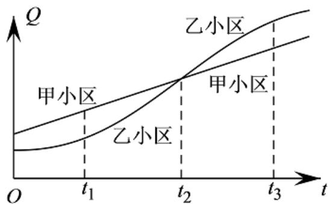

line

| t    | Q (甲小区) | Q (乙小区) |
| ---- | ---------- | ---------- |
| t₁   | ~0.5       | ~0.2       |
| t₂   | ~1.0       | ~1.0       |
| t₃   | ~1.5       | ~1.8       |

A. ①②

B.②③   
C.①④   
D. ③④

3.【单选题】若函数 $f(x)=x^{2}-2$ 在区间 $(1,m)$ 上的平均变化率为3，则m等于（）

A. $\sqrt{5}$   
B. 2   
C. 3   
D. 1

# 二、多选题（共1题）

4.【多选题】一球沿某一斜面自由滚下，测得滚下的垂直距离h（单位：m）与时间t（单位：s）之间的函数关系为 $h_{(t)}=2t^{2}+2t$ ，则下列说法正确的是（ ）.

A. 前3s内球滚下的垂直距离的增量 $\Delta h = 20m$   
B. 在时间 $[2, 3]$ 内球滚下的垂直距离的增量 $\Delta h = 12m$   
C. 前3s内球在垂直方向上的平均速度为8m/s  
D. 在时间[2, 3]内球在垂直方向上的平均速度为 $12 \mathrm{~m} / \mathrm{s}$

# 三、填空题（共2题）

5.【填空题】已知a>1，函数 $f(x)=\ln x$

，则下面结论中正确的有\_\_\_\_。（填上所有正确结论的序号）

①函数 $f(x)$ 在区间 $[a, a+1]$ 上的平均变化率总是大于1;  
②函数 $f(x)$ 在区间 $[a, a+1]$ 上的平均变化率总是小于1;  
③函数 $f(x)$ 在区间 $[a, a+1]$ 上的平均变化率随着a的增大而增大；  
④函数 $f(x)$ 在区间 $[a, a+1]$ 上的平均变化率随着a的增大而减小.

6.【填空题】已知函数 $y = \sin x$ 在区间 $\left[0, \frac{\pi}{6}\right]$ , $\left[\frac{\pi}{3}, \frac{\pi}{2}\right]$ 上的平均变化率分别为 $k_1$ , $k_2$ , 那么 $k_1$ , $k_2$ 的大小关系为 \_\_\_\_.

# 四、复合题（共1题）

7.【复合题】已知函数 $f(x)=x^{2}-1$ ，当自变量x由1变到1.1时，求：

(1)【问答题】自变量的增量 $\Delta x;$

(2)【问答题】函数的增量 $\Delta y;$   
(3)【问答题】函数的平均变化率.

# 高中 数学 选择性必修 第二册

# 第五章 一元函数的导数及其应用 5.1

# 导数的概念及其意义

# 5.1.1 变化率问题

# 一、单选题（共5题）

1.【单选题】函数 $f(x)$ 的图象如图所示， $f'(x)$ 为函数 $f(x)$ 的导函数，下列数值排序正确是（）

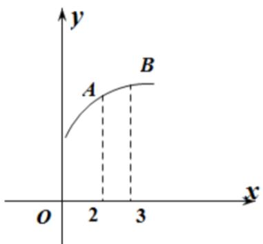

text_image

y
A
B
O
2
3
x

A. $0 < f'(2) < f'(3) < f(3) - f(2)$   
B. $0 < f'(3) < f(3) - f(2) < f'(2)$   
C. $0 < f(3) - f(2) < f'(3) < f'(2)$   
D. $0 < f(3) - f(2) < f'(2) < f(3)$

2.【单选题】一个小球作简谐振动，其运动方程为 $x(t)=10\sin\left(\pi t-\frac{\pi}{3}\right)$ ，其中 $x(t)$ （单位：cm）是小球相对于平衡点的位移，t（单位：s

)为运动时间，则小球的瞬时速度首次达到最大时， $t = (\quad)$

A. 1   
B. $\frac{5}{6}$   
C. $\frac{1}{2}$   
D. $\frac{l}{3}$

3.【单选题】为评估某种治疗肺炎药物的疗效,有关部门对该药物在人体血管中的药物浓度进行测量。设该药物在人体血管中药物浓度 ${}$ $\}$ 与时间t的关系为 $c = f(t)$

甲、乙两人服用该药物后，血管中药物浓度随时间t变化的关系如下图所示.

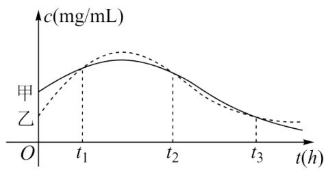

line

| t(h) | c(mg/mL) - 甲 | c(mg/mL) - 乙 |
|------|--------------|--------------|
| t₁   | ~0.8         | ~0.6         |
| t₂   | ~0.9         | ~0.7         |
| t₃   | ~0.3         | ~0.2         |

给出下列四个结论:

① 在 $t_{1}$ 时刻，甲、乙两人血管中的药物浓度相同；  
② 在 $t_{2}$ 时刻，甲、乙血管中药物浓度的瞬时变化率相同；  
③ 在 $[t_{2}, t_{3}]$ 这个时间段内，甲、乙两人血管中药物浓度的平均变化率相同；  
④ 在 $[t_{1}, t_{2}]$ ， $[t_{2}, t_{3}]$ 两个时间段内，甲血管中药物浓度的平均变化率相同.

其中所有正确结论的序号是（）

A. ①②   
B.①③④   
C. ②③   
D. ①③

4.【单选题】某物体做直线运动，其运动规律是 $s(t)=t^{2}+\frac{3}{t}$ （时间t的单位：s，位移s的单位：m），则它在4s末的瞬时速度为（）.

A. $\frac{123}{6}$ m/s   
B. $\frac{125}{16}$ m/s   
C. 8m/s   
D. $\frac{67}{4}$ m/s

5.【单选题】若函数 $f(x) = \sqrt{x}$ 在 $x = x_0$ 处的瞬时变化率是 $\frac{\sqrt{3}}{3}$ ，则 $x_0$ 的值是（）

A. $\frac{3}{4}$   
B. $\frac{1}{2}$   
C. 1

D. 3

# 二、复合题（共1题）

6.【复合题】已知自由落体的物体的运动方程为 $s=\frac{1}{2}gt^{2}$ ，求：

(1)【问答题】物体在 $t_{0}$ 到 $t_{0}+\Delta t$ 这段时间内的平均速度；  
(2)【问答题】物体在 $t_{0}$ 时刻的瞬时速度.

# 高中 数学 选择性必修 第二册

# 第五章 一元函数的导数及其应用 5.1

# 导数的概念及其意义

# 5.1.2导数的概念及其几何意义

# 一、单选题（共2题）

1.【单选题】已知 $f(x)=\cos2x$ ，则 $ln_{\Delta x\to0}\frac{f(x+\Delta x)-f(x)}{\Delta x}=$ （）

A. sin2x

B. $-sin2x$

C. $2\sin2x$

D. $-2\sin2x$

2.【单选题】已知 $f(x)=x^{2}+3xf'(1)$ ，则 $f'(2)=(\quad)$

A. 1

B. 2

C. 4

D. 8

# 二、多选题（共1题）

3.【多选题】下列说法中正确的有（）

A. $\left(\sin \frac{\pi}{4}\right) = \cos \frac{\pi}{4}.$

B. 已知函数 $f(x)$ 在R上可导，且 $f'(1) = 1$ ，则 $\ln_{\Delta x \to 0} \frac{f(1 + 2\Delta x) - f(1)}{\Delta x} = 2$ .

C. 一质点的运动方程为 $S = t^2$ ，则该质点在 $t = 2$ 时的瞬时速度是4.

D. 已知函数 $f(x) = \cos x$ ，则函数 $y = f'(x)$ 的图象关于原点对称.

# 三、填空题（共3题）

4.【填空题】某生物种群的数量Q与时间t的关系近似地符合 $Q(t)=\frac{10e^{t}}{e^{t}+9}$ .

给出下列四个结论:

①该生物种群的数量不会超过10;

②该生物种群数量的增长速度先逐渐变大后逐渐变小；  
③该生物种群数量的增长速度与种群数量成正比；  
④该生物种群数量的增长速度最大的时间 $t_{0}\in(2,3)$ .  
根据上述关系式，其中所有正确结论的序号是\_\_\_\_。

5.【填空题】已知函数 $f(x)=-a\sin x$ ，且 $ln_{\Delta x\to0}\frac{f(\pi+\Delta x)-f(\pi)}{\Delta x}=2$ ，则实数a的值为\_\_\_\_.

6.【填空题】已知函数 $f(x)$ 的导函数为 $f'(x)$ ，若 $ln_{\Delta x \to 0} \frac{f(4) - f(4 + 2\Delta x)}{\Delta x} = 6$ ，则 $f'(4) =$ \_\_\_\_.

# 四、复合题（共1题）

7.【复合题】已知函数 $f(x)=x^{2}-\frac{1}{2}x$ .

(1)【问答题】求 $f'(x)$ ;   
(2)【问答题】求 $f(x)$ 在x=1处的导数.

# 五、问答题（共1题）

8.【问答题】求函数 $y=(2x-1)^{2}$ 在x=3处的导数.

# 高中 数学 选择性必修 第二册

# 第五章 一元函数的导数及其应用 5.1

# 导数的概念及其意义

# 5.1.2导数的概念及其几何意义

# 一、单选题（共3题）

1.【单选题】已知直线 $y = kx$ 是曲线 $y = \ln x$ 的切线，则切点坐标为（）

A. $\left(\frac{l}{e}, -1\right)$   
B. $(e, 1)$   
C. $(\sqrt{e}, \frac{1}{2})$   
D. $(0, 1)$

2.【单选题】若点P是曲线 $y=x^{2}-\ln x$ 上任意一点，则点P到直线y=x-2距离的最小值为（）

A. 1   
B. $\sqrt{2}$   
C. $\frac{\sqrt{2}}{2}$   
D. 3

3.【单选题】已知函数 $f(x)=x^{2}+a\ln x$ 的图象在 $(1,f(1))$ 处的切线经过坐标原点，则实数a的值为（）

A. 1   
B.-1   
C. 2   
D. $\frac{1}{2}$

# 二、多选题（共1题）

4.【多选题】若直线 $y=3x+m$ 是曲线 $y=x^{3}(x>0)$ 与曲线 $y=-x^{2}+nx-6(x>0)$ 的公切线，则（）

A. $m = -2$

B. m = -1   
C. $n = 6$   
D. n = 7

# 三、填空题（共2题）

5.【填空题】已知直线l为函数 $f(x)=x^{3}+x-16$ 的切线，且经过原点，则直线l的方程为\_\_\_\_.  
6.【填空题】直线 $y=kx+1$ 与曲线 $f(x)=a\ln x+b$ 相切于点 $P(1,2)$ ，则 $2a+b=$ \_\_\_\_.

# 四、复合题（共2题）

7.【复合题】已知函数 $f(x)=a_{x}^{3}-ax+b$ ， $f(1)=2$ ， $f'(1)=2$ .

(1)【问答题】求 $f(x)$ 的解析式;  
(2)【问答题】求 $f(x)$ 在 $(-1, f(-1))$ 处的切线方程.

8.【复合题】已知函数 $f(x)=x^{3}+a_{x}^{2}+bx+c$ 在点 $P(1,2)$ 处的切线斜率为4，且在x=-1处取得极值.

(1)【问答题】求函数 $f(x)$ 的解析式;  
(2)【问答题】当 $x\in[-2,2]$ 时，求函数 $f(x)$ 的最值.

# 高中 数学 选择性必修 第二册

# 第五章 一元函数的导数及其应用 5.2 导数的运算

# 5.2.1 基本初等函数的导数

# 一、单选题（共2题）

1.【单选题】下列求导过程正确的是（）

A. $(\cos\frac{\pi}{3})'=-\sin\frac{\pi}{3}$   
B. $(2^{x})' = x \cdot 2^{x-1}$   
C. $(\sin x)' = -\cos x$   
D. $(\sqrt{x})' = \frac{1}{2\sqrt{x}}$

2.【单选题】下列求导过程正确的是（）

A. $\left(\frac{1}{x}\right)^{\prime}=\frac{1}{x^{2}}$   
B. $(\cos x)' = \sin x$   
C. $(2^{x})^{\prime} = 2^{x}\ln 2$   
D. $(\log_2x)' = \frac{1}{x}\ln 2$

# 二、多选题（共2题）

3.【多选题】下列求导过程错误的是（）

A. $(x^{-2})' = -2x^{-1}$   
B. $(\sin x)' = \cos x$   
C. $(3^{x})' = x \cdot 3^{x-1}$   
D. $(x)'=\frac{1}{x}$

4.【多选题】下列求导过程错误的是（）

A. $(\ln 2)' = \frac{1}{2}$   
B. $\left(\frac{1}{x^{2}}\right)^{\prime}=\frac{2}{x^{3}}$   
C. $(\cos x)' = -\sin x$   
D. $(3^{x})^{\prime} = 3^{x}\log_{3}e$

# 三、填空题（共2题）

5.【填空题】给出的下列四个导数式：

$$
① (\sqrt {x}) ^ {\prime} = \frac {1}{2} \sqrt {x}; ② (\cos 2) ^ {\prime} = - \sin 2; ③ (3 ^ {x}) ^ {\prime} = 3 ^ {x} \log_ {3} e; ④ (x) (^ {\prime} = \frac {1}{x \ln 1 0};
$$

其中正确的个数为\_\_\_\_个

6.【填空题】给出的下列五个导数式:

$$
① (x ^ {\frac {l}{3}}) ^ {\prime} = \frac {l}{3} x ^ {\frac {2}{3}}; ② (\sin l) ^ {\prime} = \cos l; ③ [ ] \frac {l}{3} x ^ {\prime} = (\frac {l}{3}) ^ {x} \ln 3; ④ (\log_ {\frac {l}{2}} x) ^ {\prime} = \frac {l}{x \ln 2}; ⑤ (e ^ {x}) ^ {\prime} = e ^ {x}
$$

其中正确的序号为\_\_\_\_

# 高中 数学 选择性必修 第二册

# 第五章 一元函数的导数及其应用 5.2 导数的运算

# 5.2.1 基本初等函数的导数

# 一、单选题（共2题）

1.【单选题】下列结论正确的个数为（）

①若 $y=\ln2$ ，则 $y'=\frac{1}{2}$ ;  
②若 $f(x)=\frac{1}{x^{2}}$ ，则 $f'(3)=-\frac{2}{27}$ ;  
③若 $y=2^{x}$ ，则 $y'=x\cdot2^{x-1}$ ;  
④若 $y=\log_{2}x$ ，则 $y'=\frac{1}{x\ln2}$ ;

A. 1

B. 2

C. 3

D. 4

2.【单选题】已知函数 $f(x)=3^{x}$ ，则 $\lim_{\Delta x\to0}\frac{f(1+\Delta x)-f(1)}{\Delta x}=$ （）

A. $\frac{3}{\ln3}$   
B. $-\frac{3}{\ln3}$   
C. $3\ln3$   
D. $-3\ln3$

# 二、多选题（共2题）

3.【多选题】已知函数 $f(x)$ 的导函数为 $f'(x)$ ，若存在 $x_0$ ，使得 $f(x_0) = f'(x_0)$ ，则称 $x_0$ 是 $f(x)$ 的一个“巧值点”，则下列函数中有“巧值点”的是（）

A. $f(x) = \frac{l}{x}$   
B. $f(x) = x^{2}$   
C. $f(x) = e^{-x}$   
D. $f(x) = \ln x$

4.【多选题】下列结论中正确的是（）

A. 若 $f(x) = x^4$ ，则 $f'(2) = 32$   
B. 若 $f(x) = \frac{1}{\sqrt{x}}$ ，则 $f'(2) = -\frac{\sqrt{2}}{2}$   
C. 若 $f(x)=\frac{1}{x^{2}\cdot\sqrt{x}}$ ，则 $f'(1)=-\frac{5}{2}$   
D. 若 $f(x)=x^{-5}$ ，则 $f'(-1)=-5$

# 三、填空题（共2题）

5.【填空题】直线 $y = \frac{l}{2} x + b$ 能作为下列函数 $y = f(x)$

的切线的有\_\_\_\_（写出所有正确的函数的序号）

① $f(x)=\frac{l}{x}$

② $f(x)=\ln x$

③ $f(x)=\sin x$

③ $f(x) = -e^{x}$

6.【填空题】设 $f'(x)$ 是函数 $f(x)$ 的导数，若 $f(x)=\sin x$ ，记 $f_{1}(x)=f'(x)$ ， $f_{2}(x)=f_{1}'(x)$ ， $f_{3}(x)=f_{2}'(x)$ ，…， $f_{n+1}(x)=f_{n}'(x)(n\in N^{*})$ ，则 $f_{2022}(x)=$ \_\_\_\_

# 高中 数学 选择性必修 第二册

# 第五章 一元函数的导数及其应用 5.2 导数的运算

# 5.2.2导数的四则运算法则

# 一、单选题（共2题）

1.【单选题】已知函数 $f(x)=\frac{lnx}{x}$ ，则 $f'(x)=$ （）

A. $\frac{1-lnx}{x^{2}}$   
B. $\frac{l+lnx}{x^{2}}$   
C. $\frac{lnx+1}{x}$   
D. $\frac{lnx-1}{x}$

2.【单选题】函数 $y = x^{2} \cos x$ 的导数为（）

A. $y' = 2x\cos x - x^{2}\sin x$   
B. $y' = -2x \sin x$   
C. $y' = 2x\cos x + x^2\sin x$   
D. $y' = x \cos x - x^{2} \sin x$

# 二、多选题（共2题）

3.【多选题】下列求导过程正确的是（）

A. $(x^{2} + 2^{x})^{\prime} = 2x + 2^{x}\ln 2$   
B. $(x^{2}e^{x})^{\prime} = (2x + x^{2})e^{x}$   
C. $\left(\frac{x^{2}}{lnx}\right)^{\prime}=\frac{x-2lnx}{ln^{2}x}$   
D. $\left(x^{3}-\frac{1}{x}\right)^{\prime}=3x^{2}+\frac{1}{x^{2}}$

4.【多选题】下列函数求导正确的是（）

A. $(x\cos x)' = \cos x - x\sin x$   
B. $(x\ln x)' = \ln x + 1$   
C. $(e^{x}\sin x)^{\prime} = e^{x}(\sin x + \cos x)$

D. $\left(\frac{cosx}{e^x}\right)'$ = $\frac{sinx - cosx}{e^x}$

# 三、填空题（共2题）

5.【填空题】若曲线 $f(x)=\frac{(x-3)(x-2)(x-1)x(x+1)(x+2)}{x^{2}+lnx-3}+9\ln x$ 在点(1,0)处的切线与直线 $2x-ay+2=0$ 平行，则a= \_\_\_\_.  
6.【填空题】若函数 $y = \tan x$ ，则 $y' =$ \_\_\_\_.

# 四、问答题（共2题）

7.【问答题】已知函数 $f(x)=x(x+1)(x+2)(x+3)(x+4)(x+5)$ ，求 $f'(0)$ .  
8.【问答题】若直线y=kx与曲线 $y=x^{3}-3x^{2}+2x$ 相切，求k的值.

# 高中 数学 选择性必修 第二册

# 第五章 一元函数的导数及其应用 5.2 导数的运算

# 5.2.3简单复合函数的导数

# 一、单选题（共2题）

1.【单选题】函数 $y = x^{2}\cos 2x$ 的导数为（）

A. $y^\prime = 2x\cos 2x - x^2\sin 2x$

B. $y' = x^{2}\cos2x - 2x\sin2x$

C. $y' = 2x \cos 2x - 2x^{2} \sin 2x$

D. $y' = 2x\cos2x + 2x^{2}\sin2x$

2.【单选题】函数 $y = \sin^{3}\frac{1}{x}$ 的导数是（）

A. $y' = -\frac{3}{x^{2}} \sin^{2} \frac{l}{x}$

B. $y^\prime = -\frac{3}{2x^2}\sin^2\frac{2}{x}$

C. $y^\prime = -\frac{3}{x^2}\cos \frac{1}{x}\sin^2\frac{1}{x}$

D. $y' = -\frac{3}{2x^{2}}\sin\frac{1}{x}\sin\frac{2}{x}$

# 二、多选题（共2题）

3.【多选题】下列求函数的导数正确的是（）

A. $[ln(2x + 1)]' = \frac{2}{2x + 1}$

B. $(e^{5x - 4})' = e^{5x - 4}$

C. $(\sqrt{2x - 1})' = \frac{1}{\sqrt{2x - 1}}$

D. $\left[cos\left(2x + \frac{\pi}{3}\right)\right] = 2sin\left(2x + \frac{\pi}{3}\right)$

4.【多选题】下列求导正确的是（）

A. 若 $y = \cos \frac{1}{x}$ ，则 $y' = -\frac{1}{x^2}\sin \frac{1}{x}$

B. 若 $y = \sin x^2$ ，则 $y' = 2x\cos x^2$

C. 若 $y = \cos 5x$ ，则 $y' = -5\sin 5x$

D. 若 $y = \frac{1}{2} x \sin 2x$ ，则 $y' = x \sin 2x$

# 三、填空题（共2题）

5.【填空题】函数 $y=\frac{\sqrt{1+x^{2}}}{2x-1}$ 的导函数为 $y'=\underline{\hspace{2cm}}$   
6.【填空题】设函数 $y=f(2^{-x})$ 可导，则 $y'=\underline{\hspace{2cm}}$

# 四、复合题（共1题）

7.【复合题】求下列函数的导数

(1)【问答题】 $y=\sin^{2}\left(2x+\frac{\pi}{3}\right)$   
(2)【问答题】 $y = \cos^{2} 2x$   
(3)【问答题】 $y=\frac{1}{\sqrt{1-2x^{2}}}$

# 五、问答题（共1题）

8.【问答题】已知 $f(x)=(x+\sqrt{1+x^{2}})^{10}$ ，求 $\frac{f'(0)}{f(0)}$

# 高中 数学 选择性必修 第二册

# 第五章 一元函数的导数及其应用 5.3

# 导数在研究函数中的应用

# 5.3.1 函数的单调性

# 一、单选题（共4题）

1.【单选题】若函数 $f(x) = ax + \cos x$ 在 $(- \infty, + \infty)$ 上单调递增，则实数 $a$ 的取值范围是（）

A. $(-1, 1)$

B. $[1, +\infty)$

C. $(-1, +\infty)$

D. $(-1, 0)$

2.【单选题】声音是由物体振动产生的．我们平时听到的声音几乎都是复合音．复合音的产生是由于发音体不仅全段在振动，它的各部分如二分之一、三分之一、四分之一等也同时在振动．不同的振动的混合作用决定了声音的音色，人们以此分辨不同的声音．已知刻画某声音的函数为 $y=\sin x+\frac{1}{2}\sin 2x+\frac{1}{3}\sin 3x$ ，则其部分图象大致为（）

text_image

y
国家156****53
O
x

A.

B.   
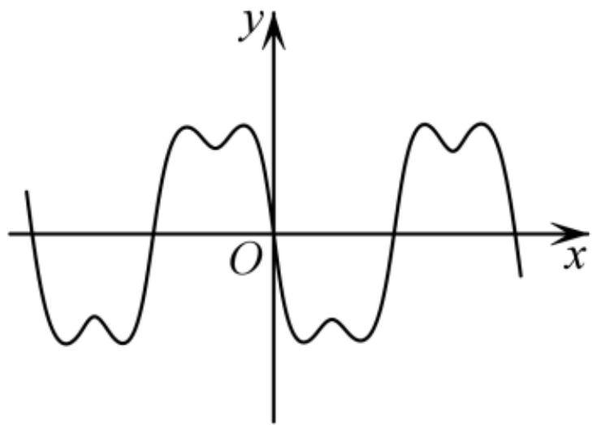

text_image

y
O
x

text_image

y
O
x
343数

C.

text_image

国家
O
x
y

D.

3.【单选题】已知函数 $y = xf'(x)$ 的图象如下图所示，其中 $f'(x)$ 是函数 $f(x)$ 的导函数，函数 $y = f(x)$ 的图象大致是图中的（）

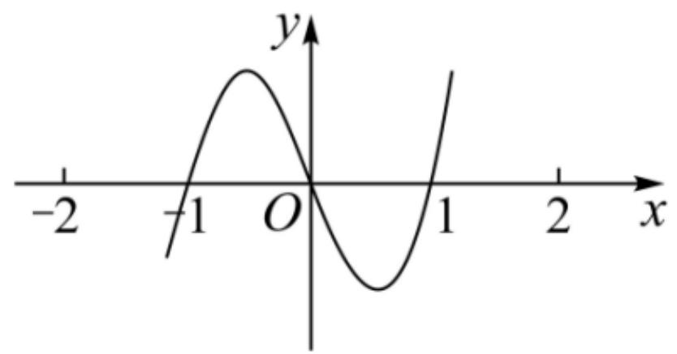

line

| x   | y    |
| --- | ---- |
| -2  | -1.5 |
| -1  | 0.8  |
| 0   | 0    |
| 1   | -1.5 |

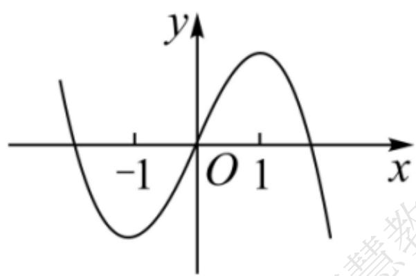

text_image

y
-1 O 1 x

A.

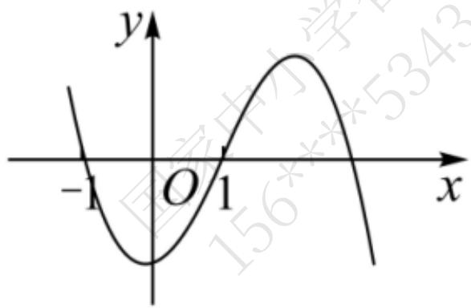

text_image

y
-1 O 1 x
156**5343

B.

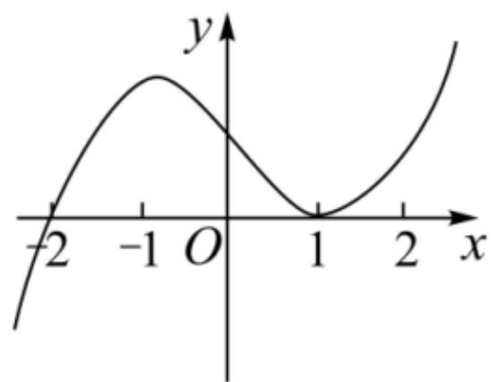

line

| x   | y   |
| --- | --- |
| -2  | -2  |
| -1  | 1   |
| 1   | 0   |
| 2   | 2   |

C.

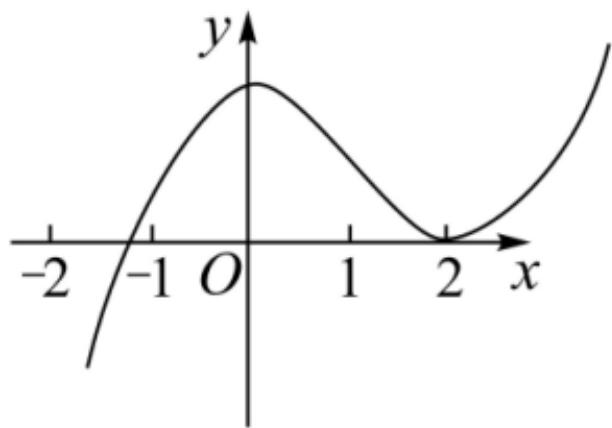

line

| x   | y   |
| --- | --- |
| -2  | -∞  |
| -1  | 0   |
| 0   | 1   |
| 1   | 0   |
| 2   | 0   |

D.

4.【单选题】“ $a \leq -\frac{l}{2}$ ”是“函数 $f(x) = x(e^{x} - a)$ 为增函数”的（）

A. 充分不必要条件  
B. 必要不充分条件  
C. 充要条件  
D. 既不充分也不必要条件

# 二、多选题（共1题）

5.【多选题】已知函数 $f(x) = x(\ln x)^2 + x$ ，则（）

A. $f(x)$ 在区间 $(0, +\infty)$ 上单调递增  
B. 当 $x = \frac{l}{e}$ 时， $f(x)$ 取最小值  
C. 对 $\forall x\in\left(\frac{l}{e},+\infty\right)$ ，m>0， $g(x)=f(x+m)-f(x)$ 为增函数  
D. 对 $\forall x \in (1, +\infty)$ 都有 $f(x) \leq x^3$

# 三、填空题（共1题）

6.【填空题】若函数 $f(x)=(x^{2}+ax+5)e^{x}$ 在 $\left[\frac{1}{2},\frac{3}{2}\right]$ 上单调递增，则实数 a 的取值范围是 \_\_\_\_

# 四、复合题（共1题）

7.【复合题】已知函数 $f(x) = a\ln x + x^2 - 3$ .

(1)【问答题】若 $f(x)$ 在 $(1, +\infty)$ 上不单调，求 a 的取值范围；  
(2)【问答题】若 $f(x)$ 的最小值为 -2 ，求 a.

# 高中 数学 选择性必修 第二册

# 第五章 一元函数的导数及其应用 5.3

# 导数在研究函数中的应用

# 5.3.1 函数的单调性

# 一、单选题（共3题）

1.【单选题】已知定义在 $R$ 上的偶函数 $f(x)$ 满足 $f(-x) + f(x - 2) = 0$ ，当 $-1 \leq x \leq 0$ 时， $f(x) = (1 + x)\mathrm{e}^x$ ，则（）

A. $f\left(\tan \frac{3l\pi}{24}\right) < f(2022) < f\left(\ln \frac{l}{2}\right)$   
B. $f(2022) < f\left(\tan \frac{3l\pi}{24}\right) < f\left(\ln \frac{l}{2}\right)$   
C. $f\left(\ln \frac{1}{2}\right) < f(2022) < f\left(\tan \frac{31\pi}{24}\right)$   
D. $f(2022) < f\left(\ln \frac{1}{2}\right) < f\left(\tan \frac{3l\pi}{24}\right)$

2.【单选题】已知定义在 R 上的函数 $f(x)$ ，其导函数为 $f'(x)$ . 若 $f(x) = -f(-x) - \cos x$ ，且当 $x \leqslant 0$ 时， $f'(x) - \frac{1}{2} \sin x > 0$ ，则不等式 $f(\pi - x) > f(x) + \cos x$ 的解集为（）

A. $\left(-\infty,\frac{\pi}{2}\right)$   
B. $\left(\frac{\pi}{2},+\infty\right)$   
C. $(-∞,π)$   
D. $(\pi, +\infty)$

3.【单选题】奇函数 $f(x)$ 定义域为 $(-\pi,0)\cup(0,\pi)$ ，其导函数是 $f'(x)$ ，当 $0<x<\pi$ 时，有 $f'(x)\sin x-f(x)\cos x<0$ ，则关于 $x$ 的不等式 $f(x)<\sqrt{2}f\left(\frac{\pi}{4}\right)\sin x$ 的解集为（）

A. $\left(\frac{\pi}{4},\pi\right)$   
B. $\left(-\pi,-\frac{\pi}{4}\right)\cup\left(\frac{\pi}{4},\pi\right)$   
C. $\left(-\frac{\pi}{4},0\right)\cup\left(0,\frac{\pi}{4}\right)$   
D. $\left(-\frac{\pi}{4},0\right)\cup\left(\frac{\pi}{4},\pi\right)$

# 二、多选题（共1题）

4.【多选题】已知函数 $f(x) = \ln (\sqrt{4x^2 + 1} + 2x) + x^3$ ， $g(x) = f(x + 1)$ 。若实数 $a, b (a, b$ 均大于1）满足 $g(3b - 2a) + g(-2 - a) > 0$ ，则下列说法正确的是（）

A. 函数 $f(x)$ 为奇函数  
B. 函数 $g(x)$ 在 $\mathbb{R}$ 上单调递增  
C. 函数 $g(x)$ 的图象关于 $(1,0)$ 中心对称

D. $e^{a-b} > \frac{b}{a}$

# 三、填空题（共1题）

5.【填空题】给出下列命题：① $3\ln2 < 4\sqrt{2}$ ; ② $2^{\sqrt{15}} < 15$ ; ③ $\ln\pi < \sqrt{\frac{\pi}{e}}$ ; ④ $\ln3 < \sqrt{3}\ln2$ ，其中真命题的序号是\_\_\_\_.

# 四、复合题（共3题）

6.【复合题】已知函数 $h(x)=xe^{x}-mx,\quad g(x)=\ln x+x+1$ .

(1)【问答题】当m=1 时，求函数 $h(x)$ 的单调区间；  
(2)【问答题】若 $h_{(x)} \geqslant g_{(x)}$ 在 $x \in (0, +\infty)$ 恒成立，求实数 m 的取值范围.

7.【复合题】已知函数 $f(x)=x\sin x+\cos x+\frac{1}{2}a x^{2},x\in[0,\pi].$

(1)【问答题】当 a=0 时，求 $f(x)$ 的单调区间；  
(2)【问答题】当 a > 0 时，讨论 $f(x)$ 的零点个数.

8.【复合题】设 ${} f\left(x\right)={e}^{x}\mathit{sin}x{}$ .

(1)【问答题】求 $f(x)$ 在 $[-π, π]$ 上的极值；  
(2)【问答题】若对 $\forall x_{1}, x_{2} \in [0, \pi]$ ， $x_{1} \neq x_{2}$ ，都有 $\frac{f(x_{1}) - f(x_{2})}{x_{1}^{2} - x_{2}^{2}} + a > 0$ 成立，求实数 a 的取值范围.

# 高中 数学 选择性必修 第二册

# 第五章 一元函数的导数及其应用 5.3

# 导数在研究函数中的应用

# 5.3.2函数的极值与最大（小）值

# 一、单选题（共2题）

1.【单选题】如图，可导函数 $f(x)$ 在点 $P_{(x_0, f(x_0))}$ 处的切线方程为 $y = g(x)$ ，设 $h(x) = g(x) - f(x)$ ， $h'(x)$ 为 $h(x)$ 的导函数，则下列结论中正确的是（）

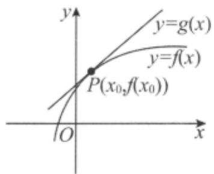

text_image

y
y=g(x)
y=f(x)
P(x₀,f(x₀))
O
x

A. $h^{\prime}(x_0) = 0$ ， $x_0$ 是 $h(x)$ 的极大值点  
B. $h'(x_{0}) = 0$ , $x_{0}$ 是 $h(x)$ 的极小值点  
C. $h'(x_{0}) \neq 0$ , $x_{0}$ 不是 $h(x)$ 的极大值点  
D. $h'(x_0) \neq 0, x_0$ 是 $h(x)$ 的极值点

2.【单选题】已知函数 $f(x) = x(x - m)^2$ 在 $x = -1$ 处有极小值，则实数 $m$ 的值为（）

A. 3   
B. 1   
C.-1   
D.-3

# 二、多选题（共3题）

3.【多选题】函数 $f(x)$ 满足a>0，b>0，函数 $g(x)=\frac{f(x)}{e^{x}}$

的一个零点也是其本身的极值点，则 $f(x)$ 可能的表达式有（）

A. $a_{x}^{3} + bx + 1$   
B. ax - blnx   
C. $asinx + bcosx + 1$   
D. $a_{x}^{2} + bx + 1$

4.【多选题】如图是导函数 $y = f'(x)$ 的图象，则下列说法正确的是（）

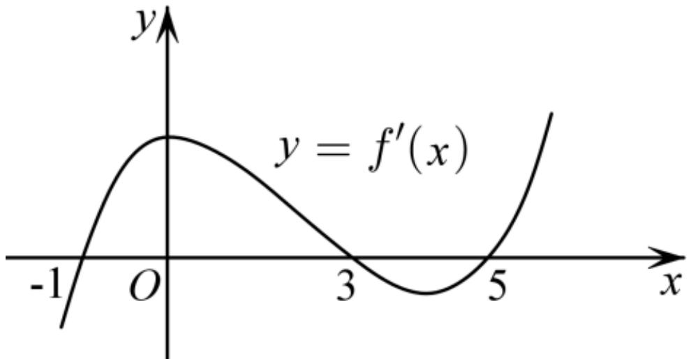

text_image

y
y = f'(x)
-1 O 3 5 x

A. $(-1, 3)$ 为函数 $y = f(x)$ 的单调递增区间  
B. $(0, 5)$ 为函数 $y = f(x)$ 的单调递减区间  
C. 函数 $y = f(x)$ 在 x = 0 处取得极大值  
D. 函数 $y = f(x)$ 在 x = 5 处取得极小值

5.【多选题】已知函数 $f(x)=x^{3}+ax^{2}+bx+c$ ，下列结论中正确的有（）

A. $\exists x_0\in \mathsf{R}$ ， $f(x_0) = 0$   
B. 函数 $y = f(x)$ 的图象是中心对称图形  
C. 若 $x_{0}$ 是 $f(x)$ 的极小值点，则 $f(x)$ 在区间 $(-∞, x_{0})$ 单调递减  
D. 若 $x_0$ 是 $f(x)$ 的极值点，则 $f'(x_0) = 0$

# 三、填空题（共3题）

6.【填空题】若函数 $f(x)=a\ln(x+1)+x^{2}$ 有两个极值点，则实数a的取值范围是\_\_\_\_.  
7. 【填空题】设 $x = 1$ 是函数 $f(x) = x^3 + a_x^2 + bx + c (x \in \mathbb{R})$ 的一个极值点，则 $a$ 与 $b$ 的关系为 \_\_\_\_.  
8.【填空题】在区间 $(\frac{\pi}{2},\pi)$ 上，函数 $f(x) = 4\cos^2\frac{x}{2} + m_x^2 -2$ 存在极值，则实数 $m$ 的取值范围为 \_\_\_\_.

# 四、复合题（共2题）

9.【复合题】已知函数 $f(x)=2\sin x-a\ln x(a>0)$ .

(1)【问答题】当 a=1 时，求曲线 $y=f(x)$ 在点 $\left(\frac{\pi}{2},2-\ln\frac{\pi}{2}\right)$ 处的切线方程；  
(2)【问答题】讨论 $f(x)$ 在区间 $[\pi,2\pi)$ 上极值点个数.

10.【复合题】已知函数 $f(x) = \frac{1}{2} a x^2 + x - e^x$ .

(1)【问答题】若 a = 1，求不等式 $f(\ln x) > -1$ 的解集；  
(2)【问答题】当 a > 1 时，求证：函数 $f(x)$ 在 $(0, +\infty)$ 上存在极值点 m，且 $f(m) > \frac{m - 3}{2}$ .

# 高中 数学 选择性必修 第二册

# 第五章 一元函数的导数及其应用 5.3

# 导数在研究函数中的应用

# 5.3.2函数的极值与最大（小）值

# 一、单选题（共2题）

1.【单选题】已知函数 $f(x)=\frac{x}{\ln x}$ ，下列说法错误的是（）

A. $f(x)$ 在 $x = e$ 处的切线方程为 $y = e$   
B. 函数 $f(x)$ 的单调递减区间为 $(0, e)$   
C. $f(x)$ 的极小值为 $e$   
D. 方程 $f(x)=3$ 有2个不同的解

2.【单选题】已知函数 $y = (x + a)e^x$ 的最小值为 -1，则实数 $a =$ （）

A.-1   
B. 0   
C. 1   
D. 2

# 二、多选题（共1题）

3.【多选题】设 $a \in \mathsf{R}$ ，函数 $f(x) = (x - a)\ln x$ ，则下列说法正确的是（）

A. 当 0 < a < 1 时，函数 $f(x)$ 没有极大值，有极小值  
B. 当 $a > 1$ 时，函数 $f(x)$ 既有极大值也有极小值  
C. 当 $a = 1$ 时，函数 $f(x)$ 有极大值，没有极小值  
D. 当 $a \leq -e^{-2}$ 时，函数 $f(x)$ 没有极值

# 三、填空题（共1题）

4.【填空题】已知函数 $f(x)=\left\{\begin{aligned}&\frac{l}{e}(x+2),&x<1\\&lnx,&x>1\end{aligned}\right.$ ，若 $f(x_{1})=f(x_{2})$ 且 $x_{2}>x_{1}$ ，则 $x_{2}-x_{1}$ 的最小值为\_\_\_\_.

# 四、复合题（共4题）

5.【复合题】已知函数 $f(x) = x^{2}(x - 2)$ .

(1)【问答题】求 $f(x)$ 的单调区间；  
(2)【问答题】求 $f(x)$ 在区间 $[-1,3]$ 上的最大值和最小值.

6.【复合题】已知函数 $f(x) = e^{x}(x - 3) - \ln x - \frac{2}{x}$ .

(1)【问答题】求曲线 $y = f(x)$ 在点 $(1, f(1))$ 处的切线方程；  
(2)【问答题】证明: $f(x)$ 存在唯一极大值点 $x_0$ ，且 $-2e - 2 < f(x_0) < -\frac{7}{2}$ .

7.【复合题】已知函数 $f(x) = e^{x} - \text{asin} x (a > 0)$ ，曲线 $y = f(x)$ 在 $(0, f(0))$ 处的切线也与曲线 $y = 2x - x^2$ 相切.

(1)【问答题】求实数a的值;   
(2)【问答题】求 $f(x)$ 在 $\left(-\frac{\pi}{2},+\infty\right)$ 内的极小值.

8.【复合题】已知函数 $f(x) = x^3 - 3ax + 4 (a > 0)$ ，定义域为 $[-2, +\infty)$

(1)【问答题】若 a = 1，求函数的极值；  
(2)【问答题】若函数 $f(x)$ 在区间 $[-2,1]$ 上的最大值为20，求实数a的值.

# 高中 数学 选择性必修 第二册

# 第五章 一元函数的导数及其应用 小结

# 一、单选题（共2题）

1.【单选题】已知函数 $f(x) = \frac{me^x}{2}$ 与函数 $g(x) = -2x^2 - x + 1$ 的图象有两个不同的交点，则实数 $m$ 取值范围为( )

A. $[0, 1)$   
B. $[0, 2) \cup \left\{-\frac{18}{e^2}\right\}$   
C. $(0, 2) \cup \left\{-\frac{18}{e^2}\right\}$   
D. $[0, 2\sqrt{e}) \cup \left\{-\frac{18}{e^2}\right\}$

2.【单选题】若函数 $f(x)$ 的图象上存在两个点 A, B 关于原点对称，则点对 $[A,B]$ 称为 $y=f(x)$ 的“友情点对”，点对 $[A,B]$ 与 $[B,A]$ 看作同一个“友情点对”，若函数 $f(x)=\left\{\begin{aligned}&a,x\leq0\\ &-\frac{1}{3}x^{3}-3x^{2}+5x-2,x>0\end{aligned}\right.$ ，恰好有两个“友情点对”，则实数 a 的取值范围为（）

A. $[2, \frac{3l}{3}) \cup \left\{-\frac{l}{3}\right\}$   
B. $\left(-\frac{31}{3}, -2\right] \cup \left\{\frac{1}{3}\right\}$   
C. $[2, \frac{31}{3})$   
D. $\left(-\frac{31}{3},-2\right]$

# 二、填空题（共4题）

3.【填空题】已知函数 $f(x)=\ln(x+m)-e^{x}$ ，满足 $f(x)<0$ 恒成立的最大整数m为\_\_\_\_。  
4.【填空题】已知函数 $f(x)=(3x+1)e^{x+1}+mx$ ，若有且仅有两个整数使得 $f(x)\leqslant0$ ，则实数 m 的取值范围是\_\_\_\_。  
5.【填空题】已知 $f(x)=e^{x}-1$ （e为自然对数的底数）， $g(x)=\ln x+1$ ，则 $f(x)$ 与 $g(x)$ 的公切线条数为 \_\_\_\_.

6.【填空题】已知函数 $f(x)=x^{3}-6x^{2}+9x-2$ ，过点 $P(0,2)$ 作曲线 $y=f(x)$ 的切线，则可作切线的最多条数是\_\_\_\_。

# 三、复合题（共1题）

7.【复合题】已知函数 $f(x) = \sin x + \tan x - 2x$ .

(1)【问答题】证明：函数 $f(x)$ 在 $(- \frac{\pi}{2}, \frac{\pi}{2})$ 上单调递增；  
(2)【问答题】若 $x \in (0, \frac{\pi}{2})$ ， $f(x) > m_{x}^{2}$ ，求 m 的取值范围.

# 四、问答题（共7题）

8.【问答题】已知函数 $g(x)=\lambda x+\sin x$ 是区间 $[-1,1]$ 上的减函数.

（Ⅰ）若 $g(x) \leqslant t^{2} + \lambda t + 1$ 在 $x \in [-1, 1]$ 及 $\lambda$ 所在的取值范围上恒成立，求 t 的取值范围；  
（II）试讨论函数 $h(x)=\frac{\ln x}{f(x)}-x^{2}+2ex-m$ 的零点的个数.

9.【问答题】已知函数 $f(x)=2x+a_{x}^{2}+b\cos x$ 在点 $\left(\frac{\pi}{2},f\left(\frac{\pi}{2}\right)\right)$ 处的切线方程为 $y=\frac{3\pi}{4}$ .

（Ⅰ）求 a，b 的值，并讨论 $f(x)$ 在 $[0, \frac{\pi}{2}]$ 上的增减性；

（Ⅱ）若 $f(x_{1}) = f(x_{2})$ ，且 $0 < x_{1} < x_{2} < \pi$ ，求证： $f'(\frac{x_1 + x_2}{2}) < 0$ 。

(参考公式: $\cos\theta - \cos\varphi = -2\sin\frac{\theta + \varphi}{2}\sin\frac{\theta - \varphi}{2}$ )

10.【问答题】已知函数 $f(x)=\sin x-\ln(1+x)$ ， $f'(x)$ 为 $f(x)$ 的导数.

证明： $f(x)$ 有且仅有2个零点.

11.【问答题】已知函数 $f(x)=(x-2)e^{x}+a(x-1)^{2}$ . 若 $f(x)$ 有两个零点，求 a 的取值范围.

12.【问答题】设函数 $f(x)=e^{2x}-a\ln x$

(I) 讨论 $f(x)$ 的导函数 $f'(x)$ 的零点的个数;

（II）证明：当 $a > 0$ 时 $\mathrm{f}_{(x)}\geq 2a + a\ln \frac{2}{a}$

13.【问答题】若函数 $f(x)=(x^{2}+1)e^{x}-mx-1$ 在 $[-1,+\infty)$ 有两个零点，求 m 的取值范围.

14.【问答题】已知函数 $f(x) = 1 - e\ln x$ ， $g(x) = \frac{1}{x}$ 。若直线 $l$ 既是曲线 $y = f(x)$ 又是曲线 $y = g(x)$ 的切线，试判断 $l$ 的条数。

# 高中 数学 选择性必修 第二册

# 第五章 一元函数的导数及其应用 小结

# 一、单选题（共5题）

1.【单选题】函数 $f(x)$ ， $g(x)$ 的定义域都是 $D$ ，直线 $x = x_0(x_0 \in D)$ 与 $y = f(x)$ ， $y = g(x)$ 的图象分别交于 $A$ ， $B$ 两点，若线段 $AB$ 的长度是不为 $0$ 的常数，则称曲线 $y = f(x)$ ， $y = g(x)$ 为“平行曲线”。设 $f(x) = e^x - a\ln x + c (a > 0, c \neq 0)$ ，且 $y = f(x)$ ， $y = g(x)$

为区间 $(0, +\infty)$ 的“平行曲线”其中 $g(1) = \mathfrak{e}$ ， $g(x)$ 在区间 $(2,3)$ 上的零点唯一，则 $a$ 的取值范围是（ ）

A. $\left(\frac{\mathrm{e}^{2}}{\ln3},\frac{\mathrm{e}^{4}}{\ln2}\right)$   
B. $\left(\frac{e^{2}}{\ln2},\frac{e^{3}}{\ln3}\right)$   
C. $\left(\frac{\mathrm{e}^{3}}{\ln3},\frac{2\mathrm{e}^{4}}{\ln2}\right)$   
D. $\left(\frac{2e^{3}}{\ln3},\frac{e^{4}}{\ln2}\right)$

2.【单选题】若存在实常数 $k$ 和 $b$ ，使得函数 $F(x)$ 和 $G(x)$

对其公共定义域上的任意实数 $x$ 都满足： $F_{(x)} \geqslant kx + b$ 和 $G_{(x)} \leqslant kx + b$

恒成立，则称此直线 $y = kx + b$ 为 $F(x)$ 和 $G(x)$ 的“隔离直线”，已知函数 $f(x) = x^2$ $(x \in R)$ ， $g(x) = \frac{l}{x} (x < 0)$ ， $h(x) = 2\mathrm{e}lnx$ ，有下列命题：

① $F(x)=f(x)-g(x)$ 在 $x\in\left(-\frac{1}{\sqrt[3]{2}},0\right)$ 内单调递增；  
② $f(x)$ 和 $g(x)$ 之间存在 “隔离直线”，且 b 的最小值为 -4；  
③ $f(x)$ 和 $g(x)$ 之间存在 “隔离直线”，且 k 的取值范围是 $(-4,0]$ ;  
④ $f(x)$ 和 $h(x)$ 之间存在唯一的“隔离直线” $y = 2\sqrt{ex} - e$

其中真命题的个数有（）

A. 1个   
B. 2个   
C. 3个   
D. 4个

3.【单选题】对于函数 $y = f(x)$ 的图象上不同的两点 $A(x_{1},y_{1})$ ， $B(x_{2},y_{2})$

，记这两点处的切线的斜率分别为 $k_{A}$ 和 $k_{B}$ ，定义 $\varphi(A,B)=\frac{|k_{A}-k_{B}|}{|AB|}$ （ $|AB|$ 为线段 AB 的长度）为曲线 $y=f(x)$

上 A，B 两点间的“弯曲度”. 下列命题中真命题是（）

①若函数 $y=x^{3}-x^{2}+1$ 图象上A，B两点的横坐标分别为1和2，则中 $\varphi(A,B)>\sqrt{3}$ ；  
②存在这样的函数，其图象上任意两点间的“弯曲度”为常数；  
③设A，B是抛物线 $y = x^{2} + 1$ 上不同的两点，则 $\varphi(A, B) \leqslant 2$ ；  
④设指数曲线 $y = e^{x}$ 上不同的两点 $A(x_{1}, y_{1})$ ， $B(x_{2}, y_{2})$ ，且 $x_{1} - x_{2} = 1$ ，若 $t \cdot \varphi(A, B) < 1$ 恒成立，则实数 t 的取值范围是 $(-\infty, 1)$ 。

A. ②④

B.①②

C. ①④

D. ②③

4.【单选题】已知正四棱锥的侧棱长为 l，其各顶点都在同一球面上．若该球的体积为 $36\pi$ ，且 $3 \leqslant l \leqslant 3\sqrt{3}$ ，则该正四棱锥体积的取值范围是（）

A. $\left[18,\frac{81}{4}\right]$   
B. $\left[\frac{27}{4},\frac{81}{4}\right]$   
C. $\left[\frac{27}{4},\frac{64}{3}\right]$   
D. [18,64]

5.【单选题】如图所示，一个仓库设计由上部屋顶和下部主体两部分组成，屋顶的形状是四棱锥 P-ABCD，四边形 ABCD 是正方形，点 O 为正方形 ABCD 的中心， $PO \perp$ 平面 ABCD；下部的形状是长方体 ABCD-A'B'C'D'

. 已知上部屋顶造价与屋顶面积成正比，比例系数为 $k (k > 0)$

，下部主体造价与高度成正比，比例系数为 8k．若欲造一个上、下总高度为 10m，AB = 8m 的仓库，则当总造价最低时，PO = （）

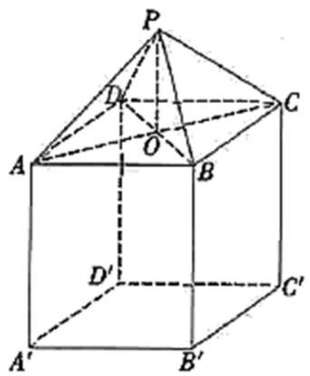

text_image

Geometric diagram of a cube with labeled vertices and internal points, used for spatial geometry problems.

A. $\frac{4\sqrt{5}}{5}m$   
B. $\frac{4\sqrt{3}}{3}m$   
C. 4m   
D. $4\sqrt{5}m$

# 二、多选题（共3题）

6.【多选题】若 $\ln_{\Delta x\to+0}\frac{f(x_{0}+\Delta x,y_{0})-f(x_{0},y_{0})}{\Delta x}$ 存在，则称 $\ln_{\Delta x\to+0}\frac{f(x_{0}+\Delta x,y_{0})-f(x_{0},y_{0})}{\Delta x}$ 为二元函数 $z=f(x,y)$ 在点 $(x_{0},y_{0})$ 处对 x 的偏导数，记为 $f_{x}(x_{0},y_{0})$ ；若 $\ln_{\Delta y\to+0}\frac{f(x_{0},y_{0}+\Delta y)-f(x_{0},y_{0})}{\Delta y}$ 存在，则称 $\ln_{\Delta y\to+0}\frac{f(x_{0},y_{0}+\Delta y)-f(x_{0},y_{0})}{\Delta y}$ 为二元函数 $z=f(x,y)$ 在点 $(x_{0},y_{0})$ 处对 y 的偏导数，记为 $f_{y}(x_{0},y_{0})$ .

若二元函数 $z = f(x,y) = x^2 - 2xy + y^3 (x > 0,y > 0)$ ，则下列结论正确的是（）

A. $f_{x}(1,2) = -2$   
B. $f_{y}(1,2) = 10$   
C. $f_{x}(m,n) + f_{y}(m,n)$ 的最小值为 -1  
D. $f(x,y)$ 的最小值为 $-\frac{4}{27}$

7.【多选题】拉格朗日中值定理是“中值定理”的核心内容，定理如下：如果函数 $f(x)$ 在闭区间 $[a,b]$ 上连续，在开区间 $(a,b)$ 内可导，则在区间 $(a,b)$ 内至少存在一个点 $x_{0} \in (a,b)$ ，使得 $f(b) - f(a) = f'(x_{0})(b - a)$ ， $x = x_{0}$ 称为函数 $y = f(x)$ 在闭区间 $[a,b]$

上的中值点，若关于函数 $f(x)=\sin x+\sqrt{3}\cos x$ 在区间 $[0,\pi]$ 上 “中值点” 的个数为 m ，函数 $g(x)=e^{x}$ 在区间 $[0,1]$ 上 “中值点” 个数为 n ，则有（）

(参考数据： $\sqrt{2}\approx1.41,\quad\sqrt{3}\approx1.73,\quad\pi\approx3.14,\quad e\approx2.72$ .)

A. $m = 1$

B. m = 2   
C. n = 1   
D. n = 2

8.【多选题】定义：如果函数 $f(x)$ 在 $[a,b]$ 上存在 $x_{1}$ ， $x_{2}$ （ $a < x_{1} < x_{2} < b$ ），满足 $f'(x_{1}) = f'(x_{2}) = \frac{f(a) - f(b)}{a - b}$ ，则称 $x_{1}$ ， $x_{2}$ 为 $[a,b]$ 上的“对望数”。已知函数 $f(x)$ 为 $[a,b]$ 上的“对望函数”。下列结论正确的是（）

A. 函数 $f(x)=x^{2}+mx+n$ 在任意区间 $[a,b]$ 上都不可能是 “对望函数”  
B. 函数 $f(x)=\frac{1}{3}x^{3}-x^{2}+2$ 是 $[0,2]$ 上的 “对望函数”  
C. 函数 $f(x) = x + \sin x$ 是 $\left[\frac{\pi}{6}, \frac{11\pi}{6}\right]$ 上的“对望函数”  
D. 若函数 $f(x)$ 为 $[a,b]$ 上的 “对望函数”，则 $f(x)$ 在 $[a,b]$ 上单调

# 三、填空题（共3题）

9.【填空题】已知一正三棱锥的体积为 $\frac{\sqrt{3}}{2}$ ，设其侧面与底面所成锐二面角为 $\theta$ ，则当 $\tan\theta$ 等于 \_\_\_\_ 时，侧面积最小.  
10.【填空题】如图，某款酒杯的容器部分为圆锥，且该圆锥的轴截面为面积是 $16\sqrt{3} \mathrm{~cm}^2$ 的正三角形.若在该酒杯内放置一个圆柱形冰块，要求冰块高度不超过酒杯口高度，则酒杯可放置圆柱形冰块的最大体积为\_\_\_\_.

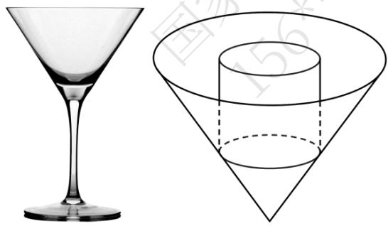

natural_image

Two geometric shapes: a martini glass and a cone with a cylinder, shown side by side without any text or symbols.

11.【填空题】已知在正四棱锥 S-ABCD 中，SA=3，那么当该棱锥的体积最大时，它的高为\_\_\_\_。

# 四、复合题（共2题）

12.【复合题】如图，要利用一半径为 5cm
的圆形纸片制作三棱锥形包装盒. 已知该纸片的圆心为 O ，先以 O 为中心作边长为 2x（单位：cm）的等边三角形 ABC，再分别在圆 O 上取三个点 D，E，F，使 $\triangle DBC$ ， $\triangle ECA$ ， $\triangle FAB$ 分别是以 BC，CA，AB

为底边的等腰三角形. 沿虚线剪开后, 分别以 $BC$ , $CA$ , $AB$ 为折痕折起 $\triangle DBC$ , $\triangle ECA$ , $\triangle FAB$ , 使得 $D$ , $E$ , $F$ 重合于点 $P$ , 即可得到正三棱锥 $P-ABC$ .

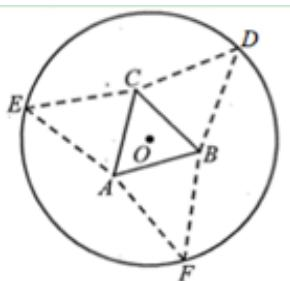

text_image

Geometric diagram showing a circle with inscribed triangle ABC and auxiliary points D, E, F, O, including dashed lines indicating auxiliary constructions.

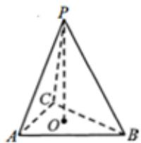

text_image

P
C₁
O
A
B

(1)【问答题】若三棱锥 P-ABC 是正四面体，求 x 的值；  
(2)【问答题】求三棱锥 P-ABC 的体积 V 的最大值，并指出相应 x 的值.

13.【复合题】如图，某校打算在长为1千米的主干道 AB

一侧的一片区域内临时搭建一个强基计划高校咨询和宣传台，该区域由直角三角形区域 $ACB$ （ $\angle ACB$ 为直角）和以 $BC$ 为直径的半圆形区域组成，点 $P$ （异于 $B$ ， $C$ ）为半圆弧上一点，点 $H$ 在线段 $AB$ 上，且满足 $CH \perp AB$ .已知 $\angle PB_{A} = 60^{\circ}$ ，设 $\angle ABC = \theta$ ，且 $\theta \in \left[\frac{\pi}{18},\frac{\pi}{3}\right)$ .初步设想把咨询台安排在线段 $CH$ ， $CP$

上，把宣传海报悬挂在弧 CP 和线段 CH 上.

text_image

C
P
A
H
θ
B

(1)【问答题】若为了让学生获得更多的咨询机会，让更多的省内高校参展，打算让 $CH + CP$ 最大，求该最大值；  
(2)【问答题】若为了让学生了解更多的省外高校, 贴出更多高校的海报, 打算让弧 $CP$ 和线段 $CH$ 的长度之和最大, 求此时的 $\theta$ 的值.

# 五、问答题（共4题）

14.【问答题】如图, 已知 $A, B$ 两镇分别位于东西湖岸 $MN$ 的 $A$ 处和湖中小岛的 $B$ 处, 点 $C$ 在 $A$ 的正西方向 $l \mathrm{~km}$ 处, $\tan \angle BAN = \frac{3}{4}, \angle BCN = \frac{\pi}{4}$ , . 现计划铺设一条电缆连通 $A, B$ 两镇, 有两种铺设方案: ①沿线段 $AB$ 在水下铺设; ②在湖岸 $MN$ 上选一点 $P$ , 先沿线段 $AP$

在地下铺设，再沿线段PB

在水下铺设，预算地下、水下的电缆铺设费用分别为2万元/km、4万元/km.

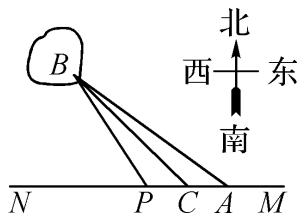

text_image

北
西 东
南
B
N P C A M

应该如何铺设，使总铺设费用最低？

15.【问答题】某地拟规划种植一批芍药，为了美观，将种植区域（区域Ⅰ）设计成半径为1km 的扇形 EAF ，中心角 $\angle EAF = \theta\left(\frac{\pi}{4} < \theta < \frac{\pi}{2}\right)$

．为方便观赏，增加收入，在种植区域外围规划观赏区（区域II）和休闲区（区域III），并将外围区域按如图所示的方案扩建成正方形 ABCD，其中点 E，F 分别在边 BC 和 CD

上．已知种植区、观赏区和休闲区每平方千米的年收入分别是10万元、20万元、20万元.

text_image

D
F
C
Ⅲ
Ⅱ
I
E
A
B
Ⅱ

当 $\theta$ 为多少时，年总收入最大？

16.【问答题】如图1所示为一种魔豆吊灯，图2为该吊灯的框架结构图，由正六棱锥 $O_{I}$ -ABCDEF 和 $O_{2}$ -ABCDEF 构成，两个棱锥的侧棱长均相等，且棱锥底面外接圆的直径为 1600mm，底面中心为 O

，通过连接线及吸盘固定在天花板上，使棱锥的底面呈水平状态，下顶点 $O_{2}$

与天花板的距离为1300mm

，所有的连接线都用特殊的金属条制成，设金属条的总长为 $y$ ：

chemical

Molecular structure diagram showing a central atom bonded to multiple surrounding atoms with labeled positions

(图 1)

text_image

p
O₁
1300mm
A
F
B
O
E
C
D
O₂
1600mm

(图 2)

设 $\angle O_{l}AO = \theta (rad)$ ，当角 $\theta$ 正弦值的大小是多少时，金属条总长 $y$ 最小.

17.【问答题】某温泉度假村拟以泉眼C为圆心建造一个半径为 12

米的圆形温泉池，如图所示，M 、 N 是圆C上关于直径 AB 对称的两点，以 A为圆心，AC 为半径的圆与圆 C 的弦 AM 、 AN 分别交于点 D 、 E ，其中四边形 AEBD 为温泉区，I、II 区域为池外休息区，III、IV 区域为池内休息区，设 $\angle MAB = \theta$

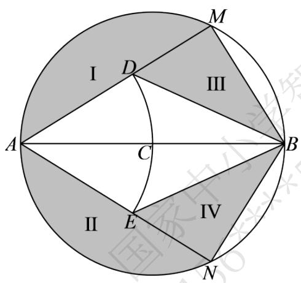

text_image

I
D
M
III
A
C
B
II
E
IV
N

当池内休息区的总面积最大时，求 AM 的长.

# 高中 数学 选择性必修 第二册

# 第五章 一元函数的导数及其应用 小结

# 一、单选题（共4题）

1.【单选题】设函数 $f(x) = \begin{cases} x - 2a, & x \leqslant 0 \\ \ln x, & x > 0 \end{cases}$ ，若 $f(x_1) = f(x_2)(x_1 < x_2)$ ，且 $2x_2 - x_1$ 的最小值为 $\ln 2$ ，则 $a$ 的值为（）

A. $\frac{1}{2}$   
B. $-\frac{\ln(ln\sqrt{2})}{2}$   
C. $\frac{e}{2}$   
D. $-\frac{e}{2}$

2.【单选题】对任意 $x \in (0, +\infty)$ ，不等式 $2e^{2x} - alna - alnx \geqslant 0$ 恒成立，则 $a$ 的最大值为（）

A. $\sqrt{e}$   
B. e   
C. 2e   
D. $e^{2}$

3.【单选题】定义在 $\left(0, \frac{\pi}{2}\right)$ 上的函数 $f(x)$ ， $f'(x)$ 是它的导函数，且恒有 $cosxf(x) + f'(x)\sin x > 0$ 成立，则（）

A. $\sqrt{2} f\left(\frac{\pi}{4}\right) > \sqrt{3} f\left(\frac{\pi}{3}\right)$   
B. $\sin1f(1)>\frac{1}{2}f\left(\frac{\pi}{6}\right)$   
C. $f\left(\frac{\pi}{6}\right) > \sqrt{2} f\left(\frac{\pi}{4}\right)$   
D. $f\left(\frac{\pi}{6}\right) > \sqrt{3} f\left(\frac{\pi}{3}\right)$

4.【单选题】已知实数 a, b, c 满足 $\frac{a - 2e^{a}}{b} = \frac{1 - c}{d - 1} = 1$ ，其中 e 是自然对数的底数，那么 $(a - c)^{2} + (b - d)^{2}$ 的最小值为（）

A. 8   
B. 10

C. 12   
D. 18

# 二、填空题（共6题）

5.【填空题】已知 $f(x)=\ln x-\frac{x}{4}+\frac{3}{4x}$ ， $g(x)=-x^{2}-2ax+4$ ，若对 $\forall_{x_{1}}\in(0,2]$ ， $\exists_{x_{2}}\in[1,2]$ ，使得 $f(x_{1})\geqslant g(x_{2})$ 成立，则 a 的取值范围是 \_\_\_\_。  
6.【填空题】已知 $f(x)=\frac{1}{3}x^{3}-ax\ln x,\quad a<2$ ，若对于 $\forall_{x_{1}}, x_{2}\in[1,2], x_{1}\neq x_{2}$ ，都有 $\frac{|f'(x_{1})-f'(x_{2})|}{|x_{1}-x_{2}|}>a$ 恒成立，则 a 的取值范围为 \_\_\_\_  
7.【填空题】 $f(x)$ 是定义在R上的偶函数，当x<0时， $xf'(x)+f(x)<0$ ，且 $f(-4)=0$ ，则不等式 $xf(x)>0$ 的解集为\_\_\_\_.  
8.【填空题】已知e为自然对数的底数，对任意 $x_{1} \in [-1,1]$ ，总存在唯一的 $x_{2} \in \left[\frac{1}{\mathrm{e}^{2}}, \mathrm{e}\right]$ 使得 $x_{1} + x_{2} \ln x_{2} - a = 0$ 成立，则实数 a 的取值范围为 \_\_\_\_.  
9.【填空题】已知定义在R上的函数 $f(x)$ 满足 $f(2)=1$ ，且 $f(x)$ 的导函数 $f'(x)>x-1$ ，则不等式 $f(x)<\frac{1}{2}x^{2}-x+1$ 的解集为\_\_\_\_.  
10.【填空题】若函数 $h(x)=\ln x-\frac{1}{2}ax^{2}-2x(a\neq0)$ 在[1,4]上存在单调递减区间，则实数a的取值范围为\_\_\_\_.

# 三、复合题（共2题）

11.【复合题】已知函数 $f(x) = 2x + 2a\ln x$ 在 $x = 1$ 处的切线 $l$ 与直线 $x + 4y = 0$ 垂直，函数 $g(x) = f(x) + bx^2 - 4x$ .

(1)【问答题】求实数 a 的值;  
(2)【问答题】设 $x_{1}$ , $x_{2}(x_{1} < x_{2})$ 是函数 $g(x)$ 的两个极值点, 证明: $g(x_{1}) - g(x_{2}) < (2b - 1)(x_{1} - x_{2})$ .

12.【复合题】已知函数 $f(x)=\frac{e^{x}}{x}-lnx+x-a$

(1)【问答题】若 $f(x)\geq0$ ，求a的取值范围；  
(2)【问答题】证明：若 $f(x)$ 有两个零点 $x_{1}, x_{2}$ ，则 $x_{1}x_{2}<1$ 。

# 四、问答题（共6题）

13.【问答题】已知函数 $f(x) = e^{x} - \frac{e}{2} x^{2}$ . 若 $f(x_{1}) + f(x_{2}) = e, \quad x_{1} < x_{2}$ ，证明： $x_{1} + x_{2} < 2$ .

14.【问答题】已知函数 $f(x) = xe^{-x} (x \in R)$ . 如果 $x_1 \neq x_2$ ，且 $f(x_1) = f(x_2)$ . 证明： $x_1 + x_2 > 2$ .

15.【问答题】已知函数 $f(x)=\ln x-ax$ 有两个零点 $x_{1}$ ， $x_{2}$ （ $x_{1}<x_{2}$ ），求证： $x_{1}+x_{2}>\frac{1-\ln a}{a}$

16.【问答题】已知函数 $f(x)=lnx-ax$ 有两个零点 $x_{1}<x_{2}$ ，求证： $x_{1}x_{2}>e^{2}$ .

17.【问答题】已知函数 $f(x)=e^{x}-\frac{1}{2}x^{2}-ax,\quad a\in\mathbb{R}$ ，当 $a\leq1$ 时，若 $x_{1}\neq x_{2},\quad f(x_{1})+f(x_{2})=2$ 证明： $x_{1} + x_{2} < 0$ .

18.【问答题】已知函数 $f(x)=\ln x+2x^{2}-2$ ，若是 $x_{1}$ ， $x_{2}$ 两个正数，且 $f(x_{1})+f(x_{2})\geqslant x_{1}+x_{2}$ ，证明： $x_{1}+x_{2}>1$ .

# 高中 数学 选择性必修 第二册

# 第五章 一元函数的导数及其应用 小结

# 一、填空题（共6题）

1.【填空题】若关于x的不等式 $(1+x)\ln x \leqslant x (a-1)$ 在 $(1, e)$ 上恒成立，则实数a的取值范围是\_\_\_\_。

2.【填空题】已知 a > 0 ，若在 $(1, +\infty)$ 上存在 x 使得不等式 $e^{x} - x \leq x^{a} - alnx$ 成立，则 a 的最小值为 \_\_\_\_.

3.【填空题】若关于 x 的不等式 $(a^{2}-a)x+alnx\leqslant e^{x}-2alna$ 在 $(0,+\infty)$ 上恒成立，则实数 a 的最大值为 \_\_\_\_.

4.【填空题】若存在 $x \in (-1, 1]$ ，使得不等式 $e^{x} - ax < a$ ，则实数 a 的取值范围是 \_\_\_\_.

5.【填空题】若不等式 $(1+x^{2})e^{ax}\geq ax^{2}+ax+1$ 对任意 $x\in R$ 均成立，则实数a的取值范围是\_\_\_\_.

6.【填空题】已知函数 $f(x)=(e-a)e^{x}-ma+x$ ，(m，a为实数)，若存在实数a，使得 $f(x)\leqslant0$ 对任意 $x\in R$ 恒成立，则实数m的取值范围是\_\_\_\_。

# 二、复合题（共2题）

7.【复合题】已知 $a \in R$ ，函数 $f(x) = \ln x + \frac{a}{x}$ .

(1)【问答题】若 $f(x)$ 的极小值为0，求a的值.

(2)【问答题】当 a=0 时，函数 $g(x)=[1-f'(x)][1+f(x)]+\frac{l}{e^{x}}$ ，证明： $g(x)$ 无零点.

8.【复合题】已知函数 $f(x) = -2\ln x + \frac{a}{x^2} + 1$ .

(1)【问答题】讨论 $f(x)$ 的单调性;

(2)【问答题】若 $f(x)$ 有两个不同的零点 $x_{1}$ ， $x_{2}$ ， $x_{0}$ 为其极值点，证明： $\frac{l}{x_{1}^{2}} + \frac{l}{x_{2}^{2}} > 2f(x_{0})$ .

# 三、问答题（共4题）

9.【问答题】已知 $f(x)=xe^{x}-x^{2}-2x$ 。若不等式 $f(x)\leq m_{x}^{3}+\frac{1}{2}x^{4}-x$ 存在正数解，求实数 m 的取值范围。

10.【问答题】设 $n \in N^{*}$ ，证明： $\frac{l}{\sqrt{l^{2} + l}} + \frac{l}{\sqrt{2^{2} + 2}} + \cdots + \frac{l}{\sqrt{n^{2} + n}} > \ln(n + 1)$ .

11.【问答题】已知函数 $f(x) = 2x - \sin x$ . $\exists_{x_1}, x_2 \in (0, +\infty), x_1 \neq x_2$ ，使 $f(x_1) - \lambda \ln x_1 = f(x_2) - \lambda \ln x_2$ ，求证： $x_1 x_2 < \lambda^2$ .

12.【问答题】已知函数 \( {} \) f\left(x\right)=\frac{ax+1}{e}^{x}}+x\left(a\in\mathit{R}\right)\). 对于 \( \forall x \in (0, +\infty) \)，不等式 \( f(x) \leq 2x - \frac{\ln x}{e^x} \) 恒成立，求实数 \( a \) 的取值范围.