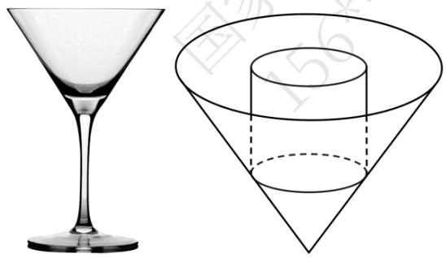
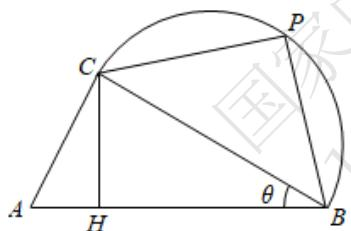
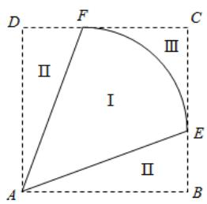
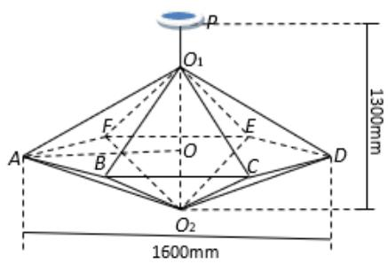

# 高中 数学 选择性必修 第二册

# 第五章 一元函数的导数及其应用 小结

# 一、单选题（共5题）

1.【单选题】函数 $f(x)$ ， $g(x)$ 的定义域都是 $D$ ，直线 $x = x_0(x_0 \in D)$ 与 $y = f(x)$ ， $y = g(x)$ 的图象分别交于 $A$ ， $B$ 两点，若线段 $AB$ 的长度是不为 $0$ 的常数，则称曲线 $y = f(x)$ ， $y = g(x)$ 为“平行曲线”。设 $f(x) = e^x - a\ln x + c (a > 0, c \neq 0)$ ，且 $y = f(x)$ ， $y = g(x)$

为区间 $(0, +\infty)$ 的“平行曲线”其中 $g(1) = \mathfrak{e}$ ， $g(x)$ 在区间 $(2,3)$ 上的零点唯一，则 $a$ 的取值范围是（ ）

A. $\left(\frac{\mathrm{e}^{2}}{\ln3},\frac{\mathrm{e}^{4}}{\ln2}\right)$   
B. $\left(\frac{e^{2}}{\ln2},\frac{e^{3}}{\ln3}\right)$   
C. $\left(\frac{\mathrm{e}^{3}}{\ln3},\frac{2\mathrm{e}^{4}}{\ln2}\right)$   
D. $\left(\frac{2e^{3}}{\ln3},\frac{e^{4}}{\ln2}\right)$

2.【单选题】若存在实常数 $k$ 和 $b$ ，使得函数 $F(x)$ 和 $G(x)$

对其公共定义域上的任意实数 $x$ 都满足： $F_{(x)} \geqslant kx + b$ 和 $G_{(x)} \leqslant kx + b$

恒成立，则称此直线 $y = kx + b$ 为 $F(x)$ 和 $G(x)$ 的“隔离直线”，已知函数 $f(x) = x^2$ $(x \in R)$ ， $g(x) = \frac{l}{x} (x < 0)$ ， $h(x) = 2\mathrm{e}lnx$ ，有下列命题：

① $F(x)=f(x)-g(x)$ 在 $x\in\left(-\frac{1}{\sqrt[3]{2}},0\right)$ 内单调递增；  
② $f(x)$ 和 $g(x)$ 之间存在 “隔离直线”，且 b 的最小值为 -4；  
③ $f(x)$ 和 $g(x)$ 之间存在 “隔离直线”，且 k 的取值范围是 $(-4,0]$ ;  
④ $f(x)$ 和 $h(x)$ 之间存在唯一的“隔离直线” $y = 2\sqrt{ex} - e$

其中真命题的个数有（）

A. 1个   
B. 2个   
C. 3个   
D. 4个

3.【单选题】对于函数 $y = f(x)$ 的图象上不同的两点 $A(x_{1},y_{1})$ ， $B(x_{2},y_{2})$

，记这两点处的切线的斜率分别为 $k_{A}$ 和 $k_{B}$ ，定义 $\varphi(A,B)=\frac{|k_{A}-k_{B}|}{|AB|}$ （ $|AB|$ 为线段 AB 的长度）为曲线 $y=f(x)$

上 A，B 两点间的“弯曲度”. 下列命题中真命题是（）

①若函数 $y=x^{3}-x^{2}+1$ 图象上A，B两点的横坐标分别为1和2，则中 $\varphi(A,B)>\sqrt{3}$ ；  
②存在这样的函数，其图象上任意两点间的“弯曲度”为常数；  
③设A，B是抛物线 $y = x^{2} + 1$ 上不同的两点，则 $\varphi(A, B) \leqslant 2$ ；  
④设指数曲线 $y = e^{x}$ 上不同的两点 $A(x_{1}, y_{1})$ ， $B(x_{2}, y_{2})$ ，且 $x_{1} - x_{2} = 1$ ，若 $t \cdot \varphi(A, B) < 1$ 恒成立，则实数 t 的取值范围是 $(-\infty, 1)$ 。

A. ②④

B.①②

C. ①④

D. ②③

4.【单选题】已知正四棱锥的侧棱长为 l，其各顶点都在同一球面上．若该球的体积为 $36\pi$ ，且 $3 \leqslant l \leqslant 3\sqrt{3}$ ，则该正四棱锥体积的取值范围是（）

A. $\left[18,\frac{81}{4}\right]$   
B. $\left[\frac{27}{4},\frac{81}{4}\right]$   
C. $\left[\frac{27}{4},\frac{64}{3}\right]$   
D. [18,64]

5.【单选题】如图所示，一个仓库设计由上部屋顶和下部主体两部分组成，屋顶的形状是四棱锥 P-ABCD，四边形 ABCD 是正方形，点 O 为正方形 ABCD 的中心， $PO \perp$ 平面 ABCD；下部的形状是长方体 ABCD-A'B'C'D'

. 已知上部屋顶造价与屋顶面积成正比，比例系数为 $k (k > 0)$

，下部主体造价与高度成正比，比例系数为 8k．若欲造一个上、下总高度为 10m，AB = 8m 的仓库，则当总造价最低时，PO = （）

text_image

Geometric diagram of a cube with labeled vertices and internal points, used for spatial geometry problems.

A. $\frac{4\sqrt{5}}{5}m$   
B. $\frac{4\sqrt{3}}{3}m$   
C. 4m   
D. $4\sqrt{5}m$

# 二、多选题（共3题）

6.【多选题】若 $\ln_{\Delta x\to+0}\frac{f(x_{0}+\Delta x,y_{0})-f(x_{0},y_{0})}{\Delta x}$ 存在，则称 $\ln_{\Delta x\to+0}\frac{f(x_{0}+\Delta x,y_{0})-f(x_{0},y_{0})}{\Delta x}$ 为二元函数 $z=f(x,y)$ 在点 $(x_{0},y_{0})$ 处对 x 的偏导数，记为 $f_{x}(x_{0},y_{0})$ ；若 $\ln_{\Delta y\to+0}\frac{f(x_{0},y_{0}+\Delta y)-f(x_{0},y_{0})}{\Delta y}$ 存在，则称 $\ln_{\Delta y\to+0}\frac{f(x_{0},y_{0}+\Delta y)-f(x_{0},y_{0})}{\Delta y}$ 为二元函数 $z=f(x,y)$ 在点 $(x_{0},y_{0})$ 处对 y 的偏导数，记为 $f_{y}(x_{0},y_{0})$ .

若二元函数 $z = f(x,y) = x^{2} - 2xy + y^{3}(x > 0,y > 0)$ ，则下列结论正确的是（）

A. $f_{x}(1,2) = -2$   
B. $f_{y}(1,2) = 10$   
C. $f_{x}(m,n) + f_{y}(m,n)$ 的最小值为 -1  
D. $f(x,y)$ 的最小值为 $-\frac{4}{27}$

7.【多选题】拉格朗日中值定理是“中值定理”的核心内容，定理如下：如果函数 $f(x)$ 在闭区间 $[a,b]$ 上连续，在开区间 $(a,b)$ 内可导，则在区间 $(a,b)$ 内至少存在一个点 $x_{0} \in (a,b)$ ，使得 $f(b) - f(a) = f'(x_{0})(b - a)$ ， $x = x_{0}$ 称为函数 $y = f(x)$ 在闭区间 $[a,b]$

上的中值点，若关于函数 $f(x)=\sin x+\sqrt{3}\cos x$ 在区间 $[0,\pi]$ 上 “中值点” 的个数为 m ，函数 $g(x)=e^{x}$ 在区间 $[0,1]$ 上 “中值点” 个数为 n ，则有（）

(参考数据： $\sqrt{2}\approx1.41,\quad\sqrt{3}\approx1.73,\quad\pi\approx3.14,\quad e\approx2.72$ .)

A. $m = 1$

B. m = 2   
C. n = 1   
D. n = 2

8.【多选题】定义：如果函数 $f(x)$ 在 $[a,b]$ 上存在 $x_1$ ， $x_2$ （ $a < x_1 < x_2 < b$ ），满足 $f'(x_1) = f'(x_2) = \frac{f(a) - f(b)}{a - b}$ ，则称 $x_1$ ， $x_2$ 为 $[a,b]$ 上的“对望数”。已知函数 $f(x)$ 为 $[a,b]$ 上的“对望函数”。下列结论正确的是（）

A. 函数 $f(x)=x^{2}+mx+n$ 在任意区间 $[a,b]$ 上都不可能是 “对望函数”  
B. 函数 $f(x)=\frac{1}{3}x^{3}-x^{2}+2$ 是 $[0,2]$ 上的 “对望函数”  
C. 函数 $f(x) = x + \sin x$ 是 $\left[\frac{\pi}{6}, \frac{11\pi}{6}\right]$ 上的“对望函数”  
D. 若函数 $f(x)$ 为 $[a,b]$ 上的 “对望函数”，则 $f(x)$ 在 $[a,b]$ 上单调

# 三、填空题（共3题）

9.【填空题】已知一正三棱锥的体积为 $\frac{\sqrt{3}}{2}$ ，设其侧面与底面所成锐二面角为 $\theta$ ，则当 $\tan\theta$ 等于 \_\_\_\_ 时，侧面积最小.  
10.【填空题】如图，某款酒杯的容器部分为圆锥，且该圆锥的轴截面为面积是 $16\sqrt{3} \mathrm{~cm}^2$ 的正三角形.若在该酒杯内放置一个圆柱形冰块，要求冰块高度不超过酒杯口高度，则酒杯可放置圆柱形冰块的最大体积为\_\_\_\_.

natural_image

Two geometric shapes: a martini glass and a cone with a cylinder, shown side by side without any text or symbols.

11.【填空题】已知在正四棱锥 S-ABCD 中，SA=3，那么当该棱锥的体积最大时，它的高为\_\_\_\_。

# 四、复合题（共2题）

12.【复合题】如图，要利用一半径为 5cm
的圆形纸片制作三棱锥形包装盒. 已知该纸片的圆心为 O ，先以 O 为中心作边长为 2x（单位：cm）的等边三角形 ABC，再分别在圆 O 上取三个点 D，E，F，使 $\triangle DBC$ ， $\triangle ECA$ ， $\triangle FAB$ 分别是以 BC，CA，AB

为底边的等腰三角形. 沿虚线剪开后, 分别以 $BC$ , $CA$ , $AB$ 为折痕折起 $\triangle DBC$ , $\triangle ECA$ , $\triangle FAB$ , 使得 $D$ , $E$ , $F$ 重合于点 $P$ , 即可得到正三棱锥 $P-ABC$ .

text_image

Geometric diagram showing a circle with inscribed triangle ABC and auxiliary points D, E, F, O, including dashed lines indicating auxiliary constructions.

text_image

P
C₁
O
A
B

(1)【问答题】若三棱锥 P-ABC 是正四面体，求 x 的值；  
(2)【问答题】求三棱锥 P-ABC 的体积 V 的最大值，并指出相应 x 的值.

13.【复合题】如图，某校打算在长为1千米的主干道 AB

一侧的一片区域内临时搭建一个强基计划高校咨询和宣传台，该区域由直角三角形区域 $ACB$ （ $\angle ACB$ 为直角）和以 $BC$ 为直径的半圆形区域组成，点 $P$ （异于 $B$ ， $C$ ）为半圆弧上一点，点 $H$ 在线段 $AB$ 上，且满足 $CH \perp AB$ .已知 $\angle PB_{A} = 60^{\circ}$ ，设 $\angle ABC = \theta$ ，且 $\theta \in \left[\frac{\pi}{18},\frac{\pi}{3}\right)$ .初步设想把咨询台安排在线段 $CH$ ， $CP$

上，把宣传海报悬挂在弧 CP 和线段 CH 上.

text_image

C
P
A
H
θ
B

(1)【问答题】若为了让学生获得更多的咨询机会，让更多的省内高校参展，打算让 $CH + CP$ 最大，求该最大值；  
(2)【问答题】若为了让学生了解更多的省外高校, 贴出更多高校的海报, 打算让弧 $CP$ 和线段 $CH$ 的长度之和最大, 求此时的 $\theta$ 的值.

# 五、问答题（共4题）

14.【问答题】如图，已知A，B两镇分别位于东西湖岸MN的A处和湖中小岛的B处，点C在A的正西方向lkm处， $\tan\angle BAN=\frac{3}{4}$ ， $\angle BCN=\frac{\pi}{4}$ ，.现计划铺设一条电缆连通A，B两镇，有两种铺设方案：①沿线段AB在水下铺设；②在湖岸MN上选一点P，先沿线段AP

在地下铺设，再沿线段PB

在水下铺设，预算地下、水下的电缆铺设费用分别为2万元/km、4万元/km.

text_image

北
西 东
南
B
N P C A M

应该如何铺设，使总铺设费用最低？

15.【问答题】某地拟规划种植一批芍药，为了美观，将种植区域（区域Ⅰ）设计成半径为1km 的扇形 EAF ，中心角 $\angle EAF = \theta\left(\frac{\pi}{4} < \theta < \frac{\pi}{2}\right)$

．为方便观赏，增加收入，在种植区域外围规划观赏区（区域Ⅱ）和休闲区（区域Ⅲ），并将外围区域按如图所示的方案扩建成正方形 ABCD，其中点 E，F 分别在边 BC 和 CD

上．已知种植区、观赏区和休闲区每平方千米的年收入分别是10万元、20万元、20万元.

text_image

D
F
C
Ⅲ
Ⅱ
I
E
A
B
Ⅱ

当 $\theta$ 为多少时，年总收入最大？

16.【问答题】如图1所示为一种魔豆吊灯，图2为该吊灯的框架结构图，由正六棱锥 $O_{1}$ -ABCDEF 和 $O_{2}$ -ABCDEF 构成，两个棱锥的侧棱长均相等，且棱锥底面外接圆的直径为 1600mm，底面中心为 O

，通过连接线及吸盘固定在天花板上，使棱锥的底面呈水平状态，下顶点 $O_{2}$

与天花板的距离为1300mm

，所有的连接线都用特殊的金属条制成，设金属条的总长为 $y$ 。

chemical

Molecular structure diagram showing a central atom bonded to multiple surrounding atoms with labeled positions

(图 1)

text_image

p
O₁
1300mm
A
F
B
O
E
C
D
O₂
1600mm

(图 2)

设 $\angle O_{l}AO = \theta (rad)$ ，当角 $\theta$ 正弦值的大小是多少时，金属条总长 $y$ 最小.

17.【问答题】某温泉度假村拟以泉眼C为圆心建造一个半径为 12

米的圆形温泉池，如图所示，M 、 N 是圆C上关于直径 AB 对称的两点，以 A为圆心，AC 为半径的圆与圆 C 的弦 AM 、 AN 分别交于点 D 、 E ，其中四边形 AEBD 为温泉区，I、II 区域为池外休息区，III、IV 区域为池内休息区，设 $\angle MAB = \theta$

text_image

I
D
M
III
A
C
B
II
E
IV
N

当池内休息区的总面积最大时，求 AM 的长.