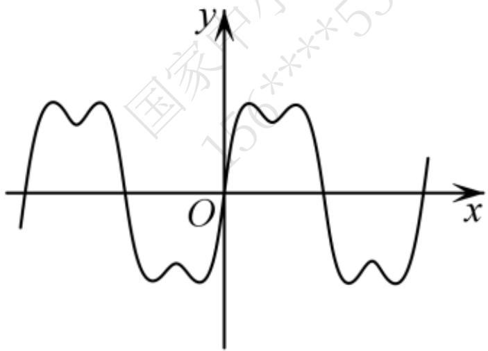
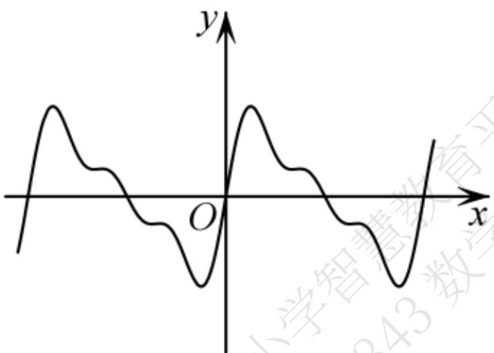
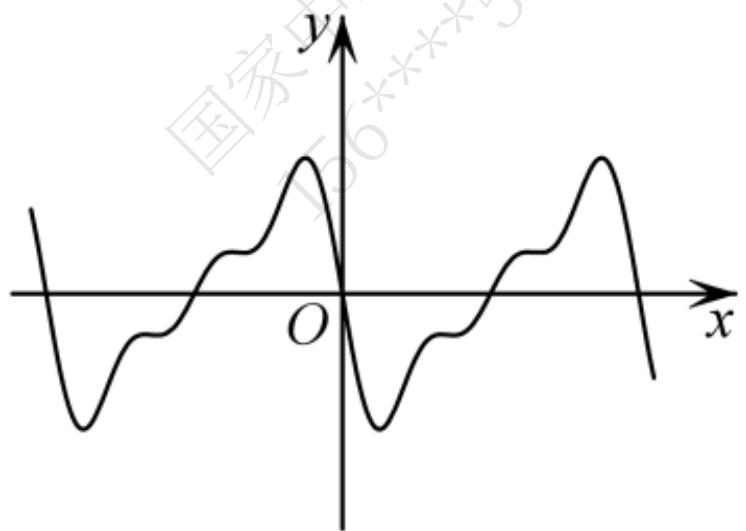

# 高中 数学 选择性必修 第二册

# 第五章 一元函数的导数及其应用 5.3

# 导数在研究函数中的应用

# 5.3.1 函数的单调性

# 一、单选题（共4题）

1.【单选题】若函数 $f(x) = ax + \cos x$ 在 $(- \infty, + \infty)$ 上单调递增，则实数 $a$ 的取值范围是（）

A. $(-1, 1)$

B. $[1, +\infty)$

C. $(-1, +\infty)$

D. $(-1, 0)$

2.【单选题】声音是由物体振动产生的．我们平时听到的声音几乎都是复合音．复合音的产生是由于发音体不仅全段在振动，它的各部分如二分之一、三分之一、四分之一等也同时在振动．不同的振动的混合作用决定了声音的音色，人们以此分辨不同的声音．已知刻画某声音的函数为 $y=\sin x+\frac{1}{2}\sin 2x+\frac{1}{3}\sin 3x$ ，则其部分图象大致为（）

text_image

y
国家156****53
O
x

A.

B.   

text_image

y
O
x

text_image

y
O
x
小学智精数学
243数

C.

text_image

国家
O
x
y

D.

3.【单选题】已知函数 $y = xf'(x)$ 的图象如下图所示，其中 $f'(x)$ 是函数 $f(x)$ 的导函数，函数 $y = f(x)$ 的图象大致是图中的（）

line

| x   | y     |
| --- | ----- |
| -2  | -0.8  |
| -1  | 0.8   |
| 0   | 0     |
| 1   | -0.8  |
| 2   | 0.8   |

text_image

y
-1 O 1 x

A.

text_image

y
-1 O 1 x
国家中小学
156**5343

B.

line

| x   | y   |
| --- | --- |
| -2  | -2  |
| -1  | 1   |
| 0   | 0   |
| 1   | 0   |
| 2   | 2   |

C.

line

| x   | y   |
| --- | --- |
| -2  | -∞  |
| -1  | 0   |
| 0   | 1   |
| 1   | 0   |
| 2   | 0   |

D.

4.【单选题】“ $a \leq -\frac{l}{2}$ ”是“函数 $f(x) = x(e^{x} - a)$ 为增函数”的（）

A. 充分不必要条件  
B. 必要不充分条件  
C. 充要条件  
D. 既不充分也不必要条件

# 二、多选题（共1题）

5.【多选题】已知函数 $f(x) = x(\ln x)^2 + x$ ，则（）

A. $f(x)$ 在区间 $(0, +\infty)$ 上单调递增  
B. 当 $x = \frac{l}{e}$ 时， $f(x)$ 取最小值  
C. 对 $\forall x\in\left(\frac{l}{e},+\infty\right)$ ，m>0， $g(x)=f(x+m)-f(x)$ 为增函数  
D. 对 $\forall x \in (1, +\infty)$ 都有 $f(x) \leq x^3$

# 三、填空题（共1题）

6.【填空题】若函数 $f(x)=(x^{2}+ax+5)e^{x}$ 在 $\left[\frac{1}{2},\frac{3}{2}\right]$ 上单调递增，则实数 a 的取值范围是 \_\_\_\_

# 四、复合题（共1题）

7.【复合题】已知函数 $f(x) = a\ln x + x^2 - 3$ .

(1)【问答题】若 $f(x)$ 在 $(1, +\infty)$ 上不单调，求 a 的取值范围；  
(2)【问答题】若 $f(x)$ 的最小值为 -2 ，求 a.