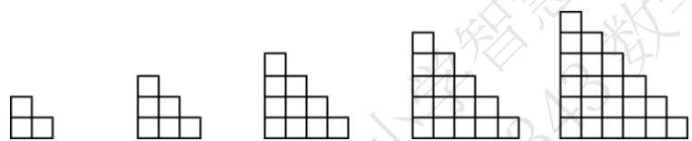
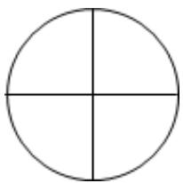

# 高中 数学 选择性必修 第二册

# 第四章 数列 4.1 数列的概念

# 一、单选题（共7题）

1.【单选题】若数列 $\{a_{n}\}$ 满足 $a_{n} + a_{n+1} + a_{n+2} = 2020 (n \in N^{*})$ ， $a_{2022} = 1, a_{2021} = 2$ ，则 $a_{I} = (\quad)$

A. 1

B. 2

C. 3

D. 2017

2.【单选题】下面是关于公差 $d > 0$ 的等差数列 $\{a_{n}\}$ 的四个命题：

(1) 数列 $\{a_{n}\}$ 是递增数列；

(2) 数列 $\{na_{n}\}$ 是递增数列;

(3) 数列 $\left\{\frac{a_{n}}{n}\right\}$ 是递减数列；

(4) 数列 $\{a_{n} + 3nd\}$ 是递增数列.

其中的真命题的个数为（）

A. 0

B. 1

C. 2

D. 3

3.【单选题】自然数列按如图规律排列，若 2013 在第 m 行第 n 个数，则 $\frac{n}{m}$ 等于（）

1

3 2

4 5 6

10 9 8 7

11 12 13 14

......

A. $\frac{19}{21}$

B. $\frac{20}{21}$

C. $\frac{10}{11}$ D. $\frac{21}{22}$

4.【单选题】已知数列 $\{a_{n}\}$ 的通项 $a_{n} = n^{2}\left(\cos^{2}\frac{n\pi}{3} -\sin^{2}\frac{n\pi}{3}\right)$ ，其前 $n$ 项和为 $S_{n}$ ，则 $S_{60} =$ （ ）

A. 1840   
B. 1880   
C. 1960   
D. 1980

5.【单选题】定义“等积数列”:在一个数列中,如果每一项与它的后一项的积都为同一个常数,那么这个数列叫做等积数列,这个常数叫做该数列的公积,已知数列 $\{a_{n}\}$ 是等积数列且 $a_{1}=3$ ，前41项的和为103，则这个数列的公积为

A. 2   
B. 3   
C. 6   
D. 8

6.【单选题】已知数列 $\{a_{n}\}$ 中， $a_{n} = -2n^{2} + 29n + 3$ ，则数列中最大项的值是（）

A. 107   
B. 108   
C. $108\frac{l}{8}$   
D. 109

7.【单选题】意大利数学家列昂那多·斐波那契以兔子繁殖为例，引入“兔子数列”：

1, 1, 2, 3, 5, 8, 13, 21, 34, …，即 $F(1) = F(2) = 1, F(n) = F(n - 1) + F(n - 2)(n \geqslant 3, n \in N^{*})$ ，此数列在物理、化学等领域都有广泛的应用，若此数列被2整除后的余数构成一个新数列 $\{a_{n}\}$ ，则数列 $\{a_{n}\}$ 的前2020项的和为（）

A. 1347   
B. 1348   
C. 1349   
D. 1346

# 二、多选题（共1题）

8.【多选题】已知数列 $\{a_{n}\}$ 的前 $n$ 项和为 $S_{n}$ ， $a_{1} = 1$ ，且 $S_{n} = \lambda a_{n} - 1$

（ $\lambda$ 为常数）．若数列 $\{b_n\}$ 满足 $a_{n}b_{n} = -n^{2} + 9n - 20$ ，且 $b_{n+1} < b_{n}$ ，则满足条件的 $n$ 的取值可以为（）

A. 5   
B. 6   
C. 7   
D. 8

# 三、填空题（共4题）

9.【填空题】将数列 $\{a_{n}\}$

中的所有项排成如下数阵：其中每一行项数是上一行项数的2倍，且从第二行起每一行均构成公比为2的等比数列.

$a_{1}$

$a_{2}, a_{3}$

$a_{4}, a_{5}, a_{6}, a_{7}$

$a_{8}, a_{9}, a_{10}, a_{11}, a_{12}, a_{13}, a_{14}, a_{15}$

●●●●●●

记数阵中的第1列 $a_{1}$ ， $a_{2}$ ， $a_{4}$ ，… 构成的数列为 $\{b_{n}\}$ ， $T_{n}$ 为数列 $\{b_{n}\}$ 的前 n 项和， $T_{n}=5n^{2}+3n$ ，则 $b_{n}=$ \_\_\_\_， $a_{1025}=$ \_\_\_\_.

10.【填空题】将正整数按下图方式排列，2019出现在第 i 行第 j 列，则 $i + j =$ \_\_\_\_ ;

1

2 3

4

5 6

7

8

9

10 11

12

13

14

15

16

... ... ...

11.【填空题】数列 $\{a_{n}\}$ 中，前 $n$ 项和为 $S_{n}$ 。若 $a_{1} = 2$ ， $a_{2} = 3$ ， $a_{n} = \frac{a_{n-1}}{a_{n-2}}$ （ $n \in \mathbf{N}^{*}$ ， $n \geqslant 3$ ），则 $a_{2020} = \_$ ； $S_{20} = \_$ .

12.【填空题】已知单调数列 $\{a_{n}\}$ 的前 $n$ 项和为 $S_{n}$ ，若 $S_{n} + S_{n+1} = n^{2} + n$ ，则首项 $a_{1}$ 的取值范围是\_\_\_\_。

# 高中 数学 选择性必修 第二册

# 第四章 数列 4.1 数列的概念

# 一、单选题（共3题）

1.【单选题】已知数列 $\{a_{n}\}$ 各项均不为零，且 $a_1 = 3, \frac{a_{n+1}}{a_{n+1} - a_n} - \frac{a_{n-1}}{a_n - a_{n-1}} = 2 (n \geqslant 2, n \in N^*)$ ，若 $a_{20} = 41$ ，则 $a_9 = (\quad)$

A. 19   
B. 20   
C. 22   
D. 23

2.【单选题】已知数列 $1, \frac{1}{2}, \frac{1}{2^2}, \frac{3}{2^2}, \frac{1}{2^3}, \frac{3}{2^3}, \frac{57}{2^3}, \ldots, \frac{1}{2^n}, \frac{3}{2^n}, \frac{5}{2^n}, \ldots$ ，则该数列第2019项是（ ）

A. $\frac{1989}{2^{10}}$   
B. $\frac{2019}{2^{10}}$   
C. $\frac{1989}{2^{11}}$   
D. $\frac{2019}{2^{11}}$

3.【单选题】已知数列 $\{a_{n}\}$ ， $a_{n}=2^{n}$ ， $b_{n}=2^{a_{n}}$ ， $M=\left(1+\frac{l}{b_{1}}\right)\left(1+\frac{l}{b_{2}}\right)\left(1+\frac{l}{b_{3}}\right)\cdots\left(1+\frac{l}{b_{n}}\right)$ ， $n\in N^{*}$ ，则（）

A. $M <   1$   
B. $M > \frac{4}{3}$   
C. M < 2   
D. M > 2

# 二、填空题（共6题）

4.【填空题】著名的斐波那契数列：1，1，2，3，5，…，

的特点是从三个数起，每一个数等于它前面两个数的和，则 $\frac{a_{1}^{2}+a_{2}^{2}+a_{3}^{2}+\cdots+a_{2048}^{2}}{a_{2048}}$

是数列中的第\_\_\_\_项.

5.【填空题】已知数列 $\{a_{n}\}$ 满足： $a_{1}=1$ ，且 $(n+1)a_{n+1}-n a_{n}-3=0$ ，若对任意的 $a\in[-2,2]$ ，不等式 $a_{n}\leqslant2t^{2}+at-1$ 恒成立，则实数 t 的范围为 \_\_\_\_

6.【填空题】已知 $0 \leqslant a_{1} \leqslant 1$ ，定义 $a_{n+1} = \begin{cases} 2a_{n}, & 0 \leqslant a_{n} < \frac{1}{2} \\ 2a_{n} - 1, & a_{n} \geqslant \frac{1}{2} \end{cases}$ . 如果 $a_{2} = a_{3}$ ，则 $a_{2} =$ \_\_\_\_；如果 $a_{1} < a_{3}$ ，则 $a_{1}$ 的取值范围是\_\_\_\_.

7.【填空题】已知数列 $\{a_{n}\}$ 的前n项和为 $S_{n}$ ，且 $S_{n}=2a_{n}-1$ ，则数列 $\{a_{n}\}$ 的通项公式 $a_{n}=$ \_\_\_\_.

8.【填空题】某地区森林原有木材存量为 $l$ ，且每年增长率为 $25\%$ ，因生产建设的需要每年年底要砍伐的木材量为 $\frac{l}{6}$ ，设 $a_{n}$ 为 $n$ 年后该地区森林木材的存量，则 $a_{n}$ 的表达式是 \_\_\_\_.

9.【填空题】数列 $a_{1}, a_{2} - a_{1}, a_{3} - a_{2}, \cdots, a_{n} - a_{n-1}$ ，…是首项为1，公比为2的等比数列，那么 $a_{n} =$ \_\_\_\_.

# 三、复合题（共3题）

10.【复合题】已知数列 $\{a_{n}\}$ 满足 $a_{1}=2, a_{n+1}-2a_{n}=2^{n+1}(n\in N^{*})$

(1)【问答题】求数列 $\{a_{n}\}$ 的通项公式;  
(2)【问答题】设 $b_{n}=\frac{n+2}{n\cdot a_{n+1}}$ ，求数列 $\{b_{n}\}$ 的前 n 项和 $T_{n}$ .

11.【复合题】已知无穷数列满足 $a_{n+1}=p\cdot a_{n}+\frac{q}{a_{n}}(n\in\mathbb{N}^{*})$ ，其中 p, q 均为非负实数且不同时为 0.

(1)【问答题】若 $p=\frac{1}{2}$ ，q=2，且 $a_{3}=\frac{41}{20}$ ，求 $a_{1}$ 的值；  
(2)【问答题】若 $a_{1} = 5$ ， $p\cdot q = 0$ ，求数列 $\{a_n\}$ 的前 $n$ 项和 $S_{n}$

12.【复合题】已知数列 $\{a_{n}\}$ 的前 $n$ 项和为 $S_{n}$ ， $a_{I} = 1$ ， $a_{n} > 0$ ， $S_{n}^{2} = a_{n+1}^{2} - \lambda S_{n+1}$ ，其中 $\lambda$ 为常数.

(1)【问答题】求证： $S_{n+1}=2S_{n}+\lambda$   
(2)【问答题】是否存在实数 $\lambda$ ，使得数列 $\{a_{n}\}$ 为等比数列？若存在，求出 $\lambda$ 的值；若不存在，说明理由.

# 高中 数学 选择性必修 第二册

# 第四章 数列 4.2 等差数列

# 4.2.1等差数列的概念

# 一、单选题（共4题）

1.【单选题】下列数列不是等差数列的是（）

A. 0, 0, 0, …, 0, …   
B. -2, -1, 0, ..., n - 3, ...   
C. 1, 3, 5, …, 2n - 1, …   
D. 0, 1, 3, …, $\frac{n^{2} - n}{2}$ , …

2.【单选题】在等差数列 $\{a_{n}\}$ 中，若 $a_4 + \frac{1}{2} a_7 + a_{10} = 10$ ，则 $a_3 + a_{11} =$ （

A. 2   
B. 4   
C. 6   
D. 8

3.【单选题】已知在等差数列 $\{a_{n}\}$ 中， $a_4 + a_8 = 20, a_7 = 12$ ，则 $a_9 =$ （

A. 8   
B. 10   
C. 14   
D. 16

4.【单选题】对于数列 $\{a_{n}\}$ ，“ $a_{n} = kn + b$ ”是“数列 $\{a_{n}\}$ 为等差数列”的（）

A. 充分非必要条件;   
B. 必要非充分条件;   
C. 充要条件;   
D. 既非充分又非必要条件.

# 二、多选题（共3题）

5.【多选题】下列数列中是等差数列的是（）

A. $a - d, a, a + d$   
B. 2, 4, 6, 8, …, $2(n - 1)$ , 2n   
C. $a - 2d, a - d, a + d, a + 2d (d \neq 0)$   
D. $a_{n - 1} = a_n - \frac{1}{2} (n\in N^*,n > 1)$

6.【多选题】下列数列是等差数列的是（）

A. 0, 0, 0, 0, 0, …   
B. 1, 11, 111, 1, 111, …   
C.-5, -3, -1, 1, 3, …   
D. 1, 2, 3, 5, 8, …

7.【多选题】若 $\{a_{n}\}$ 是等差数列，则下列数列为等差数列的有（ ）

A. $\{a_{n} + 3\}$   
B. $\{a_n^2\}$   
C. $\{a_{n - 1} + a_n\}$   
D. $\{2a_{n} + n\}$

# 三、填空题（共3题）

8.【填空题】已知等差数列 $\{a_{n}\}$ 的首项为a，公差为d；等差数列 $\{b_{n}\}$ 的首项为b，公差为e．如果 $c_{n}=a_{n}+b_{n}(n\geq1)$ ，且 $c_{1}=4,\quad c_{2}=8$ ，则 $c_{10}=$ \_\_\_\_.  
9.【填空题】已知等差数列 $\{a_{n}\}$ 满足 $a_{4}=a_{1}+a_{2}$ ，且 $a_{1}\neq0$ ，则 $\frac{a_{5}}{a_{1}+a_{3}}=$ \_\_\_\_.  
10.【填空题】数列 $\{a_{n}\}$ 中， $a_{1}=5,\quad a_{n+1}=a_{n}+3$ ，那么这个数列的通项公式是\_\_\_\_。

# 高中 数学 选择性必修 第二册

# 第四章 数列 4.2 等差数列

# 4.2.1等差数列的概念

# 一、单选题（共5题）

1.【单选题】设等差数列 $\{a_{n}\}$ 的公差为 $d$ ，若数列 $\{a_1a_n\}$ 为递减数列，则（）

A. $d < 0$   
B. d > 0   
C. $a_{1}d > 0$   
D. $a_{1}d < 0$

2.【单选题】已知数列 $a_n$ 满足\$\{} 2{a}\_ {n+1} = {a}\_ {n} + {a}\_ {n+2}\left(n\in \{\mathit{N}\}^{\*}\right)\}\$，且 $a_3 + a_8 + a_{13} = 2\pi$ ，则 $\cos(a_7 + a_9) = (\quad)$

A. $-\frac{\sqrt{3}}{2}$   
B. $-\frac{l}{2}$   
C. $\frac{1}{2}$   
D. $\frac{\sqrt{3}}{2}$

3.【单选题】已知数列 $\{a_{n}\}$ 中， $a_1 = 1$ ， $a_2 = 2$ ， $a_{n + 2} = (-1)^{n + 1}a_n + 2$ ，则 $\frac{a_{18}}{a_{19}} =$ （

A. 3   
B. $\frac{1}{13}$   
C. $\frac{2}{13}$   
D. $\frac{2}{19}$

4.【单选题】在公差不为零的等差数列 $\{a_{n}\}$ 中，若 $3a_{m} = a_{1} + a_{2} + a_{3}$ ，则 $m =$ （ ）

A. 1   
B. 2   
C. 3   
D. 4

5.【单选题】在等差数列 $\{a_{n}\}$ 中， $a_3 = 5$ ， $\frac{1}{a_1} +\frac{1}{a_5} = \frac{10}{9}$ ，则 $a_1\cdot a_5 =$ （

A. $\frac{9}{2}$   
B. 9   
C. 10   
D. 12

# 二、多选题（共1题）

6.【多选题】记数列 $\{a_{n}\}$ 是等差数列，下列结论中不恒成立的是（）

A. 若 $a_{1} + a_{2} > 0$ ，则 $a_{2} + a_{3} > 0$   
B. 若 $a_{1} + a_{3} < 0$ ，则 $a_{2} < 0$   
C. 若 $a_{1} < a_{2}$ , 则 $a_{2} > \sqrt{a_{1} a_{3}}$   
D. 若 $a_{1} < 0$ ，则 $(a_{2} - a_{1})(a_{2} - a_{3}) > 0$

# 三、填空题（共3题）

7.【填空题】若数列 $\{a_{n}\}$ 满足： $a_{1}=\frac{1}{2}$ ， $a_{n+1}=\frac{a_{n}}{2a_{n}+1}$ 则第三项 $a_{3}=$ \_\_\_\_，它的通项公式 $a_{n}=$ \_\_\_\_.  
8.【填空题】若数列 $\{2a_{n}+1\}$ 是等差数列，其公差d=1，且 $a_{3}=5$ ，则 $a_{10}=$ \_\_\_\_.  
9.【填空题】已知等差数列 $\{a_{n}\}$ 的公差是d，且 $a_{8}+a_{9}+a_{10}=36$ ，则 $a_{1}d$ 的最大值为\_\_\_\_。

# 四、复合题（共1题）

10.【复合题】已知数列 $\{a_{n}\}$ 满足： $a_1 = 1$ ，且 $a_{n + 1} = \frac{a_n}{1 - 2a_n}$

(1)【问答题】求证： $\left\{\frac{1}{a_{n}}\right\}$ 是等差数列，并求 $\{a_{n}\}$ 的通项公式；  
(2)【问答题】是否存在正整数 $m$ ，使得 $a_{2m} = 2a_m + 1$ ，若存在，求出 $m$ 的值；若不存在，说明理由.

# 高中 数学 选择性必修 第二册

# 第四章 数列 4.2 等差数列

# 4.2.2等差数列的前n项和公式

# 一、单选题（共5题）

1.【单选题】在等差数列 $\{a_{n}\}$ 中，其前 $n$ 项和为 $S_{n}$ ，若 $a_{3} + a_{4} + a_{5} + a_{6} = 45$ ，则 $S_{8} =$ （ ）

A. 45

B. 90

C. 135

D. 180

2.【单选题】已知等差数列 $\{a_{n}\}$ 满足 $a_{1}+a_{3}+a_{5}=12,\quad a_{10}+a_{11}+a_{12}=24$ ，则 $\{a_{n}\}$ 的前13项的和为（）

A. 12

B. 36

C. 78

D. 156

3.【单选题】已知项数为 $n$ 的等差数列 $\{a_{n}\}$ 的前6项和为10，最后6项和为110，所有项和为360，则 $n = (\quad)$

A. 48

B. 36

C. 30

D. 26

4.【单选题】已知等差数列 $\{a_{n}\}$ 的前n项和为 $S_{n}$ ，满足 $S_{19}>0,\quad S_{20}<0$ ，若数列 $\{a_{n}\}$ 满足 $a_{m}\cdot a_{m+1}<0$ ，则 $m=(\quad)$

A. 9

B. 10

C. 19

D. 20

5.【单选题】设等差数列 $\{a_{n}\}$ 的前n项和为 $S_{n}$ ，且 $S_{2021}>0,\quad S_{2022}<0$ ，则当 $S_{n}$ 最大时，n=()

A. 1010   
B. 1011   
C. 1012   
D. 1013

# 二、多选题（共2题）

6.【多选题】已知等差数列 $\{a_{n}\}$ 的前n项和为 $S_{n}$ ，公差为d，若 $S_{10}<S_{9}<S_{11}$ ，则（）

A. d > 0   
B. $a_{1} > 0$   
C. $S_{20} < 0$   
D. $S_{21} > 0$

7.【多选题】已知 $\{a_{n}\}$ 是等差数列，其前n项和为 $S_{n}$ ，若 $a_{3}+12a_{7}=S_{12}$ ，则下列判断正确的是（）

A. $a_{9}=0$   
B. $S_{17}=0$   
C. $S_{6} = S_{11}$   
D. $a_{8} \cdot a_{10} < 0$

# 三、填空题（共2题）

8.【填空题】已知等差数列 $\{a_{n}\}$ 的前n项和为 $S_{n}$ ，若 $S_{12}=3a_{11}$ ，则 $a_{5}=$ \_\_\_\_， $S_{9}=$ \_\_\_\_.  
9.【填空题】等差数列 $\{a_{n}\}$ 的前n项和为 $S_{n}$ ，已知 $S_{10}=0,\quad S_{15}=25$ ，则 $n+S_{n}$ 的最小值为\_\_\_\_.

# 四、复合题（共1题）

10.【复合题】已知数列 $\{a_{n}\}$ 为等差数列，公差d=2， $a_{11}=0$ ， $S_{n}$ 是数列 $\{a_{n}\}$ 的前n项和.

(1)【问答题】求通项 $a_{n}$ ;   
(2)【问答题】当 $n$ 为多少时, $S_{n}$ 有最小值? 最小值是多少?

# 高中 数学 选择性必修 第二册

# 第四章 数列 4.2 等差数列

# 4.2.2等差数列的前n项和公式

# 一、单选题（共4题）

1.【单选题】等差数列 $\{a_{n}\}$ 的前 $n$ 项和为 $S_{n}$ ， $a_{5} = 7, a_{n-4} = 29, S_{n} = 198$ ，则 $n = (\quad)$

A. 10   
B. 11   
C. 12   
D. 13

2.【单选题】若 $\{a_{n}\}$ 是等差数列，首项 $a_{1}>0,\quad a_{2021}+a_{2022}>0,\quad a_{2021}a_{2022}<0$ ，则使前n项和 $S_{n}>0$ 成立的最大自然数n是（）

A. 4041   
B. 4042   
C. 4043   
D. 4044

3.【单选题】已知数列 $\{a_{n}\}$ 是等差数列， $\frac{S_{3}}{S_{6}}=\frac{1}{3}$ ，则 $\frac{S_{6}}{S_{12}}=$ （）

A. $\frac{3}{10}$   
B. $\frac{l}{3}$   
C. $\frac{l}{8}$   
D. $\frac{l}{9}$

4.【单选题】《九章算术》是我国秦汉时期一部杰出的数学著作，书中第三章“衰分”有如下问题：“今有大夫、不更、簪裹、上造、公士，凡五人，共出百钱。欲令高爵出少，以次渐多，问各几何？”意思是：“有大夫、不更、簪裹、上造、公士（爵位依次变低）5个人共出100钱，按照爵位从高到低每人所出钱数成递增等差数列，这5个人各出多少钱？”在这个问题中，若不更出17钱，则公士出的钱数为（ ）

A. 10   
B. 14

C. 23   
D. 26

# 二、填空题（共5题）

5. 【填空题】若函数 $f(n) = |n - 1| + |n - 2| + |n - 3| + \cdots + |n - 20|$ ，其中 $n$ 是正整数，则 $f(n)$ 的最小值是\_\_\_\_。  
6.【填空题】已知各项均为正数的数列 $\{a_{n}\}$ 的前n项和为 $S_{n}$ ，且满足 $a_{n}a_{n+1}=2S_{n}(n\in N^{*})$ ，则 $a_{2}+a_{4}+a_{6}+\cdots+a_{66}=$ \_\_\_\_  
7.【填空题】设等差数列 $\{a_{n}\}$ 的前n和为 $S_{n}$ ，且 $S_{m-1}=-4,S_{m}=0,S_{m+1}=5$ ，则m=\_\_\_\_  
8.【填空题】设数列 $\{a_{n}\}$ 前n项和为 $S_{n}$ ，若 $a_{1}=1$ ， $2S_{n}^{2}-2S_{n}a_{n}+a_{n}=0(n\geqslant2,n\in\mathbf{N}^{*})$ ，则 $\sum_{i=1}^{n}\frac{1}{S_{i}}=$ \_\_\_\_.  
9.【填空题】观察下列图形中小正方形的个数，则第10个图中小正方形的个数为\_\_\_\_。

text_image

Image showing five identical 3D block arrangements of squares, each composed of smaller squares and arranged in ascending order.

# 三、复合题（共1题）

10.【复合题】已知数列 $\{a_{n}\}$ 满足 $a_{1}+2a_{2}+3a_{3}+\cdots+na_{n}=5n$ ，数列 $\{b_{n}\}$ 满足对任意正整数m 均有 $b_{m}+b_{m+1}+b_{m+2}=\frac{1}{a_{m}}$ 成立.

(1)【问答题】求 $\{a_{n}\}$ 的通项公式;  
(2)【问答题】求 $\{b_{n}\}$ 的前30项和.

# 高中 数学 选择性必修 第二册

# 第四章 数列 4.3 等比数列

# 4.3.1等比数列的概念

# 一、单选题（共2题）

1.【单选题】下列数列一定是等比数列的是（）

A. 数列1，2，6，18，…  
B. 数列 $\{a_{n}\}$ 中， $\frac{a_2}{a_1} = 2$ ， $\frac{a_3}{a_2} = 2$   
C. 常数列 a，a，…，a，…  
D. 数列 $\{a_{n}\}$ 中， $\frac{a_{n-1}}{a_n} = q (q \neq 0)$

2.【单选题】已知数列a， $a(1-a)$ ， $a(1-a)^{2}$ ，…是等比数列，则实数a的取值范围是（）.

A. $a \neq 1$   
B. $a \neq 0$ 或 $a \neq 1$   
C. $a \neq 0$   
D. $a \neq 0$ 且 $a \neq 1$

# 二、多选题（共3题）

3.【多选题】若 $\{a_{n}\}$ 是等比数列，则（ ）

A. $\{a_{n}^{2}\}$ 是等比数列  
B. $\{a_{n} + a_{n + 1}\}$ 是等比数列  
C. $\left\{\frac{l}{a_n}\right\}$ 是等比数列  
D. $\{a_{n} \cdot a_{n+1}\}$ 是等比数列

4.【多选题】下列各组数成等比数列的是（）

A. 1, -2, 4, -8   
B. $-\sqrt{2}$ ，2， $-2\sqrt{2}$ ，4  
C. $x$ ， $x^{2}$ ， $x^{3}$ ， $x^{4}$   
D. $a^{-1}$ , $a^{-2}$ , $a^{-3}$ , $a^{-4}$

5.【多选题】已知等比数列 $\{a_{n}\}$ 的公比 $q = -\frac{2}{3}$ ，等差数列 $\{b_{n}\}$ 的首项 $b_{1} = 12$ ，若 $a_{9} > b_{9}$ 且 $a_{10} > b_{10}$ ，则以下结论正确的有（）

A. $a_{9} \cdot a_{10} < 0$   
B. $a_{9} > a_{10}$   
C. $b_{10} > 0$   
D. $b_{9} > b_{10}$

# 三、填空题（共2题）

6.【填空题】已知等比数列 $\{a_{n}\}$ 中的前三项为 a 、 $2a + 2$ 、 $3a + 3$ ，则实数 a 的值为 \_\_\_\_.  
7.【填空题】若 -1, 2, a, b 成等比数列，则 $a + b =$ \_\_\_\_.

# 四、复合题（共3题）

8.【复合题】已知等比数列 $\{a_{n}\}$ 的各项均为正数，且 $a_{6}=2, a_{4}+a_{5}=12$ .

(1)【问答题】求数列 $\{a_{n}\}$ 的通项公式;  
(2)【问答题】设 \( {} \) {b}\_ {n} = {a}\_ {1} {a}\_ {3} {a}\_ {5} \dots {a}\_ {2n-1}, n \in {\mathit{N}} ^ {\*} {} \)，求数列 \( b\_n \) 的最大项.

9.【复合题】判断题:

(1)【判断题】常数列既是等差数列又是等比数列。（）  
(2)【判断题】若一个数列从第 2 项开始每一项与前一项的比是常数，则这个数列是等比数列。（）  
(3)【判断题】若 $\{a_{n}\}$ ， $\{b_{n}\}$ 都是等比数列，则 $\{a_{n}+b_{n}\}$ 是等比数列。（）  
(4)【判断题】如果数列 $\{a_{n}\}$ 为等比数列，则数列 $\{lna_{n}\}$ 是等差数列。（）

10.【复合题】在等比数列 $\{a_{n}\}$ 中， $a_{4}=3,\quad a_{7}=12$

(1)【问答题】求 $a_{n}$ ;   
(2)【问答题】 $a_{2}+a_{5}=18$ ， $a_{3}+a_{6}=9$ ，若 $a_{n}=1$ ，求n的值.

# 五、问答题（共1题）

11.【问答题】在等比数列 $\{a_n\}$ 中，如果对任意的 \${} n\in

{\mathit {N}} ^ {\*} {} \$，都有 $a_n > 0$ ，求证：数列 \${}

\left\{\mathit{lg}{a}\_{n}\right\} \$ 为等差数列.

# 高中 数学 选择性必修 第二册

# 第四章 数列 4.3 等比数列

# 4.3.1等比数列的概念

# 一、单选题（共3题）

1.【单选题】“ad=bc”是“a，b，c，d成等比数列”的（）

A. 充分不必要条件  
B. 必要不充分条件  
C. 充要条件  
D. 既不充分也不必要条件

2.【单选题】已知正项等比数列 $\{a_{n}\}$ 满足 $a_{3} = a_{2} + 2a_{1}$ ，若存在 $a_{m}$ 、 $a_{n}$ ，使得 $a_{m} \cdot a_{n} = 16a_{1}^{2}$ ，则 $\frac{l}{m} + \frac{4}{n}$ 的最小值为（）

A. $\frac{8}{3}$   
B. 16   
C. $\frac{11}{4}$   
D. $\frac{3}{2}$

3.【单选题】已知 $\{a_{n}\}$ 中， $a_{1} = 1$ ， $\frac{a_{n+1}}{a_n} = \frac{1}{2}$ ，则数列 $\{a_{n}\}$ 的通项公式是（）

A. $a_{n}=2n$   
B. $a_{n}=\frac{1}{2n}$   
C. $a_{n} = \frac{1}{2^{n - 1}}$   
D. $a_{n}=\frac{1}{n^{2}}$

# 二、多选题（共2题）

4.【多选题】已知等比数列 $\{a_{n}\}$ 中，满足 $a_{1} = 1$ ，公比 $q = -3$ ，则（）

A. 数列 $\{3a_{n} + a_{n + 1}\}$ 是等比数列  
B. 数列 $\{a_{n+1} - a_n\}$ 是等差数列   
C. 数列 $\{a_{n}a_{n + 1}\}$ 是等比数列

D. 数列 $\{\log_3 | a_n|\}$ 是等差数列

5.【多选题】若 $\{a_{n}\}$ 为等比数列，则下列数列中是等比数列的是（）

A. $\{a_n^3\}$   
B. $\{k\cdot a_n\}$ ， $k\in R$   
C. $\left\{\frac{1}{a_{n}}\right\}$   
D. $\{\ln a_{n}\}$

# 三、填空题（共3题）

6.【填空题】在等比数列 $\{a_{n}\}$ 中， $a_3^2 = 3a_1$ ，则 $a_2a_8 = \_$ .

7.【填空题】正项递增等比数列 $\{a_{n}\}$ ，若 $a_{2} + a_{4} = 30$ ， $a_{1}a_{5} = 81$ ，则 $\frac{a_2}{a_4} =$ \_\_\_\_.

8.【填空题】在等比数列 $\{a_{n}\}$ 中，若 $a_{1}$ ， $a_{10}$ 是方程 $3x^{2}-2x-6=0$ 的两根，则 $a_{4}\cdot a_{7}=$ \_\_\_\_.

# 四、复合题（共3题）

9.【复合题】在数列 $\{a_{n}\}$ 中， $a_{1}=1$ ， $a_{n+1}=2a_{n}+3$ ， ${}$ $\{\mathtt{N}\}^{*}\{}$

(1)【问答题】求证: $\{a_{n} + 3\}$ 是等比数列;   
(2)【问答题】若 $b_{n}=\log_{2}(a_{n}+3)$ ，求数列 $\left\{\frac{1}{b_{n}b_{n+1}}\right\}$ 的前 n 项和 $T_{n}$ .

10.【复合题】已知数列 $\{a_{n}\}$ 满足 $a_{1}=1, a_{n+1}=\frac{a_{n}}{a_{n}+2}$ ， $b_{n+1}=(n-\lambda)\left(\frac{1}{a_{n}}+1\right)(n\in N^{*}), b_{1}=-\lambda$

(1)【问答题】求证：数列 $\left\{\frac{1}{a_{n}}+1\right\}$ 是等比数列；  
(2)【问答题】若数列 $\{b_{n}\}$ 是单调递增数列，求实数 $\lambda$ 的取值范围.

11.【复合题】数列 $\{a_{n}\}$ 的前 $n$ 项和记为 $S_{n}$ ， $a_{1} = 1$ ， $a_{n+1} = 2S_{n} + 1$ （ $n \geq 1$ ）.

(1)【问答题】求 $\{a_{n}\}$ 的通项公式;  
(2)【问答题】等差数列 $\{b_{n}\}$ 的各项为正，其前 n 项和为 $T_{n}$ ，且 $T_{3}=15$ ，又 $a_{1}+b_{1}$ ， $a_{2}+b_{2}$ ， $a_{3}+b_{3}$ 成等比数列，求 $T_{n}$ 。

# 高中 数学 选择性必修 第二册

# 第四章 数列 4.3 等比数列

# 4.3.2等比数列的前n项和公式

# 一、单选题（共6题）

1.【单选题】由实数构成的等比数列 $\{a_{n}\}$ 的前 $n$ 项和为 $S_{n}$ ， $a_{1} = 2$ ，且 $a_{2} - 4, a_{3}, a_{4}$ 成等差数列，则 $S_{6} =$ （）

A. 62

B. 124

C. 126

D. 154

2.【单选题】在数列 $\{a_{n}\}$ 中， $a_{2}=16,\quad a_{5}=2$ ，且 $a_{n+1}^{2}=a_{n}\cdot a_{n+2}$ ，（ $n\in N^{*}$ ），则 $a_{1}+a_{2}+\cdots+a_{7}$ 的值是（）

A. $\frac{127}{2}$

B. $\frac{129}{2}$

C. 127

D. 129

3.【单选题】已知数列 $\{a_{n}\}$ 的前n项和为 $S_{n}$ ，若 $S_{n} + 2 = 2a_{n}(n \in N^{*})$ ， $\frac{S_{4}}{a_{2}} =$

A. 2

B. $\frac{13}{2}$

C. $\frac{15}{2}$

D. $\frac{17}{2}$

4.【单选题】数列1， $1+2,\quad1+2+4,\quad\cdots,\quad1+2+4+\cdots+2^{n},\quad\cdots$ 的前n项和为（）.

A. $2^{n + 1} - 2 - n$

B. $2^{n + 2} - n - 2$

C. $2^{n + 2} - n - 3$   
D. $2^{n} - n - 1$

5.【单选题】设等比数列 $\{a_{n}\}$ 的公比 $q=\frac{l}{2}$ ，前 n 项和为 $S_{n}$ ，则 $\frac{S_{4}}{a_{4}}=$ （）

A. $\frac{1}{15}$   
B. -15   
C. 15   
D. $-\frac{1}{15}$

6.【单选题】已知 $\{a_{n}\}$ 是由正数组成的等比数列， $S_{n}$ 为其前 $n$ 项和，若 $a_{2} \cdot a_{4} = 16$ ， $S_{3} = 7$ ，则 $S_{4} = (\quad)$

A. $\frac{13}{27}$   
B. 15   
C. 31   
D. 63

# 二、填空题（共2题）

7.【填空题】等比数列 $\{a_{n}\}$ 中首项 $a_{1}=2$ ，公比 $q=3, a_{n}+a_{n+1}+\cdots+a_{m}=720$ $(n, m \in N^{*}, n < m)$ ，则 $n + m =$ \_\_\_\_ .  
8.【填空题】在等比数列 $\{a_{n}\}$ 中，前 10 项和是 10 ， $a_{1}-a_{2}+a_{3}-a_{4}+a_{5}-a_{6}+a_{7}-a_{8}+a_{9}-a_{10}=5$ ，则数列 $\{a_{n}\}$ 的公比 q= \_\_\_\_.

# 三、复合题（共3题）

9.【复合题】已知数列 $\{a_{n}\}$ 的前 $n$ 项和为 $S_{n}$ ， $2S_{n} = n^{2} + a_{2}n$ 。

(1)【问答题】求 $a_{1}$ ， $a_{2}$ ；  
(2)【问答题】求数列 $\{2^{a_n}\}$ 的前 $n$ 项和 $T_{n}$ .

10.【复合题】在数列 $\{a_{n}\}$ 中， $a_1 = 1$ ， $a_2 = 2$ ，且 $a_{n + 2} = 3a_{n + 1} + 4a_n$ ：

(1)【问答题】证明： $\{a_{n+1} + a_{n}\}$ 是等比数列；  
(2)【问答题】求数列 $\{a_{n}\}$ 的通项公式.  
11.【复合题】设 $S_{n}$ 为数列 $\{a_{n}\}$ 的前 $n$ 项和，已知 $a_{3} = 7$ ， $a_{n} = 2a_{n - 1} + a_{2} - 2(n\geqslant 2)$

(1)【问答题】证明: $\{a_{n} + 1\}$ 为等比数列;   
(2)【问答题】求 $\{a_{n}\}$ 的通项公式，并判断 n, $a_{n}$ , $S_{n}$ 是否成等差数列？

# 高中 数学 选择性必修 第二册

# 第四章 数列 4.3 等比数列

# 4.3.2等比数列的前n项和公式

# 一、单选题（共6题）

1.【单选题】已知一个项数为偶数的等比数列 $\{a_{n}\}$

，所有项之和为所有偶数项之和的 4 倍，前 3 项之积为 64 ，则 $a_{1} =$ （ ）.

A. 11

B. 12

C. 13

D. 14

2.【单选题】已知数列 $\{a_{n}\}$ 是以 $b$ 为首项， $a$ 为公比的等比数列，设 $S_{n}$ 是其前 $n$ 项和，对任意的 $n \in N^{*}$ ，点 $(S_{n}, S_{n+1})$ （）

A. 在直线 $y = ax - b$ 上

B. 在直线 $y = ax + b$ 上

C. 在直线 $y = bx - a$ 上

D. 在直线 $y = bx + a$ 上

3.【单选题】等比数列 $\{a_{n}\}$ 的前 n 项和为 $S_{n}$ ，若 $a_{1} + a_{2} + a_{3} = 3, a_{4} + a_{5} + a_{6} = 6$ ，则 $S_{12} = (\quad)$

A. 15

B. 30

C. 45

D. 60

4.【单选题】设等比数列 $\{a_{n}\}$ 的前 $n$ 项和为 $S_{n}$ . 若 $S_{6} = -7S_{3}$ , 则 $\frac{a_{4} + a_{3}}{a_{3} + a_{2}} =$ （ ）

A.-2

B. 2

C. 1 或 -2

D. 3

5.【单选题】已知等比数列 $\{a_{n}\}$ ， $a_{1}=1$ ， $a_{4}=\frac{1}{8}$ ，则 $a_{1}a_{2}+a_{2}a_{3}+a_{3}a_{4}+\cdots+a_{n}a_{n+1}=$ （）

A. $1 - \frac{1}{4^n}$   
B. $\frac{2}{3}\left(1 - \frac{1}{4^{n+1}}\right)$   
C. $\frac{2}{3}\left(1 - \frac{1}{4^{n-1}}\right)$   
D. $\frac{2}{3}\left(1 - \frac{1}{4^n}\right)$

6.【单选题】设 $S_{n}$ 为数列 $\{a_{n}\}$ 的前 $n$ 项和， $a_{n} + S_{n} = 4 (n \in N^{*})$ ，则 $S_{4}$ 的值为

A. 3   
B. $\frac{7}{2}$   
C. $\frac{15}{4}$   
D. 4

# 二、填空题（共3题）

7.【填空题】已知等比数列 $\{a_{n}\}$ 满足： $a_{1}=2$ ， $\frac{3}{2}a_{3}$ 是 $2a_{2}$ 与 $a_{4}$ 的等差中项，且 $\{a_{n}\}$ 不是常数列。记 $S_{n}$ 是数列 $\{a_{n}\}$ 的前 n 项和，若当 $n=n_{0}$ 时， $\frac{S_{2n}+34}{a_{n}}$ 取得最小值，则 $n_{0}=$ \_\_\_\_。  
8.【填空题】已知数列 $\{a_{n}\}$ 是等比数列， $a_{2}=2$ ， $a_{5}=\frac{1}{4}$ ，则 $a_{1}\cdot a_{2}\cdot a_{3}+a_{2}\cdot a_{3}\cdot a_{4}+\cdots+a_{n}\cdot a_{n+1}\cdot a_{n+2}=$ \_\_\_\_.  
9.【填空题】已知递增等比数列 $\{a_{n}\}$ 的前 $n$ 项和为 $S_{n}$ ， $a_{2} = 2$ ， $S_{3} = 7$ ，数列 $\{\log_2(S_n + 1)\}$ 的前 $n$ 项和为 $T_{n}$ ，则 $T_{n} = \_$ .

# 三、复合题（共2题）

10.【复合题】已知等比数列 $\{a_{n}\}$ 的前 n 项和为 $S_{n}$ ，公比 q > 0，且 $S_{2} = 6a_{2} - 42$ ， $S_{3} = a_{4} - 42$ ，数列 $\left\{\frac{b_{n}}{a_{n}}\right\}$ 满足 $\frac{b_{1}}{a_{1}} + \frac{b_{2}}{a_{2}} + \cdots + \frac{b_{n}}{a_{n}} = 1 - \frac{n + 1}{3^{n}} (n \in N^{*})$ .

(1)【问答题】求 $a_{n}$ , $b_{n}$ ;   
(2)【问答题】若 $c_{n}=\frac{l}{a_{b_{n}}}$ ，求数列 $\{c_{n}\}$ 的前 n 项和 $T_{n}$ .

11.【复合题】已知等差数列 $\{a_{n}\}$ 中，第2项为6，前5项和为45.

(1)【问答题】求 $\{a_{n}\}$ 通项公式;  
(2)【问答题】若 $b_{n} = a2^{n}$ ，求 $\{b_n\}$ 的前 $n$ 项和 $T_{n}$ .

# 高中 数学 选择性必修 第二册

# 第四章 数列 4.4\*数学归纳法

# 一、单选题（共3题）

1.【单选题】用数学归纳法证明 $(n+1)(n+2)(n+3)\cdots(n+n)=2^{n}\times1\times3\times5\times\cdots\times(2n-1)(n\in N^{*})$ 的过程中，当 n 从 k 到 k+1 时，等式左边应增乘的式子是（）

A. $2k + 1$   
B. $(2k+1)(2k+2)$   
C. $\frac{(2k+1)(2k+2)}{k+1}$   
D. $\frac{2k+2}{k+1}$

2.【单选题】用数学归纳法证明 $\frac{2^{n}-1}{2^{n}+1} > \frac{n}{n+1}$ 对任意 $n > k_{(n,k \in \mathbb{N})}$ 的自然数都成立，则 k 的最小值为（）

A. 1   
B. 2   
C. 3   
D. 4

3.【单选题】用数学归纳法证明不等式 $1 + \frac{1}{2} + \frac{1}{3} + \cdots + \frac{1}{2^{n} - 1} < n$ （ $n \geqslant 2$ 且 $n \in N^{*}$ ）时，在证明从 n = k 到 $n = k + 1$ 时，左边增加的项数是（）

A. $2^{k}$   
B. $2^{k} - 1$   
C. $2^{k-1}$   
D. k

# 二、填空题（共2题）

4.【填空题】用数学归纳法证明：“两两相交且不共点的 n 条直线把平面分为 $f(n)$ 部分，则 $f(n)=1+\frac{n(n+1)}{2}$ 。”证明第二步归纳递推时，用到 $f(k+1)=f(k)+$ \_\_\_\_.  
5.【填空题】在数学归纳法的递推性证明中，由假设 n=k 时成立推导 $n=k+1$ 时成立时， $f(n)=1+\frac{1}{2}+\frac{1}{3}+\cdots+\frac{1}{2^{n}-1}$ 增加的项数是 \_\_\_\_

# 三、复合题（共2题）

6.【复合题】给出下列不等式:

$$
l > \frac {l}{2},
$$

$$
1 + \frac {1}{2} + \frac {1}{3} > 1,
$$

$$
1 + \frac {1}{2} + \frac {1}{3} + \frac {1}{4} + \frac {1}{5} + \frac {1}{6} + \frac {1}{7} > \frac {3}{2},
$$

$$
1 + \frac {l}{2} + \frac {l}{3} + \dots . + \frac {l}{1 5} > 2,
$$

$$
l + \frac {l}{2} + \frac {l}{3} + \dots \dots + \frac {l}{3 l} > \frac {5}{2}, \dots \dots
$$

(1)【问答题】根据给出不等式的规律，归纳猜想出不等式的一般结论；  
(2)【问答题】用数学归纳法证明你的猜想.

7.【复合题】在数列 $\{a_{n}\}$ 中， $a_1 = 1$ ， $a_{n + 1} = \sqrt{a_n^2 - 2a_n + 2} - 1 (n\in N^*)$

(1)【问答题】求 $a_{2}$ ， $a_{3}$ 的值；  
(2)【问答题】证明：① $0 \leqslant a_{n} \leqslant 1$ ；② $a_{2n} < \frac{1}{4} < a_{2n+1}$

# 四、问答题（共1题）

8.【问答题】设函数 $f(x)=\frac{x}{x+2}(x>0)$ ，观察：

$$
f _ {1} (x) = f _ {(x)} = \frac {x}{x + 2}, \quad f _ {2} (x) = f _ {(f _ {1} (x))} = \frac {x}{3 x + 4},
$$

$$
f _ {3} (x) = f \left(f _ {2} (x)\right) = \frac {x}{7 x + 8}, \quad f _ {4} (x) = f \left(f _ {3} (x)\right) = \frac {x}{1 5 x + 1 6}, \dots
$$

根据以上事实，归纳：当 $n \in N^{*}$ 时， $f_{n}(x)$ 的解析式，并用数学归纳法证明.

# 高中 数学 选择性必修 第二册

# 第四章 数列 4.4\*数学归纳法

# 一、填空题（共1题）

1.【填空题】若定义 $f(n)$ 为 $n^{2}+1$ 的各位数字之和（ $n\in N^{*}$ ），如 $13^{2}+1=170$ ，则 $f(13)=1+7+0=8$ ，则 $\sum_{i=1}^{2018}f(f(f(\cdots f(9)\cdots)))=$ \_\_\_\_.

# 二、复合题（共7题）

2.【复合题】设集合 $S=\{1,2,3,\cdots,n\}(n\geqslant5)$ ，对 S

的每一个4元子集，将其中的元素从小到大排列并取出每个集合中的第2个数，记取出的所有数的和为 $F(n)$ ：

(1)【问答题】求 $F_{(5)}$ 的值;  
(2)【问答题】求证： $\frac{F(n)}{C_{n+1}^{5}}$ 为定值.

3.【复合题】已知 $\triangle ABC$ 的三边长都是有理数，求证：

(1)【问答题】 $\cos A$ 是有理数;  
(2)【问答题】对任意正整数 n， $\cos nA$ 和 $\sin A \cdot \sin nA$ 是有理数.

4.【复合题】把圆分成 $n(n \geqslant 3)$

个扇形，设用4种颜色给这些扇形染色，每个扇形恰染一种颜色，并且要求相邻扇形的颜色互不相同，设共有 $f(n)$ 种方法.

(1)【问答题】写出 $f(3)$ ， $f(4)$ 的值；  
(2)【问答题】猜想 $f(n)(n \geqslant 3)$ ，并用数学归纳法证明.

natural_image

Simple geometric diagram of a circle divided into four equal quadrants (no text or symbols)

5.【复合题】已知 $x_{i}>0$ ( $i=1,2,3\cdots n$ )，我们知道 $(x_{1}+x_{2})\left(\frac{1}{x_{1}}+\frac{1}{x_{2}}\right)\geqslant4$ 成立.

(1)【问答题】求证： $(x_{1}+x_{2}+x_{3})\left(\frac{1}{x_{1}}+\frac{1}{x_{2}}+\frac{1}{x_{3}}\right)\geqslant9$ ；

(2)【问答题】同理我们也可以证明出 $(x_{1}+x_{2}+x_{3}+x_{4})\left(\frac{1}{x_{1}}+\frac{1}{x_{2}}+\frac{1}{x_{3}}+\frac{1}{x_{4}}\right)\geqslant16$

. 由上述几个不等式，请你猜测一个与有关的不等式，并用数学归纳法证明. $x_{1} + x_{2} + \dots + x_{n}$ 和 $\frac{l}{x_{1}} + \frac{l}{x_{2}} + \dots + \frac{l}{x_{n}} (n \geqslant 2, n \in N^{*})$

6.【复合题】设数列 $\{a_{n}\}$ 满足 $a_{1}=3,\quad a_{n+1}=3a_{n}-4n$

(1)【问答题】计算 $a_{2}$ ， $a_{3}$ ，猜想 $\{a_{n}\}$ 的通项公式并加以证明；  
(2)【问答题】令 $b_{n}=a_{n}^{2}$ ， $n\in N^{*}$ ，证明： $\frac{1}{b_{1}}+\frac{1}{b_{2}}+\frac{1}{b_{3}}+\cdots+\frac{1}{b_{n}}<\frac{1}{4}$ .

7.【复合题】已知2条直线将一个平面最多分成4部分，3条直线将一个平面最多分成7部分，4条直线将一个平面最多分成11部分，……；n 条直线将一个平面最多分成 $C_{n}^{0} + C_{n}^{1} + C_{n}^{2}$ 个部分（n > 1）

(1)【问答题】试猜想: $n$ 个平面最多将空间分成多少个部分 $(n > 2)$ ?  
(2)【问答题】试证明（1）中猜想的结论.

8.【复合题】在数列 $\{a_{n}\}$ 中， $a_1 = 1$ 且 $a_{n + 1} = a_n + \frac{1}{n(n + 1)}$

(1)【问答题】求出 $a_{2}, a_{3}, a_{4}$ ;  
(2)【问答题】归纳出数列 $\{a_{n}\}$ 的通项公式，并用数学归纳法证明归纳出的结论.

# 三、问答题（共1题）

9.【问答题】设 $m, n \in N^{*}, n \geqslant m$ ，求证： $(m + 1)C_{m}^{m} + (m + 2)C_{m+1}^{m} + (m + 3)C_{m+2}^{m} + \cdots + nC_{n-1}^{m}$

$$
+ (n + 1) C _ {n} ^ {m} = (m + 1) C _ {n + 2} ^ {m + 2}
$$

# 高中 数学 选择性必修 第二册

# 第四章 数列 小结

# 一、单选题（共3题）

1.【单选题】设 $S_{n}$ 是数列 $\{a_{n}\}$ 的前 $n$ 项和，若 $a_{1} = \frac{l}{2}$ ， $a_{n+1} = 1 - \frac{l}{a_n}$ ，则 $S_{2021} = ($

A. $\frac{2017}{2}$   
B. 1009   
C. $\frac{2019}{2}$   
D. 1010

2.【单选题】对任意正整数 n 定义运算 \* ，其运算规则如下：① $1 \times 2 = 2$ ; ② $(n + 1)$ $^{*}2=(n*2)\times2$ ．则 $n*2=(\quad)$

A. $2(n - 1)$   
B. 2n   
C. $2^{n - 1}$   
D. $2^{n}$

3.【单选题】已知函数 $f(x)=\frac{1}{3}x^{3}+4x$ ，记等差数列 $\{a_{n}\}$ 的前n项和为 $S_{n}$ ，若 $f(a_{1}+2)=100$ ， $f(a_{2022}+2)=-100$ ，则 $S_{2022}=()$

A. -4044   
B. -2022   
C. 2022   
D. 4044

# 二、多选题（共2题）

4.【多选题】设数列 $\{a_{n}\}$ 的前 $n$ 项和为 $S_{n}$ ，已知 $a_{1} = 2$ ，且 $2(n + 1)a_{n} - n a_{n + 1} = 0$ ( $n \in N^{*}$ )，则下列结论正确的是（）

A. $\{na_{n}\}$ 是等比数列  
B. $\left\{\frac{a_n}{n}\right\}$ 是等比数列  
C. $a_{n} = n\cdot 2^{n}$

D. $S_{n} = (n - 1)\cdot 2^{n} + 2$

5.【多选题】设等差数列 $\{a_{n}\}$ 的前 $n$ 项和为 $S_{n}$ . 若 $S_{3} = 0$ , $a_{4} = 6$ , 则（）

A. $S_{n} = n^{2} - 3n$

B. $S_{n}=\frac{3n^{2}\_9n}{2}$

C. $a_{n}=3n-6$

D. $a_{n}=2n$

# 三、填空题（共3题）

6.【填空题】已知数列 $\{a_{n}\}$ 的前 n 项和 $S_{n}=\frac{3n^{2}+n}{2}(n\in N^{*})$ ，则数列 $\left\{\frac{1}{a_{n}a_{n+1}}\right\}$ 的前10项和为 \_\_\_\_.

7.【填空题】设等比数列 $\{a_{n}\}$ 的前n项和为 $S_{n}$ 。若 $a_{n}>0$ ， $S_{3}=5$ ， $a_{7}+a_{8}+a_{9}=20$ ，则 $S_{15}=$ \_\_\_\_.

8.【填空题】已知函数 $f(x)=\frac{1}{x+1}$ ，数列 $\{a_{n}\}$ 是正项等比数列，且 $a_{10}=1$ ，则 $f(a_{1})+f(a_{2})+f(a_{3})+\cdots+f(a_{18})+f(a_{19})=$ \_\_\_\_.

# 四、复合题（共1题）

9.【复合题】已知数列 $\{a_{n}\}$ 中， $a_{1}=a_{2}=1$ ，且 $a_{n+2}=a_{n+1}+2a_{n}$ 。记 $b_{n}=a_{n+1}+a_{n}$ 。

(1)【问答题】求证：数列 $\{b_{n}\}$ 是等比数列；

(2)【问答题】求数列 $\{b_{n}+2n\}$ 的前 n 项和.

# 五、问答题（共1题）

10.【问答题】已知 $f(x)=\frac{4^{x}}{4^{x}+2}$ ，求 $f\left(\frac{1}{2011}\right)+f\left(\frac{2}{2011}\right)+\cdots+f\left(\frac{2010}{2011}\right)$ .

# 高中 数学 选择性必修 第二册 第四章 数列 小结

# 一、复合题（共10题）

1.【复合题】已知 $S_{n}$ 为数列 $\{a_{n}\}$ 的前 n 项和，且满足 $a_{1}=\frac{1}{2}$ ， $S_{n}=\frac{n^{2}}{n^{2}+1}+S_{n-1}(n\geqslant2)$ .

(1)【问答题】求证：数列 $\{a_{n}\}$ 是递增数列；  
(2)【问答题】如果存在一个正数 $M$ ，使得 $|a_n| < M$ 恒成立，则称数列 $\{a_n\}$ 是有界的．判断数列 $\{a_n\}$ 是否有界，并说明理由.

2.【复合题】已知公差为正数的等差数列 $\{a_{n}\}$ 和等比数列 $\{b_{n}\}$ 中， $a_{1}=b_{1}=1$ ， $a_{2}=b_{2}$ ， $a_{3}+1=b_{3}$ ，

(1)【问答题】求数列 $\{a_{n}\}$ 和数列 $\{b_{n}\}$ 的通项公式；  
(2)【问答题】若数列 $\{b_{n}\}$ 的前 n 项和为 $T_{n}$ ，求数列 $\{a_{n} \cdot T_{n}\}$ 的前 n 项和.

3. 【复合题】设数列 $\{a_{n}\}$ 的前n项和为 $S_{n}$ ，且满足 $3a_{n}-2S_{n}=2(n\in N^{*})$ ， $\{b_{n}\}$ 是公差不为0的等差数列， $b_{1}=1$ ， $b_{4}$ 是 $b_{2}$ 与 $b_{8}$ 的等比中项.

(1)【问答题】求数列 $\{a_{n}\}$ 和 $\{b_{n}\}$ 的通项公式;  
(2)【问答题】对任意的正整数 n，设 $c_{n}=\left\{\begin{aligned}a_{n},&n\text{为偶数}\\ b_{n+2},&n\text{为奇数}\end{aligned}\right.$ ，求数列 $\{c_{n}\}$ 的前 2n 项和 $T_{2n}$ .

4.【复合题】已知公差不为零的等差数列 $\{a_{n}\}$ 和等比数列 $\{b_{n}\}$ ，满足 $b_{1} = a_{1} + 1 = 2$ ， $b_{2} = a_{2} + 1$ ， $b_{3} = a_{4} + 1$ .

(1)【问答题】求数列 $\{a_{n}\}$ 、 $\{b_{n}\}$ 的通项公式:  
(2)【问答题】记数列 $\left\{\frac{a_{n}}{b_{n}}\right\}$ 的前 n 项和为 $T_{n}$ 。若 $\langle m\rangle$ 表示不大于 m 的正整数的个数，求 $\langle T_{1}\rangle + \langle T_{2}\rangle + \cdots + \langle T_{10}\rangle$ 。

5.【复合题】在等差数列 $\{a_{n}\}$ 中，已知 $a_{1} + a_{2} + a_{3} = 18$ 且 $a_{4} + a_{5} + a_{6} = 54$ .

(1)【问答题】求 $\{a_{n}\}$ 的通项公式;  
(2)【问答题】设 $b_{n} = \frac{4}{a_{n} \cdot a_{n+1}}$ ，求数列 $\{b_{n}\}$ 的前 $n$ 项和 $S_{n}$ .

6.【复合题】数列 $\{a_{n}\}$ 满足： $a_{1}+2a_{2}+3a_{3}+\cdots+na_{n}=2+(n-1)\cdot2^{n+1},\quad n\in N^{*}.$

(1)【问答题】求数列 $\{a_{n}\}$ 的通项公式;

(2)【问答题】设 $b_{n}=\frac{a_{n}}{(a_{n}-1)(a_{n+1}-1)}$ ， $T_{n}$ 为数列 $\{b_{n}\}$ 的前 n 项和，若 $T_{n}<m^{2}-3$ 恒成立，求实数 m 的取值范围.

7.【复合题】已知 $\{a_{n}\}$ 为等比数列，前 $n$ 项和为 $S_{n}(n\in N^{*})$ ， $a_1 = 1$ ， $a_{3}a_{4} = \frac{1}{32}.$

(1)【问答题】求 $\{a_{n}\}$ 的通项公式及前n项和 $S_{n}$ ;  
(2)【问答题】若 $b_{n}=log_{2}a_{n}$ ，求数列 $\left\{\frac{1}{b_{n+1}b_{n+2}}\right\}$ 的前100项和 $T_{100}$ 。

8.【复合题】已知数列 $\{a_{n}\}$ 的前n项和为 $S_{n}=14n-n^{2}$ .

(1)【问答题】求数列 $\{a_{n}\}$ 的通项公式;  
(2)【问答题】求数列 $\{|a_{n}|\}$ 的前 n 项和 $T_{n}$ .

9.【复合题】已知数列 $\{a_{n}\}$ ， $a_1 = 1$ ， $a_{n + 1} + 2a_{n} = 2^{n + 1},n\in N^{*}$

(1)【问答题】求 $a_{2}$ ， $a_{3}$ ， $a_{4}$ ，并求出数列 $\{a_{n}\}$ 的通项公式；  
(2)【问答题】记 $S_{n}$ 为数列 $\{na_{n}\}$ 的前 $n$ 项和，求 $S_{n}$ .

10.【复合题】已知 $S_{n}$ 为数列 $\{a_{n}\}$ 的前 n 项和，且 $a_{2} + S_{2} = 31$ ， $S_{n+1} = S_{n} + 3a_{n} - 2^{n}$ .

(1)【问答题】求证: $\{a_{n} - 2^{n}\}$ 为等比数列;   
(2)【问答题】求数列 $\{a_{n}\}$ 的前n项和 $S_{n}$ .