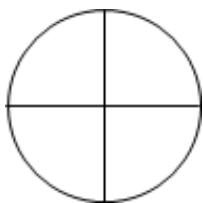

# 高中 数学 选择性必修 第二册

# 第四章 数列 4.4\*数学归纳法

# (答案解析)

# 一、填空题（共1题）

1.【填空题】若定义 $f(n)$ 为 $n^{2}+1$ 的各位数字之和（ $n\in N^{*}$ ），如 $13^{2}+1=170$ ，则 $f(13)=1+7+0=8$ ，则 $\sum_{i=1}^{2018}f(f(f(\cdots f(9)\cdots)))=$ \_\_\_\_.

【正确答案】16410

【更多习题信息】

难易度：适中

知识点：找规律

【智慧中小学APP扫码查看完整解析】

text_image

QR code with a central blue logo, likely linking to a digital resource or website.

# 二、复合题（共7题）

2.【复合题】设集合 $S=\{1,2,3,\cdots,n\}(n\geqslant5)$ ，对 S

的每一个4元子集，将其中的元素从小到大排列并取出每个集合中的第2个数，记取出的所有数的和为 $F(n)$ ：

(1)【问答题】求 $F_{(5)}$ 的值;  
(2)【问答题】求证： $\frac{F(n)}{C_{n+1}^{5}}$ 为定值.

【正确答案】

(1)【问答题】在集合 $S = \{1,2,3,4,5\}$ 中，取出的4元子集共有 $C_5^4 = 5$

个，其中以数字2为第2个数的子集有3个，以数字3为第2个数的子集有2个，故 $F_{(5)}$

$$
= 6 + 6 = 1 2.
$$

(2)【问答题】第2个数为k时，则在1，2，3，…，k-1中取一个数排在第1位，在 $k+1$ ， $k+2$ ，…，n 中取出2个数排在后2位置上，因此，第2个数为k的4元子集个数为 $C_{k-1}^{l}C_{n-k}^{2}$

，其中 $2 \leqslant k \leqslant n - 2$ ，所以 $F(n) = 2C_{1}^{I}C_{n-2}^{2} + 3C_{2}^{I}C_{n-3}^{2} + \cdots + (n - 2)C_{n-3}^{I}C_{2}^{2}$

$$
= 2 (C _ {2} ^ {2} C _ {n - 2} ^ {2} + C _ {3} ^ {2} C _ {n - 3} ^ {2} + \dots + C _ {n - 2} ^ {2} C _ {2} ^ {2})
$$

下面证明： $C_{2}^{2}C_{n-2}^{2}+C_{3}^{2}C_{n-3}^{2}+\cdots+C_{n-2}^{2}C_{2}^{2}=C_{n+1}^{5}$

当 n = 5 时，由（1）知等式成立；

假设 $n = k_{(k \geqslant 5)}$ 时，等式成立，即 $C_{2}^{2}C_{k-2}^{2} + C_{3}^{2}C_{k-3}^{2} + \cdots + C_{k-2}^{2}C_{2}^{2} = C_{k+1}^{5}$

则 $n = k + 1$ 时，

$$
C _ {2} ^ {2} C _ {k - 1} ^ {2} + C _ {3} ^ {2} C _ {k - 2} ^ {2} + \dots + C _ {k - 1} ^ {2} C _ {2} ^ {2}
$$

$$
= C _ {2} ^ {2} (C _ {k - 2} ^ {2} + C _ {k - 2} ^ {l}) + C _ {3} ^ {2} (C _ {k - 3} ^ {2} + C _ {k - 3} ^ {l}) + \dots + C _ {k - 2} ^ {2} (C _ {2} ^ {2} + C _ {2} ^ {l}) + C _ {k - 1} ^ {2} C _ {2} ^ {2}
$$

$$
= C _ {2} ^ {2} C _ {k - 2} ^ {2} + C _ {3} ^ {2} C _ {k - 3} ^ {2} + \dots + C _ {k - 2} ^ {2} C _ {2} ^ {2} + (k - 2) C _ {2} ^ {2} + (k - 3) C _ {3} ^ {2} + \dots + 2 C _ {k - 2} ^ {2} + C _ {k - 1} ^ {2}
$$

$$
= C _ {k + 1} ^ {5} + (k + 1) (C _ {2} ^ {2} + C _ {3} ^ {2} + \dots + C _ {k - 1} ^ {2}) ^ {-} (3 C _ {2} ^ {2} + 4 C _ {3} ^ {2} + \dots + k C _ {k - 1} ^ {2})
$$

$$
= C _ {k + 1} ^ {5} + (k + 1) C _ {k} ^ {3} \cdot^ {3} (C _ {3} ^ {3} + C _ {4} ^ {3} + \dots C _ {k} ^ {3})
$$

$$
= C _ {k + 1} ^ {5} + 4 C _ {k + 1} ^ {4} - 3 C _ {k + 1} ^ {4} = C _ {k + 2} ^ {5}
$$

即 $n = k + 1$ 时，等式成立.

故 $\frac{F(n)}{C_{n+1}^5} = 2$

【提示】

(1)【问答题】解析视频请查看最后一题。

【更多习题信息】

难易度：偏难

知识点：数学归纳法运用，组合性质

【智慧中小学APP扫码查看完整解析】

text_image

QR code with a blue logo in the center, likely linking to a digital resource or website.

3.【复合题】已知 $\triangle ABC$ 的三边长都是有理数，求证：

(1)【问答题】cosA是有理数;   
(2)【问答题】对任意正整数 n， $\cos nA$ 和 $\sin A \cdot \sin nA$ 是有理数.

【正确答案】

(1)【问答题】由AB、BC、AC为有理数及余弦定理知

$$
\cos A = \frac {A B ^ {2} + A C ^ {2} - B C ^ {2}}{2 A B \cdot A C} \text {是有理数.}
$$

(2)【问答题】用数学归纳法证明 $\cos nA$ 和 $\sin A \cdot \sin nA$ 都是有理数.

①当n=1时，由(1)知 $\cos nA$ 是有理数，

从而有 $\sin A\cdot\sin nA=1-\cos2A$ 也是有理数.

②假设当 $n=k(k\geq1)$ 时，

coskA 和 sinA·sinkA都是有理数.

当 $n=k+1$ 时，

由 $\cos(k+1)A=\cos A\cdot\cos kA-\sin A\cdot\sin kA,$

$$
\sin A \cdot \sin (k + 1) A = \sin A \cdot (\sin A \cdot \cos k A + \cos A \cdot \sin k A) = (\sin A \cdot \sin A) \cdot \cos k A + (\sin A \cdot \sin k A) \cdot \cos A
$$

由①和归纳假设，知 $\cos(k+1)A$ 和 $\sin A\cdot\sin(k+1)A$ 都是有理数.

即当 $n=k+1$ 时，结论成立.

综合①、②可知，对任意 n， $\cos nA$ 和 $\sin A \cdot \sin nA$ 都是有理数.

【提示】

(1)【问答题】解析视频请查看最后一题。

# 【更多习题信息】

难易度：适中

知识点：数学归纳法运用，三角函数

【智慧中小学APP扫码查看完整解析】

text_image

QR code with a blue logo in the center, likely linking to a digital resource or website.

4.【复合题】把圆分成 $n(n \geqslant 3)$

个扇形，设用4种颜色给这些扇形染色，每个扇形恰染一种颜色，并且要求相邻扇形的颜色互不相同，设共有 $f(n)$ 种方法.

(1)【问答题】写出 $f(3)$ ， $f(4)$ 的值；  
(2)【问答题】猜想 $f(n)(n \geqslant 3)$ ，并用数学归纳法证明.

natural_image

Simple geometric diagram of a circle divided into four equal quadrants (no text or labels)

# 【正确答案】

(1)【问答题】 $f(3)=24,f(4)=84$   
(2)【问答题】当 $n \geqslant 4$ 时，首先，对于第1个扇形 $a_{1}$ ，有4种不同的染法，由于第2个扇形 $a_{2}$ 的颜色与 $a_{1}$ 的颜色不同，所以，对于 $a_{2}$ 有3种不同的染法，类似地，对扇形 $a_{3}$ ，…， $a_{n-1}$ 均有3种染法．对于扇形 $a_{n}$ ，用与 $a_{n-1}$

不同的3种颜色染色，但是，这样也包括了它与扇形 $a_{1}$ 颜色相同的情况，而扇形 $a_{1}$ 与扇形 $a_{n}$ 颜色相同的不同染色方法数就是 $f(n-1)$ ，于是可得

$$
f (n) = 4 \times 3 ^ {n - 1} \cdot f (n - 1)
$$

猜想 $f(n) = 3^{n} + (-1)^{n}\cdot 3$

当 $n = 3$ 时，左边 $f(3) = 24$ ，右边 $3^{3} + (-1)^{3} \cdot 3 = 24$ ，所以等式成立

假设 $n = k (k \geqslant 3)$ 时， $f(k) = 3^k + (-1)^k \cdot 3$

则 $n = k + 1$ 时， $f(k + 1) = 4 \times 3^k - f(k) = 4 \times 3^k - 3^k - (-1)^k \cdot 3 = 3^{k+1} + (-1)^{k+1} \cdot 3$

即 $n = k + 1$ 时，等式也成立

综上 $f(n) = 3^n + (-1)^n \cdot 3 (n \geqslant 3)$

点睛：本题考查考查归纳分析能力，考查数学归纳法的应用，属中档题.

【更多习题信息】

难易度：偏难

知识点：数学归纳法运用，排列组合

【智慧中小学APP扫码查看完整解析】

text_image

QR code with a blue logo in the center, likely linking to a digital resource or website.

5.【复合题】已知 $x_{i}>0$ ( $i=1,2,3\cdots n$ )，我们知道 $(x_{1}+x_{2})\left(\frac{1}{x_{1}}+\frac{1}{x_{2}}\right)\geqslant4$ 成立.

(1)【问答题】求证： $(x_{1}+x_{2}+x_{3})\left(\frac{1}{x_{1}}+\frac{1}{x_{2}}+\frac{1}{x_{3}}\right)\geqslant9$ ；  
(2)【问答题】同理我们也可以证明出 $(x_{1} + x_{2} + x_{3} + x_{4})\left(\frac{1}{x_{1}} + \frac{1}{x_{2}} + \frac{1}{x_{3}} + \frac{1}{x_{4}}\right) \geqslant 16$

. 由上述几个不等式，请你猜测一个与有关的不等式，并用数学归纳法证明.

$x_{1} + x_{2} + \cdots + x_{n}$ 和 $\frac{1}{x_{1}} + \frac{1}{x_{2}} + \cdots + \frac{1}{x_{n}} (n \geqslant 2, n \in N^{*})$

【正确答案】

(1)【问答题】

$$
(x _ {1} + x _ {2} + x _ {3}) \left(\frac {1}{x _ {1}} + \frac {1}{x _ {2}} + \frac {1}{x _ {3}}\right) = 3 + \left(\frac {x _ {2}}{x _ {1}} + \frac {x _ {1}}{x _ {2}}\right) + \left(\frac {x _ {3}}{x _ {1}} + \frac {x _ {1}}{x _ {3}}\right) + \left(\frac {x _ {3}}{x _ {2}} + \frac {x _ {2}}{x _ {3}}\right) \geqslant 3 + 2 + 2 + 2 = 9
$$

(2)【问答题】猜想 $(x_{1} + x_{2} + \cdots + x_{n})\left(\frac{1}{x_{1}} + \frac{1}{x_{2}} + \cdots + \frac{1}{x_{n}}\right) \geqslant n^{2}(n \geqslant 2, n \in N^{*})$

证明如下:

①当 n=2 时，由已知得猜想成立；  
②假设当 n = k 时，猜想成立，即 $(x_{1} + x_{2} + \cdots + x_{k})\left(\frac{1}{x_{1}} + \frac{1}{x_{2}} + \cdots + \frac{1}{x_{k}}\right) \geqslant k^{2}$

则当 $n = k + 1$ 时， $(x_{1} + x_{2} + \cdots + x_{k} + x_{k+1})\left(\frac{1}{x_{1}} + \frac{1}{x_{2}} + \cdots + \frac{1}{x_{k}} + \frac{1}{x_{k+1}}\right)$

$$
= \left(x _ {1} + x _ {2} + \dots + x _ {k}\right) \left(\frac {1}{x _ {1}} + \frac {1}{x _ {2}} + \dots + \frac {1}{x _ {k}}\right) + \left(x _ {1} + x _ {2} + \dots + x _ {k}\right) \frac {1}{x _ {k + 1}} + x _ {k + 1} \left(\frac {1}{x _ {1}} + \frac {1}{x _ {2}} + \dots + \frac {1}{x _ {k}}\right) + 1 \quad \geqslant k ^ {2}
$$

$$
+ \left(x _ {1} + x _ {2} + \dots + x _ {k}\right) \frac {1}{x _ {k + 1}} + x _ {k + 1} \left(\frac {1}{x _ {1}} + \frac {1}{x _ {2}} + \dots + \frac {1}{x _ {k}}\right) + 1
$$

$$
= k ^ {2} + \left(\frac {x _ {1}}{x _ {k + 1}} + \frac {x _ {k + 1}}{x _ {1}}\right) + \left(\frac {x _ {2}}{x _ {k + 1}} + \frac {x _ {k + 1}}{x _ {2}}\right) + \dots + \left(\frac {x _ {2}}{x _ {k + 1}} + \frac {x _ {k + 1}}{x _ {2}}\right) + 1,
$$

$$
\geqslant k ^ {2} + 2 + 2 + \dots + 2 + 1 = k ^ {2} + 2 k + 1 = (k + 1) ^ {2}
$$

所以当 $n = k + 1$ 时原式成立.

综合①②可知，猜想成立.

【提示】

(1)【问答题】解析视频请查看最后一题。

【更多习题信息】

难易度：偏难

知识点：数学归纳法运用，重要不等式

【智慧中小学APP扫码查看完整解析】

text_image

QR code with a blue logo in the center, likely linking to a digital resource or website.

6.【复合题】设数列 $\{a_{n}\}$ 满足 $a_{1}=3,\quad a_{n+1}=3a_{n}-4n$

(1)【问答题】计算 $a_{2}$ ， $a_{3}$ ，猜想 $\{a_{n}\}$ 的通项公式并加以证明；  
(2)【问答题】令 $b_{n}=a_{n}^{2}$ ， $n\in N^{*}$ ，证明： $\frac{1}{b_{1}}+\frac{1}{b_{2}}+\frac{1}{b_{3}}+\cdots+\frac{1}{b_{n}}<\frac{1}{4}$

【正确答案】

(1)【问答题】由 $a_{1}=3,\quad a_{n+1}=3a_{n}-4n$

得 $a_2 = 3a_1 - 4 = 3 \times 3 - 4 = 5, a_3 = 3a_2 - 4 \times 2 = 3 \times 5 - 8 = 7$

猜想 $\{a_{n}\}$ 的通项公式为 $a_{n}=2n+1$

下面利用数学归纳法证明：

当 n=1 时， $a_{1}=3$ 成立；

假设当 $n = k \quad (k \in \mathbb{N}, k \geqslant 1)$ 时成立，即 $a_{k} = 2k + 1$ ，

则当 $n = k + 1$ 时， $a_{k+1} = 3a_k - 4k = 3(2k + 1) - 4k = 2k + 3 = 2(k + 1) + 1$ 。

∴当 $n = k + 1$ 时结论成立.

综上所述，对于任意 $n \in \mathbb{N}$ ，有 $a_{n} = 2n + 1$ ；

(2)【问答题】证明： $b_{n}=a_{n}^{2}=(2n+1)^{2}=4n^{2}+4n+1>4n(n+1)$ ，

$$
\therefore \frac {1}{b _ {n}} <   \frac {1}{4 n (n + 1)} = \frac {1}{4} (\frac {1}{n} - \frac {1}{n + 1})
$$

则 $\frac{1}{b_1} +\frac{1}{b_2} +\frac{1}{b_3} +\dots +\frac{1}{b_n} <  \frac{1}{4}\left[\left(1 - \frac{1}{2}\right) + \left(\frac{1}{2} -\frac{1}{3}\right) + \dots +\left(\frac{1}{n} -\frac{1}{n + 1}\right)\right] = \frac{1}{4}\left(1 - \frac{1}{n + 1}\right) <   \frac{1}{4}.$

【提示】

(1)【问答题】解析视频请查看最后一题。

# 【更多习题信息】

难易度：适中

知识点：数学归纳法运用，裂项相消

【智慧中小学APP扫码查看完整解析】

text_image

QR code with a blue logo in the center, likely linking to a digital resource or website.

7.【复合题】已知2条直线将一个平面最多分成4部分，3条直线将一个平面最多分成7部分，4条直线将一个平面最多分成11部分，……；n 条直线将一个平面最多分成 $C_{n}^{0} + C_{n}^{1} + C_{n}^{2}$ 个部分（n > 1）

(1)【问答题】试猜想: $n$ 个平面最多将空间分成多少个部分 $(n > 2)$ ?  
(2)【问答题】试证明（1）中猜想的结论.

# 【正确答案】

(1)【问答题】猜想：n 个平面最多将空间分成 $C_{n}^{0} + C_{n}^{1} + C_{n}^{2} + C_{n}^{3}$ 个部分（n > 2）；  
(2)【问答题】证明：设 n 个平面可将空间最多分成 $f(n)$ 个部分，

当n=3时,3个平面可将空间分成8个部分， $C_{3}^{0}+C_{3}^{1}+C_{3}^{2}+C_{3}^{3}=8$ ，所以结论成立.

假设当 $n=k$ 时， $f_{(k)}=C_{k}^{0}+C_{k}^{1}+C_{k}^{2}+C_{k}^{3}$ ，则当 $n=k+1$ 时，第 $k+1$ 个平面必与前面的k个平面产生k条交线，而由已知，这k条交线把第 $k+1$ 个平面最多分成 $C_{k}^{0}+C_{k}^{1}+C_{k}^{2}$ 个部分，且每一部分将原有的空间分成两个部分，所以

$$
\begin{array}{l} f (k + 1) = f (k) + C _ {k} ^ {0} + C _ {k} ^ {1} + C _ {k} ^ {2} = (C _ {k} ^ {0} + C _ {k} ^ {1} + C _ {k} ^ {2} + C _ {k} ^ {3}) + (C _ {k} ^ {0} + C _ {k} ^ {1} + C _ {k} ^ {2}) \\ = C _ {k + 1} ^ {0} + (C _ {k} ^ {l} + C _ {k} ^ {0}) + (C _ {k} ^ {2} + C _ {k} ^ {l}) + (C _ {k} ^ {3} + C _ {k} ^ {2}) = C _ {k + 1} ^ {0} + C _ {k + 1} ^ {l} + C _ {k + 1} ^ {2} + C _ {k + 1} ^ {3} \\ \end{array}
$$

因此，当 $n = k + 1$ 时，结论成立.由数学归纳法原理可知，对 $n\in N^{*}$ 且 $n > 2$ ，得证

# 【提示】

(1)【问答题】解析视频请查看最后一题。

【更多习题信息】

难易度：适中

知识点：数学归纳法运用，排列组合

【智慧中小学APP扫码查看完整解析】

text_image

QR code with a blue logo in the center, likely linking to a digital resource or website.

8.【复合题】在数列 $\{a_{n}\}$ 中， $a_1 = 1$ 且 $a_{n + 1} = a_n + \frac{l}{n(n + 1)}$

(1)【问答题】求出 $a_{2}$ ， $a_{3}$ ， $a_{4}$ ；  
(2)【问答题】归纳出数列 $\{a_{n}\}$ 的通项公式，并用数学归纳法证明归纳出的结论.

【正确答案】

(1)【问答题】由 $a_{1}=1,\quad a_{n+1}=a_{n}+\frac{1}{n(n+1)}$

可得 $a_2 = a_1 + \frac{1}{1\times 2} = \frac{3}{2}, a_3 = a_2 + \frac{1}{2\times 3} = \frac{5}{3}, a_4 = a_3 + \frac{1}{3\times 4} = \frac{7}{4}$

(2)【问答题】猜想数列 $\{a_{n}\}$ 的通项公式为 $a_{n} = \frac{2n - 1}{n}$

用数学归纳法证明如下:

（i）当 $n = 1$ 时，左边 $= a_{1} = 1$ ，右边 $= \frac{2\times 1 - 1}{1} = 1$

∴左边=右边即猜想成立;

（ii）假设当 $n = k$ 时，猜想成立，即有 $a_{k} = \frac{2k - 1}{k}$

那么当 $n = k + 1$ 时，

$$
a _ {k + 1} = a _ {k} + \frac {1}{k \times (k + 1)} = \frac {2 k - 1}{k} + \frac {1}{k \times (k + 1)} = \frac {2 k + 1}{k + 1} = \frac {2 (k + 1) - 1}{k + 1}
$$

从而猜想对 $n = k + 1$ 也成立；

由（i）（ii）可知，猜想对任意的 $n \in N^{*}$ 都成立，

所以数列 $\{a_{n}\}$ 的通项公式为 $a_{n}=\frac{2n-1}{n}$ .

【提示】

(1)【问答题】解析视频请查看最后一题。

【更多习题信息】

难易度：适中

知识点：数学归纳法运用，递推公式

【智慧中小学APP扫码查看完整解析】

text_image

QR code with a blue logo in the center, likely linking to a digital resource or website.

# 三、问答题（共1题）

9.【问答题】设 $m, n \in N^{*}, n \geqslant m$ ，求证： $(m + 1)C_{m}^{m} + (m + 2)C_{m+1}^{m} + (m + 3)C_{m+2}^{m} + \cdots + nC_{n-1}^{m} + (n + 1)C_{n}^{m} = (m + 1)C_{n+2}^{m+2}$

【正确答案】证明(数学归纳法)：对任意的 $m \in N^{*}$ ，

①当 n=m 时，左边 $=(m+1)C_{m}^{m}=m+1$ ，右边 $=(m+1)C_{m+2}^{m+2}=m+1$ ，等式成立.  
②假设 $n = k_{(k \geqslant m)}$ 时命题成立，即 $(m + 1)\mathrm{C}_{m}^{m} + (m + 2)\mathrm{C}_{m+1}^{m} + (m + 3)\mathrm{C}_{m+2}^{m} + \cdots +$

$$
k \mathrm{C} _ {k - 1} ^ {m} + (k + 1) \mathrm{C} _ {k} ^ {m} = (m + 1) \mathrm{C} _ {k + 2} ^ {m + 2},
$$

当 $n = k + 1$ 时，左边 $=(m + 1)\mathrm{C}_{m}^{m} + (m + 2)\mathrm{C}_{m+1}^{m} + (m + 3)\mathrm{C}_{m+2}^{m} + \cdots + k\mathrm{C}_{k-1}^{m} + (k + 1)\mathrm{C}_{k}^{m} +$

$$
(k + 2) \mathrm{C} _ {k + 1} ^ {m}
$$

$$
= (m + 1) \mathbf {C} _ {k + 2} ^ {m + 2} + (k + 2) \mathbf {C} _ {k + 1} ^ {m}.
$$

又由于右边 $= (m + 1)\mathbf{C}_{k + 3}^{m + 2}$ ，而 $(m + 1)\mathbf{C}_{k + 3}^{m + 2} - (m + 1)\mathbf{C}_{k + 2}^{m + 2} = (m + 1)$

$$
\left[ \frac {(k + 3) !}{(m + 2) ! (k - m + 1) !} - \frac {(k + 2) !}{(m + 2) ! (k - m) !} \right] =
$$

$$
(m + 1) \times \frac {(k + 2) !}{(m + 2) ! (k - m + 1) !} [ k + 3 - (k - m + 1) ] = (k + 2) \frac {(k + 1) !}{m ! (k - m + 1) !} = (k + 2) \mathbf {C} _ {k + 1} ^ {m}.
$$

因此 $(m + 1)\mathrm{C}_{k + 2}^{m + 2} + (k + 2)\mathrm{C}_{k + 1}^{m} = (m + 1)\mathrm{C}_{k + 3}^{m + 2}$ ，因此左边 $=$ 右边，因此 $n = k + 1$ 时命题也成立.

综合①②可得命题对任意 $n \geqslant m$ 均成立.

【更多习题信息】

难易度：偏难

知识点：数学归纳法运用，组合性质

【智慧中小学APP扫码查看完整解析】

text_image

QR code with a blue logo in the center, likely linking to a digital resource or website.

