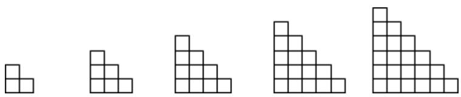

# 高中 数学 选择性必修 第二册

# 第四章 数列 4.2 等差数列

# 4.2.2等差数列的前n项和公式

# (答案解析)

# 一、单选题（共4题）

1.【单选题】等差数列 $\{a_{n}\}$ 的前 $n$ 项和为 $S_{n}$ ， $a_{5} = 7, a_{n-4} = 29, S_{n} = 198$ ，则 $n = (\quad)$

A. 10   
B. 11   
C. 12   
D. 13

【正确答案】B

【更多习题信息】

难易度：适中

知识点：等差数列前n项和公式、等差数列的通项公式

【智慧中小学APP扫码查看完整解析】

text_image

QR code with a blue logo in the center, likely linking to a digital resource or website.

2.【单选题】若 $\{a_{n}\}$ 是等差数列，首项 $a_{1}>0,\quad a_{2021}+a_{2022}>0,\quad a_{2021}a_{2022}<0$ ，则使前n项和 $S_{n}>0$ 成立的最大自然数n是（）

A. 4041   
B. 4042

C. 4043   
D. 4044

【正确答案】B

【更多习题信息】

难易度：适中

知识点：等差数列前n项和公式、等差数列的通项公式

【智慧中小学APP扫码查看完整解析】

text_image

QR code with a blue logo in the center, likely linking to a digital resource or website.

3.【单选题】已知数列 $\{a_{n}\}$ 是等差数列， $\frac{S_{3}}{S_{6}}=\frac{1}{3}$ ，则 $\frac{S_{6}}{S_{12}}=$ （）

A. $\frac{3}{10}$   
B. $\frac{l}{3}$   
C. $\frac{l}{8}$   
D. $\frac{l}{9}$

【正确答案】A

【更多习题信息】

难易度：适中

知识点：等差数列前n项和公式、等差数列前n项和性质

【智慧中小学APP扫码查看完整解析】

text_image

QR code with a blue logo in the center, likely linking to a digital resource or website.

4.【单选题】《九章算术》是我国秦汉时期一部杰出的数学著作，书中第三章“衰分”有如下问题：“今有大夫、不更、簪裹、上造、公士，凡五人，共出百钱。欲令高爵出少，以次渐多，问各几何？”意思是：“有大夫、不更、簪裹、上造、公士（爵位依次变低）5个人共出100钱，按照爵位从高到低每人所出钱数成递增等差数列，这5个人各出多少钱？”在这个问题中，若不更出17钱，则公士出的钱数为（ ）

A. 10   
B. 14   
C. 23   
D. 26

【正确答案】D

【更多习题信息】

难易度：适中

知识点：等差数列前n项和公式

【智慧中小学APP扫码查看完整解析】

text_image

QR code with a blue logo in the center, likely linking to a digital resource or website.

# 二、填空题（共5题）

5.【填空题】若函数 $f(n)=|n-1|+|n-2|+|n-3|+\cdots+|n-20|$ ，其中n是正整数，则 $f(n)$ 的最小值是\_\_\_\_.

【正确答案】100

【更多习题信息】

难易度：适中

知识点：等差数列前n项和公式、等差数列的通项公式

【智慧中小学APP扫码查看完整解析】

text_image

QR code with a blue logo in the center, likely linking to a digital resource or website.

6.【填空题】已知各项均为正数的数列 $\{a_{n}\}$ 的前n项和为 $S_{n}$ ，且满足 $a_{n}a_{n+1}=2S_{n}(n\in N^{*})$ ，则 $a_{2}+a_{4}+a_{6}+\ldots+a_{66}=$ \_\_\_\_

【正确答案】1122

【更多习题信息】

难易度：适中

知识点：等差数列前n项和公式

【智慧中小学APP扫码查看完整解析】

text_image

QR code with a blue logo in the center, likely linking to a digital resource or website.

7.【填空题】设等差数列 $\{a_{n}\}$ 的前n和为 $S_{n}$ ，且 $S_{m-1}=-4,S_{m}=0,S_{m+1}=5$ ，则 $m=$ \_\_\_\_

【正确答案】9

【更多习题信息】

难易度：适中

知识点：等差数列前n项和公式

【智慧中小学APP扫码查看完整解析】

text_image

QR code with a blue logo in the center, likely linking to a digital resource or website.

8.【填空题】设数列 $\{a_{n}\}$ 前n项和为 $S_{n}$ ，若 $a_{1}=1$ ， $2S_{n}^{2}-2S_{n}a_{n}+a_{n}=0(n\geqslant2,n\in\mathbf{N}^{*})$ ，则 $\sum_{i=1}^{n}\frac{1}{S_{i}}=$ \_\_\_\_.

【正确答案】 $n^{2}$

【更多习题信息】

难易度：适中

知识点：等差数列前n项和公式、等差数列的通项公式

【智慧中小学APP扫码查看完整解析】

text_image

QR code with a blue logo in the center, likely linking to a digital resource or website.

9.【填空题】观察下列图形中小正方形的个数，则第10个图中小正方形的个数为\_\_\_\_。

natural_image

Five identical 3x3 grid patterns arranged in ascending and descending rows (no text or symbols)

【正确答案】66

【更多习题信息】

难易度：适中

知识点：等差数列前n项和公式、等差数列的通项公式

【智慧中小学APP扫码查看完整解析】

text_image

QR code with a blue logo in the center, likely linking to a digital resource or website.

# 三、复合题（共1题）

10.【复合题】已知数列 $\{a_{n}\}$ 满足 $a_{1}+2a_{2}+3a_{3}+\cdots+na_{n}=5n$ ，数列 $\{b_{n}\}$ 满足对任意正整数m 均有 $b_{m}+b_{m+1}+b_{m+2}=\frac{1}{a_{m}}$ 成立.

(1)【问答题】求 $\{a_{n}\}$ 的通项公式;  
(2)【问答题】求 $\{b_{n}\}$ 的前30项和.

【正确答案】

(1)【问答题】解：对任意的 $n\in N^{*}$ ， $a_{1}+2a_{2}+3a_{3}+\cdots+n_{a_{n}}=5n$

当n=1时，则 $a_{1}=5$ ,

当 $n\geqslant2$ 时，由 $a_{1}+2a_{2}+3a_{3}+\cdots+na_{n}=5n$ 可得 $a_{1}+2a_{2}+\cdots+(n-1)a_{n-1}=5(n-1)$

上述两个等式作差可得 $n_{a_{n}}=5,\quad\therefore a_{n}=\frac{5}{n},$

$a_{1}=5$ 满足 $a_{n}=\frac{5}{n}$ ，因此，对任意的 $n\in N^{*}$ ， $a_{n}=\frac{5}{n}$ .

(2)【问答题】解：设数列 $\{b_{n}\}$ 的前n项和为 $T_{n}$ ，∵ $b_{m}+b_{m+1}+b_{m+2}=\frac{1}{a_{m}}=\frac{m}{5}$

$$
\begin{array}{l} \therefore T _ {3 0} = (b _ {1} + b _ {2} + b _ {3}) + (b _ {4} + b _ {5} + b _ {6}) + \dots + (b _ {2 8} + b _ {2 9} + b _ {3 0}) = \frac {1}{5} + \frac {4}{5} + \dots + \frac {2 8}{5} = \frac {1 0 \times \left(\frac {1}{5} + \frac {2 8}{5}\right)}{2} \\ = 2 9. \end{array}
$$

【提示】

(1)【问答题】解析视频请查看最后一题。

【更多习题信息】

难易度：适中

知识点：等差数列前n项和公式、等差数列的通项公式

【智慧中小学APP扫码查看完整解析】

text_image

QR code with a blue logo in the center, likely linking to a digital resource or website.

