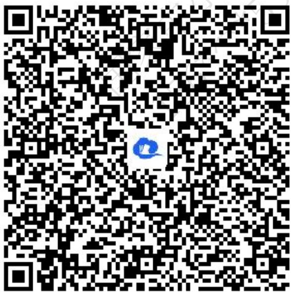
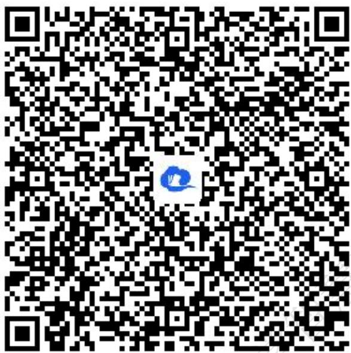
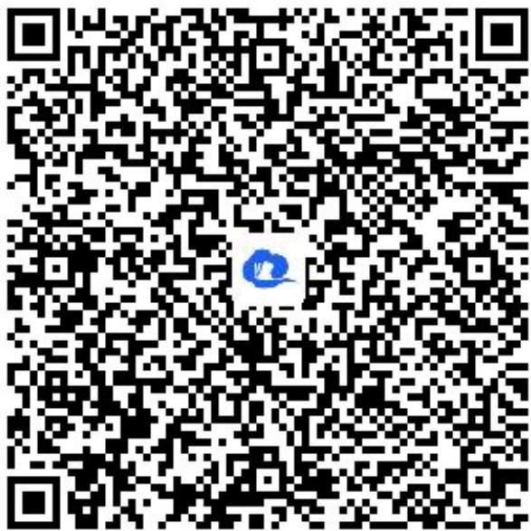
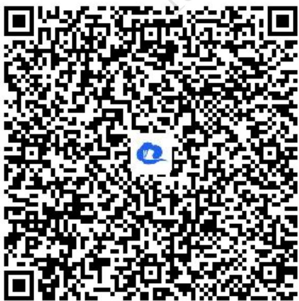
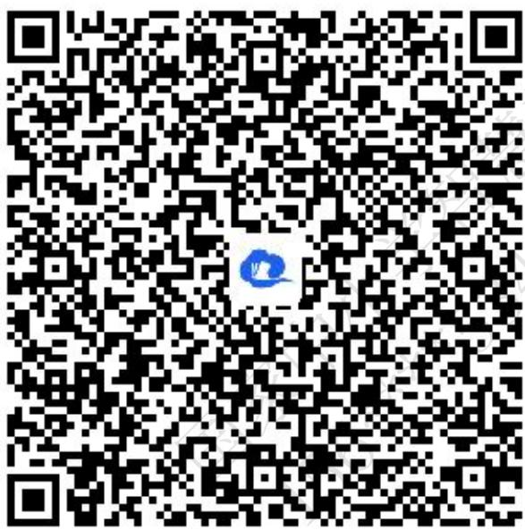
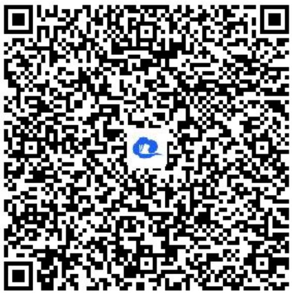
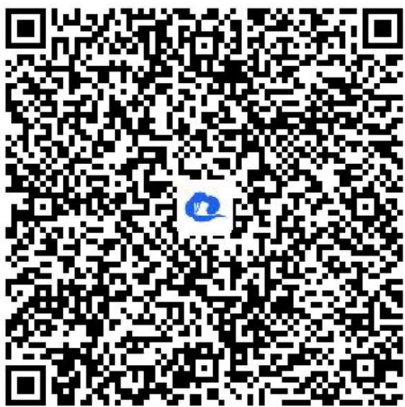
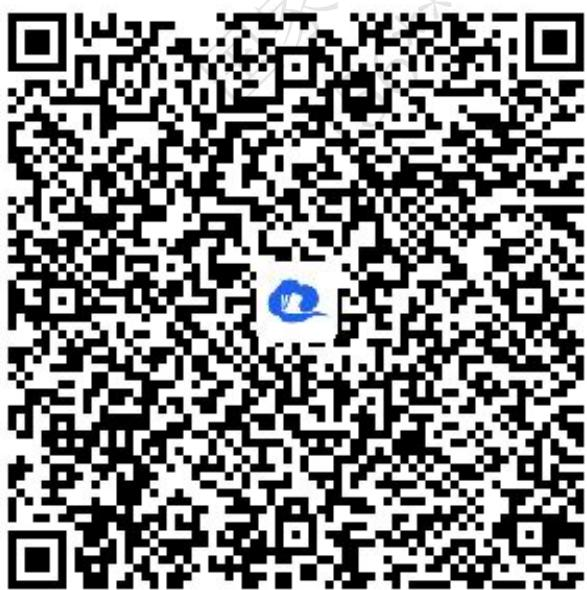
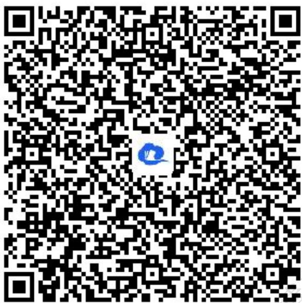
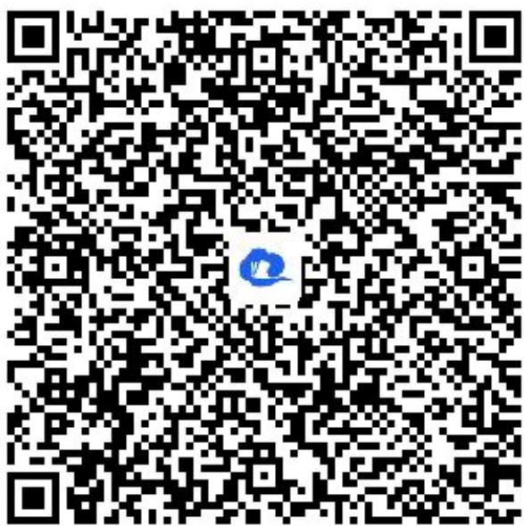

# 高中 数学 选择性必修 第二册

# 第四章 数列 4.2 等差数列

# 4.2.1等差数列的概念

# (答案解析)

# 一、单选题（共4题）

1.【单选题】下列数列不是等差数列的是（）

A. 0, 0, 0, …, 0, …   
B. -2, -1, 0, …, n - 3, …   
C. 1, 3, 5, …, 2n - 1, …   
D. 0, 1, 3, …, $\frac{n^2 - n}{2}$ , …

【正确答案】D

【更多习题信息】

难易度：简单

知识点：等差数列的概念

【智慧中小学APP扫码查看完整解析】

text_image

QR code with a blue logo in the center, likely linking to a digital resource or website.

2.【单选题】在等差数列 $\{a_{n}\}$ 中，若 $a_4 + \frac{1}{2} a_7 + a_{10} = 10$ ，则 $a_3 + a_{11} =$ （

A. 2   
B. 4

C. 6   
D. 8

【正确答案】D

【更多习题信息】

难易度：适中

知识点：等差数列的概念、等差数列的通项公式、等差数列的性质

【智慧中小学APP扫码查看完整解析】

text_image

QR code with a blue logo in the center, likely linking to a digital resource or website.

3.【单选题】已知在等差数列 $\{a_{n}\}$ 中， $a_{4}+a_{8}=20,a_{7}=12$ ，则 $a_{9}=$ （）

A. 8   
B. 10   
C. 14   
D. 16

【正确答案】D

【更多习题信息】

难易度：适中

知识点：等差数列的概念、等差数列的通项公式、等差数列的性质

【智慧中小学APP扫码查看完整解析】

text_image

QR code with a blue logo in the center, likely linking to a digital resource or website.

4.【单选题】对于数列 $\{a_{n}\}$ ，“ $a_{n} = kn + b$ ”是“数列 $\{a_{n}\}$ 为等差数列”的（）

A. 充分非必要条件;   
B. 必要非充分条件;   
C. 充要条件;   
D. 既非充分又非必要条件.

【正确答案】C

【更多习题信息】

难易度：适中

知识点：等差数列的概念、等差数列的通项公式

【智慧中小学APP扫码查看完整解析】

text_image

QR code with a blue logo in the center, likely linking to a digital resource or website.

# 二、多选题（共3题）

5.【多选题】下列数列中是等差数列的是（）

A. $a - d, a, a + d$   
B. 2, 4, 6, 8, …, $2_{(n-1)}$ , 2n   
C. $a - 2d, a - d, a + d, a + 2d (d \neq 0)$   
D. $a_{n - 1} = a_n - \frac{1}{2} (n\in N^*,n > 1)$

【正确答案】ABD

【更多习题信息】

难易度：简单

知识点：等差数列的概念

【智慧中小学APP扫码查看完整解析】

text_image

QR code with a blue logo in the center, likely linking to a digital resource or website.

6.【多选题】下列数列是等差数列的是（）

A. 0, 0, 0, 0, 0, …   
B. 1, 11, 111, 1, 111, …   
C.-5, -3, -1, 1, 3, …   
D. 1, 2, 3, 5, 8, …

【正确答案】AC

【更多习题信息】

难易度：简单

知识点：等差数列的概念

【智慧中小学APP扫码查看完整解析】  

text_image

QR code with a blue circular logo in the center, likely linking to a digital resource or website.

7.【多选题】若 $\{a_{n}\}$ 是等差数列，则下列数列为等差数列的有（）

A. $\{a_{n}+3\}$   
B. $\{a_n^2\}$   
C. $\{a_{n - 1} + a_n\}$   
D. $\{2a_{n}+n\}$

【正确答案】ACD

【更多习题信息】

难易度：适中

知识点：等差数列的概念、等差数列的性质

【智慧中小学APP扫码查看完整解析】

text_image

QR code with a blue logo in the center, likely linking to a digital resource or website.

# 三、填空题（共3题）

8.【填空题】已知等差数列 $\{a_{n}\}$ 的首项为a，公差为d；等差数列 $\{b_{n}\}$ 的首项为b，公差为e．如果 $c_{n}=a_{n}+b_{n}(n\geq1)$ ，且 $c_{1}=4,\quad c_{2}=8$ ，则 $c_{10}=$ \_\_\_\_.

【正确答案】40

【更多习题信息】

难易度：适中

知识点：等差数列的概念、等差数列的通项公式、等差数列的性质

【智慧中小学APP扫码查看完整解析】

text_image

QR code with a blue logo in the center, likely linking to a digital resource or website.

9.【填空题】已知等差数列 $\{a_{n}\}$ 满足 $a_{4}=a_{1}+a_{2}$ ，且 $a_{1}\neq0$ ，则 $\frac{a_{5}}{a_{1}+a_{3}}=$ \_\_\_\_.

【正确答案】1

【更多习题信息】

难易度：适中

知识点：等差数列的概念、等差数列的通项公式

【智慧中小学APP扫码查看完整解析】

text_image

QR code with a blue logo in the center, likely linking to a digital resource or website.

10.【填空题】数列 $\{a_{n}\}$ 中， $a_{1}=5,\quad a_{n+1}=a_{n}+3$ ，那么这个数列的通项公式是\_\_\_\_。

【正确答案】 $a_{n}=3n+2$

【更多习题信息】

难易度：适中

知识点：等差数列的概念、等差数列的通项公式

【智慧中小学APP扫码查看完整解析】

text_image

QR code with a blue logo in the center, likely linking to a digital resource or website.

