# 第一章集合与常用逻辑用语
## 1.1 集合的概念
### 第1课时 集合的概念
<table><tr><td>课标定位素养阐释</td><td>1.通过实例,了解集合的含义.
##### 2.掌握集合中元素的三个特性.
##### 3.理解元素与集合的属于关系,并能用符号“∈”或“∉”来表示.
##### 4.记住常用的数集及其记法.
##### 5.体会数学抽象的过程,加强逻辑推理与数学运算素养的培养.</td></tr></table>
### 新知导学
### 一、元素与集合的概念
##### 1. 阅读下面的例子，并回答提出的问题：
① 在平面直角坐标系中,第四象限的点的全体;  
② 方程  $x^{2} - 1 = 0$  的所有实数根；  
(3) 某校高一(1)班所有跑得快的女生.
(1)以上各例子中要研究的对象分别是什么？
(2)哪个例子中的对象不确定?为什么?
提示 (1)分别为点、实数根、女生.
(2)③中的对象不确定.因为“跑得快”没有明确的划分标准
##### 2. 一般地,我们把研究对象统称为元素,通常用小写拉丁字母  $a, b, c, \ldots$  表示。把一些元素组成的总体叫做集合(简称为集),通常用大写拉丁字母  $A, B, C, \ldots$  表示集合。
### 二、集合中元素的特性
##### 1.英文单词good的所有字母能否组成一个集合?若能组成一个集合,则该集合中有几个元素?为什么?
提示 能,因为集合中的元素是确定的(确定性);3个元素,因为集合中的元素是互不相同的 (互异性).
##### 2.分别由元素1,2,3和3,2,1组成的两个集合有何关系?集合中的元素有没有先后顺序？
提示 两个集合相等.只要构成两个集合的元素是一样的,我们就称这两个集合是相等的.也就是说集合中的元素没有先后顺序(无序性).
##### 3. 集合中元素的特性: 确定性、互异性、无序性。只要构成两个集合的元素是一样的, 我们就称这两个集合是相等的。
##### 4. 下列各组对象不能组成集合的是( )
$\quad$A.大于6的所有整数  
$\quad$B.某课本中所有的简单题  
$\quad$C.被3除余2的所有正整数  
$\quad$D.函数  $y = x$  图象上的所有点

<span class="fake-tag">答案</span> B
### 三、元素与集合的关系
##### 1. 设集合  $A$  表示“1~10的所有奇数”，3和4与集合  $A$  是什么关系？
提示 3是集合  $A$  中的元素,即3属于集合  $A$ ,记作  $3 \in A;4$  不是集合  $A$  中的元素,即4不属于集合  $A$ ,记作  $4 \notin A$ .
##### 2. 如果  $a$  是集合  $A$  的元素, 就说  $a$  属于集合  $A$ , 记作  $a \in A$ ; 如果  $a$  不是集合  $A$  中的元素, 就说  $a$  不属于集合  $A$ , 记作  $a \notin A$ .
### 四、常用的数集及其记法
##### 1.非负整数集与正整数集有什么区别？
提示 非负整数集包括0,而正整数集不包括0.
##### 2. 常用数集的字母表示
<table><tr><td>数集名称</td><td>非负整数集(自然数集)</td><td>正整数集</td><td>整数集</td><td>有理数集</td><td>实数集</td></tr><tr><td>字母表示</td><td>N</td><td colspan="2">N*或N+Z</td><td>Q</td><td>R</td></tr></table>
##### 3.若  $a\in \mathbf{Q}$  ，则有  $a\in \mathbf{R}$  吗？反过来呢？
提示 若  $a \in \mathbf{Q}$ , 则有  $a \in \mathbf{R}$ ; 反过来, 若  $a \in \mathbf{R}$ , 则不一定有  $a \in \mathbf{Q}$ .
##### 4.用符号“∈”或“∈”填空
(1)1  $\mathbf{N}^{*}$
(2)-3 N;
(3)0 Z;
(4)  $\sqrt{3}$  ________ Q;
(5)-  $\frac{1}{2}$  R.

<span class="fake-tag">答案</span> (1)
1)∈ (2)∈
(3)∈
(4)
(5)∈
### 【思考辨析】
判断下列说法是否正确,正确的在后面的括号内打“√”,错误的打“×”。
(1)某班所有学生的姓氏能组成集合. (✓)  
(2)方程  $x^{2} - 2x + 1 = 0$  的解集中含有2个元素  $(\times)$  
(3)改变一个集合中元素的顺序,所得集合仍与原来的集合相等. (✓)
### 释疑解惑
### 探究一集合的判定
【例 1】判断下列每组对象能否组成一个集合:
(1)等边三角形的全体;(2)小于2的所有整数;  
(3)所有无理数; (4)著名的数学家
解 (1)任给一个三角形,可以明确地判断是不是等边三角形,故“等边三角形的全体”能组成集合;类似地,(2)能组成集合;(3)能组成集合;(4)“著名的数学家”无明确的判断标准,因此不能组成集合.

### 反思感悟
一般地, 确认一组对象  $a_{1}, a_{2}, a_{3}, \ldots, a_{n}$  能否组成集合的具体过程如下.
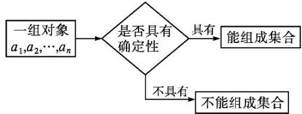
【变式训练 1】(多选题)下列各组对象能组成一个集合的是( )
$\quad$A.在数轴上与原点非常近的点  
$\quad$B.在平面直角坐标系中,所有横坐标与纵坐标相等的点  
$\quad$C.所有不小于3的正整数  
$\quad$D.高一年级视力比较好的同学

<span class="fake-tag">解析</span> 对于A选项中的“非常近”标准不明确，故不能组成集合；同理D选项中的“视力比较好”标准也不明确，而B,C选项中的对象都是明确的，故A,D选项中的对象均不能组成集合,B,C选项中的对象能组成集合.

<span class="fake-tag">答案</span> BC
### 探究二元素与集合的关系
##### 【例2】给出下列四个关系:  $\sqrt{2} \in \mathbf{Q}, 0.7 \notin \mathbf{N}, 0 \in \mathbf{N}^{*}, \sqrt{9} \in \mathbf{Z}$ , 其中正确的有( )
$\quad$A.4 个
$\quad$B.3个
$\quad$C.2 个
$\quad$D.1 个

<span class="fake-tag">解析</span> 因为  $\sqrt{2}$  是无理数, 所以  $\sqrt{2} \in \mathbf{Q}$  错误; 因为 0.7 不是自然数, 所以  $0.7 \notin \mathbf{N}$  正确; 0 不是正整数, 故  $0 \in \mathbf{N}^{*}$  错误;  $\sqrt{9} = 3$ , 而 3 是整数, 故  $\sqrt{9} \in \mathbf{Z}$  正确. 故选 C.

<span class="fake-tag">答案</span> C

### 反思感悟
判断一个元素是不是某个集合的元素,关键是判断这个元素是否具有这个集合的元素的共同特征.
【变式训练2】用符号“∈”或“∈”填空：
$\sqrt{4}$ $\mathbf{N}^{*},3.7$  Z,3.14  $\mathbf{Q},\frac{\pi}{2}$  R.

<span class="fake-tag">解析</span> 因为  $\sqrt{4} = 2$  ，所以  $\sqrt{4} \in \mathbf{N}^{*}$
因为3.7不是整数,所以  $3.7 \notin \mathbf{Z}$ ;
因为3.14是有理数，所以  $3.14\in \mathbf{Q}$
因为  $\pi$  是实数, 所以  $\frac{\pi}{2} \in \mathbf{R}$ .

<span class="fake-tag">答案</span>  $\in \notin \in \in$
### 探究三集合中元素的特性及
### 其应用
##### 【例3】已知集合  $A$  中只含有  $a - 3$  和  $2a - 1$  两个元素，若  $-3\in A$  ，试求实数  $a$  的值
解 由题意,知-3=a-3或-3=2a-1.
若-3=a-3,则  $a = 0$  此时集合A中只含有-3,-1两个元素，符合题意；
若-3=2a-1,则  $a = -1$ .此时集合A中只含有-4,-3两个元素,符合题意.
综上所述，  $a = 0$  或  $a = -1$
### 延伸探究
##### 1. 若将本例中的条件“-3∈A”换成“a∈A”，求实数a的值
解 由题意,知  $a = a - 3$  或  $a = 2a - 1$ , 解得  $a = 1$ , 此时集合  $A$  中只有-2,1两个元素, 符合题意.
故所求  $a$  的值为1.
##### 2. 若将本例中的条件“-3∈A”去掉,求实数  $a$  的取值范围
解 由集合中元素的互异性，
得  $a - 3 \neq 2a - 1$
即  $a \neq -2$ .
故所求  $a$  的取值范围为  $a \neq -2$ .
### 反思感悟
解答此类问题一般是先根据集合中元素的确定性求出元素中所含参数的所有可能的取值,再根据集合中元素的互异性对元素进行检验.
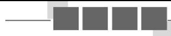
### 易错辨析
因忽视集合中元素的互异性致错
##### 【典例】关于  $x$  的方程  $x^{2} - (a + 1)x + a = 0$  的解集中有几个元素？
错解因为  $x^{2} - (a + 1)x + a = (x - a)(x - 1) = 0$  ，所以方程的解为1,a,则方程的解集中有1,a两个元素
以上解答过程中都有哪些错误?出错的原因是什么?你如何改正?你如何防范?
提示以上错解中没有注意到字母  $a$  的取值带有不确定性.事实上,当  $a = 1$  时,不满足集合中元素的互异性.
正解 因为  $x^{2} - (a + 1)x + a = (x - a)(x - 1) = 0$  ，所以方程的解为1,a.
若  $a = 1$  ，则方程的解集中只有一个元素1;
若  $a \neq 1$ , 则方程的解集中有  $1, a$  两个元素.
### 防范措施
##### 1. 先由解方程得到  $x$  的可能值, 再根据元素的互异性进行检验  
##### 2.在解方程求得  $x$  的值后，不要忘记验证集合中元素的互异性
【变式训练】若一个集合中的三个元素  $a, b, c$  是  $\triangle ABC$  的三边长, 则此三角形一定不是( )
$\quad$A.锐角三角形  
$\quad$B.直角三角形  
$\quad$C.钝角三角形  
$\quad$D.等腰三角形

<span class="fake-tag">解析</span> 根据集合中元素的互异性, 知  $\triangle ABC$  的三边长两两不等, 故选 D.

<span class="fake-tag">答案</span> D
### 随堂练习
##### 1. 下列各组对象可以组成集合的是( )
$\quad$A.相当大的数  
$\quad$B.课本上较难的题目  
$\quad$C.某中学今年所有入校的高一新生  
$\quad$D.某校园中较高的树

<span class="fake-tag">解析</span> “相当大”这个词界限不确定，不明确哪些元素在该集合中，故A不能组成集合；同样B,D也不能组成集合.故选C.

<span class="fake-tag">答案</span> C
##### 2. 设集合  $A$  中只含有一个元素  $a$ , 则有( )
$\quad$A.  $0 \in A$
$\quad$B.aA
$\quad$C.a∈A
$\quad$D.a=A

<span class="fake-tag">解析</span> 因为集合  $A$  中只含有一个元素  $a$ , 所以  $a$  属于集合  $A$ , 即  $a \in A$ .

<span class="fake-tag">答案</span> C
##### 3.用符号“∈”或“∈”填空：
(1)若 \(A\) 表示由所有素数组成的集合,则 \(1 \_ \_ \_ \_ \_ \_ \_ \_ \_ \_ \_ \_ \_ \_ \_ \_ \_ \_ \_ \_ \_ \_ \_ \_ \_ \_ \_ \_ \_ \_ \_ \_ \_ \_ \_ \_ \_ \_ \_ \_ \_ \_ \_ \_ \_ \_ \_ \_ \_ \_ \_
A,2
A,3
$\quad$A.
(2)  $\frac{3}{2} \_ \_ \_ \_ \_ \mathbf{Z}, \frac{\sqrt{3}}{3} \_ \_ \_ \_ \_ \mathbf{R}, \sqrt{16} \_ \_ \_ \_ \_ \mathbf{N}$ .

<span class="fake-tag">解析</span> (1)由2,3为素数，1不是素数，得  $1\notin A,2\in A,3\in A.$
(2)由  $\frac{3}{2}$  不是整数,  $\frac{\sqrt{3}}{3}$  是实数,  $\sqrt{16}$  是自然数,
得  $\frac{3}{2} \notin \mathbf{Z}, \frac{\sqrt{3}}{3} \in \mathbf{R}, \sqrt{16} \in \mathbf{N}$ .

<span class="fake-tag">答案</span> (1)  $\notin$ $\in$ $(2)\notin$ $\in$
##### 4. 以方程  $x^{2} - 6x - 7 = 0$  和方程  $x^{2} - x - 2 = 0$  的实数根为元素的集合中共有 ______ 个元素.

<span class="fake-tag">解析</span> 方程  $x^{2} - 6x - 7 = 0$  的实数根是-1,7;方程  $x^{2} - x - 2 = 0$  的实数根是-1,2.
由集合元素的互异性,知以这两个方程的实数根为元素的集合中共有3个元素

<span class="fake-tag">答案</span> 3
##### 5.已知集合  $M$  中含有3个元素:  $0, x^{2}, -x$ , 求  $x$  满足的条件
解 根据集合中元素的互异性, 知  $\left\{ \begin{array}{l} x^{2} \neq 0, \\ -x \neq 0, \\ x^{2} \neq -x, \end{array} \right.$  得  $\left\{ \begin{array}{l} x \neq 0, \\ x \neq -1. \end{array} \right.$
故  $x$  满足的条件为  $x \neq 0$ , 且  $x \neq -1$ .
### 巩固提升
### 1. 下列说法正确的是( )
$\quad$A.  $\sqrt{2} \in \mathbf{N}$
$\quad$B.-1EN
$\quad$C.  $\frac{1}{2} \in \mathbf{N}$
$\quad$D.  $9 \in \mathbf{N}$

<span class="fake-tag">解析</span> 因为集合  $\mathbf{N}$  表示非负整数集, 所以  $\sqrt{2}, -1, \frac{1}{2}$  不是集合  $\mathbf{N}$  中的元素. 故选 D.

<span class="fake-tag">答案</span> D
##### 2. 已知集合  $A$  中只含有  $1, a^{2}$  两个元素, 则实数  $a$  不能取 ( )
$\quad$A.1
$\quad$B.-1
$\quad$C.-1和1
$\quad$D.1或-1

<span class="fake-tag">解析</span> 由集合中元素的互异性,知  $a^2 \neq 1$ , 即  $a \neq \pm 1$

<span class="fake-tag">答案</span> C
##### 3. 下列对象能组成集合的是( )
$\quad$A.高一年级中数学成绩较好的学生  
$\quad$B.与  $30^{\circ}$  角很接近的角  
$\quad$C.很大的自然数  
$\quad$D.平面内到  $\triangle ABC$  三个顶点距离相等的点

<span class="fake-tag">解析</span> 对于A,高一年级中数学成绩较好的学生，因为较好的标准不确定，所以不满足集合中元素的确定性，故A错误；
对于B,因为与  $30^{\circ}$  角很接近的角标准不确定,所以不满足集合中元素的确定性,故B错误;
对于C,很大的自然数,因为很大的自然数标准不确定,所以不满足集合中元素的确定性,故C错误;
对于D,平面内到  $\triangle ABC$  三个顶点距离相等的点,是  $\triangle ABC$  外接圆的圆心,满足集合的定义,D正确,故选D.

<span class="fake-tag">答案</span> D
##### 4.(多选题)给出下列说法,其中正确的是( )
$\quad$A. 集合  $\mathbf{N}$  中最小的数是 1  
$\quad$B.若  $-a\not\in\mathbf{N}$  ，则  $a\in \mathbf{N}$  
$\quad$C.若  $a\in \mathbf{N},b\in \mathbf{N}$  ，且  $a\neq b$  ，则  $a + b$  的最小值是1  
$\quad$D.若  $a\not\in\mathbf{R},$  则  $a\not\in\mathbf{Q}$

<span class="fake-tag">解析</span> 集合N是自然数集,其中最小的数是0,故A错误;  $-\sqrt{2} \notin \mathbf{N}$ ,且  $\sqrt{2} \notin \mathbf{N}$ ,故B错误;因为  $a \in \mathbf{N}, b \in \mathbf{N}$ ,且  $a \neq b$ ,所以  $a + b$  的最小值是1,故C正确;若一个数不是实数,则这个数一定不是有理数,故D正确.

<span class="fake-tag">答案</span> CD
##### 5.已知集合  $A$  中含有1和  $a^2 + a + 1$  两个元素，且  $3 \in A$  ，则  $a^3$  的值为( )
$\quad$A.0
$\quad$B.1
$\quad$C.-8
$\quad$D.1或-8

<span class="fake-tag">解析</span>  $\because 3 \in A, \therefore a^2 + a + 1 = 3$ ，即  $a^2 + a - 2 = 0$ ，即  $(a + 2)(a - 1) = 0$ ，解得  $a = -2$  或  $a = 1$ .
当  $a = 1$  时， $a^3 = 1$ ；当  $a = -2$  时， $a^3 = -8$ .
即  $a^3 = 1$  或  $a^3 = -8$

<span class="fake-tag">答案</span> D
##### 6.由英文字母 “b”“e”“e”组成的集合含有________个元素。

<span class="fake-tag">解析</span>因为集合中的元素具有互异性，所以由英文字母“b”“e”“e”组成的集合只含有“b”“e”两个元素.

<span class="fake-tag">答案</span> 2
##### 7. 以方程  $x^{2} - 5x + 6 = 0$  和  $x^{2} - 6x + 9 = 0$  的解为元素的集合中, 所有元素之和等于

<span class="fake-tag">解析</span> 因为方程  $x^{2} - 5x + 6 = 0$  的解为  $x = 2$  或  $x = 3$ , 方程  $x^{2} - 6x + 9 = 0$  的解为  $x = 3$ , 且集合中的元素具有互异性, 所以集合中含有两个元素 2 和 3, 元素之和为  $2 + 3 = 5$ .

<span class="fake-tag">答案</span> 5
##### 8.已知集合  $A$  含有两个元素1,2,集合  $B$  表示方程  $x^{2} + ax + b = 0$  的解的集合，且集合  $A$  与集合  $B$  相等，则  $a + b =$

<span class="fake-tag">解析</span>  $\vdots$  集合  $A$  与集合  $B$  相等,且  $1\in A,2\in A,$
$\therefore 1\in B,2\in B,$
$\therefore x_{1} = 1, x_{2} = 2$  是方程  $x^{2} + ax + b = 0$  的两个实数根，
$\therefore \left\{ \begin{array}{l} 1 + 2 = -a, \\ 1 \times 2 = b, \end{array} \right.$  解得  $\left\{ \begin{array}{l} a = -3, \\ b = 2. \end{array} \right.$ $\therefore a + b = -1$ .

<span class="fake-tag">答案</span> -1
##### 9.设  $x\in \mathbf{R}$  ，集合  $A$  中含有三个元素  $3,x,x^{2} - 2x$
(1)求元素  $x$  应满足的条件；  
(2)若-2∈A,求实数  $x$
解 (1)由集合中元素的互异性，得  $x \neq 3$  ，且  $x^{2} - 2x \neq x, x^{2} - 2x \neq 3$  ，解得  $x \neq -1$  ，且  $x \neq 0$  ，且  $x \neq 3$
故元素  $x$  满足的条件为  $x \neq -1$ , 且  $x \neq 0$ , 且  $x \neq 3$ .
(2)若-2∈A,则  $x = -2$  或  $x^{2} - 2x = -2$
因为方程  $x^{2} - 2x + 2 = 0$  无解，所以  $x = -2$
##### 10. 设  $a, b \in \mathbf{R}$ , 集合  $A$  中含有三个元素  $1, a + b, a$ , 集合  $B$  中含有三个元素  $0, \frac{b}{a}, b$ , 且  $A = B$ , 求  $a, b$  的值.
解 由于集合  $B$  中的元素是  $0, \frac{b}{a}, b$ , 故  $a \neq 0, b \neq 0$ .
因为  $A = B$  ，知  $a + b = 0$  ，即  $b = -a$  所以  $\frac{b}{a} = -1.$
故  $a = -1, b = 1$
### 第2课时 集合的表示
<table><tr><td>课标定位素养阐释</td><td>1.针对具体问题,能在自然语言和图形语言的基础上,用符号语言刻画集合.
##### 2.掌握集合的表示方法——列举法和描述法.
##### 3.积累数学抽象的经验,提升逻辑推理与数学运算素养.</td></tr></table>
### 新知导学
### 一、列举法
##### 1. 设集合  $M$  是小于 6 的正整数组成的集合, 集合  $M$  中的元素能一一列举出来吗?  
提示 能.1,2,3,4,5.  
##### 2.上述集合  $M$  除了用自然语言描述外，还可以用什么方式表示呢？如何表示？  
提示 列举法.  $\{1,2,3,4,5\}$  
##### 3. 把集合的所有元素一一列举出来,并用花括号“{}”括起来表示集合的方法叫做列举法.  
##### 4.方程  $x^{2} - 4x + 3 = 0$  的所有实数根组成的集合为( )
$\quad$A.{1,3}  
$\quad$B.{1}  
$\quad$C.  $\{x^{2} - 4x + 3 = 0\}$  
$\quad$D.  $\{x = 1, x = 3\}$

<span class="fake-tag">解析</span> 因为方程  $x^{2} - 4x + 3 = 0$  的实数根为1,3，所以用列举法表示为  $\{1,3\}$  ，故选A.

<span class="fake-tag">答案</span> A
### 二、描述法
##### 1.“大于-2且小于2的整数”组成的集合，能用列举法表示吗？如果能，如何表示？
提示 能.  $\{-1,0,1\}$
##### 2.“大于-2且小于2的实数”组成的集合，能用列举法表示吗？为什么？
提示 不能.因为大于-2且小于2的实数有无数多个,用列举法是列举不完的,所以不能用列举法表示.
##### 3. 设  $x$  为“大于-2且小于2的实数”组成的集合的元素， $x$  有何特征？
提示  $x\in \mathbf{R}$  ，且-2<x<2.
##### 4. 一般地, 设  $A$  是一个集合, 我们把集合  $A$  中所有具有共同特征  $P(x)$  的元素  $x$  所组成的集合表示为  $\{x \in A | P(x)\}$ , 这种表示集合的方法称为描述法.
有时也用冒号或分号代替竖线,写成  $\{x\in A:P(x)\}$  或  $\{x\in A:P(x)\}$ .
##### 5. 下列用描述法表示的集合, 错误的是( )
$\quad$A. 奇数集可以表示为  $\{x \in \mathbf{Z} \mid x = 2k + 1, k \in \mathbf{Z}\}$
$\quad$B. “小于 10 的整数” 组成的集合可以表示为  $\{x \mid x < 10\}$
$\quad$C.“被3除余2的正整数”组成的集合可以表示为  $\{x|x = 3k + 2,k\in \mathbf{N}\}$
$\quad$D.有理数集  $\mathbf{Q} = \left\{x\in R\mid x = \frac{q}{p},p,q\in Z,p\neq 0\right\}$

<span class="fake-tag">解析</span> 选项B,  $\{x|x < 10\}$  表示“小于10的实数”组成的集合。“小于10的整数”组成的集合应该表示为  $\{x \in \mathbf{Z} | x < 10\}$ .

<span class="fake-tag">答案</span> B
### 【思考辨析】
判断下列说法是否正确，正确的在后面的括号内打“√”，错误的打“×”。
(1)用列举法表示集合  $\{x|x^2 - 2x + 1 = 0\}$  为  $\{1,1\}$ . (×)  
(2)集合  $\{(0,1)\}$  中的元素是 0 和 1. (×)
(3)  $\{x \mid x > 3\}$  与  $\{y \mid y > 3\}$  是同一个集合.  
(4) 集合  $\{x \in \mathbf{N} | x < 5\}$  与集合  $\{0,1,2,3,4\}$  表示同一个集合. (√)
### 释疑解惑
### 探究一用列举法表示集
### 合
##### 【例1】用列举法表示下列集合：
(1)方程  $x^{2} - 4x + 4 = 0$  的所有实数根组成的集合；  
(2)由单词“look”的字母组成的集合;  
(3)由不大于8的所有非负偶数组成的集合;  
(4)直线  $y = {2x} - 1$  与  $y$  轴的交点组成的集合.
解 (1)方程  $x^{2} - 4x + 4 = 0$  的实数根为  $x = 2$  ，所求集合为  $\{2\}$ .
(2)单词“look”有三个互不相同的字母，分别为“l”“o”“k”，所求集合为  $\{1,0,k\}$ .  
(3)不大于8的非负偶数有0,2,4,6,8,所求集合为  $\{0,2,4,6,8\}$ .  
(4)直线  $y = 2x - 1$  与  $y$  轴的交点坐标为  $(0, -1)$ , 所求集合为  $\{(0, -1)\}$ .

### 反思感悟
##### 1. 用列举法表示集合,要分清是数集还是点集,如本例(1)是数集,本例(4)是点集.
##### 2.使用列举法表示集合时应注意以下几点
(1)在元素个数较少或较多(无限)但有规律时用列举法表示集合,如集合{1,2,3}, {1,2,3,...,100}, {1,2,3,...}等.  
(2)“{}”表示“所有”的含义,不能省略;元素之间用“,”隔开,不能用“、”隔开;元素无顺序,满足无序性.
【变式训练1】用列举法表示下列集合：
(1)由所有小于 10 的既是奇数又是素数的自然数组成的集合;  
(2)绝对值小于3的所有整数组成的集合；  
(3)方程组  $\left\{ \begin{array}{l} y = x - 1, \\ y = \frac{-2}{3} x + \frac{4}{3} \end{array} \right.$  的解组成的集合.
解 (1)满足条件的数有3,5,7,所求集合为  $\{3,5,7\}$ .
(2)绝对值小于3的整数有-2,-1,0,1,2,所求集合为  $\{-2, - 1,0,1,2\}$  
(3)解方程组  $\left\{ \begin{array}{c}y = x - 1,\\ y = \frac{-2}{3} x + \frac{4}{3}, \end{array} \right.$  得  $\left\{ \begin{array}{l}x = \frac{7}{5},\\ y = \frac{2}{5}, \end{array} \right.$  
所求集合为  $\left\{\left(\frac{7}{5},\frac{2}{5}\right)\right\} .$
### 探究二用描述法表示集合
##### 【例2】用描述法表示下列集合：
(1)不等式  $3x - 6 \geq 0$  的解集；  
(2)所有偶数组成的集合;  
(3)函数  $y = {2x} - 1$  的图象上的点组成的集合.
解 (1)不等式  $3x - 6 \geq 0$  的解是  $x \geq 2$ , 所求集合用描述法表示为  $\{x | x \geq 2\}$ .
(2)因为  $x = 2k(k\in \mathbf{Z})$  是所有偶数的一个共同特征,所以所有偶数组成的集合可以表示为  $\{x\mid x = 2k,k\in \mathbf{Z}\}$  
(3)函数  $y = {2x} - 1$  的图象上的点的坐标为(x,y),所求集合为  $\{ \left( {x,y}\right)  \mid  y = {2x} - 1\}$  .
### 延伸探究
##### 1. 把本例(2)换成小于 10 的所有正偶数组成的集合,用描述法怎样表示?  
解小于10的正偶数有2,4,6,8,用式子表示为  $x = 2k,1\leq k <   5$  ，且  $k\in \mathbf{Z}$  ，所求集合用描述法表示为  $\{x|x = 2k,1\leq k <   5$  ，且  $k\in \mathbf{Z}\}$  
##### 2. 把本例(3)换成在平面直角坐标系中, 第一、第三象限的点组成的集合, 如何求解?  
解 第一、第三象限中的点  $(x,y)$  满足  $xy > 0$  ，所求集合可以表示为  $\{(x,y)|xy > 0\}$

### 反思感悟
用描述法表示集合的具体步骤如下
(1)写代表元素,明确集合中的元素是数还是点或是其他的元素.  
(2)明确元素的共同特征  $P(x)$ , 将  $P(x)$  写在竖线(或冒号或分号)的后面.
【变式训练2】用描述法表示下列集合：
(1)直线  $y = x$  上去掉原点的所有点组成的集合;  
(2)被5除余2的所有正整数组成的集合;  
(3)所有的正方形组成的集合.
解 (1)  $\{(x, y) | y = x, x \neq 0\}$ .
(2)被5除余2的正整数可以表示为  $x = 5k + 2, k \in \mathbf{N}$ , 所求集合用描述法表示为  $\{x | x = 5k + 2, k \in \mathbf{N}\}$ .  
(3)用描述法表示为  $\{x|x$  是正方形}.
### 探究三集合的表示
【例 3】用适当的方法表示下列集合:
(1)方程组  $\left\{ \begin{array}{l} 2x - 3y = 14, \\ 3x + 2y = 8 \end{array} \right.$  的解集；  
(2)绝对值不大于3的所有实数组成的集合；  
(3)反比例函数  $y = -\frac{1}{x}$  的自变量组成的集合；  
(4)抛物线  $y = x^{2} - 2x$  与  $x$  轴的交点组成的集合
解 (1)解方程组  $\left\{ \begin{array}{l} 2x - 3y = 14, \\ 3x + 2y = 8, \end{array} \right.$  得  $\left\{ \begin{array}{l} x = 4, \\ y = -2, \end{array} \right.$
故该集合用列举法表示为  $\{(4, -2)\}$
(2)集合的代表元素是数  $x$  ，共同特征是  $x\in \mathbf{R},|x|\leq 3$  ,故该集合用描述法表示为  $\{x\in \mathbf{R}||x|\leq 3\}$  
(3)反比例函数  $y = -\frac{1}{x}$  的自变量  $x \in \mathbb{R}$ , 且  $x \neq 0$ ,
故该集合用描述法表示为  $\{x\in \mathbf{R}|x\neq 0\}$
(4)抛物线  $y = x^{2} - 2x$  与  $x$  轴相交于点  $(0,0)$  和  $(2,0)$ ，故该集合用列举法表示为  $\{(0,0),(2,0)\}$ .

### 反思感悟
当集合的元素个数很少(很容易写出全部元素)时,常用列举法表示集合;当集合的元素个数较多 (不易写出全部元素)时,常用描述法表示.对一些元素有规律的无限集,也可以用列举法表示,如正偶数集也可写成{2,4,6,8,10,...}.
【变式训练3】用适当的方法表示下列集合:
(1)24 的所有正因数组成的集合;  
(2)在平面直角坐标系中,两坐标轴上的点组成的集合;  
(3)三角形的全体组成的集合
解 (1)24 的正因数有 1,2,3,4,6,8,12,24,故该集合用列举法表示为  $\{1,2,3,4,6,8,12,24\}$ .  
(2)集合的代表元素是  $(x,y)$ , 共同特征是  $x = 0$  或  $y = 0$ , 即  $xy = 0$ , 故该集合用描述法表示为  $\{(x,y) | xy = 0\}$ .  
(3)集合的代表元素是  $x$ , 共同特征是  $x$  是三角形, 故该集合用描述法表示为  $\{x \mid x \text{ 是三角形}\}$ .
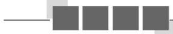
### 思想方法
### 分类讨论思想在集合表示中的应用
##### 【典例】若集合  $A = \{x|kx^2 -8x + 16 = 0\}$  中只有一个元素，试求实数  $k$  的值，并用列举法表示集合A.
审题视角集合  $A$  中只有一个元素,说明关于  $x$  的方程  $kx^{2} - 8x + 16 = 0$  只有一个或两个相等的实数根，此方程不确定为一元二次方程，需要对系数  $k$  分  $k = 0$  和  $k \neq 0$  讨论.
解 当  $k = 0$  时，原方程变为  $-8x + 16 = 0$  ，解得  $x = 2$
此时集合  $A = \{2\}$
当  $k \neq 0$  时, 要使一元二次方程  $kx^{2} - 8x + 16 = 0$  有两个相等的实数根, 只需  $\Delta = 64 - 64k = 0$ , 即  $k = 1$ .
此时方程的解为  $x_{1} = x_{2} = 4$  ，集合  $A = \{4\}$  ，满足题意
综上所述,实数  $k$  的值为 0 或 1 .
当  $k = 0$  时， $A = \{2\}$ ；当  $k = 1$  时， $A = \{4\}$

### 延伸探究
将本例改为“若集合  $A$  中至少有一个元素,求实数  $k$  的取值范围”,如何求解?
解由集合  $A$  中至少有一个元素可知，关于  $x$  的方程  $kx^{2} - 8x + 16 = 0$  至少有一个根，分两种情况讨论：
① 方程  $kx^{2} - 8x + 16 = 0$  只有一个根，由例题的解答过程可知  $k = 0$  或  $k = 1$  
② 方程  $kx^{2} - 8x + 16 = 0$  有两个不相等的根,需满足  $k \neq 0$ ,且  $\Delta = 64 - 64k > 0$ ,解得  $k < 1$ ,且  $k \neq 0$ .
综上所述， $k$  的取值范围是  $k \leq 1$ .

### 方法点睛
##### 1.解答与描述法有关的问题时，明确集合中的代表元素及其共同特征是解题的切入点
##### 2.本题因  $kx^{2} - 8x + 16 = 0$  不一定是一元二次方程，所以需分  $k = 0$  和  $k\neq 0$  讨论
##### 3. 集合与方程的综合问题, 一般要求对方程中最高次项的系数的取值进行分类讨论, 确定方程的根的情况, 进而求得结果. 需特别关注判别式在一元二次方程的实数根个数的讨论中的作用.
##### 1.使不等式  $x > 2$  成立的实数  $x$  的集合可表示为( )
$\quad$A.  $\{x > 2\}$
$\quad$B.  $\{x > 2 | x \in \mathbf{R}\}$
$\quad$C.{3,4,5,...}
$\quad$D.  $\{x \in \mathbf{R} \mid x > 2\}$

<span class="fake-tag">答案</span> D
##### 2. 集合  $A = \{(0,1),(2,3)\}$  中元素的个数是( )
$\quad$A.1
$\quad$B.2
$\quad$C.3
$\quad$D.4

<span class="fake-tag">解析</span> 集合  $A$  中的元素是点, 而不是数, 故集合  $A$  中有 2 个元素.

<span class="fake-tag">答案</span> B
##### 3.已知集合  $A = \{1,2,3,4\}$  ，集合  $B = \{y|y = x - 1,x\in A\}$  ，则集合  $B$  用列举法表示为

<span class="fake-tag">解析</span> 当  $x = 1$  时， $y = 0$ ；当  $x = 2$  时， $y = 1$ ；当  $x = 3$  时， $y = 2$ ；当  $x = 4$  时， $y = 3$ 。故  $B = \{0,1,2,3\}$ 。

<span class="fake-tag">答案</span>  $B = \{0,1,2,3\}$
##### 4. 集合  $A = \{(x, y) | x + y = 6, x, y \in \mathbf{N}\}$  用列举法表示为

<span class="fake-tag">答案</span>  $A = \{(0,6),(1,5),(2,4),(3,3),(4,2),(5,1),(6,0)\}$
##### 5.选择适当的方法表示下列集合：
(1)被3整除的所有正整数组成的集合;
(2)方程  $(3x - 1)(x + 2) = 0$  的所有实数根组成的集合
解 (1)  $\{x \mid x = 3k, k \in \mathbf{N}^{*}\}$ .
(2)解方程  $(3x - 1)(x + 2) = 0$  ，得  $x = \frac{1}{3}$  或  $x = -2$  ，所求集合为  $\left\{-2, \frac{1}{3}\right\}$ .
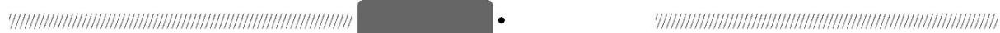
### 巩固提升
##### 1. 集合  $\{(x, y) | y = 3x + 1\}$  表示( )
$\quad$A.函数  $y = {3x} + 1$  
$\quad$B.点  $(x,y)$  
$\quad$C.平面直角坐标系中所有的点组成的集合  
$\quad$D.函数  $y = {3x} + 1$  的图象上的所有点组成的集合

<span class="fake-tag">解析</span> 由集合描述法的定义可知，该集合表示函数  $y = 3x + 1$  的图象上的所有点组成的集合

<span class="fake-tag">答案</span> D
##### 2. 已知集合  $A = \{x \in \mathbf{R} \mid 1 < x < 3\}$ , 则下列关系正确的是( )
$\quad$A.  $1 \in A$
$\quad$B.  $2 \notin A$
$\quad$C.  $3 \in A$
$\quad$D.  $4 \notin A$

<span class="fake-tag">解析</span> 因为集合  $A = \{x\in \mathbf{R}|1 < x < 3\}$  ，所以  $1\notin A,2\in A,3\notin A,4\notin A$  故选D.

<span class="fake-tag">答案</span> D
##### 3.设集合  $M = \{a^2 - a, 0\}$ , 若  $a \in M$ , 则实数  $a$  的值为( )
$\quad$A.0
$\quad$B.2
$\quad$C.2或0
$\quad$D.2或-2

<span class="fake-tag">解析</span>  $\vdots$  集合  $M = \{a^{2} - a,0\}$
$\therefore a^2 -a\neq 0$  ，即  $a\neq 0$  ，且  $a\neq 1$
又  $a \in M, \therefore a = a^2 - a, \therefore a = 2$ . 故选 B.

<span class="fake-tag">答案</span> B
##### 4.已知集合  $M = \left\{a\in Z\left|\frac{6}{5 - a}\in N^*\right.\right\}$  则  $M$  等于(
$\quad$A.{2,3}
$\quad$B.  $\{1,2,3,4\}$
$\quad$C.{1,2,3,6}
$\quad$D.  $\{-1,2,3,4\}$

<span class="fake-tag">解析</span> 因为集合  $M = \left\{a\in Z\left|\frac{6}{5 - a}\in N^{*}\right.\right\} ,$
所以  $5 - a$  可能为1,2,3,6,即  $a$  可能为4,3,2,-1
所以  $M = \{-1,2,3,4\}$  ，故选D.

<span class="fake-tag">答案</span> D
##### 5.(多选题)已知集合  $A = \{x|x = 2m - 1,m\in \mathbf{Z}\} ,B = \{x|x = 2n,n\in \mathbf{Z}\}$  ，且  $x_{1},x_{2}\in A,x_{3}\in B,$  则下列判断正确的是（）
$\quad$A.  $x_{1} x_{2} \in A$
$\quad$B.  $x_{2} x_{3} \in B$
$\quad$C.  $x_{1} + x_{2} \in B$
$\quad$D.  $x_{1} + x_{2} + x_{3} \in A$

<span class="fake-tag">解析</span> 由题意，可知集合  $A$  表示奇数集， $B$  表示偶数集，则  $x_{1}, x_{2}$  是奇数， $x_{3}$  是偶数，因此  $x_{1} + x_{2} + x_{3}$  应为偶数，即  $x_{1} + x_{2} + x_{3} \notin A, D$  错误；A，B，C 显然正确.

<span class="fake-tag">答案</span> ABC
##### 6.一次函数  $y = 2x$  与  $y = 3x - 2$  的图象的交点组成的集合用列举法表示为

<span class="fake-tag">解析</span> 由题意，得  $\left\{\backslash (x,y)\right|\left\{ \begin{array}{l}y = 2x,\\ y = 3x - 2 \end{array} \right\} = \{(2,4)\} .$

<span class="fake-tag">答案</span> {2,4}
##### 7.已知集合  $A$  是由  $0,m,m^{2} - 3m + 2$  三个元素组成的集合，且  $2\in A$  ，则实数  $m = \_ ,$  集合  $A = \underline{\quad}$

<span class="fake-tag">解析</span> 若  $m = 2$  则  $m^2 -3m + 2 = 0$  这与  $m^2 -3m + 2\neq 0$  矛盾，不合题意;若  $m^2 -3m + 2 = 2$  ，则  $m = 0$  或  $m = 3$  当 $m = 0$  时，与  $m\neq 0$  矛盾，不合题意;当  $m = 3$  时，此时集合  $A$  的元素为0,3,2,符合题意.

<span class="fake-tag">答案</span>3 {0,2,3}
##### 8.设集合  $A = \{1, - 2,a^2 -1\} ,B = \{1,a^2 -3a,0\}$  ，若  $A,B$  相等，则实数  $a =$

<span class="fake-tag">解析</span> 由集合  $A,B$  相等，得  $\begin{cases} a^2 -1 = 0,\\ a^2 -3a = -2, \end{cases}$  解得  $a = 1$

<span class="fake-tag">答案</span> 1
##### 9.选择适当的方法表示下列集合：
(1)一年中有31天的月份组成的集合;  
(2)由直线  $y = -x + 4$  上的横坐标和纵坐标都是自然数的点组成的集合.
解 (1) {1月, 3月, 5月, 7月, 8月, 10月, 12月}.
(2)用描述法表示该集合为  $\{(x,y)|y = -x + 4,x\in \mathbf{N},y\in \mathbf{N}\}$ , 或用列举法表示该集合为  $\{(0,4),(1,3),(2,2),(3,1),(4,0)\}$ .
##### 10.已知集合  $A = \{x\mid ax^2 -3x + 2 = 0\}$  ,其中  $a$  为常数,且  $a\in \mathbf{R}$
(1)若集合  $A$  中至少有一个元素, 求  $a$  的取值范围;  
(2)若集合  $A$  中至多有一个元素,求  $a$  的取值范围.
解 (1)当集合  $A$  中恰有一个元素时，若  $a = 0$  ，则方程化为  $-3x + 2 = 0$  ，此时关于  $x$  的方程  $ax^2 - 3x + 2 = 0$  只有一个实数根  $x = \frac{2}{3}$
若  $a \neq 0$ , 则令  $\Delta = 9 - 8a = 0$ , 解得  $a = \frac{9}{8}$ , 此时关于  $x$  的方程  $ax^2 - 3x + 2 = 0$  有两个相等的实数根.
当集合  $A$  中有两个元素时, 则  $a \neq 0$ , 且  $\Delta = 9 - 8a > 0$ , 解得  $a < \frac{9}{8}$ , 且  $a \neq 0$ , 此时关于  $x$  的方程  $ax^2 - 3x + 2 = 0$  有两个不相等的实数根.
综上, 当  $a \leq \frac{9}{8}$  时, 集合  $A$  中至少有一个元素.
(2)当集合  $A$  中没有元素时，则  $a \neq 0, \Delta = 9 - 8a < 0$ ，解得  $a > \frac{9}{8}$ ，此时关于  $x$  的方程  $ax^2 - 3x + 2 = 0$  没有实数根.
当集合  $A$  中恰有一个元素时,由(1)知,此时  $a = 0$  或  $a = \frac{9}{8}$ .
综上, 当  $a = 0$  或  $a \geq \frac{9}{8}$  时, 集合  $A$  中至多有一个元素.
## 1.2 集合间的基本关系
<table><tr><td>课标定位素养阐释</td><td>1.理解集合之间包含与相等的含义,能识别给定集合的子集.
##### 2.能使用 Venn 图表达集合的基本关系,体会图形对理解抽象概念的作用.
##### 3.在具体情境中,了解空集的含义.
##### 4.进一步积累数学抽象的经验,强化逻辑推理与数学运算素养.</td></tr></table>
### 新知导学
### 一、子集和真子集的含义
##### 1.给出下面两个集合：
$A = \{0, 1, 2 \}, B = \{0, 1, 2, 3 \}.$
(1) 集合  $A$  中的元素都是集合  $B$  中的元素吗?  
(2) 集合  $B$  中的元素都是集合  $A$  中的元素吗?  
(3) 集合  $A, B$  的关系能不能用图直观形象地表示出来呢?
提示 (1)是的.
(2)不全是.  
(3)能,如图.
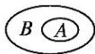
##### 2.(1)在数学中,我们经常用平面上封闭曲线的内部代表集合,这种图称为 Venn 图.
(2)子集与真子集
<table><tr><td>概</td><td>定义</td><td>符号表示</td><td>图形表示</td><td>性质</td></tr><tr><td>念</td><td></td><td></td><td></td><td></td></tr><tr><td>子集</td><td>一般地,对于两个集合A,B,如果集合A中任 意一个元素都是集合B中的元素,就称集合 A为集合B的子集</td><td>A⊆B(或B⊆A),读作 “A包含于B”(或“B 包含A”)</td><td>B A B(A)</td><td>①任何一个集合是它 本身的子集,即ACA; ②对于集合A,B,C,如 果A⊆B,且B⊆C,那么 AC</td></tr><tr><td>真子集</td><td>如果集合A⊆B,但存在元素x∈B,且x∉A,就 称集合A是集合B的真子集</td><td>A⊆B(或B⊆A)读作 “A真包含于B”(或“B 真包含A”)</td><td>B A</td><td>对于集合A,B,C,如果 A⊆B,且B⊆C,那么 AC</td></tr></table>
##### 3.已知集合  $M = \{x|x^2 -1 = 0\} ,N = \{-1,0,1\}$  ，则  $M$  与  $N$  的关系是(
$\quad$A.M⊆N
$\quad$B.  $M < N$
$\quad$C.N<M
$\quad$D.M≥N

<span class="fake-tag">解析</span>集合  $M = \{-1,1\}$
$\therefore M \subseteq N$  ，故选A.

<span class="fake-tag">答案</span> A
### 二、集合相等
### 1.观察下面几个例子：
① 设  $C = \{x|x$  是长方形\},  $D = \{x|x$  是有一个角是直角的平行四边形\};
②  $C = \{1,5,6\}, D = \{6,5,1\}$
(1)你能发现两个集合之间的关系吗？
(2)与实数中的结论“若  $a \geq b$ , 且  $b \geq a$ , 则  $a = b$ ”相类比, 在集合中, 你能得出什么结论?
提示 (1)①② 中集合  $C, D$  的元素相同，即集合  $C$  的任何一个元素都是集合  $D$  的元素，同时集合  $D$  的任何一个元素都是集合  $C$  的元素.
(2)若集合  $C\subseteq D$  ，且  $D\subseteq C$  ，则集合  $C$  与集合  $D$  相等，记作  $C = D$
##### 2.(1)一般地,如果集合  $A$  的任何一个元素都是集合  $B$  的元素,同时集合  $B$  的任何一个元素都是集合  $A$  的元素,那么集合  $A$  与集合  $B$  相等,记作  $A = B$ .
也就是说,若  $A \subseteq  B$  ,且  $B \subseteq  A$  ,则  $A = B$  .
(2)Venn图表示为：
##### 3.已知集合  $A = \{x,2\}$  ，集合  $B = \{2,1\}$  ,若  $A = B$  ，则  $x =$

<span class="fake-tag">解析</span>  $\because A = B,$
$\therefore$  集合  $A, B$  中的元素相同， $\because x = 1$

<span class="fake-tag">答案</span> 1
### 三、空集
##### 1. 集合  $A = \{ x \mid  {x}^{2} - x + 1 = 0\}$  中有多少个元素?
提示 0个.
##### 2.一般地,我们把不含任何元素的集合,叫做空集,记为  $\varnothing$ , 并规定: 空集是任何集合的子集
##### 3.已知  $\{x|x^2 -2x + a = 0\} = \emptyset$  ，则实数  $a$  的取值范围是

<span class="fake-tag">解析</span>  $\because \{x|x^{2} - 2x + a = 0\} = \emptyset ,$
$\therefore$  方程  $x^{2} - 2x + a = 0$  无解，
$\therefore \Delta = (-2)^{2} - 4a <   0$  ，解得  $a > 1$

<span class="fake-tag">答案</span>  $a > 1$
### 【思考辨析】
判断下列说法是否正确，正确的在后面的括号内打“√”，错误的打“×”。
(1)集合  $\{0\}$  是空集. (✗)  
(2)  $A \subseteq B$  是指集合  $A$  是由集合  $B$  的部分元素组成的. (×)  
(3)空集没有子集. (✗)
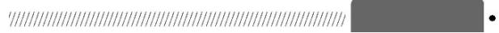
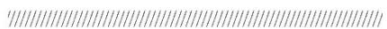
### 释疑解惑
### 探究一集合间关系的判
断
##### 【例1】 判断下列各题中两个集合的关系：
$(1)A = \{-1,1\} ,B = \{(-1,1),(1, - 1)\} ;$  
(2)  $A = \{x\mid -3\leq x <   5\} ,B = \{x\mid -1 <   x <   2\}$  
(3)  $A = \{x|x = 2n,n\in \mathbf{Z}\} ,B = \{x|x = 2(n + 1),n\in \mathbf{Z}\} .$
解 (1) 集合  $A$  的代表元素是数, 集合  $B$  的代表元素是有序实数对, 故集合  $A$  与  $B$  无包含关系.
(2)将集合  $A,B$  在数轴上表示出来，如图所示，由图可知  $B\text{口} A.$
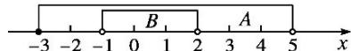
(3)  $\because n \in \mathbf{Z}, \therefore n + 1 \in \mathbf{Z}, \therefore B$  表示偶数集
∵A也表示偶数集，∴A=B
### 延伸探究
将本例(3)中的集合  $A, B$  改为“集合  $A = \left\{x \mid x = k + \frac{1}{2}, k \in \mathbb{Z}\right\}, B = \left\{x \mid x = \frac{k}{2}, k \in \mathbb{Z}\right\}$ , 结果如何?
解法一 (列举法)对于集合  $A$  ，取  $k = \dots, 0, 1, 2, 3, \ldots$  得  $A = \left\{\dots, \frac{1}{2}, \frac{3}{2}, \frac{5}{2}, \frac{7}{2}, \dots\right\}$ ，
对于集合  $B$  取  $k = \dots ,0,1,2,3,4,5,6,7,\ldots ,$
得  $B = \left\{ \dots ,0,\frac{1}{2},1,\frac{3}{2},2,\frac{5}{2},3,\frac{7}{2},\dots \right\} ,$
易看出，  $A$  中的元素在  $B$  中都有，而  $B$  中的元素在  $A$  中不一定有，如  $1\in B,1\notin A,$  故  $A\not\subseteq B.$
解法二 (元素分析法)易得  $A = \left\{x \mid x = \frac{2k + 1}{2}, k \in \mathbf{Z}\right\}, B = \left\{x \mid x = \frac{k}{2}, k \in \mathbf{Z}\right\}$ , 而  $2k + 1$  表示所有
奇数,  $k$  表示所有整数, 可得  $A \subsetneq B$ .
### 反思感悟
判断集合间关系的常用方法
(1)列举观察法：当集合中的元素较少时，可列举出集合中的全部元素，通过定义得出集合之间的关系.  
(2)元素特征法:先确定集合的代表元素是什么,弄清集合中元素的特征,再利用元素的特征判断得出集合之间的关系.
(3)数形结合法:利用数轴或 Venn 图,其中不等式的解集之间的关系适合用数轴法.
【变式训练1】(1)已知集合  $A = \{x|(x - 3)(x + 2) = 0\}, B = \left\{x \mid \frac{x - 3}{x + 2} = 0\right\}$ , 则  $A$  与  $B$  的关系是( )
$\quad$A.A  $\subseteq B$
$\quad$B.A=B
$\quad$C.AB
$\quad$D.BCA
(2)已知集合  $A = \{x\mid 1\leq x\leq 2\} ,B = \{x\mid x <   - 2$  ，或  $x > 0\}$  ，则（
$\quad$A.BCA
$\quad$B.A=B
$\quad$C.AB
$\quad$D.BA

<span class="fake-tag">解析</span> (1)：集合  $A = \{-2,3\}, B = \{3\}, \therefore B \subsetneq A.$  故选D.
(2)将集合  $A,B$  在数轴上表示出来，如图所示，由图可知  $A\text{足} B.$  故选C.
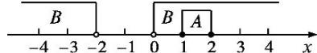

<span class="fake-tag">答案</span> (1)D (2)C
### 探究二子集的列举与个数的
### 计算
##### 【例2】已知集合  $M = \{x\in \mathbf{N}|x < 2\} ,N = \{x\in \mathbf{Z}|-2 < x < 2\}$
(1)写出集合  $M$  的子集、真子集;  
(2)求集合  $N$  的子集数、真子集数和非空真子集数;  
(3)猜想：含  $n$  个元素的集合  $\{a_{1}, a_{2}, \ldots, a_{n}\}$  的子集的个数是多少？真子集的个数及非空真子集的个数呢？
分析 把用描述法表示的集合用列举法表示出来，从而写出子集与真子集
解  $M = \{x\in \mathbf{N}|x <   2\} = \{0,1\}$
$N = \{x \in \mathbf {Z} | - 2 <   x <   2 \} = \{- 1, 0, 1 \}.$
(1)  $M$  的子集为  $\varnothing ,\{0\} ,\{1\} ,\{0,1\}$  ；其中真子集为  $\emptyset ,\{0\} ,\{1\}$  
(2)  $N$  的子集为  $\varnothing ,\{-1\} ,\{0\} ,\{1\} ,\{-1,0\} ,\{-1,1\} ,\{0,1\} ,\{-1,0,1\}$
故  $N$  的子集数为8,真子集数为7,非空真子集数为6
(3)猜想:含  $n$  个元素的集合  $\{a_{1}, a_{2}, \ldots, a_{n}\}$  的子集的个数是  $2^{n}$ , 真子集的个数是  $2^{n} - 1$ , 非空真子集的个数是  $2^{n} - 2$ .

### 反思感悟
求给定集合的子集的三个关注点
(1)注意两个特殊的集合,即空集和集合本身.  
(2)要依次按照含有一个元素的子集、含有两个元素的子集、含有三个元素的子集……写出所有子集.  
(3)按照如下的结论验证，含有  $n$  个元素的集合  $\{a_{1}, a_{2}, \ldots, a_{n}\}$  的子集有  $2^{n}$  个，真子集有  $(2^{n} - 1)$  个，非空子集有  $(2^{n} - 1)$  个，非空真子集有  $(2^{n} - 2)$  个.
【变式训练2】若  $\{1,2,3\} \nsubseteq A \subseteq \{1,2,3,4,5\}$ , 则符合条件的集合  $A$  的个数为( )
$\quad$A.2
$\quad$B.3
$\quad$C.4
$\quad$D.5

<span class="fake-tag">解析</span> 集合  $\{1,2,3\}$  是集合  $A$  的真子集，同时集合  $A$  又是集合  $\{1,2,3,4,5\}$  的子集，所以集合  $A$  只能取集合  $\{1,2,3,4\}, \{1,2,3,5\}$  和  $\{1,2,3,4,5\}$ .

<span class="fake-tag">答案</span> B
### 数的取值范围
##### 【例3】已知集合  $A = \{x|x < -1$  或  $x > 4\}$ $B = \{x|2a\leq x\leq a + 3\}$  ，若  $B\subseteq A$  ，求实数  $a$  的取值范围解当  $B = \emptyset$  时，只需  $2a > a + 3$  即  $a > 3$
当  $B \neq \emptyset$  时, 将集合  $A, B$  在数轴上表示出来, 如图所示, 可得  $\left\{ \begin{array}{l} a + 3 \geq 2a, \\ a + 3 < -1 \end{array} \right.$  或  $\left\{ \begin{array}{l} a + 3 \geq 2a, \\ 2a > 4, \end{array} \right.$  解得  $a < -4$  或  $2 < a \leq 3$ .
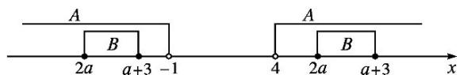
综上可得，实数  $a$  的取值范围为  $\{a|a < -4$ , 或  $a > 2\}$ .
### 延伸探究
##### 1. 把集合  $A$  换成“ $A = \{x \mid -1 < x < 4\}$ ”，其他条件不变，求实数  $a$  的取值范围
解 当  $B = \emptyset$  时，只需  $2a > a + 3$  即  $a > 3$
当  $B \neq \emptyset$  时, 根据题意, 在数轴上表示出集合  $A, B$ , 如图所示, 可得
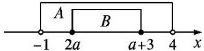
$\left\{ \begin{array}{l} 2a \leq a + 3, \\ 2a > -1, \text{解得} -\frac{1}{2} < a < 1. \\ a + 3 < 4, \end{array} \right.$
综上可得,实数  $a$  的取值范围为
$\left\{a \mid \frac{-1}{2} < a < 1, \text{或 } a > 3\right\}$ .
##### 2. 把集合  $A$  换成“ $A = \{x \mid -1 < x < 2\}$ ”，集合  $B$  不变，当  $A \subseteq B$  时，求实数  $a$  的取值范围
解  $A = \{x\vert -1 <   x <   2\} ,B = \{x\vert 2a\leq x\leq a + 3\} .$
若  $A \subseteq B$ , 在数轴上表示出集合  $A, B$ , 如图
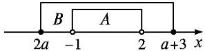
则  $\left\{ \begin{array}{l} 2a \leq a + 3, \\ 2a \leq -1, \text{解得} -1 \leq a \leq -\frac{1}{2}. \\ a + 3 \geq 2, \end{array} \right.$
故实数  $a$  的取值范围为  $\left\{a\mid -1\leq a\leq -\frac{1}{2}\right\} .$

### 反思感悟
##### 1.求解此类问题通常借助数轴,将各个集合在数轴上表示出来,注意验证集合的端点值,做到准确无误,一般含“=”用实心圆点表示,不含“=”用空心圆圈表示.
##### 2. 涉及 “ $A \subseteq B$ ” 或 “ $A \nsubseteq B$ , 且  $B \neq \emptyset$ ” 的问题, 一定要分  $A = \emptyset$  和  $A \neq \emptyset$  两种情况进行讨论, 其中  $A = \emptyset$  的情况易被忽略, 应引起足够的重视.
### 易错辨析因忽视空集是任何集合的子集致错
##### 【典例】已知集合  $M = \{x|2x^2 -5x - 3 = 0\} ,N = \{x|mx = 1\}$  ，若  $N\subseteq M$  ，则实数  $m$  的取值集合为
错解 集合  $M = \left\{\frac{-1}{2},3\right\} .$
若  $N\subseteq M$  ，则  $N = \{3\}$  或  $N = \left\{\frac{-1}{2}\right\} .$
当  $N = \{3\}$  时， $m = \frac{1}{3}$
当  $N = \left\{\frac{-1}{2}\right\}$  时， $m = -2$
故  $m$  的取值集合为  $\left(-2, \frac{1}{3}\right)$ .

<span class="fake-tag">答案</span>  $\left\{-2, \frac{1}{3}\right\}$
以上解答过程中都有哪些错误?出错的原因是什么?你如何改正?你如何防范?
提示 以上解法出错的原因是忽略了  $N = \emptyset$  这种情况
正解 集合  $M = \left\{\frac{-1}{2},3\right\} .$
若  $N\subseteq M$  ，则  $N = \{3\}$  或  $N = \left\{\frac{-1}{2}\right\}$  或  $N = \emptyset$
当  $N = \{3\}$  时， $m = \frac{1}{3}$ ；当  $N = \left\{\frac{-1}{2}\right\}$  时， $m = -2$ ；当  $N = \emptyset$  时， $m = 0$
故  $m$  的取值集合为  $\left\{-2,0,\frac{1}{3}\right\} .$

<span class="fake-tag">答案</span>  $\left(-2,0,\frac{1}{3}\right)$

### 防范措施
##### 1.空集是任何集合的子集，涉及“A⊆B”的问题时，注意不要漏掉A=∅的情况
##### 2.在分类讨论时，要做到分类标准清晰，不重不漏
【变式训练】已知集合  $A = \{x|ax^2 - 2x + 2 = 0\}$ , 集合  $B = \{y|y^2 - 3y + 2 = 0\}$ , 如果  $A \subseteq B$ , 求实数  $a$  的取值集合.
解 由题意，得  $B = \{1,2\}$
由  $A \subseteq B$ , 知若  $a = 0$ , 则  $A = \{x \mid -2x + 2 = 0\} = \{1\} \subseteq B$ .
若  $a \neq 0$ , 当  $\Delta = 4 - 8a < 0$ , 即  $a > \frac{1}{2}$  时,  $A = \emptyset \subseteq B$ ;
当  $\Delta = 4 - 8a = 0$  ，即  $a = \frac{1}{2}$  时  $A = \{2\} \subseteq B$
当  $\Delta = 4 - 8a > 0$  ，即  $a < \frac{1}{2}$  且  $a \neq 0$  时，必有  $A = \{1,2\}$  则1,2均为关于  $x$  的方程  $ax^2 - 2x + 2 = 0$  的实根，即  $a - 2 + 2 = 0,4a - 4 + 2 = 0$  这是不可能的.
综上,实数  $a$  的取值集合为  $\left\{a \mid a = 0\right.$ , 或  $a \geq \frac{1}{2}$ .
### 随堂练习
##### 1.(多选题)下列关系式正确的是( )
$\quad$A.  $0 \in \{0\}$
$\quad$B.  $\emptyset \in \{0\}$
$\quad$C.{0,1}={(0,1)}
$\quad$D.  $\emptyset \subseteq \{0\}$

<span class="fake-tag">解析</span> 0 是集合  $\{0\}$  的元素, 故 A 正确;  $\varnothing$  和  $\{0\}$  都是集合, 故 B 不正确; 因为  $\varnothing$  是任何集合的子集, 所以有  $\varnothing \subseteq \{0\}$ , 故 D 正确; 集合  $\{0,1\}$  是含有 2 个元素的数集, 而集合  $\{(0,1)\}$  是含有 1 个元素的点集, 故  $\{0,1\} \neq \{(0,1)\}$ , 故 C 不正确. 故选 AD.

<span class="fake-tag">答案</span> AD
##### 2.已知集合  $A = \{-1,2\} ,B = \{m^2 -m, - 1\}$  ，且  $A = B$  ，则实数  $m$  等于(
$\quad$A.-1
$\quad$B.2
$\quad$C.2或-1
$\quad$D.4

<span class="fake-tag">解析</span> 由  $A = B$  ，得  $m^2 - m = 2$  ，解得  $m = 2$  或  $m = -1$

<span class="fake-tag">答案</span> C
##### 3.下列表示集合  $M = \{-1,0,1\}$  和  $N = \{x|x^2 +x = 0\}$  关系的Venn图，正确的是( )
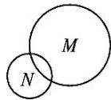  
A
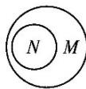  
B
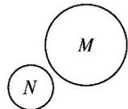  
C
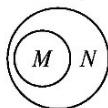  
D

<span class="fake-tag">解析</span> 由  $N = \{-1,0\}$  ，知  $N\subsetneq M$  ，故选B.

<span class="fake-tag">答案</span> B
##### 4.已知集合  $M\subseteq \{-1,0,2\}$  ，且  $M$  中含有两个元素，则符合条件的集合  $M$  有 个

<span class="fake-tag">解析</span> 因为集合  $M \subseteq \{-1,0,2\}$ , 且  $M$  中含有两个元素, 所以符合条件的  $M$  可以是  $\{-1,0\}, \{-1,2\}$
$\{0,2\}$

<span class="fake-tag">答案</span> 3
##### 5.已知集合  $A = \{x\mid 1\leq x <   4\} ,B = \{x\mid x <   a\}$  ，若  $A\subseteq B$  ，求实数  $a$  的取值范围
解 将集合  $A$  表示在数轴上,如图所示
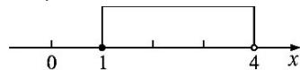
要满足  $A \subseteq B$ , 表示数  $a$  的点必须在表示 4 的点处或在表示 4 的点的右边, 即实数  $a$  的取值范围为  $\{a | a \geq 4\}$ .
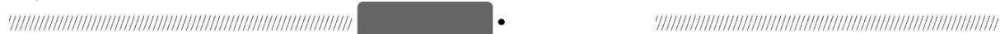
### 巩固提升
### A组
##### 1.(多选题)下列关系错误的是( )
$\quad$A.  $1 \subseteq \{1, 2, 3\}$
$\quad$B.  $\{1\} \in \{1,2,3\}$
$\quad$C.{1,2,3}  $\subseteq$  {1,2,3}
$\quad$D.  $\emptyset \subseteq \{1\}$

<span class="fake-tag">解析</span> 对于选项A，应该为  $1\in \{1,2,3\}$
对于选项B，应该为  $\{1\} \subseteq \{1,2,3\}$  .选项C,D正确
故选AB.

<span class="fake-tag">答案</span> AB
##### 2. 设  $M = \{x \mid x$  是菱形\},  $N = \{x \mid x$  是平行四边形\},  $P = \{x \mid x$  是四边形\},  $Q = \{x \mid x$  是正方形\}, 则这些集合之间的关系为( )
$\quad$A.P  $\subseteq N\subseteq M\subseteq Q$
$\quad$B.  $Q \subseteq M \subseteq N \subseteq P$
$\quad$C.P⊆M⊆N⊆Q
$\quad$D.  $Q \subseteq N \subseteq M \subseteq P$

<span class="fake-tag">解析</span> 结合菱形、平行四边形、四边形及正方形的概念, 可知  $Q \subseteq M \subseteq N \subseteq P$ .

<span class="fake-tag">答案</span> B
##### 3.已知集合  $A = \{x|x^{2} - 1 = 0\}$  ，则下列式子表示正确的有 （）
①  $\{1\} \in A; 2 - 1 \subseteq A; 3 \emptyset \subseteq A; 4 \{1, -1\} \subseteq A.$
$\quad$A.1 个
$\quad$B.2个
$\quad$C.3 个
$\quad$D.4 个

<span class="fake-tag">解析</span> 由于  $A = \{x|x^2 -1 = 0\} = \{-1,1\}$  ，则  $\{1\} \subseteq A, - 1\in A$  故  $①②$  不正确；
因为  $\varnothing \subseteq A, \{1, -1\} \subseteq A$  ，符合子集的定义，所以 ③④正确. 故选 B.

<span class="fake-tag">答案</span> B
##### 4. 已知集合  $A \subseteq \{0,1,2\}$ , 且集合  $A$  中至少含有一个偶数, 则这样的集合  $A$  的个数为( )
$\quad$A.6
$\quad$B.5
$\quad$C.4
$\quad$D.3

<span class="fake-tag">解析</span> 因为集合  $A \subseteq \{0,1,2\}$ , 且集合  $A$  中至少含有一个偶数, 所以满足条件的集合  $A$  可以为:  $\{0\}$
$\{2\} ,\{0,1\} ,\{1,2\} ,\{0,2\} ,\{0,1,2\}$  ，共6个，故选A.

<span class="fake-tag">答案</span> A
##### 5.设集合  $M = \{x\in \mathbf{Z}|-1 <   x <   3\}$  ，则集合  $M$  的真子集个数为(
$\quad$A.8
$\quad$B.7
$\quad$C.4
$\quad$D.3

<span class="fake-tag">解析</span> 因为集合  $M = \{x\in \mathbf{Z}|-1 < x < 3\} = \{0,1,2\}$ , 所以集合  $M$  的真子集个数为  $2^{3} - 1 = 7$ . 故选 B.

<span class="fake-tag">答案</span> B
##### 6.用符号“∈”或“≤”填空：若  $A = \{2,4,6\}$  ，则4 A,{2,6} A.

<span class="fake-tag">解析</span> 因为集合  $A$  中含有元素4,所以  $4\in A,$
因为  $2 \in A, 6 \in A$ , 所以  $\{2, 6\} \subseteq A$ .

<span class="fake-tag">答案</span>  $\in$
##### 7. 已知集合  $M = \{-1, 0, 1\}$ ,  $N = \{x \mid x = ab, a, b \in M \text{，且 } a \neq b\}$ ，则能表示集合  $M$  与集合  $N$  的关系的 Venn 图是
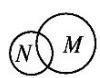  
①
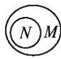  
$②$
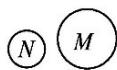  
$③$
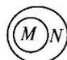  
$④$

<span class="fake-tag">解析</span>  $\because M = \{-1,0,1\}$
$\therefore N = \{x \mid x = a b, a, b \in M, \text {且} a \neq b \} = \{0, - 1 \},$
$\therefore N \subsetneq M, \mathrm{Venn}$  图是 ②.

<span class="fake-tag">答案</span> ②
##### 8.已知集合  $A = \{-1,3,2m - 1\}$  ，集合  $B = \{3,m^2\}$  ,若  $B\subseteq A$  ，则实数  $m =$

<span class="fake-tag">解析</span> 集合  $A, B$  中均含有元素 3, 由  $B \subseteq A$ , 得集合  $B$  中另一元素  $m^2$  一定与集合  $A$  中元素-1,2m-1中的一个相等, 又  $m^2 \geq 0$ , 故  $m^2 = 2m - 1$ , 得  $m = 1$ .

<span class="fake-tag">答案</span> 1
##### 9.判断下列集合间的关系：
(1)  $A = \{x|x - 3 > 2\} ,B = \{x|2x - 4\geq 0\}$  
(2)  $A = \{x\in \mathbf{Z}|-1\leq x < 3\}, B = \{x|x = |y|, y\in A\}$ .
解  $\left(1\right)A = \{x|x - 3 > 2\} = \{x|x > 5\} ,B = \{x|2x - 4\geq 0\} = \{x|x\geq 2\}$  ，可得  $A\subsetneq B$
(2)因为  $A = \{x\in \mathbf{Z}|\text{-} 1\leq x <   3\} = \{-1,0,1,2\} ,B = \{x|x = |y|,y\in A\} = \{0,1,2\}$  ，所以  $B\subsetneq A$
##### 10.已知集合  $A = \{x\mid 1\leq x\leq 2\} ,B = \{x\mid 1\leq x\leq a,a\geq 1\}$
(1)若  $A \subsetneq B$ , 求  $a$  的取值范围;  
(2)若  $B\subseteq A$  ，求  $\alpha$  的取值范围
解 (1) 若  $A \subsetneq B$ , 把集合  $A, B$  在数轴上表示出来, 则由图可知  $a > 2$ .
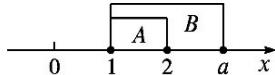
(2)若  $B \subseteq A$ , 把集合  $A, B$  在数轴上表示出来, 则由图可知  $1 \leq a \leq 2$ .
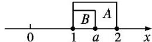
### B组
##### 1.若  $x,y\in \mathbf{R},A = \{(x,y)|y = x\} ,B = \left\{\backslash (x,y)\right|\frac{y}{x} = 1\}$
则集合  $A, B$  间的关系为( )
$\quad$A.AB
$\quad$B.A B
$\quad$C.A=B
$\quad$D.A  $\subseteq B$

<span class="fake-tag">解析</span>  $\because B = \left\{\backslash (x,y)\right|\frac{y}{x} = 1\} = \{(x,y)|y = x,$  且  $x\neq 0\} ,\therefore B\subsetneq A.$

<span class="fake-tag">答案</span> B
##### 2. 已知集合  $A = \{ x \in \mathbf{R} \mid  {x}^{2} - {3x} + 2 = 0\} ,B = \{ x \in  \mathrm{N}\left| {0 < x < 5}\right| \}$  ,则满足条件  $A \subseteq  C \subseteq  B$  的集合  $C$  的个数为(   )
$\quad$A.1
$\quad$B.2
$\quad$C.3
$\quad$D.4

<span class="fake-tag">解析</span> 由题意知  $A = \{1,2\} ,B = \{1,2,3,4\}$
由于  $A \subseteq C \subseteq B$ , 则集合  $C$  可能为  $\{1,2\}, \{1,2,3\}, \{1,2,4\}, \{1,2,3,4\}$ .

<span class="fake-tag">答案</span> D
##### 3.定义集合运算  $A\diamond B = \{c|c = a + b,a\in A,b\in B\}$  ，若  $A = \{0,1,2\} ,B = \{3,4,5\}$  ，则集合  $A\diamond B$  的子集个数为（）
$\quad$A.32
$\quad$B.31
$\quad$C.30
$\quad$D.14

<span class="fake-tag">解析</span>  $\because A = \{0,1,2\} ,B = \{3,4,5\} ,$
且  $A\diamondsuit B = \{c|c = a + b,a\in A,b\in B\} ,$
$\therefore A \diamond B = \{3, 4, 5, 6, 7\}$ .
：集合  $A\diamond B$  中共有5个元素
$\therefore$  集合  $A \diamond B$  的所有子集的个数为  $2^{5} = 32$ . 故选 A.

<span class="fake-tag">答案</span> A
##### 4.已知集合  $A = \{x\mid a - 1\leq x\leq a + 2\} ,B = \{x\mid 3 <   x <   5\}$  ，则能使  $A\supseteq B$  成立的实数  $a$  的取值集合是(
$\quad$A.  $\{a \mid 3 < a \leq 4\}$
$\quad$B.  $\{a\vert 3\leq a\leq 4\}$
$\quad$C.  $\{a \mid 3 < a < 4\}$
$\quad$D.  $\varnothing$

<span class="fake-tag">解析</span> 如图,把集合  $A,B$  在数轴上表示出来,
$A\supseteq B,\therefore \left\{ \begin{array}{l}a - 1\leq 3,\\ a + 2\geq 5, \end{array} \right.$  解得  $3\leq a\leq 4$
经检验，知当  $a = 3$  或  $a = 4$  时符合题意，故  $3 \leq a \leq 4$ .
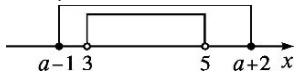

<span class="fake-tag">答案</span> B
##### 5.若集合  $A = \left\{\backslash (x,y)\right\} \left\{ \begin{array}{l}x + y = 1,\\ x - y - 3 = 0 \end{array} \right.$ $B = \{(x,y)|y = ax^2 +1\}$  ，且  $A\subseteq B$  则  $a =$
$\begin{array}{l} \boxed {\text {解 析}} A = \left\{\backslash (x, y \backslash) \middle | \begin{array}{l} x + y = 1, \\ x - y - 3 = 0 \end{array} \right\} = \{(2, - 1) \}. \\ \because A \subseteq B, \therefore - 1 = a \times 2 ^ {2} + 1, \therefore a = - \frac {1}{2}. \\ \end{array}$

<span class="fake-tag">答案</span>  $-\frac{1}{2}$
##### 6.若集合  $A = \{x|ax^2 + ax + 1 = 0\}$  的子集只有两个，则实数  $a =$

<span class="fake-tag">解析</span>集合  $A$  的子集只有两个，
$\therefore A$  中只有一个元素,即关于  $x$  的方程  $ax^2 + ax + 1 = 0$  只有一个实数根
当  $a = 0$  时，方程无解；
当  $a \neq 0$  时,  $\Delta = a^2 - 4a = 0$ , 解得  $a = 4$ . 故  $a = 4$ .

<span class="fake-tag">答案</span> 4
##### 7. 已知集合  $A = \{ 1,a,b\} ,B = \{ a,{a}^{2},{ab}\}$  ,且  $A = B$  ,求实数  $a,b$  的值.
解  $\because A = B$  且  $1\in A,\therefore 1\in B.$
若  $a = 1$  ，则  $a^2 = 1$  ，这与集合中元素的互异性矛盾，
即  $a \neq 1$ ; 若  $a^2 = 1$ , 则  $a = -1$  或  $a = 1$  (舍去).
得  $A = \{1, -1, b\}$ , 则  $b = ab = -b$ , 即  $b = 0$ ;
若  $ab = 1$  ，则  $a^2 = b$  ，得  $a^3 = 1$  ，即  $a = 1$  (舍去).
故  $a = -1, b = 0$
##### 8.设集合  $A = \{x\mid -1\leq x\leq 6\} ,B = \{x|m - 1\leq x\leq 2m + 1\}$
(1)当  $x \in \mathbf{N}$  时, 求集合  $A$  的子集的个数;  
(2)若  $B \subseteq A$ , 求实数  $m$  的取值范围
解 (1)因为当  $x \in \mathbf{N}$  时,  $A = \{0,1,2,3,4,5,6\}$ , 所以集合  $A$  的子集的个数为  $2^{7} = 128$ .
(2)当  $m - 1 > 2m + 1$  ，即  $m <   - 2$  时，  $B = \emptyset$  ，符合题意；
当  $m - 1\leq 2m + 1$  ，即  $m\geq -2$  时，  $B\neq \emptyset$
由  $B \subseteq A$ , 把集合  $A, B$  在数轴上表示出来, 如图所示,
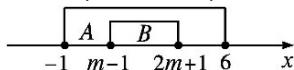
得  $\left\{ \begin{array}{l}m - 1\geq -1,\\ 2m + 1\leq 6, \end{array} \right.$  解得  $0\leq m\leq \frac{5}{2}$
综上可知,实数  $m$  的取值范围为  $\left\{  {m \mid  m <  - 2}\right.$  ,或  $0 \leq  0 \leq   - 1$
$- m \leq \frac {5}{2} \}.$
## 1.3 集合的基本运算
### 第1课时 并集、交集
<table><tr><td>课标定位素养阐释</td><td>1.理解两个集合的并集与交集的含义,明确数学中的“或”“且”的含义.
##### 2.能求两个集合的并集与交集.
##### 3.能使用Venn图表达集合的并集与交集运算,体会图形对理解抽象概念的作用.
##### 4.体会数学抽象和直观想象素养的应用,提升逻辑推理与数学运算素养.</td></tr></table>
### 新知导学
### 一、并集
##### 1.观察下列各个集合
$① A = \{- 1, 0 \}, B = \{1, 3 \}, C = \{- 1, 0, 1, 3 \};$
②  $A = \{x|x$  是偶数\},  $B = \{x|x$  是奇数\},  $C = \{x|x$  是整数\};
$③ A = \{1, 2 \}, B = \{1, 3, 4 \}, C = \{1, 2, 3, 4 \}.$
(1) 你能说出集合  $C$  与集合  $A, B$  之间的关系吗？  
(2)① 中集合  $C$  的元素个数等于集合  $A, B$  的元素个数的和吗? ③ 呢?
提示 (1) 集合  $C$  是由所有属于集合  $A$  或属于集合  $B$  的元素组成的.
(2)在①中,集合  $C$  中有4个元素,集合  $A,B$  中各有2个元素,  $4 = 2 + 2$ ; 在③中,集合  $C$  中有4个元素,集合  $A$  中有2个元素,集合  $B$  中有3个元素,  $4 < 2 + 3$ .
##### 2.并集  
<table><tr><td>自然语言</td><td>符号语言</td><td>图形语言</td></tr><tr><td>一般地,由所有属于集合A或属于集合B的元素组成的集合,称为集合A与B的并集</td><td>AUB={x|x∈A,或x∈B}</td><td>A B</td></tr></table>
##### 3.(2024·北京高考)已知集合  $M = \{x\mid -4 <   x\leq 1\} ,N = \{x\mid -1 <   x <   3\}$  ，则  $M\cup N = ()$
$A. \{x \vert - 4 <   x <   3 \}$
$\mathrm {B}. \{x | - 1 <   x \leq 1 \}$
$\mathrm {C .} \{0, 1, 2 \}$
$\mathrm {D}. \{x | - 1 <   x <   4 \}$

<span class="fake-tag">答案</span> A
### 二、交集
##### 1. 观察下列集合, 你能说出集合  $C$  与集合  $A, B$  之间有什么关系吗?
(1)  $A = \left\{\frac{1}{2}, \frac{1}{3}, \frac{1}{4}\right\}, B = \left\{\frac{1}{3}, \frac{1}{4}, \frac{1}{5}\right\}, C = \left\{\frac{1}{3}, \frac{1}{4}\right\}$ ;  
(2)  $A = \{x|x$  是等腰三角形\},  $B = \{x|x$  是直角三角形\},  $C = \{x|x$  是等腰直角三角形\};  
(3)  $A = \{x|x\leq 1\} ,B = \{x|x\geq 0\} ,C = \{x|0\leq x\leq 1\}$
提示 集合  $C$  是由所有既属于集合  $A$  又属于集合  $B$  的元素组成的.
##### 2. 若集合  $A = \{-1,0,1\}, B = \{2,4,6,8\}$ , 则  $A \cap B$  存在吗?
提示 存在,  $A \cap B = \emptyset$ .
##### 3.交集
<table><tr><td>自然语言</td><td>符号语言</td><td>图形语言</td></tr><tr><td>一般地,由所有属于集合A且属于集合B的元素组成的集合,称为集合A与B的交集</td><td>A∩B={x|x∈A,且x∈B}</td><td>A∩B B</td></tr></table>
##### 4.已知集合  $A = \{-1,0,1\} ,B = \{x\mid -1\leq x <   1\}$  ，则  $A\cap B$  等于(
$\quad$A.{0}
$\quad$B.{-1,0}
$\quad$C.{0,1}
$\quad$D.{-1,0,1}

<span class="fake-tag">解析</span>  $\because A = \{-1,0,1\} ,B = \{x\vert -1\leq x <   1\} ,$
$\therefore A\cap B = \{-1,0\} .$

<span class="fake-tag">答案</span> B
### 三、交集与并集的运算性质
##### 1.已知集合  $A = \{x|x^2 +1 = 0\} ,B = \{0,2\}$  ，则  $A\cup B,A\cap B$  与集合  $A,B$  有什么关系？
提示
$\because A = \emptyset ,B = \{0,2\} ,$
$\therefore A \cup B = B, A \cap B = A.$
##### 2. 你能用 Venn 图表示出任意两个非空集合的所有可能关系吗？
提示 两个非空集合的所有可能关系如下图所示：
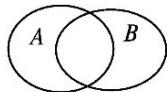
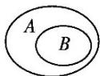
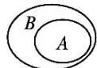
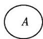
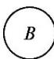
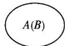
##### 3. 你能从问题2所画的Venn图中发现哪些重要的结论？
提示 由Venn图,我们能够发现如下结论:
$A\cap B = B\cap A,A\cup B = B\cup A;$
$(A \cap B) \subseteq A, (A \cap B) \subseteq B$ ;
$A\subseteq (A\cup B),B\subseteq (A\cup B),(A\cap B)\subseteq (A\cup B).$
##### 4.(1)  $A \cup A = A, A \cup \emptyset = A; A \cap A = A, A \cap \emptyset = \emptyset$ .
(2)若集合  $A$  是集合  $B$  的子集,如下图所示,则  $A \subseteq  B \Leftrightarrow  A \cap  B = \underline{A} \Leftrightarrow  A \cup  B = \underline{B}$  .
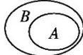
(3)若集合  $A,B$  没有公共元素,如下图所示,则  $A\cap B = \emptyset$
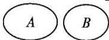
### 【思考辨析】
判断下列说法是否正确，正确的在后面的括号内打“√”，错误的打“×”。
(1)交集的元素个数一定比参与运算的任何一个集合的元素个数少. (✗)  
(2)集合  $A \cup B$  的元素个数就是集合  $A$  和集合  $B$  的元素个数和. (x)  
(3)若  $A \cup B = A$ , 则  $B$  中的每一个元素都在集合  $A$  中.  $(\sqrt{})$  
(4)若  $A\cap B = C\cap B$  ，则  $A = C.$  （×）
### 释疑解惑
### 探究一集合的并集与交
### 集运算
【例 1】求下列两个集合的并集和交集:
(1)  $A = \{1,2,3,4,5\}, B = \{-1,0,1,2,3\}$ ;  
(2)  $A = \{x \mid x \leq -2\}$ , 或  $x > 5\}$ ,  $B = \{x \mid 1 < x \leq 7\}$ .
解  $(1):A = \{1,2,3,4,5\},B = \{-1,0,1,2,3\} ,$
$\therefore A \cup B = \{- 1, 0, 1, 2, 3, 4, 5 \}, A \cap B = \{1, 2, 3 \}.$
(2)将  $x \leq -2$  或  $x > 5$  及  $1 < x \leq 7$  在数轴上表示出来,如图所示
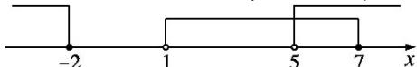
故  $A \cup B = \{x \mid x \leq -2$ , 或  $x > 1\}, A \cap B = \{x \mid 5 < x \leq 7\}$ .

### 反思感悟
求集合的并集与交集的两种基本方法
(1)定义法:若集合是用列举法表示的,则直接利用并集和交集的定义求解,但要注意集合中元素的互异性.  
(2)数形结合法：若集合是用描述法表示的由实数组成的数集，则可以借助数轴，利用数轴分析求解，但要注意端点值的取舍.
【变式训练1】(1)已知集合  $A = \{x|(x - 1)(x + 2) = 0\}, B = \{x|(x + 2)(x - 3) = 0\}$ ，则集合  $A \cup B$  是（）
$\quad$A.{-1,2,3}  
$\quad$B.  $\{-1, -2, 3\}$  
$\quad$C.{1,-2,3}  
$\quad$D.{1,-2,-3}
(2)若集合  $A = \{x\mid -2\leq x <   3\} ,B = \{x\mid 0\leq x <   4\}$  ，则  $A\cup B =$  A∩B=

<span class="fake-tag">解析</span>  $(1):A = \{1, - 2\} ,B = \{-2,3\} ,$
$\therefore A \cup B = \{1, - 2, 3 \}.$
(2)将  $-2\leq x < 3$  与  $0\leq x < 4$  在数轴上表示出来,如图所示
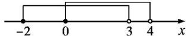
根据并集、交集的定义,知  $A \cup B = \{x \mid -2 \leq x < 4\}, A \cap B = \{x \mid 0 \leq x < 3\}$ .

<span class="fake-tag">答案</span> (1)C (2){x|-2≤x<4} {x|0≤x<3}
### 探究二由集合的交集、并集
### 求参数
##### 【例2】已知集合  $A = \{x|2a\leq x\leq a + 3\} ,B = \{x|x <   - 1$  ，或  $x > 5\}$
(1)若  $A\cap B = \emptyset$  ，求实数  $a$  的取值范围；  
(2)若  $A\cup B = \mathbf{R}$  ，求实数  $a$  的取值范围
分析 借助数轴，列出关于  $a$  的不等式(组)求解.解 (1)由  $A\cap B = \emptyset$  ，知
① 若  $A = \emptyset$  ，则  $2a > a + 3$  ，即  $a > 3$  
$②$  若  $A\neq \emptyset$  ，将集合  $A,B$  在数轴上表示出来,如图
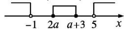
则  $\left\{ \begin{array}{l} 2a \geq -1, \\ a + 3 \leq 5, \\ 2a \leq a + 3, \end{array} \right.$
解得  $-\frac{1}{2} \leq a \leq 2.$
综上所述， $a$  的取值范围是  $\left\{a \left| \frac{-1}{2} \leq a \leq 2 \text{ 或 } a > 3 \right.\right\}$ .
(2)由  $A \cup B = \mathbf{R}$ , 将集合  $A, B$  在数轴上表示出来, 如图所示,
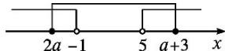
则  $\left\{ \begin{array}{l} 2a \leq -1, \\ a + 3 \geq 5, \end{array} \right.$
解得  $a \in \varnothing$

### 反思感悟
当出现交集为空集的情形时，应首先考虑已知集合有没有可能为空集，其次在与不等式有关的集合的交、并运算中，数轴分析法直观清晰，应重点考虑.
【变式训练2】已知集合  $A = \{x\mid -1 <   x <   1\} ,B = \{x|x <   a\}$
(1)若  $A\cap B = \emptyset$  ，求实数  $a$  的取值范围；  
(2)若  $A\cup B = \{x|x < 1\}$  ，求实数  $a$  的取值范围
解 (1) 将集合  $A, B$  在数轴上表示出来，如图所示，由图可知，要使  $A \cap B = \emptyset$  ，实数  $a$  需满足  $a \leq -1$ .
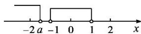
故实数  $a$  的取值范围为  $\{a|a\leq -1\}$
(2)将集合  $A, B$  在数轴上表示出来, 如图所示,
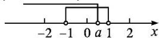
要使  $A \cup B = \{x \mid x < 1\}$ , 实数  $a$  需满足  $-1 < a \leq 1$ ,
即  $a$  的取值范围为  $\{a| - 1 < a\leq 1\}$
### 探究三并集、交集性质的运
### 用
##### 【例3】已知集合  $A = \{x|0\leq x\leq 4\}$  ，集合  $B = \{x|m + 1\leq x\leq 1 - m\}$  ，且  $A\cup B = A$  ，求实数  $m$  的取值范围.
解  $\because A\cup B = A,\therefore B\subseteq A.$
$\begin{array}{l} \because A = \{x \mid 0 \leq x \leq 4 \} \neq \emptyset , \\ \therefore B = \emptyset \text {或} B \neq \emptyset . \\ \end{array}$
当  $B = \emptyset$  时,有  $m + 1 > 1 - m,$  解得  $m > 0$
当  $B \neq \emptyset$  时, 在数轴上表示出集合  $A$  和  $B$ , 如图所示
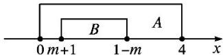
$\because B \subseteq A, \therefore \left\{ \begin{array}{c} m + 1 \leq 1 - m, \\ 0 \leq m + 1, \\ 1 - m \leq 4, \end{array} \right.$
解得  $-1\leq m\leq 0$
综上所得，实数  $m$  的取值范围是  $\{m|m\geq -1\}$
### 延伸探究
将本例中“ $A \cup B = A$ ”改为“ $A \cap B = A$ ”，其他条件不变，求实数  $m$  的取值范围
解  $\because A \cap B = A, \therefore A \subseteq B.$  用数轴表示出集合  $A, B$  如图，
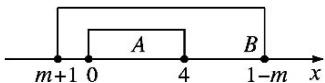
$\text {得} \left\{ \begin{array}{c} {{m + 1 \leq 1 - m,}} \\ {{m + 1 \leq 0,}} \\ {{1 - m \geq 4,}} \end{array} \right.$
解得  $m \leq -3$ .
故实数  $m$  的取值范围是  $\{m|m\leq -3\}$

### 反思感悟
##### 1. 在利用集合的交集、并集性质解题时, 若条件中出现  $A \cap B = A$  或  $A \cup B = B$ , 应首先转化为  $A \subseteq B$ , 然后用集合间的关系解决问题. 并注意不要漏掉  $A = \emptyset$  的情况.
##### 2. 集合运算常用的性质
(1)  $A \cup B = B \Leftrightarrow A \subseteq B$ .  
(2)  $A \cap B = A \Leftrightarrow A \subseteq B$ .  
(3)  $A \cap B = A \cup B \Leftrightarrow A = B$  等
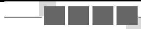
### 思想方法
等价转化思想与分类讨论思想在集合中的应用
##### 【典例】设集合  $A = \{x|x^{2} - 3x + 2 = 0\}, B = \{x|x^{2} + 2(a - 1)x + (a^{2} - 5) = 0\}$ , 且  $A \cup B = A$ , 求实数  $a$  的取值范围.
审题视角  $A \cup B = A \rightarrow B \subseteq A \rightarrow$  讨论集合  $B \rightarrow$  列方程  $\rightarrow$  求  $a$
解 由  $x^{2} - 3x + 2 = 0$  ，得  $x = 1$  或  $x = 2$  ，故  $A = \{1,2\}$
因为  $A \cup B = A$ , 所以  $B \subseteq A$ .
当  $\Delta = 4(a - 1)^2 - 4(a^2 - 5) = 24 - 8a < 0$
即  $a > 3$  时， $B = \emptyset$ ，满足条件；
当  $\Delta = 24 - 8a = 0$  ，即  $a = 3$  时，  $B = \{-2\}$  不满足条件；
当  $\Delta = 24 - 8a > 0$  ，即  $a < 3$  时， $x^{2} + 2(a - 1)x + (a^{2} - 5) = 0$  有两个不相等的实数根. 又  $B \subseteq A$  ，所以1,2均为关于  $x$  的方程  $x^{2} + 2(a - 1)x + (a^{2} - 5) = 0$  的实根，即  $1 + 2(a - 1) + (a^{2} - 5) = 0$  ，且  $4 + 4(a - 1) + (a^{2} - 5) = 0$  ，这是不可能的.
综上,实数  $a$  的取值范围为  $\{ a \mid  a > 3\}$  .

### 方法点睛
##### 1. 等价转化思想: 涉及  $A \cap B = A, A \cup B = B$  这类问题的运算时, 常借助于交集、并集的定义及集合间的关系等价变形. 如  $A \cap B = A \Leftrightarrow A \subseteq B, A \cup B = B \Leftrightarrow A \subseteq B$ .  
##### 2.分类讨论思想：若  $B\subseteq A$  ，且集合  $B$  受参数的影响不确定时，常分  $B = \emptyset$  和  $B\neq \emptyset$  两类分别求解
【变式训练】若集合  $P = \{1,2,3,m\}, Q = \{m^2,3\}$ , 且满足  $P \cap Q = Q$ , 求  $m$  的值.
解 由  $P\cap Q = Q$  ，可知  $Q\subseteq P$
得  $m^2 = 1$  或  $m^2 = 2$  或  $m^2 = m$
解得  $m = \pm 1$  或  $m = \pm \sqrt{2}$  或  $m = 0$ .
经检验, 当  $m = 1$  时不满足集合中元素的互异性, 舍去
故  $m = -1$  或  $m = \pm \sqrt{2}$  或  $m = 0$ .
### 随堂练习
##### 1.设集合  $A = \{1,2,5,7\} ,B = \{2,4,5\}$  ，则  $A\cup B$  等于(
$\quad$A.{1,2,4,5,7}
$\quad$B.{3,4,5}
$\quad$C.{5}
$\quad$D.{2,5}

<span class="fake-tag">答案</span> A
##### 2. 已知集合  $A = \{1, 2, 3, 4\}, B = \{2, 4, 6, 8\}$ , 则  $A \cap B$  中元素的个数为( )
$\quad$A.1
$\quad$B.2
$\quad$C.3
$\quad$D.4

<span class="fake-tag">解析</span> 由题意可得  $A \cap B = \{2,4\}$ , 故  $A \cap B$  中有 2 个元素.

<span class="fake-tag">答案</span> B
##### 3.若集合  $A = \{x\mid -1\leq x <   2\} ,B = \{x\mid 0 <   x\leq 3\}$  ，则  $A\cup B =$  _______， $A\cap B =$

<span class="fake-tag">解析</span> 用数轴表示出集合  $A$  和  $B$ , 如图所示,
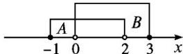
故  $A\cup B = \{x| - 1\leq x\leq 3\} ,A\cap B = \{x|0 <   x <   2\}$

<span class="fake-tag">答案</span>  $\{x\vert -1\leq x\leq 3\}$ $\{x\vert 0 <   x <   2\}$
##### 4.设集合  $A = \{a,b\} ,B = \{a + 1,5\}$  ，若  $A\cap B = \{2\}$  ，则  $A\cup B =$

<span class="fake-tag">解析</span>  $\because A = \{a,b\} ,B = \{a + 1,5\} ,A\cap B = \{2\} ,$
$\therefore 2 \in B,$
$\therefore a + 1 = 2$  ，得  $a = 1$
又  $2\in A,\therefore b = 2$
$\therefore A \cup B = \{1,2,5\}$

<span class="fake-tag">答案</span> {1,2,5}
##### 5.已知集合  $A = \{x|x <   - 2$  ，或  $x > 4\} ,B = \{x|5 - 2x\leq 3\}$  ，求  $A\cup B,A\cap B.$
解 化简集合  $B$  ，得  $B = \{x|x\geq 1\}$  ，用数轴表示集合  $A,B$  如图所示，
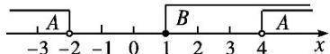
故  $A\cup B = \{x|x <   - 2,$  或  $x\geq 1\} ,A\cap B = \{x|x > 4\}$
### 巩固提升
### A组
##### 1.已知集合  $A = \{1,2,3,5,7,11\} ,B = \{x|3 <   x <   15\}$  ，则  $A\cap B$  中元素的个数为(
$\quad$A.2
$\quad$B.3
$\quad$C.4
$\quad$D.5

<span class="fake-tag">解析</span>
由题意, 知  $A \cap B = \{5, 7, 11\}$ , 故  $A \cap B$  中元素的个数为 3.

<span class="fake-tag">答案</span>
##### 2.设集合  $A = \{x\mid -4 <   x <   3\} ,B = \{x\mid x\leq 2\}$  ，则  $A\cap B$  等于（
$\quad$A.  $\{x\vert -4 <   x <   3\}$
$\quad$B.  $\{x\vert -4 <   x\leq 2\}$
$\quad$C.  $\{x \mid x \leq 2\}$
$\quad$D.  $\{x \mid x < 3\}$

<span class="fake-tag">解析</span> 如图,把集合  $A,B$  在数轴上表示出来，得  $A\cap B = \{x| - 4 <   x\leq 2\}$
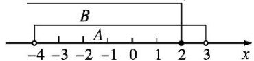

<span class="fake-tag">答案</span> B
##### 3.(多选题)若集合  $M \subseteq N$ , 则下列结论正确的是( )
$\quad$A.  $M \cap N = M$
$\quad$B.MUN=N
$\quad$C.  $M \subseteq (M \cap N)$
$\quad$D.  $(M \cup N) \subseteq N$

<span class="fake-tag">解析</span>集合  $M \subseteq N$
$\therefore M \cap N = M, M \cup N = N, M \subseteq (M \cap N), (M \cup N) \subseteq N.$  故选 ABCD.

<span class="fake-tag">答案</span> ABCD
##### 4.设集合  $M = \{1,2\}$  ，则满足  $M\cup N = \{1,2,3,4\}$  的集合  $N$  的个数是( )
$\quad$A.1
$\quad$B.3
$\quad$C.2
$\quad$D.4

<span class="fake-tag">解析</span>  $\because M = \{1,2\} ,M\cup N = \{1,2,3,4\} ,$
$\therefore N = \{3,4\}$  或  $\{1,3,4\}$  或  $\{2,3,4\}$  或  $\{1,2,3,4\}$ ，即符合题意的集合  $N$  有 4 个.

<span class="fake-tag">答案</span> D
##### 5.若集合  $M = \{(x,y)|x + y = 0\} ,N = \{(x,y)|x^2 +y^2 = 0,x\in \mathbf{R},y\in \mathbf{R}\}$  ，则有（
$\quad$A.  $M \cup N = M$
$\quad$B.MUN=N
$\quad$C.M∩N=M
$\quad$D.M∩N=0

<span class="fake-tag">解析</span> 集合  $M$  表示第二、第四象限角的平分线上的所有点,集合  $N$  表示坐标原点(0,0),故
$M\cup N = M,M\cap N = N.$

<span class="fake-tag">答案</span> A
##### 6.已知集合  $A = \{2,3\} ,B = \{2,6,8\} ,C = \{6,8\}$  ，则  $(C\cup A)\cap B =$

<span class="fake-tag">解析</span>  $\because A \cup C = \{2,3\} \cup \{6,8\} = \{2,3,6,8\}$
$\therefore (C \cup A) \cap B = \{2, 3, 6, 8\} \cap \{2, 6, 8\} = \{2, 6, 8\}$ .

<span class="fake-tag">答案</span> {2,6,8}
##### 7.已知集合  $A = \{1,2\} ,B = \{a,a^2 +3\}$  ，若  $A\cap B = \{1\}$  ，则实数  $a$  的值为

<span class="fake-tag">解析</span>  $\because A\cap B = \{1\}$
$\therefore a = 1$  或  $a^2 +3 = 1$
当  $a = 1$  时， $A = \{1,2\}, B = \{1,4\}$ ，满足  $A \cap B = \{1\}$
当  $a^2 + 3 = 1$  时, 无解, 故  $a = 1$ .

<span class="fake-tag">答案</span> 1
##### 8.已知集合  $A = \{x|x\leq 1\} ,B = \{x|x\geq a\}$  ，且  $A\cup B = \mathbf{R}$  ，则实数  $a$  的取值范围是

<span class="fake-tag">解析</span> 用数轴表示集合  $A, B$ ，如图所示，
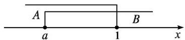
因为  $A \cup B = \mathbf{R}$ , 则在数轴上实数  $a$  与 1 重合或在 1 的左边, 所以  $a \leq 1$ .

<span class="fake-tag">答案</span>  $a\leq 1$
##### 9.已知集合  $A = \left\{x\left|\left\{ \begin{array}{l}3 - x > 0,\\ 3x + 6 > 0 \end{array} \right.\right.\right.$  集合  $B = \{x|2x - 1 <   3\}$  ，求  $A\cap B,A\cup B$
解解不等式组  $\left\{ \begin{array}{l}3 - x > 0,\\ 3x + 6 > 0, \end{array} \right.$  得-2<x<3,
即  $A = \{x\} - 2 < x < 3$ .
解不等式  $2x - 1 < 3$  ，得  $x < 2$  ，即  $B = \{x \mid x < 2\}$
在数轴上分别表示集合  $A, B$ ，如图所示
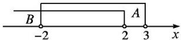
则  $A\cap B = \{x| - 2 <   x <   2\} ,A\cup B = \{x|x <   3\}$
##### 10.已知集合  $A = \{x|x^2 +4x = 0\} ,B = \{x|x^2 +2(a + 1)x + a^2 -1 = 0\} .$
(1)若  $A \cup B = B$ , 求实数  $a$  的值;  
(2)若  $A\cap B = B$  ，求实数  $\alpha$  的取值范围
解 (1)由题意，知  $A = \{-4,0\}$
若  $A \cup B = B$ ，则  $B = A = \{-4,0\}$ ，解得  $a = 1$
(2)由题意，知  $A = \{-4,0\}$
若  $A\cap B = B$  ，则  $B\subseteq A$
① 若  $B$  为空集, 则  $\Delta = 4(a + 1)^2 - 4(a^2 - 1) = 8a + 8 < 0$ , 解得  $a < -1$ ;  
② 若  $B$  只有一个元素, 则  $\Delta = 4(a + 1)^2 - 4(a^2 - 1) = 8a + 8 = 0$ , 解得  $a = -1$ .
将  $a = -1$  代入方程  $x^{2} + 2(a + 1)x + a^{2} - 1 = 0,$
得  $x^{2} = 0$  ，即  $x = 0,B = \{0\}$  ，符合要求；
③ 若  $B = A = \{-4,0\}$ , 则  $a = 1$
综上所述,实数  $a$  的取值范围为  $\{ a \mid  a \leq   - 1$  或  $a = 1\}$  .
### B组
##### 1.已知集合  $A = \{(x,y)|x + y = 2\} ,B = \{(x,y)|x - y = 4\}$  ，则集合  $A\cap B$  等于（）
$\quad$A.  $x = 3, y = -1$
$\quad$B.(3,-1)
$\quad$C.{3,-1}
$\quad$D.{(3,-1)}

<span class="fake-tag">解析</span> 因为集合  $A, B$  为点集，所以  $A \cap B$  也为点集
解方程组  $\left\{ \begin{array}{l}x + y = 2,\\ x - y = 4, \end{array} \right.$  得  $x = 3$
故  $A\cap B = \{(3, - 1)\}$

<span class="fake-tag">答案</span> D
##### 2.已知集合  $A = \{x\mid -3\leq x\leq 8\} ,B = \{x|x > a\}$  ，若  $A\cap B\neq \emptyset$  ，则  $a$  的取值范围是(
$\quad$A.  $a < 8$
$\quad$B.a>8
$\quad$C.a>-3
$\quad$D.-3<a≤8

<span class="fake-tag">解析</span>  $A = \{x\mid -3\leq x\leq 8\} ,B = \{x|x > a\}$  ，要使  $A\cap B\neq \emptyset$  ，借助数轴，可知  $a <   8$
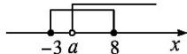

<span class="fake-tag">答案</span> A
##### 3.设集合  $S = \{x|x > 5$  ，或  $x <   - 1\} ,T = \{x|a <   x <   a + 8\} ,S\cup T = \mathbf{R}$  ，则  $a$  的取值范围是(
$\quad$A.  $-3 < a < -1$
$\quad$B.  $-3 \leq a \leq -1$
$\quad$C.  $a \leq -3$  或  $a \geq -1$
$\quad$D.  $a <   - 3$  或  $a > - 1$

<span class="fake-tag">解析</span>  $\because S \cup T = \mathbf{R}, \therefore \begin{cases} a + 8 > 5, \\ a < -1, \end{cases} \therefore -3 < a < -1.$

<span class="fake-tag">答案</span> A
##### 4.(多选题)设集合  $M = \{x|(x - a)(x - 3) = 0\} ,N = \{x|(x - 4)(x - 1) = 0\}$  ，则下列说法不正确的是( )
$\quad$A.若  $M \cup N$  中有 4 个元素, 则  $M \cap N \neq \emptyset$  
$\quad$B.若  $M \cap N \neq \emptyset$ , 则  $M \cup N$  中有 4 个元素  
$\quad$C.若  $M\cup N = \{1,3,4\}$  ，则  $M\cap N\neq \emptyset$  
$\quad$D.若  $M\cap N\neq \emptyset$  ，则  $M\cup N = \{1,3,4\}$

<span class="fake-tag">解析</span> 当  $a \neq 1,3,4$  时， $M = \{3,a\}, M \cap N = \emptyset, M \cup N = \{1,3,4,a\}$ ，故A不正确；
当  $a = 1$  时， $M = \{1,3\}, M \cap N = \{1\}, M \cup N = \{1,3,4\}$ ；当  $a = 4$  时， $M = \{3,4\}, M \cap N = \{4\}, M \cup N = \{1,3,4\}$ ，故B不正确，D正确；
当  $a = 3$  时， $M = \{3\}, M \cap N = \emptyset, M \cup N = \{1, 3, 4\}$ ，故 C 不正确。

<span class="fake-tag">答案</span> ABC
##### 5.已知集合  $A = \{0,2,a\} ,B = \{1,a^2\}$  .若  $A\cup B = \{0,1,2,4,16\}$  ，则  $a$  的值为

<span class="fake-tag">解析</span>  $\because A = \{0,2,a\} ,B = \{1,a^2\} ,A\cup B = \{0,1,2,4,16\} ,\therefore \left\{ \begin{array}{l}a = 4,\\ a^2 = 16 \end{array} \right.$  或  $\left\{ \begin{array}{l}a^2 = 4,\\ a = 16 \end{array} \right.$  （舍去），解得  $a = 4$

<span class="fake-tag">答案</span> 4
##### 6.已知集合  $A = \{x|x <   1$  ，或  $x > 5\} ,B = \{x|a\leq x\leq b\}$  ，且  $A\cup B = \mathbf{R},A\cap B = \{x|5 <   x\leq 6\}$  ，则  $2a - b =$

<span class="fake-tag">解析</span> 根据题意,把集合  $A,B$  在数轴上表示出来,如图所示,可知  $a = 1,b = 6,{2a} - b =  - 4$  .
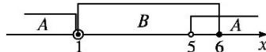

<span class="fake-tag">答案</span> -4
##### 7.已知集合  $A = \{x|2x^{2} - ax + b = 0\}, B = \{x|bx^{2} + (a + 2)x + 5 + b = 0\}$  ，且  $A\cap B = \left\{\frac{1}{2}\right\}$  求AUB
解  $\because A\cap B = \left\{\frac{1}{2}\right\} ,\therefore \frac{1}{2}\in A,$  且  $\frac{1}{2}\in B.$
$\therefore \left\{ \begin{array}{c} 2 \times \left(\frac {1}{2}\right) ^ {2} - \frac {1}{2} a + b = 0, \\ b \cdot \left(\frac {1}{2}\right) ^ {2} + \frac {1}{2} \backslash (a + 2 \backslash) + 5 + b = 0, \end{array} \right.$
解得  $\begin{array}{l}a = \frac{-43}{9},\\ b = \frac{-26}{9}, \end{array}$
$\therefore A = \{x \mid 1 8 x ^ {2} + 4 3 x - 2 6 = 0 \} = \left\{\frac {1}{2}, - \frac {2 6}{9} \right\},$
$B = \{x \mid 2 6 x ^ {2} + 2 5 x - 1 9 = 0 \} = \left\{\frac {1}{2}, - \frac {1 9}{1 3} \right\},$
$\therefore A \cup B = \left(\frac {1}{2}, - \frac {2 6}{9}, - \frac {1 9}{1 3}\right).$
##### 8. 已知集合  $A = \{x \mid 2a + 1 \leq x \leq 3a - 5\}$ ,  $B = \{x \mid x < -1 \text{, 或 } x > 16\}$ .
(1)若  $A\cap B = \emptyset$  ，求实数  $a$  的取值范围；  
(2)若  $A\subseteq (A\cap B)$  ,求实数  $\alpha$  的取值范围
解 (1) 若  $A = \emptyset$ , 则  $A \cap B = \emptyset$  成立.
此时  $2a + 1 > 3a - 5$  ，即  $a < 6$
若  $A \neq \emptyset$ , 如图, 把集合  $A, B$  在数轴上表示出来

解得  $6 \leq a \leq 7$ .
综上，满足  $A \cap B = \emptyset$  的实数  $a$  的取值范围是  $\{a | a \leq 7\}$
(2)因为  $A\subseteq (A\cap B)$
所以  $A \cap B = A$ ，即  $A \subseteq B$ .
显然  $A = \emptyset$  满足条件, 此时  $a < 6$ .
若  $A \neq \emptyset$ , 如图, 把集合  $A, B$  在数轴上表示出来

### 第2课时 补集
<table><tr><td>课标定位素养阐释</td><td>1.在具体情境中,了解全集的含义.
##### 2.理解在给定集合中一个子集的补集的含义,能求给定子集的补集.
##### 3.能使用Venn图表达集合的基本运算,进一步体会图形对理解抽象概念的作用.
##### 4.提升逻辑推理与数学运算素养.</td></tr></table>
### 新知导学
### 一、全集
##### 1.方程  $(x - 2)(x^2 -3) = 0$  的解集在有理数范围内与在实数范围内有什么不同?通过这个问题,你能得到什么启示？
提示 方程在有理数范围内的解集为  $\{2\}$ , 在实数范围内的解集为  $\{2, \sqrt{3}, -\sqrt{3}\}$ . 在数学中, 很多问题都是在某一范围内进行研究. 如本问题在有理数范围内求解与在实数范围内求解是不同的. 类似这些给定的集合就是全集.
##### 2. 一般地,如果一个集合含有所研究问题中涉及的所有元素,那么就称这个集合为全集,通常记作  $\underline{U}$ .
### 二、补集
##### 1.  $A = \{\text{高一(1)班加入排球队的同学}\}, B = \{\text{高一(1)班没有加入排球队的同学}\}, U = \{\text{高一(1)班的同学}\}$ .
(1) 集合  $A, B, U$  有何关系？  
(2)  $B$  中的元素与  $U$  和  $A$  有何关系？
提示 (1)  $U = A \cup B$ .
(2) 集合  $B$  中的元素在  $U$  中, 但不在  $A$  中.
##### 2.补集
<table><tr><td rowspan="2">文字语言符号语言</td><td>对于一个集合A,由全集U中不属于集合A的所有元素组成的集合称为集合A相对于全集U的补集,简称为集合A的补集,记作CUA</td></tr><tr><td>CUA={x|x∈U,且x∉A}</td></tr><tr><td>图形语言</td><td>U
A
CUA</td></tr></table>
##### 3.(1)(2024·上海高考改编)已知全集  $U = \{1,2,3,4,5\}$ , 集合  $A = \{2,4\}$ , 则  $\mathsf{C}_U A =$  
(2)已知全集  $U$  为  $\mathbf{R}$ , 集合  $A = \{x \mid -1 \leq x < 2\}$ , 则  $\mathsf{C}_U A =$  

<span class="fake-tag">答案</span> (1){1,3,5} (2){x|x<-1,或  $x\geq 2$  }
### 三、全集、补集的性质
##### 1. 借助 Venn 图, 你能化简  $\mathsf{C}_U(\mathsf{C}_U A), \mathsf{C}_U U, \mathsf{C}_U \emptyset$  吗?
提示  $\mathsf{C}_U(\mathsf{C}_UA) = A,\mathsf{C}_UU = \emptyset ,\mathsf{C}_U\emptyset = U.$
##### 2. 借助 Venn 图, 你能分析出集合  $A$  与  $\mathsf{C}_U A$  之间有什么关系吗?
提示  $A\cap (\mathbb{C}_U A) = \emptyset ,A\cup (\mathbb{C}_U A) = U.$
### 【思考辨析】
判断下列说法是否正确，正确的在后面的括号内打“√”，错误的打“×”。
(1)若在全集  $U$  中研究问题,则集合  $U$  没有补集. (×)  
(2)集合  $\mathrm{C}_B\mathrm{C}$  与  $\mathbb{C}_A\mathbb{C}$  相等. (×)  
(3)集合  $A$  与集合  $A$  在全集  $U$  中的补集没有公共元素. (√)

### 释疑解惑
### 探究一集合的补集运算
##### 【例1】(1)已知全集 \(U\) ,集合 \(A = \{1,3,5,7\} ,\mathsf{C}_U A = \{2,4,6\} ,\mathsf{C}_U B = \{1,4,6\}\) ，则集合 \(B = \_ \_ \_ \_ \_ \_ \_ \_ \_ \_ \_ \_ \_ \_ \_ \_ \_ \_ \_ \_ \_ \_ \_ \_ \_ \_ \_ \_ \_ \_ \_ \_ \_ \_ \_ \_ \_ \_ \_ \_ \_ \_ \_ \_ \_ \_ \_ \_ \_ \_ \_
\[ B = \{1,3,5,7\} ,\mathsf{C}_U A = \{2,4,6\} ,\mathsf{C}_U B = \{1,4,6\} ,\text{则集合} B = \underline{\quad} _{\quad}
(2)已知全集  $U = \{x\mid x\leq 5\}$  ，集合  $A = \{x\vert -3\leq x <   5\}$  ，则  $\mathbf{C}_{U}A =$
分析 (1)先结合条件，由补集的性质求出全集  $U$  ，再由补集的定义求集合  $B$  ，也可借助Venn图求解.
(2)利用补集的定义，借助数轴的直观性求解

<span class="fake-tag">解析</span> (1)(方法一)  $\because A = \{1,3,5,7\}, C_U A = \{2,4,6\}$ ,
$\therefore U = \{1, 2, 3, 4, 5, 6, 7 \}.$
又  $\mathsf{C}_U B = \{1,4,6\} ,\therefore B = \{2,3,5,7\}$
(方法二)借助 Venn 图,如图所示.

由图可知  $B = \{2,3,5,7\}$
(2)将全集  $U$  和集合  $A$  分别表示在数轴上,如图所示.

由补集定义可得  $\mathsf{C}_U A = \{x | x < -3\}$  或  $x = 5$ .

<span class="fake-tag">答案</span> (1){2,3,5,7} (2){x|x<-3,或  $x = 5$  }
### 延伸探究
##### 1.若把(2)中的条件“  $U = \{x\mid x\leq 5\}$  ”换成“  $U = \{x\mid x\geq -3\}$  ”,集合A不变，求  $\mathsf{C}_{U}A$
解  $\because U = \{x|x\geq -3\} ,A = \{x\vert -3\leq x <   5\}$
$\therefore C _ {U} A = \{x \mid x \geq 5 \}.$
##### 2.若把(2)中的条件“  $U = \{x\mid x\leq 5\}$  ”换成“  $U = \{x\vert -6 <   x <   6\}$  ”集合A不变，求CU.A
解  $\because U = \{x\vert -6 <   x <   6\} ,A = \{x\vert -3\leq x <   5\} ,$
$\therefore \mathbb{C}_U A = \{x| - 6 <   x <   - 3,$  或  $5\leq x <   6\}$
##### 3. 若把(2)中的条件“ $U = \{x \mid x \leq 5\}$ ”换成“ $U = \mathbf{R}$ ”，“ $A = \{x \mid -3 \leq x < 5\}$ ”换成“ $A = \{x \mid -3 \leq x < 5\}$ ，或  $x = 7\}$ ”，求  $\mathsf{C}_{U} A$ 。
解  $\because U = R, A = \{x \mid -3 \leq x < 5\}$  或  $x = 7$ ,
$\therefore \mathbb{C}_U A = \{x|x < -3,$  或  $5\leq x < 7$  ，或  $x > 7\}$
### 反思感悟
### 求集合补集的方法
(1)定义法:当集合是由列举法表示时,可利用定义直接求解.  
(2)Venn图法:借助Venn图可直观地求出全集及补集  
(3)数轴法:当集合是用描述法表示的连续数集时,可借助数轴求解,但需注意端点值的取舍问题.
### 探究二并集、交集与补集的
### 综合运算
##### 【例2】设全集为  $\mathbf{R}, A = \{x \mid -2 \leq x < 3\}, B = \{x \mid x < 2, \text{或} x > 4\}$ , 求  $\mathsf{C}_{\mathbb{R}}(A \cup B)$  及  $(\mathsf{C}_{\mathbb{R}}A) \cap B$ .
解 把全集  $\mathbf{R}$  和集合  $A, B$  在数轴上表示如下：

由图知  $A \cup B = \{x \mid x < 3$ , 或  $x > 4\}$
则  $\mathsf{C}_{\mathbb{R}}(A\cup B) = \{x|3\leq x\leq 4\}$
由于  $\mathsf{C}_{\mathbb{R}}A = \{x|x < -2,$  或  $x\geq 3\}$
故  $(\mathsf{C}_{\mathbb{R}}A)\cap B = \{x|x <   - 2$  ，或  $x > 4\}$

### 反思感悟
交集、并集、补集的综合运算的两种主要情况
(1)对于有限集,先把集合中的元素一一列举出来,再结合交集、并集、补集的定义求解,在解答过程中也常借助于 Venn 图.  
(2)对于连续的无限集,常借助于数轴,先把已知集合及全集分别表示在数轴上,再根据交集、并集、补集的定义求解,解答过程中注意端点值的取舍问题.
【变式训练1】已知全集  $U = \{0,1,2,3,4,5,6,7,8,9\}$ , 集合  $A = \{0,1,3,5,8\}$ , 集合  $B = \{2,4,5,6,8\}$ , 则  $(C_U A) \cap (C_U B)$  等于( )
$\quad$A.{5,8}
$\quad$B.{7,9}
$\quad$C.{0,1,3}
$\quad$D.{2,4,6}

<span class="fake-tag">解析</span>
因为  $\mathsf{C}_{U}A = \{2,4,6,7,9\}, \mathsf{C}_{U}B = \{0,1,3,7,9\}$ ，所以  $(\mathsf{C}_{U}A) \cap (\mathsf{C}_{U}B) = \{7,9\}$ .

<span class="fake-tag">答案</span>

### 探究三补集性质的运用
##### 【例3】已知集合  $A = \{x|x < a\}, B = \{x|1 < x < 3\}$
(1)若  $A\cup (\mathsf{C}_{\mathbb{R}}B) = \mathbb{R}$  ，求实数  $a$  的取值范围；  
(2)若  $A\subsetneq C_{R}B$  ，求实数  $\alpha$  的取值范围
分析 先求  $\mathsf{C}_{\mathsf{R}}B\to$  在数轴上表示集合  $A,\mathsf{C}_{\mathsf{R}}B$  结合数轴求  $a$  的取值范围
解  $\because B = \{x|1 <   x <   3\} ,\therefore C_{R}B = \{x|x\leq 1,$  或  $x\geq 3\}$
(1)要使  $A \cup (C_{R}B) = R$ , 结合数轴分析(如图),

可得  $a$  的取值范围为  $\{a|a\geq 3\}$
(2)要使  $A \subsetneq C_{R}B$ , 结合数轴分析(如图),


### 反思感悟
由含补集的运算求参数的取值范围时，常根据补集的定义及集合之间的关系，并借助数轴列出参数应满足的关系式求解，具体操作时要注意端点值的取舍.
【变式训练2】已知集合  $A = \{x|2a - 2 < x < a\}, B = \{x|1 < x < 2\}$ , 且  $A \subseteq C_{R}B$ , 求实数  $a$  的取值范围.
解  $\mathsf{C}_{\mathbb{R}}B = \{x|x\leq 1,$  或  $x\geq 2\} \neq \emptyset$
$A \subseteq C_{\mathbb{R}}B$  ，分  $A = \emptyset$  和  $A \neq \emptyset$  两种情况讨论
若  $A = \emptyset$  ，则有  $2a - 2\geq a$  ,即  $a\geq 2$
若  $A \neq \emptyset$ , 则有  $\left\{ \begin{array}{l} 2a - 2 < a, \\ a \leq 1 \end{array} \right.$  或  $\left\{ \begin{array}{l} 2a - 2 < a, \\ 2a - 2 \geq 2, \end{array} \right.$  即  $a \leq 1$ .
综上所述， $a$  的取值范围为  $\{a | a \leq 1 \text{ 或 } a \geq 2\}$

### 补集思想在解题中的应用
求补集的过程为我们研究问题提供了新思路: 若直接求  $A$  困难, 则使用“正难则反”的策略,先求  $\mathsf{C}_U A$ , 再由  $\mathsf{C}_U (\mathsf{C}_U A) = A$ , 求  $A$ .
##### 【典例】若集合  $A = \{x \mid ax^2 + 3x + 2 = 0\}$  中至多有一个元素, 求实数  $a$  的取值范围.
审题视角 本题集合  $A$  中至多有一个元素与集合  $A$  中有两个元素是对立的,先求集合  $A$  中有两个元素时  $a$  的取值范围,再利用补集思想求出  $A$  中至多有一个元素时  $a$  的取值范围.
解 当集合  $A$  中含有两个元素，即关于  $x$  的方程  $ax^2 + 3x + 2 = 0$  有两个不相等的实数根时，有  $\left\{ \begin{array}{l} a \neq 0, \\ \Delta = 9 - 8a > 0, \end{array} \right.$  解得  $a < \frac{9}{8}$ ，且  $a \neq 0$ .
在全集  $\mathbf{R}$  中, 集合  $\left\{a \mid a < \frac{9}{8}\right.$ , 且  $a \neq 0\}$  的补集是  $\left\{a \mid a \geq \frac{9}{8}\right.$ , 或  $a = 0\}$ ,
故满足题意的  $a$  的取值范围是  $\left\{a \mid a \geq \frac{9}{8}\right.$  或  $a = 0$ .

### 方法点睛
当正面情况较复杂时,从结论的反面入手是简化问题的一种常用手段,但要注意,从补集入手,必须明确全集是什么.
【变式训练】若集合  $A = \{x \mid x^2 - x + m = 0, x \in \mathbf{R}\}$  中至少含有一个元素, 则  $m$  的取值范围是

<span class="fake-tag">解析</span> 集合  $A$  中至少含有一个元素的反面是集合  $A$  中没有元素, 即  $\Delta = 1 - 4m < 0$ , 得  $m > \frac{1}{4}$ .
因此若集合  $A$  中至少含有一个元素, 则  $m \leq \frac{1}{4}$ ,
即  $m$  的取值范围是  $\left\{m \mid m \leq \frac{1}{4}\right\}$ .
### 随堂练习
##### 1.已知全集  $U = \{0,1,3,5,6,8\}$  ，集合  $A = \{1,5,8\} ,B = \{2\}$  ，则集合  $(C_U A)\cup B$  等于( )
$\quad$A.{0,2,3,6} 
$\quad$B.{0,3,6}  
$\quad$C.{2,1,5,8} 
$\quad$D.0

<span class="fake-tag">解析</span>  $\mathsf{C}_{U}A = \{0,3,6\} ,(\mathsf{C}_{U}A)\cup B = \{0,2,3,6\} .$

<span class="fake-tag">答案</span> A
##### 2.设集合  $A = \{1,2,3,4,5,6\} ,B = \{x|2 <   x <   5\}$  ，则  $A\cap (\mathbb{C}_{\mathbb{R}}B)$  等于（
$\quad$A.{2,3,4,5} 
$\quad$B.{1,2,5,6}  
$\quad$C.{3,4} 
$\quad$D.{1,6}

<span class="fake-tag">解析</span> 因为  $\mathsf{C}_{\mathbb{R}}B = \{x|x\leq 2$  ，或  $x\geq 5\} ,A = \{1,2,3,4,5,6\}$  ，所以  $A\cap (\mathbb{C}_R B) = \{1,2,5,6\}$

<span class="fake-tag">答案</span> B
##### 3.已知全集  $U = \{1,2,3,4\}$  ，集合  $A = \{1,2\} ,B = \{2,3\}$  ，则  $\mathbb{C}_U(A\cup B) =$

<span class="fake-tag">解析</span>  $\because A = \{1,2\} ,B = \{2,3\} ,$
$\therefore A \cup B = \{1, 2, 3 \}, \therefore C _ {U} (A \cup B) = \{4 \}.$

<span class="fake-tag">答案</span> {4}
##### 4.设  $U = \mathbf{R},A = \{x|a\leq x\leq b\} ,\mathbb{C}_{U}A = \{x|x <   3$  ，或  $x > 4\}$  ，则  $a + b =$

<span class="fake-tag">解析</span>  $\because U = \mathbf{R}, A = \{x | a \leq x \leq b\}$ ,
$\therefore \mathbb{C}_{U}A = \{x|x < a$  ，或  $x > b\}$
又  $\mathsf{C}_{\mathsf{U}}A = \{x|x < 3$  ，或  $x > 4\}$  ，：  $a = 3,b = 4,a + b = 7$

<span class="fake-tag">答案</span> 7
##### 5.已知全集  $U = \mathbf{R}$  ,集合  $A = \{x\mid 3\leq x <   10\} ,B = \{x\mid 2 <   x\leq 7\}$  ，求：
(1)  $A \cap B$ ;
(2)  $\mathsf{C}_U(A\cup B)$
解  $(1)A\cap B = \{x|3\leq x\leq 7\} .$
(2)  $\because A \cup B = \{x \mid 2 < x < 10\}$ ,
$\therefore \mathbb{C}_U(A\cup B) = \{x|x\leq 2,$  或  $x\geq 10\}$

### 巩固提升
##### 1.已知全集  $U = \{1,2,3,4,5,6\} ,A = \{1,2,6\} ,B = \{2,4,5\}$  ，则  $(C_U A)\cap B$  等于( ）
$\quad$A.{4,5} 
$\quad$B.{1,2,3,4,5,6}
$\quad$C.{2,4,5} 
$\quad$D.{3,4,5}

<span class="fake-tag">解析</span>  $\because \mathbb{C}_U A = \{3,4,5\} ,\therefore (\mathbb{C}_U A)\cap B = \{4,5\} .$

<span class="fake-tag">答案</span> A
##### 2.设全集  $U = \{1,3,5,7,9\}$  ，集合  $A = \{1,|a - 5|,9\} ,\mathbb{C}_{U}A = \{5,7\}$  ，则  $a$  的值是(
$\quad$A.2 
$\quad$B.8
$\quad$C.-2或8 
$\quad$D.2或8

<span class="fake-tag">解析</span>  $\because A\cup (C_{U}A) = U,\therefore |a - 5| = 3,$
$\therefore a = 2$  或  $a = 8$
### 答案 D
##### 3.设全集为  $\mathbf{R}$  ，集合  $A = \{x|0 <   x <   2\} ,B = \{x|x\geq 1\}$  ，则  $A\cap (\mathbb{C}_{\mathbb{R}}B)$  等于(
$\quad$A.  $\{x \mid 0 < x \leq 1\}$
$\quad$B.  $\{x \mid 0 < x < 1\}$
$\quad$C.  $\{x \mid 1 \leq x < 2\}$
$\quad$D.  $\{x \mid 0 < x < 2\}$

<span class="fake-tag">解析</span>  $\because B = \{x\mid x\geq 1\} ,\therefore C_{R}B = \{x\mid x <   1\} .$
$\because A = \{x \mid 0 <   x <   2 \},$
$\therefore A \cap (\mathbb{C}_{\mathbb{R}}B) = \{x \mid 0 < x < 1\}$ . 故选 B.
### 答案 B
##### 4.(多选题)下列结论正确的有( )
$\quad$A.AUØ=Ø  
$\quad$B.  $\mathbb{C}_U(A\cup B) = (\mathbb{C}_U A)\cup (\mathbb{C}_U B)$  
$\quad$C.A∩B=B∩A  
$\quad$D.  $C_U(C_{UA}) = A$

<span class="fake-tag">解析</span> 对于  $A,A\cup \varnothing = A$  ，故A错误;
对于  $\mathrm{B},\mathbb{C}_U(A\cup B) = (\mathbb{C}_UA)\cap (\mathbb{C}_UB),$  故B错误;
对于  $C, A \cap B = B \cap A$ ，故 C 正确；
对于  $\mathrm{D},\mathbb{C}_U(\mathbb{C}_UA) = A$  ，故D正确.故选CD
### 答案 CD
##### 5.(多选题)已知  $U = \mathbf{R},A = \{x|x > 0\} ,B = \{x|x\leq -1\}$  ，则下列运算正确的是(
$\quad$A.  $A \cap  \left( {{\mathrm{C}}_{U}B}\right)  = \{ x \mid  x > 0\}$  
$\quad$B.AU(CUB)={x|x>-1}  
$\quad$C.B∩(CUA)={x|x≤-1}  
$\quad$D.BU(CUA)={x|x>0}

<span class="fake-tag">解析</span>  $\because \mathsf{C}_{U}A = \{x|x\leq 0\} ,\mathsf{C}_{U}B = \{x|x > - 1\} ,$
$\begin{array}{l} \therefore A \cap (\complement_ {U} B) = \{x | x > 0 \}, A \cup (\complement_ {U} B) = \{x | x > - 1 \}, \\ B \cap (\mathbb {C} _ {U} A) = \{x | x \leq - 1 \}, B \cup (\mathbb {C} _ {U} A) = \{x | x \leq 0 \}. \\ \end{array}$
### 答案 ABC
##### 6.设  $A,B$  是  $\mathbf{R}$  的两个子集,对于  $x\in \mathbb{R}$  ,定义：  $m = \left\{ \begin{array}{ll}0,x\notin A,\\ 1,x\in A, \end{array} \right.$
$n = \left\{ \begin{array}{ll}0,x\notin B,\\ 1,x\in B. \end{array} \right.$  若  $A\subseteq B,$  则对任意  $x\in \mathbf{R},m(1 - n) =$  ；若对任意  $x\in \mathbf{R},m + n = 1,$  则  $A,B$  的关系为

<span class="fake-tag">解析</span>  $\because A \subseteq B, \therefore$  当  $x \notin A$  时， $m = 0, m(1 - n) = 0$ ;
当  $x \in A$  时, 必有  $x \in B$ , 即  $m = n = 1, m(1 - n) = 0$ .
综上，  $m(1 - n) = 0$
对任意  $x\in \mathbf{R},m + n = 1$  
$\therefore m, n$  的值一个为 0 , 另一个为 1 , 即当  $x \in A$  时, 必有  $x \notin B$ , 或当  $x \in B$  时, 必有  $x \notin A$ .  
$\therefore A,B$  的关系为  $A = \mathbb{C}_{\mathbb{R}}B.$
### 答案  $0 A = C_{R}B$
##### 7.某班共30人，其中15人喜欢篮球运动，10人喜欢乒乓球运动，8人两项运动都不喜欢，则喜欢篮球运动但不喜欢乒乓球运动的人数为


<span class="fake-tag">解析</span> (方法一)如图,全班同学组成集合  $U$ , 喜欢篮球运动的组成集合  $A$ , 喜欢乒乓球运动的组成集合  $B$ , 则  $A \cap B$  中的人数为  $15 + 10 + 8 - 30 = 3$ , 所以喜欢篮球运动但不喜欢乒乓球运动的人数为 15-3=12.
(方法二)设所求人数为  $x$  ，则只喜欢乒乓球运动的人数为  $10 - (15 - x) = x - 5.$
可得  $15 + x - 5 = 30 - 8$  ，解得  $x = 12$

<span class="fake-tag">答案</span> 12
##### 8.已知全集  $U = \{x\mid 1\leq x\leq 5\} ,A = \{x\mid 1\leq x <   a\}$  ，若  $\mathsf{C}_U A = \{x\mid 2\leq x\leq 5\}$  ，则  $a =$

<span class="fake-tag">解析</span>  $\because A\cup (\mathbb{C}_U A) = U,\therefore A = \{x|1\leq x <   2\} ,\therefore a = 2.$

<span class="fake-tag">答案</span> 2
##### 9.已知全集  $U = \mathbf{R}$  ,集合  $A = \{x\vert -5 <   x <   5\} ,B = \{x\vert 0\leq x <   7\}$  ，求：
(1)  $A \cap B$ ; (2)  $A \cup B$ ; (3)  $A \cup (\complement_{U}B)$ ;
(4)  $B\cap (\mathbb{C}_U A)$  ； (5)(CUA)∩(CUB).
解 (1)如图  $①,A\cap B = \{x|0\leq x <   5\}$
(2)如图  $①, A \cup B = \{x \mid -5 < x < 7\}$ .
  
图  $①$
(3)如图②
  
图  $②$
$\mathsf{C}_U B = \{x|x < 0$  或  $x\geq 7\}$
$A\cup (\mathbb{C}_{U}B) = \{x|x <   5,$  或  $x\geq 7\}$
(4)如图③,
  
图  $③$
$\mathsf{C}_{\mathsf{U}}A = \{x|x\leq -5,$  或  $x\geq 5\}$ $B\cap (\mathsf{C}_{\mathsf{U}}A) = \{x|5\leq x <   7\} .$
(5)(方法一)  $\mathsf{C}_U B = \{x | x < 0$ , 或  $x \geq 7\}$ ,  $\mathsf{C}_U A = \{x | x \leq -5$ , 或  $x \geq 5\}$ ,
如图  $④$
  
图④
$(\mathsf{C}_{U}A)\cap (\mathsf{C}_{U}B) = \{x|x\leq -5,$  或  $x\geq 7\}$
(方法二)  $(\mathsf{C}_U A) \cap (\mathsf{C}_U B) = \mathsf{C}_U (A \cup B) = \{x | x \leq -5, \text{或} x \geq 7\}$ .
##### 10.已知全集  $U = \mathbf{R}$  ,集合  $A = \{x\vert -2\leq x\leq 5\} ,B = \{x\vert a + 1\leq x\leq 2a - 1\}$  ，且  $A\subseteq (\mathbb{C}_U B)$  ，求实数  $a$  的取值范围
解 若  $B = \emptyset$  ，则  $a + 1 > 2a - 1$  ，则  $a < 2$
此时  $\mathbf{C}_U B = \mathbf{R}$  ，即  $A\subseteq (\mathbf{C}_{U}B)$
若  $B \neq \emptyset$ , 则  $a + 1 \leq 2a - 1$ , 即  $a \geq 2$ ,
此时  $\mathsf{C}_U B = \{x|x < a + 1$  ，或  $x > 2a - 1\}$
由于  $A \subseteq (\mathsf{C}_U B)$ , 如图,

则  $a + 1 > 5$  ，即  $a > 4$
故实数  $a$  的取值范围为  $\{a|a < 2$ , 或  $a > 4\}$ .
## 1.4 充分条件与必要条件
## 1.4.1 充分条件与必要条件
<table><tr><td>课标定位素养阐释</td><td>1.通过对典型数学命题的梳理,理解充分条件的意义,理解判定定理与充分条件的关系.
##### 2.通过对典型数学命题的梳理,理解必要条件的意义,理解性质定理与必要条件的关系.
##### 3.体会充分条件与必要条件在表述数学内容和论证数学结论中的作用,提升逻辑推理与数学运算素养.</td></tr></table>
### 新知导学
### 一、命题的概念
##### 1. 下列语句的表述形式有什么特点？
① 若直线  $a \parallel b$ , 则直线  $a$  和直线  $b$  无公共点;  
(2) 同位角相等;  
(3) 两个面积相等的三角形全等;  
(4) 同一平面内垂直于同一条直线的两条直线平行.
提示 有两个特点:①都是陈述句;②都能够判断真假.
##### 2. 你能判断上述4个语句的真假吗？
提示  $①④$  为真命题;  $②③$  为假命题
##### 3. 命题有哪些表达形式?疑问句、祈使句、感叹句能否作为命题?
提示 命题的表达形式有语言、符号或式子;疑问句、祈使句、感叹句不能作为命题,它们不符合命题必须是陈述句的特点.
##### 4. 你能把“同位角相等”写成“若  $p$ ，则  $q$ ”的形式吗？
提示 若两个角为同位角,则这两个角相等.
##### 5.(1)一般地,我们把用语言、符号或式子表达的,可以判断真假的陈述句叫做命题.  
(2)判断为真的语句是真命题;判断为假的语句是假命题  
(3)“若  $p$ , 则  $q$ ”形式的命题中,  $p$  称为命题的条件,  $q$  称为命题的结论.
##### 6. 下列命题中是假命题的是( )
$\quad$A.5是15的约数
$\quad$B.对任意实数  $x$ , 有  $x^{2} < 0$
$\quad$C.对顶角相等 
$\quad$D.0不是奇数

<span class="fake-tag">解析</span> 对任意实数  $x$  ，有  $x^{2}\geq 0$  ，所以B为假命题.A,C,D均为真命题

<span class="fake-tag">答案</span> B
### 二、充分条件与必要条件
### 1.给出下列命题：
① 若整数  $a$  是 6 的倍数, 则整数  $a$  是 2 和 3 的倍数.  
② 若  $ab = 0$  ，则  $a = 0$  
(1)你能判断这两个命题的真假吗？  
(2)命题①中的条件和结论有什么关系?命题②中的呢?
提示 (1)①是真命题；②是假命题
(2)命题①中只要满足条件“整数  $a$  是6的倍数”，必有结论“整数  $a$  是2和3的倍数”；命题②中满足条件“ $ab = 0$ ”，不一定有结论“ $a = 0$ ”，还可能“ $b = 0$ ”。
### 2.(1)充分条件与必要条件
<table><tr><td>命题真 假</td><td>“若p,则q”为真命题</td><td>“若p,则q”为假命题</td></tr><tr><td>推出关 系</td><td>p=q</td><td>p≠q</td></tr><tr><td>条件关 系</td><td>p是q的充分条件,q是p的必 要条件</td><td>p不是q的充分条件,q不是p的必 要条件</td></tr></table>
(2)一般地,数学中的每一条判定定理都给出了相应数学结论成立的一个充分条件,每一条性质定理都给出了相应数学结论成立的一个必要条件.
##### 3.(1)  $p: a > 0, b > 0, q: ab > 0$  ，则  $p$  是  $q$  的 条件；
(2)  $p: \sqrt{x} > \sqrt{y}, q: x > y$ ，则  $q$  是  $p$  的 ______ 条件.

<span class="fake-tag">解析</span> (1)当  $a > 0, b > 0$  时, 显然  $ab > 0$  成立, 即  $p \Rightarrow q$ , 故  $p$  是  $q$  的充分条件.
(2)因为  $p \Rightarrow q$ , 所以  $q$  是  $p$  的必要条件.

<span class="fake-tag">答案</span> (1)充分 (2)必要
### 【思考辨析】
判断下列说法是否正确，正确的在后面的括号内打“√”，错误的打“×”。
(1)将命题改写成“若  $p$ , 则  $q$  的形式, 改法唯一.  $(x)$  
(2)举反例是判断一个命题是假命题的重要方法. (√)  
(3)在“若  $p$  ，则  $q$  ”的命题中，  $p$  是  $q$  的充分条件.  $(\times)$  
(4)若  $p$  是  $q$  的充分条件，则  $p$  是唯一的.  $(\times)$  
(5)  $x = 2$  是  $x^{2} - 4x + 4 = 0$  的必要条件.  $(\sqrt{})$
### 释疑解惑
### 探究一命题真假的判断
##### 【例1】把下列命题改写成“若  $p$  ，则  $q$  ”的形式，指出条件和结论，并判断命题的真假
(1)两个周长相等的三角形面积相等;  
(2)已知  $x, y$  为正整数，当  $y = x + 1$  时， $y = 3, x = 2$  
(3)当  $m > 1$  时， $x^{2} - 2x + m = 0$  无实根
解 (1)若两个三角形的周长相等,则这两个三角形的面积相等,条件是“两个三角形的周长相等”,结论是“这两个三角形的面积相等”,是假命题.
(2)已知  $x, y$  为正整数, 若  $y = x + 1$ , 则  $y = 3, x = 2$ , 条件是“已知  $x, y$  为正整数, 且  $y = x + 1$ ”, 结论是 “ $y = 3, x = 2$ ”, 是假命题.  
(3)若  $m > 1$  ，则  $x^{2} - 2x + m = 0$  无实根，条件是“  $m > 1$  ”，结论是“  $x^{2} - 2x + m = 0$  无实根”，是真命题

### 反思感悟
##### 1.将命题改写为“若  $p$  ，则  $q$  ”形式的方法及原则

### 2.判断命题真假的策略
(1)要判断一个命题是真命题,一般要有严格的证明或事实依据,比如根据已学过的定义、基本事实、定理证明或根据已知的正确结论推证.  
(2)要判断一个命题是假命题,只要举一个反例即可.
【变式训练1】指出下列命题的条件与结论,写成“若  $p$ ,则  $q$  ”的形式,并判断真假.
(1)平行四边形的两条对角线互相垂直  
(2)直角三角形的两个锐角互余  
(3)当  $abc = 0$  时，  $a = 0$  ，且  $b = 0$  ，且  $c = 0$
解(1)条件是“四边形是平行四边形”，结论是“四边形的两条对角线互相垂直”.写成“若  $p$  ，则  $q$  ”的形式为：若四边形是平行四边形，则它的两条对角线互相垂直，是假命题.
(2)条件是“一个三角形是直角三角形”，结论是“两个锐角互余”。写成“若  $p$ ，则  $q$ ”的形式为：若一个三角形是直角三角形，则它的两个锐角互余，是真命题。  
(3)条件是“ $abc = 0$ ”，结论是“ $a = 0$ ，且  $b = 0$ ，且  $c = 0$ ”，写成“若  $p$  则  $q$  的形式为：若  $abc = 0$ ，则  $a = 0$ ，且  $b = 0$ ，且  $c = 0$ ，是假命题。
### 探究二充分条件与必要条件
### 的判断
##### 【例2】下列“若  $p$  ，则  $q$  ”形式的命题中，哪些命题中的  $q$  是  $p$  的必要条件？
(1)若四边形为矩形,则这个四边形的两条对角线相等;  
(2)若四边形的对角互补,则这个四边形是圆内接四边形;  
(3)若  $a^2 + b^2 = 0$  ，则  $a + b = 0$  
(4)若  $x^{2} - 4x + 3 = 0$  ，则  $x = 1$
解 (1)这是矩形的一条性质定理,  $p \Rightarrow q$ , 即  $q$  是  $p$  的必要条件.
(2)这是圆内接四边形的一条判定定理,  $p \Rightarrow q$ , 即  $q$  是  $p$  的必要条件.  
(3)由  $a^2 + b^2 = 0$  ，得  $a = b = 0$  ，从而  $a + b = 0$  ，即  $p \Rightarrow q$  ，即  $q$  是  $p$  的必要条件.  
(4)由于  $3^{2} - 4\times 3 + 3 = 0$  ，但  $3\neq 1,p\neq q,$  即  $q$  不是  $p$  的必要条件

### 反思感悟
充分条件与必要条件的判断方法
一般地,要判断“若  $p$  ,则  $q$  ”形式的命题中  $p$  是否为  $q$  的充分条件(或  $q$  是否为  $p$  的必要条件), 只需判断 “  $p \Rightarrow  q$  ”是否成立,即 “若  $p$  ,则  $q$  ”是否为真命题.
(1)如果“若  $p$  ，则  $q$  ”为真命题,那么  $p$  是  $q$  的充分条件，同时  $q$  是  $p$  的必要条件  
(2)如果“若  $p$  则  $q$  为假命题,那么  $p$  不是  $q$  的充分条件,同时  $q$  也不是  $p$  的必要条件.
【变式训练2】下列“若  $p$  ，则  $q$  ”形式的命题中，哪些命题中的  $p$  是  $q$  的充分条件？
(1)若  $a, b$  都是偶数, 则  $a + b$  是偶数;  
(2)若  $x\in A\cap B,$  则  $x\in A\cup B$  
(3)若  $x^{2} > y^{2}$  ，则  $x > y$
解 (1)由偶数的性质,知  $p \Rightarrow q$ , 即  $p$  是  $q$  的充分条件.
(2)由集合的运算性质,知  $p \Rightarrow q$ , 即  $p$  是  $q$  的充分条件.  
(3)因为  $(-1)^{2} > 0^{2}$  ，但  $-1 <   0,p\neq q$  即  $p$  不是  $q$  的充分条件
### 探究三充分条件与必要条件
### 的应用
##### 【例3】是否存在实数  $p$ ，使“ $4x + p < 0$ ”是“ $x > 2$  或  $x < -1$ ”的充分条件？若存在，求出  $p$  的取值范围；若不存在，请说明理由.
解由  $4x + p < 0$  ，得  $x < -\frac{p}{4}$  如图，在数轴上表示出不等式  $x > 2$  或  $x < -1$  ，由数轴可得，

当  $-\frac{p}{4} \leq -1$ ，即  $p \geq 4$  时， $x < -\frac{p}{4} \leq -1 \Rightarrow x < -1$ .
故当  $p \geq 4$  时, “ $4x + p < 0$ ”是“ $x > 2$  或  $x < -1$ ”的充分条件.
### 延伸探究
##### 1.将本例条件“  $4x + p < 0$  ”换为“  $4x + p > 0$  ”,其他条件不变，结果如何？
解 由  $4x + p > 0$  ，得  $x > -\frac{p}{4}$  如图，在数轴上表示出不等式  $x > 2$  或  $x < -1$  ，由数轴可得

当  $-\frac{p}{4} \geq 2$ ，即  $p \leq -8$  时， $x > -\frac{p}{4} \geq 2 \Rightarrow x > 2$
故当  $p \leq -8$  时, “ $4x + p > 0$ ”是“ $x > 2$  或  $x < -1$ ”的充分条件.
##### 2.本例若换为：是否存在实数  $p$  ，使“  $4x + p < 0$  ”是“  $x > 2$  或  $x < -1$  ”的必要条件？若存在，求出  $p$  的取值范围；若不存在，请说明理由.如何求解？
解 由  $4x + p < 0$  ，得  $x < -\frac{p}{4}$  如图，在数轴上表示出不等式  $x > 2$  或  $x < -1$  ，由数轴可得

$x > 2$  或  $x < -1 \neq x < -\frac{p}{4}$ , 所以不存在实数  $p$  使 “ $4x + p < 0$ ” 是 “ $x > 2$  或  $x < -1$ ” 的必要条件.
### 反思感悟
应用充分条件(或必要条件)求参数取值范围的步骤
首先根据条件的充分性或必要性将问题转化为集合之间的关系,然后构建关于参数的不等式(组),并求解.注意数形结合思想的应用.

### 易错辨析
因混淆“充分条件”与“必要条件”致错
##### 【典例】使不等式  $-5x + 3 \geq 0$  成立的一个充分条件是 （）
$\quad$A.  $x < 0$
$\quad$B.  $x \geq 0$
$\quad$C.x≤1
$\quad$D.  $x > 1$
错解 由  $-5x + 3 \geq 0$  ，得  $x \leq \frac{3}{5}, "x \leq \frac{3}{5}"$  时，“ $x \leq 1$ ”成立，故选 C.

<span class="fake-tag">答案</span> C
以上解答过程中都有哪些错误?出错的原因是什么?你如何改正?你如何防范?
提示 上述解法把充分条件与必要条件混淆了,注意本题的结论是“  $-5x + 3\geq 0$  ”
正解 由-5x+3≥0,得x≤  $\frac{3}{5},$  “  $x <   0"\Rightarrow "x\leq \frac{3}{5}"$  成立，故“  $x <   0"$  是“  $x\leq \frac{3}{5}$  ”的一个充分条件.

<span class="fake-tag">答案</span> A

### 防范措施
##### 1. 把握充分条件的概念, 若  $p \Rightarrow q$ , 则  $p$  是  $q$  的充分条件
##### 2.分清题目中的条件  $p$  和结论  $q$  ，本题的条件是选项，结论是  $-5x + 3\geq 0$
【变式训练】使不等式  $-4 \leq x + 1 \leq 4$  成立的一个必要条件是( )
$\quad$A.  $2 \leq x \leq 3$
$\quad$B.  $-6 \leq x \leq 3$
$\quad$C.  $- 5 \leq  x \leq  2$
$\quad$D.  $-6 \leq x \leq 2$

<span class="fake-tag">解析</span> 因为  $-4 \leq x + 1 \leq 4$  ，所以  $-5 \leq x \leq 3$
又  $-5\leq x\leq 3\Rightarrow -6\leq x\leq 3,$
所以“  $-6\leq x\leq 3$  ”是“  $-5\leq x\leq 3$  ”的必要条件
故选B.

<span class="fake-tag">答案</span> B
### 随堂练习
##### 1. 下列命题中,是真命题的是( )
$\quad$A.  $\{x \in \mathbf{R} \mid x^{2} + 1 = 0\}$  不是空集  
$\quad$B.若  $x^{2} = 1$  ，则  $x = 1$  
$\quad$C.空集是任何集合的真子集  
$\mathrm{D}.x^{2} - 5x = 0$  的根是自然数

<span class="fake-tag">解析</span> A中方程在实数范围内无解,故A是假命题;B中若  $x^{2} = 1$  ，则  $x = \pm 1$  ,故B是假命题;因空集是任何非空集合的真子集,故C是假命题;  $x^{2} - 5x = 0$  的根是  $x = 0$  或  $x = 5$  ，都是自然数,故D是真命题.

<span class="fake-tag">答案</span> D
##### 2.(多选题)对任意实数  $a, b, c$ , 给出下列命题, 其中是真命题的是( )
$\quad$A. “ $a = b$ ”是“ $ac = bc$ ”的充分条件  
$\quad$B. “ $a + 5$  是无理数”是“ $a$  是无理数”的必要条件  
$\quad$C. “ $a > b$ ”是“ $a^2 > b^{2^3}$ ”的充分条件
$\quad$D. “ $a < 5$ ”是“ $a < 3$ ”的必要条件

<span class="fake-tag">解析</span> 当“ $a = b$ ”时，“ $ac = bc$ ”成立, 故 A 是真命题; 当“ $a$  是无理数”时, “ $a + 5$  是无理数”成立, 故 B 是真命题; 当“ $a > b$ ”时, “ $a^2 > b^2$ ”不一定成立, 如当  $a = 1, b = -2$  时,  $a^2 < b^2$ , 故 C 是假命题; 当“ $a < 3$ ”时, “ $a < 5$ ”成立, 故 D 是真命题.

<span class="fake-tag">答案</span> ABD
##### 3. 把“角平分线上的点到角两边的距离相等”写成“若  $p$  则  $q$  ”的形式是
,是 命题.(填“真”或“假”)

<span class="fake-tag">答案</span> 若一个点在一个角的平分线上,则该点到这个角两边的距离相等 真
##### 4. 判断下列各题中,  $p$  是  $q$  的什么条件
(1)  $p: x = 3, q: x^2 = 9$ ;  
(2)设集合  $M = \{1,2\} ,N = \{a^2\} .p:a = 1,q:N\subseteq M.$
解 (1)当  $x = 3$  时， $x^{2} = 9$
但  $x^{2} = 9$  ，有  $x = \pm 3$
故  $p$  是  $q$  的充分条件, 但不是必要条件.
(2)当  $a = 1$  时，  $N = \{1\} ,N\subseteq M.$
但  $N \subseteq M$  时, 有  $a^2 = 1$  或  $a^2 = 2$ , 不一定有  $a = 1$ .
因此  $p \Rightarrow q, q \neq p$
故  $p$  是  $q$  的充分条件, 但不是必要条件.
##### 5.已知  $P = \{x|a - 4 <   x <   a + 4\} ,Q = \{x|1 <   x <   3\} ,$  “  $x\in P$  ”是“  $x\in Q$  ”的必要条件，求实数  $a$  的取值范围
解因为“  $x\in P$  ”是  $"x\in Q"$  的必要条件，
所以  $Q \subseteq P$ .
得  $\left\{ \begin{array}{l}a - 4\leq 1,\\ a + 4\geq 3, \end{array} \right.$  解得-1≤a≤5
即实数  $a$  的取值范围是  $\{a\vert -1\leq a\leq 5\}$
### 巩固提升
### A组
##### 1.若  $p$  是  $q$  的充分条件，则  $q$  是  $p$  的( )
$\quad$A.充分条件  
$\quad$B.必要条件  
$\quad$C.既不是充分条件也不是必要条件  
$\quad$D.既是充分条件又是必要条件

<span class="fake-tag">答案</span> B
##### 2.(多选题)下列式子中,可以是  $x^{2}< 1$  的充分条件的为( )
$\quad$A.  $x < 1$
$\quad$B.  $0 < x < 1$
$\quad$C.-1<x<1
$\quad$D.  $- 1 < x < 0$

<span class="fake-tag">解析</span> 由于  $x^{2} <   1$  ，即-1<x<1,故选项A显然不能使-1<x<1成立，选项B,C,D满足题意

<span class="fake-tag">答案</span> BCD
##### 3. 设  $p: -1 \leq x < 2, q: x < a$ , 若  $q$  是  $p$  的必要条件, 则  $a$  的取值范围是( )
$\quad$A.  $\{a|a\leq -1\}$
$\quad$B.  $\{a|a\leq -1$  或  $a\geq 2\}$
$\quad$C.  $\{a \mid a \geq 2\}$
$\quad$D.  $\{a\vert -1\leq a <   2\}$

<span class="fake-tag">解析</span> 因为  $q$  是  $p$  的必要条件, 所以  $p \Rightarrow q$ , 在数轴上表示出  $-1 \leq x < 2$ , 借助数轴可知  $a \geq 2$ .

### 答案 C
##### 4.已知  $A\subseteq B$  ，则  $"x\in A"$  是  $"x\in B"$  的 条件，  $"x\in B"$  是“  $x\in A"$  的 条件

<span class="fake-tag">解析</span> 因为  $A \subseteq B$ , 由子集的定义, 知  $x \in A \Rightarrow x \in B$ , 所以 “ $x \in A$ ” 是 “ $x \in B$ ” 的充分条件; “ $x \in B$ ” 是 “ $x \in A$ ” 的必要条件.

<span class="fake-tag">答案</span> 充分 必要
##### 5.已知“若  $q$  ，则  $p$  ”为真命题，则  $p$  是  $q$  的 条件

<span class="fake-tag">解析</span> 因为“若  $q$  ，则  $p$  ”为真命题，
所以  $q \Rightarrow p$ ，即  $p$  是  $q$  的必要条件

<span class="fake-tag">答案</span> 必要
##### 6.若“  $x > 1$  ”是  $"x > a"$  的充分条件，则  $a$  的取值范围是

<span class="fake-tag">答案</span>  $\{a|a\leq 1\}$
##### 7.将下列命题改写成“若  $p$  ，则  $q$  ”的形式，并判断其真假
(1)末位数字是0或5的整数,能被5整除;  
(2)方程  $x^{2} - x + 1 = 0$  有两个实数根；  
(3)正  $n$  边形  $(n\geq 3)$  的  $n$  个内角全相等
解 (1)若一个整数的末位数字是0或5,则这个整数能被5整除.真命题
(2)若一个方程是  $x^{2} - x + 1 = 0$  ，则它有两个实数根.假命题  
(3)若一个多边形是正  $n$  边形  $(n \geq 3)$ , 则这个正  $n$  边形的  $n$  个内角全相等. 真命题
### B组
##### 1. 已知命题 “非空集合  $M$  中的元素都是集合  $P$  中的元素” 是假命题,那么下列命题中真命题的个数为( )
(1)  $M$  中的元素都不是  $P$  的元素;  
$② M$  中有不属于  $P$  的元素;  
(3)  $M$  中有属于  $P$  的元素;  
(4)  $M$  中的元素不都是  $P$  的元素.
$\quad$A.1
$\quad$B.2
$\quad$C.3
$\quad$D.4

<span class="fake-tag">解析</span>因为命题“非空集合  $M$  中的元素都是集合  $P$  中的元素”是假命题，所以  $M$  中有不属于  $P$  的元素，也可能有属于  $P$  的元素，故②④正确，因此选B.
### 答案 B
##### 2.二次函数  $y = x^{2} + mx + 1$  在  $x > 1$  时， $y$  随  $x$  的增大而增大的一个充分条件是( )
$\quad$A.m=-3
$\quad$B.m=-2
$\quad$C.m=-4
$\quad$D.m=-5

<span class="fake-tag">解析</span> 选项A,当  $m = -3$  时  $y = x^{2} - 3x + 1 = \left(x - \frac{3}{2}\right)^{2} - \frac{5}{4}$  在  $x > \frac{3}{2}$  上随  $x$  的增大而增大  $\neq$  在  $x > 1$  上  $y$  随  $x$  的增大而增大；
选项B,当  $m = -2$  时， $y = x^2 - 2x + 1 = (x - 1)^2$  在  $x > 1$  上  $y$  随  $x$  的增大而增大；
选项C,当  $m = -4$  时  $y = x^{2} - 4x + 1 = (x - 2)^{2} - 3$  在  $x > 2$  上随  $x$  的增大而增大  $\neq$  在  $x > 1$  上  $y$  随  $x$  的增大而增大；
选项D,当  $m = -5$  时,  $y = x^{2} - 5x + 1 = \left(x - \frac{5}{2}\right)^{2} - \frac{21}{4}$  在  $x > \frac{5}{2}$  上随  $x$  的增大而增大  $\neq$  在  $x > 1$  上  $y$  随  $x$  的增大而增大.故选B.

<span class="fake-tag">答案</span> B
##### 3.若“  $x > 1$  或  $x <   - 2$  ”是  $"x <   a"$  的必要条件，则  $a$  的最大值是(
$\quad$A.2
$\quad$B.-2
$\quad$C.-1
$\quad$D.1

<span class="fake-tag">解析</span>  $\because x > 1$  或  $x < -2$  是“ $x < a$ ”的必要条件，
$\therefore x < a \Rightarrow x > 1$  或  $x < -2$ ，如图所示，

即  $a \leq -2$ , 故  $a$  的最大值为-2.

<span class="fake-tag">答案</span> B
##### 4. “ $|x| < 3$ ”是“ $x < 3$ ”的________条件。

<span class="fake-tag">解析</span> 由  $|x| < 3$  ，解得  $-3 < x < 3$  ，由  $-3 < x < 3 \Rightarrow x < 3$  ，但由  $x < 3 \neq -3 < x < 3$
故“  $|x| < 3$ ”是“ $x < 3$ ”的充分条件

<span class="fake-tag">答案</span> 充分
##### 5.已知  $p:A = \{x\mid -1\leq x\leq 5\} ,q:B = \{x\mid -m <   x <   2m - 1\}$  ，若  $p$  是  $q$  的充分条件，则实数  $m$  的取值范围是

<span class="fake-tag">解析</span> 因为  $p$  是  $q$  的充分条件, 所以  $A \subseteq B$ , 如图, 把集合  $A, B$  在数轴上表示出来.

则  $\left\{ \begin{array}{l} -m < -1, \\ 2m - 1 > 5, \end{array} \right.$
解得  $m > 3$
故实数  $m$  的取值范围为  $\{m|m > 3\}$

<span class="fake-tag">答案</span>  $\{m|m > 3\}$
##### 6.已知  $p:x^{2} + x - 6 = 0$  和  $q:mx + 1 = 0$  ，且  $p$  是  $q$  的必要条件但不是充分条件，求实数  $m$  的值
解  $p: x \in \{x|x^2 + x - 6 = 0\} = \{2, -3\}, q: x \in \{x|mx + 1 = 0\}$  ，因为  $p$  是  $q$  的必要条件但不是充分条件，所以  $\{x|mx + 1 = 0\} \subsetneq \{2, -3\}$ .
当  $\{x|mx + 1 = 0\} = \emptyset$  ，即  $m = 0$  时，符合题意；
当  $\{x|mx + 1 = 0\} \neq \emptyset$  时，由  $\{x|mx + 1 = 0\} \subsetneq \{2, - 3\}$
得  $-\frac{1}{m} = 2$  或  $-\frac{1}{m} = -3$  ，解得  $m = -\frac{1}{2}$  或  $m = \frac{1}{3}$
综上可知，  $m = 0$  或  $m = -\frac{1}{2}$  或  $m = \frac{1}{3}$
## 1.4.2 充要条件
<table><tr><td>课标定位素养阐释</td><td>1.通过对典型数学命题的梳理,理解充要条件的意义,理解数学定义与充要条件的关系.
##### 2.体会充要条件在表述数学内容和论证数学结论中的作用.
##### 3.提升逻辑推理与数学运算能力.</td></tr></table>
### 新知导学
### 一、逆命题的概念
##### 1.给出以下两个命题：
(1)若一个数是负数,则它的平方是正数;  
(2)若一个数的平方是正数,则它是负数;
你能说出命题(1)与命题(2)的条件与结论有什么关系吗？
提示 命题(1)的条件和结论与命题(2)的条件和结论恰好互换了.
##### 2. 将命题“若  $p$  ，则  $q$  ”中的条件  $p$  和结论  $q$  互换，就得到一个新的命题“若  $q$  ，则  $p$  ”，称这个命题为原命题的逆命题。
##### 3.命题“若  $A\cup B = B$  ，则  $A\subseteq B$  ”的逆命题是

<span class="fake-tag">答案</span> 若  $A\subseteq B$  ，则  $A\cup B = B$
### 二、充要条件
##### 1.给出以下两个“若  $p$  ，则  $q$  ”形式的命题：
① 若两个三角形全等,则这两个三角形三边对应相等.  
(2) 若  $m \leq \frac{1}{4}$ , 则关于  $x$  的方程  $x^{2} + x + m = 0 (m \in \mathbf{R})$  有实数根.
(1)你能判断它们的真假吗？  
(2)你能写出它们的逆命题，并判断真假吗？  
(3)以上两个命题中,  $p$  是  $q$  的什么条件?  $q$  是  $p$  的什么条件?
提示 (1)①真命题. ②真命题
(2)① 逆命题: 若两个三角形的三边对应相等, 则这两个三角形全等, 是真命题.  
(2) 逆命题: 若关于  $x$  的方程  $x^{2} + x + m = 0 (m \in \mathbf{R})$  有实数根, 则  $m \leq \frac{1}{4}$ , 是真命题.  
(3)因为  $p \Rightarrow q$ , 且  $q \Rightarrow p$ , 所以  $p$  是  $q$  的充分条件也是必要条件; 同理,  $q$  是  $p$  的充分条件, 也是必要条件.
##### 2.充要条件
<table><tr><td>命题真 假</td><td>“若p,则q”为真命题;“若q,则p”为真命题</td></tr><tr><td>推出关 系</td><td>p⇔q</td></tr><tr><td>条件关 系</td><td>p 既是q 的充分条件,也是q 的必要条件,我们说p 是q 的充分必要条件,简 称为充要条件</td></tr></table>
##### 3. “ $x = 1$  或  $x = 2$ ”是“ $x - 1 = \sqrt{x - 1}$ ”的________条件。

<span class="fake-tag">解析</span> 由  $x - 1 = \sqrt{x - 1}$  ，可得  $x = 1$  或  $x = 2$  故“  $x = 1$  或  $x = 2$  ”是“  $x - 1 = \sqrt{x - 1}$  ”的充要条件.

<span class="fake-tag">答案</span> 充要
### 【思考辨析】
判断下列说法是否正确,正确的在后面的括号内打“√”,错误的打“×”.
(1)如果原命题 “若  $p$ , 则  $q$ ” 与其逆命题都为真命题, 那么  $p$  是  $q$  的充要条件.  $(\sqrt{})$
(2)若  $p$  是  $q$  的充要条件，则  $p$  是唯一的.  $(\times)$  
(3)当  $p$  是  $q$  的充要条件时,也可说成  $q$  成立当且仅当  $p$  成立. (√)
### 释疑解惑
### 探究一充分条件、必要
### 条件、充要条件的判断
##### 【例1】在下列各题中，判断  $p$  是  $q$  的什么条件(请用“充分不必要条件”“必要不充分条件”“充要条件”“既不充分也不必要条件”回答):
(1)在△ABC中，  $p$  ：  $\angle A > \angle B,q:BC > AC;$  
(2)对于实数  $x,y,p:x = 2$  ，且  $y = 6,q:x + y = 8;$  
(3)  $p:(a - 2)(a - 3) = 0, q:a = 3$ ;  
(4)  $p: a < b, q: \frac{a}{b} < 1$ .
分析 判断  $p\Rightarrow q$  与  $q\Rightarrow p$  是否成立
解 (1)由三角形中大角对大边可知,  $\angle A > \angle B \Leftrightarrow BC > AC$ , 故  $p$  是  $q$  的充要条件.
(2)因为  $x = 2$  ，且  $y = 6\Rightarrow x + y = 8$  ，即  $p\Rightarrow q$  ，但  $q\neq p$  ，所以  $p$  是  $q$  的充分不必要条件.
(3)由  $(a - 2)(a - 3) = 0$  ，可以推出  $a = 2$  或  $a = 3$  ，不一定有  $a = 3$  ，即  $p \Rightarrow q$  ；由  $a = 3$  ，可以得出  $(a - 2)(a - 3) = 0$  即  $q \Rightarrow p$  故  $p$  是  $q$  的必要不充分条件.  
(4)由于  $a < b$ , 当  $b < 0$  时  $\frac{a}{b} > 1$ ;
当  $b > 0$  时  $\frac{a}{b} < 1$ , 即  $a < b$ , 不一定有  $\frac{a}{b} < 1$ .
当  $a > 0, b > 0, \frac{a}{b} < 1$  时，可以推出  $a < b$
当  $a <   0,b <   0,\frac{a}{b} <  1$  时，可以推出  $a > b$
因此  $p$  是  $q$  的既不充分也不必要条件

### 反思感悟
判断充分条件、必要条件和充要条件的方法
(1)定义法:
① 若  $p \Rightarrow q$ , 但  $q \nrightarrow p$ , 则  $p$  是  $q$  的充分不必要条件;  
② 若  $q \Rightarrow p$ , 但  $p \nRightarrow q$ , 则  $p$  是  $q$  的必要不充分条件;  
③ 若  $p \Rightarrow q$ , 且  $q \Rightarrow p$ , 则  $p$  是  $q$  的充要条件;  
④ 若  $p \neq q$ ，且  $q \neq p$ ，则  $p$  是  $q$  的既不充分也不必要条件。
(2)命题法：
<table><tr><td rowspan="2">原命题
“若p,则q”</td><td rowspan="2">逆命题
“若q,则p”</td><td>p与q的关系</td></tr><tr><td></td></tr><tr><td>真</td><td>真</td><td>p是q的充要条件</td></tr><tr><td>真</td><td>假</td><td>p是q的充分不必要条件</td></tr><tr><td>假</td><td>真</td><td>p是q的必要不充分条件</td></tr><tr><td></td><td></td><td>p是q的既不充分也不必要条件</td></tr></table>
(3)集合法:
<table><tr><td rowspan="3">记法</td><td colspan="4"></td></tr><tr><td colspan="4">条件p,q对应的集合分别为A,B</td></tr><tr><td colspan="4"></td></tr><tr><td rowspan="3">关系</td><td></td><td></td><td></td><td></td></tr><tr><td>A⊆B</td><td>B⊆A</td><td>A=B</td><td>A⊆B,且B⊆A</td></tr><tr><td></td><td></td><td></td><td></td></tr><tr><td>结论</td><td>p是q的充分不必要条件</td><td>p是q的必要不充分条件</td><td>p是q的充要条件</td><td>p是q的既不充分也不必要条件</td></tr></table>
【变式训练1】 “  $x = 5$  ”是“  $x^{2} - 4x - 5 = 0$  ”的( )
$\quad$A.充分不必要条件
$\quad$B. 必要不充分条件
$\quad$C.充要条件
$\quad$D.既不充分也不必要条件

<span class="fake-tag">解析</span> 由  $x^{2} - 4x - 5 = 0$  ，得  $x = 5$  或  $x = -1$  ，则当  $x = 5$  时， $x^{2} - 4x - 5 = 0$  成立，但当  $x^{2} - 4x - 5 = 0$  时， $x = 5$  不一定成立，故选A.

<span class="fake-tag">答案</span> A
### 探究二充要条件的证明
##### 【例2】求证:  $a + b + c = 0$  是关于  $x$  的方程  $ax^2 + bx + c = 0$  有一个根为1的充要条件.
分析 设  $p:a + b + c = 0, q:$  关于  $x$  的方程  $ax^2 + bx + c = 0$  有一个根为1. 要证明  $p$  是  $q$  的充要条件，只需分别证明充分性  $(p \Rightarrow q)$  和必要性  $(q \Rightarrow p)$  成立.
证明 充分性  $\because a + b + c = 0$
$\therefore c = -a - b$  ，代入方程  $ax^2 +bx + c = 0$  ，可得  $ax^2 +bx - a - b = 0$  ，即  $(x - 1)(ax + a + b) = 0.$
故关于  $x$  的方程  $ax^2 +bx + c = 0$  有一个根为1.
必要性：关于  $x$  的方程  $ax^2 +bx + c = 0$  有一个根为1，  $\therefore x = 1$  满足方程  $ax^2 +bx + c = 0,$
$\therefore a \cdot 1^{2} + b \cdot 1 + c = 0$ ，即  $a + b + c = 0$
综上可得,  $a + b + c = 0$  是方程  $ax^2 + bx + c = 0$  有一个根为1的充要条件.

### 反思感悟
有关充要条件的证明问题,要分清哪个是条件,哪个是结论,由“条件  $\Rightarrow$  结论”是证明命题的充分性,由“结论  $\Rightarrow$  条件”是证明命题的必要性. 证明要分两个环节:一是证明充分性;二是证明必要性.
【变式训练2】求证:  $ac < 0$  是关于  $x$  的一元二次方程  $ax^2 + bx + c = 0$  有两异号实根的充要条件.
证明 必要性：因为方程  $ax^2 +bx + c = 0$  有两异号实根，即一正根和一负根
所以  $\Delta = b^{2} - 4ac > 0, x_{1}x_{2} = \frac{c}{a} < 0 (x_{1}, x_{2}$  为方程的两根), 所以  $ac < 0$ .
充分性: 由  $ac < 0$  可推得  $\Delta = b^{2} - 4ac > 0$  及  $x_{1}x_{2} = \frac{c}{a} < 0 (x_{1}, x_{2}$  为方程的两根),
故方程  $ax^2 +bx + c = 0$  有两个不相等的实根，且两根异号，即方程  $ax^2 +bx + c = 0$  有两异号实根
综上可得,  $ac < 0$  是方程  $ax^2 + bx + c = 0$  有两异号实根的充要条件.
### 探究三探求充要条件
【例 3】已知非零实数  $x, y, x > y$ , 试探求  $\frac{1}{x} < \frac{1}{y}$  的充要条件, 并加以证明.
解 非零实数  $x, y, x > y, xy > 0$  是  $\frac{1}{x} < \frac{1}{y}$  的充要条件. 证明如下: 由  $\frac{1}{x} < \frac{1}{y}$  知,  $\frac{x - y}{xy} > 0$ ,
因为  $x > y$  ，所以  $x - y > 0$  ，因此  $xy > 0$
即  $x > y$  且  $\frac{1}{x} < \frac{1}{y} \Rightarrow xy > 0$ .
反过来，因为  $x > y$  ，所以  $y - x < 0$
因为  $xy > 0$  ，所以  $\frac{1}{xy} > 0$  ，所以  $\frac{y - x}{xy} < 0$  即  $\frac{1}{x} < \frac{1}{y}$
综上, 当  $x > y$  时,  $xy > 0$  是  $\frac{1}{x} < \frac{1}{y}$  的充要条件.
### 延伸探究
将本例中的  $\frac{1}{x} < \frac{1}{y}$  改为  $\frac{1}{x} > \frac{1}{y}$ , 试探求  $\frac{1}{x} > \frac{1}{y}$  成立的充要条件.
解  $x > y,\frac{1}{x} >\frac{1}{y}\Rightarrow \frac{y - x}{xy} >0,$
由  $y - x < 0$  ，得  $xy < 0$  ，即  $x, y$  异号
由  $x > y$  ，得  $x > 0, y < 0$
反过来,因为  $x > 0, y < 0$ , 所以  $x > y, \frac{1}{x} > \frac{1}{y}$  成立.
故当  $x > y$  时,  $x > 0, y < 0$  是  $\frac{1}{x} > \frac{1}{y}$  的充要条件.

### 反思感悟
### 探求充要条件的方法
方法一：先由结论寻找使之成立的条件，再由条件来验证它成立，即保证必要性和充分性都成立.
方法二:变换命题为其等价命题,使每一步都可逆,直接得到使结论成立的充要条件.

### 思想方法
### 等价转化思想在充要条件中的应用
等价转化思想是把未知解的问题转化到已有知识范围内可解的问题的一种重要的思想方法，通过不断地转化，将不熟悉、不规范、复杂的问题转化成熟悉、规范甚至模式化、简单的问题。
##### 【典例】已知  $p: -2 \leq 1 - \frac{x - 1}{3} \leq 2, q: 1 - m \leq x \leq 1 + m (m > 0)$ ，若  $q$  是  $p$  的必要不充分条件，则实数  $m$  的取值范围为 ______.
审题视角对题目中的条件进行化简,等价转化为求不等式的解集,再将充分条件、必要条件和集合间的关系进行等价转化.

<span class="fake-tag">解析</span> 因为  $q$  是  $p$  的必要不充分条件，
所以  $p$  是  $q$  的充分不必要条件，
由-2≤1-  $\frac{x - 1}{3}\leq 2$  ，得-2≤x≤10,
所以  $p$  对应的集合为  $\{x\mid -2\leq x\leq 10\}$
设  $M = \{x\mid -2\leq x\leq 10\}$
$q$  对应的集合为  $\{x|1 - m\leq x\leq 1 + m,m > 0\}$
设  $N = \{x|1 - m\leq x\leq 1 + m,m > 0\}$
由  $p$  是  $q$  的充分不必要条件, 知  $M \subsetneq N$ ,
故  $\left\{ \begin{array}{l}m > 0,\\ 1 - m <   - 2,\\ 1 + m\geq 10 \end{array} \right.$  或  $\left\{ \begin{array}{ll}m > 0,\\ 1 - m\leq -2,\\ 1 + m > 10, \end{array} \right.$  解得  $m\geq 9$
故实数  $m$  的取值范围为  $\{m|m\geq 9\}$

<span class="fake-tag">答案</span>  $\{m|m\geq 9\}$

### 方法点睛
本题中既有对题目条件的化简,又有充分条件、必要条件和集合间关系的转化,将不熟悉的充分条件、必要条件转化为熟悉的集合间的关系,注意逻辑推理和数学运算素养的提升.
### 随堂练习
##### 1. 已知命题“若  $p$ , 则  $q$  ”, 假设其逆命题为真命题, 则  $p$  是  $q$  的( )
$\quad$A.充分条件  
$\quad$B.必要条件  
$\quad$C.充要条件  
$\quad$D.既不充分也不必要条件

<span class="fake-tag">解析</span> 原命题的逆命题为“若  $q$  ，则  $p$  ”，是真命题，即  $q \Rightarrow p$  故  $p$  是  $q$  的必要条件.

<span class="fake-tag">答案</span> B
##### 2.函数  $y = x^{2} + 2mx + 1$  的图象关于直线  $x = 1$  对称的充要条件是( )
$\quad$A.m=-2
$\quad$B.m=2
$\quad$C.m=-1
$\quad$D.m=1

<span class="fake-tag">解析</span> 由  $y = x^{2} + 2mx + 1$  ，得其图象的对称轴为直线  $x = -m$  ，由题意得  $-m = 1$  故  $m = -1$

<span class="fake-tag">答案</span> C
##### 3.已知集合  $A = \{1,a\} ,B = \{1,2,3\}$  ，则“  $a = 3$  ”是“A⊆B”的（）
$\quad$A.充分不必要条件  
$\quad$B.必要不充分条件  
$\quad$C.充要条件  
$\quad$D.既不充分也不必要条件

<span class="fake-tag">解析</span>  $\because A = \{1,a\} ,B = \{1,2,3\} ,A\subseteq B,$
$\therefore a \in B$  且  $a \neq 1$
$\therefore a = 2$  或  $a = 3$
$\therefore a = 3$  是  $A \subseteq B$  的充分不必要条件

<span class="fake-tag">答案</span> A
##### 4.已知  $p: - 4 <   x - a <   4,q:2 <   x <   3$  ，且  $q$  是  $p$  的充分不必要条件，求  $a$  的取值范围
解 设  $q, p$  对应的集合分别为  $A, B$ ,
则  $A = \{x|2 <   x <   3\} ,B = \{x|a - 4 <   x <   a + 4\} .$
因为  $q$  是  $p$  的充分不必要条件, 则有  $A \subsetneq B$ ,
即  $\left\{ \begin{array}{l}a - 4\leq 2,\\ a + 4\geq 3, \end{array} \right.$  所以-1≤a≤6.
经检验，  $a = -1$  或  $a = 6$  满足  $A \nsubseteq B$
即  $a$  的取值范围为  $\{a| - 1\leq a\leq 6\}$

### 巩固提升
##### 1.  $" ( 2 x - 1 ) x = 0 "$  是 “  $x = 0"$  的(
$\quad$A.充分不必要条件
$\quad$B. 必要不充分条件
$\quad$C.充要条件
$\quad$D.既不充分也不必要条件

<span class="fake-tag">解析</span> 因为  $(2x - 1)x = 0 \Leftrightarrow x = 0$  或  $x = \frac{1}{2}$ , 所以 “ $(2x - 1)x = 0$ ” 是 “ $x = 0$ ” 的必要不充分条件.

<span class="fake-tag">答案</span> B
##### 2.设  $x\in \mathbf{R}$  ，则“  $2 - x\geq 0$  ”是“  $\vert x + 1\vert \leq 1$  ”的(
$\quad$A.充分不必要条件
$\quad$B.必要不充分条件
$\quad$C.充要条件
$\quad$D.既不充分也不必要条件

<span class="fake-tag">解析</span> 由  $2 - x\geq 0$  ，得  $x\leq 2$
由  $|x + 1|\leq 1$  ，得  $-1\leq x + 1\leq 1$
得  $-2\leq x\leq 0$
则“  $2 - x\geq 0$  ”是“  $\vert x - 1\vert \leq 1$  ”的必要不充分条件

<span class="fake-tag">答案</span> B
##### 3.一次函数  $y = -\frac{m}{n} x + \frac{1}{n}$  的图象同时经过第一、第三、第四象限的充要条件是( )
$\quad$A.  $m > 1$ , 且  $n < 1$
$\quad$B.mn<0
$\quad$C.m>0,且  $n <   0$
$\quad$D.  $m < 0$ , 且  $n < 0$

<span class="fake-tag">解析</span> 因为直线  $y = -\frac{m}{n} x + \frac{1}{n}$  经过第一、第三、第四象限, 所以  $-\frac{m}{n} > 0, \frac{1}{n} < 0$ , 所以  $m > 0, n < 0$ , 此为充要条件.

<span class="fake-tag">答案</span> C
##### 4.(多选题)已知  $p$  是  $r$  的充分不必要条件,  $q$  是  $r$  的充分条件,  $s$  是  $r$  的必要条件,  $q$  是  $s$  的必要条件, 下列结论正确的是( )
$\quad$A.  $r$  是  $q$  的充要条件  
$\quad$B.p是q的充分不必要条件  
$\quad$C.  $r$  是  $q$  的必要不充分条件  
$\quad$D.  $r$  是  $s$  的充分不必要条件

<span class="fake-tag">解析</span> 依题意，  $p\Rightarrow r,r\Rightarrow p,q\Rightarrow r,r\Rightarrow s,s\Rightarrow q,$
故  $r\Rightarrow q$  且  $q\Rightarrow r$  ，故A正确，C不正确；
由  $p \Rightarrow q, q \nRightarrow p$ , 知 B 正确;
由  $r\Rightarrow s$  ，且  $s\Rightarrow r$  ，知D不正确.故选AB

<span class="fake-tag">答案</span> AB
##### 5.在平面直角坐标系中， 是点  $(x + 5,1 - x)$  在第一象限的充要条件

<span class="fake-tag">解析</span> 依题意，点  $(x + 5,1 - x)$  在第一象限  $\Leftrightarrow \left\{ \begin{array}{l}x + 5 > 0,\\ 1 - x > 0, \end{array} \right.$  解得-5<x<1.

<span class="fake-tag">答案</span>  $-5 < x < 1$
##### 6.已知  $p:x > a$  是  $q:2 <   x <   3$  的必要不充分条件，则实数  $a$  的取值范围是

<span class="fake-tag">解析</span> 由已知，可得  $\{x|2 < x < 3\} \subseteq \{x|x > a\}$ ，故  $a \leq 2$

<span class="fake-tag">答案</span>  $\{a|a\leq 2\}$
##### 7.设  $n\in \mathbf{N}^*,n =$  是一元二次方程  $x^{2} - 4x + n = 0$  有整数根的充要条件

<span class="fake-tag">解析</span> 由  $\Delta = 16 - 4n\geq 0$  ，得  $n\leq 4,$
又  $n\in \mathbf{N}^*$  ，则  $n = 1,2,3,4$
当  $n = 1,2$  时，方程没有整数根；
当  $n = 3$  时，方程有整数根1,3;
当  $n = 4$  时，方程有整数根2
综上可知,  $n = 3$  或 4.

<span class="fake-tag">答案</span> 3或4
##### 8.已知集合  $P = \{x\mid -2\leq x\leq 10\}$  ，非空集合  $S = \{x|1 - m\leq x\leq 1 + m\}$
(1)若“ $x \in P$ ”是“ $x \in S$ ”的必要条件,求实数  $m$  的取值范围;
(2) 是否存在实数  $m$ , 使 “ $x \in P$ ” 是 “ $x \in S$ ” 的充要条件.
解 (1)由“  $x \in P$  ”是“  $x \in S$  ”的必要条件,知  $S \subseteq P$ .
则  $\left\{ \begin{array}{l}1 - m\leq 1 + m,\\ 1 - m\geq -2,\\ 1 + m\leq 10, \end{array} \right.$  解得  $0\leq m\leq 3$
故当  $0 \leq m \leq 3$  时, “ $x \in P$ ”是“ $x \in S$ ”的必要条件, 即所求  $m$  的取值范围是  $\{m | 0 \leq m \leq 3\}$ .
(2)若“  $x\in P$  ”是“  $x\in S$  ”的充要条件，则  $P = S$
得  $\left\{ \begin{array}{l} 1 - m = -2, \\ 1 + m = 10, \end{array} \right.$  方程组无解，
即不存在实数  $m$ ，使“ $x \in P$ ”是“ $x \in S$ ”的充要条件。
##### 9.设  $x,y\in \mathbf{R}$  ，求证：  $xy\geq 0$  是  $|x + y| = |x| + |y|$  成立的充要条件
证明 ① 充分性: 若  $xy \geq 0$ , 则有  $xy = 0$  和  $xy > 0$  两种情况.
当  $xy = 0$  时，不妨设  $x = 0$  ，则  $\vert x + y\vert = \vert y\vert ,\vert x\vert +\vert y\vert = \vert y\vert$  ，等式成立；
当  $xy > 0$  时，即  $x > 0, y > 0$  或  $x < 0, y < 0$ .
当  $x > 0, y > 0$  时， $|x + y| = x + y, |x| + |y| = x + y$ ，等式成立；
当  $x < 0, y < 0$  时， $|x + y| = -(x + y), |x| + |y| = -x - y,$  等式成立；
总之，当  $xy\geq 0$  时，  $\vert x + y\vert = \vert x\vert +\vert y\vert$  成立
$②$  必要性：若  $|x + y| = |x| + |y|$  ，且  $x,y\in \mathbf{R}$
则  $|x + y|^2 = (|x| + |y|)^2$
即  $x^{2} + 2xy + y^{2} = x^{2} + y^{2} + 2|x||y|$
则  $|xy| = xy$  ，即  $xy\geq 0$
综上可知，  $xy\geq 0$  是等式  $\vert x + y\vert = \vert x\vert +\vert y\vert$  成立的充要条件
## 1.5 全称量词与存在量词
## 1.5.1 全称量词与存在量词
课标定位素养阐释
##### 1. 通过已知的数学实例,理解全称量词与存在量词的意义.  
##### 2.理解全称量词命题与存在量词命题的含义，并能判断其真假  
##### 3. 体会全称量词与存在量词在数学命题中的应用  
##### 4.提升数学抽象和逻辑推理能力
### 新知导学
### 一、全称量词与全称量词命题
##### 1.给出下列语句：
$① 3 x + 2$  是无理数；  
$2x$  有算术平方根;  
③ 对一切无理数  $x, 3x + 2$  还是无理数；  
④ 所有实数  $x$  都有算术平方根
(1)语句①②是命题吗？  
(2)比较语句①和③,②和④,它们之间有什么关系？  
(3)语句③④是命题吗?若是命题,你能判断它们的真假吗?
提示 (1)语句①②中含有变量x,无法判断它们的真假,故①②不是命题.
(2)语句③在①的基础上,用短语“一切”对变量  $x$  进行限定;语句④在②的基础上,用短语“所有”对变量  $x$  进行限定.  
(3)③④是能判断真假的语句,是命题;③是真命题,④是假命题.
##### 2.全称量词与全称量词命题
<table><tr><td rowspan="2">全称
量词</td><td>定义</td><td>短语“所有的”“任意一个”在逻辑中通常叫做全称量词</td></tr><tr><td>符号表示</td><td>\(\forall\)</td></tr><tr><td rowspan="3">全称
量词
命题</td><td>定义</td><td>含有全称量词的命题,叫做全称量词命题</td></tr><tr><td>一般形
式</td><td colspan="1">对M中任意一个x,p(x)成立</td></tr><tr><td>符号表
示</td><td colspan="1">∀x∈M,p(x)</td></tr></table>
##### 3. 下列命题中,全称量词命题的个数是( )
(1) 任意一个自然数都是正整数;  
② 所有的偶数都是合数;  
(3) 三角形的内角和是  $180^{\circ}$ .
$\quad$A.0
$\quad$B.1
$\quad$C.2
$\quad$D.3

<span class="fake-tag">解析</span> 命题①②含有全称量词,命题③可以叙述为“任意一个三角形的内角和都是  $180^{\circ}$ ”,故三个都是全称量词命题.

<span class="fake-tag">答案</span> D
### 二、存在量词与存在量词命题
##### 1.给出下列语句：
①  $x > 5$  
$2x$  是有理数;  
$③$  存在实数  $x$  ，使  $x > 5$  
④ 至少有一个实数  $x$ , 使  $x$  是有理数.
(1)语句①②是命题吗？  
(2)比较语句①和③,②和④,它们之间有什么关系？  
(3)语句③④是命题吗?若是命题,你能判断它们的真假吗?
提示 (1)不是.
(2)语句③在①的基础上,用短语“存在”对变量  $x$  的取值进行限定;语句④在②的基础上,用短语“至少有一个”对变量  $x$  的取值进行限定.
(3)③④是命题，都是真命题
##### 2.存在量词与存在量词命题
<table><tr><td rowspan="2">存在量词</td><td>定义</td><td>短语“存在一个”“至少有一个”在逻辑中通常叫做存在量词</td></tr><tr><td>符号表示</td><td>\( \exists \)</td></tr><tr><td rowspan="3">存在量词命题</td><td>定义</td><td>含有存在量词的命题,叫做存在量词命题</td></tr><tr><td>一般形式</td><td>存在 \( M \) 中的元素 \( x,p(x) \) 成立</td></tr><tr><td>符号表示</td><td>\( \exists x\in M,p(x) \)</td></tr></table>
##### 3. 下列命题是存在量词命题的是( )
$\quad$A. 一元二次函数的图象关于  $y$  轴对称  
$\quad$B.正方形都是平行四边形
$\quad$C.不相交的两条直线是平行直线
$\quad$D.存在实数大于等于3

<span class="fake-tag">答案</span> D
### 【思考辨析】
判断下列说法是否正确,正确的在后面的括号内打“√”,错误的打“×”。
(1)“有理数全是实数”是全称量词命题. (√)  
(2)同一个全称量词命题的表述是唯一的. (✗)  
(3)“全等三角形的面积相等”是存在量词命题. (×)
### 释疑解惑
### 探究一全称量词命题与
### 存在量词命题的判定
【例 1】判断下列命题是全称量词命题还是存在量词命题:
(1)凸多边形的外角和等于  $360^{\circ}$ ;  
(2) 有些实数  $a, b$  能使  $|a - b| = |a| + |b|$ ;  
(3)对任意实数  $a, b$ , 若  $a > b$ , 则  $\frac{1}{a} < \frac{1}{b}$ ;  
(4)有些三角形不是直角三角形;  
(5)负数的平方是正数;  
(6)若  $x > 0$  ，则  $x + 2 > 2$
分析 判断一个命题是全称量词命题还是存在量词命题,关键有两点:一是是否具有两类命题所要求的量词或形式;二是根据命题的含义判断指的是全体,还是全体中的个别元素.
解 (1)可以改写为“所有的凸多边形的外角和等于  $360^{\circ}$  ”，是全称量词命题
(2)含有存在量词“有些”,故是存在量词命题.  
(3)含有全称量词“任意”,故是全称量词命题.  
(4)含有存在量词“有些”,故是存在量词命题.  
(5)省略了全称量词“所有”或“都”，是全称量词命题。  
(6)省略了全称量词“所有”，可以改写为“对所有实数  $x$ ，若  $x > 0$ ，则有  $x + 2 > 2$ ”，是全称量词命题.

### 反思感悟
##### 1. 判断一个命题是否为全称量词命题或存在量词命题, 关键看命题中是否含有全称量词或存在量词.
##### 2.同一个全称量词命题或存在量词命题的表述方法可能不同。
【变式训练1】给出下列四个命题:
① 有理数是实数；  
(2) 矩形都不是梯形;  
③  $\exists x, y \in \mathbf{R}, x^2 + y^2 \leq 1$ ;  
④凡是三角形,都有内切圆
其中是全称量词命题的是______（填序号）

<span class="fake-tag">解析</span> 在④中含有全称量词“凡是”，为全称量词命题。③为存在量词命题。①可以改写为“所有的有理数都是实数”，②可以改写为“所有的矩形都不是梯形”，故①②④为全称量词命题。

<span class="fake-tag">答案</span>  $①②④$
### 探究二全称量词命题与存在
### 量词命题的真假判断
##### 【例2】 用量词符号“ $\forall$ ”“ $\exists$ ”表示下列命题，并判断其真假。
(1)实数都能写成小数形式;  
(2) 有一个实数  $x$ , 使  $\frac{1}{x - 1} = 0$ ;  
(3)平行四边形的对角线互相平分;  
(4)至少有一个集合  $A$  ，满足  $A \subsetneq \{1,2,3\}$ .
解 (1)  $\forall x \in \mathbf{R}, x$  能写成小数形式. 因为无理数不能写成小数形式, 所以该命题是假命题
(2)  $\exists x \in \mathbf{R}, \frac{1}{x - 1} = 0.$  因为不存在  $x \in \mathbf{R}$ , 使  $\frac{1}{x - 1} = 0$ , 所以该命题是假命题.  
(3)  $\forall x \in \{x \mid x$  是平行四边形\},  $x$  的对角线互相平分. 由平行四边形的性质可知此命题是真命题  
(4)  $\exists A \in \{A \mid A$  是集合\},  $A \subsetneq \{1,2,3\}$ . 因为存在  $A = \{3\}$ , 使  $A \subsetneq \{1,2,3\}$  成立, 所以该命题是真命题.

### 反思感悟
全称量词命题与存在量词命题真假的判断方法
(1)对于全称量词命题“ $\forall x \in M, p(x)$ ”，要判断它为真，需要对集合  $M$  中的每个元素  $x$ ，证明  $p(x)$  成立；要判断它为假，只需在集合  $M$  中找到一个元素  $x_0$ ，使  $p(x_0)$  不成立.  
(2)对于存在量词命题“ $\exists x \in M, p(x)$ ”，要判断它为真，只需在集合  $M$  中找到一个元素  $x$ ，使  $p(x)$  成立；要判断它为假，需要判断“ $\forall x \in M, p(x)$ 不成立”：
【变式训练 2】判断下列命题是全称量词命题还是存在量词命题,并判断其真假.
(1)对任意  $x\in \mathbf{N},2x + 1$  是奇数;  
(2)  $\exists x, y$  为正实数，使  $x^{2} + y^{2} = 0$ ;  
(3)在平面直角坐标系中,任意有序实数对  $(x,y)$  都对应一点  $P$  
(4)存在一组  $m,n$  的值，使  $m - n = 1$
解 (1)是全称量词命题,由于对任意  $x\in \mathbf{N},2x + 1$  都是奇数，故该命题是真命题
(2)是存在量词命题,因为当  $x^{2} + y^{2} = 0$  时  $x = y = 0$  ，所以不存在  $x,y$  为正实数，使  $x^{2} + y^{2} = 0$  ，故该命题是假命题.  
(3)是全称量词命题,由有序实数对与平面直角坐标系中的点的对应关系,知该命题是真命题.  
(4)是存在量词命题,当  $m = 4,n = 3$  时，  $m - n = 1$  成立，故该命题是真命题
### 探究三利用全称量词命题、
### 存在量词命题的真假求参数的取值范围
##### 【例3】已知命题  $p:\exists x\in \mathbf{R}$  ，使  $x^{2} + 2x + 2 - a = 0$  为真命题，求实数  $a$  的取值范围
解 因为  $p$  为真命题, 即方程  $x^{2} + 2x + 2 - a = 0$  有实根
所以  $\Delta = 4 - 4(2 - a) \geq 0$ ，即  $a \geq 1$ .
即实数  $a$  的取值范围为  $\{a|a\geq 1\}$
### 延伸探究
将本例中的条件“  $\exists x\in \mathbf{R},x^{2} + 2x + 2 - a = 0$  ”改为“  $\forall x\in \mathbf{R},x^{2} + 2x + 2 - a > 0$  ”,其他条件不变,求实数  $a$  的取值范围.
解 由  $\forall x\in \mathbf{R},x^{2} + 2x + 2 - a > 0$  为真命题
得函数  $y = x^{2} + 2x + 2 - a = (x + 1)^{2} + 1 - a$  的图象在  $x$  轴上方, 即  $1 - a > 0$ , 得  $a < 1$ .
故实数  $a$  的取值范围为  $\{a|a < 1\}$

### 反思感悟
利用含量词的命题的真假求参数取值范围的技巧
(1)含参数的全称量词命题为真命题时,常转化为不等式的恒成立问题,最终通过构造函数转化为函数的相关问题来处理.  
(2)含参数的存在量词命题为真时,常转化为方程或不等式有解问题,最终借助根的判别式或函数等相关知识来处理.

### 易错辨析
### 对量词理解不到位致错
##### 【典例】 判断下列命题是全称量词命题还是存在量词命题.
(1)矩形有一个外接圆;  
(2)非负实数有两个平方根
错解 (1)存在量词命题
(2)存在量词命题
以上解答过程中都有哪些错误?出错的原因是什么?你如何改正?你如何防范?
提示 (1)误认为含有存在量词“有一个”，(2)误认为含有存在量词“有两个”，即判断为存在量词命题.  
正解 (1)可以改写为“所有的矩形都有一个外接圆”，是全称量词命题  
(2)可以改写为“所有的非负实数都有两个平方根”，是全称量词命题.

### 防范措施
##### 1. 全称量词命题就是陈述某集合所有元素都具有某种性质的命题,存在量词命题就是陈述在某集合中有(存在)一些元素具有某种性质的命题,是对某集合一些元素的限定,而不是对结论的限定.
##### 2. 注意对全称量词命题和存在量词命题概念的理解, 提升数学抽象素养.
### 随堂练习
##### 1.(多选题)下列命题是全称量词命题的是( )
$\quad$A.任何一个实数乘零都等于零  
$\quad$B.自然数都是正整数  
$\quad$C.存在一个负数  $x$  ,使  $x + 1 > 2$
$\quad$D.所有二次函数的图象都开口向上

<span class="fake-tag">解析</span> 选项B指的是所有的自然数都是正整数,故是全称量词命题,A,D显然是全称量词命题,C是存在量词命题.

<span class="fake-tag">答案</span> ABD
##### 2.(多选题)下列命题是真命题的是( )
$\quad$A.  $\forall x \in \mathbf{R}, x^{2} \geq 0$
$\quad$B.  $\forall x \in \mathbf{N}, x \geq 1$
$\quad$C.  $\exists x \in \mathbf{Z}, x < 1$
$\quad$D.  $\exists x \in \mathbf{Q}, \sqrt{x} \notin \mathbf{Q}$

<span class="fake-tag">解析</span> 显然选项A,C是真命题;选项B,当  $x = 0$  时，  $0\in \mathbf{N}$  ，但  $0 < 1.$  故B是假命题;选项D,当  $x = 2$  时，  $2\in \mathbf{Q},\sqrt{2}\notin \mathbf{Q}$  ，故D是真命题.

<span class="fake-tag">答案</span> ACD
##### 3. 存在量词命题 “至少有一个整数, 它既能被 3 整除又能被 5 整除” 是______命题。(填 “真” 或 “假”)

<span class="fake-tag">答案</span> 真
##### 4.若对任意  $x > 3,x > a$  恒成立，则  $a$  的取值范围是

<span class="fake-tag">解析</span> 对任意  $x > 3,x > a$  恒成立，即大于3的数恒大于  $a$  ，故  $a\leq 3$  答案  $\{a|a\leq 3\}$

### 巩固提升
##### 1.(多选题)下列命题是存在量词命题的是( )
$\quad$A.至少有一个  $x$ , 使  $x^{2} + 2x + 1 = 0$  成立  
$\quad$B.对任意的  $x$ ,都有  $x^{2} + 2x + 1 = 0$  成立  
$\quad$C.对任意的  $x$ ,都有  $x^{2} + 2x + 1 = 0$  不成立  
$\quad$D.存在  $x$  ，使  $x^{2} + 2x + 1 = 0$  成立

<span class="fake-tag">解析</span> 因为“至少有一个”“存在”是存在量词,所以选项A,D是存在量词命题.

<span class="fake-tag">答案</span> AD
##### 2.将  $a^2 +b^2 +2ab = (a + b)^2$  改写成全称量词命题是(
$\quad$A.  $\exists a, b \in \mathbf{R}, a^2 + b^2 + 2ab = (a + b)^2$  
$\quad$B.  $\exists a < 0, b > 0, a^2 + b^2 + 2ab = (a + b)^2$  
$\quad$C.  $\forall a > 0, b > 0, a^{2} + b^{2} + 2ab = (a + b)^{2}$  
$\quad$D.  $\forall a, b \in \mathbf{R}, a^2 + b^2 + 2ab = (a + b)^2$

<span class="fake-tag">解析</span> 全称量词命题含有量词“ $\forall$ ”，故排除A,B,等式  $a^2 + b^2 + 2ab = (a + b)^2$  对全体实数都成立.故选D.

<span class="fake-tag">答案</span> D
##### 3.(多选题)下列四个命题是假命题的为( )
$\quad$A.存在  $x \in \mathbf{Z}, 1 < 4x < 3$  
$\quad$B.存在  $x\in \mathbf{Z},5x + 1 = 0$  
$\quad$C. 任意  $x \in \mathbf{R}, x^{2} - 1 \neq 0$  
$\quad$D.任意  $x\in \mathbf{R},x^{2} + x + 2 > 0$

<span class="fake-tag">解析</span> 对于A,由  $1 < 4x < 3$  得  $\frac{1}{4} < x < \frac{3}{4}$  又  $x\in \mathbf{Z}$  故满足题意的  $x$  不存在，故A为假命题
对于B,由  $5x + 1 = 0$  ，得  $x = -\frac{1}{5}$  而  $-\frac{1}{5} \notin \mathbf{Z}$  故B为假命题
对于C,当  $x = \pm 1$  时，  $x^{2} - 1 = 0$  故C为假命题
对于  $\mathrm{D},x^{2} + x + 2 = \left(x + \frac{1}{2}\right)^{2} + \frac{7}{4} >0$  故D为真命题

<span class="fake-tag">答案</span> ABC
##### 4. 下列命题中,既是真命题又是存在量词命题的是( )
$\quad$A.  $\exists x \in \mathbf{R}, \sqrt{x^2} = x$  
$\quad$B.存在实数  $x$  ，使  $x^{2} + 1 = 0$  
$\quad$C.对任意的  $a, b \in \mathbf{R}$ , 都有  $a^2 + b^2 - 2a - 2b + 2 < 0$  
$\quad$D.菱形的两条对角线相等

<span class="fake-tag">解析</span> C,D是全称量词命题,A,B是存在量词命题,由于  $x^{2} + 1 = 0$  无解,故B为假命题.对于A,当 $x = 1$  时  $\sqrt{x^2} = x$  成立,是真命题

<span class="fake-tag">答案</span> A
##### 5.命题“有些负数满足不等式  $(1 + x)(1 - 9x) > 0$  ，用“ $\exists$ ”或“ $\forall$ ”可表示为____.

<span class="fake-tag">答案</span>  $\exists x <   0,(1 + x)(1 - 9x) > 0$
##### 6.给出下列四个命题：
①  $\forall x \in \mathbf{R}, x^2 + 2 > 0$ ;  
②  $\forall x\in \mathbf{N},x^4\geq 1$  
③  $\exists x \in \mathbf{Z}, x^3 < 1$ ;  
④  $\exists x \in \mathbf{Q}, x^{2} = 3$ .
其中是真命题的是______（填序号）

<span class="fake-tag">解析</span> ①因为  $\forall x\in \mathbf{R}$  ，都有  $x^{2}\geq 0$
因而有  $x^{2} + 2\geq 2 > 0$
即  $x^{2} + 2 > 0$
所以命题  $\forall x \in \mathbf{R}, x^{2} + 2 > 0$  是真命题
② 因为  $0 \in \mathbf{N}$ , 当  $x = 0$  时,  $x^4 \geq 1$  不成立
所以命题  $\forall x \in \mathbf{N}, x^4 \geq 1$  是假命题
③ 因为  $-1 \in \mathbf{Z}$ , 当  $x = -1$  时,  $x^3 < 1$  成立
所以命题“  $\exists x\in \mathbf{Z},x^3 <  1$  ”是真命题
④ 因为使  $x^{2} = 3$  成立的数只有  $\pm \sqrt{3}$
而它们都不是有理数，
因此, 没有任何一个有理数的平方等于 3,
所以命题“  $\exists x\in \mathbf{Q},x^{2} = 3$  ”是假命题

<span class="fake-tag">答案</span> ①③
##### 7.若命题“  $\exists x\in \mathbf{R}$  ，使得  $x^{2} + 2x - 3m = 0$  ”为真命题,则实数  $m$  的取值范围是

<span class="fake-tag">解析</span> 由题意, 知  $\Delta = 4 - 4 \times (-3m) = 4 + 12m \geq 0$ , 解得  $m \geq -\frac{1}{3}$ .

<span class="fake-tag">答案</span>  $\left\{m\mid m\geq -\frac{1}{3}\right\}$
##### 8. 用符号 “ $\forall$ ” 或 “ $\exists$ ” 表示下列命题,并判断真假:
(1)实数的平方大于或等于0;  
(2)存在一对实数  $(x,y)$  ，使  $2x - y + 1 < 0$  成立；  
(3)正数的绝对值是它本身
解 (1)是全称量词命题,隐藏了全称量词“所有的”.
$\forall x \in \mathbf{R}, x^2 \geq 0$ ，是真命题
(2)  $\exists x \in \mathbf{R}, y \in \mathbf{R}, 2x - y + 1 < 0$  是真命题  
如  $x = 0, y = 2$  时， $2x - y + 1 = 0 - 2 + 1 = -1 < 0$  成立  
(3)是全称量词命题,隐藏了全称量词“所有的”.  $\forall x > 0, |x| = x$ , 是真命题.
##### 9.已知命题  $p:\forall x\in \mathbf{R},x^{2} - 2x + a\geq 0$  命题  $q:\exists x\in \mathbf{R},x^{2} + x + 2a - 1 = 0,$  若  $p$  为真命题，  $q$  为假命题,求实数  $a$  的取值范围.
解  $x^{2} - 2x + a = (x - 1)^{2} + a - 1$  ，若  $p$  是真命题，则  $a - 1 \geq 0$  ，即  $a \geq 1$ .
若  $q$  为假命题, 则  $\Delta = 1 - 4(2a - 1) = 5 - 8a < 0$ ,
即  $a > \frac{5}{8}$ . 故实数  $a$  的取值范围为  $a \geq 1$ .
## 1.5.2 全称量词命题和存在量词命题的否定
<table><tr><td>课标定位素养阐释</td><td>1.能正确使用存在量词对全称量词命题进行否定.
##### 2.能正确使用全称量词对存在量词命题进行否定.
##### 3.会判断全称量词命题和存在量词命题的否定的真假.
##### 4.提升数学抽象和逻辑推理能力.</td></tr></table>
### 新知导学
### 一、命题的否定
##### 1.给出下列命题：
①  $\sqrt{2}$  是有理数；  
(2)35 能被 5 整除;  
③ $\sqrt{2}$ 不是有理数;  
(4)35 不能被 5 整除.
(1)比较①和③,②和④,它们之间有什么关系？  
(2)试判断以上四个命题的真假
提示 (1)命题③是对命题①的否定;命题④是对命题②的否定.
(2)①假;②真;③真;④假  
##### 2.(1)一般地,对一个命题进行否定,就可以得到一个新的命题,这一新命题称为原命题的否定.  
(2)一个命题和它的否定不能同时为真命题,也不能同时为假命题,只能一真一假.
### 二、全称量词命题的否定
### 1.写出下列命题的否定：
(1)所有的正比例函数都是一次函数;  
(2)每一个有理数都能写成分数形式  
提示 (1)并非所有的正比例函数都是一次函数  
(2)并非每一个有理数都能写成分数形式
##### 2.怎样用存在量词改写上述两个命题的否定？
提示 (1)存在一个正比例函数不是一次函数
(2)存在一个有理数不能写成分数形式
##### 3. 以上两个命题的否定与原命题在形式上有什么变化？
提示 这两个全称量词命题的否定都变成了存在量词命题
##### 4.全称量词命题的否定
<table><tr><td>全称量词命题</td><td>全称量词命题的否定</td><td>结论</td></tr><tr><td>∀x∈M,p(x)</td><td>∃x∈M, p(x)</td><td>全称量词命题的否定是存在量词命题</td></tr></table>
##### 5.命题  $" \forall x\in \mathbf { R } ,$  都有  $x^{2} - x + 1 > 0"$  的否定是(
$\quad$A.  $\forall x \in \mathbf{R}$ , 都有  $x^{2} - x + 1 \leq 0$  
$\quad$B.  $\exists x \in \mathbf{R}$ , 使  $x^{2} - x + 1 > 0$  
$\quad$C.  $\exists x \in \mathbf{R}$ , 使  $x^{2} - x + 1 \leq 0$  
$\quad$D.以上均不正确

<span class="fake-tag">解析</span> 原命题为全称量词命题,其否定为存在量词命题.故选C.

<span class="fake-tag">答案</span> C
### 三、存在量词命题的否定
##### 1.写出下列命题的否定：
(1)有些矩形是正方形;  
(2)  $\exists x \in \mathbf{R}, x^3 - 1 = 0$ .
提示 (1)没有一个矩形是正方形
(2)不存在  $x\in \mathbf{R},x^3 -1 = 0.$  
##### 2.怎样用全称量词改写上述两个命题的否定？  
提示 (1)每一个矩形都不是正方形  
(2)  $\forall x\in \mathbf{R},x^3 -1\neq 0.$
##### 3. 以上两个命题的否定与原命题在形式上有什么变化？
提示 这两个存在量词命题的否定都变成了全称量词命题
##### 4.存在量词命题的否定
<table><tr><td>存在量词命题</td><td>存在量词命题的否定</td><td>结论</td></tr><tr><td>\( \exists x \in M, p(x) \)</td><td>\( \forall x \in M, p(x) \)</td><td>存在量词命题的否定是全称量词命题</td></tr></table>
##### 5.命题“  $\exists x\geq 0,2x = 3$  ”的否定是( )
$\quad$A.  $\forall x < 0, 2x \neq 3$  
$\quad$B.  $\forall x \geq 0, 2x \neq 3$  
$\quad$C.  $\exists x \geq 0, 2x \neq 3$  
$\quad$D.  $\exists x < 0, 2x \neq 3$

<span class="fake-tag">解析</span> 因为原命题为存在量词命题,所以其否定为全称量词命题,即  $\forall x\geq 0,2x\neq 3.$

<span class="fake-tag">答案</span> B
### 【思考辨析】
判断下列说法是否正确，正确的在后面的括号内打“√”，错误的打“×”。
(1)用自然语言描述的全称量词命题的否定形式是唯一的. (×)  
(2)全称量词命题的否定一定是存在量词命题,存在量词命题的否定一定是全称量词命题. (✓)  
(3)存在量词命题与其否定的真假可以相同. (×)
### 释疑解惑
### 探究一全称量词命题的
### 否定与真假判断
【例 1】写出下列全称量词命题的否定,并判断其真假:
(1)所有矩形的对角线相等;  
(2)不论  $m$  取什么实数,关于  $x$  的方程  $x^{2} + x - m = 0$  必有实数根;  
(3)等圆的面积相等
解 (1)该命题的否定:有的矩形对角线不相等,是假命题.
(2) 该命题的否定: 存在实数  $m$ , 使得关于  $x$  的方程  $x^{2} + x - m = 0$  没有实数根. 当  $\Delta = 1 + 4m < 0$ , 即  $m < -\frac{1}{4}$  时, 方程没有实数根, 故为真命题.  
(3)该命题的否定:存在一对等圆,其面积不相等,是假命题.
### 延伸探究
若本例(2)变为“不论  $m$  取什么实数,关于  $x$  的方程  $x^{2} + 2mx + m^{2} + 1 = 0$  都无实数根”,试写出其否定,并判断其真假.
解 该命题的否定:存在实数  $m$ , 使关于  $x$  的方程  $x^{2} + 2mx + m^{2} + 1 = 0$  有实数根.
由于  $\Delta = (2m)^{2} - 4(m^{2} + 1) = -4 < 0$  故方程无实数根
故其否定为假命题

### 反思感悟
全称量词命题的否定形式与判断真假的方法
(1)全称量词命题的形式是“ $\forall x \in M, p(x)$ ”，其否定形式是先把全称量词改为存在量词，再对命题  $p(x)$  进行否定，即“ $\exists x \in M, p(x)$ ”。所以全称量词命题的否定是存在量词命题。  
(2)若全称量词命题为真命题,则其否定命题就是假命题;若全称量词命题为假命题,则其否定命题就是真命题.
【变式训练1】命题“  $\forall x\in \mathbf{R},|x| + x^2\geq 0$  ”的否定是 （）
$\quad$A.  $\forall x \in \mathbf{R}, |x| + x^{2} < 0$  
$\quad$B.  $\forall x\in \mathbf{R},|x| + x^{2}\leq 0$  
$\quad$C.  $\exists x \in \mathbf{R}, |x| + x^{2} < 0$  
$\quad$D.  $\exists x \in \mathbf{R}, |x| + x^{2} \geq 0$

<span class="fake-tag">解析</span> 根据全称量词命题的否定形式,知命题“  $\forall x\in \mathbf{R},|x| + x^2\geq 0$  ”的否定为“  $\exists x\in \mathbf{R},|x|$ $+x^{2} <   0$  .故选C.

<span class="fake-tag">答案</span> C
### 探究二存在量词命题的否定
### 与其真假判断
【例 2】写出下列存在量词命题的否定,并判断其真假:
(1)  $\exists x > 1$  ，使  $x^{2} - 2x - 3 = 0$  
(2)存在一个实数  $x$  ，使得  $x^{2} + x + 1\leq 0$  
(3)至少有一个  $(x,y)$ , 满足  $y = 2x + 1$ .
解 (1)该命题的否定:  $\forall x > 1, x^2 - 2x - 3 \neq 0$ , 是假命题.
(2)该命题的否定:对所有实数  $x$ ,都有  $x^{2}+x+1>0$ . 利用配方法可得其否定为真命题.  
(3)该命题的否定:对所有的  $(x,y)$ ,都不满足  $y = 2x + 1$ ,是假命题.

### 反思感悟
存在量词命题的否定形式与判断真假的方法
(1)存在量词命题的形式是“ $\exists x \in M, p(x)$ ”，其否定形式是先把存在量词改为全称量词，再对命题  $p(x)$  进行否定，即“ $\forall x \in M, p(x)$ ”，所以存在量词命题的否定是全称量词命题。  
(2)存在量词命题的否定的真假性与存在量词命题相反.要说明一个存在量词命题是真命题，只需要找到一个实例.
【变式训练2】写出下列存在量词命题的否定,并判断其真假:
(1)有些被5整除的整数末位是0;  
(2)存在  $x\in \mathbf{R},x > 2$  
(3)存在  $x\in \mathbf{R},x^2 <  0$
解 (1)该命题的否定:所有被5整除的整数末位都不是0,是假命题
(2)该命题的否定:任意  $x \in \mathbf{R}, x \leq 2$ , 是假命题.  
(3)该命题的否定: 任意  $x \in \mathbf{R}, x^2 \geq 0$ , 是真命题.
  
忽略隐含量词致错
##### 【典例】 写出下列命题的否定：
(1)能被8整除的数能被4整除;  
(2)若  $2x > 4$  ，则  $x > 2$  
(3)若四边形为正方形,则这个四边形的对角线相等
错解 (1)该命题的否定:能被8整除的数不能被4整除
(2)该命题的否定：若  $2x > 4$  ，则  $x\leq 2$
(3)该命题的否定:若四边形为正方形,则这个四边形的对角线不相等.
以上解答过程中都有哪些错误?出错的原因是什么?你如何改正?你如何防范?
提示有些全称量词命题隐含了全称量词,导致命题的否定未改变量词,直接否定结论出现错误.
正解(1)原命题省略了全称量词“每一个”，可以改写为“每一个能被8整除的数都能被4整除”，故原命题的否定为：有些能被8整除的数不能被4整除.
(2) 原命题省略了全称量词“所有的”，可以改写为“对所有的实数  $x$ ，若  $2x > 4$ ，则  $x > 2$ ”，故原命题的否定为：存在一个实数  $x$ ，满足  $2x > 4$ ，但  $x \leq 2$ .  
(3)原命题省略了全称量词“所有的”，可以改写为“对所有的四边形，若它为正方形，则它的对角线相等”，故原命题的否定为：存在一个四边形，它为正方形，但它的对角线不相等。

### 防范措施
##### 1. 对于隐含了量词的命题的否定,应先补全量词,根据补全的量词对原命题进行改写,再进行否定。同时应把握每一个命题的含义,写出否定形式后最好结合它们的真假性(一真一假)进行验证。
##### 2. 注意对全称量词命题和存在量词命题的否定形式的理解
【变式训练】 写出下列命题的否定,并判断其真假:
(1)集合不都有元素;  
(2)若四边形为圆内接四边形,则这个四边形的对角互补;  
(3)若  $x^{2} + x - 2 = 0$  ，则  $x = 1$
解 (1) 原命题省略了存在量词, 可以改写为 “有些集合没有元素”, 故命题的否定为: 所有的集合都有元素; 假命题.
(2)原命题省略了全称量词“所有的”，可以改写为“对所有的四边形，若它为圆内接四边形，则它的对角互补”，故命题的否定为：存在一个四边形，它为圆内接四边形，但它的对角不互补；假命题.  
(3)原命题省略了全称量词“所有的”，可以改写为“对所有的实数  $x$ ，若  $x^2 + x - 2 = 0$ ，则  $x = 1$ ”，故原命题的否定为：存在一个实数  $x$ ，满足  $x^2 + x - 2 = 0$ ，但  $x \neq 1$ ；真命题。
### 随堂练习
##### 1. 命题 “存在  $x \in \mathbf{R}, 2x \leq 0$  ”的否定是( )
$\quad$A.不存在  $x \in \mathbf{R}, 2x > 0$  
$\quad$B.存在  $x\in \mathbf{R},2x\geq 0$  
$\quad$C.对任意的  $x \in \mathbf{R}, 2x \leq 0$  
$\quad$D.对任意的  $x \in \mathbf{R}, 2x > 0$

<span class="fake-tag">答案</span> D
##### 2. 命题 “所有能被 2 整除的整数都是偶数” 的否定是( )
$\quad$A.所有不能被2整除的整数都是偶数  
$\quad$B.所有能被2整除的整数都不是偶数  
$\quad$C.存在一个不能被2整除的整数是偶数  
$\quad$D.存在一个能被2整除的整数不是偶数

<span class="fake-tag">答案</span> D
##### 3. 存在量词命题 “有些偶数是素数” 的否定是 ,这是 命题.(填 “真” 或 “假”)

<span class="fake-tag">解析</span> 存在量词命题“有些偶数是素数”的否定是“任何一个偶数都不是素数”，这是假命题.  

<span class="fake-tag">答案</span> 任何一个偶数都不是素数 假
##### 4.命题“正多边形的内角都相等”的否定是

<span class="fake-tag">解析</span> 原命题为全称量词命题,可以改写为“所有的正多边形的内角都相等”,故否定为“有的正多边形的内角不都相等”.

<span class="fake-tag">答案</span> 有的正多边形的内角不都相等
##### 5.写出下列命题的否定：
(1)所有的矩形都是平行四边形;  
(2)  $\forall x\in \mathbf{R},x^{2} - 2x + 1\leq 0;$  
(3)有些实数的绝对值是正数;  
(4)  $\exists x\in \mathbf{R},x^2 +1 <   0.$
解 (1)否定:有的矩形不是平行四边形
(2)否定：  $\exists x\in \mathbf{R},x^{2} - 2x + 1 > 0.$  
(3)否定: 任意实数的绝对值都不是正数  
(4)否定：  $\forall x\in \mathbf{R},x^2 +1\geq 0.$

### 巩固提升
##### 1. 命题 “对任意的  $x \in \mathbf{R}, x^3 - x^2 + 2 < 0$  的否定是( )
$\quad$A.不存在  $x \in \mathbf{R}, x^{3} - x^{2} + 2 \geq 0$  
$\quad$B.存在  $x \notin \mathbf{R}, x^{3} - x^{2} + 2 \geq 0$  
$\quad$C.存在  $x\in \mathbf{R},x^3 -x^2 +2\geq 0$  
$\quad$D.存在  $x\in \mathbf{R},x^{3} - x^{2} + 2 <   0$
### 答案 C
##### 2. 命题 “ $\exists x \in \mathbf{R}, x > x^{2}$ ”的否定是( )
$\quad$A.  $\forall x \in \mathbf{R}, x < x^{2}$
$\quad$B.  $\exists x \in \mathbf{R}, x \leq x^{2}$
$\quad$C.  $\forall x \in \mathbf{R}, x \leq x^{2}$
$\quad$D.  $\exists x \in \mathbf{R}, x < x^{2}$

<span class="fake-tag">解析</span> 命题中“ $\exists$ ”与“ $\forall$ ”相对,即原命题的否定是:  $\forall x \in \mathbf{R}, x \leq x^{2}$ . 故选 C.
### 答案 C
##### 3.关于命题  $p:^{\prime \prime}\forall x\in \mathbf{R},x^{2} + 1\neq 0^{\prime \prime}$  的叙述正确的是(
$\quad$A.  $p$  的否定:  $\exists x \in \mathbf{R}, x^{2} + 1 \neq 0$  
$\quad$B.  $p$  的否定:  $\forall x \in \mathbf{R}, x^{2} + 1 = 0$  
$\quad$C.p是真命题，p的否定是假命题  
$\quad$D.  $p$  是假命题,  $p$  的否定是真命题

<span class="fake-tag">解析</span> 命题  $p$  ：“  $\forall x\in \mathbf{R},x^{2} + 1\neq 0$  ”的否定是“  $\exists x\in \mathbf{R},x^2 +1 = 0$  ”.且  $p$  是真命题，  $p$  的否定是假命题答案 C
##### 4.(2024·新高考卷 //)已知命题  $p : \forall x \in  \mathbf{R},\left| {x + 1}\right|  > 1$  ,命题  $q : \exists x > 0,{x}^{3} = x$  ,则(   )
$\quad$A.  $p$  和  $q$  都是真命题  
$\quad$B.  $p$  和  $q$  都是真命题  
$\quad$C.p和  $q$  都是真命题
$\quad$D.  $p$  和  $q$  都是真命题
<table><tr><td>解析</td><td>当x=0时,p不成立,当x=1时,q成立,故p假q真,故选B.</td></tr><tr><td>答案</td><td>B</td></tr></table>
##### 5.(多选题)下列命题的否定是假命题的有( )
$\quad$A.  $\forall x \in \mathbf{R}, x^{2} - x + \frac{1}{4} \geq 0$  
$\quad$B.所有的正方形都是矩形  
$\quad$C.  $\exists x \in \mathbf{R}, x^{2} + 2x + 2 \leq 0$  
$\quad$D.至少有一个实数  $x$  ，使  $x^{2} - 2 = 0$
<table><tr><td>解析</td><td>因为ABD都是真命题,C为假命题,所以ABD的否定是假命题.</td></tr><tr><td>答案</td><td>ABD</td></tr></table>
##### 6.写出下列全称量词命题的否定
(1)  $\forall x \in \mathbf{R}, x^{2} + x + 1 > 0,$  
(2)  $\forall x \in \mathbf{Q}, \frac{1}{3} x^2 + \frac{1}{2} x + 1$  是有理数,

<span class="fake-tag">答案</span> (1)  $\exists x \in \mathbf{R}, x^2 + x + 1 \leq 0$
(2)  $\exists x \in \mathbf{Q}, \frac{1}{3} x^{2} + \frac{1}{2} x + 1$  不是有理数
##### 7.写出下列存在量词命题的否定
(1)  $\exists x \in \mathbf{Z}, 1 < 4x < 3,$  
(2)  $\exists x, y \in \mathbf{Z}, 3x - 2y = 10,$

<span class="fake-tag">答案</span> (1)  $\forall x\in \mathbf{Z},4x\leq 1$  或  $4x\geq 3$  (2)  $\forall x,y\in \mathbf{Z},3x - 2y\neq 10$
##### 8.若命题“  $\exists x <   4023,x > a$  ”是假命题，则实数  $a$  的取值范围是

<span class="fake-tag">解析</span> 由于命题“ $\exists x < 4023, x > a$ ”是假命题, 则其否定命题“ $\forall x < 4023, x \leq a$ ”是真命题, 故  $a \geq 4023$ .

<span class="fake-tag">答案</span>  $\{a|a\geq 4023\}$
##### 9.判断下列命题的真假，并写出这些命题的否定：
(1)三角形的内角和为  $180^{\circ}$ ;  
(2)每个二次函数的图象都开口向下；  
(3)存在一个四边形不是平行四边形.
解 (1)该命题是全称量词命题且为真命题
命题的否定:存在一个三角形其内角和不等于  $180^{\circ}$
(2)该命题是全称量词命题且为假命题.  
命题的否定:存在一个二次函数的图象开口不向下.  
(3)该命题是存在量词命题且为真命题  
命题的否定: 所有的四边形都是平行四边形
##### 10.写出下列命题的否定，并判断真假：
(1)  $\forall x \in \mathbf{R}, x$  不是  $5x - 12 = 0$  的解；
(2)有些三角形的三个内角都等于  $60^{\circ}$ ;  
(3)  $\exists x\in \mathbf{R},|x| > 0$  
解 (1) 命题的否定:  $\exists x \in \mathbf{R}, x$  是  $5x - 12 = 0$  的解, 是真命题.  
(2)命题的否定: 任意一个三角形的三个内角不能都等于  $60^{\circ}$ , 是假命题.  
(3)命题的否定:  $\forall x \in \mathbf{R}, |x| \leq 0$ , 是假命题.
# 第一章测评
(时间:120 分钟 满分:150 分)
### 一、选择题:本题共8小题,每小题5分,共40分.在每小题给出的四个选项中,只有一项是符合题目要求的.
##### 1.已知集合  $A = \{x\mid -3 <   x <   2\} ,B = \{x|x <   - 4,$  或  $x > 1\}$  ，则  $A\cap B$  等于(
$\quad$A.  $\{x\vert -4 <   x <   - 3\}$
$\quad$B.  $\{x\vert -3 <   x <   1\}$
$\quad$C.  $\{x \mid 1 < x < 2\}$
$\quad$D.  $\{x \mid x < -3$ , 或  $x > 1\}$

<span class="fake-tag">解析</span>  $\because A = \{x\mid -3 <   x <   2\} ,B = \{x|x <   - 4,$  或  $x > 1\}$
$\therefore A \cap B = \{x \mid 1 < x < 2\}$ . 故选 C.

<span class="fake-tag">答案</span> C
##### 2.命题  $\forall x\in \mathbf{R},x^{2} - 2x + 1\geq 0$  的否定是(
$\quad$A.  $\exists x\in \mathbf{R},x^{2} - 2x + 1\leq 0$
$\quad$B.  $\exists x \in \mathbf{R}, x^{2} - 2x + 1 \geq 0$
$\quad$C.  $\exists x \in \mathbf{R}, x^{2} - 2x + 1 < 0$
$\quad$D.  $\forall x \in \mathbf{R}, x^{2} - 2x + 1 < 0$

<span class="fake-tag">答案</span> C
##### 3.设  $x\in \mathbf{R}$  ，则“  $x <   3$  ”是“-1<x<3”的(
$\quad$A.充分必要条件  
$\quad$B.充分不必要条件  
$\quad$C.必要不充分条件  
$\quad$D.既不充分也不必要条件

<span class="fake-tag">解析</span> 当  $x = -2$  时，满足  $x < 3$  ，但不满足  $-1 < x < 3$  ，即充分性不成立；当  $-1 < x < 3$  时， $x < 3$  成立，即“ $x < 3$ ”是“ $-1 < x < 3$ ”的必要不充分条件，故选C.

<span class="fake-tag">答案</span> C
##### 4.(2024·全国 //高考)已知集合  $A = \{ 1,2,3,4,5,9\} ,B = \{ x \mid  \sqrt{x} \in  A\} ,$  则  $\mathbb{C}_A(A\cap B) = (\quad)$
$\quad$A.{1,4,9} 
$\quad$B.{3,4,9}  
$\quad$C.{1,2,3} 
$\quad$D.{2,3,5}

<span class="fake-tag">解析</span> 由题意,知  $B = \{x|\sqrt{x}\in A\} = \{1,4,9,16,25,81\}$
则  $A\cap B = \{1,4,9\}$
所以  $\mathsf{C}_A(A\cap B) = \{2,3,5\}$
故选D.

<span class="fake-tag">答案</span> D
##### 5.将命题  $x^{2} + y^{2}\geq 2xy$  改写成全称量词命题为( )
$\quad$A.对任意  $x,y\in \mathbf{R}$  ，都有  $x^{2} + y^{2}\geq 2xy$  成立  
$\quad$B.存在  $x,y\in \mathbf{R}$  ，使  $x^{2} + y^{2}\geq 2xy$  成立  
$\quad$C.对任意  $x > 0,y > 0$  ，都有  $x^{2} + y^{2}\geq 2xy$  成立  
$\quad$D.存在  $x <   0,y <   0$  ，使  $x^{2} + y^{2}\leq 2xy$  成立

<span class="fake-tag">解析</span> 命题“ $x^{2} + y^{2} \geq 2xy$ ”是指对任意  $x, y \in \mathbb{R}$ , 都有  $x^{2} + y^{2} \geq 2xy$  成立, 故命题“ $x^{2} + y^{2} \geq 2xy$ ”改写成全称量词命题为: 对任意  $x, y \in \mathbb{R}$ , 都有  $x^{2} + y^{2} \geq 2xy$  成立.

<span class="fake-tag">答案</span> A
##### 6.已知对于实数  $a,\alpha :a > 1$  或  $a <   - 1,\beta$  关于  $\mathcal{X}$  的方程  $x^{2} - ax + 1 = 0$  有实数根，则  $\alpha$  是  $\beta$  成立的( )
$\quad$A.充分不必要条件  
$\quad$B. 必要不充分条件  
$\quad$C.充要条件  
$\quad$D.既不充分也不必要条件

<span class="fake-tag">解析</span>  $\alpha :a > 1$  或  $a <   - 1$
$\beta$  :若关于  $x$  的方程  $x^{2} - ax + 1 = 0$  有实数根，
则判别式  $\Delta = a^{2} - 4\geq 0$  ，得  $a\geq 2$  或  $a\leq -2$
$\because \{a|a\geq 2$  ，或  $a\leq -2\} \subsetneq \{a|a > 1$  ，或  $a <   - 1\}$
$\therefore \alpha$  是  $\beta$  成立的必要不充分条件，
故选B.

<span class="fake-tag">答案</span> B
##### 7.已知命题  $p:\exists x > 0,x + a - 1 = 0$  ，若  $\ngtr$  为假命题，则  $a$  的取值范围是(
$\quad$A.  $\{a \mid a < 1\}$
$\quad$B.  $\{a|a\leq 1\}$
$\quad$C.  $\{a \mid a > 1\}$
$\quad$D.  $\{a \mid a \geq 1\}$

<span class="fake-tag">解析</span>  $\vdots p$  为假命题
$\therefore p$  的否定为真命题
即  $\forall x > 0, x + a - 1 \neq 0,$
即  $x \neq 1 - a$
$\therefore 1 - a \leq 0$  ，则  $a \geq 1$
故选D.

<span class="fake-tag">答案</span> D
##### 8.已知非空集合  $A,B$  满足以下两个条件：
①  $A \cup B = \{1,2,3,4,5,6\}, A \cap B = \emptyset$
② 若  $x \in A$ , 则  $x + 1 \in B$ .
则有序集合对  $(A, B)$  的个数为( )
$\quad$A.12
$\quad$B.13
$\quad$C.14
$\quad$D.15

<span class="fake-tag">解析</span> 由题意分类讨论可得, 若  $A = \{1\}$ , 则  $B = \{2,3,4,5,6\}$ ; 若  $A = \{2\}$ , 则  $B = \{1,3,4,5,6\}$ ; 若  $A = \{3\}$ , 则  $B = \{1,2,4,5,6\}$ ; 若  $A = \{4\}$ , 则  $B = \{1,2,3,5,6\}$ ; 若  $A = \{5\}$ , 则  $B = \{1,2,3,4,6\}$ ; 若  $A = \{1,3\}$ , 则  $B = \{2,4,5,6\}$ ; 若  $A = \{1,4\}$ , 则  $B = \{2,3,5,6\}$ ; 若  $A = \{1,5\}$ , 则  $B = \{2,3,4,6\}$ ; 若  $A = \{2,4\}$ , 则  $B = \{1,3,5,6\}$ ; 若  $A = \{2,5\}$ , 则  $B = \{1,3,4,6\}$ ; 若  $A = \{3,5\}$ , 则  $B = \{1,2,4,6\}$ ; 若  $A = \{1,3,5\}$ , 则  $B = \{2,4,6\}$ .
综上可得, 有序集合对  $(A, B)$  的个数为 12. 故选 A.

<span class="fake-tag">答案</span> A
### 二、选择题:本题共3小题,每小题6分,共18分.在每小题给出的选项中,有多项符合题目要求.全部选对的得6分,部分选对的得部分分,有选错的得0分.
##### 9. 设全集  $U = \{0,1,2,3,4\}$ , 集合  $A = \{0,1,4\}, B = \{0,1,3\}$ , 则( )
$\quad$A.  $A \cap  B = \{ 0,1\}$  
$\quad$B.  $\mathrm{C}_{U} B = \{4\}$  
$\quad$C.  $A \cup B = \{0, 1, 3, 4\}$  
$\quad$D. 集合  $A$  的真子集个数为 8

<span class="fake-tag">解析</span> ∵全集  $U = \{0,1,2,3,4\}$  ，集合  $A = \{0,1,4\}, B = \{0,1,3\}$
$\therefore A \cap B = \{0, 1 \}, C _ {U} B = \{2, 4 \}, A \cup B = \{0, 1, 3, 4 \},$
：集合  $A$  的真子集个数为  $2^{3} - 1 = 7.$
故选AC.

<span class="fake-tag">答案</span> AC
##### 10.使不等式  $1 + \frac{1}{x} > 0$  成立的一个充分不必要条件是( )
$\quad$A.  $x > 2$  
$\quad$B.x≥0  
$\quad$C.  $x <   - 1$  或  $x > 1$  
$\quad$D.  $- 1 < x < 0$

<span class="fake-tag">解析</span> 解不等式  $1 + \frac{1}{x} > 0$  ，得不等式的解集为  $\{x \mid x < -1, \text{或 } x > 0\}$ .
A,B,C,D 四个选项中, 只有 A,C 中的不等式对应的集合为  $\{x \mid x < -1$ , 或  $x > 0\}$  的真子集.
故选AC.

<span class="fake-tag">答案</span> AC
##### 11. 下面说法正确的是( )
$\quad$A. “ $a > 1$ ”是“ $\frac{1}{a} < 1$ ”的充分不必要条件  
$\quad$B.命题“若  $x < 1$  ，则  $x^{2} < 1$  ”的否定是“存在  $x < 1$  ，使得  $x^{2}\geq 1$  
$\quad$C.设  $x, y \in \mathbf{R}$ , 则 “ $x \geq 2$ , 且  $y \geq 2$ ” 是 “ $x^{2} + y^{2} \geq 4$ ” 的必要不充分条件  
$\quad$D.设  $a, b \in \mathbf{R}$ , 则 “ $a \neq 0$ ” 是 “ $ab \neq 0$ ” 的必要不充分条件

<span class="fake-tag">解析</span> 选项A,根据反比例函数的性质，可知由  $a > 1$  ，能推出  $\frac{1}{a} < 1$  ，但是由  $\frac{1}{a} < 1$  ，不能推出  $a > 1$  ,例如
当  $a < 0$  时, 符合  $\frac{1}{a} < 1$ , 但是不符合  $a > 1$ , 故 A 正确;
选项B,根据命题的否定的定义,可知命题“若  $x < 1$ ,则  $x^{2} < 1$ ”的否定是“存在  $x < 1$ ,则  $x^{2} \geq 1$ ”.故B正确;
选项C，由  $x\geq 2$  ，且  $y\geq 2$  能推出  $x^{2} + y^{2}\geq 4$  ,故C不正确;
选项D,因为  $b$  可以等于零,所以由  $a\neq 0$  不能推出  $ab\neq 0$  ,由  $ab\neq 0$  能推出  $a\neq 0$  ,故D正确.

<span class="fake-tag">答案</span> ABD
### 三、填空题:本题共3小题,每小题5分,共15分.
##### 12.命题“存在实数  $x, y$ ，使得  $x + y > 1$ ”是 ________（填“全称量词命题”或“存在量词命题”），用符号表示为 ________。（本题第一空2分，第二空3分）

<span class="fake-tag">答案</span> 存在量词命题  $\exists x, y \in \mathbf{R}, x + y > 1$
##### 13.设  $a,b$  为正数，则“  $a - b > 1$  ”是  $"a^{2} - b^{2} > 1"$  的 条件.(选填“充分不必要”“必要不充分”“充要”“既不充分也不必要”）

<span class="fake-tag">解析</span> 因为  $a - b > 1$  ，即  $a > b + 1$
且  $a, b$  为正数，所以  $a^2 > (b + 1)^2 = b^2 + 1 + 2b > b^2 + 1$ ，即  $a^2 - b^2 > 1$  成立；
反之, 当  $a = \sqrt{3}, b = 1$  时, 满足  $a^2 - b^2 > 1$ , 但  $a - b > 1$  不成立.
即“  $a - b > 1$  ”是“  $a^2 -b^2 >1$  ”的充分不必要条件

<span class="fake-tag">答案</span> 充分不必要
##### 14.已知集合  $A = \{2 + a^2,a\} ,B = \{0,1,3\}$  ，且  $A\subseteq B$  ，则实数  $a$  的值是

<span class="fake-tag">解析</span> ① 若  $a = 0$  ，则  $A = \{0,2\}$  ，与  $A \subseteq B$  矛盾，舍去；
② 若  $a = 1$  ，则  $A = \{1,3\}$  ，满足  $A \subseteq B$  
③ 若  $a = 3$  ，则  $A = \{3,11\}$  ，与  $A \subseteq B$  矛盾，舍去
故  $a = 1$

<span class="fake-tag">答案</span> 1
### 四、解答题:本题共5小题,共77分.解答应写出文字说明、证明过程或演算步骤
##### 15.(13分)判断下列命题是全称量词命题还是存在量词命题，并判断其真假
(1)至少有一个整数,它既能被11整除,又能被9整除;  
(2)末位是0的实数能被2整除；  
(3)  $\exists x > 1, x^2 - 2 > 0$ .
解 (1)命题中含有存在量词“至少有一个”，因此是存在量词命题，且是真命题。
(2)命题中省略了全称量词“所有”，是全称量词命题，且是真命题。  
(3)命题中含有存在量词“ $\exists$ ”，是存在量词命题，且是真命题。
##### 16.(15分)已知集合  $A = \{x|x^2 - ax + 3 = 0, a \in \mathbf{R}\}$ .
(1)若  $1 \in A$ , 求实数  $a$  的值;  
(2)若集合  $B = \{x\mid 2x^{2} - bx + b = 0,b\in \mathbf{R}\}$  ，且  $A\cap B = \{3\}$  ,求  $A\cup B$
解  $\left|(1)\because 1\in A,\therefore 1 - a + 3 = 0,\therefore a = 4.\right.$
(2)  $\because A\cap B = \{3\}$
$\therefore 3\in A,3\in B,$
解得  $\begin{cases} a = 4, \\ b = 9, \end{cases}$
$\begin{array}{l} \therefore \left\{ \begin{array}{l} 9 - 3 a + 3 = 0, \\ 1 8 - 3 b + b = 0, \end{array} \right. \\ \therefore A = \{x \mid x ^ {2} - 4 x + 3 = 0 \} = \{1, 3 \}, \\ B = \{x \mid 2 x ^ {2} - 9 x + 9 = 0 \} = \left\{3, \frac {3}{2} \right\}, \\ \therefore A \cup B = \left\{1, \frac {3}{2}, 3 \right\}. \\ \end{array}$
##### 17.(15分)已知集合  $A = \{x\mid -3 <   x <   2\} ,B = \{x\mid 0\leq x <   5\} ,C = \{x\mid x <   m\}$  ，全集为R.
(1)求  $A\cap (\mathbb{C}_{\mathbb{R}}B)$  
(2)若  $(A\cup B)\subseteq C$  ，求实数  $m$  的取值范围
解  $\left(1\right)\because \mathrm{C}_{\mathrm{R}}B = \{x|x <   0$  ，或  $x\geq 5\}$
$\therefore A \cap (C _ {R} B) = \{x | - 3 <   x <   0 \}.$
(2)  $\because A \cup B = \{x \mid -3 < x < 5\}, (A \cup B) \subseteq C,$
$\therefore m \geq 5,$
∴实数  $m$  的取值范围为  $\{m|m\geq 5\}$
##### 18.(17分)已知全集  $U = \mathbf{R}$ , 集合  $A = \{x|2 < x < 3\}, B = \{x|a < x < a^2 + 2\}$ .
(1)当  $a = \frac{1}{2}$  时，求  $(\mathsf{C}_U B)\cap A$  
(2)命题  $p: x \in A$ , 命题  $q: x \in B$ , 若  $q$  是  $p$  的必要条件, 求实数  $a$  的取值范围.
解 (1) 当  $a = \frac{1}{2}$  时,  $B = \left\{x \mid \frac{1}{2} < x < \frac{9}{4}\right\}$ ,
则  $\mathsf{C}_U B = \left\{x \mid x \leq \frac{1}{2}, \text{或} x \geq \frac{9}{4}\right\}.$
故  $(\mathsf{C}_U B) \cap A = \left\{x \left| \frac{9}{4} \leq x < 3 \right.\right\}$ .
(2)由命题  $p: x \in A$ , 命题  $q: x \in B, q$  是  $p$  的必要条件, 得  $p \Rightarrow q$ , 即  $A \subseteq B$ ,
则  $\left\{ \begin{array}{l} a \leq 2, \\ a^2 + 2 \geq 3, \end{array} \right.$  得  $a \leq -1$  或  $1 \leq a \leq 2$ .
故实数  $a$  的取值范围为  $\{a|a\leq -1$  或  $1\leq a\leq 2\}$
##### 19.(17分)已知  $p: x - 2 > 0, q: ax - 4 > 0$  ，其中  $a \in \mathbf{R}$ .
(1)若  $p$  是  $q$  的充分不必要条件,求实数  $a$  的取值范围;  
(2)若  $p$  是  $q$  的必要不充分条件，求实数  $a$  的取值范围
解 (1) 设  $p: A = \{x \mid x - 2 > 0\}$ , 即  $p: A = \{x \mid x > 2\}, q: B = \{x \mid ax - 4 > 0\}$ ,
因为  $p$  是  $q$  的充分不必要条件, 所以  $A \subsetneq B$ ,
即  $\left\{ \begin{array}{l} a > 0, \\ \frac{4}{a} < 2, \end{array} \right.$
解得  $a > 2$
故实数  $a$  的取值范围为  $\{a|a > 2\}$
(2)由(1)得  $B \subsetneq A$
① 当  $a = 0$  时,  $B = \emptyset$ , 满足题意;  
② 当  $a > 0$  时,由  $B \subsetneq A$ , 得  $\frac{4}{a} > 2$ , 即  $0 < a < 2$ ;  
③ 当  $a < 0$  时, 显然不满足题意.
综合  $①②③$  得实数  $a$  的取值范围为  $\{a|0\leq a <   2\}$
# 第二章一元二次函数、方程和不等式
## 2.1 等式性质与不等式
### 性质
### 第1课时 不等关系与比较大小
<table><tr><td>课标定位素养阐释</td><td>1.通过具体情境感受在现实世界和日常生活中存在着大量的不等关系,了解不等式(组)的实际背景.
##### 2.理解不等式的概念.
##### 3.学习用不等式(组)来描述不等关系,了解不等式(组)是研究不等关系的数学工具,理解不等式(组)对于刻画不等关系的意义和价值.
##### 4.提升数学抽象和数学运算能力.</td></tr></table>
### 新知导学
### 一、不等式与不等关系
### 1.给出下列问题：
(1)今天的天气预报显示:明天早晨的最低温度为  $7^{\circ} \mathrm{C}$ , 白天的最高温度为  $13^{\circ} \mathrm{C}$ ;  
(2)某火腿肠的质量检查规定:每100克火腿肠中,淀粉含量  $d$  不能超过20克,防腐剂含量  $f$  不能超过0.5克.
你能用不等式(组)表示上述两个问题中的不等关系吗？
提示 (1)设明天白天的气温为  $t$ , 则  $7 \leq t \leq 13$  (单位:  $^\circ C$ ).
(2)由题意，得  $\begin{array}{l}0\leq d\leq 20,\\ 0\leq f\leq 0.5. \end{array}$
##### 2. 我们经常用不等式来研究含有不等关系的问题, 常用的不等号有  $>, <, \leq, \geq$ 、 $\neq$ .
##### 3. 某高速公路对行驶的各种车辆的最大限速为  $120 \mathrm{~km} / \mathrm{h}$ , 正常行驶过程中, 同一车道上的车间距不得小于  $50 \mathrm{~m}$ . 则车辆的行驶速度  $v\left(\text { 单位: } \mathrm{km} / \mathrm{h}\right)$  和车间距  $d\left(\text { 单位: } \mathrm{m}\right)$  用不等式表示为( )
$\quad$A.  $v\leq 120$  或  $d\geq 50$ $B\left\{ \begin{array}{l}0 <   v\leq 120,\\ d\geq 50 \end{array} \right.$
$\quad$C.v≤120 
$\quad$D.d≥50

<span class="fake-tag">答案</span> B
### 二、两个实数大小关系的基本事实
##### 1.想一想,怎样比较两个实数的大小?
提示 用作差法
##### 2.对于任意的实数  $a,b$  ，有以下基本事实：
$a > b \Leftrightarrow a - b > 0;$
$a = b \Leftrightarrow a - b = 0;$
$a <   b \Leftrightarrow a - b <   0.$
从这三条基本事实可知, 要比较两个实数的大小, 可以转化为比较它们的差与 0 的大小.
##### 3.已知  $x <   1$  ，则  $x^{2} + 2$  与  $3x$  的大小关系为

<span class="fake-tag">解析</span>  $x^{2} + 2 - 3x = (x - 2)(x - 1),$
$\because x <   1,$
$\therefore x - 2 <   0, x - 1 <   0,$
$\therefore x ^ {2} + 2 - 3 x > 0,$
$\therefore x ^ {2} + 2 > 3 x.$

<span class="fake-tag">答案</span>  $x^{2} + 2 > 3x$
### 三、不等式
$\forall a,b\in \mathbf{R},a^{2} + b^{2}\geq 2ab.$
##### 1.分别以  $a,b$  为直角边，做四个全等的直角三角形，并将这四个直角三角形拼成正方形，如图所示，则正方形ABCD的边长为  $\sqrt{a^2 + b^2}$

(1)根据拼成的图形,你能从中得到一个什么样的不等关系?  
(2)当中间的四边形EFGH缩为一点,即四个直角三角形变为等腰直角三角形时,可以得到什么结论?结合问题(1)你有什么发现?  
(3)你能用两个实数大小关系的基本事实，证明上述发现吗？
提示 (1)由正方形ABCD的面积大于4个直角三角形的面积和，得到不等式  $a^2 + b^2 > 2ab$
(2)  $a^2 + b^2 = 2ab$ ; 由问题(1)(2), 可得  $a^2 + b^2 \geq 2ab$ .  
(3)能，由  $a^2 + b^2 - 2ab = (a - b)^2 \geq 0$  得  $a^2 + b^2 \geq 2ab$ .
当且仅当  $a = b$  时，等号成立
##### 2. 一般地,  $\forall a, b \in \mathbf{R}$ , 有  $a^2 + b^2 \geq 2ab$ , 当且仅当  $a = b$  时, 等号成立.
##### 3.若  $x^{2} + y^{2} = 4$  ，则  $xy$  的最大值是( )
$\quad$A.  $\frac{1}{2}$
$\quad$B.1
$\quad$C.2
$\quad$D.4

<span class="fake-tag">解析</span>  $xy \leq \frac{x^2 + y^2}{2} = 2$  当且仅当  $x = y$  时，取“=”

<span class="fake-tag">答案</span>
### 【思考辨析】
判断下列说法是否正确，正确的在后面的括号内打“√”，错误的打“×”。
(1)两个实数  $a, b$  之间，有且只有  $a > b, a = b, a < b$  三种关系中的一种.  $(\sqrt{})$  
(2)实数  $x$  不大于3,用不等式表示为  $x <   3.$  （×）  
(3)比较两个实数的大小,只能用作差法. (✗)
### 释疑解惑
### 不等关系
【例 1】已知某列车的速度为  $v_{1}$  (单位:  $\mathrm{km} / \mathrm{h}$ ), 这个速度的 2 倍再加  $100 \mathrm{~km} / \mathrm{h}$ , 不超过民航飞机的最低速度  $v_{2}$  (单位:  $\mathrm{km} / \mathrm{h}$ ). 列车的速度已经超过了普通客车速度  $v_{3}$  (单位:  $\mathrm{km} / \mathrm{h}$ ) 的 3 倍, 请你用不等式表示  $v_{1}$  和  $v_{2}, v_{1}$  和  $v_{3}$  的关系.
解 由题意，得  $v_{1}, v_{2}$  的关系为  $2v_{1} + 100 \leq v_{2}$ ，
$v_{1}, v_{3}$  的关系为  $v_{1} > 3v_{3}$ .

### 反思感悟
##### 1.用不等式表示不等关系时，要注意体会关键词的含义，如本例中的“在……之间”“不足”“不超过”等，对于实际问题不要漏掉隐含条件。
##### 2. 常见的文字语言与数学符号的转换
<table><tr><td></td><td></td><td rowspan="3">大于等于</td><td rowspan="3">小于等于</td><td></td><td></td><td></td><td></td></tr><tr><td>大于</td><td>小于</td><td>至多</td><td>至少</td><td>不少 于</td><td>不多 于</td></tr><tr><td></td><td></td><td></td><td></td><td></td><td></td></tr><tr><td>&gt;</td><td>&lt;</td><td>≥</td><td>≤</td><td>≤</td><td>≥</td><td>≥</td><td>≤</td></tr></table>
【变式训练1】用不等式(组)表示下列关系：
(1)  $x$  为非负数;  
(2)  $x$  为实数, 而且大于 1 不大于 6;  
(3)  $x$  与  $y$  的平方和不小于 2 , 而且不大于 10 .
解 (1)  $x \geq 0$ .
(2)  $x \in \mathbf{R}$ , 且  $1 < x \leq 6$ .  
(3)  $2 \leq x^{2} + y^{2} \leq 10$ .
### 探究二用作差法比较两数
### (式)的大小
##### 【例2】已知  $x > 1$  ，比较  $x^{3} - 1$  与  $2x^{2} - 2x$  的大小
分析 (1)用作差法比较大小.(2)作差后利用因式分解判断符号.
解  $\left|(x^{3} - 1) - (2x^{2} - 2x) = x^{3} - 2x^{2} + 2x - 1\right.$
$\begin{array}{l} = \left(x ^ {3} - x ^ {2}\right) - \left(x ^ {2} - 2 x + 1\right) \\ = x ^ {2} (x - 1) - (x - 1) ^ {2} \\ = (x - 1) \left(x ^ {2} - x + 1\right) \\ = (x - 1) \left[ \left(x - \frac {1}{2}\right) ^ {2} + \frac {3}{4} \right]. \\ \end{array}$
$\begin{array}{l} \because x > 1, \\ \therefore x - 1 > 0. \\ \text {又} \left(x - \frac {1}{2}\right) ^ {2} + \frac {3}{4} > 0, \\ \end{array}$
$\therefore (x - 1) \left[ \left(x - \frac {1}{2}\right) ^ {2} + \frac {3}{4} \right] > 0,$
$\therefore x ^ {3} - 1 > 2 x ^ {2} - 2 x.$
### 延伸探究
将例题中的“ $x > 1$ ”改为“ $x \in \mathbf{R}$ ”，试比较  $x^3 - 1$  与  $2x^2 - 2x$  的大小.
解  $(x^{3} - 1) - (2x^{2} - 2x) = (x^{3} - x^{2}) - (x^{2} - 2x + 1) = x^{2}(x - 1) - (x - 1)^{2} = (x - 1)(x^{2} - x + 1),$
$\because x ^ {2} - x + 1 = \left(x - \frac {1}{2}\right) ^ {2} + \frac {3}{4} \geq \frac {3}{4} > 0,$
$\therefore$  当  $x > 1$  时，  $(x - 1)(x^{2} - x + 1) > 0$  ，即  $x^{3} - 1 > 2x^{2} - 2x$
当  $x = 1$  时，  $(x - 1)(x^{2} - x + 1) = 0$  ，即  $x^{3} - 1 = 2x^{2} - 2x$
当  $x < 1$  时， $(x - 1)(x^2 - x + 1) < 0$ ，即  $x^3 - 1 < 2x^2 - 2x$
### 反思感悟
##### 1.一般地，涉及两个代数式比较大小，常用作差法
##### 2.作差法比较两个数(式)的大小的基本步骤
作差  $\boxed{a - b}$
变形 采用配方、因式分解、通分、有理化等方法
定号 判断差与0的大小
结论  $\rightharpoonup$  利用实数  $a$  ，  $b$  大小关系的基本事实
【变式训练2】已知  $m \in \mathbb{R}, a > b > 1$ , 试比较  $\frac{ma}{a - 1}$  与  $\frac{mb}{b - 1}$  的大小.
解  $\frac{ma}{a - 1} -\frac{mb}{b - 1} = \frac{m\backslash(b - a\backslash)}{\backslash(a - 1\backslash)\backslash(b - 1\backslash)},$
因为  $a > b > 1$
所以  $b - a < 0, (a - 1)(b - 1) > 0$ .
所以,当  $m > 0$  时  $\frac{m \backslash (b - a \backslash)}{\backslash (a - 1 \backslash) \backslash (b - 1 \backslash)} < 0$ , 即  $\frac{ma}{a - 1} < \frac{mb}{b - 1}$ ;
当  $m < 0$  时  $\frac{m \backslash (b - a \backslash)}{\backslash (a - 1) \backslash (b - 1)} > 0$ , 即  $\frac{ma}{a - 1} > \frac{mb}{b - 1}$ ;
当  $m = 0$  时,  $\frac{m \backslash (b - a \backslash)}{\backslash (a - 1) \backslash (b - 1)} = 0$ , 即  $\frac{ma}{a - 1} = \frac{mb}{b - 1}$ .
### 探究三实际应用题
##### 【例3】某单位组织职工去某地参观学习,需包车前往.甲车队说:“若领队买一张全票,则其余人可享受7.5折优惠.”乙车队说:“你们属团体票,按原价的8折优惠.”这两个车队的原价、车型都是一样的,试根据该单位去的人数,比较两车队的收费哪家更优惠.
解设该单位职工有  $n$  人  $(n\in \mathbf{N}^{*})$  ，全票价为  $x$  元/人，选甲车队需花  $y_{1}$  元，选乙车队需花  $y_{2}$  元
则  $y_{1} = x + \frac{3}{4} x(n - 1) = \frac{1}{4} x + \frac{3}{4} nx, y_{2} = \frac{4}{5} nx.$
因为  $y_{1} - y_{2} = \frac{1}{4} x + \frac{3}{4} nx - \frac{4}{5} nx = \frac{1}{4} x - \frac{1}{20} nx = \frac{1}{4} x\left(1 - \frac{n}{5}\right)$
当  $n = 5$  时， $y_{1} = y_{2}$ ；当  $n > 5$  时， $y_{1} < y_{2}$ ；当  $n < 5$  时， $y_{1} > y_{2}$
所以当该单位去的人数为5时，两车队收费相同；人数大于5时，选甲车队更优惠；人数小于5时，选乙车队更优惠。

### 反思感悟
##### 1.本题采用先建模再比较的方法,这是解答此类实际问题的常用方法
##### 2.(1)解决实际问题的关键是理解每一个名词的含义, 留意每个数字出现的意义, 注意实际意义对变量取值范围的限制.  
(2)解决决策优化型的实际问题,首先要确定制约决策优化的关键量是哪一个,然后确定在各种决策下该量分别是多少,最后用作差法(或其他方法)比较它们的大小.
##### 3. 提升数学建模、逻辑推理与数学运算素养
【变式训练3】建筑设计规定,民用住宅的窗户面积必须小于地板面积.但按采光标准,窗户面积与地板面积的比值应不小于  $10\%$  ，且这个比值越大,住宅的采光条件就越好.试问:同时增加相等的窗户面积和地板面积,住宅的采光条件是变好了,还是变坏了?请说明理由.
解 变好了.设住宅窗户面积、地板面积分别为  $a, b$ , 同时增加的面积为  $m$ , 根据题目的要求,  $a < b$ , 且  $\frac{a}{b} \geqslant 10\%$ .
由  $\frac{a + m}{b + m} -\frac{a}{b} = \frac{bm - am}{b\setminus(b + m\setminus)} = \frac{m\setminus(b - a\setminus)}{b\setminus(b + m\setminus)} >0,$  得  $\frac{a + m}{b + m} >\frac{a}{b}$
又  $\frac{a}{b} \geqslant 10\%$ ,
因此  $\frac{a + m}{b + m} > \frac{a}{b} \geqslant 10\%$
所以,同时增加相等的窗户面积和地板面积后,住宅的采光条件变好了.

### 易错辨析
因忽视配方法在判断符号中的应用致错
##### 【典例】若  $A = a^{2} + 3ab, B = 4ab - b^{2}$ , 则  $A, B$  的大小关系是( )
$\quad$A.A≤B
$\quad$B.A≥B
$\quad$C.A>B
$\quad$D.大小关系不确定
错解 因为  $A - B = a^2 + 3ab - 4ab + b^2 = a^2 + b^2 - ab$  所以  $A, B$  的大小关系不确定.

<span class="fake-tag">答案</span> D
以上解答过程中都有哪些错误?出错的原因是什么?你如何改正?你如何防范?
提示 以上错解中忽视了配方法的应用,事实上,本题中  $a^2 + b^2 - ab$  可继续化为  $\left(a - \frac{b}{2}\right)^2 + \frac{3}{4} b^2$ .
正解 因为  $A - B = a^2 + 3ab - 4ab + b^2 = a^2 + b^2 - ab = \left(a - \frac{b}{2}\right)^2 + \frac{3}{4} b^2 \geq 0$ ，所以  $A \geq B$ .

### 防范措施
##### 1.用作差法比较两个数(式)的大小时,其关键是变形,一般采用配方、因式分解、通分、有理化等方法变形,这样有利于定号.
##### 2. 注意提升逻辑推理和数学运算能力
【变式训练】若  $y_{1} = 3x^{2} - x + 1, y_{2} = 2x^{2} + x - 1$  ，则  $y_{1}$  与  $y_{2}$  的大小关系是( )
$\quad$A.  $y_{1} > y_{2}$
$\quad$B.  $y_{1} = y_{2}$
$\quad$C.  $y_{1} < y_{2}$
$\quad$D.随  $x$  值变化而变化

<span class="fake-tag">解析</span>  $\because y_{1} - y_{2} = x^{2} - 2x + 2 = (x - 1)^{2} + 1 > 0,$
$\therefore y_{1} > y_{2}$

<span class="fake-tag">答案</span> A
### 随堂练习
##### 1. 下列能表示 “  $m$  与  $n$  的和是非正数”的不等式为( )
$\quad$A.  $m + n < 0$
$\quad$B.  $m + n > 0$
$\quad$C.m+n≤0
$\quad$D.  $m + n \geq 0$

<span class="fake-tag">答案</span>
##### 2. 设  $M = x^{2}, N = -x - 1$ , 则  $M$  与  $N$  的大小关系是( )
$\quad$A.  $M > N$  
$\quad$B.M=N  
$\quad$C.M  $<  N$  
$\quad$D.与  $x$  的取值有关

<span class="fake-tag">解析</span>  $\because M - N = x^{2} + x + 1 = \left(x + \frac{1}{2}\right)^{2} + \frac{3}{4} >0,$
$\therefore M > N$

<span class="fake-tag">答案</span> A
##### 3.已知  $0 < a < 1$  ，则  $a$  与  $\frac{1}{a}$  的大小关系为

<span class="fake-tag">解析</span>  $\because a - \frac{1}{a} = \frac{a^2 - 1}{a} = \frac{(a - 1\backslash)(a + 1\backslash)}{a},$
当  $0 < a < 1$  时,  $a - 1 < 0$ , 即  $\frac{\backslash(a - 1 \backslash)(a + 1 \backslash)}{a} < 0$ ,
$\therefore a <   \frac {1}{a}.$

<span class="fake-tag">答案</span>  $a < \frac{1}{a}$
##### 4. 某单位的甲、乙、丙三人到 A 城出差。在安排住宿时，有三种住宿方案可供他们选择：(1)三人同住一个套间；(2)二人住标准间（双人间）、一人住单间；(3)三人各住一个单间。若宾馆方面对套间、标准间及单间的标价分别为 300 元、160 元和 60 元；同时对客户实行打折优惠，但这三类房间的折扣率各不相同，分别为  $50\% , 65\%$  和  $85\%$  ，三种住宿方案中最经济的是第____种方案。

<span class="fake-tag">解析</span> 若选择(1)方案,则需支付:  $y_{1} = 300 \times 50\% = 150$  (元);
若选择(2)方案,则需支付:  $y_{2} = 160 \times 65\% + 60 \times 85\% = 155$  (元);
若选择(3)方案,则需支付:  $y_{3} = 60 \times 85\% \times 3 = 153$  (元).
因为  $y_{1} < y_{3} < y_{2}$ , 所以选择第(1)套方案最经济

<span class="fake-tag">答案</span> (1)
##### 5.分别写出满足下列条件的不等关系：
(1)一个两位数的个位数字  $y$  比十位数字  $x$  大,且这个两位数小于30;  
(2)某电脑用户计划用不超过500元的资金购买单价分别为60元的单片软件  $x$  片和70元的盒装磁盘y盒.根据需要,软件至少买3片,磁盘至少买2盒.
解  $(1)y > x > 0,9 <   10x + y <   30$  ，且  $x,y\in \mathbf{N}^{*}$
(2)  $x \geq 3, y \geq 2, 60x + 70y \leq 500$ ，且  $x, y \in \mathbf{N}^*$ .

### 巩固提升
### 1.(多选题)下列说法正确的是( )
$\quad$A.某人月收入  $x$  不高于 5000 元可表示为 “  $x < {5000}$  ”  
$\quad$B. 小明的身高为  $x$ , 小亮的身高为  $y$ , 则小明比小亮矮可表示为 “ $x > y$ ”  
$\quad$C.某变量  $x$  至少是  $a$  可表示为 “  $x \geq  a$  ”  
$\quad$D. 某变量  $y$  不超过  $a$  可表示为 “  $y \leq  a$  ”

<span class="fake-tag">答案</span> CD
##### 2. 小强去超市想买一些牛奶和面包, 已知每盒牛奶 5 元, 每袋面包 4 元, 小强一共带了 200 元, 设买牛奶  $x$  盒, 面包  $y$  袋, 则  $x$  和  $y$  满足的关系式是( )
$\quad$A.  $5x + 4y <   200$  
$\quad$B.  $5x + 4y \geq 200$  
$\quad$C.  $5x + 4y = 200$  
$\quad$D.  $5x + 4y \leq 200$

<span class="fake-tag">解析</span> 由题意， $x, y$  满足的不等关系为  $5x + 4y \leq 200$ .

<span class="fake-tag">答案</span> D
##### 3.不等式  $a^2 +1\geq 2a$  中等号成立的条件是( )
$\quad$A.  $a = \pm 1$
$\quad$B.a=1
$\quad$C.a=-1
$\quad$D.a=0

<span class="fake-tag">答案</span> B
##### 4.(多选题)下列不等式恒成立的是( )
$\quad$A.  $a^{2} + 3 > 2a$  
$\quad$B.  $a^2 + b^2 > 2(a - b - 1)$  
$\quad$C.  $(a - 3)^{2} > (a - 2)(a - 4)$  
$\quad$D.  $a^2 + b^2 > ab$

<span class="fake-tag">解析</span>  $\because a^{2} + 3 - 2a = (a - 1)^{2} + 2 > 0,$
$\therefore a^{2} + 3 > 2a$  ，即A恒成立；
$a^2 + b^2 - 2(a - b - 1) = (a - 1)^2 + (b + 1)^2 \geq 0$ ，即B不恒成立；
$(a - 3)^2 -(a - 2)(a - 4) = (a^2 -6a + 9) - (a^2 -6a + 8) = 1 > 0$  ，即C恒成立；
$a^2 + b^2 - ab = \left(a - \frac{b}{2}\right)^2 + \frac{3}{4} b^2 \geq 0$  故D不恒成立.

<span class="fake-tag">答案</span> AC
##### 5.若  $a\sqrt{a} +b\sqrt{b} >a\sqrt{b} +b\sqrt{a}$  ，则  $a,b$  必须满足的条件是(
$\quad$A.  $a > b > 0$
$\quad$B.  $a < b < 0$
$\quad$C.a>b
$\quad$D.  $a \geq 0, b \geq 0$ . 且  $a \neq b$

<span class="fake-tag">解析</span>  $a\sqrt{a} + b\sqrt{b} - (a\sqrt{b} + b\sqrt{a}) = (a - b)(\sqrt{a} - \sqrt{b}) = (\sqrt{a} + \sqrt{b})(\sqrt{a} - \sqrt{b})^2,$  若  $a\sqrt{a} + b\sqrt{b} > a\sqrt{b} + b\sqrt{a}$ , 则  $a, b$  必须满足的条件是  $a \geq 0, b \geq 0$ , 且  $a \neq b$ .

<span class="fake-tag">答案</span> D
##### 6.用“>”“<”或“=”填空：
(1)已知  $x = (a + 3)(a - 5),y = (a + 2)(a - 4)$  ，则  $x$
(2)已知  $a > b > 0$  ，则  $\frac{a}{b}$ $\frac{2a + b}{a + 2b}.$

<span class="fake-tag">解析</span> (1)  $\because x - y = (a + 3)(a - 5) - (a + 2)(a - 4) = -7 < 0,$
$\therefore x <   y.$
(2)  $\because \frac{2a + b}{a + 2b} - \frac{a}{b} = \frac{b^2 - a^2}{(a + 2b\backslash)b} = \frac{\backslash(b + a\backslash)\backslash(b - a\backslash)}{\backslash(a + 2b\backslash)b} < 0,$
$\therefore \frac {a}{b} > \frac {2 a + b}{a + 2 b}.$

<span class="fake-tag">答案</span> (1) < (2)>
##### 7.若  $x\in \mathbf{R}$  则  $\frac{x}{1 + x^2}$  与  $\frac{1}{2}$  的大小关系为

<span class="fake-tag">解析</span>  $\because \frac{x}{1 + x^2} -\frac{1}{2} = \frac{2x - 1 - x^2}{2\setminus(1 + x^2\setminus)} = \frac{-\setminus(x - 1\setminus)^2}{2\setminus(1 + x^2\setminus)}\leqslant 0,$
$\therefore \frac {x}{1 + x ^ {2}} \leq \frac {1}{2}.$

<span class="fake-tag">答案</span>  $\frac{x}{1 + x^2} \leq \frac{1}{2}$
##### 8. 已知一辆汽车原来每天行驶  $x \mathrm{~km}$ , (1) 如果现在该辆汽车每天行驶的路程比原来多  $19 \mathrm{~km}$ , 那么 8 天它的行程就超过  $2200 \mathrm{~km}$ , 该问题用不等式可表示为__________;(2) 如果现在该辆汽车每天行驶的路程比原来少  $12 \mathrm{~km}$ , 那么它原来行驶 8 天的路程现在就得花 9 天多的时间行驶, 该问题用不等式可表示为____.

<span class="fake-tag">答案</span> (1)  $8(x + 19) > 2200$  (2)  $9 < \frac{8x}{x - 12} < 10$
##### 9.用一段长为  $30\mathrm{m}$  的篱笆围成一个一边靠墙的矩形菜园,已知墙长为  $18\mathrm{m}$ ,靠墙的一边长为  $x\mathrm{m}$ .
(1)若要求菜园的面积不小于  $110 \mathrm{~m}^{2}$ , 试用不等式组表示其中的不等关系;  
(2)若矩形的长、宽都不能超过  $11 \mathrm{~m}$ , 试求  $x$  满足的不等关系.
解 (1)因为矩形菜园靠墙的一边长为  $x \mathrm{~m}$ , 而墙长为  $18 \mathrm{~m}$ , 所以  $0 < x \leq 18$ , 这时菜园的另一边长为  $\frac{30 - x}{2} = \left(15 - \frac{x}{2}\right)(\mathrm{m})$ .
则菜园的面积  $S = x \cdot \left(15 - \frac{x}{2}\right)$ , 依题意有  $S \geq 110$ ,
即  $x\left(15 - \frac{x}{2}\right)\geq 110,$
故该题中的不等关系可用不等式组表示为  $\left\{ \begin{array}{l} 0 < x \leq 18, \\ x \left(15 - \frac{x}{2}\right) \geq 110. \end{array} \right.$
(2)因为矩形的另一边长  $15 - \frac{x}{2} \leq 11$
所以  $x \geq 8$ , 又  $0 < x \leq 18$ , 且  $x \leq 11$
所以  $8 \leq x \leq 11$ .
### 第2课时 等式性质与不等式性质
<table><tr><td>课标定位素养阐释</td><td>1.梳理等式的性质,掌握不等式的性质.
##### 2.掌握不等式性质的简单应用.
##### 3.体会学习不等式性质的必要性.
##### 4.提升逻辑推理和数学运算素养.</td></tr></table>
### 新知导学
### 等式的性质与不等式的性质
##### 1. 你能说出等式有哪些基本性质吗？
提示 性质1 如果  $a = b$  ，那么  $b = a$
性质2 如果  $a = b, b = c$ ，那么  $a = c$
性质3 如果  $a = b$  ，那么  $a \pm c = b \pm c$
性质4 如果  $a = b$  ，那么  $ac = bc$
性质5 如果  $a = b, c \neq 0$ ，那么  $\frac{a}{c} = \frac{b}{c}$
##### 2. 类比等式的基本性质, 你能猜想到不等式的哪些基本性质?
提示 性质1 如果  $a > b$  ，那么  $b < a$
性质2 如果  $a > b, b > c$ ，那么  $a > c$
性质3 如果  $a > b$  ，那么  $a \pm c > b \pm c$
性质4 如果  $a > b, c > 0$ ，那么  $ac > bc$
如果  $a > b, c < 0$ ，那么  $ac < bc$ .
<table><tr><td>性质</td><td>别名</td><td>性质内容</td><td>注意</td></tr><tr><td>1</td><td>对称性</td><td>a&gt;b\L b&lt;a</td><td>\L</td></tr><tr><td>2</td><td>传递性</td><td>a&gt;b,b&gt;c=a&gt;c</td><td>同向传递</td></tr><tr><td>3</td><td>可加性</td><td>a&gt;b\L a+c≥b+c</td><td>可逆</td></tr><tr><td rowspan="2">4</td><td rowspan="2">可乘性</td><td>\begin{cases} a \\ c \end{cases}⇒ac ≥bc</td><td rowspan="2">c的符号</td></tr><tr><td>\begin{cases} a \\ c \end{cases}⇒ac &lt;bc</td></tr><tr><td>5</td><td>同向可加性</td><td>\begin{cases} a \\ c \end{cases}⇒a+c≥b+d</td><td>同向</td></tr><tr><td>6</td><td>同向同正可乘性</td><td>\begin{cases} a \\ c \end{cases}⇒ac ≥b</td><td>同向同正</td></tr><tr><td>7</td><td>可乘方性</td><td>a&gt;b&gt;0⇒an^n&gt;b^n(n∈N,n≥2)</td><td>同正</td></tr></table>
##### 4.(1)设  $b < a, d < c$ ，则下列不等式一定成立的是( )
$\quad$A.  $a - c > b - d$  
$\quad$B.ac>bd  
$\quad$C.  $a + c > b + d$  
$\quad$D.  $a + d > b + c$
(2)如果  $a > b$ , 那么下列不等式一定成立的是( )
$\quad$A.  $c - a > c - b$
$\quad$B.  $-2a > -2b$
$\quad$C.a+c>b+c
$\quad$D.  $a^{2} > b^{2}$

<span class="fake-tag">解析</span> (1)由  $b < a, d < c$  ，利用性质5，得  $b + d < a + c.$
(2)由  $a > b$  ，利用性质3，得  $a + c > b + c$

<span class="fake-tag">答案</span> (1)C (2)C
【思考辨析】
判断下列说法是否正确,正确的在后面的括号内打“√”,错误的打“×”.
(1)若  $\frac{a}{b} > 1$ , 则  $a > b$ . (×)  
(2)一个不等式的两边同加上或同乘同一个数,不等号方向不变. (x)  
(3)当  $x > - 3$  时，一定有  $\frac{1}{x} <  - \frac{1}{3}.$  （20  $(\times)$  
(4)若  $ab > 0$  ，则  $a > b\Leftrightarrow \frac{1}{a} <  \frac{1}{b}.$  （√）
### 释疑解惑
### 质判断命题的真假
##### 【例1】 判断下列四个命题的真假：
(1)若  $a < b < 0$  ，则  $\frac{1}{a} < \frac{1}{b}$  
(2)若  $a > b > c$  ，则有  $a|c| > b|c|$  
(3)若  $a > b, c < d$  ，则有  $a - c > b - d$  
(4)若  $b < a < 0, n \in \mathbf{N}, n > 1$  ，且  $n$  为奇数，则有  $a^n > b^n$ .
解 (1)  $\because a < b < 0, \therefore ab > 0, \therefore \frac{1}{ab} > 0,$
$\therefore a \cdot \frac {1}{a b} <   b \cdot \frac {1}{a b}, \therefore \frac {1}{b} <   \frac {1}{a}.$
：该命题是假命题
$\therefore (- b) ^ {n} > (- a) ^ {n} (n \in \mathbf {N}, n > 1).$
(2)  $\because a > b, |c| \geq 0,$  
当  $c\neq 0$  时，  $|c| > 0,\therefore a|c| > b|c|$  
当  $c = 0$  时，  $|c| = 0,\therefore a|c| = b|c| = 0.$  
：该命题是假命题  
(3)  $\because c < d, \therefore -c > -d$ .  
又  $a > b, \therefore a + (-c) > b + (-d)$ .  
即  $a - c > b - d$ . 该命题是真命题  
(4)  $\because b < a < 0, \therefore -b > -a > 0$ .  
∵n为奇数，-b>-aⁿ,∴an>bⁿ.  
：该命题是真命题
### 反思感悟
##### 1. 运用不等式的性质判断命题的真假时,要注意不等式成立的条件
##### 2.解有关不等式的选择题时，也可采用特殊值法进行排除，注意取值一定要遵循如下原则：一是满足题设条件；二是取值要简单，便于验证计算。
【变式训练1】(多选题)已知  $a, b, c$  满足  $c < b < a$ , 且  $a < c < 0$ , 则下列不等式成立的是( )
$\quad$A.  $\frac{b}{a} > \frac{c}{a}$
$\quad$B.  $\frac{b - a}{c} > 0$
$C. \frac {b ^ {2}}{c} > \frac {a ^ {2}}{c}$
$\quad$D.  $\frac{a - c}{ac} < 0$

<span class="fake-tag">解析</span> 因为  $c < b < a$  ，且  $ac < 0$  ，所以  $c < 0, a > 0$
所以  $\frac{1}{a} > 0$ .
因为  $b > c$ , 所以  $\frac{b}{a} > \frac{c}{a}$ , 故 A 项符合题意;
因为  $b - a < 0, c < 0$ ，所以  $\frac{b - a}{c} > 0$  故 B 项符合题意；
因为  $a - c > 0, ac < 0$ ，所以  $\frac{a - c}{ac} < 0$  故D项符合题意；
由于  $b^{2}$  与  $a^2$  的关系不确定，故  $\frac{b^2}{c} >\frac{a^2}{c}$  不一定成立，故C项不符合题意

<span class="fake-tag">答案</span> ABD
### 探究二利用不等式的性质证
### 明不等式
##### 【例2】(1)已知  $a > b, e > f, c > 0$  ，求证： $f - ac < e - bc$
(2)已知  $a > b > 0, c < d < 0$ , 求证:  $\left(\frac{a}{d}\right)^3 < \left(\frac{b}{c}\right)^3$ .
分析 根据条件选择合适的不等式的基本性质证明有关不等式
证明  $\boxed{1)(a > b,c > 0,\therefore ac > bc,\therefore ac <   - bc.}$
$\because f <   e, \therefore f - a c <   e - b c.$
(2)  $\because c < d < 0, \therefore -c > -d > 0, \therefore -\frac{1}{d} > -\frac{1}{c} > 0.$
又  $a > b > 0, \therefore -\frac{a}{d} > -\frac{b}{c} > 0,$
$\therefore \left(\frac {- a}{d}\right) ^ {3} > \left(\frac {- b}{c}\right) ^ {3}, \text {即} - \left(\frac {a}{d}\right) ^ {3} > - \left(\frac {b}{c}\right) ^ {3}.$
两边同乘-1,得  $\left(\frac{a}{d}\right)^3 <  \left(\frac{b}{c}\right)^3.$
### 延伸探究
将本例(2)添加条件“ $e < 0$ ”，求证： $\frac{e}{a - c} > \frac{e}{b - d}$ .
证明  $\because c <   d <   0,\therefore -c > - d > 0.$
又  $a > b > 0, \therefore a + (-c) > b + (-d) > 0,$
即  $a - c > b - d > 0, \therefore 0 < \frac{1}{a - c} < \frac{1}{b - d}$ .
$\because e <   0, \therefore \frac {e}{a - c} > \frac {e}{b - d}.$
### 反思感悟
用不等式的性质进行证明时要善于寻找欲证不等式与已知条件的关系,利用相应的不等式性质证明;要注意观察一个不等式是不是在某个已知条件的两边同乘(或除以)一个不为0的常数;一个不等式是不是某两个同向不等式相加得到的;一个不等式是不是将一个不等式的两边取了倒数而得到的等等.
【变式训练2】若  $bc - ad \geq 0, bd > 0$ . 求证:  $\frac{a + b}{b} \leq \frac{c + d}{d}$ .
证明  $\because bc - ad\geq 0,\therefore ad\leq bc.$
$\because b d > 0, \therefore \frac {a}{b} \leq \frac {c}{d}, \therefore \frac {a}{b} + 1 \leq \frac {c}{d} + 1, \therefore \frac {a + b}{b} \leq \frac {c + d}{d}.$
### 代数式的取值范围
##### 【例3】已知-1<x<4,2<y<3.
(1)求  $x - y$  的取值范围;  
(2)求  $3x + 2y$  的取值范围
解 (1)因为-1<x<4,2<y<3,所以-3<-y<-2,所以-4<x-y<2.  
(2)由-1<x<4,2<y<3,得-3<3x<12,4<2y<6,
故  $1 < 3x + 2y < 18$
### 延伸探究
将本例条件改为“-1<x<y<3”，求  $x - y$  的取值范围
解 因为  $-1 < x < 3, -1 < y < 3$  ，所以  $-3 < -y < 1$
所以  $-4 < x - y < 4$
又  $x <   y$  ，所以  $x - y <   0$  ，所以  $-4 <   x - y <   0$

### 反思感悟
##### 1. 利用几个不等式的取值范围来确定某代数式的取值范围是一类常见的综合问题, 解题时要紧扣不等式的基本性质, 不能直接将几个已知不等式相加减或相乘除.
##### 2. 注意提升逻辑推理和数学运算能力
【变式训练3】若  $x > 1, y > 2$  ，则：
(1)  $2x + y > \_$  
(2)  $xy >$  _____.

<span class="fake-tag">答案</span> (1)4 (2)2

### 错用不等式的性质致错
##### 【典例】已知  $1 \leq a - b \leq 2$ , 且  $2 \leq a + b \leq 4$ , 求  $4a - 2b$  的取值范围.
错解  $1\leq a - b\leq 2,1$
$2 \leq a + b \leq 4, 2$
由  $1 + 2$  得  $3 \leq 2a \leq 6, \frac{3}{2} \leq a \leq 3.$
由  $2 + 1 \times (-1)$ , 得  $0 \leq 2b \leq 3, 0 \leq b \leq \frac{3}{2}$ . ④
由  $③ \times 4 + ④ \times (-2)$  ，得  $3\leq 4a - 2b\leq 12$
以上解答过程中都有哪些错误?出错的原因是什么?你如何改正?你如何防范?
提示上面的解法看上去似乎每一步都是合情合理的，但实际上答案是错误的.为什么呢？我们先看不等式  $4a - 2b \geq 3$  什么时候取等号，由上述解题过程可知，当  $a = \frac{3}{2}$ ，且  $b = \frac{3}{2}$  时，才取等号，而此时  $a - b = 0$ ，不满足①式，因此  $4a - 2b$  是不能等于3的.同理可验证  $4a - 2b$  也不能等于12.出现上述错误的原因是“同向不等式两边分别相加所得不等式与原不等式同向”这一性质是单向的，用它来做变形，是非同解变形，因此结论是错误的
正解 令  $a + b = \mu, a - b = \nu$ ，则  $2 \leq \mu \leq 4, 1 \leq \nu \leq 2$ .
由  $\left\{ \begin{array}{l}a + b = \mu ,\\ a - b = \nu , \end{array} \right.$  解得  $b = \frac{\mu - v}{2}$
则  $4a - 2b = 4 \times \frac{\mu + v}{2} - 2 \times \frac{\mu - v}{2} = 2\mu + 2v - \mu + v = \mu + 3v.$
而  $2 \leq \mu \leq 4, 3 \leq 3\nu \leq 6$  ，则  $5 \leq \mu + 3\nu \leq 10$ .
故  $5 \leq 4a - 2b \leq 10$ .

### 防范措施
##### 1. 建立待求取值范围的整体与已知取值范围的整体的关系,利用不等式的性质进行运算,求得待求的取值范围.
##### 2.同向(异向)不等式的两边可以相加(减),但这种转化不是等价变形,如果在解题过程中多次使用这种转化,就有可能扩大其取值范围,所以选用不等式的性质求代数式的取值范围时要谨慎必要时改换求解的思路和方法
【变式训练】已知  $-1 < x + y < 4, 2 < x - y < 3$ ，求  $3x + 2y$  的取值范围
解 设  $3x + 2y = m(x + y) + n(x - y)$
则  $\left\{ \begin{array}{l}m + n = 3,\\ m - n = 2, \end{array} \right.$  解得  $n = \frac{1}{2}$
即  $3x + 2y = \frac{5}{2}(x + y) + \frac{1}{2}(x - y)$ .
因为  $-1 < x + y < 4, 2 < x - y < 3,$
所以  $-\frac{5}{2} < \frac{5}{2}(x + y) < 10, 1 < \frac{1}{2}(x - y) < \frac{3}{2},$
所以  $-\frac{3}{2} < \frac{5}{2}(x + y) + \frac{1}{2}(x - y) < \frac{23}{2}$ ,
即  $-\frac{3}{2} < 3x + 2y < \frac{23}{2}$ .
### 随堂练习
##### 1. 若  $a < 0 < b$ , 则下列不等式正确的是 ( )
$\quad$A.  $\frac{1}{a} > \frac{1}{b}$
$\quad$B.  $\frac{1}{a} < \frac{1}{b}$
$\quad$C.  ${a}^{2} < {b}^{2}$
$\quad$D.  $\left| a\right|  > \left| b\right|$

<span class="fake-tag">解析</span> 因为  $a < 0 < b$ ，所以  $\frac{1}{a} < 0 < \frac{1}{b}$ ，故A错误，B正确；取  $a = -2, b = 1$ ，可得  $a^2 > b^2$ ，故C错误；取  $a = -\frac{1}{2}, b = 1$ ，可得  $|a| < |b|$ ，故D错误. 故选B.

<span class="fake-tag">答案</span> B
##### 2.(多选题)下列命题中是真命题的是( )
$\quad$A.若  $a > b$  ，则  $ac^2 >bc^2$  
$\quad$B.若  $a > |b|$  ，则  $a^4 >b^4$
$\quad$C.若  $|a| > b$  ，则  $a^2 >b^2$  
$\quad$D.若  $a > b > 0$  ，则  $\frac{1}{a - b} >\frac{1}{a}$

<span class="fake-tag">解析</span>  $\because c^{2}\geq 0,$
$\therefore$  当  $c = 0$  时,有  $ac^2 = bc^2$  ，故A为假命题;
$\because a > |b| \geq 0, \therefore a^4 > |b|^4 = b^4$  故B为真命题;
$\because |a| > b, b$  不一定为正数，当  $a = -1, b = -2$  时，有  $|a| > b$ ，但  $a^2 < b^2$ ，故 C 为假命题；
$\because a > b > 0, \therefore a - b > 0,$
$\therefore \frac{1}{a - b} - \frac{1}{a} = \frac{b}{a \backslash (a - b \backslash)} > 0$ ，即  $\frac{1}{a - b} > \frac{1}{a}$ ，故 D 为真命题

<span class="fake-tag">答案</span> BD
##### 3.若  $1\leq a\leq 5, - 1\leq b\leq 2$  ，则  $a - b$  的取值范围是

<span class="fake-tag">解析</span>  $\because -1\leq b\leq 2,$
$\therefore - 2 \leq - b \leq 1.$
$\text {又} 1 \leq a \leq 5, \therefore - 1 \leq a - b \leq 6.$

<span class="fake-tag">答案</span>  $-1\leq a - b\leq 6$
##### 4.已知  $a > b > 0$  ，则  $a + \frac{1}{b}$  与  $b + \frac{1}{a}$  的大小关系是

<span class="fake-tag">解析</span>  $\because a > b > 0, \therefore \frac{1}{b} > \frac{1}{a}, \therefore a + \frac{1}{b} > b + \frac{1}{a}.$

<span class="fake-tag">答案</span>  $a + \frac{1}{b} > b + \frac{1}{a}$
##### 5.已知  $c > a > b > 0$  ，求证  $\frac{a}{c - a} >\frac{b}{c - b}$
证明  $\because c > a > b > 0, \therefore -a < -b < 0,$
$\therefore 0 <   c - a <   c - b, \therefore 0 <   \frac {1}{c - b} <   \frac {1}{c - a}.$
又  $a > b > 0, \therefore \frac{a}{c - a} > \frac{b}{c - b}$ .
### 巩固提升
##### 1.若  $b <   0,a + b > 0$  ，则  $a - b$  的值(
$\quad$A.大于零
$\quad$B.小于零
$\quad$C.等于零
$\quad$D.不能确定

<span class="fake-tag">解析</span>答案 A
$\because b <   0, a + b > 0, \therefore a > - b > 0, \therefore a - b > 0.$
##### 2. 设  $a, b \in \mathbf{R}$ , 若  $a - |b| > 0$ , 则下列不等式中正确的是( )
$\quad$A.  $b - a > 0$
$\quad$B.  $a^3 + b^3 < 0$
$\quad$C.a²-b²<0
$\quad$D.  $b + a > 0$

<span class="fake-tag">解析</span> 由  $a > |b|$  ，得  $-a < b < a$  则  $a + b > 0$  且  $a - b > 0$
即  $b - a < 0, A$  错误，D正确；
取特殊值，如  $a = 2, b = -1, a^3 + b^3 = 7 > 0$  故B错误；
而  $a^2 - b^2 = (a - b)(a + b) > 0$  故C错误
### 答案 D
##### 3. “ $a + c > b + d$ ”是“ $a > d$ ，且  $c > b$ ”的（ ）
$\quad$A. 必要不充分条件
$\quad$B.充分不必要条件
$\quad$C.充要条件
$\quad$D.既不充分也不必要条件

<span class="fake-tag">解析</span> 易得当  $a > b$  且  $c > d$  时必有  $a + c > b + d$ .
但当  $a + c > b + d$  时, 不一定有  $a > d$ , 且  $c > b$ .
### 答案 A
##### 4.若  $a > b > c$  ，且  $a + b + c = 0$  ，则下列不等式中正确的是 （）
$\quad$A.  $ab > ac$
$\quad$B.ac>bc
$\quad$C.a|b>c|b|
$\quad$D.  $a^2 > b^2 > c^2$

<span class="fake-tag">解析</span> 由  $a > b > c$  及  $a + b + c = 0$ , 知  $a > 0, c < 0$ ,  $\left\{ \begin{array}{l} a > 0, \\ b > c \end{array} \right.\Rightarrow ab > ac$ .
### 答案 A
##### 5.(多选题)下列条件,能推出  $\frac{1}{a}<\frac{1}{b}$  成立的有( )
$\quad$A.  $b > 0 > a$
$\quad$B.  $0 > a > b$
$\quad$C.a>0>b
$\quad$D.  $a > b > 0$

<span class="fake-tag">解析</span> 由  $a > b, ab > 0$  ，可得  $\frac{1}{a} < \frac{1}{b}$  故BD正确；
由正数大于负数，可知A正确，C错误，故选ABD
### 答案 ABD
##### 6.若  $8 <   x <   10,2 <   y <   4,$  则  $\frac{x}{y}$  的取值范围为

<span class="fake-tag">解析</span>  $\because 2 <   y <   4,\therefore \frac{1}{4} <  \frac{1}{y} <  \frac{1}{2},$
$\because 8 < x < 10, \therefore \frac{8}{4} < \frac{x}{y} < \frac{10}{2}$ , 即  $2 < \frac{x}{y} < 5$ .
### 答案  $2 < \frac{x}{y} < 5$
##### 7.若-10<a<b<8,则|a|+b的取值范围是

<span class="fake-tag">答案</span>  $|0 < |a| + b < 18$
##### 8.已知  $-\frac{1}{2} \leq \alpha < \beta \leq \frac{1}{2}$ , 求  $\frac{\alpha + \beta}{2}, \frac{\alpha - \beta}{2}$  的取值范围
解 由题意，得  $-\frac{1}{4} \leq \frac{\alpha}{2} < \frac{1}{4}, -\frac{1}{4} < \frac{\beta}{2} \leq \frac{1}{4}$
将两式相加, 得  $-\frac{1}{2} < \frac{\alpha + \beta}{2} < \frac{1}{2}$ .
$\because - \frac {1}{4} \leq \frac {\alpha}{2} <   \frac {1}{4}, - \frac {1}{4} \leq - \frac {\beta}{2} <   \frac {1}{4},$
$\therefore - \frac {1}{2} \leq \frac {\alpha - \beta}{2} <   \frac {1}{2}.$
又  $\alpha <  \beta ,\therefore \frac{\alpha - \beta}{2} <  0,$  故  $-\frac{1}{2}\leq \frac{\alpha - \beta}{2} <  0.$
##### 9.已知  $a > b > c > 1$  ，设  $M = a - \sqrt{c},N = a - \sqrt{b},P = 2\left(\frac{a + b}{2} -\sqrt{ab}\right)$  试比较  $M,N,P$  的大小
解 因为  $b > c > 1$  ，所以  $\sqrt{b} > \sqrt{c}$  所以  $-\sqrt{b} < -\sqrt{c}$  所以  $a - \sqrt{b} < a - \sqrt{c}$  即  $N < M$
因为  $P - N = a + b - 2\sqrt{ab} -(a - \sqrt{b}) = b - 2\sqrt{ab} +\sqrt{b} = \sqrt{b} (\sqrt{b} -2\sqrt{a} +1) = \sqrt{b} [(\sqrt{b} -\sqrt{a}) + (1 - \sqrt{a})],$  又 $a > b > c > 1,$  所以  $\sqrt{b} -\sqrt{a} <  0,1 - \sqrt{a} <  0,$  所以  $P - N <   0$  ，所以  $P <   N.$  综上可知，  $P <   N <   M.$
## 2.2 基本不等式
### 第1课时 基本不等式
课标定位素养阐释
##### 1. 掌握基本不等式  $\sqrt{ab} \leq \frac{a + b}{2} (a, b > 0)$ .  
##### 2.结合具体实例,能用基本不等式解决简单的最大值或最小值问题  
##### 3.能利用基本不等式证明简单的不等式及比较代数式的大小.  
##### 4. 提升逻辑推理和数学运算能力
### 新知导学
### 基本不等式
##### 1.在本章第一节我们已经得出一类重要不等式：  $\forall a,b\in \mathbf{R}$  ，有  $a^2 +b^2\geq 2ab$  ，当且仅当  $a = b$  时，等号成立.
当  $a > 0, b > 0$  时，用  $\sqrt{a}, \sqrt{b}$  分别代替  $a, b$ ，可以得到什么结论？
提示  $\forall a > 0, b > 0$ ，有  $\sqrt{ab} \leq \frac{a + b}{2}$ ，当且仅当  $a = b$  时，等号成立.
##### 2.(1)如果  $a > 0, b > 0$ ，有  $\sqrt{ab} \leq \frac{a + b}{2}$ ，当且仅当  $\underline{a} = \underline{b}$  时，等号成立。通常称这个不等式为基本不等式。  
(2)  $a > 0, b > 0$  时  $\frac{a + b}{2}$  叫做正数  $a, b$  的算术平均数， $\sqrt{ab}$  叫做正数  $a, b$  的几何平均数。基本不等式表明：两个正数的算术平均数不小于它们的几何平均数。  
(3)下面是基本不等式  $\sqrt{ab} \leq \frac{a + b}{2}$  的一种几何解释,请你补充完整.
如图所示,  $AB$  为  $\odot O$  的直径,  $AC = a, CB = b$ , 过点  $C$  作  $CD \perp AB$  交  $\odot O$  的上半圆于点  $D$ , 连接  $AD, BD$ . 由  $\triangle ACD \sim \triangle DCB$  可得,  $CD = \sqrt{ab}$ , 而  $OD = \frac{a + b}{2}$ , 因为  $OD \geq CD$ , 所以  $\frac{a + b}{2} \geq \sqrt{ab}$ , 当且仅当点  $C$  与圆心  $O$  重合, 即当  $a = b$  时, 等号成立.

##### 3.已知  $ab = 1,a > 0,b > 0$  ，则  $a + b$  的最小值为(
$\quad$A.1
$\quad$B.2
$\quad$C.4
$\quad$D.8

<span class="fake-tag">解析</span>  $\because a > 0, b > 0,$
$\therefore a + b \geq 2\sqrt{ab} = 2$ ，当且仅当  $a = b = 1$  时，取等号，故  $a + b$  的最小值为 2.

<span class="fake-tag">答案</span> B
### 【思考辨析】
判断下列说法是否正确，正确的在后面的括号内打“√”，错误的打“×”。
(1)“ $x > 0$ ,且  $y > 0$ ”是  $\frac{x}{y} + \frac{y}{x} \geqslant 2$  的充要条件. (×)  
(2)不等式  $a^2 + b^2 \geq 2ab$  与  $\frac{a + b}{2} \geq \sqrt{ab}$  有相同的成立条件. (×)  
(3)  $ab \leq \left(\frac{a + b}{2}\right)^{2}$  成立的条件是  $ab > 0$ . (×)

### 释疑解惑
### 探究一利用基本不等式
### 比较代数式的大小
##### 【例1】若  $0 < a < 1, 0 < b < 1$ ，且  $a \neq b$ . 试比较出  $a + b, a^2 + b^2, 2\sqrt{ab}, 2ab$  中的最大者.
解  $\because 0 < a < 1, 0 < b < 1, a \neq b,$
$\therefore a + b > 2 \sqrt {a b}, a ^ {2} + b ^ {2} > 2 a b,$
四个数中最大的应从  $a + b, a^2 + b^2$  中选择
而  $a^2 + b^2 - (a + b) = a(a - 1) + b(b - 1)$ ,
又  $0 < a < 1, 0 < b < 1, \therefore a(a - 1) < 0, b(b - 1) < 0,$
$\therefore a^{2} + b^{2} - (a + b) < 0$  即  $a^2 +b^2 < a + b,$
$\therefore a + b$  最大.

### 反思感悟
运用基本不等式比较大小时应注意成立的条件，即  $a + b \geq 2\sqrt{ab}$  成立的条件是  $a > 0, b > 0$ ，等号成立的条件是  $a = b; a^2 + b^2 \geq 2ab$  成立的条件是  $a, b \in \mathbb{R}$ ，等号成立的条件是  $a = b$ .
【变式训练】设  $0 < a < b$ , 且  $a + b = 1$ , 则下列四个数中最大的是( )
$\quad$A.  $\frac{1}{2}$
$\quad$B.b
$\quad$C.  $2ab$
$\quad$D.  $a^2 + b^2$

<span class="fake-tag">解析</span>  $\because ab < \left(\frac{a + b}{2}\right)^2, \therefore ab < \frac{1}{4}, \therefore 2ab < \frac{1}{2}.$
$\begin{array}{l} \because \sqrt {\frac {a ^ {2} + b ^ {2}}{2}} > \frac {a + b}{2} > 0, \\ \therefore \sqrt {\frac {a ^ {2} + b ^ {2}}{2}} > \frac {1}{2}, \therefore a ^ {2} + b ^ {2} > \frac {1}{2}. \\ \end{array}$
$\because b - (a^{2} + b^{2}) = (b - b^{2}) - a^{2} = b(1 - b) - a^{2} = ab - a^{2} = a(b - a) > 0,\therefore b > a^{2} + b^{2},\therefore b$  最大.

<span class="fake-tag">答案</span> B
### 探究二用基本不等式求简单
### 的最值
【例 2】(1)已知  $x > 0$ , 求  $x + \frac{9}{x}$  的最小值;
(2)已知  $m, n > 0$ ，且  $m + n = 16$ ，求  $\frac{1}{2} mn$  的最大值
解 (1)  $\because x > 0$
由基本不等式可得  $x + \frac{9}{x} \geq 2\sqrt{x \cdot \frac{9}{x}} = 6$  当且仅当  $x = \frac{9}{x}$  即  $x = 3$  时，等号成立，因此所求的最小值为6.
(2)  $\because m, n > 0$ ，且  $m + n = 16$
由基本不等式可得  $mn \leq \left( \frac{m + n}{2} \right)^2 = \left( \frac{16}{2} \right)^2 = 64$ ,
当且仅当  $m = n = 8$  时，等号成立，mn取到最大值64.
$\therefore \frac{1}{2} mn$  的最大值为32.
### 延伸探究
##### 1.本例(1)条件不变，求  $\frac{12}{x} +3x$  的最小值
解  $\because x > 0, \therefore \frac{12}{x} + 3x \geq 2\sqrt{\frac{12}{x} \cdot 3x} = 12,$
当且仅当  $3x = \frac{12}{x}$  即  $x = 2$  时，上式等号成立
：所求的最小值为12.
##### 2.本例(2)把“  $m + n = 16$  ”改为  $\frac{1}{2} mn = 16$  ，其他条件不变，求  $m + n$  的最小值
解  $m,n > 0$  ，且  $\frac{1}{2} mn = 16,$
由基本不等式可得  $m + n \geq 2\sqrt{mn} = 8\sqrt{2}$
当且仅当  $m = n = 4\sqrt{2}$  时，等号成立， $m + n$  取到最小值  $8\sqrt{2}$ .
$\therefore m + n$  的最小值为  $8\sqrt{2}$

### 反思感悟
当  $a > 0, b > 0$  时，
(1)若  $a + b = P$  (和为定值),则当  $a = b$  时,积  $ab$  有最大值  $\frac{P^2}{4}$ ,这可以用基本不等式  $\sqrt{ab} \leq \frac{a + b}{2}$  求得.  
(2)若  $ab = S$  (积为定值),则当  $a = b$  时,和  $a + b$  有最小值  $2\sqrt{S}$ ,这可以用基本不等式  $a + b \geq 2\sqrt{ab}$  求得.
不论哪种情况都要注意等号取得的条件
### 探究三利用基本不等式证明
### 不等式
##### 【例3】已知  $a, b, c > 0$ , 求证:  $\frac{a^2}{b} + \frac{b^2}{c} + \frac{c^2}{a} \geq a + b + c$ .
证明  $\because a, b, c, \frac{a^2}{b}, \frac{b^2}{c}, \frac{c^2}{a}$  均大于0，
$\therefore \frac {a ^ {2}}{b} + b \geq 2 \sqrt {\frac {a ^ {2}}{b} \cdot b} = 2 a, \text {当 且 仅 当} \frac {a ^ {2}}{b} = b \text {时 , 等 号 成 立 ;}$
$\frac {b ^ {2}}{c} + c \geq 2 \sqrt {\frac {b ^ {2}}{c} \cdot c} = 2 b, \text {当 且 仅 当} \frac {b ^ {2}}{c} = c \text {时}, \text {等 号 成 立};$
$\frac {c ^ {2}}{a} + a \geq 2 \sqrt {\frac {c ^ {2}}{a} \cdot a} = 2 c, \text {当 且 仅 当} \frac {c ^ {2}}{a} = a \text {时 , 等 号 成 立}.$
相加得  $\frac{a^2}{b} + b + \frac{b^2}{c} + c + \frac{c^2}{a} + a \geq 2a + 2b + 2c$ ，当且仅当  $a = b = c$  时，取等号.
$\therefore \frac {a ^ {2}}{b} + \frac {b ^ {2}}{c} + \frac {c ^ {2}}{a} \geq a + b + c.$

### 延伸探究
##### 1.本例条件不变,求证:  $\frac{bc}{a} + \frac{ca}{b} + \frac{ab}{c} \geq a + b + c$ .
证明  $\because a, b, c$  均大于  $0, \therefore \frac{bc}{a}, \frac{ca}{b}, \frac{ab}{c}$  也都大于0.
$\therefore \frac {b c}{a} + \frac {c a}{b} \geq 2 c, \frac {c a}{b} + \frac {a b}{c} \geq 2 a, \frac {b c}{a} + \frac {a b}{c} \geq 2 b,$
三式相加, 得  $2\left(\frac{bc}{a} + \frac{ca}{b} + \frac{ab}{c}\right) \geq 2(a + b + c)$ ,
即  $\frac{bc}{a} +\frac{ca}{b} +\frac{ab}{c}\geqslant a + b + c,$  当且仅当  $a = b = c$  时，取等号
##### 2. 本例添加条件 “ $a + b + c = 1$ ”, 其他条件不变, 求证:  $\left(\frac{1}{a} - 1\right)\left(\frac{1}{b} - 1\right)\left(\frac{1}{c} - 1\right) \geq 8$ .
证明  $\because a + b + c = 1, a > 0, b > 0, c > 0,$
$\overline {{\therefore \frac {1}{a} - 1 =}} \frac {a + b + c}{a} - 1 = \frac {b + c}{a} \geq \frac {2 \sqrt {b c}}{a} > 0,$
$\frac {1}{b} - 1 = \frac {a + b + c}{b} - 1 = \frac {a + c}{b} \geq \frac {2 \sqrt {a c}}{b} > 0,$
$\frac {1}{c} - 1 = \frac {a + b + c}{c} - 1 = \frac {a + b}{c} \geq \frac {2 \sqrt {a b}}{c} > 0,$
将以上三式相乘，得  $\left(\frac{1}{a} - 1\right)\left(\frac{1}{b} - 1\right)\left(\frac{1}{c} - 1\right)$
$\geq \frac {8 \sqrt {a b} \cdot \sqrt {b c} \cdot \sqrt {a c}}{a b c} = 8,$
当且仅当  $a = b = c$  时，取等号
即  $\left(\frac{1}{a} - 1\right)\left(\frac{1}{b} - 1\right)\left(\frac{1}{c} - 1\right) \geqslant 8.$

### 反思感悟
##### 1. 多次使用  $a + b \geq 2\sqrt{ab}$  时, 要注意等号能否成立, 最后利用不等式的同向可加性, 此时也要注意等号成立的条件.  
##### 2.在解决不能直接利用基本不等式证明的问题时，要重新组合，构造运用基本不等式的条件。若条件中有一个多项式的和为1，要注意“1”的代换。  
##### 3. 提升逻辑推理和数学运算素养
### 易错辨析
忽视基本不等式成立的条件致错
##### 【典例】求  $y = x + \frac{1}{x}$  的取值范围.
错解  $\because x + \frac{1}{x} \geq 2\sqrt{x \cdot \frac{1}{x}} = 2,$
$\therefore y$  的取值范围为  $\{y|y\geq 2\}$
以上解答过程中都有哪些错误?出错的原因是什么?你如何改正?你如何防范?
提示 上述解答中应用了基本不等式，却忽略了应用基本不等式的条件——两个数应都大于零，因而导致错误。
正解 当  $x > 0$  时  $\frac{1}{x} \geq 2\sqrt{x \cdot \frac{1}{x}} = 2,$
当且仅当  $x = \frac{1}{x}$  即  $x = 1$  时，“ $=$ ”成立, 故  $y \geq 2$ ;
当  $x < 0$  时  $\frac{1}{x} = -\left(-x + \frac{1}{-x}\right) \leq$
$- 2 \sqrt {- x \cdot \frac {1}{- x}} = - 2,$
当且仅当  $-x = \frac{1}{-x}$  即  $x = -1$  时，上式等号成立
这时  $y \leq -2$ .
故  $y$  的取值范围为  $\{y|y\geq 2$  或  $y\leq -2\}$

### 防范措施
##### 1. 由于  $y = x + \frac{1}{x}$  中  $x$  的取值范围为  $x > 0$  或  $x < 0$ , 故要对  $x$  的符号加以讨论, 否则不能用基本不等式
##### 2. 提升逻辑推理和数学运算能力
【变式训练】(多选题)下列各式能用基本不等式直接求得最大(小)值的是( )
$\quad$A.x+2x
$\quad$B.  $x^{2} + 1 + \frac{1}{x^{2} + 1}$
$\quad$C.  $\sqrt{x} + \frac{1}{\sqrt{x}}$
$\quad$D.  $\sqrt{x \backslash (1 - x \backslash)}$ ,  $0 < x < 1$

<span class="fake-tag">解析</span> 选项A不满足  $x$  是正数,故A不满足题意;
由于  $x^{2} + 1 > 0$
且  $x^{2} + 1 + \frac{1}{x^{2} + 1}\geq 2\sqrt{\left(x^{2} + 1\right)\cdot\frac{1}{x^{2} + 1}} = 2$  当且仅当  $x = 0$  时，等号成立，故B满足题意；
因为  $\sqrt{x}, \frac{1}{\sqrt{x}}$  中的  $x > 0$ ，且  $\sqrt{x} + \frac{1}{\sqrt{x}} \geqslant 2$ ，当且仅当  $x = 1$  时，等号成立，故 C 满足题意；
因为  $0 < x < 1$ , 所以  $x > 0, 1 - x > 0$ , 且  $\sqrt{x(1 - x)} \leq \frac{x + 1 - x}{2} = \frac{1}{2}$ , 当且仅当  $x = 1 - x$ , 即  $x = \frac{1}{2}$  时, 等号成立, 故 D 满足题意.

<span class="fake-tag">答案</span> BCD
### 随堂练习
##### 1. 下列不等式中,正确的是( )
$\quad$A.  $a + \frac{4}{a} \geq 4$
$\quad$B.  $a^2 + b^2 \geq 4ab$
$\quad$C.  $\sqrt{ab} \geq \frac{a + b}{2}$
$\quad$D.  $x^{2} + \frac{3}{x^{2}} \geq 2\sqrt{3}$

<span class="fake-tag">解析</span> 当  $a < 0$  时,  $a + \frac{4}{a} \geq 4$  不成立, 故 A 错误; 当  $a = 1, b = 1$  时,  $a^2 + b^2 < 4ab$ , 故 B 错误; 当  $a = 1, b = 4$  时,  $\sqrt{ab} < \frac{a + b}{2}$ , 故 C 错误; 由基本不等式可知 D 项正确.

<span class="fake-tag">答案</span> D
##### 2. 设  $a \geq 0, b \geq 0$ , 且  $a + b = 2$ , 则下列不等式正确的是( )
$\quad$A.  $ab \leq 1$
$\quad$B.  $ab \geq 1$
$\quad$C.  $a^{2} + b^{2} \geq 4$
$\quad$D.  $a^{2} + b^{2} \leq 4$

<span class="fake-tag">解析</span> 由已知, 得  $ab \leq \left(\frac{a + b}{2}\right)^2 = 1$ , 而  $a^2 + b^2 = (a + b)^2 - 2ab = 4 - 2ab \geq 2$ , 故只有 A 正确.

<span class="fake-tag">答案</span> A
##### 3.已知  $x > 0,y > 0$  ，且  $xy = 100$  ，则  $x + y$  的最小值为

<span class="fake-tag">解析</span>  $x + y\geq 2\sqrt{xy} = 20$  ，当且仅当  $x = y = 10$  时，取等号

<span class="fake-tag">答案</span> 20
##### 4.已知  $a > 0,b > 0$  ,如果  $ab = 1$  ，那么  $a + b$  的最小值为 ；如果  $a + b = 1$  ，那么  $ab$  的最大值为

<span class="fake-tag">解析</span>  $\because a > 0, b > 0,$
$\therefore \frac {a + b}{2} \geq \sqrt {a b},$
$\therefore a + b \geq 2 \sqrt {a b} = 2,$
$\therefore$  当且仅当  $a = b = 1$  时，等号成立， $a + b$  的最小值为2
又当  $a + b = 1$  时  $\sqrt{ab} \leq \frac{a + b}{2} = \frac{1}{2}, \therefore ab \leq \frac{1}{4}$ ,
当且仅当  $a = b = \frac{1}{2}$  时，等号成立， $ab$  的最大值为  $\frac{1}{4}$ .

<span class="fake-tag">答案</span> 2  $\frac{1}{4}$
##### 5.已知  $a,b,c$  为互不相等的正实数，且  $abc = 1$
求证:  $\sqrt{a} + \sqrt{b} + \sqrt{c} < \frac{1}{a} + \frac{1}{b} + \frac{1}{c}$ .
证明  $\because a, b, c$  为正实数，且  $abc = 1, \therefore \frac{1}{a} + \frac{1}{b} \geq 2\sqrt{\frac{1}{ab}} = 2\sqrt{c}, \frac{1}{b} + \frac{1}{c} \geq 2\sqrt{\frac{1}{bc}} = 2\sqrt{a}, \frac{1}{c} + \frac{1}{a} \geq 2\sqrt{\frac{1}{ac}} = 2\sqrt{b}$ .
以上三个不等式相加, 得  $2\left(\frac{1}{a} + \frac{1}{b} + \frac{1}{c}\right) \geq 2(\sqrt{a} + \sqrt{b} + \sqrt{c})$ , 即  $\frac{1}{a} + \frac{1}{b} + \frac{1}{c} \geq \sqrt{a} + \sqrt{b} + \sqrt{c}$ .
又  $a, b, c$  互不相等，∴不能取等号，
$\therefore \sqrt {a} + \sqrt {b} + \sqrt {c} <   \frac {1}{a} + \frac {1}{b} + \frac {1}{c}.$

### 巩固提升
##### 1.当  $x <   0$  时  $,y = \frac{12}{x} +4x$  的最大值为(
$\quad$A.-4
$\quad$B.-8
$\quad$C.  $-8\sqrt{3}$
$\quad$D.-16

<span class="fake-tag">解析</span>  $\because x < 0, -x > 0,$
$\begin{array}{l} \therefore y = - \left[ \left(\frac {- 1 2}{x}\right) + \backslash (- 4 x \backslash) \right] \\ \leq - 2 \sqrt {\left(\frac {- 1 2}{x}\right) \cdot \backslash (- 4 x \backslash)} = - 8 \sqrt {3}. \\ \end{array}$

<span class="fake-tag">答案</span> C
##### 2.(多选题)下列说法正确的是( )
$\quad$A.若  $a,b$  为正实数,则  $\frac{b}{a} +\frac{a}{b}\geqslant 2\sqrt{\frac{b}{a}\cdot\frac{a}{b}} = 2$  
$\quad$B.若  $x > 1$  ，则  $x - 1 + \frac{1}{x - 1} \geq 2\sqrt{\left(x - 1\right)} \cdot \frac{1}{x - 1} = 2$  
$\quad$C.若  $x\in \mathbf{R},x\neq 0$  ，则  $x + \frac{4}{x}\geq 2\sqrt{x\cdot\frac{4}{x}} = 4$
$\quad$D.若  $a, b \in \mathbf{R}$ , 且  $ab < 0$ , 则  $\frac{b}{a} + \frac{a}{b} = -\left(\frac{-b}{a}\right) - \left(\frac{-a}{b}\right) \leq -2\sqrt{\left(\frac{-b}{a}\right) \cdot \left(\frac{-a}{b}\right)} = -2$

<span class="fake-tag">答案</span> ABD
##### 3.已知  $a > 0,b > 0$  ，则  $\frac{a + b}{2},\sqrt{ab},\sqrt{\frac{a^2 + b^2}{2}},\frac{2ab}{a + b}$  中最小的是(
$\quad$A.  $\frac{a + b}{2}$
$\quad$B.  $\sqrt{ab}$
$\quad$C.  $\sqrt{\frac{a^{2} + b^{2}}{2}}$
$\quad$D.  $\frac{2ab}{a + b}$

<span class="fake-tag">解析</span> (方法一)特殊值法
令  $a = 4, b = 2$ ，则  $\frac{a + b}{2} = 3, \sqrt{ab} = \sqrt{8}, \sqrt{\frac{a^2 + b^2}{2}} = \sqrt{10}, \frac{2ab}{a + b} = \frac{8}{3}$ . 故  $\frac{2ab}{a + b}$  最小.
(方法二)  $\frac{2ab}{a + b} = \frac{2}{\frac{1}{a} + \frac{1}{b}}$  由  $\frac{2}{\frac{1}{a} + \frac{1}{b}} \leq \sqrt{ab} \leq \frac{a + b}{2} \leq \sqrt{\frac{a^2 + b^2}{2}}$  可知  $\frac{2ab}{a + b}$  最小.

<span class="fake-tag">答案</span> D
##### 4.已知  $m = a + \frac{1}{a - 2} (a > 2),n = (2 - x)(2 + x)(-2 <   x <   2)$  ，则  $m,n$  之间的大小关系是(
$\quad$A.  $m > n$
$\quad$B.m≥n
$\quad$C.m=n
$\quad$D.m≤n

<span class="fake-tag">解析</span>  $\because a > 2, \therefore m = (a - 2) + \frac{1}{a - 2} + 2$
$\geq 2 \sqrt {\left(a - 2\right) \times \frac {1}{a - 2}} + 2 = 4,$
当且仅当  $a - 2 = \frac{1}{a - 2}$  即  $a = 3$  时，等号成立
$\because - 2 <   x <   2,$
$\therefore n = (2 - x) (2 + x) \leq \left(\frac {2 - x + 2 + x}{2}\right) ^ {2} = 4,$
当且仅当  $2 - x = 2 + x$  ，即  $x = 0$  时，等号成立
$\therefore m \geq n.$

<span class="fake-tag">答案</span> B
##### 5.已知  $x > 0,y > 0$  ，且  $x + y = 10$  ，则xy有(
$\quad$A.最大值25
$\quad$B.最大值50
$\quad$C.最小值 25
$\quad$D.最小值 50

<span class="fake-tag">解析</span>  $\because x > 0, y > 0, x + y = 10, \therefore x + y \geq 2\sqrt{xy},$
$\therefore xy \leq \left(\frac{x + y}{2}\right)^{2} = 25$  当且仅当  $x = y = 5$  时，取等号，
$\therefore xy$  有最大值25.

<span class="fake-tag">答案</span> A
##### 6.已知  $a > 0,b > 0$  ，则  $\frac{1}{a} +\frac{1}{b} +2\sqrt{ab}$  的最小值是(
$\quad$A.2
$\quad$B.  $2 \sqrt{2}$
$\quad$C.4
$\quad$D.5

<span class="fake-tag">解析</span>  $\frac{1}{a} +\frac{1}{b} +2\sqrt{ab}\geq \frac{2}{\sqrt{ab}} +2\sqrt{ab}\geq 2\sqrt{2\times 2} = 4,$
当且仅当  $\left\{ \begin{array}{l}a = b,\\ \sqrt{ab} = 1 \end{array} \right.$  时，取等号，即  $a = b = 1$  时，原式取得最小值4.

<span class="fake-tag">答案</span> C
##### 7.已知  $x > 0$  ，则  $x + \frac{4}{x} -1$  的最小值为 ，此时  $x =$

<span class="fake-tag">解析</span>  $\because x > 0, \therefore x + \frac{4}{x} - 1 \geq 2\sqrt{x \cdot \frac{4}{x}} - 1 = 3,$
当且仅当  $x = \frac{4}{x}$  即  $x = 2$  时，等号成立

<span class="fake-tag">答案</span> 32
4 a-3 8.已知a>3,则  $\frac{4}{a - 3} +\frac{a - 3}{16}$  的最小值为

<span class="fake-tag">解析</span>  $\because a > 3,\therefore a - 3 > 0,$
$\therefore \frac {4}{a - 3} + \frac {a - 3}{1 6} \geq 2 \sqrt {\frac {4}{a - 3} \cdot \frac {a - 3}{1 6}} = 1,$
当且仅当  $\frac{4}{a - 3} = \frac{a - 3}{16}$
即  $a = 11$  时，取等号

<span class="fake-tag">答案</span> 1
##### 9.已知  $a,b,c$  为正数，且满足  $abc = 1$  ，求证  $\frac{1}{a} +\frac{1}{b} +\frac{1}{c}\leq a^2 +b^2 +c^2.$
证明 因为  $abc = 1$
所以  $\frac{1}{a} +\frac{1}{b} +\frac{1}{c} = \left(\frac{1}{a} +\frac{1}{b} +\frac{1}{c}\right)\cdot abc = bc + ac + ab.$
又  $2(a^{2} + b^{2} + c^{2}) = (a^{2} + b^{2}) + (b^{2} + c^{2}) + (c^{2} + a^{2})\geq 2ab + 2bc + 2ac,$
当且仅当  $a = b = c$  时取等号，
所以  $2(a^{2} + b^{2} + c^{2})\geq 2\left(\frac{1}{a} +\frac{1}{b} +\frac{1}{c}\right),$
即  $\frac{1}{a} +\frac{1}{b} +\frac{1}{c}\leqslant a^2 +b^2 +c^2.$
##### 10.已知  $a,b,c$  都是实数,求证：  $a^2 +b^2 +c^2\geq \frac{\left(a + b + c\right)^2}{3}.$
证明  $a^2 + b^2 \geq 2ab, 1$
$\begin{array}{l} b ^ {2} + c ^ {2} \geq 2 b c, ② \\ c ^ {2} + a ^ {2} \geq 2 a c, ③ \\ a ^ {2} + b ^ {2} + c ^ {2} = a ^ {2} + b ^ {2} + c ^ {2}, \tag {4} \\ \end{array}$
由  $① + ② + ③ + ④$  ，得  $3(a^{2} + b^{2} + c^{2})\geq a^{2} + b^{2} + c^{2} + 2ab + 2bc + 2ac,3(a^{2} + b^{2} + c^{2})\geq (a + b + c)^{2},$
即  $a^2 + b^2 + c^2 \geq \frac{\left(a + b + c\right)^2}{3}$ .
### 第2课时 基本不等式的实际应用
课标定 1.熟练掌握基本不等式及其应用
<table><tr><td>位素养阐释</td><td>2.能够利用基本不等式求代数式的最值.
##### 3.会用基本不等式求解实际问题中的最值问题.
##### 4.提升逻辑推理和数学运算能力.</td></tr></table>
### 新知导学
### 应用基本不等式求最值
##### 1.利用基本不等式求最值时，应注意什么问题？
提示在用基本不等式求最大(小)值时，需要注意三个条件：一正、二定、三相等，所谓“正”是指各项或各因式为正值，所谓“定”是指和或积为定值，所谓“相等”是指各项或各因式能相等，即等号能取到.
##### 2. 当  $x < 0$  时, 能用基本不等式求  $\frac{16}{x} + x$  的最值吗? 怎样求?
提示 能  $\frac{16}{x} + x = -\left[\frac{16}{-x} + \left(-x\right)\right] \leq -2 \times 4 = -8$  当且仅当  $x = -4$  时, 等号成立,  $\frac{16}{x} + x$  取到最大值-8.
##### 3.当给出的条件不满足基本不等式的应用条件时,怎样用基本不等式求最值?
提示 先变形,后应用.
##### 4.已知  $x,y$  都是正数
(1)若  $x + y = S$  (和为定值), 则当  $x = y$  时, 积  $xy$  取得最大值  $\frac{S^2}{4}$ .
(2)若  $xy = P$  (积为定值),则当  $x = y$  时,和  $x + y$  取得最小值  $\underline{2\sqrt{P}}$
上述命题可归纳为口诀: 积定和最小, 和定积最大.
##### 5.已知  $x,y$  都是正数
(1)若  $xy = 15$  ，则  $x + y$  的最小值是
(2)若  $x + y = 15$  ，则  $xy$  的最大值是

<span class="fake-tag">解析</span> (1)因为  $x, y$  都是正数，且  $xy = 15$ ，所以由基本不等式得  $x + y \geq 2\sqrt{xy} = 2\sqrt{15}$ ，当且仅当  $x = y = \sqrt{15}$  时，取等号.
(2)因为  $x, y$  都是正数，且  $x + y = 15$ ，所以由基本不等式得  $xy \leq \left(\frac{x + y}{2}\right)^{2} = \left(\frac{15}{2}\right)^{2} = \frac{225}{4}$ ，当且仅当  $x = y = \frac{15}{2}$  时，取等号.

<span class="fake-tag">答案</span> (1)  $2\sqrt{15}$  (2)  $\frac{225}{4}$
### 【思考辨析】
判断下列说法是否正确，正确的在后面的括号内打“√”，错误的打“×”。
(1)“ $x > 0$ ”是  $\frac{1}{x} \geq 2$  成立”的充要条件. (√)
(2)若  $x + y = 18$  ，则  $xy$  有最大值为81. (×)  
(3)若  $a > 0$  ，则  $a^3 +\frac{1}{a^2}$  的最小值为  $2\sqrt{a}.$  （×）  
(4)若  $ab = 1$  ，则  $a + b\geq 2.$  （×）
### 释疑解惑
### 探究一利用基本不等式
### 求最值
##### 【例1】(1)已知  $x < \frac{5}{4}$ , 求  $y = 4x - 2 + \frac{1}{4x - 5}$  的最大值;
(2)已知  $0 < x < \frac{1}{2}$ , 求  $y = \frac{1}{2}x(1 - 2x)$  的最大值;  
(3)已知  $x > 0$ , 求  $y = \frac{2x}{x^2 + 1}$  的最大值.
解 (1)  $\because x < \frac{5}{4}, \therefore 5 - 4x > 0,$
$\therefore y = 4x - 2 + \frac{1}{4x - 5} = -\left(5 - 4x + \frac{1}{5 - 4x}\right) + 3 \leq -2 + 3 = 1$  当且仅当  $5 - 4x = \frac{1}{5 - 4x}$ , 即  $x = 1$  时, 上式等号成立, 故当  $x = 1$  时,  $y$  取得最大值 1.
(2)  $\because 0 < x < \frac{1}{2}, \therefore 1 - 2x > 0,$
$\therefore y = \frac {1}{4} \times 2 x (1 - 2 x) \leq \frac {1}{4} \left(\frac {2 x + 1 - 2 x}{2}\right) ^ {2} = \frac {1}{4} \times \frac {1}{4} = \frac {1}{1 6}.$
当且仅当  $2x = 1 - 2x\left(0 < x < \frac{1}{2}\right)$ , 即  $x = \frac{1}{4}$  时, 上式等号成立,  $y$  取得最大值  $\frac{1}{16}$ .
(3)  $y = \frac{2x}{x^2 + 1} = \frac{2}{x + \frac{1}{x}}.$
$\because x > 0, \therefore x + \frac {1}{x} \geq 2 \sqrt {\frac {x}{x \cdot \frac {1}{x}}} = 2,$
$\therefore y \leq \frac{2}{2} = 1$  当且仅当  $x = \frac{1}{x}$  即  $x = 1$  时, 等号成立,  $y$  取得最大值 1.
### 反思感悟
##### 1. 应用基本不等式求最值, 必须按照 “一正, 二定, 三相等” 的条件进行, 若具备这些条件, 则可直接运用基本不等式. 若不具备这些条件, 则应进行适当的变形.
##### 2. 常见的变形技巧有: (1) 配凑系数; (2) 变符号; (3) 拆补项. 常见形式有  $y = ax + \frac{b}{x}$  型和  $y = ax(b - ax)$  型.
【变式训练1】(1)已知  $x > 3$ , 求  $y = x + \frac{4}{x - 3}$  的最小值;
(2)已知  $x > 0, y > 0$ ，且  $2x + 3y = 6$ ，求  $xy$  的最大值
解 (1)  $\because x > 3, \therefore x - 3 > 0, \frac{4}{x - 3} > 0,$
$\begin{array}{l} \therefore y = x + \frac {4}{x - 3} = x - 3 + \frac {4}{x - 3} + 3 \\ \geq 2 \sqrt {\backslash (x - 3 \backslash) \cdot \frac {4}{x - 3}} + 3 = 7, \\ \end{array}$
当且仅当  $x - 3 = \frac{4}{x - 3}$  即  $x = 5$  时，上式等号成立，y取到最小值7.
(2)  $\because x > 0, y > 0, 2x + 3y = 6,$
$\therefore x y = \frac {1}{6} \times (2 x \cdot 3 y) \leq \frac {1}{6} \times \left(\frac {2 x + 3 y}{2}\right) ^ {2} = \frac {1}{6} \times \left(\frac {6}{2}\right) ^ {2} = \frac {3}{2},$
当且仅当  $2x = 3y$  ，即  $x = \frac{3}{2}, y = 1$  时，上式等号成立， $xy$  取到最大值  $\frac{3}{2}$
### 探究二利用基本不等式求两
### 个变量的最值问题
##### 【例2】已知  $x > 0, y > 0$ ，且满足  $\frac{8}{x} + \frac{1}{y} = 1$ ，求  $x + 2y$  的最小值.
分析从形式上看不具备用基本不等式求最值的条件，但根据已知变形，消去一个变量，可构造成能使用基本不等式的形式，也可使用“1”的代换尝试解决
解  $\because x > 0, y > 0, \frac{8}{x} + \frac{1}{y} = 1,$
$\therefore x + 2y = \left(\frac{8}{x} + \frac{1}{y}\right)(x + 2y) = 10 + \frac{x}{y} + \frac{16y}{x} \geq 10 + 2\sqrt{\frac{x}{y} \cdot \frac{16y}{x}} = 18$  当且仅当
$\left\{ \begin{array}{l} \frac{8}{x} + \frac{1}{y} = 1, \\ \frac{x}{y} = \frac{16y}{x}, \end{array} \right.$  即  $\left\{ \begin{array}{l} x = 12, \\ y = 3 \end{array} \right.$  时，等号成立，
$\therefore$  当  $x = 12, y = 3$  时， $x + 2y$  取得最小值 18.
### 延伸探究
##### 1.本例中,把  $\frac{8}{x} +\frac{1}{y} = 1$  改为  $x + 2y = 1$  ,其他条件不变,求  $\frac{8}{x} +\frac{1}{y}$  的最小值
解  $\because x > 0, y > 0, x + 2y = 1,$
$\therefore \frac {8}{x} + \frac {1}{y} = (x + 2 y) \left(\frac {8}{x} + \frac {1}{y}\right) = 8 + \frac {1 6 y}{x} + \frac {x}{y} + 2 = 1 0 + \frac {1 6 y}{x} + \frac {x}{y} \geq 1 0 + 2 \sqrt {1 6} = 1 8,$
当且仅当  $\frac{16y}{x} = \frac{x}{y}$  时, 等号成立,
结合  $x + 2y = 1$  得  $x = \frac{2}{3}, y = \frac{1}{6}$
$\therefore$  当  $x = \frac{2}{3}, y = \frac{1}{6}$  时,  $\frac{8}{x} + \frac{1}{y}$  取到最小值 18.
##### 2.本例中,把  $\frac{8}{x} +\frac{1}{y} = 1$  改为  $8y + x = 2xy$  ,其他条件不变,求  $x + 2y$  的最小值
解  $\because x > 0, y > 0, 8y + x = 2xy,$
$\therefore \frac {4}{x} + \frac {1}{2 y} = 1,$
$\therefore x + 2 y = (x + 2 y) \left(\frac {4}{x} + \frac {1}{2 y}\right) = 4 + \frac {8 y}{x} + \frac {x}{2 y} + 1 \geq 5 + 2 \sqrt {\frac {8 y}{x} \cdot \frac {x}{2 y}} = 9,$
当且仅当  $\left\{ \begin{array}{l} \frac{8y}{x} = \frac{x}{2y}, \\ \frac{4}{x} + \frac{1}{2y} = 1, \end{array} \right.$
即  $\left\{ \begin{array}{l}x = 6,\\ y = \frac{3}{2} \end{array} \right.$  时，等号成立
故  $x + 2y$  的最小值为9.

### 反思感悟
常数代换法适用于求解条件最值问题,应用此种方法求解最值的基本步骤
(1)根据已知条件或其变形确定定值(常数).  
(2)把确定的定值(常数)变形为1.  
(3)把“1”的表达式与所求最值的表达式相乘或相除,进而构造和或积的形式.  
(4)利用基本不等式求解最值
### 探究三基本不等式的实际应
用

##### 【例3】围建一个面积为  $360\mathrm{m}^2$  的矩形场地,要求矩形场地的一面利用旧墙(利用的旧墙需维修),其他三面围墙要新建,在旧墙对面的新墙上要留一个宽度为  $2\mathrm{m}$  的进出口,如上图所示.已知旧墙的维修费用为45元/m,新墙的造价为180元/m.设利用的旧墙长度为  $x$  (单位:m),修建此矩形场地围墙的总费用为  $y$  (单位:元).
(1)将总费用  $y$  用旧墙长度  $x$  表示出来;  
(2)试确定  $x$  的值,使修建此矩形场地围墙的总费用最小，并求出最小总费用.
解 (1) 设矩形场地的另一边长为  $a$  m, 则  $y = 45x + 180(x - 2) + 180 \times 2a = 225x + 360a - 360$ .
由已知，得  $xa = 360$ ，即  $a = \frac{360}{x}$
故  $y = 225x + \frac{360^2}{x} - 360(x > 0)$ .
(2)  $\because x > 0$
$\therefore 2 2 5 x + \frac {3 6 0 ^ {2}}{x} \geq 2 \sqrt {2 2 5 \times 3 6 0 ^ {2}} = 1 0 8 0 0,$
$\therefore y = 2 2 5 x + \frac {3 6 0 ^ {2}}{x} - 3 6 0 \geq 1 0 4 4 0.$
当且仅当  $225x = \frac{360^2}{x}$  时，等号成立
即当  $x = 24$  时，修建围墙的总费用最小，最小总费用是10440元

### 反思感悟
应用基本不等式解决实际问题的方法一般分四步:(1)先理解题意,设出变量,一般把要求最值的量定为因变量。(2)构造相应的解析式,把实际问题抽象成求最大值或最小值问题。(3)利用基本不等式求出最大值或最小值。(4)正确写出答案.
【变式训练2】某单位用2160万元购得一块空地,计划在该地块上建造一栋至少10层，每层2000平方米的楼房.经测算,若将楼房建为  $x(x\geq 10)$  层，则每平方米的平均建筑费用为1 $160 + 48x$  （单位：元).为了使楼房每平方米的平均综合费用最少，该楼房应建为多少层？
(注:平均综合费用=平均建筑费用+平均购地费用,平均购地费用 = 购地总费用 / 建筑总面积)
解 设楼房每平方米的平均综合费用为  $y$  元，
则  $y = (1160 + 48x) + \frac{2160 \times 10000}{2000x} = 1160 + 48x + \frac{10800}{x} (x \geq 10, x \in \mathbf{N}^{*})$ .
即  $y = 1160 + 48x + \frac{10800}{x} \geq 1160 + 2\sqrt{48 \times 10800} = 2600,$
当且仅当  $48x = \frac{10800}{x}$  即  $x = 15$  时，等号成立
因此, 当  $x = 15$  时,  $y$  取得最小值 2600,
即为了使楼房每平方米的平均综合费用最少,该楼房应建为15层.

### 易错辨析
忽视基本不等式求最值的条件致错
##### 【典例】设  $x, y$  为正数, 求  $(x + y)\left(\frac{1}{x} + \frac{4}{y}\right)$  的最小值.
错解 因为  $x, y$  为正数，
所以  $x + y\geq 2\sqrt{xy},\frac{1}{x} +\frac{4}{y}\geq 2\sqrt{\frac{4}{xy}},$
即  $\frac{1}{x} +\frac{4}{y}\geq \frac{4}{\sqrt{xy}},$
从而  $(x + y)\left(\frac{1}{x} +\frac{4}{y}\right)\geq 2\sqrt{xy}\cdot \frac{4}{\sqrt{xy}} = 8.$
以上解答过程中都有哪些错误?出错的原因是什么?你如何改正?你如何防范?
提示 在  $x + y \geq 2\sqrt{xy}$  中等号成立的条件为  $x = y$ ，在  $\frac{1}{x} + \frac{4}{y} \geq \frac{4}{\sqrt{xy}}$  中等号成立的条件为  $\frac{1}{x} = \frac{4}{y}$ ，即  $y = 4x$ ，要使两个等号同时成立，必有  $x = y = 0$ ，这与题设矛盾。
$\boxed{\text{正解}}$  因为  $x, y$  为正数，所以  $(x + y)\left(\frac{1}{x} + \frac{4}{y}\right) = 1 + 4 \cdot \frac{x}{y} + \frac{y}{x} + 4 = 5 + \frac{4x}{y} + \frac{y}{x} \geq 5 + 2\sqrt{\frac{4x}{y} \cdot \frac{y}{x}} = 9,$  当且仅当  $\frac{4x}{y} = \frac{y}{x}$ ,
即  $y = 2x$  时，等号成立
故  $(x + y)\left(\frac{1}{x} +\frac{4}{y}\right)$  的最小值为9.

### 防范措施
##### 1.在运用基本不等式时，要特别注意等号成立的条件，尤其多次使用基本不等式时，等号成立的条件要相同，否则会造成错误
##### 2.尽量对式子进行化简、变形,利用一次基本不等式求最值
【变式训练】已知  $x, y > 0$ ，且  $x + y = 1$ ，则  $p = x + \frac{1}{x} + y + \frac{1}{y}$  的最小值为（）
$\quad$A.3
$\quad$B.4
$\quad$C.5
$\quad$D.6

<span class="fake-tag">解析</span> 因为  $x, y > 0$ ，且  $x + y = 1$
所以  $x + \frac{x + y}{x} +y + \frac{x + y}{y} = 3 + \frac{y}{x} +\frac{x}{y}\geq 3 + 2 = 5,$
当且仅当  $\frac{y}{x} = \frac{x}{y}$
即  $x = y = \frac{1}{2}$  时，等号成立
故选 C.

<span class="fake-tag">答案</span>
### 随堂练习
##### 1.若  $x > 0$  ，则  $y = -x - \frac{1}{x} ($
$\quad$A.有最大值-2  
$\quad$B.有最小值-2  
$\quad$C.有最大值 2  
$\quad$D.有最小值 2

<span class="fake-tag">解析</span>  $\because x > 0,\therefore x + \frac{1}{x}\geq 2,$
$\therefore - x - \frac {1}{x} \leq - 2,$
当且仅当  $x = 1$  时，等号成立
故  $y = -x - \frac{1}{x}$  有最大值-2.

<span class="fake-tag">答案</span> A
##### 2. 已知  $a > 0, b > 0, a + b = 2$ , 则  $y = \frac{1}{a} + \frac{4}{b}$  的最小值是( )
$\quad$A.  $\frac{7}{2}$
$\quad$B.4
$\quad$C.  $\frac{9}{2}$
$\quad$D.5

<span class="fake-tag">解析</span>  $\because a > 0, b > 0, a + b = 2,$
$\therefore y = \frac{1}{a} + \frac{4}{b} = \frac{a + b}{2a} + \frac{2a + 2b}{b} = \frac{1}{2} + \frac{b}{2a} + \frac{2a}{b} + 2 \geq \frac{5}{2} + 2\sqrt{\frac{b}{2a} \cdot \frac{2a}{b}} = \frac{9}{2}$  当且仅当  $\frac{b}{2a} = \frac{2a}{b}$  且
$a + b = 2$  时，等号成立

<span class="fake-tag">答案</span> C
##### 3.若  $0 <   x <   \frac{1}{3}$  则  $y = 2x(1 - 3x)$  的最大值为

<span class="fake-tag">解析</span>  $\because 0 < x < \frac{1}{3}, \therefore 1 - 3x > 0, \therefore y = 2x(1 - 3x) = \frac{2}{3} \times 3x(1 - 3x) \leq \frac{2}{3}\left[\frac{3x + \backslash(1 - 3x\backslash)}{2}\right]^2 = \frac{1}{6},$
当且仅当  $3x = 1 - 3x$
即  $x = \frac{1}{6}$  时，等号成立
$\therefore$  当  $x = \frac{1}{6}$  时,  $y = 2x(1 - 3x)$  取得最大值  $\frac{1}{6}$ .

<span class="fake-tag">答案</span>  $\frac{1}{6}$
##### 4.若  $a < 1$  ，则  $a + \frac{1}{a - 1}$  有最 值，为

<span class="fake-tag">解析</span>  $\because a < 1, \therefore a - 1 < 0,$
$\therefore - \left(a - 1 + \frac {1}{a - 1}\right) = (1 - a) + \frac {1}{1 - a} \geq 2,$
$\therefore a - 1 + \frac {1}{a - 1} \leq - 2,$
$\therefore a + \frac {1}{a - 1} \leq - 1,$
当且仅当  $1 - a = \frac{1}{1 - a}$
即  $a = 0$  时, 等号成立

<span class="fake-tag">答案</span> 大 -1
##### 5. 一批货物分别随 17 列货运列车从 A 市以  $v \mathrm{~km} / \mathrm{h}$  的速度匀速直达 B 市。已知两地间铁路线长为  $400 \mathrm{~km}$ , 为了安全, 两列货运列车的间距不得小于  $\left(\frac{v}{20}\right)^{2} \mathrm{~km}$  (货车长度忽略不计), 那么这批货物全部运到 B 市最快需要多少小时?
解 设这批货物从A市全部运到B市的时间为  $t \, \text{h}$ ,
根据题意, 得  $t = \frac{400 + 16\left(\frac{v}{20}\right)^2}{v} = \frac{400}{v} + \frac{16v}{400} \geq 2\sqrt{\frac{400}{v} \cdot \frac{16v}{400}} = 8(\mathrm{h})$
当且仅当  $\frac{400}{v} = \frac{16 v}{400}$ ,
即  $\nu = 100$  时，等号成立
故这批货物全部运到B市最快需要  $8 \mathrm{~h}$ .
### 巩固提升
### A组
##### 1.当  $a > 0$  时,关于代数式  $\frac{2a}{a^2 + 1}$ ,下列说法正确的是( )
$\quad$A.有最大值无最小值  
$\quad$B.有最小值无最大值  
$\quad$C.有最小值也有最大值  
$\quad$D.无最小值也无最大值

<span class="fake-tag">解析</span>  $\because a > 0,$
$\therefore \frac {2 a}{a ^ {2} + 1} = \frac {2}{a + \frac {1}{a}} \leq \frac {2}{2 \sqrt {a \cdot \frac {1}{a}}} = 1,$
当且仅当  $a = \frac{1}{a}$
即  $a = 1$  时，取等号，故当  $a > 0$  时，代数式  $\frac{2a}{a^2 + 1}$  有最大值1,没有最小值

<span class="fake-tag">答案</span> A
##### 2.某汽车运输公司购买了一批豪华大客车并将其投入营运,据市场分析,每辆客车营运的总利润 $y$ （单位:万元)与营运年数  $x$  的函数关系为  $y = -(x - 6)^{2} + 11(x\in \mathbf{N}^{*})$  ，则营运的年平均利润最大时，每辆客车的营运年数为( )
$\quad$A.3
$\quad$B.4
$\quad$C.5
$\quad$D.6

<span class="fake-tag">解析</span> 由题意可知,  $\frac{y}{x} = -\left(x + \frac{25}{x}\right) + 12 \leq -2\sqrt{x \cdot \frac{25}{x}} + 12 = 2,$
当且仅当  $x = \frac{25}{x}$  时, 等号成立,
即  $x = 5$  时，营运的年平均利润最大

<span class="fake-tag">答案</span> C
##### 3. 若对  $x > 0, y > 0$ , 有  $(x + 2y)\left(\frac{2}{x} + \frac{1}{y}\right) \geq m$  恒成立, 则  $m$  的取值范围是( )
$\quad$A.m≤8
$\quad$B.m>8
$\quad$C.m<0
$\quad$D.m≤4

<span class="fake-tag">解析</span>  $\because x > 0, y > 0,$
$\therefore (x + 2 y) \left(\frac {2}{x} + \frac {1}{y}\right) = 2 + \frac {4 y}{x} + \frac {x}{y} + 2 \geq 4 + 2 \sqrt {\frac {4 y}{x} \cdot \frac {x}{y}} = 8,$
当且仅当  $\frac{4y}{x} = \frac{x}{y}$  时,等号成立,
$\therefore m \leq 8.$

<span class="fake-tag">答案</span> A
##### 4.  $y = x + \frac{2}{x - 1} (x > 1)$  的最小值是 _______，此时  $x =$  _______.

<span class="fake-tag">解析</span>  $\because x > 1, \therefore x - 1 > 0,$
$\begin{array}{l} \therefore y = x + \frac {2}{x - 1} = x - 1 + \frac {2}{x - 1} + 1 \\ \geq 2 \sqrt {\backslash (x - 1 \backslash) \cdot \frac {2}{x - 1}} + 1 = 2 \sqrt {2} + 1, \\ \end{array}$
当且仅当  $x - 1 = \frac{2}{x - 1}$
即  $x = \sqrt{2} + 1$  时, 等号成立.

<span class="fake-tag">答案</span>  $2\sqrt{2} + 1 \quad \sqrt{2} + 1$
##### 5.若  $x > 0,y > 0$  ，且  $x + 4y = 20$  ，则  $xy$  的最大值是

<span class="fake-tag">解析</span>  $\because x > 0, y > 0, 20 = x + 4y \geq 2\sqrt{x \cdot 4y} = 4\sqrt{xy},$
$\therefore \sqrt {x y} \leq 5 \Rightarrow x y \leq 2 5.$
等号成立的条件是  $x = 4y = 10$
即  $x = 10, y = \frac{5}{2}$
即  $xy$  的最大值是25.

<span class="fake-tag">答案</span> 25
##### 6.已知  $a > 0,b > 0,\frac{1}{a} +\frac{2}{b} = 2$  则  $a + 2b$  的最小值为

<span class="fake-tag">解析</span>  $\because a > 0, b > 0, \frac{1}{a} + \frac{2}{b} = 2,$
$\therefore a + 2 b = \frac {1}{2} (a + 2 b) \left(\frac {1}{a} + \frac {2}{b}\right) = \frac {1}{2} \left(5 + \frac {2 b}{a} + \frac {2 a}{b}\right) \geq \frac {1}{2} (5 + 4) = \frac {9}{2},$
当且仅当  $\frac{2b}{a} = \frac{2a}{b}$  且  $\frac{1}{a} +\frac{2}{b} = 2,$
即  $a = b = \frac{3}{2}$  时，取等号，
$\therefore a + 2b$  的最小值为  $\frac{9}{2}$ .

<span class="fake-tag">答案</span>  $\frac{9}{2}$
##### 7. 在  $4 \times \square + 9 \times \square = 60$  的两个□中，分别填入两个自然数，若使它们的倒数和最小，则应分别填上____和____。

<span class="fake-tag">解析</span> 设这两个自然数分别为  $x, y$ ，则  $4x + 9y = 60$
$\frac {1}{x} + \frac {1}{y} = \left(\frac {1}{x} + \frac {1}{y}\right) \left(\frac {4 x + 9 y}{6 0}\right) = \frac {1}{6 0} \left(_ {1 3} + \frac {4 x}{y} + \frac {9 y}{x}\right) \geq \frac {1}{6 0} \times (1 3 + 1 2) = \frac {5}{1 2},$
当且仅当  $\frac{4x}{y} = \frac{9y}{x}$ , 且  $4x + 9y = 60$ ,
即  $x = 6$  ，且  $y = 4$  时，等号成立
故应分别填上6,4.

<span class="fake-tag">答案</span> 6 4
##### 8.(1)求  $y = \frac{1}{4x - 5} + 4x\left(x > \frac{5}{4}\right)$  的最小值；
(2)求  $y = x(a - 2x)(x > 0,a$  为大于  $2x$  的常数)的最大值
解 (1)  $\because x > \frac{5}{4}, 4x - 5 > 0,$
$\therefore y = \frac {1}{4 x - 5} + 4 x = \frac {1}{4 x - 5} + (4 x - 5) + 5 \geq 7,$
当且仅当  $4x - 5 = \frac{1}{4x - 5}$
即  $x = \frac{3}{2}$  时，取等号
$\therefore y$  的最小值为7.
(2)  $\because x > 0, a > 2x, \therefore y = x(a - 2x) = \frac{1}{2} \times 2x \cdot (a - 2x) \leq \frac{1}{2}\left[\frac{2x + \backslash(a - 2x\backslash)}{2}\right]^2 = \frac{a^2}{8},$
当且仅当  $x = \frac{a}{4}$  时，取等号，
$\therefore y$  的最大值为  $\frac{a^2}{8}$
##### 9. 计划在一楼区内建造一个长方形公园  $ABCD$ , 公园由形状为长方形  $A_{1}B_{1}C_{1}D_{1}$  的休闲区和环公园人行道 (阴影部分) 组成. 已知休闲区  $A_{1}B_{1}C_{1}D_{1}$  的面积为 4000 平方米, 人行道的宽分别为 4 米和 10 米 (如图所示).

(1)若设休闲区的长和宽的比  $\frac{\left|A_{1}B_{1}\right|}{\left|B_{1}C_{1}\right|} = x(x > 1)$ , 求公园ABCD所占面积  $S$  关于  $x$  的函数解析式;  
(2)要使公园所占面积最小,休闲区  $A_{1} B_{1} C_{1} D_{1}$  的长和宽该如何设计?
解 (1) 设休闲区的宽为  $a$  米, 则长为  $ax$  米, 由  $a^2 x = 4000$ , 得  $a = \frac{20\sqrt{10}}{\sqrt{x}}$ .
则  $S = (a + 8)(ax + 20) = a^2 x + (8x + 20)a + 160 = 4000 + (8x + 20)\cdot \frac{20\sqrt{10}}{\sqrt{x}} +160 = 80\sqrt{10}\left(2\sqrt{x} +\frac{5}{\sqrt{x}}\right)$ $+4160(x > 1)$
(2)  $80\sqrt{10}\left(2\sqrt{x} + \frac{5}{\sqrt{x}}\right) + 4160 \geq 80\sqrt{10} \times 2\sqrt{2\sqrt{x} \times \frac{5}{\sqrt{x}}} + 4160 = 1600 + 4160 = 5760.$
当且仅当  $2\sqrt{x} = \frac{5}{\sqrt{x}}$  即  $x = 2.5$  时, 等号成立, 此时  $a = 40, ax = 100$ .
故要使公园所占面积最小，休闲区  $A_{1}B_{1}C_{1}D_{1}$  应设计为长为100米，宽为40米
B组
##### 1.(多选题)设正实数  $a, b$  满足  $a + b = 1$ , 则( )
$\quad$A.  $\frac{1}{a} + \frac{1}{b}$  有最小值 4  
$\quad$B. $\sqrt{ab}$ 有最大值  $\frac{1}{2}$  
$\quad$C.  $\sqrt{a} +\sqrt{b}$  有最大值  $\sqrt{2}$  
$\quad$D.  $a^{2} + b^{2}$  有最小值  $\frac{1}{2}$

<span class="fake-tag">解析</span> 因为正实数  $a, b$  满足  $a + b = 1$
所以  $a + b \geq 2\sqrt{ab}$ , 可得  $0 < ab \leq \frac{1}{4}$
当且仅当  $a = b$  时，取等号
则  $\frac{1}{a} + \frac{1}{b} = \frac{1}{ab} \geqslant 4,$
即  $\frac{1}{a} +\frac{1}{b}$  有最小值4.
由  $0 < \sqrt{ab} \leq \frac{1}{2}$ , 可知  $\sqrt{ab}$  有最大值  $\frac{1}{2}$ ,
即  $\sqrt{a} +\sqrt{b} = \sqrt{a + b + 2\sqrt{ab}} = \sqrt{1 + 2\sqrt{ab}}\leq \sqrt{1 + 2\times\frac{1}{2}} = \sqrt{2},$
故  $\sqrt{a} +\sqrt{b}$  有最大值  $\sqrt{2}$
由  $a^2 + b^2 \geq 2ab$ ，可得  $2(a^2 + b^2) \geq (a + b)^2 = 1$
则  $a^2 + b^2 \geq \frac{1}{2}$ , 当且仅当  $a = b = \frac{1}{2}$  时,  $a^2 + b^2$  取得最小值  $\frac{1}{2}$ .

<span class="fake-tag">答案</span> ABCD
##### 2.已知  $x,y > 0,x + y = 1$  ，若  $4xy <   t$  恒成立，则实数  $t$  的取值范围是(
$\quad$A.t>1
$\quad$B.t<1
$\quad$C.t<2
$\quad$D.t>2

<span class="fake-tag">解析</span> 由基本不等式, 得  $4xy \leq 4\left(\frac{x + y}{2}\right)^{2} = 1$ , 当且仅当  $x = y = \frac{1}{2}$  时, 等号成立,
即  $4xy$  的最大值为1,则  $t > 1$
因此实数  $t$  的取值范围是  $t > 1$ .

<span class="fake-tag">答案</span> A
##### 3.若正数  $x,y$  满足  $x + 3y = 5xy$  ，则  $3x + 4y$  的最小值是 （）
$\quad$A.  $\frac{24}{5}$
$\quad$B.  $\frac{28}{5}$
$\quad$C.5
$\quad$D.6

<span class="fake-tag">解析</span> 由  $x + 3y = 5xy$  ，得  $\frac{1}{5y} +\frac{3}{5x} = 1,$
即  $3x + 4y = (3x + 4y)\left(\frac{1}{5y} + \frac{3}{5x}\right) = \frac{9}{5} + \frac{4}{5} + \frac{3x}{5y} + \frac{12y}{5x} \geq \frac{13}{5} + 2\sqrt{\frac{3x}{5y} \cdot \frac{12y}{5x}} = \frac{13}{5} + \frac{12}{5} = 5,$
当且仅当  $x = 1, y = \frac{1}{2}$  时，取等号
故  $3x + 4y$  的最小值是5.

<span class="fake-tag">答案</span> C
##### 4.已知正数  $x, y$  满足  $x^{2} + 2xy - 3 = 0$ , 则  $2x + y$  的最小值是( )
$\quad$A.1
$\quad$B.3
$\quad$C.6
$\quad$D.12

<span class="fake-tag">解析</span>  $\because x^{2} + 2xy - 3 = 0$  ，且  $x,y$  为正数，
$\begin{array}{l} \therefore y = \frac {3 - x ^ {2}}{2 x}, \\ \therefore 2 x + y = 2 x + \frac {3 - x ^ {2}}{2 x} = \frac {3 x ^ {2} + 3}{2 x} = \frac {3 x}{2} + \frac {3}{2 x} \geq 2 \sqrt {\frac {3 x}{2} \cdot \frac {3}{2 x}} = 3. \\ \end{array}$
当且仅当  $\frac{3x}{2} = \frac{3}{2x}$
即  $x = 1$  时，取等号

<span class="fake-tag">答案</span> B
##### 5.函数  $y = \frac{x^2 + 2x + 2}{x + 1} (x > - 1)$  的图象的最低点的坐标是

<span class="fake-tag">解析</span>  $\because x > -1, \therefore x + 1 > 0,$
$\therefore y = \frac {\backslash (x + 1 \backslash) ^ {2} + 1}{x + 1} = (x + 1) + \frac {1}{x + 1} \geq 2,$
当且仅当  $x = 0, y = 2$  时，取等号
即函数图象的最低点的坐标为(0,2).

<span class="fake-tag">答案</span> (0,2)
##### 6. 设  $a > 1, b > 0$ , 若  $a + b = 2$ , 则  $\frac{2}{a - 1} + \frac{1}{b}$  的最小值为

<span class="fake-tag">解析</span> 由  $a > 1, b > 0$  ，且  $a + b = 2$
得  $a - 1 + b = 1, a - 1 > 0, b > 0,$
则  $\frac{2}{a - 1} +\frac{1}{b} = \left(\frac{2}{a - 1} +\frac{1}{b}\right)[(a - 1) + b] = 3 + \frac{2b}{a - 1} +\frac{a - 1}{b}\geq 3 + 2\sqrt{\frac{2b}{a - 1}\cdot\frac{a - 1}{b}} = 3 + 2\sqrt{2},$  当且仅当  $\frac{2b}{a - 1} = \frac{a - 1}{b}$  且  $a + b = 2$  即  $a = 3 - \sqrt{2},b = \sqrt{2} -1$  时，等号成立,取得最小值  $3 + 2\sqrt{2}$

<span class="fake-tag">答案</span>  $3 + 2\sqrt{2}$
##### 7. 已知正常数  $a, b$  和正变数  $x, y$  满足  $a + b = 10, \frac{a}{x} + \frac{b}{y} = 1, x + y$  的最小值是 18，求  $a, b$  的值
解 由题意，得  $x + y = (x + y)\left(\frac{a}{x} + \frac{b}{y}\right) = a + b + \frac{bx}{y} + \frac{ay}{x} \geq a + b + 2\sqrt{ab} = (\sqrt{a} + \sqrt{b})^2,$
即  $(\sqrt{a} + \sqrt{b})^2 = 18.$
因为  $a + b = 10$
所以  $a = 2, b = 8$  或  $a = 8, b = 2$ .
##### 8. 某企业准备投入适当的广告费对产品进行促销宣传,在一年内预计销售量  $Q$  (单位:万件)与广告费  $x$  (单位:万元)之间的函数关系为  $Q = \frac{3x + 1}{x + 1} (x \geq 0)$ . 已知生产此产品的年固定投入为 3 万元,每生产 1 万件此产品仍需再投入 32 万元. 若每件产品的销售价为 “年平均每件产品的生产成本的  $150\%$  ”与 “年平均每件产品所占广告费的  $50\%$  ”之和.
(1)试将年利润  $W$  (单位:万元)表示为年广告费  $x$  (单位:万元)的函数;
(2)当年广告费投入多少万元时，企业年利润最大？最大利润为多少？
解 (1)由题意可得,1万件产品的年生产成本为  $(32Q + 3)$  万元,每件产品的销售价为  $\frac{32Q + 3}{Q}$
$\times 150\% + \frac{x}{Q} \times 50\%,$
即年销售收入为  $\left(\frac{32Q + 3}{Q}\times 150\% +\frac{x}{Q}\times 50\%\right)\cdot Q = \frac{3}{2} (32Q + 3) + \frac{1}{2} x.$
即年利润  $W = \frac{3}{2} (32Q + 3) + \frac{1}{2} x - (32Q + 3) - x = \frac{1}{2} (32Q + 3 - x) = \frac{-x^2 + 98x + 35}{2 \backslash (x + 1)} (x \geq 0).$
(2) 令  $x + 1 = t (t \geq 1)$ , 则
$W = \frac {- \backslash (t - 1 \backslash) ^ {2} + 9 8 \backslash (t - 1 \backslash) + 3 5}{2 t} = 5 0 - \left(\frac {t}{2} + \frac {3 2}{t}\right).$
因为  $t \geq 1$
所以  $\frac{t}{2} +\frac{32}{t}\geqslant 2\sqrt{\frac{t}{2}\cdot\frac{32}{t}} = 8,$
即  $W \leq 42$ , 当且仅当  $\frac{t}{2} = \frac{32}{t}$
即  $t = 8$  时，等号成立， $W$  有最大值42，此时  $x = 7$
故当年广告费为7万元时，企业年利润最大，最大值为42万元
## 2.3 二次函数
### 与一元二次方程、不等式
### 第1课时 二次函数与一元二次方程、不等式
课标定
位
素养阐
释
##### 1.会结合二次函数的图象,判断一元二次方程实数根的存在性及实数根的个数,了解函数的零点与方程根的关系.  
##### 2.能借助二次函数求解一元二次不等式，并能用集合表示一元二次不等式的解集  
##### 3. 借助二次函数的图象, 了解一元二次不等式与相应函数、方程的联系.  
##### 4. 提升逻辑推理与数学运算素养
### 新知导学
### 一、一元二次不等式
##### 1.给出下面四个不等式：
$\begin{array}{l} ① x ^ {2} - x - 6 > 0; \quad ② x ^ {2} - x - 6 \leq 0; \\ ③ x ^ {2} - 4 x + 4 \geq 0; \quad ④ 2 x ^ {2} + x + 5 <   0. \\ \end{array}$
(1)以上四个不等式中,每个不等式含有几个未知数?未知数的最高次数是多少?  
(2)在上述不等式①②中，对应方程  $x^{2} - x - 6 = 0$  的实数根是什么？
提示 (1)每个不等式含有一个未知数, 未知数的最高次数是 2.
(2)  $x_{1} = -2, x_{2} = 3$ .
##### 2.(1)一般地,我们把只含有一个未知数,并且未知数的最高次数是 2 的不等式,称为一元二次不等式.
(2)一元二次不等式的一般形式是  $ax^2 +bx + c > 0$  或  $ax^2 +bx + c <   0$  ，其中  $a,b,c$  均为常数，  $a\neq 0$
(3)一般地,对于二次函数  $y = ax^{2} + bx + c$ , 我们把使  $ax^{2} + bx + c = 0$  的实数  $x$  叫做二次函数  $y = ax^{2} + bx + c$  的零点.
##### 3.二次函数  $y = x^{2} - 4x + 4$  的零点是  $\underline{x} = 2$
### 二、二次函数与一元二次方程、不等式的解的对应关系
##### 1.函数  $y = x^{2} - x - 6$  的图象及部分对应值表如下所示


根据图表，你能说出方程  $x^{2} - x - 6 = 0$  的解吗？你能说出不等式  $x^{2} - x - 6 > 0$  的解集吗？ $x^{2} - x - 6 < 0$  的呢？提示  $x_{1} = -2, x_{2} = 3; \{x | x < -2\}$  或  $x > 3\}; \{x | -2 < x < 3\}$ .
##### 2.
<table><tr><td>项目</td><td>Δ&gt;0</td><td>Δ=0</td><td>Δ&lt;0</td></tr><tr><td>y=ax2+bx+c(a&gt;0)的图 象</td><td>x1y
x2
x</td><td>y
x1=x2</td><td>y
x
O
x</td></tr><tr><td>ax2+bx+c=0(a&gt;0)的根</td><td>有两个不相等的实数根 x1,x2(x1&lt;x2)</td><td>有两个相等的实数根 x1=x2=-b/2a</td><td>没有实数 根</td></tr><tr><td>ax2+bx+c&gt;0(a&gt;0)的解 集</td><td>{x|x&lt;X1,或x&gt;x2}</td><td>{x|x≠-b/2a}</td><td>R</td></tr><tr><td>ax2+bx+c&lt;0(a&gt;0)的解 集</td><td>{x|x1&lt;X&lt;x2}</td><td>∅</td><td>∅</td></tr></table>
##### 3.(1)不等式  $x^{2} \leq 1$  的解集是( )
$\quad$A.  $\{x\mid x\leq 1\}$
$\quad$B.  $\{x \mid x = \pm 1\}$
$\quad$C.  $\{x\vert -1\leq x\leq 1\}$
$\quad$D.  $\{x \mid x \leq -1\}$
(2)不等式  $2x \leq x^{2} + 1$  的解集为( )
$\quad$A.  $\varnothing$
$\quad$B.R
$\quad$C.  $\{x \mid x \neq 1\}$
$\quad$D.  $\{x|x > 1$  ，或  $x <   - 1\}$

<span class="fake-tag">解析</span> (1)令  $x^{2} - 1 = 0$  ，其两根分别为  $x_{1} = -1, x_{2} = 1$
故  $x^{2}\leq 1$  的解集为  $\{x\vert -1\leq x\leq 1\}$
(2)  $\because 2x \leq x^2 + 1, \therefore x^2 - 2x + 1 \geq 0,$
即  $(x - 1)^2\geq 0$  ，故  $2x\leq x^{2} + 1$  的解集为  $\mathbf{R}$

<span class="fake-tag">答案</span> (1)C (2)B
### 【思考辨析】
判断下列说法是否正确，正确的在后面的括号内打“√”，错误的打“×”。
(1)不等式  $ax^2 + 3ax - 7 > 0$  是一元二次不等式. (x)  
(2)不等式-  $2x^{2} + x + 3 <   0$  的解集为  $\left\{x\left| - 1 <   x <   \frac{3}{2}\right.\right\} .(\times)$  
(3)  $\frac{x - a}{x - b} \geq 0 \Leftrightarrow (x - a)(x - b) \geq 0.$  （×）  
(4)若方程  $ax^2 +bx + c = 0(a\neq 0)$  没有实数根,则不等式  $ax^2 +bx + c > 0$  的解集为  $\mathbf{R}$ $(\times)$
### 释疑解惑
### 探究一解一元二次不等
式
##### 【例1】解不等式：
(1)  $2x^{2} - 3x - 2 > 0$  (2)  $-3x^{2} + 6x - 2 > 0$  
(3)  $4x^{2} - 4x + 1 \leq 0$ ; (4)  $x^{2} - 2x + 2 > 0$
解 (1) 对于方程  $2x^{2} - 3x - 2 = 0$  ，因为  $\Delta > 0$  ，所以它有两个不相等的实数根
解得  $x_{1} = -\frac{1}{2}, x_{2} = 2.$
画出二次函数  $y = 2x^{2} - 3x - 2$  的图象(图①)，结合图象，得不等式  $2x^{2} - 3x - 2 > 0$  的解集是  $\left\{x \mid x < \frac{-1}{2}, \right.$  或  $x > 2 \}$ .

  
图  $①$  
图  $②$
(2)原不等式可化为  $3x^{2} - 6x + 2 <   0$
对于方程  $3x^{2} - 6x + 2 = 0$  ，因为  $\Delta = 36 - 4\times 3\times 2 = 12 > 0$  ，所以它有两个不相等的实数根，
解得  $x_{1} = 1 - \frac{\sqrt{3}}{3}, x_{2} = 1 + \frac{\sqrt{3}}{3}$ .
画出二次函数  $y = 3x^{2} - 6x + 2$  的图象(图②)，结合图象，得不等式  $3x^{2} - 6x + 2 < 0$  的解集是  $\left\{ x \mid \left|1 - \frac{\sqrt{3}}{3} < x < 1 + \frac{\sqrt{3}}{3}\right| \right\}$ .
故不等式-3x²+6x-2>0的解集是  $\left\{x\left|1 - \frac{\sqrt{3}}{3} <  x <   1 + \frac{\sqrt{3}}{3}\right.\right\} .$
(3)对于方程  $4x^{2} - 4x + 1 = 0$  ，因为  $\Delta = 0$  ，所以它有两个相等的实数根，解得  $x_{1} = x_{2} = \frac{1}{2}$  画出二次函数 $y = 4x^{2} - 4x + 1$  的图象(图  $③$  ，结合图象，得不等式  $4x^{2} - 4x + 1\leq 0$  的解集是  $\left\{x\mid x = \frac{1}{2}\right\}$
  
图  $③$
  
图  $④$
(4)对于方程  $x^{2} - 2x + 2 = 0$  ，因为  $\Delta < 0$  ，所以方程  $x^{2} - 2x + 2 = 0$  无实数根
画出二次函数  $y = x^{2} - 2x + 2$  的图象(图④)，结合图象，得不等式  $x^{2} - 2x + 2 > 0$  的解集为R.

### 反思感悟
##### 1.在解一元二次不等式时,需求出所对应的一元二次方程的根,可借用求根公式法或因式分解法求解,并根据数形结合写出解集.
##### 2.解不含参数的一元二次不等式的一般步骤
(1)通过对不等式的变形，使不等式右侧为0，使二次项系数为正  
(2)对不等式左侧因式分解,若不易分解,则计算对应方程的判别式.  
(3)求出相应的一元二次方程的根或根据判别式说明方程无实数根.  
(4)根据一元二次方程根的情况画出对应的二次函数图象的草图.  
(5)根据图象写出不等式的解集
【变式训练1】求下列一元二次不等式的解集：
$(1)x^{2} - 5x > 6$  
(2)  $x^{2} - 6x + 9\leq 0$  
(3)  $-x^{2} + 2x + 8 > 0$
解 (1)由  $x^{2} - 5x > 6$  ，得  $x^{2} - 5x - 6 > 0$
对于方程  $x^{2} - 5x - 6 = 0$  ，因为  $\Delta > 0$  ，所以它有两个不相等的实数根，解得  $x_{1} = -1, x_{2} = 6$  所以原不等式的解集为  $\{x | x < -1$ , 或  $x > 6\}$
(2)由  $x^{2} - 6x + 9\leq 0$  ，得  $(x - 3)^{2}\leq 0$
故原不等式的解集为  $\{x|x = 3\}$
(3)原不等式可化为  $x^{2} - 2x - 8 <   0$
对于方程  $x^{2} - 2x - 8 = 0$
由于  $\Delta > 0$ ，则方程  $x^{2} - 2x - 8 = 0$  有两个不等的实根，即  $x_{1} = -2, x_{2} = 4$
故原不等式的解集为  $\{x\mid -2 < x < 4\}$
### 探究二简单分式不等式的解
### 法
##### 【例2】解不等式：
(1)  $\frac{x + 2}{1 - x} < 0$ ; (2)  $\frac{x + 1}{x - 2} \leq 2$ .
解 (1)由  $\frac{x + 2}{1 - x} < 0$  得  $\frac{x + 2}{x - 1} > 0$ ,
此不等式等价于  $(x + 2)(x - 1) > 0$
故原不等式的解集为  $\{x|x < -2$  ，或  $x > 1\}$
(2)(方法一)通过移项, 得  $\frac{x + 1}{x - 2} - 2 \leq 0$ ,
左边通分并化简, 得  $\frac{-x + 5}{x - 2} \leqslant 0$ , 即  $\frac{x - 5}{x - 2} \geqslant 0$ ,
它的同解不等式为  $\left\{ \begin{array}{l} (x - 2) \geq 0, \\ x - 2 \neq 0, \end{array} \right.$
解得  $x < 2$  或  $x \geq 5$ .
故原不等式的解集为  $\{x|x < 2$  或  $x\geq 5\}$
(方法二)由方法一可知原不等式可化为  $\frac{x - 5}{x - 2} \geqslant 0$
此不等式等价于  $\left\{ \begin{array}{l}x - 5\geq 0,\\ x - 2 > 0 \end{array} \right.$  或  $\left\{ \begin{array}{ll}x - 5\leq 0,\\ x - 2 <   0. \end{array} \right.$
解 ① 得  $x \geq 5$ ; 解 ② 得  $x < 2$
故原不等式的解集为  $\{x|x < 2$  或  $x\geq 5\}$

### 反思感悟
分式不等式的同解变形(设  $y_{1},y_{2}$  分别是关于  $x$  的整式)
<table><tr><td rowspan="3">分式不等式</td><td></td></tr><tr><td>同解不等式</td></tr><tr><td></td></tr><tr><td>y1y2&gt;0</td><td>①与
{y1&gt;0, 或 y1&lt;0, y2&gt;0
或 y2&lt;0
同解;</td></tr><tr><td></td><td>②与y1y2&gt;0同解</td></tr><tr><td></td><td>①与
{y1&gt;0, 或 y1&lt;0, y2&lt;0}或 {y1&lt;0, y2&gt;0}同解;
②与y1y2&lt;0同解</td></tr><tr><td></td><td>①与y1-a y2/y2&gt;0同解;
②与y2(y1-ay2)&gt;0同解</td></tr></table>
【变式训练2】 求下列不等式的解集：
(1)  $\frac{2x - 5}{3 - x} >0$
(2)  $\frac{x - 2}{x + 3} \leq 2$ .
解 (1) 原不等式可化为  $\frac{2x - 5}{x - 3} < 0$ , 等价于  $(2x - 5)(x - 3) < 0$ , 解得  $\frac{5}{2} < x < 3$ .
故原不等式的解集为  $\left(x\left|\frac{5}{2} < x < 3\right.\right)$
(2) 原不等式通过移项, 得  $\frac{x - 2}{x + 3} - \frac{2x + 6}{x + 3} \leqslant 0$ ,
化简, 得  $\frac{-x - 8}{x + 3} \leqslant 0$ , 即  $\frac{x + 8}{x + 3} \geqslant 0$ , 不等式等价于  $(x + 3)(x + 8) \geqslant 0$ , 且  $x + 3 \neq 0$ , 故原不等式的解集为  $\{x | x \leq -8, \text{或 } x > -3\}$ .
### 探究三解含参数的一元二次
### 不等式
##### 【例3】解关于  $x$  的不等式  $x^{2} - 2ax - 8a^{2} < 0$
解 不等式  $x^{2} - 2ax - 8a^{2} < 0$  可化为  $(x + 2a)(x - 4a) < 0$ , 方程  $x^{2} - 2ax - 8a^{2} = 0$  的两根为  $x_{1} = -2a, x_{2} = 4a$ .
当  $-2a = 4a$  ，即  $a = 0$  时，不等式即为  $x^{2} < 0$  ，解集为  $\varnothing$
当  $-2a > 4a$  ，即  $a < 0$  时，得  $4a < x < -2a$
当  $-2a < 4a$  即  $a > 0$  时，得  $-2a < x < 4a$
综上所述, 当  $a = 0$  时, 原不等式的解集为  $\varnothing$ ;
当  $a < 0$  时, 原不等式的解集为  $\{x \mid 4a < x < -2a\}$ ;
当  $a > 0$  时，原不等式的解集为  $\{x\mid -2a <   x <   4a\}$
### 延伸探究
将本例不等式改为“ $x^2 - (a + 1)x \geq -a$ ”，求此不等式的解集
解 原不等式化为  $(x - 1)(x - a) \geq 0$ ，相应方程的两根为  $x_{1} = 1, x_{2} = a$  故应比较1与  $a$  的大小.
当  $a > 1$  时, 原不等式的解集为  $\{x \mid x \leq 1$ , 或  $x \geq a\}$ .
当  $a = 1$  时，原不等式的解集为  $\mathbf{R}$
当  $a < 1$  时, 原不等式的解集为  $\{x \mid x \leq a, \text{或} x \geq 1\}$ .

### 反思感悟
##### 1.本例中不等式对应的方程有实根,只是两根的大小由参数的取值范围决定,故按根的大小讨论参数.
##### 2. 解含参数的一元二次不等式时的讨论原则
(1)若二次项系数含有参数,则需先对二次项系数分等于0与不等于0两种情况进行讨论,当二次项系数不为0时,再按大于0或小于0讨论.  
(2)若不等式对应的一元二次方程根的情况不确定,则需对其判别式  $\Delta$  进行讨论.  
(3)若求出的根中含有参数,则应对两根的大小进行讨论.
【变式训练3】解关于  $x$  的不等式  $ax^2 - x > 0$ .
解 当  $a = 0$  时，不等式为  $-x > 0$  ，得  $x < 0$
当  $a \neq 0$  时, 方程  $ax^2 - x = 0$  的两根为  $x_1 = 0, x_2 = \frac{1}{a}$ , 当  $a > 0$  时,  $\frac{1}{a} > 0$ , 得  $x > \frac{1}{a}$  或  $x < 0$ ;
当  $a < 0$  时  $\frac{1}{a} < 0$ , 得  $\frac{1}{a} < x < 0$ .
综上所述，当  $a = 0$  时，原不等式的解集为  $\{x|x < 0\}$
当  $a < 0$  时, 原不等式的解集为  $\left\{x \mid \frac{1}{a} < x < 0\right\}$ ;
当  $a > 0$  时，原不等式的解集为  $\left\{x \mid x > \frac{1}{a}\right.$ ，或  $x < 0$

### 易错辨析
忽视对参数的分类讨论致错
##### 【典例】解关于  $x$  的不等式  $x^{2} - 2ax + 3 \geq 0 (a \in \mathbf{R})$ .
错解 由于方程  $x^{2} - 2ax + 3 = 0$  的两个实数根为  $x_{1} = a - \sqrt{a^{2} - 3}, x_{2} = a + \sqrt{a^{2} - 3}$  且  $x_{1} < x_{2}$ , 因此不等式的解集为  $\{x | x \leq a - \sqrt{a^{2} - 3}$ , 或  $x \geq a + \sqrt{a^{2} - 3}\}$ .
以上解答过程中都有哪些错误?出错的原因是什么?你如何改正?你如何防范?
提示 错解中没有考虑到一元二次方程没有实数根和有两个相等实数根的情况,导致错误.
正解 当  $\Delta = 4a^{2} - 12 > 0$  即  $a > \sqrt{3}$  或  $a < -\sqrt{3}$  时, 方程  $x^{2} - 2ax + 3 = 0$  有两个不相等的实数根,
$x _ {1} = a - \sqrt {a ^ {2} - 3}, x _ {2} = a + \sqrt {a ^ {2} - 3} \text {, 且} x _ {1} <   x _ {2},$
即不等式的解集为  $\{x \mid x \leq a - \sqrt{a^2 - 3}$ , 或  $x \geq a + \sqrt{a^2 - 3}\}$ ;
当  $\Delta = 4a^{2} - 12 < 0$  ，即  $-\sqrt{3} < a < \sqrt{3}$  时，方程  $x^{2} - 2ax + 3 = 0$  没有实数根，即不等式的解集为  $\mathbf{R}$
当  $\Delta = 4a^{2} - 12 = 0$  ，即  $a = \pm \sqrt{3}$  时，方程  $x^{2} - 2ax + 3 = 0$  有两个相等的实数根，即不等式的解集为  $\mathbf{R}$ .
综上所述,当  $a > \sqrt{3}$  或  $a < -\sqrt{3}$  时,不等式的解集为  $\{x \mid x \leq a - \sqrt{a^2 - 3}$ , 或  $x \geq a + \sqrt{a^2 - 3}\}$ ; 当  $-\sqrt{3} \leq a \leq \sqrt{3}$  时,不等式的解集为  $\mathbf{R}$ .

### 防范措施
##### 1. 求解含参数的一元二次不等式时, 如果相应方程的根的情况不确定, 那么应对方程根的情况进行讨论, 以确定不等式的解集.
##### 2. 提升逻辑推理和数学运算素养
【变式训练】解关于  $x$  的不等式  $ax^2 -(a + 1)x + 1 > 0.$
解 当  $a = 0$  时，原不等式可化为  $-x + 1 > 0$  ，解得  $x < 1$
当  $a < 0$  时, 原不等式可化为  $\left(x - \frac{1}{a}\right)(x - 1) < 0$ , 解得  $\frac{1}{a} < x < 1$ .
当  $a > 0$  时, 原不等式可化为  $\left(x - \frac{1}{a}\right)(x - 1) > 0$ , 其解的情况应由  $\frac{1}{a}$  与 1 的大小关系决定, 故
(1) 当  $\frac{1}{a} > 1$ , 即  $0 < a < 1$  时, 有  $x > \frac{1}{a}$  或  $x < 1$ ;  
(2) 当  $\frac{1}{a} < 1$ , 即  $a > 1$  时, 有  $x > 1$  或  $x < \frac{1}{a}$ ;  
③ 当  $\frac{1}{a} = 1$  ，即  $a = 1$  时，有  $x \neq 1$ .
综上所述, 当  $a < 0$  时, 原不等式的解集为  $\left\{x \mid \frac{1}{a} < x < 1\right\}$ ;
当  $a = 0$  时，原不等式的解集为  $\{x|x < 1\}$
当  $0 < a < 1$  时, 原不等式的解集为  $\left\{ -x \left| - x < 1, \text{或} x > \frac{1}{a} \right. \right\}$
当  $a = 1$  时，原不等式的解集为  $\{x|x\in \mathbf{R}$  ，且  $x\neq 1\}$
当  $a > 1$  时, 原不等式的解集为  $\left\{x \mid x < \frac{1}{a}\right.$ , 或  $x > 1$ .
### 随堂练习
##### 1.不等式-6x²-x+2≤0的解集是( )
$\quad$A.  $\left\{x \left| \frac{-2}{3} \leq x \leq \frac{1}{2} \right.\right\}$
$\quad$B.  $\left\{x \mid x \leq -\frac{2}{3}\right.$ , 或  $x \geq \frac{1}{2}$
$\quad$C.  $\left\{x \mid x \geq \frac{1}{2}\right\}$
$\quad$D.  $\left\{x \mid x \leq -\frac{2}{3}\right\}$

<span class="fake-tag">解析</span> 由已知，得  $6x^{2} + x - 2\geq 0$
即  $(2x - 1)(3x + 2) \geq 0$  ，解得  $x \geq \frac{1}{2}$  或  $x \leq -\frac{2}{3}$ .

<span class="fake-tag">答案</span> B
##### 2.若  $a <   0$  ，则关于  $\mathcal{X}$  的不等式  $x^{2} - 4ax - 5a^{2} > 0$  的解集是 （）
$\quad$A.  $\{x \mid x > 5a$ , 或  $x < -a\}$
$\quad$B.  $\{x|x > - a$  ，或  $x <   5a\}$
$\quad$C.  $\{x \mid 5a < x < -a\}$
$\quad$D.  $\{x \mid -a < x < 5a\}$

<span class="fake-tag">解析</span> 由题意，得  $(x - 5a)(x + a) > 0$
$\because a < 0, \therefore 5a < -a, \therefore x > -a$  或  $x < 5a$ .

<span class="fake-tag">答案</span> B
##### 3. 不等式  $\frac{5 + x}{x - 4} < 0$  的解集是____.

<span class="fake-tag">解析</span> 原不等式等价于  $(x - 4)(x + 5) < 0$  ，故原不等式的解集为  $\{x \mid -5 < x < 4\}$ . 答案  $\{x \mid -5 < x < 4\}$
##### 4.解不等式：
$(1)x(9 - x) > 0$  
(2)  $16 - x^{2}\leq 0$
解 (1) 原不等式等价于  $x(x - 9) < 0$
因为方程  $x(x - 9) = 0$  的两根为  $x_{1} = 0, x_{2} = 9$ ,
且二次函数  $y = x(x - 9)$  的图象开口向上，
所以原不等式的解集为  $\{x|0 < x < 9\}$
(2)原不等式等价于  $x^{2} - 16 \geq 0$ ，即  $x^{2} \geq 16$  
故原不等式的解集为  $\{x\mid x\geq 4$  ，或  $x\leq -4\}$
### 巩固提升
### A组
##### 1.(多选题)下列关于  $x$  的不等式是一元二次不等式的是 ( )
$\quad$A.  $(m + 1)x^{2} > x$
$\quad$B.  $-x^{2} + 5x + 6 > 0$
$\quad$C.  $(x + a)(x + a + 1) < 0$
$\quad$D.  $2x^{2} - x > 2$

<span class="fake-tag">答案</span> BCD
##### 2.如果关于  $x$  的一元二次方程  $ax^2 +bx + c = 0$  的两根为  $x_{1} = -2,x_{2} = 3,a <   0$  ，那么  $ax^2 +bx + c > 0$  的解集为( )
$\quad$A.  $\{x|x > 3$  ，或  $x <   - 2\}$
$\quad$B.  $\{x|x > 2$  ，或  $x <   - 3\}$
$\quad$C.  $\{x \mid -2 < x < 3\}$
$\quad$D.  $\{x \mid -3 < x < 2\}$

<span class="fake-tag">解析</span> 由已知得  $a(x + 2)(x - 3) > 0$
$\because a <   0$
$\therefore (x + 2)(x - 3) <   0,\therefore -2 <   x <   3.$

<span class="fake-tag">答案</span> C
##### 3.不等式  $\frac{3x - 1}{2 - x} \geqslant 1$  的解集是( )
$\quad$A.  $\left\{x \mid \frac{3}{4} \leq x \leq 2\right\}$  
$\quad$B.  $\left\{x \mid \frac{3}{4} \leq x < 2\right\}$  
$\quad$C.  $\left\{x \mid x \leq \frac{3}{4}\right.$  或  $x > 2$  
$\quad$D.  $\{x \mid x < 2\}$
$3x - 1$  解析  $\frac{3x - 1}{2 - x} \geqslant 1 \Leftrightarrow \frac{3x - 1}{2 - x} - 1 \geqslant 0 \Leftrightarrow \frac{4x - 3}{2 - x} \geqslant 0 \Leftrightarrow \frac{x - \frac{3}{4}}{x - 2} \leqslant 0 \Leftrightarrow \left( \begin{array}{c} x - \frac{3}{4} \\ x - 2 \neq 0, \end{array} \right) \backslash (x - 2) \leqslant 0,$  解得  $\frac{3}{4}$
$\leqslant x <   2$

<span class="fake-tag">答案</span> B
##### 4. 已知  $0 < a < 1$ , 则关于  $x$  的不等式  $(x - a)\left(x - \frac{1}{a}\right) > 0$  的解集为( )
$\quad$A.  $\left(x \mid x < a\right.$ , 或  $x > \frac{1}{a}$  
$\quad$B.  $\{x \mid x > a\}$  
$\quad$C.  $\left\{x \mid x < \frac{1}{a}\right.$ , 或  $x > a$  
$\quad$D.  $\left\{x \mid x < \frac{1}{a}\right\}$

<span class="fake-tag">解析</span> 关于  $x$  的方程  $(x - a)\left(x - \frac{1}{a}\right) = 0$  的两根为  $x_{1} = a, x_{2} = \frac{1}{a}, \therefore 0 < a < 1, \therefore \frac{1}{a} > a$ .
相应的二次函数的图象开口向上, 故原不等式的解集为  $\left\{x \mid x < a, \text{或} x > \frac{1}{a}\right\}$ .

<span class="fake-tag">答案</span> A
##### 5.设  $m + n > 0$  ，则关于  $x$  的不等式  $(m - x)(n + x) > 0$  的解集是( )
$\quad$A.  $\{x \mid x < -n, \text{或} x > m\}$
$\quad$B.  $\{x\mid -n <   x <   m\}$
$\quad$C.  $\{x \mid x < -m$ , 或  $x > n\}$
$\quad$D.  $\{x\vert -m <   x <   n\}$

<span class="fake-tag">解析</span> 方程  $(m - x)(n + x) = 0$  的两根为  $x_{1} = m, x_{2} = -n,$
$\because m + n > 0$
$\therefore m > - n$  ，结合函数  $y = (m - x)(n + x)$  的图象，得原不等式的解集是  $\{x\vert -n <   x <   m\}$  .故选B.

<span class="fake-tag">答案</span> B
##### 6. 不等式  $x(4 - x) \leq 5$  的解集是

<span class="fake-tag">解析</span>  $x(4 - x)\leq 5\Rightarrow x^{2} - 4x + 5\geq 0,$
因为  $\Delta = (-4)^2 - 4 \times 5 < 0$ ，所以方程  $x^2 - 4x + 5 = 0$  无实根，结合  $y = x^2 - 4x + 5$  的图象，得原不等式的解集为实数集  $\mathbf{R}$ 。

<span class="fake-tag">答案</span> R
##### 7. 当式子  $\sqrt{2 - x - x^2}$  有意义时,  $x$  的取值集合是

<span class="fake-tag">解析</span> 要使式子  $\sqrt{2 - x - x^2}$  有意义, 则  $2 - x - x^2 \geq 0$ .
即  $x^{2} + x - 2\leq 0$
解得  $-2\leq x\leq 1$
故  $x$  的取值集合是  $\{x\vert -2\leq x\leq 1\}$

<span class="fake-tag">答案</span>  $\{x\vert -2\leq x\leq 1\}$
##### 8.若关于  $x$  的不等式  $\frac{x - a}{x + 1} >0$  的解集为  $\{x|x <   - 1$  ，或  $x > 4\}$  ，则实数  $a =$

<span class="fake-tag">解析</span>  $\frac{x - a}{x + 1} >0$  等价于  $(x - a)(x + 1) > 0$  ，而解集为  $\{x|x <   - 1$  ，或  $x > 4\}$  ，从而  $a = 4.$

<span class="fake-tag">答案</span> 4
##### 9.解下列不等式：
(1)  $4x^{2} + 4x + 1 > 0$
$(2)x^{2} + 25\leq 10x;$
(3)  $2x^{2} - 4x + 7 \geq 0$ .
解 (1) 因为  $4x^{2} + 4x + 1 = (2x + 1)^{2} > 0$
所以原不等式的解集为  $\left\{x \mid x \neq -\frac{1}{2}\right\}$ .
(2)原不等式可化为  $x^{2} - 10x + 25\leq 0$  ，即  $(x - 5)^{2}\leq 0$  ，故原不等式的解集为  $\{x|x = 5\}$  
(3)因为  $\Delta = -40 < 0$ ，所以方程  $2x^{2} - 4x + 7 = 0$  无实根，而函数  $y = 2x^{2} - 4x + 7$  的图象开口向上，所以原不等式的解集为  $\mathbf{R}$ .
##### 10.已知实数  $a$  满足  $-3 < a < 3$ , 解关于  $x$  的不等式  $(x - a)(x + 1) > 0$ .
解 方程  $(x - a)(x + 1) = 0$  的两根为  $x_{1} = -1, x_{2} = a$ .
① 当  $a < -1$  ，即  $-3 < a < -1$  时，原不等式的解集为  $\{x \mid x < a, \text{或} x > -1\}$  
② 当  $a = -1$  时, 原不等式的解集为  $\{x | x \in \mathbf{R}, \text{且 } x \neq -1\}$ ;  
③ 当  $a > -1$  ，即  $-1 < a < 3$  时，原不等式的解集为  $\{x | x < -1, \text{或} x > a\}$
### B组
##### 1.设  $x$  满足不等式组  $\left\{ \begin{array}{l}\backslash (2x - 1)\backslash (x - 3)\backslash >0,\\ 2\backslash (x + 2)\backslash < \frac{5x + 6}{3}, \end{array} \right.$  则点  $P(x + 2,x - 2)$  在(
$\quad$A.第一象限
$\quad$B.第二象限
$\quad$C.第三象限
$\quad$D.第四象限

<span class="fake-tag">解析</span> 原不等式组可变形为  $\left\{ \begin{array}{l} \backslash (2x - 1) \backslash (x - 3) > 0, \\ x + 6 < 0, \end{array} \right.$
即原不等式组的解集为  $\{x|x < -6\}$
则  $x + 2 <   0$  ，且  $x - 2 <   0$
故点  $P(x + 2, x - 2)$  在第三象限
### 答案 C
##### 2.(多选题)下面不等式的解集为  $\mathbf{R}$  的是( )
$\quad$A.  $x^{2} + x + 1 \geq 0$
$\quad$B.  $x^{2} - 2\sqrt{5} x + 5 > 0$
$\quad$C.  $x^{2} + 6x + 10 > 0$
$\quad$D.  $2x^{2} - 3x + 4 <   0$

<span class="fake-tag">解析</span> 选项  $A, \Delta = 1 - 4 = -3 < 0$  故不等式  $x^{2} + x + 1 \geq 0$  的解集为  $\mathbf{R}$
选项B,  $\Delta = 0$  ，故不等式  $x^{2} - 2\sqrt{5} x + 5 > 0$  的解集为  $\{x|x\neq \sqrt{5}\}$
选项  $C, \Delta = 6^2 - 40 = -4 < 0$  故不等式  $x^2 + 6x + 10 > 0$  的解集为  $\mathbf{R}$
选项  $\mathrm{D},\varDelta=(-3)^{2}-4\times 2\times 4<0$  ，故不等式  $2x^{2} - 3x + 4 <   0$  的解集为  $\varnothing$
故选AC.
### 答案 AC
##### 3.已知  $2a + 1 < 0$  ，则关于  $x$  的不等式  $x^{2} - 4ax - 5a^{2} > 0$  的解集是( )
$\quad$A.  $\{x|x < 5a$  或  $x > -a\}$  
$\quad$B.  $\{x|x > 5a$  ，或  $x <   - a\}$  
$\quad$C.  $\{x\vert -a <   x <   5a\}$  
$\quad$D.  $\{x \mid 5a < x < -a\}$

<span class="fake-tag">解析</span> 方程  $x^{2} - 4ax - 5a^{2} = 0$  的两根为  $x_{1} = -a, x_{2} = 5a$ .  $\because 2a + 1 < 0, \therefore a < -\frac{1}{2}$ .  $\therefore -a > 5a$ , 结合  $y = x^{2} - 4ax - 5a^{2}$  的图象, 得原不等式的解集是  $\{x | x < 5a \text{ 或 } x > -a\}$ . 故选 A.
### 答案 A
##### 4.不等式组-  $1 <   x^{2} + 2x - 1\leq 2$  的解集是

<span class="fake-tag">解析</span> 原不等式组等价于  $\left\{ \begin{array}{l}x^{2} + 2x - 1 > - 1,\\ x^{2} + 2x - 1\leq 2, \end{array} \right.$
即  $\left\{ \begin{array}{l}x^{2} + 2x > 0,1\\ x^{2} + 2x - 3\leq 0. \end{array} \right.$
由①得  $x(x + 2) > 0$  ，解得  $x < -2$  或  $x > 0$
由  $②$  得  $(x + 3)(x - 1)\leq 0$  ，解得  $-3\leq x\leq 1$
故原不等式组的解集为  $\{x\mid -3\leq x <   - 2$  ，或  $0 <   x\leq 1\}$

<span class="fake-tag">答案</span>  $\{x\vert -3\leq x <   - 2,$  或  $0 <   x\leq 1\}$
##### 5.关于  $x$  的不等式  $x(x - a^{2} - 1)\leq 0$  的解集是

<span class="fake-tag">解析</span> 方程  $x(x - a^2 - 1) = 0$  的两根为  $x_1 = 0, x_2 = a^2 + 1$ , 且  $a^2 + 1 > 0$ , 故不等式  $x(x - a^2 - 1) \leq 0$  的解集是  $\{x | 0 \leq x \leq a^2 + 1\}$ .

<span class="fake-tag">答案</span>  $\{x|0\leq x\leq a^2 +1\}$
##### 6.设不等式  $x^{2} - 2ax + a + 2\leq 0$  的解集为A,若  $A\subseteq \{x|1\leq x\leq 3\}$  ，求  $a$  的取值范围
解 当  $A = \emptyset$  时,  $\Delta = (-2a)^{2} - 4(a + 2) = 4a^{2} - 4a - 8 < 0$ , 解得  $-1 < a < 2$ .
当  $A \neq \emptyset$  时, 方程  $x^{2} - 2ax + a + 2 = 0$  的两根在1与3之间, 其对应函数的图象如图所示,

则  $\left\{ \begin{array}{l} \Delta = 4a^2 - 4a - 8 \geq 0, \\ 1^2 - 2a + a + 2 \geq 0, \\ 3^2 - 2a \times 3 + a + 2 \geq 0, \end{array} \right.$
解得  $2 \leq a \leq \frac{11}{5}$ .
综上，  $a$  的取值范围为  $\left\{a\mid -1 <   a\leq \frac{11}{5}\right\} .$
##### 7.解关于  $x$  的不等式  $(x - 2)(ax - 2) > 0(a < 1)$
解 当  $a = 0$  时, 原不等式化为  $x - 2 < 0$ , 解集为  $\{x \mid x < 2\}$ ;
当  $a < 0$  时, 原不等式化为  $(x - 2)\left(x - \frac{2}{a}\right) < 0$ ,
这时方程  $(x - 2)\left(x - \frac{2}{a}\right) = 0$  的两根的大小顺序为  $2 > \frac{2}{a}$ , 即解集为  $\left\{x \mid \frac{2}{a} < x < 2\right\}$ ;
当  $0 < a < 1$  时, 原不等式化为  $(x - 2)\left(x - \frac{2}{a}\right) > 0$ , 这时方程的两根的大小顺序为  $2 < \frac{2}{a}$ , 即原不等式的解集为  $\left\{x \mid x > \frac{2}{a}\right.$ , 或  $x < 2$ .
综上所述，当  $a = 0$  时，解集为  $\{x|x < 2\}$
当  $a < 0$  时，解集为  $\left\{x \mid \frac{2}{a} < x < 2\right\}$
当  $0 < a < 1$  时, 解集为  $\left\{x \mid x > \frac{2}{a}\right.$ , 或  $x < 2$ .
### 第2课时 一元二次不等式的实际应用
<table><tr><td>课标定位素养阐释</td><td>1.经历从实际情境中抽象出一元二次不等式的过程,了解一元二次不等式的现实意义.
##### 2.会建立实际情境中的一元二次不等式模型,并会利用此模型解决实际问题.
##### 3.理解一元二次不等式的解集是实数集和空集的含义.
##### 4.提升数学建模和数学运算素养.</td></tr></table>

### 新知导学
### 一元二次不等式的解集是  $\mathbf{R}$  或  $\varnothing$  的含义
##### 1. 解决一元二次不等式的解集是  $\mathbf{R}$  或  $\varnothing$  的问题, 可以借助二次函数的图象求解, 请把下列结论补充完整:
(1)一元二次不等式  $ax^2 +bx + c > 0$  的解集是  $\mathbf{R}$  (或恒成立)的等价条件是  $\frac{a > 0}{\Delta < 0}$    
(2)关于  $x$  的不等式  $ax^2 +bx + c > 0$  的解集是  $\mathbf{R}$  (或恒成立)的等价条件是  $\frac{a = 0}{b = 0}$  或  $\frac{a > 0}{\Delta < 0}$    
(3)一元二次不等式  $ax^2 +bx + c <   0$  的解集是  $\mathbf{R}$  (或恒成立)的等价条件是  $\frac{a <   0}{\Delta < 0}$  
(4)一元二次不等式  $ax^2 +bx + c > 0$  的解集是  $\varnothing$  的等价条件是  $\frac{a <   0}{\Delta\leq 0}$  (5)一元二次不等式  $ax^2 +bx + c <   0$  的解集是  $\varnothing$  的等价条件是  $\frac{a > 0}{\Delta\leq 0}$  
##### 2.(1)已知关于  $x$  的不等式  $ax^2 +bx + c\leq 0(a\neq 0)$  的解集为  $\varnothing$  ，则( )
$\begin{array}{l} A. a <   0, \Delta > 0 \\ \mathrm {B}. a <   0, \Delta \leq 0 \\ C. a > 0, \Delta \leq 0 \\ \mathrm {D}. a > 0, \Delta <   0 \\ \end{array}$
(2)若关于  $x$  的不等式  $x^{2} - ax - a > 0$  的解集为  $\mathbf{R}$ ，则实数  $a$  的取值范围是

<span class="fake-tag">解析</span> (1)因为不等式  $ax^2 +bx + c\leq 0(a\neq 0)$  的解集为  $\varnothing$  ，所以二次函数  $y = ax^{2} + bx + c$  的图象全在  $x$  轴上方，即  $a > 0,\Delta <  0$
(2)由题意知，  $\Delta = a^{2} + 4a <   0$  ，解得  $-4 <   a <   0$

<span class="fake-tag">答案</span>
(2)-4<a<0
### 【思考辨析】
判断下列说法是否正确，正确的在后面的括号内打“√”，错误的打“×”。
(1)若不等式  $ax^2 +bx + c > 0$  的解集是  $\{x|x <   x_1,$  或  $x > x_{2}\}$  ，则关于  $x$  的方程  $ax^2 +bx + c = 0$  的两个根是  $x_{1}$  和  $x_{2}.\left(\sqrt{}\right)$
(2)关于  $x$  的不等式  $ax^2 +bx + c\leq 0$  在  $\mathbf{R}$  上恒成立的条件是  $a <   0$  ，且  $\Delta = b^{2} - 4ac\leq 0.$  （×）  
(3)若二次函数  $y = ax^{2} + bx + c$  的图象开口向下,则关于  $x$  的不等式  $ax^{2} + bx + c < 0$  的解集一定不是空集. (√)
### 释疑解惑
探究一二次方程、二次函数、二次不等式间的关系
##### 【例1】已知不等式  $ax^2 + bx + 2 > 0$  的解集为  $\left\{x \left| \frac{-1}{2} < x < \frac{1}{3} \right.\right\}$ , 求关于  $x$  的不等式  $2x^2 + bx + a < 0$  的解集.
分析 先由  $ax^2 + bx + 2 > 0$  的解集为  $\left\{x \left| \frac{-1}{2} < x < \frac{1}{3} \right.\right\}$ , 得出方程  $ax^2 + bx + 2 = 0$  的实数根, 再由根与系数的关系求出  $a, b$  的值, 最后得出  $2x^2 + bx + a < 0$  的解集.
解  $\because ax^2 +bx + 2 > 0$  的解集为  $\left\{x\left|\frac{-1}{2} <  x <   \frac{1}{3}\right.\right\} ,$
$\therefore x_{1} = -\frac{1}{2},x_{2} = \frac{1}{3}$  是方程  $ax^2 +bx + 2 = 0$  的两实数根
由根与系数的关系，得  $\left\{ \begin{array}{l} \frac{-1}{2} + \frac{1}{3} = \frac{-b}{a}, \\ \frac{-1}{2} \times \frac{1}{3} = \frac{2}{a}, \end{array} \right.$  解得  $\left\{ \begin{array}{l} a = -12, \\ b = -2. \end{array} \right.$
则  $2x^{2} + bx + a < 0$  可化为  $2x^{2} - 2x - 12 < 0$
即  $x^{2} - x - 6 <   0,\because (x - 3)(x + 2) <   0$  ，解得  $-2 <   x <   3,\therefore$  关于  $x$  的不等式  $2x^{2} + bx + a <   0$  的解集为  $\{x\vert -2 <   x <   3\}$
### 延伸探究
将本例条件改为“不等式  $ax^2 + bx + c > 0$  的解集是  $\left\{x \left| \frac{-1}{2} < x < \frac{1}{3} \right.\right\}$  ，求关于  $x$  的不等式  $cx^2 + bx + a < 0$  的解集.
解 (方法一)由  $ax^2 +bx + c > 0$  的解集是  $\left\{x\left|\frac{-1}{2} < x < \frac{1}{3}\right.\right\}$  知  $a < 0$  又  $\left(\frac{-1}{2}\right)\times \frac{1}{3} = \frac{c}{a} < 0,$  则  $c > 0$
$\because x_{1} = -\frac{1}{2},x_{2} = \frac{1}{3}$  为方程  $ax^2 +bx + c = 0$  的两个根，
$\therefore - \frac {b}{a} = \left(\frac {- 1}{2}\right) + \frac {1}{3} = - \frac {1}{6}, \therefore \frac {b}{a} = \frac {1}{6}.$
又  $\frac{c}{a} = -\frac{1}{6},\therefore b = \frac{1}{6} a,c = -\frac{1}{6} a.$
不等式变为  $\left(\frac{-1}{6} a\right)_{x^2} + \left(\frac{1}{6} a\right)_{x + a < 0}$ , 即  $ax^2 - ax - 6a > 0$ .  $\therefore a < 0, \therefore x^2 - x - 6 < 0,$
：所求不等式的解集为  $\{x\vert -2 <   x <   3\}$
(方法二)由已知, 得  $a < 0$ , 且  $\left(\frac{-1}{2}\right) + \frac{1}{3} = -\frac{b}{a}, \left(\frac{-1}{2}\right) \times \frac{1}{3} = \frac{c}{a}$ , 知  $c > 0$ .
设方程  $cx^2 +bx + a = 0$  的两根分别为  $x_{1},x_{2}(x_{1} <   x_{2})$  ，则  $x_{1} + x_{2} = -\frac{b}{c},x_{1}\cdot x_{2} = \frac{a}{c}$  其中  $\frac{a}{c} = \frac{1}{\left(\frac{-1}{2}\right)\times\frac{1}{3}} = (-$
$-\frac{b}{a} = \frac{\frac{-b}{a}}{\frac{c}{a}} = \frac{\left(\frac{-1}{2}\right) + \frac{1}{3}}{\left(\frac{-1}{2}\right) \times \frac{1}{3}} = 1 = (-2) + 3$  则  $x_{1} = -2, x_{2} = 3$ .
故不等式  $cx^2 +bx + a <   0$  的解集为  $\{x\vert -2 <   x <   3\}$

### 反思感悟
##### 1. 本题是二次函数、一元二次方程与一元二次不等式之间关系的灵活运用,注意“三个二次”间的关系,即一元二次方程的两根对应二次函数图象与  $x$  轴两交点的横坐标,也对应一元二次不等式解集中的端点值.
##### 2.已知以  $a,b,c$  为参数的不等式(如  $ax^2 +bx + c > 0)$  的解集，求解其他不等式的解集时，一般遵循：
(1)根据解来判断二次项系数的符号  
(2)根据根与系数的关系把  $b, c$  用  $a$  表示出来并代入所要解的不等式.  
(3)约去  $a$ , 将不等式化为具体的一元二次不等式求解.
【变式训练1】已知不等式  $x^{2} - 2x - 3 < 0$  的解集为  $A, x^{2} + x - 6 < 0$  的解集为  $B$ , 关于  $x$  的不等式  $x^{2} + ax + b < 0$  的解集为  $C$ , 若  $C = A \cap B$ , 求  $a, b$  的值.
解  $x^{2} - 2x - 3 <   0$  的解集  $A$  为  $\{x\vert -1 <   x <   3\}$
$x^{2} + x - 6 <   0$  的解集  $B$  为  $\{x\vert -3 <   x <   2\}$
$\because C = A \cap B, \therefore$  集合  $C = \{x \mid -1 < x < 2\}$ ,
$\therefore x_{1} = -1, x_{2} = 2$  是方程  $x^{2} + ax + b = 0$  的两根，
$\therefore a = - 1, b = - 2.$
### 探究二一元二次不等式的恒
### 成立问题
##### 【例2】若不等式  $(m + 1)x^{2} - (m - 1)x + 3(m - 1) < 0$  对任意实数  $x$  恒成立,求实数  $m$  的取值范围.解由题意可知当  $m + 1 = 0$  ，即  $m = -1$  时，原不等式可化为  $2x - 6 < 0$  ，解得  $x < 3$  ，不符合题意，应舍去.
当  $m + 1 \neq 0$  时, 由  $(m + 1)x^{2} - (m - 1)x + 3(m - 1) < 0$  对任意实数  $x$  恒成立,
得  $\left\{ \begin{array}{c}m + 1 <   0,\\ \Delta = \backslash (m - 1\backslash)^2 -12\backslash (m + 1\backslash)\backslash (m - 1\backslash) <   0, \end{array} \right.$
解得  $m < -\frac{13}{11}$
综上所述,实数  $m$  的取值范围是  $\left|m\right|m <   \frac{-13}{11}$

### 反思感悟
##### 1.本题中二次项系数不确定，应分二次项系数等于零和不等于零两种情况讨论
##### 2. 设  $y = ax^{2} + bx + c (a \neq 0)$ ，一元二次不等式恒成立问题的常见类型
(1)当  $x\in \mathbf{R}$  时  $,y > 0$  恒成立  $\Leftrightarrow \left\{ \begin{array}{l}a > 0,\\ \varDelta < 0; \end{array} \right.$  (2)当  $x\in \mathbf{R}$  时  $,y <   0$  恒成立  $\Leftrightarrow \left\{ \begin{array}{l}a <   0,\\ \varDelta < 0. \end{array} \right.$
【变式训练2】若式子  $\sqrt{x^2 + mx + \frac{m}{2}}$  对  $x\in \mathbf{R}$  恒有意义, 则实数  $m$  的取值范围是( )
$\quad$A.m>2
$\quad$B.m<2
$\quad$C.  $m < 0$  或  $m > 2$
$\quad$D.  $0 \leq m \leq 2$

<span class="fake-tag">解析</span> 由题意知  $x^{2} + mx + \frac{m}{2}\geq 0$  对  $x\in \mathbf{R}$  恒成立，即  $\Delta = m^2 -2m\leq 0$  ，解得  $0\leq m\leq 2$

<span class="fake-tag">答案</span> D
### 探究三一元二次不等式的实
### 际应用
##### 【例3】某摩托车生产企业，上年度生产车辆投入成本为1万元/辆，出厂价为1.2万元/辆，年销售量为1000辆。本年度为适应市场需要，计划提高产品档次，适度增加投入成本。若每辆车投入成本增加的百分比为  $x(0 < x < 1)$ ，则出厂价相应提高的百分比为  $0.75x$ ，同时预计年销量增加的百分比为  $0.6x$ ，已知年利润  $= ($  出厂价-投入成本） $\times$  年销售量。
(1)写出本年度预计的年利润  $y$  与投入成本增加的百分比  $x$  之间的关系式;  
(2)为使本年度的利润比上年度有所增加,则投入成本增加的百分比  $x$  应在什么范围内?
解 (1)每辆车投入成本增加的百分比为  $x$ , 则每辆车投入成本为  $1 \times (1 + x)$  万元, 出厂价为
$1.2 \times (1 + 0.75x)$  万元，预计年销量为  $1000 \times (1 + 0.6x)$  辆
故  $y = [1.2 \times (1 + 0.75x) - 1 \times (1 + x)] \times 1000 \times (1 + 0.6x)$ , 即  $y = -60x^2 + 20x + 200 (0 < x < 1)$ .
(2)欲保证本年度的利润比上年度有所增加，
则  $\left\{ \begin{array}{l} y - (1.2 - 1) \times 1000 > 0, \\ 0 < x < 1, \end{array} \right.$  即  $\left\{ \begin{array}{l} -60x^2 + 20x > 0, \\ 0 < x < 1, \end{array} \right.$
解得  $0 < x < \frac{1}{3}$
故为保证本年度的年利润比上年度有所增加,投入成本增加的百分比  $x$  应满足  $0 < x < \frac{1}{3}$ .

### 反思感悟
##### 1. 解决本题的关键是利用题目给出的等量关系, 即年利润  $=$  (出厂价-投入成本) × 年销售量, 转化为函数形式.
##### 2.用一元二次不等式求解实际应用题的一般步骤
(1)审题：弄清题意，分析条件和结论，理顺数量关系；
(2)建模:建立一元二次不等式模型;  
(3)求解: 解一元二次不等式;  
(4)还原:把数学结论还原为实际问题
【变式训练3】某文具店购进一批新型台灯，每盏最低售价为15元，若按最低售价销售，则每天能卖出30盏；售价每提高1元，日销售量将减少2盏。为了使这批台灯每天获得400元以上（不含400元）的销售收入，这批台灯的销售单价定在什么范围合适？
解 设这批台灯的销售单价为  $x$  元，由题意可知， $x[30 - 2(x - 15)] > 400$
则  $-2x^{2} + 60x - 400 > 0$
即  $x^{2} - 30x + 200 <   0$
得  $(x - 10)(x - 20) < 0$  ，即  $10 < x < 20$
因为每盏最低售价为15元，所以  $15 \leq x < 20$
即这批台灯的销售单价  $x$  的范围是  $15 \leq x < 20$  (元).
### 易错辨析
### 忽略二次项系数为零致错
##### 【典例】已知函数  $y = (a - 2)x^{2} + 2(a - 2)x - 2$  的图象在  $x$  轴下方, 求实数  $a$  的取值范围.
错解 由题意知， $y < 0$  恒成立，
则只需  $\left\{ \begin{array}{l}a - 2 <   0,\\ \Delta <  0, \end{array} \right.$  即 解得  $0 <   a <   2$
故  $a$  的取值范围是  $\{a|0 < a < 2\}$
以上解答过程中都有哪些错误?出错的原因是什么?你如何改正?你如何防范?
提示 当  $a = 2$  时  $y = -2$  ，满足其图象在  $x$  轴下方，此时不能用根的判别式
正解 由题意知，  $y <   0$  恒成立
当  $a = 2$  时， $y = -2$ ，满足其图象在  $x$  轴下方；
当  $a \neq 2$  时, 只需  $\left\{ \begin{array}{l} a - 2 < 0, \\ \Delta < 0, \end{array} \right.$
即  $\left\{ \begin{array}{l} a < 2, \\ a^2 - 2a < 0, \end{array} \right.$  解得  $0 < a < 2$
综上可知，实数  $a$  的取值范围是  $\{a|0 < a\leq 2\}$

### 防范措施
##### 1.二次项系数含参数时，要分系数为正、系数为0及系数为负三种情况进行讨论，缺一不可2.提升逻辑推理和数学运算能力
【变式训练】已知关于  $x$  的不等式  $kx^{2} - kx - 1 < 0$  恒成立,求实数  $k$  的取值范围
解 当  $k = 0$  时，  $-1 <   0$  恒成立;
当  $k\neq 0$  时，则  $\left\{ \begin{array}{l}k <   0,\\ \Delta = k^2 +4k <   0, \end{array} \right.$
解得  $-4 < k < 0$  ，综上，  $k$  的取值范围为  $\{k\vert -4 < k\leq 0\}$
### 随堂练习
##### 1.已知一元二次不等式  $ax^2 +bx + c > 0$  的解集为  $\{x|\alpha < x < \beta \}$  ，则(
$\quad$A.  $a > 0$
$\quad$B.a<0
$\quad$C.a≥0
$\quad$D.  $a \leq 0$

<span class="fake-tag">解析</span> 由题意知，二次函数  $y = ax^{2} + bx + c$  的图象开口向下

<span class="fake-tag">答案</span> B
##### 2.已知不等式  $x^{2} + px + q <   0$  的解集是  $\{x\vert -3 <   x <   2\}$  ，则 （
$\quad$A.  $p = -1, q = 6$
$\quad$B.  $p = 1, q = 6$
$\quad$C.  $p = 1, q = -6$
$\quad$D.  $p = -1, q = -6$

<span class="fake-tag">解析</span> 由不等式  $x^{2} + px + q < 0$  的解集是  $\{x \mid -3 < x < 2\}$ , 知  $x_{1} = -3, x_{2} = 2$  是方程  $x^{2} + px + q = 0$  的两根, 由根与系数的关系, 得  $p = 1, q = -6$ .

<span class="fake-tag">答案</span> C
##### 3.某产品的总成本  $y$  （单位：万元）关于产量  $x$  （单位：台)的函数解析式为  $y = 3000 + 20x-$
$0.1x^{2}(0 < x < 240, x \in \mathbf{N})$ ，若每台产品的售价为25万元，则生产者不亏本(销售收入不小于总成本)时的最低产量是（）
$\quad$A.100台
$\quad$B.120台
$\quad$C.150台
$\quad$D.180台

<span class="fake-tag">解析</span> 由  $3000 + 20x - 0.1x^{2} \leq 25x$  ，得  $x^{2} + 50x - 30000 \geq 0$  ，解得  $x \geq 150$  或  $x \leq -200$  （舍去）

<span class="fake-tag">答案</span> C
##### 4.若不等式  $x^{2} + 2(a - 2)x + 4 > 0$  对  $\forall x\in \mathbf{R}$  恒成立，则实数  $a$  的取值范围为

<span class="fake-tag">解析</span> 由于对  $\forall x\in \mathbf{R},x^{2} + 2(a - 2)x + 4 > 0$  恒成立，故  $\Delta = 4(a - 2)^{2} - 16 <   0\Rightarrow 0 <   a <   4.$

<span class="fake-tag">答案</span>  $|0 <   a <   4$
##### 5.已知关于  $x$  的不等式  $(a^{2} - 4)x^{2} + (a + 2)x - 1\geq 0$  的解集是空集,求实数  $a$  的取值范围
解 当  $a^2 - 4 = 0$  时, 解得  $a = \pm 2$ , 若  $a = 2$ , 则不等式变为  $4x - 1 \geq 0$ , 解得  $x \geq \frac{1}{4}$ , 不符合题意, 应舍去.
若  $a = -2$  ，则不等式变为  $-1\geq 0$  ，解集为  $\varnothing$
当  $a^2 - 4 \neq 0$  时, 要使解集为  $\varnothing$ ,
则有  $\left\{ \begin{array}{l}a^{2} - 4 <   0,\\ \Delta <  0, \end{array} \right.$
解得-2<a<6
综上， $a$  的取值范围为  $\left\{a \mid -2 \leq a < \frac{6}{5}\right\}$
### 巩固提升
### A组
##### 1.已知关于  $x$  的不等式  $ax^2 +bx + c <   0(a\neq 0)$  的解集为  $\mathbf{R}$  ，则( )
$\quad$A.  $a < 0, \Delta > 0$
$\quad$B.  $a < 0, \Delta < 0$
$\quad$C.a>0.A<0
$\quad$D.  $a > 0, \Delta > 0$

<span class="fake-tag">解析</span> 由题意知，二次函数  $y = ax^{2} + bx + c (a \neq 0)$  的图象均在  $x$  轴下方，故  $a < 0, \Delta < 0$ .

<span class="fake-tag">答案</span> B
##### 2.若关于  $x$  的不等式  $x^{2} + ax + 4 <   0$  的解集为空集，则实数  $a$  的取值范围是(
$\quad$A.  $\{a\vert -4\leq a\leq 4\}$  
$\quad$B.  $\{a\vert -4 < a < 4\}$  
$\quad$C.  $\{a \mid a \leq -4$ , 或  $a \geq 4\}$  
$\quad$D.  $\{a \mid a < -4$ , 或  $a > 4\}$

<span class="fake-tag">解析</span> 由题意，需满足  $\Delta = a^{2} - 16\leq 0$  ，即  $-4\leq a\leq 4.$

<span class="fake-tag">答案</span> A
##### 3.已知不等式  $ax^2 -x - c > 0$  的解集为  $\{x\vert -2 <   x <   1\}$  ，则有（
$\quad$A.  $a > 0$  ，且函数  $y = ax^{2} - x - c$  的零点为-2,1  
$\quad$B.  $a > 0$  ，且函数  $y = ax^{2} - x - c$  的零点为2,-1  
$\quad$C.  $a < 0$  ，且函数  $y = ax^{2} - x - c$  的零点为-2,1  
$\quad$D.  $a < 0$  ，且函数  $y = ax^{2} - x - c$  的零点为2,-1

<span class="fake-tag">解析</span> 令  $y = ax^{2} - x - c$ . 由  $ax^{2} - x - c > 0$  的解集为  $\{x | -2 < x < 1\}$ , 结合函数  $y = ax^{2} - x - c$  的图象知  $a < 0$ , 且 -2, 1 是函数  $y = ax^{2} - x - c$  的两个零点.

<span class="fake-tag">答案</span> C
##### 4.已知不等式  $2x^{2} + mx + n > 0$  的解集是  $\{x\mid x > 3,$  或  $x <   - 2\}$  ，则二次函数  $y = 2x^{2} + mx + n$  的解析式是(
$\quad$A.  $y = 2{x}^{2} + {2x} + {12}$  
$\quad$B.  $y = 2x^{2} - 2x + 12$  
$\quad$C.  $y = 2x^{2} + 2x - 12$  
$\quad$D.  $y = 2x^{2} - 2x - 12$

<span class="fake-tag">解析</span> 由题意知-2和3是对应方程的两个根，由根与系数的关系，得  $-2 + 3 = -\frac{m}{2}, -2 \times 3 = \frac{n}{2}$ ，解得  $m = -2, n = -12$ .
因此二次函数的解析式是  $y = 2x^{2} - 2x - 12$

<span class="fake-tag">答案</span> D
##### 5.若关于  $x$  的不等式  $(x + 1)(x - 3) <   m$  的解集为  $\{x\mid 0 <   x <   n\}$  ，则实数  $n$  的值为

<span class="fake-tag">解析</span> 由题意可知，0和  $n$  是关于  $x$  的方程  $(x + 1)(x - 3) = m$  的两个实数根，即方程  $x^{2} - 2x - 3 - m = 0$  的两根，由根与系数的关系可得  $0 + n = 2$  ，解得  $n = 2$

<span class="fake-tag">答案</span> 2
##### 6.若关于  $x$  的不等式组  $\left\{ \begin{array}{l} x - 1 \geq a^2, \\ x - 4 < 2a \end{array} \right.$  有解，则实数  $a$  的取值范围是

<span class="fake-tag">解析</span> 不等式组可化为  $\left\{ \begin{array}{l}x\geq a^2 +1,\\ x <   2a + 4, \end{array} \right.$
由题意可知  $a^2 + 1 < 2a + 4$ ，即  $a^2 - 2a - 3 < 0$ ，解得  $-1 < a < 3$ .

<span class="fake-tag">答案</span>  $\{a\} -1 <   a <   3\}$
##### 7. 若式子  $\sqrt{k} x^{2} - 6 kx + (k + 8)$  （ $k$  为常数）在实数集  $\mathbf{R}$  上恒有意义, 则  $k$  的取值范围是

<span class="fake-tag">解析</span> 式子  $\sqrt{kx^2 - 6kx + (k + 8)}$  在实数集  $\mathbf{R}$  上恒有意义, 即  $kx^2 - 6kx + (k + 8) \geq 0$  对一切  $x \in \mathbf{R}$  恒成立.
当  $k = 0$  时, 显然  $8 > 0$  恒成立;
当  $k\neq 0$  时，满足  $\left\{ \begin{array}{l}k > 0,\\ \varDelta\leq 0,\end{array} \right.$
即  $\left\{ \begin{array}{c}k > 0,\\ 36k^2 -4k\backslash (k + 8\backslash)\leq 0, \end{array} \right.$
解得  $0 < k \leq 1$
故  $k$  的取值范围是  $\{k|0\leq k\leq 1\}$

<span class="fake-tag">答案</span>  $\{k|0\leq k\leq 1\}$
##### 8.已知不等式  $x^{2} - 2x - 3 <   0$  的解集为  $A$  ，不等式  $x^{2} + 4x - 5 <   0$  的解集为  $B$
(1)求  $A \cup B$ ;  
(2)若关于  $x$  的不等式  $x^{2} + ax + b < 0$  的解集是  $A \cup B$ ,求关于  $x$  的不等式  $ax^2 + x + b < 0$  的解集.
解 (1)解不等式  $x^{2} - 2x - 3 <   0$  ，得  $A = \{x\vert -1 <   x <   3\}$
解不等式  $x^{2} + 4x - 5 <   0$  ，得  $B = \{x\vert -5 <   x <   1\}$
故  $A \cup B = \{x \mid -5 < x < 3\}$ .
(2)由  $x^{2} + ax + b < 0$  的解集为  $\{x\mid -5 < x < 3\}$
得  $\left\{ \begin{array}{l} 25 - 5a + b = 0, \\ 9 + 3a + b = 0, \end{array} \right.$  解得  $\left\{ \begin{array}{l} a = 2, \\ b = -15. \end{array} \right.$
即  $2x^{2} + x - 15 < 0$
故不等式的解集为  $\left(x\right)\left| - 3 <   x <   \frac{5}{2}\right|$
##### 9.设函数  $y = x^{2} - ax + b$
(1)若不等式  $y < 0$  的解集是  $\{x|2 < x < 3\}$ , 求关于  $x$  的不等式  $bx^{2} - ax + 1 > 0$  的解集;  
(2)当  $b = 3 - a$  时  $y\geq 0$  恒成立，求实数  $a$  的取值范围
解 (1)因为不等式  $x^{2} - ax + b < 0$  的解集是  $\{x|2 < x < 3\}$ , 所以  $x_{1} = 2, x_{2} = 3$  是方程  $x^{2} - ax + b = 0$  的根, 由根与系数的关系, 得  $a = 5, b = 6$ , 故不等式  $bx^{2} - ax + 1 > 0$  为  $6x^{2} - 5x + 1 > 0$ .
解不等式  $6x^{2} - 5x + 1 > 0$  ，得其解集为  $\left\{x \mid x < \frac{1}{3}, \text{或 } x > \frac{1}{2}\right\}$ .
(2)根据题意，知  $y = x^{2} - ax + 3 - a\geq 0$  恒成立
则  $\Delta = a^{2} - 4(3 - a)\leq 0$  ，解得  $-6\leq a\leq 2$
故实数  $a$  的取值范围为  $\{a|-6 \leq a \leq 2\}$ .
### B组
##### 1.已知不等式  $ax^2 +bx + 2 > 0$  的解集为  $\{x\vert -1 <   x <   2\}$  ，则关于  $x$  的不等式  $2x^{2} + bx + a <   0$  的解集为(
$\quad$A.  $\left\{x \mid -1 < x < \frac{1}{2}\right\}$  
$\quad$B.  $\left\{x \mid x < -1, \text { 或 } x > \frac{1}{2}\right\}$  
$\quad$C.  $\{x \mid -2 < x < 1\}$  
$\quad$D.  $\{x \mid x < -2$ , 或  $x > 1\}$

<span class="fake-tag">解析</span> 由题意，得  $-1 + 2 = \frac{-b}{a},$ $-1\times 2 = \frac{2}{a},$
解得  $\begin{cases} a = -1, \\ b = 1, \end{cases}$
故不等式为  $2x^{2} + x - 1 < 0$ ，其解集为  $\left\{x \mid -1 < x < \frac{1}{2}\right\}$ .

<span class="fake-tag">答案</span> A
##### 2.若一元二次不等式  $2kx^{2} + kx - \frac{3}{8} < 0$  对一切实数  $x$  都成立, 则实数  $k$  的取值范围为( )
$\quad$A.  $\{k\} - 3 < k \leq 0\}$  
$\quad$B.  $\{k\} - 3 \leq k < 0\}$  
$\quad$C.  $\{k\vert -3\leq k\leq 0\}$  
$\quad$D.  $\{k \mid -3 < k < 0\}$

<span class="fake-tag">解析</span>  $\because 2kx^{2} + kx - \frac{3}{8} < 0$  为一元二次不等式，
$\therefore k \neq 0$
$\because 2 k x^{2}+k x-\frac{3}{8}<0$  对一切实数  $x$  都成立,
$2k <   0$ $\therefore \Delta = k^2 -4\times 2k\times \left(\frac{-3}{8}\right) <   0,$  解得-3<k<0.

<span class="fake-tag">答案</span> D
##### 3. 甲厂以  $x$  千克/时的速度匀速生产某种产品(生产条件要求  $1 \leq x \leq 10$ ), 每小时可获得的利润是  $100\left(5x + 1 - \frac{3}{x}\right)$  元. 若使生产该产品2小时获得的利润不低于3000元, 则  $x$  的取值范围为( )
$\quad$A.  $\{x \mid x \geq 3\}$  
$\quad$B.  $\left\{x \mid x \leq -\frac{1}{5}\right.$ , 或  $x \geq 3$  
$\quad$C.  $\{x\mid 3\leq x\leq 10\}$  
$\quad$D.  $\{x\mid 1\leq x\leq 3\}$

<span class="fake-tag">解析</span> 根据题意, 得  $200\left(5x + 1 - \frac{3}{x}\right) \geq 3000,$
整理得  $5x - 14 - \frac{3}{x} \geq 0$
即  $5x^{2} - 14x - 3 \geq 0$
又  $1 \leq x \leq 10$ , 可解得  $3 \leq x \leq 10$ .
即要使生产该产品2小时获得的利润不低于3000元， $x$  的取值范围是  $\{x|3\leq x\leq 10\}$

<span class="fake-tag">答案</span> C
##### 4.(多选题)已知不等式  $a(x + 1)(x - 3) + 1 > 0(a \neq 0)$  的解集是  $\{x \mid x_1 < x < x_2\}$ , 则下列结论正确的是( )
$\quad$A.  $a <   0$
$\quad$B.  $x_{1} + x_{2} = 2$
$\quad$C.  $x_{1} x_{2} <   - 3$
$\quad$D.  $-1 < x_{1} < x_{2} < 3$

<span class="fake-tag">解析</span> 由不等式的解集知  $a < 0$ ，且  $x_{1}, x_{2}$  是一元二次方程  $ax^2 - 2ax - 3a + 1 = 0$  的两根，故  $x_{1} + x_{2} = 2, x_{1}x_{2} = \frac{-3a + 1}{a} = -3 + \frac{1}{a} < -3$ .
因为函数  $y = a(x + 1)(x - 3)$  的两个零点为-1和3,所以函数  $y = a(x + 1)(x - 3) + 1$  的两个零点  $x_{1} < -1, x_{2} > 3$ .
故D不正确.

<span class="fake-tag">答案</span> ABC
##### 5.若不等式  $ax^2 -6x + a^2 < 0$  的解集为  $\{x\mid 1 <   x <   m\}$  ，则实数  $m$  的值为

<span class="fake-tag">解析</span> 由题意可知  $x_{1} = 1, x_{2} = m$  是方程  $ax^{2} - 6x + a^{2} = 0$  的两个根，且  $m > 1, a > 0$
由根与系数的关系，得  $\left\{ \begin{array}{l}1 + m = \frac{6}{a},\\ m = a, \end{array} \right.$
解得  $m = 2$
故  $m$  的值为2.

<span class="fake-tag">答案</span> 2
##### 6.若  $\forall x\in \{x|0\leq x\leq 3\}$  ，都有  $a\geq x^2 -2x + 5$  ，则  $a$  的取值范围为 ；若  $\exists x\in \{x|0\leq x\leq 3\}$  ，使得 $a\geq x^2 -2x + 5$  ，则  $a$  的取值范围为

<span class="fake-tag">解析</span> 令  $y = x^{2} - 2x + 5 = (x - 1)^{2} + 4.$
因为  $x \in \{x | 0 \leq x \leq 3\}$ ,
所以当  $x = 1$  时， $y_{\min} = 4$
当  $x = 3$  时， $y_{\max} = 8$
若  $\forall x\in \{x|0\leq x\leq 3\} ,a\geq x^2 -2x + 5,$  则  $a\geq y_{\max} = 8$
若  $\exists x\in \{x|0\leq x\leq 3\} ,a\geq x^2 -2x + 5$  ，则  $a\geq y_{\min} = 4$

<span class="fake-tag">答案</span>  $\{a|a\geq 8\}$ $\{a|a\geq 4\}$
##### 7. 已知  $ax^2 + bx + c < 0$  的解集为  $\{x | x > 3$ , 或  $x < 1\}$ , 求关于  $x$  的不等式  $cx^2 - bx + a > 0$  的解集.
解：不等式  $ax^2 +bx + c <   0$  的解集为  $\{x|x > 3,$  或  $x <   1\}$
$\therefore a < 0, x_{1} = 3, x_{2} = 1$  是方程  $ax^2 + bx + c = 0$  的根，
即  $\left\{ \begin{array}{l} \frac{-b}{a} = 4, \\ \frac{c}{a} = 3, \end{array} \right.$
$\therefore b = - 4 a, c = 3 a.$
则  $cx^2 -bx + a > 0$  可变形为  $3ax^{2} + 4ax + a > 0.$
$\because a <   0,$
$\therefore 3 x ^ {2} + 4 x + 1 <   0,$
$\therefore - 1 <   x <   - \frac {1}{3},$
不等式的解集是  $\left\{x\left| - 1 <   x <   \frac{-1}{3}\right.\right\} .$
# 第二章测评
(时间:120 分钟 满分:150 分)
### 一、选择题:本题共8小题,每小题5分,共40分.在每小题给出的四个选项中,只有一项是符合题目要求的.
##### 1.不等式-  $x^{2} - 5x + 6\geq 0$  的解集为(
$\quad$A.  $\{x\vert -6\leq x\leq 1\}$  
$\quad$B.  $\{x\mid 2\leq x\leq 3\}$  
$\quad$C.  $\{x \mid x \geq 3$ , 或  $x \leq 2\}$  
$\quad$D.  $\{x\mid x\geq 1$  ，或  $x\leq -6\}$

<span class="fake-tag">解析</span> 不等式  $-x^{2} - 5x + 6 \geq 0$  可化为  $x^{2} + 5x - 6 \leq 0$ , 即  $(x + 6)(x - 1) \leq 0$ , 解得  $-6 \leq x \leq 1$ ,
故不等式的解集为  $\{x\vert -6\leq x\leq 1\}$

<span class="fake-tag">答案</span> A
##### 2.设  $y = 4x + \frac{1}{x} -1(x <   0)$  ，则  $y(\quad)$
$\quad$A.有最大值3
$\quad$B.有最小值3
$\quad$C.有最小值-5
$\quad$D.有最大值-5

<span class="fake-tag">解析</span>  $\because x < 0$
$\therefore - x > 0.$
$\therefore y = 4x + \frac{1}{x} - 1 = -\left[\backslash (-4x)\right] + \frac{1}{-x}$ $-1 \leq -4 - 1 = -5$  ，当且仅当  $x = -\frac{1}{2}$  时，等号成立.
即  $y$  有最大值-5.

<span class="fake-tag">答案</span> D
##### 3.如果  $a\in \mathbb{R}$  ，且  $a^2 +a <   0$  ，那么  $a,a^2, - a$  的大小关系为 （）
$\quad$A.  $a^2 > a > -a$
$\quad$B.  $-a > a^{2} > a$
$\quad$C.  $-a > a > a^{2}$
$\quad$D.  $a^2 > - a > a$

<span class="fake-tag">解析</span> 因为  $a^2 + a < 0$ ，即  $a(a + 1) < 0$
所以  $-1 < a < 0$  ，因此  $-a > a^2 > 0$  ，即  $-a > a^2 > a$ .
故选B.

<span class="fake-tag">答案</span> B
##### 4.已知  $a > 0,b > 0$  ，且  $2a + b = 2$  ，则  $ab$  的最大值为(
$\quad$A.  $\frac{1}{2}$
$\quad$B.  $\frac{\sqrt{2}}{2}$
$\quad$C.1
$\quad$D.  $\sqrt{2}$

<span class="fake-tag">解析</span>  $\because a > 0, b > 0$ ，且  $2a + b = 2$
$\therefore a b = \frac {1}{2} \times 2 a b \leq \frac {1}{2} \times \left(\frac {2 a + b}{2}\right) ^ {2} = \frac {1}{2},$
当且仅当  $2a = b$  ，且  $2a + b = 2$  ，即  $a = \frac{1}{2}, b = 1$  时，等号成立， $ab$  取得最大值  $\frac{1}{2}$ 。故选A。

<span class="fake-tag">答案</span> A
##### 5. 某人从甲地到乙地往返的速度分别为  $a$  和  $b (a < b)$ , 其全程的平均速度为  $v$ , 则( )
$\quad$A.  $v = \frac{a + b}{2}$
$\quad$B.  $v = \sqrt{ab}$
$\quad$C.  $a < v < \sqrt{ab}$
$\quad$D.  $\sqrt{ab} < v < \frac{a + b}{2}$

<span class="fake-tag">解析</span> 设甲、乙两地的距离为  $S$ , 往返所用的时间分别为  $t_{1}, t_{2}$ , 则  $a = \frac{S}{t_{1}}, b = \frac{S}{t_{2}} (a < b)$ , 其全程的平均
2S 速度 v= t+tb S +S 1 b
因为  $v > a$  ，所以  $a <   v <   \sqrt{ab}$

<span class="fake-tag">答案</span> C
##### 6.已知正实数  $a,b$  满足  $4a + b = 30$  ，使得  $\frac{1}{a} +\frac{1}{b}$  取最小值时，实数对(a,b)是(
$\quad$A.(5,10)
$\quad$B.(6,6)
$\quad$C.(10,5)
$\quad$D.(7,2)

<span class="fake-tag">解析</span>  $\because a, b > 0$
$\therefore \frac {1}{a} + \frac {1}{b} = \frac {1}{3 0} (4 a + b) \left(\frac {1}{a} + \frac {1}{b}\right) = \frac {1}{3 0} \left(5 + \frac {b}{a} + \frac {4 a}{b}\right) \geq \frac {1}{3 0} \times (5 + 2 \sqrt {4}) = \frac {3}{1 0}, \text {当 且 仅 当} \left\{ \begin{array}{l} \frac {b}{a} = \frac {4 a}{b}, \\ 4 a + b = 3 0 \end{array} \right.$
时，取等号
解得  $a = 5, b = 10$ .

<span class="fake-tag">答案</span> A
##### 7.已知关于  $x$  的不等式  $ax^2 + 5x + b > 0$  的解集是  $\{x|2 < x < 3\}$ , 则关于  $x$  的不等式  $bx^2 - x - a > 0$  的解集是( )
$\quad$A.  $\left\{x \left| \frac{-1}{2} < x < \frac{1}{3} \right.\right\}$  
$\quad$B.  $\left\{x \mid x < \frac{-1}{3}\right.$  或  $x > \frac{1}{2}$  
$\quad$C.  $\{x|x <   - 3$  ，或  $x > - 2\}$  
$\quad$D.  $\{x\vert -3 <   x <   - 2\}$

<span class="fake-tag">解析</span> 因为关于  $x$  的不等式  $ax^2 + 5x + b > 0$  的解集是  $\{x | 2 < x < 3\}$ , 所以  $a < 0$ , 且方程  $ax^2 + 5x + b = 0$  的实
数根为  $x_{1} = 2$  和  $x_{2} = 3$  得  $\begin{cases} 2 + 3 = \frac{-5}{a}, \\ 2 \times 3 = \frac{b}{a}, \end{cases}$  解得  $\begin{cases} a = -1, \\ b = -6. \end{cases}$  则不等式  $bx^{2} - x - a > 0$  为  $-6x^{2} - x + 1 > 0,$
即  $6x^{2} + x - 1 < 0$ , 解得  $-\frac{1}{2} < x < \frac{1}{3}$ . 故关于  $x$  的不等式  $bx^{2} - x - a > 0$  的解集是  $\left\{x \dot{\iota}_{X} < \frac{1}{3}\right\}$ .

<span class="fake-tag">答案</span> A
##### 8.已知  $y = \frac{x^2 - 3}{x + 2} (x <   - 2)$  则  $y(\quad)$
$\quad$A.有最小值-2
$\quad$B.有最小值2
$\quad$C.有最大值-2
$\quad$D.有最大值-6

<span class="fake-tag">解析</span>  $\therefore x <   - 2,$
$\therefore x + 2 <   0$  ，令  $x + 2 = t$  ，则  $t <   0$
$\because y = \frac {x ^ {2} - 3}{x + 2},$
$\therefore y = \frac {\backslash (t - 2 \backslash) ^ {2} - 3}{t} = \frac {t ^ {2} - 4 t + 1}{t} = t + \frac {1}{t} - 4 = - \left[ (- t) + \left(\frac {- 1}{t}\right) \right] - 4 \leq - 2 - 4 = - 6,$
当且仅当  $t = \frac{1}{t}$  且  $t < 0$  ，即  $t = -1$  ，从而有  $x = -3$  时，等号成立，y取得最大值-6.
故选D.

<span class="fake-tag">答案</span> D
### 二、选择题:本题共3小题,每小题6分,共18分.在每小题给出的选项中,有多项符合题目要求.全部选对的得6分,部分选对的得部分分,有选错的得0分.
##### 9.已知  $2 <   x <   3,2 <   y <   3$  ，则(
$\quad$A.  $6 <   2x + y <   9$
$\quad$B.  $2 <   2x - y <   3$
$\quad$C.-1<x-y<1
$\quad$D.  $4 <   xy <   9$

<span class="fake-tag">解析</span>  $\because 2 < x < 3,$
$\begin{array}{l} \therefore 4 <   2 x <   6, \\ \because 2 <   y <   3, \\ \therefore - 3 <   - y <   - 2, \\ \therefore 6 <   2 x + y <   9, 1 <   2 x - y <   4, - 1 <   x - y <   1, 4 <   x y <   9. \\ \end{array}$

<span class="fake-tag">答案</span> ACD
##### 10. 下列命题是真命题的是( )
$\quad$A.若关于  $x$  的方程  $ax^2 +bx + c = 0(a\neq 0)$  没有实数根,则关于  $x$  的不等式  $ax^2 +bx + c > 0$  的解集为  $\mathbf{R}$  
$\quad$B.关于  $x$  的一元二次不等式  $ax^2 +bx + c\leq 0$  在  $\mathbf{R}$  上恒成立的条件是  $a <   0$  ，且  $\Delta = b^{2} - 4ac\leq 0$  
$\quad$C.若关于  $x$  的不等式  $ax^2 + x - 1 \leq 0$  的解集为  $\mathbf{R}$ , 则  $a \leq -\frac{1}{4}$  
$\quad$D.若  $x \in \mathbf{R}$ , 则  $y = \frac{x^2 + 5}{\sqrt{x^2 + 4}}$  的最小值为 2

<span class="fake-tag">解析</span> 选项A,当  $a < 0$  时，解集为  $\varnothing$  ，故A为假命题；
选项B,由于  $a \neq 0$ , 故B为真命题;
选项C,因为  $ax^2 +x - 1\leq 0$  的解集为  $\mathbf{R}$  ，所以  $\left\{ \begin{array}{l}a <   0,\\ \varDelta=1+4a\leq 0,\end{array} \right.$  解得  $a\leq -\frac{1}{4}$  故C为真命题;
选项  $\mathrm{D}, y = \frac{x^2 + 5}{\sqrt{x^2 + 4}} = \sqrt{x^2 + 4} + \frac{1}{\sqrt{x^2 + 4}} \geq 2$  中, 等号取不到,  $y$  取不到最小值 2, 故 D 为假命题.

<span class="fake-tag">答案</span> BC
##### 11.设  $a > 0,b > 0$  ，则下列不等式一定成立的是(
$\quad$A.  $a + b + \frac{1}{\sqrt{ab}} \geq 2\sqrt{2}$  
$\quad$B.  $\frac{2ab}{a + b} \geq \sqrt{ab}$  
$\quad$C.  $\frac{a^{2} + b^{2}}{\sqrt{ab}} \geq a + b$  
$\quad$D.  $(a + b)\left(\frac{1}{a} +\frac{1}{b}\right)\geq 4$

<span class="fake-tag">解析</span>  $\because a > 0, b > 0,$
$\therefore a + b + \frac{1}{\sqrt{ab}} \geq 2\sqrt{ab} + \frac{1}{\sqrt{ab}} \geq 2\sqrt{2}$ , 当且仅当  $a = b$ , 且  $2\sqrt{ab} = \frac{1}{\sqrt{ab}}$ , 即  $a = b = \frac{\sqrt{2}}{2}$  时, 取等号, 故 A一定成立;
$\because a + b \geq 2 \sqrt {a b} > 0,$
$\therefore \frac{2ab}{a + b} \leq \frac{2ab}{2\sqrt{ab}} = \sqrt{ab}$ , 当且仅当  $a = b$  时, 取等号,
$\therefore \frac{2ab}{a + b} \geq \sqrt{ab}$  不一定成立, 故 B 不一定成立;
$\frac{2ab}{a + b} \leq \frac{2ab}{2\sqrt{ab}} = \sqrt{ab}$ , 当且仅当  $a = b$  时, 取等号,
$\therefore \frac{a^2 + b^2}{a + b} = \frac{(a + b) - 2ab}{a + b} = a + b - \frac{2ab}{a + b} \geq 2\sqrt{ab} - \sqrt{ab} = \sqrt{ab}$ , 当且仅当  $a = b$  时, 取等号,
$\begin{array}{l} \therefore \frac {a ^ {2} + b ^ {2}}{a + b} \geq \sqrt {a b}, \\ \therefore \frac {a ^ {2} + b ^ {2}}{\sqrt {a b}} \geq a + b, \\ \end{array}$
故C一定成立;
$(a + b)\left(\frac{1}{a} + \frac{1}{b}\right) = 2 + \frac{b}{a} + \frac{a}{b} \geq 4$  当且仅当  $a = b$  时, 取等号, 故 D 一定成立.
故选 ACD.

<span class="fake-tag">答案</span> ACD
### 三、填空题:本题共3小题,每小题5分,共15分.
##### 12.设  $M = 5a^{2} - a + 1,N = 4a^{2} + a - 1$  ，则  $M,N$  的大小关系为

<span class="fake-tag">解析</span>  $\because M - N = 5a^{2} - a + 1 - (4a^{2} + a - 1) = a^{2} - 2a + 2 = (a - 1)^{2} + 1\geq 1 > 0,$
$\therefore M > N$

<span class="fake-tag">答案</span>  $M > N$
##### 13.已知关于  $x$  的不等式  $x^{2} - x + a - 1\geq 0$  在  $\mathbf{R}$  上恒成立,则实数  $a$  的取值范围是

<span class="fake-tag">解析</span> 因为关于  $x$  的不等式  $x^{2} - x + a - 1 \geq 0$  在  $\mathbf{R}$  上恒成立, 所以其对应二次函数的图象与  $x$  轴最多有一个交点, 所以判别式  $\Delta = (-1)^{2} - 4(a - 1) \leq 0$ , 解得  $a \geq \frac{5}{4}$ .

<span class="fake-tag">答案</span>  $a \geq \frac{5}{4}$
##### 14.已知  $a > 0,b > 0$  ，且  $a + b + 3 = ab$  ，则  $ab$  的最小值是  $\_ \_ \_ \_ \_ \_ ,a + b$  的最小值是 .（本题第一空2分，第二空3分)

<span class="fake-tag">解析</span>  $\because a > 0, b > 0$  且  $a + b + 3 = ab,$
$\therefore a + b = ab - 3 \geq 2\sqrt{ab}$ , 当且仅当  $a = b$  时, 取等号
$\therefore \sqrt {a b} \geq 3, \therefore a b \geq 9,$
当且仅当  $a = b = 3$  时，取等号
$\therefore ab$  的最小值为9.
$\because a > 0, b > 0 \text {, 且} a + b + 3 = a b,$
$\therefore a + b + 3 = ab \leq \left(\frac{a + b}{2}\right)^2$  当且仅当  $a = b$  时, 取等号,
$\therefore a + b \geq 6$  当且仅当  $a = b = 3$  时，取等号
$\therefore a + b$  的最小值为6.

<span class="fake-tag">答案</span> 96
### 四、解答题:本题共5小题,共77分.解答应写出文字说明、证明过程或演算步骤
##### 15.(13分)已知  $a > 0, b > 0$ ，且  $a \neq b$ ，比较  $\frac{a^2}{b} + \frac{b^2}{a}$  与  $a + b$  的大小.
解  $\therefore \left(\frac{a^2}{b} +\frac{b^2}{a}\right) - (a + b) = \frac{a^2}{b} -b + \frac{b^2}{a} -a$
$\begin{array}{l} = \frac {a ^ {2} - b ^ {2}}{b} + \frac {b ^ {2} - a ^ {2}}{a} \\ = \left(a ^ {2} - b ^ {2}\right) \left(\frac {1}{b} - \frac {1}{a}\right) \\ = \left(a ^ {2} - b ^ {2}\right) \frac {a - b}{a b} \\ = \frac {\backslash (a - b \backslash) ^ {2} \backslash (a + b \backslash)}{a b}, \\ \end{array}$
且  $a > 0, b > 0, a \neq b$
$\begin{array}{l} \therefore (a - b) ^ {2} > 0, a + b > 0, a b > 0, \\ \therefore \left(\frac {a ^ {2}}{b} + \frac {b ^ {2}}{a}\right) - (a + b) > 0, \\ \therefore \frac {a ^ {2}}{b} + \frac {b ^ {2}}{a} > a + b. \\ \end{array}$
##### 16.(15分)解关于  $x$  的不等式  $56x^{2} + ax - a^{2} < 0$
解 原不等式可化为  $(7x + a)(8x - a) < 0$
即  $\left(x + \frac{a}{7}\right)\left(x - \frac{a}{8}\right) < 0.$
① 当  $-\frac{a}{7} < \frac{a}{8}$ , 即  $a > 0$  时,  $-\frac{a}{7} < x < \frac{a}{8}$ ;  
② 当  $-\frac{a}{7} = \frac{a}{8}$ , 即  $a = 0$  时, 原不等式的解集为  $\varnothing$ ;  
③ 当  $-\frac{a}{7} > \frac{a}{8}$ , 即  $a < 0$  时,  $\frac{a}{8} < x < -\frac{a}{7}$ .
综上可知, 当  $a > 0$  时, 原不等式的解集为  $\left\{x \mid \frac{-a}{7} < x < \frac{a}{8}\right\}$ ;
当  $a = 0$  时，原不等式的解集为  $\varnothing$
当  $a < 0$  时, 原不等式的解集为  $\left\{x^{\dot{a}} x < -\frac{a}{7}\right\}$ .
##### 17.(15分)已知关于  $x$  的不等式  $\frac{ax - 5}{x^2 - a} < 0$  的解集为  $M$ .
(1)若  $3 \in M$ , 且  $5 \notin M$ , 求实数  $a$  的取值范围.  
(2)当  $a = 4$  时，求集合  $M$
解 (1)由  $3 \in M$ , 知  $\frac{3a - 5}{9 - a} < 0$ , 解得  $a < \frac{5}{3}$  或  $a > 9$ ;
若  $5 \in M$ , 则  $\frac{5a - 5}{25 - a} < 0$ ,
解得  $a < 1$  或  $a > 25$ .
则由  $5 \notin M$ , 知  $1 \leq a \leq 25$ , 因此所求  $a$  的取值范围是  $1 \leq a < \frac{5}{3}$  或  $9 < a \leq 25$ .
(2)当  $a = 4$  时，原不等式  $\frac{4x - 5}{x^2 - 4} < 0.$
$\frac {4 x - 5}{x ^ {2} - 4} <   0 \Leftrightarrow \left\{ \begin{array}{l l} 4 x - 5 > 0, \\ x ^ {2} - 4 <   0 \end{array} \right. \text {或} \left\{ \begin{array}{l l} 4 x - 5 <   0, \\ x ^ {2} - 4 > 0 \end{array} \right. \Leftrightarrow \left\{ \begin{array}{l l} x > \frac {5}{4}, \\ - 2 <   x <   2 \end{array} \right. \text {或} \left\{ \begin{array}{l l} x <   \frac {5}{4}, \\ x <   - 2 \text {或} x > 2 \end{array} \right. \Leftrightarrow \frac {5}{4} <   x <   2 \text {或}$
$x <   - 2.$
故  $M = \left\{x\mid x <   - 2,\text{或}\frac{5}{4} <  x <   2\right\} .$
##### 18.(17分)证明不等式：  $a,b,c\in \mathbf{R},a^4 +b^4 +c^4\geq abc(a + b + c).$
证明  $\because a^4 + b^4 \geq 2a^2b^2, b^4 + c^4 \geq 2b^2c^2, c^4 + a^4 \geq 2c^2a^2,$
$\therefore 2 \left(a ^ {4} + b ^ {4} + c ^ {4}\right) \geq 2 \left(a ^ {2} b ^ {2} + b ^ {2} c ^ {2} + c ^ {2} a ^ {2}\right),$
即  $a^4 + b^4 + c^4 \geq a^2 b^2 + b^2 c^2 + c^2 a^2$ .
又  $a^2 b^2 +b^2 c^2\geq 2ab^2 c,b^2 c^2 +c^2 a^2\geq 2abc^2$
$c ^ {2} a ^ {2} + a ^ {2} b ^ {2} \geq 2 a ^ {2} b c,$
$\therefore 2 \left(a ^ {2} b ^ {2} + b ^ {2} c ^ {2} + c ^ {2} a ^ {2}\right) \geq 2 \left(a b ^ {2} c + a b c ^ {2} + a ^ {2} b c\right),$
即  $a^2 b^2 + b^2 c^2 + c^2 a^2 \geq abc(a + b + c)$
故  $a^4 + b^4 + c^4 \geq abc(a + b + c)$ .
##### 19.(17分)某商店预备在一个月内分批购买60元/张的床上小桌子共36张,每批都购入  $x$  张  $(x$  是正整数),且每批均需付运费4元,储存购入的床上小桌子一个月所付的保管费与每批购入床上小桌子的总价值(不含运费)成正比,若每批购入4张,则该月需运费和保管费共52元,现在每月只有48元资金可以用于支付运费和保管费.
(1)求该月运费和保管费的总费用  $y$ ;  
(2)能否恰当地安排每批进货的数量,使资金够用?写出你的结论,并说明理由.
解 (1) 设题中比例系数为  $k$ , 若每批购入  $x$  张, 则共需分  $\frac{36}{x}$  批, 每批价值  $60x$ .
由题意，  $y = \frac{36}{x}\cdot 4 + k\cdot 60x,$
由  $x = 4$  时  $y = 52$  得  $k = \frac{16}{240} = \frac{1}{15}$
故  $y = \frac{144}{x} + 4x (0 < x \leq 36, x \in \mathbf{N}^{*})$ .
(2)可以使资金够用.理由如下:由(1)知  $y = \frac{144}{x} + 4x (0 < x \leq 36, x \in \mathbf{N}^{*})$ ,
则  $y \geq 2 \sqrt{\frac{144}{x} \cdot 4x} = 48$  （元）.
当且仅当  $\frac{144}{x} = 4x$  即  $x = 6$  时，上式等号成立
故只需每批购入6张床上小桌子，可以使资金够用
# 第三章函数的概念与性质
## 3.1 函数的概念及其表
### 示
## 3.1.1 函数的概念
<table><tr><td>课标定位素养阐释</td><td>1.会用集合语言和对应关系刻画函数,建立完整的函数概念.
##### 2.了解构成函数的要素.
##### 3.能求简单函数的定义域.
##### 4.体会数学抽象的过程,提升数学抽象和数学运算素养.</td></tr></table>
### 新知导学
### 一、函数的概念
### 1. 阅读以下例子:
① 集合  $A = \{1,2,3,4\}, B = \{3,5,7,9\}, x \in A, y \in B, y = 2x + 1$  
② 集合  $A = \{x \mid -3 \leq x \leq 0\}, B = \{y \mid 0 \leq y \leq 10\}, x \in A, y \in B, y = x^2$  
③ 集合  $A = \{4019, 4020, 4021\}, B = \{0.07, 0.08, 0.06\}, x$  与  $y$  的对应关系如下表：

(1) 以上 3 个例子中, 集合  $A, B$  中的元素有什么特点?  
(2)按照给出的  $x$  与  $y$  的对应关系,对于集合  $A$  中的任意一个实数,在集合  $B$  中是否都有与之对应的实数?与之对应的实数是否唯一?  
(3) 集合  $B$  中的每一个实数都有集合  $A$  中的某一实数与之对应吗?
提示 (1)都是实数,即  $A,B$  均为非空的实数集.
(2)都有, 唯一.  
(3)不一定.
##### 2. 一般地, 设  $A, B$  是非空的实数集, 如果对于集合  $A$  中的任意一个数  $x$ , 按照某种确定的对应关系  $f$ , 在集合  $B$  中都有唯一确定的数  $y$  和它对应, 那么就称  $f: A \to B$  为从集合  $A$  到集合  $B$  的一个函数, 记作  $y = f(x), x \in A$ . 其中,  $x$  叫做自变量,  $x$  的取值范围  $A$  叫做函数的定义域; 与  $x$  的值相对应的  $y$  值叫做函数值, 函数值的集合  $\{f(x) | x \in A\}$  叫做函数的值域.
##### 3.
<table><tr><td rowspan="2">函数</td><td rowspan="2">一次函数</td><td colspan="2">二次函数</td><td rowspan="2">反比例函数</td></tr><tr><td>a&gt;0</td><td>a&lt;0</td></tr><tr><td>对应关系</td><td>y=ax+ b(a≠0)</td><td>y=ax2+bx+c(a≠0)</td><td>y=ax2+bx+c(a≠0)</td><td>y=k/(k≠0)</td></tr><tr><td>定义域</td><td>R</td><td>R</td><td>R</td><td>{x|x≠0}</td></tr><tr><td>值域</td><td>R</td><td>{y|y≥4ac/4}</td><td>{y|y≤4ac/4}</td><td>{y|y≠0}</td></tr></table>
### 二、区间与无穷大
##### 1.集合的表示方法有哪几种？
提示 列举法、描述法、Venn图法
##### 2. 设  $a, b$  是两个实数，而且  $a < b$ ，我们规定：
(1)满足不等式  $a \leq x \leq b$  的实数  $x$  的集合叫做闭区间, 表示为  $[a, b]$ ;  
(2)满足不等式  $a < x < b$  的实数  $x$  的集合叫做开区间, 表示为  $(a, b)$ ;  
(3)满足不等式  $a \leq x < b$  或  $a < x \leq b$  的实数  $x$  的集合叫做半开半闭区间,分别表示为  $[a,b], (a,b]$ . 这里的实数  $a$  与  $b$  都叫做相应区间的端点.
<table><tr><td>区间</td><td>数轴表示</td></tr><tr><td rowspan="2">a,b</td><td></td></tr><tr><td>a b</td></tr><tr><td rowspan="2">(a,b)</td><td></td></tr><tr><td>a b</td></tr><tr><td rowspan="2">a,b</td><td></td></tr><tr><td>a b</td></tr><tr><td rowspan="2">(a,b)</td><td></td></tr><tr><td>a b</td></tr></table>
续表
<table><tr><td>区间</td><td>数轴表示</td></tr><tr><td>\(\begin{array}{c}\underline{a},\\+\infty\end{array}\)</td><td>\(\begin{array}{c}\underline{a}\\ \end{array}\)</td></tr><tr><td>\(\begin{array}{c}\underline{a},\\+\infty\end{array}\)</td><td>\(\begin{array}{c}\underline{a}\\ \end{array}\)</td></tr><tr><td>\(\begin{array}{c}\underline{(-\infty,b]}}\\ \end{array}\)</td><td>\(\begin{array}{c}\underline{b}\\ \end{array}\)</td></tr><tr><td>\(\begin{array}{c}\underline{(-\infty,b)}\\ \end{array}\)</td><td>\(\begin{array}{c}\underline{b}\\ \end{array}\)</td></tr></table>
实数集  $\mathbf{R}$  可以用区间表示为  $(-\infty, +\infty)$ , “ $\infty$ ”读作“无穷大”, “ $-\infty$ ”读作“负无穷大”, “ $+\infty$ ”读作“正无穷大”.
##### 3.将下列集合用恰当的区间表示
(1)  $\{x\vert -1 <   x <   4\}$
(2)  $\{x|x\geq 3\}$
(3)  $\{x|x < -5\}$ ;
(4)  $\{x|2\leq x <   6\}$
解 (1)(-1,4); (2)[3,+∞); (3)(-∞,-5); (4)[2,6).
### 三、函数的三要素
##### 1. 以下各对函数的定义域、对应关系、值域是否相同？
(1)  $f(x) = x^{2}, x \in [0, 1]$  与  $g(x) = x^{2}, x \in [0, 3]$ ;  
(2)  $f(x) = x$  与  $g(x) = \sqrt{x^2}$ ;  
(3)  $f(x) = \frac{1}{x}$  与  $g(t) = \frac{1}{t}$ .
提示 (1)对应关系相同,定义域、值域不同;
(2)定义域相同,对应关系、值域不同;  
(3)定义域、对应关系、值域都相同.
##### 2.(1)由函数的定义可知,一个函数的构成要素为定义域、对应关系和值域.  
(2)如果两个函数的定义域相同,并且对应关系完全一致,即相同的自变量对应的函数值也相同,那么这两个函数是同一个函数.
##### 3.下列函数中，与函数  $y = 2x$  是同一个函数的是 （）
$\mathrm {A}. y = | 2 x |$
$\mathrm {B}. y = \frac {2 x ^ {2}}{x}$
$\begin{array}{l} C. y = 2 t \\ D. y = \sqrt {4 x ^ {2}} \\ \end{array}$

<span class="fake-tag">答案</span> C
### 【思考辨析】
判断下列说法是否正确，正确的在后面的括号内打“√”，错误的打“×”。
(1)区间是数集的另外一种表示形式,任何数集都可用区间表示. (x)  
(2)集合  $\{x\mid x\geq 4\}$  可用区间表示为  $[4, + \infty ]$  (×)  
(3)函数的定义域和值域不一定是无限集合. (√)  
(4)若  $f\colon A\to B$  为从集合  $A$  到集合  $B$  的一个函数,则该函数的值域就是  $B.\left(\times\right)$  
(5)函数值域中的每一个数在定义域中一定只有一个数与之对应. (x)
### 释疑解惑
### 探究一函数关系的判断
##### 【例1】给出下列对应关系,其中是从  $A$  到  $B$  的函数的有_________。(填序号)
$\begin{array}{l} ① A = \mathbf {R}, B = \{x | x > 0 \}, f: x \rightarrow y = | 2 x |; \\ ② A = \mathbf {Z}, B = \mathbf {Z}, f: x \rightarrow y = x ^ {2} - 1; \\ ③ A = \mathbf {R}, B = [ 1, + \infty), f: x \rightarrow y = \sqrt {x} + 1; \\ ④ A = \left[ - 2, 4 \right], B = \{1 \}, f: x \rightarrow y = 1; \\ \end{array}$
$⑤ A = \mathbf {R}, B = \mathbf {R}, f: x \rightarrow y = \frac {1}{x + 2}.$

<span class="fake-tag">解析</span> ①  $A$  中的元素0在  $B$  中没有元素与之对应,故该对应关系不是从  $A$  到  $B$  的函数;
② 对于  $A$  中的任意一个元素  $x(x$  是整数),在  $B$  中都有唯一确定的整数  $y = x^{2} - 1$  与之对应,故这一对应关系是从  $A$  到  $B$  的函数;
③  $A$  中的元素  $x$  是负实数时，在  $B$  中没有元素与之对应，故该对应关系不是从  $A$  到  $B$  的函数；  
④ 对于  $A$  中的任意一个元素  $x$ , 在  $B$  中都有唯一确定的数 1 与之对应, 故这一对应关系是从  $A$  到  $B$  的函数;  
(5)  $A$  中的元素 -2 在  $B$  中没有元素与之对应, 故该对应关系不是从  $A$  到  $B$  的函数.

<span class="fake-tag">答案</span> ②④

### 反思感悟
判断一个对应关系是不是函数关系的方法
(1) 分析定义域和对应关系是否已经给出.  
(2)分析自变量的取值范围中是否每一个值都有与之对应的元素.  
(3)分析与自变量的每一个取值对应的元素是否唯一.
【变式训练 1】下列对应或关系式中是  $A$  到  $B$  的函数的是( )
$\begin{array}{l} A. A = R, B = R, x ^ {2} + y ^ {2} = 1 \\ B. A = \{x \mid x \geq 1 \}, B = R, \sqrt {x - 1 + y - 1} = 1 \\ \end{array}$
$\begin{array}{l} C. A = \mathbf {R}, B = \mathbf {R}, f: x \rightarrow y = \frac {1}{x - 2} \\ D. A = \mathbf {Z}, B = \mathbf {Z}, f: x \rightarrow y = \sqrt {2} x - 1 \\ \end{array}$

<span class="fake-tag">解析</span> A错误， $x^{2} + y^{2} = 1$  可化为  $y = \pm \sqrt{1 - x^2}$ ，显然对任意  $x \in A, y$  值不唯一；
B正确,由  $\sqrt{x - 1} +y - 1 = 1$  ，得  $y = 2 - \sqrt{x - 1}$
即当  $x$  在  $\{x|x\geq 1\}$  中任取一个值时,都有唯一的  $y$  值与之对应;
C 错误,  $2 \in A$ , 在  $B$  中找不到与之相对应的数;  
D 错误,  $-1 \in A$ , 在  $B$  中找不到与之相对应的数

<span class="fake-tag">答案</span> B
### 探究二函数定义域的求
### 解
##### 【例2】 求下列函数的定义域：
(1)  $f(x) = \sqrt{x - 2} + \frac{1}{x - 6}$ ;  
(2)  $f(x) = \sqrt{x^2 + 4x + 3}$ ;  
(3)  $f(x) = (x + 1)^{0} + \frac{1}{\sqrt{3 - x}}$ ;
(4)矩形的周长为60,其中一边的长为  $x$  ,另一边的长  $y$  是关于  $x$  的函数  $y = f(x)$
解 (1) 要使函数有意义, 应满足  $\left\{ \begin{array}{l} x - 2 \geq 0, \\ x - 6 \neq 0, \end{array} \right.$  解得  $x \geq 2$  且  $x \neq 6$ , 故函数的定义域为  $\{x | x \geq 2$ , 且  $x \neq 6\}$ .
(2)要使函数有意义，应满足  $x^{2} + 4x + 3 \geq 0$  ，解得  $x \geq -1$  或  $x \leq -3$  ，故函数的定义域为  $\{x | x \geq -1, \text{或} x \leq -3\}$ .  
(3)要使函数有意义，应满足  $\begin{cases} x + 1 \neq 0, \\ 3 - x > 0, \end{cases}$  解得  $x < 3$  且  $x \neq -1$  故函数的定义域为  $\{x | x < 3$ , 且  $x \neq -1\}$ .  
(4)依题意，  $x > 0$  ，且  $2x + 2y = 60$  ，于是  $y = f(x) = 30 - x$
又  $y > 0$  ，所以  $30 - x > 0$  ，解得  $x < 30$  ，故自变量  $x$  的取值范围是  $0 < x < 30$  ，即函数  $f(x)$  的定义域为(0,30).
### 延伸探究
本例(2)中,若已知函数  $f(x)=\sqrt{a x^{2}+4 x+3}$  的定义域为  $\mathbf{R}$ , 试求实数  $a$  的取值范围.
解因为函数  $f(x)$  的定义域为  $\mathbf{R}$ ，所以  $ax^2 + 4x + 3 \geq 0$  对一切实数  $x$  恒成立。因此有  $\left\{ \begin{array}{l} a > 0, \\ \Delta = 4^2 - 12a \leq 0, \end{array} \right.$  解得  $a \geq \frac{4}{3}$ ，即实数  $a$  的取值范围是  $\left\{a \mid a \geq \frac{4}{3}\right\}$ 。

### 反思感悟
### 1.求函数定义域的常用依据
(1)若  $f(x)$  是分式，则应考虑使分母不为零  
(2)若  $f(x)$  是偶次根式，则被开方数大于或等于零  
(3)若  $f(x)$  是由几个式子构成的,则函数的定义域是几个式子定义域的交集  
(4)若  $f(x)$  是实际问题的解析式,则应符合实际问题,使实际问题有意义.
### 2.求函数定义域的一般步骤
(1)根据解析式有意义的条件,列出关于自变量的不等式(组).  
(2)求得所列不等式的解集或所列不等式组中每个不等式的解集的交集  
(3)把不等式(组)的解集用集合或区间表示,即得函数的定义域.
### 探究三区间及其应用
【例 3】将下列区间与集合分别用集合、区间表示:
(1)(-3,7),(-∞,-4], (0,3)U(3,8);  
(2)  $\{x\mid 1\leq x <   6\} ,\{x\in \mathbf{R}\mid x\neq -2\} ,\{x\in \mathbf{R}\mid x^2\geq 9\} .$
解 (1)区间(-3,7)可表示为  $\{x\mid -3 < x < 7\}$ , 区间  $(- \infty, -4]$  可表示为  $\{x \mid x \leq -4\}$ , 区间(0,3)U(3,8)可表示为  $\{x \mid 0 < x < 3\}$ , 或  $3 < x < 8$  或  $\{x \mid 0 < x < 8\}$ , 且  $x \neq 3$ .  
(2) 集合  $\{x \mid 1 \leq x < 6\}$  可表示为[1,6)，集合  $\{x \in \mathbf{R} \mid x \neq -2\}$  可表示为  $(- \infty, -2) \cup (-2, + \infty)$ ，集合  $\{x \in \mathbf{R} \mid x^2 \geq 9\} = \{x \mid x \geq 3$  或  $x \leq -3\}$  可表示为  $(- \infty, -3] \cup [3, + \infty)$ .

### 反思感悟
### 运用区间表示集合时应注意以下几点
(1)区间内的两个数用 “,”隔开.  
(2)区间中左边的数一定比右边的数小.  
(3)无穷大“ $\infty$ ”是一个符号,不是一个数,以“ $+\infty$ ”或“ $-\infty$ ”为区间的一端时,这一端必须用小括号.  
(4)两部分区间表示一个集合时,应用 “ $\cup$ ” 连接.  
(5)只有由实数组成的集合才能用区间来表示
【变式训练2】若  $[m^2, 2m + 3]$  是一个确定的区间，则实数  $m$  的取值范围是

<span class="fake-tag">解析</span> 依题意有  $m^2 < 2m + 3$  ，即  $m^2 - 2m - 3 < 0$  ，解得  $-1 < m < 3$  ，即实数  $m$  的取值范围是  $(-1,3)$  答案 (-1,3)

### 忽视同一个函数的条件致错
##### 【典例】下列各组函数中是同一个函数的有_________。(填序号)
$① f (x) = x - 2, g (x) = \sqrt {\backslash (x - 2 \backslash) ^ {2}};$
$② f (x) = - \frac {1}{x}, g (x) = - \frac {x ^ {2}}{x ^ {3}};$
$③ f (x) = x ^ {0}, g (x) = 1;$
$④ f (x) = x ^ {2} + 3 x - 2, g (t) = t ^ {2} + 3 t - 2.$
错解 ①②③
以上解答过程中都有哪些错误?出错的原因是什么?你如何改正?你如何防范?
提示 错解原因一方面是忽视了对两个函数定义域的分析比较,另一方面是对函数自变量的符号表示规则不清.
正解 ①因为  $f(x) = x - 2, g(x) = \sqrt{(x - 2)^2} = |x - 2|$ ，所以两个函数的定义域相同，但对应关系不同，故两个函数不是同一个函数；
② 因为两个函数的定义域均为  $\{x \in \mathbf{R} | x \neq 0\}$ , 且  $f(x) = -\frac{1}{x}, g(x) = -\frac{x^2}{x^3} = -\frac{1}{x}$ , 所以两个函数的对应关系也相同, 故两个函数是同一个函数;  
③ 由于函数  $f(x)$  的定义域为  $\{x \in \mathbf{R} | x \neq 0\}, g(x)$  的定义域为  $\mathbf{R}$ , 因此两个函数的定义域不同, 两个函数不是同一个函数;  
④ 因为两个函数的定义域和对应关系都相同,只是表示自变量的字母不同,所以两个函数是同一个函数.

<span class="fake-tag">答案</span> ②④

### 防范措施
判断两个函数是不是同一个函数的步骤
(1)求定义域  
(2)判断两个函数的定义域是否相同,若定义域不同,则两个函数不是同一个函数;若两个函数的定义域相同,则再进行下一步.  
(3)化简两个函数的解析式,若解析式相同,即对应关系相同,则两个函数是同一个函数;否则两个函数不是同一个函数.
【变式训练】(多选题)下列各组函数是同一个函数的是( )
$\begin{array}{l} \mathrm {A}. f (x) = x + 1 \text {与} g (x) = \frac {x ^ {2} - 1}{x - 1} \\ \mathrm {B}. f (x) = x ^ {0} \text {与} g (x) = \frac {1}{x ^ {0}} \\ C. f (x) = \frac {\left(\sqrt {x} \backslash\right) ^ {2}}{x} \text {与} g (x) = \frac {x}{\left(\sqrt {x} \backslash\right) ^ {2}} \\ \mathrm {D}. f (x) = \sqrt {x + 1} \cdot \sqrt {x - 1} \text {与} g (x) = \sqrt {\backslash (x + 1 \backslash) \backslash (x - 1 \backslash)} \\ \end{array}$

<span class="fake-tag">解析</span> A中，  $g(x) = \frac{x^2 - 1}{x - 1} = x + 1$  ，由  $x - 1\neq 0$  ，得  $x\neq 1$  ，故两个函数的定义域不相同,不是同一个函数;
B 中,  $f(x) = x^{0} = 1 (x \neq 0), g(x) = \frac{1}{x^{0}} = 1 (x \neq 0)$ , 两个函数的对应关系与定义域均相同, 故是同一个函数;
C 中,  $f(x) = \frac{(\sqrt{x})^2}{x} = \frac{x}{x} = 1 (x > 0), g(x) = \frac{x}{(\sqrt{x})^2} = \frac{x}{x} = 1 (x > 0)$ ，两个函数的定义域和对应关系均相同，是同一个函数；
D中，  $f(x) = \sqrt{x + 1}\cdot \sqrt{x - 1}$  的定义域为  $\{x|x\geq 1\}$  ，而  $g(x) = \sqrt{\left(x + 1\right)\backslash\left(x - 1\right)}$  的定义域为  $\{x|$ $x\geq 1$  ,或  $x\leq -1\}$  ，两个函数的定义域不同,不是同一个函数.

<span class="fake-tag">答案</span> BC
### 随堂练习
##### 1.(多选题)下列各式中,  $y$  能表示为  $x$  的函数的是( )
$\quad$A.  $x + {y}^{2} = 1$
$\quad$B.  $x = 3y - 1$
$\quad$C.y=4-x²
$\quad$D.  $x + \frac{1}{y} = 0$

<span class="fake-tag">解析</span> A项中,对于  $x$  的某些值,与之对应的  $y$  值不唯一,例如当  $x = \frac{1}{2}$  时,  $y = \pm \frac{\sqrt{2}}{2}$ , 故  $y$  不能表示为  $x$  的函数.B,C,D项都符合函数的定义,故选BCD.

<span class="fake-tag">答案</span> BCD
##### 2.函数  $f(x) = \frac{x^2}{\sqrt{x + 1}}$  的定义域为(
$\quad$A.[-1,+∞)
$\quad$B.  $(-1, +\infty)$
$\quad$C.(-1,0)U(0,+∞)
$\quad$D.[0,+∞)

<span class="fake-tag">解析</span> 要使函数有意义，应满足  $x + 1 > 0$  ，即  $x > -1$  故函数的定义域为  $(-1, +\infty)$

<span class="fake-tag">答案</span> B
##### 3. 下列各函数中,与  $y = 1$  表示同一个函数的是( )
$\quad$A.  $y = {\left( x + 1\right) }^{0}$
$\quad$B.y=|x|
$\quad$C.y= x²+1
$\quad$D.  $y = \sqrt{x} \cdot \frac{1}{\sqrt{x}}$

<span class="fake-tag">解析</span> 只有C选项中的函数与  $y = 1$  具有相同的定义域和对应关系,是同一个函数.

<span class="fake-tag">答案</span> C
##### 4.若集合  $A = (-2,8],B = (-1,10]$  ，则  $\mathbb{C}_{\mathbb{R}}(A\cap B) =$

<span class="fake-tag">解析</span> 由已知，得  $A\cap B = (-1,8]$  ，即  $\mathsf{C}_{\mathbb{R}}(A\cap B) = (-\infty , - 1]\cup (8, + \infty).$

<span class="fake-tag">答案</span>  $\left|(-\infty, -1] \cup (8, +\infty)\right|$
### 巩固提升
##### 1.已知函数  $f(x) = \frac{1}{x^2 + 1}$  则  $f(0)$  等于（
$\quad$A.  $\frac{1}{2}$
$\quad$B.1
$\quad$C.2
$\quad$D.  $\frac{1}{3}$

<span class="fake-tag">解析</span>  $f(0) = \frac{1}{0^2 + 1} = 1.$

<span class="fake-tag">答案</span> B
##### 2.设集合  $A = \{x|0\leq x\leq 6\} ,B = \{y|0\leq y\leq 2\}$  ，下列对应关系  $f:A\to B$  是从  $A$  到  $B$  的函数的是(
$\quad$A.  $f: x \rightarrow y = \frac{1}{2} x$
$\quad$B.  $f: x \rightarrow y = \frac{1}{3} x$
$\quad$C.  $f: x \rightarrow y = \sqrt{x}$
$\quad$D.  $f: x \rightarrow y = x + 1$

<span class="fake-tag">答案</span> B
##### 3.下列函数中，与函数  $y = \frac{5}{x}$  有相同值域的是(
$\quad$A.  $y = 5x$
$\quad$B.y=5x+5
$C. y = \frac {- 5}{x}$
$\quad$D.  $y = {x}^{2} + 5$

<span class="fake-tag">答案</span> C
##### 4.(多选题)下列各组函数是同一个函数的是( )
$\quad$A.  $f(x) = x^{2} - 2x - 1$  与  $g(s) = s^{2} - 2s - 1$  
$\quad$B.  $f(x) = \sqrt{-x^{3}}$  与  $g(x) = x\sqrt{-x}$  
$\quad$C.  $f(x) = \frac{x}{x}$  与  $g(x) = \frac{1}{x^0}$  
$\quad$D.  $f(x) = x$  与  $g(x) = \sqrt{x^{2}}$

<span class="fake-tag">解析</span> 对于  $A, f(x) = x^2 - 2x - 1$  的定义域为  $\mathbf{R}, g(s) = s^2 - 2s - 1$  的定义域为  $\mathbf{R}$ , 定义域相同, 对应关系也相同, 故是同一个函数.
对于  $\mathrm{B},f(x) = \sqrt{-x^3} = -x\sqrt{-x}$  的定义域为  $\{x|x\leq 0\} ,g(x) = x\sqrt{-x}$  的定义域为  $\{x|x\leq 0\}$  ，定义域相同，但对应关系不同,故不是同一个函数.
对于  $C, f(x) = \frac{x}{x} = 1$  的定义域为  $\{x | x \neq 0\}, g(x) = \frac{1}{x^0} = 1$  的定义域为  $\{x | x \neq 0\}$ , 定义域相同, 对应关系也相同, 故是同一个函数.
对于  $\mathrm{D},f(x) = x$  的定义域为  $\mathbf{R},g(x) = \sqrt{x^2} = |x|$  的定义域为  $\mathbf{R}$  ,定义域相同,但对应关系不同,故不是同一个函数.

<span class="fake-tag">答案</span> AC
##### 5.若函数  $f(x) = \frac{1}{x^2 - 4} +\sqrt{1 - x}$  的定义域为A,函数  $g(x) = \sqrt{x^2 - 3x - 4}$  的定义域为B,则  $A\cap B$  等于( )
$\quad$A.(-∞,-2)  
$\quad$B.  $(- \infty, -1]$  
$\quad$C.  $(- \infty, -2) \cup (-2, -1]$  
$\quad$D.(-2,-1]

<span class="fake-tag">解析</span> 由  $\left\{ \begin{array}{l}x^{2} - 4\neq 0,\\ 1 - x\geq 0, \end{array} \right.$  解得  $x\leq 1$  ，且  $x\neq -2$
故  $A = (-\infty , - 2)\cup (-2,1]$
由  $x^{2} - 3x - 4\geq 0$
解得  $x \geq 4$  或  $x \leq -1$ ,
即  $B = (-\infty, -1] \cup [4, +\infty)$
于是  $A\cap B = (-\infty , - 2)\cup (-2, - 1].$

<span class="fake-tag">答案</span> C
##### 6.已知函数  $f(x) = \frac{1}{\sqrt{ax^2 + 3ax + 1}}$  的定义域为R,则实数a的取值范围是( )
$\quad$A.  $\left(0, \frac{4}{9}\right)$
$\quad$C.  $\left(0, \frac{4}{9}\right]$
$\quad$B.  $\left[0, \frac{4}{9}\right]$
$\quad$D.  $\left[0, \frac{4}{9}\right)$

<span class="fake-tag">解析</span> 根据题意，得  $ax^2 + 3ax + 1 > 0$  在  $\mathbf{R}$  上恒成立
当  $a = 0$  时， $1 > 0$ ，符合题意；
当  $a \neq 0$  时, 应满足  $\left\{ \begin{array}{c} a > 0, \\ \Delta = \sqrt{(3a)^2 - 4a < 0}, \end{array} \right.$  解得  $0 < a < \frac{4}{9}$ .
综上,实数  $a$  的取值范围是  $0 \leq a < \frac{4}{9}$ , 即  $\left[0, \frac{4}{9}\right)$ .

<span class="fake-tag">答案</span> D
##### 7.设函数  $f(x) = \frac{4}{1 - x}$  若  $f(a) = 2$  ，则实数  $a =$

<span class="fake-tag">解析</span> 由已知得  $f(a) = \frac{4}{1 - a} = 2$ ，解得  $a = -1$ .

<span class="fake-tag">答案</span> -1
##### 8.已知区间  $[-a,2a + 1)$  ，则实数  $a$  的取值范围是 (用区间表示)

<span class="fake-tag">解析</span> 由  $2a + 1 > - a$  ，得  $a > - \frac{1}{3}$  故  $a$  的取值范围是  $\left(\frac{-1}{3}, + \infty\right)$

<span class="fake-tag">答案</span>  $\left(\frac{-1}{3}, + \infty\right)$
##### 9.已知函数  $f(x) = \frac{\sqrt{x + 2}}{\sqrt{6 - 2x} - 1}$  求函数的定义域，并用区间表示
解 要使函数有意义，应满足  $x + 2 \geq 0$  ， $6 - 2x \geq 0$  ， $\sqrt{6 - 2x} - 1 \neq 0$
即  $\left\{ \begin{array}{ll}x\geq -2,\\ x\leq 3,\\ x\neq \frac{5}{2}, \end{array} \right.$  解得-2≤x≤3,且x≠，
故函数的定义域为  $\left\{x \mid -2 \leq x < \frac{5}{2}, \text{或} \frac{5}{2} < x \leq 3\right\}$ .
用区间可表示为  $\left[-2, \frac{5}{2}\right) \cup \left(\frac{5}{2}, 3\right]$ .
## 3.1.2 函数的表示法
<table><tr><td>课标定位
素养阐释</td><td>1.在实际情境中,会根据不同的需要选择恰当的方法(如图象法、列表法、解析法)表示函数.
##### 2.理解函数图象的作用,掌握函数图象的作法.
##### 3.通过具体实例,了解简单的分段函数,并能简单应用.
##### 4.体验数学抽象的过程,提升直观想象和数学建模素养.</td></tr></table>

### 新知导学
### 一、函数的表示方法
##### 1.给出下列三个对应关系：
$① x, y \in \mathbf {R}, y = 4 x - 1;$
(2)
<table><tr><td>存期x个月</td><td>3</td><td>6</td><td>12</td><td>24</td><td>36</td></tr><tr><td>利率y</td><td>0.011</td><td>0.013</td><td>0.015</td><td>0.021</td><td>0.027 5</td></tr></table>
(3)
它们分别是用什么形式表达两个变量  $x, y$  之间的对应关系的? 它们是否都是函数关系? 提示 分别用解析法、列表法、图象法表示对应关系, 它们都是函数关系.
##### 2.函数的三种表示方法：
(1)解析法,就是用数学表达式表示两个变量之间的对应关系;  
(2)列表法,就是列出表格来表示两个变量之间的对应关系;  
(3)图象法,就是用图象表示两个变量之间的对应关系.
##### 3.函数三种表示方法的比较
<table><tr><td>表示方法</td><td>特点</td></tr><tr><td>解析法</td><td>简明、全面地表示了变量间的函数关系,通过解析式可以求出任意一个自变量所对应的函数值</td></tr><tr><td>列表法</td><td>不需要计算就可以直接得到与自变量的各个值对应的函数值</td></tr></table>
<table><tr><td>表示方法</td><td>特点</td></tr><tr><td>图象法</td><td>能够形象直观地表示函数关系</td></tr></table>
### 二、分段函数
##### 1. 某商店销售一种商品, 当销售量  $x$  不超过 20 件时, 单价为 100 元; 当销售量  $x$  超过 20 件时, 超出部分按原价的  $90\%$  计算, 那么销售收入  $y$  与销售量  $x$  的函数关系应怎么表达?
提示 当  $0 \leq x \leq 20$  时  $y = 100x$ ; 当  $x > 20$  时  $y = 100 \times 20 + (x - 20) \times 90$ .
##### 2. 在函数定义域内, 对于自变量  $x$  的不同取值区间, 有着不同的对应关系, 这样的函数叫做分段函数.
##### 3.(多选题)下列给出的函数是分段函数的是( )
$\begin{array}{r l} & \text {A .} f (x) = \left\{ \begin{array}{c} x ^ {2} + 1, 1 <   x \leq 5, \\ 2 x, x \leq 1 \end{array} \right. \\ & \text {C .} f (x) = \left\{ \begin{array}{c} 2 x + 3, 1 \leq x \leq 5, \\ x ^ {2}, x \leq 1 \end{array} \right. \\ & \text {答 案 A D} \end{array}$
$\begin{array}{r l} \mathrm {B .} f (x) & = \left\{ \begin{array}{c} x + 1, x \in R, \\ x ^ {2}, x \geq 2 \end{array} \right. \\ \mathrm {D .} f (x) & = \left\{ \begin{array}{c} x ^ {2} + 3, x <   0, \\ x - 1, x \geq 5 \end{array} \right. \end{array}$
### 【思考辨析】
判断下列说法是否正确,正确的在后面的括号内打“√”,错误的打“×”。
(1)任何函数都可以用解析式表示. (×)  
(2)函数  $y = {x}^{2} + 1$  不能用列表法表示. (✓)  
(3)函数的图象一定是一条连续不断的曲线. (✗)  
(4)分段函数是由几个函数组合而成的. (x)
### 释疑解惑
### 探究一函数的表示方法
##### 【例1】某商店新进了10部手机，每部售价3000元，试分别用列表法、图象法、解析法表示售出部数  $x$  与销售额  $y$  之间的函数关系.
解 (1)列表法：如下表
<table><tr><td>x/台</td><td>1</td><td>2</td><td>3</td><td>4</td><td>5</td><td>6</td><td>7</td><td>8</td><td>9</td><td>10</td></tr><tr><td>y/元</td><td>3000</td><td>6000</td><td>9000</td><td>12000</td><td>15000</td><td>18000</td><td>21000</td><td>24000</td><td>27000</td><td>30000</td></tr></table>
(2)图象法：如图

(3)解析法:  $y = 3000x, x \in \{1,2,3,\dots,10\}$ .

### 反思感悟
##### 1.列表法、图象法、解析法都是函数的表示法,无论用哪种方式表示函数,都要满足函数的概念2.函数的三种表示法互相兼容或补充,许多函数是可以用三种方法表示的,但在实际操作中，仍以解析法为主.
【变式训练1】已知函数  $f(x), g(x)$  分别由下表给出：


(1)求  $f(g(1)),g(f(3))$  的值；  
(2)求满足  $f(g(x)) > g(f(x))$  的  $x$  的值
解  $(1)f(g(1)) = f(3) = 1,g(f(3)) = g(1) = 3.$
(2)当  $x = 1$  时， $f(g(1)) = f(3) = 1, g(f(1)) = g(1) = 3$ ，不符合题意；
当  $x = 2$  时， $f(g(2)) = f(2) = 3, g(f(2)) = g(3) = 1$ ，符合题意；
当  $x = 3$  时， $f(g(3)) = f(1) = 1, g(f(3)) = g(1) = 3$ ，不符合题意
综上， $x$  的值等于2.
### 探究二函数的图象及其画法
##### 【例2】 画出下列函数的图象：
(1)  $y = 1 - x, x \in \mathbf{Z}$ ;  
(2)  $y = \frac{2}{x}, x \geq 2$ ;  
(3)  $y = \left\{ \begin{array}{l} x^2, 0 \leq x \leq 1, \\ x + 1, -1 \leq x < 0. \end{array} \right.$
解 (1)图象为一次函数  $y = 1 - x$  所对应的直线上的一些离散的点,如图所示.

(2)图象为反比例函数  $y = \frac{2}{x}$  的图象的一部分,如图所示.

(3)该函数为分段函数,其图象由两部分组成,当  $0 \leq x \leq 1$  时,为抛物线  $y = x^{2}$  的一段;当  $-1 \leq x < 0$  时,为直线  $y = x + 1$  的一段,如图所示.


### 反思感悟
### 画函数图象的常用方法
(1)描点作图法:这是画函数图象的基本方法,其步骤是列表、描点、连线.  
(2)基本函数法：对于我们熟悉的一次函数、二次函数、反比例函数等，可直接根据以前学过的知识画出图象.  
(3)分段函数分段法：对于分段函数，应分段画图，将每一段区间上对应的函数图象画出，即得该分段函数的图象.
【变式训练2】画出下列函数的图象，并求出定义域和值域：
(1)  $f(x) = \begin{cases} x^2, & -1 \leq x \leq 1, \\ 1, & x < -1 \text{ 或 } x > 1; \end{cases}$  
(2)  $g(x) = |2x + 3| - 1$ .
解 (1) 画出  $f(x)$  的图象, 如图所示. 观察函数图象可知, 函数  $f(x)$  的定义域为  $\mathbf{R}$ , 值域为  $[0,1]$ .

(2)  $g(x) = \begin{cases} 2x + 2, & x \geq -\frac{3}{2}, \\ -2x - 4, & x < \frac{-3}{2}, \end{cases}$  画出  $g(x)$  的图象，如图所示. 观察函数图象可知，函数  $g(x)$  的定义域为  $\mathbf{R}$ ，值域为  $[-1, +\infty)$ .

### 探究三分段函数的求值问题
##### 【例3】已知函数  $f(x) = \begin{cases} \frac{1}{x^2}, & x < 0, \\ 2x - 3, & x \geq 0. \end{cases}$
(1)求  $f(-2), f(3)$  的值；  
(2)求  $f\left(f\left(\frac{-1}{2}\right)\right)$  的值
解  $(1)f(-2) = \frac{1}{\backslash(-2\backslash)^2} = \frac{1}{4},f(3) = 2\times 3 - 3 = 3.$  
(2)因为  $f\left(\frac{-1}{2}\right) = \frac{1}{\left(\frac{-1}{2}\right)^{2}} = 4$ ,  
所以  $f\left(f\left(\frac{-1}{2}\right)\right) = f(4) = 2 \times 4 - 3 = 5.$
### 延伸探究
在本例中,若将函数  $f(x)$  的解析式更换为  $f(x) = \begin{cases} f & (x + 2), x < 0, \\ 2x - 3, & x \geq 0, \end{cases}$  试求  $f(-7)$  的值.
解依题意有  $f(-7) = f(-7 + 2) = f(-5) = f(-5 + 2) = f(-3) = f(-3 + 2) = f(-1) = f(-1 + 2) = f(1) = 2\times 1 - 3 = -1.$

### 反思感悟
求分段函数的函数值的方法
(1)确定要求值的自变量属于哪一段区间  
(2)代入相应段的解析式求值,直到求出值为止.  
(3)当出现  $f(f(x_0))$  形式的求值问题时,应由内到外依次求值.
### 规范解答
### 分段函数的解析式问题
##### 【典例】已知函数  $f(x) = x^{2} + 1, g(x) = 2x + 4$ . 若定义函数  $h(x)$ : 当  $f(x) \geq g(x)$  时,  $h(x) = f(x) - 2g(x)$ ; 当  $f(x) < g(x)$  时,  $h(x) = 2f(x) - g(x)$ .
(1)写出  $h(x)$  的解析式；
(2)求  $h(h(g(-2)))$  的值
审题策略 (1)由给出的  $h(x)$  的定义，通过解不等式得出自变量的两个不同取值区间，按照分段函数的形式写出解析式；
(2)由内向外逐步求值
规范展示 (1)当  $f(x)\geq g(x)$  ，即  $x^{2} + 1\geq 2x + 4$  时，解得  $x\leq -1$  或  $x\geq 3$  ，此时  $h(x) = f(x) - 2g(x) = x^2 +1-$ $2(2x + 4) = x^{2} - 4x - 7;$
当  $f(x) < g(x)$ , 即  $x^{2} + 1 < 2x + 4$  时, 解得  $-1 < x < 3$ , 此时  $h(x) = 2f(x) - g(x) = 2(x^{2} + 1) - (2x + 4) = 2x^{2} - 2x - 2$ .
故  $h(x) = \left\{ \begin{array}{c}x^{2} - 4x - 7,x\leq -1\\ 2x^{2} - 2x - 2, - 1 <   x <   3. \end{array} \right.$
(2)因为  $g(-2) = 2 \times (-2) + 4 = 0,$
所以  $h(h(g(-2))) = h(h(0))$
而  $h(0) = 2 \times 0^2 - 2 \times 0 - 2 = -2$
所以  $h(h(g(-2))) = h(-2) = (-2)^{2} - 4\times (-2) - 7 = 5.$
答题模板 第1步：由  $f(x)\geq g(x)$  求得  $x$  的取值范围，并写出此时  $h(x)$  的解析式
### 第2步：由  $f(x) < g(x)$  求得  $x$  的取值范围，并写出此时  $h(x)$  的解析式
### 第3步：根据分段函数的形式写出  $h(x)$  的解析式
### 第4步：先求  $g(-2)$  的值，再求  $h(g(-2))$  的值，最后求得  $h(h(g(-2)))$  的值

### 失误警示
### 造成失分的主要原因如下
(1)解错不等式,导致分段函数的分段范围错误  
(2)计算化简错误，导致  $h(x)$  的解析式错误  
(3)  $h(x)$  的结果不符合分段函数的要求
【变式训练】为鼓励节约用水,某市打算出台一项水费政策措施,规定每季度每人用水量不超过5吨时,每吨水费收基本价1.3元,超过5吨而不超过6吨时,超过部分的水费加收  $200\%$  ,超过6吨而不超过7吨时,超过部分的水费加收  $400\%$  .如果某人本季度实际用水量为  $x(x \leq 7)$  吨,那么本季度他应缴多少水费?
解 用  $y$  （单位：元）表示本季度应缴水费
当  $0 < x \leq 5$  时,  $y_{1} = 1.3x$ .
当  $5 < x \leq 6$  时，应把  $x$  分成两部分：5与  $(x - 5)$  分别计算，第一部分收基本水费  $1.3 \times 5$  ，第二部分由基本水费与加价水费组成，即  $1.3(x - 5) + 1.3(x - 5) \times 200\% = 1.3(x - 5)(1 + 200\%)$ ，则  $y_{2} = 1.3 \times 5 + 1.3(x - 5)(1 + 200\%) = 3.9x - 13.$
当  $6 < x \leq 7$  时, 同理  $y_{3} = 1.3 \times 5 + 1.3 \times (6 - 5) \times (1 + 200\%) + 1.3(x - 6)(1 + 400\%) = 6.5x - 28.6.$
##### 1.3x,0<x≤5，综上,y= 3.9x-13,5<x≤6，6.5x-28.6,6<x≤7.
##### 1.已知函数  $f(x) = \left\{ \begin{array}{ll}\sqrt{-4x}, & x < 0,\\ x^2 -3, & x > 0, \end{array} \right.$  则  $f(f(-1))$  等于(
$\quad$A.-2
$\quad$B.1
$\quad$C.2
$\quad$D.-1

<span class="fake-tag">解析</span> 因为  $f(-1) = \sqrt{\left(-4\right)\times\left(-1\right)} = 2$ ,
所以  $f(f(-1)) = f(2) = 2^2 -3 = 1.$

<span class="fake-tag">答案</span> B

##### 2.(多选题)某市某一天的温度随时间变化情况的图象如图所示.由图象可知,下列说法中正确的是( )
$\quad$A.这一天15时的温度最高  
$\quad$B.这一天3时的温度最低  
$\quad$C.这一天的最高温度与最低温度相差  $13^{\circ} \mathrm{C}$  
$\quad$D.这一天 21 时的温度是  $30^{\circ} \mathrm{C}$

<span class="fake-tag">解析</span> 由题中图象知，15时温度最高，为  $36^{\circ}C,3$  时温度最低，为  $22^{\circ}C,$  相差  $14^{\circ}C,21$  时温度为30 $^{\circ}C.$

<span class="fake-tag">答案</span> ABD
##### 3.函数  $y = \left\{ \begin{array}{l}x^{2},x <   0,\\ x - 1,x\geq 0 \end{array} \right.$  的图象大致是(
  
A
  
B
  
C
  
D

<span class="fake-tag">解析</span> 由分段函数的解析式知C项正确

<span class="fake-tag">答案</span> C
##### 4.已知函数  $f(x) = \left\{ \begin{array}{ll}3x + 2, & x <   1,\\ x^2 +ax, & x\geq 1, \end{array} \right.$  若  $f(f(0)) = 4a$  ，则实数  $a =$

<span class="fake-tag">解析</span> 因为  $f(0) = 2$ ，所以  $f(f(0)) = f(2) = 4 + 2a$ ，于是有  $4 + 2a = 4a$ ，解得  $a = 2$ .

<span class="fake-tag">答案</span> 2
##### 5.已知函数  $f(x) = 1 + \frac{|x| - x}{2} (-2 <   x\leq 2).$
(1)用分段函数的形式表示函数  $f(x)$  
(2)画出函数  $f(x)$  的图象；  
(3)写出函数  $f(x)$  的值域
解 (1) 当  $0 \leq x \leq 2$  时,  $f(x) = 1 + \frac{x - x}{2} = 1$ ,
当-2<x<0时，  $f(x) = 1 + \frac{-x - x}{2} = 1 - x.$
即  $f(x) = \left\{ \begin{array}{l}1,0\leq x\leq 2,\\ 1 - x, - 2 <   x <   0. \end{array} \right.$
(2)函数  $f(x)$  的图象如图所示

(3)由(2)知，  $f(x)$  在区间(-2,2]上的值域为[1,3).


### 巩固提升
##### 1.(多选题)下列四个图形可能是函数  $y = f(x)$  的图象的是 （）
  
A
  
B
  
C
  
D

<span class="fake-tag">答案</span> AD
##### 2.已知函数  $f(x) = \left\{ \begin{array}{l} 2 - x^2, x \leq 1, \\ x^2 + 2x - 2, x > 1, \end{array} \right.$  则  $f\left(\frac{2}{f(2)}\right)$  的值为
$\quad$A.  $\frac{71}{36}$
$\quad$B.6
$\quad$C.  $\frac{7}{4}$
$\quad$D.  $\frac{17}{9}$

<span class="fake-tag">解析</span>  $\because f(2) = 2^{2} + 2\times 2 - 2 = 6,$
$\therefore f \left(\frac {2}{f \backslash (2 \backslash)}\right) = f \left(\frac {2}{6}\right) = f \left(\frac {1}{3}\right) = 2 - \left(\frac {1}{3}\right) ^ {2} = \frac {1 7}{9}.$

<span class="fake-tag">答案</span> D
##### 3.函数  $f(x) = |x + 1| + 1$  的图象为下图中的( )
  
A
  
B
  
C
  
D

<span class="fake-tag">答案</span> A
##### 4.若函数  $f(x) = \left\{ \begin{array}{ll}x - 3, & x\geq 5,\\ f\setminus ( & x + 2\setminus), & x <   5, \end{array} \right.$  则  $f(2)$  的值为（
$\quad$A.2
$\quad$B.3
$\quad$C.4
$\quad$D.5
解机

<span class="fake-tag">答案</span>
由题意，得  $f(2) = f(4) = f(6) = 6 - 3 = 3.$

##### 5. 已知函数  $y = f(x)$  的对应关系如表所示, 函数  $y = g(x)$  的图象是曲线  $ABC$ , 如图, 其中点  $A(1,3), B(2,1), C(3,2)$ , 则  $f(g(2))$  的值为


<span class="fake-tag">解析</span>
$\because g (2) = 1, \therefore f (g (2)) = f (1) = 2.$

<span class="fake-tag">答案</span> 2
##### 6.已知函数  $f(x) = \left\{ \begin{array}{l}x + 1,x\leq 1,\\ -x + 3,x > 1, \end{array} \right.$  则  $f\left(f\left(\frac{5}{2}\right)\right)$  的值是

<span class="fake-tag">解析</span>  $f\left(f\left(\frac{5}{2}\right)\right) = f\left(\frac{1}{2}\right) = \frac{3}{2}.$

<span class="fake-tag">答案</span>  $\frac{3}{2}$
##### 7.若定义运算  $a\odot b = \left\{ \begin{array}{ll}b,a\geq b,\\ a,a <   b, \end{array} \right.$  则函数  $f(x) = x\odot (2 - x)$  的值域为


<span class="fake-tag">解析</span> 由题意，得函数  $f(x) = \begin{cases} 2 - x, & x \geq 1, \\ x, & x < 1, \end{cases}$  作出函数  $f(x)$  的图象，得值域为  $(- \infty, 1]$ .

<span class="fake-tag">答案</span>  $[- \infty, 1]$
##### 8.已知函数  $f(x) = \left\{ \begin{array}{ll} - x^2 + 2x, & x \geq 0, \\ -x^2 - 2x, & x < 0. \end{array} \right.$
(1)画出函数的图象;  
(2)求函数的定义域和值域
解 (1)函数的图象如图

(2)函数的定义域为  $\mathbf{R}$ , 值域为  $(- \infty, 1]$ .
##### 9.已知  $f(x) = -x + 3,g(x) = \frac{3}{2} x + \frac{1}{2},h(x) = x^2 -4x + 3.$
(1)在同一平面直角坐标系中画出函数  $f(x),g(x),h(x)$  的图象  
(2)  $\forall x \in \mathbf{R}$ , 用  $M(x)$  表示  $f(x), g(x), h(x)$  中的最大者, 记作  $M(x) = \max \{f(x), g(x), h(x)\}$ , 请分别利用图象法和解析法表示函数  $M(x)$ , 并求  $M(x)$  的值域.
解(1)在同一平面直角坐标系中画出函数  $f(x) = -x + 3, g(x) = \frac{3}{2} x + \frac{1}{2}, h(x) = x^2 - 4x + 3$  的图象，如图.

(2)由(1)中图象,结合函数  $M(x)$  的定义,可得  $M(x)$  的图象,如图所示.

结合图象，得函数  $M(x) = \begin{cases} x^2 - 4x + 3, & x \leq 0, \\ -x + 3, & 0 < x < 1, \\ \frac{3}{2}x + \frac{1}{2}, & 1 \leq x < 5, \\ x^2 - 4x + 3, & x \geq 5, \end{cases}$
且最小值在  $x = 1$  处取得, 最小值是 2, 故值域为  $[2, +\infty)$ .
## 3.2 函数的基本性质
## 3.2.1 单调性与最大(小)值
### 第1课时 函数的单调性
<table><tr><td>课标定位素养阐释</td><td>1.借助函数的图象,会用符号语言表达函数的单调性.
##### 2.理解函数的单调性的作用和实际意义.
##### 3.会用定义证明简单函数的单调性.
##### 4.提升直观想象、数学抽象和逻辑推理能力.</td></tr></table>
### 新知导学
增函数、减函数、单调区间的定义
##### 1.结合下列函数的图象，分析其变化规律，回答下列问题：
(1)对于函数  $f(x) = 2x$ ，其定义域为  $\mathbf{R}$ . 在区间  $(- \infty, + \infty)$  内，图象从左到右是上升还是下降？函数值随  $x$  的增大而增大还是减小？  
(2)对于函数  $f(x) = x^2$ ，其定义域为  $\mathbf{R}$ . 在区间  $(- \infty, 0)$  内，图象从左到右是上升还是下降？函数值随  $x$  的增大而增大还是减小？在区间  $(0, +\infty)$  内，图象从左到右是上升还是下降？函数值随  $x$  的增大而增大还是减小？
提示 (1)上升,增大;(2)下降,减小;上升,增大.
##### 2.(1)
<table><tr><td rowspan="2">条件</td><td colspan="2">一般地,设函数f(x)的定义域为D,区间I⊆D.如果
∀x1,x2∈I,当x1&lt;x2时</td></tr><tr><td>都有f(x1)&lt;f(x2)</td><td>都有f(x1)&gt;f(x2)</td></tr><tr><td>结论</td><td>函数f(x)在区间I上单调递增</td><td>函数f(x)在区间I上单调递减</td></tr></table>
续表

(2)当函数  $f(x)$  在它的定义域上单调递增时,称它是增函数;当函数  $f(x)$  在它的定义域上单调递减时,称它是减函数.
(3)如果函数  $y = f(x)$  在区间  $I$  上单调递增或单调递减,那么就说函数  $y = f(x)$  在这一区间具有(严格的)单调性,区间  $I$  叫做  $y = f(x)$  的单调区间.
##### 3. 下列函数中，在区间  $(0, +\infty)$  内单调递增的是( )
$A. y = - 2 x$
$B. y = (x - 1) ^ {2}$
$C. y = \frac {1}{x + 1}$
$\mathrm {D}. y = | x + 2 |$

<span class="fake-tag">解析</span>  $y = -2x$  在区间  $(0, +\infty)$  内单调递减，A 错；
$y = (x - 1)^2$  在区间(0,1)内单调递减，在区间  $[1, +\infty)$  内单调递增，B错；
$y = \frac{1}{x + 1}$  在区间  $(0, + \infty)$  内单调递减，C错；
$y = |x + 2|$  在区间  $(0, +\infty)$  内单调递增，D正确

<span class="fake-tag">答案</span> D
### 【思考辨析】
判断下列说法是否正确，正确的在后面的括号内打“√”，错误的打“×”。
(1)如果  $f(-1) < f(2)$ ,那么函数  $f(x)$  在区间[-1,2]上单调递增. (×)  
(2)如果  $f(x)$  为  $\mathbf{R}$  上的减函数,那么  $f(0) > f(1)$  
(3)若函数  $f(x)$  在区间(1,2]和(2,3)内都单调递增，则函数  $f(x)$  在区间(1,3)内单调递增.  $(\times)$
### 释疑解惑
### 探究一证明函数的单调性
##### 【例1】求证：函数  $f(x) = \frac{1}{x^2}$  在区间  $(0, +\infty)$  内单调递减
证明 设  $\forall x_{1},x_{2}\in (0, + \infty)$  ，且  $x_{1} <   x_{2}$  ，则  $f(x_{1}) - f(x_{2}) = \frac{1}{x_{1}^{2}} -\frac{1}{x_{2}^{2}} = \frac{x_{2}^{2} - x_{1}^{2}}{x_{1}^{2}x_{2}^{2}} = \frac{\backslash(x_{2} - x_{1}\backslash)\backslash(x_{2} + x_{1}\backslash)}{x_{1}^{2}x_{2}^{2}}.$
因为  $0 < x_{1} < x_{2}$ , 所以  $x_{2} - x_{1} > 0, x_{1} + x_{2} > 0, x_{1}^{2}x_{2}^{2} > 0$ .
所以  $f(x_{1}) - f(x_{2}) > 0$  ，所以  $f(x_{1}) > f(x_{2})$
故函数  $f(x) = \frac{1}{x^2}$  在区间  $(0, +\infty)$  内单调递减

### 反思感悟
用函数单调性的定义证明函数  $f(x)$  在区间  $I$  上单调递增(单调递减)的一般步骤
(1)取值:  $\forall x_{1},x_{2}\in I$  ，且  $x_{1} <   x_{2}$  
(2)作差变形：作差  $f(x_{1}) - f(x_{2})$ ，并利用因式分解、配方、通分、分子分母有理化等方法对差式进行变形.  
(3)定号：确定  $f(x_{1}) - f(x_{2})$  的正负，当符号不确定时，需要进行分类讨论  
(4)下结论：根据函数单调递增(单调递减)的定义得出结论
【变式训练1】试用函数单调性的定义证明:  $f(x) = \frac{2x}{x + 1}$  在区间  $(-1, +\infty)$  内单调递增.
证明 设  $\forall x_{1},x_{2}\in (-1, + \infty)$  ，且  $x_{1} <   x_{2}$  则  $f(x_{1}) - f(x_{2}) = \frac{2x_{1}}{x_{1} + 1} -\frac{2x_{2}}{x_{2} + 1} = \frac{2\backslash(x_{1} - x_{2}\backslash)}{\backslash(x_{1} + 1\backslash)\backslash(x_{2} + 1\backslash)}.$
因为  $-1 < x_{1} < x_{2}$ , 所以  $x_{1} - x_{2} < 0, x_{1} + 1 > 0, x_{2} + 1 > 0$ , 于是  $\frac{2 \backslash (x_{1} - x_{2})}{(x_{1} + 1) \backslash (x_{2} + 1)} < 0$ , 即  $f(x_{1}) - f(x_{2}) < 0$ , 故  $f(x_{1}) < f(x_{2})$ , 故函数  $f(x) = \frac{2x}{x + 1}$  在区间  $(-1, +\infty)$  内单调递增.
### 探究二求函数的单调区间
##### 【例2】 求下列函数的单调区间：
$(1)f(x) = -2x + 1$  
(2)  $f(x) = x^{2} + 4x - 1$ ;  
(3)  $f(x) = |x + 1| + |x - 2|$ .
解 (1) 函数  $f(x)$  的定义域为  $\mathbf{R}$ , 由函数图象(图略)可知,  $f(x)$  在  $\mathbf{R}$  上单调递减, 因此函数的单调递减区间是  $(- \infty, + \infty)$ , 无单调递增区间.
(2)函数  $f(x)$  的定义域为  $\mathbf{R}$ , 其图象是开口向上的抛物线, 抛物线的对称轴是直线  $x = -2$ , 由图象 (图略) 可知, 该函数的单调递增区间是  $[-2, +\infty)$ , 单调递减区间是  $(- \infty, -2]$ .

(3)函数  $f(x)$  的定义域为  $\mathbf{R}$ ，且  $f(x) = |x + 1| + |x - 2| = \begin{cases} -2 & x + 1, \\ 3, & -1 < x < 2, \\ 2 & x - 1, \\ 2 & x \geq 2, \end{cases}$  该函数的大致图象如图所示，
由图象可知，该函数的单调递增区间是  $[2, +\infty)$ ，单调递减区间是  $(- \infty, -1]$ 。

### 反思感悟
求函数单调区间的基本方法
(1)利用常用函数的单调性
① 一次函数  $y = kx + b$ ，当  $k > 0$  时，在  $\mathbf{R}$  上单调递增；当  $k < 0$  时，在  $\mathbf{R}$  上单调递减.  
② 二次函数  $y = ax^{2} + bx + c$ , 当  $a > 0$  时, 在区间  $\left(-\infty, -\frac{b}{2a}\right)$  内单调递减, 在区间  $\left(\frac{-b}{2a}, +\infty\right)$  内单调递增; 当  $a < 0$  时, 在区间  $\left(-\infty, -\frac{b}{2a}\right)$  内单调递增, 在区间  $\left(\frac{-b}{2a}, +\infty\right)$  内单调递减.  
③ 反比例函数  $y = \frac{k}{x}$ , 当  $k > 0$  时, 在区间  $(- \infty, 0)$  和  $(0, + \infty)$  内单调递减; 当  $k < 0$  时, 在区间  $(- \infty, 0)$  和  $(0, + \infty)$  内单调递增.  
(2)利用函数的图象.对于分段函数,可以先画出函数的图象,再结合图象观察分析得到其单调区间;对于含有绝对值的函数,通常可以转化为分段函数后再通过图象得到其单调区间.
【变式训练2】求下列函数的单调区间，并指出该函数在其单调区间上单调递增还是单调递减.
(1)  $f(x) = -\frac{1}{x}$ ;  
(2)  $f(x) = \begin{cases} 2x + 1, & x \geq 1, \\ 5 - x, & x < 1; \end{cases}$  
(3)  $f(x) = -x^{2} + 2|x| + 3$ .
解 (1)函数  $f(x) = -\frac{1}{x}$  的单调区间为  $(- \infty, 0), (0, + \infty)$ ，其在区间  $(- \infty, 0), (0, + \infty)$  内都单调递增.
(2)当  $x\geq 1$  时， $f(x)$  单调递增；当  $x < 1$  时， $f(x)$  单调递减，故  $f(x)$  的单调区间为  $(- \infty, 1), [1, + \infty)$ ，并且函数  $f(x)$  在区间  $(- \infty, 1)$  内单调递减，在区间  $[1, + \infty)$  上单调递增.
(3)因为  $f(x) = -x^{2} + 2|x| + 3 = \begin{cases} -x^{2} + 2 & x > 0, \\ -x^{2} - 2 & x < 0. \end{cases}$

根据解析式可作出函数的图象如图所示，由图象可知
函数  $f(x)$  的单调区间为  $(- \infty, -1], (-1, 0), [0, 1], [1, +\infty)$ .
$f(x)$  在区间  $(- \infty, -1]$ ,  $[0, 1]$  内单调递增，在区间  $(-1, 0)$ ,  $[1, +\infty)$  内单调递减.
### 探究三函数单调性的应用
##### 【例3】(1)若函数  $f(x) = -x^{2} - 2(a + 1)x + 3$  在区间  $(- \infty, 3]$  上单调递增, 则实数  $a$  的取值范围是
(2)已知函数  $y = f(x)$  是区间  $(- \infty, + \infty)$  上的增函数，且  $f(2x - 3) > f(5x - 6)$ ，则实数  $x$  的取值范围为

<span class="fake-tag">解析</span> (1)函数  $f(x) = -x^{2} - 2(a + 1)x + 3$  图象的对称轴是直线  $x = -\frac{-2 \backslash (a + 1)}{2 \times \backslash (-1)} = -(a + 1) = -a - 1$ ，依题意有  $-a - 1 \geq 3$ ，解得  $a \leq -4$ .
(2)因为函数  $y = f(x)$  是区间  $(-\infty , + \infty)$  上的增函数，  $f(2x - 3) > f(5x - 6)$  ，所以  $2x - 3 > 5x - 6$  ，解得  $x <   1$

<span class="fake-tag">答案</span> (1)(-∞,-4] (2)(-∞,1)
### 延伸探究
将本例中的(1)条件改为：函数  $f(x) = -x^{2} - 2(a + 1)x + 3$  在区间  $(- \infty, 3]$  上不是单调函数，则  $a$  的取值范围又如何？
解 由(1)知其图象的对称轴为直线  $x = -a - 1$  ，则  $-a - 1 < 3$  ，解得  $a > -4$
### 反思感悟
##### 1.研究二次函数的单调性,首先应明确二次函数图象的开口方向(二次项系数的正负)与二次函数图象的对称轴方程.已知二次函数在某一区间的单调性求参数的取值范围时，通常根据对称轴与区间端点的大小关系建立不等式求解
##### 2.解抽象函数不等式问题的方法
利用函数的单调性解不等式主要依据函数单调性的定义和性质,首先去掉符号“f”,列出关于未知量的不等式(组),然后求解.要注意函数的定义域
【变式训练3】(1)若函数  $f(x)$  是定义在区间  $[0, +\infty)$  上的减函数，且  $f(2) = -1$ ，则满足  $f(2x - 4) > -1$  的实数  $x$  的取值范围是（）
$\quad$A.  $(3, +\infty)$  
$\quad$B.  $(- \infty, 3)$  
$\quad$C.[2,3)  
$\quad$D.[0,3)
(2)已知函数  $f\left( x\right)  = {x}^{2} + 2\left( {a - 1}\right) x + 2{a}^{2} - 1$  在区间[-2,2]上是单调函数,则实数  $a$  的取值范围是(   )
$\quad$A.  $(- \infty, -1]$  
$\quad$B.[-1,3]  
$\quad$C.[3,+∞)
$\quad$D.  $(- \infty, -1] \cup [3, +\infty)$

<span class="fake-tag">解析</span> (1)由题意知，  $f(2x - 4) > -1 = f(2).$
因为  $f(x)$  在区间  $[0, +\infty)$  上单调递减，
所以  $\left\{ \begin{array}{l} 2x - 4 \geq 0, \\ 2x - 4 < 2, \end{array} \right.$  解得  $2 \leq x < 3$
(2)因为函数  $f(x) = x^{2} + 2(a - 1)x + 2a^{2} - 1$  的图象开口向上,对称轴方程为  $x = 1 - a$ ,且  $f(x) = x^{2} + 2(a - 1)x + 2a^{2} - 1$  在区间[-2,2]上是单调函数,所以  $1 - a \geq 2$  或  $1 - a \leq -2$ ,解得  $a \leq -1$  或  $a \geq 3$ .故选D.

<span class="fake-tag">答案</span> (1)C (2)D

混淆“单调区间”与“在区间上单调”致错
##### 【典例】若函数  $y = |x - 2a|$  在区间  $(- \infty, 6]$  上单调递减，求实数  $a$  的取值范围
错解 函数  $y = |x - 2a|$  的图象如图所示

因为函数在区间  $(- \infty, 6]$  上单调递减，所以有  $2a = 6$ ，即  $a = 3$
以上解答过程中都有哪些错误?出错的原因是什么?你如何改正?你如何防范?
提示 错解是由于对“函数的单调区间是  $(- \infty, 6]$ ”和“函数在区间  $(- \infty, 6]$  上单调递减”理解不清，将二者等同起来而导致的，事实上，二者的含义是不同的。  
正解函数  $y = |x - 2a|$  的图象如图所示(见错解)，因为函数在区间  $(- \infty, 6]$  上单调递减，所以有  $2a \geq 6$  即  $a \geq 3$ .

### 防范措施
单调区间是一个整体的概念,例如函数的单调递减区间是  $I$ , 指的是函数递减的最大范围是区间  $I$ , 而函数在区间  $I$  上单调递减, 则区间  $I$  是相应单调递减区间的子区间, 在解决此类问题时, 一定要将两种不同的说法区分开.
【变式训练】若函数  $y = 2 - \frac{3}{x}$  在区间  $(m - 1, +\infty)$  内单调递增, 则实数  $m$  的取值范围是

<span class="fake-tag">解析</span> 由于函数  $y = 2 - \frac{3}{x}$  的单调递增区间是  $(- \infty, 0)$  和  $(0, + \infty)$ ，因此若函数在区间  $(m - 1, + \infty)$  内单调递增，则应有  $m - 1 \geq 0$ ，解得  $m \geq 1$ 。

<span class="fake-tag">答案</span>  $\{m|m\geq 1\}$
### 随堂练习
##### 1.(多选题)下列说法正确的是( )
$\quad$A.若存在  $x_{1},x_{2}\in \mathbf{R}$  ,当  $x_{1} <   x_{2}$  时，有  $f(x_{1}) <   f(x_{2})$  ，则  $f(x)$  在  $\mathbf{R}$  上单调递增  
$\quad$B.函数  $f(x) = \frac{1}{x}$  在区间  $(0, + \infty)$  内单调递减  
$\quad$C.若函数  $f(x) = x^{2} - mx$  的单调递减区间是  $(-\infty ,1]$  ，则  $m = 2$  
$\quad$D.若  $g(x)$  在  $\mathbf{R}$  上单调递增,则  $g(-1) < g(1)$

<span class="fake-tag">解析</span> 根据单调性的定义知，A不正确,BD正确；因为函数  $f(x) = x^{2} - mx$  的单调递减区间是  $(-\infty, 1]$ ，所以函数图象的对称轴为直线  $x = 1$ ，即  $\frac{m}{2} = 1$ ，故  $m = 2$ ，故C正确.

<span class="fake-tag">答案</span> BCD
##### 2. 已知函数  $y = f\left( x\right)$  在区间[-2,2]上的图象如图所示,则此函数的单调递增区间是(   )

$\quad$A.[-2,0]
$\quad$B.[0,1]
$\quad$C.[-2,1]
$\quad$D.[-1,1]

<span class="fake-tag">答案</span> C
##### 3. 已知函数  $f(x) = 2x^{2} - ax + 5$  在区间  $[1, +\infty)$  内单调递增, 则实数  $a$  的取值范围是( )
$\quad$A.  $(- \infty, 4]$
$\quad$B.  $(- \infty, 4)$
$\quad$C.[4,+∞)
$\quad$D.  $(4, +\infty)$

<span class="fake-tag">解析</span> 若函数  $f(x) = 2x^{2} - ax + 5$  在区间  $[1, +\infty)$  内单调递增，则其图象的对称轴为直线  $x = \frac{a}{4}$ ，应满足  $\frac{a}{4} \leqslant 1$
所以  $a \leq 4$ .

<span class="fake-tag">答案</span> A
##### 4.已知  $f(x)$  是定义在  $\mathbf{R}$  上的增函数，且  $f(x^{2} - 2) <   f(-x)$  ，则  $x$  的取值范围是

<span class="fake-tag">解析</span> 由题意知，  $x^{2} - 2 <   - x$  ，即  $x^{2} + x - 2 <   0$  ，解得  $-2 <   x <   1$

<span class="fake-tag">答案</span> (-2,1)
### 巩固提升
### A组
##### 1. 下列函数中，在区间  $(0, +\infty)$  内不是单调递增函数的是( )
$A. y = 2 x + 1$
$\mathrm {B}. y = 3 x ^ {2} + 1$
$C. y = \frac {2}{x}$
$\mathrm {D}. y = 2 x ^ {2} + x + 1$

<span class="fake-tag">解析</span> 由反比例函数的性质，可得  $y = \frac{2}{x}$  在区间  $(0, +\infty)$  内单调递减，符合题意.

<span class="fake-tag">答案</span> C

##### 2.定义在区间[-5,5]上的函数  $y = f(x)$  的图象如图所示，则下列关于函数  $f(x)$  的说法错误的是( )
$\quad$A.函数在区间[-5,-3]上单调递增  
$\quad$B.函数在区间[1,4]上单调递增  
$\quad$C.函数在区间[-3,1]U[4,5]上单调递减  
$\quad$D.函数在区间[-5,5]上不具有单调性

<span class="fake-tag">解析</span> 当一个函数有两个或两个以上的单调区间时，一般不能用“U”连接

<span class="fake-tag">答案</span> C
##### 3.(多选题)已知函数  $f(x) = 4x^{2} - mx + 5$  在区间  $[-2, +\infty)$  内单调递增，则下列结论正确的是( )
$\quad$A.  $f(1) \geq 25$
$\quad$B.  $f(-1) \leq -7$
$\quad$C.  $f(1) \leq 25$
$\quad$D.  $f(-1) \geq -7$

<span class="fake-tag">解析</span> 因为函数  $f(x)$  的图象的对称轴为直线  $x = \frac{m}{8}$ ,
所以  $f(x)$  在区间  $\left[\frac{m}{8}, + \infty\right)$  内单调递增
则  $\frac{m}{8} \leqslant -2$ , 解得  $m \leq -16$ .
所以  $f(1) = 4 - m + 5 = 9 - m \geq 25,$
$f (- 1) = 4 + m + 5 = 9 + m \leq - 7.$

<span class="fake-tag">答案</span> AB
##### 4. 如果函数  $f(x)$  在区间  $[a, b]$  上单调递增, 那么对于任意的  $x_{1}, x_{2} \in [a, b] (x_{1} \neq x_{2})$ , 下列结论中不正确的是( )
$\quad$A.  $\frac{f \backslash (x_{1} \backslash) - f \backslash (x_{2} \backslash)}{x_{1} - x_{2}} > 0$  
$\quad$B.  $(x_{1} - x_{2})[f(x_{1}) - f(x_{2})] > 0$  
$\quad$C.若  $x_{1} <   x_{2}$  ，则  $f(a) <   f(x_1) <   f(x_2) <   f(b)$  
$\quad$D.  $\frac{x_{1} - x_{2}}{f \backslash (x_{1} \backslash) - f \backslash (x_{2} \backslash)} > 0$

<span class="fake-tag">解析</span> 因为  $f(x)$  在区间  $[a, b]$  上单调递增，所以对于任意的  $x_1, x_2 \in [a, b]$  ( $x_1 \neq x_2$ ,  $x_1 - x_2$  与  $f(x_1) - f(x_2)$  的符号相同，故 A, B, D 都正确，而 C 中应为若  $x_1 < x_2$ ，则  $f(a) \leq f(x_1) < f(x_2) \leq f(b)$ .

<span class="fake-tag">答案</span> C
##### 5. 已知函数  $y = f(x)$  是定义在区间  $(0, +\infty)$  内的减函数, 且  $f(2m) > f(-m + 9)$ , 则实数  $m$  的取值范围是 ( )
$\quad$A.  $(- \infty, 3)$
$\quad$B.(0,3)
$\quad$C.(3,+∞)
$\quad$D.(3,9)

<span class="fake-tag">解析</span> 因为函数  $y = f(x)$  在区间  $(0, +\infty)$  内为减函数，且  $f(2m) > f(-m + 9)$ ，所以  $\left\{ \begin{array}{l} 2m > 0, \\ -m + 9 > 0, \\ 2m < -m + 9, \end{array} \right.$  解得
$0 <   m <   3$

<span class="fake-tag">答案</span> B
##### 6.函数  $f(x) = |2x - 1|$  的单调递减区间是


<span class="fake-tag">解析</span> 函数  $f(x) = |2x - 1|$  的图象如图所示,由图可知，函数  $f(x)$  的单调递减区间为  $\left(-\infty ,\frac{1}{2}\right].$

<span class="fake-tag">答案</span>  $\left(-\infty ,\frac{1}{2}\right]$
##### 7. 已知一次函数  $y = (k + 1)x + k$  在  $\mathbf{R}$  上是增函数,且其图象与  $x$  轴的正半轴相交,则实数  $k$  的取值范围是____.

<span class="fake-tag">解析</span> 依题意，得  $\frac{k + 1 > 0}{\frac{-k}{k + 1} > 0}$  解得-1<k<0.

<span class="fake-tag">答案</span> (-1,0)
##### 8.已知函数  $f(x) = 2x^{2} - mx + 3$  ，当  $x\in [-2, + \infty)$  时，  $f(x)$  单调递增，当  $x\in (-\infty , - 2)$  时，  $f(x)$  单调递减，则  $f(1) = _{\_}$

<span class="fake-tag">解析</span>函数  $f(x)$  在区间  $(- \infty, -2)$  内单调递减，在区间  $[-2, +\infty)$  内单调递增， $\frac{m}{4} = -2, \therefore m = -8$ ，即
$f (x) = 2 x ^ {2} + 8 x + 3, \therefore f (1) = 1 3.$

<span class="fake-tag">答案</span> 13
-  $x - 3, x \leq 1$ , 9.画出函数  $f(x) = \left\{ \begin{array}{l} -x - 3, \\ \sqrt{(x - 2)^2 + 3, x > 1} \end{array} \right.$  的图象，并指出函数的单调区间

解 函数  $f(x) = \left\{ \begin{array}{l} -x - 3, x \leq 1, \\ (x - 2)^2 + 3, x > 1 \end{array} \right.$
的图象如图所示.由图可知，函数的单调递减区间为  $(- \infty, 1]$  和  $(1, 2)$ ，单调递增区间为  $[2, + \infty)$ .
##### 10. 讨论函数  $f(x) = \frac{ax + 1}{x + 2} \left( a \neq \frac{1}{2} \right)$  在区间  $(-2, +\infty)$  内的单调性
解  $f(x) = \frac{ax + 1}{x + 2} = a + \frac{1 - 2a}{x + 2},$
设任意  $x_{1},x_{2}\in (-2, + \infty)$  ，且  $x_{1} <   x_{2}$
则  $f(x_{1}) - f(x_{2}) = \frac{1 - 2a}{x_{1} + 2} -\frac{1 - 2a}{x_{2} + 2} = \frac{\backslash(1 - 2a\backslash)\backslash(x_{2} - x_{1}\backslash)}{\backslash(x_{2} + 2\backslash)\backslash(x_{1} + 2\backslash)}.$
由-2<x1<x2,得x2-x1>0,(x2+2)(x1+2)>0.
① 若  $a < \frac{1}{2}$ , 则  $1 - 2a > 0, f(x_1) - f(x_2) > 0$ , 即  $f(x_1) > f(x_2)$ , 故  $f(x)$  在区间  $(-2, +\infty)$  内单调递减;  
② 若  $a > \frac{1}{2}$ , 则  $1 - 2a < 0, f(x_1) - f(x_2) < 0$ , 即  $f(x_1) < f(x_2)$ , 故  $f(x)$  在区间  $(-2, +\infty)$  内单调递增.
综上, 当  $a < \frac{1}{2}$  时,  $f(x)$  在区间  $(-2, +\infty)$  内单调递减;
当  $a > \frac{1}{2}$  时  $,f(x)$  在区间  $(-2, + \infty)$  内单调递增
### B组
##### 1. 下列函数中，满足对任意  $x_{1}, x_{2} \in (0, +\infty)$ ，当  $x_{1} < x_{2}$  时，都有  $f(x_{1}) > f(x_{2})$  的是( )
$\quad$A.  $f(x) = x^{2}$
$\quad$B.  $f(x) = \frac{1}{x}$
$\quad$C.  $f\left( x\right)  = \left| x\right|$
$\quad$D.  $f(x) = 2x + 1$

<span class="fake-tag">解析</span> 满足条件的函数在区间  $(0, +\infty)$  内是单调递减的，只有B项符合.

<span class="fake-tag">答案</span> B
##### 2.(多选题)已知  $f(x)$  为区间  $(-\infty , + \infty)$  上的减函数，且  $a\in (0, + \infty)$  ，则( )
$\quad$A.  $f\left( a\right)  > f\left( {2a}\right)$
$\quad$B.  $f\left( {a}^{2}\right)  < f\left( a\right)$
$\quad$C.  $f\left(a^{2} + 1\right) <   f(a)$
$\quad$D.  $f\left(a^{2}+a\right) < f(a)$

<span class="fake-tag">解析</span> 因为  $a > 0$  ，所以  $a < 2a$  ，所以  $f(a) > f(2a)$  ，故A正确；
因为当  $a \in (0, +\infty)$  时， $a^2$  与  $a$  的大小不确定，所以 B 不正确；
因为  $a^2 + 1 - a = \left(a - \frac{1}{2}\right)^2 + \frac{3}{4} > 0$  所以  $a^2 + 1 > a$ ,
所以  $f(a^{2} + 1) <   f(a)$  ，故C正确;
因为  $a^2 + a > a$ ，所以  $f(a^2 + a) < f(a)$ ，故D正确

<span class="fake-tag">答案</span> ACD
##### 3.已知函数  $f(x) = \left\{ \begin{array}{ll}x^{2} + 4x, & x\geq 0,\\ 4x - x^{2}, & x <   0, \end{array} \right.$  若  $f(4 - a) > f(a)$  ，则实数  $a$  的取值范围是(
$\quad$A.  $(- \infty, 2)$
$\quad$B.(2,+∞)
$\quad$C.  $(- \infty, -2)$
$\quad$D.  $(-2, +\infty)$

<span class="fake-tag">解析</span> 作出  $f(x)$  的图象(图略), 可判断  $f(x)$  在  $\mathbf{R}$  上为增函数, 故  $f(4 - a) > f(a) \Leftrightarrow 4 - a > a$ , 解得  $a < 2$

<span class="fake-tag">答案</span> A
##### 4.若函数  $f(x) = -x^{2} + 2ax$  与  $g(x) = \frac{a}{x + 1}$  在区间[1,2]上都单调递减，则实数  $a$  的取值范围是( )
$\quad$A.(-1,0)U(0,1)
$\quad$B.(-1,0)U(0,1]
$\quad$C.(0,1)
$\quad$D.(0,1]

<span class="fake-tag">解析</span>  $f(x) = -x^{2} + 2ax = -(x - a)^{2} + a^{2},$
$\because f(x)$  在区间[1,2]上单调递减，  $\therefore a\leq 1$
$\because g(x) = \frac{a}{x + 1}$  在区间[1,2]上单调递减，
$\therefore a > 0,\therefore 0 <   a\leq 1.$

<span class="fake-tag">答案</span> D
##### 5.若函数  $f(x) = \left\{ \begin{array}{c}x^{2} + 2ax + 3,x\leq 1,\\ ax + 1,x > 1 \end{array} \right.$  是减函数，则实数  $a$  的取值范围为

<span class="fake-tag">解析</span> 由题意可得  $-a\geq 1$ $a <   0,$ $1^{2} + 2a\times 1 + 3\geq a\times 1 + 1,$
解得  $-3 \leq a \leq -1$
则实数  $a$  的取值范围是[-3,-1].

<span class="fake-tag">答案</span> [-3,-1]
##### 6.已知  $y = f(x)$  在定义域(-1,1)内是减函数，且  $f(1 - a) < f(2a - 1)$ ，求实数  $a$  的取值范围
解依题意  $f(1 - a) <   f(2a - 1)$  等价于  $-1 <   1 - a <   1$  ， $-1 <   2a - 1 <   1$  ，解得  $0 <   a <   \frac{2}{3}$  故所求实数  $a$  的取值范围是 $1 - a > 2a - 1,$  （204  
 $\left(0,\frac{2}{3}\right).$
##### 7.已知函数  $f(x) = \frac{x}{x - a} (x\neq a).$
(1)若  $a = -2$  ，试证明  $f(x)$  在区间  $(- \infty, -2)$  内单调递增；  
(2)若  $a > 0$  ，且  $f(x)$  在区间  $(1, + \infty)$  内单调递减，求实数  $a$  的取值范围  
(1)证明 任设  $x_{1} <   x_{2} <   - 2$  ，则  $f(x_{1}) - f(x_{2}) = \frac{x_{1}}{x_{1} + 2} -\frac{x_{2}}{x_{2} + 2} = \frac{2\backslash(x_{1} - x_{2}\backslash)}{\backslash(x_{1} + 2\backslash)\backslash(x_{2} + 2\backslash)}.$
因为  $(x_{1} + 2)(x_{2} + 2) > 0, x_{1} - x_{2} < 0,$
所以  $f(x_{1}) <   f(x_{2}),$
所以  $f(x)$  在区间  $(- \infty, -2)$  内单调递增
(2)解 设任意  $1 < x_{3} < x_{4}$ , 则  $f(x_{3}) - f(x_{4}) = \frac{x_{3}}{x_{3} - a} - \frac{x_{4}}{x_{4} - a} = \frac{a \backslash (x_{4} - x_{3} \backslash)}{\backslash (x_{3} - a \backslash) \backslash (x_{4} - a \backslash)}$ .
因为  $a > 0, x_4 - x_3 > 0$  所以要使  $f(x_{3}) - f(x_{4}) > 0$  ，只需  $(x_{3} - a)(x_{4} - a) > 0$  恒成立.
又  $x_{3},x_{4}\in (1, + \infty)$  ，所以  $a\leq 1$  ，所以  $0 <   a\leq 1$
即实数  $a$  的取值范围为(0,1].
### 第2课时 函数的最大(小)值
课标定
位
素养阐
释
##### 1. 借助函数的图象,会用符号语言表达函数的最大值、最小值.  
##### 2.理解函数的最大(小)值的作用和实际意义  
##### 3.会根据问题的实际意义，求函数的最大(小)值  
##### 4.提升直观想象、数学抽象和逻辑推理素养
### 新知导学
### 函数的最大值、最小值
##### 1.观察下面两个函数的图象，回答下列问题：
  
图  $①$
  
图  $②$
(1)比较两个函数的图象，它们是否都有最高点？  
(2)通过观察图①你能发现什么？
提示 (1)题图①中函数  $y = -x^{2}$  的图象上有一个最高点;
题图②中函数  $y = -x$  的图象上没有最高点.
(2)对任意  $x\in \mathbf{R}$  ，都有  $f(x)\leq f(0).$
##### 2.观察下面两个函数的图象，回答下列问题
  
图  $①$
  
图  $②$
(1)比较两个函数的图象，它们是否都有最低点？  
(2)通过观察图①你能发现什么？
提示 (1)题图①中函数  $y = x^{2}$  的图象有一个最低点.
题图②中函数  $y = x$  的图象没有最低点
(2)对任意  $x\in \mathbf{R}$  ，都有  $f(x)\geq f(0).$
##### 3.
<table><tr><td rowspan="3">条件</td><td colspan="2">一般地,设函数y=f(x)的定义域为D,如果存在实数M满足</td></tr><tr><td>∀x∈D,都有f(x)≤M</td><td>∀x∈D,都有f(x)≥M</td></tr><tr><td colspan="2">∃x0∈D,使得f(x0)=M</td></tr><tr><td>结论</td><td>M是函数y=f(x)的最大值</td><td>M是函数y=f(x)的最小值</td></tr><tr><td>几何意义</td><td>f(x)图象上最高点的纵坐标</td><td>f(x)图象上最低点的纵坐标</td></tr></table>
##### 4. 已知函数  $f\left( x\right)$  在区间[-2,2]上的图象如图所示,则该函数的最小值、最大值分别是(   )

$\quad$A.f(-2),0
$\quad$B.0,2
$\quad$C.f(-2),2
$\quad$D.f(2),2

<span class="fake-tag">解析</span> 由题图可知，该函数的最小值为  $f(-2)$ ，最大值为  $f(1) = 2$ .

<span class="fake-tag">答案</span> C
### 【思考辨析】
判断下列说法是否正确，正确的在后面的括号内打“√”，错误的打“×”。
(1)任何函数都有最大(小)值. (x)  
(2)函数  $f(x)$  在区间  $[a,b]$  上的最值一定是  $f(a)$  或  $f(b)$ $(\times)$  
(3)若对任意  $x\in D$  ，都有  $f(x)\leq M$  ，则  $M$  是函数  $f(x)$  的最大值.  $(\times)$  
(4)如果一个函数  $f(x)$  在区间  $[a,b]$  上单调递减,那么函数在区间  $[a,b]$  上的最大值是  $f(a)$ . (√)
### 释疑解惑
### 探究一利用函数的图象求函
### 数的最值
##### 【例1】作出函数  $y = |x - 2| (x + 1)$  的图象，说明函数的单调性，并判断其是否存在最大值和最小值.
$\boxed {\text {分 析 去 绝 对 值} \rightarrow \boxed {\text {分 段 函 数}} \rightarrow \boxed {\text {作 图}} \rightarrow \boxed {\text {识 图}} \rightarrow \boxed {\text {结 论}}}$
解 当  $x \geq 2$  ，即  $x - 2 \geq 0$  时，
$y = (x - 2) (x + 1) = x ^ {2} - x - 2 = \left(x - \frac {1}{2}\right) ^ {2} - \frac {9}{4};$
当  $x < 2$ ，即  $x - 2 < 0$  时，
$y = - (x - 2) (x + 1) = - x ^ {2} + x + 2 = - \left(x - \frac {1}{2}\right) ^ {2} + \frac {9}{4}.$
故  $y = \left\{ \begin{array}{l} \left(x - \frac{1}{2}\right)^{2} - \frac{9}{4}, x \geq 2, \\ -\left(x - \frac{1}{2}\right)^{2} + \frac{9}{4}, x < 2. \end{array} \right.$

作出该分段函数的图象，如图
由图象可知，函数  $y = |x - 2| (x + 1)$  在区间  $\left(-\infty, \frac{1}{2}\right], [2, +\infty)$  上单调递增；在区间  $\left[\frac{1}{2}, 2\right]$  上单调递减。观察函数图象，可知函数不存在最大值，也不存在最小值。
  
图象法求最值的步骤

【变式训练1】已知函数  $f(x) = \begin{cases} 3 - x^2, & x \in [-1, 2], \\ x - 3, & x \in (2, 5]. \end{cases}$
(1)如图所示,在给定的平面直角坐标系内作出  $f\left( x\right)$  的图象；

(2)由图象指出当  $x$  取什么值时  $f(x)$  有最值
解 (1)由题意知，当  $x \in [-1,2]$  时  $f(x) = -x^2 + 3$  ，其图象为二次函数图象的一部分；当  $x \in (2,5]$  时  $f(x) = x - 3$  ，其图象为一次函数图象的一部分.
故函数  $f(x)$  的图象如图所示

(2)由图象可知，当  $x = 0$  时  $f(x)$  有最大值3;
当  $x = 2$  时， $f(x)$  有最小值-1.
### 探究二利用函数的单调性求
### 函数的最值
##### 【例2】已知函数  $f(x) = x + \frac{4}{x}$ .
(1)判断  $f(x)$  在区间[1,2]上的单调性；
(2)根据  $f(x)$  的单调性求出  $f(x)$  在区间[1,2]上的最值
分析 (1)证明单调性的流程：取值  $\rightarrow$  作差  $\rightarrow$  变形  $\rightarrow$  判断符号  $\rightarrow$  结论；
(2)借助函数的最值与单调性的关系,写出函数的最值.
解 (1) 设  $x_{1}, x_{2}$  是区间  $[1, 2]$  上的任意两个实数，且  $x_{1} < x_{2}$ ，
则  $f(x_{1}) - f(x_{2}) = x_{1} - x_{2} + \frac{4}{x_{1}} -\frac{4}{x_{2}} = (x_{1} - x_{2})\left(1 - \frac{4}{x_{1}x_{2}}\right) = \frac{\backslash(x_{1} - x_{2}\backslash)\backslash(x_{1}x_{2} - 4\backslash)}{x_{1}x_{2}}.$
$\because x _ {1} <   x _ {2}, \therefore x _ {1} - x _ {2} <   0.$
$\because 1 \leq x _ {1} <   x _ {2} \leq 2, \therefore x _ {1} x _ {2} > 0, 1 <   x _ {1} x _ {2} <   4,$
即  $x_{1}x_{2} - 4 <   0$
$\therefore f(x_{1}) > f(x_{2})$  ，即  $f(x)$  在区间[1,2]上单调递减
(2)由(1)知  $f(x)$  的最小值为  $f(2), f(2) = 2 + \frac{4}{2} = 4$ ;  $f(x)$  的最大值为  $f(1), f(1) = 1 + 4 = 5$ .
故  $f(x)$  在区间[1,2]上的最小值为4,最大值为5
### 延伸探究
本例已知条件不变, 判断  $f(x)$  在区间  $[1,3]$  上的单调性, 并求  $f(x)$  在区间  $[1,3]$  上的最值.
解 任取  $x_{1}, x_{2} \in [1,3]$ , 且  $x_{1} < x_{2}$ , 由本例知,  $f(x_{1}) - f(x_{2}) = \frac{\left( x_{1} - x_{2} \right) \left( x_{1} x_{2} - 4 \right)}{x_{1} x_{2}}$ .
当  $1 \leq x_{1} < x_{2} \leq 2$  时,  $f(x_{1}) > f(x_{2}), f(x)$  在区间[1,2]上单调递减;
当  $2 < x_{1} < x_{2} \leq 3$  时， $x_{1}x_{2} > 0, 4 < x_{1}x_{2} < 9$ ，即  $x_{1}x_{2} - 4 > 0$  故  $f(x_{1}) < f(x_{2})$  即  $f(x)$  在区间(2,3]上单调递增.
可得  $f(x)$  的最小值为  $f(2) = 2 + \frac{4}{2} = 4$ .
由于  $f(3) = 3 + \frac{4}{3} = \frac{13}{3} < f(1) = 5,$
即  $f(x)$  的最大值为5

### 反思感悟
##### 1.利用函数的单调性求函数最值的一般步骤：
(1)判断函数的单调性;  
(2)利用函数的单调性写出函数的最值
##### 2.函数的最值与单调性的关系：
(1)若函数  $f(x)$  在区间  $[a,b]$  上单调递增(减),则  $f(x)$  在区间  $[a,b]$  上的最小(大)值是  $f(a)$ ,最大(小)值是  $f(b)$ .  
(2)若函数  $f(x)$  在区间  $[a,b]$  上单调递增(减)，在区间  $(b,c]$  上单调递减(增)，则  $f(x)$  在区间  $[a,c]$  上的最大(小)值是  $f(b)$ ，最小(大)值是  $f(a)$  与  $f(c)$  中较小(大)的一个.  
(3)若函数  $f(x)$  在区间  $[a,b]$  上的图象是一条连续不断的曲线,则函数  $f(x)$  在区间  $[a,b]$  上一定有最值.  
(4)求最值时一定要注意所给区间的开闭,若是开区间,则不一定有最大(小)值.
### 探究三与函数的最值有关的
### 应用问题
##### 【例3】由历年市场行情可知，从11月1日起的30天内，某商品每件的销售单价  $P$  （单位：元)与时间  $t$  （单位：天）的函数关系是  $P = \left\{ \begin{array}{ll} t + 20, & t < 25, \\ 45, & 25 \leq t \leq 30, \\ 50, & t \in N^*. \end{array} \right.$  日销售量  $Q$  （单位：件）与时间  $t$  （单位：天）的函数关系是  $Q = -t + 40 (t \leq 30, t \in \mathbf{N}^*)$
(1)设该商品的日销售额为  $y$  元, 请写出  $y$  关于  $t$  的函数解析式.  
(2)求该商品的日销售额的最大值，并指出哪一天的销售额最大.
解 (1) 当  $t < 25, t \in \mathbf{N}^*$  时， $y = (t + 20)(-t + 40) = -t^2 + 20t + 800$ ; 当  $25 \leq t \leq 30, t \in \mathbf{N}^*$  时， $y = 45(-t + 40) = -45t + 1800$ .
故  $y = \left\{ \begin{array}{l} -t^{2} + 20t + 800, t < 25, t \in N^{*}, \\ -45t + 1800, 25 \leq t \leq 30, t \in N^{*}. \end{array} \right.$
(2)当  $0 < t < 25, t \in \mathbf{N}^{*}$  时， $y = -t^2 + 20t + 800 = -(t - 10)^2 + 900,$
故当  $t = 10$  时， $y$  有最大值900；
当  $25 \leq t \leq 30, t \in \mathbb{N}^{*}$  时， $y = -45t + 1800$  单调递减，即当  $t = 25$  时， $y$  有最大值 675.
故所求日销售额的最大值为900元，11月10日日销售额最大

### 反思感悟
### 解函数应用题的一般步骤
(1)审题.弄清题意,分清条件和结论,理顺数量关系  
(2)建模.将文字语言转化成数学语言,用数学知识建立相应的数学模型  
(3)解模.求解数学模型,得到数学结论  
(4)还原.将用数学方法得到的结论还原为实际问题的答案  
(5)反思回顾.对于数学模型得到的解,必须验证这个解对实际问题的合理性.
【变式训练2】某租赁公司拥有汽车100辆，当每辆车的月租金为3000元时，可全部租出，每辆车的月租金每增加50元，未租出的车将会增加一辆，租出的车每辆每月需要维护费150元，未租出的车每辆每月需要维护费50元.
(1)当每辆车的月租金为3600元时，能租出多少辆？  
(2)当每辆车的月租金为多少元时，租赁公司的月收益最大？最大月收益是多少？
解 (1)当每辆车的月租金为3600元时,未租出的车辆数为  $\frac{3600 - 3000}{50} = 12$  即此时租出了88辆.
(2)设每辆车的月租金为  $x$  元, 租赁公司的月收益为  $y$  元,
则  $y = \left(100 - \frac{x - 3000}{50}\right)(x - 150) - \frac{x - 3000}{50} \times 50,$
整理得  $y = -\frac{x^2}{50} + 162x - 21000 = -\frac{1}{50}(x - 4050)^2 + 307050$ .
故当  $x = 4050$
即每辆车的租金为4050元时,租赁公司的月收益最大,最大月收益是307050元.

### 思想方法
利用数形结合思想与分类讨论思想求二次函数的最值
##### 【典例】 求函数  $y = x^{2} - 2ax - 1$  在区间[0,2]上的最值
审题视角 对称轴
与定区间[0,2]的相对位置关系  $\rightarrow$  结合函数的单调性与图象求解
解  $y = (x - a)^2 - 1 - a^2$
当  $a < 0$  时, 区间  $[0,2]$  是函数的单调递增区间, 如图①.
故函数在  $x = 0$  处取得最小值-1,
在  $x = 2$  处取得最大值3-4a.
当  $0 \leq a \leq 1$  时, 结合函数图象(如图②)知,
函数在  $x = a$  处取得最小值  $-a^2 - 1$ ,
在  $x = 2$  处取得最大值  $3 - 4a$ .
  
图  $①$
  
图  $②$
  
图  $③$
  
图  $④$
当  $1 < a \leq 2$  时, 结合图象(如图 ③)知
函数在  $x = a$  处取得最小值  $-a^2 - 1$ ,
在  $x = 0$  处取得最大值-1.
当  $a > 2$  时,区间[0,2]是函数的单调递减区间，如图④
函数在  $x = 0$  处取得最大值-1, 在  $x = 2$  处取得最小值  $3 - 4a$ .
综上, 当  $a < 0$  时, 函数在区间  $[0,2]$  上的最小值为-1, 最大值为  $3 - 4a$ ;
当  $0 \leq a \leq 1$  时, 函数在区间  $[0,2]$  上的最小值为  $-a^{2} - 1$ , 最大值为  $3 - 4a$ ;
当  $1 < a \leq 2$  时，函数在区间  $[0,2]$  上的最小值为  $-a^2 - 1$  ，最大值为-1；
当  $a > 2$  时，函数在区间  $[0,2]$  上的最小值为  $3 - 4a$  ，最大值为-1.

### 方法点睛
##### 1. 探求二次函数在给定区间上的最值问题, 一般要先作出  $y = f(x)$  的草图, 再根据图象的单调性进行研究. 要注意二次函数图象的对称轴与所给区间的位置关系. 二次函数图象的对称轴与所给区间的位置关系通常有三种: (1) 对称轴在所给区间的右侧. (2) 对称轴在所给区间的左侧. (3) 对称轴在所给区间内.
##### 2.二次函数  $f(x) = a(x - h)^{2} + k(a > 0)$  在区间  $[m,n]$  上的最值可作如下讨论
<table><tr><td rowspan="3" colspan="2">函数图象的对称轴x=h与区间[m,n]的位置关系</td><td></td><td></td><td></td></tr><tr><td>f(x)的单调性</td><td>最大值</td><td>最小值</td></tr><tr><td></td><td></td><td></td></tr><tr><td colspan="2"></td><td rowspan="3">在区间[m,n]上单调递增</td><td></td><td></td></tr><tr><td colspan="2">h&lt;m</td><td>f(n)</td><td>f(m)</td></tr><tr><td colspan="2"></td><td></td><td></td></tr><tr><td colspan="2"></td><td rowspan="3">在区间[m,n]上单调递减</td><td></td><td></td></tr><tr><td colspan="2">h&gt;n</td><td>f(m)</td><td>f(n)</td></tr><tr><td colspan="2"></td><td></td><td></td></tr><tr><td rowspan="2">m≤h≤n</td><td rowspan="2">m≤h&lt; m+n/2</td><td rowspan="4">在区间[m,h]上单调递减,在区间(h,n)上单调递增</td><td></td><td></td></tr><tr><td>f(n)</td><td>f(h)</td></tr><tr><td rowspan="2"></td><td rowspan="2">h=m+n/2</td><td></td><td></td></tr><tr><td>f(m)或f(n)</td><td>f(h)</td></tr></table>
<table><tr><td></td><td>m+n/2</td><td></td></tr><tr><td></td><td></td><td>f(m)</td></tr><tr><td></td><td></td><td>f(h)</td></tr><tr><td></td><td></td><td></td></tr></table>
【变式训练】已知函数  $f(x) = -x^{2} + ax - \frac{a}{2} + 1 (a \in \mathbf{R})$ . 若函数  $f(x)$  在区间  $[-1, 1]$  上的最大值为  $g(a)$ , 求  $g(a)$  的解析式, 并求其最小值.
解  $f(x) = -x^{2} + ax - \frac{a}{2} + 1$  图象的对称轴为直线  $x = \frac{a}{2}$ , 当  $\frac{a}{2} \geqslant 1$ , 即  $a \geq 2$  时,  $f(x)$  在区间[-1,1]上单调递增, 可得  $g(a) = f(1) = \frac{a}{2}$ , 且  $g(a)$  的最小值为  $g(2) = 1$ ;
当  $\frac{a}{2} \leqslant -1$ ，即  $a \leq -2$  时， $f(x)$  在区间  $[-1,1]$  上单调递减，可得  $g(a) = f(-1) = -\frac{3}{2} a$ ，此时  $g(a)$  的最小值为  $g(-2) = 3$ ；
当-1<a<1,即-2<a<2时,f(x)的最大值为g(a)=f（a）=a²-a+1,即当a=1时,g(a)取得最小值3 4
综上，可得  $g(a) = \begin{cases} \frac{a}{2}, & a \geq 2, \\ \frac{-3}{2}a, & a \leq -2, \\ \frac{a^2}{4} - \frac{a}{2} + 1, & -2 < a < 2, \end{cases}$
且  $g(a)$  的最小值为  $\frac{3}{4}$ .
### 随堂练习
##### 1.函数  $y = |x + 1| + 2$  的最小值是( )
$\quad$A.0
$\quad$B.-1
$\quad$C.2
$\quad$D.3

<span class="fake-tag">解析</span>  $y = |x + 1| + 2$  的图象如图所示

由图可知函数的最小值为 2.

<span class="fake-tag">答案</span>
##### 2.函数  $y = x^{2} - 2x(x\in [0,3])$  的值域为(
$\quad$A.[0,3]
$\quad$B.[-1,0]
$\quad$C.[-1,+∞)
D[-1,3]

<span class="fake-tag">解析</span>函数  $y = x^{2} - 2x = (x - 1)^{2} - 1, x \in [0,3]$  当  $x = 1$  时，函数  $y$  取得最小值为-1；当  $x = 3$  时，函数取得最大值为3，故函数的值域为[-1,3]，故选D.

<span class="fake-tag">答案</span> D
##### 3.若函数  $y = ax + 1(a > 0)$  在区间[1,3]上的最大值为4，则  $a =$

<span class="fake-tag">解析</span> 因为  $a > 0$  ，所以函数  $y = ax + 1$  在区间[1,3]上单调递增，因此  $3a + 1 = 4$  ，解得  $a = 1$

<span class="fake-tag">答案</span> 1
##### 4.若函数  $f(x) = \left\{ \begin{array}{l}2x + 6,x\in [1,2],\\ 7 - x,x\in [-4,1], \end{array} \right.$  则  $f(x)$  的最大值为

<span class="fake-tag">解析</span> 当  $x \in [1,2]$  时， $f(x)$  单调递增，其最大值为  $f(2) = 10$ ；当  $x \in [-4,1]$  时， $f(x)$  单调递减，其最大值为  $f(-4) = 11$ 。故函数  $f(x)$  的最大值为 11.

<span class="fake-tag">答案</span> |11
### 巩固提升
### A组
##### 1. 函数  $y = \frac{2}{x}$  在区间[2,4]上的最大值、最小值分别是( )
$\quad$A.  $1, \frac{1}{2}$
$\quad$B.2,1
$\quad$C.  $\frac{1}{2}, \frac{1}{4}$
$\quad$D.  $2, \frac{1}{2}$

<span class="fake-tag">解析</span> 因为函数  $y = \frac{2}{x}$  在区间[2,4]上单调递减，所以其最大值、最小值分别是  $\frac{2}{2} = 1, \frac{2}{4} = \frac{1}{2}$ . 故选 A. 答案 A
##### 2. 若函数  $f\left( x\right)$  的图象如图,则其最大值、最小值分别为(   )

$\quad$A.  $f\left(\frac{3}{2}\right), f\left(\frac{-3}{2}\right)$
$\quad$B.  $f(0), f\left(\frac{3}{2}\right)$
$\quad$C.  $f\left(\frac{-3}{2}\right), f(0)$
$\quad$D.  $f(0), f(3)$

<span class="fake-tag">解析</span> 由  $f(x)$  的图象知， $f(x)$  图象最高点的纵坐标为  $f(0)$ ，最低点的纵坐标为  $f\left(\frac{3}{2}\right)$ ，故最大值为  $f(0)$ ，最小值为  $f\left(\frac{3}{2}\right)$ .

<span class="fake-tag">答案</span> B
##### 3.(多选题)下列说法正确的是( )
$\quad$A.若函数  $f(x)$  的值域为  $[a,b]$  ，则  $f(x)_{\min} = a,f(x)_{\max} = b$  
$\quad$B. 若  $f(x)_{\min} = a$ , 则直线  $y = a$  一定与函数  $f(x)$  的图象有且只有一个交点
$\quad$C.若函数  $f(x) = ax + 1,x\in [0,2]$  ，则  $f(x)_{\min} = 1$  
$\quad$D.若函数  $f(x)$  在区间[-1,2]上单调递增，在区间[2,5]上单调递减，则  $f(x)_{\max} = f(2)$

<span class="fake-tag">解析</span> 由函数最值的定义知，A正确，B不正确.根据函数的单调性知，C不正确，D正确

<span class="fake-tag">答案</span> AD
##### 4.函数  $f(x) = \left\{ \begin{array}{ll} \frac{1}{x}, & x\geq 1,\\ -x^2 +2, & x <   1 \end{array} \right.$  的最大值为(
$\quad$A.1
$\quad$B.2
$\quad$C.  $\frac{1}{2}$
$\quad$D.  $\frac{1}{3}$

<span class="fake-tag">解析</span> 画出  $f(x)$  的图象如图

由图象知,  $f(x)$  的最大值为 2.

<span class="fake-tag">答案</span> B
##### 5.已知函数  $f(x) = x^{2} - 6x + 8,x\in [1,a]$  ，并且函数  $f(x)$  的最小值为  $f(a)$  ,则实数  $\alpha$  的取值范围是(
$\quad$A.(1,2]
$\quad$B.(1,3]
$\quad$C.(1,4]
$\quad$D.(1,5]

<span class="fake-tag">解析</span>  $f(x)$  图象的对称轴为直线  $x = 3$  ，因为  $f(x)$  在区间  $[1, a]$  上的最小值为  $f(a)$ ，所以  $1 < a \leq 3$ ，故选B.

<span class="fake-tag">答案</span> B
##### 6.函数  $f(x) = 1 - \frac{3}{x}$  在区间[-6,-3]上的最大值为

<span class="fake-tag">解析</span> 因为函数  $f(x)$  在区间[-6,-3]上单调递增, 所以最大值为  $f(-3) = 1 - \frac{3}{-3} = 2$ .

<span class="fake-tag">答案</span> 2
##### 7.已知函数  $y = ax + 1$  在区间[1,3]上的最大值为4，则  $a =$

<span class="fake-tag">解析</span> 当  $a > 0$  时  $y = ax + 1$  在区间[1,3]上单调递增，当  $x = 3$  时  $y$  取得最大值  $3a + 1 = 4$  ，解得  $a = 1$ ；当  $a < 0$  时  $y = ax + 1$  在区间[1,3]上单调递减，当  $x = 1$  时  $y$  取得最大值  $a + 1 = 4$  ，解得  $a = 3$  ，舍去.故  $a = 1$ .

<span class="fake-tag">答案</span> 1
##### 8.若函数  $f(x) = |2x + a|$  的单调递增区间是  $[3, + \infty)$  ，则  $a =$  在区间[-4,4]上的最大值是

<span class="fake-tag">解析</span> 根据题意，得  $f(x) = \left\{ \begin{array}{ll}2x + a,x\geq -\frac{a}{2},\\ -2x - a,x <   \frac{-a}{2}. \end{array} \right.$
即  $f(x)$  的单调递增区间是  $\left[\frac{-a}{2}, + \infty\right)$  故  $-\frac{a}{2} = 3,a = -6.$  在区间[-4,4]上的最大值是14.

<span class="fake-tag">答案</span> -6 14
-  $x, -1 \leq x < 0$ ，  
##### 9. 已知函数  $f(x) = \begin{cases} -x, & -1 \leq x < 0, \\ x^2, & 0 \leq x < 1, \\ x, & 1 \leq x \leq 2.\end{cases}$
(1)画出函数的图象;  
(2)求函数的最大值和最小值
解 (1)在平面直角坐标系中分段画出函数的图象,如图所示.

(2)由图象知，函数的最小值是0,最大值是2.
##### 10.已知函数  $f(x) = \frac{x + 1}{x - 1} (x\neq 1).$
(1)证明  $f(x)$  在区间  $(1, + \infty)$  上单调递减  
(2)当  $x \in [3,5]$  时，求  $f(x)$  的最小值和最大值
(1)证明 设  $1 <   x_{1} <   x_{2}$  ，则  $f(x_{1}) - f(x_{2}) =$
$\frac {x _ {1} + 1 - x _ {2} + 1}{x _ {1} - 1 - x _ {2} - 1} = \frac {\backslash (x _ {1} + 1 \backslash) \backslash (x _ {2} - 1 \backslash) - \backslash (x _ {2} + 1 \backslash) \backslash (x _ {1} - 1 \backslash)}{\backslash (x _ {1} - 1 \backslash) \backslash (x _ {2} - 1 \backslash)} = \frac {2 \backslash (x _ {2} - x _ {1} \backslash)}{\backslash (x _ {1} - 1 \backslash) \backslash (x _ {2} - 1 \backslash)}.$
因为  $x_{1} > 1, x_{2} > 1$ ，所以  $x_{1} - 1 > 0, x_{2} - 1 > 0$
所以  $(x_{1} - 1)(x_{2} - 1) > 0$
因为  $x_{1} <   x_{2}$  所以  $x_{2} - x_{1} > 0$
所以  $f(x_{1}) - f(x_{2}) > 0$  ，所以  $f(x_{1}) > f(x_{2}),$
故  $f(x)$  在区间  $(1, +\infty)$  上单调递减
(2)解因为[3,5]⊆(1,+∞),所以f(x)在区间[3,5]上单调递减,所以f(x)max=f(3)=2,f(x)min=f(5)=3/2.
### B组
##### 1.已知函数  $f(x) = \frac{2x + m}{x + 1},x\in [0,1]$  ,若  $f(x)$  的最小值为  $\frac{5}{2}$  则实数  $m$  的值为(
$\quad$A.  $\frac{3}{2}$
$\quad$B.  $\frac{5}{2}$
$\quad$C.3
$\quad$D.  $\frac{5}{2}$  或 3

<span class="fake-tag">解析</span> 函数  $f(x) = \frac{2x + m}{x + 1}$  即  $f(x) = 2 + \frac{m - 2}{x + 1}, x \in [0,1]$ ,
当  $m = 2$  时， $f(x) = 2$  不成立；
当  $m - 2 > 0$  ，即  $m > 2$  时， $f(x)$  在区间  $[0,1]$  上单调递减，可得  $f(1)$  为最小值且  $\frac{2 + m}{2} = \frac{5}{2}$ ，解得  $m = 3$  成立；
当  $m - 2 < 0$  ，即  $m < 2$  时， $f(x)$  在区间  $[0,1]$  上单调递增，可得  $f(0)$  为最小值，且  $m = \frac{5}{2}$ ，不成立。综上，可得  $m = 3$ 。故选C。
### 答案 C
##### 2.(多选题)已知  $f(x) = 3 - 2|x|,g(x) = x^{2} - 2x$  设  $F(x) = \left\{ \begin{array}{l}g\backslash (x\backslash),f\backslash (x\backslash)\geq g\backslash (x\backslash),\\ f\backslash (x\backslash),f\backslash (x\backslash) <   g\backslash (x\backslash), \end{array} \right.$  则关于函数  $F(x)$  的说法正确的是（）
$\quad$A.其最大值为 3 ,最小值为 -1  
$\quad$B.其最大值为  $7 - 2 \sqrt{7}$ , 无最小值
$\quad$C.其单调递增区间为  $(- \infty, 2 - \sqrt{7})$  和  $(1, \sqrt{3})$ , 单调递减区间为  $(2 - \sqrt{7}, 1)$  和  $(\sqrt{3}, + \infty)$  
$\quad$D.其单调递增区间为  $(- \infty, 0)$  和  $(1, \sqrt{3})$  ，单调递减区间为  $(0, 1)$  和  $(\sqrt{3}, + \infty)$


<span class="fake-tag">解析</span> 画出  $F(x)$  的图象,如图中实线部分,可知  $F(x)$  有最大值而无最小值,且最大值不是3.
当  $x \leq 0$  时,由  $3 + 2x = x^{2} - 2x$ , 得  $x = 2 - \sqrt{7}$
当  $x > 0$  时，由  $3 - 2x = x^{2} - 2x$  ，得  $x = \sqrt{3}$
结合图象, 可知  $F(x)$  的单调递增区间为  $(- \infty, 2 - \sqrt{7})$  和  $(1, \sqrt{3})$ , 单调递减区间为  $(2 - \sqrt{7}, 1)$  和  $(\sqrt{3}, + \infty)$ .
当  $x = 2 - \sqrt{7}$  时  $F(x)_{\max} = 7 - 2\sqrt{7}$

<span class="fake-tag">答案</span> BC
##### 3.函数  $f(x) = x + \sqrt{2x - 1}$  的最小值为

<span class="fake-tag">解析</span> 因为  $f(x) = x + \sqrt{2x - 1}$  在定义域  $\left[\frac{1}{2}, +\infty\right)$  内是增函数, 所以  $f(x) \geq f\left(\frac{1}{2}\right) = \frac{1}{2}$ , 即函数的最小值为  $\frac{1}{2}$ .

<span class="fake-tag">答案</span>  $\frac{1}{2}$
##### 4.已知函数  $f(x) = x^{2} + 2(a - 1)x + 2$  在区间[1,5]上的最小值为  $f(5)$  ，则实数  $a$  的取值范围为

<span class="fake-tag">解析</span> 由题意知，  $f(x)$  在区间[1,5]上单调递减
$\because f(x) = x^{2} + 2(a - 1)x + 2 = [x + (a - 1)]^{2} + 2 - (a - 1)^{2},\therefore -(a - 1)\geq 5,$  解得  $a\leq -4$

<span class="fake-tag">答案</span> (-∞,-4]
##### 5.已知函数  $f(x) = 2x + \frac{1}{x} -1.$  若当  $x > 0$  时，  $f(x) + a + 1\geq 0$  恒成立，则实数  $a$  的取值范围是若对任意  $x\in \left[\frac{1}{2}, + \infty\right)$  都有  $f(x)\geq \frac{t}{x}$  恒成立，则实数  $t$  的取值范围是

<span class="fake-tag">解析</span> 当  $x > 0$  时  $,f(x) + a + 1\geq 0$  恒成立，即  $2x + \frac{1}{x} +a\geq 0$  恒成立，即  $x > 0$  时  $,a\geq -\left(2x + \frac{1}{x}\right)$  恒成立
因为  $x > 0$  ，所以  $2x + \frac{1}{x} \geq 2\sqrt{2x \cdot \frac{1}{x}} = 2\sqrt{2}$  当且仅当  $x = \frac{\sqrt{2}}{2}$  时，取等号
即  $-\left(2x + \frac{1}{x}\right) \leq -2\sqrt{2}$ , 故  $a \geq -2\sqrt{2}$ .
因为  $x \in \left[\frac{1}{2}, +\infty\right), f(x) \geq \frac{t}{x}$  恒成立,
所以  $t \leq 2x^2 - x + 1 = 2\left(x - \frac{1}{4}\right)^2 + \frac{7}{8},$
因为  $x \geq \frac{1}{2}$ , 所以  $2\left(x - \frac{1}{4}\right)^{2} + \frac{7}{8} \geq 1$ , 故  $t \leq 1$ .

<span class="fake-tag">答案</span>  $[-2\sqrt{2}, + \infty)$  (-∞,1]
##### 6.已知函数  $f(x - 1) = x^{2} + (2a - 2)x + 3 - 2a$
(1)若函数  $f(x)$  在区间[-5,5]上为单调函数，求实数  $a$  的取值范围；  
(2)求  $a$  的值，使  $f(x)$  在区间[-5,5]上的最小值为-1.
解 令  $x - 1 = t$  ，则  $x = t + 1, f(t) = (t + 1)^2 + (2a - 2)(t + 1) + 3 - 2a = t^2 + 2at + 2$  ，即  $f(x) = x^2 + 2ax + 2$ .
(1)  $f(x)$  图象的对称轴为直线  $x = -a$  ，由题意，知  $-a \leq -5$  或  $-a \geq 5$  ，解得  $a \leq -5$  或  $a \geq 5$ .
故实数  $a$  的取值范围为  $\{a|a\leq -5$  或  $a\geq 5\}$
(2)当  $a > 5$  时，  $f(x)_{\min} = f(-5) = 27 - 10a = -1,$
解得  $a = \frac{14}{5}$  （舍去）；
当  $-5\leq a\leq 5$  时  $f(x)_{\min} = f(-a) = -a^{2} + 2 = -1,$
解得  $a = \pm \sqrt{3}$
当  $a < -5$  时  $f(x)_{\min} = f(5) = 27 + 10a = -1$  解得  $a = -\frac{14}{5}$  （舍去）
综上，  $a = \pm \sqrt{3}$
##### 7.设函数  $f(x) = x + \frac{1 - x}{x}$
(1)利用函数单调性的定义,证明  $f\left( x\right)$  在区间  $\left( {1, + \infty }\right)$  内单调递增;  
(2)若不等式  $f(x) - a\geq 0$  对任意的  $2\leq x\leq 3$  恒成立，求实数  $a$  的取值范围
(1) 证明由  $f(x) = x + \frac{1 - x}{x} = x + \frac{1}{x} - 1$ ，任取  $x_1, x_2 \in (1, +\infty)$ ，且  $x_1 < x_2$ .
则  $f(x_{1}) - f(x_{2}) = \left(x_{1} + \frac{1}{x_{1}} - 1\right) - \left(x_{2} + \frac{1}{x_{2}} - 1\right) = (x_{1} - x_{2}) + \frac{x_{2} - x_{1}}{x_{1}x_{2}} = (x_{1} - x_{2})\left(\frac{x_{1}x_{2} - 1}{x_{1}x_{2}}\right)$ .
因为  $x_{1}, x_{2} \in (1, +\infty), x_{1} < x_{2}$ ，所以  $x_{1}x_{2} > 1, x_{1} - x_{2} < 0$ 。所以  $x_{1}x_{2} - 1 > 0$ ，即  $f(x_{1}) - f(x_{2}) = (x_{1} - x_{2})\left(\frac{x_{1}x_{2} - 1}{x_{1}x_{2}}\right) < 0$ 。即  $f(x_{1}) < f(x_{2})$ ，故  $f(x)$  在区间  $(1, +\infty)$  内单调递增。
(2)解 由  $f(x) - a\geq 0$  ，则  $f(x)\geq a$
若要使  $f(x) \geq a$  对任意的  $2 \leq x \leq 3$  恒成立, 只需  $f(x)_{\min} \geq a$  即可, 因为  $f(x)$  在区间  $(1, +\infty)$  内单调递增, 所以  $f(x)$  在区间[2,3]上单调递增, 所以  $f(x)_{\min} = f(2) = \frac{3}{2}$ , 得  $a \leq \frac{3}{2}$ .
故实数  $a$  的取值范围为  $\left(-\infty, \frac{3}{2}\right]$ .
## 3.2.2 奇偶性
课标定位素养阐释
##### 1.结合具体函数，了解奇偶性的概念和几何意义  
##### 2. 了解奇函数、偶函数的图象特征  
##### 3. 掌握判断函数的奇偶性的方法, 能够利用函数的奇偶性解决简单的问题.  
##### 4. 体会数学抽象的过程, 感受直观想象在解决问题中的应用, 提升数学运算以及逻辑推理能力.
### 新知导学
### 一、偶函数和奇函数的定义
##### 1. 给出以下几个函数: ①  $f(x) = x^{2}$ ; ②  $f(x) = \frac{1}{x}$ ; ③  $f(x) = x - 2$ ; ④  $f(x) = |x| + 2$ ; ⑤  $f(x) = x^{3} + 3x$ ; ⑥  $f(x) = \sqrt{x}$ .
试分别针对上述函数计算  $f(-x)$ ，并判断  $f(-x)$  与  $f(x)$  具有怎样的关系
提示  $①④$  满足  $f(-x) = f(x)$  ；  $②⑤$  满足  $f(-x) = -f(x)$  ；  $③⑥$  既不满足  $f(-x) = f(x)$  ，也不满足  $f(-x) = -f(x)$
<table><tr><td rowspan="2">条件</td><td colspan="2">一般地,设函数y=f(x)的定义域为D,如果
∀x∈D,都有-x∈D</td></tr><tr><td>f(-x)=f(x)</td><td>f(-x)=-f(x)</td></tr><tr><td>结论</td><td>函数f(x)是偶函数</td><td>函数f(x)是奇函数</td></tr></table>
##### 3. 下列函数中是奇函数的是( )
$A. f (x) = x + 1$
$\mathrm {B}. f (x) = | x ^ {3} |$
$C. f (x) = - 2 x$
$\mathrm {D}. f (x) = x ^ {2} + x$

<span class="fake-tag">答案</span> C
### 二、偶函数和奇函数的图象特征
##### 1. 考察函数  $f(x) = x^2$  和  $g(x) = \frac{1}{x}$ ，作出它们的图象。 $f(x)$  和  $g(x)$  分别是偶函数还是奇函数？它们的图象在对称性上有什么特征？
提示  $f(x)$  是偶函数,图象关于  $y$  轴对称;  $g(x)$  是奇函数,图象关于原点对称.
##### 2. 偶函数的图象关于  $y$  轴对称, 奇函数的图象关于原点对称
##### 3. 下列函数中,图象关于  $y$  轴对称的是( )
$\mathrm {A}. f (x) = x ^ {2} - 1$
$\mathrm {B}. f (x) = \frac {2}{x}$
$C. f (x) = \sqrt {x - 1}$
$D. f (x) = x ^ {2} - 2 x + 1$

<span class="fake-tag">答案</span> A
### 三、函数的奇偶性
##### 1.对于函数  $f(x) = \sqrt{x^2 - 4} +\sqrt{4 - x^2}$  其定义域是什么?是奇函数吗?是偶函数吗？
提示 定义域是  $\{2, - 2\}$  ，是奇函数，也是偶函数
##### 2.如果函数  $f(x)$  是奇函数或偶函数，那么就说函数  $f(x)$  具有奇偶性
##### 3.函数按照奇偶性可分为奇函数、偶函数、非奇非偶函数、既奇又偶函数,其中既奇又偶函数的解析式可以有多种形式,但其定义域一定关于原点对称,且解析式经化简后一定为零.
### 【思考辨析】
判断下列说法是否正确，正确的在后面的括号内打“√”，错误的打“×”。
(1)若函数的定义域关于原点对称,则该函数是奇函数或偶函数. (x)  
(2)奇函数的图象一定经过原点. (x)  
(3)偶函数的图象一定与  $y$  轴相交. (x)
(4)若  $f(x)$  是奇函数,则必有  $f(x) + f(-x) = 0.$  （√）  
(5)若  $f(x)$  是偶函数,则必有  $f(x) = f(-x) = f(|x|).(\sqrt{})$
### 释疑解惑
### 探究一判断函数的奇偶性
##### 【例1】 判断下列函数的奇偶性：
(1)  $f(x) = \frac{2x^2 + 2x}{x + 1}$ ;  
(2)  $f(x) = x^{3} - 2x$ ;  
(3)  $f(x) = 2x^{2} + \frac{1}{x^{4}}$ ;  
(4)  $f(x) = \begin{cases} x + 1, & x > 0, \\ -x + 1, & x < 0. \end{cases}$
解 (1)因为函数  $f(x)$  的定义域为  $\{x\mid x\neq -1\}$  ，不关于原点对称，
所以函数  $f(x)$  是非奇非偶函数
(2)函数  $f(x)$  的定义域为  $\mathbf{R}$
因为对  $\forall x\in \mathbf{R}$  ，都有-  $x\in \mathbb{R}$  ，且  $f(-x) = (-x)^{3} - 2(-x) = -x^{3} + 2x = -(x^{3} - 2x) = -f(x),$
所以函数  $f(x)$  是奇函数
(3)函数  $f(x)$  的定义域为  $\{x \mid x \neq 0\}$ , 因为对  $\forall x \in \{x \mid x \neq 0\}$ , 都有  $-x \in \{x \mid x \neq 0\}$ , 且  $f(-x) = 2(-x)^2 + \frac{1}{\left(-x\right)^4}$ $= 2x^2 + \frac{1}{x^4} = f(x)$ , 所以函数  $f(x)$  是偶函数.  
(4)函数的定义域关于原点对称
(方法一)当  $x > 0$  时，  $-x <   0$
$f (- x) = - (- x) + 1 = x + 1 = f (x);$
当  $x < 0$  时，  $-x > 0$
$f (- x) = (- x) + 1 = - x + 1 = f (x),$
即  $f(-x) = f(x)$
故  $f(x)$  是偶函数
(方法二)函数  $f(x) = \begin{cases} x + 1, & x > 0, \\ -x + 1, & x < 0 \end{cases}$  的图象如图所示.

图象关于  $y$  轴对称, 故  $f(x)$  是偶函数.

### 反思感悟
给出函数的解析式, 判断函数奇偶性的步骤如下:

【变式训练1】 判断下列函数的奇偶性：
$(1)f(x) = x^{2} + 1,x\in [-2,2);$  
(2)  $f(x) = |x - 1| + |x + 1|$ ;  
(3)  $f(x) = 0, x \in \mathbf{R}$ .
解  $(1)!\cdot f(x)$  的定义域[-2,2)不关于原点对称，
$\therefore f(x)$  为非奇非偶函数
(2)  $f(x)$  的定义域为  $\mathbf{R}$ , 关于原点对称,  
$\because f(-x) = |-x - 1| + |-x + 1| = |x + 1| + |x - 1| = f(x), \therefore f(x)$  为偶函数.  
(3)  $\because f(x) = 0, x \in \mathbf{R}, \therefore f(-x) = f(x)$ , 且  $f(-x) = -f(x), \therefore f(x)$  既是奇函数又是偶函数.
### 探究二函数奇偶性的图象特
征
##### 【例2】已知函数  $f(x) = \frac{1}{x^2 + 1}$  在区间  $[0, +\infty)$  内的图象如图所示, 请在坐标系中补全函数  $f(x)$  在定义域内的图象, 并说明作图依据.

解 由  $f(x) = \frac{1}{x^2 + 1}$ ，知  $f(x)$  的定义域为  $\mathbf{R}$ .
因为对任意  $x \in \mathbf{R}$ , 都有  $-x \in \mathbf{R}$ , 且  $f(-x) = \frac{1}{\sqrt{(-x)^2 + 1}} = \frac{1}{x^2 + 1} = f(x)$ , 所以  $f(x)$  为偶函数,
则  $f(x)$  的图象关于  $y$  轴对称, 其图象如图所示


### 反思感悟
根据奇函数、偶函数的图象特征,可以解决作图问题.如果一个函数是偶函数,那么已知其在  $y$  轴一侧的部分图象,可以作出其关于  $y$  轴对称的部分图象,即得  $y$  轴另一侧的图象;如果一个函数是奇函数,那么已知其在  $y$  轴一侧的部分图象,可以作出其关于原点对称的部分图象,即得  $y$  轴另一侧的图象.
【变式训练2】已知奇函数  $f(x)$  的定义域为[-5,5],其在  $y$  轴右侧的图象如图所示,写出使  $f(x) > 0$  的  $x$  的取值集合.

解 由于  $f(x)$  为奇函数，已知其在  $y$  轴右侧的图象，结合奇函数图象关于原点对称，画出其在  $y$  轴左侧的图象，如图所示。由图象知，当  $x \in (0,2)$  时  $f(x) > 0$ ；当  $x \in (-5, -2)$  时  $f(x) > 0$ ，所以使  $f(x) > 0$  的  $x$  的取值集合为  $(-5, -2) \cup (0,2)$ 。
### 探究三函数奇偶性的应用
##### 【例3】(1)已知函数  $f(x) = (x + a)(x - 4)$  为偶函数, 则实数  $a =$

<span class="fake-tag">解析</span>函数  $f(x)$  为偶函数，  $\therefore f(-x) = f(x)$  ，即  $(-x + a)(-x - 4) = (x + a)\cdot (x - 4)$  ，即  $x^{2} + (4 - a)x - 4a = x^{2} - (4 - a)x -$ $4a$  ,故  $4 - a = -(4 - a)$  ，解得  $a = 4$

<span class="fake-tag">答案</span> 4
(2)若  $f(x)$  是定义在  $\mathbf{R}$  上的奇函数,当  $x < 0$  时,  $f(x) = x(1 - x)$ , 求函数  $f(x)$  的解析式.
解  $\because f(x)$  是定义在  $\mathbf{R}$  上的奇函数， $\therefore f(-x) = -f(x)$ .
当  $x > 0$  时，  $-x <   0,f(x) = -f(-x) = x(1 + x)$
当  $x = 0$  时， $f(-0) = -f(0)$
即  $f(0) = -f(0)$ ，得  $f(0) = 0$
综上可知，函数  $f(x)$  的解析式为
$f (x) = \left\{ \begin{array}{c} x \backslash (1 + x \backslash), x > 0, \\ 0, x = 0, \\ x \backslash (1 - x \backslash), x <   0. \end{array} \right.$
### 延伸探究
本例(2)中, 若函数  $f(x)$  为偶函数, 如何求函数  $f(x)(x > 0)$  的解析式?
解 设  $x > 0$  ，则  $-x < 0$  ，于是  $f(-x) = (-x)[1 - (-x)] = -x(1 + x)$  .因为  $f(x)$  为偶函数，所以  $f(-x) = f(x)$  ，故当  $x > 0$  时  $,f(x) = -x(1 + x).$

### 反思感悟
##### 1.利用函数的奇偶性求参数值的常见类型及求解策略
(1)函数的定义域含参数:奇(偶)函数  $f(x)$  的定义域为  $[a,b]$ , 根据定义域关于原点对称, 可以利用  $a + b = 0$  求参数.  
(2)函数的解析式含参数：根据  $f(-x) = -f(x)$  或  $f(-x) = f(x)$  列式可解
##### 2. 已知函数的奇偶性和函数在某区间上的解析式, 求该函数在与已知区间关于原点对称的区间上的解析式时, 首先设出所求区间上的自变量, 利用奇函数、偶函数的定义域关于原点对称的特点, 把它转化到已知解析式的区间上, 代入已知的解析式, 然后利用函数的奇偶性求解.
### 易错辨析
判断函数的奇偶性时忽视函数的定义域致错
##### 【典例】 判断函数  $f(x) = (1 + x)\sqrt{\frac{1 - x}{1 + x}}$  的奇偶性.
错解 因为  $f(x) = (1 + x)\sqrt{\frac{1 - x}{1 + x}} = \sqrt{\frac{1 - x}{1 + x}\backslash(1 + x\backslash)^2} = \sqrt{1 - x^2},$
所以  $f(-x) = \sqrt{1 - (-x\backslash)^2} = \sqrt{1 - x^2} = f(x),$
所以  $f(x) = (1 + x)\sqrt{\frac{1 - x}{1 + x}}$  是偶函数
以上解答过程中都有哪些错误?出错的原因是什么?你如何改正?你如何防范?
提示 错解中忽视了对函数定义域的分析,事实上,由于定义域是(-1,1],不关于原点对称,此时再去研究  $f(-x)$  与  $f(x)$  的关系是多余的,该函数一定是非奇非偶函数.
正解  $f(x) = (1 + x)\sqrt{\frac{1 - x}{1 + x}}$  有意义时必须满足  $\frac{1 - x}{1 + x} \geqslant 0$ , 解得  $-1 < x \leq 1$ , 即函数  $f(x)$  的定义域是  $\{x \mid -1 < x \leq 1\}$ . 因为函数的定义域不关于坐标原点对称, 所以该函数既不是奇函数又不是偶函数.

### 防范措施
给定函数的解析式判断其奇偶性时,要先求出函数的定义域,若定义域关于原点对称,再研究  $f(-x)$  与  $f(x)$  的关系,最后结合奇函数与偶函数的定义得出结论;若定义域不关于原点对称,则该函数就是非奇非偶函数.
【变式训练】 判断函数  $f(x) = \sqrt{2x + 7} \cdot \sqrt{2x - 7}$  的奇偶性
解 由题意得  $\left\{ \begin{array}{l}2x + 7\geq 0,\\ 2x - 7\geq 0, \end{array} \right.$  解得  $x\geq \frac{7}{2}$
即  $f(x)$  的定义域为  $\left[\frac{7}{2}, + \infty\right)$
因为  $f(x)$  的定义域不关于原点对称，
所以  $f(x)$  既不是奇函数又不是偶函数
### 随堂练习
##### 1.(多选题)下列函数是偶函数的是( )
$A. f (x) = x ^ {2} - 1$
$\mathrm {B}. f (x) = \frac {1}{\sqrt {x}}$
$C. f (x) = 2 | x | + 1$
$D. f (x) = - x ^ {2}$

<span class="fake-tag">答案</span> |ACD
##### 2. 下列图象表示的函数中具有奇偶性的是( )
  
A
  
B
  
C
  
D
### 答案 B
##### 3.若函数  $f(x) = \frac{x + m - 1}{\sqrt{1 - x^2}}$  的图象关于原点对称,则实数  $m$  的值等于( )
$\quad$A.0
$\quad$B.1
$\quad$C.-1
$\quad$D.±1

<span class="fake-tag">解析</span> 由已知得  $f(x)$  为奇函数，且在  $x = 0$  时有意义，故  $f(0) = 0$  ，解得  $m = 1$

<span class="fake-tag">答案</span> B
##### 4.若  $f(x)$  为奇函数，且  $f(-3) = 6$  ，则  $f(3) - f(-3) = \_ .$

<span class="fake-tag">解析</span>
$f (3) - f (- 3) = - f (- 3) - f (- 3) = - 2 f (- 3) = - 1 2.$

<span class="fake-tag">答案</span> -12
##### 5.已知函数  $f(x) = x + \frac{m}{x}$  且  $f(1) = 3$
(1)求  $m$  的值；  
(2)判断函数  $f(x)$  的奇偶性
解 (1)由题意知  $f(1) = 1 + m = 3$ ，解得  $m = 2$
(2)由(1)知，  $f(x) = x + \frac{2}{x},x\neq 0$  ，定义域关于原点对称
$\because f (- x) = (- x) + \frac {2}{- x} = - \left(x + \frac {2}{x}\right) = - f (x),$
∴函数  $f(x)$  为奇函数
### 巩固提升
### A组
##### 1.(多选题)下列函数是偶函数,且在区间(0,1)内单调递增的是( )
$\quad$A.  $y = \left| x\right|$
$B. y = 1 - x ^ {2}$
$\quad$C.y=-x
$\mathrm {D}. y = 2 x ^ {2} + 4$
### 答案 AD
##### 2.函数  $f(x) = \frac{1}{x} - x$  的图象( )
$\quad$A.关于  $y$  轴对称
$\quad$B.关于直线  $y = x$  对称
$\quad$C.关于坐标原点对称
$\quad$D.关于直线  $y = -x$  对称

<span class="fake-tag">解析</span>  $\because f(x)$  的定义域为  $(- \infty, 0) \cup (0, + \infty)$ , 关于原点对称, 且  $f(-x) = -\frac{1}{x} - (-x) = x - \frac{1}{x} = -f(x)$ ,
$\therefore f(x)$  是奇函数,其图象关于原点对称

<span class="fake-tag">答案</span> C
##### 3.设  $f(x)$  是定义在  $\mathbf{R}$  上的奇函数,若当  $x\leq 0$  时，  $f(x) = 2x^{2} - x$  ，则  $f(1)$  等于（）
$\quad$A.-3
$\quad$B.-1
$\quad$C.1
$\quad$D.3

<span class="fake-tag">解析</span> 因为  $f(x)$  是奇函数, 所以  $f(1) = -f(-1) = -[2 \times (-1)^2 - (-1)] = -3$ .

<span class="fake-tag">答案</span> A
##### 4. 下列判断正确的是( )
$\quad$A.函数  $f(x) = \frac{x^2 - 2x}{x - 2}$  是奇函数
$\quad$B.函数  $f(x) = \frac{x^2 \backslash (x + 1)}{x + 1}$  是偶函数
$\quad$C.函数  $f(x) = x + \sqrt{x^2 - 1}$  是非奇非偶函数
$\quad$D.函数  $f\left( x\right)  = 1$  既是奇函数又是偶函数

<span class="fake-tag">解析</span> A 中函数的定义域为  $\{x \mid x \neq 2\}$ , 不关于原点对称, 故  $f(x)$  不是奇函数, 故 A 错误; B 中函数的定义域为  $\{x \mid x \neq -1\}$ , 不关于原点对称, 故  $f(x)$  不是偶函数, 故 B 错误; C 中函数的定义域为  $\{x \mid x \leq -1\}$ , 或  $x \geq 1\}, f(-x) = -x + \sqrt{x^2 - 1} \neq f(x), f(-x) = -x + \sqrt{x^2 - 1} \neq -f(x)$ , 故  $f(x)$  是非奇非偶函数, 故 C 正确; D 中函数是偶函数, 但不是奇函数, 故 D 错误.

<span class="fake-tag">答案</span> C
##### 5.设函数  $f(x) = \left\{ \begin{array}{ll}x^{2} + x, & x\geq 0,\\ g\setminus (x\setminus), & x <   0, \end{array} \right.$  且  $f(x)$  为偶函数，则  $g(-2)$  等于(
$\quad$A.6
$\quad$B.-6
$\quad$C.2
$\quad$D.-2

<span class="fake-tag">解析</span>  $\because f(x)$  为偶函数， $\therefore f(-2) = g(-2) = f(2) = 2^2 + 2 = 6.$

<span class="fake-tag">答案</span> A
##### 6.若函数  $f(x) = ax^{2} + bx + 3a + b$  是偶函数，定义域为  $[a - 1,2a]$  ，则  $a = \_ ,b = \_ .$

<span class="fake-tag">解析</span> 依题意，得  $a - 1 + 2a = 0$  ，解得  $a = \frac{1}{3}$  此时  $f(x) = \frac{1}{3} x^2 +bx + 1 + b.$
因为  $f(x)$  是偶函数, 所以  $f(-x) = f(x)$ , 即  $\frac{1}{3} x^2 - bx + 1 + b = \frac{1}{3} x^2 + bx + 1 + b$ , 解得  $b = 0$ .

<span class="fake-tag">答案</span>  $\frac{1}{3} 0$
##### 7.已知函数  $f(x)$  是奇函数，且当  $x > 2$  时  $,f(x) = x^{2} - \frac{2}{x}$  则当  $x <   - 2$  时  $,f(x) =$

<span class="fake-tag">解析</span> 设  $x < -2$ ，则  $-x > 2$ ，于是  $f(-x) = (-x)^{2} - \frac{2}{-x} = x^{2} + \frac{2}{x}$ .
因为函数  $f(x)$  是奇函数, 所以  $f(-x) = -f(x)$ , 即  $-f(x) = x^2 + \frac{2}{x}$ , 故当  $x < -2$  时,  $f(x) = -x^2 - \frac{2}{x}$ .

<span class="fake-tag">答案</span> -x²-
##### 8.已知函数  $f(x) = x^{5} + ax^{3} + bx - 8$  ，且  $f(-2) = 10$  ，则  $f(2) = \_ \_$

<span class="fake-tag">解析</span> 令  $h(x) = x^5 + ax^3 + bx$ ，易知  $h(x)$  为奇函数
因为  $f(x) = h(x) - 8, h(x) = f(x) + 8$ ，所以  $h(-2) = f(-2) + 8 = 18$ . 则  $h(2) = -h(-2) = -18$ ，即  $f(2) = h(2) - 8 = -18 - 8 = -26$ .

<span class="fake-tag">答案</span> -26
##### 9.判断下列各函数的奇偶性：
(1)  $f(x) = \frac{x^3 - x^2}{x - 1}$ ;  
(2)  $f(x) = \sqrt{x^2 - 1} + \sqrt{1 - x^2}$ ;  
(3)  $f(x) = |x + 2| - |x - 2|$ ;  
(4)  $f(x) = \begin{cases} x^2 + x, & x < 0, \\ x^2 - x, & x > 0. \end{cases}$
解 (1) 定义域是  $\{x \mid x \neq 1\}$ , 不关于原点对称, 故  $f(x)$  是非奇非偶函数.
(2)定义域是  $\{-1,1\}, f(x) = 0$  ，且  $f(x) = f(-x), -f(x) = f(-x)$  ，故  $f(x)$  既是奇函数又是偶函数  
(3)定义域是  $\mathbf{R},f(-x) = |-x + 2| - |-x - 2| = -(|x + 2| - |x - 2|) = -f(x)$  ，故  $f(x)$  是奇函数  
(4)当  $x < 0$  时，  $-x > 0$  ，则  $f(-x) = (-x)^2 - (-x) = x^2 + x = f(x)$
当  $x > 0$  时，  $-x <   0$  ，则  $f(-x) = (-x)^2 +(-x) = x^2 -x = f(x).$
综上所述,对任意的  $x\in (-\infty ,0)\cup (0, + \infty)$  ，都有  $f(-x) = f(x)$  ,故  $f(x)$  为偶函数
##### 10.已知函数  $f(x)$  是定义域为  $\mathbf{R}$  的奇函数，当  $x > 0$  时  $,f(x) = x^{2} - 2x.$
(1)求  $f(-2)$  
(2)求出函数  $f(x)$  在  $\mathbf{R}$  上的解析式；  
(3)在平面直角坐标系中画出函数  $f(x)$  的图象
解 由于函数  $f(x)$  是定义在区间  $(- \infty, + \infty)$  内的奇函数，因此对于任意的  $x$  都有  $f(-x) = -f(x)$ .
(1)  $f(-2) = -f(2)$ ，由于  $f(2) = 2^2 - 2 \times 2 = 0$ ，故  $f(-2) = 0$  
(2)①因为函数  $f(x)$  是定义域为  $\mathbf{R}$  的奇函数，所以  $f(0) = 0$
② 当  $x < 0$  时， $-x > 0$ ，由  $f(x)$  是奇函数
知  $f(-x) = -f(x)$
则  $f(x) = -f(-x) = -[(-x)^2 - 2(-x)] = -x^2 - 2x.$
综上  $f(x) = \left\{ \begin{array}{c}x^{2} - 2x,x > 0,\\ 0,x = 0,\\ -x^{2} - 2x,x <   0. \end{array} \right.$
(3)画出的函数  $f(x)$  的图象如下

B组
##### 1.设函数  $f(x) = \frac{x^2 + (a + 1)\cdot x + a}{x}$  为奇函数,则实数  $a$  等于
$\quad$A.-1
$\quad$B.1
$\quad$C.0
$\quad$D.-2

<span class="fake-tag">解析</span> (方法一)根据题意,知函数  $f(x) = \frac{x^2 + (a + 1)x + a}{x}$  为奇函数,则有  $f(x) + f(-x) = 0$ ,即
$\frac{x^2 + \backslash(a + 1\backslash)x + a}{x} +\frac{x^2 - \backslash(a + 1\backslash)x + a}{-x} = 0,$  变形可得  $a + 1 = 0$  则有  $a = -1$  ，故选A.
(方法二)因为  $f(x) = \frac{x^2 + (a + 1)\sqrt{a} + a}{x}$  是奇函数,且  $y = x$  是奇函数,所以  $y = x^2 + (a + 1)x + a$  是偶函数,则  $a + 1 = 0$ .故  $a = -1$ .故选A.

<span class="fake-tag">答案</span> A
##### 2.(多选题)已知函数  $y = f(x)$  是定义在  $\mathbf{R}$  上的奇函数, 则下列函数是偶函数的是( )
$\quad$A.y=f(|x|)
$\quad$B.y=f(x²)
$\quad$C.y=xf(x)
$\quad$D.  $y = f\left( x\right)  + x$

<span class="fake-tag">解析</span> 因为  $f(| - x|) = f(|x|)$ ，所以  $y = f(|x|)$  是偶函数；
因为  $f((-x)^2) = f(x^2)$ ，所以  $y = f(x^2)$  是偶函数；
因为  $(-x)f(-x) = (-x)(-f(x)) = xf(x),$
所以  $y = xf(x)$  是偶函数；
因为  $f(-x) + (-x) = -f(x) - x,$
所以  $y = f(x) + x$  是奇函数

<span class="fake-tag">答案</span> ABC
##### 3.已知函数  $f(x)$  的定义域为  $(3 - 2a,a + 1)$  ，且  $f(x + 1)$  为偶函数，则实数  $a$  的值为( )
$\quad$A.  $\frac{2}{3}$
$\quad$B.2
$\quad$C.4
$\quad$D.6

<span class="fake-tag">解析</span>  $\because f(x)$  的定义域为  $(3 - 2a, a + 1)$ ,
$\therefore$  由  $3 - 2a < x + 1 < a + 1$  ，得  $2 - 2a < x < a$
$\therefore f(x + 1)$  的定义域为  $(2 - 2a,a)$
又  $f(x + 1)$  为偶函数，∴其定义域关于原点对称
$\therefore 2 - 2a = -a$  即  $a = 2$  故选B

<span class="fake-tag">答案</span> B
##### 4.已知  $f(x)$  是奇函数，  $g(x)$  是偶函数，且  $f(-1) + g(1) = 2,f(1) + g(-1) = 4$  ，则  $g(1)$  等于（
$\quad$A.4
$\quad$B.3
$\quad$C.2
$\quad$D.1

<span class="fake-tag">解析</span> 因为  $f(x)$  是奇函数， $g(x)$  是偶函数，所以由已知得  $-f(1) + g(1) = 2, f(1) + g(1) = 4$ ，解得  $g(1) = 3$ .

<span class="fake-tag">答案</span> B
##### 5.若函数  $f(x) = x^{2} - |x + a|$  为偶函数，则实数  $a =$

<span class="fake-tag">解析</span> 依题意知  $f(-x) = f(x)$  恒成立，故  $x^{2} - |x - a| = x^{2} - |x + a|$ ，因此  $|x - a| = |x + a|$ ，解得  $a = 0$ .

<span class="fake-tag">答案</span> 0
##### 6. 设奇函数  $f(x)$  的定义域为  $[-6, 6]$ , 当  $x \in [0, 6]$  时,  $f(x)$  的图象如图所示, 则不等式  $f(x) < 0$  的解集用区间表示为


<span class="fake-tag">解析</span> 由题中  $f(x)$  在区间[0,6]上的图象知，满足  $f(x) < 0$  的不等式的解集为(0,3).
因为  $f(x)$  为奇函数,其图象关于原点对称,所以在区间[-6,0)上,不等式  $f(x) < 0$  的解集为[-6,-3).
综上可知，不等式  $f(x) < 0$  的解集为  $[-6, -3) \cup (0, 3)$ .

<span class="fake-tag">答案</span>[-6,-3)U(0,3)
##### 7. 已知函数  $f(x)$  是定义在  $\mathbf{R}$  上的偶函数, 且当  $x \leq 0$  时,  $f(x) = x^{2} + 2x$ .
(1)求出  $f(x)$  的解析式；  
(2) 现已在平面直角坐标系中画出函数  $f(x)$  在  $y$  轴左侧的图象, 如图所示, 请把函数  $f(x)$  的图象补充完整, 并根据图象写出函数  $f(x)$  的单调递增区间和值域.

解 (1) 令  $x > 0$ , 则  $-x < 0$
则  $f(-x) = (-x)^2 + 2(-x) = x^2 - 2x$ .
$\because f(x)$  是偶函数，  $\therefore f(x) = f(-x) = x^2 - 2x.$
故  $f(x) = \left\{ \begin{array}{l}x^{2} - 2x,x > 0,\\ x^{2} + 2x,x\leq 0. \end{array} \right.$
(2)  $f(x)$  的图象如图所示

由图知， $f(x)$  的单调递增区间为  $[-1,0]$  和  $[1, +\infty), f(x)$  的值域为  $[-1, +\infty)$ .
##### 8.已知  $f(x)$  是定义在  $\mathbf{R}$  上的函数，设  $g(x) = \frac{f\backslash(x\backslash) + f\backslash(-x\backslash)}{2},h(x) = \frac{f\backslash(x\backslash) - f\backslash(-x\backslash)}{2}.$
(1)试判断  $g(x)$  与  $h(x)$  的奇偶性；  
(2) 试判断  $g(x), h(x)$  与  $f(x)$  的关系；  
(3)由此你能猜想出什么样的结论?并说明理由
解 (1)  $\because g(x)$  和  $h(x)$  的定义域均为  $\mathbf{R}$ ,
且  $g(-x) = \frac{f\backslash(-x\backslash) + f\backslash(x\backslash)}{2} = g(x),$
$h (- x) = \frac {f \backslash (- x \backslash) - f \backslash (x \backslash)}{2} = - h (x),$
$\therefore g(x)$  是偶函数，  $h(x)$  是奇函数
(2)  $g(x) + h(x) = \frac{f\backslash(x\backslash) + f\backslash(-x\backslash)}{2} +\frac{f\backslash(x\backslash) - f\backslash(-x\backslash)}{2} = f(x).$
(3)如果一个函数的定义域关于原点对称,那么这个函数就一定可以表示为一个奇函数与一个偶函数的和.
## 3.3 幂函数
<table><tr><td>课标定位素养阐释</td><td>1.通过具体实例,结合y=x,y=1/x,y=x2,y=√x,y=x3的图象,理解它们的变化规律.
##### 2.了解幂函数.
##### 3.掌握简单幂函数的图象与性质.
##### 4.感悟数学抽象的过程,体会直观想象在解决问题中的作用.</td></tr></table>
### 新知导学
### 一、幂函数的定义
##### 1.给出函数:  $y = x, y = x^2, y = x^3, y = x^{-1}, y = \chi^{\frac{1}{2}}$ ，这些函数的解析式有什么共同的特征？这类函数解析式的一般形式应如何表示？
提示 解析式是幂的形式,底数是自变量  $x$  ,指数是一个常数;一般形式可用  $y = x^{\alpha}$  表示
##### 2.一般地，函数  $y = x^{\alpha}$  叫做幂函数,其中  $\underline{x}$  是自变量，  $\underline{\alpha}$  是常数
##### 3. 下列函数中是幂函数的是( )
$\quad$A.  $y = {3x}$
$\quad$B.  $y = x^{2} + 1$
$\quad$C.y=(x+1)4
$\quad$D.  $y = \sqrt{x}$

<span class="fake-tag">答案</span> D
### 二、五个幂函数的图象与性质
##### 1.在同一平面直角坐标系中分别作出函数  $y = x, y = x^2, y = x^3, y = x^{-1}, y = \chi^{\frac{1}{2}}$  的图象，结合图象分析、研究它们的定义域、值域、奇偶性、单调性，并由此推断幂函数具有的性质
##### 2.
<table><tr><td>函数</td><td>y=x</td><td>y=x2</td><td>y=x3</td><td>y=X1/2</td><td>y=x-1</td></tr><tr><td>定义域</td><td>R</td><td>R</td><td>R</td><td>{0,+∞}</td><td>{x|x≠0}</td></tr><tr><td>值域</td><td>R</td><td>{0,+∞}</td><td>R</td><td>{0,+∞}</td><td>{y|y≠0}</td></tr></table>
续表  
<table><tr><td>奇偶性</td><td>奇函数</td><td>偶函数</td><td>奇函数</td><td>非奇非偶函数</td><td>奇函数</td></tr><tr><td>单调性</td><td>在区间(-∞,+∞)内单调递增</td><td>在区间(-∞,0)内单调递减,在区间[0,+∞)内单调递增</td><td>在区间(-∞,+∞)内单调递增</td><td>在区间[0,+∞)内单调递增</td><td>在区间(-∞,0)内单调递减,在区间(0,+∞)内单调递减</td></tr><tr><td>图象特征</td><td colspan="5">过点(1,1)</td></tr></table>
### 3.幂函数的性质
(1) 所有的幂函数在区间  $(0, +\infty)$  内都有定义, 图象都过点  $(1, 1)$ .  
(2)若  $\alpha > 0$ , 则  $y = x^{\alpha}$  在区间  $(0, +\infty)$  内单调递增, 图象过点  $(0,0)$ ; 若  $\alpha < 0$ , 则  $y = x^{\alpha}$  在区间  $(0, +\infty)$  内单调递减, 图象不过点  $(0,0)$ .  
##### 4.(多选题)关于函数  $y = x^4$ ，下列说法正确的是( )
$\quad$A.定义域为  $\mathbf{R}$  
$\quad$B.在区间  $(0, +\infty)$  内单调递增  
$\quad$C.图象不过点(0,0)  
$\quad$D.是偶函数

<span class="fake-tag">答案</span> ABD
### 【思考辨析】
判断下列说法是否正确，正确的在后面的括号内打“√”，错误的打“×”。
(1)函数  $y = x^0$  是幂函数. (√)  
(2)所有幂函数的图象均过点(0,0). (✗)  
(3)幂函数一定具有奇偶性. (✗)  
(4)任何幂函数的图象都不经过第四象限. (√)
### # 释疑解惑
### 探究一幂函数的图象及其应
### 用
##### 【例1】已知幂函数  $f(x) = x^{\alpha}$  的图象过点  $P\left(2, \frac{1}{4}\right)$ ，试画出  $f(x)$  的图象并指出该函数的定义域与单调区间.
解：函数  $f(x)$  的图象过点  $P\left(2, \frac{1}{4}\right)$ ，
$\therefore f (2) = \frac {1}{4}, \therefore 2 ^ {\alpha} = \frac {1}{4},$
解得  $\alpha = -2$
$\therefore f (x) = x ^ {- 2}.$
$f(x)$  的图象如图所示

$f(x)$  的定义域为  $(- \infty, 0) \cup (0, +\infty)$ , 单调递减区间为  $(0, +\infty)$ , 单调递增区间为  $(- \infty, 0)$ .

### 反思感悟
##### 1.幂函数的图象一定出现在第一象限内，一定不会出现在第四象限内，图象最多只能同时出现在两个象限内，至于是否在第二象限或第三象限内出现要看幂函数的奇偶性

##### 2.幂函数  $y = x^{\alpha}$  的图象分布与幂指数  $\alpha$  的关系具有如下规律：在直线  $x = 1$  的右侧，按“逆时针”方向，图象所对应的幂指数依次增大(如图).
##### 3.根据图象研究函数解析式时，应结合函数在第一象限的单调性确定  $y = x^{\alpha}$  中  $\alpha$  的符号

【变式训练】(1)若幂函数  $y = x^{a}, y = x^{b}, y = x^{c}, y = x^{d}$  在同一平面直角坐标系中的图象如图所示，则  $a, b, c, d$  的大小关系是（）
$\quad$A.  $d > c > b > a$  
$\quad$B.a>b>c>d  
$\quad$C.  $d > c > a > b$  
$\quad$D.  $a > b > d > c$
(2)函数  $y = x^{\frac{1}{2} - 1}$  的图象关于  $x$  轴对称的图象大致是（）
  
A
  
B
  
C
  
D

<span class="fake-tag">解析</span> (1)在第一象限内,直线  $x = 1$  的右侧部分的图象,图象由下至上,对应幂函数的幂指数依次增大,所以  $a > b > c > d$ .故选 B.
(2)  $y = x^{\frac{1}{2}}$  的图象位于第一象限, 因为函数为增函数, 所以函数图象是上升的, 函数  $y = x^{\frac{1}{2} - 1}$  的图象可看作由  $y = x^{\frac{1}{2}}$  的图象向下平移 1 个单位长度得到 (如选项 A 中的图象所示), 将  $y = x^{\frac{1}{2} - 1}$  的图象关于  $x$  轴对称后即为选项 B 中的图象.

<span class="fake-tag">答案</span> (1)B (2)B
### 探究二幂函数的性质及其应
### 用
【例 2】比较下列各组数的大小:
(1)  $1.1^{3}, 1.2^{3}$ ;  
(2)4.8 $\frac{1}{2}, 4.9^{\frac{1}{2}}$ ;
(3)  $\left(\frac{-2}{3}\right)^{-1},\left(\frac{-3}{4}\right)^{-1}.$
解 (1) 设  $f(x) = x^3$ ，因为  $f(x)$  在区间  $(0, +\infty)$  内单调递增，又  $1.1 < 1.2$ ，所以  $f(1.1) < f(1.2)$ ，即  $1.1^3 < 1.2^3$ .
(2) 设  $f(x) = x^{\frac{1}{2}}$ ，因为  $f(x)$  在区间  $(0, +\infty)$  内单调递增，
又  $4.8 < 4.9$ ，所以  $f(4.8) < f(4.9)$ ，即  $4 \cdot 8^{\frac{1}{2}} < 4 \cdot 9^{\frac{1}{2}}$ .
(3)设  $f(x) = x^{-1}$ ，因为  $f(x)$  在区间  $(0, +\infty)$  内单调递减，又  $f(x)$  是奇函数，所以  $f(x)$  在区间  $(- \infty, 0)$  内单调递减.
因为  $-\frac{2}{3} > -\frac{3}{4}$ , 所以  $f\left(\frac{-2}{3}\right) < f\left(\frac{-3}{4}\right)$ , 即  $\left(\frac{-2}{3}\right)^{-1} < \left(\frac{-3}{4}\right)^{-1}$ .
### 延伸探究
若将本例(1)改为:已知  $(a - 2)^{3} > (2a + 1)^{3}$ , 试求实数  $a$  的取值范围.
解令  $f(x) = x^3$  ，容易判断  $f(x)$  为奇函数，且在  $\mathbf{R}$  上为增函数，因此由  $(a - 2)^{3} > (2a + 1)^{3}$  ，可得  $a - 2 > 2a + 1$  ，解得  $a < -3$

### 反思感悟
利用幂函数的单调性可以比较幂值的大小,当两个幂值的底数不同,指数相同时,可以构造一个幂函数,根据指数值的正负确定该幂函数在区间  $(0, +\infty)$  内的单调性比较两个底数的大小,即得两个幂值的大小关系.

### 易错辨析
因对幂函数的单调性理解不全面致错
##### 【典例】若  $(a + 1)^{-1} < (3 - 2a)^{-1}$ , 求实数  $a$  的取值范围.
错解 因为幂函数  $f(x) = x^{-1}$  为减函数, 所以由  $(a + 1)^{-1} < (3 - 2a)^{-1}$ , 得  $a + 1 > 3 - 2a$ , 解得  $a > \frac{2}{3}$ .
故实数  $a$  的取值范围是  $\left(\frac{2}{3}, +\infty\right)$ .
以上解答过程中都有哪些错误?出错的原因是什么?你如何改正?你如何防范?
提示函数  $f(x) = x^{-1}$  在区间  $(- \infty, 0)$  和  $(0, + \infty)$  内均单调递减，但在区间  $(- \infty, 0) \cup (0, + \infty)$  内不具有单调性，错解中错用了函数的单调性，从而导致错误.
正解由于幂函数  $f(x) = x^{-1}$  在区间  $(-\infty, 0)$  及  $(0, +\infty)$  内均单调递减，且在区间  $(- \infty, 0)$  内有  $f(x) < 0$ ；在区间  $(0, +\infty)$  内有  $f(x) > 0$
则由  $(a + 1)^{-1} < (3 - 2a)^{-1}$  得  $\left\{ \begin{array}{l} a + 1 < 0, \\ 3 - 2a > 0 \end{array} \right.$  或  $a + 1 > 3 - 2a > 0$  或  $3 - 2a < a + 1 < 0$  解得  $a < -1$  或  $\frac{2}{3} < a < \frac{3}{2}$ .
故实数  $a$  的取值范围是  $(-\infty, -1) \cup \left(\frac{2}{3}, \frac{3}{2}\right)$ .

### 防范措施
此类问题需在各个单调区间内分别进行求解，也可以结合函数的图象来求解
【变式训练】已知幂函数  $f(x) = x^{3m - 9}(m \in \mathbb{N}^*)$  的图象关于  $y$  轴对称,且在区间  $(0, +\infty)$  内单调递减,求满足  $(2a - 1)^\frac{-m}{3} < (3 - a)^\frac{-m}{3}$  的实数  $a$  的取值范围.
解：函数  $f(x)$  在区间  $(0, +\infty)$  内单调递减， $\therefore 3m - 9 < 0$ ，解得  $m < 3$ 。又  $m \in \mathbf{N}^*$ ， $\therefore m = 1,2$ 。
又函数图象关于  $y$  轴对称， $\therefore 3m - 9$  为偶数,故  $m = 1$
有(2a-1)  $\frac{-1}{3} < (3 - a)\frac{-1}{3}$ .
$\because y = \chi^{\frac{-1}{3}}$  在区间  $(- \infty, 0), (0, + \infty)$  内均单调递减，
$\therefore 2a - 1 > 3 - a > 0$  或  $0 > 2a - 1 > 3 - a$  或  $2a - 1 < 0 < 3 - a$  ，解得  $\frac{4}{3} < a < 3$  或  $a < \frac{1}{2}$
故实数  $a$  的取值范围为  $\frac{4}{3} < a < 3$  或  $a < \frac{1}{2}$ .
### 随堂练习
##### 1.(多选题)下列函数是幂函数的有( )
$\quad$A.  $y = {x}^{-2}$
$\quad$B.  $y = x^{\pi}$
$\quad$C.  $y = 2{x}^{2}$
$\quad$D.  $y = {\left( x - 1\right) }^{2}$

<span class="fake-tag">答案</span> AB
##### 2.已知幂函数  $y = f(x)$  的图象过点  $\left(\frac{1}{9},\frac{1}{3}\right)$  则幂函数  $y = f(x)$  的图象是(
  
A
  
B
  
C
  
D

<span class="fake-tag">解析</span> 设  $f(x) = x^{\alpha}$ , 则有  $\left(\frac{1}{9}\right)^{\alpha} = \frac{1}{3}$ , 解得  $\alpha = \frac{1}{2}$ .
因此  $f(x) = \chi^{\frac{1}{2}}$
故其图象为C.

<span class="fake-tag">答案</span> C
##### 3.若函数  $f(x)$  是幂函数，且满足  $f(4) = 4f(2)$  ，则  $f\left(\frac{1}{2}\right)$  的值等于

<span class="fake-tag">解析</span>  $\because f(x)$  是幂函数，∴可设  $f(x) = x^{\alpha}$
$\because f(4) = 4f(2), \therefore 4^{\alpha} = 4 \times 2^{\alpha}$ ，解得  $\alpha = 2$
$\therefore f (x) = x ^ {2} \therefore f \left(\frac {1}{2}\right) = \left(\frac {1}{2}\right) ^ {2} = \frac {1}{4}.$

<span class="fake-tag">答案</span>  $\frac{1}{4}$
##### 4.比较下列各组中两个数的大小：
(1)  $\left(\frac{1}{7}\right)^{7},\left(\frac{1}{19}\right)^{7};$
(2)  $\left(\frac{2}{3}\right)^{-1},\left(\frac{\pi}{6}\right)^{-1}.$
解 (1)  $\because$  函数  $y = x^7$  在区间  $(0, +\infty)$  内单调递增, 又  $\frac{1}{7} > \frac{1}{19}, \therefore \left(\frac{1}{7}\right)^7 > \left(\frac{1}{19}\right)^7.$  
(2)  $\because$  函数  $y = x^{-1}$  在区间  $(0, +\infty)$  内单调递减，  
又  $\frac{2}{3} >\frac{\pi}{6},\therefore \left(\frac{2}{3}\right)^{-1} <   \left(\frac{\pi}{6}\right)^{-1}.$
### 巩固提升
### 1. 下列幂函数为偶函数的是( )
$\quad$A.  $y = {x}^{-3}$
$\quad$B.y= X
$\quad$C.  $y = x$
$\quad$D.  $y = {x}^{-2}$
### 答案 D
##### 2.(多选题)下列说法正确的是( )
$\quad$A.当  $\alpha = 0$  时  $y = x^{\alpha}$  的图象是一条直线  
$\quad$B.幂函数的图象都经过点(0,0),(1,1)  
$\quad$C.幂函数的图象不可能出现在第四象限  
$\quad$D.若幂函数  $y = x^{\alpha}$  在区间  $(0, +\infty)$  内单调递减, 则  $\alpha < 0$

<span class="fake-tag">解析</span> 当  $\alpha = 0$  时，函数  $y = x^{\alpha}$  的定义域为  $\{x|x\neq 0,x\in \mathbf{R}\}$  ，其图象为两条射线,故A不正确;当  $\alpha < 0$  时，函数  $y = x^{\alpha}$  的图象不经过点(0,0)，故B不正确；CD正确.

<span class="fake-tag">答案</span> CD
##### 3.设  $\alpha \in \left\{-1,1,\frac{1}{2},3\right\}$  则使函数  $y = x^{\alpha}$  的定义域为  $\mathbf{R}$  且为奇函数的所有  $\alpha$  值为( )
$\quad$A.1,3
$\quad$B.-1,1
$\quad$C.-1,3
$\quad$D.-1,1,3

<span class="fake-tag">解析</span> 因为函数  $y = x^{\alpha}$  为奇函数，
所以  $\alpha = 1, -1, 3$ .
又其定义域为  $\mathbf{R}$  ，所以  $\alpha = 1,3$
### 答案 A
##### 4. 下列函数中, 既是偶函数, 又在区间  $(0, +\infty)$  内单调递减的函数是( )
$\quad$A.  $y = {x}^{-2}$
$\quad$B.  $y = {x}^{-1}$
$\quad$C.  $y = {x}^{2}$
$\quad$D.y= X

<span class="fake-tag">解析</span> 所给选项都是幂函数,其中  $y = x^{2}$  和  $y = x^{2}$  是偶函数， $y = x^{-1}$  和  $y = \chi^{\frac{1}{2}}$  不是偶函数，故排除选项B,D.
$y = x^{2}$  在区间  $(0, + \infty)$  内单调递增，不符合题意  $y = x^{-2}$  在区间  $(0, + \infty)$  内单调递减，符合题意，故选A.答案 A
##### 5. 已知 4 个幂函数的图象如图所示, 则图象与函数的解析式大致对应的是( )


$\quad$A.①y=  $\chi^{\frac{1}{3}}, ②y = x^{2}, ③y = \chi^{\frac{1}{2}}, ④y = x^{-1}$  
$\quad$B. ①  $y = {x}^{3},$  ②  $y = {x}^{2},$  ③  $y = {x}^{\frac{1}{2}},$  ④  $y = {x}^{-1}$  
$\quad$C. ①  $y = {x}^{2},\text{②}y = {x}^{3},\text{③}y = \frac{1}{x},\text{④}y = {x}^{-1}$  
$\quad$D.①y=x³,②y=x²,③y=x²,④y=x

<span class="fake-tag">解析</span> 图象①对应的幂函数的幂指数必然大于1,排除A,D.图象②中对应的幂函数是偶函数，且在区间  $[0, +\infty)$  内单调递增，所以幂指数必为正偶数，排除C,故选B.

<span class="fake-tag">答案</span> B
##### 6.已知函数  $f(x) = \chi^{\frac{1}{2}}$  若  $0 < a < b < 1$  ，则下列各大小关系正确的是(
$\quad$A.  $f(a) < f(b) < f\left(\frac{1}{a}\right) < f\left(\frac{1}{b}\right)$  
$\quad$B.  $f\left(\frac{1}{a}\right) < f\left(\frac{1}{b}\right) < f(b) < f(a)$  
$\quad$C.  $f(a) <   f(b) <   f\left(\frac{1}{b}\right) <   f\left(\frac{1}{a}\right)$  
$\quad$D.  $f\left(\frac{1}{a}\right) < f(a) < f\left(\frac{1}{b}\right) < f(b)$

<span class="fake-tag">解析</span>  $\because 0 < a < b < 1, \therefore \frac{1}{a} > \frac{1}{b} > 1.$
又  $f(x) = \chi^{\frac{1}{2}}$  在区间  $[0, +\infty)$  内单调递增，
$\therefore f (a) <   f (b) <   f \left(\frac {1}{b}\right) <   f \left(\frac {1}{a}\right).$

<span class="fake-tag">答案</span> C
##### 7.若  $(a + 1)$ $\frac{1}{2} < (3 - 2a)$ $\frac{1}{2}$ , 则  $a$  的取值范围是

<span class="fake-tag">解析</span> 因为函数  $y = \frac{1}{x^2}$  在区间  $[0, +\infty)$  内是增函数，
所以  $\left\{ \begin{array}{l} a + 1 \geq 0, \\ 3 - 2a \geq 0, \\ a + 1 < 3 - 2a, \end{array} \right.$
解得-1≤a<2

<span class="fake-tag">答案</span>  $\left[-1, \frac{2}{3}\right)$
##### 8.比较下列各组中两个值的大小：
(1)  $1.5^{5}$  与  $1.6^{5}$ ; (2)  $0.6^{4}$  与  $0.7^{4}$ ;
(3)  $3.5^{-2}$  与  $5.3^{-2}$ ; (4)  $0.18^{-1}$  与  $0.15^{-1}$ .
解 (1) 设函数  $f(x) = x^5$ ，因为  $f(x)$  在区间  $(0, +\infty)$  内单调递增，又  $1.5 < 1.6$ ，所以  $1.5 < 1.6$ .
(2)设函数  $f(x) = x^4$ ，因为  $f(x)$  在区间  $(0, +\infty)$  内单调递增，又  $0.6 < 0.7$ ，所以  $0.6^4 < 0.7^4$ .  
(3)设函数  $f(x) = x^{-2}$ ，因为  $f(x)$  在区间  $(0, +\infty)$  内单调递减，又  $3.5 < 5.3$ ，所以  $3.5^{-2} > 5.3^{-2}$ .  
(4)设函数  $f(x) = x^{-1}$ ，因为  $f(x)$  在区间  $(0, +\infty)$  内单调递减，又  $0.18 > 0.15$ ，所以  $0.18^{-1} < 0.15^{-1}$ .
##### 9.已知点  $(\sqrt{2},2)$  在幂函数  $f(x)$  的图象上，点  $\left(-2,\frac{1}{4}\right)$  在幂函数  $g(x)$  的图象上，则当  $x$  为何值时，有：(1)  $f(x) > g(x); (2)f(x) = g(x); (3)f(x) < g(x)?$
解 设  $f(x) = x^{\alpha}$ , 则由题意得  $2 = (\sqrt{2})^{\alpha}$ ,
解得  $\alpha = 2$  ，即  $f(x) = x^{2}$
再设  $g(x) = x^{\beta}$  则由题意得  $\frac{1}{4} = (-2)^{\beta}$
解得  $\beta = -2$  即  $g(x) = x^{-2}$
在同一平面直角坐标系中画出  $f(x)$  与  $g(x)$  的图象如图所示

由图象可知：
(1)当  $x\in (-\infty , - 1)\cup (1, + \infty)$  时，  $f(x) > g(x);$  
(2)当  $x = \pm 1$  时，  $f(x) = g(x)$  
(3)当  $x\in (-1,0)\cup (0,1)$  时，  $f(x) <   g(x).$
## 3.4 函数的应用(一)
<table><tr><td>课标定位素养阐释</td><td>1. 体会函数与现实世界的密切联系, 初步理解函数模型是描述客观世界中变量关系和规律的重要数学语言和工具.
##### 2. 能够根据题意建立函数模型并解决实际问题.
##### 3. 感受数学抽象以及逻辑推理的过程, 提升数学建模素养.</td></tr></table>

### 新知导学
### 一、常见的函数模型
##### 1.在现实生活、生产中,有许多问题蕴含着量与量之间的关系,可通过建立变量之间的函数关系并对所得函数进行研究的方式,使问题得到解决.我们已经学过的函数模型有哪些？
提示一次函数、二次函数、分段函数、幂函数、反比例函数
##### 2. 常见的几种函数模型
<table><tr><td>函数模 型</td><td>解析式的一般形 式</td></tr><tr><td>一次函 数</td><td>y=kx+b(k≠0)</td></tr><tr><td>二次函 数</td><td>y=ax2+bx+c(a≠0)</td></tr><tr><td>分段函数</td><td>y= 
{f1\(\left( \begin{array}{l}x \end{array} \right)\), x∈D 
{f2\(\left( \begin{array}{l}x \end{array} \right)\), x∈D}</td></tr><tr><td>幂函数</td><td>y=x^α(α∈R)</td></tr><tr><td>反比例函数</td><td>y=k/x(k≠0)</td></tr></table>
### 二、解决函数实际应用问题的基本步骤
解决函数实际应用问题的关键是将实际问题转化为数学问题,即建立函数模型,通过对函数性质的研究解决数学问题,从而达到解决实际问题的目的.
解决函数实际应用问题的一般步骤是怎样的？
提示 (1)设恰当的变量：用  $x, y$  表示问题中的变量
(2)建立函数模型:将  $y$  表示为  $x$  的函数, 写出  $y$  关于  $x$  的解析式, 并标明函数的定义域.  
(3)求解函数模型：根据函数模型及其定义域，利用相应的函数知识求解函数模型  
(4)给出实际问题的解:将数学模型的解还原为实际问题的解,得出实际问题的解.
### 【思考辨析】
判断下列说法是否正确，正确的在后面的括号内打“√”，错误的打“×”。
(1)利润  $=$  销售单价  $\times$  销售量. (×)  
(2)实际应用问题中自变量的取值范围由所得的函数解析式唯一确定.  $(\times)$  
(3)解函数应用题的基本步骤可概括为“四步八字”，即“审题、建模、解模、还原”。
(√)
### 释疑解惑
### 探究一一次函数模型的应用
##### 【例1】某音乐会预算票价为每张100元，容纳观众不超过2000人，毛利润y(单位：百元)关于观众人数  $x$  （单位：百人）之间的函数图象如下图所示，当观众超过1000人时，音乐会组织者需向保险公司缴纳定额保险费5000元(不列入成本费用).请解答下列问题：

(1)求当观众不超过1000人时，毛利润  $y$  关于观众人数  $x$  的函数解析式和成本费用  $S$  （单位：百元）关于观众人数  $x$  的函数解析式；  
(2)若要使这次音乐会获得36000元的毛利润,则需售出多少张门票?需付成本费多少元?
(注:当观众不超过1000人时,音乐会的毛利润  $=$  门票收入-成本费用;当观众超过1000人时,音乐会的毛利润  $=$  门票收入-成本费用-保险费)
解 (1) 当  $0 \leq x \leq 10$  时,
设  $y$  关于  $x$  的函数解析式为  $y = kx - 100$ .
由  $400 = 10k - 100$  ，得  $k = 50$
即  $y = 50x - 100$
$S = 1 0 0 x - (5 0 x - 1 0 0),$
即  $S = 50x + 100$
(2)当  $0 \leq x \leq 10$  时,由题意得  $50x - 100 = 360$ ,
解得  $x = 9.2$  (百张)  $= 920$  (张).
即  $S = 50x + 100 = 50 \times 9.2 + 100 = 560$  （百元）  $= 56000$  （元）
当  $10 < x \leq 20$  时，设此时函数解析式为  $y = mx + n$ .
$\text {由} \left\{ \begin{array}{l} 2 0 m + n = 8 5 0, \\ 1 0 m + n = 3 5 0, \end{array} \right.$
解得  $m = 50$  n=-150.
可得  $y = 50x - 150, S = 100x - (50x - 150) - 50,$
即  $S = 50x + 100$
由  $50x - 150 = 360$
解得  $x = 10.2$  （百张）  $= 1020$  （张）
[ S = 50 \times 10.2 + 100 = 610 \text{（百元）} = 61000 \text{（元）}. ]
故需售门票920张或1020张,相应地需支付成本费用分别为56000元或61000元.

### 反思感悟
在实际问题中,如果给出的两个变量之间满足一次函数关系或给出的函数图象是直线,可建立一次函数模型  $y = kx + b (k \neq 0)$ ,利用一次函数的有关性质解决问题.
【变式训练1】某工厂生产某种产品,每件产品的出厂价为50元,其成本为25元/件.在生产过程中,平均每生产一件产品有0.5立方米污水排出,为了净化环境,工厂设计两种方案对污水进行处理,并准备实施.
方案一：工厂污水先净化处理后再排出，每处理1立方米污水所用原料费为2元，并且每月的排污设备损耗费为30000元；
方案二：工厂将污水排到污水厂处理，每处理1立方米需付14元的排污费
问：(1)若工厂每月生产  $x$  件产品，每月利润为  $y$  元，分别求出依方案一和方案二处理污水时， $y$  关于  $x$  的解析式.（利润  $=$  总收入-总支出）
(2)当工厂每月生产6000件产品时，采用哪种污水处理方案可以节约支出，使工厂得到更多的利润？
解 (1)设工厂生产  $x$  件产品时，依方案一的利润为  $y_{1}$  元，依方案二的利润为  $y_{2}$  元，则
$y _ {1} = (5 0 - 2 5) x - 2 \times 0. 5 x - 3 0 0 0 0 = 2 4 x - 3 0 0 0 0,$
$y _ {2} = (5 0 - 2 5) x - 1 4 \times 0. 5 x = 1 8 x.$
(2)当  $x = 6000$  时  $\mathcal{V}_1 = 114000$  元  $\mathcal{V}_{2} = 108000$  元
由  $y_{1} > y_{2}$ ，知应选择方案一处理污水
### 探究二二次函数模型的应用

##### 【例2】如图所示，已知边长为8米的正方形钢板有一个角被锈蚀，其中  $AE = 4$  米， $CD = 6$  米.为了合理利用这块钢板，在五边形ABCDE内截取一个矩形BNPM，使点  $P$  在边DE上.
(1)设  $MP = x$  米,  $PN = y$  米, 将  $y$  表示成  $x$  的函数, 求该函数的解析式及定义域;  
(2)求矩形  $BNPM$  面积的最大值
解 (1)如图,作  ${PQ} \bot  {AF}$  ,垂足为点  $Q$  ,

则  $PQ = (8 - y)$  米,  $EQ = (x - 4)$  米
因为  $\triangle EPQ \sim \triangle EDF,$
所以  $\frac{EQ}{PO} = \frac{EF}{FD}$ ,
即  $\frac{x - 4}{4} = \frac{8 - y}{2}$
所以  $y = -\frac{1}{2} x + 10$  ，定义域为  $\{x|4\leq x\leq 8\}$
(2) 设矩形  $BNPM$  的面积为  $S$  平方米, 则  $S(x) = xy = x\left(10 - \frac{x}{2}\right) = -\frac{1}{2} (x - 10)^2 + 50.$
$S(x)$  是关于  $x$  的二次函数,其图象开口向下,对称轴为直线  $x = 10$ ,即当  $x \in [4,8]$  时,  $S(x)$  单调递增,故当  $x = 8$  米时,矩形  $BNPM$  的面积取得最大值,最大面积为48平方米.
### 延伸探究
本例中,将(2)改为:若所截取的矩形  $BNPM$  的面积不小于 42 平方米,试求  $x$  的取值范围.
解由本例解析知，  $S(x) = xy = x\left(10 - \frac{x}{2}\right) = -\frac{1}{2} x^2 + 10x.$  依题意有  $-\frac{1}{2} x^2 + 10x \geq 42$  ，即  $x^2 - 20x + 84 \leq 0$  解得  $6 \leq x \leq 14$  ，因为  $4 \leq x \leq 8$  ，所以  $6 \leq x \leq 8$
故  $x$  的取值范围是[6,8].

### 反思感悟
### 解二次函数模型的策略
(1)根据实际问题建立函数解析式(即二次函数解析式).  
(2)利用配方法、判别式法、换元法、函数的单调性等方法求函数的最值,从而解决实际问题中的最值问题.  
(3)解答二次函数最值问题最好结合二次函数的图象
##### 【例3】提高过江大桥的车辆通行能力可改善整个城市的交通状况。在一般情况下，大桥上的车流速度  $v$  （单位：千米/时）是车流密度  $x$  （单位：辆/千米）的函数。当桥上的车流密度达到200辆/千米时，造成堵塞，此时车流速度为0；当车流密度不超过20辆/千米时，车流速度为60千米/时。研究表明，当  $20 \leq x \leq 200$  时，车流速度  $v$  是车流密度  $x$  的一次函数。
(1)当  $0 < x \leq 200$  时, 求函数  $v(x)$  的解析式;  
(2)当车流密度  $x$  为多大时，车流量(单位时间内通过桥上某观测点的车辆数，单位：辆/时)  $f(x) = x\cdot \nu (x)$  可以达到最大？并求出最大值.(精确到1辆/时)
解 (1)由题意，当  $0 < x \leq 20$  时， $\nu(x) = 60$
当  $20 \leq x \leq 200$  时, 设  $v(x) = ax + b$ ,
由已知得  $\left\{ \begin{array}{l}200a + b = 0,\\ 20a + b = 60, \end{array} \right.$  解得  $b = \frac{200}{3}$  故函数  $v(x)$  的解析式为  $v(x) = \left\{ \begin{array}{ll}60,0 <   x\leq 20,\\ \frac{1}{3}\backslash (200 - x\backslash),20 <   x\leq 200. \end{array} \right.$
(2)依题意并结合(1)可得
$f (x) = \left\{ \begin{array}{c} 6 0 x, 0 <   x \leq 2 0, \\ \frac {1}{3} x \backslash (2 0 0 - x \backslash), 2 0 <   x \leq 2 0 0. \end{array} \right.$
当  $0 < x \leq 20$  时,  $f(x)$  单调递增, 故当  $x = 20$  时,  $f(x)$  在区间  $(0, 20]$  内取得最大值, 且最大值为  $60 \times 20 = 1200$ ;
当  $20 < x \leq 200$  时,  $f(x) = \frac{1}{3} x(200 - x) = -\frac{1}{3} (x - 100)^2 + \frac{10000}{3} \leq \frac{10000}{3}$ , 当且仅当  $x = 100$  时, 等号成立.
即当  $x = 100$  时,  $f(x)$  在区间  $[20, 200]$  内取得最大值  $\frac{10000}{3}$ .
综上, 当  $x = 100$  时,  $f(x)$  在区间  $[0,200]$  内取得最大值  $\frac{10000}{3} \approx 3333$ .
即当车流密度为100辆/千米时，车流量可以达到最大，最大值约为3333辆/时。

### 反思感悟
构建分段函数模型的关键点
建立分段函数模型的关键是确定分段的各边界点，即明确自变量的取值区间，对每一区间进行分类讨论，从而写出函数的解析式.
【变式训练2】某医疗研究所开发一种新药，如果成人按规定的剂量服用，据监测，服药后每毫升血液中的含药量  $y$  （单位：  $\mu \mathrm{g}$  )与时间  $t$  （单位：h)之间近似满足如图所示的折线关系.

(1)写出服药后  $y$  与  $t$  之间的函数解析式;
(2)据测定,每毫升血液中含药量不少于  $4 \mu \mathrm{g}$  时治疗疾病有效,假若某病人一天中第一次服药为上午 7:00 ,问一天中怎样安排服药时间(共 4 次)效果最佳?
解 (1)依题意得  $y = \left\{ \begin{array}{l} 6t, 0 \leq t \leq 1, \\ \frac{-2}{3}t + \frac{20}{3}, 1 < t \leq 10. \end{array} \right.$
(2)设第二次服药是在第一次服药后  $t_1$  小时，则  $-\frac{2}{3} t_1 + \frac{20}{3} = 4$ ，解得  $t_1 = 4$ ，因而第二次服药应在11:00.
设第三次服药是在第一次服药后  $t_2$  小时, 则此时血液中含药量应为前两次服药后的含药量的和, 即有  $-\frac{2}{3} t_2 + \frac{20}{3} - \frac{2}{3} (t_2 - 4) + \frac{20}{3} = 4$ , 解得  $t_2 = 9$ , 故第三次服药应在 16:00.
设第四次服药是在第一次服药后  $t_3$  小时  $(t_3 > 10)$ , 则此时第一次服进的药已吸收完, 血液中的含药量应为第二、第三次的和,  $-\frac{2}{3}(t_3 - 4) + \frac{20}{3} - \frac{2}{3}(t_3 - 9) + \frac{20}{3} = 4$ , 解得  $t_3 = 13.5$ , 故第四次服药应在 20:30.
### 易错辨析
### 解决实际问题时忽视函数的定义域致错
##### 【典例】如图,有一块矩形空地ABCD,要在这块空地上开辟一个内接四边形EFGH为绿地,使其四个顶点分别落在矩形的四条边上(包括端点).已知  $AB = a(a > 2), BC = 2$ ，且  $AE = AH = CF = CG$ ，设  $AE = x$ ，绿地EFGH的面积为  $y$

(1)写出  $y$  关于  $x$  的函数解析式，并求出它的定义域；  
(2)当  $x$  为何值时,绿地面积  $y$  最大?并求出最大值
错解 (1)由题意，得  $S_{\triangle AEH} = S_{\triangle CFG} = \frac{1}{2} x^2$
$S _ {\triangle B E F} = S _ {\triangle D G H} = \frac {1}{2} (a - x) (2 - x),$
即  $y = S_{\text{矩形}ABCD} - 2S_{\triangle AEH} - 2S_{\triangle BEF} = -2x^2 + (a + 2)x.$
由  $\left\{ \begin{array}{l}x > 0,\\ a - x > 0,\\ 2 - x\geq 0,\\ a > 2, \end{array} \right.$  得  $0 <   x\leq 2$
故  $y = -2x^{2} + (a + 2)x$  ，定义域为  $(0,2]$
(2) 由于  $y = -2x^{2} + (a + 2)x = -2\left(x - \frac{a + 2}{4}\right)^{2} + \frac{\left(a + 2\right)^{2}}{8}$ ,
因此当  $x = \frac{a + 2}{4}$  时  $y_{\max} = \frac{\left(a + 2\right)^{2}}{8}$
即当  $x = \frac{a + 2}{4}$  时,绿地面积最大,最大值为  $\frac{\left(a + 2\right)^{2}}{8}$ .
以上解答过程中都有哪些错误?出错的原因是什么?你如何改正?你如何防范?
提示 错解原因在于没有考虑函数的定义域,因为  $x \in (0,2]$ ,所以  $x$  不一定能取得到  $\frac{a + 2}{4}$ ,这取决于  $a$  的取值范围,故应对  $a$  的取值进行分类讨论.
正解 (1)由题意，得  $S_{\triangle AEH} = S_{\triangle CFG} = \frac{1}{2} x^2,$
$S _ {\triangle B E F} = S _ {\triangle D G H} = \frac {1}{2} (a - x) (2 - x),$
即  $y = S_{\text{矩形}ABCD} - 2S_{\triangle AEH} - 2S_{\triangle BEF} = -2x^2 + (a + 2)x.$
由  $\begin{cases} x > 0, \\ a - x > 0, \\ 2 - x \geq 0, \\ a > 2, \end{cases}$  得  $0 < x \leq 2$ .
故  $y = -2x^{2} + (a + 2)x$  ，定义域为(0,2].
(2) 由于  $y = -2x^{2} + (a + 2)x = -2\left(x - \frac{a + 2}{4}\right)^{2} + \frac{\left(a + 2\right)^{2}}{8}$ ,
若  $\left\{ \begin{array}{l}a > 2,\\ 0 <   \frac{a + 2}{4} <  2, \end{array} \right.$  即  $2 <   a <   6$
则当  $x = \frac{a + 2}{4}$  时  $y_{\max} = \frac{\left(a + 2\right)^{2}}{8}$
若  $\frac{a + 2}{4} \geqslant 2$  即  $a \geq 6, y = -2x^2 + (a + 2)x$  在区间  $[0, 2]$  上单调递增，则当  $x = 2$  时， $y_{\max} = 2a - 4$ .
综上所述,当  $2 < a < 6, x = \frac{a + 2}{4}$  时,绿地面积最大,最大值为  $\frac{(a + 2)^2}{8}$ ; 当  $a \geq 6, x = 2$  时,绿地面积最大,最大值为  $2a - 4$ .

### 防范措施
解决实际问题时,结合问题的实际意义,根据该函数模型中自变量的取值范围求解.含有参数时应注意分类讨论.
【变式训练】某汽车运输公司购买了一批豪华大客车投入营运。据市场分析，每辆客车营运的总利润  $y$  （单位：万元）与营运年数  $x$ （ $x \in \mathbb{N}$ ）为二次函数关系(如图)，则要使每辆客车营运的年平均利润最大，需营运的年数是（ ）

$\quad$A.3
$\quad$B.4
$\quad$C.5
$\quad$D.6

<span class="fake-tag">解析</span> 依题意设  $y = a(x - 6)^2 + 11 (a < 0)$ ，将(4,7)代入求得  $a = -1$ ，于是  $y = -(x - 6)^2 + 11$ ，因此年平均利润为  $\frac{y}{x} = 12 - \left(x + \frac{25}{x}\right)$ ，由基本不等式可得  $x + \frac{25}{x} \geq 2\sqrt{x \cdot \frac{25}{x}} = 10$ ，当且仅当  $x = \frac{25}{x}$ ，即  $x = 5$  时，等号成立，故  $\frac{y}{x} \leq 2$ ，即  $x = 5$  时取得最大值.

<span class="fake-tag">答案</span>
### 随堂练习
##### 1. 若等腰三角形的周长为 20, 底边长  $y$  是关于腰长  $x$  的函数, 则它的解析式为( )
$A. y = 2 0 - 2 x (x \leq 1 0)$
$\mathrm {B}. y = 2 0 - 2 x (x <   1 0)$
$C. y = 2 0 - 2 x (5 \leq x \leq 1 0)$
$\underline {{\mathrm {D}}} _ {\cdot} y = 2 0 - 2 x (5 <   x <   1 0)$

<span class="fake-tag">解析</span> 由题意，得  $2x + y = 20$  ，即  $y = 20 - 2x$
$\because y > 0,$
$\therefore 2 0 - 2 x > 0, \therefore x <   1 0.$
又三角形两边之和大于第三边，
$\therefore \left\{ \begin{array}{c} 2   x > y, \\ y = 2 0 - 2   x, \end{array} \right.$
解得  $x > 5, \therefore 5 < x < 10$ . 故选 D.

<span class="fake-tag">答案</span> D
##### 2. 某公司在甲、乙两地销售一种品牌车, 利润 (单位: 万元) 分别为  $L_{1} = 5.06 x - 0.15 x^{2}$ $(x \in \mathbf{N})$  和
$L_{2} = 2x(x\in \mathbf{N})$  ,其中  $x$  为销售量(单位：辆),若该公司在这两地共销售15辆车,则可能获得的最大利润为（）
$\quad$A.45.606万元
$\quad$B.45.6万元
$\quad$C.45.56万元
$\quad$D.45.51 万元

<span class="fake-tag">解析</span> 依题意可设在甲地销售  $x$  辆, 则在乙地销售  $(15 - x)$  辆, 总利润  $S = 5.06x - 0.15x^{2} + 2(15 - x) = -$
$0.15x^{2} + 3.06x + 30(0\leq x\leq 15,x\in \mathbf{N})$  ，故当  $x = 10$  时，  $S_{\mathrm{max}} = 45.6.$

<span class="fake-tag">答案</span> B
##### 3.某市为鼓励居民节约用水，规定：每户居民每月用水不超过  $10\mathrm{m}^3$  时，按3元  $\mathrm{m}^3$  收费；用水超过10 $\mathrm{m}^3$  时，超过的部分按5元  $\mathrm{m}^3$  收费。某户居民某月缴水费55元，则该户居民该月实际用水为（）
$\quad$A.  $13 \mathrm{~m}^{3}$
$\quad$B.  $14 \mathrm{~m}^{3}$
$\quad$C.  $15 \mathrm{~m}^{3}$
$\quad$D.  $16 \mathrm{~m}^{3}$

<span class="fake-tag">解析</span> 设这个月实际用水为  $x\mathrm{m}^3$  ，所缴水费为  $_y$  元，由题意，得  $y = \left\{ \begin{array}{l}3x,0\leq x\leq 10,\\ 30 + 5\backslash (x - 10\backslash),x > 10, \end{array} \right.$
即  $y = \left\{ \begin{array}{l} 3x, 0 \leq x \leq 10, \\ 5x - 20, x > 10. \end{array} \right.$
某户居民某月缴水费55元，易知该户居民这个月的实际用水量超过  $10\mathrm{m}^3$  ，即  $5x - 20 = 55$  ，解得  $x = 15$
故选C.

<span class="fake-tag">答案</span> C
##### 4. 一艘轮船在匀速行驶过程中每小时的燃料费与速度  $v$  (单位:  $\mathrm{km/h}$ ) 的平方成正比, 且比例系数为  $k$ , 除燃料费外其他费用为 96 元/h. 当速度为  $10 \mathrm{~km/h}$  时, 每小时的燃料费是 6 元. 若匀速行驶 10 km, 则当这艘轮船的速度为  $\mathrm{km/h}$  时, 总费用最少.

<span class="fake-tag">解析</span> 设每小时轮船行驶的总费用为  $y$  元, 则  $y = k v^{2} + 96$ , 因为当  $v = 10$  时, 每小时的燃料费是 6 元, 所以  $k \times 10^{2} = 6$ , 解得  $k = 0.06$ , 所以每小时的总费用  $y = 0.06 v^{2} + 96$ , 匀速行驶  $10 \mathrm{~km}$  所用的时间为  $\frac{10}{v} \mathrm{~h}$ ,
设总费用为  $W$  元, 则  $W = \frac{10}{\nu} y = \frac{10}{\nu} (0.06 \nu^2 + 96) = 0.6 \nu + \frac{960}{\nu} \geq 2 \sqrt{0.6 \nu \times \frac{960}{\nu}} = 48,$
当且仅当  $0.6 \nu = \frac{960}{\nu}$ , 即  $\nu = 40$  时, 等号成立.
故总费用最少时轮船的速度为  $40 \mathrm{~km} / \mathrm{h}$ .

<span class="fake-tag">答案</span> 40
### 巩固提升
##### 1.从装满  $20\mathrm{L}$  纯酒精的容器中倒出  $1\mathrm{L}$  酒精，然后用水加满，再倒出  $1\mathrm{L}$  酒精溶液，再用水加满，照这样的方法继续下去，如果倒第  $k$  次时前  $k$  次共倒出纯酒精  $x\mathrm{L}$ ，倒第  $(k + 1)$  次时前  $(k + 1)$  次共倒出纯酒精  $f(x)$  L，则  $f(x)$  的解析式是（）
$\mathrm{A}.f(x) = \frac{19}{20} x + 1$  
$\quad$B.  $f(x) = \frac{1}{20} x + 1$  
$\quad$C.  $f(x) = \frac{19}{20} (x + 1)$  
$\quad$D.  $f(x) = \frac{1}{20} x$

<span class="fake-tag">解析</span> 因为倒第  $k$  次时共倒出纯酒精  $x \mathrm{~L}$ , 所以第  $k$  次后容器中含纯酒精  $(20 - x) \mathrm{L}$ , 第  $(k + 1)$  次倒出的纯酒精是  $\frac{20 - x}{20} \mathrm{~L}$ , 故  $f(x) = x + \frac{20 - x}{20} = \frac{19}{20} x + 1$ .

<span class="fake-tag">答案</span> A
##### 2. 某商品的进货价为 40 元/件, 当售价为 50 元/件时, 一个月能卖出 500 件. 通过市场调查发现, 该商品的单价每提高 1 元, 该商品一个月的销售量就会减少 10 件, 为使销售该商品的月利润最高, 商店应将每件商品定价为 ( )
$\quad$A.45元
$\quad$B.55元
$\quad$C.65元
$\quad$D.70元

<span class="fake-tag">解析</span> 设在50元的基础上提高  $x$  元,  $x \in \mathbb{N}$ , 每月的月利润为  $y$  元, 则  $y$  与  $x$  的函数解析式为
$y = (500 - 10x)\cdot (50 + x - 40) = -10x^{2} + 400x + 5000,x\in \mathbf{N},$  其图象的对称轴为直线  $x = 20$  ，故每件商品的定价为70元时，月利润最高.

<span class="fake-tag">答案</span> D
##### 3.(多选题)甲、乙两人同时从A地赶往B地，甲先骑自行车到两地的中点再改为跑步；乙先跑步到两地的中点再改为骑自行车，最后两人同时到达B地。已知甲骑自行车比乙骑自行车的速度快，且两人骑车的速度均大于跑步的速度。现将两人离开A地的距离  $s$  与所用时间  $t$  的函数关系用图象表示如下：
  
①
  
(2)
  
3
  
(4)
则上述四个函数图象中,表示甲、乙两人运动的函数关系的图象对应正确的是( )
$\quad$A.甲对应图①
$\quad$B.甲对应图③
$\quad$C.乙对应图②
$\quad$D.乙对应图④

<span class="fake-tag">解析</span> 甲先骑自行车到中点后改为跑步,知前半程的速度大于后半程的速度,则前半程的直线的斜率大于后半程直线的斜率.乙是先跑步,到中点后改为骑自行车,则前半程的直线的斜率小于后半程直线的斜率.因为甲骑自行车比乙骑自行车的速度快,则甲前半程的直线的斜率大于乙后半程直线的斜率,所以甲是①,乙是④.

<span class="fake-tag">答案</span> AD
##### 4.一批商品按期望获得  $50\%$  的利润定价，结果只销售出  $70\%$  的商品，为了尽早销售完剩下的商品，商场决定按定价打折出售，这样所获得的全部利润是原来所期望利润的  $82\%$  ，则应打（）
$\quad$A.六折
$\quad$B.七折
$\quad$C. 八折
$\quad$D.九折

<span class="fake-tag">解析</span> 设商品的成本价为  $a$  ，商品打  $x$  折，
由题意,得  $\left(1.5a\cdot \frac{x}{10} -a\right)\times 30\% = 0.5a\times 82\% -0.5a\times 70\% ,$
解得  $x = 8$  即商品应打八折

<span class="fake-tag">答案</span> C
##### 5.已知直角梯形  $OABC$  中,  $AB \parallel OC, BC \perp OC, AB = 1, OC = BC = 2$ , 直线  $x = t$  截这个梯形位于此直线左方的图形的面积(图中阴影部分)为  $y$ , 则函数  $y = f(t)$  的大致图象为( )

  
A
  
B
  
C
  
D

<span class="fake-tag">解析</span> 当  $0 \leq t \leq 1$  时,  $f(t) = \frac{1}{2} t \cdot 2t = t^2$ ; 当  $1 < t \leq 2$  时,  $f(t) = \frac{1}{2} \times 1 \times 2 + (t - 1) \times 2 = 2t - 1$ , 故当  $t \in [0,1]$  时, 函数的图象是抛物线的一部分, 当  $t \in (1,2]$  时, 函数的图象是一条线段, 故选 C.

<span class="fake-tag">答案</span> C
##### 6. 将边长为  $1 \mathrm{~m}$  的正三角形薄片, 沿一条平行于底边的直线剪成两块, 其中一块是梯形, 设  $S = \frac{\text{（梯形的周长）}^2}{\text{梯形的面积}}$ , 则  $S$  的最小值是

<span class="fake-tag">解析</span> 设梯形的上底长是  $x\mathrm{m}$  ，则下底长是  $1\textrm{m}$
根据题意，得  $S(x) = \frac{4}{\sqrt{3}}\cdot \frac{\sqrt{(3 - x)}^2}{1 - x^2} (0 <   x <   1),$
令  $3 - x = t$  ，则  $t\in (2,3),\frac{1}{t}\in \left(\frac{1}{3},\frac{1}{2}\right),$
则  $s = \frac{4}{\sqrt{3}} \cdot \frac{t^2}{-t^2 + 6t - 8} = \frac{4}{\sqrt{3}} \cdot \frac{1}{\frac{-8}{t^2} + \frac{6}{t} - 1}$ ,
故当  $\frac{1}{t} = \frac{3}{8}$  即  $x = \frac{1}{3}$  时， $S$  有最小值，最小值是  $\frac{32\sqrt{3}}{3}$ .

<span class="fake-tag">答案</span>  $\frac{32\sqrt{3}}{3}$
##### 7.有一种新型的洗衣液,去污效果特别好.已知在装有一定量水的洗衣机中投放  $k(1\leq k\leq 4$  ，且 $k\in \mathbb{R})$  个单位的洗衣液时，它在水中释放的浓度y(单位:克/升)随着时间x(单位:分钟)变化的函数解
24 24 析式近似为  $y = kf(x)$  ,其中  $f(x) = \left\{ \begin{array}{ll} \frac{24}{8 - x} -1\backslash (0\leq x\leq 4\backslash),\\ 7 - \frac{1}{2} x\backslash (4 <   x\leq 14\backslash). \end{array} \right.$  若多次投放,则某一时刻水中的洗衣液浓
度为每次投放的洗衣液在相应时刻所释放的浓度之和.根据经验,当水中洗衣液的浓度不低于4克/升时,它才能起到有效去污的作用.
(1)若只投放一次  $k$  个单位的洗衣液，第2分钟时水中洗衣液的浓度为3克/升，求  $k$  的值；  
(2)若只投放一次4个单位的洗衣液,则有效去污时间可达几分钟?  
(3)若第一次投放2个单位的洗衣液,10分钟后再投放1个单位的洗衣液,则在第12分钟时洗衣液是否还能起到有效去污的作用?请说明理由.
解 (1)由题意知，  $k\left(\frac{24}{8 - 2} -1\right) = 3$  ，解得  $k = 1$
(2)因为  $k = 4$  ，所以  $y = \left\{ \begin{array}{l} \frac{96}{8 - x} - 4, 0 \leq x \leq 4, \\ 28 - 2x, 4 < x \leq 14. \end{array} \right.$
当  $0 \leq x \leq 4$  时, 由  $\frac{96}{8 - x} - 4 \geq 4$ ,
解得  $-4 \leq x < 8$ ，所以  $0 \leq x \leq 4$
当  $4 < x \leq 14$  时，由  $28 - 2x \geq 4$
解得  $x \leq 12$ ，所以  $4 < x \leq 12$ .
综上, 当  $y \geq 4$  时,  $0 \leq x \leq 12$ .
故只投放一次4个单位的洗衣液的有效去污时间可达12分钟
(3)能.理由:在第12分钟时,水中洗衣液的浓度为  $2 \times \left(7 - \frac{1}{2} \times 12\right) + 1 \times \left[\frac{24}{8 - (12 - 10)} - 1\right] = 5$  (克/升),因为  $5 > 4$ ,所以在第12分钟时还能起到有效去污的作用.
##### 8.在经济学中，函数  $f(x)$  的边际函数  $Mf(x)$  定义为  $Mf(x) = f(x + 1) - f(x)$ . 某公司每月最多生产100台报警系统装置，生产  $x$  台  $(x > 0)$  报警系统装置的收益函数为  $R(x) = 3000x - 20x^2$  （单位：元），其成本函数为  $C(x) = 500x + 4000$  （单位：元）
(1)求生产  $x$  台报警系统装置的利润函数  $P(x)$  及  $MP(x)$ ; (提示: 利润是收益与成本之差)  
(2)利润函数  $P(x)$  及  $MP(x)$  是否具有最大值? 最大值是多少?  $MP(x)$  取得最大值时的实际意义是什么?
解 (1)由题意，得  $P(x) = R(x) - C(x) = (3000x - 20x^2) - (500x + 4000) = -20x^2 + 2500x - 4000$  其中  $x \in [1,100]$ ，且  $x \in \mathbf{N}^{*}$
$MP(x) = P(x + 1) - P(x) = -20(x + 1)^{2} + 2500(x + 1) - 4000 - (-20x^{2} + 2500x - 4000) = 2480 - 40x,$  其中  $x\in [1,99]$  ，且  $x\in \mathbf{N}^*$
(2) 由(1)知  $P(x) = -20x^{2} + 2500x - 4000 = -20\left(x - \frac{125}{2}\right)^{2} + 74125.$
由  $x \in \mathbf{N}^*$ , 知当  $x = 62$  或  $x = 63$  时,  $P(x)$  有最大值,  $P(x)_{\max} = 74120$ .
由(1)知  $MP(x) = 2480 - 40x$ , 该函数是减函数, 即随着产量的增加, 每台报警系统装置与前一台相比较, 利润在减小, 故当  $x = 1$  时,  $MP(x)$  取得最大值, 最大值为 2440.
$MP(x)$  取得最大值时的实际意义是生产第2台报警系统装置与生产第1台的总利润差最大。
# 第三章测评
(时间:120 分钟 满分:150 分)
### 一、选择题:本题共8小题,每小题5分,共40分.在每小题给出的四个选项中,只有一项是符合题目要求的.
##### 1. 函数  $f(x) = \sqrt{x + 1} + \frac{1}{2 - x}$  的定义域为( )
$\quad$A.[-1,2)U(2,+∞)  
$\quad$B.  $(-1, +\infty)$  
$\quad$C.[-1,2)  
$\quad$D.[-1,+∞)

<span class="fake-tag">解析</span> 由  $\left\{ \begin{array}{l}x + 1\geq 0,\\ 2 - x\neq 0, \end{array} \right.$  解得  $x\geq -1$  ，且  $x\neq 2$

<span class="fake-tag">答案</span> A
##### 2.函数  $f(x) = \frac{x}{|x|}$  的大致图象是(
  
A


<span class="fake-tag">解析</span> 由于  $f(x) = \frac{x}{|x|} = \left\{ \begin{array}{ll}1,x > 0,\\ -1,x <   0, \end{array} \right.$  故选C.

<span class="fake-tag">答案</span> C
##### 3.若函数  $f(\sqrt{2x} +1) = x^2 -2x$  ，则  $f(3)$  等于（
$\quad$A.0
$\quad$B.1
$\quad$C.2
$\quad$D.3

<span class="fake-tag">解析</span> 因为  $f(\sqrt{2x} +1) = x^2 -2x,$
所以  $f(\sqrt{2 \times 2} + 1) = 2^2 - 2 \times 2$ ，即  $f(3) = 0$ .

<span class="fake-tag">答案</span> A
##### 4.函数  $f(x) = \frac{1}{x} -2x$  在区间  $\left[-2, - \frac{1}{2}\right]$  上的最小值为
$\quad$A.1  $\mathrm{B}.\frac{7}{2}$
$\quad$C.-7 
$\quad$D.-1

<span class="fake-tag">解析</span> 因为  $f(x)$  在区间  $\left[-2, -\frac{1}{2}\right]$  上单调递减，
所以  $f(x)_{\min} = f\left(\frac{-1}{2}\right) = \frac{1}{\frac{-1}{2}} - 2 \times \left(\frac{-1}{2}\right) = -1.$

<span class="fake-tag">答案</span> D
##### 5.函数  $f(x) = |x - 2|\cdot (x - 4)$  的单调递减区间是(
$\quad$A.[2,+∞) 
$\quad$B.[3,+∞)
$\quad$C.[2,4] 
$\quad$D.[2,3]

<span class="fake-tag">解析</span> 由于  $f(x) = |x - 2|\cdot (x - 4) = \left\{ \begin{array}{l}x^{2} - 6x + 8,x\geq 2,\\ -x^{2} + 6x - 8,x <   2, \end{array} \right.$
在平面直角坐标系中画出函数  $f(x)$  的图象(如图),则可得函数  $f(x)$  的单调递减区间是[2,3].


<span class="fake-tag">答案</span> D
##### 6. 若  $f\left( x\right)$  和  $g\left( x\right)$  都是奇函数,且  $F\left( x\right)  = f\left( x\right)  + g\left( x\right)  + 2$  在区间  $\left( {0, + \infty }\right)$  内有最大值 8 ,则在区间  $\left( {-\infty ,0}\right)$  内  $F\left( x\right)$  有(   )
$\quad$A.最小值-8  
$\quad$B.最大值-8  
$\quad$C.最小值-6  
$\quad$D.最小值-4

<span class="fake-tag">解析</span> 设  $x \in (-\infty, 0)$ , 则  $-x \in (0, +\infty), F(-x) = f(-x) + g(-x) + 2 \leq 8$ , 且存在  $x_0 \in (0, +\infty)$  使  $F(x_0) = 8$ .
因为  $f(x), g(x)$  都是奇函数, 所以  $f(-x) + g(-x) = -[f(x) + g(x)] \leq 6, f(x) + g(x) \geq -6$ , 则  $F(x) = f(x) + g(x) + 2 \geq -4$ , 且存在  $x_0 \in (-\infty, 0)$  使  $F(x_0) = -4$ . 故  $F(x)$  在区间  $(- \infty, 0)$  内有最小值-4.

<span class="fake-tag">答案</span> D
##### 7.已知实数  $a\neq 0$  ,函数  $f(x) = \left\{ \begin{array}{ll}2x + a,x <   1,\\ -x - 2a,x\geq 1, \end{array} \right.$  若  $f(1 - 2a) = f(1 + a)$  ，则  $a$  的值为(
$\quad$A.-1 
$\quad$B.1  
$\quad$C.3 
$\quad$D.-3

<span class="fake-tag">解析</span> 当  $a > 0$  时,  $1 - 2a < 1, 1 + a > 1$ ,
由  $f(1 - 2a) = f(1 + a)$  得  $2(1 - 2a) + a = -(1 + a) - 2a,a$  无解；
当  $a < 0$  时,  $1 - 2a > 1, 1 + a < 1$ ,
由  $f(1 - 2a) = f(1 + a)$  ，得-  $(1 - 2a) - 2a = 2(1 + a) + a$  ，解得  $a = -1$
综上可得，  $a = -1$
### 答案 A
##### 8. 已知函数  $f(x - 1)$  是定义在  $\mathbf{R}$  上的奇函数, 若对于任意两个实数  $x_1 \neq x_2$ , 不等式  $\frac{f \backslash (x_1 \backslash) - f \backslash (x_2 \backslash)}{x_1 - x_2} > 0$  恒成立, 则不等式  $f(x + 3) < 0$  的解集为( )
$\quad$A.  $(- \infty, -3)$  
$\quad$B.(4,+∞)  
$\quad$C.  $(- \infty, 1)$  
$\quad$D.  $(- \infty, -4)$

<span class="fake-tag">解析</span>函数  $f(x - 1)$  是定义在  $\mathbf{R}$  上的奇函数,其图象关于原点对称,由函数  $f(x - 1)$  的图象向左平移一个单位长度得到函数  $f(x)$  的图象,则函数  $f(x)$  的图象关于点(-1,0)对称.对于任意的  $x_{1} \neq x_{2}$ ,且  $x_{1}, x_{2} \in \mathbf{R}$  满足不等式  $\frac{f\backslash(x_1\backslash) - f\backslash(x_2\backslash)}{x_1 - x_2} > 0$ ,则函数  $f(x)$  在  $\mathbf{R}$  上单调递增,结合图象(图略)可知
$f(x + 3) <   0\Leftrightarrow x + 3 <   - 1$  ，则  $x <   - 4$
### 答案 D
### 二、选择题:本题共3小题,每小题6分,共18分.在每小题给出的选项中,有多项符合题目要求.全部选对的得6分,部分选对的得部分分,有选错的得0分.
##### 9.已知函数  $y = f(x)$  的图象如图所示，则下列说法正确的是( )

$\quad$D.对于任意的  $y\in (5, + \infty)$  ，都有唯一的自变量  $x$  与之对应
$\quad$A.函数  $f(x)$  的定义域为[-4,4)  
$\quad$B.函数  $f(x)$  的值域为  $[0, + \infty)$  
$\quad$C.此函数在定义域内是增函数

<span class="fake-tag">解析</span> 由题图可知，函数  $f(x)$  的定义域为[-4,0]U[1,4)，故A错误；
函数  $f(x)$  的值域为  $[0, +\infty)$ , 故 B 正确;
函数  $f(x)$  在定义域内不是单调函数, 故 C 错误;
对于任意的  $y \in (5, +\infty)$ , 都有唯一的自变量  $x$  与之对应, 故 D 正确.
### 答案 BD
##### 10. 下列函数中,既是偶函数,又在区间  $(0, +\infty)$  内单调递增的有( )
$\quad$A.y=-√|x|  
$\quad$B.y=3x²  
$\quad$C.  $y = {x}^{2} - 1$  
$\quad$D.y=x³

<span class="fake-tag">解析</span> 对于  $A, y = -\sqrt{|x|}$  是偶函数，但在区间  $(0, +\infty)$  内单调递减，不符合题意；
对于  $\mathrm{B},y = \sqrt[3]{x^2}$  是偶函数，且在区间  $(0, + \infty)$  内单调递增，符合题意；
对于  $C, y = x^2 - 1$  是偶函数，且在区间  $(0, +\infty)$  内单调递增，符合题意；
对于  $\mathrm{D}, y = x^{3}$  是奇函数, 不符合题意
### 答案 |BC
##### 11. 一位骑自行车的旅行者和一位骑摩托车的旅行者从甲城到相距  $80 \mathrm{~km}$  的乙城, 所行驶的路程与时间之间的函数关系如图所示, 有人根据函数的图象, 提出了关于这两个旅行者的如下信息, 其中正确的是 ( )

$\quad$A.骑自行车者比骑摩托车者早出发  $3\mathrm{h}$  ，晚到  $1\textrm{h}$  
$\quad$B.骑自行车者是变速运动,骑摩托车者是匀速运动  
$\quad$C.骑摩托车者在出发  $1.5 \mathrm{~h}$  后追上了骑自行车者  
$\quad$D.骑摩托车者在出发  $1.5 \mathrm{~h}$  后与骑自行车者速度一样

<span class="fake-tag">解析</span> 由时间轴易知A正确;因为骑摩托车者行驶的路程与时间的函数图象是直线,所以是匀速运动,而骑自行车者行驶的路程与时间的函数图象是折线,即是变速运动,因此B正确;两条曲线的交点的横坐标对应着4.5,故C正确,D错误.

<span class="fake-tag">答案</span> ABC
### 三、填空题:本题共3小题,每小题5分,共15分.
##### 12.已知幂函数  $y = f(x)$  的图象经过点(4,2),则函数  $f(x)$  的解析式为  $\frac{1}{4}$  (本题第一空2分，第二空3分)

<span class="fake-tag">解析</span> 设  $y = f(x) = x^{\alpha}$
因为函数  $f(x)$  的图象经过点(4,2),
所以  $4^{\alpha} = 2$
解得  $\alpha = \frac{1}{2}$
故  $f(x) = x^{\frac{1}{2}}, f\left(\frac{1}{4}\right) = \frac{1}{2}.$

<span class="fake-tag">答案</span>  $f(x) = x^{\frac{1}{2}}\frac{1}{2}$
##### 13.已知函数  $f(x) = \left\{ \begin{array}{l}x + 2,x\leq -1,\\ -x^2 +4x,x > - 1, \end{array} \right.$  若  $f(m) = -5$  ，则实数  $m$  的值为

<span class="fake-tag">解析</span> 若  $m \leq -1$
则由  $m + 2 = -5$  得  $m = -7$
若  $m > -1$  ，则由  $-m^2 +4m = -5$  ，得  $m = 5$  或  $m = -1$  （舍去），
故实数  $m$  的值为-7或5

<span class="fake-tag">答案</span> -7或5
##### 14.已知函数  $f(x)$  对一切  $x,y\in \mathbf{R}$  都有  $f(x + y) = f(x) + f(y)$  ，若  $f(-3) = a$  ，则用  $a$  表示  $f(12) =$

<span class="fake-tag">解析</span> 令  $x = y = 0$  ，得  $f(0) = 2f(0)$  ，于是  $f(0) = 0,$
即  $f(0) = f(3) + f(-3)$ ,
得  $f(3) = -a$
于是  $f(6) = 2f(3) = -2a, f(12) = 2f(6) = -4a.$

<span class="fake-tag">答案</span>  $| - 4a$
### 四、解答题:本题共5小题,共77分.解答应写出文字说明、证明过程或演算步骤
##### 15.(13分)已知函数  $f(x) = \left\{ \begin{array}{l} ax - 1, x \geq 0, \\ \frac{1}{x}, x < 0, \end{array} \right.$  且  $f(2) = 0$ .
(1)求  $f(f(0))$  
(2)若  $f(m) = m$  ，求实数  $m$  的值
解 (1)由  $f(2) = 0$ ，得  $2a - 1 = 0$ ，于是  $a = \frac{1}{2}$ .
因此  $f(x) = \left\{ \begin{array}{l} \frac{1}{2} x - 1, x \geq 0, \\ \frac{1}{x}, x < 0, \end{array} \right.$
即  $f(0) = -1$
故  $f(f(0)) = f(-1) = -1$
(2)当  $m\geq 0$  时，由  $f(m) = m$  得  $\frac{1}{2} m - 1 = m,$
解得  $m = -2$  （舍去）；
当  $m < 0$  时，由  $f(m) = m$
得  $\frac{1}{m} = m,$
解得  $m = -1$  或  $m = 1$  (舍去),
故实数  $m$  的值等于-1.
##### 16.(15分)已知  $f(x) = \frac{ax^2 + b}{x}$  是定义在区间  $(- \infty, b - 3]\cup [b - 1, + \infty)$  内的奇函数.
(1)若  $f(2) = 3$  ，求  $a,b$  的值；  
(2)若  $x = -1$  是方程  $f(x) = 0$  的一个根，求函数  $f(x)$  在区间[2,4]上的值域
解 (1)由  $f(x)$  为奇函数，得  $(b - 3) + (b - 1) = 0$
解得  $b = 2$
由  $f(2) = 3$ , 得  $\frac{4a + 2}{2} = 3$ , 解得  $a = 1$ .
故  $a, b$  的值分别为 1,2.
(2)由条件知，  $f(-1) = 0$
所以  $a + 2 = 0$  ，因此  $a = -2$
则  $f(x) = \frac{-2x^2 + 2}{x} = -2x + \frac{2}{x}$ .
因为  $f(x)$  在区间[2,4]上单调递减
所以  $f(x)$  的最大值为  $f(2) = -3$  ，最小值为  $f(4) = -\frac{15}{2}$ .
故函数  $f(x)$  在区间[2,4]上的值域为  $\left[\frac{-15}{2}, -3\right]$ .
##### 17.(15分)已知幂函数  $f(x) = x^{-m^2 + 2m + 3} (m \in \mathbf{Z})$  为偶函数,且在区间  $(0, +\infty)$  内单调递增.
(1)求  $f(x)$  的解析式；  
(2)设函数  $g(x) = \sqrt{f\backslash(x\backslash)} +2x + c$  ，若  $g(x) > 2$  对任意  $x\in \mathbf{R}$  恒成立,求实数  $c$  的取值范围
解(1)由于幂函数  $f(x) = x^{-m^2 + 2m + 3}$  ( $m \in \mathbf{Z}$ ) 为偶函数,且在区间  $(0, +\infty)$  内单调递增,则  $-m^2 + 2m + 3$  为偶数,且  $-m^2 + 2m + 3 > 0$ ,得  $-1 < m < 3$ ,即  $m = 0$  或  $m = 1$  或  $m = 2$ .
当  $m = 0$  与  $m = 2$  时，  $-m^{2} + 2m + 3 = 3$  是奇数，不合题意；
当  $m = 1$  时， $f(x) = x^4$ ，符合题意，即  $f(x) = x^4$
(2)由(1)知  $g(x) = x^{2} + 2x + c = (x + 1)^{2} + c - 1$  ，若  $g(x) > 2$  对任意  $x\in \mathbf{R}$  恒成立,则  $c - 1 > 2$  ,即  $c > 3.$  故实数 $c$  的取值范围为  $(3, + \infty)$
##### 18.(17 分)某公司计划投资 A,B 两种金融产品,根据市场调查与预测,A 产品的利润与投资量成正比例,其关系如图①, B 产品的利润与投资量的算术平方根成正比例,其关系如图② (利润与投资量的单位:万元).

  
图  $①$  
图  $②$
(1)分别将A,B两种产品的利润表示为投资量的函数；  
(2)该公司已有10万元资金，并全部投入A,B两种产品中，怎样分配这10万元投资，才能使公司获得最大利润？其最大利润为多少万元？
解 (1)设投资  $x$  万元,A产品的利润为  $f(x)$  万元,B产品的利润为  $g(x)$  万元,
依题意可设  $f(x) = k_{1}x,g(x) = k_{2}\sqrt{x}.$
由题图  $①$  得  $f(1) = 0.2$  ，即  $k_{1} = 0.2 = \frac{1}{5}$
由题图  $②$  得  $g(4) = 1.6$  即  $k_{2}\times \sqrt{4} = 1.6,$
得  $k_{2} = \frac{4}{5}$
故  $f(x) = \frac{1}{5} x(x\geq 0),g(x) = \frac{4}{5}\sqrt{x} (x\geq 0).$
(2)设B产品投入  $x$  万元，则A产品投入  $(10 - x)$  万元，企业利润为  $y$  万元
由(1)得  $y = f(10 - x) + g(x) = -\frac{1}{5} x + \frac{4}{5}\sqrt{x} + 2 (0 \leq x \leq 10).$
因为  $y = -\frac{1}{5} x + \frac{4}{5}\sqrt{x} + 2 = -\frac{1}{5} (\sqrt{x} - 2)^2 + \frac{14}{5}, 0 \leq \sqrt{x} \leq \sqrt{10},$
所以当  $\sqrt{x} = 2$  即  $x = 4$  时  $y_{\max} = \frac{14}{5} = 2.8.$
因此当A产品投入6万元，B产品投入4万元时，该企业获得最大利润，且最大利润为2.8万元。
##### 19.(17分)已知函数  $f(x) = \frac{x + b}{1 + x^2}$  为奇函数.
(1)求  $b$  的值；  
(2)证明:函数  $f(x)$  在区间  $(1, +\infty)$  内单调递减;  
(3)解关于  $x$  的不等式  $f(1 + 2x^{2}) + f(-x^{2} + 2x - 4) > 0.$
(1)解因为函数  $f(x) = \frac{x + b}{1 + x^2}$  为定义在  $\mathbf{R}$  上的奇函数,所以  $f(0) = b = 0$  
(2) 证明由(1)可得  $f(x) = \frac{x}{1 + x^2}$ ，下面证明函数  $f(x)$  在区间  $(1, +\infty)$  内单调递减.
设任意  $x_{1},x_{2}\in (1, + \infty)$  ，且  $x_{2} > x_{1}$
则有  $f(x_{1}) - f(x_{2}) = \frac{x_{1}}{1 + x_{1}^{2}} -\frac{x_{2}}{1 + x_{2}^{2}}$
$\begin{array}{l} = \frac {x _ {1} + x _ {1} \cdot x _ {2} ^ {2} - x _ {2} - x _ {2} \cdot x _ {1} ^ {2}}{\backslash (1 + x _ {1} ^ {2} \backslash) \backslash (1 + x _ {2} ^ {2} \backslash)} \\ = \frac {\backslash (x _ {1} - x _ {2} \backslash) \backslash (1 - x _ {1} x _ {2} \backslash)}{\backslash (1 + x _ {1} ^ {2} \backslash) \backslash (1 + x _ {2} ^ {2} \backslash)}. \\ \end{array}$
根据  $x_{2} > x_{1} > 1$  ，可得  $1 + x_{1}^{2} > 0,1 + x_{2}^{2} > 0,x_{1} - x_{2} <   0,1 - x_{1}x_{2} <   0,$  
即  $\frac{\left(x_{1} - x_{2}\right)\left(1 - x_{1}x_{2}\right)}{\left(1 + x_{1}^{2}\right)\left(1 + x_{2}^{2}\right)} >0,$
即  $f(x_{1}) > f(x_{2})$  ，故函数  $f(x)$  在区间  $(1, + \infty)$  内单调递减
(3)解 由不等式  $f(1 + 2x^{2}) + f(-x^{2} + 2x - 4) > 0,$
且  $f(x)$  为奇函数，
可得  $f(1 + 2x^{2}) > -f(-x^{2} + 2x - 4) = f(x^{2} - 2x + 4).$
由函数  $f(x)$  在区间  $(1, +\infty)$  内单调递减，可得  $1 + 2x^{2} < x^{2} - 2x + 4$
解得  $-3 < x < 1$  ，故不等式的解集为  $\{x\} - 3 < x < 1$
# 第四章指数函数与对数函数
## 4.1 指数
<table><tr><td>课标定位素养阐释</td><td>1.掌握有理数指数幂am/n(a&gt;0,且a≠1,m,n为整数,且n&gt;0)的概念,理解有理数指数幂的运算性质.
##### 2.掌握根式的概念,能进行分数指数幂与根式的互化.
##### 3.了解指数幂的拓展过程,掌握指数幂的运算性质.
##### 4.感受数学抽象与逻辑推理的过程,提升数学运算素养.</td></tr></table>
### 新知导学
### 一、 $n$  次方根
##### 1. 由  $3^{2} = 9$  和  $(-3)^{2} = 9$  可得到9的平方根是什么? 由  $5^{3} = 125$  以及  $(-3)^{3} = -27$  可以得到125和-27的立方根分别是什么?
提示 9 的平方根是 3 和 -3,125 和 -27 的立方根分别是 5 和 -3.
##### 2.
<table><tr><td>定义</td><td colspan="3">一般地,如果x=a,那么x叫做a的n次方根,其中n&gt;1,且n∈N*</td></tr><tr><td rowspan="5">性质</td><td rowspan="2">n是奇数</td><td>正数的n次方根是一个正数</td><td rowspan="2">a的n次方根用符号\(\sqrt[n]{a}\)表示</td></tr><tr><td>负数的n次方根是一个负数</td></tr><tr><td rowspan="2">n是偶数</td><td>正数的n次方根有两个,这两个数互为相反数</td><td>正数a的正的n次方根用符号\(\sqrt[n]{a}\)表示,负的n次方根用符号\(\sqrt[n]{a}\)表示</td></tr><tr><td>负数没有偶次方根</td><td>—</td></tr><tr><td colspan="2">0的任何次方根都是0</td><td>记作\(\sqrt[n]{0}=\underline{0}\)</td></tr></table>
##### 3.(1)16 的 4 次方根是  $\pm 2, -32$  的 5 次方根是 -2.
(2)若  $m$  的3次方根等于  $\frac{1}{5}$ , 则  $m = \frac{1}{125}$ .
### 二、根式
##### 1.式子  $\sqrt[3]{6},\sqrt[4]{6},\sqrt[3]{-6},\sqrt[4]{-6}$  是否都有意义？ $\sqrt[n]{a}$  在什么情况下有意义？
提示 式子  $\sqrt[3]{6}, \sqrt[4]{6}, \sqrt[3]{-6}$  有意义;  $\sqrt[n]{a}$  中, 当  $n$  为奇数时,  $a \in \mathbf{R}$ ; 当  $n$  为偶数时,  $a \geq 0, \sqrt[n]{a}$  才有意义.
##### 2.式子  $\sqrt[n]{a}$  叫做根式,这里  $n$  叫做根指数,  $a$  叫做被开方数
##### 3.我们已经知道，若  $x^{2} = 3$  则  $x = \pm \sqrt{3}$  那么  $(\sqrt{3})^2$  等于什么？ $\sqrt{3^2}$  呢？ $\sqrt{(-3)^2}$  呢？
提示  $(\sqrt{3})^2 = 3, \sqrt{3^2} = 3, \sqrt{(-3\backslash)^2} = 3.$
##### 4.根式的性质
根据  $n$  次方根的意义，可得  $(\sqrt[n]{a})^n = a.$
(1)当  $n$  为奇数时  $\sqrt[n]{a^n} = \underline{a}$ ;
(2)当  $n$  为偶数时  $\sqrt[n]{a^n} = |a| = \begin{cases} a, & a\geq 0,\\ -a, & a <   0. \end{cases}$
##### 5.下列说法正确的有 (只填序号)
$1\sqrt[3]{-27} = 3;$ $②$  64的6次方根是  $\pm 2$
$3\sqrt[4]{81} = \pm 3;$ $4\sqrt{(x + y)} = |x + y|$

<span class="fake-tag">解析</span> 因为负数的奇次方根是一个负数, 所以  $\sqrt[3]{-27} = -3$ , 所以 ① 错误; 64 的 6 次方根有两个, 为  $\pm 2$ , 故 ② 正确;  $\sqrt[4]{81} = 3$ , 故 ③ 错误;  $\sqrt{(x + y)^2}$  是非负数, 有  $\sqrt{(x + y)^2} = |x + y|$ , 故 ④ 正确.

<span class="fake-tag">答案</span> ②④
### 三、分数指数幂
##### 1. 观察下列各式:  $\sqrt[3]{27} = \sqrt[3]{3^3} = 3 = 3^{\frac{3}{3}}, \sqrt[4]{256} = \sqrt[4]{2^8} = 2^{\frac{8}{4}}$ , 你能发现当根式的被开方数(看成幂的形式)的指数能被根指数整除时, 可以将根式改用什么形式表示?
提示 分数指数幂的形式
##### 2.(1)分数指数幂的意义
① 正数的正分数指数幂:  $a^{\frac{m}{n}} = \sqrt[n]{a^m} (a > 0, m, n \in \mathbf{N}^*, n > 1)$ ;  
$\frac{a^{\frac{-m}{n}}}{a^{\frac{m}{n}}} = \frac{1}{\sqrt[n]{a^{m}}} (a > 0,m,n\in \mathbf{N}^{*},n > 1);$ $②$  正数的负分数指数幂：  
③0 的正分数指数幂等于 0,0 的负分数指数幂没有意义.
(2)实数指数幂的运算性质
①  $a^r a^s = \underline{a}^{r + s}(a > 0,r,s\in \mathbf{R})$  
②  $(a^r)^s = \underline{a}^{rs}(a > 0,r,s\in \mathbf{R})$  
③  $(ab)^{r} = a^{r}b^{r}(a > 0,b > 0,r\in \mathbf{R})$
##### 3. 下列根式与分数指数幂的互化中,正确的是( )
$\quad$A.-√x=(-x）  
-1 B. X 3  
$\quad$C.  $\left(\frac{x}{y}\right)^{\frac{-3}{4}} = \sqrt[4]{\left(\frac{y}{x}\right)^{3}} (xy > 0)$  
$\quad$D.  $\sqrt[6]{x^{2}} = x^{\frac{1}{3}} (x < 0)$

<span class="fake-tag">解析</span> 因为  $-\sqrt{x} = -x^{\frac{1}{2}}, x^{\frac{-1}{3}} = \frac{1}{\sqrt[3]{x}}, \sqrt[6]{x^2} = (-x) \left(\frac{1}{3}(x < 0)\right)$ ，所以选项 A,B,D 不正确.
故选C.

<span class="fake-tag">答案</span> C
### 【思考辨析】
判断下列说法是否正确，正确的在后面的括号内打“√”，错误的打“×”。
(1)任何实数的奇次方根只有1个. (√)  
(2)0 的任何次幂都等于 0. (✗)  
(3)  $\sqrt[4]{a^2 + 2ab + b^2} = \sqrt{a + b}$ . (×)  
(4)(-2\)\frac{1}{3}=\sqrt[6]{(-2\backslash)^2}\). (×)
### 释疑解惑
### 探究一根式的化简与求
### 值
##### 【例1】(1)若  $x^{6} = 5021$  ，则  $x =$
(2)若  $\sqrt[4]{3 - m} +\sqrt[3]{m - 2}$  有意义,则实数  $m$  的取值范围是  
(3)化简  $\sqrt{\left(x + 3\right)^{2}} -\sqrt[3]{\left(x - 3\right)^{3}}$  的结果为

<span class="fake-tag">解析</span> (1)由  $n$  次方根的定义可得  $x = \pm \sqrt[6]{5021}$ .  
(2)依题意有  $\left\{ \begin{array}{l}3 - m\geq 0,\\ m - 2\in R, \end{array} \right.$  解得  $m\leq 3$  
(3)  $\sqrt{\left(x + 3\right)^{2}} -\sqrt[3]{\left(x - 3\right)^{3}} = |x + 3| - (x - 3) = \begin{cases} 6, & x\geq -3,\\ -2 & x <   - 3. \end{cases}$  

<span class="fake-tag">答案</span> (1)  $\pm \sqrt[6]{5021}$  (2)(-∞,3] (3)  $\begin{cases} 6, x \geq -3, \\ -2x, x < -3 \end{cases}$

### 反思感悟
根式化简与求值的基本原则
(1)被开方数(式)中不能含有能开得尽方的因数或因式  
(2)被开方数是带分数的要化成假分数  
(3)被开方数(式)中不能含有分母,使用  $\sqrt{ab} = \sqrt{a} \cdot \sqrt{b} (a \geq 0, b \geq 0)$  化简时,如果被开方数不是乘积形式,那么要先化成乘积形式.
【变式训练1】  $(1)\sqrt[7]{(-2\backslash)^{7}} =$
(2)使等式  $\sqrt{(a - 3)}\sqrt{(a^2 - 9)} = (3 - a)\sqrt{a + 3}$  成立的实数  $a$  的取值范围是

<span class="fake-tag">解析</span>  $(1)\sqrt[7]{(-2\backslash)^{7}} = -2.$
(2)因为  $\sqrt{(a - 3)}\sqrt{(a^2 - 9)} = \sqrt{(a - 3)^2}\sqrt{(a + 3)} = |a - 3|\sqrt{a + 3} = (3 - a)\sqrt{a + 3},$  所以需满足  $\begin{cases} a - 3 \leq 0, \\ a + 3 \geq 0, \end{cases}$  解得  $-3 \leq a \leq 3.$

<span class="fake-tag">答案</span> (1)-2 (2)[-3,3]
### 算
### 探究二分数指数幂的运
##### 【例2】 计算下列各式：
(1)  $\left(2\frac{3}{5}\right)^0 + 2^{-2} \times \left(2\frac{1}{4}\right)^{\frac{-1}{2}} - 0.01^{0.5}$ ;  
(2)  $\sqrt[3]{a^{\frac{9}{2}}\sqrt{a^{-3}}}\div \sqrt[3]{a^{-7}\sqrt[3]{a^{13}}} (a > 0)$  
(3)  $\left(\frac{1}{4}\right)^{\frac{-1}{2}} \cdot \frac{\left(\sqrt{4ab^{-1}}\right)^{3}}{0.1^{-2} \left(a^{3}b^{-3}\right)^{\frac{1}{2}}} (a > 0, b > 0)$ .
解 (1) 原式  $= 1 + \frac{1}{4} \times \left(\frac{4}{9}\right)^{\frac{1}{2}} - \left(\frac{1}{100}\right)^{\frac{1}{2}} = 1 + \frac{1}{6} - \frac{1}{10} = \frac{16}{15}$ .
(2) 原式  $= \left(a^{\frac{9}{2} -\frac{3}{2}}\right)^{\frac{1}{3}}\div \left(a^{\frac{-7}{3} +\frac{13}{3}}\right)^{\frac{1}{2}} = \frac{a}{a} = 1.$  
(3)原式  $= \frac{4^{\frac{1}{2}} \times 4^{\frac{3}{2}}}{100} \cdot a^{\frac{3}{2}} \cdot a^{\frac{-3}{2}} \cdot b^{\frac{-3}{2}} \cdot b^{\frac{3}{2}} = \frac{4}{25} a^{0}b^{0} = \frac{4}{25}$ .

### 反思感悟
利用指数幂的运算性质化简求值的方法
(1)进行指数幂的运算时，一般化负指数为正指数，化根式为分数指数幂，化小数为分数，同时兼顾运算的顺序.  
(2)在明确根指数的奇偶(或具体次数)时,若能明确被开方数的符号,则可以对根式进行化简运算.  
(3)对于含有字母的化简求值的结果,一般用分数指数幂的形式表示.
【变式训练2】 (1)计算:  $\left(\frac{1}{8}\right)^{\frac{-1}{3}} \times \left(\frac{-7}{6}\right)^{0} + 8^{0.25} \times \sqrt[4]{2} + (\sqrt[3]{2} \times \sqrt{3})^{6}$ ;
(2)化简：  $\frac{\sqrt{a^3b^2\sqrt[3]{ab^2}}}{\left(a^{\frac{1}{4}}b^{\frac{1}{2}}\right)^4a^{\frac{1}{2}}b^{\frac{1}{3}}}$  
解 (1) 原式  $= 8^{\left(\frac{-1}{3}\right) \times \left(\frac{-1}{3}\right)} \times 1 + \left(2^{3}\right)^{\frac{1}{4}} \times 2^{\frac{1}{4}} + \left(2^{\frac{1}{3}}\right)^{6} \times \left(3^{\frac{1}{2}}\right)^{6} = 2 + 2^{\frac{3}{4} + \frac{1}{4}} + 2^{2} \times 3^{3} = 112.$  
(2) 原式  $= \frac{\left(a^{3 + \frac{1}{3}}b^{2 + \frac{2}{3}}\right)^{\frac{1}{2}}}{a^{\frac{1}{4} \times 4 + \frac{1}{2}}b^{\frac{1}{2} \times 4 + \frac{1}{3}}} = a^{\frac{10}{3} \times \frac{1}{2} - \frac{3}{2}}b^{\frac{8}{3} \times \frac{1}{2} - \frac{7}{3}} = a^{\frac{1}{6}}b^{-1}$ .
### 探究三条件求值问题
##### 【例3】已知  $a + a^{-1} = 4$  ，求下列各式的值：
(1)  $a^2 + a^{-2}$ ;  
(2)  $a^{\frac{1}{2}} + a^{\frac{-1}{2}}$ .
解 (1)由  $a + a^{-1} = 4$  ，可得  $(a + a^{-1})^2 = 16,$
即  $a^2 + 2 + a^2 = 16$ ，因此  $a^2 + a^2 = 14$ .
(2)设  $a^{\frac{1}{2}} + a^{\frac{-1}{2}} = t$  则  $\left(a^{\frac{1}{2}} + a^{\frac{-1}{2}}\right)^{2} = t^{2}$
即  $a + 2 + a^{-1} = t^2$  ，因此得  $t^2 = 6$
又因为  $t > 0$  所以  $t = \sqrt{6}$  所以  $a^{\frac{1}{2}} + a^{-\frac{1}{2}} = \sqrt{6}$ .
### 延伸探究
本例中, 若条件不变, 试求  $a^3 + a^{-3}$  的值
解  $a^3 + a^3 = (a + a^1)(a^2 - 1 + a^2) = 4 \times (14 - 1) = 52.$

### 反思感悟
解决条件求值问题的常用方法：首先观察已知条件与未知表达式之间存在的联系，然后根据指数幂的运算法则，通过配方等方式进行化简或计算.

### 易错辨析
利用根式的性质不当致错
##### 【典例】 计算:  $\sqrt[3]{(1 + \sqrt{2} \backslash)^3} + \sqrt[4]{(1 - \sqrt{2} \backslash)^4}$ .
错解  $\sqrt[3]{\left(1 + \sqrt{2}\right)^{3}} + \sqrt[4]{\left(1 - \sqrt{2}\right)^{4}} = (1 + \sqrt{2}) + (1 - \sqrt{2}) = 2.$
以上解答过程中都有哪些错误?出错的原因是什么?你如何改正?你如何防范?
提示 错解中使用根式的性质不当导致错误,应注意根式性质成立的条件. 正解  $\sqrt[3]{(1 + \sqrt{2})^3} +\sqrt[4]{(1 - \sqrt{2})^4} = 1 + \sqrt{2} +|1 - \sqrt{2}| = 1 + \sqrt{2} +\sqrt{2} -1 = 2\sqrt{2}.$

### 防范措施
化简根式  $\sqrt[n]{a^n}$  时,要注意判断  $n$  是奇数还是偶数，如果  $n$  为奇数，那么  $\sqrt[n]{a^n} = a.$  如果  $n$  为偶数，那么  $\sqrt[n]{a^n} = |a|$
【变式训练】若  $\sqrt[4]{(a - 2b)^4} = a - 2b$  ，则  $\sqrt[3]{(a - b)^3} +\sqrt{(a - 2b)^2} = \underline{\quad}$

<span class="fake-tag">解析</span> 因为  $\sqrt[4]{(a - 2b)^4} = a - 2b$ ，所以  $a \geq 2b$ .
所以  $\sqrt[3]{(a - b)}^3 +\sqrt{(a - 2b)^2} = a - b + |a - 2b| = a - b + a - 2b = 2a - 3b.$

<span class="fake-tag">答案</span>  $|2a - 3b$
### 随堂练习
##### 1. 化简  $\sqrt[3]{-64}$  的结果是( )
$\quad$A.4
$\quad$B.-4
$\quad$C.±4
$\quad$D.-8
### 答案 B
##### 2.(多选题)下列式子正确的是( )
$\quad$A.  $\sqrt[6]{2^{2}} = \sqrt[3]{2}$  
$\quad$B.  $a^{\frac{1}{2}} \cdot a^{2} = a$  
$\quad$C.  $a^{\frac{2}{3}} \div a^{\frac{1}{3}} = a^{\frac{1}{3}}$  
$\quad$D.  $\sqrt[3]{4} = 2^{\frac{1}{3}}$

<span class="fake-tag">解析</span> 对于  $A, \sqrt[6]{2^2} = 2^{\frac{2}{6}} = 2^{\frac{1}{3}} = \sqrt[3]{2}$ , 正确;
对于  $\mathrm{B}, a^{\frac{1}{2}} \cdot a^{2} = a^{\frac{1}{2} + 2} = a^{\frac{5}{2}}$ ，错误；
对于  $\mathrm{C},a^{\frac{2}{3}}\div a^{\frac{1}{3}} = a^{\frac{2}{3} -\frac{1}{3}} = a^{\frac{1}{3}}$  正确;
对于  $\mathrm{D},\sqrt[3]{4} = \left(2^{\frac{2}{3}}\right)^{\frac{1}{2}} = 2^{\frac{1}{3}}$  正确
### 答案 ACD
##### 3.化简  $\sqrt{a - b\backslash}$  的值是(
$\quad$A.0
$\quad$B.2(a-b)
$\quad$C.0或  $2(a - b)$
$\quad$D.a-b

<span class="fake-tag">解析</span>  $\sqrt{\left(a - b\right)^{2}} +\sqrt[5]{\left(a - b\right)^{5}} = |a - b| + a - b,$  当  $a\geq b$  时，原式  $= 2(a - b)$  ；当  $a <   b$  时，原式  $= 0.$  故选C.
### 答案 C
##### 4.计算  $\left(1\frac{7}{9}\right)^{0.5} + 0.1^{-2} + \left(2\frac{10}{27}\right)^{\frac{-2}{3}} - 3\times \pi^{0} + \frac{5}{48} =$

<span class="fake-tag">解析</span> 原式  $= \left[\left(\frac{4}{3}\right)^{2}\right]^{0.5} + \frac{1}{0.1^{2}} + \left[\left(\frac{4}{3}\right)^{3}\right]^{\frac{-2}{3}} - 3 \times 1 + \frac{5}{48} = \frac{4}{3} + 100 + \left(\frac{4}{3}\right)^{-2} - 3 + \frac{5}{48} = 99.$
### 答案 99
### 巩固提升
### A组
##### 1.(多选题)下列运算正确的是( )
$\quad$A.  $a^3 \cdot a^4 = a^7$
$\quad$B.  $(-a^{2})^{3} = a^{6}$
$\quad$C.  $\sqrt[8]{a^8} = a$
$\quad$D.  $\sqrt[5]{\left(-\pi \backslash\right)^{5}} = -\pi$

<span class="fake-tag">解析</span>  $a^3\cdot a^4 = a^{3 + 4} = a^7$  故A正确;
$(-a^{2})^{3} = -a^{6}$  故B错误；
当  $a \geq 0$  时,  $\sqrt[8]{a^8} = a$ , 当  $a < 0$  时,  $\sqrt[8]{a^8} = -a$ , 故 C 错误;
$\sqrt[5]{(-\pi)^{5}} = -\pi$  故D正确

<span class="fake-tag">答案</span> AD
##### 2. 化简  $\sqrt[6]{64x^{12}y^6}$  (  $x > 0, y > 0$  ) 的结果为( )
$\quad$A.  $2 x^{2} y$
$\quad$B.  $2x\mathcal{Y}$  
$\quad$C.  $4x^{2}y$
$\quad$D.  $-2x^{2}y$

<span class="fake-tag">解析</span>  $\sqrt[6]{64x^{12}y^6} = \sqrt[6]{2^6\backslash(x^2\backslash)^6y^6} = 2x^2 y.$

<span class="fake-tag">答案</span> A
##### 3.设  $a > 0$  将  $\frac{a^2}{\sqrt{a \cdot \sqrt[3]{a^2}}}$  表示成分数指数幂的形式,其结果是( )
$\quad$A.  $a^{\frac{1}{2}}$
$\quad$B.  $a^{\frac{5}{5}}$
$\quad$C.a
$\quad$D.  $a^{\frac{3}{2}}$

<span class="fake-tag">解析</span>  $\frac{a^2}{\sqrt{a \cdot \sqrt[3]{a^2}}} = \frac{a^2}{\sqrt{a \cdot a^{\frac{2}{3}}}} = \frac{a^2}{\sqrt{a^{\frac{5}{3}}}} = \frac{a^2}{a^{\frac{5}{3} \times \frac{1}{2}}} = a^2 \cdot a^{\frac{-5}{6}} = a^{2 - \frac{5}{6}} = a^{\frac{7}{6}}.$

<span class="fake-tag">答案</span> C
##### 4.若  $2 < a < 3$  ，则化简  $\sqrt{(2 - a)}^{2} + \sqrt[4]{(3 - a)^{4}}$  的结果是( )
$\quad$A.  $5 - 2a$
$\quad$B.  ${2a} - 5$
$\quad$C.1
$\quad$D.-1

<span class="fake-tag">解析</span> 因为  $2 < a < 3$ ，所以  $a - 2 > 0, a - 3 < 0$ ，所以  $\sqrt{(2 - a)^2} + \sqrt[4]{(3 - a)^4} = |2 - a| + |3 - a| = a - 2 + 3 - a = 1$ .

<span class="fake-tag">答案</span> C
##### 5.在(3-2x） 中，  $x$  的取值范围是（
$\quad$A.  $(- \infty, + \infty)$
$\quad$B.  $\left(-\infty ,\frac{3}{2}\right)\cup \left(\frac{3}{2}, + \infty\right)$
$\quad$C.  $\left(-\infty ,\frac{3}{2}\right)$
$\quad$D.  $\left(\frac{3}{2}, +\infty\right)$

<span class="fake-tag">解析</span>  $(3 - 2x)$ $\frac{-3}{4} = \frac{1}{\sqrt{(3 - 2x)^{\frac{3}{4}}}} = \frac{1}{\sqrt[4]{(3 - 2x)^{3}}}$ , 要使该式有意义, 需  $3 - 2x > 0$ , 即  $x < \frac{3}{2}$ .

<span class="fake-tag">答案</span> C
##### 6.若  $5^{x} = 4,5^{y} = 2$  ，则  $5^{2x - y} = \_$

<span class="fake-tag">解析</span>  $5^{2x - y} = (5^x)^2\cdot (5^y)^{-1} = 4^2\times 2^{-1} = 8.$

<span class="fake-tag">答案</span> 8
##### 7.27+16 -（-）-（8）=

<span class="fake-tag">解析</span>  $27^{\frac{2}{3} + 16^{-\frac{1}{2}}} - \left(\frac{-1}{2}\right)^{-2} - \left(\frac{8}{27}\right)^{\frac{-2}{3}} = 3^{3 \times \frac{2}{3}} + 4^{2 \times \left(\frac{-1}{2}\right)} - (-2)^{2} - \left(\frac{2}{3}\right)^{3 \times \left(\frac{-2}{3}\right)} = 9 + \frac{1}{4} - 4 - \frac{9}{4} = 3.$

<span class="fake-tag">答案</span> 3
##### 8.已知  $a < 0$  ，则化简  $\sqrt[3]{\sqrt[6]{(-a)}^{9}}$  的结果为

<span class="fake-tag">解析</span> 原式  $= \left[\backslash (-a\backslash)\right]^{\frac{3}{2}} = (-a\backslash)^{\frac{1}{2}} = \sqrt{-a}$

<span class="fake-tag">答案</span>  $\sqrt{-a}$
##### 9.计算：(1)  $\left(2\frac{1}{4}\right)^{\frac{1}{2}} - (-9.6)^{0} - \left(3\frac{3}{8}\right)^{-\frac{2}{3}} + 1.5^{-2} + [(-5)^{4}]^{\frac{1}{4}};$
(2)  $0.0001^{\frac{-1}{4} + 27^{\frac{2}{3}}} - \left(\frac{49}{64}\right)^{\frac{-1}{2}} + \left(\frac{1}{9}\right)^{-1.5}$ .
解 (1) 原式  $= \left(\frac{9}{4}\right)^{\frac{1}{2}} - 1 - \left(\frac{8}{27}\right)^{\frac{2}{3}} + \left(\frac{2}{3}\right)^{2} + 5 = \frac{3}{2} - 1 - \frac{4}{9} + \frac{4}{9} + 5 = \frac{11}{2}$ .
(2) 原式  $= (0.1^4 \backslash)^{-\frac{1}{4}} + (3^3 \backslash)^{\frac{2}{3}} - \left[\left(\frac{7}{8}\right)^2\right]^{\frac{-1}{2}} + \left[\left(\frac{1}{3}\right)^2\right]^{\frac{-3}{2}} = 0.1^{+1} + 3^2 - \left(\frac{7}{8}\right)^{-1} + \left(\frac{1}{3}\right)^{-3} = 10 + 9 - \frac{8}{7} + 27 = \frac{314}{7}$ .
##### 10.化简下列各式：
(1)  $\sqrt[3]{a^{\frac{7}{2}}\sqrt{a^{-3}}}\div \sqrt{\sqrt[3]{a^{-8}}\sqrt[3]{a^{15}}}\div \sqrt[3]{\sqrt{a^{-3}}\sqrt{a^{-1}}} (a > 0);$
(2)  $\frac{a^{\frac{4}{3}} - 8a^{\frac{1}{3}}b}{4b^{\frac{2}{3}} + 2\sqrt[3]{ab} + a^{\frac{2}{3}}}\div \left(1 - 2\sqrt[3]{\frac{b}{a}}\right)\cdot \sqrt[3]{a}.$
解 (1) 原式  $= \sqrt[3]{a^{\frac{7}{2}} a^{\frac{-3}{2}}} \div \sqrt{a^{\frac{-8}{3}} a^{\frac{15}{3}}} \div \sqrt[3]{a^{\frac{-3}{2}} a^{\frac{-1}{2}}}$
$\begin{array}{l} = \sqrt [ 3 ]{a ^ {2}} \div \sqrt {a ^ {\frac {7}{3}}} \div \sqrt [ 3 ]{a ^ {- 2}} = a ^ {\frac {2}{3}} \div (a ^ {\frac {7}{3}}) ^ {\frac {1}{2} \div (a ^ {2}) ^ {\frac {1}{3}}} \\ = a ^ {\frac {2}{3}} \div a ^ {\frac {7}{6}} \div a ^ {\frac {- 2}{3}} = a ^ {\frac {2}{3} - \frac {7}{6} + \frac {2}{3}} = a ^ {\frac {1}{6}}. \\ \end{array}$
(2)原式  $= \frac{a^{\frac{1}{3}} \backslash (a - 8b\backslash)}{4b^{\frac{2}{3}} + 2a^{\frac{1}{3}}b^{\frac{1}{3}} + a^{\frac{2}{3}}} \div \frac{a^{\frac{1}{3}} - 2b^{\frac{1}{3}}}{a^{\frac{1}{3}}} \cdot a^{\frac{1}{3}}$
$\begin{array}{l} = \frac {a ^ {\frac {1}{3}} \backslash (a ^ {\frac {1}{3}} - 2 b ^ {\frac {1}{3}}) \backslash (a ^ {\frac {2}{3}} + 2 a ^ {\frac {1}{3}} b ^ {\frac {1}{3}} + 4 b ^ {\frac {2}{3}} \backslash)}{4 b ^ {\frac {2}{3}} + 2 a ^ {\frac {1}{3}} b ^ {\frac {1}{3}} + a ^ {\frac {2}{3}}} \cdot \frac {a ^ {\frac {1}{3}}}{a ^ {\frac {1}{3}} - 2 b ^ {\frac {1}{3}}} \cdot a ^ {\frac {1}{3}} \\ = a ^ {\frac {1}{3}} \cdot a ^ {\frac {1}{3}} \cdot a ^ {\frac {1}{3}} = a. \\ \end{array}$
### B组
##### 1.如果  $x = 1 + 2^{b},y = 1 + 2^{-b}$  那么  $_y$  等于(
$\quad$A.  $\frac{x + 1}{x - 1}$
$\quad$B.  $\frac{x + 1}{x}$
$\quad$C.  $\frac{x - 1}{x + 1}$
$\quad$D.  $\frac{x}{x - 1}$

<span class="fake-tag">解析</span> 由  $x = 1 + 2^{b}$  得  $2^{b} = x - 1, y = 1 + 2^{-b} = 1 + \frac{1}{2^{b}} = 1 + \frac{1}{x - 1} = \frac{x}{x - 1}$ .

<span class="fake-tag">答案</span> D
##### 2.若  $\sqrt{4a^2 - 4a + 1} = \sqrt[3]{(1 - 2a)^3}$  则实数  $a$  的取值范围是
$\quad$A.  $\left[\frac{1}{2}, + \infty\right)$
$\quad$B.  $\left(-\infty ,\frac{1}{2}\right]$
$\quad$C.  $\left[\frac{-1}{2}, \frac{1}{2}\right]$
$\quad$D.R

<span class="fake-tag">解析</span> 因为  $\sqrt{4a^2 - 4a + 1} = \sqrt[3]{(1 - 2a)}$ ,
所以  $|2a - 1| = 1 - 2a$
所以  $2a - 1 \leq 0$  ，解得  $a \leq \frac{1}{2}$

<span class="fake-tag">答案</span> B
##### 3.将  $\left(\sqrt{x^{\frac{1}{3}}\cdot\sqrt[3]{x^{-2}}}\right)^{\frac{-8}{5}}$  化成分数指数幂的形式是(
$\quad$A.  $\chi^{\frac{-1}{2}}$
$\quad$B.  $\chi^{\frac{4}{15}}$
$\quad$C.  $\chi^{\frac{-4}{15}}$
$\quad$D.  $\chi^{\frac{3}{5}}$

<span class="fake-tag">解析</span> 原式  $= \left(\sqrt{x^{\frac{1}{3}}\cdot x^{-\frac{2}{3}}}\right)^{\frac{-8}{5}} = \left(\sqrt{x^{\frac{-1}{3}}}\right)^{\frac{-8}{5}} = \left(x^{\frac{-1}{6}}\right)^{\frac{-8}{5}} = x^{\frac{4}{15}}.$

<span class="fake-tag">答案</span> B
##### 4.化简  $\frac{a^{\frac{2}{3}}\sqrt{b}}{a^{\frac{-1}{2}}\sqrt[3]{b}}\div \left(\frac{a^{-1}\sqrt{b^{-1}}}{b\sqrt{a}}\right)^{\frac{-2}{3}}$  的值为

<span class="fake-tag">解析</span>  $\frac{a^{\frac{2}{3}}\sqrt{b}}{a^{\frac{-1}{2}}\sqrt[3]{b}}\div \left(\frac{a^{-1}\sqrt{b^{-1}}}{b\sqrt{a}}\right)^{\frac{-2}{3}} = \frac{a^{\frac{2}{3}}b^{\frac{1}{2}}}{a^{\frac{-1}{2}}b^{\frac{1}{3}}}\div \left(a^{-1 - \frac{1}{2}}b^{\frac{-1}{2} -1}\right)^{\frac{-2}{3}} = a^{\frac{2}{3} +\frac{1}{2}}b^{\frac{1}{2} -\frac{1}{3}}\div \left(a^{\frac{-3}{2}}b^{\frac{-3}{2}}\right)^{\frac{-2}{3}} = a^{\frac{7}{6}}b^{\frac{1}{6}}$
$(a b) = a ^ {\frac {7}{6} - 1} b ^ {\frac {1}{6} - 1} = a ^ {\frac {1}{6}} b ^ {\frac {- 5}{6}}.$

<span class="fake-tag">答案</span>  $a^{\frac{1}{6}}b^{\frac{-5}{6}}$
1 5.化简(1-a)  $\sqrt[4]{\frac{1}{(a - 1\backslash)^3}}$  的值为

<span class="fake-tag">解析</span> 因为式子有意义，所以  $a - 1 > 0$
所以  $(1 - a)\cdot \sqrt[4]{\frac{1}{(a - 1\backslash)^3}} = (1 - a)\cdot (a - 1)$ $\frac{-3}{4} = -(a - 1)\cdot (a - 1)$ $\frac{-3}{4} = -(a - 1)$ $\frac{1}{4} = -\sqrt[4]{a - 1}$

<span class="fake-tag">答案</span>  $\sqrt[4]{a - 1}$
##### 6.已知  $f(x) = \frac{3^x - 1}{3^x + 1}$  且  $f(m) = \frac{3}{4}$  则  $f(-m) =$

<span class="fake-tag">解析</span> 因为  $f(m) = \frac{3^m - 1}{3^m + 1} = \frac{3}{4}$ ，所以  $f(-m) = \frac{3^{-m} - 1}{3^{-m} + 1} = \frac{1 - 3^m}{1 + 3^m} = -\frac{3^m - 1}{3^m + 1} = -\frac{3}{4}$ .

<span class="fake-tag">答案</span>  $-\frac{3}{4}$
##### 7.已知  $a = 3$  求  $\frac{1}{1 + a^{\frac{1}{4}}} +\frac{1}{1 - a^{\frac{1}{4}}} +\frac{2}{1 + a^{\frac{1}{2}}} +\frac{4}{1 + a}$  的值
解 因为  $a = 3$  ，所以
$\begin{array}{l} \frac {1}{1 + a ^ {\frac {1}{4}}} + \frac {1}{1 - a ^ {\frac {1}{4}}} + \frac {2}{1 + a ^ {\frac {1}{2}}} + \frac {4}{1 + a} = \frac {2}{\backslash (1 + a ^ {\frac {1}{4}} \backslash) \backslash (1 - a ^ {\frac {1}{4}} \backslash)} + \frac {2}{1 + a ^ {\frac {1}{2}}} + \frac {4}{1 + a} = \frac {2}{1 - a ^ {\frac {1}{2}}} + \frac {2}{1 + a ^ {\frac {1}{2}}} + \frac {4}{1 + a} = \frac {4}{\backslash (1 - a ^ {\frac {1}{2}} \backslash) \backslash (1 + a ^ {\frac {1}{2}} \backslash)} \end{array}$
##### 8.已知  $a,b$  分别为  $x^{2} - 12x + 9 = 0$  的两根，且  $a < b$  求  $\frac{a^{\frac{1}{2}} - b^{\frac{1}{2}}}{a^{\frac{1}{2}} + b^{\frac{1}{2}}}$  的值
$\boxed {\text {解}} \frac {a ^ {\frac {1}{2}} - b ^ {\frac {1}{2}}}{a ^ {\frac {1}{2}} + b ^ {\frac {1}{2}}} = \frac {\backslash (a ^ {\frac {1}{2}} - b ^ {\frac {1}{2}} \backslash) ^ {2}}{\backslash (a ^ {\frac {1}{2}} + b ^ {\frac {1}{2}} \backslash) \backslash (a ^ {\frac {1}{2}} - b ^ {\frac {1}{2}} \backslash)} = \frac {\backslash (a + b \backslash) - 2 \backslash (a b \backslash) ^ {\frac {1}{2}}}{a - b}. ①$
$\because a, b$  是  $x^{2} - 12x + 9 = 0$  的两根，
$\therefore a + b = 1 2, a b = 9. \tag {②}$
$\therefore (a - b) ^ {2} = (a + b) ^ {2} - 4 a b = 1 2 ^ {2} - 4 \times 9 = 1 0 8.$
又  $a < b, \therefore a - b = -6\sqrt{3}$ .
(3)
将②③代入①得  $\frac{a^{\frac{1}{2}} - b^{\frac{1}{2}}}{a^{\frac{1}{2}} + b^{\frac{1}{2}}} = \frac{12 - 2 \times 9^{\frac{1}{2}}}{-6\sqrt{3}} = -\frac{\sqrt{3}}{3}.$
## 4.2 指数函数
### 第1课时 指数函数及其图象、性质(一)
<table><tr><td>课标定位素养阐释</td><td>1.通过具体实例,了解指数函数的实际意义.
##### 2.理解指数函数的概念.
##### 3.能用描点法或借助计算工具画出具体指数函数的图象.
##### 4.探索并理解指数函数的单调性.
##### 5.感悟数学抽象的过程,提升直观想象和逻辑推理素养.</td></tr></table>
### 新知导学
### 一、指数函数的概念
##### 1.请看以下两个问题：
问题1:某种细胞分裂时,每次每个细胞分裂为2个细胞,则1个这样的细胞第1次分裂后变为2个细胞,第2次分裂后变为4个细胞,第3次分裂后变为8个细胞……设第  $x$  次分裂后变为  $y$  个细胞.
问题2:质量为1的一种放射性物质不断衰变为其他物质,每经过1年剩余的质量约是原来的 $60\%$ ,设经过  $x$  年后剩余的质量为  $y$ .
(1)以上两个问题中,  $y$  关于  $x$  的函数解析式分别是什么?  
(2)以上两个函数解析式的共同特征是什么？
提示 (1)问题1中  $y = 2^{x}(x > 0,x\in \mathbf{N}^{*})$  ;问题2中  $y = 0.6^{x}(x > 0,x\in \mathbf{N}^{*}).$  
(2)函数的解析式是幂的形式,底数是常数,未知数  $x$  出现在指数位置上.
##### 2.一般地，函数  $y = a^{x}(a > 0$  ，且  $a\neq 1)$  叫做指数函数,其中指数  $x$  是自变量，定义域是  $\mathbf{R}$
##### 3. 下列函数是指数函数的是( )
$\quad$A.  $y = 2^{x + 1}$
$\quad$B.y=4'-1
$C. y = \left(\frac {1}{5}\right) ^ {x}$
$D. y = 3 \cdot \left(\frac {1}{2}\right) ^ {x}$

<span class="fake-tag">答案</span> C
### 二、指数函数的图象与性质
##### 1.函数的性质包括哪些?如何探索指数函数的性质？
提示函数的性质通常包括定义域、值域、单调性、最值、奇偶性等.可以先通过列表、描点、连线的方法作出具体的指数函数的图象,再研究其性质,最后推广到一般.
##### 2. 指数函数的图象与性质

<table><tr><td>定义域</td><td colspan="2">R</td></tr><tr><td>值域</td><td colspan="2">(0,+∞)</td></tr><tr><td>单调性</td><td>减函数</td><td>增函数</td></tr></table>
续表
##### 3. 下列函数是减函数的是( )
$\quad$A.  $y = {x}^{2}$
$\quad$C.  $y = {3}^{x}$
$\begin{array}{l} B. y = \frac {1}{x ^ {2}} \\ D. y = 3 ^ {- x} \\ \end{array}$

<span class="fake-tag">解析</span> 因为  $y = 3^x = \left(\frac{1}{3}\right)^x$ ，且  $0 < \frac{1}{3} < 1$ ，所以函数  $y = 3^x$  是减函数

<span class="fake-tag">答案</span> D
【思考辨析】
判断下列说法是否正确，正确的在后面的括号内打“√”，错误的打“×”。
(1)函数  $y = x^{3}$  是指数函数. (x)  
(2)任何指数函数的图象都在  $x$  轴上方. (√)  
(3)若函数  $f(x)$  的图象经过定点  $(0,1)$ , 则  $f(x)$  是指数函数. (×)  
(4)若函数  $f(x)$  是指数函数，且  $f(1) > 1$  ，则  $f(x)$  是增函数. (√)
### 释疑解惑
### 探究一与指数函数有关的函数的图象及其应用
##### 【例1】(1)已知函数  $f(x) = a^{x - b}$  的图象如图所示,其中  $a,b$  为常数,则下列结论正确的是( )

$\quad$A.  $a > 1, b < 0$  
$\quad$B.  $a > 1, b > 0$
$\quad$C.  $0 < a < 1, b > 0$  
$\quad$D.  $0 < a < 1, b < 0$
(2)若函数  $f(x) = a^{x + 5} - 2(a > 0$  ，且  $a\neq 1)$  的图象恒过定点  $P$  ，则点  $P$  的坐标为

<span class="fake-tag">解析</span> (1)因为图象从左往右看是下降的,所以函数  $f\left( x\right)$  在定义域上是减函数. 所以  $0 < a < 1$  .
又由题中图象知  $0 < f(0) < 1$ ，即  $0 < a^{-b} < 1$ . 又因为  $0 < a < 1$ ，所以  $-b > 0$ ，即  $b < 0$ . 故选 D.
(2)当  $x + 5 = 0$  ，即  $x = -5$  时，  $a^0 -2 = -1$  ，即  $f(-5) = -1$  ，故函数图象恒过定点(-5,-1)，即点  $P$  的坐标为(-5,-1).

<span class="fake-tag">答案</span> (1)D (2)(-5,-1)
### 反思感悟
##### 1.指数函数图象问题的处理技巧
(1) 抓住图象上的特殊点, 如指数函数的图象必过的定点.  
(2)利用图象变换,如函数图象的左右平移、上下平移.  
(3)利用函数的奇偶性与单调性,奇偶性确定函数的对称情况,单调性决定函数图象的走势.
##### 2.与指数函数有关的函数图象过定点的求法
形如  $y = ka^{x + c} + b (k \neq 0, a > 0$ ，且  $a \neq 1)$  的函数图象过定点问题，可令  $x + c = 0$ ，得  $x = -c$ ，此时  $y = k + b$ ，所以函数图象过定点  $(-c, k + b)$ .
【变式训练1】若函数  $y = a^{x} + (b - 1)(a > 0$ ，且  $a \neq 1$  )的图象不经过第二象限，则有( )
$\quad$A.  $a > 1$  ，且  $b <   1$  
$\quad$B.  $0 <   a <   1$  ，且  $b\leq 1$
$\quad$C.  $0 < a < 1$ , 且  $b > 0 \mathrm{D}. a > 1$ , 且  $b \leq 0$

<span class="fake-tag">解析</span> 由指数函数图象的特征可知当  $0 < a < 1$  时，函数  $y = a^x + (b - 1)$  的图象必经过第二象限，故  $a > 1$  ，排除选项B,C.又函数  $y = a^x + (b - 1)(a > 0$  ，且  $a \neq 1$  )的图象不经过第二象限，则其图象与  $y$  轴的交点不在  $x$  轴上方，所以当  $x = 0$  时  $y = a^{0} + (b - 1) \leq 0$  即  $b \leq 0$  ，选项D正确

<span class="fake-tag">答案</span> D
### 探究二指数函数的单调
### 性及其应用
##### 【例2】比较下列各组数的大小：
(1)  $1.6^{0.7}$  和  $1.6^{0.8}$ ; (2)  $0.3^{-2.4}$  和  $0.3^{-2.1}$ ;  
(3)  $3.1^{0.5}$  和  $0.8^{1.2}$ ; (4)  $0.8^{0.9}$  和  $0.9^{0.8}$ .
解 (1) 设  $f(x) = 1.6^x$ ，因为  $1.6 > 1$ ，所以  $f(x)$  在  $\mathbf{R}$  上单调递增。又因为  $0.7 < 0.8$ ，所以  $f(0.7) < f(0.8)$ ，即  $1.6^{0.7} < 1.6^{0.8}$ 。
(2) 设  $f(x) = 0.3^x$ ，因为  $0 < 0.3 < 1$ ，所以  $f(x)$  在  $\mathbf{R}$  上单调递减。又因为  $-2.4 < -2.1$ ，所以  $f(-2.4) > f(-2.1)$ ，即  $0.3^{2.4} > 0.3^{2.1}$ 。  
(3)因为  $3.1^{0.5} > 3.1^{0} = 1,0.8^{1.2} < 0.8^{0} = 1,$
所以  $3.1^{0.5} > 0.8^{1.2}$  
(4)先比较  $0.8^{0.9}$  与  $0.8^{0.8}$  的大小，设  $f(x) = 0.8^x$  ，因为  $0 < 0.8 < 1$  ，所以  $f(x)$  在  $\mathbf{R}$  上单调递减
又因为  $0.9 > 0.8$  ，所以  $0.8^{0.9} < 0.8^{0.8}$
再比较  $0.8^{0.8}$  与  $0.9^{0.8}$  的大小，设  $g(x) = x^{0.8}$
因为  $0.8 > 0$ ，所以  $g(x)$  在区间  $(0, +\infty)$  内单调递增
又因为  $0.8 < 0.9$  ，所以  $0.8^{0.8} < 0.9^{0.8}$
故有  $0.8^{0.9} < 0.8^{0.8} < 0.9^{0.8}$  即  $0.8^{0.9} < 0.9^{0.8}$ .
### 延伸探究
比较下面两个数的大小:
$(a - 1)^{1.3}$  与  $(a - 1)^{2.4}(a > 1$  ，且  $a\neq 2)$
解 因为  $a > 1$  ，且  $a \neq 2$  ，所以  $a - 1 > 0$  ，且  $a - 1 \neq 1$
若  $a - 1 > 1$  ，即  $a > 2$  ，则  $y = (a - 1)^x$  是增函数，
所以  $(a - 1)^{1.3} < (a - 1)^{2.4}$
若  $0 < a - 1 < 1$ ，即  $1 < a < 2$ ，则  $y = (a - 1)^x$  是减函数，
所以  $(a - 1)^{1.3} > (a - 1)^{2.4}$
故当  $a > 2$  时，  $(a - 1)^{1.3} <   (a - 1)^{2.4}$
当  $1 < a < 2$  时， $(a - 1)^{1.3} > (a - 1)^{2.4}$
### 反思感悟
### 比较幂值大小的方法
(1)对于底数相同、指数不同的两个幂值的大小,利用指数函数的单调性来判断.  
(2)对于底数不同、指数相同的两个幂值的大小,利用幂函数的单调性来判断.  
(3)对于底数不同、指数也不同的两个幂值的大小,利用中间值来判断.

### 易错辨析
### 忽视对底数的分类讨论致错
##### 【典例】若函数  $f(x) = a^{x} + 2 (a > 0$ ，且  $a \neq 1$  )在区间[-1,2]上的最大值等于6，则实数  $a$  的值为
错解 因为函数  $f(x) = a^{x} + 2 (a > 0$ ，且  $a \neq 1$  )在区间[-1,2]上单调递增，所以最大值为  $f(2) = a^2 + 2 = 6$  解得  $a = 2$

<span class="fake-tag">答案</span> 2
以上解答过程中都有哪些错误?出错的原因是什么?你如何改正?你如何防范?
提示以上错解是由于忽视了对底数  $a$  的取值范围的讨论而导致的.事实上,当  $0 < a < 1$  时,函数  $f(x)$  在区间[-1,2]上单调递减,其最大值为  $f(-1) = 6$ ,因此还有另外一种情况.
正解当  $a > 1$  时，函数  $f(x) = a^{x} + 2$  在区间[-1,2]上单调递增，所以最大值为  $f(2) = a^2 +2 = 6$  ，解得 $a = 2.$
当  $0 < a < 1$  时，函数  $f(x) = a^{x} + 2$  在区间[-1,2]上单调递减，所以最大值为  $f(-1) = \frac{1}{a} + 2 = 6$ ，解得  $a = \frac{1}{4}$  综上所述，实数  $a$  的值为2或  $\frac{1}{4}$ .

<span class="fake-tag">答案</span> 2或  $\frac{1}{4}$

### 防范措施
解决指数函数的相关问题时，如果底数中参数的取值范围不确定，那么应对底数的取值范围分类讨论，以确定该函数的单调性，从而解决相应问题。
【变式训练】若指数函数  $y = a^{x}(a > 0$ ，且  $a \neq 1$  )在区间[-1,1]上的最大值与最小值的差是1，则  $a =$

<span class="fake-tag">解析</span> 若  $0 < a < 1$ ，则  $a^2 - a = 1$ ，即  $a^2 + a - 1 = 0$ ，解得  $a = \frac{-1 + \sqrt{5}}{2}$  舍去  $a = \frac{-1 - \sqrt{5}}{2}$ .
若  $a > 1$  ，则  $a - a^{-1} = 1$  ，即  $a^2 - a - 1 = 0$
解得  $a = \frac{1 + \sqrt{5}}{2}$  舍去  $a = \frac{1 - \sqrt{5}}{2}$ .
综上所述，  $a = \frac{\sqrt{5} \pm 1}{2}$

<span class="fake-tag">答案</span>  $\frac{\sqrt{5} \pm 1}{2}$
### 随堂练习
##### 1.若指数函数  $f(x)$  的图象过点(3,8),则  $f(x)$  的解析式为 （ ）
$\quad$A.  $f\left( x\right)  = {x}^{3}$
$\quad$B.  $f(x) = 2^{x}$
$\begin{array}{l} C. f (x) = \left(\frac {1}{2}\right) ^ {x} \\ D. f (x) = \frac {1}{x ^ {3}} \\ \end{array}$

<span class="fake-tag">解析</span> 设  $f(x) = a^{x} (a > 0$ ，且  $a \neq 1$ )，则  $a^3 = 8$ ，解得  $a = 2$ ，所以  $f(x) = 2^x$ .

<span class="fake-tag">答案</span> B
##### 2.函数  $y = a^{x} - a(a > 0$  ，且  $a\neq 1)$  的大致图象可能是(
  
A
  
B
  
C
  
D

<span class="fake-tag">解析</span> 当  $x = 1$  时  $y = 0$  故  $y = a^{x} - a(a > 0$  ，且  $a\neq 1)$  的图象恒过定点(1,0)，排除选项A,B,D.
当  $0 < a < 1$  时，选项C符合题意.故选C

<span class="fake-tag">答案</span> C
##### 3.已知函数  $f(x) = 4 + a^{x + 1}(a > 0$  ，且  $a\neq 1)$  的图象经过定点  $P$  ，则点  $P$  的坐标是( )
$\quad$A.(-1,5)
$\quad$B.(-1,4)
$\quad$C.(0,4)
$\quad$D.(4,0)

<span class="fake-tag">解析</span> 当  $x + 1 = 0$  ，即  $x = -1$  时， $a^{x + 1} = a^0 = 1$ ，此时  $f(x) = 4 + 1 = 5$  故点  $P$  的坐标为  $(-1,5)$ .

<span class="fake-tag">答案</span> A
##### 4.已知函数  $y = \left(\frac{1}{3}\right)^x$  在区间[-2,-1]上的最小值为  $m$ ，最大值为  $n$ ，则  $m + n$  的值为

<span class="fake-tag">解析</span> 因为  $y = \left(\frac{1}{3}\right)^x$  在  $\mathbf{R}$  上为减函数, 所以  $m = \left(\frac{1}{3}\right)^{-1} = 3, n = \left(\frac{1}{3}\right)^{-2} = 9$ . 所以  $m + n = 12$ .

<span class="fake-tag">答案</span> 12
##### 5.比较下列各题中两个值的大小：
(1)  $1.7^{-2.5}, 1.7^{-3}$ ;  
(2)  $0.8^{-0.1}, 0.8^{-0.2}$ ;  
(3)  $\left(\frac{1}{4}\right)^{0.8},\left(\frac{1}{2}\right)^{1.8}.$
解 (1)因为  $1.7 > 1$  ，所以  $y = 1.7^x$  在  $\mathbf{R}$  上是增函数
又因为-2.5>-3,
所以  $1.7^{-2.5} > 1.7^{-3}$
(2)因为  $y = 0.8^x$  在  $\mathbf{R}$  上是减函数，  $-0.1 > - 0.2$
所以  $0.8^{-0.1} < 0.8^{-0.2}$
(3)  $\left(\frac{1}{4}\right)^{0.8} = \left(\frac{1}{2}\right)^{1.6}$ , 因为  $y = \left(\frac{1}{2}\right)^x$  在  $\mathbf{R}$  上是减函数,  $1.6 < 1.8$ ,
所以  $\left(\frac{1}{2}\right)^{1.6} > \left(\frac{1}{2}\right)^{1.8}$ , 即  $\left(\frac{1}{4}\right)^{0.8} > \left(\frac{1}{2}\right)^{1.8}$ .
### 巩固提升
### A组
##### 1.(多选题)下列函数中, 是指数函数的是( )
$\quad$A.  $y = x^{3}$
$\quad$B.  $y = \frac{1}{2^{x}}$
$\quad$C.  $y = \left(\frac{1}{4}\right)^x$
$\quad$D.  $y = 3^{x + 1}$

<span class="fake-tag">答案</span> BC
##### 2.函数  $f(x) = a^{203 - x} + 202(a > 0$  ，且  $a\neq 1)$  的图象恒过定点 （
$\quad$A.(202,202)
$\quad$B.(203,202)
$\quad$C.(202,203)
$\quad$D.(203,203)

<span class="fake-tag">解析</span> 因为  $f(203) = a^0 + 202 = 203$ ，所以函数的图象恒过定点(203,203).

<span class="fake-tag">答案</span> D
##### 3. 函数  $f(x) = \pi^x$  与  $g(x) = \left(\frac{1}{\pi}\right)^x$  的图象关于( )
$\quad$A.原点对称
$\quad$B.x轴对称
$\quad$C.y轴对称
$\quad$D.直线  $y = -x$  对称

<span class="fake-tag">解析</span> 设点  $(x, y)$  为函数  $f(x) = \pi^x$  的图象上任意一点，则点  $(-x, y)$  为函数  $g(x) = \left(\frac{1}{\pi}\right)^x$  的图象上的点。因为点  $(x, y)$  与点  $(-x, y)$  相等，
$x, y)$  关于  $y$  轴对称，所以函数  $f(x) = \pi^x$  与  $g(x) = \left(\frac{1}{\pi}\right)^x$  的图象关于  $y$  轴对称. 故选 C.

<span class="fake-tag">答案</span> C
##### 4.若  $\left(\frac{1}{3}\right)^{2a + 1} < \left(\frac{1}{3}\right)^{4 - a}$  则实数  $a$  的取值范围是( )
$\quad$A.  $(1, +\infty)$
$\quad$B.  $(- \infty, 1)$
$\quad$C.(3,+∞)
$\quad$D.  $(- \infty, 3)$

<span class="fake-tag">解析</span> 因为函数  $y = \left(\frac{1}{3}\right)^x$  在  $\mathbf{R}$  上是减函数，
所以由已知可得  $2a + 1 > 4 - a$  ，解得  $a > 1$
故选A.

<span class="fake-tag">答案</span> A
##### 5.(多选题)已知实数  $a, b$  满足等式  $\left(\frac{1}{4}\right)^{a} = \left(\frac{1}{5}\right)^{b}$ , 则下列关系式不可能成立的是( )
$\quad$A.  $0 < b < a$
$\quad$B.  $a < b < 0$
$\quad$C.  $0 < a < b$
$\quad$D.  $b < a < 0$


<span class="fake-tag">解析</span> 画出函数  $y = \left(\frac{1}{4}\right)^x$  与  $y = \left(\frac{1}{5}\right)^x$  的图象,如图所示.当两个图象上点的纵坐标相等时,只有A,B满足.故不可能成立的是C,D.

<span class="fake-tag">答案</span> CD
##### 6.已知函数  $f(x) = a^{x} + b(a > 0$  ，且  $a\neq 1)$  的图象经过点(-1,5)，(0,4)，则  $f(-2)$  的值为

<span class="fake-tag">解析</span> 由已知得  $\left\{ \begin{array}{l} a^{-1} + b = 5, \\ a^0 + b = 4, \end{array} \right.$  解得  $\left\{ \begin{array}{l} a = \frac{1}{2}, \\ b = 3. \end{array} \right.$  所以  $f(x) = \left(\frac{1}{2}\right)^x + 3.$  所以  $f(-2) = \left(\frac{1}{2}\right)^{-2} + 3 = 4 + 3 = 7.$

<span class="fake-tag">答案</span> 7
##### 7.若指数函数  $f(x)$  的图象经过点(-1,3),则  $f(x) =$  当  $x\in [-3,2]$  时，  $f(x)$  的取值范围是

<span class="fake-tag">解析</span> 设  $f(x) = a^{x}(a > 0$ ，且  $a \neq 1$ ，将点(-1,3)的坐标代入，得  $a^{-1} = 3$ ，解得  $a = \frac{1}{3}$ ，所以  $f(x) = \left(\frac{1}{3}\right)^x$ . 因为  $f(x) = \left(\frac{1}{3}\right)^x$  在区间[-
3,2]上单调递减，所以  $f(x)$  的取值范围为  $\left[\frac{1}{9}, 27\right]$ .

<span class="fake-tag">答案</span>  $\left(\frac{1}{3}\right)^x\left[\frac{1}{9},27\right]$
##### 8.已知  $5^{a} = 0.3,0.7^{b} = 0.8$  ，则  $ab$  与0的大小关系是

<span class="fake-tag">解析</span> 由  $y = 5^{x}$  的图象(图略)，可知  $5^{a} = 0.3 < 1$  故  $a < 0$
同理可得  $b > 0$  所以  $ab <   0$

<span class="fake-tag">答案</span>  $ab <   0$
##### 9.比较下列每组中两个值的大小:
(1)  $\left(\frac{5}{7}\right)^{-1.8},\left(\frac{5}{7}\right)^{-2.5};$  
(2)  $\left(\frac{2}{3}\right)^{-0.5},\left(\frac{3}{4}\right)^{-0.5};$  
(3)  $0.2^{0.3}, 0.3^{0.2}$ .
解 (1) 因为  $0 < \frac{5}{7} < 1$ , 所以函数  $y = \left(\frac{5}{7}\right)^x$  在  $\mathbf{R}$  上单调递减, 又因为  $-1.8 > -2.5$ , 所以  $\left(\frac{5}{7}\right)^{-1.8} < \left(\frac{5}{7}\right)^{-2.5}$ .

(2)在同一平面直角坐标系中画出指数函数  $y = \left(\frac{2}{3}\right)^x$  与  $y = \left(\frac{3}{4}\right)^x$  的图象,如图所示.
当  $x = -0.5$  时, 观察图象可得  $\left(\frac{2}{3}\right)^{-0.5} > \left(\frac{3}{4}\right)^{-0.5}$ .
(3)因为  $0 < 0.2 < 0.3 < 1$ ，所以指数函数  $y = 0.2^x$  与  $y = 0.3^x$  在定义域  $\mathbf{R}$  上均是减函数,且在区间  $(0, +\infty)$  内,函数 $y = 0.2^{x}$  的图象在函数  $y = 0.3^{x}$  的图象的下方，
所以  $0.2^{0.2} < 0.3^{0.2}$
又根据指数函数  $y = 0.2^{x}$  在  $\mathbf{R}$  上是减函数，可得  $0.2^{0.3} < 0.2^{0.2}$ ，所以  $0.2^{0.3} < 0.3^{0.2}$
##### 10. 已知指数函数  $f(x)$  的图象经过点  $\left(2, \frac{1}{9}\right)$ .
(1)求函数  $f(x)$  的解析式；  
(2) 若  $f(|x|) > f(1)$ , 求  $x$  的取值范围;  
(3)证明  $f(a)\cdot f(b) = f(a + b).$
(1)解 设指数函数  $f(x) = m^{x} (m > 0$ ，且  $m \neq 1$ )，将点  $\left(2, \frac{1}{9}\right)$  的坐标代入，得  $m^2 = \frac{1}{9}$ ，解得  $m = \frac{1}{3}$  舍去  $m = -\frac{1}{3}$ . 所以  $f(x) = \left(\frac{1}{3}\right)^x$ .
(2)解由(1)知指数函数  $f(x) = \left(\frac{1}{3}\right)^x$  在  $\mathbf{R}$  上是减函数, 又  $f(|x|) > f(1)$ , 所以  $|x| < 1$ , 解得  $-1 < x < 1$ .
所以  $x$  的取值范围为(-1,1).
(3)证明因为  $f(a)\cdot f(b) = \left(\frac{1}{3}\right)^a\cdot \left(\frac{1}{3}\right)^b = \left(\frac{1}{3}\right)^{a + b}$  且  $f(a + b) = \left(\frac{1}{3}\right)^{a + b}$  所以  $f(a)\cdot f(b) = f(a + b).$
B组
##### 1.已知  $f(x) = a^{-x}(a > 0$  ，且  $a\neq 1)$  ，且  $f(-2) > f(-3)$  ，则  $a$  的取值范围是(
$\quad$A.  $\{a \mid a > 0\}$
$\quad$B.  $\{a \mid a > 1\}$
$\quad$C.  $\left\{a \mid 0 < a < \frac{1}{2}\right\}$
$\quad$D.  $\{a \mid 0 < a < 1\}$

<span class="fake-tag">解析</span>  $\because -2 > -3, f(-2) > f(-3),$
$\therefore f(x) = a^{-x} = \left(\frac{1}{a}\right)^{x}$  在  $\mathbf{R}$  上单调递增.
$\therefore \frac{1}{a} > 1$ ，且  $a > 0$ .  $\therefore 0 < a < 1$ . 故选D.

<span class="fake-tag">答案</span> D
##### 2.设  $y_{1} = 4^{0.9},y_{2} = 8^{0.48},y_{3} = \left(\frac{1}{2}\right)^{-1.5}$  则(
$\quad$A.  $y_{3} > y_{1} > y_{2}$
$\quad$B.  ${y}_{2} > {y}_{1} > {y}_{3}$
$\quad$C.  ${y}_{1} > {y}_{2} > {y}_{3}$
$\quad$D.  ${y}_{1} > {y}_{3} > {y}_{2}$

<span class="fake-tag">解析</span> 因为  $4^{0.9} = 2^{1.8}, 8^{0.48} = 2^{1.44}, \left(\frac{1}{2}\right)^{-1.5} = 2^{1.5}$ ,
又  $y = 2^{x}$  在  $\mathbf{R}$  上是增函数, 所以  $2^{1.8} > 2^{1.5} > 2^{1.44}$ ,
即  $y_{1} > y_{3} > y_{2}$

<span class="fake-tag">答案</span> D
##### 3.已知  $f(x) = \left(\frac{1}{2}\right)^{|x|},x\in \mathbf{R}$  ，则  $f(x)$  是(
$\quad$A. 奇函数,且在区间  $(0, +\infty)$  内单调递增  
$\quad$B. 偶函数,且在区间  $(0, +\infty)$  内单调递增  
$\quad$C. 奇函数,且在区间  $(0, +\infty)$  内单调递减  
$\quad$D. 偶函数,且在区间  $(0, +\infty)$  内单调递减


<span class="fake-tag">解析</span> 函数  $f(x) = \left(\frac{1}{2}\right)^{|x|} = \left(\frac{1}{2}\right)^x, x \geq 0,$  其图象如图所示.由图象可知答案选D.  $2^{x}, x < 0$

<span class="fake-tag">答案</span> D

##### 4.已知函数  $f(x) = (x - a)(x - b)$  (其中  $a > b$  )，若  $f(x)$  的图象如图所示，则函数  $g(x) = a^{x} + b$  的大致图象是( )
  
A
  
B
  
C
  
D

<span class="fake-tag">解析</span> 由  $f(x)$  的图象知  $0 < a < 1, b < -1$ ，故排除C,D.
因为  $g(0) = 1 + b < 0$  ，所以排除B,故选A.

<span class="fake-tag">答案</span> A
##### 5.已知  $0.2^{x} <   25$  ，则  $x$  的取值范围为

<span class="fake-tag">解析</span> 因为  $0.2^{x} < 25$  ，可化为  $5^{-x} < 5^{2}$  .所以  $-x < 2$  即  $x > -2$

<span class="fake-tag">答案</span> (-2,+∞)
##### 6.已知函数  $f(x) = a^{x}(a > 0$  ，且  $a\neq 1)$  在区间[0,2]上的最大值比最小值大  $\frac{1}{4}$  则实数  $a$  的值为

<span class="fake-tag">解析</span> ①当  $a > 1$  时  $f(x) = a^x$  在区间[0,2]上单调递增，此时  $f(x)_{\max} = f(2) = a^2, f(x)_{\min} = f(0) = 1$  所以  $a^2 - 1 = \frac{1}{4}$ ，所以  $a = \frac{\sqrt{5}}{2}$ .
② 当  $0 < a < 1$  时,  $f(x) = a^x$  在区间  $[0,2]$  上单调递减, 此时  $f(x)_{\max} = f(0) = 1, f(x)_{\min} = f(2) = a^2$ , 所以  $1 - a^2 = \frac{1}{4}$ , 所以  $a = \frac{\sqrt{3}}{2}$ . 综上①②可知,  $a = \frac{\sqrt{5}}{2}$  或  $a = \frac{\sqrt{3}}{2}$ .

<span class="fake-tag">答案</span>  $\frac{\sqrt{5}}{2}$  或  $\frac{\sqrt{3}}{2}$
##### 7. 已知函数  $f(x) = a^{x - 1}(x \geq 0)$  的图象经过点  $\left(2, \frac{1}{2}\right)$ , 其中  $a > 0$ , 且  $a \neq 1$ .
(1)求  $a$  的值；
(2)求函数  $y = f(x) + 1(x\geq 0)$  的值域
解 (1) 因为函数  $f(x) = a^{x - 1}(x \geq 0)$  的图象经过点  $\left(2, \frac{1}{2}\right)$ , 所以  $a^{2 - 1} = a = \frac{1}{2}$ .
(2)由(1)得  $f(x) = \left(\frac{1}{2}\right)^{x - 1} (x \geq 0)$ ，故函数  $f(x)$  在区间  $[0, +\infty)$  内是减函数，
当  $x = 0$  时，函数  $f(x)$  取最大值2
故  $f(x)\in (0,2]$
所以函数  $y = f(x) + 1 = \left(\frac{1}{2}\right)^{x - 1} + 1 \in (1,3]$ .
所以函数  $y = f(x) + 1 (x \geq 0)$  的值域为(1,3].
##### 8.已知函数  $f(x) = (k + 3)\cdot a^{x} + 3 - b(a > 0$  ，且  $a\neq 1$  )的图象过点(0,1)，(1,a).
(1)求  $k,b$  的值;  
(2)求解不等式  $f(2x - 7) > f(4x - 3)$
解 (1)由已知得  $\left\{ \begin{array}{l} k + 3 + 3 - b = 1 \\ \backslash (k + 3 \backslash) a + 3 - b = a, \end{array} \right.$  解得  $k = -2$ ， $b = 3$ 。
(2)由(1)得  $f(x) = a^{x}(a > 0$  ，且  $a\neq 1)$
① 当  $a > 1$  时,  $f(x) = a^x$  在  $\mathbf{R}$  上单调递增
则由  $f(2x - 7) > f(4x - 3)$  ，得  $2x - 7 > 4x - 3$  ，解得  $x <   - 2$
② 当  $0 < a < 1$  时,  $f(x) = a^x$  在  $\mathbf{R}$  上单调递减
则由  $f(2x - 7) > f(4x - 3)$  ，得  $2x - 7 < 4x - 3$  ，解得  $x > -2$
综上  $①②$  可知，当  $a > 1$  时，原不等式的解集为  $(-\infty , - 2)$
当  $0 < a < 1$  时, 原不等式的解集为  $(-2, +\infty)$ .
### 第2课时 指数函数及其图象、性质(二)
课标定位素养阐释
##### 1. 掌握与指数函数有关的函数的定义域与值域问题的解法.  
##### 2. 掌握与指数函数有关的函数的单调性及其应用  
##### 3. 掌握与指数函数有关的函数的综合应用问题  
##### 4.感受逻辑推理的过程，提升逻辑推理和数学运算素养
### 新知导学
### 一、与指数函数有关的函数的定义域与值域
##### 1. 函数  $f(x) = 2^{\frac{1}{x}}$  的定义域是什么? 怎样确定其值域?
提示 定义域为  $\{x \mid x \neq 0\}$ , 其值域由  $y = \frac{1}{x}$  的值域结合指数函数的单调性确定.
##### 2.(1)对于函数  $y = a^{f(x)} (a > 0$ ,且  $a \neq 1$ ,其定义域即为函数  $f(x)$  的定义域;  
(2)对于函数  $y = a^{f(x)} (a > 0$ ，且  $a \neq 1$  )，求其值域时，可先求  $t = f(x)$  的值域，再利用  $y = a^t$  的单调性结合  $t = f(x)$  的值域求  $y = a^{f(x)}$  的值域.
##### 3.函数  $y = \left(\frac{1}{3}\right)^{x^2}$  的定义域和值域分别为

<span class="fake-tag">解析</span> 令  $t = x^2$  ，则函数  $t = x^2$  的定义域为  $\mathbf{R}$  ，值域为  $[0, +\infty)$ . 所以  $y = \left(\frac{1}{3}\right)^t \in (0,1]$ . 所以函数  $y = \left(\frac{1}{3}\right)^x$  的定义域为  $\mathbf{R}$ ，值域为  $(0,1]$

<span class="fake-tag">答案</span> R,(0,1]
### 二、与指数函数有关的函数的单调性
##### 1.对于函数  $y = a^{f(x)}(a > 0$  ，且  $a\neq 1)$  ,其定义域为区间  $I,$  若令  $t = f(x),$  则  $y = a^{t}$
(1)当  $a > 1$  时，在区间  $I$  上，如果  $t$  随  $x$  的增大而增大，那么  $y$  随  $t$  怎样变化？ $y$  随  $x$  怎样变化？  
(2)当  $0 < a < 1$  时，在区间  $I$  上，如果  $t$  随  $x$  的增大而增大,那么  $y$  随  $t$  怎样变化？ $y$  随  $x$  怎样变化？
提示 (1)  $y$  随  $t$  的增大而增大,  $y$  随  $x$  的增大而增大.
(2)  $y$  随  $t$  的增大而减小,  $y$  随  $x$  的增大而减小.
##### 2.(1)若  $a > 1$  ，则函数  $y = a^{f(x)}$  的单调递增区间就是  $f(x)$  的单调递增区间， $y = a^{f(x)}$  的单调递减区间就是  $f(x)$  的单调递减区间.  
(2)若  $0 < a < 1$ , 则函数  $y = a^{f(x)}$  的单调递增区间就是  $f(x)$  的单调递减区间,  $y = a^{f(x)}$  的单调递减区间就是  $f(x)$  的单调递增区间.
##### 3.函数  $f(x) = 4^{-x^2 +2}$  的单调递增区间是 ，单调递减区间是

<span class="fake-tag">解析</span> 令  $t = -x^2 + 2$ ，则  $y = 4^t$ ，因为  $y = 4^t$  在定义域上是增函数，且  $t = -x^2 + 2$  的单调递增区间是  $(- \infty, 0]$ ，单调递减区间是  $(0, +\infty)$ ，所以  $f(x)$  的单调递增区间是  $(- \infty, 0]$ ，单调递减区间是  $(0, +\infty)$ .

<span class="fake-tag">答案</span>  $(- \infty, 0]$ $(0, +\infty)$
### 【思考辨析】
判断下列说法是否正确，正确的在后面的括号内打“√”，错误的打“×”。
(1)若函数  $g(x) = a^{f(x)} (a > 0$ ,且  $a \neq 1)$ ,则  $g(x)$  与  $f(x)$  的定义域与值域相同.  $(x)$  
(2)函数  $y = 4^{-|x|}$  的单调递增区间是  $(0, +\infty)$ , 单调递减区间是  $(- \infty, 0)$ . (×)  
(3)若  $a > 1$  ，则当  $f(x)$  有最大值时，  $g(x) = a^{f(x)}$  也有最大值.  
(4)若函数  $g(x) = a^{f(x)}(a > 0$  ，且  $a\neq 1)$  的值域为  $(0, + \infty)$  ，则  $f(x)$  的值域必为R.（√）
### 释疑解惑
### 探究一与指数函数有关的函数的
### 定义域与值域
##### 【例1】求下列函数的定义域与值域：
(1)  $f(x) = 2^{\frac{1}{x - 1}}$ ; (2)  $f(x) = \sqrt{\left(\frac{1}{3}\right)^{x + 2} - 1}$ .  
(3)  $f(x) = \frac{3^x}{3^x + 1}$ ; (4)  $f(x) = 4^x - 2^x + 2$ .
解 (1) 要使函数有意义, 应满足  $x - 1 \neq 0$ , 即  $x \neq 1$ , 故函数的定义域为  $(- \infty, 1) \cup (1, + \infty)$ . 当  $x \neq 1$  时,  $\frac{1}{x - 1} \neq 0$ , 所以  $2^{\frac{1}{x - 1}} > 0$ , 且  $2^{\frac{1}{x - 1}} \neq 1$ , 故函数的值域为  $(0, 1) \cup (1, + \infty)$ .
(2)要使函数有意义，应满足  $\left(\frac{1}{3}\right)^{x + 2} - 1\geq 0$  ，解得  $x\leq -2$  ,故函数的定义域为  $(-\infty , - 2]$
当  $x \leq -2$  时,  $\left(\frac{1}{3}\right)^{x + 2} - 1 \geq 0$ , 所以  $\sqrt{\left(\frac{1}{3}\right)^{x + 2} - 1} \geqslant 0$ , 故函数的值域为  $[0, +\infty)$ .
(3)当  $x\in \mathbf{R}$  时， $3^x +1 > 0$  ，函数总有意义，故函数的定义域为  $\mathbf{R}$ . 因为  $f(x) = \frac{3^x}{3^x + 1} = 1 - \frac{1}{3^x + 1}$ ，又  $3^x >0$  ，即  $3^{x} + 1 > 1$  所以  $\frac{1}{3^x + 1}\in (0,1)$ ，即  $-\frac{1}{3^x + 1}\in (-1,0)$ ，
即  $1 - \frac{1}{3^x + 1} \in (0,1)$ , 所以函数的值域为  $(0,1)$ .
(4)由题意可知函数的定义域为  $\mathbf{R}$ .
令  $2^{x} = t(t > 0)$  ，则  $y = t^2 -t + 2 = \left(t - \frac{1}{2}\right)^2 +\frac{7}{4}.$
因为  $t > 0$  ，所以  $y \geq \frac{7}{4}$
所以函数的值域为  $\left[\frac{7}{4}, + \infty\right)$

### 反思感悟
求形如  $y = f(a^{x})$  的函数的定义域与值域, 首先利用换元法, 设  $a^{x} = t$ , 将函数转化为  $y = f(t)$ , 然后根据函数  $t = a^{x}, y = f(t)$  确定原函数的定义域与值域.
【变式训练1】 求下列函数的定义域与值域：
(1)  $f(x) = \left(\frac{2}{3}\right)^{\sqrt{x}}$ ; (2)  $f(x) = 9^x + 3^{x+1}$ .
解 (1) 要使函数有意义, 应满足  $x \geq 0$ , 故函数的定义域为  $[0, +\infty)$ . 当  $x \geq 0$  时,  $\sqrt{x} \geq 0$ , 所以  $0 < \left(\frac{2}{3}\right)^{\sqrt{x}} \leq 1$ , 故函数的值域为  $(0, 1]$ .
(2)由题意可知函数的定义域为  $\mathbf{R}$ .
令  $3^{x} = t(t > 0)$  ，则  $y = t^2 +3t = \left(t + \frac{3}{2}\right)^2 -\frac{9}{4}.$
因为  $t > 0$
所以  $y = \left(t + \frac{3}{2}\right)^{2} - \frac{9}{4} > 0.$
所以函数的值域为  $(0, +\infty)$ .
### 探究二与指数函数有关的函数的奇偶
### 性及其应用
##### 【例2】 判断下列函数的奇偶性：
(1)  $f(x) = 3^x + \left(\frac{1}{3}\right)^x$ ;
(2)  $f(x) = \frac{4^x + 1}{4^x - 1}$ .
解 (1)由题意可知函数的定义域为  $\mathbf{R},\forall x\in \mathbf{R}$  ，都有-  $x\in \mathbb{R}$  ，且  $f(-x) = 3^{x} + \left(\frac{1}{3}\right)^{-x} = \left(\frac{1}{3}\right)^{x} + 3^{x} = f(x),$
所以  $f(x)$  是偶函数
(2)由  $4^{x} - 1 \neq 0$  得  $x \neq 0$ , 即函数的定义域为  $\{x \mid x \neq 0\}, \forall x \in \{x \mid x \neq 0\}$ , 都有  $-x \in \{x \mid x \neq 0\}$ , 且  $f(-x) = \frac{4^{-x} + 1}{4^{-x} - 1} = \frac{1 + 4^x}{1 - 4^x} = -\frac{4^x + 1}{4^x - 1} = -f(x)$ , 所以函数  $f(x)$  是奇函数.
### 反思感悟
判断与指数函数有关的函数的奇偶性的方法与一般函数奇偶性的判断方法基本一样, 先要确定函数的定义域, 在其定义域关于原点对称的前提下, 再探究  $f(-x)$  与  $f(x)$  的关系, 这时需要将  $f(-x)$  的表达式利用指数运算的一些法则和性质进行转化变形, 以明确  $f(-x)$  与  $f(x)$  的关系, 从而得出奇偶性的结论.
【变式训练2】若函数  $f(x) = a + \frac{2^x}{2^x + 1}$  是奇函数, 则实数  $a$  的值为

<span class="fake-tag">解析</span> 由题意可知，函数的定义域为  $\mathbf{R}$ ，由  $f(0) = 0$  得  $a + \frac{1}{1 + 1} = 0$ ，解得  $a = -\frac{1}{2}$ . 此时  $f(x) = \frac{2^x}{2^x + 1} - \frac{1}{2}$ ，且  $f(-x) = \frac{2^{-x}}{2^{-x} + 1} - \frac{1}{2} = \frac{1}{2^x + 1} - \frac{1}{2} = \frac{1}{2} - \frac{2^x}{2^x + 1} = -f(x)$ ，满足奇函数的定义，故  $a = -\frac{1}{2}$ .

<span class="fake-tag">答案</span> 1
### 探究三与指数函数有关的函数的
### 单调性及其应用
##### 【例3】已知函数  $f(x) = \left(\frac{1}{3}\right)^{ax^2 - 4x + 3}$ .
(1)当  $a = -1$  时，求函数  $f(x)$  的单调区间；  
(2)若函数  $f(x)$  的值域为  $(0, + \infty)$  ，求实数  $a$  的值
解 (1) 当  $a = -1$  时,  $f(x) = \left(\frac{1}{3}\right)^{-x^2 - 4x + 3}$ .
令  $g(x) = -x^{2} - 4x + 3$  ，因为  $g(x)$  在区间  $(- \infty, -2)$  内单调递增，在区间  $(-2, +\infty)$  内单调递减，而  $y = \left(\frac{1}{3}\right)^t$  在  $\mathbf{R}$  上单调递减，所以  $f(x)$  在区间  $(- \infty, -2)$  内单调递减，在区间  $(-2, +\infty)$  内单调递增，故函数  $f(x)$  的单调递增区间是  $(-2, +\infty)$ ，单调递减区间是  $(- \infty, -2)$ .
(2)令  $h(x) = ax^2 - 4x + 3$  ，则由指数函数的性质知，要使  $f(x) = \left(\frac{1}{3}\right)^{ax^2 - 4x + 3}$  的值域为  $(0, +\infty)$ ，应使  $h(x) = ax^2 - 4x + 3$  的值域为  $\mathbf{R}$ .
若  $a \neq 0$ , 则  $h(x)$  为二次函数, 其值域不可能为  $\mathbf{R}$ , 因此只能  $a = 0$ , 故  $a$  的值为 0.
### 延伸探究
已知  $f(x) = \left(\frac{1}{3}\right)^{ax^2 - 4x + 3}$ ，且  $f(x)$  有最大值3,求实数  $a$  的值
解 令  $h(x) = ax^2 -4x + 3$  ，则  $f(x) = \left(\frac{1}{3}\right)^{h\backslash (x\backslash)}.$
因为  $f(x)$  有最大值3,所以  $h(x)$  应有最小值-1.
因此必有  $\left\{ \begin{array}{l} a > 0, \\ \frac{3a - 4}{a} = -1, \end{array} \right.$  解得  $a = 1$ .
所以当  $f(x)$  有最大值3时，实数  $\alpha$  的值为1

### 反思感悟
形如  $y = a^{f(x)} (a > 0$  ，且  $a \neq 1)$  的函数单调性的判断方法
(1)当  $a > 1$  时  $y = a^{f(x)}$  的单调区间与  $y_{1} = f(x)$  的单调区间相同；  
(2)当  $0 < a < 1$  时， $y = a^{f(x)}$  的单调区间与  $y_1 = f(x)$  的单调区间相反.

### 与指数函数有关的函数的综合应用问题
##### 【典例】已知定义在区间[-1,1]上的奇函数  $f(x)$ ，当  $x \in (0,1]$  时， $f(x) = \frac{2^x}{4^x + 1}$ .
(1)求  $f(x)$  在区间[-1,1]上的解析式；  
(2)用函数单调性的定义证明  $f(x)$  在区间  $(0,1]$  上单调递减；  
(3)若  $f(x) = x + b$  在区间[-1,1]上有解，求  $b$  的取值范围
审题策略 (1)由  $f(x)$  在区间(0,1]上的解析式以及  $f(x)$  为奇函数，可求出  $f(0) = 0$  以及  $f(x)$  在区间[-1,0)内的解析式，从而得到  $f(x)$  在区间[-1,1]上的解析式；(2)利用单调性的定义证明；(3)转化为求函数的值域问题.
规范展示 (1)设  $-1\leq x < 0$  ，则  $0 < -x\leq 1$
$\therefore f (- x) = \frac {2 ^ {- x}}{4 ^ {- x} + 1} = \frac {2 ^ {x}}{4 ^ {x} + 1}.$
$\because f(x)$  在区间[-1,1]上为奇函数，
$\therefore f (x) = - f (- x) = - \frac {2 ^ {x}}{4 ^ {x} + 1}, f (0) = 0.$
$\therefore f (x) = \left\{ \begin{array}{c} \frac {2 ^ {x}}{4 ^ {x} + 1}, 0 <   x \leq 1, \\ 0, x = 0, \\ - \frac {2 ^ {x}}{4 ^ {x} + 1}, - 1 \leq x <   0. \end{array} \right.$
(2) 任取  $0 < x_{1} < x_{2} \leq 1$
则  $f(x_{1}) - f(x_{2}) = \frac{2^{x_{1}}}{4^{x_{1}} + 1} -\frac{2^{x_{2}}}{4^{x_{2}} + 1}$
$= \frac {\left(2 ^ {x _ {1} + x _ {2}} - 1\right) \left(2 ^ {x _ {2}} - 2 ^ {x _ {1}}\right)}{\left(4 ^ {x _ {1}} + 1\right) \left(4 ^ {x _ {2}} + 1\right)}.$
$\because 0 <   x _ {1} <   x _ {2} \leq 1, \therefore 2 ^ {x _ {1} + x _ {2}} - 1 > 0, 2 ^ {x _ {2}} - 2 ^ {x _ {1}} > 0.$
$\therefore f(x_{1}) - f(x_{2}) > 0$  ，即  $f(x_{1}) > f(x_{2}).$
$\therefore f(x)$  在区间(0,1]上单调递减
(3)问题可转化为  $b = f(x) - x$  在区间[-1,1]上恒有实数解
设  $g(x) = f(x)$  -x,则  $g(x)$  在区间(0,1]上单调递减，
$\therefore g (x) \in \left[ - \frac {3}{5}, \frac {1}{2}\right).$
又  $g(x)$  为区间[-1,1]上的奇函数，
当  $x\in [-1,0)$  时， $g(x)\in \left(-\frac{1}{2},\frac{3}{5}\right], g(0) = 0.$
$\therefore g (x) \in \left[ - \frac {3}{5}, \frac {3}{5} \right], \therefore b \in \left[ - \frac {3}{5}, \frac {3}{5} \right].$
答题模板 第1步：求  $f(x)$  在区间[-1,0)内的解析式
### 第2步：结合  $f(0) = 0$  即得函数  $f(x)$  在区间[-1,1]上的解析式
### 第3步:根据取值、作差变形、定号、下结论的步骤证明函数的单调性.
### 第4步：转化为方程  $b = f(x) - x$  有解问题
### 第5步：求  $g(x) = f(x) - x$  的值域，即得  $b$  的取值范围

### 失误警示
造成失分的主要原因如下
(1)思维混乱,求  $f(x)$  在区间[-1,0)内的解析式时设  $x\in (0,1]$ .  
(2) 缺少  $f(0) = 0$  的说明  
(3)利用函数单调性的定义证明单调性的过程不规范,没有对作差后的式子进行恰当的变形.  
(4)不能将问题转化为方程有解问题
【变式训练】设函数  $f(x) = \frac{1}{2} - \frac{1}{2^x + 1}$ ,
(1)证明函数  $f(x)$  是奇函数；  
(2)证明函数  $f(x)$  在区间  $(-\infty , + \infty)$  内是增函数；  
(3)当  $x \in [1,2]$  时，求函数  $f(x)$  的取值范围
解 (1)证明：因为函数  $f(x)$  的定义域为  $\mathbf{R}$ ，关于原点对称，且  $f(-x) = \frac{1}{2} - \frac{1}{\frac{1}{2^x} + 1} = \frac{1}{2} - \frac{2^x}{2^x + 1} = \frac{1 - 2^x}{2 \setminus (2^x + 1)} = -\frac{1}{2} + \frac{1}{2^x + 1} = -f(x)$ ，所以函数  $f(x)$  为奇函数.
(2)证明: 设  $x_{1}, x_{2}$  是区间  $(- \infty, + \infty)$  内任意两个实数, 且  $x_{1} < x_{2}$ , 则  $f(x_{1}) - f(x_{2}) =$
$\frac {1}{2} - \frac {1}{2 ^ {x _ {1}} + 1} - \frac {1}{2} + \frac {1}{2 ^ {x _ {2}} + 1} = \frac {2 ^ {x _ {1}} - 2 ^ {x _ {2}}}{\backslash (2 ^ {x _ {1}} + 1 \backslash) \backslash (2 ^ {x _ {2}} + 1 \backslash)}. \text {因 为} x _ {1} <   x _ {2}, \text {所 以} 2 ^ {x _ {1}} - 2 ^ {x _ {2}} <   0, \text {所 以} f (x _ {1}) - f (x _ {2}) <   0, \text {即} f (x _ {1}) <   f (x _ {2}).$
所以函数  $f(x)$  在区间  $(- \infty, + \infty)$  内是增函数
(3)因为函数  $f(x)$  在区间  $(-\infty , + \infty)$  内是增函数，
所以函数  $f(x)$  在区间[1,2]上单调递增，
所以  $f(x)_{\min} = f(1) = \frac{1}{6}, f(x)_{\max} = f(2) = \frac{3}{10}$ . 所以当  $x \in [1, 2]$  时，函数  $f(x)$  的取值范围为  $\left[\frac{1}{6}, \frac{3}{10}\right]$ .
### 随堂练习
##### 1.函数  $y = 3^{-x} - 1(x\in [-2,2))$  的值域是(
$\quad$A.  $\left(-\frac{8}{9}, 8\right]$
$\quad$B.  $\left[-\frac{8}{9}, 8\right]$
$\quad$C.  $\left(\frac{1}{9}, 9\right)$
$\quad$D.  $\left[-\frac{1}{9}, 9\right]$

<span class="fake-tag">解析</span> 因为  $y = 3^x - 1$  在区间[-2,2)内单调递减，所以  $3^2 - 1 < y \leq 3^2 - 1$  即  $-\frac{8}{9} < y \leq 8.$

<span class="fake-tag">答案</span> A
##### 2. 函数  $f(x) = \left(\frac{1}{2}\right)^{x^2 - 1}$  的单调递增区间为( )
$\quad$A.  $(- \infty, 0]$
$\quad$B.[0,+∞)
$\quad$C.  $(-1, +\infty)$
$\quad$D.  $(- \infty, -1)$

<span class="fake-tag">解析</span> 因为  $f(x) = \left(\frac{1}{2}\right)^{x^2 - 1}$ ，所以  $f(x)$  的单调递增区间与  $u(x) = x^2 - 1$  的单调递减区间相同，即  $(- \infty, 0]$ .

<span class="fake-tag">答案</span> A
##### 3.已知函数  $f(x) = 7^{x} - \left(\frac{1}{7}\right)^{x}$  则  $f(x)$  （
$\quad$A.是奇函数,且在  $\mathbf{R}$  上是增函数
$\quad$B.是偶函数,且在  $\mathbf{R}$  上是增函数
$\quad$C.是奇函数,且在  $\mathbf{R}$  上是减函数
$\quad$D.是偶函数,且在  $\mathbf{R}$  上是减函数

<span class="fake-tag">解析</span> 易知函数  $f(x)$  的定义域为  $\mathbf{R}$ , 关于原点对称
$\because f (- x) = 7 ^ {- x} - \left(\frac {1}{7}\right) ^ {- x} = \left(\frac {1}{7}\right) ^ {x} - 7 ^ {x} = - f (x),$
$\therefore f(x)$  是奇函数
又  $y = 7^{x}$  在  $\mathbf{R}$  上是增函数， $y = -\left(\frac{1}{7}\right)^x$  在  $\mathbf{R}$  上是增函数， $\therefore f(x) = 7^x - \left(\frac{1}{7}\right)^x$  在  $\mathbf{R}$  上是增函数.故选A.

<span class="fake-tag">答案</span> A
##### 4. 函数  $y = \sqrt{1 - \left(\frac{1}{2}\right)^x}$  的定义域是

<span class="fake-tag">解析</span> 由  $1 - \left(\frac{1}{2}\right)^x \geq 0$  ，得  $\left(\frac{1}{2}\right)^x \leqslant 1 = \left(\frac{1}{2}\right)^0$  所以  $x \geq 0$ .
所以函数  $y = \sqrt{1 - \left(\frac{1}{2}\right)^x}$  的定义域为  $[0, +\infty)$ .

<span class="fake-tag">答案</span>  $[0, +\infty)$
##### 5.已知函数  $f(x) = \frac{1 - 2^x}{2^x + 1}$
(1)判断函数  $f(x)$  的奇偶性并证明；  
(2)当  $x\in (1, + \infty)$  时，求函数  $f(x)$  的取值范围
解 (1) 函数  $f(x)$  为奇函数, 证明如下: 因为函数  $f(x) = \frac{1 - 2^x}{2^x + 1}$  的定义域为  $\mathbf{R}$ , 又  $f(-x) = \frac{1 - 2^{-x}}{2^{-x} + 1} = \frac{2^x - 1}{1 + 2^x} = -\frac{1 - 2^x}{2^x + 1} = -f(x)$ , 所以  $f(x)$  是奇函数.
(2) 令  $2^x = t$ ，则  $g(t) = \frac{1 - t}{t + 1} = -1 + \frac{2}{t + 1}$ .
因为  $x \in (1, +\infty)$ , 所以  $t > 2$ , 即  $t + 1 > 3$ .
所以  $0 < \frac{2}{t + 1} < \frac{2}{3}$ . 所以  $-1 < -1 + \frac{2}{t + 1} < -\frac{1}{3}$ .
所以当  $x \in (1, +\infty)$  时，函数  $f(x)$  的取值范围为  $\left(-1, -\frac{1}{3}\right)$ .
### 巩固提升
A组
##### 1. 函数  $f(x) = \sqrt{1 - 2^x} + \frac{1}{\sqrt{x + 3}}$  的定义域为( )
$\quad$A.(-3,0]  
$\quad$B.(-3,1]  
$\quad$C.  $(- \infty, -3) \cup (-3, 0]$  
$\quad$D.  $(- \infty, -3) \cup (-3, 1]$

<span class="fake-tag">解析</span> 由题意可知自变量  $x$  应满足  $\left\{ \begin{array}{l}1 - 2^{x}\geq 0,\\ x + 3 > 0, \end{array} \right.$
解得  $-3 < x \leq 0$
故所求定义域为  $(-3,0]$

<span class="fake-tag">答案</span> A
##### 2.函数  $y = \left(\frac{1}{2}\right)^{1 - x}$  的单调递增区间为(
$\quad$A.  $(- \infty, + \infty)$
$\quad$B.  $(0, +\infty)$
$\quad$C.(1,+∞)
$\quad$D.(0,1)

<span class="fake-tag">答案</span> A
##### 3.函数  $y = \sqrt{16 - 4^x}$  的值域是(
$\quad$A.  $[0, +\infty)$
$\quad$B.[0,4]
$\quad$C.[0,4)
$\quad$D.(0,4)

<span class="fake-tag">解析</span> 要使函数式有意义,则  $16 - 4^{x}\geq 0$
又因为  $4^x > 0$ , 所以  $0 \leq 16 - 4^x < 16$ , 所以函数  $y = \sqrt{16 - 4^x}$  的值域为  $[0, 4)$ .

<span class="fake-tag">答案</span> C
##### 4.若函数  $f(x) = a^{|2x - 4|}(a > 0$  ，且  $a\neq 1)$  ，满足  $f(1) = \frac{1}{9}$  则  $f(x)$  的单调递减区间是（
$\quad$A.  $(- \infty, 2]$
$\quad$B.[2,+∞)
$\quad$C.[-2,+∞)
$\quad$D.  $(- \infty, -2]$

<span class="fake-tag">解析</span> 由  $f(1) = \frac{1}{9}$  得  $a^2 = \frac{1}{9}$ . 所以  $a = \frac{1}{3}$  即  $a = -\frac{1}{3}$  舍去, 即  $f(x) = \left(\frac{1}{3}\right)^{|2x - 4|}$ . 因为  $y = |2x - 4|$  在区间  $(- \infty, 2]$  上单调递减, 在区间  $[2, + \infty)$  内单调递增, 所以  $f(x)$  在区间  $(- \infty, 2]$  上单调递增, 在区间  $[2, + \infty)$  内单调递减.

<span class="fake-tag">答案</span> B
##### 5.设  $f(x) = |3^x -1|,c <   b <   a,$  且  $f(c) > f(a) > f(b),$  则下列关系式一定成立的是(
$\quad$A.  ${bc} > 0$
$\quad$B.ab<0
$\quad$C.  $3^{c} + 3^{a} > 2$
$\mathrm{D}.3^{c} + 3^{a} <   2$


<span class="fake-tag">解析</span> 画出  $f(x) = |3^x -1|$  的图象如下
由  $c < b < a$  ，且  $f(c) > f(a) > f(b)$  可知  $c, b, a$  不在同一个单调区间上. 故有  $c < 0, a > 0$ .
所以  $f(c) = 1 - 3^{c}, f(a) = 3^{a} - 1.$  又因为  $f(c) > f(a)$  ，所以  $1 - 3^{c} > 3^{a} - 1$  即  $3^{c} + 3^{a} < 2$

<span class="fake-tag">答案</span> D
##### 6.若函数  $f(x) = \frac{2^x + 1}{2^x - a}$  是奇函数,则使  $f(x) > 3$  成立的  $x$  的取值范围为( )
$\quad$A.  $(- \infty, -1)$
$\quad$B.(-1,0)
$\quad$C.(0,1)
$\quad$D.  $(1, +\infty)$

<span class="fake-tag">解析</span> 由题意知  $f(x) = -f(-x)$  即  $\frac{2^x + 1}{2^x - a} = -\frac{2^{-x} + 1}{2^{-x} - a}$
解得  $a = 1$  所以  $f(x) = \frac{2^x + 1}{2^x - 1}$ .
由  $f(x) = \frac{2^x + 1}{2^x - 1} > 3$  得  $1 < 2^x < 2$ ，即  $2^0 < 2^x < 2^1$ .
因为  $y = 2^{x}$  在  $\mathbf{R}$  上单调递增，所以  $0 < x < 1$

<span class="fake-tag">答案</span> C
##### 7.函数  $f(x) = \left(\frac{1}{3}\right)^{x^2 -4x - 5}$  的单调递减区间是

<span class="fake-tag">解析</span> 因为  $y = \left(\frac{1}{3}\right)^t$  在定义域上是减函数， $t = x^2 - 4x - 5$  在区间  $(- \infty, 2)$  内单调递减，在区间  $(2, + \infty)$  内单调递增，所以由复合函数的单调性可知，函数  $f(x)$  的单调递减区间为  $(2, + \infty)$ .

<span class="fake-tag">答案</span> (2,+∞)
##### 8.若关于  $x$  的方程  $2^{x} - a + 1 = 0$  有负根,则实数  $a$  的取值范围是

<span class="fake-tag">解析</span> 因为  $2^{x} = a - 1$  有负根，所以  $x < 0$  所以  $0 < 2^{x} < 1$
所以  $0 < a - 1 < 1$  ，即  $1 < a < 2$

<span class="fake-tag">答案</span> (1,2)
##### 9.已知  $0\leq x\leq 2,y = 4^{x - \frac{1}{2} -3\cdot 2^x +5}$  ，试求该函数的最值
解 令  $t = 2^x, 0 \leq x \leq 2,$
所以  $1 \leq  t \leq  4$  .
则  $y = 2^{2x - 1} - 3\cdot 2^x +5 = \frac{1}{2} t^2 -3t + 5.$
配方得  $y = \frac{1}{2} (t - 3)^2 +\frac{1}{2},t\in [1,4],$
所以  $y = \frac{1}{2} (t - 3)^2 + \frac{1}{2}$  在区间[1,3]上单调递减，在区间(3,4]上单调递增，
当  $t = 3$  时  $y_{\min} = \frac{1}{2}$
当  $t = 1$  时  $y_{\max} = \frac{5}{2}$
故函数的最大值为  $\frac{5}{2}$ , 最小值为  $\frac{1}{2}$ .
##### 10.已知函数  $f(x) = k\cdot a^{-x}(k,a$  为常数，  $a > 0$  ，且  $a\neq 1)$  的图象过点  $A(0,1),B(3,8).$
(1)求函数  $f(x)$  的解析式；  
(2)若函数  $g(x) = \frac{f\backslash(x\backslash) - 1}{f\backslash(x\backslash) + 1}$  ，试判断函数  $g(x)$  的奇偶性并给出证明
解 (1)由已知得  $\left\{ \begin{array}{l} k = 1, \\ k \cdot a^{-3} = 8, \end{array} \right.$  解得  $a = \frac{1}{2}$ .
故  $f(x) = \left(\frac{1}{2}\right)^{-x} = 2^x.$
(2)由(1)知  $g(x) = \frac{2^x - 1}{2^x + 1}$ , 可判断函数  $g(x)$  为奇函数.
证明：因为函数  $g(x)$  的定义域为  $\mathbf{R}$
且  $g(-x) = \frac{2^{-x} - 1}{2^{-x} + 1} = \frac{1 - 2^x}{1 + 2^x} = -\frac{2^x - 1}{2^x + 1} = -g(x),$
所以函数  $g(x)$  是奇函数
### B组
##### 1.若函数  $f(x) = a^{|x + 1|}(a > 0$  ，且  $a\neq 1)$  的值域为  $[1, + \infty)$  ，则  $f(-4)$  与  $f(1)$  的大小关系是（）
$\quad$A.  $f(-4) > f(1)$
$\quad$B.  $f(-4) = f(1)$
$\quad$C.  $f(-4) < f(1)$
$\quad$D.不能确定

<span class="fake-tag">解析</span> 因为  $|x + 1| \geq 0$ ，函数  $f(x) = a^{|x + 1|} (a > 0$ ，且  $a \neq 1)$  的值域为  $[1, +\infty)$ ，所以  $a > 1$ 。所以函数  $f(x) = a^{|x + 1|}$  在区间  $(-1, +\infty)$  内单调递增，且它的图象关于直线  $x = -1$  对称，所以函数  $f(x)$  在区间  $(- \infty, -1)$  内单调递减。
所以  $f(1) = f(-3)$ . 所以  $f(-4) > f(1)$

<span class="fake-tag">答案</span> A
##### 2.若函数  $f(x) = \left\{ \begin{array}{c} - x + 3 - 3a, x < 0 \\ a^x, x \geq 0 \end{array} \right.$  ( $a > 0$ ,且  $a \neq 1$ ) 在  $\mathbf{R}$  上是减函数,则实数  $a$  的取值范围是( )
$\quad$A.  $\left(0, \frac{2}{3}\right]$
$\quad$B.(0,1)
$\quad$C.  $\left(0, \frac{2}{3}\right)$
$\quad$D.  $\left(\frac{2}{3}, 1\right)$

<span class="fake-tag">解析</span> 当  $x < 0$  时，函数  $f(x) = -x + 3 - 3a$  单调递减；当  $x \geq 0$  时，可知函数  $f(x) = a^x$  单调递减，故  $0 < a < 1.$  又满足  $0 + 3 -$
$3a\geq a^0$  ，解得  $a\leq \frac{2}{3}$  所以实数  $a$  的取值范围是  $\left(0,\frac{2}{3}\right].$

<span class="fake-tag">答案</span> A
##### 3.函数  $y = \left(\frac{1}{2}\right)^{x^2 - x - \frac{1}{4}}$  的值域是

<span class="fake-tag">解析</span> 令  $t = x^2 -x - \frac{1}{4}$  则  $t = \left(x - \frac{1}{2}\right)^2 -\frac{1}{2}$  即  $t\in \left[-\frac{1}{2}, + \infty\right)$
所以  $y = \left(\frac{1}{2}\right)^t\in \left(0,\left(\frac{1}{2}\right)^{-\frac{1}{2}}\right],$  即  $y\in (0,\sqrt{2} ].$

<span class="fake-tag">答案</span> (0,√2]
##### 4.函数  $f(x) = a^{2 - x} - 1(a > 0$  ，且  $a\neq 1)$  的图象恒过定点 ，当  $a > 1$  时，  $f(x^{2})$  的单调递增区间为

<span class="fake-tag">解析</span> 令  $2 - x = 0$  ，解得  $x = 2$  ，所以  $f(2) = 1 - 1 = 0,$
所以函数  $f(x)$  的图象恒过定点  $(2,0)$ .
当  $a > 1$  时  $f(x^{2}) = a^{2 - x^{2}} - 1$  的单调递增区间为  $(-\infty ,0]$

<span class="fake-tag">答案</span> (2,0) (-∞,0]
##### 5.设函数  $y = \sqrt{1 + 2^x + a \cdot 4^x}$ ，若函数在区间  $(- \infty, 1]$  上有意义，则实数  $a$  的取值范围是

<span class="fake-tag">解析</span> 设  $t = 2^x, \because x \in (-\infty, 1]$
$\therefore 0 <   t \leq 2.$
$\therefore$  原函数有意义等价于  $1 + t + at^2 \geq 0$  在区间  $[0,2]$  上恒成立，
即  $a \geq -\frac{t + 1}{t^2}$  在区间(0,2]上恒成立，
设  $f(t) = -\frac{1 + t}{t^2}$ ,
则  $f(t) = -\frac{1 + t}{t^2} = -\left(\frac{1}{t} + \frac{1}{2}\right)^2 + \frac{1}{4}.$
$\because 0 <   t \leq 2, \therefore \frac {1}{t} \in \left[ \frac {1}{2}, + \infty\right),$
$\therefore f (t) \leq f (2) = - \frac {3}{4},$
$\therefore a \geq - \frac {3}{4}.$

<span class="fake-tag">答案</span>  $\left[-\frac{3}{4}, + \infty\right)$
##### 6.已知函数  $f(x) = 3^{x} + k\cdot 3^{-x}$  为奇函数
(1)求实数  $k$  的值；  
(2)若关于  $x$  的不等式  $f(9^{a x^2 - 2x} - 1) + f(1 - 3^{a x - 2}) < 0$  只有一个正整数解,求实数  $a$  的取值范围
解 (1)因为  $f(x)$  是奇函数，
所以  $f(x) + f(-x) = 3^{x} + k\cdot 3^{x} + 3^{x} + k\cdot 3^{x} = (k + 1)(3^{x} + 3^{x}) = 0$  对一切实数  $x$  都成立
所以  $k = -1$
(2)易得  $f(x)$  为  $\mathbf{R}$  上的增函数, 又  $f(x)$  是奇函数,
所以由  $f(9^{ax^2 - 2x} - 1) + f(1 - 3^{ax^2}) < 0$ ，可得  $9^{ax^2 - 2x} - 1 < 3^{ax^2} - 1$ ，即  $3^{2ax^2 - 4x} < 3^{ax^2}$ ，即  $2ax^2 - 4x < ax - 2$ ，即  $(ax - 2)(2x - 1) < 0$ .
当  $a \leq 0$  时, 显然不符合题意;
当  $a > 0$  时,由不等式只有一个正整数解,可知不等式的解集为  $\left(\frac{1}{2},\frac{2}{a}\right)$  且  $1 < \frac{2}{a} \leq 2$ , 解得  $1 \leq a < 2$ .
所以  $a$  的取值范围是[1,2).
##### 7.已知函数  $f(x) = \frac{a}{a^2 - 1} (a^x -a^{-x})(a > 0$  ，且  $a\neq 1)$
(1)判断  $f(x)$  的奇偶性；  
(2) 讨论  $f(x)$  的单调性;  
(3)当  $x\in [-1,1]$  时，  $f(x)\geq b$  恒成立，求实数  $b$  的取值范围
解 (1)因为函数  $f(x)$  的定义域为  $\mathbf{R}$ , 关于原点对称,
又  $f(-x) = \frac{a}{a^2 - 1} (a^x - a^x) = -f(x),$
所以  $f(x)$  为奇函数
(2)当  $a > 1$  时  $\frac{a}{a^2 - 1} >0,y = a^x$  在  $\mathbf{R}$  上是增函数  $y = a^{x}$  在  $\mathbf{R}$  上是减函数，
所以  $y = a^{x} - a^{x}$  在  $\mathbf{R}$  上是增函数
所以  $f(x)$  在  $\mathbf{R}$  上是增函数
当  $0 < a < 1$  时  $\frac{a}{a^2 - 1} < 0, y = a^x$  在  $\mathbf{R}$  上是减函数，
$y = a^{x}$  在  $\mathbf{R}$  上是增函数
所以  $y = a^{x} - a^{x}$  在  $\mathbf{R}$  上是减函数，
所以  $f(x)$  在  $\mathbf{R}$  上是增函数
故当  $a > 0$  ，且  $a \neq 1$  时， $f(x)$  在定义域内是增函数
(3)由(2)知  $f(x)$  在区间[-1,1]上单调递增，
所以  $f(-1)\leq f(x)\leq f(1).$
所以  $f(x)_{\min} = f(-1) = \frac{a}{a^2 - 1} (a^{-1} - a) = -1.$
所以要使  $f(x)\geq b$  在区间[-1,1]上恒成立，只需  $b\leq -1$
所以实数  $b$  的取值范围是  $(- \infty, -1]$ .
## 4.3 对数
## 4.3.1 对数的概念
<table><tr><td>课标定位
素养阐释</td><td>1.理解对数的概念,能够进行对数式与指数式的互化.
##### 2.掌握对数的简单性质,会进行简单的对数运算.
##### 3.感受数学抽象与数学运算的过程,提升数学运算素养.</td></tr></table>
### 新知导学
### 一、对数的概念
##### 1.如果  $3^{a} = 9,3^{b} = 27$  ，那么  $a,b$  的值分别是多少？如果  $3^{c} = 10$  ，那么  $c$  的取值范围是什么?怎样表示？
提示  $a = 2,b = 3,c\in (2,3)$  ，用对数符号表示
##### 2. 一般地, 如果  $a^x = N (a > 0$ , 且  $a \neq 1)$ , 那么数  $\underline{x}$  叫做以  $a$  为底  $N$  的对数, 记作  $x = \log_a N$ , 其中  $a$  叫做对数的底数,  $N$  叫做真数.  
##### 3.如果将  $10^{a} = m, 10^{b} = n$  改写为对数的形式，那么底数是什么？如果将  $\mathrm{e}^{a} = m, \mathrm{e}^{b} = n$  改写为对数的形式，那么底数是什么？
提示 底数分别是10和e.
##### 4.(1)常用对数：以  $\underline{10}$  为底的对数叫做常用对数，并把  $\log_{10}N$  记为  $\lg N$  
(2)自然对数:以  $\mathrm{e}$  为底的对数称为自然对数,并把  $\log_{\mathrm{e}} N$  记为  $\ln N$ .
##### 5. 若  $2^{a} = b$ , 则下列关系式正确的是( )
$\quad$A.  $a = \log_b 2$  
$\quad$B.  $a = \log_2 b$  
$\quad$C.  $2 = \log_{a} b$  
$\quad$D.  $2 = \log_{b} a$

<span class="fake-tag">答案</span> B
### 二、对数的性质
##### 1. 指数函数  $y = a^{x} (a > 0$ ，且  $a \neq 1$ ) 的值域是什么？将  $a^{x} = N (a > 0$ ，且  $a \neq 1$ ) 改写为对数式后，真数的值有可能是 0 或负数吗？
提示 指数函数  $y = a^{x} (a > 0$ ，且  $a \neq 1$  )的值域是  $(0, +\infty)$ ；真数的值不可能是0或负数.
##### 2.由  $2^{0} = 1,3^{0} = 1,\left(\frac{1}{4}\right)^{0} = 1,(\sqrt{3})^{0} = 1$  等，可以发现当对数的真数为1时，对数值一定等于多少？
提示 等于0.
##### 3.由  $2^{1} = 2,3^{1} = 3,\left(\frac{1}{4}\right)^{1} = \frac{1}{4},(\sqrt{3})^{1} = \sqrt{3}$  等，可以发现当对数的底数与真数相等时，对数值一定等于多少？
提示 等于1.
##### 4.(1)负数和0没有对数；
(2)  $\log_a 1 = \underline{0}, \log_a a = \underline{1}$ ;  
(3)  $a^{lo g_a N} = N (a > 0$  ，且  $a \neq 1, N > 0)$ .
##### 5. 下列说法正确的是( )
$\quad$A.若  $\log_2(a - 1)$  有意义,则  $a \geq 1$
$\quad$B.lg  $10 = 1$
$\quad$C.  $\ln 1 = e$
$\quad$D.log4=0

<span class="fake-tag">答案</span> B
##### 6.求值：  $(1)10^{\lg 5} =$
(2)  $5^{1 + \log g_58} = \underline{\quad}$

<span class="fake-tag">解析</span> (1)  $10^{\mathrm{lg}5} = 5$ ;
(2)  $5^{1 + \log g_38} = 5 \times 5^{\log g_38} = 5 \times 8 = 40.$

<span class="fake-tag">答案</span> (1)5 (2)40
### 【思考辨析】
判断下列说法是否正确，正确的在后面的括号内打“√”，错误的打“×”。
(1)  $(-2)^{4} = 16$  可化为  $\log_{-2}16 = 4.$  （ $\times$ ）  
(2)对数运算的实质是求幂指数. (✓)  
(3)对数的真数必须是非负数. (✗)  
(4)若  $\log_63 = m$  ，则  $6 = 3^{m}$  （×）  
(5)  $\lg (\ln \mathrm{e}) = 0.$  （√）
### 释疑解惑
### 探究一指数式与对数式的互化
##### 【例1】把下列指数式化为对数式，对数式化为指数式：
(1)  $3^{-2} = \frac{1}{9}$ ;
(2)  $\left(\frac{1}{5}\right)^x = \sqrt{5}$ ;
(3)  $\log_{\sqrt{2}}x = 4$
(4)  $\log_{x}60 = -3$
解 (1)因为  $3^{2} = \frac{1}{9}$ , 所以  $\log_3\frac{1}{9} = -2$
(2)因为  $\left(\frac{1}{5}\right)^x = \sqrt{5}$ , 所以  $\mathrm{lo}g_{\frac{1}{5}}\sqrt{5} = x$ .  
(3)因为  $\log_{\sqrt{2}}x = 4$  所以  $(\sqrt{2})^4 = x;$  
(4)因为  $\log_{x}60 = -3$  所以  $x^{3} = 60$

### 反思感悟
### 指数式与对数式互化的方法
(1)将指数式化为对数式,只需要将幂作为真数,指数作为对数,底数不变,写出对数式;  
(2)将对数式化为指数式,只需将真数作为幂,对数作为指数,底数不变,写出指数式
【变式训练1】将下列指数式化为对数式,对数式化为指数式:
(1)  $9^{2} = 81$  
(2)  $\left(\frac{1}{5}\right)^{-3} = 125$ ;  
(3)  $\mathrm{lo}\frac{g_{\frac{1}{3}27} = -3}{3}$  
(4)  $\log_{\sqrt{x}} 64 = -6$
解 (1)  $\log_9 81 = 2$ .
(2)  $\mathrm{lo}^g_{\frac{1}{5}} 125 = -3.$  
(3)  $\left(\frac{1}{3}\right)^{-3} = 27.$  
(4)  $(\sqrt{x})^{-6} = 64.$
### 探究二对数的计算
##### 【例2】求下列各式中  $x$  的值：
(1)  $\log_2 x = -\frac{2}{3}$ ;
(2)  $\log_{x} 27 = \frac{3}{2}$ ;
(3)  $\lg \frac{1}{10} = x$ ;
(4)  $\log_9 3\sqrt{3} = x.$
解 (1)因为  $\log_2x = -\frac{2}{3}$
所以  $2^{-\frac{2}{3}} = x$  即  $x = \frac{1}{2^{\frac{2}{3}}} = \frac{1}{\sqrt[3]{4}}.$
(2)因为  $\log_{x}27 = \frac{3}{2}$
所以  $x^{\frac{3}{2}} = 27$  即  $x = 27^{\frac{2}{3}} = 9.$
(3)因为  $\lg \frac{1}{10} = x$ ,
所以  $10^{\mathrm{x}} = 10^{-1}$
即  $x = -1$
(4)因为  $\log_93\sqrt{3} = x,$
所以  $9^x = 3\sqrt{3}$  即  $3^{2x} = 3^{\frac{3}{2}}$
因此  $2x = \frac{3}{2}$  所以  $x = \frac{3}{4}$
### 反思感悟
求对数式中未知数的方法
(1)将对数式转化为指数式  
(2)根据指数和幂的运算性质解有关方程,求得结果
【变式训练2】 计算：(1)log927； (2)log√381;
(3)  $\log_{\sqrt[3]{5^3}} 625$
解 (1) 设  $x = \log_9 27$ , 则  $9^x = 27$
即  $3^{2x} = 3^3$  所以  $x = \frac{3}{2}$
故  $\log_927 = \frac{3}{2}$
(2)设  $x = \log_{\sqrt[3]{3}}81$
则  $\left(\sqrt[4]{3}\right)^x = 81$  即  $3^{\frac{x}{4}} = 3^{4}$
所以  $x = 16$
故  $\log_{\sqrt[3]{3}} 81 = 16$
(3) 设  $x = \log_{\sqrt[3]{5}} 625$
则  $\left(\sqrt[3]{5^4}\right)^x = 625$  即  $5^{\frac{4}{3} x} = 5^4$
所以  $x = 3$
故  $\log_{\sqrt[3]{5^4}}625 = 3$
### 探究三对数的性质及其应用
##### 【例3】(1)若  $\log_2(\log_3(\log_4x)) = 0$  ，试求  $x$  的值；
(2)求  $3^{\log_37 - \log_32}$  的值
解 (1) 由  $\log_2(\log_3(\log_4x)) = 0$  ，得  $\log_3(\log_4x) = 1$  ，因此有  $\log_4x = 3$  故  $x = 4^3 = 64.$
(2)  $3^{log_37 - log_32} = 3^{log_37} \div 3^{log_32} = 7 \div 2 = \frac{7}{2}$ .
### 延伸探究
将本例(1)改为：“已知  $\log_4(\log_3(\log_2x)) = 0$  ，求  $x^{l o g_{8}5}$  的值”
解 由  $\log_4(\log_3(\log_2x)) = 0$  ，得  $\log_3(\log_2x) = 1$
所以  $\log_2x = 3$  ，因此  $x = 2^{3} = 8$
故  $x^{l o g_{8}5} = 8^{l o g_{8}5} = 5.$

### 反思感悟
##### 1.利用对数性质求解的两类问题的解法
(1)求多重对数式的值的方法是由内到外，如求  $\log_a(\log_b c)$  的值,先求  $\log_b C$  的值再求  $\log_a (\log_b c)$  的值  
(2)已知多重对数式的值,求变量值,应从外到内求,先逐步去掉“log”后再求解.
##### 2.利用对数恒等式求值的方法
应将所求式子化为幂的形式,其中幂的指数是一个对数的形式,且对数的底数与幂的底数必须相等,这时幂的值就等于对数的真数的值.

### 忽视对数的真数大于0的条件致错
##### 【典例】已知  $\log_{(x + 3)}(x^2 + 3x) = 1$  ，则实数  $x$  等于
错解 由对数的性质可得  $x + 3 = x^2 + 3x$  ，解得  $x = 1$  或  $x = -3$

<span class="fake-tag">答案</span> 1或-3
以上解答过程中都有哪些错误?出错的原因是什么?你如何改正?你如何防范?
提示 错解中忽视了对数的底数以及真数的限制条件,没有根据这些限制条件对所得的值进行检验.
正解 由对数的性质可得  $x + 3 = x^{2} + 3x$  ，解得  $x = 1$  或  $x = -3$
但当  $x = -3$  时,  $x + 3 = 0, x^2 + 3x = 0$ , 此时对数无意义. 当  $x = 1$  时, 符合题意. 故  $x$  的值为 1.

### 防范措施
解决对数问题时要注意对数自身的限制条件，即对数的底数必须大于0且不等于1，对数的真数必须大于0.在求解与对数有关的参数问题时，要注意检验所得参数值是否符合上述限制条件，以便对其进行取舍.
【变式训练】在  $N = \log_{(5 - b)}(b - 2)$  中,实数  $b$  的取值范围是( )
$\quad$A.  $\{b \mid b < 2$  或  $b > 5\}$
$\quad$B.  $\{b \mid 2 < b < 5\}$
$\quad$C.  $\{b \mid 4 < b < 5\}$
$\quad$D.  $\{b \mid 2 < b < 5$ , 且  $b \neq 4\}$

<span class="fake-tag">解析</span> 因为
$\begin{array}{l}b - 2 > 0,\\ 5 - b > 0,\text{所以} 2 <   b <   5,\text{且} b\neq 4.\\ 5 - b\neq 1, \end{array}$

<span class="fake-tag">答案</span>
### 随堂练习
##### 1.使对数  $\log_a(-2a + 1)$  有意义的  $a$  的取值范围为( )
$\quad$A.  $\left\{a \mid a > \frac{1}{2}\right.$  且  $a \neq 1$
$\quad$B.  $\left\{a \mid 0 < a < \frac{1}{2}\right\}$
$\quad$C.  $\{a \mid a > 0$ , 且  $a \neq 1\}$
$\quad$D.  $\left\{a \mid a < \frac{1}{2}\right\}$

<span class="fake-tag">解析</span> 由已知得
$a > 0$ $a\neq 1,$  解得  $0 <   a <   \frac{1}{2}.$  -2a+1>0,

<span class="fake-tag">答案</span> B
##### 2.(多选题)下列指数式与对数式的互化正确的是( )
$\quad$A.e=1与ln1=0
$\quad$B.  $8^{-\frac{1}{3}} = \frac{1}{2}$  与  $\log_8\frac{1}{2} = -\frac{1}{3}$
$\quad$C.log39=2与g
$\quad$D.log7=1与  $7^{1} = 7$

<span class="fake-tag">解析</span> 根据指数式与对数式的互化方法，知A,B,D正确.  $\log_39 = 2$  化为指数式应为  $3^{2} = 9$  ，故C不正确

<span class="fake-tag">答案</span>
ABD
##### 3.若  $\log_2(\log_3x) = \log_3(\log_4y) = \log_4(\log_2z) = 0$  ，则  $x + y + z$  的值为( )
$\quad$A.9
$\quad$B.8
$\quad$C.7
$\quad$D.6

<span class="fake-tag">解析</span> 因为  $\log_2(\log_3x) = 0$
所以  $\log_3x = 1$  ，因此  $x = 3$
同理  $y = 4, z = 2$ . 故  $x + y + z = 9$ .

<span class="fake-tag">答案</span> A
##### 4.log  $\sqrt{3} 81 =$

<span class="fake-tag">解析</span> 设  $\log g_{\sqrt{3}} 81 = t$ ，则  $(\sqrt{3})^t = 81$ ，即  $3^{\frac{t}{2}} = 3^4$ ，即  $\frac{t}{2} = 4$ ，即  $t = 8$ .

<span class="fake-tag">答案</span> 8
##### 5.求下列各式中  $x$  的值：
(1)  $\log_8x = -\frac{2}{3}$ ;  
(2)  $\log_{x} 27 = \frac{3}{4}$ ;  
(3)  $\log_3(\lg x) = 1$
解 (1) 由  $\log_8 x = -\frac{2}{3}$ , 得  $x = 8^{-\frac{2}{3}} = (2^3)$ $-\frac{2}{3} = 2^{-2} = \frac{1}{4}$ .
(2)由  $\log_{x}27 = \frac{3}{4}$  得  $x^{\frac{3}{4}} = 27$  即  $x^{\frac{3}{4}} = 3^{3}$  
故  $x = (3^3)^\frac{4}{3} = 3^4 = 81.$  
(3)由  $\log_3(\lg x) = 1$  ，得  $\lg x = 3$  
故  $x = 10^{3} = 1000$
### 巩固提升
##### 1.已知  $\log_{x}16 = 2$  ，则  $x$  等于(
$\quad$A.±4
$\quad$B.4
$\quad$C.256
$\quad$D.2

<span class="fake-tag">解析</span> 由已知得  $x^{2} = 16$  ，所以  $x = 4(x = -4$  舍去).

<span class="fake-tag">答案</span> B
##### 2.(多选题)下列说法正确的有( )
$\quad$A.  $\lg (\lg 10) = 0$  
$\quad$B.lg(ln e)=0  
$\quad$C.若  $\lg x = 10$  ，则  $x = 10$  
$\quad$D.若  $\ln x = e$  ，则  $x = e^{2}$  

<span class="fake-tag">解析</span> 因为  $\lg (\lg 10) = \lg 1 = 0, \lg (\ln e) = \lg 1 = 0,$
所以A,B正确;
若  $\lg x = 10$  ，则  $x = 10^{10}$  故C不正确；
若  $\ln x = e$  ，则  $x = e^{e}$  故D不正确

<span class="fake-tag">答案</span> AB
##### 3.设  $10^{\lg x} = 100$  ，则  $x$  的值为(
$\quad$A.10
$\quad$B.0.01
$\quad$C.100
$\quad$D.1000

<span class="fake-tag">解析</span>  $10^{\lg x} = x = 100.$

<span class="fake-tag">答案</span> C
##### 4.若  $\log_a3 = m,\log_a5 = n$  ，则  $a^{2m + n}$  的值是(
$\quad$A.15
$\quad$B.75
$\quad$C.45
$\quad$D.225

<span class="fake-tag">解析</span> 由  $\log_a3 = m$  ，得  $a^m = 3.$  由  $\log_a5 = n$  ，得  $a^n = 5.$  故  $a^{2m + n} = (a^m)^2\cdot a^n = 3^2\times 5 = 45.$

<span class="fake-tag">答案</span> C
##### 5.已知  $f(10^{x}) = x$  ，则  $f(3)$  等于（
$\quad$A.3
$\quad$B.  $10^{3}$
$\quad$C.  $3^{10}$
$\quad$D.lg 3

<span class="fake-tag">解析</span> 令  $10^{x} = 3$  ，则  $x = \lg 3$  ，因此  $f(3) = \lg 3$

<span class="fake-tag">答案</span> D
##### 6.若 \(\log_3(\log_2x) = \log_2(\log_3y) = 0\) ，则 \(x = \_\_\_\_\_\_\_\_\_\_\_\_\_\_\_\_\_\_\_\_\_\_\_\_\_\_\_\_\_\_\_\_\_\_\_\_\_\_\_\_\_\_\_\_\_\_\_\_\_\_\_\_\_\_\_\_\_\_\_\_\_\_\_\_\_\_\_\_\_\_\_\_\_\_\_\_\_\_\_\_\_\_\_\_\_\_\_\_\_
[ \log_3(\log_2x) = \log_2(\log_3y) = 0, \text{则} x = \_ \_ \_ \_ \_ \_ \_ \_ \_ \_ \_ \_ \_ \_ \_ \_ \_ \_ \_ \_ \_ \_ \_ \_ \_ \_ \_ \_ \_ \_ \_ \_ \_ \_ \_ \_ \_ \_ \_ \_ \_ \_ \_ \_ \_ \_ \_ \_ \_ \_ \text{。} ]
[ y = \_ \_ \_ \_ \_ \_ \text{。} ]
[ y = \_ \text{。} ]
[ y = \text{。} ]
[ y = \text{。} ]
[ y = \text{。} ]
[ y = \text{。} ]
[ y = \text{。} ]
[ y = \text{。} ]
[ y = \text{。} ]
[ y = \text{。} ]
[ y = \text{。} ]
[ y = \text{。} ]
[ y= \text{。} ]
[ y = \text{。} ]
[ y = \text{。} ]
[ y = \text{。} ]
[ y = \text{。} ]
[ y = \text{。} ]
[ y = \text{。} ]
[ y = \text{。} ]
[ y = \text{。} ]
[ y = \text{。} ]
[ y=\text{。} ]
[ y=\text{。} ]
[ y=\text{。} ]
[ y=\text{。} ]
[ y=\text{。} ]
[ y=\text{。} ]
[ y=\text{。} ]
[ y=\text{。} ]
[ y=\text{。} ]
[ y=\text{。} ]
[ y=\text{。} ]
\[ y=\tag{6.14.15.16.17.18.19.20.21.22.23.24.25.26.27.28.29.30.31.32.33.34.35.36.37.38.39.40.41.42.43.44.45.46.47.48.49.50.51.52.53.54.55.56.57.58.59.60.61.62.63.64.65.66.67.68.69.70.71.72.73.74.75.76.77.78.79.80.81.82.83.84.85.86.87.88.89.90.91.92.93.94.95.96.97.98.99.
\]

<span class="fake-tag">解析</span> 由已知得  $\log_2x = 1$  ，故  $x = 2$  .同理，  $y = 3$

<span class="fake-tag">答案</span> 2
3
##### 7.若  $a = \lg 2,b = \lg 3$  ，则  $100^{a - \frac{b}{2}}$  的值为

<span class="fake-tag">解析</span>  $\because a = \lg 2, \therefore 10^{a} = 2.$
$\because b = \lg 3, \therefore 1 0 ^ {b} = 3. \therefore 1 0 0 ^ {a - \frac {b}{2}} = \frac {\left(1 0 ^ {a}\right) ^ {2}}{1 0 ^ {b}} = \frac {4}{3}.$

<span class="fake-tag">答案</span>  $\frac{4}{3}$
##### 8.求下列各式中  $x$  的取值范围：
(1)  $\log_2(x - 10)$ ; (2)  $\log_{(x - 1)}(x + 2)$ .
解 (1)由题意知  $x - 10 > 0$  ，所以  $x > 10$
故  $x$  的取值范围是  $\{x|x > 10\}$
(2)由题意知  $x + 2 > 0$  中  $x - 1 > 0$  ，且  $x - 1 \neq 1$
即  $\left\{ \begin{array}{l}x > - 2,\\ x > 1,\text{且} x\neq 2, \end{array} \right.$  所以  $x > 1$  ，且  $x\neq 2$
故  $x$  的取值范围是  $\{x|x > 1\}$  ，且  $x\neq 2\}$
##### 9.求下列各式的值：
(1)  $\log_{\frac{1}{16}} 2$ ; (2)  $\log_7 3 \sqrt[3]{49}$ ; (3)  $\log_2 (\log_9 3)$ .
解 (1) 设  $\log_{\frac{1}{16}} 2 = x$ ，则  $\left(\frac{1}{16}\right)^x = 2$ ，即  $2^{-4x} = 2$
故  $-4x = 1, x = -\frac{1}{4}$  即  $\log_{\frac{1}{16}}2 = -\frac{1}{4}$ .
(2)设  $\log_7\sqrt[3]{49} = x$  ，则  $7^{x} = \sqrt[3]{49} = 7^{\frac{2}{3}}.$
故  $x = \frac{2}{3}$  即  $\log_7\sqrt[3]{49} = \frac{2}{3}$ .
(3)设  $\log_93 = x$  则  $9^{x} = 3$  即  $3^{2x} = 3$  故  $x = \frac{1}{2}$ .
设  $\log_2\frac{1}{2} = y$  ，则  $2^{y} = \frac{1}{2} = 2^{-1}$
故  $y = -1$  所以  $\log_2(\log_93) = -1$
##### 10.已知  $x = \log_23$  ，求  $\frac{2^{3x} - 2^{-3x}}{2^x - 2^{-x}}$  的值
解 (方法一)  $\because 2^{3x} = (2^{log_23})^3 = 3^3 = 27, 2^{-3x} = \frac{1}{2^{3x}} = \frac{1}{27}, 2^x = 2^{log_23} = 3, 2^{-x} = \frac{1}{2^x} = \frac{1}{3}$ , 原式  $= \frac{27 - \frac{1}{27}}{3 - \frac{1}{3}} = \frac{91}{9}$ .
(方法二)  $\because x = \log_2 3, \therefore 2^x = 3,$
$\therefore \frac {2 ^ {3 x} - 2 ^ {- 3 x}}{2 ^ {x} - 2 ^ {- x}} = \frac {\backslash (2 ^ {x} \backslash) ^ {3} - \backslash (2 ^ {x} \backslash) ^ {- 3}}{2 ^ {x} - \backslash (2 ^ {x} \backslash) ^ {- 1}} = \frac {3 ^ {3} - 3 ^ {- 3}}{3 - 3 ^ {- 1}} = \frac {2 7 - \frac {1}{2 7}}{3 - \frac {1}{3}} = \frac {9 1}{9}.$
## 4.3.2 对数的运算
<table><tr><td>课标定位
素养阐释</td><td>1.理解对数的运算性质,并能运用对数的运算性质解决对数运算问题.
##### 2.能用换底公式将一般对数转化成自然对数或常用对数.
##### 3.感受数学抽象的过程,体会数学运算的过程,提升数学运算素养.</td></tr></table>
### 新知导学
### 一、对数的运算性质
##### 1.计算下列各组式子的值：
(1)  $\lg 10 + \lg 100, \lg 1000; (2)\log_39 + \log_327, \log_3243; (3)\log_{\frac{1}{2}}\frac{1}{4} + \log_{\frac{1}{2}}g_{\frac{1}{2}}8, \log_{\frac{1}{2}}g_{\frac{1}{2}}2; (4)\log_a a^5 + \log_a a^3, \log_a a^8 (a > 0$  ，且  $a \neq 1)$ ，并观察每组中两个式子的值是否相等？由此你猜测有什么结论？
提示 (1)3,3;(2)5,5;(3)-1,-1;(4)8,8,每组中两个式子的值均相等.两个正数的乘积的对数等于两个正数对数的和.
##### 2.计算下列各组式子的值：
(1)  $\lg 10 - \lg 100, \lg \frac{1}{10}; (2) \log_3 9 - \log_3 27, \log_3 \frac{1}{3}; (3) \log \frac{1}{2} \log \frac{1}{4} - \log \frac{1}{2} 8, \log \frac{1}{2} \log \frac{1}{32}; (4) \log_a a^5 - \log_a a^3, \log_a a^2 (a > 0$  ，且  $a \neq 1$  )，并观察每组中两个式子的值是否相等？由此你猜测有什么结论？
提示 (1)-1,-1;(2)-1,-1;(3)5,5;(4)2,2,每组中两个式子的值均相等.两个正数的商的对数等于两个正数对数的差.
##### 3.如果  $a > 0$  ，且  $a\neq 1,M > 0,N > 0$  那么
(1)  $\log_a(MN) = \underline{\log_aM + \log_aN}$  
(2)  $\log_a \frac{M}{N} = \underline{\log_a M - \log_a N}$ ;  
(3)  $\log_aM^n = n\log_aM(n\in \mathbf{R})$
##### 4.计算：  $(1)\log_{6}2 + \log_{6}3 =$
(2)log.98-log.2=  
(3)log  $\sqrt{3} 9 =$

<span class="fake-tag">解析</span>  $(1)\log_{6}2 + \log_{6}3 = \log_{6}(2\times 3) = \log_{6}6 = 1.$
(2)  $\log_7 98 - \log_7 2 = \log_7 \frac{98}{2} = \log_7 49 = 2$ .  
(3)  $\log_{\sqrt{3}} 9 = \log_{\sqrt{3}} (\sqrt{3})^4 = 4 \log_{\sqrt{3}} \sqrt{3} = 4.$

<span class="fake-tag">答案</span> (1)1 (2)2 (3)4
### 二、换底公式
##### 1.假设  $\frac{\log_25}{\log_23} = x$  ，则  $\log_25 = x\log_23$  ,即  $\log_25 = \log_23^x$  ，从而有  $3^{x} = 5$  ，再将此式化为对数式可得到什么结论？
提示 把  $3^{x} = 5$  化为对数式为  $\log_35 = x.$
$\frac{\log_25}{\log_23}$  又  $x = \frac{log_25}{log_23}$  ，可得  $\log_35 = \frac{\log_25}{\log_23}$
##### 2.对数换底公式  $\log_a b = \frac{\log_c b}{\log_c a} (a > 0,$  且  $a\neq 1;b > 0;c > 0$  ，且  $c\neq 1)$  
##### 3. 下列等式成立的是( )
$\mathrm{A.log}_{3}6 = \frac{\lg 3}{\lg 6}$  
$\quad$B.log53=1 logg5  
$\quad$C.logg  $a^2 m = 2\log_a m(a > 0$  ，且  $a\neq 1,m > 0)$  
$\quad$D.  $\log_{a} b = \frac{\log_{-2} a}{\log_{-2} b} (a > 0$  ，且  $a \neq 1, b > 0)$

<span class="fake-tag">解析</span>  $\log_36 = \frac{lg6}{lg3},\log_{a^2}m = \frac{1}{2}\log_a m,$  故选项A,C错误;选项D中的底数不能为-2;  $\log_53 = \frac{\log_33}{\log_35} = \frac{1}{\log_35}$  故选项B正确.

<span class="fake-tag">答案</span> B
### 【思考辨析】
判断下列说法是否正确，正确的在后面的括号内打“√”，错误的打“×”。
(1)若  $a > 0$  ，且  $a\neq 1,M > 0,N > 0$  ，则  $\log_a(M + N) = \log_aM + \log_aN.$  （20  $(\times)$  
(2)若  $a > 0$  ，且  $a\neq 1,M > 0,N > 0$  ，则  $\log_a(MN) = \log_aM\log_aN.$  （×）  
(3)若  $a > 0$  ，且  $a\neq 1,b > 0$  ，则  $\log_{a^n}b^n = \frac{n}{m}\log_ab(m\neq 0).$  （√）  
(4)若  $a > 0$  ，且  $a\neq 1$  ，则  $\log_a(-2)^4 = 4\log_a(-2).$  （×）  
(5)若  $a > 0$  ，且  $a\neq 1,b > 0$  ，且  $b\neq 1,c > 0$  ，则  $\log_a b\cdot \log_b c = \log_ac.$  （√）
### 释疑解惑
### 探究一对数运算性质的应用
### 【例1】 求下列各式的值：
$(1)\log_{2}(4^{3}\times 8^{4})$  
(2)  $\lg \sqrt[5]{1000}$ ;  
(3)  $\lg 14 - 2 \lg \frac{7}{3} + \lg 7 - \lg 18$ ;
(4)  $\lg 25 + \frac{2}{3} \lg 8 + \lg 5 \cdot \lg 20 + (\lg 2)^{2}$ .  
解  $(1)\log_{2}(4^{3}\times 8^{4}) = \log_{2}(2^{6}\times 2^{12}) = \log_{2}2^{18} = 18.$  
(2)  $\lg \sqrt[5]{1000} = \lg \sqrt[5]{10^3} = \lg 10^{\frac{3}{5}} = \frac{3}{5}$ .  
(3)(方法一)  $\lg 14 - 2\lg \frac{7}{3} + \lg 7 - \lg 18 = \lg \left(\frac{7}{3}\right)^{2} \times 18 = \lg 1 = 0.$  
(方法二)  $\lg 14 - 2\lg \frac{7}{3} + \lg 7 - \lg 18 = \lg 2 + \lg 7 - 2\lg 7 + 2\lg 3 + \lg 7 - \lg 2 - 2\lg 3 = 0.$  
(4)  $\lg 25 + \frac{2}{3} \lg 8 + \lg 5 \cdot \lg 20 + (\lg 2)^{2} = \lg 5^{2} + \frac{2}{3} \lg 2^{3} + \lg 5 \cdot (1 + \lg 2) + (\lg 2)^{2} = 2 \lg 5 + 2 \lg 2 + (1 - \lg 2) \cdot (1 + \lg 2) + (\lg$
$2) ^ {2} = 2 (\lg 5 + \lg 2) + 1 - (\lg 2) ^ {2} + (\lg 2) ^ {2} = 2 \lg 1 0 + 1 = 2 + 1 = 3.$

### 反思感悟
### 对数的化简求值的基本原则和方法
(1)基本原则
对数的化简求值一般是正用或逆用公式, 对真数进行处理, 选哪种策略化简, 取决于问题的实际情况.
(2)两种常用的方法
(1)“收”,将同底的两对数的和(差)收成积(商)的对数;  
(2)“拆”,将积(商)的对数拆成同底的两对数的和(差).
### 【变式训练1】 求下列各式的值：
(1)lg 0.000 01;  
(2)  $\ln \sqrt{e}$ ;  
(3)  $2 \log_3 2 - \log_3 \frac{32}{9} + \log_3 8 - 5^{\log_3 3}$ ;  
(4)  $\frac{lg3 + \frac{2}{5}lg9 + \frac{3}{5}lg\sqrt{27} - lg\sqrt{3}}{lg81 - lg27}$ .
解 (1)  $\lg 0.00001 = \lg 10^{-5} = -5\lg 10 = -5.$
(2)  $\ln \sqrt{e} = \frac{1}{2} \ln e = \frac{1}{2}$ .
(3)原式  $= 2\log_32 - (\log_332 - \log_39) + 3\log_32 - 3 = 2\log_32 - 5\log_32 + 2 + 3\log_32 - 3 = -1.$
(4) 原式  $= \frac{lg3 + \frac{4}{5}lg3 + \frac{9}{10}lg3 - \frac{1}{2}lg3}{4lg3 - 3lg3}$
$= \frac {\left(1 + \frac {4}{5} + \frac {9}{1 0} - \frac {1}{2}\right) l g 3}{\backslash (4 - 3 \backslash) l g 3} = \frac {1 1}{5}.$
##### 【例2】 计算：(1)  $\log_{\sqrt{2}} 27 \times \log_3 4$
(2)  $\frac{\log_5\sqrt{2} \times \log_7 9}{\log_5\frac{1}{3} \times \log_7\sqrt[3]{4}}.$  
解  $(1)\log_{\sqrt{2}}27\times \log_34 = \frac{lg27}{lg\sqrt{2}}\times \frac{lg4}{lg3} = \frac{lg3^3}{lg2^{\frac{1}{2}}}\times \frac{lg2^2}{lg3} = \frac{3lg3}{\frac{1}{2}lg2}\times \frac{2lg2}{lg3} = 12.$  
(2)  $\frac{\log_5\sqrt{2} \times \log_7 9}{\log_5\frac{1}{3} \times \log_7\sqrt[3]{4}} = \log_5\frac{g_{\frac{1}{3}}\sqrt{2}}{g_{\frac{1}{3}}\sqrt{9}} = \frac{\lg\sqrt{2}}{\lg\frac{1}{3}} \times \frac{\lg\sqrt{9}}{\lg\sqrt[3]{4}} = \frac{\frac{1}{2}\lg 2}{-\lg 3} \times \frac{2\lg 3}{\frac{2}{3}\lg 2} = -\frac{3}{2}$ .
### 反思感悟
### 对数换底公式的应用技巧
(1)对数换底公式的作用是将不同底数的对数转化为同底数的对数,将一般对数式转化成常用对数式或自然对数式来进行运算,要注意对数换底公式的正用和逆用.  
(2)当要求值的式子中既含有对数式又含有指数式时，应先将它们进行互化，统一形式后再利用相关公式计算.
【变式训练2】  $(1)(\log_{2}125 + \log_{8}5)\times (\log_{5}2 + \log_{25}2) =$
(2)  $\log_2 3 \times \log_3 6 \times \log_6 8 =$  

<span class="fake-tag">解析</span> (1)  $(\log_2 125 + \log_8 5) \times (\log_5 2 + \log_{25} 2) = (3 \log_2 5 + \frac{1}{3} \log_2 5) \times (\log_5 2 + \frac{1}{2} \log_5 2) = \frac{10}{3} \log_2 5 \times \frac{3}{2} \log_5 2 = 5.$  
(2) 原式  $= \frac{lg3}{lg2} \times \frac{lg6}{lg3} \times \frac{lg8}{lg6} = \frac{lg8}{lg2} = \frac{3lg2}{lg2} = 3.$  

<span class="fake-tag">答案</span> (1)5 (2)3
### 探究三对数运算的综合问题
##### 【例3】(1)已知  $\log_{18}9 = a, 18^{b} = 5$ ，试用  $a, b$  表示  $\log_{36}45$ .
(2)若  $3^{x} = 4^{y} = 36$  ，求  $\frac{2}{x} +\frac{1}{y}$  的值
解 (1)因为  $18^{b} = 5$  ，所以  $\log_{18}5 = b$
又因为  $\log_{16}9 = a$
所以  $\log_{36}45 =$
$\frac {\log_ {1 8} 4 5}{\log_ {1 8} 3 6} = \frac {\log_ {1 8} \backslash (5 \times 9 \backslash)}{\log_ {1 8} \backslash (2 \times 1 8 \backslash)} = \frac {\log_ {1 8} 5 + \log_ {1 8} 9}{\log_ {1 8} 2 + \log_ {1 8} 1 8} = \frac {a + b}{\log_ {1 8} \frac {1 8}{9} + 1} = \frac {a + b}{\log_ {1 8} 1 8 - \log_ {1 8} 9 + 1} = \frac {a + b}{2 - a}.$
(2)因为  $3^{x} = 4^{y} = 36$  ，所以  $x = \log_336,y = \log_436.$
所以  $\frac{2}{x} +\frac{1}{y} = \frac{2}{\log_336} +\frac{1}{\log_436} = 2\log_{36}3 + \log_{36}4 = \log_{36}9 + \log_{36}4 = \log_{36}36 = 1.$
### 延伸探究
##### 1.将本例(1)的条件“  $\log_{18}9 = a,18^{b} = 5$  ”改为  $9^{a} = 4,3^{b} = 5$  ”，再用  $a,b$  表示  $\log_{36}45$
解 由  $9^{a} = 4,3^{b} = 5$  可得  $\log_94 = a,\log_35 = b$  ，即  $\log_34 = 2a,\log_35 = b$  ，于是  $\log_{36}45 =$
$\frac {\log_ {3} 4 5}{\log_ {3} 3 6} = \frac {\log_ {3} \backslash (5 \times 9 \backslash)}{\log_ {3} \backslash (4 \times 9 \backslash)} = \frac {\log_ {3} 5 + \log_ {3} 9}{\log_ {3} 4 + \log_ {3} 9} = \frac {b + 2}{2 a + 2}.$
##### 2. 将本例(2)改为: “已知  $3^{a} = 7^{b} = M$ , 且  $\frac{2}{a} + \frac{1}{b} = 2$ , 求  $M$  的值”.
解 因为  $3^{a} = 7^{b} = M$  ，所以  $a = \log_3M, b = \log_7M.$
所以  $\frac{2}{a} +\frac{1}{b} = \frac{2}{\log_3M} +\frac{1}{\log_7M} = 2\log_M3 + \log_M7 = \log_M9 + \log_M7 = \log_M63 = 2$  所以  $M^2 = 63$
因为  $M > 0$  ，所以  $M = \sqrt{63} = 3\sqrt{7}$

### 反思感悟
### 解决对数运算综合问题的基本方法
(1)统一化:如果所求为对数式,那么统一将条件转化为对数式.  
(2)选底数:针对具体问题,选择恰当的底数,使已知条件中对数的底数与要求的对数的底数联系起来.  
(3)善结合:要善于将对数的运算性质与对数换底公式结合起来使用.

### 忽视对数中的隐含条件致错
##### 【典例】已知  $\lg x + \lg y = 2\lg (x - 2y)$ , 则  $\frac{x}{y} =$
错解 由已知得  $\lg (xy) = \lg (x - 2y)^2$
因此  $xy = (x - 2y)^{2}$
整理得  $x^{2} - 5xy + 4y^{2} = 0$  ，即  $(x - 4y)(x - y) = 0$
所以  $x = 4y$  或  $x = y$  故  $\frac{x}{y} = 4$  或  $\frac{x}{y} = 1$ .

<span class="fake-tag">答案</span> 4或1
以上解答过程中都有哪些错误?出错的原因是什么?你如何改正?你如何防范?
提示错误原因在于忽视了对数的真数大于0这一隐含条件,事实上,由题意应有  $x > 2y > 0$  ，因此“  $x = y$  ”这一种情况不符合题意，应舍去.
正解 由已知得  $\lg (xy) = \lg (x - 2y)^2$  ，因此  $xy = (x - 2y)^2$
整理得  $x^{2} - 5xy + 4y^{2} = 0$  ，即  $(x - 4y)(x - y) = 0$  所以  $x = 4y$  或  $x = y$
又由题意可得  $\left\{ \begin{array}{l}x > 0,\\ y > 0,\quad \text{即} x > 2y > 0, \end{array} \right.$  因此  $x = y$  不符合题意，应舍去.故  $x = 4y$  即  $\frac{x}{y} = 4.$

<span class="fake-tag">答案</span>
### 防范措施
求解对数问题时，经常需要去掉对数符号对原式进行转化，这时很容易忽略原式中“对数的真数大于0”这一隐含条件.
【变式训练】若  $\log_2(x^2 - 5) = \log_2(x - 2) + 2$  ，则实数  $x$  的值为

<span class="fake-tag">解析</span> 由已知得  $\log_2(x^2 -5) = \log_2[4(x - 2)]$  ，所以  $x^{2} - 5 = 4x - 8$  ，解得  $x = 1$  或  $x = 3$  .但当  $x = 1$  时，  $x^{2} - 5 <   0,x - 2 <   0$  不符合题意,舍去.故只有  $x = 3$  符合题意

<span class="fake-tag">答案</span> 3
### 随堂练习
##### 1.计算  $2\log_{5}10 + \log_{5}0.25$  的值为( )
$\quad$A.0
$\quad$B.1
$\quad$C.2
$\quad$D.4

<span class="fake-tag">解析</span> 原式  $= \log_510^2 +\log_50.25 = \log_5(10^2\times 0.25) = \log_525 = 2.$

<span class="fake-tag">答案</span> C
##### 2. 化简  $\frac{\log_5 8}{\log_5 2}$  的结果为( )
$\quad$A.log54
$\quad$B.  $3 \log_5 2$
$\quad$C.2
$\quad$D.3

<span class="fake-tag">解析</span> 由对数换底公式，得  $\frac{log_58}{log_52} = \log_28 = 3.$

<span class="fake-tag">答案</span> D
##### 3.已知  $\lg 2 = a,\lg 3 = b$  ，则用  $a,b$  表示  $\lg 15$  为(
$\quad$A.  $b - a + 1$  
$\quad$B.b(a-1)  
$\quad$C.b-a-1  
$\quad$D.  $b(1 - a)$

<span class="fake-tag">解析</span>  $\lg 15 = \lg (3\times 5) = \lg 3 + \lg 5 = \lg 3 + \lg \frac{10}{2} = \lg 3 + 1 - \lg 2 = b - a + 1.$

<span class="fake-tag">答案</span> A
##### 4.若  $\log_a b\cdot \log_3a = 4$  ，则  $b =$

<span class="fake-tag">解析</span> 因为  $\log_a b \cdot \log_3 a = 4$ ，所以  $\frac{lg b}{lg a} \cdot \frac{lg a}{lg 3} = 4$
即  $\lg b = 4\lg 3 = \lg 3^4$  故  $b = 3^{4} = 81$

<span class="fake-tag">答案</span> 81
##### 5.若  $7.2^{x} = 3,0.8^{y} = 3$  则  $\frac{1}{x} -\frac{1}{y} = \underline{\quad}$

<span class="fake-tag">解析</span> 由  $7.2^{x} = 3,0.8^{y} = 3$  得  $x = \log_{7.2}3,y = \log_{0.8}3,$
所以  $\frac{1}{x} -\frac{1}{y} = \frac{1}{\log_{7.2}3} -\frac{1}{\log_{0.8}3} = \log_37.2 - \log_30.8 = \log_3\frac{7.2}{0.8} = \log_39 = 2.$

<span class="fake-tag">答案</span> 2
### 巩固提升
### A组
##### 1.(多选题)若  $a > 0$  ，且  $a \neq 1, x \in \mathbf{R}, y \in \mathbf{R}$  ，且  $xy > 0$  ，则下列各式不恒成立的是( )
$\quad$A.  $\log_a x^2 = 2\log_a x$  
$\mathrm{B.log}_{a}x^{2} = 2\log_{a}|x|$  
$\quad$C.loga(xy) = logax + logay  
$\quad$D.loga(xy)=loga|x|+loga|y|

<span class="fake-tag">解析</span> 因为  $xy > 0$  ，所以  $x > 0, y > 0$  或  $x < 0, y < 0.$  若  $x < 0$  ，则A不成立；若  $x < 0, y < 0$  ，则C也不成立，故选AC.

<span class="fake-tag">答案</span> AC
##### 2.已知  $a = \log_{3}2$  ，则  $\log_38 - 2\log_36 = ()$
$\quad$A.a-2
$\quad$B.  ${5a} - 2$
$\quad$C.  $3a - (1 + a)^{2}$
$\quad$D.  $3a - a^{2} - 1$

<span class="fake-tag">解析</span>  $\log_38 - 2\log_36 = 3\log_32 - 2(\log_32 + \log_33) = 3a - 2(a + 1) = a - 2.$

<span class="fake-tag">答案</span> A
##### 3.若  $\log_5\frac{1}{3}\times \log_36\times \log_6x = 2$  则  $x$  等于(
$\quad$A.9
$\quad$B.  $\frac{1}{9}$
$\quad$C.25
$\quad$D.  $\frac{1}{25}$

<span class="fake-tag">解析</span> 由对数换底公式得  $\frac{-lg3}{lg5} \times \frac{lg6}{lg3} \times \frac{lgx}{lg6} = 2,$
即  $\lg x = -2\lg 5$  ，解得  $x = 5^{2} = \frac{1}{25}$

<span class="fake-tag">答案</span> D
##### 4.若  $\lg a,\lg b$  是方程  $2x^{2} - 4x + 1 = 0$  的两根，则  $\left\langle lg\frac{a}{b}\right\rangle^2 = ()$
$\quad$A.  $\frac{1}{4}$
$\quad$B.  $\frac{1}{2}$
$\quad$C.1
$\quad$D.2

<span class="fake-tag">解析</span> 由题意可知  $\lg a + \lg b = 2, \lg a \cdot \lg b = \frac{1}{2}$ .
所以  $\left(lg\frac{a}{b}\right)^2 = (\lg a - \lg b)^2 = (\lg a + \lg b)^2 -4\lg a\cdot \lg b = 2^2 -4\times \frac{1}{2} = 2.$

<span class="fake-tag">答案</span> D
##### 5.若  $2.5^{x} = 1000,0.25^{y} = 1000$  则  $\frac{1}{x} -\frac{1}{y} = ()$
$\quad$A.  $\frac{1}{3}$
$\quad$B.3
$\quad$C.-  $\frac{1}{3}$
$\quad$D.-3

<span class="fake-tag">解析</span> 因为  $x = \log_{2.5}1000, y = \log_{0.25}1000$  所以  $\frac{1}{x} = \log_{1000}2.5, \frac{1}{y} = \log_{1000}0.25$  所以  $\frac{1}{x} - \frac{1}{y} = \log_{1000}2.5 - \log_{1000}0.25 = \log_1 0$
$1 0 = \frac {l g 1 0}{l g 1 0 0 0} = \frac {1}{3}.$

<span class="fake-tag">答案</span> A
##### 6.  $\lg \sqrt{5} +\lg \sqrt{20} =$

<span class="fake-tag">解析</span>  $\lg \sqrt{5} +\lg \sqrt{20} = \lg \sqrt{100} = \lg 10 = 1.$

<span class="fake-tag">答案</span> 1
##### 7.计算  $\log_2\frac{1}{25}\times \log_3\frac{1}{8}\times \log_5\frac{1}{9}$  的值为

<span class="fake-tag">解析</span> 原式  $= \frac{lg\frac{1}{25}}{lg2}\times \frac{lg\frac{1}{8}}{lg3}\times \frac{lg\frac{1}{9}}{lg5}$
$\begin{array}{l} = \frac {\backslash (- 2 l g 5 \backslash) \times \backslash (- 3 l g 2 \backslash) \times \backslash (- 2 l g 3 \backslash)}{l g 2 \times l g 3 \times l g 5} \\ = - 1 2. \\ \end{array}$

<span class="fake-tag">答案</span> -12
##### 8.已知  $4^{a} = 5^{b} = 10$  则  $\frac{1}{a} +\frac{2}{b} = \underline{\quad}$

<span class="fake-tag">解析</span>  $\because 4^{a} = 5^{b} = 10, \therefore a = \log_{4}10, \frac{1}{a} = \lg 4, b = \log_{5}10, \frac{1}{b} = \lg 5, \therefore \frac{1}{a} + \frac{2}{b} = \lg 4 + 2\lg 5 = \lg 4 + \lg 25 = \lg 100 = 2.$

<span class="fake-tag">答案</span> 2
##### 9.计算：
(1)  $\left(\log g_{3} 3^{\frac{1}{2}}\right)^{2} + \log_{0.25} \frac{1}{4} + 9 \log_{5} \sqrt{5} - \log_{\sqrt{3}} 1$ ;
(2)  $\frac{2lg2 + lg3}{1 + \frac{1}{2}lg0.36 + \frac{1}{3}lg8}$ .
解 (1)  $\left(\log_{3} 3^{\frac{1}{2}}\right)^{2} + \log_{0.25} \frac{1}{4} + 9 \log_{5} \sqrt{5} - \log_{\sqrt{3}} 1 = \left(\frac{1}{2}\right)^{2} + 1 + 9 \times \frac{1}{2} - 0 = \frac{1}{4} + 1 + \frac{9}{2} = \frac{23}{4}$ .
(2)
$\frac {2 l g 2 + l g 3}{1 + \frac {1}{2} l g 0 . 3 6 + \frac {1}{3} l g 8} = \frac {2 l g 2 + l g 3}{1 + \frac {1}{2} l g 0 . 6 ^ {2} + \frac {1}{3} l g 2 ^ {3}} = \frac {2 l g 2 + l g 3}{1 + l g 0 . 6 + l g 2} = \frac {2 l g 2 + l g 3}{1 + l g 6 - l g 1 0 + l g 2} = \frac {2 l g 2 + l g 3}{l g 6 + l g 2} = \frac {2 l g 2 + l g 3}{l g 2 + l g 3 + l g 2} = \frac {2 l g 2 + l g 3}{2 l g 2 + l g 3}$
$= 1$
##### 10.已知  $\log_23 = a,\log_37 = b$  ，用  $a,b$  表示  $\log_{42}56$
解 因为  $\log_23 = a$  ，所以  $\frac{1}{a} = \log_32.$  又因为  $\log_37 = b,$
所以  $\log_{42}56 = \frac{\log_356}{\log_342} = \frac{\log_37 + 3\log_32}{\log_37 + \log_32 + 1} = \frac{b + \frac{3}{a}}{b + \frac{1}{a} + 1} = \frac{ab + 3}{ab + a + 1}$ .
B组
##### 1.计算  $(\log_32 + \log_23)^2 -\frac{\log_32}{\log_23} -\frac{\log_23}{\log_32}$  的值是( ）
$\quad$A.log26
$\quad$B.log36
$\quad$C.2
$\quad$D.1

<span class="fake-tag">解析</span> 原式  $= (\log_32)^2 + 2\log_32 \cdot \log_23 + (\log_23)^2 - (\log_32)^2 - (\log_23)^2 = 2.$

<span class="fake-tag">答案</span> C
##### 2.若  $\lg x - \lg y = t$  ，则  $\lg \left(\frac{x}{2}\right)^3 -\lg \left(\frac{y}{2}\right)^3 = (\quad)$
$\quad$A.3t
$\quad$B.  $\frac{3}{2} t$
$\quad$C.t
$\quad$D.  $\frac{t}{2}$

<span class="fake-tag">解析</span>  $\lg \left(\frac{x}{2}\right)^{3} - \lg \left(\frac{y}{2}\right)^{3} = 3\lg \frac{x}{2} - 3\lg \frac{y}{2} = 3\lg \frac{x}{y} = 3(\lg x - \lg y) = 3t.$

<span class="fake-tag">答案</span> A
##### 3.若实数  $a,b,c$  满足  $16^{a} = 505^{b} = 2020^{c} = 2022$  ，则下列式子正确的是( )
$\quad$A.  $\frac{1}{a} + \frac{2}{b} = \frac{2}{c}$
$\quad$B.  $\frac{2}{a} + \frac{2}{b} = \frac{1}{c}$
$\quad$C.  $\frac{1}{a} + \frac{1}{b} = \frac{2}{c}$
$\quad$D.  $\frac{2}{a} + \frac{1}{b} = \frac{2}{c}$

<span class="fake-tag">解析</span> 由已知，得  $4^{2a} = 505^b = 2020^c = 2022$  所以  $2a = \log_{4}2022, b = \log_{505}2022, c = \log_{2020}2022$  所以  $\frac{1}{2a} = \log_{2022}4, \frac{1}{b} = \log_{2022}505, \frac{1}{c} = \log_{2022}2020$  而  $4 \times 505 = 2020$  所以  $\frac{1}{2a} + \frac{1}{b} = \frac{1}{c}$  即  $\frac{1}{a} + \frac{2}{b} = \frac{2}{c}$  故选A.

<span class="fake-tag">答案</span> A
1 4.方程  $\log_2x + \frac{1}{\log_{\backslash(x + 1)}2} = 1$  的解是  $x =$

<span class="fake-tag">解析</span> 原方程可变为  $\log_2x + \log_2(x + 1) = 1$  ，即  $\log_2[x(x + 1)] = 1$  ，即  $x(x + 1) = 2$  ，解得  $x_{1} = -2, x_{2} = 1$ . 又  $\left\{ \begin{array}{l} x > 0, \\ x + 1 > 0, \text{即} x > 0, \\ x + 1 \neq 1, \end{array} \right.$  所以  $x = 1$ .

<span class="fake-tag">答案</span> 1
##### 5.已知  $x,y,z$  都是大于1的正数，  $m > 0$  ，且  $\log_x m = 24,\log_y m = 40,\log_{(xyz)} m = 12$  ，则  $\log zm$  的值为

<span class="fake-tag">解析</span>  $\therefore \log_{x}m = 24, \log_{y}m = 40, \therefore \log_{m}x = \frac{1}{24}, \log_{m}y = \frac{1}{40}$ . 又  $\log_{m}(xyz) = \log_{m}x + \log_{m}y + \log_{m}z = \frac{1}{12}$ ,
$\begin{array}{l} \therefore \log_ {m} z = \frac {1}{1 2} - \log_ {m} x - \log_ {m} y = \frac {1}{1 2} - \frac {1}{2 4} - \frac {1}{4 0} = \frac {1}{6 0}. \\ \therefore \log_ {2} m = 6 0. \\ \end{array}$

<span class="fake-tag">答案</span> 60
##### 6. 已知使  $\log_2 3 \times \log_3 4 \times \log_4 5 \times \ldots \times \log_{(k+1)} (k+2) (k \in \mathbf{N}^*)$  为整数的  $k$  称为“企盼数”，则在区间  $[1,1000]$  上“企盼数”共有 ______ 个.

<span class="fake-tag">解析</span> 由  $\log_23\times \log_34\times \log_45\times \ldots \times \log_{(k + 1)}(k + 2) = \frac{lg3}{lg2}\times \frac{lg4}{lg3}\times \ldots \times \frac{lg\setminus(k + 2\setminus)}{lg\setminus(k + 1\setminus)} = \log_2(k + 2)$  为整数,可知
$k + 2 = 2^{n}(n\in \mathbf{Z})$  .又  $k\in [1,1000]$  ,所以  $k + 2 = 2^{2},2^{3},\ldots ,2^{9}$  故  $k\in \{2,6,14,30,62,126,254,510\}$  ，所以在区间[1,1000]上共有8个“企盼数”：

<span class="fake-tag">答案</span> 8
##### 7. 已知  $4^{a} = 8, 2^{m} = 9^{n} = 36$ ，且  $\frac{1}{m} + \frac{1}{2n} = b$ ，试比较  $1.5^{a}$  与  $0.8^{b}$  的大小。
解  $\because 4^{a} = 8,\therefore 2^{2a} = 2^{3},\therefore 2a = 3$  即  $a = \frac{3}{2}$
$\because 2 ^ {m} = 9 ^ {n} = 3 6, \therefore m = \log_ {2} 3 6, n = \log_ {9} 3 6.$
又  $\frac{1}{m} + \frac{1}{2n} = b, \therefore b = \frac{1}{\log_2 36} + \frac{1}{2 \log_9 36} = \log_{36} 2 + \frac{1}{2} \log_{36} 9 = \log_{36} 2 + \log_{36} 3 = \log_{36} 6 = \frac{1}{2}$ .
$\because y = 1.5^{x}$  在  $\mathbf{R}$  上单调递增  $y = 0.8^{x}$  在  $\mathbf{R}$  上单调递减，∴  $1.5^{a} = 1.5^{\frac{3}{2}} > 1.5^{0} = 1,0.8^{b} = 0.8^{\frac{1}{2}} < 0.8^{0} = 1,$
$\therefore 1. 5 ^ {a} > 0. 8 ^ {b}.$
##### 8.甲、乙两人解关于  $x$  的方程  $\log_2x + b + c\log_22 = 0$  ，甲写错了常数  $b$  ，得到根  $\frac{1}{4},\frac{1}{8}$  乙写错了常数  $c$  ，得到根  $\frac{1}{2},64.$  求原方程的根.
解 原方程可变形为  $(\log_2x)^2 + b\log_2x + c = 0.$
甲写错了常数  $b$  ，得到的根为  $\frac{1}{4}$  和  $\frac{1}{8}$
$\therefore c = \log_ {2} \frac {1}{4} \times \log_ {2} \frac {1}{8} = 6.$
乙写错了常数  $c$  ，得到的根为  $\frac{1}{2}$  和64
$\therefore b = - \left(l o g _ {2} \frac {1}{2} + l o g _ {2} 6 4\right) = - (- 1 + 6) = - 5.$
$\therefore$  原方程为  $(\log_2x)^2 - 5\log_2x + 6 = 0,$
即  $(\log_2x - 2)(\log_2x - 3) = 0.$
$\therefore \log_2x = 2$  或  $\log_2x = 3$  ，即  $x_{1} = 4$  或  $x_{2} = 8$
## 4.4 对数函数
### 第1课时 对数函数及其图象、性质(一)
<table><tr><td>课标定位
素养阐释</td><td>1.通过具体实例,了解对数函数的概念.
##### 2.能用描点法或借助计算工具画出具体对数函数的图象,探索并了解对数函数的单调性.
##### 3.知道对数函数y=log_a x(a&gt;0,且a≠1)与指数函数y=a^x(a&gt;0,且a≠1)互为反函数.
##### 4.感悟数学抽象的过程,体会直观想象在解决数学问题中的应用.</td></tr></table>
### 新知导学
### 一、对数函数的概念
##### 1. 指数函数  $y = 2^x$  的定义域、值域、单调性分别是什么？
提示 定义域为  $\mathbf{R}$  ，值域为  $(0, + \infty)$  ，在  $\mathbf{R}$  上单调递增
##### 2.将  $y = 2^x$  化为对数式得到什么结果?根据这一结果,对于区间  $(0, +\infty)$  内的每一个  $y$  的值,是否都有唯一的实数  $x$  与之对应?  $x$  能否看作是关于  $y$  的函数?
提示  $x = \log_2y$  ，对于区间  $(0, + \infty)$  内的每一个  $y$  的值，都有唯一的实数  $x$  与之对应，  $x$  能看作是关于  $y$  的函数
##### 3.一般地，函数  $y = \log_a x(a > 0$  ，且  $a\neq 1)$  叫做对数函数,其中  $x$  是自变量，定义域是  $(0, + \infty)$  
##### 4.下列函数是对数函数的是(
$\quad$A.  $y = \log_3(x + 1)$
$\quad$B.y=log2x
$\quad$C.y=log2x-1
$\quad$D.y=log1x e

<span class="fake-tag">答案</span> D
### 二、对数函数的图象与性质
##### 1. 指数函数的性质包括哪些? 如何探索对数函数的性质?
提示指数函数的性质包括定义域、值域、单调性、图象过定点等.先通过列表、描点、连线的方法画具体的对数函数的图象,再研究其性质,最后推广到一般.
##### 2.对数函数的图象与性质
<table><tr><td>函数
y=log_a x</td><td>0</td><td>a&gt;1</td></tr><tr><td rowspan="2">图象</td><td>y
O
1
x</td><td>y
O
1
x</td></tr><tr><td colspan="2">过定点(1,0),即x=1时,y=0</td></tr><tr><td>定义域</td><td colspan="2">(0,+∞)</td></tr><tr><td>值域</td><td colspan="2">R</td></tr><tr><td>单调性</td><td>减函数</td><td>增函数</td></tr></table>
##### 3.若函数  $f(x) = \mathrm{lo}^g\frac{1}{3} x$  的定义域为  $\left[\frac{1}{9},27\right]$  则其值域为(
$\quad$A.[-3,-2]
$\quad$B.[2,3]
C[-2,3]
$\quad$D.[-3,2]

<span class="fake-tag">解析</span> 因为  $f(x) = \log_{\frac{1}{3} x} g_{\frac{1}{3} x}$  在区间  $\left[\frac{1}{9}, 27\right]$  上单调递减, 且  $f\left(\frac{1}{9}\right) = \log_{\frac{1}{3}} \frac{1}{9} = 2$ ,  $f(27) = \log_{\frac{1}{3}} 27 = -3$ , 所以  $f(x)$  的值域为  $[-3, 2]$ .

<span class="fake-tag">答案</span> D
### 三、反函数
给出函数  $f(x) = 2^{x},g(x) = \log_{2}x.$
##### 1. 这两个函数的定义域、值域之间有什么关系？
提示  $f(x)$  的定义域、值域分别是  $g(x)$  的值域、定义域
##### 2.在同一平面直角坐标系中作出这两个函数的图象，观察它们有什么关系？
提示  $f(x)$  与  $g(x)$  的图象关于直线  $y = x$  对称
##### 3.(1)一般地, 指数函数  $y = a^{x} (a > 0$ , 且  $a \neq 1$ ) 与对数函数  $y = \log_{a} x (a > 0$ , 且  $a \neq 1$ ) 互为反函数, 它们的定义域与值域正好互换.
(2)互为反函数的两个函数的图象关于直线  $y = x$  对称.
##### 4.若函数  $f(x) = \log_a x(a > 0$  ，且  $a\neq 1)$  的反函数为  $g(x)$  ，且  $g(-2) = 9$  则  $f\left(\frac{1}{3}\right) =$

<span class="fake-tag">解析</span> 依题意可知  $g(x) = a^{x}(a > 0$  ，且  $a\neq 1)$
因为  $g(-2) = 9$  ，所以  $a^2 = 9$  ，解得  $a = \frac{1}{3}$
所以  $f(x) = \mathrm{lo}g_{\frac{1}{3} x}$  所以  $f\left(\frac{1}{3}\right) = 1.$

<span class="fake-tag">答案</span> 1
### 【思考辨析】
判断下列说法是否正确,正确的在后面的括号内打“√”,错误的打“×”.
(1)对数函数的定义域为  $\mathbf{R}$  （20  $(\times)$  
(2)函数  $y = {\log }_{2}{x}^{2}$  与  $y = {\log }_{x}2$  都不是对数函数. (✓)  
(3)对数函数的图象一定在  $y$  轴的右侧. (√)  
(4)函数  $y = \log_2x$  与  $y = x^2$  互为反函数. (×)  
(5)对数函数在其定义域上一定是单调函数. (√)
### 释疑解惑
探究一对数函数的概念及与对数函数有关的函数的定义域
##### 【例1】(1)若对数函数  $f(x)$  的图象经过点  $\left(\frac{1}{16}, -4\right)$ ，则  $f(4) =$  _______；
(2)函数  $f(x) = \frac{\ln\backslash(4 - x\backslash)}{x + 2}$  的定义域为

<span class="fake-tag">解析</span> (1) 依题意设  $f(x) = \log_a x (a > 0, \text{且 } a \neq 1)$ ，则有  $-4 = \log_a \frac{1}{16}$ ，即  $a^4 = \frac{1}{16}$ ，解得  $a = 2$ ，于是  $f(x) = \log_2 x$ ，故  $f(4) = \log_2 4 = 2$ .
(2)要使函数有意义，应满足  $\left\{ \begin{array}{l}4 - x > 0,\\ x + 2\neq 0, \end{array} \right.$  即  $x <   4$  ，且  $x\neq -2$  .故函数  $f(x)$  的定义域为  $\{x|x <   4,$  且  $x\neq -2\}$

<span class="fake-tag">答案</span> (1)2 (2){x|x<4,且x≠-2}
### 反思感悟
##### 1. 求对数函数的解析式, 主要采用待定系数法, 通过图象上一个点(定点(1,0)除外)的坐标即可确定对数函数的解析式.  
##### 2.求与对数函数有关的函数的定义域,可参照一般函数定义域的求法,但要注意:对数的真数大于0,底数大于0且不等于1.
【变式训练1】(1)(多选题)下列给出的函数是对数函数的有( )
$\quad$A.  $y = \log_5 x + 1$  
$\quad$B.  $y = \log_a x^2 (a > 0$ ，且  $a \neq 1$
$C. y = \log g _ {\backslash (\sqrt {3} - 1) x} D. y = \log \frac {g _ {2}}{\pi} x$
(2)函数  $f(x) = \frac{1}{lg\backslash(x - 3\backslash)}$  的定义域为

<span class="fake-tag">解析</span> (1)只有选项C,D中的函数符合对数函数的定义
(2)要使函数有意义，应满足  $\left\{ \begin{array}{l}x - 3 > 0,\\ lg\backslash (x - 3\backslash)\neq 0, \end{array} \right.$
所以  $x > 3$  ，且  $x \neq 4$  故定义域为  $\{x | x > 3$ , 且  $x \neq 4\}$

<span class="fake-tag">答案</span> (1)CD (2){x|x>3,且  $x\neq 4$
### 用
### 探究二对数型函数的图象及其应
##### 【例2】(1)已知  $a > 1, b < -1$ ，则函数  $y = \log_a(x - b)$  的图象不经过（）
$\quad$A.第一象限 
$\quad$B.第二象限  
$\quad$C.第三象限 
$\quad$D.第四象限
(2)若函数  $f(x) = \log_a(2x - 3) - 4(a > 0$  ，且  $a\neq 1)$  的图象一定经过定点  $P$  ，则点  $P$  的坐标为

<span class="fake-tag">解析</span> (1)由题意可知函数  $y = \log_a(x - b)$  的图象如图所示,故选D.

(2) 令  $2x - 3 = 1$ ，得  $x = 2$ . 于是  $f(2) = \log_a(2 \times 2 - 3) - 4 = 0 - 4 = -4$ ，所以图象经过定点  $P(2, -4)$ .

<span class="fake-tag">答案</span>
(1)D (2)(2,-4)

### 反思感悟
解决对数型函数图象有关问题的基本方法
(1)给出函数的解析式判断函数的图象,应首先考虑函数对应的基本初等函数是哪一种,然后找出函数图象的特殊点,判断函数的定义域、单调性以及奇偶性等,最后综合上述几个方面将图象选出.解决此类题目常采用排除法.  
(2)根据对数函数图象判断底数大小的方法：作直线  $y = 1$  与所给图象相交，交点的横坐标即为各个对数函数的底数。根据在第一象限内，自左向右图象对应的对数函数的底数逐渐变大，可比较底数的大小。  
(3)求函数  $y = m + \log_a f(x)(a > 0$  ，且  $a\neq 1)$  的图象过定点时，只需令  $f(x) = 1$  ,求出  $x$  ,即得定点  $(x,m)$

【变式训练2】(1)如图，若  $C_1,C_2$  分别为函数  $y = \log_aX$  和  $y = \log_bX$  的图象，则 （）
$\begin{array}{l} A. 0 <   a <   b <   1 \\ B. 0 <   b <   a <   1 \\ C. a > b > 1 \\ D. b > a > 1 \\ \end{array}$
(2)若函数  $f(x) = \log_a(x - m) + n(a > 0$  ，且  $a\neq 1)$  的图象恒过定点(-2,1),则实数  $m,n$  的值分别为

<span class="fake-tag">解析</span>
(1)作直线  $y = 1$  ，则直线与  $C_1,C_2$  的交点的横坐标分别为  $a,b,$  易知  $0 < b < a < 1$
(2)由已知得  $-2 - m = 1,0 + n = 1,$
故  $m = -3, n = 1$

<span class="fake-tag">答案</span>
(1)B (2)-3,1
### 探究三对数函数的单调性及其应
### 用
##### 【例3】比较下列各组数的大小：
(1)  $\log_3 0.7$  与  $\log_3 0.8$ ; (2)  $\log_{\frac{3}{5}} 2.7$  与  $\log_{\frac{3}{5}} 2.5$ ;  
(3)  $\log_{0.6}1.4$  与  $\log_{0.8}0.4$ ; (4)  $\log_{7}8$  与  $\log_{9}5$ ;  
(5)  $\log_a 3$  与  $\log_a 4 (a > 0$ , 且  $a \neq 1)$ .
解 (1) 设  $f(x) = \log_3 x$ ，因为  $3 > 1$
所以  $f(x)$  在区间  $(0, +\infty)$  内单调递增
又因为  $0.7 < 0.8$ ，所以  $f(0.7) < f(0.8)$ ，
即  $\log_30.7 < \log_30.8$
(2) 设  $f(x) = \log_{\frac{3}{5} x} g$ ，因为  $0 < \frac{3}{5} < 1$ ，所以  $f(x)$  在区间  $(0, +\infty)$  内单调递减.
又因为  $2.7 > 2.5$  ，所以  $f(2.7) < f(2.5)$
即  $\mathrm{lo}^{\underline{g}_{\frac{3}{5}} 2.7} < \mathrm{lo}^{\underline{g}_{\frac{3}{5}} 2.5}$ .
(3)因为  $\log_{0.6}1.4 < \log_{0.6}1 = 0, \log_{0.8}0.4 > \log_{0.8}1 = 0$  所以  $\log_{0.6}1.4 < \log_{0.8}0.4$ .  
(4)因为  $\log_78 > \log_77 = 1,\log_95 <   \log_99 = 1$
所以  $\log_78 > \log_95$  
(5)当  $a > 1$  时，因为函数  $y = \log_a x$  在区间  $(0, +\infty)$  内单调递增，所以  $\log_a 3 < \log_a 4$
当  $0 < a < 1$  时，因为函数  $y = \log_a x$  在区间  $(0, +\infty)$  内单调递减，所以  $\log_a 3 > \log_a 4$
### 延伸探究
##### 1.本例中,将(5)改为:若  $\log_a3 > \log_b3 > 0$  ，试比较  $a,b$  的大小  
解 因为  $\log_a3 > \log_b3 > 0$ ，所以  $\frac{1}{\log_3a} > \frac{1}{\log_3b} > 0$ ，因此  $0 < \log_3a < \log_3b$  故  $b > a > 1$  
##### 2. 已知  $\log_{0.7}(2x) < \log_{0.7}(x - 1)$ , 求  $x$  的取值范围  
解 因为函数  $y = \log_{0.7} t$  在定义域  $(0, +\infty)$  上为减函数，  
所以  $\left\{ \begin{array}{l}2x > 0,\\ x - 1 > 0,\\ 2x > x - 1, \end{array} \right.$  解得  $x > 1$  
所以  $x$  的取值范围为  $(1, +\infty)$
### 反思感悟
比较对数值大小的几种常用方法
(1)同底的利用对数函数的单调性  
(2)底数不同但真数相同的,利用对数换底公式转化或直接利用函数的图象.  
(3)底数和真数都不同的,找中间量  
(4)底数为相同参数但取值范围不确定，应对底数的取值范围分类讨论，并结合单调性比较

### 思想方法
分类讨论思想在解决对数函数问题中的应用
##### 【典例】若  $\log_m\frac{3}{2} > -1 (m > 0$  ，且  $m \neq 1)$  ，试确定参数  $m$  的取值范围
审题视角已知条件中对数的底数为参数  $m$  ，且问题与比较大小有关，因此可先将不等式的两边化为底数相同的对数，再对  $m$  的取值范围分类讨论，以确定相应函数的单调性，从而建立关于  $m$  的不等式，求得  $m$  的取值范围
解 由  $\log_m\frac{3}{2} > -1$  ，可得  $\log_m\frac{3}{2} >\log_m\frac{1}{m}$
(1)若  $m > 1$  ，则有  $\frac{3}{2} >\frac{1}{m}$  解得  $m > \frac{2}{3}$
又  $m > 1$  ，所以  $m > 1$
(2)若  $0 < m < 1$  ，则有  $\frac{3}{2} < \frac{1}{m}$  解得  $m < \frac{2}{3}$ .
又  $0 < m < 1$ ，所以  $0 < m < \frac{2}{3}$ 。
综上(1)(2)，可知  $m$  的取值范围是  $m > 1$  或  $0 < m < \frac{2}{3}$

### 方法点睛
### 对参数分类讨论时的注意事项
(1)本题  $m$  的取值范围不确定, 导致相应函数的单调性不同, 从而需要分类讨论.  
(2)在分类讨论的每一种情况中,求得的参数取值范围要与讨论前提中的取值范围取公共部分.  
(3)针对参数的所有情况讨论完成后,将结论进行整合.
【变式训练】若函数  $f(x) = 3 + \log_a x (a > 0, \text{且} a \neq 1)$  在区间[5,10]上的最大值与最小值之差为2，求实数  $a$  的值.
解当  $a > 1$  时  $,f(x)$  在区间[5,10]上单调递增，因此有  $(3 + \log_a10) - (3 + \log_a5) = 2$  ，即  $\log_a2 = 2$  所以  $a = \sqrt{2}$
当  $0 < a < 1$  时,  $f(x)$  在区间  $[5,10]$  上单调递减, 因此有  $(3 + \log_a5) - (3 + \log_a10) = 2$ , 即  $\log_a\frac{1}{2} = 2$ , 所以  $a = \frac{\sqrt{2}}{2}$ .
综上, 可知实数  $a$  的值为  $\sqrt{2}$  或  $\frac{\sqrt{2}}{2}$ .
### 随堂练习
##### 1.(多选题)下列函数为对数函数的是( )
$\quad$A.  $y = {\log }_{a}x + 1\left( {a > 0\text{,且}a \neq  1}\right)$
$\quad$B.  $y = {\log }_{a}\left( {{2x}}\right) \left( {a > 0\text{,且}a \neq  1}\right)$
$\quad$C.y=log(a-1)x(a>1,且a≠2)
$\quad$D.y=lgx
### 答案
##### 2.函数  $y = \log_2(x - 2)$  的定义域是(
$\quad$A.  $(0, +\infty)$
$\quad$B.  $(1, +\infty)$
$\quad$C.(2,+∞)
$\quad$D.[4,+∞)
### 解析
由已知得  $x - 2 > 0$  ，所以  $x > 2$  ，即函数的定义域为  $(2, + \infty)$
### 答案
##### 3.函数  $y = \log_a(x + 2)(0 < a < 1)$  的图象必不经过( )
$\quad$A.第一象限
$\quad$B.第二象限
$\quad$C.第三象限
$\quad$D.第四象限

<span class="fake-tag">解析</span> 函数  $y = \log_a(x + 2)(0 < a < 1)$  的图象如图所示,故选A.


<span class="fake-tag">答案</span> A
##### 4.已知函数  $y = \log_a(x - 3) - 1$  的图象恒过定点  $P$  ，则点  $P$  的坐标是

<span class="fake-tag">解析</span> 令  $x - 3 = 1$  ，即  $x = 4$  ，可得  $y = -1$  故函数图象恒过定点  $P(4, - 1)$

<span class="fake-tag">答案</span> (4,-1)
##### 5. 若  $y = {\left( \log \frac{1}{2}a\right) }^{x}$  在  $\mathbf{R}$  上为减函数,求实数  $a$  的取值范围.
解 因为函数  $y = \left( \log_{\frac{1}{2}} a \right)^x$  在  $\mathbf{R}$  上为减函数,
所以  $0 < \log_{\frac{1}{2}} a < 1$
即  $\mathrm{lo}^g_{\frac{1}{2} 1} < \mathrm{lo}^g_{\frac{1}{2} a} < \mathrm{lo}^g_{\frac{1}{2}}\frac{1}{2},$
所以  $\frac{1}{2} < a < 1$ .

### 巩固提升
### A组
##### 1.(多选题)给出下列函数,其中是对数函数的有( )
$A. y = \log_ {2} \frac {g _ {2}}{3} x ^ {2}$
$\mathrm {B}. y = \log_ {3} (x - 1)$
$\mathrm {C .} y = \log_ {(a + 1)} x (a > - 1, \text {且} a \neq 0)$
$D. y = \log_ {\pi} x$

<span class="fake-tag">答案</span> CD
##### 2.函数  $y = \sqrt{x}\ln (1 - x)$  的定义域为(
$\quad$A.(0,1)
$\quad$B.[0,1)
$\quad$C.(0,1]
$\quad$D.[0,1]

<span class="fake-tag">解析</span> 由题意可知  $\left\{ \begin{array}{ll}x\geq 0,\\ 1 - x > 0, \end{array} \right.$  得  $0\leq x <   1$  ，故选B.

<span class="fake-tag">答案</span> B
##### 3.函数  $y = \log_a(x + 2) + 1(a > 0$  ，且  $a\neq 1)$  的图象过定点 （
$\quad$A.(1,2)
$\quad$B.(2,1)
$\quad$C.(-2,1)
$\quad$D.(-1,1)

<span class="fake-tag">解析</span> 令  $x + 2 = 1$  ，得  $x = -1$  ，此时  $y = 1$

<span class="fake-tag">答案</span> D
##### 4.函数  $y = |\lg (x + 1)|$  的图象是(
  
A
  
B
  
C
  
D

<span class="fake-tag">解析</span>  $y = |\lg (x + 1)|\geq 0$  ，且当  $x = 0$  时，  $y = 0$  ，故选A.

<span class="fake-tag">答案</span> A
##### 5.若函数  $f(x)$  与  $g(x)$  的图象关于直线  $y = x$  对称，函数  $f(x) = \left(\frac{1}{2}\right)^{-x}$ ，则  $f(2) + g(4) = (\quad)$
$\quad$A.3
$\quad$B.4
$\quad$C.5
$\quad$D.6

<span class="fake-tag">解析</span> (方法一)：函数  $f(x)$  与  $g(x)$  的图象关于直线  $y = x$  对称， $f(x) = \left(\frac{1}{2}\right)^{-x} = 2^x$ ，
$\therefore g (x) = \log_ {2} x, \therefore f (2) + g (4) = 2 ^ {2} + \log_ {2} 4 = 6.$
(方法二)  $\because f(x) = \left(\frac{1}{2}\right)^{-x}, \therefore f(2) = 4$ ，即函数  $f(x)$  的图象经过点  $(2,4)$ . 函数  $f(x)$  与  $g(x)$  的图象关于直线  $y = x$  对称，函数  $g(x)$  的图象经过点  $(4,2)$ .
$\therefore f (2) + g (4) = 4 + 2 = 6.$

<span class="fake-tag">答案</span> D
##### 6. 设  $a > 1$ , 函数  $f(x) = \log_a x$  在区间  $[a, 2a]$  上的最大值与最小值之差为  $\frac{1}{2}$ , 则  $a$  等于( )
$\quad$A.4
$\quad$B.  $2 \sqrt{2}$
$\quad$C.2
$\quad$D.  $\sqrt{2}$

<span class="fake-tag">解析</span> 因为  $a > 1$  ，所以函数  $f(x) = \log_a x$  在区间  $[a,2a]$  上单调递增，所以
$f (x) _ {\max } = f (2 a) = \log_ {a} (2 a) = 1 + \log_ {a} 2, f (x) _ {\min } = f (a) = \log_ {a} a = 1 \text {, 所 以} 1 + \log_ {a} 2 - 1 = \frac {1}{2},$
所以  $a = 4$

<span class="fake-tag">答案</span> A
##### 7.已知对数函数  $f(x)$  的图象经过点(8,-3),则  $f(2\sqrt{2}) =$

<span class="fake-tag">解析</span> 设  $f(x) = \log_a x (a > 0, \text{且} a \neq 1)$ ，则  $-3 = \log_a 8$ ，所以  $a = \frac{1}{2}$ . 所以  $f(x) = \log_{\frac{1}{2}} x$ . 所以  $f(2\sqrt{2}) = \log_{\frac{1}{2}} 2\sqrt{2} = -\log_2 2\sqrt{2} = -\frac{3}{2}$ .

<span class="fake-tag">答案</span> -3 2
##### 8.(2025·八省联考)已知函数  $f(x) = a^{x}(a > 0$ ，且  $a \neq 1$ ，若  $f(\ln 2)f(\ln 4) = 8$ ，则  $a =$

<span class="fake-tag">解析</span> 因为函数  $f(x) = a^{x}(a > 0$ ，且  $a \neq 1$ ，所以  $f(\ln 2)f(\ln 4) = a^{\ln 2} \cdot a^{\ln 4} = a^{\ln 2 + \ln 4} = a^{\ln 8} = 8$ . 故  $a = e$ .

<span class="fake-tag">答案</span> e
##### 9.比较下列各组对数值的大小
(1)  $\log_{3} \pi$  与  $\log_{\frac{1}{3}} \frac{1}{4}$ ;  
(2)  $3\log_45$  与  $2\log_25$  
(3)  $\log_2 0.5$  与  $\log_3 0.5$ ;  
(4)  $\log_36$  与  $\log_510$ ;  
(5)  $\log_4 3$  与  $\log_2 5$ .
解 (1)  $\because \log_{\frac{1}{3}} \frac{1}{4} = \log_3 4$ ，又  $y = \log_3 x$  在区间  $(0, +\infty)$  内是增函数， $\therefore \log_3 \pi < \log_3 4$ .  $\therefore \log_3 \pi < \log_3 \frac{1}{4}$ .
(2)  $\because 3\log_45 = \log_45^3 = \log_4125, 2\log_25 = \log_25^2 = \log_225$ ，又  $\log_225 = \log_425^2 = \log_4625$ ，且  $y = \log_4x$  在区间  $(0, +\infty)$  内是增函数， $\therefore \log_4125 < \log_4625$ .  $\therefore 3\log_45 < 2\log_25$  
(3)  $\because 0 < 0.5 < 1$ ,  $\therefore$  函数  $y = \log_{0.5}x$  在区间  $(0, +\infty)$  内是减函数  $\therefore \log_{0.5}3 < \log_{0.5}2 < \log_{0.5}1 = 0$ ,  $\therefore \frac{1}{\log_{0.5}3} > \frac{1}{\log_{0.5}2}$ , 即  $\log_{2}0.5 < \log_{3}0.5$ .  
(4)  $\because \log_36 = \log_33 + \log_32 = 1 + \log_32$  ，同理  $\log_510 = 1 + \log_52$  ，又  $\log_32 > \log_52, \therefore \log_36 > \log_510.$  
(5)  $\because 0 < \log_43 < 1, \log_25 > 1, \therefore \log_43 < \log_25.$
##### 10.已知指数函数  $f(x) = a^{x}(a > 0$  ，且  $a\neq 1)$
(1)求  $f(x)$  的反函数  $g(x)$  的解析式；  
(2)解不等式:  $g(x) \leq \log_a(2 - 3x)$ .
解 (1) 指数函数  $f(x) = a^{x} (a > 0$ ，且  $a \neq 1$ ) 的反函数为  $g(x) = \log_a x (a > 0$ ，且  $a \neq 1, x > 0$ ).
(2)由  $g(x)\leq \log_a(2 - 3x)$  ，得  $\log_ax\leq \log_a(2 - 3x)$
若  $a > 1$  ，则  $\begin{cases} x > 0, \\ 2 - 3x > 0, \\ x \leq 2 - 3x, \end{cases}$  解得  $0 < x \leq \frac{1}{2}$
若  $0 < a < 1$  ，则  $\begin{cases} x > 0, \\ 2 - 3x > 0, \\ x \geq 2 - 3x, \end{cases}$  解得  $\frac{1}{2} \leqslant x < \frac{2}{3}$ .
综上所述,当  $a > 1$  时,不等式的解集为  $\left(0, \frac{1}{2}\right]$ ;
当  $0 < a < 1$  时, 不等式的解集为  $\left[\frac{1}{2}, \frac{2}{3}\right)$ .
### B组
##### 1.若函数  $f(x) = \sqrt{a - lg x}$  的定义域为(0,10],则实数  $a$  的值为( )
$\quad$A.0
$\quad$B.10
$\quad$C.1
$\quad$D.  $\frac{1}{10}$

<span class="fake-tag">解析</span> 由已知, 得  $a - \lg x \geq 0$  的解集为  $(0,10]$ . 由  $a - \lg x \geq 0$ , 得  $\lg x \leq a$ , 又当  $0 < x \leq 10$  时,  $\lg x \leq 1$ , 所以  $a = 1$ . 故选 C.
### 答案
##### 2.若  $a > 0$  ，且  $\log_{0.25}(a^2 +1) > \log_{0.25}(a^3 +1)$  ，则实数  $a$  的取值范围是(
$\quad$A.(0,1)U(1,+∞)
$\quad$B.(0,1)
$\quad$C.  $(1, +\infty)$
$\quad$D.[1,+∞)

<span class="fake-tag">解析</span>
$\begin{array}{rl}{\mid}&{\log_{0.25}(a^2+1)>\log_{0.25}(a^3+1),}\end{array}$
$\therefore a^2 <  a^3$  即  $a^2 (1 - a) <   0,$
$\therefore a > 1$
故选C.
### 答案
##### 3.已知函数  $f(x) = \ln x,g(x) = \lg x,h(x) = \log_3x$  ，直线  $y = a(a < 0)$  与这三个函数图象的交点的横坐标分别是  $x_{1},x_{2},x_{3}$  ，则 $x_{1},x_{2},x_{3}$  的大小关系是( )
$\quad$A.  $x_{2} <   x_{3} <   x_{1}$
$\quad$B.  $x_{1}< x_{3}< x_{2}$
$\quad$C.  $x_{1} <   x_{2} <   x_{3}$
$\quad$D.  $x_{3} <   x_{2} <   x_{1}$

<span class="fake-tag">解析</span>
分别作出三个函数的大致图象，如图所示.由图可知  $x_{2} <   x_{3} <   x_{1}$

### 答案
##### 4.若函数  $f(x) = 3\log_a(2^x -7) - 3(a > 0$  ，且  $a\neq 1)$  的图象经过定点  $P$  ，则点  $P$  的坐标为

<span class="fake-tag">解析</span>
令  $2^{x} - 7 = 1$  ，得  $x = 3$
又  $f(3) = 3\log_a1 - 3 = -3,$
所以  $f(x)$  的图象经过定点  $P(3, - 3)$

<span class="fake-tag">答案</span> (3,-3)
##### 5.已知  $\log_a(3a - 1)$  恒为正，则实数  $a$  的取值范围是

<span class="fake-tag">解析</span> 由题意知  $\log_a(3a - 1) > 0 = \log_a1.$
当  $a > 1$  时,  $y = \log_a x$  在区间  $(0, +\infty)$  内是增函数,
所以  $\left\{ \begin{array}{l}3a - 1 > 1,\\ 3a - 1 > 0, \end{array} \right.$  解得  $a > \frac{2}{3}$ . 所以  $a > 1$
当  $0 < a < 1$  时,  $y = \log_a x$  在区间  $(0, +\infty)$  内是减函数, 所以  $\left\{ \begin{array}{l}3a - 1 < 1, \\ 3a - 1 > 0, \end{array} \right.$  解得  $\frac{1}{3} < a < \frac{2}{3}$ . 所以  $\frac{1}{3} < a < \frac{2}{3}$ .
综上所述,实数  $a$  的取值范围是  $\left( {\frac{1}{3},\frac{2}{3}}\right)  \cup  \left( {1, + \infty }\right)$  .

<span class="fake-tag">答案</span>  $\left(\frac{1}{3},\frac{2}{3}\right)\cup (1, + \infty)$
##### 6.已知函数  $f(x) = |\mathrm{lo}^g_{\frac{1}{2} x}|$  的定义域为  $\left[\frac{1}{2},m\right]$  值域为[0,1],则实数  $m$  的取值范围为


<span class="fake-tag">解析</span> 作出  $f(x) = |\mathrm{lo}^g\frac{1}{2} x|$  的图象(如图)可知  $f\left(\frac{1}{2}\right) = f(2) = 1, f(1) = 0$  ，由题意结合图象知  $1 \leq m \leq 2$

<span class="fake-tag">答案</span> [1,2]
##### 7. 已知对数函数  $f(x)$  的图象过点(4,2)，试解不等式  $f(2x - 3) > f(x)$ .
解 设  $f(x) = \log_a x (a > 0, \text{且} a \neq 1)$ .
因为  $f(4) = 2$  ，所以  $\log_a4 = 2$  ，所以  $a = 2$
所以  $f(x) = \log_2x$  ，所以由  $f(2x - 3) > f(x)$  ，可知  $\log_2(2x - 3) > \log_2x$  即  $\begin{cases} 2x - 3 > 0, \\ x > 0, \\ 2x - 3 > x, \end{cases}$  解得  $x > 3$
所以原不等式的解集为  $(3, +\infty)$
##### 8. 若不等式  $x^{2} - \log_{m} x < 0$  在区间  $\left(0, \frac{1}{2}\right)$  内恒成立, 求实数  $m$  的取值范围.

解 由  $x^{2} - \log_{m}x <   0$  得  $x^{2} <   \log_{m}x.$
要使  $x^{2} < \log_{m}x$  在区间  $\left(0, \frac{1}{2}\right)$  内恒成立，只要  $y = \log_{m}x$  在区间  $\left(0, \frac{1}{2}\right)$  内的图象在  $y = x^{2}$  的图象的上方，于是  $0 < m < 1$ .
在同一平面直角坐标系中作出  $y = x^2$  和  $y = \log_m x$  的草图, 如图所示.
当  $x = \frac{1}{2}$  时  $y = x^{2} = \frac{1}{4}$
所以只需当  $x = \frac{1}{2}$  时,  $\log_m\frac{1}{2} \geq \frac{1}{4} = \log_m m^{\frac{1}{4}}$  成立.
又因为  $0 < m < 1$ , 所以  $\frac{1}{2} \leq m^{\frac{1}{4}}$ , 所以  $\frac{1}{16} \leqslant m < 1$ . 故实数  $m$  的取值范围是  $\left[\frac{1}{16}, 1\right)$ .
### 第2课时 对数函数及其图象、性质(二)
<table><tr><td>课标定位
素养阐释</td><td>1.掌握与对数函数有关的函数的奇偶性及其应用。
##### 2.掌握与对数函数有关的函数的单调性及其应用。
##### 3.掌握对数函数与指数函数的综合问题。
##### 4.感悟逻辑推理的过程,提升逻辑推理和数学运算素养。</td></tr></table>
### 新知导学
### 一、与对数函数有关的函数的奇偶性
##### 1.给出函数  $f(x) = \log_a\frac{b - x}{b + x} (a > 0$  ，且  $a\neq 1,b > 0)$
(1)该函数的定义域是什么？  
(2)对于  $\forall x\in (-b,b),f(x)$  与  $f(-x)$  有何关系？
提示 (1)由  $\frac{b - x}{b + x} > 0$  ，得定义域为  $(-b, b)$ .
$(2) f (- x) = \log_ {a} \frac {b + x}{b - x} = \log_ {a} \left(\frac {b - x}{b + x}\right) ^ {- 1} = - \log_ {a} \frac {b - x}{b + x} = - f (x).$
##### 2.形如  $f(x) = \log_a\frac{b - x}{b + x},f(x) = \log_a\frac{b + x}{b - x},f(x) = \log_a\frac{x + b}{x - b},f(x) = \log_a\frac{x - b}{x + b} (a > 0,$  且  $a\neq 1,b > 0)$  等的函数均为奇函数  
##### 3.函数  $f(x) = \lg \frac{x + 1}{x - 1}$  是(
$\quad$A.奇函数
$\quad$B. 偶函数  
$\quad$C.非奇非偶函数  
$\quad$D.既是奇函数也是偶函数

<span class="fake-tag">解析</span> 由  $\frac{x + 1}{x - 1} > 0$ ，得函数的定义域为  $(- \infty, -1) \cup (1, +\infty)$ ，对  $\forall x \in (-\infty, -1) \cup (1, +\infty)$ ，有  $f(-x) = \lg \frac{-x + 1}{-x - 1} = \lg \frac{x - 1}{x + 1} = -\lg \frac{x + 1}{x - 1} = -f(x)$ ，所以函数  $f(x)$  是奇函数。

<span class="fake-tag">答案</span> A
### 二、与对数函数有关的函数的单调性
##### 1.给出函数  $f(x) = \log_a g(x)(a > 0$  ，且  $a\neq 1)$
(1)该函数的定义域如何确定？  
(2)若令  $t = g(x)$ ，则有  $y = \log_a t$ ，设  $I$  为函数定义域的一个子区间。①当  $a > 1$  时，若在区间  $I$  上， $t$  随  $x$  的增大而增大，则  $y$  随  $t$  怎样变化？ $y$  随  $x$  怎样变化？②当  $0 < a < 1$  时，若在区间  $I$  上， $t$  随  $x$  的增大而增大，则  $y$  随  $t$  怎样变化？ $y$  随  $x$  怎样变化？
提示 (1)由  $g(x) > 0$  确定函数的定义域
(2)①y随t的增大而增大,y随x的增大而增大;②y随t的增大而减小,y随x的增大而减小.
##### 2.(1)若  $a > 1$  ，则函数  $f(x) = \log_a g(x)$  的单调递增区间就是  $g(x)$  的单调递增区间与函数定义域的交集， $f(x) = \log_a g(x)$  的单调递减区间就是  $g(x)$  的单调递减区间与函数定义域的交集.  
(2) 若  $0 < a < 1$ , 则函数  $f(x) = \log_a g(x)$  的单调递增区间就是  $g(x)$  的单调递减区间与函数定义域的交集,  $f(x) = \log_a g(x)$  的单调递减区间就是  $g(x)$  的单调递增区间与函数定义域的交集.
##### 3.函数  $f(x) = \log_4(9 - x^2)$  的单调递增区间是 ，单调递减区间是

<span class="fake-tag">解析</span> 由  $9 - x^{2} > 0$  得函数定义域为(-3,3).当  $x\in (-3,0)$  时，  $t = 9 - x^2$  单调递增，所以  $f(x)$  在区间(-3,0)内单调递增；当 $x\in (0,3)$  时，  $t = 9 - x^{2}$  单调递减，所以  $f(x)$  在区间(0,3)内单调递减

<span class="fake-tag">答案</span> (-3,0) (0,3)
### 【思考辨析】
判断下列说法是否正确,正确的在后面的括号内打“√”,错误的打“×”.
(1)函数  $f(x) = \log_a(1 + x) + \log_a(1 - x)(a > 0$  ，且  $a\neq 1)$  是偶函数.  
(2)函数  $f(x) = \log_3 g(x)$  的单调递增区间就是函数  $g(x)$  的单调递增区间. (×)  
(3)若函数  $g(x)$  的最大值为  $m$  ，则函数  $f(x) = \log_{\frac{1}{2}}g(x)$  的最大值就是  $\log_{\frac{1}{2}}m.$  （×）  
(4)函数  $f(x) = \log_a(a^x -1)(a > 0$  ，且  $a\neq 1)$  在其定义域上是增函数.
### 释疑解惑
### 性及其应用
##### 【例1】 判断下列函数的奇偶性：
(1)  $f(x) = \ln \frac{2 - x}{2 + x}$ ;  
(2)  $f(x) = \log_2(x + \sqrt{x^2 + 1})$ .
解 (1) 由  $\frac{2 - x}{2 + x} > 0$  可得  $-2 < x < 2$ , 所以函数的定义域为  $(-2, 2)$ .
(方法一)  $\forall x \in (-2, 2)$ , 有  $-x \in (-2, 2)$ , 且  $f(-x) = \ln \frac{2 + x}{2 - x} = \ln \left(\frac{2 - x}{2 + x}\right)^{-1} = -\ln \frac{2 - x}{2 + x} = -f(x)$ ,
所以函数  $f(x)$  是奇函数
(方法二)  $\forall x \in (-2, 2)$ , 有  $-x \in (-2, 2)$ , 且  $f(x) + f(-x) = \ln \frac{2 - x}{2 + x} + \ln \frac{2 + x}{2 - x} = \ln \left(\frac{2 - x}{2 + x} \cdot \frac{2 + x}{2 - x}\right) = \ln 1 = 0$ , 即  $f(-x) = -f(x)$ , 所以函数  $f(x)$  是奇函数.  
(2)易得函数的定义域为  $\mathbf{R}$ . 对  $\forall x \in \mathbf{R}$ , 有  $-x \in \mathbf{R}$ ,
且  $f(-x) = \log_2(-x + \sqrt{\left(-x\right)^2 + 1})$
$\begin{array}{l} = \log_ {2} (\sqrt {x ^ {2} + 1} - x) \\ = \log_ {2} \frac {\left(\sqrt {x ^ {2} + 1} - x\right) \left(\sqrt {x ^ {2} + 1} + x\right)}{\sqrt {x ^ {2} + 1} + x} \\ = \log_ {2} \frac {1}{\sqrt {x ^ {2} + 1} + x} = - \log_ {2} (\sqrt {x ^ {2} + 1} + x) \\ = - f (x), \\ \end{array}$
所以函数  $f(x)$  是奇函数
### 延伸探究
若将本例中的(1)改为:已知  $f(x) = \ln \frac{a - x}{b + x}$  为奇函数,则正数  $a, b$  应满足什么条件?
解 由  $\frac{a - x}{b + x} > 0$  得  $-b < x < a (a, b$  均为正数).
因为  $f(x)$  为奇函数，
所以  $-(-b) = a$  ，即  $a = b$
当  $a = b$  时， $f(x) = \ln \frac{a - x}{a + x}$ .
由  $f(-x) + f(x) = \ln \frac{a + x}{a - x} +\ln \frac{a - x}{a + x} = \ln \left(\frac{a + x}{a - x}\cdot \frac{a - x}{a + x}\right) = \ln 1 = 0,$
可知  $f(-x) = -f(x)$ ，此时  $f(x)$  为奇函数
故当  $f(x)$  为奇函数时， $a = b$
### 反思感悟
判断与对数函数有关的函数奇偶性的方法
先考查函数的定义域,在定义域关于原点对称的前提下,再探究  $f(-x)$  与  $f(x)$  的关系,这时需要将  $f(-x)$  的表达式利用对数运算法则和性质进行转化变形,以明确  $f(-x)$  与  $f(x)$  的关系,从而得出奇偶性的结论.
### 探究二与对数函数有关的函数的单调
### 性及其应用
##### 【例2】已知函数  $f(x) = \log \frac{1}{2} (-x^2 + 2x + 1)$ .
(1)求  $f(x)$  的单调区间；  
(2)求  $f(x)$  的值域
解 (1)由-  $x^{2} + 2x + 1 > 0$  ，解得  $1 - \sqrt{2} < x < 1 + \sqrt{2}$
所以函数的定义域为  $(1 - \sqrt{2}, 1 + \sqrt{2})$
设  $g(x) = -x^{2} + 2x + 1$  则  $f(x) = \log \frac{1}{2} g(x)$
又  $g(x) = -(x - 1)^2 + 2$ ，所以当  $x \in (1 - \sqrt{2}, 1)$  时， $g(x)$  单调递增。所以  $f(x)$  在区间  $(1 - \sqrt{2}, 1)$  内单调递减。当  $x \in (1, 1 + \sqrt{2})$  时， $g(x)$  单调递减。
所以  $f(x)$  在区间  $(1, 1 + \sqrt{2})$  内单调递增
故函数  $f(x) = \log_{\frac{1}{2}}(-x^2 + 2x + 1)$  的单调递增区间为  $(1, 1 + \sqrt{2})$ ，单调递减区间为  $(1 - \sqrt{2}, 1)$ .
(2) 设  $t = -x^2 + 2x + 1$ , 可知  $t = -(x - 1)^2 + 2$ , 由  $1 - \sqrt{2} < x < 1 + \sqrt{2}$ , 可知  $0 < t \leq 2$ .
因为  $y = \mathrm{lo}^g_{\frac{1}{2} t}$  在区间(0,2]上单调递减，而  $\mathrm{lo}^g_{\frac{1}{2} 2} = -1$  ，所以函数  $f(x)$  的值域为  $[-1, + \infty)$
### 反思感悟
求复合函数的单调性要抓住两个要点
(1)函数的单调区间必须是定义域的子集,应特别注意端点处的情况.  
(2)若  $f(x),g(x)$  单调性相同，则  $f(g(x))$  为增函数;若  $f(x),g(x)$  单调性相反，则  $f(g(x))$  为减函数,简称“同增异减”
【变式训练1】若函数  $f(x) = \log_a(6 - ax)$  在区间[0,2]上单调递减, 则实数  $a$  的取值范围是( )
$\quad$A.(0,1)
$\quad$B.(1,3)
$\quad$C.(1,3]
$\quad$D.[3,+∞)

<span class="fake-tag">解析</span>函数  $f(x)$  由  $y = \log_a u, u = 6 - ax$  复合而成.因为  $a > 0$  ，所以  $u = 6 - ax$  在区间[0,2]上单调递减.因为  $f(x)$  在区间[0,2]上单调递减，所以函数  $y = \log_a u$  在定义域上单调递增.所以  $a > 1.$  又当  $x = 2$  时，  $u = 6 - ax$  取得最小值，所以  $6 - 2a > 0,$  解得  $a < 3$  ，所以  $1 < a < 3$

<span class="fake-tag">答案</span> B
### 探究三对数函数与指数函数的综
### 合问题
##### 【例3】已知  $f(x) = \log_a(a^x - 1) (a > 0$ ，且  $a \neq 1$
(1)求  $f(x)$  的定义域；  
(2)讨论  $f(x)$  的单调性；  
(3)解方程：  $f(2x) = \log_a(a^x +1)$
解 (1)由  $a^x - 1 > 0$  ，得  $a^x > 1$
所以当  $a > 1$  时，函数的定义域为  $(0, +\infty)$ ；当  $0 < a < 1$  时，函数的定义域为  $(- \infty, 0)$ .
(2)当  $a > 1$  时，设  $0 < x_{1} < x_{2}$ ，即  $a^{x_2} - 1 > a^{x_1} - 1 > 0$
所以  $\log_a(a^{x_2} - 1) > \log_a(a^{x_1} - 1)$ ，即  $f(x_{2}) > f(x_{1})$
所以当  $a > 1$  时， $f(x)$  在区间  $(0, +\infty)$  内单调递增
同理可得，当  $0 < a < 1$  时  $f(x)$  在区间  $(- \infty, 0)$  内单调递增
(3)由  $f(2x) = \log_a(a^x +1)$  ，得  $\log_a(a^{2x} - 1) = \log_a(a^x +1)$  ，即  $a^{2x} - 1 = a^x +1$  ，即  $a^{2x} - a^x -2 = 0,$
即  $a^x = 2$  (舍去  $a^x = -1$ ). 所以  $x = \log_a 2$ .
### 反思感悟
指数函数与对数函数的综合问题,考查指数运算、对数运算、两类函数的图象与性质、函数的单调性、值域等,熟悉常见函数的图象和性质是求解问题的关键.
【变式训练2】设函数  $f(x) = \log_2(a^x - b^x)$ ，且  $f(1) = 1, f(2) = \log_2 12$ .
(1)求  $a,b$  的值;  
(2)当  $x\in [1,3]$  时，求  $f(x)$  的最大值
解 (1)由  $\left\{ \begin{array}{l} f \backslash (1 \backslash) = 1, \\ f \backslash (2 \backslash) = \log g_2 12, \end{array} \right.$  得  $\left\{ \begin{array}{l} \log g_2 \backslash (a - b \backslash) = 1, \\ \log g_2 \backslash (a^2 - b^2) = \log g_2 12. \end{array} \right.$
所以  $\left\{ \begin{array}{l} a - b = 2, \\ a^2 - b^2 = 12, \end{array} \right.$  即  $\left\{ \begin{array}{l} a - b = 2, \\ a + b = 6, \end{array} \right.$  所以  $\left\{ \begin{array}{l} a = 4, \\ b = 2. \end{array} \right.$
(2)由(1)知  $f(x) = \log_2(4^x - 2^x)$ , 设  $t = 2^x$ ,
由  $x\in [1,3]$  ，可知  $t\in [2,8]$
令  $u = 4^{x} - 2^{x} = t^{2} - t = \left(t - \frac{1}{2}\right)^{2} - \frac{1}{4},$
因此当  $t = 8$  ，即  $x = 3$  时，  $u_{\mathrm{max}} = 56$
故  $f(x)$  的最大值为  $\log_256$
### 思想方法
### 对数函数问题中的转化与化归思想
##### 【典例】求函数  $f(x) = \log_2(4x)\cdot \log_2(2x)$  在区间  $\left[\frac{1}{4}, 4\right]$  上的最值，并求出取最值时对应的  $x$  的值.
审题视角利用对数的运算性质将  $f(x)$  的解析式用  $\log_2x$  表示,即可通过换元将问题转化为求二次函数在闭区间上的最值问题.
解  $f(x) = \log_2(4x)\cdot \log_2(2x) = (\log_2x + 2)\cdot (\log_2x + 1) = (\log_2x)^2 +3\log_2x + 2.$
令  $\log_2x = t$  ，则  $g(t) = t^2 +3t + 2 = \left(t + \frac{3}{2}\right)^2 -\frac{1}{4}.$
因为  $\frac{1}{4} \leqslant x \leqslant 4$ , 所以  $-2 \leq t \leq 2$ .
所以当  $t = -\frac{3}{2}$  时， $g(t)$  有最小值  $g\left(-\frac{3}{2}\right) = -\frac{1}{4}$ ，此时  $x = \frac{\sqrt{2}}{4}$
当  $t = 2$  时， $g(t)$  有最大值  $g(2) = 12$  此时  $x = 4$ .
综上, 当  $x = \frac{\sqrt{2}}{4}$  时,  $f(x)$  有最小值  $-\frac{1}{4}$ ; 当  $x = 4$  时,  $f(x)$  有最大值 12.

### 方法点睛
##### 1.合理运用对数的运算性质是解决本题的关键
##### 2. 换元后一定要注意新元的取值范围  
##### 3.二次函数在闭区间上的最值要结合图象的对称轴以及给定区间进行分析求解  
##### 4.求得最值后要将取得最值时  $t$  的值换算为自变量  $x$  的值作答
【变式训练】已知函数  $f(x) = (\log_{\frac{1}{4}}x)^2 + \log_{\frac{1}{4} x + 5, x \in [2,4]}$ ，求  $f(x)$  的最小值.
解 令  $\mathrm{lo}^g_{\frac{1}{4} X = t}$  ，因为  $x\in [2,4]$  ，所以  $t\in \left[-1, - \frac{1}{2}\right],$
所以原函数可化为  $y = t^{2} + t + 5 = \left(t + \frac{1}{2}\right)^{2} + \frac{19}{4}, t \in \left[-1, -\frac{1}{2}\right]$ .
由二次函数的性质知，当  $t = -\frac{1}{2}$  即  $x = 2$  时  $f(x)$  取得最小值且  $f(x)_{\min} = \frac{19}{4}$ .
### 随堂练习
##### 1.函数  $f(x) = x^{3}[\ln (1 - x) - \ln (1 + x)]$  是(
$\quad$A.奇函数  
$\quad$B. 偶函数
$\quad$C.非奇非偶函数  
$\quad$D.既是奇函数又是偶函数

<span class="fake-tag">解析</span> 因为函数  $f(x)$  的定义域为  $(-1,1),\forall x\in (-1,1)$  ，有-  $x\in (-1,1)$  ，且  $f(-x) = (-x)^{3}[\ln (1 + x) - \ln (1 - x)] = x^{3}[\ln (1 - x)-$
$\ln (1 + x)] = f(x)$  ，所以函数  $f(x)$  是偶函数

<span class="fake-tag">答案</span> B
##### 2. 已知函数  $f(x) = \log_{\frac{1}{3}}(2x^2 + x)$ , 则  $f(x)$  的单调递增区间为( )
$\quad$A.  $\left(-\infty , - \frac{1}{4}\right)$
$\quad$B.  $\left(-\infty , - \frac{1}{2}\right)$
$\quad$C.  $(0, +\infty)$
$\quad$D.  $\left(-\frac{1}{4}, + \infty\right)$


<span class="fake-tag">解析</span> 结合二次函数  $y = 2x^{2} + x$  的图象(如图所示), 复合函数的单调性及  $f(x)$  的定义域可知  $f(x)$  的单调递增区间为  $(- \infty, -\frac{1}{2})$

<span class="fake-tag">答案</span> B
##### 3.若函数  $y = \log_a(x^2 -ax + 1)$  有最小值，则  $a$  的取值范围是(
$\quad$A.(0,1)
$\quad$B.(0,1)U(1,2)
$\quad$C.(1,2)
$\quad$D.[2,+∞)

<span class="fake-tag">解析</span> 令  $t = x^2 - ax + 1$ ，则  $y = \log_a t$ ，要使  $y$  有最小值，则  $a > 1$  且  $\Delta = a^2 - 4 < 0$ ，即  $1 < a < 2$ ，故选 C.

<span class="fake-tag">答案</span> C
##### 4.如果函数  $f(x) = (3 - a)^x,g(x) = \log_ax$  的单调性相同，那么实数  $a$  的取值范围是

<span class="fake-tag">解析</span> 若  $f(x), g(x)$  均为增函数, 则  $\left\{ \begin{array}{l} 3 - a > 1, \\ a > 1, \end{array} \right.$  即  $1 < a < 2$
若  $f(x),g(x)$  均为减函数，则  $\left\{ \begin{array}{l}0 <   3 - a <   1,\\ 0 <   a <   1, \end{array} \right.$  无解
综上可知，  $a$  的取值范围是(1,2).

<span class="fake-tag">答案</span> (1,2)
##### 5.已知函数  $f(x) = \log_2\frac{1 + ax}{x - 1} (a$  为常数)是奇函数
(1)求  $a$  的值与函数  $f(x)$  的定义域；  
(2)若当  $x\in (1, + \infty)$  时  $f(x) + \log_2(x - 1) > m$  恒成立，求实数  $m$  的取值范围
解 (1) 因为函数  $f(x) = \log_2 \frac{1 + ax}{x - 1}$  是奇函数, 所以  $f(-x) = -f(x)$ . 所以  $\log_2 \frac{1 - ax}{-x - 1} = -\log_2 \frac{1 + ax}{x - 1}$ , 即  $\log_2 \frac{ax - 1}{x + 1} = \log_2 \frac{x - 1}{1 + ax}$ , 所以  $a = 1$ . 令  $\frac{1 + x}{x - 1} > 0$ , 解得  $x < -1$  或  $x > 1$ . 所以函数  $f(x)$  的定义域为  $\{x | x < -1, \text{或 } x > 1\}$ .
(2)由(1)知，  $f(x) + \log_2(x - 1) = \log_2(1 + x).$
当  $x > 1$  时， $x + 1 > 2$  故  $\log_2(1 + x) > \log_2 2 = 1$ .
由当  $x \in (1, +\infty)$  时， $f(x) + \log_2(x - 1) > m$  恒成立，可知  $m \leq 1$ 。故  $m$  的取值范围是  $(- \infty, 1]$ 。

### 巩固提升
### A组
##### 1.(多选题)下列函数在区间  $(- \infty, 0)$  内单调递增的是( )
$\quad$A.  $y = \log_3 |x|$
$\quad$B.y=lo g1x2
$\quad$C.y=lo g|x-1|
$\quad$D.y=log23x
### 答案
BCD
##### 2.若函数  $y = \lg \left(\frac{2}{1 + x} - a\right)$  是奇函数, 则实数  $a$  的值等于 ( )
$\quad$A.1
$\quad$B.-1
$\quad$C.2
$\quad$D.0

<span class="fake-tag">解析</span> 因为函数  $y = \lg \left(\frac{2}{1 + x} - a\right)$  是奇函数, 所以  $\lg \left(\frac{2}{1 - x} - a\right) = -\lg \left(\frac{2}{1 + x} - a\right) = \lg \frac{1}{\frac{2}{1 + x} - a}$ , 即  $\frac{2}{1 - x} - a = \frac{1}{\frac{2}{1 + x} - a}$ , 化简得  $4 - 4a + a^2(1 - x^2) = 1 - x^2$ , 所以  $\begin{cases} 4 - 4a = 0, \\ a^2 = 1, \end{cases}$  解得  $a = 1$ .
### 答案 A
##### 3.已知函数  $f(x) = \log_a(2x - a)$  在区间  $\left[\frac{1}{2},\frac{2}{3}\right]$  上恒有  $f(x) > 0$  ，则实数  $a$  的取值范围是（
$\quad$A.  $\left(\frac{1}{3}, 1\right)$
$\quad$B.  $\left[\frac{1}{3}, 1\right)$
$\quad$C.  $\left(\frac{2}{3}, 1\right)$
$\quad$D.  $\left[\frac{2}{3}, 1\right)$

<span class="fake-tag">解析</span> 当  $0 < a < 1$  时，函数  $f(x)$  在区间  $\left[\frac{1}{2}, \frac{2}{3}\right]$  上单调递减，所以  $\log_a\left(\frac{4}{3} - a\right) > 0$ ，即  $0 < \frac{4}{3} - a < 1$ ，解得  $\frac{1}{3} < a < \frac{4}{3}$ ，故  $\frac{1}{3} < a < 1$ 。当  $a > 1$  时，函数  $f(x)$  在区间  $\left[\frac{1}{2}, \frac{2}{3}\right]$  上单调递增，所以  $\log_a(1 - a) > 0$ ，即  $1 - a > 1$ ，解得  $a < 0$ ，此时无解。综上所述，实数  $a$  的取值范围是  $\left(\frac{1}{3}, 1\right)$ 。故选 A。

<span class="fake-tag">答案</span> A
##### 4.若函数  $f(x) = \log_a|x - 2| (a > 0$  ，且  $a \neq 1)$  在区间(1,2)内单调递增，则  $f(x)$  在区间  $(2, +\infty)$  内的单调性为（）
$\quad$A.先增后减
$\quad$B.先减后增
$\quad$C. 单调递增
$\quad$D. 单调递减

<span class="fake-tag">解析</span> 当  $1 < x < 2$  时，函数  $f(x) = \log_a|x - 2| = \log_a(2 - x)$  在区间(1,2)内单调递增，所以  $0 < a < 1.$  当  $x > 2$  时  $f(x) = \log_a(x - 2)$
$(0 < a < 1)$ , 故  $f(x)$  在区间  $(2, +\infty)$  内单调递减

<span class="fake-tag">答案</span> D
##### 5.已知函数  $y = \log_2(x^2 - 2kx + k)$  的值域为  $\mathbf{R}$ , 则实数  $k$  的取值范围是( )
$\quad$A.  $\{k \mid 0 < k < 1\}$
$\quad$B.  $\{k|0\leq k < 1\}$
$\quad$C.  $\{k \mid k \leq 0$  或  $k \geq 1\}$
$\quad$D.  $\{k \mid k = 0$  或  $k \geq 1\}$

<span class="fake-tag">解析</span> 令  $t = x^2 - 2kx + k$ ，由  $y = \log_2(x^2 - 2kx + k)$  的值域为  $\mathbf{R}$ . 可知函数  $t = x^2 - 2kx + k$  的图象一定与  $x$  轴有公共点，所以  $\Delta = 4k^2 - 4k \geq 0$ ，即  $k \leq 0$  或  $k \geq 1$ .

<span class="fake-tag">答案</span> C
##### 6.若函数  $f(x) = \log_2(ax + 1)$  在区间[0,1]上单调递增，则实数  $a$  的取值范围是

<span class="fake-tag">解析</span> 由题意得  $a > 0$  解得  $a > 0$

<span class="fake-tag">答案</span>  $(0, +\infty)$
##### 7.函数  $y = \mathrm{lo}^g\frac{1}{2} (2^x +1)$  的值域为

<span class="fake-tag">解析</span> 因为  $2^{x} + 1 > 1$ ，函数  $y = \log_{\frac{1}{2}}(2^{x} + 1)$  在定义域内是减函数，所以  $\log_{\frac{1}{2}}(2^{x} + 1) < \log_{\frac{1}{2}}1 = 0$ ，即所求函数的值域为  $(- \infty, 0)$ .

<span class="fake-tag">答案</span> (-∞,0)
##### 8.函数  $y = -\mathrm{lo}\frac{g_1}{2} (x^2 -5x - 6)$  的单调递减区间为 ，值域为

<span class="fake-tag">解析</span> 由  $x^{2} - 5x - 6 > 0$  ，得  $x < -1$  或  $x > 6$
因为函数  $y = -\mathrm{lo} \frac{g_{1}}{2} t$  在定义域内单调递增， $t = x^2 - 5x - 6$  在区间  $(- \infty, -1)$  内单调递减，所以函数  $y = -\mathrm{lo} \frac{g_{1}}{2} (x^2 - 5x - 6)$  的单调递减区间为  $(- \infty, -1)$ .
因为  $x^{2} - 5x - 6 > 0$  ，所以函数  $y$  的值域为  $\mathbf{R}$

<span class="fake-tag">答案</span> (-∞,-1) R
##### 9. 已知  $x$  满足  $\sqrt{2} \leqslant x \leqslant 8$ , 求函数  $f(x) = 2(\log_4 x - 1) \cdot \log_2 \frac{x}{2}$  的最大值和最小值.
解 由  $\sqrt{2} \leqslant x \leqslant 8$  得  $\frac{1}{2} \leqslant \log_2 x \leqslant 3$ .
因为  $f(x) = 2(\log_4x - 1)\cdot \log_2\frac{x}{2} = (\log_2x - 2)\cdot (\log_2x - 1) = (\log_2x)^2 -3\log_2x + 2 = \left(\log g_2x - \frac{3}{2}\right)^2 -\frac{1}{4},$
所以当  $\log_2x = \frac{3}{2}$  时  $f(x)_{\min} = -\frac{1}{4}$  当  $\log_2x = 3$  时  $f(x)_{\max} = 2$
##### 10.已知  $f(x) = \log \frac{g_{\frac{1}{2}}(x^2 - ax - a)}{2}$
(1)当  $a = -1$  时，求  $f(x)$  的单调区间及值域；  
(2) 若  $f(x)$  在区间  $\left(-\infty, -\frac{1}{2}\right)$  内单调递增, 求实数  $a$  的取值范围.
解 (1) 当  $a = -1$  时,  $f(x) = \log_{\frac{1}{2}}(x^2 + x + 1)$ .
因为  $x^{2} + x + 1 = \left(x + \frac{1}{2}\right)^{2} + \frac{3}{4} \geq \frac{3}{4},$
所以  $\mathrm{lo}^g_{\frac{1}{2}}(x^2 + x + 1) \leq \mathrm{lo}^g_{\frac{1}{2}}\frac{3}{4} = 2 - \log_2 3,$
因此  $f(x)$  的值域为  $(-\infty, 2 - \log_2 3]$ .
又  $t = x^{2} + x + 1$  在区间  $\left(-\infty, -\frac{1}{2}\right]$  上单调递减，在区间  $\left[-\frac{1}{2}, +\infty\right)$  内单调递增， $y = \log_{\frac{1}{2}} t$  在定义域内单调递减，故  $f(x)$  的单调递增区间为  $\left(-\infty, -\frac{1}{2}\right]$ ，单调递减区间为  $\left[-\frac{1}{2}, +\infty\right)$ .
(2) 令  $u = x^2 - ax - a = \left(x - \frac{a}{2}\right)^2 - \frac{a^2}{4} - a,$
因为  $f(x)$  在区间  $\left(-\infty, -\frac{1}{2}\right)$  内单调递增，
又  $y = \mathrm{lo}\frac{g_{\frac{1}{2}}u}{2}$  在定义域上为减函数，
所以  $u = x^{2} - ax - a$  在区间  $\left(-\infty, -\frac{1}{2}\right)$  内单调递减，
且  $u > 0$  在区间  $\left(-\infty, -\frac{1}{2}\right)$  内恒成立.
因此  $\begin{array}{r}\frac{a}{2}\geq -\frac{1}{2},\\ \frac{1}{4} +\frac{a}{2} -a\geq 0, \end{array}$  解得-1≤a≤
故实数  $a$  的取值范围是  $\left[-1, \frac{1}{2}\right]$ .
### B组
##### 1.方程  $\lg (-2x - 1) = \lg (x^2 -9)$  的根为(
$\quad$A.  $x = 2$  或  $x = -4$
$\quad$B.  $x = -4$
$\quad$C.x=2
$\quad$D.  $x = -2$  或  $x = 4$

<span class="fake-tag">解析</span> 由已知，得  $-2x - 1 = x^2 - 9$  即  $x^2 + 2x - 8 = 0$  ，解得  $x = -4$  或  $x = 2$  . 经检验  $x = 2$  不符合题意，舍去. 所以原方程的根为  $x = -4$ . 故选 B.

<span class="fake-tag">答案</span> B
##### 2.(2024·新高考卷 /)已知函数  $f\left( x\right)  = \left\{  \begin{array}{l}  - {x}^{2} - {2ax} - a,x < 0, \\  {e}^{x} + \ln \left( {x + 1}\right) ,x \geq  0 \end{array}\right.$  在  $\mathbf{R}$  上单调递增,则  $a$  的取值范围是(   )
$\quad$A.  $(- \infty, 0]$
$\quad$B.[-1,0]
$\quad$C.[-1,1]
$\quad$D.[0,+∞)

<span class="fake-tag">解析</span> 当  $x \geq 0$  时,  $f(x) = e^x + \ln (x + 1)$  单调递增, 当  $x < 0$  时,  $f(x) = -x^2 - 2ax - a$ , 所以要使函数  $f(x)$  在  $\mathbf{R}$  上单调递增, 需满足
$\left\{ \begin{array}{l} - a \geq 0, \\ - a \leq e ^ {0} + \ln 1, \end{array} \right.$
解得  $-1\leq a\leq 0$
故所求  $a$  的取值范围为[-1,0].

<span class="fake-tag">答案</span> B
##### 3.(多选题)已知函数  $f(x) = \ln{\frac{e^x - e^{-x}}{2}}$ ，给出下列论述，其中正确的是( )
$\quad$A.  $f(x)$  的定义域为  $(0, +\infty)$  
$\quad$B.  $f(x)$  是奇函数  
$\quad$C.  $f(x)$  在区间  $(0, +\infty)$  内单调递增  
$\quad$D.  $f(x)$  一定有最小值

<span class="fake-tag">解析</span> 要使函数有意义,则  $\mathrm{e}^{x} > \mathrm{e}^{-x}$ ,解得  $x > 0$ ,即函数  $f(x)$  的定义域是  $(0, + \infty)$ ,故函数  $f(x)$  是非奇非偶函数,故A正确,B错误.
又  $y = \frac{e^x - e^{-x}}{2}$  在区间  $(0, +\infty)$  内单调递增，所以  $f(x)$  在区间  $(0, +\infty)$  内单调递增，且没有最小值，故C正确，D错误. 故选AC.

<span class="fake-tag">答案</span> AC
##### 4.若函数  $f(x) = x\ln (x + \sqrt{a + x^2})$  为偶函数，则  $a =$

<span class="fake-tag">解析</span>  $\because$  函数  $f(x) = x\ln (x + \sqrt{a + x^2})$  为偶函数，
$\begin{array}{l} \therefore f (- x) = f (x), \therefore (- x) \ln (- x + \sqrt {a + \left(- x \backslash\right) ^ {2}}) = x \ln (x + \sqrt {a + x ^ {2}}), \\ \therefore \ln (x + \sqrt {a + x ^ {2}}) + \ln (- x + \sqrt {a + x ^ {2}}) = 0, \\ \therefore \ln (a + x ^ {2} - x ^ {2}) = \ln a = 0, \therefore a = 1. \\ \end{array}$

<span class="fake-tag">答案</span> 1
##### 5.若函数  $f(x) = a^{x} + \log_{a}(x + 1)$  在区间[0,1]上的最大值和最小值之和为  $a$  ，则  $a$  的值为

<span class="fake-tag">解析</span> 当  $a > 1$  时  $y = a^x$  与  $y = \log_a(x + 1)$  在区间[0,1]上都单调递增，
所以  $f(x)_{\max} = f(1) = a + \log_a 2, f(x)_{\min} = f(0) = a^0 + \log_a 1 = 1$ ，所以  $a + \log_a 2 + 1 = a$ ，即  $\log_a 2 = -1$ ，故  $a = \frac{1}{2}$  (舍去).
当  $0 < a < 1$  时， $y = a^x$  与  $y = \log_a(x + 1)$  在区间  $[0,1]$  上都单调递减，所以  $f(x)_{\max} = f(0) = a^0 + \log_a 1 = 1, f(x)_{\min} = f(1) = a + \log_a 2,$  所以  $a + \log_a 2 + 1 = a$ ，即  $a = \frac{1}{2}$ .
综上所述，  $a = \frac{1}{2}$

<span class="fake-tag">答案</span>  $\frac{1}{2}$
##### 6. 不等式  $\log_{\frac{1}{2}} (4^x + 2^{x+1}) > 0$  的解集为  $\_$ .

<span class="fake-tag">解析</span> 由  $\log_{\frac{1}{2}}(4^x + 2^{x+1}) > 0$ ，得  $4^x + 2^{x+1} < 1$ ，即  $(2^x)^2 + 2 \cdot 2^x < 1$ ，配方得  $(2^x + 1)^2 < 2$ ，所以  $0 < 2^x < \sqrt{2}$ 。两边取以2为底的对数，得  $x < \log_2(\sqrt{2} - 1)$ 。

<span class="fake-tag">答案</span>  $(-\infty ,\log_2(\sqrt{2} -1))$
##### 7.已知函数  $f(x) = \log_2\frac{ax - 2}{x - 1} (a$  为常数).
(1)若常数  $a <   2$  ，且  $a\neq 0$  ,求  $f(x)$  的定义域;  
(2)若  $f(x)$  在区间(2,4)内单调递减，求实数  $a$  的取值范围
解 (1)由已知得  $\frac{ax - 2}{x - 1} >0$  当  $0 < a < 2$  时，解得  $x < 1$  或  $x > \frac{2}{a}$  当  $a < 0$  时，解得  $\frac{2}{a} < x < 1.$
故当  $0 < a < 2$  时,  $f(x)$  的定义域为  $\left\{x \mid -x < 1, \text{或 } x > \frac{2}{a} - \frac{2}{a}\right\}$  ；当  $a < 0$  时,  $f(x)$  的定义域为  $\left\{x \mid \frac{2}{a} < x < 1\right\}$ .
(2) 令  $u = \frac{ax - 2}{x - 1}, x \in (2,4)$ , 因为  $y = \log_{\frac{1}{2}} u$  在定义域上为减函数, 所以要使  $f(x)$  在区间(2,4)内单调递减, 只需  $u = \frac{ax - 2}{x - 1} = a + \frac{a - 2}{x - 1}$  在区间(2,4)内单调递增且恒为正值, 故有  $\left\{ \begin{array}{l} a - 2 < 0, \\ \frac{2a - 2}{2 - 1} \geq 0, \end{array} \right.$  解得  $1 \leq a < 2$ ,
所以实数  $a$  的取值范围为  $[1,2)$
##### 8.已知函数  $f(x) = \mathrm{lo}^g\frac{1}{2} (x^2 -2ax + 3).$
(1)若  $f(x)$  的定义域为  $\mathbf{R}$ , 求实数  $a$  的取值范围  
(2)若  $f(-1) = -3$  ，求  $f(x)$  的单调区间  
(3)是否存在实数  $a$  ，使  $f(x)$  在区间  $(- \infty, 2]$  内单调递增？若存在，求出  $a$  的取值范围；若不存在，请说明理由.
解 (1) 因为函数  $f(x) = \log_{\frac{1}{2}}(x^2 - 2ax + 3)$  的定义域为  $\mathbf{R}$ , 所以  $x^2 - 2ax + 3 > 0$  恒成立, 所以  $\Delta < 0$ , 即  $4a^2 - 12 < 0$ , 解得  $-\sqrt{3} < a < \sqrt{3}$ . 所以  $a$  的取值范围为  $(- \sqrt{3}, \sqrt{3})$ .
(2)因为  $f(-1) = -3$  ，所以  $\mathrm{lo}^g_{\frac{1}{2}}(1 + 2a + 3) = \mathrm{lo}^g_{\frac{1}{2}}8,$
所以  $4 + 2a = 8$  ，所以  $a = 2$
所以  $f(x) = \log_{\frac{1}{2}}(x^2 - 4x + 3)$ .
因为  $x^{2} - 4x + 3 > 0$  ，即  $(x - 3)(x - 1) > 0$
所以  $x < 1$  或  $x > 3$ .
故  $m(x) = x^{2} - 4x + 3$  在区间  $(- \infty, 1)$  内单调递减，在区间  $(3, + \infty)$  内单调递增
根据复合函数单调性的规律可知，函数  $f(x)$  在区间  $(- \infty, 1)$  内单调递增，在区间  $(3, + \infty)$  内单调递减.
故函数  $f(x)$  的单调递增区间是  $(- \infty, 1)$ , 单调递减区间是  $(3, +\infty)$ .
(3)不存在实数  $a$  ，使  $f(x)$  在区间  $(-\infty ,2)$  内单调递增.理由如下：
函数  $f(x) = \log \frac{1}{2} (x^{2} - 2ax + 3).$
设  $n(x) = x^2 - 2ax + 3$  ，可知函数  $n(x)$  在区间  $(- \infty, a)$  内单调递减，在区间  $(a, + \infty)$  内单调递增.
要使函数  $f(x)$  在区间  $(- \infty, 2)$  内单调递增, 需  $a \geq 2$ , 且  $4 - 4a + 3 \geq 0$ , 解得  $a \geq 2$ , 且  $a \leq \frac{7}{4}$ .
所以没有符合这种条件的  $a$
故不存在实数  $a$ ，使  $f(x)$  在区间  $(- \infty, 2)$  内单调递增
### 第3课时 不同函数增长的差异
<table><tr><td>课标定位
素养阐释</td><td>1.结合现实情境中的具体问题,利用计算工具,比较对数函数、一次函数、指数函数增长速度的差异.
##### 2.理解“对数增长”“直线上升”“指数爆炸”等术语的现实含义.
##### 3.感受数学抽象以及直观想象的作用,提升直观想象和数学建模素养.</td></tr></table>
### 新知导学
### 一、一次函数与指数函数增长的差异
##### 1.在同一平面直角坐标系中画出函数  $y = 2x, y = 2^x$  的图象，观察图象思考下列问题：
(1)这两个函数在区间  $(0, +\infty)$  内的单调性是怎样的？  
(2)当  $x$  趋于无穷大时，在这两个函数中，哪一个函数的增长速度快？哪一个慢？
提示 图象略.(1)都是单调递增的.
(2)函数  $y = 2^{x}$  增长速度快，函数  $y = 2x$  增长速度慢
##### 2.(1)一般地, 指数函数  $y = a^{x}(a > 1)$  与一次函数  $y = kx(k > 0)$  的增长速度不同, 即使  $k$  的值远远大于  $a$  的值,  $y = a^{x}(a > 1)$  的增长速度最终都会大大超过  $y = kx(k > 0)$  的增长速度.  
(2)指数函数不像一次函数那样按同一速度增长,而是越来越快,呈爆炸性增长.
### 二、一次函数与对数函数增长的差异
##### 1.在同一平面直角坐标系中画出函数  $y = 2x, y = \log_2 x$  的图象，观察图象思考下列问题：
(1)这两个函数在区间  $(0, +\infty)$  内的单调性是怎样的？  
(2)当  $x$  趋于无穷大时，在这两个函数中，哪一个函数的增长速度快？哪一个慢？
提示 图象略.(1)都是单调递增的.
(2)函数  $y = {2x}$  增长速度快,函数  $y = {\log }_{2}x$  增长速度慢.
##### 2. 一般地, 虽然对数函数  $y = \log_a x (a > 1)$  与一次函数  $y = kx (k > 0)$  在区间  $(0, +\infty)$  内都单调递增, 但它们的增长速度不同. 随着  $x$  的增大, 一次函数  $y = kx (k > 0)$  保持固定的增长速度, 而对数函数  $y = \log_a x (a > 1)$  的增长速度越来越慢. 不论  $a$  的值比  $k$  的值大多少, 在一定范围内,  $\log_a x$  可能会大于  $kx$ , 但由于  $\log_a x$  的增长最终会慢于  $kx$  的增长, 因此总会存在一个  $x_0$ , 当  $x > x_0$  时, 恒有  $\log_a x < kx$ .
##### 3. 下列函数中, 增长速度最快的是( )
$\quad$A.  $y = 10x$ $\mathrm{B}.y = \log_2x$
$C. y = \left(\frac {4}{3}\right) ^ {x} \quad D. y = x ^ {2}$

<span class="fake-tag">解析</span> 指数函数的增长速度最快,故选C.

<span class="fake-tag">答案</span> C
### 【思考辨析】
判断下列说法是否正确，正确的在后面的括号内打“√”，错误的打“×”。
(1)函数  $y = x^{2}$  比  $y = 2^{x}$  增长的速度更快些. (×)  
(2)当  $a > 1, k > 0$  时，在区间  $(0, +\infty)$  内，对任意的  $x$  ，总有  $\log_a x < kx < a^x$  成立.  $(\times)$
(3)函数  $y = \mathrm{lo}\frac{g_{\frac{1}{2}x}}{}$  减小的速度越来越慢. (√)  
(4)在指数函数  $y = a^{x}(a > 1)$  中，底数  $a$  越大,其增长速度越快.
### 释疑解惑
### 探究一不同函数的增长特点及其应用
【例 1】下列函数中,增长速度最快的是( )
$\begin{array}{l} \mathrm {A}. y = 1 0 2 1 x \quad \mathrm {B}. y = 1 0 2 1 ^ {x} \\ \mathrm {C}. y = \log_ {1 0 2 1} x \quad \mathrm {D}. y = 1 0 2 0 ^ {x} \\ \end{array}$

<span class="fake-tag">解析</span> 在一次函数、指数函数、对数函数中,增长速度最快的是指数函数
因为  $1021 > 1020$
所以  $y = 1021^{x}$  比  $y = 1020^{x}$  的增长速度快，因此选B

<span class="fake-tag">答案</span> B
### 延伸探究
本例中, 若要比较函数  $y = -1.021x, y = \left(\frac{1}{1021}\right)^x, y = \log_2\frac{1}{1021}x$  在区间(0,1)内的递减速度, 结果又是什么?
解在同一平面直角坐标系中分别画出函数  $y = -1021x, y = \left(\frac{1}{1021}\right)^x, y = \log_{\frac{1}{1021}x}$  的图象(图略), 由图象可知, 在区间(0,1)内, 递减速度最快的是  $y = \log_{\frac{1}{1021}x} g$ , 最慢的是  $y = \left(\frac{1}{1021}\right)^x$ .
### 反思感悟
常见函数模型的增长特点
(1)线性函数模型  $y = kx + b (k > 0)$  的增长特点是直线上升,其增长速度不变.  
(2)指数函数模型  $y = a^{x}(a > 1)$  的增长特点是随着自变量的增大，函数值增大的速度越来越快，形象地称为“指数爆炸”。  
(3)对数函数模型  $y = \log_a x(a > 1)$  的增长特点是随着自变量的增大，函数值增大的速度越来越慢，即增长速度平缓.  
(4)幂函数模型  $y = x^{n}(n > 0)$  的增长速度介于指数增长和对数增长之间.
### 探究二函数模型的选择
##### 【例2】某大型超市为了满足顾客对商品的购物需求,对超市的商品种类做了一定的调整,结果调整初期的利润增长迅速,随着时间的推移,增长速度越来越慢.如果建立恰当的函数模型来反映该超市调整后利润  $y$  与时间  $x$  的关系,那么可选用( )
$\quad$A.一次函数
$\quad$B.二次函数
$\quad$C.指数型函数
$\quad$D.对数型函数

<span class="fake-tag">解析</span> 在四个函数中，选项A中函数的增长速度不变，选项B,C中函数的增长速度越来越快，其中选项C中函数的增长速度比选项B中函数的增长速度更快，选项D中函数的增长速度越来越慢，故只有选项D符合题意.

<span class="fake-tag">答案</span> D

### 反思感悟
根据实际问题提供的两个变量的数量关系可构建和选择正确的函数模型。同时，要注意利用函数图象的直观性来确定适合题意的函数模型。
【变式训练1】四个变量  $y_{1}, y_{2}, y_{3}, y_{4}$  随变量  $x$  变化的数据如表所示:
<table><tr><td>x</td><td>1</td><td>5</td><td>10</td><td>15</td><td>20</td><td>25</td><td>30</td></tr><tr><td>y1</td><td>2</td><td>26</td><td>101</td><td>226</td><td>401</td><td>626</td><td>901</td></tr><tr><td>y2</td><td>2</td><td>32</td><td>1 024</td><td>37 768</td><td>\( 1.05 \times 10^6 \)</td><td>\( 3.36 \times 10^7 \)</td><td>\( 1.07 \times 10^9 \)</td></tr><tr><td>y3</td><td>2</td><td>10</td><td>20</td><td>30</td><td>40</td><td>50</td><td>60</td></tr><tr><td>y4</td><td>2</td><td>4.322</td><td>5.322</td><td>5.907</td><td>6.322</td><td>6.644</td><td>6.907</td></tr></table>
关于  $x$  呈指数增长的变量是

<span class="fake-tag">解析</span> 以爆炸式增长的变量呈指数增长.从题中表格可以看出,四个变量  $y_{1},y_{2},y_{3},y_{4}$  均是从2开始变化，且都是越来越大，但是增长速度不同，其中变量  $y_{2}$  的增长速度最快，可知变量  $y_{2}$  关于  $x$  呈指数增长

<span class="fake-tag">答案</span>  $y_{2}$

### 探究三函数不同增长特点在实际
### 问题中的应用
##### 【例3】某企业常年生产一种出口产品, 最近几年, 该产品的产量平稳增长. 记2019年为第1年, 且前4年中, 第  $x$  年与年产量  $f(x)$  (单位: 万件)之间的关系如下表所示:
<table><tr><td>x</td><td>1</td><td>2</td><td>3</td><td>4</td></tr><tr><td>f(x)</td><td>4.00</td><td>5.58</td><td>7.00</td><td>8.44</td></tr></table>
若  $f(x)$  近似符合以下三种函数模型之一： $f(x) = ax + b, f(x) = 2^x + a, f(x) = \log_{\frac{1}{2}}x + a.$
(1)找出你认为最适合的函数模型，并说明理由，然后选取表中你认为最适合的数据并求出相应的解析式；
(2)因多种原因,2024年的实际年产量比预计减少了  $30\%$  ，试根据所建立的函数模型，确定2024年的实际年产量.
解 (1) 最适合的函数模型是  $f(x) = ax + b$ .
若模型为  $f(x) = 2^{x} + a$
则由  $f(1) = 2^1 + a = 4$ ，得  $a = 2$ ，即  $f(x) = 2^x + 2$
此时  $f(2) = 6,f(3) = 10,f(4) = 18$  ，与已知相差太大，不符合
若模型为  $f(x) = \mathrm{lo}^g\frac{1}{2} x + a$  ，则  $f(x)$  是减函数，与已知不符合
所以  $f(x) = ax + b$
由已知得  $\left\{ \begin{array}{l} a + b = 4, \\ 3a + b = 7, \end{array} \right.$  解得  $\left\{ \begin{array}{l} a = \frac{3}{2}, \\ b = \frac{5}{2}, \end{array} \right.$
所以最适合的函数模型是  $f(x) = \frac{3}{2} x + \frac{5}{2}$ .
(2)2024年预计年产量为  $f(6) = \frac{3}{2} \times 6 + \frac{5}{2} = 11.5$  (万件),
2024年实际年产量为  $11.5 \times (1 - 30\%) = 8.05$  （万件）
故2024年的实际年产量为8.05万件
### 反思感悟
##### 1.求解此类问题的关键是利用待定系数法求出相关的函数模型，即借助数据信息，得到相关方程，进而求出待定系数.  
##### 2.函数模型的选择与数据的拟合是数学建模中最核心的内容,解题的关键在于通过对已知数据的分析,得出重要信息,根据解题积累的经验,从已有的各类型函数中选择模拟,进行数据的拟合.
【变式训练 2】通过市场调查,得到某纪念章的市场价  $y$  (单位:元) 与上市时间  $x$  (单位:天) 的关系如下:
<table><tr><td>上市时间x</td><td>4</td><td>10</td><td>36</td></tr><tr><td>市场价y</td><td>90</td><td>51</td><td>90</td></tr></table>
(1)根据上表,从下列函数中选取一个恰当的函数描述该纪念章的市场价  $y$  与上市时间  $x$  的关系:  $① y = a x + b;② y = a x ^{2} + b x + c (a \neq 0);③ y = a \log_{b} x (b > 0$ ,且  $b \neq 1)$
(2)利用你所选取的函数,求该纪念章市场价最低时的上市天数及最低的价格.
解 (1)由题表可得,随着  $x$  的值的增大,  $y$  的值先减小后增大,而所给的三个函数中,  $y = ax + b$  和  $y = a\log_b x (b > 0$  且  $b \neq 1)$  显然都是单调函数,不满足题意,故选取函数  $y = ax^2 + bx + c (a \neq 0)$  最恰当.
(2)由题意可知，  $16a + 4b + c = 90,$ $100a + 10b + c = 51$  ，解得  $1296a + 36b + c = 90,$ $b = -10,$ $c = 126.$
故  $y = \frac{1}{4} x^2 - 10x + 126 = \frac{1}{4} (x - 20)^2 + 26,$
当  $x = 20$  时， $y$  取得最小值， $y_{\min} = 26$
故该纪念章市场价最低时的上市天数为20,最低价格为26元

  
数形结合思想在函数增长差异中的应用
##### 【典例】已知函数  $f(x) = 2^x$  和  $g(x) = x^3$  的图象如图所示，设这两个函数的图象交于点  $A(x_1, y_1), B(x_2, y_2)$ ，且  $x_1 < x_2$ .
(1)请指出图中曲线  $C_1, C_2$  分别对应的函数；  
(2)比较  $f(6),g(6),f(4021),g(4021)$  的大小
审题视角 (1)观察曲线的增长特点,对照指数函数、幂函数的增长特点确定曲线对应的函数;(2)结合题中函数的图象,确定6,2021与  $x_{1},x_{2}$  的大小关系,根据函数的增长特点比较这四个函数值的大小.
解(1)从题中图象可以看出，当  $x$  越来越大时，曲线  $C_2$  对应的函数比曲线  $C_1$  对应的函数增长得更快，因此 $C_1$  对应的函数为  $g(x) = x^3,C_2$  对应的函数为  $f(x) = 2^{x}$
(2)因为  $f(1) > g(1), f(2) < g(2), f(9) < g(9), f(10) > g(10)$ ，所以  $1 < x_{1} < 2, 9 < x_{2} < 10$ ，因此  $x_{1} < 6 < x_{2}, 2021 > x_{2}$ .
从题中图象上可以看出，当  $x_{1} <   x <   x_{2}$  时  $f(x) <   g(x)$  ，所以  $f(6) <   g(6)$
当  $x > x_{2}$  时， $f(x) > g(x)$ ，所以  $f(4021) > g(4021)$ .
又  $g(4021) > g(6)$  ，故  $f(4021) > g(4021) > g(6) > f(6).$

### 方法点睛
##### 1. 函数值的大小关系以及函数的增长特点都可以通过函数的图象直观地显现出来, 因此通过数形结合可以直观地解决函数值的大小比较问题.  
##### 2.两个或多个函数在它们图象交点处的函数值相等，在两个交点之间，图象位置的高低表示了函数值的大小
【变式训练】若  $16 < x < 20$  则  $\frac{1}{x}$  和  $\log_2x$  的大小关系为

<span class="fake-tag">解析</span> 在同一平面直角坐标系中画出函数  $f(x) = \frac{1}{x^2}$  和  $g(x) = \log_2 x$  的图象(图略).
因为  $f(4) = g(4), f(16) = g(16)$ ，所以由图象可知，在区间(16,20)内， $\chi^{\frac{1}{2} > \log_2 x}$ .

<span class="fake-tag">答案</span>  $\chi^{\frac{1}{2} >\log_{2}x}$
### 随堂练习
##### 1. 下列函数中,随着  $x$  增大,增长速度最快的是( )
$\quad$A.  $y = 2^{x}$
$\quad$B.y=ln x
$\quad$C.y=x²
$\quad$D.y=e

<span class="fake-tag">解析</span> 因为  $y = \mathrm{e}^{x}$  和  $y = 2^{x}$  同为指数函数，且  $\mathrm{e} > 2$
所以  $y = \mathrm{e}^{x}$  的增长速度最快

<span class="fake-tag">答案</span> D
##### 2. 下表是函数值  $y$  随自变量  $x$  变化的一组数据, 由此判断它最可能是哪种函数模型? ( )

$\quad$A.一次函数
$\quad$B.二次函数
$\quad$C.指数函数
$\quad$D.对数函数

<span class="fake-tag">解析</span> 自变量每增加1,函数值增加2,函数值的增量不变,故为一次函数模型

<span class="fake-tag">答案</span> A
##### 3.能使不等式  $\log_2x < x^2 < 2^x$  一定成立的  $x$  的取值范围是（）
$\quad$A.  $(0, +\infty)$
$\quad$B.(2,+∞)
$\quad$C.  $(- \infty, 2)$
$\quad$D.  $(4, +\infty)$

<span class="fake-tag">解析</span> 画出  $y_{1} = \log_{2}x, y_{2} = x^{2}, y_{3} = 2^{x}$  的图象(图略)，由图象可知当  $x > 4$  时， $\log_2x < x^2 < 2^x$ ，故选D.

<span class="fake-tag">答案</span> D
##### 4.某化工厂开发研制了一种新产品，前三个月的月生产量依次为  $100\mathrm{t},120\mathrm{t},130\mathrm{t}$  为了预测今后各月的生产量，需要以这三个月的月产量为依据，用一个函数来模拟月产量  $y$  （单位：t）与月序数  $x$  之间的关系.对此模拟函数可选用二次函数  $y = f(x) = ax^{2} + bx + c(a,b,c$  均为待定系数  $,x\in \mathbf{N}^*$  )，或函数  $y = g(x) = pq^{x} + r(p,q,r$  均为待定系数  $,x\in \mathbf{N}^*$  .已知该厂这种新产品第四个月的月产量为137t，则选用这两个函数中的哪一个作为模拟函数较好？
解 根据题意可列方程组  $\begin{cases} f \backslash (1 \backslash) = a + b + c = 100, \\ f \backslash (2 \backslash) = 4a + 2b + c = 120, \\ f \backslash (3 \backslash) = 9a + 3b + c = 130, \end{cases}$
解得  $\begin{cases} a = -5, \\ b = 35, \\ c = 70. \end{cases}$
即  $y = f(x) = -5x^{2} + 35x + 70$ .
同理  $y = g(x) = -80 \times 0.5^{x} + 140$ .
将  $x = 4$  分别代入  $f(x)$  与  $g(x)$  得  $f(4) = -5 \times 4^{2} + 35 \times 4 + 70 = 130, g(4) = -80 \times 0.5^{4} + 140 = 135.$
与  $f(4)$  相比， $g(4)$  在数值上更接近第四个月的实际月产量，故选用函数  $y = g(x) = pq^x + r$  作为模拟函数较好。
### 巩固提升
##### 1. 下列函数中,随  $x$  的增大,增长速度最快的是( )
$\quad$A.y=100
$\quad$B.y=100x
$\quad$C.  $y = 1.01^{x}$
$\quad$D.y=log2x

<span class="fake-tag">答案</span> C
##### 2. 下表是某次测量的两个变量  $x, y$  的一组数据, 若将  $y$  表示为关于  $x$  的函数, 则最可能的函数模型是( )
<table><tr><td>x</td><td>2</td><td>3</td><td>4</td><td>5</td><td>6</td><td>7</td><td>8</td><td>9</td></tr><tr><td>y</td><td>0.63</td><td>1.01</td><td>1.26</td><td>1.46</td><td>1.63</td><td>1.77</td><td>1.89</td><td>1.99</td></tr></table>
$\quad$A.一次函数模型
$\quad$B.二次函数模型
$\quad$C.指数函数模型
$\quad$D.对数函数模型

<span class="fake-tag">解析</span> 由题中表格数据知  $y$  随  $x$  的增大而增大得越来越慢，结合选项可知，最可能的函数模型是对数函数模型，故选D.

<span class="fake-tag">答案</span> D
##### 3. 以下四种说法中,正确的是( )
$\quad$A.幂函数增长的速度比一次函数增长的速度快  
$\quad$B.对于任意的  $x > 0, x^n > \log_a x$  
$\quad$C.对于任意的  $x > 0,a^{x} > \log_{a}x$  
$\quad$D. 不一定存在  $x_0$ , 当  $x > x_0$  时, 总有  $a^x > x^n > \log_a x$

<span class="fake-tag">解析</span> 对于选项A,幂函数与一次函数的增长速度受幂指数及一次项系数的影响，幂指数与一次项系数不确定，增长速度不能比较;对于选项B,C,当  $0 < a < 1$  时,显然不成立;对于选项D,当  $a > 1,n > 0$  时,一定存在  $x_0$  ，使得当  $x > x_0$  时总有  $a^x >x^n >\log_ax$  ，但若去掉限制条件“  $a > 1,n > 0$  ”则结论不一定成立.

<span class="fake-tag">答案</span> D
##### 4.(多选题)甲、乙、丙、丁四个物体同时从某一点出发向同一方向运动,其路程  $f_{i}(x)(i = 1,2,3,4)$  关于时间  $x(x\geq 0)$  的函数解析式分别为  $f_{1}(x) = 2^{x} - 1,f_{2}(x) = x^{2},f_{3}(x) = x,f_{4}(x) = \log_{2}(x + 1).$  下列结论正确的有( )
$\quad$A.当  $x > 1$  时,甲走在最前面  
$\quad$B.当  $0 < x < 1$  时,丁走在最前面,当  $x > 1$  时,丁走在最后面  
$\quad$C.丙不可能走在最前面,也不可能走在最后面  
$\quad$D.如果它们一直运动下去,那么最终走在最前面的是甲

<span class="fake-tag">解析</span> 画出  $f_{1}(x), f_{2}(x), f_{3}(x), f_{4}(x)$  的图象(图略)知, BCD 正确.

<span class="fake-tag">答案</span> B
##### 5.某小型贸易公司为了实现年终10万元利润的目标,特制定了销售人员年终绩效奖励方案:当销售利润为  $x$  (单位:万元)  $(4 \leq x \leq 10)$  时,奖金  $y$  (单位:万元)随销售利润  $x$  的增加而增加,但奖金总数不超过2万元,同时奖金不超过销售利润的  $\frac{1}{2}$ . 则下列函数中,符合该公司奖励方案的函数模型是(参考数据:  $\lg 2 \approx 0.3, \lg 3 \approx 0.48, \lg 5 \approx 0.7$ ) ( )
$\quad$A.  $y = {0.4x}$
$\quad$B.y=lg x+1
$C. y = \frac {1}{x ^ {\frac {1}{2}}} \quad D, y = 1. 1 2 5 ^ {x}$

<span class="fake-tag">解析</span> 在选项B中， $y = \lg x + 1$  在区间[4,10]上单调递增，当  $x = 10$  时， $y_{\max} = 2$ 。作出  $y = \lg x + 1$  与  $y = \frac{x}{2}$  的图象，如图所示。由图知  $\lg x + 1 < \frac{x}{2}$  在  $x \in [4,10]$  上恒成立。故B正确。


<span class="fake-tag">答案</span> B
##### 6.某人投资  $x$  元，获利  $y$  元，有以下三种方案.甲：  $y = 0.2x$  ，乙：  $y = \log_2x + 100$  ，丙：  $y = 1.005^x$  ，则投资500元，1000元，1500元时，应选择的方案分别是

<span class="fake-tag">解析</span> 将投资数分别代入甲、乙、丙的函数解析式中比较  $y$  值的大小即可求得结果

<span class="fake-tag">答案</span> 乙、甲、丙
##### 7.函数  $y = x^{2}$  与函数  $y = x\ln x$  在区间  $(0, + \infty)$  内增长较快的是

<span class="fake-tag">解析</span> 因为  $y = x^{2} = x \cdot x$ ，而  $x$  比  $\ln x$  的增长速度快，所以  $y = x^{2}$  比  $y = x \ln x$  的增长速度快.

<span class="fake-tag">答案</span>  $y = x^{2}$
##### 8. 已知函数  $f(x) = \lg x, g(x) = 0.3x - 1$  的图象如图所示

(1) 试根据函数的增长差异指出曲线  $C_{1}, C_{2}$  分别对应的函数;  
(2)比较这两个函数的增长差异(以两图象的交点为分界点,对  $f(x),g(x)$  的大小进行比较).
解 (1)曲线  $C_1$  对应的函数为  $g(x) = 0.3x - 1$  ，曲线  $C_2$  对应的函数为  $f(x) = \lg x$
(2)当  $0 < x < x_{1}$  时， $g(x) > f(x)$ ；当  $x_{1} < x < x_{2}$  时， $f(x) > g(x)$ ；当  $x > x_{2}$  时， $g(x) > f(x)$ ；当  $x = x_{1}$  或  $x = x_{2}$  时， $f(x) = g(x)$ .
## 4.5 函数的应用(二)
## 4.5.1 函数的零点与方程的解
<table><tr><td>课标定位
素养阐释</td><td>1.结合学过的函数图象,了解函数的零点与方程的解的关系.
##### 2.结合具体的函数及其图象的特点,了解函数零点存在定理.</td></tr></table>
### 新知导学
### 一、函数零点的概念
##### 1.我们已经学习过二次函数  $y = ax^{2} + bx + c(a\neq 0)$  的零点，它是指使得  $ax^2 +bx + c = 0$  的实数  $x$
(1)二次函数的零点是几何中的“点”吗？  
(2)对于下列函数：  $① f ( x ) = 2 x - 5 ; ② g ( x ) = 2 ^ { x } - 1 ; ③ h ( x ) = \ln ( x - 2 ) ; ④ p ( x ) = \frac { 2 } { x - 1 } .$  它们是否都存在使得其函数值等于0的实数  $x?$
提示 (1)不是，二次函数的零点是一个实数
(2)  $f(x), g(x), h(x)$  都存在,  $p(x)$  不存在.
##### 2. 对于函数  $y = f\left( x\right)$  ,我们把使  $f\left( x\right)  = 0$  的实数  $x$  叫做函数  $y = f\left( x\right)$  的零点.
##### 3. 函数  $y = 2x - 5, y = x^2 - 3x + 2, y = 2^x - 1, y = \ln (x - 2)$  的零点分别是什么? 它们的图象与  $x$  轴的交点坐标分别是什么? 方程  $2x - 5 = 0, x^2 - 3x + 2 = 0, 2^x - 1 = 0, \ln (x - 2) = 0$  的解分别是什么?
提示 零点分别是  $\frac{5}{2}, 1$  和  $2,0,3$ ; 图象与  $x$  轴的交点坐标分别是  $\left(\frac{5}{2}, 0\right), (1,0)$  和  $(2,0), (0,0), (3,0)$ ; 方程的解分别是  $x = \frac{5}{2}, x = 1$  和  $x = 2, x = 0, x = 3$ .
##### 4. 方程  $f\left( x\right)  = 0$  有实数解  $\Leftrightarrow$  函数  $y = f\left( x\right)$  有零点  $\Leftrightarrow$  函数  $y = f\left( x\right)$  的图象与  $x$  轴有公共点.
##### 5.函数  $y = \sqrt{2x - 4}$  的零点是(
$\quad$A.(2,0)
$\quad$B.2
$\quad$C.(-2,0)
$\quad$D.-2

<span class="fake-tag">解析</span> 由  $y = \sqrt{2x - 4} = 0$  得  $x = 2$  ，所以函数的零点是2.

<span class="fake-tag">答案</span> B
### 二、函数零点存在定理
##### 1.给出下列函数图象，根据图象分析判断：


  
(4)
(1)如果函数  $f(x)$  在区间  $[a,b]$  上的图象连续不断，且  $f(a)f(b) < 0$ ，那么  $f(x)$  在区间  $(a,b)$  内是否一定有零点？
(2)如果函数  $f(x)$  在区间  $[a,b]$  上的图象不连续，但  $f(a)f(b) < 0$ ，那么  $f(x)$  在区间  $(a,b)$  内是否一定有零点？  
(3)如果函数  $f(x)$  在区间  $[a, b]$  上的图象连续不断，但  $f(a)f(b) > 0$ ，那么  $f(x)$  在区间  $(a, b)$  内是否一定有零点？
提示 (1)一定有.
(2)不一定.  
(3)不一定.
### 2.函数零点存在定理
如果函数  $y = f(x)$  在区间  $[a, b]$  上的图象是一条连续不断的曲线，且有  $f(a)f(b) < 0$ ，那么，函数  $y = f(x)$  在区间  $(a, b)$  内至少有一个零点，即存在  $c \in (a, b)$ ，使得  $f(c) = 0, x = c$  也就是方程  $f(x) = 0$  的解。
##### 3.若函数  $f(x)$  在区间  $[a,b]$  上的图象连续不断，且  $f(a) < 0, f(b) < 0$  ，则函数  $f(x)$  在区间  $(a,b)$  内( )
$\quad$A.必有唯一零点
$\quad$B.一定没有零点
$\quad$C.必有无数个零点
$\quad$D.可能有两个零点

<span class="fake-tag">答案</span> D
### 【思考辨析】
判断下列说法是否正确，正确的在后面的括号内打“√”，错误的打“×”。
(1) 所有的函数都有零点. (✗)  
(2)若方程  $f(x) = 0$  有两个不相等的实根  $x = x_{1},x = x_{2}$  ，则函数  $y = f(x)$  的零点为  $(x_1,0),(x_2,0)$  （×）  
(3)若函数  $y = f(x)$  在区间  $(a,b)$  内有零点，则一定有  $f(a)f(b) < 0.$  （×）  
(4)若函数  $y = f(x)$  在区间  $[a,b]$  上的图象连续,且在区间  $(a,b)$  内没有零点,则一定有  $f(a)f(b) \geq 0.$  （√）  
(5)若函数  $y = f(x)$  在区间  $[a,b]$  上的图象连续,且是单调函数,则  $f(x)$  在区间  $(a,b)$  内至多有一个零点. (√)
### 释疑解惑
### 探究一求函数的零点
##### 【例1】求下列函数的零点：
(1)  $y = x - \frac{4}{x}$ ;  
(2)  $y = \frac{x^2 - 2x}{\sqrt{x - 1}}$ ;  
(3)  $y = \left\{ \begin{array}{l} 2x + 4, x \leq 0, \\ \log \frac{1}{2}x + 3, x > 0. \end{array} \right.$
解 (1)函数的定义域为  $\{x|x\neq 0\}$
令  $x - \frac{4}{x} = 0$  ，解得  $x = \pm 2$  ，所以函数的零点为2和-2.
(2)函数的定义域为  $\{x|x > 1\}$ . 令  $\frac{x^2 - 2x}{\sqrt{x - 1}} = 0$  ，解得  $x = 0$  或  $x = 2$  ，但  $x = 0$  不符合题意，舍去. 故函数的零点为 2.  
(3)函数的定义域为  $\mathbf{R}$  当  $x\leq 0$  时，令  $2x + 4 = 0$  ，解得  $x = -2$  当  $x > 0$  时，令  $\mathrm{lo}^g_{\frac{1}{2} x + 3 = 0}$  解得  $x =$
故函数的零点为-2和8.
### 反思感悟
### 求函数零点的基本方法
(1)求函数的定义域  
(2) 令  $f(x) = 0$ ，求出  $x$  的值  
(3)判断  $x$  的值是否符合函数的定义域,若符合,则为函数的零点.
【变式训练1】若函数  $f(x) = x^{2} + ax + b$  的两个零点是-1,4,则函数  $g(x) = bx - a$  的零点是

<span class="fake-tag">解析</span> 因为函数  $f(x)$  的零点是-1,4
所以可得  $a = -3, b = -4$ . 所以  $g(x) = -4x + 3$
由  $g(x) = -4x + 3 = 0$  可得  $g(x)$  的零点是  $\frac{3}{4}$ .

<span class="fake-tag">答案</span>  $\frac{3}{4}$
### 探究二求函数零点所在的区间
##### 【例2】(1)函数  $f(x) = \ln (x + 1) - \frac{2}{x}$  的零点所在的大致区间是( )
$\quad$A.(3,4)
$\quad$B.(2,e)
$\quad$C.(1,2)
$\quad$D.(0,1)
(2)根据表格内的数据,可以断定方程  $\mathrm{e}^{x} - x - 3 = 0$  的一个解所在的区间是( )
<table><tr><td>x</td><td>-1</td><td>0</td><td>1</td><td>2</td><td>3</td></tr><tr><td>ex</td><td>0.37</td><td>1</td><td>2.72</td><td>7.39</td><td>20.09</td></tr><tr><td>x+3</td><td>2</td><td>3</td><td>4</td><td>5</td><td>6</td></tr></table>
$\quad$A.(-1,0)
$\quad$B.(0,1)
$\quad$C.(1,2)
$\quad$D.(2,3)

<span class="fake-tag">解析</span> (1)因为  $f(1) = \ln 2 - 2 < 0, f(2) = \ln 3 - 1 > 0$ ，且函数  $f(x)$  在区间  $(0, +\infty)$  内的图象连续不断，
所以函数的零点所在的大致区间为(1,2).
(2)构造函数  $f(x) = \mathrm{e}^{x} - x - 3$ ，由题表可得  $f(-1) = 0.37 - 2 = -1.63 < 0, f(0) = 1 - 3 = -2 < 0, f(1) = 2.72 - 4 = -1.28 < 0, f(2) = 7.39 - 5 = 2.39 > 0, f(3) = 20.09 - 6 = 14.09 > 0$ ,
可知  $f(1)f(2) < 0$ ，所以方程的一个解所在的区间为  $(1,2)$ .

<span class="fake-tag">答案</span> (1)C (2)C
### 延伸探究
若将本例(1)改为:已知函数  $f(x) = \ln (x + 1) - \frac{a}{x} (a > 0)$  在区间(2,3)内有零点,试求实数  $a$  的取值范围.
解 因为  $f(x) = \ln (x + 1) - \frac{a}{x} (a > 0)$  在区间(2,3)内单调递增，其图象连续不断，且在区间(2,3)内有零点，所以必有  $f(2)f(3) < 0$ ，即  $\left(\ln 3 - \frac{a}{2}\right)\left(\ln 4 - \frac{a}{3}\right) < 0$ ，解得  $2\ln 3 < a < 6\ln 2$ ，故  $a$  的取值范围是  $(2\ln 3, 6\ln 2)$ .
### 反思感悟
判断函数的零点所在区间的三个步骤
(1)代入:将区间端点值代入函数求出函数的值.  
(2)判断: 把所得的函数值相乘, 并进行符号判断.  
(3)结论: 若符号为负,且函数的图象是连续的,则函数在该区间内至少有一个零点.
### 探究三判断函数零点的个数
##### 【例3】求函数  $f(x) = 2^{x} + \lg (x + 1) - 2$  的零点个数
解 (方法一)因为  $f(0) = 1 + 0 - 2 = -1 < 0, f(1) = 2 + \lg 2 - 2 > 0$ , 又函数  $f(x)$  的图象连续不断, 所以  $f(x)$  在区间(0,1)内一定存在零点.
又  $f(x) = 2^{x} + \lg (x + 1) - 2$  在区间  $(-1, + \infty)$  内单调递增，所以函数  $f(x)$  有且只有一个零点

(方法二)由  $f(x) = 2^{x} + \lg (x + 1) - 2 = 0$  得  $2 - 2^{x} = \lg (x + 1)$
在同一平面直角坐标系中分别画出函数  $h(x) = 2 - 2^x$  和  $g(x) = \lg (x + 1)$  的图象.
由图象知  $g(x) = \lg (x + 1)$  的图象和  $h(x) = 2 - 2^x$  的图象有且只有一个交点, 故  $f(x) = 2^x + \lg (x + 1) - 2$  有且只有一个零点.
### 反思感悟
判断函数零点的个数的两种方法
(1)方程法：若方程  $f(x) = 0$  的解可求或能判断解的个数，则可通过方程的解来判断函数是否存在零点，或判断零点的个数.  
(2)图象法:由  $f(x) = g(x) - h(x) = 0$ , 得  $g(x) = h(x)$ , 在同一平面直角坐标系内作出  $y_{1} = g(x)$  和  $y_{2} = h(x)$  的图象, 根据两个图象交点的个数来判定函数零点的个数.
【变式训练2】 判断函数  $f(x) = x^{2} - \frac{1}{x}$  的零点的个数
解 (方法一)由  $x^{2} - \frac{1}{x} = 0$  得  $x^{2} = \frac{1}{x}$ .

令  $h(x) = x^{2}(x\neq 0),g(x) = \frac{1}{x}$  .在同一平面直角坐标系中画出  $h(x)$  和  $g(x)$  的图象如图所示,可知两个函数的图象只有一个交点,故函数  $f(x) = x^{2} - \frac{1}{x}$  只有一个零点.
(方法二)令  $f(x) = 0$ ，即  $x^2 - \frac{1}{x} = 0$ ，即  $\frac{x^3 - 1}{x} = 0$ .
$\because x \neq 0, \therefore x ^ {3} - 1 = 0. \therefore (x - 1) (x ^ {2} + x + 1) = 0.$
$\therefore x = 1$  或  $x^{2} + x + 1 = 0$
$\because$  方程  $x^{2} + x + 1 = 0$  的根的判别式  $\Delta = 1^{2} - 4 = -3 < 0$ .  $\therefore$  方程  $x^{2} + x + 1 = 0$  无实数根.
$\therefore$  函数  $f(x)$  只有一个零点

### 求参数的取值范围时忽视限制条件致错
##### 【典例】若函数  $f(x) = x^{2} - 2ax + 2$  在区间[0,4]上至少有一个零点，则实数  $a$  的取值范围是
错解 因为函数  $f(x)$  在区间[0,4]上至少有一个零点，所以  $f(0)f(4) < 0$ ，即  $2(18 - 8a) < 0$ ，解得  $a > \frac{9}{4}$ ，故  $a$  的取值范围是  $\left(\frac{9}{4}, +\infty\right)$ .

<span class="fake-tag">答案</span>  $\left(\frac{9}{4}, + \infty\right)$
以上解答过程中都有哪些错误?出错的原因是什么?你如何改正?你如何防范?
提示 错解中盲目运用函数零点存在定理,没有注意限制条件“至少有一个零点”,从而导致错误.
正解 因为函数  $f(x)$  在区间[0,4]上至少有一个零点，又  $f(0) = 2 > 0$  ，所以
$\left\{ \begin{array}{l} 0 < \frac{2a}{2} \leq 4, \\ \Delta = 4a^2 - 8 \geq 0, \end{array} \right.$  或  $\left\{ \begin{array}{l} \frac{2a}{2} > 4, \\ f \backslash (4) = 18 - 8a \leq 0, \end{array} \right.$  解得  $\sqrt{2} \leq a \leq 4$  或  $a > 4$ , 即  $a \geq \sqrt{2}$ , 故  $a$  的取值范围是  $[\sqrt{2}, +\infty)$ .

<span class="fake-tag">答案</span> [√2,+∞)

### 防范措施
解决一元二次方程解的分布问题,首先要画出相应的函数的图象,然后将方程问题转化为函数问题,结合图象,考虑四个方面:(1)开口方向;(2)判别式与0的关系;(3)对称轴与所给区间的关系;(4)区间端点的函数值与0的关系.
【变式训练】问当实数  $a$  取何值时, 关于  $x$  的方程  $ax^2 - 2x + 1 = 0$  的一个解在区间  $(0,1)$  内, 另一个解在区间  $(1,2)$  内?
解 由题意知  $a \neq 0$  ，原方程可化为  $x^{2} - \frac{2}{a} x + \frac{1}{a} = 0.$
令  $f(x) = x^{2} - \frac{2}{a} x + \frac{1}{a},$
$\because$  方程的解分别在区间(0,1)和(1,2)内，
$\therefore \left\{ \begin{array}{l} f \backslash (0 \backslash) > 0, \\ f \backslash (1 \backslash) <   0, \text {即} \\ f \backslash (2 \backslash) > 0, \end{array} \right. \quad \left\{ \begin{array}{l} \frac {1}{a} > 0, \\ 1 - \frac {2}{a} + \frac {1}{a} <   0, \text {解 得} \frac {3}{4} <   a <   1. \\ 4 - \frac {4}{a} + \frac {1}{a} > 0. \end{array} \right.$
综上,实数  $a$  的取值范围为  $\left( {\frac{3}{4},1}\right)$  .
### 随堂练习
##### 1.函数  $f(x) = \frac{x - 3}{\sqrt{x}}$  的零点为(
$\quad$A.(3,0)
$\quad$B.(0,0)
$\quad$C.3
$\quad$D.0和3

<span class="fake-tag">解析</span> 由  $f(x) = \frac{x - 3}{\sqrt{x}} = 0$  得  $x = 3$  ，所以零点为3.

<span class="fake-tag">答案</span>
##### 2.函数  $f(x) = x^{3} - \left(\frac{1}{2}\right)^{x}$  的零点有(
$\quad$A.0 个
$\quad$B.1个
$\quad$C.2 个
$\quad$D. 无数个

<span class="fake-tag">解析</span>在同一平面直角坐标系中分别画出函数  $y = x^3, y = \left(\frac{1}{2}\right)^x$  的图象(图略), 易知它们只有一个交点, 所以函数  $f(x)$  有一个零点.

<span class="fake-tag">答案</span> B
##### 3.已知函数  $f(x) = \frac{6}{x} -\log_2x$  ，则在下列区间中，  $f(x)$  零点所在的区间是(
$\quad$A.(0,1)
$\quad$B.(1,2)
$\quad$C.(2,4)
$\quad$D.  $(4, +\infty)$

<span class="fake-tag">解析</span> 由题意知，函数  $f(x)$  在区间  $(0, +\infty)$  内单调递减，且其图象是连续的，则  $f(1) = 6 - 0 = 6 > 0, f(2) = 3 - 1 = 2 > 0, f(4) = \frac{6}{4} - \log_2 4 = \frac{3}{2} - 2 = -\frac{1}{2} < 0$ . 由函数零点存在定理可知函数  $f(x)$  在区间  $(2, 4)$  内一定存在零点.

<span class="fake-tag">答案</span> C
##### 4.若函数  $f(x) = mx - 1$  在区间(0,1)内有零点，则实数  $m$  的取值范围是

<span class="fake-tag">解析</span> 因为  $f(0) = -1$ ，所以要使函数  $f(x) = mx - 1$  在区间(0,1)内有零点，只需  $f(1) = m - 1 > 0$ ，即  $m > 1$ .

<span class="fake-tag">答案</span>  $(1, + \infty)$
##### 5.已知函数  $f(x) = x^{2} - x - 2a$
(1)若  $a = 1$  ，求函数  $f(x)$  的零点；  
(2)若  $f(x)$  有零点，求实数  $a$  的取值范围
解 (1) 当  $a = 1$  时,  $f(x) = x^2 - x - 2$ . 令  $f(x) = x^2 - x - 2 = 0$ , 得  $x = -1$  或  $x = 2$ . 故函数  $f(x)$  的零点为 -1 和 2.  
(2)要使  $f(x)$  有零点, 则  $\Delta = 1 + 8a \geq 0$ , 解得  $a \geq -\frac{1}{8}$ , 所以实数  $a$  的取值范围是  $\left[-\frac{1}{8}, +\infty\right)$ .

### 巩固提升
A组
##### 1.(多选题)下列各图象表示的函数有零点的是( )
  
A
  
B
  
C
  
D

<span class="fake-tag">答案</span> ABC
##### 2.已知函数  $f(x) = \left\{ \begin{array}{c} 2^x - 1, x \leq 1, \\ 1 + \log_2 x, x > 1, \end{array} \right.$  则函数  $f(x)$  的零点为( )
$\quad$A.  $\frac{1}{2}, 0$
$\quad$B.-2,0
$\quad$C.  $\frac{1}{2}$
$\quad$D.0

<span class="fake-tag">解析</span> 当  $x \leq 1$  时, 由  $f(x) = 0$ , 得  $2^x - 1 = 0$ , 解得  $x = 0$ ; 当  $x > 1$  时, 由  $f(x) = 0$ , 得  $1 + \log_2 x = 0$ , 解得  $x = \frac{1}{2}$ , 不符合要求. 所以函数的零点为 0.

<span class="fake-tag">答案</span> D
##### 3.函数  $f(x) = x^{3} + 3x - 2$  的零点所在的区间是(
$\quad$A.(3,4)
$\quad$B.(2,3)
$\quad$C.(1,2)
$\quad$D.(0,1)

<span class="fake-tag">解析</span> 因为函数  $f(x) = x^{3} + 3x - 2$  在  $\mathbf{R}$  上单调递增，
所以  $f(x)$  只有一个零点
又  $f(0) = -2 < 0, f(1) = 2 > 0,$
$f(2) = 12 > 0,f(3) = 34 > 0,f(4) = 74 > 0,$
所以函数  $f(x)$  的零点在区间(0,1)内，故选D.

<span class="fake-tag">答案</span> D
##### 4.若函数  $y = x^{2} + a$  存在零点,则实数  $a$  的取值范围是( )
$\quad$A.  $\{a \mid a > 0\}$
$\quad$B.  $\{a\mid a\leq 0\}$
$\quad$C.  $\{a \mid a \geq 0\}$
$\quad$D.  $\{a \mid a < 0\}$

<span class="fake-tag">解析</span> 因为函数  $y = x^{2} + a$  存在零点, 所以  $x^{2} = -a$  有解, 所以  $a \leq 0$ .

<span class="fake-tag">答案</span> B
##### 5.函数  $f(x) = 2^{x}|\log_{0.5}x| - 1$  的零点个数为(
$\quad$A.1
$\quad$B.2
$\quad$C.3
$\quad$D.4


<span class="fake-tag">解析</span>函数  $f(x) = 2^{x}|\log_{0.5}x| - 1$  的零点个数  $\Leftrightarrow$  方程  $|\log_{0.5}x| = \frac{1}{2^x} = \left(\frac{1}{2}\right)^x$  的解的个数  $\Leftrightarrow$  函数  $y_{1} = |\log_{0.5}x|$  与  $y_{2} = \left(\frac{1}{2}\right)^{x}$  的图象的交点个数.画出两个函数的图象如图所示，由图可知两个函数图象有两个交点

<span class="fake-tag">答案</span> B
##### 6.函数  $f(x) = (x^{2} - 1)(x + 2)^{2}(x^{2} - 2x - 3)$  的零点个数是

<span class="fake-tag">解析</span>
$\left| f (x) = (x + 1) (x - 1) (x + 2) ^ {2} (x - 3) (x + 1) = (x + 1) ^ {2} (x - 1) (x + 2) ^ {2} (x - 3). \right.$
可知零点为  $1, -1, -2, 3$  共4个

<span class="fake-tag">答案</span>
##### 7.已知函数  $f(x) = x^{3} + 2x^{2}$  ，则函数  $f(x)$  的零点是 不等式  $f(x)\leq 0$  的解集为

<span class="fake-tag">解析</span> 令  $f(x) = x^{3} + 2x^{2} = 0$  ，解得  $x = -2$  或  $x = 0$
故函数  $f(x)$  的零点为-2,0.
不等式  $f(x) \leq 0$ ，即  $x^3 + 2x^2 \leq 0$
解得  $x \leq -2$  或  $x = 0$ .
故不等式的解集为  $(-\infty, -2] \cup \{0\}$ .

<span class="fake-tag">答案</span>
-2,0 (-∞,-2]U{0}
##### 8.已知函数  $f(x) = 3^{x} + x,g(x) = \log_{3}x + 2,h(x) = \log_{3}x + x$  的零点依次为  $a,b,c$  ，则  $a,b,c$  的大小关系是


<span class="fake-tag">解析</span> 画出函数  $y = 3^{x}, y = \log_{3} x, y = -x, y = -2$  的图象，如图所示，观察图象可知，函数
$f(x) = 3^{x} + x,g(x) = \log_{3}x + 2,h(x) = \log_{3}x + x$  的零点依次是点  $A,B,C$  的横坐标,由图象可知  $a < b < c$

<span class="fake-tag">答案</span>
$a <   b <   c$
##### 9.已知函数  $f(x) = x^{2} - bx + 3$
(1)若  $f(0) = f(4)$ ，求函数  $f(x)$  的零点；  
(2)若函数  $f(x)$  的一个零点大于1,另一个零点小于1，求  $b$  的取值范围
解 (1) 由  $f(0) = f(4)$  得  $3 = 16 - 4b + 3$ , 即  $b = 4$
所以  $f(x) = x^{2} - 4x + 3$ .
令  $f(x) = 0$  ，即  $x^{2} - 4x + 3 = 0$  ，解得  $x_{1} = 3,x_{2} = 1$
所以  $f(x)$  的零点是1和3
(2)因为  $f(x)$  的一个零点大于1,另一个零点小于1
所以  $f(1) < 0$ ，即  $1 - b + 3 < 0$ ，所以  $b > 4$ .
故  $b$  的取值范围为  $(4, +\infty)$
##### 10.已知函数  $f(x) = x^{2} + 2mx + 3m + 4.$
(1)若函数  $f(x)$  有且仅有一个零点,求实数  $m$  的值;  
(2)若函数  $f(x)$  有两个零点且均比-1大,求实数  $m$  的取值范围
解 (1)因为函数  $f(x) = x^{2} + 2mx + 3m + 4$  有且仅有一个零点，所以方程  $f(x) = 0$  有两个相等的实数根
所以  $\Delta = 0$  ，即  $4m^{2} - 4(3m + 4) = 0,$
即  $m^2 - 3m - 4 = 0$  ，解得  $m = 4$  或  $m = -1$
(2)由题意，知  $\left\{ \begin{array}{l}4m^2 -4\backslash (3m + 4\backslash) > 0,\\ -m > - 1,\\ f\backslash (-1\backslash) > 0, \end{array} \right.$
即  $\left\{ \begin{array}{l} m^2 - 3m - 4 > 0, \\ m < 1, \\ 1 - 2m + 3m + 4 > 0, \end{array} \right.$
解得  $-5 < m < -1$ .
所以实数  $m$  的取值范围为  $(-5, -1)$
### B组
##### 1.函数  $f(x) = 2x + \frac{1}{x}$  的零点个数为(
$\quad$A.0
$\quad$B.1
$\quad$C.2
$\quad$D.3

<span class="fake-tag">解析</span>函数  $f(x)$  的定义域为  $(-\infty ,0)\cup (0, + \infty)$  ，当  $x > 0$  时，有  $f(x) > 0$  ；当  $x <   0$  时，有  $f(x) <   0.$  所以函数  $f(x)$  在定义域上没有零点,故选A.

<span class="fake-tag">答案</span> A
##### 2.若  $f(x) = \frac{x - 1}{x}$  则函数  $y = f(4x) - x$  的零点是(
$\quad$A.  $\frac{1}{2}$
$\quad$B.  $-\frac{1}{2}$
$\quad$C.2
$\quad$D.-2

<span class="fake-tag">解析</span> 根据函数零点的概念，函数  $y = f(4x) - x$  的零点就是方程  $f(4x) - x = 0$  的解，解方程  $f(4x) - x = 0$ ，即  $\frac{4x - 1}{4x} - x = 0$ ，得  $x = \frac{1}{2}$ ，故选 A.

<span class="fake-tag">答案</span> A
##### 3.若函数  $f(x) = x^{2} + 2mx + 2m + 1$  在区间(-1,0)和(1,2)内各有一个零点，则实数  $m$  的取值范围是( )
$\quad$A.  $(- \infty, 1 - \sqrt{2} ] \cup [1 + \sqrt{2}, + \infty)$  
$\quad$B.  $(- \infty, 1 - \sqrt{2}) \cup (1 + \sqrt{2}, +\infty)$  
$\quad$C.  $\left[-\frac{5}{6}, - \frac{1}{2}\right]$  
$\quad$D.  $\left(-\frac{5}{6}, - \frac{1}{2}\right)$

<span class="fake-tag">解析</span> 函数  $f(x) = x^{2} + 2mx + 2m + 1$  的零点分别在区间(-1,0)和(1,2)内，即函数  $f(x) = x^{2} + 2mx + 2m + 1$  的图象与  $x$  轴的
交点一个在区间(-1,0)内，一个在区间(1,2)内，故可列出不等式组  $\left\{ \begin{array}{l} f \backslash (-1 \backslash) = 2 > 0, \\ f \backslash (0 \backslash) = 2m + 1 < 0, \\ f \backslash (1 \backslash) = 4m + 2 < 0, \\ f \backslash (2 \backslash) = 6m + 5 > 0, \end{array} \right.$  解得  $m < -\frac{1}{2}$ ，所以  $-\frac{5}{6}$
$<   m <   - \frac {1}{2}.$
所以  $m$  的取值范围是  $\left(-\frac{5}{6}, - \frac{1}{2}\right)$

<span class="fake-tag">答案</span> D
##### 4.(多选题)已知定义域和值域均为  $[-a, a] (a > 0)$  的函数  $y = f(x)$  和  $y = g(x)$  的图象如图所示, 则下列结论正确的是( )


$\quad$A.方程  $f(q(x)) = 0$  有且仅有三个解  
$\quad$B.方程  $g(f(x)) = 0$  有且仅有三个解  
$\quad$C.方程  $f(f(x)) = 0$  有且仅有九个解  
$\quad$D.方程  $g(g(x)) = 0$  有且仅有一个解

<span class="fake-tag">解析</span> 设  $f(x)$  的零点为  $x_{1}, x_{2}, x_{3}$ , 且  $x_{1} < x_{2} < x_{3}$ .
由  $f(g(x)) = 0$  得  $g(x) = x_{1}$  或  $g(x) = x_{2}$  或  $g(x) = x_{3}$
由  $g(x)$  的图象可知满足条件的  $x$  的值有三个
故方程  $f(g(x)) = 0$  有且仅有三个解. 故 A 正确
同理可知B,C错误,D正确

<span class="fake-tag">答案</span> AD
##### 5.函数  $f(x) = (\lg x)^2 -\lg x$  的零点为

<span class="fake-tag">解析</span> 由  $(\lg x)^2 - \lg x = 0$  ，得  $\lg x (\lg x - 1) = 0$
所以  $\lg x = 0$  或  $\lg x = 1$  ，故  $x = 1$  或  $x = 10$

<span class="fake-tag">答案</span> 1,10
##### 6.若函数  $f(x) = 3x - 7 + \ln x$  的零点位于区间  $(n,n + 1)(n\in \mathbf{N})$  内，则  $n =$

<span class="fake-tag">解析</span> 因为函数  $f(x) = 3x - 7 + \ln x$  在定义域上是增函数, 所以函数  $f(x) = 3x - 7 + \ln x$  在区间  $(n, n + 1)$  内只有一个零点. 因为  $f(1) = 3 - 7 + \ln 1 = -4 < 0, f(2) = 6 - 7 + \ln 2 < 0, f(3) = 9 - 7 + \ln 3 > 0$ , 所以函数  $f(x) = 3x - 7 + \ln x$  的零点位于区间  $(2, 3)$  内. 所以  $n = 2$ .
### 答案
##### 7.已知函数  $f(x) = \left\{ \begin{array}{ll}|\ln x|,x > 0,\\ x^2 +4x + 1,x\leq 0, \end{array} \right.$ $g(x) = f(x) - a$
(1)当  $a = 2$  时，求函数  $g(x)$  的零点；  
(2)若函数  $g(x)$  有四个零点，求  $a$  的取值范围
解 (1) 当  $x > 0$  时, 由  $\left|\ln x\right| = 2$ , 解得  $x = \mathrm{e}^{2}$  或  $x = \frac{1}{e^2}$ .
当  $x \leq 0$  时，由  $x^{2} + 4x + 1 = 2$
解得  $x = -2 - \sqrt{5}$  （舍去  $x = -2 + \sqrt{5}$  ）
所以函数  $g(x)$  有三个零点，分别为  $\mathrm{e}^2, \frac{1}{e^2}, -2 - \sqrt{5}$ .

(2)函数  $g(x) = f(x) - a$  的零点个数即为  $y = f(x)$  的图象与  $y = a$  的图象的交点个数,在同一平面直角坐标系中画出函数  $y = f(x)$  的图象与  $y = a$  的图象,结合两函数图象可知,函数  $g(x)$  有四个零点时,  $a$  的取值范围是  $0 < a \leq 1$ .
##### 8. 已知二次函数  $f(x) = x^{2} - 16x + q + 3$ .
(1)若函数  $f(x)$  在区间[-1,1]上存在零点，求实数  $q$  的取值范围；  
(2) 是否存在常数  $t(t \geq 0)$ , 使得当  $x \in [t, 10]$  时,  $f(x)$  的值域为区间  $D$ , 且区间  $D$  的长度为  $12 - t$ ?
解 因为函数  $f(x) = x^{2} - 16x + q + 3$  的图象的对称轴是直线  $x = 8$
所以  $f(x)$  在区间[-1,1]上单调递减
因为函数  $f(x)$  在区间[-1,1]上存在零点，
所以必有  $\left\{ \begin{array}{l} f \backslash (1 \backslash) \leq 0, \\ f \backslash (-1 \backslash) \geq 0, \end{array} \right.$
即  $\left\{ \begin{array}{l}1 - 16 + q + 3\leq 0,\\ 1 + 16 + q + 3\geq 0. \end{array} \right.$
所以  $-20\leq q\leq 12$
所以实数  $q$  的取值范围为[-20,12].
(2)  $0 \leq t < 10, f(x)$  在区间  $[0,8]$  上单调递减，在区间  $[8,10]$  上单调递增.
① 当  $0 \leq t \leq 6$  时，在区间  $[t, 10]$  上， $f(t)$  最大， $f(8)$  最小，
故  $f(t) - f(8) = 12 - t$ ,
即  $t^2 - 15t + 52 = 0$
解得  $t = \frac{15\pm\sqrt{17}}{2}$  所以  $t = \frac{15 - \sqrt{17}}{2}$
② 当  $6 < t \leq 8$  时，在区间  $[t,10]$  上， $f(10)$  最大， $f(8)$  最小，
故  $f(10) - f(8) = 12 - t$  ，解得  $t = 8$
③ 当  $8 < t < 10$  时，在区间  $[t, 10]$  上， $f(10)$  最大， $f(t)$  最小，
故  $f(10) - f(t) = 12 - t,$
即  $t^2 - 17t + 72 = 0$
解得  $t = 8$  或  $t = 9$  所以  $t = 9$
综合  $①②③$  ，可知存在常数  $t = \frac{15 - \sqrt{17}}{2}$  或  $t = 8$  或  $t = 9$  满足条件
## 4.5.2 用二分法求方程的近似解
<table><tr><td>课标定位
素养阐释</td><td>1.结合具体的函数及其图象的特点,探索用二分法求方程近似解的思路.
##### 2.能借助计算工具用二分法求方程的近似解.
##### 3.了解用二分法求方程近似解具有一般性.
##### 4.体会具体问题中数学运算的过程,提升数学运算素养.</td></tr></table>
### 新知导学
### 一、二分法
##### 1. 某电视台有一档节目：主持人让选手在限定时间内猜某一物品的售价，如果猜中，就把物品奖给选手。某次猜一种品牌的手机，手机价格在  $500 \sim 1000$  元之间，选手开始报价1000元，主持人说高了。紧接着报价900元，高了；700元，低了；880元，高了；850元，低了；851元，恭喜你，猜中了。表面上看猜价格具有很大的碰运气的成分，实际上，游戏报价过程体现了“逐步逼近”的思想。你能设计出可行的猜价方案来帮助选手猜价吗？
提示 取价格区间[500,1000]的中间值750，如果主持人说低了，就取[750,1000]的中间值875；否则取另一个区间[500,750]的中间值；若遇到中间值为小数，则取整数，按照这种方案，游戏过程猜价如下：750,875,812,843,859,851，大约经过6次可以猜中价格.
##### 2. 对于在区间  $[a, b]$  上图象连续不断且  $f(a)f(b) < 0$  的函数  $y = f(x)$ , 通过不断地把它的零点所在区间一分为二, 使所得区间的两个端点逐步逼近零点, 进而得到零点近似值的方法叫做二分法.
##### 3. 下列函数图象与  $x$  轴均有公共点, 其中能用二分法求零点的是( )
  
A
  
B
  
C
  
D

<span class="fake-tag">解析</span> 只有选项C中零点左右的函数值符号相反，且函数的图象连续，可以利用二分法求解

<span class="fake-tag">答案</span>
### 二、用二分法求方程的近似解
##### 1. 我们已经知道  $f(x) = \mathrm{e}^{x} - 3x$  的零点在区间(1,2)内，如何缩小零点所在区间的范围？
提示 (1)取区间(1,2)的中点1.5;(2)计算  $f(1.5)$  的值，用计算器算得  $f(1.5) \approx -0.018$ 。因为  $f(1.5)f(2) < 0$ ，所以零点在区间(1.5,2)内。
##### 2. 给定精确度  $\varepsilon$ ，用二分法求函数  $y = f(x)$  零点  $x_0$  的近似值的一般步骤如下：
(1)确定零点  ${x}_{0}$  的初始区间  $\left\lbrack  {a,b}\right\rbrack$  ,验证  $f\left( a\right) f\left( b\right)  < 0$  ；  
(2)求区间  $(a,b)$  的中点  $c$ ;  
(3)计算  $f(c)$ , 并进一步确定零点所在的区间:  
① 若  $f(c) = 0$  (此时  $x_0 = c$ ), 则  $c$  就是函数的零点;  
(2) 若  $f(a)f(c) < 0$  (此时  $x_0 \in (a, c)$ ), 则令  $b = c$ ;  
③ 若  $f(c)f(b) < 0$  (此时  $x_0 \in (c, b)$ ), 则令  $a = c$ .  
(4)判断是否达到精确度  $\varepsilon$  : 若  $|a - b| < \varepsilon$ , 则得到零点近似值  $a$  (或  $b$ ); 否则重复步骤  $(2) \sim (4)$ .
### 【思考辨析】
判断下列说法是否正确,正确的在后面的括号内打“√”,错误的打“×”.
(1)用二分法求出方程的解一定是近似解. (✗)  
(2)函数  $f(x) = |x|$  的零点可以用二分法求解. (×)  
(3)用二分法求函数零点的近似值时,每次等分区间后,零点必定在右侧区间内. (x)  
(4)若给定的精确度为0.001,则当  $\left|a - b\right| < 0.001$  时即可得到零点近似值.  $(\sqrt{})$
### 释疑解惑
### 探究一对二分法概念的理解
##### 【例1】已知函数  $f(x)$  的图象如图所示, 则函数  $f(x)$  的零点的个数与可以用二分法求解的零点的个数分别为( )

$\quad$A.4,4
$\quad$B.3,4
$\quad$C.5,4
$\quad$D.4,3

<span class="fake-tag">解析</span>函数的图象与  $x$  轴一共有4个公共点，因此函数有4个零点.其中左右函数值异号的零点只有3个，即可以用二分法求解的零点有3个,故选D.

<span class="fake-tag">答案</span> D
### 反思感悟
判断一个函数的零点能否用二分法求解的依据:该函数在零点附近的图象是连续不断的,且该零点两侧的函数值异号.若不满足依据,则不能用二分法求解.
【变式训练1】(多选题)下列函数中,有零点,且能用二分法求其零点的是( )
$A. y = 3 x ^ {2} - 2 x + 5$
$B. y = \left\{ \begin{array}{l} - x + 1, x \geq 0 \\ x + 1, x <   0 \end{array} \right.$
$C. y = e ^ {x} - 2$
$D. y = \frac {1}{2} x ^ {2} + 4 x + 8$

<span class="fake-tag">解析</span> A中,  $\Delta = (-2)^{2} - 4 \times 3 \times 5 < 0$ , 函数没有零点; B, C中, 函数有零点, 且零点两侧函数值异号, 能用二分法求零点; D中,  $\Delta = 4^{2} - 4 \times \frac{1}{2} \times 8 = 0$ , 函数有零点, 但零点两侧函数值同号, 不能用二分法求零点. 故选BC.

<span class="fake-tag">答案</span> BC
### 探究二二分法取中点的次数问题
##### 【例2】若函数  $f(x)$  在区间(1,2)内有1个零点，要使零点的近似值满足的精确度为0.01，则对区间(1,2)至少二等分（ ）
$\quad$A.5次
$\quad$B.6次
$\quad$C.7次
$\quad$D.8次

<span class="fake-tag">解析</span> 设对区间(1,2)至少二等分  $n$  次，初始区间长度为1.
第1次二等分后区间长度为  $\frac{1}{2}$  第2次二等分后区间长度为  $\frac{1}{2^2}$  第3次二等分后区间长度为  $\frac{1}{2^3}$
因此第  $n$  次二等分后区间长度为  $\frac{1}{2^n}$
依题意得  $\frac{1}{2^n} < 0.01$ , 所以  $n > \log_2 100$ , 而  $6 < \log_2 100 < 7$ , 所以  $n \geq 7$ . 故对区间  $(1, 2)$  至少二等分 7 次.

<span class="fake-tag">答案</span> C
### 反思感悟
对于给定区间  $(a,b)$  ，二等分1次区间长度为  $\frac{|a - b|}{2}$  二等分2次区间长度为  $\frac{|a - b|}{2^2},\dots,$  二等分  $n$  次区间长度为 $\frac{|a - b|}{2^n}.$  令  $\frac{|a - b|}{2^n} <  \varepsilon ,$  即  $2^{n} > \frac{|a - b|}{\varepsilon},n\lg 2 > \lg \frac{|a - b|}{\varepsilon},n>\frac{lg\frac{|a - b|}{\varepsilon}}{lg2}$  ，从而估算出至少要将给定区间二等分多少次.
【变式训练2】在用二分法求方程的近似解时,若初始区间的长度为1,精确度为0.05,则取中点的次数不小于

<span class="fake-tag">解析</span> 设取中点的次数为  $n$ , 因为初始区间的长度为 1, 精确度为 0.05, 所以  $\frac{1}{2^n} < 0.05$ , 即  $2^n > 20$ . 又因为  $n \in \mathbf{N}^*$ , 所以  $n \geq 5$ . 故取中点的次数不小于 5.
##### 【例3】求函数  $f(x) = x^{3} - 3x^{2} - 9x + 1$  在区间(-2,-1)内的零点的近似值.(精确度为0.01)
解 因为  $f(-1) > 0, f(-2) < 0$ ，所以可取区间  $(-2, -1)$  作为计算的初始区间
用二分法逐步计算,列表如下:
<table><tr><td>零点所在区间</td><td>中点的值</td><td>中点函数近似值</td></tr><tr><td>(-2,-1)</td><td>-1.5</td><td>4.375</td></tr><tr><td>(-2,-1.5)</td><td>-1.75</td><td>2.203</td></tr><tr><td>(-2,-1.75)</td><td>-1.875</td><td>0.736</td></tr><tr><td>(-2,-1.875)</td><td>-1.937 5</td><td>-0.097</td></tr><tr><td>(-1.937 5,-1.875)</td><td>-1.906 25</td><td>0.328</td></tr><tr><td>(-1.937 5,-1.906 25)</td><td>-1.921 875</td><td>0.117</td></tr><tr><td>(-1.937 5,-1.921 375)</td><td>-1.929 687 5</td><td>0.011</td></tr></table>
因为  $\vert -1.9296875 + 1.9375\vert = 0.0078125 <   0.01$  ，所以函数在区间(-2,-1)内的零点的近似值可取为-1.9296875.
### 延伸探究
若将本例中的函数改为“ $f(x) = x^3 + 2x^2 - 3x - 6$ ”，请求出该函数在区间(0,2)内的零点的近似值。(精确度为0.1)
解 因为  $f(0) = -6 < 0, f(1) = -6 < 0, f(2) = 4 > 0$ ,
所以可取区间(1,2)作为计算的初始区间
用二分法逐步计算,列表如下:
<table><tr><td>零点所在区间</td><td>中点的值</td><td>中点函数近似值</td></tr><tr><td>(1,2)</td><td>1.5</td><td>-2.625</td></tr><tr><td>(1.5,2)</td><td>1.75</td><td>0.234</td></tr><tr><td>(1.5,1.75)</td><td>1.625</td><td>-1.303</td></tr><tr><td>(1.625,1.75)</td><td>1.687 5</td><td>-0.562</td></tr></table>
因为  $|1.75 - 1.6875| = 0.0625 < 0.1$  ，所以函数在区间(0,2)内的零点的近似值可取为1.6875

### 反思感悟
用二分法求函数零点近似值的步骤可以概括如下

### 易错辨析
### 对精确度的理解不清致错
##### 【典例】用二分法求方程  $x^{2} - 5 = 0$  的一个近似正解.(精确度0.1)
错解 令  $f(x) = x^{2} - 5.$
因为  $f(2.2) = -0.16 < 0, f(2.4) = 0.76 > 0,$
所以  $f(2.2)f(2.4) < 0$  ，说明函数  $f(x)$  在区间(2.2,2.4)内有零点  $x_0$
取区间(2.2,2.4)的中点  $x_{1} = 2.3,f(2.3) = 0.29 > 0$  ，因为  $f(2.2)f(2.3) <   0$  ，所以  $x_0\in (2.2,2.3)$
再取区间(2.2,2.3)的中点  $x_{2} = 2.25,f(2.25) = 0.0625 > 0$
因为  $f(2.2)f(2.25) < 0$  所以  $x_0 \in (2.2, 2.25)$ .
取区间(2.2,2.25)的中点  $x_{3} = 2.225$
因为  $f(2.225)\approx -0.0494 < 0$  ，所以  $x_0\in (2.225,2.25)$
同理可得  $x_0 \in (2.225, 2.2375)$ .
又  $f(2.2375)\approx 0.0064 > 0,$
且  $|0.0064 - (-0.0494)| = 0.0558 < 0.1$
所以原方程的近似正解可取为 2.2375.
以上解答过程中都有哪些错误?出错的原因是什么?你如何改正?你如何防范?
提示 由于对精确度的理解不清而导致错解，误认为精确度  $\varepsilon$  应满足  $|f(a) - f(b)| < \varepsilon$  ，事实上，精确度  $\varepsilon$  是指  $|a - b|$
<ε.
正解 令  $f(x) = x^{2} - 5.$
因为  $f(2.2) = -0.16 < 0, f(2.4) = 0.76 > 0,$
所以  $f(2.2)f(2.4) < 0$  ，说明函数  $f(x)$  在区间(2.2,2.4)内有零点  $x_0$
取区间(2.2,2.4)的中点  $x_{1} = 2.3,f(2.3) = 0.29 > 0$
因为  $f(2.2)f(2.3) < 0$ ，所以  $x_0 \in (2.2, 2.3)$ .
再取区间(2.2,2.3)的中点  $x_{2} = 2.25,f(2.25) = 0.0625 > 0$
因为  $f(2.2)f(2.25) < 0$  所以  $x_0 \in (2.2, 2.25)$ .
因为  $|2.25 - 2.2| = 0.05 < 0.1$
所以原方程的近似正解可取为2.25

### 防范措施
用二分法求函数零点的近似值或方程的近似解时，务必弄清楚精确度的要求，以便确定计算(取中点)的次数，从而求得近似值.
【变式训练】某方程在区间(2,4)内有一无理根，若用二分法求此根的近似值，要使所得的近似值的精确度达到0.1，则应将区间(2,4)等分的次数至少是

<span class="fake-tag">解析</span> 设等分的次数为  $n$  ，则由  $\frac{2}{2^n} < 0.1,$
解得  $2^{n - 1} > 10$  故  $n$  的最小值为5

<span class="fake-tag">答案</span> 5
### 随堂练习
##### 1.(多选题)下列函数图象与  $x$  轴均有公共点,其中能用二分法求函数的零点的是( )
  
A
  
B
  
C
  
D

<span class="fake-tag">答案</span> ACD
##### 2. 用二分法求函数  $f(x)$  在区间  $(a, b)$  内的唯一零点时，精确度为 0.001，则结束计算的条件是( )
$\quad$A.  $\left| {a - b}\right|  < {0.1}$
$\quad$B.  $\left| {a - b}\right|  < {0.001}$
$\quad$C.  $\left| {a - b}\right|  > {0.001}$
$\quad$D.  $\left| {a - b}\right|  = {0.001}$

<span class="fake-tag">解析</span> 根据二分法的步骤知当区间长度  $|a - b|$  小于精确度  $\varepsilon$  时，便可结束计算

<span class="fake-tag">答案</span> B
##### 3.用二分法求函数 \( y = f(x) \) 在区间[2,4]上零点的近似值，经验证有 \( f(2)f(4) < 0 \).取区间的中点 \( x_{1} = \frac{2 + 4}{2} = 3 \)，计算得 \( f(2)f(x_{1}) < 0 \)，则此时零点 \( x_0 \in \_\_\_\_\_\_\_\_\_\_\_\_\_\_\_\_\_\_\_\_\_\_\_\_\_\_\_\_\_\_\_\_\_\_\_\_\_\_\_\_\_\_\_\_\_\_\_\_\_\_\_\_\_\_\_\_\_\_\_\_\_\_\_\_\_\_\_\_\_\_\_\_\_\_\_\_\_\_\_\_\_\_\_\_\_\_\_\_\_\_\_
\[
f(2)f(x_{1}) < 0 \text{，则此时零点 } x_{0} \in \_ \_ \_ \_ \_ \_ \_ \_ \_ \_ \_ \_ \_ \_ \_ \_ \_ \_ \_ \_ \_ \_ \_ \_ \_ \_ \_ \_ \_ \_ \_ \_ \_ \_ \_ \_ \_ \_ \_ \_ \_ \_ \_ \_ \_
\]
\[
f(2)f(x_{1}) < 0 \text{，则此时零点 } x_{0} \in \_ \_ \_ \_ \_ \_ \_ \_ \_ \_ \_ \_ \_ \_
\]
\[
f(2)f(x_{1}) < 0 \text{，则此时零点 } x_{0} \in \_ \_ \_ \_ \_
\]
\[
f(2)f(x_{1}) < 0 \text{，则此时零点 } x_{0} \in \_
\]
\[
f(2)f(x_{1}) < 0
\]

<span class="fake-tag">解析</span> 因为  $f(2)f(3) < 0$ ，所以零点在区间(2,3)内

<span class="fake-tag">答案</span> (2,3)
##### 4.某同学在借助计算器求方程  $\lg x = 2 - x$  的近似解(精确度为0.1)时，设  $f(x) = \lg x + x - 2$  ，算得  $f(1) < 0, f(2) > 0$ ；在以下过程中，他用“二分法”又取了4个  $x$  的值，计算了其函数值的正负，并得出方程的近似解是  $x \approx 1.8$ ，则他取的  $x$  的4个值依次是

<span class="fake-tag">解析</span>第一次用二分法计算得区间(1.5,2),第二次得区间(1.75,2),第三次得区间(1.75,1.875),第四次得区间(1.75,1.8125).
### 巩固提升
##### 1.用二分法求函数  $f(x) = x^{3} + 5$  的零点可以取的初始区间是( )
A[-2,1]
$\quad$B.[-1,0]
$\quad$C.[0,1]
$\quad$D.[1,2]

<span class="fake-tag">解析</span> 因为  $f(-2) = -3 < 0, f(1) = 6 > 0, f(-2) \cdot f(1) < 0$ ，所以可取[-2,1]作为初始区间.

<span class="fake-tag">答案</span> A
##### 2.(多选题)在用“二分法”求函数  $f(x)$  的零点近似值时,第一次所取的区间是[-2,4],则第三次所取的区间可能是 ( )
$\quad$A.  $\left[1, \frac{5}{2}\right]$
$\quad$B.[-2,1]
$\quad$C.  $\left[-2, -\frac{1}{2}\right]$
$\quad$D.  $\left[-\frac{1}{2}, 1\right]$

<span class="fake-tag">解析</span> 因为第一次所取的区间是[-2,4],所以第二次所取的区间可能为[-2,1],[1,4].
所以第三次所取的区间可能为  $\left[-2, -\frac{1}{2}\right], \left[-\frac{1}{2}, 1\right], \left[1, \frac{5}{2}\right], \left[\frac{5}{2}, 4\right]$ ,
故选 ACD.

<span class="fake-tag">答案</span> A
##### 3.若函数  $f(x) = x^{3} + x^{2} - 2x - 2$  的一个正数零点附近的函数值用二分法计算,其参考数据如下:
<table><tr><td>f(1)=-2</td><td>f(1.5)=0.625</td><td>f(1.25)=-0.984</td></tr><tr><td>f(1.375)=-0.260</td><td>f(1.437
5)=0.162</td><td>f(1.406 25)=-0.054</td></tr></table>
则方程  $x^{3} + x^{2} - 2x - 2 = 0$  的一个近似解(精确度为0.05)可以是( )
$\quad$A.1.25
$\quad$B.1.375
$\quad$C.1.42
$\quad$D.1.5

<span class="fake-tag">解析</span> 由表格可得，函数  $f(x) = x^{3} + x^{2} - 2x - 2$  的零点在区间(1.40625,1.4375)内.结合选项可知，方程  $x^{3} + x^{2} - 2x - 2 = 0$  的一个近似解(精确度为0.05)可以是1.42.

<span class="fake-tag">答案</span> C
##### 4. 用二分法求函数  $f(x) = 2^{x} + 3x - 7$  在区间[0,4]上的零点近似值，取区间的中点2，则下一个存在零点的区间为( )
$\quad$A.(0,1)
$\quad$B.(0,2)
$\quad$C.(2,3)
$\quad$D.(2,4)

<span class="fake-tag">解析</span> 因为  $f(0) = 2^0 + 0 - 7 = -6 < 0, f(4) = 2^4 + 12 - 7 > 0, f(2) = 2^2 + 6 - 7 > 0$ ,
所以  $f(0)f(2) < 0$
所以零点所在的区间为(0,2).

<span class="fake-tag">答案</span> B
##### 5.用二分法求函数的零点，经过若干次运算后函数的零点在区间(a,b)内，当  $|a - b| < \varepsilon$  （ $\varepsilon$  为精确度）时，函数零点的近似值  $x_0 = \frac{a + b}{2}$  与真实零点的误差的取值范围为（）
$\quad$A.  $\left[0, \frac{\varepsilon}{4}\right)$
$\quad$B.  $\left[0, \frac{\varepsilon}{2}\right)$
$\quad$C.  $[0, \varepsilon)$
$\quad$D.[0,2ε)

<span class="fake-tag">解析</span> 因为真实零点在区间  $\left(a, \frac{a + b}{2}\right)$  或  $\left(\frac{a + b}{2}, b\right)$  内，即  $(a, x_0]$  或  $[x_0, b)$  内，又  $|x_0 - a| < \frac{\varepsilon}{2}, |b - x_0| < \frac{\varepsilon}{2}$ ，
所以  $x_0$  与真实零点的误差的取值范围为  $\left[0, \frac{\varepsilon}{2}\right)$ .

<span class="fake-tag">答案</span> B
##### 6.用二分法研究函数  $f(x) = x^{3} + 3x - 1$  的零点时，第一次经过计算得  $f(0) < 0, f(0.5) > 0$  ，可得零点  $x_0 \in$  ________，第二次应计算 ________。

<span class="fake-tag">解析</span> 因为  $f(0) < 0, f(0.5) > 0$
所以  $x_0\in (0,0.5)$
所以第二次应计算  $f(0.25)$ .

<span class="fake-tag">答案</span> (0,0.5)  $f(0.25)$
##### 7.在用二分法求方程  $f(x) = 0$  在区间[0,1]上的近似解时，经计算  $f(0.625) < 0, f(0.75) > 0, f(0.6875) < 0$ ，即得出方程的一个近似解为 _______.（精确度为0.1）

<span class="fake-tag">解析</span> 因为  $f(0.625) < 0, f(0.75) > 0, f(0.6875) < 0$ ,
所以方程的解在区间(0.6875,0.75)内
又因为  $|0.75 - 0.6875| < 0.1$
所以方程的一个近似解为  $x = 0.6875$

<span class="fake-tag">答案</span> 0.6875(答案不唯一)
##### 8.已知函数  $y = f(x)$  的图象是连续不断的，且在区间(0,0.1)内有唯一零点，如果用二分法求这个零点（精确度为0.01）的近似值，那么应将区间(0,0.1)等分的次数至少为

<span class="fake-tag">解析</span> 设等分的最少次数为  $n$ , 则  $\frac{0.1}{2^n} < 0.01$ , 得  $2^n > 10$ , 故  $n$  的最小值为 4.
### 答案
##### 9.用二分法求方程  $\ln (2x + 6) + 2 = 3^x$  的解的近似值时，令  $f(x) = \ln (2x + 6) + 2 - 3^{x}$  ，并用计算器得到下表：
<table><tr><td>x</td><td>1.00</td><td>1.25</td><td>1.375</td><td>1.50</td></tr><tr><td>f(x)</td><td>1.079</td><td>40.191</td><td>8-0.360</td><td>4-0.998</td></tr></table>
由表中的数据,求方程  $\ln (2x + 6) + 2 = 3^x$  的一个近似解.(精确度为0.1)
解因为  $f(1.25)\cdot f(1.375) < 0$  ，所以根据二分法，可知函数  $f(x)$  的零点在区间(1.25,1.375)内，但区间(1.25,1.375)的长
度为  $0.125 > 0.1$  ，因此需要取区间(1.25,1.375)的中点1.3125，两个区间(1.25,1.3125)和(1.3125,1.375)中必有一个满足区间端点的函数值符号相异，又区间的长度为  $0.0625 < 0.1$  ，因此1.3125是一个近似解
##### 10.判断函数  $f(x) = 2x^{3} - 1$  的零点个数，并用二分法求零点的近似值.(精确度为0.1)
解  $\because f(0) = -1 < 0, f(1) = 1 > 0$  即  $f(0) \cdot f(1) < 0$ ,
$\therefore f(x)$  在区间(0,1)内有零点
又  $f(x)$  在区间  $(-\infty, +\infty)$  内是增函数，
$\therefore f(x)$  只有一个零点  $x_0 \in (0,1)$ .
取区间(0,1)的中点  $x_{1} = 0.5,f(0.5) = -0.75 <   0$
$\therefore f(0.5)\cdot f(1) <   0$  ，即  $x_0\in (0.5,1)$
取区间(0.5,1)的中点  $x_{2} = 0.75$
$f(0.75) = -0.15625 < 0$
$\therefore f(0.75)\cdot f(1) <   0$  ，即  $x_0\in (0.75,1).$
取区间(0.75,1)的中点  $x_{3} = 0.875$
$f(0.875)\approx 0.34 > 0$
$\therefore f(0.75)\cdot f(0.875) < 0$  ，即  $x_0\in (0.75,0.875)$
取区间(0.75,0.875)的中点  $x_{4} = 0.8125$
$f(0.8125)\approx 0.073 > 0,$
$\therefore f(0.75)\cdot f(0.8125) <   0,$
即  $x_0 \in (0.75, 0.8125)$
$\because |0.8125 - 0.75| <   0.1$
$\therefore f(x)$  的零点的近似值可取为0.75
## 4.5.3 函数模型的应用
<table><tr><td>课标定位
素养阐释</td><td>1.理解函数模型是描述客观世界中变量关系和规律的重要数学语言和工具。
##### 2.在实际情境中,会选择合适的函数类型刻画现实问题的变化规律。
##### 3.通过本节内容的学习,认识函数模型的作用,提升数学建模和数据分析的数学素养。</td></tr></table>
### 新知导学
### 一、常见的函数模型
##### 1. 在现实生活、生产中, 有许多问题蕴含着量与量之间的关系, 可通过建立变量之间的函数关系并对所得函数进行研究的方式, 使问题得到解决. 到目前为止, 我们已经学过的函数模型有哪些?
提示一次函数模型、二次函数模型、分段函数模型、幂函数模型、反比例函数模型、指数函数模型、对数函数模型.
##### 2.与指数函数有关的函数模型：  $y = ka^{x} + b(k\neq 0,a > 0$  ，且  $a\neq 1)$
与对数函数有关的函数模型:  $y = k \log_a x + b (k \neq 0, a > 0$ , 且  $a \neq 1)$ .
### 二、解决函数实际应用问题的基本步骤
解决函数实际应用问题的一般步骤
(1)设恰当的变量:研究实际问题中的变量之间的关系,并用  $x, y$  表示问题中的变量.  
(2)建立函数模型:将  $y$  表示为  $x$  的函数, 写出  $y$  关于  $x$  的解析式, 并注意标明函数的定义域.  
(3)求解函数模型：根据函数模型及其定义域，利用相应的函数知识求解函数模型  
(4)给出实际问题的解:将数学模型的解还原为实际问题的解,得出实际问题的解.
### 【思考辨析】
判断下列说法是否正确，正确的在后面的括号内打“√”，错误的打“×”。
(1)银行利率、细胞分裂等增长率问题可以用指数型函数模型来表述.  $(\sqrt{})$  
(2)在函数建模中,散点图可以帮助我们选择恰当的函数模型. (√)  
(3)当自变量在不同的范围下,对应关系不同时,可以选择分段函数模型. (√)
### 释疑解惑
### 探究一与指数函数有关的函数模
### 型的应用
##### 【例1】某医药研究所开发了一种新药，假设成年人按规定的剂量服用，据监测：服药后每毫升血液中的含药量  $y$  （单位：微克)与时间  $t$  （单位：小时）之间近似满足曲线如图所示.

(1)写出服药后  $y$  与  $t$  之间的函数解析式  $y = f(t)$  
(2)据进一步测定:每毫升血液中含药量不少于0.25微克时,治疗有效.求服药一次后治疗有效的时间.
解 (1)当  $0 \leq t < 1$  时,  $y = 4t$ ;
当  $t\geq 1$  时  $\mathcal{V} = \left(\frac{1}{2}\right)^{t - a},$
因为点(1,4)在该曲线上，
所以  $4 = \left(\frac{1}{2}\right)^{1 - a}$  解得  $a = 3$
故  $y = \left(\frac{1}{2}\right)^{t - 3}$
所以  $y = f(t) = \left(\frac{1}{2}\right)^{t - 3}, t \geq 1.$
(2) 由  $f(t) \geq 0.25$
得  $\left\{ \begin{array}{l} 4t \geq 0.25, \\ 0 \leq t < 1 \end{array} \right.$
或  $\left(\frac{1}{2}\right)^{t-3} \geq 0.25,$  解得  $\frac{1}{16} \leqslant t \leqslant 5$ .  $t \geq 1$
所以服药一次后治疗有效的时间为  $5 - \frac{1}{16} = 4\frac{15}{16}$  (时).
### 延伸探究
若将本例中(2)改为:据进一步测定,每毫升血液中含药量不少于0.25微克时,治疗有效.如果第一次服药在上午7:00,那么第二次服药应该在什么时间?
解设第二次服药在第一次服药  $t_1$  小时后，依题意有  $\left(\frac{1}{2}\right)^{t_1 - 3} = 0.25$  ，所以  $t_1 = 5$  ，因此第二次服药应该在12:00

### 反思感悟
应用与指数函数有关的函数模型需注意的问题
(1)在利用模型解决实际问题时,要注意自变量  $x$  的取值范围.  
(2)对于函数  $y = ka^{x}$ ，不仅要注意底数  $a$  的取值范围，还要注意  $k$  的符号对函数性质的影响  
(3)若原有量为  $N$  ,每次的减少率为  $p$  ,经过  $x$  次减少,原有量减少到  $y$  ,则  $y = N(1 - p)^{x}$
### 探究二与对数函数有关的函数模
### 型的应用
##### 【例2】候鸟每年都要随季节的变化进行大规模迁徙,研究某种候鸟的专家发现,该种候鸟的飞行速度 $\nu (\text{单位}:\mathrm{m / s})$  与其耗氧量  $Q$  之间的关系为  $\nu = a + b\log_3\frac{Q}{10}$  (其中  $a,b$  是常数).据统计,该种候鸟在静止时的耗氧量为30个单位,而其耗氧量为90个单位时,飞行速度为  $1\textrm{m / s}$
(1)求  $a, b$  的值；  
(2)若这种候鸟为赶路程, 飞行的速度不能低于  $2 \mathrm{~m} / \mathrm{s}$ , 则其耗氧量至少要多少个单位?
解 (1)由题意可知,当这种候鸟静止时,它的速度为  $0 \mathrm{~m} / \mathrm{s}$ , 耗氧量为 30 个单位,
所以  $a + b\log_3\frac{30}{10} = 0$  即  $a + b = 0.$  （20 ①
当耗氧量为90个单位时，速度为  $1\mathrm{m / s}$
故有  $a + b\log_3\frac{90}{10} = 1$  整理得  $a + 2b = 1.$  （20 ②
联立  $①②$  得  $\left\{ \begin{array}{l}a + b = 0,\\ a + 2b = 1, \end{array} \right.$
解得  $\left\{ \begin{array}{l}a = -1,\\ b = 1. \end{array} \right.$
(2)由(1)知  $v = a + b \log_3 \frac{Q}{10} = -1 + \log_3 \frac{Q}{10}$ .
要使飞行速度不能低于  $2 \mathrm{~m} / \mathrm{s}$ , 则有  $v \geq 2$ ,
即  $-1 + \log_3\frac{Q}{10} \geq 2$  即  $\log_3\frac{Q}{10} \geq 3$
解得  $\frac{Q}{10} \geqslant 27$ ,
即  $Q \geq 270$ .
所以耗氧量至少要270个单位
### 反思感悟
求解与对数函数有关的函数模型的技巧
先根据已知条件求出解析式中的参数值，或结合具体问题从中提炼出数据，代入解析式求解，再根据数值回答其实际意义.
【变式训练1】某地为了抑制一种有害昆虫的繁殖,引入了一种以该昆虫为食的动物.已知该动物的繁殖数量  $y$  (单位:只) 与引入时间  $x$  (单位:年) 的关系为  $y = a\log_2(x + 1)$ , 若该动物在引入一年后的数量为 100 只, 则第 7 年它们发展到( )
$\quad$A.300只 
$\quad$B.400只
$\quad$C.600只 
$\quad$D.700只

<span class="fake-tag">解析</span> 将  $x = 1, y = 100$  代入  $y = a \log_2(x + 1)$ , 得  $100 = a \log_2(1 + 1)$ , 解得  $a = 100$ .
所以当  $x = 7$  时， $y = 100\log_2(7 + 1) = 300.$

<span class="fake-tag">答案</span> A
### 探究三函数模型的选择
##### 【例3】某汽车制造商在2025年初公告:公司计划2025年生产目标定为43万辆.分别将2022年,2023年,2024年定义为第1,2,3年,已知该公司近三年汽车生产量如下表所示:
<table><tr><td>第x年</td><td>12</td><td>3</td></tr><tr><td>产量/万</td><td>8</td><td>18</td></tr></table>
现在有两个函数模型:  $y = f(x) = ax^{2} + bx + c (a \neq 0), y = g(x) = a \cdot b^{x} + c (a \neq 0, b > 0, \text{且 } b \neq 1)$ , 哪个模型能更好地反映该公司年产量  $y$  与  $x$  的关系?
解 建立年产量  $y$  与年份  $x$  的函数, 可知函数图象必过点(1,8), (2,18), (3,30).
① 构造模型  $y = f(x) = ax^{2} + bx + c (a \neq 0)$ ，将以上三点坐标代入，
$a + b + c = 8$  可得  $4a + 2b + c = 18,$ $9a + 3b + c = 30,$
解得  $\left\{ \begin{array}{l} a = 1, \\ b = 7, \\ c = 0. \end{array} \right.$
则  $y = f(x) = x^{2} + 7x$ .
故  $f(4) = 44$ ，与计划误差为1.
② 构造模型  $y = g(x) = a \cdot b^{x} + c (a \neq 0, b > 0$ ，且  $b \neq 1$
将以上三点坐标代入，
可得  $\begin{cases} ab + c = 8, \\ ab^2 + c = 18, \\ ab^3 + c = 30, \end{cases}$  解得  $a = \frac{125}{3}, b = \frac{6}{5}, c = -42.$
则  $y = g(x) = \frac{125}{3} \cdot \left(\frac{6}{5}\right)^x - 42.$
故  $g(4) = \frac{125}{3} \times \left(\frac{6}{5}\right)^{4} - 42 = 44.4$ , 与计划误差为 1.4.
由①②可得，模型  $y = f(x) = x^{2} + 7x$  能更好地反映公司年产量  $y$  与  $x$  的关系

函数模型选取的依据
(1)对于增长速度不变的实际问题,可建立线性函数增长模型.  
(2)对于增长速度急剧变化的实际问题,可建立指数函数增长模型.  
(3)对于增长速度平缓的实际问题,可建立对数函数增长模型.
【变式训练2】为推动绿色发展，促进人与自然和谐共生，某地区加大植树造林力度，测得最近三年造林面积增加值分别为0.2万公顷、0.4万公顷和0.76万公顷，则造林面积增加值  $y$  万公顷关于年份序号  $x$  的函数解析式可以是 （）
$A. y = 0. 2 x$
$\begin{array}{l} \mathrm {B}. y = \frac {1}{1 0} \left(x ^ {2} + 2 x\right) \\ C. y = \frac {2 ^ {x}}{1 0} \\ D. y = 0. 2 + \log_ {1 6} x \\ \end{array}$

<span class="fake-tag">解析</span> 对于选项A,当  $x = 1,2$  时,符合题意,当  $x = 3$  时  $y = 0.6$ ,与0.76相差0.16;
对于选项B，当  $x = 1$  时  $y = 0.3$ ；当  $x = 2$  时  $y = 0.8$ ；当  $x = 3$  时  $y = 1.5$ ，相差较大，不符合题意；
对于选项C,当  $x = 1,2$  时，符合题意;当  $x = 3$  时， $y = 0.8$ ，与0.76相差0.04，与选项A比较，更符合题意；
对于选项D,当  $x = 1$  时， $y = 0.2$ ；当  $x = 2$  时， $y = 0.45$ ；当  $x = 3$  时， $y \approx 0.6 < 0.7$ ，相差较大，不符合题意。

<span class="fake-tag">答案</span> C
  
审题不清致错
##### 【典例】某工厂连续数年的产值月平均增长率为  $p$ ，则它的年平均增长率为
错解 设第一年的产值为1,则经过12个月后,即第二年的产值为  $(1 + p)^{12}$ ,即它的年平均增长率为  $(1 + p)^{12}$ .

<span class="fake-tag">答案</span>  $(1 + p)^{12}$
以上解答过程中都有哪些错误?出错的原因是什么?你如何改正?你如何防范?
提示 上述错解是由于对年平均增长率的含义理解不清导致的.
正解 依题意可设,连续两年中每月的产值分别为:
第一年：  $a,a(1 + p),a(1 + p)^2,\dots ,a(1 + p)^{11},$
第二年:  $a(1 + p)^{12}, a(1 + p)^{13}, a(1 + p)^{14}, \ldots, a(1 + p)^{23}$ ,
因此年平均增长率为
$\begin{array}{l} [ a \backslash (1 + p \backslash) ^ {1 2} + a \backslash (1 + p \backslash) ^ {1 3} + a \backslash (1 + p \backslash) ^ {1 4} + \dots + a \backslash (1 + p \backslash) ^ {2 3} ] - [ a + a \backslash (1 + p \backslash) + a \backslash (1 + p \backslash) ^ {2} + \dots + a \backslash (1 + p \backslash) ^ {1 1} ] \\ a + a \backslash (1 + p \backslash) + a \backslash (1 + p \backslash) ^ {2} + \dots + a \backslash (1 + p \backslash) ^ {1 1} \\ = (1 + p) ^ {1 2} - 1. \\ \end{array}$

<span class="fake-tag">答案</span>  $(1 + p)^{12} - 1$
### 防范措施
在增长率公式  $y = N(1 + p)^x$  中, 指数  $x$  是指基数所在时间后所跨过的时间间隔数.
【变式训练】若某工厂连续两年的产值月平均增长率都是  $a$  ，则第二年某月的产值与第一年相应月的产值相比，增长了

<span class="fake-tag">解析</span> 不妨设第一年1月的产值为  $b$  ，则2月的产值为  $b(1 + a),3$  月的产值为  $b(1 + a)^{2}$  ，依次类推，第二年1月的产值为  $b(1 + a)^{12}$
故第二年某月的产值与第一年相应月的产值相比增长了  $\frac{b \backslash (1 + a) ^{12} - b}{b} = (1 + a)^{12} - 1.$

<span class="fake-tag">答案</span>  $(1 + a)^{12} - 1$
### 随堂练习
##### 1.某种细菌在培养过程中，每  $15\mathrm{min}$  分裂1次(由1个分裂成2个)，则这种细菌由1个分裂成256个需经过（）
$\quad$A.  $8 \mathrm{~h}$
$\quad$B.  $4 \mathrm{~h}$
$\quad$C.  $3 \mathrm{~h}$
$\quad$D.  $2 \mathrm{~h}$

<span class="fake-tag">解析</span> 设细菌共分裂了  $x$  次, 则有  $2^{x} = 256$ , 即  $2^{x} = 2^{8}$ , 即  $x = 8$ .
又此细菌每  $15\mathrm{min}$  分裂1次，
所以共需  $15 \times 8 = 120(\mathrm{min})$  ，即  $2\mathrm{h}$  故选D.

<span class="fake-tag">答案</span> D
##### 2. 已知测得  $(x, y)$  的两组值为  $(1, 2), (2, 5)$ ，现有两个拟合函数模型，甲： $y = x^2 + 1$ ，乙： $y = 3x - 1$ 。若又测得  $(x, y)$  的另一组对应值为  $(3, 10.2)$ ，则选用 ______ 作为拟合模型较好。（填“甲”或“乙”）

<span class="fake-tag">解析</span> 对于甲,当  $x = 3$  时  $y = 3^{2} + 1 = 10$ ;对于乙,当  $x = 3$  时  $y = 8$ .因此用甲作为拟合模型较好.

<span class="fake-tag">答案</span> 甲
##### 3. 灌满开水的热水瓶放在室内,如果瓶内开水原来的温度是  $\theta_{1}{}^{\circ} \mathrm{C}$ , 室内气温是  $\theta_{0}{}^{\circ} \mathrm{C}, t \min$  后, 开水的温度可由公式  $\theta = \theta_{0} + (\theta_{1} - \theta_{0}) \mathrm{e}^{-kt}$  求得, 其中  $k$  是一个与热水瓶类型有关的正的常量. 现有一个某种类型的热水瓶灌满开水, 测得瓶内水温为  $100^{\circ} \mathrm{C}, 1 \mathrm{~h}$  后又测得瓶内水温变为  $98^{\circ} \mathrm{C}$ . 已知某种奶粉必须用不低于  $85^{\circ} \mathrm{C}$  的开水冲泡, 现用这种类型的热水瓶在早上 6:00 灌满  $100^{\circ} \mathrm{C}$  的开水, 问: 能否在这一天的中午 12:00 用这瓶开水来冲这种奶粉? (假定该地白天室温为  $20^{\circ} \mathrm{C}$ )
解 根据题意，有  $98 = 20 + (100 - 20)\mathrm{e}^{-60k}$
整理得  $\mathrm{e}^{-60k} = \frac{39}{40}$ , 利用计算器, 算得  $k \approx 0.00042$ .
故  $\theta = 20 + 80\mathrm{e}^{-0.0042\mathrm{r}}$  ，从早上6:00到这一天的中午12:00共经过  $6\mathrm{h}$  即  $360\mathrm{min}$
当  $t = 360$  时，  $\theta = 20 + 80\mathrm{e}^{-0.00042\times 360} = 20 + 80\mathrm{e}^{-0.1512}$
利用计算器,解得  $\theta \approx 88.8$ ,因为  $88.8^{\circ} \mathrm{C} > 85^{\circ} \mathrm{C}$
所以可以在这一天的中午12:00用这瓶开水来冲奶粉

### 巩固提升
##### 1.若镭经过100年后剩留质量为原来的  $95.76\%$  ，设质量为1的镭经过  $x$  年后剩留量为  $y$  ，则  $y$  与  $x$  的函数关系是 （）
$\quad$A.y=0.957 6
$\mathrm {B}. y = 0. 9 5 7 6 ^ {1 0 0 x}$
$\begin{array}{l} C. y = \left(\frac {0 . 9 5 7 6}{1 0 0}\right) ^ {x} \\ D. y = 1 - 0. 0 4 2 \quad 4 ^ {\frac {x}{1 0 0}} \\ \end{array}$

<span class="fake-tag">解析</span> 由题意可知  $y = (95.76\%)$  即  $y = 0.9576^{\frac{x}{100}}$

<span class="fake-tag">答案</span> A
##### 2.若抽气机每次可抽出容器内空气的  $60 \%$  ，要使容器内的空气少于原来的  $0.1\%$  ，则至少要抽(参考数据：lg $2 \approx 0.301)$  ( )
$\quad$A.6次
$\quad$B.7次
$\quad$C.8次
$\quad$D.9次

<span class="fake-tag">解析</span> 设至少抽  $x$  次可使容器内的空气少于原来的  $0.1\%$  ，则  $(1 - 60\%)^x < 0.1\%$  ，即  $0.4^x < 0.001$  ，故  $x \lg 0.4 < -3$  ，解得  $x > \frac{-3}{lg0.4} = \frac{-3}{2lg2 - 1} \approx 7.5$  故选 C.

<span class="fake-tag">答案</span> C
##### 3.某食品的保鲜时间  $y$  (单位: 小时)与储存温度  $x$  (单位:  ${}^{ \circ  }\mathrm{C}$  )满足函数关系  $y = {\mathrm{e}}^{{kx} + b}\left( {k,b\text{为常数}}\right)$  . 若该食品在  $0{}^{ \circ  }\mathrm{C}$  的保鲜时间是 64 小时,在  ${18}^{ \circ  }\mathrm{C}$  的保鲜时间是 16 小时,则该食品在  ${36}^{ \circ  }\mathrm{C}$  的保鲜时间是(   )
$\quad$A.4小时
$\quad$B.8小时
$\quad$C.16小时
$\quad$D.32小时

<span class="fake-tag">解析</span> 因为该食品的保鲜时间  $y$  (单位:小时)与储存温度  $x$  (单位:°C)满足函数关系  $y = \mathrm{e}^{kx + b}(k,b$  是常数).该食品在0°C的保鲜时间是64小时,在18°C的保鲜时间是16小时,所以  $\left\{ \begin{array}{l} 64 = e^b, \\ 16 = e^{18k + b}, \end{array} \right.$  解得  $\mathrm{e}^{18k} = \frac{1}{4}$ ,所以该食品在36°C的保鲜时间  $y = \mathrm{e}^{36k + b} = (\mathrm{e}^{18k})^2 \cdot \mathrm{e}^b = \left(\frac{1}{4}\right)^2 \times 64 = 4.$  故选A.

<span class="fake-tag">答案</span> A
##### 4. 当生物死亡后,其体内原有的碳 14 的含量大约每经过 5730 年衰减为原来的一半,这个时间称为 “半衰期” . 当死亡生物体内的碳 14 含量不足死亡前的千分之一时,用一般的放射性探测器就测不到了.若某死亡生物体内的碳 14 用该放射性探测器探测不到,则它需要经过的 “半衰期” 个数至少是( )
$\quad$A.8
$\quad$B.9
$\quad$C.10
$\quad$D.11

<span class="fake-tag">解析</span> 设该死亡生物体内原有的碳14含量为1,则经过该  $n(n\in \mathbf{N})$  个“半衰期”后的含量为  $\left(\frac{1}{2}\right)^n$  ，由
$\left(\frac{1}{2}\right)^n < \frac{1}{1000}$  得  $n \geq 10$ 。所以，若探测不到碳14含量，则至少需要经过10个“半衰期”。

<span class="fake-tag">答案</span> C
##### 5. 某制药厂研制出一种新型药剂, 投放市场后其广告投入  $x$  (单位:万元) 与药品利润  $y$  (单位:万元) 的关系为  $y = x^{\alpha} (\alpha$  为常数). 已知去年投入广告费用 3 万元时, 药品利润为 27 万元, 若今年投入广告费用 5 万元, 则预计今年药品利润为 ______ 万元.

<span class="fake-tag">解析</span> 由题意,知  $3^{\alpha} = 27$ ,解得  $\alpha = 3$ ,所以函数解析式为  $y = x^{3}$ ,所以当  $x = 5$  时,  $y = 5^{3} = 125$ .

<span class="fake-tag">答案</span> 125
##### 6. 已知地震的震级  $R$  与地震释放的能量  $E$  的关系为  $R = \frac{2}{3} (\lg E - 11.4)$ , 则 9.0 级地震释放的能量是 7.1 级地震释放的能量的 ________ 倍. (参考数据:  $10^{2.85} \approx 708$ )

<span class="fake-tag">解析</span> 设9.0级地震释放的能量为  $E_{1},7.1$  级地震释放的能量为  $E_{2}$  ，由  $9.0 = \frac{2}{3} (\lg E_1 - 11.4)$  得  $\lg E_1 = \frac{3}{2}$
$\times 9. 0 + 1 1. 4 = 2 4. 9.$
同理可得  $\lg E_2 = \frac{3}{2} \times 7.1 + 11.4 = 22.05$ ，从而  $\lg E_1 - \lg E_2 = 24.9 - 22.05 = 2.85$
故  $\lg \frac{E_1}{E_2} = 2.85,$
则  $\frac{E_1}{E_2} = 10^{2.85}\approx 708,$
即9.0级地震释放的能量是7.1级地震释放的能量的708倍

<span class="fake-tag">答案</span> 708
##### 7. 物体在常温下的温度变化可以用牛顿冷却定律来描述, 设物体的初始温度是  $T_{0}$ , 经过一定时间  $t$  后的温度是  $T$ , 则  $T - T_{a} = (T_{0} - T_{a}) \times \left(\frac{1}{2}\right)^{\frac{t}{h}}$ , 其中  $T_{a}$  表示环境温度,  $h$  称为半衰期. 现有一杯用  $88^{\circ} \mathrm{C}$  热水冲的速溶咖啡, 放在  $24^{\circ} \mathrm{C}$  的房间中, 如果咖啡降温到  $40^{\circ} \mathrm{C}$  需要  $20 \mathrm{~min}$ , 那么降温到  $32^{\circ} \mathrm{C}$  时, 需要多长时间?
解 由题意知  $40 - 24 = (88 - 24)\times \left(\frac{1}{2}\right)^{\frac{20}{h}}$
即  $\frac{1}{4} = \left(\frac{1}{2}\right)^{\frac{20}{h}}$
解得  $h = 10$
故原式可化为  $T - 24 = (88 - 24)\times \left(\frac{1}{2}\right)^{\frac{t}{10}}.$
当  $T = 32$  时，代入上式，得  $32 - 24 = (88 - 24)\times \left(\frac{1}{2}\right)^{\frac{t}{10}}$
即  $\left(\frac{1}{2}\right)^{\frac{t}{10}} = \frac{8}{64} = \frac{1}{8} = \left(\frac{1}{2}\right)^3,$
解得  $t = 30$
因此, 需要  $30 \mathrm{~min}$ , 可降温到  $32^{\circ} \mathrm{C}$ .
# 第四章测评
(时间:120分钟 满分:150分)
### 一、选择题:本题共8小题,每小题5分,共40分.在每小题给出的四个选项中,只有一项是符合题目要求的.
$\mathbf {1 . l o} ^ {g _ {\frac {1}{2}} 1 6 = (\quad)}$
$\quad$A.4  
$\quad$B.-4  
$\quad$C.  $\frac{1}{4}$  
$\quad$D.  $-\frac{1}{4}$

<span class="fake-tag">解析</span>  $\mathrm{lo}^g\frac{1}{2} 16 = -\log_216 = -4.$

<span class="fake-tag">答案</span> B
##### 2. 函数  $f(x) = \frac{\sqrt{x - 4}}{lg x - 1}$  的定义域是( )
$\quad$A.  $[4, +\infty)$  
$\quad$B.(10, +∞)  
$\quad$C.(4,10)U(10,+∞)  
$\quad$D.[4,10)U(10,+∞)

<span class="fake-tag">解析</span> 由  $\left\{ \begin{array}{l}x - 4\geq 0,\\ lg x - 1\neq 0,\\ x > 0, \end{array} \right.$  解得  $x\geq 4$ $x\neq 10$ $x > 0$
所以  $x \geq 4$ ，且  $x \neq 10$
故函数  $f(x)$  的定义域为  $[4,10) \cup (10, +\infty)$ .

<span class="fake-tag">答案</span> D
##### 3.若  $x_0$  是方程  $\ln x + x = 4$  的解，则  $x_0$  所在的区间是 （）
$\quad$A.(0,1)
$\quad$B.(1,2)
$\quad$C.(2,3)
$\quad$D.(3,4)

<span class="fake-tag">解析</span> 设  $f(x) = \ln x + x - 4$ ，则  $f(1) = -3 < 0$
$f (2) = \ln 2 - 2 <   0, f (3) = \ln 3 - 1 > 0,$
$f (4) = \ln 4 > 0, \text {则} x _ {0} \in (2, 3).$

<span class="fake-tag">答案</span> C
##### 4.已知函数  $f(x) = \frac{3^x - 1}{3^x + 1} +2$  则  $f(-10) + f(10) = ()$
$\quad$A.0
$\quad$B.2
$\quad$C.20
$\quad$D.4

<span class="fake-tag">解析</span> 令  $g(x) = \frac{3^x - 1}{3^x + 1}$ , 易知  $g(x)$  为奇函数, 因此  $f(-10) + f(10) = g(-10) + g(10) + 4 = 0 + 4 = 4$ .
### 答案
##### 5.(2024·天津高考)若  $a = 4.2^{-0.3}, b = 4.2^{0.3}, c = \log_{4.2} 0.2$ ，则  $a, b, c$  的大小关系为( )
$\quad$A.  $a > b > c$
$\quad$B.  $b > a > c$
$\quad$C.  $c > a > b$
$\quad$D.  $b > c > a$

<span class="fake-tag">解析</span>函数  $y = 4.2^{x}$  在  $\mathbf{R}$  上单调递增，且  $-0.3 < 0 < 0.3$
$\therefore 0 <   4. 2 ^ {- 0. 3} <   4. 2 ^ {0} <   4. 2 ^ {0. 3},$
即  $0 < 4.2^{-0.3} < 1 < 4.2^{0.3}$  即  $0 < a < 1 < b$
$\because$  函数  $y = \log_{4.2}x$  在区间  $(0, + \infty)$  内单调递增，且  $0 < 0.2 < 1$
$\therefore \log_{4.2} 0.2 < \log_{4.2} 1 = 0$  即  $c < 0$
$\therefore b > a > c.$  故选B.
### 答案 B
##### 6.渔民出海打鱼,为了保证获得的鱼新鲜,鱼被打上岸后,要在最短的时间内将其分拣、冷藏,若不及时处理,打上来的鱼将会很快失去新鲜度(以鱼肉内的三甲胺量的多少来确定鱼的新鲜度。三甲胺是一种挥发性碱性氨,是氨的衍生物,它是由细菌分解产生的。三甲胺量积聚多就表明鱼的新鲜度下降,鱼体开始变质进而腐败)。已知某种鱼失去的新鲜度  $h$  与其出海后时间  $t$  (单位:分)满足的函数解析式为  $h(t) = m \cdot a^{t}$  。若出海后10分钟,这种鱼失去的新鲜度为  $10\%$ , 出海后20分钟, 这种鱼失去的新鲜度为  $20\%$ , 则不及时处理, 打上来的这种鱼开始失去全部新鲜度的时间为( ) (已知  $\lg 2 \approx 0.3$ , 结果取整数)
$\quad$A.33分钟
$\quad$B.40分钟
$\quad$C.43分钟
$\quad$D.50分钟

<span class="fake-tag">解析</span> 由题意，得  $\begin{cases} 10\% = m \cdot a^{10}, \\ 20\% = m \cdot a^{20}, \end{cases}$
解得  $m = 0.05$ $a = 2^{\frac{1}{10}}$
所以  $h(t) = 0.05 \times 2^{\frac{t}{10}}$
当  $h(t) = 100\%$  时， $0.05 \times 2^{\frac{t}{10}} = 100\%$  即  $2^{\frac{t}{10}} = 20$
两边取以10为底的对数，得  $\frac{t}{10}\lg 2 = 1 + \lg 2,$
解得  $t \approx 43$ .
### 答案
##### 7.已知关于  $x$  的方程  $\vert 3^{x + 1} - 2\vert = m$  有两个实数解,则实数  $m$  的取值范围是( )
$\quad$A.  $(0, +\infty)$  
$\quad$B.[0,2]  
$\quad$C.(0,2)  
$\quad$D.(2,+∞)

<span class="fake-tag">解析</span> 画出函数  $f(x) = |3^{x + 1} - 2|$  的图象(图略),由图象可知,要使直线  $y = m$  与  $f(x)$  的图象有两个不同的交点,需满足
$0 <   m <   2.$
### 答案
##### 8.已知函数  $f(x) = 2^{|x|} + \log_2|x|$  ，且  $f(\log_2m) > f(2)$  ,则实数  $m$  的取值范围为（）
$\quad$A.  $(4, +\infty)$  
$\quad$B.  $\left(0, \frac{1}{4}\right)$  
$\quad$C.  $\left(-\infty, \frac{1}{4}\right) \cup (4, +\infty)$  
$\quad$D.  $\left(0, \frac{1}{4}\right) \cup (4, +\infty)$

<span class="fake-tag">解析</span> 易知函数  $f(x)$  为偶函数，且在区间  $(0, +\infty)$  内单调递增
又因为  $f(\log_2m) > f(2)$
所以  $f(|\log_2m|) > f(2)$
所以  $|\log_2m| > 2$
所以  $\log_2m > 2$  或  $\log_2m < -2$ ,
解得  $0 < m < \frac{1}{4}$  或  $m > 4$ .
### 答案
### 二、选择题:本题共3小题,每小题6分,共18分.在每小题给出的选项中,有多项符合题目要求.全部选对的得6分,部分选对的得部分分,有选错的得0分.
##### 9. 给定下列函数,其中在区间(0,1)内单调递减的是( )
$\quad$A.y= x
$\mathrm {B}. y = \log_ {\frac {1}{2}} (x + 1)$
$C. y = | x - 1 |$
$D. y = 2 ^ {x + 1}$
### 答案 BC
##### 10.若函数  $y = \log_a x(a > 0$  ，且  $a\neq 1)$  的图象如图所示，则下列函数图象不正确的是(


<span class="fake-tag">解析</span> 由函数  $y = \log_a x$  的图象过点(3,1)，得  $a = 3$ . 选项A中的函数为  $y = \left(\frac{1}{3}\right)^x$ ，则其函数图象不正确；
选项B中的函数为  $y = x^3$ ，则其函数图象正确；
选项C中的函数为  $y = (-x)^{3}$  ，则其函数图象不正确；
选项D中的函数为  $y = \log_3(-x)$  ，则其函数图象不正确

<span class="fake-tag">答案</span> ACD
##### 11.已知函数  $f(x) = 2^{-x}$  ，对于函数  $f(x)$  定义域中任意的  $x_{1},x_{2}(x_{1}\neq x_{2})$  ，下列结论正确的是(
$\quad$A.  $f\left( {{x}_{1} + {x}_{2}}\right)  = f\left( {x}_{1}\right) f\left( {x}_{2}\right)$
$\quad$B.  $f\left( {{x}_{1}{x}_{2}}\right)  = f\left( {x}_{1}\right)  + f\left( {x}_{2}\right)$
$\quad$C.  $(x_{1} - x_{2})[f(x_{1}) - f(x_{2})] < 0$
$D. f \left(\frac {x _ {1} + x _ {2}}{2}\right) <   \frac {f \backslash (x _ {1} \backslash) + f \backslash (x _ {2} \backslash)}{2}$

<span class="fake-tag">解析</span>  $\therefore f(x) = 2^{-x}$
$\begin{array}{l} \therefore f \left(x _ {1} + x _ {2}\right) = 2 ^ {- \left(x _ {1} + x _ {2}\right)}, f \left(x _ {1}\right) f \left(x _ {2}\right) = 2 ^ {- x _ {1}} \cdot 2 ^ {- x _ {2}} = 2 ^ {- \left(x _ {1} + x _ {2}\right)}, \\ \therefore f \left(x _ {1} + x _ {2}\right) = f \left(x _ {1}\right) f \left(x _ {2}\right). \\ \end{array}$
故A正确.
$\begin{array}{l} \because f \left(x _ {1} x _ {2}\right) = 2 ^ {- x _ {1} x _ {2}}, f \left(x _ {1}\right) + f \left(x _ {2}\right) = 2 ^ {- x _ {1}} + 2 ^ {- x _ {2}}, \\ \therefore f (x _ {1} x _ {2}) \neq f (x _ {1}) + f (x _ {2}). \\ \end{array}$
故B错误
$\because f(x) = 2^{-x} = \left(\frac{1}{2}\right)^x$  在  $\mathbf{R}$  上单调递减，
∴当  $x_{1} > x_{2}$  时， $f(x_{1}) < f(x_{2})$  ，当  $x_{1} < x_{2}$  时， $f(x_{1}) > f(x_{2})$
当  $x_{1}\neq x_{2}$  时，  $(x_{1} - x_{2})[f(x_{1}) - f(x_{2})] <   0$
故C正确.
$f \left(\frac {x _ {1} + x _ {2}}{2}\right) = 2 ^ {- \frac {x _ {1} + x _ {2}}{2}}, \frac {f \backslash (x _ {1} \backslash) + f \backslash (x _ {2} \backslash)}{2} = \frac {2 ^ {- x _ {1}} + 2 ^ {- x _ {2}}}{2}.$
$\begin{array}{l} \because x _ {1} \neq x _ {2}, 2 ^ {- x _ {1}} > 0, 2 ^ {- x _ {2}} > 0, \\ \therefore \frac {2 ^ {- x _ {1}} + 2 ^ {- x _ {2}}}{2} > \frac {2 \sqrt {2 ^ {- x _ {1}} \cdot 2 ^ {- x _ {2}}}}{2} = 2 ^ {- \frac {x _ {1} + x _ {2}}{2}}, \\ \therefore f \left(\frac {x _ {1} + x _ {2}}{2}\right) <   \frac {f \backslash (x _ {1} \backslash) + f \backslash (x _ {2} \backslash)}{2}. \\ \end{array}$
故D正确.

<span class="fake-tag">答案</span> ACD
### 三、填空题:本题共3小题,每小题5分,共15分.
##### 12. 化简:  $\left(-4\frac{8}{7}\right)^{0} + \left(2\frac{1}{4}\right)^{-\frac{1}{2}} \times \left(\frac{1}{3}\right)^{-2} - (0.04)^{0.5} =$

<span class="fake-tag">解析</span> 原式  $= 1 + \left(\frac{4}{9}\right)^{\frac{1}{2}} \times 9 - \left(\frac{1}{25}\right)^{\frac{1}{2}} = 1 + \frac{2}{3} \times 9 - \frac{1}{5} = 7 - \frac{1}{5} = \frac{34}{5}$ .

<span class="fake-tag">答案</span>  $\frac{34}{5}$
##### 13.若函数  $f(x) = (\log_{\frac{1}{4}}x)^2 + \log_4 x + m$  在区间[2,4]上的最大值为7，则实数  $m =$

<span class="fake-tag">解析</span> 令  $\log_4x = t$  ，因为  $x\in [2,4],$
所以  $t\in \left[\frac{1}{2},1\right].$
所以函数可化为  $y = t^2 + t + m$ , 其在  $t \in \left[\frac{1}{2}, 1\right]$  上单调递增, 所以  $1^2 + 1 + m = 7$ ,
解得  $m = 5$

<span class="fake-tag">答案</span> 5
##### 14.已知关于  $x$  的方程  $4^{x} - k\cdot 2^{x} + k + 3 = 0$  只有一个实数解,则实数  $k$  的取值范围是

<span class="fake-tag">解析</span> 设  $t = 2^x (t > 0)$  则  $4^{x} - k\cdot 2^{x} + k + 3 = 0$  可化为  $t^2 -kt + k + 3 = 0.$
设  $f(t) = t^2 - kt + k + 3$ ，由题意可知  $f(t)$  在区间  $(0, +\infty)$  上有一个零点，
$\therefore f(0) < 0$  或  $\Delta = 0$
$\therefore k <   - 3$  或  $k = 6$
验证：当  $k = 6$  时， $t = 3 > 0$ ，满足条件

<span class="fake-tag">答案</span> (-∞,-3)U{6}
### 四、解答题:本题共5小题,共77分.解答应写出文字说明、证明过程或演算步骤
##### 15.(13分)求值：
(1)(0.25 $)\frac{1}{2} - \left[-2 \times \left(\frac{3}{7}\right)^{0}\right]^{2} \times [(-2)^{3}]^{\frac{4}{3}} + (\sqrt{2} - 1)^{-1} - 2^{\frac{1}{2}};$  
(2)  $\lg \frac{1}{2} - \lg \frac{5}{8} + \lg 12.5 - \log_8 9 \cdot \log_{27} 8$ .
解 (1) 原式  $= \frac{1}{2} - 4 \times 16 + \sqrt{2} + 1 - \sqrt{2} = -\frac{125}{2}$ .
(2) 原式  $= -\lg 2 - \lg 5 + \lg 8 + \lg 25 - \lg 2 - \frac{lg9}{lg8} \times \frac{lg8}{lg27} = -1 + 3\lg 2 + 2\lg 5 - \lg 2 - \frac{2lg3}{3lg3} = -1 + 2(\lg 2 + \lg 5) - \frac{2}{3} = \frac{1}{3}$ .
##### 16.(15分)已知函数  $f(x) = \left(\frac{2}{3}\right)^{|x| - a}.$
(1)求  $f\left( x\right)$  的单调区间;  
(2)若  $f(x)$  的最大值等于  $\frac{9}{4}$ , 求实数  $a$  的值.
解 (1)  $f(x) = \left(\frac{2}{3}\right)^{|x| - a} = \begin{cases} \left(\frac{2}{3}\right)^{x - a}, & x \geq 0, \\ \left(\frac{2}{3}\right)^{-x - a}, & x < 0, \end{cases}$
所以  $f(x)$  在区间  $(0, +\infty)$  内单调递减，在区间  $(- \infty, 0)$  内单调递增
(2)因为  $|x| - a$  的最小值为  $-a$
所以  $f(x) = \left(\frac{2}{3}\right)^{|x| - a}$  的最大值为  $\left(\frac{2}{3}\right)^{-a}$ ,
即  $\left(\frac{2}{3}\right)^{-a} = \frac{9}{4}$  故  $a = 2$
##### 17.(15分)已知函数  $f(x) = \log_{\frac{1}{2}}(10 - ax)$ ，且  $f(3) = -2$ .
(1)求函数  $f(x)$  的定义域；  
(2) 若不等式  $f(x) \geq \left(\frac{1}{2}\right)^x + m$  在  $x \in [3,4]$  上恒成立，求实数  $m$  的取值范围.
解 (1)因为  $f(3) = -2$
所以  $\mathrm{lo}^g_{\frac{1}{2}}(10 - 3a) = -2.$  所以  $10 - 3a = 4$
解得  $a = 2$
所以  $f(x) = \log_{\frac{1}{2}}(10 - 2x)$
要使函数  $f(x)$  有意义，应有  $10 - 2x > 0$  ，即  $x < 5$  ，故函数的定义域为  $(- \infty, 5)$ .
(2) 不等式  $f(x) \geq \left(\frac{1}{2}\right)^x + m$  可化为不等式  $m \leq \log_{\frac{1}{2}} (10 - 2x) - \left(\frac{1}{2}\right)^x$ .
令  $g(x) = \log \frac{1}{2} (10 - 2x) - \left(\frac{1}{2}\right)^x$  显然  $g(x)$  在区间[3,4]上单调递增，
因此  $g(x)$  在区间[3,4]上的最小值为  $g(3) = \log_2\frac{1}{2} 4 - \left(\frac{1}{2}\right)^3 = -\frac{17}{8}$ , 故  $m \leq -\frac{17}{8}$ ,
即实数  $m$  的取值范围是  $m \leq -\frac{17}{8}$ .
##### 18.(17分)芦荟是一种经济价值很高的植物,深受人们欢迎,在国内占有很大的市场.某人准备进军芦荟市场,栽培芦荟,为了解行情,进行市场调研,从4月1日起,芦荟的种植成本  $Q$  (单位:元/10kg)与上市天数  $t$  (单位:天)的数据情况如下表:
<table><tr><td>t/天</td><td>50</td><td>110</td><td>250</td></tr><tr><td>Q/(元·(10kg))</td><td>150</td><td>108</td><td>150</td></tr></table>
(1)根据上表数据,从下列函数中选取一个最能反映芦荟种植成本  $Q$  与上市天数  $t$  的变化关系:
$Q = a t + b, Q = a t ^ {2} + b t + c, Q = a \cdot b ^ {\prime}, Q = a \log_ {b} t;$
(2)利用你选择的函数,求芦荟种植成本最低时的上市天数及最低种植成本.
解 (1)由所提供的数据可知,芦荟种植成本  $Q$  随着上市天数  $t$  的增加先减少再增加.
若用函数  $Q = at + b, Q = a \cdot b^t, Q = a \log_b t$  中的任意一个来反映时都应有  $a \neq 0$ ，且上述三个函数均为单调函数，这与表格所提供的数据不符合，所以应选用二次函数  $Q = at^2 + bt + c$  进行描述.
将表格所提供的三组数据分别代入函数  $Q = at^{2} + bt + c$  ，可得  $\begin{cases} 150 = 2 & 500a + 50b + c, \\ 108 = 12 & 100a + 110b + c, \\ 150 = 62 & 500a + 250b + c. \end{cases}$  解得  $\begin{cases} a = \frac{1}{200}, \\ b = -\frac{3}{2}, \\ c = \frac{425}{2}. \end{cases}$
所以, 刻画芦荟种植成本  $Q$  与上市天数  $t$  的变化关系的函数为  $Q = \frac{1}{200} t^2 - \frac{3}{2} t + \frac{425}{2}$ .
(2)当  $t = -\frac{-\frac{3}{2}}{2 \times \frac{1}{200}} = 150$  时,
$Q _ {\min } = \frac {1}{2 0 0} \times 1 5 0 ^ {2} - \frac {3}{2} \times 1 5 0 + \frac {4 2 5}{2} = 1 0 0.$
故上市150天,最低种植成本为100元/10 kg.
##### 19.(17分)已知函数  $f(x) = \log_4(4^x + 1) + kx (k \in \mathbf{R})$  是偶函数.
(1)求实数  $k$  的值；
(2) 设  $g(x) = \log_4\left(a \cdot 2^x - \frac{4}{3} a\right)$ , 若函数  $f(x)$  的图象与  $g(x)$  的图象有且仅有一个公共点, 求实数  $a$  的取值范围.
解 (1)因为  $f(x)$  是偶函数，
所以  $f(-x) = f(x)$  恒成立，
即  $\log_4(4^{x} + 1) - kx = \log_4(4^x +1) + kx.$
因此  $\log_4(4^x +1) - x - kx = \log_4(4^x +1) + kx.$
所以  $(2k + 1)x = 0$
所以  $2k + 1 = 0$  ，解得  $k = -\frac{1}{2}$
(2)由(1)知  $f(x) = \log_4(4^x + 1) - \frac{1}{2} x$ .
因为函数  $f(x)$  的图象与  $g(x)$  的图象有且仅有一个公共点,
所以方程  $f(x) = g(x)$  有且仅有一解
所以  $\log_4(4^x +1) - \frac{1}{2} x = \log_4\left(a\cdot 2^x -\frac{4}{3} a\right),$
即  $\log_4(4^x +1) - \log_44^{\frac{1}{2} x} = \log_4\left(a\cdot 2^x -\frac{4}{3} a\right).$
所以  $\log_4\frac{4^x + 1}{2^x} = \log_4\left(a\cdot 2^x -\frac{4}{3} a\right).$
所以  $\left\{ \begin{array}{l} \frac{4^x + 1}{2^x} = a \cdot 2^x - \frac{4}{3}a, \\ a \cdot 2^x - \frac{4}{3}a > 0. \end{array} \right.$
设  $2^{x} = t(t > 0)$  则  $\frac{4^x + 1}{2^x} = a\cdot 2^x -\frac{4}{3} a$  可化为  $(a - 1)t^2 -\frac{4}{3} at - 1 = 0,1$
即①式只有一个正根
若  $a - 1 > 0$  ，则 ① 式的  $\Delta = \frac{16}{9} a^2 +4a - 4 > 0$  ，且两根之积为  $\frac{1}{1 - a} < 0,$
故方程必有一个正根，符合题意
若  $a - 1 = 0$  ，则  $①$  式化为  $-\frac{4}{3} t - 1 = 0,$
解得  $t = -\frac{3}{4}$  不符合题意
若  $a - 1 <   0$  ，则由  $\Delta = \frac{16}{9} a^2 +4a - 4 = 0,$
得  $a = -3$  或  $a = \frac{3}{4}$
当  $a = -3$  时  $t = \frac{1}{2}$  符合题意;
当  $a = \frac{3}{4}$  时  $t = -2$ ，不符合题意
综上可知实数  $a$  的取值范围是  $a = -3$  或  $a > 1$ .
### 数学建模建立函数模型解决实际问题
<table><tr><td>课标定位
素养阐释</td><td>1.收集、阅读一些现实生活、生产实际或者经济领域中的数学模型。
##### 2.体会人们如何借助函数刻画实际问题,感悟数学模型中参数的现实意义。
##### 3.能够运用已有函数模型或建立函数模型解决实际问题。
##### 4.经历数学建模的全过程,提升数学抽象、数据分析、数学运算、逻辑推理和直观想象的数学素养。</td></tr></table>
### 一、数学建模简介
### 1.数学建模的含义
数学建模就是对现实问题进行数学抽象，用数学语言表达问题、用数学方法构建数学模型解决问题的过程。数学建模搭建了数学与外部世界联系的桥梁，是数学应用的重要形式。数学建模是应用数学解决实际问题的基本手段，也是推动数学发展的动力。
### 2.数学建模的过程
建立函数模型的过程:首先要对实际问题中的变化过程进行分析,分析出其中的常量、变量及其相互关系;明确其运动变化的基本特征,从而确定它的运动变化类型;然后根据分析结果,选择适当的函数类型构建数学模型,将实际问题化归为数学问题;通过运算、推理,求解函数模型;最后利用函数模型的解说明实际问题的变化规律,达到解决问题的目的.在构建函数模型时,经常会遇到没有现成数据可用的情况,这时就需要先收集数据.
上述过程可以概括为：

### 3.数学建模活动的要求
(1)组建合作团队:数学建模活动需要团队协作.首先在班级中组成3~5人的研究小组,每位同学参加其中一个小组.在小组内,要确定一个课题负责人,使每位成员都有明确的分工.然后拟定研究课题、确定研究方案、规划研究步骤、编制研究手册,最后在班里进行一次开题报告.
(2)开展研究活动：根据开题报告所规划的研究步骤，通过背景分析、收集数据、数据分析、数学建模、获得结论等过程，完成课题研究。在研究过程中，可以借助信息技术解决问题。  
(3)撰写研究报告:以小组为单位,撰写一份研究报告.  
(4)交流展示:  
① 对同一个课题,先由  $3 \sim 4$  个小组进行小组交流,每个小组都展示自己的研究成果,相互借鉴、取长补短.在小组研究报告的基础上形成大组的研究报告.选定代表,制定向全班汇报的演示文稿.  
② 与老师一起进行全班研究成果的展示与交流,在各组代表作研究报告的基础上,通过质疑、辩论、评价,总结成果,分享体会,分析不足,开展自我评价、同学评价和老师评价,完成本次数学建模活动.
### 二、建立函数模型解决实际问题实例
##### 【典例1】为了研究怎样烧开水最省燃气,实验得以下数据:
燃气灶旋钮角度不同时烧开一壶水所需燃气量  
<table><tr><td>旋钮角度</td><td>燃气表开始时读数/m3</td><td>燃气表水开时读数/m3</td><td>所用燃气量/m3</td></tr><tr><td>18°</td><td>9.080</td><td>9.210</td><td>0.130</td></tr><tr><td>36°</td><td>8.958</td><td>9.080</td><td>0.122</td></tr><tr><td>54°</td><td>8.819</td><td>8.958</td><td>0.139</td></tr><tr><td>72°</td><td>8.670</td><td>8.819</td><td>0.149</td></tr><tr><td>90°</td><td>8.498</td><td>8.670</td><td>0.172</td></tr></table>
通过上表分析:燃气灶旋钮角度是多少时,烧开一壶水所需燃气最少,最少是多少?
分析数据 烧开一壶水所需的燃气量与燃气灶旋钮角度有关,即烧开一壶水所需的燃气量是旋钮旋转角度的函数,但是没有现成的函数模型,因此可以根据给出的数据画出散点图,利用图象直观地分析这组数据的变化规律,从而帮助我们选择函数模型.

由图可以看出,随着旋钮角度逐渐增大,燃气量有一个从大到小又从小到大的过程.在我们学习过的函数图象中,二次函数的图象与之最接近,所以可以用二次函数  $y = ax^{2} + bx + c (a \neq 0)$  近似地表示这种变化(其中  $x$  表示旋钮角度,  $y$  表示燃气量).
建立模型 设函数解析式为  $y = ax^{2} + bx + c (a \neq 0)$ ，取三对数据即可求出解析式的系数，不妨取(18,0.130),
(36,0.122),(90,0.172),得方程组  $\left\{ \begin{array}{l} 18^{2}a + 18b + c = 0.130, \\ 36^{2}a + 36b + c = 0.122, \\ 90^{2}a + 90b + c = 0.172. \end{array} \right.$
解得  $\begin{array}{l}a = 1.9033\times 10^{-5},\\ b = -1.4722\times 10^{-3},\\ c = 1.5033\times 10^{-1}. \end{array}$
故函数解析式为  $y = 1.9033 \times 10^{-5}x^{2} - 1.4722 \times 10^{-3}x + 1.5033 \times 10^{-1}$ .
检验模型将已知的表中数据代入上述得到的函数解析式,或者画出函数的图象,可以发现,这个函数模型与实际数据基本吻合,这说明它能较好地反映烧开一壶水所需的燃气量随燃气灶旋钮角度的变化规律.
求解问题 求燃气量最少时的旋钮角度,实际上是求函数  $y = 1.9033 \times 10^{-5}x^{2} - 1.4722 \times 10^{-3}x + 1.5033 \times 10^{-1}$  的最小值点  $x_{0}$ .
$x _ {0} = - \frac {b}{2 a} = - \frac {- 1 . 4 7 2 2 \times 1 0 ^ {- 3}}{2 \times 1 . 9 0 3 3 \times 1 0 ^ {- 5}} \approx 3 9.$
即燃气量最少时的旋钮角度为  $39^{\circ}$ . 这时的用气量大约是  $y_{0} = \frac{4ac - b^{2}}{4a} =$
$\frac {4 \times 1 . 9 0 3 3 \times 1 0 ^ {- 5} \times 1 . 5 0 3 3 \times 1 0 ^ {- 1} - \backslash (- 1 . 4 7 2 2 \times 1 0 ^ {- 3} \backslash) ^ {2}}{4 \times 1 . 9 0 3 3 \times 1 0 ^ {- 5}}$
$\approx 0.1218(\mathrm{m}^3)$
【变式训练1】某地区不同身高的未成年男性的体重平均值如下表：
<table><tr><td>身高/cm</td><td>60</td><td>70</td><td>80</td><td>90</td><td>100</td><td>110</td><td>120</td><td>130</td><td>140</td><td>150</td><td>160</td><td>170</td></tr><tr><td>体重/kg</td><td>6.13</td><td>7.90</td><td>9.99</td><td>12.15</td><td>15.02</td><td>17.50</td><td>20.92</td><td>26.86</td><td>31.11</td><td>38.85</td><td>47.25</td><td>55.05</td></tr></table>
如果体重超过相同身高男性平均值的1.2倍为偏胖，低于0.8倍为偏瘦，那么现有这个地区某中学一个男生身高  $175\mathrm{cm}$ ，体重  $78\mathrm{kg}$ ，他的体重是否正常？
分析数据该地区未成年男性的体重与身高之间存在函数关系，但没有现成的函数模型，因此可以根据给出的数据画出散点图，利用图象直观地分析这组数据的变化规律，从而帮助我们选择函数模型.
以身高  $x$  为横坐标,体重  $y$  为纵坐标,画出散点图如图所示.

根据散点图中点的分布情况，可考虑用  $y = a \cdot b^{x}$  作为刻画这个地区未成年男性的体重与身高关系的函数模型。
建立模型 设函数的解析式为  $y = a\cdot b^{x}(a > 0,b > 0,b\neq 1)$
不妨取其中的两组数据(70,7.90)，(160,47.25)代入  $y = a\cdot b^{x}$  ，得  $\left\{ \begin{array}{l}7.90 = a\cdot b^{70},\\ 47.25 = a\cdot b^{160}, \end{array} \right.$
用计算器可算得  $\left\{ \begin{array}{l} a \approx 2, \\ b \approx 1.02. \end{array} \right.$
故函数的解析式为  $y = 2 \times 1.02^{x}$
检验模型作出上述函数的图象(图略)之后,可以发现,这个函数模型与已知数据的拟合程度较好,这说明它能较好地反映这个地区未成年男性体重与身高的关系.
求解问题 将  $x = 175$  代入  $y = 2 \times 1.02^{x}$  得  $y = 2 \times 1.02^{175}$ , 由计算器可算得  $y \approx 63.98$ ,
因为  $78 \div 63.98 \approx 1.22 > 1.2$
所以这个男性体型偏胖
【典例 2】某个体经营者把开始六个月试销 A,B 两种商品的逐月投资与所获纯利润列成下表:
<table><tr><td>投资A种商品金额/万元</td><td>1</td><td>2</td><td>3</td><td>4</td><td>5</td><td>6</td></tr><tr><td>获纯利润/万元</td><td>0.65</td><td>1.39</td><td>1.85</td><td>2</td><td>1.84</td><td>1.40</td></tr></table>
<table><tr><td>投资B种商品金额/万元</td><td>1</td><td>2</td><td>3</td><td>4</td><td>5</td><td>6</td></tr><tr><td>获纯利润/万元</td><td>0.25</td><td>0.49</td><td>0.76</td><td>1</td><td>1.26</td><td>1.51</td></tr></table>
该经营者准备下月投入12万元经营这两种商品，但不知投入A,B两种商品各多少钱才最合算.请你帮助制定一个资金投入方案，使该经营者能获得最大利润，并按你的方案求出该经营者下月可获得的最大纯利润.(结果精确到0.1)
分析数据 由表中数据可知,该个体经营者试销A,B两种商品所获纯利润与投资金额有关,随投资金额的变化而变化,二者之间存在某种函数关系,但这种函数关系没有明确给出,我们可以根据给出的数据画出散点图,借助散点图直观地分析这组数据的变化规律,从而帮助我们选择函数模型.
以投资额  $x$  为横坐标,纯利润  $y$  为纵坐标,在平面直角坐标系中画出散点图如下图.

由散点图可知，可以用二次函数模型近似表示投资A种商品所获纯利润与投资额的关系，用一次函数模型近似表示投资B种商品所获纯利润与投资额的关系.
建立模型 设投资A种商品所获纯利润  $y$  与投资额  $x$  的函数解析式为  $y = -a(x - 4)^2 + 2(a > 0)$
把  $x = 1, y = 0.65$  代入①式，得  $0.65 = -a(1 - 4)^2 + 2$  ，解得  $a = 0.15$ .
故前六个月所获纯利润关于月投资A种商品的金额的函数关系可近似地用  $y = -0.15(x - 4)^2 +2$  表示，
设投资B种商品所获纯利润  $y$  与投资额  $x$  的函数解析式为  $y = bx.$  ②
再把  $x = 4, y = 1$  代入②式得  $b = 0.25$ , 故前六个月所获纯利润关于月投资 B 种商品的金额的函数关系可近似地用  $y = 0.25x$  表示.
检验模型将已知的表中数据代入上述得到的函数解析式，或者画出函数的图象，可以发现，这两个函数模型与实际数据基本吻合，这说明它们能较好地反映投资两种商品所获纯利润与投资额的关系.
求解问题 令下月投入A,B商品的资金分别为  $x_{\mathrm{A}}, x_{\mathrm{B}}$  ，总利润为W，得
$\left\{ \begin{array}{c} x _ {A} + x _ {B} = 1 2, \\ W = y _ {A} + y _ {B} = - 0. 1 5 \backslash (x _ {A} - 4) ^ {2} + 2 + 0. 2 5 x _ {B}. \end{array} \right.$
$W = - 0. 1 5 x _ {A} ^ {2} + 0. 9 5 x _ {A} + 2. 6.$
当  $x_{\mathrm{A}} = \frac{19}{6} \approx 3.2$  (万元)时,  $W$  取得最大值, 约为 4.1 万元, 此时  $x_{\mathrm{B}} = 12 - x_{\mathrm{A}} = 8.8$  (万元).
【变式训练2】某商场经营一批进价为12元/个的小商品，在4天的试销过程中，对此商品的单价  $x$  （单位：元)与相应的日销售量  $y$  （单位：个)作了统计，其数据如下：

试确定该商场应将此商品单价定为多少元,才能使日销售利润最大.并求出最大利润
分析数据 由题中表格数据可知，日销售量  $y$  随单价  $x$  的变化而变化，二者之间存在函数关系，但这种函数关系没有明确给出，我们可以根据给出的数据画出散点图，借助散点图直观地分析这组数据的变化规律，从而帮助我们选择函数模型.

由散点图可知,日销售量  $y$  与单价  $x$  的关系可用一次函数模型来近似表示.
建立模型 设日销售量  $y$  与单价  $x$  的函数解析式为  $y = kx + b (k \neq 0)$
当  $x = 16$  时， $y = 42$
当  $x = 20$  时， $y = 30$
代入  $y = kx + b$  得  $\left\{ \begin{array}{l} 42 = 16k + b, \\ 30 = 20k + b. \end{array} \right.$
由  $2 - 1$  ，得-12=4k,
解得  $k = -3$
代入②解得  $b = 90$
所以  $y = -3x + 90$
检验模型 将表中数据代入所得解析式进行验证,可以发现数据完全吻合,所以日销售量关于单价的函数解析式为  $y = -3x + 90$
求解问题 因为日销售利润  $P = (x - 12)\cdot (-3x + 90) = -3x^{2} + 126x - 1080 = -3(x - 21)^{2} + 243.$
因为二次函数图象开口向下，
所以当  $x = 21$  时， $P$  取得最大值，为 243.
即商品单价为21元时，利润最大，最大值为243元

# 第五章三角函数
## 5.1 任意角和弧度制
## 5.1.1 任意角
课标定位素养阐释
##### 1.了解任意角的概念，能正确区分正角、负角和零角  
##### 2. 掌握象限角的概念，并会用集合表示象限角  
##### 3. 掌握终边相同的角的含义及其表示方法，并能判断角所在的位置。  
##### 4. 体会数学抽象的过程，提升直观想象与数学运算素养
### 新知导学
### 一、角的相关概念
##### 1. 要将射线  $OA$  绕着端点  $O$  旋转到  $OB$  位置
(1)请问有几种旋转方向？
提示 有顺时针和逆时针两种旋转方向
(2)先将  $OA$  顺时针旋转到  $OB$  形成角  $\alpha$ ,再将  $OB$  顺时针旋转到  $OC$  形成角  $\beta$ ,则  $OC$  的终边对应的角是多少?
提示 OC的终边对应的角是  $\alpha +\beta$
##### 2.(1)一条射线绕其端点按逆时针方向旋转形成的角叫做正角,按顺时针方向旋转形成的角叫做负角.如果一条射线没有做任何旋转,就称它形成了一个零角.这样,零角的始边与终边重合.
(2) 任意角包括正角、负角和零角.
(3)规定: 设  $\alpha, \beta$  是任意两个角, 把角  $\alpha$  的终边旋转角  $\beta$ , 这时终边所对应的角是  $\alpha + \beta$ .
(4)把射线  $OA$  绕端点  $O$  按不同方向旋转相同的量所成的两个角叫做互为相反角.角  $\alpha$  的相反角记为  $-\alpha$ .这样,角的减法可以转化为角的加法,即  $\alpha - \beta = \alpha + (-\beta)$ .
##### 3.将  $35^{\circ}$  角的终边按顺时针方向旋转  $60^{\circ}$  所得的角为 ，将  $35^{\circ}$  角的终边按逆时针方向旋转一周后的角为

<span class="fake-tag">答案</span> -25° 395°
### 二、象限角
##### 1.角的三要素是什么？
提示 顶点、始边和终边
##### 2.使角的顶点与平面直角坐标系的原点重合，角的始边与  $x$  轴的非负半轴重合，则角的终边(除端点外)可能落在什么位置？
提示 终边可能落在坐标轴上或四个象限内
##### 3.在平面直角坐标系内，使角的顶点与原点重合，角的始边与  $x$  轴的非负半轴重合。那么，角的终边在第几象限，就说这个角是第几象限角；如果角的终边在坐标轴上，那么就认为这个角不属于任何一个象限。
##### 4.(多选题)下列说法正确的是( )
$\quad$A.小于  $90^{\circ}$  的角是锐角  
$\quad$B.钝角是第二象限角  
$\quad$C.第二象限角是钝角  
$\quad$D.直角不属于任何象限

<span class="fake-tag">解析</span>因为小于  $90^{\circ}$  的角包含负角，所以A错误；因为钝角的范围是大于  $90^{\circ}$  且小于  $180^{\circ}$ ，所以钝角是第二象限角，第二象限角不一定是钝角，如  $-240^{\circ}$  是第二象限角，但  $-240^{\circ}$  不是钝角，所以B正确，C错误。因为直角的终边落在y轴的非负半轴上，所以直角不属于任何象限，故D正确。

<span class="fake-tag">答案</span> BD
### 三、终边相同的角
##### 1.如图， $60^{\circ}$  角的终边是  $OA$ ，请回答下列问题：

(1)  $-660^{\circ}, 420^{\circ}$  角的终边与  $60^{\circ}$  角的终边有什么关系？
提示 相同.
(2)  $-660^{\circ}, 420^{\circ}$  角与  $60^{\circ}$  角分别相差多少？
提示 -660°=60°-2×360°,420°=60°+360°,
故它们与  $60^{\circ}$  角分别相差了-2个周角及1个周角
(3)如何表示与  $60^{\circ}$  角终边相同的角？
提示  $60^{\circ} + k\cdot 360^{\circ}(k\in \mathbf{Z}).$
##### 2.(1)所有与角  $\alpha$  终边相同的角，连同角  $\alpha$  在内，可构成一个集合  $S = \{\beta | \beta = \alpha + k \cdot 360^\circ, k \in \mathbf{Z}\}$ ，即任一与角  $\alpha$  终边相同的角，都可以表示成角  $\alpha$  与整数个周角的和.
(2)象限角的表示
① 终边在第一象限的角:  $\{\alpha | k \cdot 360^\circ < \alpha < k \cdot 360^\circ + 90^\circ, k \in \mathbf{Z}\}$ .  
(2) 终边在第二象限的角:  $\left\{\alpha \mid k \cdot 360^{\circ} + 90^{\circ} < \alpha < k \cdot 360^{\circ} + 180^{\circ}, k \in \mathbf{Z}\right\}$ .  
(3) 终边在第三象限的角:  $\left\{\alpha \mid k \cdot 360^{\circ} + 180^{\circ} < \alpha < k \cdot 360^{\circ} + 270^{\circ}, k \in \mathbf{Z}\right\}$ .  
④ 终边在第四象限的角:  $\{\alpha | k \cdot 360^\circ - 90^\circ < \alpha < k \cdot 360^\circ, k \in \mathbf{Z}\}$ .
##### 3.与-457°角的终边相同的角的集合是( )
$\quad$A.  $\{\alpha \mid \alpha = 457^{\circ} + k \cdot 360^{\circ}, k \in \mathbf{Z}\}$  
$\quad$B.  $\{\alpha \mid \alpha = 97^{\circ} + k \cdot 360^{\circ}, k \in \mathbf{Z}\}$  
$\quad$C.  $\{\alpha \mid \alpha = 263^{\circ} + k \cdot 360^{\circ}, k \in \mathbf{Z}\}$  
$\quad$D.  $\{\alpha \mid \alpha = -263^{\circ} + k \cdot 360^{\circ}, k \in \mathbf{Z}\}$

<span class="fake-tag">解析</span> 因为  $-457^{\circ} = -1 \times 360^{\circ} - 97^{\circ} = -2 \times 360^{\circ} + 263^{\circ}$ , 所以与  $-457^{\circ}$  角的终边相同的角的集合是  $\{\alpha | \alpha = -457^{\circ} + k \cdot 360^{\circ}, k \in \mathbf{Z}\} = \{\alpha | \alpha = -97^{\circ} + k \cdot 360^{\circ}, k \in \mathbf{Z}\} = \{\alpha | \alpha = 263^{\circ} + k \cdot 360^{\circ}, k \in \mathbf{Z}\}$ .

<span class="fake-tag">答案</span> C
### 【思考辨析】
判断下列说法是否正确,正确的在后面的括号内打“√”,错误的打“×”.
(1)-30°角是第四象限角. (√)  
(2)终边相同的角不一定相等,但相等的角终边一定相同. (√)  
(3)终边相同的角有无数个,它们相差  $360^{\circ}$  的整数倍. (√)  
(4)终边相同的角的表示不唯一. (√)  
(5)始边与终边重合的角是零角. (✗)
### 释疑解惑
### 探究一任意角的概念
##### 【例1】端点  $O$  与原点重合，且与  $x$  轴正方向相同的射线  $OA$  绕端点  $O$  逆时针旋转  $90^{\circ}$  到射线  $OB$  的位置，接着再顺时针旋转  $30^{\circ}$  到  $OC$  的位置，则  $\angle AOC$  的度数为

<span class="fake-tag">解析</span> 画出的简图如图所示,由图可知  $\angle AOC = \angle AOB + \angle BOC = 90^{\circ} + (-30^{\circ}) = 60^{\circ}.$

所以  $\angle AOC$  的度数为  $60^{\circ}$

<span class="fake-tag">答案</span>  $60^{\circ}$

### 反思感悟
角的概念推广后,确定角的关键是明确旋转的方向和旋转的大小,画图分析有助于培养直观想象素养.
【变式训练 1】写出下列说法所表示的角:
(1)顺时针拧螺丝2圈;  
(2)将时钟拨慢2时30分，分针转过的角

(1)顺时针拧螺丝2圈即螺丝顺时针旋转了2周,因此所表示的角为-720°.  
(2)拨慢时钟需将分针按逆时针方向旋转,因此将时钟拨慢 2 时 30 分,分针转过的角为  $900^{\circ}$ .
### 探究二象限角与终边相同的角
##### 【例2】已知角  $\alpha = 2024^{\circ}$
(1)把  $\alpha$  改写成  $k\cdot 360^{\circ} + \beta (k\in \mathbf{Z},0^{\circ}\leq \beta < 360^{\circ})$  的形式，并指出它是第几象限角；  
(2)求角  $\theta$  ，使  $\theta$  与  $\alpha$  终边相同，且  $-360^{\circ} \leq \theta < 720^{\circ}$

(1)因为  $2024^{\circ} \div 360^{\circ} = 5 \dots 224^{\circ}$ ,
所以取  $k = 5, \beta = 224^{\circ}, \alpha = 5 \times 360^{\circ} + 224^{\circ}$
又因为  $\beta = 224^{\circ}$  是第三象限角，
所以  $\alpha$  为第三象限角
(2)由(1)知  $\alpha = 5\times 360^{\circ} + 224^{\circ}$
故  $\theta = k\cdot 360^{\circ} + 224^{\circ}(k\in \mathbf{Z})$
当  $k = -2$  时,  $\theta = -496^{\circ} < -360^{\circ}$ , 不满足; 当  $k = -1$  时,  $\theta = -136^{\circ}$ , 满足; 当  $k = 0$  时,  $\theta = 224^{\circ}$ , 满足; 当  $k = 1$  时,  $\theta = 584^{\circ}$ , 满足; 当  $k = 2$  时,  $\theta = 944^{\circ} > 720^{\circ}$ , 不满足.
综上可知角  $\theta$  的值为  $-136^{\circ}, 224^{\circ}$  或  $584^{\circ}$ .

### 反思感悟
把任意角化为  $\alpha + k \cdot 360^{\circ} (k \in \mathbf{Z}$ , 且  $0^{\circ} \leq \alpha < 360^{\circ}$  ) 的形式, 关键是确定  $k$ . 可以用观察法(当  $\alpha$  的绝对值较小时), 也可用除法.
【变式训练2】 已知角  $\alpha = 2235^{\circ}$
(1)写出与角  $\alpha$  终边相同的角  $\beta$  的集合,并指出角  $\alpha$  是第几象限角;  
(2)求在  $360^{\circ} \leq \beta < 1080^{\circ}$  范围内与角  $\alpha$  终边相同的角.
解 (1)因为  $2235^{\circ} = 6 \times 360^{\circ} + 75^{\circ}$ , 所以与角  $\alpha$  终边相同的角的集合为  $S = \{\beta | \beta = k \cdot 360^{\circ} + 75^{\circ}, k \in \mathbf{Z}\}$ , 且角  $\alpha$  是第一象限角.
(2)当  $360^{\circ}\leq \beta <  1080^{\circ}$  时，即  $360^{\circ}\leq k\cdot 360^{\circ} + 75^{\circ} <   1080^{\circ}(k\in \mathbf{Z})$
解得  $\frac{19}{24} \leqslant k < 2\frac{19}{24}$ .
又因为  $k \in \mathbf{Z}$ , 所以  $k = 1$  或  $k = 2$ .
当  $k = 1$  时，  $\beta = 435^{\circ}$
当  $k = 2$  时，  $\beta = 795^{\circ}$
综上所述，与角  $\alpha$  终边相同且在  $360^{\circ} \leq \beta < 1080^{\circ}$  范围内的角有  $435^{\circ}$  和  $795^{\circ}$ .
### 探究三区域角的表示

##### 【例3】已知角  $\beta$  的终边在如图所示的阴影内,求角  $\beta$  的取值集合.
解 由题图可知角  $\beta$  的取值集合为  $\{\beta | k \cdot 360^\circ + 60^\circ \leq \beta < k \cdot 360^\circ + 105^\circ, k \in \mathbf{Z}\}$ .
  
延伸探究
##### 1. 若将本例图形改为如图所示的图形,其他不变,如何求解?
解角  $\beta$  在  $x$  轴上方部分的角的集合为  $A = \{\beta |k\cdot 360^{\circ} + 60^{\circ}\leq \beta < k\cdot 360^{\circ} + 105^{\circ},k\in \mathbf{Z}\} = \{\beta \}$
$2 m \times 1 8 0 ^ {\circ} + 6 0 ^ {\circ} \leq \beta <   2 m \times 1 8 0 ^ {\circ} + 1 0 5 ^ {\circ}, m \in \mathbf {Z} \}.$
角  $\beta$  在  $x$  轴下方部分的角的集合为  $B = \{\beta | k \cdot 360^{\circ} + 240^{\circ} \leq \beta < k \cdot 360^{\circ} + 285^{\circ}, k \in \mathbf{Z}\} = \{\beta |$
$k \cdot 3 6 0 ^ {\circ} + 1 8 0 ^ {\circ} + 6 0 ^ {\circ} \leq \beta <   k \cdot 3 6 0 ^ {\circ} + 1 8 0 ^ {\circ} + 1 0 5 ^ {\circ}, k \in \mathbf {Z} \} = \{\beta | (2 m + 1) \times 1 8 0 ^ {\circ} + 6 0 ^ {\circ} \leq \beta <   (2 m + 1) \times 1 8 0 ^ {\circ} + 1 0 5 ^ {\circ}, m \in \mathbf {Z} \}.$
所以角  $\beta$  的取值集合是  $A\cup B,$
即  $A\cup B = \{\beta |2m\times 180^{\circ} + 60^{\circ}\leq \beta <  2m\times 180^{\circ} + 105^{\circ},m\in \mathbf{Z}\} \cup \{\beta \}$
$(2 m + 1) \times 1 8 0 ^ {\circ} + 6 0 ^ {\circ} \leq \beta <   (2 m + 1) \times 1 8 0 ^ {\circ} + 1 0 5 ^ {\circ}, m \in \mathbf {Z} \} = \{\beta | n \cdot 1 8 0 ^ {\circ} + 6 0 ^ {\circ} \leq \beta <   n \cdot 1 8 0 ^ {\circ} + 1 0 5 ^ {\circ}, n \in \mathbf {Z} \}.$

##### 2. 若将本例图形改为右面的图形,其他不变,如何求解?
解 由题图可知阴影在第一、三象限,根据象限角的表示可知角  $\beta$  的取值集合是  $\{\beta\}$
$\begin{array}{l} k \cdot 3 6 0 ^ {\circ} <   \beta <   k \cdot 3 6 0 ^ {\circ} + 9 0 ^ {\circ}, k \in \mathbf {Z} \} \cup \{\beta | k \cdot 3 6 0 ^ {\circ} + 1 8 0 ^ {\circ} <   \beta <   k \cdot 3 6 0 ^ {\circ} + 2 7 0 ^ {\circ}, k \in \mathbf {Z} \} = \{\beta | 2 k \cdot 1 8 0 ^ {\circ} <   \beta <   2 k \cdot 1 8 0 ^ {\circ} + 9 0 ^ {\circ}, k \in \mathbf {Z} \} \cup \{\beta | \\ (2 k + 1) \cdot 1 8 0 ^ {\circ} <   \beta <   (2 k + 1) \cdot 1 8 0 ^ {\circ} + 9 0 ^ {\circ}, k \in \mathbf {Z} \} = \{\beta | n \cdot 1 8 0 ^ {\circ} <   \beta <   n \cdot 1 8 0 ^ {\circ} + 9 0 ^ {\circ}, n \in \mathbf {Z} \}. \\ \end{array}$
### 反思感悟
表示区域角的三个步骤
第一步：根据图形按逆时针的方向找到区域的起始和终止边界
第二步：按由小到大分别标出起始和终止边界对应的  $-360^{\circ} \sim 360^{\circ}$  范围内的角  $\alpha$  和  $\beta$ ，写出最简区间  $\{x \mid \alpha < x < \beta\}$ ，其中  $\beta - \alpha < 360^{\circ}$ 。
第三步: 起始、终止边界对应角  $\alpha, \beta$ , 再加上  $k \cdot 360^{\circ} (k \in \mathbf{Z})$ , 即得区域角集合.

### 忽视象限角的范围致错
##### 【典例】若  $\alpha$  是第二象限角，试确定  $2\alpha ,\frac{\alpha}{2}$  是第几象限角
错解 因为  $\alpha$  是第二象限角, 所以  $90^{\circ} < \alpha < 180^{\circ}$ ,
所以  $180^{\circ} < 2\alpha < 360^{\circ}, 45^{\circ} < \frac{\alpha}{2} < 90^{\circ}$ .
所以  $2\alpha$  为第三、四象限角或终边在  $y$  轴的非正半轴上,  $\frac{\alpha}{2}$  为第一象限角.
以上解答过程中都有哪些错误?出错的原因是什么?你如何改正?你如何防范?
提示 致错原因是把第二象限角误认为是大于  $90^{\circ}$  而小于  $180^{\circ}$ , 第二象限角应该是  $\{\alpha\}$
$9 0 ^ {\circ} + k \cdot 3 6 0 ^ {\circ} <   \alpha <   1 8 0 ^ {\circ} + k \cdot 3 6 0 ^ {\circ}, k \in \mathbf {Z} \}.$
正解 由题意，得  $90^{\circ} + k\cdot 360^{\circ} < \alpha < 180^{\circ} + k\cdot 360^{\circ}(k\in \mathbf{Z})$  ，故  $180^{\circ} + 2k\cdot 360^{\circ} < 2\alpha < 360^{\circ} + 2k\cdot 360^{\circ}(k\in \mathbf{Z})$
故  $2\alpha$  是第三、第四象限角或终边落在  $y$  轴的非正半轴上
由  $90^{\circ} + k \cdot 360^{\circ} < \alpha < 180^{\circ} + k \cdot 360^{\circ} (k \in \mathbf{Z})$ , 可得  $45^{\circ} + k \cdot 180^{\circ} < \frac{\alpha}{2} < 90^{\circ} + k \cdot 180^{\circ} (k \in \mathbf{Z})$ .
当  $k$  为偶数, 即  $k = 2n (n \in \mathbf{Z})$  时, 得  $45^\circ + n \cdot 360^\circ < \frac{\alpha}{2} < 90^\circ + n \cdot 360^\circ (n \in \mathbf{Z})$ , 故  $\frac{\alpha}{2}$  是第一象限角.
当  $k$  为奇数, 即  $k = 2n + 1 (n \in \mathbf{Z})$  时, 得  $45^\circ + 180^\circ + n \cdot 360^\circ < \frac{\alpha}{2} < 90^\circ + 180^\circ + n \cdot 360^\circ (n \in \mathbf{Z})$ ,
即  $225^{\circ} + n\cdot 360^{\circ} < \frac{\alpha}{2} < 270^{\circ} + n\cdot 360^{\circ}(n\in \mathbf{Z})$
故  $\frac{\alpha}{2}$  为第三象限角. 故  $\frac{\alpha}{2}$  为第一或第三象限角

### 本题常会出现两种错误
(1)由  $\alpha$  是第一象限角,得到  $0^{\circ} < \alpha < 90^{\circ}$ ,仅得到  $\frac{\alpha}{2}$  是第一象限角,而丢掉  $\frac{\alpha}{2}$  是第三象限角的情况.  
(2)遗漏  $2\alpha$  的终边包括  $y$  轴的非正半轴的情况
【变式训练】若  $\alpha$  是第三象限角, 则  $\frac{\alpha}{2}$  是( )
$\quad$A. 第一或第二象限角
$\quad$B. 第一或第三象限角
$\quad$C.第二或第四象限角
$\quad$D.第三或第四象限角

<span class="fake-tag">解析</span> 因为  $180^{\circ} + k \cdot 360^{\circ} < \alpha < 270^{\circ} + k \cdot 360^{\circ} (k \in \mathbf{Z})$ , 所以  $90^{\circ} + k \cdot 180^{\circ} < \frac{\alpha}{2} < 135^{\circ} + k \cdot 180^{\circ} (k \in \mathbf{Z})$ .
当  $k$  为偶数, 即  $k = 2n (n \in \mathbf{Z})$  时, 得  $90^\circ + n \cdot 360^\circ < \frac{\alpha}{2} < 135^\circ + n \cdot 360^\circ (n \in \mathbf{Z})$ , 故  $\frac{\alpha}{2}$  是第二象限角.
当  $k$  为奇数, 即  $k = 2n + 1 (n \in \mathbf{Z})$  时, 得  $90^\circ + 180^\circ + n \cdot 360^\circ < \frac{\alpha}{2} < 135^\circ + 180^\circ + n \cdot 360^\circ (n \in \mathbf{Z})$ ,
即  $270^{\circ} + n\cdot 360^{\circ} < \frac{\alpha}{2} < 315^{\circ} + n\cdot 360^{\circ}(n\in \mathbf{Z})$
故  $\frac{\alpha}{2}$  是第四象限角. 所以  $\frac{\alpha}{2}$  是第二或第四象限角

<span class="fake-tag">答案</span>
### 随堂练习
##### 1.如图, 将射线  $OM$  绕端点  $O$  按逆时针方向旋转  $135^{\circ}$  所得的角为( )

$\quad$A.  $120^{\circ}$
$\quad$B.  $-120^{\circ}$
$\quad$C.  $60^{\circ}$
$\quad$D.  $240^{\circ}$

<span class="fake-tag">答案</span> A
##### 2.已知  $\alpha$  是第二象限角，则  $180^{\circ} - \alpha$  是( )
$\quad$A.第一象限角
$\quad$B.第二象限角
$\quad$C.第三象限角
$\quad$D.第四象限角

<span class="fake-tag">解析</span> 因为  $90^{\circ} + k \cdot 360^{\circ} < \alpha < 180^{\circ} + k \cdot 360^{\circ} (k \in \mathbf{Z})$ , 所以  $-k \cdot 360^{\circ} < 180^{\circ} - \alpha < 90^{\circ} - k \cdot 360^{\circ} (k \in \mathbf{Z})$ , 故  $180^{\circ} - \alpha$  是第一象限角.

<span class="fake-tag">答案</span> A
##### 3.将-885°化为  $\alpha +k\cdot 360^{\circ}(0^{\circ}\leq \alpha <  360^{\circ},k\in \mathbf{Z})$  的形式是

<span class="fake-tag">解析</span>
$- 8 8 5 ^ {\circ} = - 1 0 8 0 ^ {\circ} + 1 9 5 ^ {\circ} = (- 3) \times 3 6 0 ^ {\circ} + 1 9 5 ^ {\circ}.$

<span class="fake-tag">答案</span>
$1 9 5 ^ {\circ} + (- 3) \times 3 6 0 ^ {\circ}$
##### 4.

如图所示,已知角  $\alpha$  的终边在阴影范围内(不包含边界),则角  $\alpha$  的取值集合是____.

<span class="fake-tag">答案</span>
$\{\alpha | k \cdot 3 6 0 ^ {\circ} + 4 5 ^ {\circ} <   \alpha <   k \cdot 3 6 0 ^ {\circ} + 1 5 0 ^ {\circ}, k \in \mathbf {Z} \}$
##### 5.在  $0^{\circ}\sim 360^{\circ}$  范围内，找出与下列各角终边相同的角，并判断它们是第几象限角：
(1)-  $120^{\circ}$
(2)  $640^{\circ}$ .
解 (1)与-120°终边相同的角的集合为  $M = \{\beta |\beta = -120^{\circ} + k\cdot 360^{\circ},k\in \mathbf{Z}\}$
当  $k = 1$  时  $\beta = -120^{\circ} + 1\times 360^{\circ} = 240^{\circ}$  故在  $0^{\circ}\sim 360^{\circ}$  范围内，与-120°终边相同的角是  $240^{\circ}$  ，它是第三象限角.
(2)与  $640^{\circ}$  终边相同的角的集合为  $M = \{\beta |\beta = 640^{\circ} + k\cdot 360^{\circ},k\in \mathbf{Z}\}$
当  $k = -1$  时，  $\beta = 640^{\circ} - 360^{\circ} = 280^{\circ}$  ，故在  $0^{\circ}\sim 360^{\circ}$  范围内，与  $640^{\circ}$  终边相同的角为  $280^{\circ}$  它是第四象限角

### 巩固提升
### A组
##### 1. 下列各角中,与  $60^{\circ}$  角终边相同的角是( )
$\quad$A.  $300^{\circ}$
$\quad$B.  $- {60}^{ \circ  }$
$\quad$C.  $600^{\circ}$
$\quad$D.  $1380^{\circ}$

<span class="fake-tag">解析</span> 与  $60^{\circ}$  角终边相同的角的集合为  $\{\alpha | \alpha = k \cdot 360^{\circ} + 60^{\circ}, k \in \mathbf{Z}\}$ , 令  $k = -1$ , 得  $\alpha = -300^{\circ}$ .
### 答案 A
##### 2. 下列说法正确的是( )
$\quad$A. 终边在  $x$  轴非正半轴上的角是零角
$\quad$B.第二象限角一定是钝角
$\quad$C. 第四象限角一定是负角
$\quad$D.若  $\beta = \alpha +k\cdot 360^{\circ}(k\in \mathbf{Z})$  ，则  $\alpha$  与  $\beta$  终边相同

<span class="fake-tag">解析</span> 终边在  $x$  轴非正半轴上的角为  $k \cdot 360^{\circ} + 180^{\circ}, k \in \mathbf{Z}$ , 零角为  $0^{\circ}$ , 所以选项A错误;  $480^{\circ}$  角为第二象限角, 但不是钝角, 所以选项B错误;  $285^{\circ}$  角为第四象限角, 但不是负角, 所以选项C错误, 故选D.
### 答案 D
##### 3. 下面各组角中,终边相同的是( )
$\quad$A.  $390^{\circ}, 690^{\circ}$
$\quad$B.  $-330^{\circ}, 750^{\circ}$
$\quad$C.  $480^{\circ}, - 420^{\circ}$
$\quad$D.  $3000^{\circ}, -840^{\circ}$

<span class="fake-tag">解析</span>  $\because -330^{\circ} = -360^{\circ} + 30^{\circ}, 750^{\circ} = 720^{\circ} + 30^{\circ},$
$\therefore 330^{\circ}$  与  $750^{\circ}$  终边相同
### 答案 B
##### 4.(多选题)下列角的终边位于第四象限的是( )
$\quad$A.  $420^{\circ}$
$\quad$B.  ${860}^{ \circ  }$
$\quad$C.  $1060^{\circ}$
$\quad$D.  $1260^{\circ}$

<span class="fake-tag">解析</span>  $-420^{\circ} = -360^{\circ} - 60^{\circ}$  ，位于第四象限；  $860^{\circ} = 2\times 360^{\circ} + 140^{\circ}$  ，位于第二象限；  $1060^{\circ} = 3\times 360^{\circ} - 20^{\circ}$  ，位于第四象限；1
$260^{\circ} = 3\times 360^{\circ} + 180^{\circ}$  ，位于  $x$  轴非正半轴上
综上所述, 选 AC.

<span class="fake-tag">答案</span> AC
##### 5.若  $\alpha = k\cdot 180^{\circ} + 45^{\circ},k\in \mathbf{Z}$  ，则  $\alpha$  的终边所在的象限是 （）
$\quad$A.第一或第三象限
$\quad$B.第一或第二象限
$\quad$C.第二或第四象限
$\quad$D.第三或第四象限

<span class="fake-tag">解析</span> 当  $k = 2n + 1, n \in \mathbf{Z}$  时  $\alpha = 2n \cdot 180^\circ + 180^\circ + 45^\circ = n \cdot 360^\circ + 225^\circ$ ，角  $\alpha$  是第三象限角；当  $k = 2n, n \in \mathbf{Z}$  时，
$\alpha = 2n \cdot 180^{\circ} + 45^{\circ} = n \cdot 360^{\circ} + 45^{\circ}$ , 角  $\alpha$  是第一象限角.
故角  $\alpha$  是第一或第三象限角，选A.

<span class="fake-tag">答案</span> A
##### 6.与-2024°终边相同的最小正角是

<span class="fake-tag">解析</span> 与-2024°终边相同的角的集合为{β|β=-2024°+k·360°,k∈Z},与-2024°终边相同的最小正角是β=-2
$0 2 4 ^ {\circ} + 6 \times 3 6 0 ^ {\circ} = 1 3 6 ^ {\circ}.$

<span class="fake-tag">答案</span> 136°
##### 7.从13:00到14:00,时针转过的角为 ,分针转过的角为

<span class="fake-tag">解析</span> 经过一小时,时针顺时针旋转  $30^{\circ}$ ,分针顺时针旋转  $360^{\circ}$ ,结合负角的定义可知时针转过的角为  $-30^{\circ}$ ,分针转过的角为  $-360^{\circ}$ .

<span class="fake-tag">答案</span> -30° -360°
##### 8.若  $\alpha = k\cdot 360^{\circ} + 45^{\circ},k\in \mathbf{Z}$  ，则  $\frac{\alpha}{2}$  是第 象限角.

<span class="fake-tag">解析</span> 由  $\alpha = k\cdot 360^{\circ} + 45^{\circ},k\in \mathbf{Z}$
知  $\frac{\alpha}{2} = k\cdot 180^{\circ} + 22.5^{\circ},k\in \mathbf{Z}.$
当  $k$  为偶数, 即  $k = 2n, n \in \mathbf{Z}$  时,
$\frac{\alpha}{2} = n \cdot 360^{\circ} + 22.5^{\circ}, n \in \mathbf{Z}$ , 此时  $\frac{\alpha}{2}$  为第一象限角;
当  $k$  为奇数, 即  $k = 2n + 1, n \in \mathbf{Z}$  时,  $\frac{\alpha}{2} = n \cdot 360^\circ + 202.5^\circ, n \in \mathbf{Z}$ , 此时  $\frac{\alpha}{2}$  为第三象限角.
综上可知,  $\frac{\alpha}{2}$  是第一或第三象限角.

<span class="fake-tag">答案</span> 一或第三
##### 9.如图.

(1)写出终边落在射线  $OA,OB$  上的角的集合；
(2)写出终边落在阴影部分(包括边界)的角的集合
解 (1) 终边落在射线  $OA$  上的角的集合是  $\{\alpha | \alpha = k \cdot 360^\circ + 210^\circ, k \in \mathbf{Z}\}$ .
终边落在射线  $OB$  上的角的集合是  $\{\alpha | \alpha = k \cdot 360^\circ + 300^\circ, k \in \mathbf{Z}\}$ .
(2)终边落在阴影部分(包括边界)的角的集合是  $\{\alpha | k \cdot 360^\circ + 210^\circ \leq \alpha \leq k \cdot 360^\circ + 300^\circ, k \in \mathbf{Z}\}$ .
##### 10.写出终边在直线  $y = -x$  上的角的集合S,S中满足不等式  $-360^{\circ}\leq \beta <  720^{\circ}$  的元素  $\beta$  有哪些？

解如图，在直角坐标系中画出直线  $y = -x$  ，可以发现，在  $0^{\circ}\sim 360^{\circ}$  范围内，终边在直线  $y = -x$  上的角有两
个:  $135^{\circ}, 315^{\circ}$ .
因此终边在直线  $y = -x$  上的角的集合  $S = \{\beta | \beta = 135^\circ + k \cdot 360^\circ, k \in \mathbf{Z}\} \cup \{\beta | \beta = 315^\circ + k \cdot 360^\circ, k \in \mathbf{Z}\} = \{\beta | \beta = 135^\circ + n \cdot 180^\circ, n \in \mathbf{Z}\}$ .
$S$  中适合不等式  $-360^{\circ} \leq \beta < 720^{\circ}$  的元素  $\beta$  有
```latex
$135^{\circ} - 2 \times 180^{\circ} = -225^{\circ}$ ,  $135^{\circ} - 1 \times 180^{\circ} = -45^{\circ}$ ,  $135^{\circ} + 0 \times 180^{\circ} = 135^{\circ}$ ,  $135^{\circ} + 1 \times 180^{\circ} = 315^{\circ}$ ,  $135^{\circ} + 2 \times 180^{\circ} = 495^{\circ}$ ,  $135^{\circ} + 3 \times 180^{\circ} = 675^{\circ}$ .
```
### B组
##### 1.(多选题)若角  $\alpha$  是第一象限角, 则下列各角属于第四象限角的是( )
$\quad$A.-α
$\quad$B.  $90^{\circ} + \alpha$
$\quad$C.  $360^{\circ} - \alpha$
$\quad$D.  $\alpha - 90^{\circ}$

<span class="fake-tag">解析</span> 若角  $\alpha$  是第一象限角, 则  $-\alpha$  是第四象限角,  $90^{\circ} + \alpha$  是第二象限角,  $360^{\circ} - \alpha$  是第四象限角,  $\alpha - 90^{\circ}$  是第四象限角.
故选 ACD.
### 答案 ACD
##### 2. 若角  $\alpha$  与  $\beta$  的终边互为反向延长线,则有( )
$\quad$A.  $\alpha = \beta + 180^{\circ}$
$\quad$B.  $\alpha = \beta - 180^{\circ}$
$\quad$C.  $\alpha = -\beta$
$\quad$D.  $\alpha = \beta +(2k + 1)\cdot 180^{\circ}, k\in \mathbf{Z}$

<span class="fake-tag">解析</span> 若角  $\alpha$  与  $\beta$  的终边互为反向延长线, 则两角的终边相差  $180^{\circ}$  的奇数倍, 可得  $\alpha = \beta + (2k + 1) \cdot 180^{\circ}, k \in \mathbf{Z}$ . 故选 D.
### 答案 D
##### 3.设集合  $A = \{\alpha |\alpha = 45^{\circ} + k\cdot 180^{\circ},k\in \mathbf{Z}\} \cup \{\alpha |\alpha = 135^{\circ} + k\cdot 180^{\circ},k\in \mathbf{Z}\}$  ，集合  $B = \{\beta |\beta = 45^{\circ} + k\cdot 90^{\circ},k\in \mathbf{Z}\}$  ，则（）
$\quad$A.A∩B=0
$\quad$B.A  $\subseteq B$
$\quad$C.BCA
$\quad$D.A=B

<span class="fake-tag">解析</span> 对于集合  $A$ ，有  $\alpha = 45^{\circ} + k \cdot 180^{\circ} = 45^{\circ} + 2k \cdot 90^{\circ}$  或  $\alpha = 135^{\circ} + k \cdot 180^{\circ} = 45^{\circ} + 90^{\circ} + 2k \cdot 90^{\circ} = 45^{\circ} + (2k + 1) \cdot 90^{\circ}$ .
$\because k \in \mathbf{Z}$ ,
$\therefore 2k$  表示所有的偶数,  $2k + 1$  表示所有的奇数
$\therefore$  集合  $A = \{\alpha | \alpha = 45^\circ + n \cdot 90^\circ, n \in \mathbf{Z}\}$ , 又集合  $B = \{\beta | \beta = 45^\circ + k \cdot 90^\circ, k \in \mathbf{Z}\}$ ,  $\therefore A = B$ .
### 答案 D
##### 4.若角  $\alpha$  满足  $180^{\circ} < \alpha < 360^{\circ}$  ，角  $5\alpha$  与  $\alpha$  有相同的终边，则角  $\alpha =$

<span class="fake-tag">解析</span> ：角  $5\alpha$  与  $\alpha$  具有相同的终边，
$\therefore 5\alpha = k \cdot 360^{\circ} + \alpha, k \in \mathbf{Z}$ , 得  $4\alpha = k \cdot 360^{\circ}, k \in \mathbf{Z}$ .
$\therefore \alpha = k \cdot 90^{\circ}, k \in \mathbf{Z}$
又  $180^{\circ} < \alpha < 360^{\circ}$ ,  $\therefore$  当  $k = 3$  时,  $\alpha = 270^{\circ}$ .
### 答案  $270^{\circ}$
##### 5.

如图, 终边落在阴影部分(含边界)的角的集合是

<span class="fake-tag">解析</span> 终边落在  $OA$  的位置上的角的集合是  $\{\alpha | \alpha = 120^\circ + k \cdot 360^\circ, k \in \mathbf{Z}\}$ ,
终边落在  $OB$  的位置上的角的集合是  $\{\alpha | \alpha = -45^\circ + k \cdot 360^\circ, k \in \mathbf{Z}\}$ , 故终边落在阴影部分(含边界)的角的集合是  $\{\alpha | -45^\circ + k \cdot 360^\circ \leq \alpha \leq 120^\circ + k \cdot 360^\circ, k \in \mathbf{Z}\}$ .

<span class="fake-tag">答案</span>  $\{\alpha | - 45^{\circ} + k\cdot 360^{\circ}\leq \alpha \leq 120^{\circ} + k\cdot 360^{\circ},k\in \mathbf{Z}\}$
##### 6. 终边在坐标轴上的角的集合为_____.

<span class="fake-tag">解析</span>因为终边在  $x$  轴上的角的集合为  $\{\alpha |\alpha = k\cdot 180^{\circ},k\in \mathbf{Z}\}$  ，终边在  $y$  轴上的角的集合为  $\{\alpha |\alpha = k\cdot 180^{\circ} + 90^{\circ},k\in \mathbf{Z}\}$  所以终边在坐标轴上的角的集合为  $\{\alpha |\alpha = k\cdot 180^{\circ},k\in \mathbf{Z}\} \cup \{\alpha |\alpha = k\cdot 180^{\circ} + 90^{\circ},k\in \mathbf{Z}\} = \{\alpha |\alpha = n\cdot 90^{\circ},n\in \mathbf{Z}\}$

<span class="fake-tag">答案</span>  $\{\alpha |\alpha = n\cdot 90^{\circ},n\in \mathbf{Z}\}$
##### 7. 已知  $\alpha = -1910^{\circ}$
(1)把角  $\alpha$  写成  $\beta +k\cdot 360^{\circ}(k\in \mathbf{Z},0^{\circ}\leq \beta <  360^{\circ})$  的形式，并指出它是第几象限角
(2)求角  $\theta$  ，使角  $\theta$  与角  $\alpha$  的终边相同，且  $-720^{\circ}\leq \theta <  0^{\circ}.$
解 (1)因为  $\alpha = 250^{\circ} - 6\times 360^{\circ}$  ，所以角  $\alpha$  是第三象限角
(2) 令  $\theta = 250^{\circ} + k \cdot 360^{\circ} (k \in \mathbf{Z})$ , 当  $k = -1, -2$  时, 角  $\theta$  符合  $-720^{\circ} \leq \theta < 0^{\circ}$ .
令  $k = -1$  ，得  $250^{\circ} - 360^{\circ} = -110^{\circ}$
令  $k = -2$  ，得  $250^{\circ} - 720^{\circ} = -470^{\circ}$
故  $\theta = -110^{\circ}$  或  $-470^{\circ}$

##### 8.蚂蚁甲与蚂蚁乙在一个单位圆(半径为1的圆)上爬动,两只蚂蚁均从点A(1,0)同时逆时针匀速爬动,蚂蚁甲每秒爬过角  $\alpha$ ,蚂蚁乙每秒爬过角  $\beta$  (其中  $0^{\circ} < \alpha < \beta < 180^{\circ}$ ),如果两只蚂蚁都在第14s时回到点A,并且在第2s时均位于第二象限,求  $\alpha, \beta$  的值.
解 根据题意, 可知  $14\alpha, 14\beta$  均为  $360^{\circ}$  的整数倍.
故可设  $14\alpha = m \cdot 360^{\circ}, m \in \mathbf{Z}, 14\beta = n \cdot 360^{\circ}, n \in \mathbf{Z}$ .
则  $\alpha = \frac{m}{7} \cdot 180^{\circ}, m \in \mathbf{Z}, \beta = \frac{n}{7} \cdot 180^{\circ}, n \in \mathbf{Z}$ .
由两只蚂蚁在第  $2 \mathrm{~s}$  时均位于第二象限, 知  $2 \alpha, 2 \beta$  均为第二象限角.
因为  $0^{\circ} < \alpha < \beta < 180^{\circ}$ , 所以  $0^{\circ} < 2\alpha < 2\beta < 360^{\circ}$ .
所以  $2\alpha, 2\beta$  均为钝角，
即  $90^{\circ} < 2\alpha < 2\beta < 180^{\circ}$
所以  $45^{\circ} < \alpha < 90^{\circ}, 45^{\circ} < \beta < 90^{\circ}$
所以  $45^{\circ} < \frac{m}{7} \cdot 180^{\circ} < 90^{\circ}, 45^{\circ} < \frac{n}{7} \cdot 180^{\circ} < 90^{\circ}$
即  $\frac{7}{4} < m < \frac{7}{2}, \frac{7}{4} < n < \frac{7}{2}$ .
又  $\alpha <  \beta$  所以  $m <   n$  ，从而可得  $m = 2,n = 3,$
即  $\alpha = \frac{360^{\circ}}{7},\beta = \frac{540^{\circ}}{7}.$
## 5.1.2 弧度制
<table><tr><td>课标定位
素养阐释</td><td>1.了解弧度制.
##### 2.能进行弧度与角度的互化,体会引入弧度制的必要性.
##### 3.能运用弧长公式和扇形面积公式.
##### 4.体会数学抽象的过程,提升逻辑推理与数学运算素养.</td></tr></table>
### 新知导学
### 一、角度制与弧度制
##### 1. 阅读下面的语句，并回答问题：
(1)在初中学过的角度制中,  $1$  度的角是如何规定的?
提示 1度角等于周角的  $\frac{1}{360}$
(2)在给定半径的圆中,弧长一定时,圆心角确定吗?
提示 确定.
##### 2.(1)角度制和弧度制
<table><tr><td>角度制</td><td>用度作为单位来度量角的单位制叫做角度制,1度的角等于周角的1/360</td></tr><tr><td>弧度制</td><td>长度等于半径长的圆弧所对的圆心角叫做1弧度的角,弧度单位用符号rad表示,读作弧度.以弧度作为单位来度量角的单位制叫做弧度制</td></tr></table>
(2)单位圆:半径为 1 的圆叫做单位圆.
(3)角的弧度数的计算
在半径为  $r$  的圆中, 弧长为  $l$  的弧所对的圆心角为  $\alpha \operatorname{rad}$ , 那么  $|\alpha| = \frac{l}{r}$ .
(4)任意角的弧度数与实数的对应关系
正角的弧度数是一个正数,负角的弧度数是一个负数,零角的弧度数是 0 .
##### 3. 下列说法错误的是( )
$\quad$A. “度”与“弧度”是度量角的两种不同的度量单位
$\quad$B.  $1^{\circ}$  的角是周角的  $\frac{1}{360}, 1$  rad 的角是周角的  $\frac{1}{2 \pi}$
$\quad$C.1 rad 的角比  $1^{\circ}$  的角要大
$\quad$D.用角度制和弧度制度量角,都与圆的半径有关

<span class="fake-tag">答案</span> D
### 二、角度制与弧度制的换算
##### 1. 角度制和弧度制都是度量角的单位制, 它们之间如何进行换算?
提示 利用  $1^{\circ} = \frac{\pi}{180}$  rad 和  $1\mathrm{rad} = \left(\frac{180}{\pi}\right)^{\circ}$  进行弧度与角度的换算
##### 2.(1)角度与弧度的互化

(2)一些特殊角的度数与弧度数的对应关系
<table><tr><td>度</td><td>0°</td><td>1°</td><td>30°</td><td>45°</td><td>60°</td><td>90°</td><td>120°</td><td>135°</td><td>150°</td><td>180°</td><td>270°</td><td>360°</td></tr><tr><td>弧度</td><td>0</td><td>π/180</td><td>π/6</td><td>π/4</td><td>π/3</td><td>π/2</td><td>2π/3</td><td>3π/4</td><td>5π/6</td><td>π</td><td>3π/2</td><td>2π</td></tr></table>
##### 3.  $-240^{\circ}$  化为弧度是( )
$\quad$A.  $-\frac{4 \pi}{3}$
$\quad$B.  $-\frac{5 \pi}{3}$
$\quad$C.-7π 4
$\quad$D.- $\frac{7\pi}{6}$

<span class="fake-tag">解析</span>  $-240^{\circ} = -240\times \frac{\pi}{180} = -\frac{4\pi}{3}.$

<span class="fake-tag">答案</span> A
### 三、扇形的弧长及面积公式
##### 1. 初中所学的扇形的弧长、面积分别是什么?用弧度怎么表示?  
提示 初中所学的扇形的弧长公式是  $l = \frac{n\pi R}{180}$ , 面积公式是  $S = \frac{n\pi R^2}{360}$  (其中  $R$  为扇形的半径,  $n$  为其圆心角).  
因为  $360^{\circ} = 2\pi$  ，所以  $l = \frac{\alpha \pi R}{\pi} = \alpha R, S = \frac{\alpha \pi R^{2}}{2 \pi} = \frac{1}{2} \alpha R^{2}$  (其中  $\alpha$  为其圆心角的弧度数).  
##### 2. 设扇形的半径为  $R$ , 弧长为  $l$ ,  $\alpha$  为其圆心角的弧度数, 则扇形的弧长  $l = \underline{\alpha} R$ , 扇形的面积  $S = \frac{1}{2} lR = \frac{1}{2} |\alpha|R^2$ .  
##### 3. 在半径为 10 的圆中,  $240^{\circ}$  的圆心角所对的弧长为 ( )
$\quad$A.  $\frac{40 \pi}{3}$
$\quad$B.  $\frac{20 \pi}{3}$
$\quad$C.  $\frac{200 \pi}{3}$
$\quad$D.  $\frac{400 \pi}{3}$

<span class="fake-tag">解析</span>  $\because 240^{\circ} = 240 \times \frac{\pi}{180} \mathrm{rad} = \frac{4\pi}{3} \mathrm{rad},$
$\therefore$  弧长  $l = |\alpha| \cdot r = \frac{4\pi}{3} \times 10 = \frac{40\pi}{3}$ , 选A.

<span class="fake-tag">答案</span> A
### 【思考辨析】
判断下列说法是否正确，正确的在后面的括号内打“√”，错误的打“×”。
(1)1 rad 的角和  $57^{\circ}$  的角大小相等.  $(\times)$  
(2)用弧度来表示的角都是正角. (✗)  
(3)“1弧度的角”的大小和所在圆的半径大小无关.  $(\sqrt{})$  
(4)若扇形的半径为  $1\mathrm{cm}$ ，圆心角为  $30^{\circ}$ ，则扇形的弧长  $l = |\alpha|r = 30\mathrm{cm}$  （×）  
(5)  $\frac{\pi}{2}$  rad 的角是直角,  $2\pi$  rad 的角是周角. (√)
### 释疑解惑
### 探究一角度与弧度的互化
##### 【例1】把下列各角从角度化成弧度或从弧度化成角度:(不必求近似值)
(1)  $10^{\circ}$ ; (2)  $-10^{\circ}30'$ ; (3)  $1.5$ ; (4)  $-\frac{7\pi}{12}$ .  
解 (1)  $10^{\circ} = 10 \times \frac{\pi}{180} = \frac{\pi}{18}$ .  
(2)  $-10^{\circ}30' = -10.5^{\circ} = -\frac{21}{2} \times \frac{\pi}{180} = -\frac{7\pi}{120}$ .  
(3)  $1.5 = \frac{3}{2} \times \left(\frac{180}{\pi}\right)^{\circ} = \left(\frac{270}{\pi}\right)^{\circ}$ .  
(4)  $-\frac{7\pi}{12} = -\frac{7}{12} \times 180^{\circ} = -105^{\circ}$ .
### 反思感悟
将角度转化为弧度时,要先把带有分、秒的部分化为度之后,再用公式化成弧度,牢记  $\pi \mathrm{rad} = 180^{\circ}$ . 把弧度转化为角度时,直接用弧度数乘  $\left(\frac{180}{\pi}\right)^\circ$  即可.
【变式训练1】将下列角度与弧度进行互化：
(1)  $20^{\circ}$ ; (2)-  $15^{\circ}$ ; (3)  $\frac{5\pi}{12}$ ; (4)-  $\frac{11\pi}{5}$ .
解 (1)  $20^{\circ} = \frac{20\pi}{180} = \frac{\pi}{9}$ .
(2)  $-15^{\circ} = -\frac{15\pi}{180} = -\frac{\pi}{12}$ .  
(3)  $\frac{5\pi}{12} = \frac{5}{12} \times 180^{\circ} = 75^{\circ}$ .  
(4)  $-\frac{11\pi}{5} = -\frac{11}{5}\times 180^{\circ} = -396^{\circ}.$
### 探究二用弧度制表示角及其范围
【例 2】用弧度表示终边落在下列各图所示阴影部分内(不包括边界)的角的集合.
  
1

分析 先将边界角由角度化为弧度，再根据阴影部分写出角的集合
解 (1)如题图①,  $330^{\circ}$  角的终边与  $-30^{\circ}$  角的终边相同, 将  $-30^{\circ}$  化为弧度, 即  $-\frac{\pi}{6}$ . 又  $75^{\circ} = 75 \times \frac{\pi}{180} = \frac{5\pi}{12}$ , 所以终边落在阴影部分内(不包括边界)的角的集合为  $\theta \left|2k\pi - \frac{\pi}{6} < \theta < 2k\pi + \frac{5\pi}{12}, k \in \mathbf{Z}\right.$ .
(2)如题图②,因为  $30^{\circ} = \frac{\pi}{6}, 210^{\circ} = \frac{7\pi}{6}$ , 这两个角的终边在同一直线上,
所以终边在直线  $AB$  上的角为  $\alpha = k\pi + \frac{\pi}{6}, k \in \mathbf{Z}$ .
又终边在  $y$  轴上的角为  $\beta = k\pi + \frac{\pi}{2}, k \in \mathbf{Z}$ ,
从而终边落在阴影部分内(不包括边界)的角的集合为  $\left\{\theta \mid k \pi + \frac{\pi}{6} < \theta < k \pi + \frac{\pi}{2}, k \in \mathbb{Z}\right\}$ .

### 反思感悟
用弧度制表示角应注意的问题
(1)用弧度表示区域角，是角度表示区域角在弧度制下的应用；必要时，需进行角度与弧度的换算。注意单位要统一，角度数与弧度数不能混用。  
(2)在表示角的集合时,可以先写出一周范围(如  $-\pi \sim \pi ,0\sim 2\pi)$  内的角，再加上  $2k\pi ,k\in \mathbf{Z}$  
(3) 终边在同一直线上的角的集合可以合并为  $\{x \mid x = \alpha + k\pi, k \in \mathbf{Z}\}$ , 终边在相互垂直的两直线上的角的集合可以合并为  $\left\{x \mid -x = \alpha + k \cdot \frac{\pi}{2}, k \in \mathbf{Z}\right\}$ .
【变式训练2】以弧度为单位,写出终边落在直线  $y = -x$  上的角的集合.
解 在0到  $2\pi$  范围内, 终边落在直线  $y = -x$  上的角为  $\frac{3\pi}{4}$  和  $\frac{7\pi}{4}$ .
所有与  $\frac{3 \pi}{4}$  终边相同的角构成的集合为
$S _ {1} = \left\{\alpha \left| \alpha = \frac {3 \pi}{4} + 2 k \pi , k \in Z \right. \right\},$
所有与  $\frac{7 \pi}{4}$  终边相同的角构成的集合为
$S _ {2} = \left\{\alpha \left| \alpha = \frac {7 \pi}{4} + 2 k \pi , k \in Z \right. \right\} = \left\{\alpha \left| \alpha = \frac {3 \pi}{4} + (2 k + 1) \pi , k \in Z \right. \right\},$
所以终边落在直线  $y = -x$  上的角的集合为  $S = S_{1} \cup S_{2} = \left\{\alpha \mid \alpha = \frac{3\pi}{4} + n\pi, n \in \mathbf{Z}\right\}$ .
### 探究三扇形的弧长、面积公式的应用

##### 【例3】某市现有一块近似正三角形的土地ABC(如图所示),其边长为  $200\mathrm{m}$  ,为了满足市民的休闲需求,市政府拟在三个顶点处分别修建扇形广场,即扇形BDE,ADG和CEF,其中  $\widehat{DG},\widehat{EF}$  与  $\widehat{DE}$  分别相切于点  $D,E$  ，且 $DG$  与  $EF$  无重叠，阴影部分种植草坪.设BD长为  $x$  (单位:m)，草坪面积为  $S$  （单位：  $\mathfrak{m}^2$  ).
(1)试用  $x$  分别表示扇形  $ADG$  和  $BDE$  的面积,并写出  $x$  的取值范围;  
(2)当  $x$  为何值时,草坪的面积最大?求出最大面积
分析 (1)计算扇形面积,根据条件可得  $CF + AG \leq AC$ ,且  $BD$  不大于  $\triangle ABC$  的高,解得  $x$  的取值范围;(2)列出草坪面积的函数解析式,根据二次函数图象的对称轴与定义区间的位置关系求最值.
解 (1)因为  $BD = x$  ，所以  $BE = x,AD = AG = EC = FC = 200 - x.$
在扇形  $B D E$  中,  $\widehat{D E}$  弧长为  $\frac{\pi}{3} x$ , 所以  $S_{\text {扇形 } B D E} = \frac{1}{2} \times \frac{\pi}{3} x^{2} = \frac{\pi}{6} x^{2}$ .
同理,  $S_{\text {扇形 } A D G} = \frac{1}{2} \times \frac{\pi}{3}(200 - x)^{2} = \frac{\pi}{6}(200 - x)^{2}$ .
因为  $DG$  与  $EF$  无重叠,
所以  $CF + AG \leq AC$ ，即  $200 - x + 200 - x \leq 200$
解得  $x \geq 100$ .
又因为三个扇形都在三角形内部,所以  ${BD}$  不大于  $\bigtriangleup {ABC}$  的高,即  $x \leq  {100}\sqrt{3}$  . 所以  $x \in  \left\lbrack  {{100},{100}\sqrt{3}}\right\rbrack$  .
(2)因为  $S_{\triangle ABC} = 10000\sqrt{3},$
所以  $S_{\text{阴影}} = S_{\triangle ABC} - S_{\text{扇形} BDE} - S_{\text{扇形} ADG} - S_{\text{扇形} CEF}$
$\begin{array}{l} = 1 0 0 0 0 \sqrt {3} - \frac {\pi}{6} [ x ^ {2} + 2 (2 0 0 - x) ^ {2} ] \\ = 1 0 0 0 0 \sqrt {3} - \frac {\pi}{6} \left[ 3 \left(x - \frac {4 0 0}{3}\right) ^ {2} + \frac {8 0 0 0 0}{3} \right], \\ \end{array}$
所以当  $x = \frac{400}{3}$  时,  $S_{\text{阴影}}$  取得最大值  $10000\left(\sqrt{3} - \frac{4\pi}{9}\right)$ .
故当  $BD = \frac{400}{3}\mathrm{m}$  时, 草坪的面积最大, 最大值为  $10000\left(\sqrt{3} - \frac{4\pi}{9}\right)\mathrm{m}^2$

### 反思感悟
求扇形的弧长和面积,关键在于确定扇形的半径  $r$  和扇形的圆心角弧度数  $\alpha$ ,解题时通常要根据已知条件列出方程求解.
【变式训练 3】(1)如果 2 弧度的圆心角所对的弦长为 4 ,那么这个圆心角所对的弧长为( )
$\quad$A.2  $\mathrm{B}.\frac{2}{\sin 1}$  
$\quad$C.2sin 1 
$\quad$D.4 sin 1


<span class="fake-tag">解析</span> 如图,  $\angle AOB = 2$  rad,  $AB = 4$ .
因为  $C$  是  $AB$  的中点，
所以  $\angle AOC = 1$  rad,  $AC = 2$ .
所以  $OA = \frac{AC}{\sin \angle AOC} = \frac{2}{\sin 1}$ .
所以2弧度的圆心角所对的弧长为  $2 \times \frac{2}{\sin 1} = \frac{4}{\sin 1}$ .

<span class="fake-tag">答案</span> D
(2)已知一个扇形的面积为1,周长为4,求圆心角的弧度数.
解 设扇形的半径为  $R$ , 弧长为  $l$ , 由题意可知  $2R + l = 4$ . 故  $l = 4 - 2R$ .
根据扇形面积公式  $S = \frac{1}{2} lR$  得  $1 = \frac{1}{2} (4 - 2R)\cdot R,$  解得  $R = 1$  ，故  $l = 2$
所以  $\alpha = \frac{l}{R} = \frac{2}{1} = 2$  即扇形的圆心角为  $2\mathrm{rad}$
  
因角度制与弧度制混用致错
##### 【典例】将-1  $485^{\circ}$  化成  $2k\pi + \alpha (0 \leq \alpha < 2\pi, k \in \mathbf{Z})$  的形式为
错解 因为  $-1485^{\circ} = -4\times 360^{\circ} - 45^{\circ} = -5\times 360^{\circ} + 315^{\circ}$  ，所以-1  $485^{\circ}$  可以表示为-  $10\pi +315^{\circ}$

<span class="fake-tag">答案</span> -10π+315°
以上解答过程中都有哪些错误?出错的原因是什么?你如何改正?你如何防范?
提示 化为  $2k\pi + \alpha$  形式时出错, 即  $-10\pi + 315^{\circ}$  不正确.
正解 因为-1  $485^{\circ} = -5\times 360^{\circ} + 315^{\circ}$
所以-1  $485^{\circ}$  可以表示为  $-10\pi +\frac{7\pi}{4}.$

<span class="fake-tag">答案</span> -10π+7π
### 防范措施
在同一式子中,两种单位不能混用,如  $45^{\circ} + 2 k \pi (k \in \mathbf{Z})$  与  $k \cdot 360^{\circ} + \frac{\pi}{6}$  都是错误的.
【变式训练】把下列各角化成  $2k\pi + \alpha (0 \leq \alpha < 2\pi, k \in \mathbf{Z})$  的形式，并指出是第几象限角：
(1)-1  $500^{\circ}$
(2)  $\frac{23\pi}{6}$ ;
(3)-4.
解 (1)  $\because -1500^{\circ} = -1800^{\circ} + 300^{\circ} = -5\times 360^{\circ} + 300^{\circ}$
$\therefore -1500^{\circ} = -10\pi + \frac{5\pi}{3}$  是第四象限角.
(2)  $\frac{23\pi}{6} = 2\pi + \frac{11\pi}{6}$ ,  $\frac{23\pi}{6}$  与  $\frac{11\pi}{6}$  终边相同, 是第四象限角.  
(3)  $\because -4 = -2\pi + (2\pi - 4), \frac{\pi}{2} < 2\pi - 4 < \pi,$
$\therefore -4$  与  $2\pi -4$  终边相同，是第二象限角
### 随堂练习
##### 1. 把  $56^{\circ} 15'$  化为弧度是( )
$\quad$A.  $\frac{5 \pi}{8}$
$\quad$B.  $\frac{5 \pi}{4}$
$\quad$C.  $\frac{5 \pi}{6}$
$\quad$D.  $\frac{5 \pi}{16}$

<span class="fake-tag">解析</span>  $56^{\circ}15' = 56.25^{\circ} = \frac{225}{4}\times \frac{\pi}{180} = \frac{5\pi}{16}.$
### 答案 D
##### 2.把  $\frac{8\pi}{5}$  化为角度是( )
$\quad$A.  $270^{\circ}$
$\quad$B.  $280^{\circ}$
$\quad$C.  $288^{\circ}$
$\quad$D.  $318^{\circ}$

<span class="fake-tag">解析</span>  $\frac{8\pi}{5} = \frac{8\pi}{5}\times \left(\frac{180}{\pi}\right)^{\circ} = 288^{\circ}.$
### 答案 C
##### 3. 若扇形的周长是 16, 圆心角是 2 弧度, 则扇形的面积是 ( )
$\quad$A.  $16 \pi$
$\quad$B.  $32 \pi$
$\quad$C.16
$\quad$D.32

<span class="fake-tag">解析</span> 设扇形的半径为  $r$ , 弧长为  $l$ , 面积为  $S$ .
由题意可得  $\left\{ \begin{array}{l} l = 2r, \\ l + 2r = 16, \end{array} \right.$  解得  $\left\{ \begin{array}{l} r = 4, \\ l = 8. \end{array} \right.$  故  $S = \frac{1}{2} lr = 16$

<span class="fake-tag">答案</span> C
##### 4.将  $2370^{\circ}$  化成  $2k\pi + \alpha (0 \leq \alpha < 2\pi, k \in \mathbf{Z})$  的形式为

<span class="fake-tag">解析</span> 因为  $2370^{\circ} = 6 \times 360^{\circ} + 210^{\circ}$
所以  $2370^{\circ}$  可以表示为  $12\pi + \frac{7\pi}{6}$ .

<span class="fake-tag">答案</span>  $12\pi + \frac{7\pi}{6}$
##### 5.已知扇形的半径为  $10\mathrm{cm}$  ，圆心角为  $60^{\circ}$  ，求扇形的弧长和面积
解 因为扇形的圆心角  $\alpha = 60^{\circ} = \frac{\pi}{3}$ , 半径  $r = 10\mathrm{cm}$ , 所以弧长  $l = \alpha \cdot r = \frac{\pi}{3} \times 10 = \frac{10\pi}{3} (\mathrm{cm})$ , 面积  $S = \frac{1}{2} lr = \frac{1}{2} \times \frac{10\pi}{3} \times 10 = \frac{50\pi}{3} (\mathrm{cm}^2)$ .

### 巩固提升
### A组
##### 1.将  $315^{\circ}$  化为弧度为( )
$\quad$A.  $\frac{4 \pi}{3}$
$\quad$B.  $\frac{5 \pi}{3}$
$\quad$C.  $\frac{7 \pi}{6}$
$\quad$D.  $\frac{7 \pi}{4}$

<span class="fake-tag">解析</span>  $315^{\circ} = \frac{315\pi}{180} = \frac{7\pi}{4}.$

<span class="fake-tag">答案</span> D
##### 2.与角  $\frac{2\pi}{3}$  终边相同的角是( )
$\quad$A.  $\frac{11 \pi}{3}$
$\quad$B.  $2k\pi - \frac{10\pi}{3} (k \in \mathbf{Z})$
$\quad$C.  $2 k \pi -\frac{2 \pi}{3} (k \in \mathbf{Z})$
$\quad$D.(2k+1)π+2π(kez)

<span class="fake-tag">解析</span>  $\frac{11\pi}{3} = 2\pi + \frac{5\pi}{3}$ , 与角  $\frac{5\pi}{3}$  终边相同, 选项 A 错误;  $2k\pi - \frac{10\pi}{3}, k \in \mathbf{Z}$ , 当  $k = 2$  时,  $2 \times 2\pi - \frac{10\pi}{3} = \frac{2\pi}{3}$ , 与  $\frac{2\pi}{3}$  有相同的终边, 选项 B 正确;  $2k\pi - \frac{2\pi}{3}, k \in \mathbf{Z}$ , 当  $k = 1$  时,  $2 \times \pi - \frac{2\pi}{3} = \frac{4\pi}{3}$ , 与  $\frac{4\pi}{3}$  有相同的终边, 选项 C 错误;  $(2k + 1)\pi + \frac{2\pi}{3}, k \in \mathbf{Z}$ , 当  $k = 0$  时,  $(2 \times 0 + 1)\pi + \frac{2\pi}{3} = \frac{5\pi}{3}$ , 选项 D 错误.

<span class="fake-tag">答案</span> B
##### 3.设角  $\alpha = -2$  弧度，则  $\alpha$  的终边所在的象限为( )
$\quad$A.第一象限
$\quad$B.第二象限
$\quad$C.第三象限
$\quad$D.第四象限

<span class="fake-tag">解析</span>  $\because -\pi < -2 < -\frac{\pi}{2}$
$\therefore 2 \pi - \pi <   2 \pi - 2 <   2 \pi - \frac {\pi}{2},$
即  $\pi < 2\pi - 2 < \frac{3\pi}{2}, \therefore 2\pi - 2$  为第三象限角，
$\therefore \alpha$  为第三象限角.

<span class="fake-tag">答案</span> C
##### 4.(多选题)下列转化结果正确的是( )
$\quad$A.  $60^{\circ}$  化成弧度是  $\frac{\pi}{3} \mathrm{~
$\quad$B.} -\frac{10 \pi}{3}$  化成角度是  $-600^{\circ}$  
$\quad$C.  $\frac{\pi}{12}$  化成角度是  $15^{\circ} \mathrm{D} . - 150^{\circ}$  化成弧度是  $-\frac{7 \pi}{6}$

<span class="fake-tag">解析</span>  $60^{\circ} = 60 \times \frac{\pi}{180} = \frac{\pi}{3}$ , 选项 A 正确;  $-\frac{10\pi}{3} = -\frac{10}{3} \times 180^{\circ} = -600^{\circ}$ , 选项 B 正确;  $\frac{\pi}{12} = \frac{1}{12} \times 180^{\circ} = 15^{\circ}$ , 选项 C 正确;  $150^{\circ} = -150 \times \frac{\pi}{180} = -\frac{5\pi}{6}$ , 选项 D 错误.

<span class="fake-tag">答案</span> ABC
##### 5.已知角  $\alpha = \frac{\pi}{4}$  则与角  $\alpha$  终边相同的角  $\beta$  的集合是

<span class="fake-tag">答案</span>  $\beta \left|\beta = \frac{\pi}{4} +2k\pi ,k\in Z\right.$
##### 6.  $\frac{27\pi}{4}$  是第 象限角

<span class="fake-tag">解析</span> 因为  $-\frac{27\pi}{4} = -6\pi - \frac{3\pi}{4}$ , 而  $-\frac{3\pi}{4}$  是第三象限角, 所以  $-\frac{27\pi}{4}$  是第三象限角.

<span class="fake-tag">答案</span> 三
##### 7.

用弧度表示终边落在阴影部分内(不包括边界)的角的集合
解 如题图,  $330^{\circ}$  角的终边与  $-30^{\circ}$  角的终边相同,  $-30^{\circ} = -\frac{\pi}{6}$ , 而  $75^{\circ} = 75 \times \frac{\pi}{180} = \frac{5\pi}{12}$ ,
故终边落在阴影部分内(不包括边界)的角的集合为  $\left\{\theta \left|2k\pi - \frac{\pi}{6} < \theta < 2k\pi + \frac{5\pi}{12}, k \in \mathbb{Z}\right.\right\}.$
##### 8.已知  $\alpha = 1690^{\circ}$
(1)把角  $\alpha$  写成  $2k\pi +\beta (k\in \mathbf{Z},\beta \in [0,2\pi))$  的形式;  
(2)求角  $\theta$  ，使角  $\theta$  与  $\alpha$  终边相同，且  $\theta \in (-4\pi ,4\pi)$
解 (1)  $690^{\circ} = 4 \times 360^{\circ} + 250^{\circ} = 4 \times 2\pi + \frac{25\pi}{18}$ .
(2)因为  $\theta$  与  $\alpha$  终边相同,所以  $\theta = 2k\pi + \frac{25\pi}{18} (k \in \mathbf{Z})$ .
又因为  $\theta \in (-4\pi, 4\pi)$ , 所以  $-4\pi < 2k\pi + \frac{25\pi}{18} < 4\pi,$
解得  $-\frac{97}{36} < k < \frac{47}{36} (k \in \mathbf{Z})$
所以  $k = -2, -1, 0, 1$ .
所以  $\theta$  的值是  $-\frac{47\pi}{18}, - \frac{11\pi}{18},\frac{25\pi}{18},\frac{61\pi}{18}.$
##### 9.如图,已知一长为  $\sqrt{3} \mathrm{dm}$ , 宽为  $1 \mathrm{dm}$  的长方形木块在桌面上做无滑动的翻滚, 翻滚到第四次时被一小木板挡住,使木块的宽边与桌面所成的角为  $30^{\circ}$ . 求点  $A$  走过的路程及走过的弧度所对扇形的总面积.

解 由题意可知圆弧  $A A_{1}$  的半径是  $2 \mathrm{dm}$ , 圆心角为  $\frac{\pi}{2}$ ; 圆弧  $A_{1} A_{2}$  的半径是  $1 \mathrm{dm}$ , 圆心角为  $\frac{\pi}{2}$ ; 圆弧  $A_{2} A_{3}$  的半径是  $\sqrt{3} \mathrm{dm}$ , 圆心角为  $\frac{\pi}{3}$ , 故点  $A$  走过的路程即为 3 段圆弧之和, 即  $2 \times \frac{\pi}{2} + 1 \times \frac{\pi}{2} + \sqrt{3} \times \frac{\pi}{3} = \frac{9 + 2\sqrt{3}}{6} \pi (\mathrm{dm})$ ; 扇形的总面积是  $\frac{1}{2} \times 2 \times \pi + \frac{1}{2} \times \frac{\pi}{2} + \frac{1}{2} \times \sqrt{3} \times \frac{\sqrt{3} \pi}{3} = \frac{7\pi}{4} (\mathrm{dm}^{2})$ .
### B组
##### 1.(多选题)下列各组角中,终边相同的角是( )
$\quad$A.  $\frac{20 \pi}{3}, \frac{87 \pi}{9}$
$\quad$B.  $-\frac{\pi}{3}, \frac{23\pi}{3}$
$\quad$C.  $\frac{3\pi}{2}, - \frac{3\pi}{2}$
$\quad$D.  $-\frac{7\pi}{9}, - \frac{25\pi}{9}$

<span class="fake-tag">解析</span>  $\frac{20\pi}{3} = 6\pi + \frac{2\pi}{3}, \frac{87\pi}{9} = 10\pi - \frac{\pi}{3}$  终边不相同, 选项A错误;
$\frac{23\pi}{3} = 8\pi - \frac{\pi}{3}$ ,与  $-\frac{\pi}{3}$  的终边相同,选项B正确;
$\frac{3 \pi}{2}$  的终边在  $y$  轴的负半轴上,而  $-\frac{3 \pi}{2}$  的终边在  $y$  轴的正半轴上,终边不相同,选项 C 错误;
因为  $-\frac{25\pi}{9} = -2\pi - \frac{7\pi}{9}$ , 所以  $-\frac{7\pi}{9}$  和  $-\frac{25\pi}{9}$  的终边相同, 选项 D 正确.
##### 2.

已知圆  $O$  与直线  $l$  相切于点  $A$ , 点  $P, Q$  同时从点  $A$  出发, 点  $P$  沿着直线  $l$  向右、点  $Q$  沿着圆周按逆时针以相同的速度运动, 当点  $Q$  和点  $P$  在如图所示的位置同时停止运动, 连接  $OQ, OP$  (如图), 则阴影部分面积  $S_{1}, S_{2}$  的大小关系是( )
$\quad$A.  $S_{1} = S_{2}$
$\quad$B.  $S_{1} \leq S_{2}$
$\quad$C.  $S_{1} \geq S_{2}$
$\quad$D.先  $S_{1} <   S_{2}$  再  $S_{1} = S_{2}$  最后  $S_{1} > S_{2}$

<span class="fake-tag">解析</span> 因为直线  $l$  与圆  $O$  相切, 所以  $OA \perp AP$ ,
所以  $S_{\triangle AOP} = \frac{1}{2} \cdot AP \cdot OA.$
又因为  $S_{\text{扇形} O A Q} = \frac{1}{2} l_{A Q} \cdot R = \frac{1}{2} \cdot l_{A Q} \cdot O A$  且  $\hat{AQ}$  的长与线段  $A P$  的长相等, 所以  $S_{\text{扇形} O A Q} = S_{\triangle A O P}$ .
所以  $S_{\text{扇形} O A Q}-S_{\text{扇形} O A B}=S_{\triangle A O P}-S_{\text{扇形} O A B}$ , 即  $S_{1}=S_{2}$ .

<span class="fake-tag">答案</span> A
##### 3. 《九章算术》是中国古代著名的数学专著, 其中记载了计算弧田(弧田就是由圆弧和其所对弦所围成弓形)的面积所用的经验公式: 弧田面积  $= \frac{1}{2}$  (弦  $\times$  矢 + 矢  $\times$  矢), 公式中 “弦” 指圆弧所对弦长, “矢” 等于半径长与圆心到弦的距离之差. 按照上述经验公式计算所得弧田面积与其实际面积之间存在误差. 现有圆心角为  $\frac{2\pi}{3}$ , 弦长为  $40\sqrt{3}$  m 的弧田, 其实际面积与按照上述经验公式计算出弧田的面积之间的误差为 ( ) (参考数据:  $\pi \approx 3, \sqrt{3} \approx 1.73$ )
$\quad$A.  ${15}{\mathrm{\;m}}^{2}$
$\quad$B.  $16 \mathrm{~m}^{2}$
$\quad$C.  $17 \mathrm{~m}^{2}$
$\quad$D.  $18 \mathrm{~m}^{2}$

<span class="fake-tag">解析</span> 因为圆心角为  $\frac{2\pi}{3}$ , 弦长为  $40\sqrt{3} \mathrm{~m}$ , 所以圆心到弦的距离为  $20 \mathrm{~m}$ , 半径为  $40 \mathrm{~m}$ . 所以半径长与圆心到弦的距离之差为  $20 \mathrm{~m}$ .
因此根据经验公式计算出弧田的面积为
$\frac {1}{2} \times (4 0 \sqrt {3} \times 2 0 + 2 0 \times 2 0) = 4 0 0 \sqrt {3} + 2 0 0 (\mathrm {m} ^ {2}),$
实际面积等于扇形面积减去三角形面积,即  $\frac{1}{2} \times \frac{2\pi}{3} \times 40^2 - \frac{1}{2} \times 20 \times 40\sqrt{3} = \frac{1600\pi}{3} - 400\sqrt{3} (\mathrm{m}^2)$ .
因此两者之差为  $\frac{1600\pi}{3} - 400\sqrt{3} - (400\sqrt{3} + 200) \approx 16(\mathrm{m}^2)$ .

<span class="fake-tag">答案</span> B
##### 4.时钟的分针从1点到3点20分这段时间里转过的弧度数为

<span class="fake-tag">解析</span> 因为分针每分钟转  $6^{\circ}$ , 所以分针从 1 点到 3 点 20 分这段时间里转过的度数为  $-6^{\circ} \times (2 \times 60 + 20) = -840^{\circ}$ .
所以  $-840^{\circ} \times \frac{\pi}{180^{\circ}} = -\frac{14 \pi}{3}$ .

<span class="fake-tag">答案</span>  $\frac{14\pi}{3}$
##### 5.

如图,以正方形ABCD的顶点A为圆心,边AB的长为半径作扇形AEB.若图中两块阴影部分的面积相等,则∠EAD的弧度数大小为

<span class="fake-tag">解析</span> 设正方形的边长为  $a, \angle EAD = \alpha$ .
由已知可得  $a^2 - \frac{1}{4}\pi a^2 = \frac{1}{2}\alpha a^2$ ，解得  $\alpha = 2 - \frac{\pi}{2}$

<span class="fake-tag">答案</span> 2-π
##### 6.在  $\mathrm{Rt}\triangle PBO$  中，  $\angle PBO = 90^{\circ}$  ，以  $o$  为圆心、OB为半径作圆弧交OP于点A.若圆弧AB等分△POB的面积,且 $\angle AOB = \alpha$  弧度，则  $\frac{\alpha}{\tan\alpha} =$

<span class="fake-tag">解析</span> 设扇形的半径为  $r$ , 则扇形的面积为  $\frac{1}{2} \alpha r^2$ .
在  $\mathrm{Rt}\triangle POB$  中,  $PB = r\tan \alpha$ , 则  $\triangle POB$  的面积为  $\frac{1}{2} r \cdot r\tan \alpha$ .
由题意得  $\frac{1}{2} r \cdot r \tan \alpha = 2 \times \frac{1}{2} \alpha r^2$ ,
即  $\tan \alpha = 2\alpha$  故  $\frac{\alpha}{\tan \alpha} = \frac{1}{2}$ .

<span class="fake-tag">答案</span>  $\frac{1}{2}$
##### 7.

如图,某企业欲做一个介绍企业发展史的铭牌,其截面形状是扇形环面(由扇形  $O A D$  挖去扇形  $O B C$  后构成的).已知  $O A = 10 \mathrm{~m}, O B = x (0 < x < 10) \mathrm{m}$ , 线段  $B A, C D$  与  $\widehat{B C}, \widehat{A D}$  的长度之和为  $30 \mathrm{~m}$ , 圆心角为  $\theta$  弧度.
(1)求  $\theta$  关于  $x$  的函数解析式；
(2)记铭牌的截面面积为  $y\mathrm{m}^2$  ，试问  $x$  取何值时，  $y$  的值最大？并求出最大值
解 (1)根据题意，可算得  $\hat{l}_{BC} = x\cdot \theta (\mathrm{m}),\hat{l}_{AD} = 10\theta (\mathrm{m}).$
因为  $BA + CD + l_{BC} + l_{AD} = 30,$
所以  $10 - x + 10 - x + x\theta +10\theta = 30.$
所以  $\theta = \frac{2x + 10}{x + 10} (0 < x < 10).$
(2)依据题意,可知  $y = S_{\text{扇形} OAD} - S_{\text{扇形} OBC} = \frac{1}{2}\theta \times 10^{2} - \frac{1}{2}\theta x^{2}$ , 化简得  $y = -x^{2} + 5x + 50 = -\left(x - \frac{5}{2}\right)^{2} + \frac{225}{4}$ .
所以当  $x = \frac{5}{2}$  时  $y_{\max} = \frac{225}{4}$ .
## 5.2 三角函数的概念
## 5.2.1 三角函数的概念
<table><tr><td>课标定位
素养阐释</td><td>1.借助单位圆理解三角函数(正弦、余弦、正切)的定义.
##### 2.掌握三角函数在各象限的符号.
##### 3.掌握诱导公式一,并会应用.
##### 4.体会数学抽象的过程,提升逻辑推理和直观想象素
养.</td></tr></table>
### 新知导学
### 一、三角函数的定义

##### 1.在平面直角坐标系  $Oxy$  中，使锐角  $\alpha$  的顶点与原点  $O$  重合，始边与  $x$  轴的非负半轴重合，在终边上任取一点 $P$  (不与原点  $O$  重合)，作  $PM\bot x$  轴,垂足为点  $M.$  设点  $P(x,y)$
(1)当  $|OP| = 1$  时, 角  $\alpha$  的正弦、余弦、正切分别等于什么?
提示  $\sin \alpha = y, \cos \alpha = x, \tan \alpha = \frac{y}{x}$ .
(2)当  $|OP| = r$  时，  $\sin \alpha ,\cos \alpha ,\tan \alpha$  的值怎样表示？
提示  $\sin \alpha = \frac{y}{r},\cos \alpha = \frac{x}{r},\tan \alpha = \frac{y}{x}.$
(3)对确定的锐角  $\alpha ,\sin \alpha ,\cos \alpha ,\tan \alpha$  的值是否随点  $P$  在终边上的位置的改变而改变？
提示 不会.因为三角函数值是比值,其大小与点  $P(x,y)$  在终边上的位置无关,只与角  $\alpha$  的终边位置有关,即三角函数值的大小只与角的大小有关.
##### 2.(1)设  $\alpha$  是一个任意角,  $\alpha \in \mathbf{R}$ , 它的终边  $OP$  与单位圆相交于点  $P(x,y)$ .

(1) 把点  $P$  的纵坐标  $y$  叫做  $\alpha$  的正弦函数, 记作  $\sin \alpha$ , 即  $y = \sin \alpha$ ;  
(2) 把点  $P$  的横坐标  $x$  叫做  $\alpha$  的余弦函数, 记作  $\cos \alpha$ , 即  $x = \cos \alpha$ ;  
③ 把点  $P$  的纵坐标与横坐标的比值  $\frac{y}{x}$  叫做  $\alpha$  的 ③ 正切, 记作  $\tan \alpha$ , 即  $\frac{y}{x} = \tan \alpha (x \neq 0)$ .  $\frac{y}{x} = \tan \alpha (x \neq 0)$  也是以角为自变量, 以单位圆上点的纵坐标与横坐标的比值为函数值的函数, 称为正切函数.  
(2)将正弦函数、余弦函数和正切函数统称为三角函数,记为:正弦函数  $y = \sin x, x \in \mathbb{R}$ ; 余弦函数  $y = \cos x, x \in \mathbb{R}$ ; 正切函数  $y = \tan x, x \neq \frac{\pi}{2} + k\pi (k \in \mathbf{Z})$ .  
(3)设  $\alpha$  是一个任意角，它的终边上任意一点  $P$  (不与原点  $O$  重合)的坐标为  $(x,y)$ ，点  $P$  与原点的距离为  $r$ ，则  $\sin \alpha = \frac{y}{r}, \cos \alpha = \frac{x}{r}, \tan \alpha = \frac{y}{x}$ .
##### 3.已知角  $\alpha$  的终边与单位圆的交点是  $\left(-\frac{\sqrt{3}}{2}, - \frac{1}{2}\right)$  则sin  $\alpha =$  cosα= tanα=

<span class="fake-tag">解析</span> 因为  $x = -\frac{\sqrt{3}}{2},y = -\frac{1}{2},$
所以  $\sin \alpha = -\frac{1}{2}, \cos \alpha = -\frac{\sqrt{3}}{2}, \tan \alpha = \frac{\sqrt{3}}{3}.$

<span class="fake-tag">答案</span>  $-\frac{1}{2} -\frac{\sqrt{3}}{2}\frac{\sqrt{3}}{3}$
### 二、正弦函数、余弦函数、正切函数值在各象限的符号
##### 1. 在平面直角坐标系  $Oxy$  中, 设  $\alpha$  是一个任意角, 它的终边与单位圆相交于点  $P(x,y)$ .
(1)根据三角函数的定义，三角函数值的符号与什么有关系？
提示 与点  $P$  的纵坐标和横坐标的符号有关
(2)如何判断正弦函数、余弦函数、正切函数的值在各象限的符号？
提示 由三角函数的定义, 可知  $\sin \alpha = y, \cos \alpha = x, \tan \alpha = \frac{y}{x} (x \neq 0)$ .
当  $\alpha$  为第一象限角时， $y > 0, x > 0$ ，故  $\sin \alpha > 0, \cos \alpha > 0, \tan \alpha > 0$ ；同理可得当  $\alpha$  在其他象限时三角函数值的符号，如图所示.

##### 2. 正弦函数一、二象限正,三、四象限负;余弦函数一、四象限正,二、三象限负;正切函数一、三象限正,二、四象限负.
记忆口诀：一全正，二正弦，三正切，四余弦
##### 3.若角  $\theta$  是第四象限角，判断  $\sin \theta$  与  $\tan \theta$  的符号
解  $\sin \theta < 0$  ，且  $\tan \theta < 0$
### 三、诱导公式一
##### 1. 当角  $\alpha$  分别为  $60^{\circ}, 420^{\circ}, -300^{\circ}$  时, 它们的终边有什么特点? 它们的三角函数值呢?
提示 它们的终边重合.由三角函数的定义知,它们的三角函数值相等
##### 2. 诱导公式一
```latex
$\sin (\alpha +k\cdot 2\pi) = \underline{\sin\alpha},$ $\cos (\alpha +k\cdot 2\pi) = \cos \alpha ,$ $\tan (\alpha +k\cdot 2\pi) = \underline{\tan\alpha},$    
其中  $k\in \mathbf{Z}$
```
##### 3.计算  $\sin \left(2\pi +\frac{\pi}{6}\right) =$ $\cos {\frac{19\pi}{3}} = \_$

<span class="fake-tag">解析</span>  $\sin \left(2\pi + \frac{\pi}{6}\right) = \sin \frac{\pi}{6} = \frac{1}{2}, \cos \frac{19\pi}{3} = \cos \left(6\pi + \frac{\pi}{3}\right) = \cos \frac{\pi}{3} = \frac{1}{2}.$

<span class="fake-tag">答案</span>  $\frac{1}{2}\frac{1}{2}$
### 【思考辨析】
判断下列说法是否正确，正确的在后面的括号内打“√”，错误的打“×”。
(1)三角函数也是函数,它们都是以角为自变量,以比值为函数值的函数. (√)  
(2)若  $\sin \alpha = \sin \beta$  ，则  $\alpha = \beta .$  （×）  
(3)终边相同的角的同名三角函数值相等. (√)  
(4)同一个三角函数值能找到无数个角与之对应.  $(\sqrt{})$
### 释疑解惑
### 探究一利用三角函数的定义求三
### 角函数值
##### 【例1】(1)求  $\alpha = -\frac{2\pi}{3}$  的正弦值、余弦值和正切值；
(2)已知角  $\theta$  终边上一点  $P(x,3)(x\neq 0)$  ，且  $\cos \theta = \frac{\sqrt{10}}{10} x,$  求sinθ,tanθ.

解 (1) 在平面直角坐标系中, 作  $\alpha = -\frac{2\pi}{3}$ , 则角  $\alpha$  的终边与单位圆的交点坐标为  $P\left(-\frac{1}{2}, -\frac{\sqrt{3}}{2}\right)$ , 所以  $\sin \left(-\frac{2\pi}{3}\right) = -\frac{\sqrt{3}}{2}, \cos \left(-\frac{2\pi}{3}\right) = -\frac{1}{2}, \tan \left(-\frac{2\pi}{3}\right) = \sqrt{3}$ .
(2)由题意知  $|OP| = \sqrt{x^2 + 9}$ , 由三角函数的定义, 得  $\cos \theta = \frac{x}{\sqrt{x^2 + 9}}$ .
因为  $\cos \theta = \frac{\sqrt{10}}{10} x$  所以  $\frac{x}{\sqrt{x^2 + 9}} = \frac{\sqrt{10}}{10} x$  解得  $x = 0, x = \pm 1$  ，由  $x \neq 0$  得  $x = \pm 1$
当  $x = 1$  时，点  $P(1,3)$
此时  $\sin \theta = \frac{3}{\sqrt{1^2 + 3^2}} = \frac{3\sqrt{10}}{10}, \tan \theta = \frac{3}{1} = 3.$
当  $x = -1$  时，点  $P(-1,3)$  此时  $\sin \theta = \frac{3}{\sqrt{\left(-1\right)^2 + 3^2}} = \frac{3\sqrt{10}}{10},\tan \theta = \frac{3}{-1} = -3.$
### 反思感悟
##### 1. 先求出角的终边与单位圆的交点坐标, 再利用正弦函数、余弦函数的定义求出相应三角函数值; 也可以取角的终边上不与原点重合的任意一点的坐标  $(a, b)$ , 则对应角的正弦函数值  $\sin \alpha = \frac{b}{\sqrt{a^2 + b^2}}$ , 余弦函数值  $\cos \alpha =$
$\frac {a}{\sqrt {a ^ {2} + b ^ {2}}}.$
##### 2. 当角  $\alpha$  的终边上点的坐标是以参数形式给出时, 要根据问题的实际情况对参数进行分类讨论.
【变式训练1】(1)求角  $\pi$  的正弦值、余弦值和正切值;
(2)已知角  $\alpha$  的终边过点  $P(-3a,4a)(a\neq 0)$  ，求  $2\sin \alpha +\cos \alpha$  的值.
解 (1)因为角  $\pi$  的终边与单位圆的交点坐标为(-1,0)，所以  $\sin \pi = 0, \cos \pi = -1, \tan \pi = 0$ .
(2)设点  $P$  与原点  $O$  的距离为  $r$ .
由题意可知  $r = |OP| = \sqrt{\left(-3a\right)^2 + \left(4a\right)^2} = 5|a|$
① 若  $a > 0$ , 则  $r = 5a, \sin \alpha = \frac{y}{r} = \frac{4a}{5a} = \frac{4}{5}$ ,  $\cos \alpha = \frac{x}{r} = \frac{-3a}{5a} = -\frac{3}{5}$ , 故  $2\sin \alpha + \cos \alpha = \frac{8}{5} - \frac{3}{5} = 1$ .  
② 若  $a < 0$ , 则  $r = -5a, \sin \alpha = \frac{4a}{-5a} = -\frac{4}{5}, \cos \alpha = \frac{-3a}{-5a} = \frac{3}{5}$ , 故  $2 \sin \alpha + \cos \alpha = -\frac{8}{5} + \frac{3}{5} = -1$ .
综上所述，  $2\sin \alpha +\cos \alpha = \pm 1$
### 探究二三角函数值符号的判断
##### 【例2】(1)判断  $\sin 3\cos 4\tan 5$  的符号；
(2)若  $\sin \theta \tan \theta >0$  ，且  $\cos \theta \tan \theta < 0$  ，判断  $\sin \theta \cos \theta$  的符号.
分析 (1)先确定角所在象限,再确定各式的符号;(2)先判断  $\theta$  所在的象限,再确定  $\sin \theta \cos \theta$  的符号.
解 (1)  $\because \frac{\pi}{2} < 3 < \pi < 4 < \frac{3\pi}{2} < 5 < 2\pi,$
$\therefore \sin 3 > 0, \cos 4 < 0, \tan 5 < 0.$
$\therefore \sin 3 \cos 4 \tan 5 > 0$
(2)  $\because \sin \theta \tan \theta > 0, \therefore \sin \theta$  与  $\tan \theta$  同号.
$\therefore \theta$  是第一或第四象限角
又  $\cos \theta \tan \theta < 0, \therefore \cos \theta$  与  $\tan \theta$  异号
$\therefore \theta$  是第三或第四象限角
$\therefore \theta$  是第四象限角
$\therefore \sin \theta < 0, \cos \theta > 0$ .  $\therefore \sin \theta \cos \theta < 0$ .
### 延伸探究
将例2(2)改为“ $\sin \theta \tan \theta < 0$ ，且  $\cos \theta \tan \theta < 0$ ”，判断  $\sin \theta \cos \theta$  的符号.
解 因为  $\sin \theta \tan \theta < 0$  ，所以  $\theta$  是第二或第三象限角
因为  $\cos \theta \tan \theta < 0$ ，所以  $\theta$  是第三或第四象限角
所以  $\theta$  是第三象限角
所以  $\sin \theta < 0, \cos \theta < 0$ .
所以  $\sin \theta \cos \theta > 0$ .
### 反思感悟
### 判断三角函数值正负的两个步骤
(1)定象限:确定角  $\alpha$  所在的象限  
(2)定符号:利用三角函数值的符号规律,即“一全正,二正弦,三正切,四余弦”来判断.
提醒: 若  $\sin \alpha > 0$ , 则  $\alpha$  的终边不一定落在第一象限或第二象限内, 有可能终边落在  $y$  轴的非负半轴上.
【变式训练2】(1)如果点  $P(\cos \theta \tan \theta, \sin \theta \cos \theta)$  位于第二象限，那么角  $\theta$  的终边在( )
$\quad$A.第一象限
$\quad$B.第二象限
$\quad$C.第三象限
$\quad$D.第四象限

<span class="fake-tag">解析</span> 由题意知  $\cos \theta \tan \theta < 0$  ，且  $\sin \theta \cos \theta > 0$
所以  $\theta$  为第三象限角

<span class="fake-tag">答案</span>
(2)若  $\sin \theta \cos \theta < 0$  ，且  $\frac{\tan\theta}{\sin\theta} > 0$  判断  $\tan \theta \cos \theta$  的符号.
解 因为  $\frac{\tan\theta}{\sin\theta} >0,$
所以  $\theta$  是第一或第四象限角
又因为  $\sin \theta \cos \theta < 0$
所以  $\theta$  是第二或第四象限角
所以  $\theta$  是第四象限角. 所以  $\tan \theta \cos \theta < 0$ .
### 探究三诱导公式一的应用
##### 【例3】求下列各式的值：
(1)  $\sin (-1395^{\circ})\cos 1110^{\circ} + \cos (-1020^{\circ})\sin 750^{\circ}$ ;  
(2)  $\sin \left(-\frac{11\pi}{6}\right) + \cos \frac{12\pi}{5} \cdot \tan 4\pi.$
分析 利用诱导公式一,先把每个角化为区间  $[0,2\pi)$  内的角，再利用特殊角的三角函数值求值
解 (1) 原式  $= \sin (-4 \times 360^{\circ} + 45^{\circ}) \cos (3 \times 360^{\circ} + 30^{\circ}) + \cos (-3 \times 360^{\circ} + 60^{\circ}) \sin (2 \times 360^{\circ} + 30^{\circ}) = \sin 45^{\circ} \cos 30^{\circ} + \cos$
$6 0 ^ {\circ} \sin 3 0 ^ {\circ} = \frac {\sqrt {2}}{2} \times \frac {\sqrt {3}}{2} + \frac {1}{2} \times \frac {1}{2} = \frac {\sqrt {6}}{4} + \frac {1}{4} = \frac {1 + \sqrt {6}}{4}.$
(2) 原式  $= \sin \left(-2\pi + \frac{\pi}{6}\right) + \cos \left(2\pi + \frac{2\pi}{5}\right) \cdot \tan (4\pi + 0) = \sin \frac{\pi}{6} + \cos \frac{2\pi}{5} \cdot \tan 0 = \frac{1}{2}$ .

### 反思感悟
利用诱导公式一可把任意角的三角函数值化为区间  $[0,2\pi)$  上角的三角函数值，实现“负化正，大化小”，体现了数学中的转化与化归思想.
【变式训练3】 求下列各式的值：
(1)  $\cos \frac{25\pi}{3} + \tan \left(-\frac{15\pi}{4}\right)$ ;  
(2)  $\sin (-1740^{\circ})\cos 1470^{\circ} + \cos (-660^{\circ})\sin 750^{\circ} + \tan 405^{\circ}$ .
解 (1) 原式  $= \cos \left(8\pi + \frac{\pi}{3}\right) + \tan \left(-4\pi + \frac{\pi}{4}\right) = \cos \frac{\pi}{3} + \tan \frac{\pi}{4} = \frac{1}{2} + 1 = \frac{3}{2}$ .
(2) 原式  $= \sin (60^{\circ} - 5 \times 360^{\circ}) \cos (30^{\circ} + 4 \times 360^{\circ}) + \cos (60^{\circ} - 2 \times 360^{\circ}) \sin (30^{\circ} + 2 \times 360^{\circ}) + \tan (45^{\circ} + 360^{\circ}) = \sin 60^{\circ} \cos 30^{\circ} + \cos 60^{\circ} \sin 30^{\circ} + \tan 45^{\circ} = \frac{\sqrt{3}}{2} \times \frac{\sqrt{3}}{2} + \frac{1}{2} \times \frac{1}{2} + 1 = 2.$
### 易错辨析
### 忽视对参数的分类讨论致错
##### 【典例】已知角  $\alpha$  的终边过点  $P(-3m,m)(m\neq 0)$  ，求  $\sin \alpha .$
错解1 由题意可得  $|OP| = \sqrt{(-3m)^2 + m^2} = \sqrt{10} m$  (O为坐标原点),所以sinα=√10m=10
错解2 由题意可得  $|OP| = \sqrt{\left(-3m\right)^{2} + m^{2}} = \sqrt{10} m$  (O为坐标原点),所以sinα= -3m 3√10
以上解答过程中都有哪些错误?出错的原因是什么?你如何改正?你如何防范?
提示 错解1误认为  $m > 0$  ，从而得到  $\sin \alpha = \frac{\sqrt{10}}{10}$  错解2混淆了正弦函数与余弦函数的定义，且误认为  $m > 0$  从而得  $\sin \alpha = \frac{-3m}{\sqrt{10}m} = -\frac{3\sqrt{10}}{10}$ .
正解 由题意可得  $|OP| = \sqrt{(-3m)^2 + m^2} = \sqrt{10} |m|(O$  为坐标原点).
当  $m > 0$  时,  $|OP| = \sqrt{10} |m| = \sqrt{10} m$ ,
则  $\sin \alpha = \frac{m}{\sqrt{10} m} = \frac{\sqrt{10}}{10}$ .
当  $m < 0$  时,  $|OP| = \sqrt{10} |m| = -\sqrt{10} m,$
则  $\sin \alpha = \frac{m}{-\sqrt{10} m} = -\frac{\sqrt{10}}{10}$ .
故  $\sin \alpha$  的值为  $\frac{\sqrt{10}}{10}$  或  $-\frac{\sqrt{10}}{10}$ .

### 防范措施
对三角函数的定义的形式要准确记忆,如本题中的  $\sin \alpha = \frac{y}{r}$  和  $\cos \alpha = \frac{x}{r}$  不能混淆.在化简过程中,对参数要注意分类讨论,做到不重不漏.
【变式训练】已知角  $\alpha$  的终边上一点  $P(4t, -3t) (t \neq 0)$ , 求角  $\alpha$  的三角函数值.
解因为点  $P$  的坐标是  $(4t, - 3t)(t\neq 0)$  ，所以  $|PO| = \sqrt{\left(4t\right)^2 + \left(-3t\right)^2} = 5|t|(O$  为坐标原点).
当  $t > 0$  时，  $|PO| = 5t.$
$\sin \alpha = \frac {- 3 t}{5 t} = - \frac {3}{5}, \cos \alpha = \frac {4 t}{5 t} = \frac {4}{5}, \tan \alpha = \frac {- 3 t}{4 t} = - \frac {3}{4}.$
当  $t < 0$  时，  $|PO| = -5t.$
$\sin \alpha = \frac {- 3 t}{- 5 t} = \frac {3}{5}, \cos \alpha = \frac {4 t}{- 5 t} = - \frac {4}{5}, \tan \alpha = \frac {- 3 t}{4 t} = - \frac {3}{4}.$
### 随堂练习
##### 1.已知角  $\alpha$  的终边与单位圆交于点  $P\left(\frac{\sqrt{3}}{2},\frac{1}{2}\right)$  则cos  $\alpha$  等于(
$\quad$A.  $\frac{1}{2}$
$\quad$B.  $\frac{\sqrt{3}}{2}$
$\quad$C.  $\frac{\sqrt{3}}{3}$
$\quad$D.±  $\frac{1}{2}$

<span class="fake-tag">解析</span> 由三角函数定义可知，角  $\alpha$  的终边与单位圆的交点的横坐标为角  $\alpha$  的余弦值，故  $\cos \alpha = \frac{\sqrt{3}}{2}$

<span class="fake-tag">答案</span> B
##### 2.sin1·cos2·tan3的值是(
$\quad$A.正数
$\quad$B.负数
$\quad$C.0
$\quad$D.不存在

<span class="fake-tag">解析</span>  $\because 0 <   1 <   \frac{\pi}{2} <  2 <   3 <   \pi ,\therefore \sin 1 > 0,\cos 2 <   0,\tan 3 <   0,\therefore \sin 1\cdot \cos 2\cdot \tan 3 > 0.$

<span class="fake-tag">答案</span> A
##### 3.已知角  $\alpha$  的终边过点(-2,1),则cos  $\alpha$  的值为( )
$\quad$A.  $\frac{\sqrt{5}}{5}$
$\quad$B.  $\frac{2 \sqrt{5}}{5}$
$\quad$C.-5
$\quad$D.  $-\frac{2\sqrt{5}}{5}$

<span class="fake-tag">答案</span> D
##### 4.  $\sin \frac{25\pi}{6}$  的值是

<span class="fake-tag">解析</span>  $\sin \frac{25\pi}{6} = \sin \left(4\pi +\frac{\pi}{6}\right) = \sin \frac{\pi}{6} = \frac{1}{2}.$

<span class="fake-tag">答案</span>  $\frac{1}{2}$
##### 5. 已知角  $\alpha$  的终边过点  $P(24k, 7k), k \neq 0$ , 求  $\sin \alpha, \cos \alpha, \tan \alpha$  的值.
解 设点  $P$  与原点  $O$  的距离为  $r$ .
① 当  $k > 0$  时, 令  $x = 24k, y = 7k$ , 则  $r = |OP| = \sqrt{\left(24k\right)^{2} + \left(7k\right)^{2}} = 25k,$  
故  $\sin \alpha = \frac{y}{r} = \frac{7}{25},\cos \alpha = \frac{x}{r} = \frac{24}{25},\tan \alpha = \frac{y}{x} = \frac{7}{24}.$  
② 当  $k < 0$  时, 令  $x = 24k, y = 7k$ ,  
则  $r = |OP| = -25k$  故  $\sin \alpha = \frac{y}{r} = -\frac{7}{25}, \cos \alpha = \frac{x}{r} = -\frac{24}{25}, \tan \alpha = \frac{y}{x} = \frac{7}{24}$ .
### 巩固提升
### A组
##### 1.(多选题)若角  $\alpha$  的终边经过点  $P(-1, - 1)$  ，则( )
$\quad$A.tan  $\alpha = 1$
$\quad$B.sin  $\alpha = -1$
$C. \cos \alpha = - \frac {\sqrt {2}}{2} \quad D. \sin \alpha = - \frac {\sqrt {2}}{2}$

<span class="fake-tag">解析</span> 由题意可得  $|OP| = \sqrt{(-1)^2 + (-1)^2} = \sqrt{2}(O$  为坐标原点),
所以  $\sin \alpha = \frac{-1}{\sqrt{2}} = -\frac{\sqrt{2}}{2}, \cos \alpha = \frac{-1}{\sqrt{2}} = -\frac{\sqrt{2}}{2}, \tan \alpha = \frac{y}{x} = 1.$
故选 ACD.

<span class="fake-tag">答案</span> ACD
##### 2.已知点  $P(\tan \alpha ,\cos \alpha)$  在第三象限，则角  $\alpha$  为( )
$\quad$A.第一象限角
$\quad$B.第二象限角
$\quad$C.第三象限角
$\quad$D.第四象限角

<span class="fake-tag">解析</span> ：点  $P(\tan \alpha ,\cos \alpha)$  在第三象限，
$\therefore \tan \alpha < 0, \cos \alpha < 0, \therefore \alpha$  为第二象限角.

<span class="fake-tag">答案</span> B
##### 3.如果角  $\alpha$  的终边过点  $P(2\sin 30^{\circ}, - 2\cos 30^{\circ})$  ，那么  $\sin \alpha$  等于（
$\quad$A.  $\frac{1}{2}$
$\quad$B.  $\frac{\sqrt{3}}{2}$
$\quad$C.- $\frac{\sqrt{3}}{2}$
$\quad$D.  $-\frac{\sqrt{3}}{3}$

<span class="fake-tag">解析</span> 由题意得  $P(1, - \sqrt{3})$
所以  $|OP| = \sqrt{1^2 + \left(-\sqrt{3}\right)^2} = 2$  (O为坐标原点).
所以  $\sin \alpha = -\frac{\sqrt{3}}{2}$

<span class="fake-tag">答案</span> C
##### 4.若  $\theta$  是第二象限角，则( )
$\quad$A.sin  $\frac{\theta}{2} > 0$
$\quad$B.cos  $\frac{\theta}{2} < 0$
$\quad$C.tan  $\frac{\theta}{2} > 0$
$\quad$D.以上均不对

<span class="fake-tag">解析</span>  $\because \theta$  是第二象限角，
$\therefore 2 k \pi + \frac {\pi}{2} <   \theta <   2 k \pi + \pi (k \in \mathbf {Z}),$
$\therefore k _ {\pi} + \frac {\pi}{4} <   \frac {\theta}{2} <   k _ {\pi} + \frac {\pi}{2} (k \in \mathbf {Z}),$
$\therefore \frac{\theta}{2}$  是第一或第三象限角,  $\therefore \tan \frac{\theta}{2} > 0$ .

<span class="fake-tag">答案</span> C
##### 5.sin 2cos 4tan(-1)的值( )
$\quad$A.小于0
$\quad$B.大于0
$\quad$C.等于0
$\quad$D.不存在

<span class="fake-tag">解析</span>  $\because \frac{\pi}{2} < 2 < \pi, \pi < 4 < \frac{3\pi}{2}, -\frac{\pi}{2} < -1 < 0,$
$\therefore \sin 2 > 0, \cos 4 < 0, \tan (-1) < 0,$
$\therefore \sin 2\cos 4\tan (-1) > 0.$

<span class="fake-tag">答案</span> B
##### 6. tan  $405^{\circ}$  -sin  $450^{\circ} + \cos 750^{\circ} =$

<span class="fake-tag">解析</span> tan  $405^{\circ}$  -sin  $450^{\circ} + \cos 750^{\circ} = \tan (360^{\circ} + 45^{\circ})$  -sin(360°+90°)+cos(720°+30°)=tan  $45^{\circ}$  -sin  $90^{\circ} + \cos 30^{\circ} = 1 - 1+$
${\frac {\sqrt {3}}{2}} = {\frac {\sqrt {3}}{2}}.$

<span class="fake-tag">答案</span>  $\frac{\sqrt{3}}{2}$
##### 7.若角  $\alpha$  的终边上有一点  $(-a,2a)(a < 0)$  ，则  $\sin \alpha$  的值为

<span class="fake-tag">解析</span> 因为  $a < 0$
所以  $\sin \alpha = \frac{2a}{\sqrt{\left(-a\right)^2 + \left(2a\right)^2}} = \frac{2a}{-\sqrt{5}a} = -\frac{2\sqrt{5}}{5}.$

<span class="fake-tag">答案</span>  $\frac{2\sqrt{5}}{5}$
##### 8.函数  $y = \frac{|\sin x|}{\sin x} +\frac{|\cos x|}{\cos x} -\frac{2|\sin x\cos x|}{\sin x\cos x}$  的值域是

<span class="fake-tag">解析</span> 由  $\sin x \neq 0, \cos x \neq 0$  ，可知角  $x$  的终边不能落在坐标轴上
当  $x$  为第一象限角时，  $\sin x > 0,\cos x > 0,\sin x\cos x > 0$  ，可知  $y = 0$
当  $x$  为第二象限角时，  $\sin x > 0,\cos x <   0,\sin x\cos x <   0$  ，可知  $y = 2$
当  $x$  为第三象限角时，  $\sin x <   0,\cos x <   0,\sin x\cos x > 0$  ，可知  $y = -4$
当  $x$  为第四象限角时，  $\sin x <   0,\cos x > 0,\sin x\cos x <   0$  ，可知  $y = 2$
故函数  $y = \frac{|\sin x|}{\sin x} + \frac{|\cos x|}{\cos x} - \frac{2|\sin x \cos x|}{\sin x \cos x}$  的值域为  $\{-4, 0, 2\}$ .

<span class="fake-tag">答案</span> {-4,0,2}
##### 9.求下列各式的值：
(1)  $a^2\sin (-1350^\circ) + b^2\tan 405^\circ -2ab\cos (-1080^\circ)$
(2)  $\sin 810^{\circ} + \tan 765^{\circ} + \tan 1125^{\circ} + \cos 360^{\circ}$ .
解 (1) 原式  $= a^{2} \sin (-4 \times 360^{\circ} + 90^{\circ}) + b^{2} \tan (360^{\circ} + 45^{\circ}) - 2ab \cos (-3 \times 360^{\circ} + 0^{\circ}) = a^{2} \sin 90^{\circ} + b^{2} \tan 45^{\circ} - 2ab \cos 0^{\circ} = a^{2} + b^{2}$ .
$2 a b = (a - b) ^ {2}.$
(2)原式  $= \sin (720^{\circ} + 90^{\circ}) + \tan (720^{\circ} + 45^{\circ}) + \tan (1080^{\circ} + 45^{\circ}) + \cos (360^{\circ} + 0^{\circ}) = \sin 90^{\circ} + \tan 45^{\circ} + \tan 45^{\circ} + \cos$
$0 ^ {\circ} = 1 + 1 + 1 + 1 = 4.$
##### 10.已知角  $\alpha$  的终边上有一点  $P(m,m + 1),m\in \mathbf{R}$
(1)若  $\alpha = 60^{\circ}$ , 求实数  $m$  的值;
(2)若  $\cos \alpha < 0$  ，且  $\tan \alpha > 0$  ，求实数  $m$  的取值范围
解 (1)依题意,得  $\tan \alpha = \frac{m + 1}{m} = \tan 60^{\circ} = \sqrt{3}$ ,
所以  $m = \frac{1 + \sqrt{3}}{2}$
(2)因为  $\cos \alpha < 0$  ，且  $\tan \alpha > 0$
所以  $\alpha$  为第三象限角
所以  $m < 0, m + 1 < 0$ .
所以  $m <   - 1$
### B组
##### 1.已知角  $\alpha$  是第二象限角，  $P(x,\sqrt{5})$  为其终边上一点,且cos  $\alpha = \frac{\sqrt{2}}{4} x$  则  $x$  的值为( )
$\quad$A.  $\sqrt{3}$
$\quad$B.±√3
$\quad$C.-√2
$\quad$D.  $-\sqrt{3}$

<span class="fake-tag">解析</span>  $\because \cos \alpha = \frac{x}{\sqrt{x^2 + 5}} = \frac{\sqrt{2}}{4} x,$
$\therefore x = 0$  或  $2(x^{2} + 5) = 16.\therefore x = 0$  或  $x^{2} = 3$
又角  $\alpha$  是第二象限角， $\therefore x < 0, \therefore x = -\sqrt{3}$
### 答案 D
##### 2.在平面直角坐标系  $Oxy$  中，角  $\alpha$  以  $Ox$  为始边，终边位于第四象限，且与单位圆相交于点  $\left(\frac{1}{2},y\right)$  则  $\sin (4\pi +\alpha)$  等于（）
$\quad$A.  $-\frac{\sqrt{3}}{2}$
$\quad$B.  $-\frac{1}{2}$
$\quad$C.  $\frac{1}{2}$
$\quad$D.  $\frac{\sqrt{3}}{2}$

<span class="fake-tag">解析</span>  $\because$  角  $\alpha$  以  $Ox$  为始边, 终边位于第四象限, 且与单位圆相交于点  $\left(\frac{1}{2}, y\right), \therefore y = -\sqrt{1 - \left(\frac{1}{2}\right)^2} = -\frac{\sqrt{3}}{2}.$
$\therefore \sin (4 \pi + \alpha) = \sin \alpha = y = - \frac {\sqrt {3}}{2}.$
### 答案 A
##### 3.已知一质点从点  $P(1,0)$  出发，沿单位圆逆时针方向运动  $\frac{4\pi}{3}$  弧长到达点  $Q$  ，则点  $Q$  的坐标为（）
$\quad$A.  $\left(-\frac{1}{2}, \frac{\sqrt{3}}{2}\right)$
$\quad$B.  $\left(-\frac{1}{2}, - \frac{\sqrt{3}}{2}\right)$
$\quad$C.  $\left(-\frac{\sqrt{3}}{2}, - \frac{1}{2}\right)$
$\quad$D.  $\left(-\frac{\sqrt{3}}{2}, \frac{1}{2}\right)$


<span class="fake-tag">解析</span> 如图,质点从点  $P(1,0)$  出发,沿单位圆逆时针方向运动  $\frac{4\pi}{3}$  弧长到达点  $Q$
易知  $\angle QOM = \frac{\pi}{3}$
又  $OQ = 1$  ，所以  $|OM| = \frac{1}{2}, |QM| = \frac{\sqrt{3}}{2}$
又点  $Q$  在第三象限, 故  $Q\left(-\frac{1}{2}, - \frac{\sqrt{3}}{2}\right)$

<span class="fake-tag">答案</span> B
##### 4.已知角  $\alpha$  终边上有一点  $P(x,1)$  ，且  $\cos \alpha = -\frac{1}{2}$  则  $\tan \alpha =$

<span class="fake-tag">解析</span> 因为角  $\alpha$  终边上有一点  $P(x,1)$
所以  $\cos \alpha = -\frac{1}{2} = \frac{x}{\sqrt{x^2 + 1}}$  所以  $x = -\frac{\sqrt{3}}{3}$
所以  $\tan \alpha = \frac{1}{x} = -\sqrt{3}$

<span class="fake-tag">答案</span> -√3
##### 5.已知角  $\alpha$  的终边经过点  $(3a - 9,a + 2)$  ，且  $\sin \alpha >0,\cos \alpha \leq 0$  ，则实数  $a$  的取值范围是

<span class="fake-tag">解析</span>  $\because$  点  $(3a - 9, a + 2)$  在角  $\alpha$  的终边上， $\sin \alpha > 0, \cos \alpha \leq 0,\therefore \begin{cases} a + 2 > 0, \\ 3a - 9 \leq 0, \end{cases}$  解得  $-2 < a \leq 3.$

<span class="fake-tag">答案</span> (-2,3]
##### 6.已知角  $\theta$  的终边上有一点  $P(x, -1)(x \neq 0)$ ，且  $\tan \theta = -x$ ，则  $\sin \theta + \cos \theta =$

<span class="fake-tag">解析</span> 由角  $\theta$  的终边经过点  $P(x, -1)(x \neq 0)$ , 知  $\tan \theta = -\frac{1}{x}$ . 又  $\tan \theta = -x$ , 所以  $x^2 = 1$ , 即  $x = \pm 1$ .
当  $x = 1$  时  $\sin \theta = -\frac{\sqrt{2}}{2}, \cos \theta = \frac{\sqrt{2}}{2}$
因此  $\sin \theta +\cos \theta = 0;$
当  $x = -1$  时  $\sin \theta = -\frac{\sqrt{2}}{2}, \cos \theta = -\frac{\sqrt{2}}{2}$
因此  $\sin \theta +\cos \theta = -\sqrt{2}$
故  $\sin \theta +\cos \theta$  的值为0或-√2

<span class="fake-tag">答案</span> 0或-√2
##### 7.求值:
(1)  $\cos \left(-\frac{23\pi}{3}\right) + \tan \frac{17\pi}{4}$ ;  
(2)  $\sin \frac{7\pi}{3}\cos \left(-\frac{23\pi}{6}\right) + \tan \left(-\frac{15\pi}{4}\right)\cos \frac{13\pi}{3}.$
解 (1) 原式  $= \cos \left[\frac{\pi}{3} + \backslash (-4\backslash)\times 2\pi\right] + \tan \left(\frac{\pi}{4} + 2\times 2\pi\right) = \cos \frac{\pi}{3} + \tan \frac{\pi}{4} = \frac{1}{2} + 1 = \frac{3}{2}$ .  
(2) 原式  $= \sin \left(2\pi + \frac{\pi}{3}\right)\cos \left(-4\pi + \frac{\pi}{6}\right) + \tan \left(-4\pi + \frac{\pi}{4}\right)\cos \left(4\pi + \frac{\pi}{3}\right) = \sin \frac{\pi}{3}\cos \frac{\pi}{6} + \tan \frac{\pi}{4}\cos \frac{\pi}{3} = \frac{\sqrt{3}}{2} \times \frac{\sqrt{3}}{2} + 1 \times \frac{1}{2} = \frac{5}{4}$ .
##### 8.已知  $\frac{1}{|\sin\alpha|} = -\frac{1}{\sin\alpha}$  且  $\lg (\cos \alpha)$  有意义
(1)试判断角  $\alpha$  的终边所在的象限;  
(2)若角  $\alpha$  的终边与单位圆相交于点  $M\left(\frac{3}{5},m\right)$ ,求  $m$  的值及  $\sin \alpha$  的值.
解 (1)  $\because \frac{1}{|\sin\alpha|} = -\frac{1}{\sin\alpha}, \therefore \sin \alpha < 0.$
$\because \lg (\cos \alpha)$  有意义，
$\therefore \cos \alpha > 0.$
由  $\sin \alpha < 0, \cos \alpha > 0$  可知角  $\alpha$  的终边在第四象限
(2)  $\because$  点  $M\left(\frac{3}{5}, m\right)$  在单位圆上,
$\therefore \left(\frac{3}{5}\right)^2 + m^2 = 1$ ，解得  $m = \pm \frac{4}{5}$
又角  $\alpha$  是第四象限角，
$\therefore m <   0, \therefore m = - \frac {4}{5}.$
由三角函数的定义,知  $\sin \alpha = -\frac{4}{5}$ .
## 5.2.2 同角三角函数的基本关系
<table><tr><td>课标定位
素养阐释</td><td>1.能通过三角函数的定义推导出同角三角函数的基本关系.
##### 2.理解同角三角函数的基本关系式: sin²x + cos²x = 1, sin x / COS x = tan x.
##### 3.能运用同角三角函数的基本关系进行三角函数式的化简、求值和证明.
##### 4.体会逻辑推理的过程,提升数学运算素养.</td></tr></table>
### 新知导学
### 同角三角函数的基本关系
##### 1.计算下列式子的值：
(1)  $\sin^2 0^\circ +\cos^2 0^\circ$  
(2)  $\sin^2 45^\circ +\cos^2 45^\circ$  
(3)  $\sin^2 60^\circ +\cos^2 60^\circ$
由此你能得出什么结论?尝试证明它
提示 3个式子的值均为1.由此可以猜想：
对于任意角  $\alpha$ , 有  $\sin^2\alpha + \cos^2\alpha = 1$ , 下面用三角函数的定义证明:
设角  $\alpha$  的终边与单位圆  $\odot O$  的交点为  $P(x,y)$ , 则由三角函数的定义, 得  $\sin \alpha = y, \cos \alpha = x$ .
故  $\sin^2\alpha +\cos^2\alpha = x^2 +y^2 = |OP|^2 = 1.$
##### 2. 由三角函数的定义,  $\tan \alpha$  与  $\sin \alpha, \cos \alpha$  之间具有怎样的等量关系?
提示  $\therefore \tan \alpha = \frac{y}{x} (x\neq 0),\sin \alpha = \frac{y}{r},\cos \alpha = \frac{x}{r},$
$\therefore \tan \alpha = \frac {\sin \alpha}{\cos \alpha} \left(\alpha \neq \frac {\pi}{2} + k \pi , k \in Z\right).$
##### 3.(1)同角三角函数的基本关系
① 平方关系:  $\sin^2\alpha + \cos^2\alpha = 1$ .  
② 商数关系:  $\tan \alpha = \frac{\sin \alpha}{\cos \alpha} \left( \alpha \neq k \pi + \frac{\pi}{2}, k \in \mathbb{Z} \right)$ .
文字叙述:同一个角  $\alpha$  的正弦、余弦的平方和等于 1 ,商等于角  $\alpha$  的正切.
(2)同角三角函数的基本关系的变形
①  $\sin^2\alpha = 1 - \cos^2\alpha ;\cos^2\alpha = 1 - \sin^2\alpha$
$(\sin \alpha +\cos \alpha)^{2} = 1 + 2\sin \alpha \cos \alpha ;(\sin \alpha -\cos \alpha)^{2} = 1 - 2\sin \alpha \cos \alpha .$
②  $\sin \alpha = \frac{\cos \alpha \tan \alpha}{\tan \alpha}$ ;  $\cos \alpha = \frac{\sin \alpha}{\tan \alpha}$ .
##### 4.(1)sin²4092°+cos²4092°=( )
$\quad$A.0 
$\quad$B.1
$\quad$C.4092 
$\quad$D.4092°
(2)若  $\sin \theta +\cos \theta = 0$  ，则  $\tan \theta =$

<span class="fake-tag">解析</span> (1)由平方关系知  $\sin^2 4092^\circ +\cos^2 4092^\circ = 1.$
(2)由  $\sin \theta +\cos \theta = 0$  ，得  $\sin \theta = -\cos \theta$  所以  $\tan \theta = \frac{\sin\theta}{\cos\theta} = \frac{-\cos\theta}{\cos\theta} = -1.$
### 【思考辨析】
判断下列说法是否正确,正确的在后面的括号内打“√”,错误的打“×”.
(1)因为  $\sin^2\frac{9\pi}{4} +\cos^2\frac{\pi}{4} = 1$  ，所以  $\sin^2\alpha +\cos^2\beta = 1$  成立,其中  $\alpha ,\beta$  为任意角. (×)  
(2)对任意角  $\alpha ,\sin \alpha = \cos \alpha \tan \alpha$  都成立. (×)  
(3)  $\sin^2\frac{\theta}{2} + \cos^2\frac{\theta}{2} = 1.$  (√)  
(4)对任意的角  $\alpha$  ，都有  $\tan \alpha = \frac{\sin\alpha}{\cos\alpha}$  成立. (×)
### 释疑解惑
### 探究一利用同角三角函数的基本
### 关系求值
##### 【例1】(1)若  $\sin \alpha = -\frac{3}{5}$ , 且角  $\alpha$  是第三象限角, 求  $\cos \alpha, \tan \alpha$  的值;
(2)若  $\cos \alpha = \frac{15}{17}$ , 求  $\tan \alpha$  的值;  
(3)若  $\tan \alpha = -\frac{15}{8}$ , 求  $\sin \alpha$  的值.
分析 直接代入公式求解，注意角  $\alpha$  的取值范围.对未指出角  $\alpha$  所在象限的，要先确定  $\alpha$  所在的象限
解 (1)  $\because \sin \alpha = -\frac{3}{5}, \alpha$  是第三象限角,
$\therefore \cos \alpha = - \sqrt {1 - \sin^ {2} \alpha} = - \frac {4}{5}, \tan \alpha = \frac {\sin \alpha}{\cos \alpha} = - \frac {3}{5} \div \left(- \frac {4}{5}\right) = \frac {3}{4}.$
(2)  $\because \cos \alpha = \frac{15}{17} > 0, \therefore \alpha$  是第一象限角或第四象限角.
当  $\alpha$  是第一象限角时,  $\sin \alpha = \sqrt{1 - \cos^2\alpha} = \sqrt{1 - \left(\frac{15}{17}\right)^2} = \frac{8}{17}, \therefore \tan \alpha = \frac{\sin \alpha}{\cos \alpha} = \frac{8}{15}$ ;
当  $\alpha$  是第四象限角时,  $\sin \alpha = -\sqrt{1 - \cos^2 \alpha} = -\sqrt{1 - \left(\frac{15}{17}\right)^2} = -\frac{8}{17}, \therefore \tan \alpha = -\frac{8}{15}$ .
(3)  $\because \tan \alpha = -\frac{15}{8} < 0, \therefore \alpha$  是第二象限角或第四象限角.
由  $\left\{ \begin{array}{l} \tan \alpha = \frac{\sin \alpha}{\cos \alpha} = -\frac{15}{8}, \\ \sin^2 \alpha + \cos^2 \alpha = 1, \end{array} \right.$  可得  $\sin^2 \alpha = \left(\frac{15}{17}\right)^2$
当  $\alpha$  是第二象限角时， $\sin \alpha = \frac{15}{17}$
当  $\alpha$  是第四象限角时， $\sin \alpha = -\frac{15}{17}$
### 反思感悟
利用同角三角函数的基本关系解决给值求值问题的要点：(1)已知角  $\alpha$  的某一种三角函数值，求角  $\alpha$  的其余三角函数值，选择对应的公式；(2)若角  $\alpha$  所在的象限已经确定，则求另两种三角函数值时，只有一组结果；若角  $\alpha$  所在的象限不确定，则应分类讨论，一般有两组结果.
【变式训练1】已知  $\sin \theta = \frac{5}{13}$  求  $\cos \theta ,\tan \theta$  的值
解  $\because \sin \theta = \frac{5}{13} > 0, \therefore \theta$  是第一象限角或第二象限角.
当  $\theta$  为第一象限角时,  $\cos \theta = \sqrt{1 - \sin^2\theta} = \sqrt{1 - \left(\frac{5}{13}\right)^2} = \frac{12}{13}$ ,  $\tan \theta = \frac{\sin\theta}{\cos\theta} = \frac{\frac{5}{13}}{\frac{12}{13}} = \frac{5}{12}$ .
当  $\theta$  为第二象限角时,  $\cos \theta = -\sqrt{1 - \sin^2 \theta} = -\frac{12}{13}$ ,  $\tan \theta = \frac{\sin \theta}{\cos \theta} = \frac{\frac{5}{13}}{-\frac{12}{13}} = -\frac{5}{12}$ .

### 探究二利用同角三角函数的基本关系
### 化简或证明
##### 【例2】 (1)化简:  $\frac{\sqrt{1 - 2\sin 6^{\circ}\cos 6^{\circ}}}{\sin 6^{\circ} - \sqrt{1 - \sin^{2}6^{\circ}}}$ ;
(2)求证:  $\frac{\tan \alpha \sin \alpha}{\tan \alpha - \sin \alpha} = \frac{\tan \alpha + \sin \alpha}{\tan \alpha \sin \alpha}$ .
分析 (1)根据平方关系化简,注意“1”的妙用;(2)由右向左证明,或由左向右证明,也可以两边同时进行,证明左、右两边等于同一个式子.
(1)解 原式  $= \frac{\sqrt{(\sin 6^{\circ} - \cos 6^{\circ})^{2}}}{\sin 6^{\circ} - \cos 6^{\circ}} = -\frac{\cos 6^{\circ} - \sin 6^{\circ}}{\cos 6^{\circ} - \sin 6^{\circ}} = -1.$
(2)证明 (方法一)：右边=
$\frac {\tan^ {2} \alpha - \sin^ {2} \alpha}{\left(\tan \alpha - \sin \alpha\right) \tan \alpha \sin \alpha} = \frac {\tan^ {2} \alpha - \tan^ {2} \alpha \cos^ {2} \alpha}{\left(\tan \alpha - \sin \alpha\right) \tan \alpha \sin \alpha} = \frac {\tan^ {2} \alpha \left(1 - \cos^ {2} \alpha\right)}{\left(\tan \alpha - \sin \alpha\right) \tan \alpha \sin \alpha} = \frac {\tan^ {2} \alpha \sin^ {2} \alpha}{\left(\tan \alpha - \sin \alpha\right) \tan \alpha \sin \alpha} = \frac {\tan \alpha \sin \alpha}{\tan \alpha - \sin \alpha}$
：原等式成立
(方法二)：左边  $=$
$\frac {\tan \alpha \sin \alpha \backslash (\tan \alpha + \sin \alpha \backslash)}{\tan^ {2} \alpha - \sin^ {2} \alpha} = \frac {\sin^ {2} \alpha \backslash (\tan \alpha + \sin \alpha \backslash)}{\cos \alpha \left(\frac {\sin^ {2} \alpha}{\cos^ {2} \alpha} - \sin^ {2} \alpha\right)} = \frac {\sin^ {2} \alpha \backslash (\tan \alpha + \sin \alpha \backslash)}{\frac {\sin^ {2} \alpha}{\cos \alpha}} = \frac {\tan \alpha + \sin \alpha}{\frac {\sin^ {2} \alpha}{\cos \alpha}} = \frac {\tan \alpha + \sin \alpha}{\tan \alpha \sin \alpha}$
=右边，∴原等式成立
（方法三）：左边  $= \frac{\sin^2\alpha}{\sin\alpha\backslash(1 - \cos\alpha\backslash)} = \frac{1 - \cos^2\alpha}{\sin\alpha\backslash(1 - \cos\alpha\backslash)} = \frac{1 + \cos\alpha}{\sin\alpha},$
$\frac{\sin \alpha \sqrt{(1 + \cos \alpha)}}{\sin^2 \alpha} = \frac{1 + \cos \alpha}{\sin \alpha} =$  左边，∴原等式成立.

### 反思感悟
##### 1. 三角函数式的化简技巧：(1) 化切为弦减少函数名称，即把正切函数化为正弦函数、余弦函数。(2) 含有根号的，常把根号里面的部分化成完全平方式。(3) 将含高次的三角函数式降次，往往借助因式分解，或构造  $\sin^2\alpha + \cos^2\alpha = 1$ 。
##### 2. 证明三角恒等式的过程,实质上是化异为同的过程. 证明恒等式常用以下方法
(1)一般是由繁的一边到简的一边  
(2)证明左、右两边等于同一个式子(左、右归一).  
(3)证明左边-右边  $= 0$  或  $\frac{\text{左边}}{\text{右边}} = 1$  (右边不为0).
【变式训练2】 (1)已知  $\sin \alpha \cdot \tan \alpha < 0$  ，化简：  $\sqrt{\frac{1 - \sin\alpha}{1 + \sin\alpha}} +\sqrt{\frac{1 + \sin\alpha}{1 - \sin\alpha}}.$
(2)求证:  $\frac{1 + 2\sin x\cos x}{\cos^2x - \sin^2x} = \frac{1 + \tan x}{1 - \tan x}$ .  
(1)解  $\because \sin \alpha \cdot \tan \alpha < 0, \therefore \cos \alpha < 0.$
原式  $= \sqrt{\frac{(\sin\alpha)^2}{1 - \sin^2\alpha}} +\sqrt{\frac{(1 + \sin\alpha)^2}{1 - \sin^2\alpha}} = \frac{1 - \sin\alpha}{|\cos\alpha|} +\frac{1 + \sin\alpha}{|\cos\alpha|} = \frac{2}{|\cos\alpha|} = -\frac{2}{\cos\alpha}.$  
(2)证明：右边  $= \frac{1 + \frac{\sin x}{\cos x}}{1 - \frac{\sin x}{\cos x}} = \frac{\cos x + \sin x}{\cos x - \sin x} = \frac{\left(\cos x + \sin x\right)^{2}}{\left(\cos x - \sin x\right)\left(\cos x + \sin x\right)} = \frac{1 + 2\sin x\cos x}{\cos^{2}x - \sin^{2}x} =$  左边，
：原等式成立
##### 【例3】已知  $x \in (-\pi, 0), \sin x + \cos x = \frac{1}{5}$ ，求  $\tan x$  的值.
解  $\because \sin x + \cos x = \frac{1}{5},$
$\therefore 1 + 2 \sin x \cos x = \frac{1}{25}$ , 即  $\sin x \cos x = -\frac{12}{25}$ .
$\because x \in (- \pi , 0), \therefore \sin x <   0, \cos x > 0.$
$\therefore \sin x = - \frac {3}{5}, \cos x = \frac {4}{5}, \therefore \tan x = \frac {\sin x}{\cos x} = - \frac {3}{4}.$
### 延伸探究
##### 1.本例条件不变,如何求  $\frac{4\sin x - \cos x}{\sin x + 3\cos x}$  的值?
解 (方法一)由例3知  $\sin x = -\frac{3}{5}, \cos x = \frac{4}{5}$ ,
故原式  $= \frac{4\times\left(-\frac{3}{5}\right) - \frac{4}{5}}{-\frac{3}{5} + 3\times\frac{4}{5}} = -\frac{16}{9}.$
(方法二)由例3知  $\tan x = -\frac{3}{4}$ , 原式  $= \frac{4\tan x - 1}{\tan x + 3} = -\frac{16}{9}$ .
##### 2.本例条件不变,如何求  $2\sin^2 x - 3\cos^2 x$  的值？
解 由例3知  $\tan x = -\frac{3}{4}$
原式  $= \frac{2\sin^2x - 3\cos^2x}{\sin^2x + \cos^2x} = \frac{2\tan^2x - 3}{\tan^2x + 1} = \frac{2\times\left(-\frac{3}{4}\right)^2 - 3}{\left(-\frac{3}{4}\right)^2 + 1} = -\frac{6}{5}.$
### 反思感悟
##### 1.关于sinα,cosα的齐次式，可以通过分子、分母同除以cosα或cos²α转化为关于tanα的式子后再求值  
##### 2.已知正切值求形如  $\sin \alpha \cos \alpha, 2\sin^2\alpha - 3\cos^2\alpha$  等的值，代数式中不含分母，可以视分母为1，灵活地进行“1”的代换。即先将  $1 = \sin^2\alpha + \cos^2\alpha$  代换后，再同除以  $\cos^2\alpha$  ，构造出关于  $\tan \alpha$  的代数式。
【变式训练3】已知  $\frac{\sin\alpha + \cos\alpha}{\sin\alpha - \cos\alpha} = 2$  ，计算下列各式的值：
(1)  $\frac{3\sin\alpha - \cos\alpha}{2\sin\alpha + 3\cos\alpha}$ ;  
(2)  $\sin^2\alpha - 2\sin \alpha \cos \alpha + 1$
解 由  $\frac{\sin\alpha + \cos\alpha}{\sin\alpha - \cos\alpha} = 2$  ，化简得  $\sin \alpha = 3\cos \alpha$  故  $\tan \alpha = 3$
(1) 原式  $= \frac{3\tan\alpha - 1}{2\tan\alpha + 3} = \frac{3\times 3 - 1}{2\times 3 + 3} = \frac{8}{9}.$
(2) 原式  $= \frac{\sin^2\alpha - 2\sin\alpha\cos\alpha}{\sin^2\alpha + \cos^2\alpha} + 1 = \frac{\tan^2\alpha - 2\tan\alpha}{\tan^2\alpha + 1} + 1 = \frac{3^2 - 2 \times 3}{3^2 + 1} + 1 = \frac{13}{10}$ .

利用“平方关系”求值，忽略角的取值范围致错
##### 【典例】若  $\sin A = \frac{4}{5}$ , 且  $A$  是三角形的一个内角, 求  $\frac{5\sin A + 8}{15\cos A - 7}$  的值.
错解 因为  $\sin A = \frac{4}{5}$ , 所以  $\cos A = \sqrt{1 - \sin^2 A} = \frac{3}{5}$ , 所以  $\frac{5 \sin A + 8}{15 \cos A - 7} = \frac{5 \times \frac{4}{5} + 8}{15 \times \frac{3}{5} - 7} = 6$ .
以上解答过程中都有哪些错误?出错的原因是什么?你如何改正?你如何防范?
提示 由  $\sin A = \frac{4}{5}$ , 且  $A$  是三角形的一个内角, 说明  $A$  是锐角或钝角, 故  $\cos A$  有正、负之分, 容易忽视符号而导致错解.
正解 因为  $\sin A = \frac{4}{5} > 0$ ，且  $A$  是三角形的一个内角，
所以  $A$  为锐角或钝角
当  $A$  为锐角时,  $\cos A = \sqrt{1 - \sin^2 A} = \frac{3}{5}$ ,
原式  $= \frac{5\times\frac{4}{5} + 8}{15\times\frac{3}{5} - 7} = 6.$
当  $A$  为钝角时,  $\cos A = -\sqrt{1 - \sin^2 A} = -\frac{3}{5}$ ,
原式  $= \frac{5 \times \frac{4}{5} + 8}{15 \times \left(-\frac{3}{5}\right) - 7} = -\frac{3}{4}$ .

### 防范措施
使用  $\sin \alpha = \pm \sqrt{1 - \cos^2\alpha}$  和  $\cos \alpha = \pm \sqrt{1 - \sin^2\alpha}$  时,要注意正、负号的选取.如果角  $\alpha$  所在的象限是已知的,那么按三角函数值在各个象限的符号来确定正负号;如果角  $\alpha$  所在的象限是未知的,那么需按象限进行讨论.
【变式训练】已知  $\sin \alpha +\cos \alpha = \frac{7}{13},\alpha \in (0,\pi)$  ，则  $\sin \alpha -\cos \alpha =$

<span class="fake-tag">解析</span>  $\therefore \sin \alpha +\cos \alpha = \frac{7}{13},$
$\therefore (\sin \alpha + \cos \alpha) ^ {2} = \frac {4 9}{1 6 9},$
即  $2\sin \alpha \cos \alpha = -\frac{120}{169} < 0.$
又  $\alpha \in (0,\pi),\therefore \sin \alpha >0,\cos \alpha <  0.$
$\therefore \alpha \in \left(\frac {\pi}{2}, \pi\right).$
$\therefore \sin \alpha - \cos \alpha = \sqrt {\left(\sin \alpha + \cos \alpha \backslash\right) ^ {2} - 4 \sin \alpha \cos \alpha} = \frac {1 7}{1 3}.$

<span class="fake-tag">答案</span>  $\frac{17}{13}$
### 随堂练习
##### 1.(多选题)已知角  $\alpha$  是第二象限角,则下列各式成立的是 ( )
$\quad$A.tan  $\alpha = \frac{\sin\alpha}{\cos\alpha}$
$\quad$B.cos  $\alpha = -\sqrt{1 - \sin^2\alpha}$
$\quad$C.  $\sin \alpha = -\sqrt{1 - \cos^2 \alpha}$  
$\quad$D.  $\tan \alpha = \frac{\cos \alpha}{\sin \alpha}$

<span class="fake-tag">解析</span> 由商数关系可知选项A成立，D不成立,当  $\alpha$  为第二象限角时,cos  $\alpha < 0,\sin \alpha >0$  ,故选项C不成立,选项B成立.故选AB.

<span class="fake-tag">答案</span> AB
##### 2.已知  $\sin \alpha = \frac{\sqrt{5}}{5}$  则  $\sin^4\alpha -\cos^4\alpha$  的值为(
$\quad$A.  $-\frac{1}{5}$
$\quad$B.  $-\frac{3}{5}$
$\quad$C.  $\frac{1}{5}$
$\quad$D.  $\frac{3}{5}$

<span class="fake-tag">解析</span>  $\because \cos^2\alpha = 1 - \sin^2\alpha = 1 - \frac{1}{5} = \frac{4}{5},$
$\therefore \sin^ {4} \alpha - \cos^ {4} \alpha = (\sin^ {2} \alpha + \cos^ {2} \alpha) (\sin^ {2} \alpha - \cos^ {2} \alpha) = \frac {1}{5} - \frac {4}{5} = - \frac {3}{5}.$

<span class="fake-tag">答案</span> B
##### 3.已知  $\frac{\sin\theta + \cos\theta}{\sin\theta - \cos\theta} = 2$  则  $\sin \theta \cos \theta$  的值是(
$\quad$A.  $\frac{3}{4}$
$\quad$B.±  $\frac{3}{10}$
$\quad$C.  $\frac{3}{10}$
$\quad$D.  $-\frac{3}{10}$

<span class="fake-tag">解析</span> (方法一)  $\because \frac{\sin \theta + \cos \theta}{\sin \theta - \cos \theta} = 2,$
$\therefore \sin \theta + \cos \theta = 2 (\sin \theta - \cos \theta).$
$\therefore (\sin \theta + \cos \theta) ^ {2} = 4 (\sin \theta - \cos \theta) ^ {2},$
解得  $\sin \theta \cos \theta = \frac{3}{10}$
（方法二）  $\because \frac{\sin\theta + \cos\theta}{\sin\theta - \cos\theta} = 2,\therefore \frac{\tan\theta + 1}{\tan\theta - 1} = 2.$
$\therefore \tan \theta = 3.$
$\therefore \sin \theta \cos \theta = \frac {\sin \theta \cos \theta}{\sin^ {2} \theta + \cos^ {2} \theta} = \frac {\tan \theta}{\tan^ {2} \theta + 1} = \frac {3}{3 ^ {2} + 1} = \frac {3}{1 0}.$
### 答案
##### 4.已知  $\sin \alpha +\cos \alpha = \frac{1}{2}$  则  $\sin \alpha \cos \alpha =$

<span class="fake-tag">解析</span>  $\because \sin \alpha +\cos \alpha = \frac{1}{2},$
$\therefore (\sin \alpha + \cos \alpha) ^ {2} = \frac {1}{4}.$
$\therefore 1 + 2 \sin \alpha \cos \alpha = \frac {1}{4}.$
$\therefore \sin \alpha \cos \alpha = - \frac {3}{8}.$

<span class="fake-tag">答案</span> -3 8
1-2sinαcosα 1+2sinαcosα5.化简：co s²α-sin²α 1-2sin²α
解 原式  $= \frac{(\sin\alpha - \cos\alpha\backslash)^2}{\cos^2\alpha - \sin^2\alpha}\cdot \frac{(\sin\alpha + \cos\alpha\backslash)^2}{\cos^2\alpha - \sin^2\alpha} = \frac{(\cos^2\alpha - \sin^2\alpha\backslash)^2}{(\cos^2\alpha - \sin^2\alpha\backslash)^2} = 1.$
### 巩固提升
### A组
##### 1. 化简  $\sqrt{1 - \sin^2 160^\circ}$  的结果是( )
$\quad$A.cos  $160^{\circ}$
$\quad$B.±cos  $160^{\circ}$
$\quad$C.-cos  $160^{\circ}$
$\quad$D.±sin  $160^{\circ}$

<span class="fake-tag">解析</span> 原式  $= |\cos 160^{\circ}| = -\cos 160^{\circ}.$
### 答案
##### 2.(多选题)若  $\sin \alpha = \frac{4}{5}$ , 且  $\alpha$  为锐角, 则下列结论正确的有( )
$\quad$A.tan  $\alpha = \frac{4}{3}$
$\quad$B.cos  $\alpha = \frac{3}{5}$
$\quad$C.sin  $\alpha +\cos \alpha = \frac{8}{5}$
$\quad$D.sin  $\alpha$  -cos  $\alpha = -\frac{1}{5}$

<span class="fake-tag">解析</span>  $\because \sin \alpha = \frac{4}{5}$  且  $\alpha$  为锐角，
$\therefore \cos \alpha = \sqrt {1 - s i n ^ {2} \alpha} = \sqrt {1 - \left(\frac {4}{5}\right) ^ {2}} = \frac {3}{5},$
$\therefore \tan \alpha = \frac {\sin \alpha}{\cos \alpha} = \frac {\frac {4}{5}}{\frac {3}{5}} = \frac {4}{3},$
$\sin \alpha + \cos \alpha = \frac {4}{5} + \frac {3}{5} = \frac {7}{5},$
$\sin \alpha - \cos \alpha = \frac {4}{5} - \frac {3}{5} = \frac {1}{5}.$
故选AB.

<span class="fake-tag">答案</span> AB
##### 3.已知  $\frac{\sin\theta + \cos\theta}{\sin\theta - 2\cos\theta} = \frac{1}{2}$  则tanθ的值为(
$\quad$A.-4
$\quad$B.  $-\frac{1}{4}$
$\quad$C.  $\frac{1}{4}$
$\quad$D.4

<span class="fake-tag">解析</span>  $\therefore \frac{\sin\theta + \cos\theta}{\sin\theta - 2\cos\theta} = \frac{1}{2},$
$\therefore \frac{\tan \theta + 1}{\tan \theta - 2} = \frac{1}{2}$ , 解得  $\tan \theta = -4$ .

<span class="fake-tag">答案</span> A
##### 4.已知角  $\theta$  是第三象限角，且  $\sin^4\theta +\cos^4\theta = \frac{5}{9}$  则  $\sin \theta \cos \theta$  的值为(
$\quad$A.  $\frac{\sqrt{2}}{3}$
$\quad$B.  $-\frac{\sqrt{2}}{3}$
$\quad$C.  $\frac{1}{3}$
$\quad$D.  $-\frac{1}{3}$

<span class="fake-tag">解析</span> 由  $\sin^4\theta +\cos^4\theta = \frac{5}{9},$
得  $(\sin^2\theta +\cos^2\theta)^2 -2\sin^2\theta \cos^2\theta = \frac{5}{9}.$
$\therefore \sin^ {2} \theta \cos^ {2} \theta = \frac {2}{9}.$
$\because \theta$  是第三象限角，  $\therefore \sin \theta < 0, \cos \theta < 0.$
$\therefore \sin \theta \cos \theta = \frac {\sqrt {2}}{3}.$

<span class="fake-tag">答案</span> A
##### 5.若  $\tan \alpha +\frac{1}{\tan\alpha} = 3$  则sin  $\alpha \cos \alpha =$

<span class="fake-tag">解析</span>  $\therefore \tan \alpha +\frac{1}{\tan\alpha} = 3,\therefore \frac{\sin\alpha}{\cos\alpha} +\frac{\cos\alpha}{\sin\alpha} = 3,$
即  $\frac{\sin^2\alpha + \cos^2\alpha}{\sin\alpha\cos\alpha} = 3.$
$\therefore \sin \alpha \cos \alpha = \frac {1}{3}.$

<span class="fake-tag">答案</span>  $\frac{1}{3}$
##### 6.若角  $\alpha$  为第三象限角，则  $\frac{\cos\alpha}{\sqrt{1 - \sin^2\alpha}} +\frac{2\sin\alpha}{\sqrt{1 - \cos^2\alpha}}$  的值为

<span class="fake-tag">解析</span>  $\because \alpha$  为第三象限角， $\therefore \sin \alpha < 0, \cos \alpha < 0.$
$\therefore \text {原 式} = \frac {\cos \alpha}{| \cos \alpha |} + \frac {2 \sin \alpha}{| \sin \alpha |} = \frac {\cos \alpha}{- \cos \alpha} + \frac {2 \sin \alpha}{- \sin \alpha} = - 1 - 2 = - 3.$

<span class="fake-tag">答案</span> -3
##### 7.已知  $\cos \alpha +2\sin \alpha = -\sqrt{5}$  则tan  $\alpha =$

<span class="fake-tag">解析</span>  $\begin{array}{r}\therefore \left\{ \begin{array}{l}\cos \alpha +2\sin \alpha = -\sqrt{5},\\ sin^2\alpha +cos^2\alpha = 1, \end{array} \right. \end{array}$
$\therefore (\sqrt {5} \sin \alpha + 2) ^ {2} = 0.$
$\therefore \left\{ \begin{array}{l} \sin \alpha = - \frac {2 \sqrt {5}}{5}, \\ \cos \alpha = - \frac {\sqrt {5}}{5}. \end{array} \right.$
$\therefore \tan \alpha = 2.$

<span class="fake-tag">答案</span> 2
##### 8.已知  $\cos \alpha = -\frac{3}{5}$  且  $\tan \alpha >0$  则  $\frac{\sin\alpha\cos^2\alpha}{1 - \sin\alpha} = \underline{\quad}$

<span class="fake-tag">解析</span>  $\because \cos \alpha = -\frac{3}{5} < 0, \tan \alpha > 0,$
$\therefore \alpha$  是第三象限角,且  $\sin \alpha = -\frac{4}{5}$
$\therefore \frac {\sin \alpha \cos^ {2} \alpha}{1 - \sin \alpha} = \frac {\sin \alpha \backslash (1 - \sin^ {2} \alpha \backslash)}{1 - \sin \alpha} = \sin \alpha (1 + \sin \alpha) = \left(- \frac {4}{5}\right) \times \left(1 - \frac {4}{5}\right) = - \frac {4}{2 5}.$

<span class="fake-tag">答案</span> -4 25
##### 9.已知  $\tan \alpha = \frac{2}{3}$  求下列各式的值：
(1)  $\frac{\cos\alpha - \sin\alpha}{\cos\alpha + \sin\alpha} +\frac{\cos\alpha + \sin\alpha}{\cos\alpha - \sin\alpha};$  
(2)  $\frac{1}{\sin \alpha \cos \alpha}$ ;  
(3)  $\sin^2\alpha - 2\sin \alpha \cos \alpha + 4\cos^2\alpha$
解 (1)  $\frac{\cos\alpha - \sin\alpha}{\cos\alpha + \sin\alpha} + \frac{\cos\alpha + \sin\alpha}{\cos\alpha - \sin\alpha}$
$\begin{array}{l} = \frac {1 - \tan \alpha}{1 + \tan \alpha} + \frac {1 + \tan \alpha}{1 - \tan \alpha} \\ = \frac {1 - \frac {2}{3}}{1 + \frac {2}{3}} + \frac {1 + \frac {2}{3}}{1 - \frac {2}{3}} = \frac {2 6}{5}. \\ \end{array}$
(2)  $\frac{1}{\sin \alpha \cos \alpha} = \frac{\sin^2 \alpha + \cos^2 \alpha}{\sin \alpha \cos \alpha} = \frac{\tan^2 \alpha + 1}{\tan \alpha} = \frac{13}{6}$ .
(3)  $\sin^2\alpha - 2\sin \alpha \cos \alpha + 4\cos^2\alpha$
$\begin{array}{l} = \frac {\sin^ {2} \alpha - 2 \sin \alpha \cos \alpha + 4 \cos^ {2} \alpha}{\sin^ {2} \alpha + \cos^ {2} \alpha} \\ = \frac {t a n ^ {2} \alpha - 2 \tan \alpha + 4}{t a n ^ {2} \alpha + 1} \\ = \frac {\frac {4}{9} - \frac {4}{3} + 4}{\frac {4}{9} + 1} = \frac {2 8}{1 3}. \\ \end{array}$
##### 10.求证：  $\frac{\sin\alpha}{1 - \cos\alpha} = \frac{1 + \cos\alpha}{\sin\alpha}.$
证明  $\frac{\sin\alpha}{1 - \cos\alpha} = \frac{\sin\alpha(1 + \cos\alpha)}{(1 - \cos\alpha)(1 + \cos\alpha)} = \frac{\sin\alpha(1 + \cos\alpha)}{1 - \cos^2\alpha} = \frac{\sin\alpha(1 + \cos\alpha)}{\sin^2\alpha} = \frac{1 + \cos\alpha}{\sin\alpha} =$  右边,
：原等式成立
B组
##### 1.已知角  $\alpha$  的终边与单位圆的交点  $P\left(-\frac{1}{2},m\right)$  则sin  $\alpha \tan \alpha = (\quad)$
$\quad$A.  $-\frac{\sqrt{3}}{3}$
$\quad$B.±  $\frac{\sqrt{3}}{3}$
$\quad$C.  $-\frac{3}{2}$
$\quad$D.±  $\frac{3}{2}$

<span class="fake-tag">解析</span>  $\because$  点  $P\left(-\frac{1}{2}, m\right)$  在单位圆上,  $m = \pm \frac{\sqrt{3}}{2}$ .
由三角函数的定义，得  $\cos \alpha = -\frac{1}{2}, \sin \alpha = \pm \frac{\sqrt{3}}{2}$ .
$\therefore \sin \alpha \tan \alpha = \frac {\sin^ {2} \alpha}{\cos \alpha} = \frac {\frac {3}{4}}{- \frac {1}{2}} = - \frac {3}{2}.$
### 答案
##### 2.已知角  $\alpha$  是第三象限角，且  $\sin \alpha = -\frac{1}{3}$  则  $3\cos \alpha +4\tan \alpha = ()$
$\quad$A.  $-\sqrt{2}$
$\quad$B.  $\sqrt{2}$
$\quad$C.-√3
$\quad$D.  $\sqrt{3}$

<span class="fake-tag">解析</span> 因为  $\alpha$  是第三象限角，且  $\sin \alpha = -\frac{1}{3}$
所以  $\cos \alpha = -\frac{2\sqrt{2}}{3}, \tan \alpha = \frac{1}{2\sqrt{2}} = \frac{\sqrt{2}}{4}.$
所以  $3\cos \alpha + 4\tan \alpha = -2\sqrt{2} + \sqrt{2} = -\sqrt{2}$ .
### 答案
##### 3.(多选题)已知  $\sin \alpha -\cos \alpha = \frac{1}{5},\alpha \in (0,\pi)$  ，则下列结论正确的有(
$\quad$A.sin  $\alpha \cos \alpha = \frac{12}{25}$
$\quad$B.sin  $\alpha +\cos \alpha = \frac{7}{5}$
$\quad$C.  $\sin \alpha = \frac{4}{5}$
$\quad$D.cos  $\alpha = -\frac{3}{5}$

<span class="fake-tag">解析</span>  $\because (\sin \alpha -\cos \alpha)^{2} = 1 - 2\sin \alpha \cos \alpha = \frac{1}{25},$
$\therefore \sin \alpha \cos \alpha = \frac{12}{25}$  故A正确
$\because \sin \alpha \cos \alpha > 0, \alpha \in (0, \pi),$
$\therefore \alpha \in \left(0, \frac {\pi}{2}\right),$
$\therefore \sin \alpha > 0, \cos \alpha > 0, \sin \alpha + \cos \alpha > 0.$
$\therefore (\sin \alpha + \cos \alpha) ^ {2} = 1 + 2 \sin \alpha \cos \alpha = 1 + \frac {2 4}{2 5} = \frac {4 9}{2 5},$
$\therefore \sin \alpha + \cos \alpha = \frac{7}{5}$ . 故 B 正确.
由  $\begin{array}{l}\sin \alpha -\cos \alpha = \frac{1}{5},\\ \sin \alpha +\cos \alpha = \frac{7}{5} \end{array}$  得  $\sin \alpha = \frac{4}{5},\cos \alpha = \frac{3}{5}.$
故C正确，D不正确.故选ABC
### 答案
### ABC
##### 4.已知  $\frac{\sin\theta}{\cos\theta - \sin\theta} = -\frac{3}{4}$  则  $\frac{2}{3\sin^2\theta - \cos^2\theta} = (\quad)$
$\quad$A.  $\frac{10}{3}$
$\quad$B.- $\frac{10}{3}$
$\quad$C.  $\frac{10}{13}$
$\quad$D.  $-\frac{10}{13}$

<span class="fake-tag">解析</span>  $\because \frac{\sin\theta}{\cos\theta - \sin\theta} = -\frac{3}{4},\therefore \frac{\tan\theta}{1 - \tan\theta} = -\frac{3}{4}.$
$\therefore \tan \theta = - 3.$
$\therefore \frac {2}{3 \sin^ {2} \theta - \cos^ {2} \theta} = \frac {2 \backslash (\sin^ {2} \theta + \cos^ {2} \theta \backslash)}{3 \sin^ {2} \theta - \cos^ {2} \theta} = \frac {2 \backslash (\tan^ {2} \theta + 1 \backslash)}{3 \tan^ {2} \theta - 1} = \frac {2 \times [ \backslash (- 3 \backslash) ^ {2} + 1 ]}{3 \times [ - 3 \backslash) ^ {2} - 1} = \frac {2 0}{2 6} = \frac {1 0}{1 3}.$

<span class="fake-tag">答案</span> C
##### 5.在  $\triangle ABC$  中，  $\sqrt{2}\sin A = \sqrt{3\cos A}$  则角  $A =$

<span class="fake-tag">解析</span> 由题意知  $\cos A > 0$  ，故  $A$  为锐角
将  $\sqrt{2}\sin A = \sqrt{3\cos A}$  两边平方，得  $2\sin^2 A = 3\cos A$
故  $2\cos^2 A + 3\cos A - 2 = 0$  ，解得  $\cos A = \frac{1}{2}$  或  $\cos A = -2$  (舍去). 故  $A = \frac{\pi}{3}$

<span class="fake-tag">答案</span>  $\frac{\pi}{3}$
##### 6.已知角  $\alpha$  的始边与  $x$  轴的非负半轴重合，顶点与坐标原点重合，终边经过点  $P(3,4)$  ，则  $\frac{\sin\alpha + 2\cos\alpha}{\sin\alpha - \cos\alpha} = \_ \cdot$

<span class="fake-tag">解析</span> 根据角  $\alpha$  的终边经过点  $P(3,4)$ , 利用三角函数的定义, 可得  $\tan \alpha = \frac{4}{3}$ .
故  $\frac{\sin\alpha + 2\cos\alpha}{\sin\alpha - \cos\alpha} = \frac{\tan\alpha + 2}{\tan\alpha - 1} = \frac{\frac{4}{3} + 2}{\frac{4}{3} - 1} = \frac{\frac{10}{3}}{\frac{1}{3}} = 10.$

<span class="fake-tag">答案</span> 10
##### 7.已知  $\theta \in (0,\pi),\sin \theta +\cos \theta = \frac{\sqrt{3} - 1}{2}$  求tan  $\theta$  的值
解 将  $\sin \theta +\cos \theta = \frac{\sqrt{3} - 1}{2}$  的两边平方，
得  $1 + 2\sin \theta \cos \theta = 1 - \frac{\sqrt{3}}{2}$  即  $\sin \theta \cos \theta = -\frac{\sqrt{3}}{4}.$
$\sin \theta \cos \theta = \frac{\sin \theta \cos \theta}{\sin^2 \theta + \cos^2 \theta} = \frac{\tan \theta}{1 + \tan^2 \theta} = -\frac{\sqrt{3}}{4},$
解得  $\tan \theta = -\sqrt{3}$  或  $\tan \theta = -\frac{\sqrt{3}}{3}$ .
因为  $\theta \in (0, \pi), 0 < \sin \theta + \cos \theta = \frac{\sqrt{3} - 1}{2} < 1,$
所以  $\theta \in \left(\frac{\pi}{2},\pi\right)$  且  $|\sin \theta | > |\cos \theta |.$
由  $|\tan \theta | > 1$  ，得  $\tan \theta = -\sqrt{3}$
##### 8.已知关于  $x$  的方程  $2x^{2} - bx + \frac{1}{4} = 0$  的两根为  $\sin \theta$  和  $\cos \theta, \theta \in \left(\frac{\pi}{4}, \frac{\pi}{2}\right)$ .
(1)求实数  $b$  的值；
(2)求  $\frac{\sin\theta + \cos\theta}{\cos\theta - \sin\theta}$  的值
解 (1)因为  $\sin \theta, \cos \theta$  为方程  $2x^{2} - bx + \frac{1}{4} = 0$  的两根，
所以  $\Delta = b^{2} - 2\geq 0$  ，且  $\sin \theta +\cos \theta = \frac{b}{2},1$  sinθcosθ=8.②
将①式两边平方，②式代入整理得  $\frac{b^2}{4} = 1 + \frac{1}{4}$  解得  $b = \pm \sqrt{5}$  此时  $\Delta = 5 - 2 > 0$
又  $\sin \theta +\cos \theta = \frac{b}{2} >0,$
所以  $b = \sqrt{5}$
(2)由(1)得  $\sin \theta +\cos \theta = \frac{\sqrt{5}}{2},\theta \in \left(\frac{\pi}{4},\frac{\pi}{2}\right),$
故  $\sin \theta >\cos \theta .$  又  $\sin \theta \cos \theta = \frac{1}{8},$
所以  $\sin \theta -\cos \theta = \sqrt{1 - 2\sin\theta\cos\theta} = \frac{\sqrt{3}}{2},$
所以  $\frac{\sin\theta + \cos\theta}{\cos\theta - \sin\theta} = -\frac{\sin\theta + \cos\theta}{\sin\theta - \cos\theta} = -\frac{\sqrt{5}}{2}\times \frac{2}{\sqrt{3}} = -\frac{\sqrt{15}}{3}.$
## 5.3 诱导公式
### 第1课时 诱导公式二、三、四
<table><tr><td>课标定位
素养阐释</td><td>1.借助单位圆的对称性,利用定义推导出诱导公式二、三、四.
##### 2.能应用有关诱导公式解决一些三角函数的求值、化简和证明问题.
##### 3.体会逻辑推理的过程,提升数学运算素养.</td></tr></table>
### 新知导学
### 一、诱导公式二
##### 1.如图，角  $\pi +\alpha$  的终边与角  $\alpha$  的终边有什么关系？角  $\pi +\alpha$  的终边与单位圆的交点  $P_{1}(\cos (\pi +\alpha),\sin (\pi +\alpha))$  与点 $P(\cos \alpha ,\sin \alpha)$  有什么关系？

提示 角  $\pi +\alpha$  的终边与角  $\alpha$  的终边关于原点对称，点  $P_{1}$  与点  $P$  也关于原点对称
##### 2. 诱导公式二
```txt
$\sin (\pi +\alpha) = -\sin \alpha$ $\cos (\pi +\alpha) = -\cos \alpha$ $\tan (\pi +\alpha) = \tan \alpha$
```
##### 3.若  $\sin (3\pi +\alpha) = \frac{1}{3}$  则  $\sin \alpha$  等于(
$\quad$A.  $\frac{1}{3}$   
$\quad$C. 3  
$\quad$B.-1/3 
$\quad$D.-3

<span class="fake-tag">解析</span>  $\because \sin (3\pi + \alpha) = \sin [2\pi + (\pi + \alpha)] = \sin (\pi + \alpha) = -\sin \alpha = \frac{1}{3}, \therefore \sin \alpha = -\frac{1}{3}.$

<span class="fake-tag">答案</span> B
### 二、诱导公式三
##### 1.如图,角-  $\alpha$  的终边与角  $\alpha$  的终边有什么关系?角-  $\alpha$  的终边与单位圆的交点  $P_{2}(\cos (-\alpha),\sin (-\alpha))$  与点  $P(\cos \alpha ,\sin \alpha)$  有怎样的关系？

提示 角-  $\alpha$  的终边与角  $\alpha$  的终边关于  $x$  轴对称，点  $P_{2}$  与点  $P$  也关于  $x$  轴对称
##### 2. 诱导公式三
```lisp
$\sin (-\alpha) = -\sin \alpha$ $\cos (-\alpha) = \cos \alpha$ $\tan (-\alpha) = -\tan \alpha$
```
##### 3.  $\cos \left(-\frac{13\pi}{6}\right) =$

<span class="fake-tag">解析</span>  $\cos \left(-\frac{13\pi}{6}\right) = \cos \frac{13\pi}{6} = \cos \left(2\pi +\frac{\pi}{6}\right) = \cos \frac{\pi}{6} = \frac{\sqrt{3}}{2}.$

<span class="fake-tag">答案</span>  $\frac{\sqrt{3}}{2}$
### 三、诱导公式四
##### 1.如图，角  $\pi -\alpha$  的终边与角  $\alpha$  的终边有什么关系？角  $\pi -\alpha$  的终边与单位圆的交点  $P_{3}(\cos (\pi -\alpha),\sin (\pi -\alpha))$  与点 $P(\cos \alpha ,\sin \alpha)$  有什么关系？

提示 角  $\pi -\alpha$  的终边与角  $\alpha$  的终边关于  $y$  轴对称，点  $P_{3}$  与点  $P$  也关于  $y$  轴对称
### 2. 诱导公式四
```txt
$\sin (\pi -\alpha) = \underline{\sin\alpha}$ $\cos (\pi -\alpha) = -\cos \alpha$ $\tan (\pi -\alpha) = -\tan \alpha$
```
##### 3.若  $\sin 110^{\circ} = a$  ，则  $\sin 70^{\circ}$  等于

<span class="fake-tag">解析</span>  $\sin 70^{\circ} = \sin (180^{\circ} - 110^{\circ}) = \sin 110^{\circ} = a.$

<span class="fake-tag">答案</span> a
### 【思考辨析】
判断下列说法是否正确,正确的在后面的括号内打“√”,错误的打“×”.
(1)  $\tan 210^{\circ} = \frac{\sqrt{3}}{3}$ .
(2)诱导公式中的角  $\alpha$  一定是锐角. (×)  
(3)由公式三知  $\cos [-(\alpha -\beta)] = -\cos (\alpha -\beta).$  （×）  
(4)在  $\triangle ABC$  中，  $\sin (A + B) = \sin C.$  （√）  
(5)sin  $(\alpha -\pi) = \sin \alpha .$  （×）
### 释疑解惑

### 探究一利用诱导公式解决给角求
### 值问题
##### 【例1】 求下列各式的值：
(1)  $\sin \left(-\frac{43\pi}{6}\right)$ ;  
(2)  $\cos (-120^{\circ})\sin (-150^{\circ}) + \tan 855^{\circ}$ .
解 (1)  $\sin \left(-\frac{43\pi}{6}\right) = -\sin \left(6\pi + \frac{7\pi}{6}\right) = -\sin \frac{7\pi}{6} = -\sin \left(\pi + \frac{\pi}{6}\right) = \sin \frac{\pi}{6} = \frac{1}{2}$ .
(2) 原式  $= -\cos (180^{\circ} - 60^{\circ}) \sin (180^{\circ} - 30^{\circ}) + \tan (135^{\circ} + 2 \times 360^{\circ}) = -(-\cos 60^{\circ}) \sin 30^{\circ} + \tan 135^{\circ} = \cos 60^{\circ} \sin 30^{\circ} + \tan (180^{\circ} - 45^{\circ}) = \cos 60^{\circ} \sin 30^{\circ} - \tan 45^{\circ} = \frac{1}{2} \times \frac{1}{2} - 1 = -\frac{3}{4}$ .

### 反思感悟
利用诱导公式求任意角的三角函数值的步骤:(1)“负化正”:用公式一或公式三来转化。(2)“大化小”:用公式一将角化为  $0^{\circ} \sim 360^{\circ}$  的角。(3)“角化锐”:用公式二或公式四将大于  $90^{\circ}$  的角转化为锐角。(4)“锐求值”:得到锐角的三角函数后求值.
【变式训练1】求  $\sin (-1200^{\circ})\cdot \cos 1290^{\circ} + \cos (-1020^{\circ})\cdot \sin (-1050^{\circ}) + \tan 945^{\circ}$  的值.
解 原式  $= -\sin (3\times 360^{\circ} + 120^{\circ})\cdot \cos (3\times 360^{\circ} + 210^{\circ})$  -cos(2×360°+300°)·sin(2×360°+330°)+tan(2×360°+225°)
$\begin{array}{l} = - \sin (1 8 0 ^ {\circ} - 6 0 ^ {\circ}) \cdot \cos (1 8 0 ^ {\circ} + 3 0 ^ {\circ}) - \cos (3 6 0 ^ {\circ} - 6 0 ^ {\circ}) \cdot \sin (3 6 0 ^ {\circ} - 3 0 ^ {\circ}) + \tan (1 8 0 ^ {\circ} + 4 5 ^ {\circ}) \\ = \sin 6 0 ^ {\circ} \cos 3 0 ^ {\circ} + \cos 6 0 ^ {\circ} \sin 3 0 ^ {\circ} + \tan 4 5 ^ {\circ} \\ = \frac {\sqrt {3}}{2} \times \frac {\sqrt {3}}{2} + \frac {1}{2} \times \frac {1}{2} + 1 = 2. \\ \end{array}$
### 探究二利用诱导公式解决给值求值问
题
##### 【例2】已知  $\cos \left(\frac{\pi}{6} -\alpha\right) = \frac{\sqrt{3}}{3}$ , 求  $\cos \left(\frac{5\pi}{6} +\alpha\right)$ $-\sin^2\left(\alpha -\frac{\pi}{6}\right)$  的值.
分析 先利用诱导公式将待求式化简,再根据已知求值
解 因为  $\cos \left(\frac{5\pi}{6} + \alpha\right) = \cos \left[\pi - \left(\frac{\pi}{6} - \alpha\right)\right] = -\cos \left(\frac{\pi}{6} - \alpha\right) = -\frac{\sqrt{3}}{3}\sin^2 \left(\alpha - \frac{\pi}{6}\right) = \sin^2 \left(\frac{\pi}{6} - \alpha\right) = 1 - \cos^2 \left(\frac{\pi}{6} - \alpha\right) = 1 -$
$\left(\frac {\sqrt {3}}{3}\right) ^ {2} = \frac {2}{3},$
所以  $\cos \left(\frac{5\pi}{6} + \alpha\right) - \sin^2\left(\alpha - \frac{\pi}{6}\right) = -\frac{\sqrt{3}}{3} - \frac{2}{3} = -\frac{2 + \sqrt{3}}{3}.$

### 反思感悟
利用诱导公式解决给值求值问题,首先要仔细观察条件与所求式之间的角、函数名称及有关运算之间的差异及联系,然后利用诱导公式进行变形,将已知式向所求式转化,或将所求式向已知式转化.
【变式训练2】已知  $\sin \left(\frac{\pi}{3} -\alpha\right) = \frac{1}{4}$ , 则  $\sin \left(\frac{4\pi}{3} -\alpha\right)$  的值为( )
$\quad$A.  $\frac{1}{4}$
$\quad$B.  $-\frac{1}{4}$
$\quad$C.  $\frac{\sqrt{15}}{4}$
$\quad$D.  $-\frac{\sqrt{15}}{4}$

<span class="fake-tag">解析</span>  $\sin \left(\frac{4\pi}{3} -\alpha\right) = \sin \left[\pi +\left(\frac{\pi}{3} -\alpha\right)\right] = -\sin \left(\frac{\pi}{3} -\alpha\right) = -\frac{1}{4}.$

<span class="fake-tag">答案</span> B
### 探究三利用诱导公式化简
### 【例3】 化简下列各式：
(1)  $\frac{\tan\backslash(2\pi - \alpha\backslash)\sin\backslash(-2\pi - \alpha\backslash)\cos\backslash(6\pi - \alpha\backslash)}{\cos\backslash(\alpha - \pi\backslash)\sin\backslash(5\pi - \alpha\backslash)};$  
(2)  $\frac{\sqrt{1 + 2\sin 290^{\circ}\cos 430^{\circ}}}{\sin 250^{\circ} + \cos 790^{\circ}}.$
解 (1) 原式  $= \frac{\tan \left( -\alpha \right) \sin \left( -\alpha \right) \cos \left( -\alpha \right)}{\cos \left( \pi - \alpha \right) \sin \left( \pi - \alpha \right)}$
$\begin{array}{l} = \frac {- \tan \alpha \backslash (- \sin \alpha \backslash) \cos \alpha}{- \cos \alpha \sin \alpha} \\ = - \tan \alpha . \\ \end{array}$
(2)原式  $= \frac{\sqrt{1 + 2\sin(360^{\circ} - 70^{\circ})}\cos(360^{\circ} + 70^{\circ})}{\sin(180^{\circ} + 70^{\circ}) + \cos(720^{\circ} + 70^{\circ})}$
$\begin{array}{l} = \frac {\sqrt {1 - 2 \sin 7 0 ^ {\circ} \cos 7 0 ^ {\circ}}}{- \sin 7 0 ^ {\circ} + \cos 7 0 ^ {\circ}} \\ = \frac {\left| \cos 7 0 ^ {\circ} - \sin 7 0 ^ {\circ} \right|}{\cos 7 0 ^ {\circ} - \sin 7 0 ^ {\circ}} \\ = \frac {\sin 7 0 ^ {\circ} - \cos 7 0 ^ {\circ}}{\cos 7 0 ^ {\circ} - \sin 7 0 ^ {\circ}} \\ = - 1. \\ \end{array}$
### 延伸探究
若将例3(1)改为：  $\frac{\tan\backslash(n\pi - \alpha\backslash)\sin\backslash(n\pi - \alpha\backslash)\cos\backslash(n\pi - \alpha\backslash)}{\cos[\alpha - \backslash(n + 1\backslash)\pi]\cdot\sin[\backslash(n + 1\backslash)\pi - \alpha]}$ $(n\in \mathbf{Z})$  ，如何化简？
解 当  $n = 2k(k\in \mathbf{Z})$  时，
$-\tan \alpha \cdot \left(-\sin \alpha \right)$  原式  $= -\tan \alpha ;$
当  $n = 2k + 1 (k \in \mathbf{Z})$  时，
原式  $= \frac{-\tan \alpha \cdot \sin \alpha \cdot \left(-\cos \alpha \right)}{\cos \alpha \cdot \left(-\sin \alpha \right)} = -\tan \alpha.$
### 反思感悟
三角函数式的化简方法：(1)利用诱导公式，将任意角的三角函数转化为锐角的三角函数。(2)常用“切化弦”法，即将式中的正切化为正弦、余弦。(3)注意“1”的变形应用，如  $1 = \sin^2\alpha + \cos^2\alpha = \tan \frac{\pi}{4}$ .
【变式训练3】 化简下列各式：
(1)  $\frac{\cos\backslash(\pi + \alpha\backslash)\cdot\sin\backslash(2\pi + \alpha\backslash)}{\sin\backslash(-\alpha - \pi\backslash)\cdot\cos\backslash(-\pi - \alpha\backslash)};$  
(2)  $\frac{\cos 190^{\circ} \cdot \sin \left(-210^{\circ} \cdot\right)}{\cos \left(-350^{\circ} \cdot\right) \cdot \tan \left(-585^{\circ} \cdot\right)}$ .
解 (1) 原式  $= \frac{-\cos \alpha \cdot \sin \alpha}{-\sin \left( \pi + \alpha \right) \cdot \cos \left( \pi + \alpha \right)}$
$\begin{array}{l} = \frac {\cos \alpha \cdot \sin \alpha}{\sin \alpha \cdot \cos \alpha} \\ = 1. \\ \end{array}$
(2)原式
$\begin{array}{l} = \frac {\cos \backslash (1 8 0 ^ {\circ} + 1 0 ^ {\circ} \backslash) \cdot [ - \sin \backslash (1 8 0 ^ {\circ} + 3 0 ^ {\circ} \backslash) ]}{\cos \backslash (- 3 6 0 ^ {\circ} + 1 0 ^ {\circ} \backslash) \cdot [ - \tan \backslash (3 6 0 ^ {\circ} + 2 2 5 ^ {\circ} \backslash) ]} \\ = \frac {- \cos 1 0 ^ {\circ} \cdot \sin 3 0 ^ {\circ}}{\cos 1 0 ^ {\circ} \cdot [ - \tan \backslash (1 8 0 ^ {\circ} + 4 5 ^ {\circ} \backslash) ]} \\ = \frac {\sin 3 0 ^ {\circ}}{\tan 4 5 ^ {\circ}} = \frac {1}{2}. \\ \end{array}$
### 易错辨析
忽略讨论  $n(n\in \mathbf{Z})$  的取值致错
##### 【典例】化简  $\frac{\sin \left( n \pi + \alpha \right) \cos \left( n \pi - \alpha \right)}{\cos \left[ \left( n + 1 \right) \pi - \alpha \right]}$  (n∈Z)的结果为
错解  $\frac{\sin\backslash(n\pi + \alpha\backslash)\cos\backslash(n\pi - \alpha\backslash)}{\cos[\backslash(n + 1\backslash)\pi - \alpha]} = \frac{\sin\alpha\cos\alpha}{-\cos\alpha} = -\sin \alpha .$

<span class="fake-tag">答案</span> -sin  $\alpha$
以上解答过程中都有哪些错误?出错的原因是什么?你如何改正?你如何防范?
提示 上述求解忽略了  $n$  的奇偶性致错。因为  $n$  是整数，可能是奇数也可能是偶数，所以需要对  $n$  的奇偶性进行讨论。
正解 (1)当  $n = 2k(k\in \mathbf{Z})$  时，
$\text{原式} = \frac{\sin \left(2 k \pi + \alpha \right) \cos \left(2 k \pi - \alpha \right)}{\cos \left[\left(2 k + 1 \right) \pi - \alpha \right]} = \frac{\sin \alpha \cos \alpha}{-\cos \alpha} = -\sin \alpha.$
(2)当  $n = 2k + 1 (k \in \mathbf{Z})$  时，
原式  $= \frac{\sin[\backslash(2k + 1\backslash)\pi + \alpha]\cos[\backslash(2k + 1\backslash)\pi - \alpha]}{\cos[\backslash(2k + 2\backslash)\pi - \alpha] =$
$\frac{-\sin \alpha \backslash (-\cos \alpha \backslash)}{\cos \alpha} = \sin \alpha.$  所以化简所得的结果为  $\pm \sin \alpha$
### 防范措施
诱导公式是一个有机的整体,解题时要根据角的特征,选取适当的公式进行化简计算.对形如  $n\pi \pm \alpha (n\in \mathbf{Z})$  的角，要注意对  $n$  的奇偶性进行讨论
### 随堂练习
##### 1.tan  $300^{\circ} + \sin 450^{\circ}$  的值是( )
$\quad$A.  $-1 + \sqrt{3}$
$\quad$B.  $1 + \sqrt{3}$
$\quad$C.-1-√3
$\quad$D.  $1 - \sqrt{3}$

<span class="fake-tag">解析</span> 原式  $= \tan (360^{\circ} - 60^{\circ}) + \sin (360^{\circ} + 90^{\circ}) = \tan (-60^{\circ}) + \sin 90^{\circ} = -\tan 60^{\circ} + 1 = -\sqrt{3} + 1.$
### 答案 D
##### 2.已知  $\alpha \in \left(\frac{\pi}{2},\pi\right),\tan \alpha = -\frac{3}{4}$  则  $\sin (\alpha +\pi)$  的值为(
$\quad$A.  $\frac{3}{5}$
$\quad$B.  $-\frac{3}{5}$
$\quad$C.  $\frac{4}{5}$
$\quad$D.  $-\frac{4}{5}$

<span class="fake-tag">解析</span> 因为  $\tan \alpha = -\frac{3}{4}, \alpha \in \left(\frac{\pi}{2}, \pi\right)$ , 所以  $\sin \alpha = \frac{3}{5}$ . 所以  $\sin (\alpha + \pi) = -\sin \alpha = -\frac{3}{5}$ .
### 答案 B
##### 3.已知  $\sin (\pi -\alpha) = \frac{1}{3}$  则  $\sin (\alpha -1021\pi)$  的值为(
$\quad$A.  $\frac{2 \sqrt{2}}{3}$
$\quad$B.  $\frac{-2\sqrt{2}}{3}$
$\quad$C.  $\frac{1}{3}$
$\quad$D.  $-\frac{1}{3}$

<span class="fake-tag">解析</span>  $\sin (\alpha - 1021\pi) = \sin [(\alpha - \pi) - 1020\pi] = \sin (\alpha - \pi) = -\sin (\pi - \alpha) = -\frac{1}{3}.$
### 答案 D
##### 4.已知  $\sin (\pi +\alpha) = \frac{3}{5}$  且  $\alpha$  是第四象限角，则  $\cos (\alpha -2\pi)$  的值为(
$\quad$A.  $-\frac{4}{5}$
$\quad$B.  $\frac{4}{5}$
$\quad$C.  $-\frac{3}{5}$
$\quad$D.  $\frac{3}{5}$

<span class="fake-tag">解析</span>  $\because \sin (\pi +\alpha) = \frac{3}{5}$  且  $\sin (\pi +\alpha) = -\sin \alpha ,$
$\therefore \sin \alpha = - \frac {3}{5}.$
又  $\alpha$  是第四象限角，
$\therefore \cos (\alpha - 2 \pi) = \cos \alpha = \sqrt {1 - \sin^ {2} \alpha} = \sqrt {1 - \left(- \frac {3}{5}\right) ^ {2}} = \frac {4}{5}.$

<span class="fake-tag">答案</span> B
##### 5.已知  $600^{\circ}$  角的终边上有一点  $P(a, - 3)$  ，则  $\alpha$  的值为

<span class="fake-tag">解析</span>  $\because \tan 600^{\circ} = \tan (360^{\circ} + 240^{\circ}) = \tan (180^{\circ} + 60^{\circ}) = \tan 60^{\circ} = -\frac{3}{a} = \sqrt{3}, \therefore a = -\sqrt{3}.$

<span class="fake-tag">答案</span> -√3
##### 6. 化简:  $\frac{\cos (\alpha - \pi)}{\sin (\left(5 \pi + \alpha\right)} \cdot \sin (\alpha - 2 \pi) \cdot \cos (2 \pi - \alpha)$ .  
解 原式  $= \frac{\cos\backslash(\pi - \alpha\backslash)}{\sin\backslash(\pi + \alpha\backslash)}\cdot \sin \alpha \cdot \cos (-\alpha) = \frac{-\cos\alpha}{-\sin\alpha}\cdot \sin \alpha \cdot \cos \alpha = \cos^2\alpha .$
### 巩固提升
### A组
##### 1.(多选题)下列各式中,正确的是( )
$\quad$A.  $\sin (-x) = \sin x$
$\quad$B.  $\cos (2\pi -x) = \cos x$
$\quad$C.tan(x-3π)=tan x
$\quad$D.  $\cos (x - \pi) = -\cos x$

<span class="fake-tag">解析</span>  $\sin (-x) = -\sin x$  ，故A错误
$\cos (2\pi -x) = \cos (-x) = \cos x$  ，故B正确
$\tan (x - 3\pi) = \tan x$  ，故C正确
$\cos (x - \pi) = \cos (\pi - x) = -\cos x$  故D正确

<span class="fake-tag">答案</span> BCD
##### 2.化简  $\sin^2 (\pi +\alpha) - \cos (\pi +\alpha)\cdot \cos (-\alpha) + 1$  的结果为(
$\quad$A.1
$\quad$B.  $2 \sin^{2} \alpha$
$\quad$C.0
$\quad$D.2

<span class="fake-tag">解析</span> 原式  $= (-\sin \alpha)^{2} - (-\cos \alpha)\cdot \cos \alpha +1 = \sin^{2}\alpha +\cos^{2}\alpha +1 = 2.$

<span class="fake-tag">答案</span> D
##### 3.已知  $\alpha$  是三角形的一个内角，且  $\cos (\pi +\alpha) = \frac{2}{3}$  则  $\tan (\pi -\alpha)$  的值为(
$\quad$A.  $-\frac{\sqrt{5}}{2}$
$\quad$B.  $\frac{2 \sqrt{5}}{5}$
$\quad$C.  $\frac{\sqrt{5}}{2}$
$\quad$D.  $-\frac{2 \sqrt{5}}{5}$

<span class="fake-tag">解析</span>  $\because \cos (\pi +\alpha) = \frac{2}{3},\therefore \cos \alpha = -\frac{2}{3}.$
又  $\alpha$  是三角形的一个内角， $\therefore \sin \alpha = \frac{\sqrt{5}}{3}$
$\therefore \tan (\pi - \alpha) = - \tan \alpha = - \frac {\sin \alpha}{\cos \alpha} = \frac {\sqrt {5}}{2}.$

<span class="fake-tag">答案</span>

##### 4.已知  $\sin 51^{\circ} = m$  ，则cos  $2109^{\circ} = ()$
$\quad$A.m
$\quad$B.-m
$\quad$C.  $\sqrt{1 - m^{2}}$
$\quad$D.-√1-m²

<span class="fake-tag">解析</span>
因为  $\sin 51^{\circ} = m$
所以  $\cos 2109^{\circ} = \cos (5\times 360^{\circ} + 309^{\circ}) = \cos 309^{\circ} = \cos (360^{\circ} - 51^{\circ}) = \cos 51^{\circ} = \sqrt{1 - sin^{2}51^{\circ}} = \sqrt{1 - m^{2}}.$

<span class="fake-tag">答案</span>
##### 5.已知  $\tan \left(\frac{\pi}{3} -\alpha\right) = \frac{1}{3}$  则  $\tan \left(\frac{2\pi}{3} +\alpha\right)$  等于(
$\quad$A.  $\frac{1}{3}$
$\quad$B.  $-\frac{1}{3}$
$\quad$C.  $\frac{2 \sqrt{3}}{3}$
$\quad$D.  $-\frac{2 \sqrt{3}}{3}$

<span class="fake-tag">解析</span>  $\tan \left(\frac{2\pi}{3} + \alpha\right) = \tan \left[\pi - \left(\frac{\pi}{3} - \alpha\right)\right] = -\tan \left(\frac{\pi}{3} - \alpha\right) = -\frac{1}{3}.$

<span class="fake-tag">答案</span>
##### 6. 化简  $\frac{\cos \left( -\alpha \right) \tan \left( 7 \pi + \alpha \right)}{\sin \left( \pi - \alpha \right)} =$

<span class="fake-tag">解析</span>  $\frac{\cos\backslash(-\alpha\backslash)\tan\backslash(7\pi + \alpha\backslash)}{\sin\backslash(\pi - \alpha\backslash)} = \frac{\cos\alpha\tan\backslash(\pi + \alpha\backslash)}{\sin\alpha} = \frac{\cos\alpha\tan\alpha}{\sin\alpha} = \frac{\cos\alpha\cdot\frac{\sin\alpha}{\cos\alpha} = 1.}{\sin\alpha}$

<span class="fake-tag">答案</span>
##### 7.已知  $\cos (\pi +\alpha) = -\frac{1}{3},\frac{3\pi}{2} <  \alpha <  2\pi ,$  则  $\cos \alpha = \_ \_ \_ \_ \_ ,\sin (2\pi -\alpha) = \_ \_ \_ \_ .$

<span class="fake-tag">解析</span> 由  $\cos (\pi +\alpha) = -\frac{1}{3}$  得-  $\cos \alpha = -\frac{1}{3}$  则  $\cos \alpha = \frac{1}{3}.$
又  $\frac{3\pi}{2} < \alpha < 2\pi$  故  $\sin (2\pi - \alpha) = -\sin \alpha = \sqrt{1 - \cos^2\alpha} = \sqrt{1 - \left(\frac{1}{3}\right)^2} = \frac{2\sqrt{2}}{3}.$

<span class="fake-tag">答案</span>  $\frac{1}{3}\frac{2\sqrt{2}}{3}$
##### 8.已知  $a = \tan \left(-\frac{7\pi}{6}\right), b = \cos \left(\frac{23\pi}{4}, c = \sin \left(-\frac{33\pi}{4}\right)$  则  $a, b, c$  的大小关系是
$\begin{array}{r} \text {解 析} \quad : a = - \tan \frac {7 \pi}{6} = - \tan \frac {\pi}{6} = - \frac {\sqrt {3}}{3}, b = \cos \left(6 \pi - \frac {\pi}{4}\right) = \cos \frac {\pi}{4} = \frac {\sqrt {2}}{2}, c = - \sin \frac {3 3 \pi}{4} = - \sin \left(8 \pi + \frac {\pi}{4}\right) = - \sin \frac {\pi}{4} = - \frac {\sqrt {2}}{2}, \therefore b > a > c. \end{array}$

<span class="fake-tag">答案</span>  $b > a > c$
##### 9. 已知角  $\alpha$  的终边经过点  $P\left(\frac{4}{5}, - \frac{3}{5}\right)$ . 求:
(1)sin  $\alpha$  的值;  
(2)  $\frac{\cos \left(2\pi - \alpha\right)}{\sin \left(\pi + \alpha\right)} \cdot \frac{\tan \left(\pi + \alpha\right)}{\cos \left(3\pi - \alpha\right)}$  的值.
解 (1)：点  $P$  在单位圆上，  $\therefore \sin \alpha = -\frac{3}{5}$
(2) 原式  $= \frac{\cos \alpha}{-\sin \alpha} \cdot \frac{\tan \alpha}{-\cos \alpha} = \frac{\sin \alpha}{\sin \alpha \cdot \cos \alpha} = \frac{1}{\cos \alpha}$ ,
由三角函数的定义，得  $\cos \alpha = \frac{4}{5}$  故原式  $= \frac{5}{4}$
##### 10.已知  $f(\alpha) = \frac{\sin\backslash(\pi - \alpha\backslash)\cos\backslash(2\pi - \alpha\backslash)\cos\backslash(-\alpha\backslash)}{\cos\backslash(-\alpha - \pi\backslash)\sin\backslash(-\pi - \alpha\backslash)}.$
(1)化简  $f(\alpha)$  
(2)若  $\alpha$  是第三象限角，且  $\sin (\alpha -5\pi) = \frac{1}{5}$  求  $f(\alpha)$  的值；  
(3)若  $\alpha = -2220^{\circ}$  ，求  $f(\alpha)$  的值
解  $(1)f(\alpha) = \frac{\sin\alpha\cos\alpha\cos\alpha}{-\cos\alpha\sin\alpha} = -\cos \alpha .$
(2)  $\because \sin (\alpha - 5\pi) = -\sin \alpha = \frac{1}{5}$ ,
$\therefore \sin \alpha = - \frac {1}{5}.$
又  $\alpha$  是第三象限角， $\therefore \cos \alpha = -\frac{2\sqrt{6}}{5}$ .
$\therefore f (\alpha) = - \cos \alpha = \frac {2 \sqrt {6}}{5}.$
$(3) \because - 2 2 2 0 ^ {\circ} = - 6 \times 3 6 0 ^ {\circ} - 6 0 ^ {\circ},$
$\therefore f (\alpha) = f (- 2 2 2 0 ^ {\circ}) = - \cos (- 2 2 2 0 ^ {\circ}) = - \cos (- 6 \times 3 6 0 ^ {\circ} - 6 0 ^ {\circ}) = - \cos 6 0 ^ {\circ} = - \frac {1}{2}.$
B组
##### 1.(多选题)下列三角函数的值与  $\sin \frac{\pi}{3}$  数值相同的是( )
$\quad$A.sin  $2n\pi + \frac{\pi}{3}$  (n∈Z)
$\quad$B.  $\sin \left(n \pi + \frac{4 \pi}{3}\right) (n \in \mathbf{Z})$  
$\quad$C.sin  $(2n + 1)\pi -\frac{\pi}{3}$ $(n\in \mathbf{Z})$  
$\quad$D.cos  $\left(2 n \pi + \frac{\pi}{6}\right) (n \in \mathbf{Z})$

<span class="fake-tag">解析</span>  $\sin \left(2n\pi + \frac{\pi}{3}\right) = \sin \frac{\pi}{3} (n \in \mathbf{Z})$
$\sin \left(n\pi +\frac{4\pi}{3}\right) = \begin{cases} \sin \frac{\pi}{3},n\\ -\sin \frac{\pi}{3},n \end{cases}$  nπ+，n为奇数，
$\begin{array}{l} \left[ \begin{array}{c} \pi \\ \sin (2 n + 1) \pi - \frac {\pi}{3} \end{array} \right] = \sin \left( \begin{array}{c} \pi \\ 2 n \pi + \pi - \frac {\pi}{3} \end{array} \right) = \sin \left( \begin{array}{c} \pi \\ \pi - \frac {\pi}{3} \end{array} \right) = \sin \frac {\pi}{3} (n \in \mathbf {Z}); \\ \cos \left(2 n \pi + \frac {\pi}{6}\right) = \cos \frac {\pi}{6} = \frac {\sqrt {3}}{2} = \sin \frac {\pi}{3} (n \in \mathbf {Z}), \\ \end{array}$
故选 ACD.

<span class="fake-tag">答案</span> ACD
##### 2.已知  $0 < \alpha < \frac{\pi}{2}, \sin \alpha = \frac{4}{5}$  则  $\frac{\sin \left( \alpha + \pi \right)}{\sin \left( -\alpha \right)} + \cos \left( \frac{\pi - \alpha}{2} \right)$  的值为( )
$\quad$A.4
$\quad$B.7
$\quad$C.8
$\quad$D.9

<span class="fake-tag">解析</span> 因为  $0 < \alpha < \frac{\pi}{2}, \sin \alpha = \frac{4}{5}$ , 所以  $\cos \alpha = \frac{3}{5}, \tan \alpha = \frac{4}{3}$ .
所以原式  $= \frac{-\sin \alpha - \cos \alpha}{-\sin \alpha + \cos \alpha} = \frac{\sin \alpha + \cos \alpha}{\sin \alpha - \cos \alpha} = \frac{\tan \alpha + 1}{\tan \alpha - 1} = 7.$

<span class="fake-tag">答案</span> B
##### 3.若  $\sin (180^{\circ} + \alpha) + \sin (360^{\circ} - \alpha) = -a$  ，则  $\sin (-180^{\circ} + \alpha) + 2\sin (720^{\circ} - \alpha)$  的值为( )
$\quad$A.  $-\frac{2a}{3}$
$\quad$B.  $-\frac{3a}{2}$
$\quad$C.  $\frac{2 a}{3}$
$\quad$D.  $\frac{3a}{2}$

<span class="fake-tag">解析</span> 因为  $\sin (180^{\circ} + \alpha) + \sin (360^{\circ} - \alpha) = -a,$
所以  $-\sin \alpha - \sin \alpha = -a$  即  $\sin \alpha = \frac{a}{2}$
所以原式  $= -\sin \alpha - 2\sin \alpha = -3\sin \alpha = -\frac{3a}{2}$ .

<span class="fake-tag">答案</span> B
##### 4.已知  $f(x) = \left\{ \begin{array}{ll}\sin \pi x,x <   0,\\ f\setminus (x - 1\setminus) - 1,x > 0, \end{array} \right.$  则  $f\left(-\frac{11}{6}\right) + f\left(\frac{11}{6}\right)$  的值为

<span class="fake-tag">解析</span> 因为  $f\left(-\frac{11}{6}\right) = \sin \left(-\frac{11\pi}{6}\right) = \sin \left(-2\pi + \frac{\pi}{6}\right) = \sin \frac{\pi}{6} = \frac{1}{2},$
$f \left(\frac {1 1}{6}\right) = f \left(\frac {5}{6}\right) - 1 = f \left(- \frac {1}{6}\right) - 2 = \sin \left(- \frac {\pi}{6}\right) - 2 = - \frac {1}{2} - 2 = - \frac {5}{2},$
所以  $f\left(-\frac{11}{6}\right) + f\left(\frac{11}{6}\right) = -2$ .

<span class="fake-tag">答案</span> -2
##### 5.已知  $\frac{\pi}{6} <  \alpha <  \frac{2\pi}{3},\cos \left(\alpha +\frac{\pi}{3}\right) = m(m\neq 0),$  则tan  $\frac{(2\pi)}{3} -\alpha = \underline{\quad}$

<span class="fake-tag">解析</span> 由  $\frac{\pi}{6} < \alpha < \frac{2\pi}{3}$  可得  $\alpha + \frac{\pi}{3} \in \left(\frac{\pi}{2}, \pi\right)$ .
因为  $\cos \left(\alpha +\frac{\pi}{3}\right) = m,$
所以  $\sin \left(\alpha +\frac{\pi}{3}\right) = \sqrt{1 - \cos^2\left(\alpha + \frac{\pi}{3}\right)} = \sqrt{1 - m^2},$
所以  $\tan \left(\alpha +\frac{\pi}{3}\right) = \frac{\sqrt{1 - m^2}}{m}.$
所以  $\tan \left(\frac{2\pi}{3} - \alpha\right) = \tan \left[\pi - \left(\alpha + \frac{\pi}{3}\right)\right] = -\tan \left(\alpha + \frac{\pi}{3}\right) = -\frac{\sqrt{1 - m^2}}{m}$ .

<span class="fake-tag">答案</span>  $\frac{\sqrt{1 - m^2}}{m}$
##### 6.求值：  $\sin \left(-\frac{29\pi}{6}\right) + \cos \frac{12\pi}{5}\tan 2024\pi -\cos \left(-\frac{22\pi}{3}\right) + \sin \frac{15\pi}{2}.$
解 原式  $= \sin \left(-4\pi -\frac{5\pi}{6}\right) + \cos \left(2\pi +\frac{2\pi}{5}\right)\tan 2024\pi -\cos \left(-7\pi -\frac{\pi}{3}\right) + \sin \left(7\pi +\frac{\pi}{2}\right) = -\sin \frac{5\pi}{6} +\cos \frac{2\pi}{5}\times 0 + \cos \frac{\pi}{3} -\sin$
$\frac {\pi}{2} = - \sin \frac {\pi}{6} + \cos \frac {\pi}{3} - 1 = - \frac {1}{2} + \frac {1}{2} - 1 = - 1.$
##### 7.已知角  $\alpha$  是第二象限角，且  $\sin \alpha = \frac{3}{5}$
(1)化简  $\frac{\sin\backslash(\pi + \alpha\backslash)\cos\backslash(\pi - \alpha\backslash)}{\sin\backslash(3\pi - \alpha\backslash)}$  并求值；  
(2)若  $\sin \left(\frac{\pi}{2} -\alpha\right) = a$  ，请判断实数  $a$  的符号，计算  $\cos \left(\frac{13\pi}{2} -\alpha\right)$  的值.(用字母  $a$  表示)
解 (1)因为  $\alpha$  是第二象限角，
所以  $\cos \alpha < 0$
所以  $\cos \alpha = -\sqrt{1 - \sin^2\alpha} = -\frac{4}{5}$
所以原式  $= \frac{-\sin \alpha \cdot (-\cos \alpha)}{\sin \alpha} = \cos \alpha = -\frac{4}{5}$ .
(2)因为  $\alpha$  是第二象限角，
所以  $-\alpha$  是第三象限角，所以  $\frac{\pi}{2} - \alpha$  是第四象限角
所以  $\sin \left(\frac{\pi}{2} -\alpha\right) < 0$  即  $a < 0$
所以  $\cos \left(\frac{13\pi}{2} -\alpha\right) = \cos \left[6\pi +\left(\frac{\pi}{2} -\alpha\right)\right] = \cos \left(\frac{\pi}{2} -\alpha\right) = \sqrt{1 - sin^2\left(\frac{\pi}{2} - \alpha\right)} = \sqrt{1 - a^2}.$
### 第2课时 诱导公式五、六
课标定位素养阐释
##### 1. 借助单位圆的对称性, 利用定义推导出诱导公式五和公式六  
##### 2.能应用诱导公式解决简单的求值、化简与证明问题  
##### 3. 体会知识的“发生”“发现”过程, 提升逻辑推理和数学运算素养.
### 新知导学
### 一、诱导公式五

##### 1.如图，角  $\frac{\pi}{2} -\alpha$  的终边与角  $\alpha$  的终边有什么关系？角  $\frac{\pi}{2} -\alpha$  的终边与单位圆的交点  $P_{1}\left(\cos \left(\frac{\pi}{2} -\alpha\right),\sin \left(\frac{\pi}{2} -\alpha\right)\right)$  与点  $P(\cos \alpha ,\sin \alpha)$  有什么关系？
提示 角  $\frac{\pi}{2} -\alpha$  的终边与角  $\alpha$  的终边关于直线  $y = x$  对称，点  $P_{1}$  与点  $P$  也关于直线  $y = x$  对称
##### 2. 诱导公式五

##### 3.已知  $\sin \alpha = \frac{1}{3}$  则  $\cos \left(\frac{\pi}{2} -\alpha\right)$  的值为(
$\quad$A.  $\frac{2 \sqrt{2}}{3}$
$\quad$B.  $\frac{-2 \sqrt{2}}{3}$
$\quad$C.  $\frac{1}{3}$
$\quad$D.  $-\frac{1}{3}$

<span class="fake-tag">解析</span>  $\cos \left(\frac{\pi}{2} -\alpha\right) = \sin \alpha = \frac{1}{3}.$

<span class="fake-tag">答案</span> C
### 二、诱导公式六
##### 1. 以  $-\alpha$  代替公式五中的  $\alpha$ , 你会得到什么公式?
提示  $\sin \left(\frac{\pi}{2} +\alpha\right) = \cos (-\alpha) = \cos \alpha ,\cos \left(\frac{\pi}{2} +\alpha\right) = \sin (-\alpha) = -\sin \alpha .$
##### 2. 诱导公式六

##### 3.sin  $165^{\circ}$  等于( )
$\quad$A.-sin  $15^{\circ}$
$\quad$B.cos  $15^{\circ}$
$\quad$C.sin  $75^{\circ}$
$\quad$D.cos  $75^{\circ}$

<span class="fake-tag">解析</span>  $\sin 165^{\circ} = \sin (90^{\circ} + 75^{\circ}) = \cos 75^{\circ}.$

<span class="fake-tag">答案</span> D
### 三、诱导公式的推广
$\begin{array}{l} \sin \left(\frac {3 \pi}{2} - \alpha\right) = - \cos \alpha , \cos \left(\frac {3 \pi}{2} - \alpha\right) = - \sin \alpha , \\ \sin \left(\frac {3 \pi}{2} + \alpha\right) = - \cos \alpha , \cos \left(\frac {3 \pi}{2} + \alpha\right) = \sin \alpha . \\ \end{array}$
### 【思考辨析】
判断下列说法是否正确,正确的在后面的括号内打“√”,错误的打“×”.
(1)诱导公式五、公式六与诱导公式一~公式四的区别在于函数名称要改变.  $(\sqrt{})$
(2)  $\sin (90^{\circ} + \alpha) = -\cos \alpha.$  （×）  
(3)  $\sin \left(\frac{k\pi}{2} -\alpha\right) = \pm \cos \alpha (k\in \mathbf{Z}).$  （×）
### 释疑解惑
### 探究一利用诱导公式求值
【例 1】已知  $\cos \left(\alpha + \frac{\pi}{6}\right) = \frac{3}{5}$ , 求  $\sin \left(\alpha + \frac{2\pi}{3}\right)$  的值.
分析 先分析已知角与未知角的关系，再合理地选用诱导公式求值
解  $\therefore \alpha +\frac{2\pi}{3} = \left(\alpha +\frac{\pi}{6}\right) + \frac{\pi}{2},$
$\therefore \sin \left(\alpha + \frac {2 \pi}{3}\right) = \sin \left[ \left(\alpha + \frac {\pi}{6}\right) + \frac {\pi}{2} \right] = \cos \left(\alpha + \frac {\pi}{6}\right) = \frac {3}{5}.$
### 延伸探究
##### 1.在例1已知的基础上如何求  $\cos \left(\frac{\pi}{3} -\alpha\right)$  的值？
解  $\alpha +\frac{\pi}{6} +\left(\frac{\pi}{3} -\alpha\right) = \frac{\pi}{2},$
$\therefore \cos \left(\frac {\pi}{3} - \alpha\right) = \cos \left[ \frac {\pi}{2} - \left(\alpha + \frac {\pi}{6}\right) \right] = \sin \left(\alpha + \frac {\pi}{6}\right).$
$\begin{array}{l} \because \cos \left(\alpha + \frac {\pi}{6}\right) = \frac {3}{5}, \\ \therefore \sin \left(\alpha + \frac {\pi}{6}\right) = \pm \frac {4}{5}, \\ \therefore \cos \left(\frac {\pi}{3} - \alpha\right) = \sin \left(\alpha + \frac {\pi}{6}\right) = \pm \frac {4}{5}. \\ \end{array}$
##### 2.在例1已知的基础上如何求  $\tan \left(\frac{5\pi}{3} +\alpha\right)$  的值？
解 由延伸探究1,知  $\cos \left(\frac{\pi}{3} -\alpha\right) = \pm \frac{4}{5},$
$\begin{array}{l} \therefore \cos \left(\alpha - \frac {\pi}{3}\right) = \pm \frac {4}{5}. \\ \therefore \sin \left(\alpha - \frac {\pi}{3}\right) = \pm \frac {3}{5}. \\ \therefore \tan \left(\frac {5 \pi}{3} + \alpha\right) = \tan \left(2 \pi - \frac {\pi}{3} + \alpha\right) = \tan \left(\alpha - \frac {\pi}{3}\right) = \frac {\sin \left(\alpha - \frac {\pi}{3}\right)}{\cos \left(\alpha - \frac {\pi}{3}\right)} = \pm \frac {3}{4}. \\ \end{array}$

### 反思感悟
解决这类问题的关键是发现角之间的互余、互补关系,如  $\frac{\pi}{3}-\alpha$  与  $\frac{\pi}{6}+\alpha, \frac{\pi}{3}+\alpha$  与  $\frac{\pi}{6}-\alpha, \frac{\pi}{4}-\alpha$  与  $\frac{\pi}{4}+\alpha$  互余;  $\frac{\pi}{3}+\theta$  与  $\frac{2\pi}{3}-\theta, \frac{\pi}{4}+\theta$  与  $\frac{3\pi}{4}-\theta$  互补.
【变式训练1】已知  $\sin \left(\frac{\pi}{6} +\alpha\right) = \frac{\sqrt{3}}{3}$  求  $\cos \left(\frac{\pi}{3} -\alpha\right)$  的值
解  $\therefore \frac{\pi}{6} +\alpha +\frac{\pi}{3} -\alpha = \frac{\pi}{2},$
$\therefore \frac {\pi}{3} - \alpha = \frac {\pi}{2} - \left(\frac {\pi}{6} + \alpha\right).$
$\therefore \cos \left(\frac {\pi}{3} - \alpha\right) = \cos \left[ \frac {\pi}{2} - \left(\frac {\pi}{6} + \alpha\right) \right] = \sin \left(\frac {\pi}{6} + \alpha\right) = \frac {\sqrt {3}}{3}.$
### 探究二利用诱导公式进行化简
##### 【例2】已知  $f(\alpha) = \frac{\sin\left(\pi - \alpha\right)\cos\left(-\alpha\right)\sin\left(\frac{\pi}{2} + \alpha\right)}{\cos\left(\pi + \alpha\right)\sin\left(-\alpha\right)}$ .
(1)化简  $f(\alpha)$  
(2)若角  $A$  是  $\triangle ABC$  的内角，且  $f(A) = \frac{3}{5}$ ，求  $\tan A - \sin A$  的值
解 (1)  $f(\alpha) = \frac{\sin \alpha \cos \alpha \cos \alpha}{-\cos \alpha \backslash (-\sin \alpha)} = \cos \alpha$ .
(2)由(1)得  $f(A) = \cos A = \frac{3}{5}$ .
$\because A$  为  $\triangle ABC$  的内角，
$\begin{array}{l} \therefore 0 <   A <   \pi . \\ \therefore \sin A = \sqrt {1 - \cos^ {2} A} = \frac {4}{5}. \\ \therefore \tan A = \frac {\sin A}{\cos A} = \frac {4}{3}. \\ \therefore \tan A - \sin A = \frac {4}{3} - \frac {4}{5} = \frac {8}{1 5}. \\ \end{array}$

### 反思感悟
##### 1.进行三角函数式化简时：一是注意化异为同，即化异角为同角、化异名为同名、化异次为齐次；二是对“切弦混合”问题，一般作“切化弦”处理  
##### 2. 化简结果要求: 角尽量少, 函数名尽量少, 函数次数尽量低, 尽量不含分母, 必须有分母时分母中尽量不含根式等.
【变式训练2】已知  $\sin (3\pi +\alpha) = 2\sin \left(\frac{3\pi}{2} +\alpha\right)$  则  $\frac{\sin\backslash(\pi - \alpha\backslash) - 4\sin\left(\frac{\pi}{2} + \alpha\right)}{5\sin\backslash(2\pi + \alpha\backslash) + 2\cos\backslash(2\pi - \alpha\backslash)} =$

<span class="fake-tag">解析</span>  $\because \sin (3\pi +\alpha) = 2\sin \left(\frac{3\pi}{2} +\alpha\right),$
$\therefore \sin \alpha = -2\cos \alpha$
即  $\sin \alpha = 2\cos \alpha$
$\therefore$  原式  $= \frac{\sin \alpha - 4 \cos \alpha}{5 \sin \alpha + 2 \cos \alpha} = \frac{2 \cos \alpha - 4 \cos \alpha}{10 \cos \alpha + 2 \cos \alpha} = -\frac{1}{6}$ .

<span class="fake-tag">答案</span>  $-\frac{1}{6}$
### 探究三利用诱导公式证明三角恒等式
$\tan \backslash (2\pi -\alpha \backslash)\sin \backslash (-2\pi -\alpha \backslash)\cos \backslash (6\pi -\alpha \backslash)$  【例3】求证：  $\sin \left(\alpha +\frac{3\pi}{2}\right)\cos \left(\alpha +\frac{3\pi}{2}\right)$
-tan  $\alpha$
分析 观察待证等式,左边比较复杂,可以由左向右证明.
证明：左边
$\begin{array}{l} = \frac {\tan \backslash (- \alpha \backslash) \cdot \sin \backslash (- \alpha \backslash) \cdot \cos \backslash (- \alpha \backslash)}{\sin \left[ 2 \pi - \left(\frac {\pi}{2} - \alpha\right) \right] \cdot \cos \left[ 2 \pi - \left(\frac {\pi}{2} - \alpha\right) \right]} \\ = \frac {\left. \sin \left[ - \left(\frac {\pi}{2} - \alpha\right) \right] \cos \left[ - \left(\frac {\pi}{2} - \alpha\right) \right] \right.}{\sin \left[ - \left(\frac {\pi}{2} - \alpha\right) \right]} \\ = \frac {\sin^ {2} \alpha}{- \sin \left(\frac {\pi}{2} - \alpha\right) \cos \left(\frac {\pi}{2} - \alpha\right)} \\ = \frac {\sin^ {2} \alpha}{- \cos \alpha \sin \alpha} \\ = - \frac {\sin \alpha}{\cos \alpha} = - \tan \alpha = \text {右 边}, \\ \end{array}$
：原等式成立
### 反思感悟
利用诱导公式证明等式问题的常用方法
(1)从一边开始变形,使得它等于另一边,一般由繁到简.  
(2)左右归一法:即证明左、右两边都等于同一个式子.  
(3)相凑法:即针对题设与结论间的差异,有针对性地进行变形,以消除其差异,化异为同.
【变式训练3】 求证  $\frac{\sin\theta + \cos\theta}{\sin\theta - \cos\theta}$
$= \frac {2 \sin \left(\theta - \frac {3 \pi}{2}\right) \cos \left(\theta + \frac {\pi}{2}\right) - 1}{1 - 2 \sin^ {2} (\pi + \theta \backslash)}.$
证明：右边=
$\frac {- 2 \sin \left(\frac {3 \pi}{2} - \theta\right) \cdot \backslash (- \sin \theta \backslash) - 1}{1 - 2 \sin^ {2} \theta} = \frac {2 \sin \left[ \pi + \left(\frac {\pi}{2} - \theta\right) \right] \sin \theta - 1}{1 - 2 \sin^ {2} \theta} = \frac {- 2 \sin \left(\frac {\pi}{2} - \theta\right) \sin \theta - 1}{1 - 2 \sin^ {2} \theta} = \frac {- 2 \cos \theta \sin \theta - 1}{\cos^ {2} \theta + \sin^ {2} \theta - 2 \sin^ {2} \theta} = \frac {\backslash (\sin \theta + \cos \theta) ^ {2}}{\sin^ {2} \theta - \cos^ {2} \theta} =$
=左边,
：原等式成立
### 易错辨析
对诱导公式记忆不准确致错
##### 【典例】已知  $\sin \left(\frac{\pi}{4} -\alpha\right) = a,0 < \alpha < \frac{\pi}{2}$  求  $\sin \left(\frac{5\pi}{4} +\alpha\right)$  的值
错解  $\because 0 <   \alpha <  \frac{\pi}{2},$
$\begin{array}{l} \therefore - \frac {\pi}{4} <   \frac {\pi}{4} - \alpha <   \frac {\pi}{4}. \\ \therefore \cos \left(\frac {\pi}{4} - \alpha\right) > 0. \\ \therefore \cos \left(\frac {\pi}{4} - \alpha\right) = \sqrt {1 - \sin^ {2} \left(\frac {\pi}{4} - \alpha\right)} = \sqrt {1 - a ^ {2}}. \\ \therefore \sin \left(\frac {5 \pi}{4} + \alpha\right) = \sin \left[ \frac {3 \pi}{2} - \left(\frac {\pi}{4} - \alpha\right) \right] = \cos \left(\frac {\pi}{4} - \alpha\right) = \sqrt {1 - a ^ {2}}. \\ \end{array}$
以上解答过程中都有哪些错误?出错的原因是什么?你如何改正?你如何防范?
提示 对诱导公式中三角函数值的符号掌握不到位,在  $\sin \left[\frac{3\pi}{2} -\left(\frac{\pi}{4} -\alpha\right)\right]$  中,要把“  $\frac{\pi}{4} -\alpha$  ”看成锐角来确定三角函数值的符号.
正解  $\because 0 <   \alpha <  \frac{\pi}{2},$
$\therefore - \frac {\pi}{4} <   \frac {\pi}{4} - \alpha <   \frac {\pi}{4}.$
$\therefore \cos \left(\frac {\pi}{4} - \alpha\right) > 0.$
$\therefore \cos \left(\frac {\pi}{4} - \alpha\right) = \sqrt {1 - \sin^ {2} \left(\frac {\pi}{4} - \alpha\right)} = \sqrt {1 - a ^ {2}}.$
$\therefore \sin \left(\frac {5 \pi}{4} + \alpha\right) = \sin \left[ \frac {3 \pi}{2} - \left(\frac {\pi}{4} - \alpha\right) \right] = - \cos \left(\frac {\pi}{4} - \alpha\right) = - \sqrt {1 - a ^ {2}}.$

诱导公式共有六组,数量较多,易错记错用(如本题错解),应特别注意诱导公式右边的符号.
【变式训练】 化简:
$\frac {\sin \backslash (\theta - 5 \pi \backslash) \cdot \cos \left(- \frac {\pi}{2} - \theta\right) \cdot \cos \backslash (8 \pi - \theta \backslash)}{\sin \left(\theta - \frac {3 \pi}{2}\right) \cdot \sin \backslash (- \theta - 4 \pi \backslash)}.$
解 原式  $= \frac{-\sin\theta\cdot\backslash(-\sin\theta\backslash)\cdot\cos\theta}{\cos\theta\cdot\backslash(-\sin\theta\backslash)} = -\sin \theta .$
### 随堂练习
##### 1.若  $\sin \left(\frac{\pi}{2} +\theta\right) < 0$  ，且  $\cos \left(\frac{\pi}{2} -\theta\right) > 0$  则角  $\theta$  是( )
$\quad$A.第一象限角  
$\quad$B.第二象限角  
$\quad$C.第三象限角  
$\quad$D.第四象限角

<span class="fake-tag">解析</span> 因为  $\sin \left(\frac{\pi}{2} +\theta\right) = \cos \theta < 0,\cos \left(\frac{\pi}{2} -\theta\right) = \sin \theta >0$  ，所以角  $\theta$  是第二象限角，故选B.

<span class="fake-tag">答案</span> B
##### 2.化简  $\sin \left(\alpha +\frac{\pi}{2}\right)\cdot \cos \left(\alpha -\frac{3\pi}{2}\right)\cdot \tan \left(\frac{\pi}{2} -\alpha\right)$  的结果是
$\quad$A.1
$\quad$B.  $\sin^2\alpha$
$\quad$C.-cos²α
$\quad$D.-1

<span class="fake-tag">解析</span> 因为  $\sin \left(\alpha +\frac{\pi}{2}\right) = \cos \alpha ,$
$\cos \left(\alpha - \frac {3 \pi}{2}\right) = \cos \left[ \pi + \left(\frac {\pi}{2} - \alpha\right) \right] = - \sin \alpha ,$
$\tan \left(\frac {\pi}{2} - \alpha\right) = \frac {\sin \left(\frac {\pi}{2} - \alpha\right)}{\cos \left(\frac {\pi}{2} - \alpha\right)} = \frac {\cos \alpha}{\sin \alpha},$
所以原式  $= \cos \alpha (-\sin \alpha)\frac{\cos\alpha}{\sin\alpha} = -\cos^2\alpha$  故选C.

<span class="fake-tag">答案</span> C
##### 3.已知  $\cos (75^{\circ} + \alpha) = \frac{1}{3}$  且-  $180^{\circ} <   \alpha <  - 90^{\circ}$  ，则  $\cos (15^{\circ} - \alpha) =$

<span class="fake-tag">解析</span> 因为  $\cos (75^{\circ} + \alpha) = \frac{1}{3}$ , 且  $-180^{\circ} < \alpha < -90^{\circ}$ , 所以  $\sin (75^{\circ} + \alpha) = -\frac{2\sqrt{2}}{3}$ , 所以  $\cos (15^{\circ} - \alpha) = \cos [90^{\circ} -$
$(7 5 ^ {\circ} + \alpha) ] = \sin (7 5 ^ {\circ} + \alpha) = - \frac {2 \sqrt {2}}{3}.$

<span class="fake-tag">答案</span>  $\frac{2\sqrt{2}}{3}$
##### 4.若  $\sin \varphi = \frac{6}{11}$  则  $\cos \left(\frac{11\pi}{2} +\varphi\right) + \sin (3\pi -\varphi) =$

<span class="fake-tag">解析</span>  $\because \sin \varphi = \frac{6}{11},$
$\therefore \cos \left(\frac {1 1 \pi}{2} + \varphi\right) = \cos \left(6 \pi - \frac {\pi}{2} + \varphi\right) = \cos \left(- \frac {\pi}{2} + \varphi\right) = \cos \left(\frac {\pi}{2} - \varphi\right) = \sin \varphi = \frac {6}{1 1},$
$\sin (3 \pi - \varphi) = \sin (\pi - \varphi) = \sin \varphi = \frac {6}{1 1}.$
$\therefore \cos \left(\frac {1 1 \pi}{2} + \varphi\right) + \sin (3 \pi - \varphi) = \frac {6}{1 1} + \frac {6}{1 1} = \frac {1 2}{1 1}.$

<span class="fake-tag">答案</span>  $\frac{12}{11}$
$\sin \left(\frac{\pi}{2} + \theta\right) - \cos \backslash (\pi - \theta \backslash)$  5. 求证:  $\frac{\sin \left(\frac{\pi}{2} - \theta\right) - \sin \backslash (\pi - \theta \backslash)}{1 - \tan \theta} = \frac{2}{1 - \tan \theta}$ .  
证明：左边  $= \frac{\cos\theta + \cos\theta}{\cos\theta - \sin\theta} = \frac{2\cos\theta}{\cos\theta - \sin\theta} = \frac{2}{1 - \tan\theta} =$  右边，  
：原等式成立

### 巩固提升
### A组
##### 1.(多选题)下列各式中,正确的是( )
$\quad$A.  $\sin (\pi -\alpha) = \sin \alpha$
$\quad$B.  $\cos \left(\frac{\pi}{2} +\alpha\right) = \sin \alpha$
$\quad$C.cos（α-3π）=-sin α
$\quad$D.  $\sin \left(\frac{5\pi}{2} - \alpha\right) = \cos \alpha$

<span class="fake-tag">解析</span>  $\sin (\pi -\alpha) = \sin \alpha$  ,故A正确
$\cos \left(\frac{\pi}{2} + \alpha\right) = -\sin \alpha$  故B错误
$\cos \left(\alpha - \frac{3\pi}{2}\right) = \cos \left(\frac{3\pi}{2} - \alpha\right) = -\sin \alpha,$  故 C 正确.
$\sin \left(\frac{5\pi}{2} -\alpha\right) = \sin \left(2\pi +\frac{\pi}{2} -\alpha\right) = \cos \alpha ,$  故D正确

<span class="fake-tag">答案</span> ACD
##### 2. 化简  $\frac{\cos \left(180^{\circ} + \alpha\right) \sin \left(\left(\alpha + 360^{\circ}\right)\right) \cos \left(-270^{\circ} - \alpha\right)}{\sin \left(-\alpha - 180^{\circ}\right) \cos \left(-180^{\circ} - \alpha\right) \sin \left(360^{\circ} - \alpha\right)}$  的结果是( )
$\quad$A.1
$\quad$B.-1
$\quad$C.tan  $\alpha$
$\quad$D.-tan  $\alpha$

<span class="fake-tag">解析</span> 原式  $= \frac{-\cos\alpha\sin\alpha\sin\alpha}{\sin\alpha\backslash(-\cos\alpha\backslash)\backslash(-\sin\alpha\backslash)} = -1.$

<span class="fake-tag">答案</span> B
##### 3.已知  $\sin 10^{\circ} = k$  ，则cos  $620^{\circ}$  的值为(
$\quad$A.k
$\quad$B.-k
$\quad$C.±k
$\quad$D.不确定

<span class="fake-tag">解析</span>  $\cos 620^{\circ} = \cos (360^{\circ} + 260^{\circ}) = \cos 260^{\circ} = \cos (270^{\circ} - 10^{\circ}) = -\sin 10^{\circ} = -k.$

<span class="fake-tag">答案</span> B
##### 4.若  $f(\sin x) = 3 - \cos 2x$  ，则  $f(\cos x)$  等于(
$\quad$A.3-cos  $2x$
$\quad$B.3-sin  $2x$
$\quad$C.  $3 + \cos 2x$
$\quad$D.  $3 + \sin 2x$

<span class="fake-tag">解析</span>  $f(\cos x) = f\left[\sin \left(\frac{\pi}{2} -x\right)\right] = 3 - \cos 2\left(\frac{\pi}{2} -x\right) = 3 - \cos (\pi -2x) = 3 + \cos 2x.$

<span class="fake-tag">答案</span> C
##### 5. 化简:  $\frac{\sin\left(\frac{15\pi}{2} + \alpha\right)\cos\left(\alpha - \frac{\pi}{2}\right)}{\sin\left(\frac{9\pi}{2} - \alpha\right)\cos\left(\frac{3\pi}{2} + \alpha\right)} =$
$\frac{\sin\left(\frac{3\pi}{2} + \alpha\right)\cos\left(\frac{\pi}{2} - \alpha\right)}{\sin\left(\frac{\pi}{2} - \alpha\right)\sin\alpha} = \frac{\left(-\cos\alpha\right)\sin\alpha}{\cos\alpha\sin\alpha} = -1.$  解析 原式

<span class="fake-tag">答案</span> -1
$\sin \backslash (\pi -\alpha \backslash) + \cos \backslash (-\alpha \backslash)$  6.已知角  $\alpha$  的终边过点  $P(1, - 2)$  ，则tan  $\alpha =$  2cos（-α）-sin（+α）=

<span class="fake-tag">解析</span> 因为角  $\alpha$  的终边过点  $P(1, - 2)$
所以  $\tan \alpha = \frac{-2}{1} = -2,$
$\frac{\sin \left( {\pi } - \alpha \right)  + \cos \left( {-\alpha }\right) }{2\cos \left( {\frac{\pi }{2} - \alpha }\right)  - \sin \left( {\frac{\pi }{2} + \alpha }\right) } = \frac{\sin \alpha  + \cos \alpha }{2\sin \alpha  - \cos \alpha } = \frac{\tan \alpha  + 1}{2\tan \alpha  - 1} = \frac{-2 + 1}{2 \times  \left( {-2}\right)  - 1} = \frac{1}{5}.$  所以

<span class="fake-tag">答案</span> -2  $\frac{1}{5}$
##### 7.求值：  $\sin^2\left(\frac{\pi}{4} -\alpha\right) + \sin^2\left(\frac{\pi}{4} +\alpha\right) =$

<span class="fake-tag">解析</span>  $\therefore \frac{\pi}{4} -\alpha +\frac{\pi}{4} +\alpha = \frac{\pi}{2},$
$\therefore \sin^ {2} \left(\frac {\pi}{4} + \alpha\right) = \sin^ {2} \left[ \frac {\pi}{2} - \left(\frac {\pi}{4} - \alpha\right) \right] = \cos^ {2} \left(\frac {\pi}{4} - \alpha\right).$
$\therefore \sin^ {2} \left(\frac {\pi}{4} - \alpha\right) + \sin^ {2} \left(\frac {\pi}{4} + \alpha\right) = \sin^ {2} \left(\frac {\pi}{4} - \alpha\right) + \cos^ {2} \left(\frac {\pi}{4} - \alpha\right) = 1.$

<span class="fake-tag">答案</span> 1
$\tan \backslash (2\pi -\alpha \backslash)\cos \left(\frac{3\pi}{2} -\alpha\right)\cos \backslash (8\pi -\alpha \backslash)$  8.求证：  $\sin \left(\alpha -\frac{3\pi}{2}\right)\cos \left(\alpha +\frac{7\pi}{2}\right) = \tan \alpha .$
证明  $\tan \left(-\alpha \right)\left[-\cos \left(\frac{\pi}{2} -\alpha\right)\right]\cos \left(-\alpha \right)$  左边  $=\frac{\sin\left(\alpha+\frac{\pi}{2}\right)\cos\left(\alpha-\frac{\pi}{2}\right)}{\cos\alpha\sin\alpha}=\tan\alpha=$  右边，
：原等式成立
##### 9.已知函数  $f(\alpha) = \frac{\sin\left(\alpha - \frac{\pi}{2}\right)\cos\left(\frac{3\pi}{2} + \alpha\right)\tan\backslash(2\pi - \alpha\backslash)}{\tan\backslash(\alpha + \pi\backslash)\sin\backslash(\alpha + \pi\backslash)}.$
(1)化简  $f(\alpha)$  
(2)若  $f(\alpha)\cdot f\left(\alpha +\frac{\pi}{2}\right) = -\frac{1}{8}$  求  $\left[f(\alpha) + f\left(\alpha +\frac{\pi}{2}\right)\right]_{2}$  的值
解 (1)由题意得
$f (\alpha) = \frac {- \cos \alpha \sin \alpha \backslash (- \tan \alpha \backslash)}{\tan \alpha \backslash (- \sin \alpha \backslash)} = - \cos \alpha .$
(2)由(1)知  $f\left(\alpha + \frac{\pi}{2}\right) = -\cos \left(\alpha + \frac{\pi}{2}\right) = \sin \alpha$ .
$\because f (\alpha) \cdot f \left(\alpha + \frac {\pi}{2}\right) = - \frac {1}{8}, \therefore \cos \alpha \sin \alpha = \frac {1}{8}.$
$\therefore \left[ f \backslash (\alpha \backslash) + f \left(\alpha + \frac {\pi}{2}\right) \right] ^ {2} = (\sin \alpha - \cos \alpha) ^ {2} = 1 - 2 \cos \alpha \sin \alpha = \frac {3}{4}.$
B组
##### 1.若  $\cos \left(\frac{\pi}{12} -\theta\right) = \frac{1}{3}$  则  $\sin \left(\frac{5\pi}{12} +\theta\right) = ()$
$\quad$A.  $\frac{1}{3}$
$\quad$B.  $\frac{2 \sqrt{2}}{3}$
$\quad$C.-  $\frac{1}{3}$
$\quad$D.  $-\frac{2\sqrt{2}}{3}$

<span class="fake-tag">解析</span>  $\because \cos \left(\frac{\pi}{12} -\theta\right) = \frac{1}{3},$
$\therefore \sin \left(\frac{5\pi}{12} + \theta\right) = \sin \left[\frac{\pi}{2} - \left(\frac{\pi}{12} - \theta\right)\right] = \cos \left(\frac{\pi}{12} - \theta\right) = \frac{1}{3}$ , 故选 A.

<span class="fake-tag">答案</span> A
##### 2.已知  $\sin \left(\frac{12\pi}{5} +\theta\right) + 3\sin \left(\frac{11\pi}{10} -\theta\right) = 0$  则  $\tan \left(\frac{2\pi}{5} +\theta\right) =$  （
$\quad$A.  $\frac{1}{3}$
$\quad$B.  $\frac{1}{2}$
$\quad$C.2
$\quad$D.3

<span class="fake-tag">解析</span>  $\because \sin \left(\frac{12\pi}{5} + \theta\right) + 3\sin \left(\frac{11\pi}{10} - \theta\right) = 0,$
$\therefore \sin \left(\frac {2 \pi}{5} + \theta\right) = - 3 \sin \left(\frac {1 1 \pi}{1 0} - \theta\right) = - 3 \sin \left[ \pi + \left(\frac {\pi}{1 0} - \theta\right) \right] = 3 \sin \left(\frac {\pi}{1 0} - \theta\right) = 3 \cos \left[ \frac {\pi}{2} - \left(\frac {\pi}{1 0} - \theta\right) \right] = 3 \cos \left(\frac {2 \pi}{5} + \theta\right).$
$\therefore \tan \left(\frac {2 \pi}{5} + \theta\right) = \frac {\sin \left(\frac {2 \pi}{5} + \theta\right)}{\cos \left(\frac {2 \pi}{5} + \theta\right)} = 3.$

<span class="fake-tag">答案</span> D
##### 3.已知  $\alpha$  为锐角,  $2\tan (\pi -\alpha) - 3\cos \left(\frac{\pi}{2} +\beta\right) = -5,\tan (\pi +\alpha) + 6\sin (\pi +\beta) = 1,$  则  $\sin \alpha = ()$
$\quad$A.  $\frac{3 \sqrt{5}}{5}$
$\quad$B.  $\frac{3 \sqrt{7}}{7}$
$\quad$C.  $\frac{3 \sqrt{10}}{10}$
$\quad$D.  $\frac{1}{3}$

<span class="fake-tag">解析</span>  $\therefore 2\tan (\pi -\alpha) - 3\cos \left(\frac{\pi}{2} +\beta\right) = -5,\tan (\pi +\alpha) + 6\sin (\pi +\beta) = 1,$
$\therefore -2\tan \alpha +3\sin \beta +5 = 0,\tan \alpha -6\sin \beta = 1$  ，解得  $\tan \alpha = 3$
又  $\alpha$  是锐角， $\therefore \sin \alpha = \frac{3\sqrt{10}}{10}$ .

<span class="fake-tag">答案</span> C
##### 4. 已知  $\sin (3\pi + \alpha) = 2\sin \left(\frac{3\pi}{2} + \alpha\right)$ , 则
$\frac {\sin \backslash (\pi - \alpha \backslash) - 4 \sin \left(\frac {\pi}{2} + \alpha\right)}{5 \sin \backslash (2 \pi + \alpha \backslash) + 2 \cos \backslash (2 \pi - \alpha \backslash)} = (\quad)$
$\quad$A.  $-\frac{1}{6}$
$\quad$B.  $\frac{1}{6}$
$\quad$C.  $\frac{1}{3}$
$\quad$D.  $\frac{1}{2}$

<span class="fake-tag">解析</span>  $\because \sin (3\pi +\alpha) = 2\sin \left(\frac{3\pi}{2} +\alpha\right),$
$\therefore \sin \alpha = -2\cos \alpha$  即  $\sin \alpha = 2\cos \alpha .$
$\therefore$  原式  $= \frac{\sin \alpha - 4 \cos \alpha}{5 \sin \alpha + 2 \cos \alpha} = \frac{2 \cos \alpha - 4 \cos \alpha}{10 \cos \alpha + 2 \cos \alpha} = \frac{-2}{12} = -\frac{1}{6}$ .

<span class="fake-tag">答案</span> A
##### 5.已知  $\sin \alpha = \frac{\sqrt{2}}{3}$  且  $\frac{\pi}{2} <  \alpha <  \pi ,$  则
$\frac {\cos \backslash (- \alpha - 2 \pi \backslash) \sin \backslash (2 \pi - \alpha \backslash) \tan \backslash (\pi - \alpha \backslash)}{\cos \left(\frac {3 \pi}{2} - \alpha\right) \sin \left(\frac {\pi}{2} + \alpha\right)} =$

<span class="fake-tag">解析</span>  $\because \frac{\pi}{2} <  \alpha <  \pi ,\therefore \cos \alpha = -\sqrt{1 - \frac{2}{9}} = -\frac{\sqrt{7}}{3}.$
$\therefore$  原式  $= \frac{\cos \alpha \cdot (-\sin \alpha \cdot) \cdot (-\tan \alpha \cdot)}{(-\sin \alpha \cdot) \cos \alpha} = -\tan \alpha = -\frac{\sin \alpha}{\cos \alpha} = \frac{\sqrt{14}}{7}$ .

<span class="fake-tag">答案</span>  $\frac{\sqrt{14}}{7}$
##### 6. 已知  $\tan (3\pi + \alpha) = 2$ ，求
$\frac{\sin \left( {\alpha - {3\pi}}\right)  + \cos \left( {\pi  - \alpha }\right)  + \sin \left( {\frac{\pi }{2} - \alpha }\right)  - 2\cos \left( {\frac{\pi }{2} + \alpha }\right) }{\sin \left( {-\alpha }\right)  + \cos \left( {\pi  + \alpha }\right) }$  的值.
解  $\because \tan (3\pi +\alpha) = 2,\therefore \tan \alpha = 2.$
$\therefore$  原式  $= \frac{-\sin \alpha - \cos \alpha + \cos \alpha + 2 \sin \alpha}{\sin \alpha - \cos \alpha} = \frac{\sin \alpha}{\sin \alpha - \cos \alpha} = \frac{\tan \alpha}{\tan \alpha - 1} = \frac{2}{2 - 1} = 2.$
##### 7. 已知  $\sin \theta, \cos \theta$  是关于  $x$  的方程  $x^{2} - ax + a = 0 (a \in \mathbf{R})$  的两个根
(1)求  $\cos \left(\frac{\pi}{2} -\theta\right) + \sin \left(\frac{\pi}{2} +\theta\right)$  的值;  
(2)求  $\tan (\pi -\theta) - \frac{1}{\tan\theta}$  的值
解 由已知原方程判别式  $\Delta \geq 0$  ，即  $(-a)^2 -4a\geq 0$  ，则  $a\geq 4$  或  $a\leq 0$
又 \(\left\{ \begin{array}{l} \sin \theta + \cos \theta = a, \\ \sin \theta \cos \theta = a, \end{array} \right.\) (\(\sin \theta + \cos \theta\)^2 = 1 + 2\sin \theta \cos \theta\)
所以  $a^2 - 2a - 1 = 0$
解得  $a = 1 - \sqrt{2}$  或  $a = 1 + \sqrt{2}$  (舍去).
所以  $\sin \theta +\cos \theta = \sin \theta \cos \theta = 1 - \sqrt{2}.$
(1)  $\cos \left(\frac{\pi}{2} -\theta\right) + \sin \left(\frac{\pi}{2} +\theta\right) = \sin \theta +\cos \theta = 1 - \sqrt{2}.$  
(2)  $\tan (\pi -\theta) - \frac{1}{\tan\theta} = -\tan \theta -\frac{1}{\tan\theta} = -\left(\frac{\sin\theta}{\cos\theta} +\frac{\cos\theta}{\sin\theta}\right) = -\frac{1}{\sin\theta\cos\theta} = -\frac{1}{1 - \sqrt{2}} = \sqrt{2} +1.$
## 5.4 三角函数的图象与性质
## 5.4.1 正弦函数、余弦函数的图象
<table><tr><td>课标定位
素养阐释</td><td>1.了解利用三角函数的定义画正弦曲线的方法。
##### 2.能用“五点法”画正弦函数和余弦函数的图象。
##### 3.理解正弦曲线与余弦曲线之间的联系。
##### 4.体会直观想象的过程,提升直观想象和逻辑推理素养。</td></tr></table>
### 新知导学
### 一、正弦函数的图象
##### 1. 画函数图象最基本的方法是什么? 如果用描点法画正弦函数  $y = \sin x$  在区间  $[0,2\pi]$  上的图象, 可取哪些点?
提示 描点法;可取  $x = 0, \frac{\pi}{6}, \frac{\pi}{3}, \frac{\pi}{2}, \frac{2\pi}{3}, \frac{5\pi}{6}, \pi, \ldots$  时的各点.
##### 2.如何在平面直角坐标系中比较精确地描出这些点，并画出  $y = \sin x$  在区间  $[0,2\pi ]$  上的图象？
提示 把  $x$  轴上从0到  $2\pi$  这一段分成12等份，使  $x_0$  的值分别为  $0, \frac{\pi}{6}, \frac{\pi}{3}, \frac{\pi}{2}, \dots, 2\pi$  再在单位圆中，利用正弦函数的定义，得出  $x_0$  对应的纵坐标  $y_0 = \sin x_0$ 。先画出点  $(x_0, y_0)$ ，再将这些点用光滑的曲线连接起来，就得到函数  $y = \sin x$  在区间  $[0, 2\pi]$  上的图象。
##### 3. 正弦函数的图象叫做正弦曲线, 是一条 “波浪起伏” 的连续光滑曲线.

##### 4.函数  $y = \sin x,x\in \left[-\frac{\pi}{2},\frac{3\pi}{2}\right]$  的简图是(
  
A
  
B
  
C
  
D

<span class="fake-tag">答案</span> B
### 二、“五点法”作正弦函数的图象
##### 1.在确定正弦函数的图象时，哪些点是关键点？
提示 作  $y = \sin x, x \in [0,2\pi]$  的图象时，所取的关键点是  $(0,0), \left(\frac{\pi}{2}, 1\right), (\pi, 0), \left(\frac{3\pi}{2}, -1\right)$  和  $(2\pi, 0)$ .
##### 2.“五点法”画正弦函数图象的一般步骤是什么？
提示 列表,描点,连线
##### 3.“五点法”：画函数  $y = \sin x, x \in [0, 2\pi]$  的图象，在精确度要求不高时，常先找出五个关键点：(0,0),  $\left(\frac{\pi}{2}, 1\right)$ , (π,0),  $\left(\frac{3\pi}{2}, -1\right)$  和 (2π,0). 再用光滑的曲线将它们连接起来，得到正弦函数的简图，这种近似的“五点（画图）法”是非常实用的.
##### 4.用“五点法”画  $y = 2\sin x,x\in [0,2\pi ]$  的图象时，首先描出的五个点的横坐标是( )
$\quad$A.  $0, \frac{\pi}{2}, \pi, \frac{3\pi}{2}, 2\pi$  
$\quad$B.  $0, \frac{\pi}{4}, \frac{\pi}{2}, \frac{3\pi}{4}, \pi$
$\quad$C.  $0, \pi, 2 \pi, 3 \pi, 4 \pi$  
$\quad$D.  $0, \frac{\pi}{6}, \frac{\pi}{3}, \frac{\pi}{2}, \frac{2 \pi}{3}$

<span class="fake-tag">答案</span>
### 三、余弦函数的图象
##### 1.如何由正弦函数的图象通过图形变换得到余弦函数的图象？  
提示 把  $y = \sin x, x \in \mathbf{R}$  的图象向左平移  $\frac{\pi}{2}$  个单位长度, 即可得到  $y = \cos x, x \in \mathbf{R}$  的图象.  
##### 2. 在确定余弦函数在区间  $[0, 2\pi]$  上的图象时，哪些点是关键点？
提示 确定余弦函数在区间  $[0,2\pi ]$  上的图象，所取的关键点是(0,1),  $\left(\frac{\pi}{2},0\right),(\pi , - 1),\left(\frac{3\pi}{2},0\right),(2\pi ,1).$
##### 3. 余弦函数  $y = \cos x, x \in \mathbb{R}$  的图象叫做余弦曲线。它是与正弦曲线具有相同形状的“波浪起伏”的连续光滑曲线。

##### 4.不等式  $\cos x < 0, x \in [0,2\pi]$  的解集为

<span class="fake-tag">解析</span> 由函数  $y = \cos x, x \in [0,2\pi]$  的图象可知，不等式  $\cos x < 0$  的解集为  $\left(\frac{\pi}{2}, \frac{3\pi}{2}\right)$ .

<span class="fake-tag">答案</span>  $\left(\frac{\pi}{2},\frac{3\pi}{2}\right)$
### 【思考辨析】
判断下列说法是否正确，正确的在后面的括号内打“√”，错误的打“×”。
(1)正弦函数  $y = \sin x$  的图象关于  $x$  轴对称. (×)  
(2)正弦函数  $y = \sin x$  与函数  $y = \sin (-x)$  的图象完全相同. (×)  
(3)余弦函数  $y = \cos x$  的图象与  $x$  轴有无数个交点. (√)  
(4)余弦函数  $y = \cos x$  的图象与  $y = \sin x$  的图象形状和位置都不一样. (×)
### 释疑解惑
### 探究一用“五点法”画与正弦函数、余弦函数有关的函数的图象
##### 【例1】用“五点法”画出下列函数的简图
$\begin{array}{l} (1) y = 1 + 2 \sin x, x \in [ 0, 2 \pi ]; \\ (2) y = 2 + \cos x, x \in [ 0, 2 \pi ]. \\ \end{array}$
分析 在区间  $[0,2\pi ]$  上找出五个关键点，用光滑的曲线连接即可
解 (1)列表：
<table><tr><td>x</td><td>0</td><td>π/2π</td><td>3/2π</td><td>2π</td></tr><tr><td>sin x</td><td>0</td><td>1</td><td>0</td><td>-1</td></tr><tr><td>1+2sin x</td><td>1</td><td>3</td><td>1</td><td>-1</td></tr></table>
在平面直角坐标系中描出五点(0,1),  $\left(\frac{\pi}{2},3\right), (\pi,1), \left(\frac{3\pi}{2}, -1\right), (2\pi,1)$ , 然后用光滑的曲线连接起来, 就得到  $y = 1 + 2\sin x, x \in [0,2\pi]$  的图象, 如图所示.

(2)列表：
<table><tr><td>x</td><td>0</td><td>π/2π</td><td>3/2π</td></tr><tr><td>cos x</td><td>1</td><td>0</td><td>-1</td></tr><tr><td>2+cos x</td><td>3</td><td>2</td><td>1</td></tr></table>
描点连线,如图.

### 反思感悟
##### 1.“五点法”是画与三角函数有关的函数的图象的常用方法，“五点”即函数图象与  $x$  轴的交点、最高点和最低点.
##### 2.列表、描点、连线是“五点法”作图过程中的三个基本环节,注意用光滑的曲线连接五个关键点
【变式训练1】用“五点法”画出  $y = \sin \left(x - \frac{\pi}{2}\right), x \in \left[\frac{\pi}{2}, \frac{5\pi}{2}\right]$  的图象.
解列表：
<table><tr><td>x</td><td>π/2π</td><td>3π/2</td><td>2π</td><td>5π/2</td></tr><tr><td>x-π/2</td><td>0</td><td>π/2π</td><td>π/2</td><td>2π</td></tr><tr><td>sin(x-π/2)</td><td>0</td><td>1</td><td>0</td><td>-1</td></tr></table>
描点连线,如图.

### 探究二利用“图象变换法”画与三角函数有关的函数的图象
##### 【例2】利用图象变换法画出下列函数的图象：
(1)  $y = 1 - \cos x, x \in [0,2\pi]$ ;  
(2)  $y = \left| \sin \left(x + \frac{3\pi}{2}\right) \right|, x \in [-2\pi, 2\pi]$ .
分析 (1)先画函数  $y = \cos x$  的图象,再得到  $y = -\cos x$  的图象,最后得到  $y = 1 - \cos x$  的图象;(2)先将解析式化简为  $y = |\cos x|$ ,再画出函数  $y = \cos x$  的图象,最后得到  $y = |\cos x|$  的图象.
  
①
解(1)先用“五点法”画出函数  $y = \cos x$  的图象,再画该图象关于  $x$  轴的对称图象,得到  $y = -\cos x$  的图象,最后将该图象向上平移1个单位长度,即得  $y = 1 - \cos x$  的图象(如图①).
(2) 由于  $y = \left|\sin \left(x + \frac{3\pi}{2}\right)\right| = |\cos x|$ ，因此只需画出  $y = |\cos x|$  的图象， $y = \cos x$  的图象在  $x$  轴上方的图象保持不动，将  $x$  轴下方的图象关于  $x$  轴作轴对称翻折到  $x$  轴上方，即得  $y = |\cos x|$  的图象（如图②）.
  
②延伸探究
本例中,如何利用图象变换画出函数  $y = \sin |x|, x \in [-2\pi, 2\pi]$  的简图?
解因为  $y = \sin |x| = \left\{ \begin{array}{ll} - \sin x, & -2\pi \leq x < 0,\\ \sin x, & 0\leq x\leq 2\pi \end{array} \right.$  为偶函数，所以先用五点法画出函数  $y = \sin x,x\in [0,2\pi ]$  的图象，再画出函数在区间[0,2π]上的图象关于  $y$  轴对称的图象，进而得函数在区间[-2π,2π]上的图象(如图所示).


### 反思感悟
### 图象变换的规律
### 1.左右平移变换
(1)函数  $y = f(x + a)$  的图象是由函数  $y = f(x)$  的图象向左  $(a > 0)$  或向右  $(a < 0)$  平移  $|a|$  个单位长度得到的.  
(2)函数  $y = f(x) + b$  的图象是由函数  $y = f(x)$  的图象向上  $(b > 0)$  或向下  $(b < 0)$  平移  $|b|$  个单位长度得到的.
### 2.对称变换
(1)函数  $y = |f(x)|$  的图象是将函数  $y = f(x)$  的图象在  $x$  轴及上方的部分不动, 下方的部分对称翻折到  $x$  轴上方得到的.  
(2)函数  $y = f(|x|)$  的图象是将函数  $y = f(x)$  的图象在  $y$  轴右边的部分不动,并将其对称翻折到  $y$  轴左边得到的.  
(3)函数  $y = -f(x)$  的图象与函数  $y = f(x)$  的图象关于  $x$  轴对称  
(4)函数  $y = f(-x)$  的图象与函数  $y = f(x)$  的图象关于  $y$  轴对称  
(5)函数  $y = -f(-x)$  的图象与函数  $y = f(x)$  的图象关于原点对称
### 探究三利用正弦函数、余弦函数
### 的图象解不等式
##### 【例3】求不等式  $\sin x \geq \frac{1}{2}$  的解集.
解 如图,在同一平面直角坐标系下,画函数  $y = \sin x,x\in [0,2\pi ]$  的图象以及直线  $y = \frac{1}{2}$ .
由特殊角的正弦值, 可知直线  $y = \frac{1}{2}$  与函数  $y = \sin x, x \in [0, 2\pi]$  的图象的交点的横坐标为  $\frac{\pi}{6}$  和  $\frac{5\pi}{6}$ .

所以当  $0 \leq x \leq 2\pi$  时,  $\sin x \geq \frac{1}{2}$  的解集为  $\left\{x \mid \frac{\pi}{6} \leq x \leq \frac{5\pi}{6}\right\}$ . 故不等式  $\sin x \geq \frac{1}{2}$  的解集为  $\left\{x \mid 2k\pi + \frac{\pi}{6} \leq x \leq 2k\pi + \frac{5\pi}{6}, k \in \mathbf{Z}\right\}$ .
### 延伸探究
##### 1.将本例中的“  $\sin x\geq \frac{1}{2}$  ”改为  $\frac{1}{2} <  \sin x\leq \frac{\sqrt{3}}{2}$  ，如何求得  $x$  的取值集合？
解 先画出  $y = \sin x$  在区间  $[0, 2\pi]$  上的图象，如图，再作直线  $y = \frac{1}{2}$ ，根据特殊角的正弦值，可知直线  $y = \frac{1}{2}$  与曲线  $y = \sin x, x \in [0, 2\pi]$  的交点的横坐标为  $\frac{\pi}{6}$  和  $\frac{5\pi}{6}$ .

最后画直线  $y = \frac{\sqrt{3}}{2}$ ，该直线与曲线  $y = \sin x, x \in [0, 2\pi]$  的交点的横坐标为  $\frac{\pi}{3}$  和  $\frac{2\pi}{3}$ .
观察图象可知，在区间  $[0,2\pi ]$  上，当  $\frac{\pi}{6} < x \leq \frac{\pi}{3}$  或  $\frac{2\pi}{3} \leq x < \frac{5\pi}{6}$  时，不等式  $\frac{1}{2} < \sin x \leq \frac{\sqrt{3}}{2}$  成立.
所以  $\frac{1}{2} < \sin x \leq \frac{\sqrt{3}}{2}$  的解集为  $\left\{x \dot{i}_{X} \leq \frac{\pi}{3} + 2k\pi \text{ 或 } \frac{2\pi}{3} + 2k\pi \leq x < \frac{5\pi}{6} + 2k\pi, k \in \mathbf{Z}\right\}$ .
##### 2. 将本例改为: 求不等式  $-\frac{\sqrt{3}}{2} \leq \cos x \leq \frac{1}{2}, x \in [0, 2\pi]$  的解集.
解 函数  $y = \cos x, x \in [0, 2\pi]$  的图象如图所示，作直线  $y = \frac{1}{2}$  和  $y = -\frac{\sqrt{3}}{2}$ ，

根据图象可得不等式  $-\frac{\sqrt{3}}{2} \leq \cos x \leq \frac{1}{2}, x \in [0, 2\pi]$  的解集为  $\left\{x \left|\frac{\pi}{3} \leq x \leq \frac{5\pi}{6}\right.\right.$  或  $\left.\frac{7\pi}{6} \leq x \leq \frac{5\pi}{3}\right\}$ .
### 反思感悟
用三角函数的图象解三角不等式的方法：(1)画出相应正弦函数或余弦函数在区间  $[0,2\pi ]$  上的图象.(2)写出适合不等式在区间  $[0,2\pi ]$  上的解集.(3)根据诱导公式一写出不等式的解集.
【变式训练2】求函数  $y = \sqrt{\sin x - \frac{1}{2}} + \sqrt{\cos x}$  的定义域
解 由  $\begin{cases} \sin x - \frac{1}{2} \geq 0, \\ \cos x \geq 0, \end{cases}$
得  $\left\{ \begin{array}{l} \frac{\pi}{6} + 2k\pi \leq x \leq \frac{5\pi}{6} + 2k\pi, k \in \mathbb{Z}, \\ 2k\pi - \frac{\pi}{2} \leq x \leq 2k\pi + \frac{\pi}{2}, k \in \mathbb{Z}, \end{array} \right.$
所以  $2k\pi + \frac{\pi}{6} \leq x \leq 2k\pi + \frac{\pi}{2}, k \in \mathbf{Z}$ , 即函数  $y = \sqrt{\sin x - \frac{1}{2}} + \sqrt{\cos x}$  的定义域为  $\left[2k\pi + \frac{\pi}{6}, 2k\pi + \frac{\pi}{2}\right] (k \in \mathbf{Z})$
  
利用数形结合思想方法解决问题
##### 【典例】方程  $\lg x = \sin x$  的解的个数为( )
$\quad$A.0
$\quad$B.1
$\quad$C.2
$\quad$D.3
审题视角 该方程无法用求根公式求解，且只要求得到方程根的个数，而函数  $y = \sin x$  和  $y = \lg x$  是基本初等函数，其图象容易画出，因此可采用数形结合的方法.在同一平面直角坐标系中画出两个函数的图象，观察它们交点的个数，即得方程根的个数.

<span class="fake-tag">解析</span> 先用“五点法”画出函数  $y = \sin x$  的图象,再在同一平面直角坐标系内描出点  $\left(\frac{1}{10}, - 1\right),(1,0),(10,1)$  并用光滑曲线连接得到  $y = \lg x$  的图象，如图.

由图象可知方程  $\lg x = \sin x$  的解的个数为3

<span class="fake-tag">答案</span>
### 方法点睛
##### 1.对于方程解的个数问题,常借助函数的图象用数形结合的方法求解  
##### 2.函数的图象是研究函数的重要工具,体现了数形结合思想,能直观地解决抽象的代数问题
【变式训练】方程  $x^{2} - \cos x = 0$  的解的个数为( )
$\quad$A.0
$\quad$B.1
$\quad$C.2
$\quad$D. 无穷多个

<span class="fake-tag">解析</span> 先用“五点法”画出函数  $y = \cos x$  的图象,再在同一平面直角坐标内画出  $y = x^2$  的图象,如图.由图象可知方程  $x^{2} = \cos x$ ,即方程  $x^{2} - \cos x = 0$  的解的个数为2.


<span class="fake-tag">答案</span>
### 随堂练习
##### 1. 若点  $M\left(\frac{\pi}{2}, -m\right)$  在函数  $y = \sin x$  的图象上, 则  $m$  等于 ( )
$\quad$A.0
$\quad$B.1
$\quad$C.-1
$\quad$D.2

<span class="fake-tag">解析</span> 由题意得  $-m = \sin \frac{\pi}{2}$  所以  $m = -\sin \frac{\pi}{2} = -1$

<span class="fake-tag">答案</span> C
##### 2.在同一平面直角坐标系内，函数  $y = \sin x,x\in [0,2\pi ]$  与  $y = \sin x,x\in [2\pi ,4\pi ]$  的图象( )
$\quad$A.重合
$\quad$B. 形状相同,位置不同
$\quad$C.关于  $y$  轴对称
$\quad$D.形状不同,位置不同

<span class="fake-tag">解析</span> 根据正弦曲线的作法可知函数  $y = \sin x, x \in [0,2\pi]$  与  $y = \sin x, x \in [2\pi,4\pi]$  的图象只是位置不同，形状相同.

<span class="fake-tag">答案</span> B
##### 3.函数  $y = \cos x,x\in [0,2\pi ]$  的图象与直线  $y = -\frac{1}{2}$  的交点有 个

<span class="fake-tag">解析</span> 作  $y = \cos x, x \in [0,2\pi]$  的图象及直线  $y = -\frac{1}{2}$  (图略), 可知两个函数的图象的交点个数为 2.

<span class="fake-tag">答案</span> 2
##### 4.在区间[0,2π]上，求不等式  $\sin x\geq -\frac{\sqrt{3}}{2}$  的解集
解在同一平面直角坐标系内画出函数  $y = \sin x$  与  $y = -\frac{\sqrt{3}}{2}$  的图象,如图所示.

观察在区间  $[0,2\pi ]$  上的情形，可得不等式  $\sin x\geq -\frac{\sqrt{3}}{2}$  的解集为  $\left[0,\frac{4\pi}{3}\right]\cup \left[\frac{5\pi}{3},2\pi \right].$
### 巩固提升
### A组
##### 1.(多选题)对于余弦函数  $y = \cos x$  的图象，下列说法正确的是( )
$\quad$A.向左向右无限延伸  
$\quad$B.与  $x$  轴有无数个交点  
$\quad$C.与  $y = \sin x$  的图象形状相同,位置也相同  
$\quad$D.关于  $y$  轴对称

<span class="fake-tag">答案</span> ABD
##### 2.函数  $y = \sin (-x),x\in [0,2\pi ]$  的简图是(
  
A
  
B
  
C
  
D

<span class="fake-tag">解析</span> 因为  $y = \sin (-x) = -\sin x$ ，所以其图象和函数  $y = \sin x$  的图象关于  $x$  轴对称，故选B.

<span class="fake-tag">答案</span> B
##### 3. 不等式  $\sin x < -\frac{\sqrt{3}}{2}$  在区间  $[0, 2\pi]$  上的解集是( )
$\quad$A.(0,π)
$\quad$B.  $\left(\frac{\pi}{3}, \frac{4\pi}{3}\right)$
$\quad$C.  $\left(\frac{4\pi}{3}, \frac{5\pi}{3}\right)$
$\quad$D.  $\left(\frac{5 \pi}{3}, 2 \pi\right)$

<span class="fake-tag">解析</span> 画出  $y = \sin x, x \in [0,2\pi]$  的草图如下：

因为  $\sin \frac{\pi}{3} = \frac{\sqrt{3}}{2}$ , 所以  $\sin \left(\pi + \frac{\pi}{3}\right) = -\frac{\sqrt{3}}{2}, \sin \left(2\pi - \frac{\pi}{3}\right) = -\frac{\sqrt{3}}{2}$ . 所以在区间  $[0, 2\pi]$  上, 满足  $\sin x = -\frac{\sqrt{3}}{2}$  的是  $x = \frac{4\pi}{3}$  或  $x = \frac{5\pi}{3}$ .
$\sin x < - \frac{\sqrt{3}}{2}$  所以不等式  $\sin x < - \frac{\sqrt{3}}{2}$  在区间  $[0,2\pi ]$  上的解集是  $\left(\frac{4\pi}{3},\frac{5\pi}{3}\right)$
### 答案 C
##### 4.函数  $y = \cos x\cdot |\tan x|\left(-\frac{\pi}{2} <  x <   \frac{\pi}{2}\right)$  的大致图象是


  
C
  
D

<span class="fake-tag">解析</span> 因为  $y = \cos x\cdot |\tan x| =$
$\sin x,x\in \left[0,\frac{\pi}{2}\right),$  所以其图象为选项C.  
-  $\sin x,x\in \left(-\frac{\pi}{2},0\right),$
### 答案 C
##### 5.方程  $2^{x} = \cos x$  的解的个数为(
$\quad$A.0
$\quad$B.1
$\quad$C.2
$\quad$D.无穷多个


<span class="fake-tag">解析</span> 画出  $y = 2^x$  和  $y = \cos x$  的图象, 如图所示, 由图知, 两函数图象的交点有无数个, 故选 D.
### 答案 D
##### 6.函数  $y = \lg (1 - 2\sin x)$  的定义域是

<span class="fake-tag">解析</span> 由题意可得  $1 - 2\sin x > 0$  即  $\sin x < \frac{1}{2}$  解得  $\frac{5\pi}{6} + 2k\pi < x < \frac{13\pi}{6} + 2k\pi, k \in \mathbf{Z}$ .
所以函数  $y = \lg (1 - 2\sin x)$  的定义域为  $\left\{x \left| \frac{5\pi}{6} + 2k\pi < x < \frac{13\pi}{6} + 2k\pi, k \in \mathbf{Z} \right. \right\}$ .

<span class="fake-tag">答案</span>  $\left\{x\left|2k\pi +\frac{5\pi}{6} <  x <   2k\pi +\frac{13\pi}{6},k\in Z\right.\right\}$
##### 7.已知函数  $f(x) = \left\{ \begin{array}{ll}\sin x,x\geq 0,\\ x + 2,x <   0, \end{array} \right.$  则不等式  $f(x) > \frac{1}{2}$  的解集是

<span class="fake-tag">解析</span>在同一平面直角坐标系中画出函数  $f(x)$  和  $y = \frac{1}{2}$  的图象(图略)，由图象可知  $-\frac{3}{2} < x < 0$  或  $\frac{\pi}{6} + 2k\pi < x < \frac{5\pi}{6} + 2k\pi, k \in \mathbb{N}$ .

<span class="fake-tag">答案</span>  $\left\{x\left| - \frac{3}{2} <  x <   0\right.\right.$  或  $\frac{\pi}{6} +2k\pi <  x <   \frac{5\pi}{6} +2k\pi ,k\in \mathbf{N}$
##### 8.用“五点法”作出函数  $y = 1 - \frac{1}{3}\cos x$  的简图
解列表：
<table><tr><td>x</td><td>0</td><td>π/2</td><td>π</td><td>3π/2</td><td>2π</td></tr><tr><td>cos x</td><td>1</td><td>0</td><td>-1</td><td>0</td><td>1</td></tr><tr><td>1-1/3cos x</td><td>2/3</td><td>1</td><td>4/3</td><td>1</td><td>2/3</td></tr></table>
描点连线, 可得函数  $y = 1 - \frac{1}{3} \cos x$  在区间  $[0, 2\pi]$  上的图象, 将函数的图象向左、向右平移(每次  $2\pi$  个单位长度), 就可以得到函数  $y = 1 - \frac{1}{3} \cos x$  的图象, 如图.

##### 9.已知关于  $x$  的方程  $\sin x = \frac{1 - a}{2}$  在区间  $\left[\frac{\pi}{3},\pi \right]$  上有两个实数根,求实数  $a$  的取值范围

解在同一平面直角坐标系中画出  $y = \sin x, x \in \left[\frac{\pi}{3}, \pi\right]$  与  $y = \frac{1 - a}{2}$  的图象，由图象可知，当  $\frac{\sqrt{3}}{2} \leq \frac{1 - a}{2} < 1$ ，即  $-1 < a \leq 1 - \sqrt{3}$  时， $y = \sin x, x \in \left[\frac{\pi}{3}, \pi\right]$  的图象与  $y = \frac{1 - a}{2}$  的图象有两个交点，即关于  $x$  的方程  $\sin x = \frac{1 - a}{2}$  在区间  $\left[\frac{\pi}{3}, \pi\right]$  上有两个实根。所以实数  $a$  的取值范围是  $\left[\frac{\sqrt{3}}{2}, 1\right)$ 。
B组
##### 1.使不等式  $\sqrt{2} - 2\sin x \geq 0$  成立的  $x$  的取值集合是( )
$\quad$A.  $\left\{x \left| 2 k \pi + \frac{\pi}{4} \leq x \leq 2 k \pi + \frac{3 \pi}{4}, k \in \mathbf{Z} \right.\right\}$  
$\quad$B.  $\left\{x \left| 2 k \pi + \frac{\pi}{4} \leq x \leq 2 k \pi + \frac{7 \pi}{4}, k \in \mathbb{Z} \right.\right\}$  
$\quad$C.  $\left\{x \left| 2 k \pi - \frac{5 \pi}{4} \leq x \leq 2 k \pi + \frac{\pi}{4}, k \in \mathbf{Z} \right.\right\}$  
$\quad$D.  $\left\{x \left| 2 k \pi + \frac{5 \pi}{4} \leq x \leq 2 k \pi + \frac{7 \pi}{4}, k \in \mathbf{Z} \right.\right\}$

<span class="fake-tag">解析</span> 不等式可化为  $\sin x \leq \frac{\sqrt{2}}{2}$ . 画正弦曲线  $y = \sin x$  及直线  $y = \frac{\sqrt{2}}{2}$  如图所示.

由图知, 不等式  $\sin x \leq \frac{\sqrt{2}}{2}$  的解集为  $\left\{x \mid 2k\pi - \frac{5\pi}{4} \leq k < \frac{\pi}{2}\right.$
$\left. x \leq 2 k \pi + \frac {\pi}{4}, k \in Z \right\}.$

<span class="fake-tag">答案</span>
##### 2.函数  $y = 1 + \sin x,x\in [0,2\pi ]$  的图象与直线  $y = 2$  交点的个数是(
$\quad$A.0
$\quad$B.1
$\quad$C.2
$\quad$D.3

<span class="fake-tag">解析</span> 画出函数  $y = 1 + \sin x, x \in [0,2\pi]$  的图象如图所示，由图可知其与直线  $y = 2$  在  $x \in [0,2\pi]$  上只有 1 个交点.

### 答案 B
##### 3.函数  $y = x + \sin |x|,x\in [-\pi ,\pi ]$  的大致图象是(


  
C
  
D

<span class="fake-tag">解析</span>  $\because y = \left\{ \begin{array}{l}x + \sin x,x\in [0,\pi ],\\ x - \sin x,x\in [-\pi ,0\backslash), \end{array} \right.$
$\therefore y = x + \sin |x|$  既不是奇函数, 也不是偶函数, 排除选项 A,B,D, 故选 C.
### 答案 C
##### 4.(多选题)下列说法正确的是( )
$\quad$A.  $y = \sin |x|$  的图象与  $y = \sin x$  的图象关于  $y$  轴对称
$\quad$B.  $y = \cos (-x)$  的图象与  $y = \cos |x|$  的图象相同
$\quad$C.  $y = |\sin x|$  的图象与  $y = \sin (-x)$  的图象关于  $x$  轴对称
$\quad$D.  $y = \cos x$  的图象与  $y = \cos (-x)$  的图象关于  $y$  轴对称

<span class="fake-tag">解析</span> 对于  $\mathrm{B},y = \cos (-x) = \cos x,y = \cos |x| = \cos x$  ，故其图象相同;对于  $\mathrm{D},y = \cos (-x) = \cos x$  ，故这两个函数图象关于  $y$
轴对称;作图(图略)可知AC均不正确
### 答案 BD
##### 5.方程  $\sin x = \frac{1}{100} x^2$  有 ______ 个正实根

<span class="fake-tag">解析</span> 由图象可以看出在  $y$  轴右侧两个函数  $y = \sin x, y = \frac{1}{100} x^2$  的图象有3个交点.

故方程  $\sin x = \frac{1}{100} x^2$  有3个正实根
### 答案
##### 6.用“五点法”画出函数  $y = 1 - 2\sin x,x\in [-\pi ,\pi ]$  的简图，并回答下列问题：
(1)观察函数图象,写出满足下列条件的  $x$  的区间
$① y > 1; ② y <   1.$
(2)若直线  $y = a$  与  $y = 1 - 2\sin x,x\in [-\pi ,\pi ]$  的图象有两个交点，求  $a$  的取值范围
解 列表如下：
<table><tr><td>x</td><td>-π</td><td>π/2</td><td>0</td><td>π/2</td><td>π</td></tr><tr><td>sin x</td><td>0</td><td>-1</td><td>0</td><td>1</td><td>0</td></tr><tr><td>1-2sin x</td><td>1</td><td>3</td><td>1</td><td>-1</td><td>1</td></tr></table>
描点、连线得：

(1)由图象可知图象在直线  $y = 1$  上方部分时  $y > 1$ ，在直线  $y = 1$  下方部分时  $y < 1$ ，所以当  $x \in (-\pi, 0)$  时， $y > 1$ ；当  $x \in (0, \pi)$  时， $y < 1$ 。  
(2)如图所示,当直线  $y = a$  与  $y = 1 - 2\sin x$  有两个交点时,有  $1 < a < 3$  或  $-1 < a < 1$ ,所以  $a$  的取值范围是(-1,1)U(1,3).7.已知函数  $f(x) = \sin x + 2|\sin x|,x\in [0,2\pi ]$  的图象与直线  $y = k$  有且仅有两个不同的交点,求  $k$  的取值范围.
解  $f(x) = \sin x + 2|\sin x| = \left\{ \begin{array}{ll}3\sin x,x\in [0,\pi ],\\ -\sin x,x\in \backslash (\pi ,2\pi ]. \end{array} \right.$
函数  $f(x)$  的图象如图所示

若使  $f(x)$  的图象与直线  $y = k$  有且仅有两个不同的交点,根据图象可得  $k$  的取值范围是  $(1,3)$ .
## 5.4.2 正弦函数、余弦函数的性质
### 第1课时 周期性与奇偶性
<table><tr><td>课标定位
素养阐释</td><td>1.了解周期函数、周期、最小正周期的定义.
##### 2.会求函数y=Asin(ωx+φ)(A≠0,ω≠0)及y=Acos(ωx+φ)(A≠0,ω≠0)的周期.
##### 3.借助图象理解正弦函数、余弦函数的奇偶性,并会判断.
##### 4.体会数学抽象的过程,提升逻辑推理和数学运算素养.</td></tr></table>
### 新知导学
### 一、函数的周期性
##### 1.由正弦函数的图象可知，横坐标每隔  $2\pi$  个单位长度，就会出现纵坐标相同的点，这种“周而复始”的变化规律，体现了正弦函数具有什么样的性质？
提示 周期性
##### 2. 设  $f(x) = \sin x$ ，根据诱导公式  $\sin (x + 2k\pi) = \sin x (k \in \mathbf{Z})$ ，你会得出怎样的关系式？
提示  $f(x + 2k\pi) = f(x)$
##### 3.(1)一般地,设函数  $f(x)$  的定义域为  $D$ ,如果存在一个非零常数  $T$ ,使得对每一个  $x \in D$ ,都有  $x + T \in D$ ,且  $f(x + T) = f(x)$ ,那么函数  $f(x)$  就叫做周期函数,非零常数  $T$  叫做这个函数的周期.
(2)如果在周期函数  $f\left( x\right)$  的所有周期中存在一个最小的正数,那么这个最小正数就叫做  $f\left( x\right)$  的最小正周期.
##### 4.若函数  $f(x)$  是周期函数，10是  $f(x)$  的一个周期，且  $f(2) = \sqrt{2}$  ，则  $f(22) =$

<span class="fake-tag">解析</span>  $f(22) = f(22 - 20) = f(2) = \sqrt{2}.$

<span class="fake-tag">答案</span>  $\sqrt{2}$
### 二、正弦函数、余弦函数的周期性
##### 1. 函数  $y = \sin x$  和  $y = \cos x$  是周期函数吗? 若是, 请给出证明; 若不是, 请说明理由.
提示 是：  $\sin (x + 2\pi) = \sin x,\cos (x + 2\pi) = \cos x,$
$\therefore y = \sin x$  和  $y = \cos x$  都是周期函数,且  $2\pi$  是它们的一个周期
##### 2. 函数  $f(x) = A \sin (\omega x + \varphi)$  和  $f(x) = A \cos (\omega x + \varphi)$  (其中  $A, \omega, \varphi$  为常数, 且  $A \neq 0, \omega > 0$ ) 是周期函数吗? 若是, 请给出证明; 若不是, 请说明理由.
提示 是.由诱导公式一可知，对任意  $x\in \mathbf{R}$
都有  $A\sin[(\omega x + \varphi) + 2\pi] = A\sin(\omega x + \varphi)$ .
所以  $A\sin \left[\omega \left(x + \frac{2\pi}{\omega}\right) + \varphi \right] = A\sin (\omega x + \varphi),$
即  $f\left(x + \frac{2\pi}{\omega}\right) = f(x).$
所以  $f(x) = A\sin (\omega x + \varphi)$  是周期函数，  $\frac{2\pi}{\omega}$  是它的一个周期
同理，函数  $f(x) = A\cos (\omega x + \varphi)$  也是周期函数  $\frac{2\pi}{\omega}$  是它的一个周期
##### 3.(1)正弦函数是周期函数,  $2k\pi (k \in \mathbf{Z}$ , 且  $k \neq 0)$  都是它的周期, 最小正周期是  $2\pi$ .
类似地，余弦函数也是周期函数， $2k\pi (k \in \mathbf{Z}$ ，且  $k \neq 0$ ）都是它的周期，最小正周期是  $2\pi$ 。
(2)函数  $y = A\sin (\omega x + \varphi), x \in \mathbb{R}$  及函数  $y = A\cos (\omega x + \varphi), x \in \mathbb{R}$  (其中  $A, \omega, \varphi$  为常数，且  $A \neq 0, \omega > 0$ ) 都是周期函数，且最小正周期  $T = \frac{2\pi}{\omega}$ .
##### 4.函数  $f(x) = \sin \left(2x - \frac{\pi}{12}\right)$  的最小正周期是

<span class="fake-tag">解析</span> 最小正周期  $T = \frac{2\pi}{2} = \pi$

<span class="fake-tag">答案</span>  $\pi$
### 三、函数的奇偶性
##### 1.根据诱导公式三可知，对于  $x\in \mathbf{R},\sin (-x) = -\sin x,\cos (-x) = \cos x$  ，这说明正弦函数、余弦函数具备怎样的性质？  
提示 奇偶性, 正弦函数  $y = \sin x$  是奇函数, 余弦函数  $y = \cos x$  是偶函数.  
##### 2. 函数  $f(x) = \sin \left( x + \frac{\pi}{2} \right)$  是奇函数吗？  
提示 不是,因为  $f(x) = \sin \left(x + \frac{\pi}{2}\right) = \cos x$  ，所以  $f(x)$  是偶函数  
##### 3. 正弦函数是奇函数, 余弦函数是偶函数  
##### 4.函数  $y = \sqrt{2}\sin 2x$  的奇偶性为( )
$\quad$A.奇函数  
$\quad$B. 偶函数  
$\quad$C. 既是奇函数又是偶函数  
$\quad$D.非奇非偶函数

<span class="fake-tag">解析</span> 令  $y = f(x) = \sqrt{2}\sin 2x$  ，定义域为  $\mathbf{R}$
又  $f(-x) = \sqrt{2}\sin 2(-x) = -\sqrt{2}\sin 2x = -f(x),$
因此  $f(x)$  是奇函数

<span class="fake-tag">答案</span> A
### 【思考辨析】
判断下列说法是否正确，正确的在后面的括号内打“√”，错误的打“×”。
(1)因为函数  $f(x) = x^{2}$  满足  $f(-3 + 6) = f(-3)$  ，所以  $f(x) = x^{2}$  是以6为周期的周期函数. (x)  
(2)正弦函数  $y = \sin x$  的图象关于  $y$  轴对称. (×)  
(3)任何周期函数都有最小正周期. (x)  
(4)正弦函数  $y = \sin x$  的图象关于原点成中心对称. (√)
### 释疑解惑
### 的函数的周期
##### 【例1】 求下列函数的最小正周期：
(1)  $y = \sin \left(2x + \frac{\pi}{3}\right) (x \in \mathbf{R})$ ;  
(2)  $y = 3 \cos \left(-4 \pi x + \frac{\pi}{6}\right) (x \in \mathbf{R})$ ;  
(3)  $y = |\cos x| (x \in \mathbf{R})$ .
解 (1) 令  $y = f(x) = \sin \left(2x + \frac{\pi}{3}\right)$ ,
因为  $\sin \left(2x + \frac{\pi}{3} + 2\pi\right) = \sin \left(2x + \frac{\pi}{3}\right)$ ,
所以  $\sin \left[2\backslash (x + \pi \backslash) + \frac{\pi}{3}\right] = \sin \left(2x + \frac{\pi}{3}\right),$
即  $f(x + \pi) = f(x)$
所以函数  $f(x) = \sin \left(2x + \frac{\pi}{3}\right)(x\in \mathbf{R})$  的最小正周期是  $\pi$
(2)由  $\frac{2\pi}{|-4\pi|} = \frac{1}{2}$ , 可得函数的最小正周期是  $\frac{1}{2}$ .  
(3)画出函数  $y = |\cos x|$  的图象如图所示，

观察图象可知此函数的最小正周期是  $\pi$
### 延伸探究
##### 1.在本例(3)中，把函数  $y = |\cos x|(x\in \mathbf{R})$  改为  $y = |\sin x|(x\in \mathbf{R})$  ，则最小正周期为多少？
解 画出函数  $y = |\sin x|$  的图象如图所示，观察图象可知该函数的最小正周期是  $\pi$

##### 2.在本例(3)中,将函数  $y = |\cos x|(x\in \mathbf{R})$  改为  $y = |\sin x - 2|(x\in \mathbf{R})$  ，则最小正周期是多少？
解 因为  $-1\leq \sin x\leq 1$
所以  $y = |\sin x - 2| = 2 - \sin x$  .画出  $y = 2 - \sin x$  的图象(图略)，可知最小正周期是  $2\pi$

求与三角函数有关的函数的周期的方法
(1)定义法,即利用周期函数的定义求解.  
(2)公式法,形如  $y = A\sin (\omega x + \varphi)$  或  $y = A\cos (\omega x + \varphi)(A,\omega ,\varphi$  是常数，  $A\neq 0,\omega \neq 0)$  的函数的周期为  $T = \frac{2\pi}{|\omega|}$ .  
(3)图象法,即通过观察函数的图象求其周期
【变式训练1】(多选题)下列函数是以  $\pi$  为周期的函数是( )
$\mathrm {A}. y = - 2 \sin \left(2 x + \frac {\pi}{4}\right) \quad \mathrm {B}. y = \cos | 2 x |$
$\mathrm {C .} y = \cos 2 x + 2 \quad \mathrm {D .} y = \cos 3 x - 1$

<span class="fake-tag">解析</span>  $y = -2\sin \left(2x + \frac{\pi}{4}\right)$  的周期  $T = \frac{2\pi}{2} = \pi; y = \cos |2x| = \cos 2x$  的周期为  $\pi; y = \cos 2x + 2$  的周期为  $\pi; y = \cos 3x - 1$  的周期为  $\frac{2\pi}{3}$ . 故选 ABC.

<span class="fake-tag">答案</span> ABC
### 探究二判断与正弦函数、余弦函数有
### 关的函数的奇偶性
##### 【例2】 判断下列函数的奇偶性：
(1)  $f(x) = \sin \left(\frac{3\pi}{2} + 2x\right) + x^3 \sin x$ ;  
(2)  $f(x) = \sqrt{1 - 2\cos x} + \sqrt{2\cos x - 1}$ .
分析 (1)先化简，再判断；(2)先求定义域，再判断
解 (1)  $\because f(x) = \sin \left(\frac{3\pi}{2} + 2x\right) + x^3\sin x = -\cos 2x + x^3\sin x,$
$\therefore x \in \mathbf {R}, f (- x) = - \cos (- 2 x) + (- x) ^ {3} \sin (- x) = - \cos 2 x + x ^ {3} \sin x = f (x).$
$\therefore f(x)$  是偶函数
(2)由  $\left\{ \begin{array}{l}1 - 2\cos x\geq 0,\\ 2\cos x - 1\geq 0, \end{array} \right.$  得  $\cos x = \frac{1}{2}$
$\therefore f (x) = 0, x = 2 k \pi \pm \frac {\pi}{3} (k \in \mathbf {Z}).$
$\therefore f(x)$  既是奇函数又是偶函数
### 反思感悟
判断函数的奇偶性的关键点:(1)看函数的定义域是否关于原点对称.(2)看  $f(x)$  与  $f(-x)$  的关系
【变式训练2】(1)函数  $f(x) = \sin \left(\frac{4021\pi}{2} - 4022x\right)$
$\quad$A.是奇函数
$\quad$B.是偶函数
$\quad$C.是非奇非偶函数
$\quad$D.既是奇函数又是偶函数
(2)已知  $a\in \mathbf{R}$  ，函数  $f(x) = \sin x - |a|(x\in \mathbf{R})$  为奇函数，则  $a =$

<span class="fake-tag">解析</span> (1)因为  $f(x) = \sin \left(\frac{4021\pi}{2} - 4022x\right) = \sin \left(2010\pi + \frac{\pi}{2} - 4022x\right) = \sin \left(\frac{\pi}{2} - 4022x\right) = \cos 4022x$ ,
所以  $f(x)$  是偶函数, 故选 B.
(2)函数定义域为  $\mathbf{R}:\cdot f(x)$  为奇函数
$\therefore f (- x) = \sin (- x) - | a | = - \sin x - | a | = - f (x) = - \sin x + | a |.$
$\therefore | a | = 0. \therefore a = 0.$

<span class="fake-tag">答案</span> (1)B (2)0
### 探究三三角函数周期性与奇偶性的综
### 合
##### 【例3】定义在  $\mathbf{R}$  上的函数  $f(x)$  既是偶函数又是周期函数, 若  $f(x)$  的最小正周期是  $\pi$ , 且当  $x \in \left[0, \frac{\pi}{2}\right]$  时,  $f(x) = \sin x$ , 求  $f\left(\frac{11\pi}{3}\right)$  的值.
分析 根据  $f(x)$  既是偶函数又是周期函数，将  $f\left(\frac{11\pi}{3}\right)$  转化到已知区间上求解
解  $\because f(x)$  的最小正周期是  $\pi$
$\therefore f \left(\frac {1 1 \pi}{3}\right) = f \left(4 \pi - \frac {\pi}{3}\right) = f \left(- \frac {\pi}{3}\right).$
又  $f(x)$  是  $\mathbf{R}$  上的偶函数，
$\therefore f \left(- \frac {\pi}{3}\right) = f \left(\frac {\pi}{3}\right) = \sin \frac {\pi}{3} = \frac {\sqrt {3}}{2}.$
$\therefore f \left(\frac {1 1 \pi}{3}\right) = \frac {\sqrt {3}}{2}.$
### 反思感悟
解决三角函数的奇偶性与周期性综合问题的方法:利用函数的周期性,可以把  $x + nT(n\in \mathbf{Z})$  的函数值转化为  $x$  的函数值.利用奇偶性,可以找到-  $x$  与  $x$  的函数值的关系,从而解决求值问题
【变式训练3】定义在  $\mathbf{R}$  上的函数  $f(x)$  既是奇函数又是周期函数, 若  $f(x)$  的最小正周期为  $\pi$ , 且当  $x \in \left(-\frac{\pi}{2}, 0\right)$  时,  $f(x) = \sin x$ , 求  $f\left(-\frac{5\pi}{3}\right)$  的值.
解 因为当  $x \in \left(-\frac{\pi}{2}, 0\right)$  时,  $f(x) = \sin x$ ，且最小正周期为  $\pi$ ，所以  $f\left(-\frac{5\pi}{3}\right) = f\left(\frac{\pi}{3} - 2\pi\right) = f\left(\frac{\pi}{3}\right) = -f\left(-\frac{\pi}{3}\right) = -\sin \left(-\frac{\pi}{3}\right)$ $= \sin \frac{\pi}{3} = \frac{\sqrt{3}}{2}$ .
### 易错辨析
函数的变形不等价导致判断奇偶性错误
##### 【典例】 判断函数  $f(x) = \frac{\cos x - \cos x \sin x}{1 - \sin x}$  的奇偶性.
错解 因为  $f(x) = \frac{\cos x - \cos x\sin x}{1 - \sin x} = \cos x,$
所以  $f(-x) = f(x)$ . 所以  $f(x)$  是偶函数
以上解答过程中都有哪些错误?出错的原因是什么?你如何改正?你如何防范?
提示 忽视函数的定义域导致错解
正解 由1-sin  $x\neq 0$  ，得  $x\neq 2k\pi +\frac{\pi}{2},k\in \mathbf{Z}.$
所以定义域不关于原点对称
所以该函数是非奇非偶函数
### 防范措施
判断函数的奇偶性,要按函数奇偶性的定义加以判断,一般不要把函数式化简,若要化简,则应注意化简前后的等价性.如本例,若直接将函数式化为  $y = \cos x$ ,则易出现判断该函数为偶函数的错误.
【变式训练】 判断函数  $f(x) = \frac{\cos x \sin^2 x}{1 - \cos x}$  的奇偶性.
解 由  $\cos x \neq 1$ ，得  $x \neq 2k\pi, k \in \mathbf{Z}$ ，即函数的定义域为  $\{x | x \neq 2k\pi, k \in \mathbf{Z}\}$ ，定义域关于原点对称。又  $f(-x) = \frac{\cos x \sin^2 x}{1 - \cos x} = f(x)$ ，故该函数为偶函数。
### 随堂练习
##### 1.(多选题)下列是定义在  $\mathbf{R}$  上的四个函数图象的一部分, 其中是周期函数的是( )
  
A
  
B
  
C
  
D

<span class="fake-tag">答案</span> ABC
##### 2.设函数  $f(x) = \sin \left(2x - \frac{\pi}{2}\right), x \in \mathbf{R}$ ，则  $f(x)$  是（ ）
$\quad$A.最小正周期为  $\pi$  的奇函数  
$\quad$B.最小正周期为  $\pi$  的偶函数  
$\quad$C.最小正周期为  $\frac{\pi}{2}$  的奇函数  
$\quad$D.最小正周期为  $\frac{\pi}{2}$  的偶函数

<span class="fake-tag">解析</span>  $\because f(x) = \sin \left(2x - \frac{\pi}{2}\right) = -\sin \left(\frac{\pi}{2} - 2x\right) = -\cos 2x,$
$\therefore f(-x) = -\cos (-2x) = -\cos 2x = f(x), T = \frac{2\pi}{\omega} = \pi, \therefore f(x)$  是最小正周期为  $\pi$  的偶函数.

<span class="fake-tag">答案</span> B
##### 3.若函数  $y = \cos (\omega x + \varphi)$  是奇函数，则(
$\quad$A.  $\omega = 0$
$\quad$B.  $\varphi = k\pi (k\in \mathbf{Z})$
$\quad$C.  $\omega = k\pi (k\in \mathbf{Z})$
$\quad$D.  $\varphi = k\pi + \frac{\pi}{2} (k \in \mathbf{Z})$

<span class="fake-tag">解析</span> 由函数  $y = \cos (\omega x + \varphi)$  是奇函数，可知  $y = \cos (\omega x + \varphi) = \sin \omega x$  或  $y = \cos (\omega x + \varphi) = -\sin \omega x.$
由诱导公式, 得  $\varphi = k\pi + \frac{\pi}{2} (k \in \mathbf{Z})$

<span class="fake-tag">答案</span> D
##### 4.若函数  $y = \sin \left(\omega x + \frac{\pi}{4}\right)$  的最小正周期为2,则  $\omega$  的值为

<span class="fake-tag">解析</span>  $T = \frac{2\pi}{|\omega|} = 2,\therefore |\omega | = \pi ,\therefore \omega = \pm \pi .$

<span class="fake-tag">答案</span> ±π
##### 5. 判断下列函数的奇偶性:
(1)  $f(x) = \sin \left(-\frac{1}{2} x + \frac{\pi}{2}\right)$ ;  
(2)  $f(x) = \lg (1 - \sin x) - \lg (1 + \sin x)$ ;  
(3)  $f(x) = \frac{1 + \sin x - \cos^2 x}{1 + \sin x}$ .
解 (1)函数  $f(x)$  的定义域为  $\mathbf{R}, f(x) = \cos \frac{1}{2} x$ .
$\because f (- x) = \cos \left(- \frac {1}{2} x\right) = \cos \frac {1}{2} x = f (x),$
$\therefore f(x)$  是偶函数
(2)由  $\left\{ \begin{array}{l}1 - \sin x > 0,\\ 1 + \sin x > 0, \end{array} \right.$  得-  $1 <   \sin x <   1$
解得  $x \in \mathbf{R}$ , 且  $x \neq k\pi + \frac{\pi}{2}, k \in \mathbf{Z}$ .
可知函数  $f(x)$  的定义域关于原点对称
又  $f(-x) = \lg [1 - \sin (-x)] - \lg [1 + \sin (-x)] = \lg (1 + \sin x) - \lg (1 - \sin x) = -f(x),$
$\therefore f(x)$  为奇函数
(3)  $\because 1 + \sin x \neq 0, \therefore \sin x \neq -1,$
$\therefore x \in \mathbf{R}$ , 且  $x \neq 2k\pi - \frac{\pi}{2}, k \in \mathbf{Z}$ .
：定义域不关于原点对称
：该函数是非奇非偶函数

### 巩固提升
### A组
##### 1.(2025·八省联考)函数  $f(x) = \cos \left(x + \frac{\pi}{4}\right)$  的最小正周期是( )
$\quad$A.  $\frac{\pi}{4}$
$\quad$B.  $\frac{\pi}{2}$
$\quad$C.π
$\quad$D.  $2 \pi$

<span class="fake-tag">解析</span> 因为函数  $f(x) = \cos \left(x + \frac{\pi}{4}\right)$
所以函数  $f(x)$  的最小正周期是  $\frac{2\pi}{1} = 2\pi$ 。故选D.

<span class="fake-tag">答案</span> D
##### 2.(多选题)下列函数是偶函数的是( )
$\mathrm{A}.y = \cos \left(x + \frac{\pi}{6}\right)$ $\mathrm{B}.y = |\sin x|$  
$\quad$C.  $y = \cos x$  
$\quad$D.y=cos(2x-）

<span class="fake-tag">解析</span> 对于  $A, y = \cos \left(x + \frac{\pi}{6}\right)$  既不是奇函数，也不是偶函数
对于  $\mathrm{B},y = |\sin x|$  是偶函数
对于  $C, y = \cos x$  是偶函数
对于  $\mathrm{D},y = \cos \left(2x - \frac{\pi}{2}\right) = \sin 2x$  是奇函数

<span class="fake-tag">答案</span> BC
##### 3.下列函数中，周期为  $2\pi$  的是(
$\quad$A.y=sin X
$\quad$B.y=sin 2x
$\quad$C.y= sin x 2
$\quad$D.y=|sin 2x|

<span class="fake-tag">解析</span>  $y = \sin \frac{x}{2}$  的周期为  $T = \frac{2\pi}{\frac{1}{2}} = 4\pi$ ;  $y = \sin 2\pi$  的周期为  $T = \frac{2\pi}{2} = \pi$ ;  $y = \left| \sin \frac{x}{2} \right|$  的周期为  $T = 2\pi$ ;  $y = |\sin 2x|$  的周期为  $T = \frac{\pi}{2}$ .

<span class="fake-tag">答案</span> C
##### 4.若函数  $f(x) = \sin {\frac{x + \varphi}{3}}(\varphi \in [0,2\pi ])$  是偶函数，则  $\varphi =$  （ ）
$\quad$A.  $\frac{\pi}{2}$
$\quad$B.  $\frac{2 \pi}{3}$
$\quad$C.  $\frac{3 \pi}{2}$
$\quad$D.  $\frac{5 \pi}{3}$

<span class="fake-tag">解析</span> 因为  $f(x)$  是偶函数, 所以  $\frac{\varphi}{3} = \frac{\pi}{2} + k\pi (k \in \mathbf{Z})$ , 所以  $\varphi = \frac{3\pi}{2} + 3k\pi (k \in \mathbf{Z})$ . 又  $\varphi \in [0, 2\pi]$ , 所以  $\varphi = \frac{3\pi}{2}$ .

<span class="fake-tag">答案</span> C
##### 5.已知函数  $f(x)$  的定义域为  $\mathbf{R}$ , 最小正周期为  $\frac{3\pi}{2}$ . 若  $x \in \left[-\frac{\pi}{2}, \pi\right]$ , 有  $f(x) = \begin{cases} \cos x, & -\frac{\pi}{2} \leq x \leq 0, \\ \sin x, & 0 < x \leq \pi, \end{cases}$  则  $f^{\left(-\frac{15\pi}{4}\right)}$  的值等于( )
$\quad$A.1
$\quad$B.  $\frac{\sqrt{2}}{2}$
$\quad$C.0
$\quad$D.  $-\frac{\sqrt{2}}{2}$

<span class="fake-tag">解析</span>  $\int_{-\pi}^{\pi}\left(-\frac{15\pi}{4}\right) = f\left[\frac{3\pi}{2}\times (-3)\right] + \frac{3\pi}{4}\Bigg] = f\left(\frac{3\pi}{4}\right) = \sin \frac{3\pi}{4} = \frac{\sqrt{2}}{2}.$

<span class="fake-tag">答案</span> B
##### 6.函数  $f(x) = \cos \left(\frac{\pi}{4} -\frac{\pi x}{3}\right)$  的周期是
2π 解析 T= -3 1 6.

<span class="fake-tag">答案</span> 6
##### 7. 已知函数  $f(x) = \sin \left(\omega x + \frac{\pi}{3}\right) (\omega > 0)$  的最小正周期是  $4\pi$ ，则  $\omega =$  ________.

<span class="fake-tag">解析</span> 因为函数  $f(x) = \sin \left(\omega x + \frac{\pi}{3}\right) (\omega > 0)$  的最小正周期是  $\frac{2\pi}{\omega} = 4\pi$ ，所以  $\omega = \frac{1}{2}$ .

<span class="fake-tag">答案</span>  $\frac{1}{2}$
##### 8.已知函数  $f(x) = ax^{3} + b\sin x + 1$  ，且  $f(1) = 5$  ，则  $f(-1) = \_ \_$

<span class="fake-tag">解析</span> 因为  $f(1) = a + b\sin 1 + 1 = 5$ ，所以  $a + b\sin 1 = 4$ .
所以  $f(-1) = -a - b\sin 1 + 1 = -(a + b\sin 1) + 1 = -4 + 1 = -3.$

<span class="fake-tag">答案</span> -3
##### 9. 若函数  $f(x) = 2\cos \left(\omega x + \frac{\pi}{3}\right)$  的最小正周期为  $T$ ，且  $T \in (1,3)$ ，求正整数  $\omega$  的最大值
解 因为函数  $f(x) = 2\cos \left(\omega x + \frac{\pi}{3}\right)$  的最小正周期为  $T = \frac{2\pi}{\omega}$ ，又  $T \in (1,3)$ ，所以  $1 < \frac{2\pi}{\omega} < 3$ .
所以  $\frac{2\pi}{3} < \omega < 2\pi$  所以正整数  $\omega$  的最大值是6.
##### 10.已知  $f(x)$  是以  $\pi$  为周期的偶函数，且当  $x\in \left[0,\frac{\pi}{2}\right]$  时  $,f(x) = 1 - \sin x,$  当  $x\in \left[\frac{5\pi}{2},3\pi \right]$  时，求  $f(x)$  的解析式
解 当  $x \in \left[\frac{5\pi}{2}, 3\pi\right]$  时,  $3\pi - x \in \left[0, \frac{\pi}{2}\right]$ .
当  $x\in \left[0,\frac{\pi}{2}\right]$  时  $f(x) = 1$  -sin  $x$
$\therefore f (3 \pi - x) = 1 - \sin (3 \pi - x) = 1 - \sin x.$
又  $f(x)$  是以  $\pi$  为周期的偶函数，
$\therefore f (3 \pi - x) = f (- x) = f (x),$
当  $x \in \left[\frac{5\pi}{2}, 3\pi\right]$  时,  $f(x) = 1 - \sin x$
### B组
##### 1.函数  $y = \frac{|\sin x|(\sin x)}{1 - \sin x}$  的奇偶性为(
$\quad$A.奇函数
$\quad$B.既是奇函数也是偶函数
$\quad$C. 偶函数
$\quad$D.非奇非偶函数

<span class="fake-tag">解析</span> 由题意知,  $1 - \sin x \neq 0$ , 即  $\sin x \neq 1$ , 所以函数  $y$  的定义域为  $\left\{x \mid x \neq 2k\pi + \frac{\pi}{2}, k \in \mathbb{Z}\right\}$ . 因为定义域不关于原点对称, 所以该函数是非奇非偶函数.

<span class="fake-tag">答案</span> D
##### 2. 若函数  $y = \cos \left( \frac{k}{4} x + \frac{\pi}{3} \right) (k > 0)$  的最小正周期不大于 2, 则正整数  $k$  的最小值应是( )
$\quad$A.10
$\quad$B.11
$\quad$C.12
$\quad$D.13

<span class="fake-tag">解析</span> 由题意可知最小正周期  $T = \frac{2\pi}{\frac{k}{4}} = \frac{8\pi}{k} \leq 2$ ，故  $k \geq 4\pi$ 。又因为  $k \in \mathbb{N}^*$ ，所以  $k$  的最小值为13，故选D.

<span class="fake-tag">答案</span> D
##### 3.(多选题)若定义在  $\mathbf{R}$  上的偶函数  $f(x)$  满足  $f(x) = f(x + 2)$ ，当  $x\in [3,4]$  时， $f(x) = x - 2$ ，则下列式子一定成立的是( )
$\quad$A.  $f\left(\sin \frac{\pi}{3}\right) < f\left(\cos \frac{\pi}{3}\right)$
$\quad$B.  $f\left(\sin \frac{\pi}{6}\right) < f\left(\cos \frac{\pi}{6}\right)$
$\quad$C.  $f(\sin 1) < f(\cos 1)$
$\quad$D.  $f\left(\sin \frac{\pi}{4}\right) < f\left(\cos \frac{\pi}{4}\right)$

<span class="fake-tag">解析</span>  $\because f(x) = f(x + 2),\therefore f(x)$  是周期为2的周期函数.  $\because x\in [3,4]$  时  $f(x) = x - 2,\therefore f(x)$  在[3,4]上是增函数.由周期为2，知 $f(x)$  在[-1,0]上是增函数
由  $f(x)$  是偶函数, 知  $f(x)$  在  $[0,1]$  上是减函数
$\because 1 > \sin \frac {\pi}{3} > \cos \frac {\pi}{3} > 0, 1 > \cos \frac {\pi}{6} > \sin \frac {\pi}{6} > 0, 1 > \sin 1 > \cos 1 > 0, 1 > \sin \frac {\pi}{4} = \cos \frac {\pi}{4} > 0,$
$\therefore f\left(\sin \frac{\pi}{3}\right) <   f\left(\cos \frac{\pi}{3}\right),f\left(\sin \frac{\pi}{6}\right) > f\left(\cos \frac{\pi}{6}\right),f(\sin 1) <   f(\cos 1),f\left(\sin \frac{\pi}{4}\right) = f\left(\cos \frac{\pi}{4}\right).$  故选AC.

<span class="fake-tag">答案</span> AC
##### 4.(2024·北京高考)已知  $\alpha \in \left[\frac{\pi}{6},\frac{\pi}{3}\right]$ , 且  $\alpha$  与  $\beta$  的终边关于原点对称, 则  $\cos \beta$  的最大值为

<span class="fake-tag">解析</span> 由题可知  $\beta = (2k + 1)\pi +\alpha ,k\in \mathbf{Z},$
$\therefore \cos \beta = \cos (2 k \pi + \pi + \alpha) = \cos (\pi + \alpha) = - \cos \alpha .$
$\because \alpha \in \left[ \frac {\pi}{6}, \frac {\pi}{3} \right], \therefore \cos \alpha \in \left[ \frac {1}{2}, \frac {\sqrt {3}}{2} \right],$
$\therefore \cos \beta \in \left[-\frac{\sqrt{3}}{2}, - \frac{1}{2}\right],\therefore \cos \beta$  的最大值为-  $\frac{1}{2}$

<span class="fake-tag">答案</span>
##### 5.设定义在  $\mathbf{R}$  上的函数  $f(x)$  满足  $f(x)\cdot f(x + 2) = 13.$  若  $f(1) = 2$  ，则  $f(99) =$

<span class="fake-tag">解析</span> 因为  $f(x)\cdot f(x + 2) = 13$  ，所以  $f(x + 2) = \frac{13}{f\backslash(x\backslash)}.$  所以  $f(x + 4) = \frac{13}{f\backslash(x + 2\backslash)} = f(x).$
所以  $f(x)$  是以4为周期的函数
所以  $f(99) = f(24 \times 4 + 3) = f(3) = \frac{13}{f \backslash (1 \backslash)} = \frac{13}{2}$ .

<span class="fake-tag">答案</span>  $\frac{13}{2}$
##### 6.已知定义在  $\mathbf{R}$  上的函数  $f(x)$  既是偶函数又是周期函数，且  $f(x)$  的最小正周期是  $\pi$  当  $x\in \left[0,\frac{\pi}{2}\right]$  时  $f(x) = \sin x.$
(1)求当  $x\in [-\pi ,0]$  时，  $f(x)$  的解析式；  
(2)画出函数  $f(x)$  在区间  $[- \pi, \pi]$  上的简图；  
(3)当  $f(x)\geq \frac{1}{2}$  时，求  $x$  的取值范围
解 (1)  $\because f(x)$  是偶函数,
$\therefore f (- x) = f (x).$
当  $x\in \left[0,\frac{\pi}{2}\right]$  时， $f(x) = \sin x$
当  $x \in \left[-\frac{\pi}{2}, 0\right]$  时,  $f(x) = f(-x) = \sin (-x) = -\sin x.$
又当  $x \in \left[-\pi, -\frac{\pi}{2}\right]$  时， $x + \pi \in \left[0, \frac{\pi}{2}\right], f(x)$  的周期为  $\pi$
$\therefore f (x) = f (\pi + x) = \sin (\pi + x) = - \sin x.$
$\therefore$  当  $x \in [-\pi, 0]$  时， $f(x) = -\sin x$
(2)画出函数  $f(x)$  在区间  $[- \pi, \pi]$  上的简图如图

(3)  $\because$  在区间  $[0, \pi]$  内，当  $f(x) = \frac{1}{2}$  时， $x = \frac{\pi}{6}$  或  $x = \frac{5\pi}{6}$ ，
在区间  $[0, \pi]$  内，当  $f(x) \geq \frac{1}{2}$  时， $x \in \left[\frac{\pi}{6}, \frac{5\pi}{6}\right]$ .
又  $f(x)$  的周期为  $\pi$
$\therefore$  当  $f(x) \geq \frac{1}{2}$  时,  $x$  的取值范围是  $\left[k \pi + \frac{\pi}{6}, k \pi + \frac{5 \pi}{6}\right], k \in \mathbf{Z}$ .
##### 7. 已知函数  $y = 5\cos \left(\frac{2k + 1}{3}\pi x - \frac{\pi}{6}\right)$  (其中  $k \in \mathbb{N}$ ), 对任意实数  $a$ , 在区间  $[a, a + 3]$  上要使函数值  $\frac{5}{4}$  出现的次数不少于 4 次且不多于 8 次, 求  $k$  的值.
解 由  $5\cos \left(\frac{2k + 1}{3}\pi x - \frac{\pi}{6}\right) = \frac{5}{4},$
得  $\cos \left(\frac{2k + 1}{3}\pi x - \frac{\pi}{6}\right) = \frac{1}{4}.$
因为函数  $y = \cos x$  在每个周期内出现函数值为  $\frac{1}{4}$  有2次,而区间  $[a,a + 3]$  的长度为3,所以为了使长度为3的区间内出现函数值  $\frac{1}{4}$  不少于4次且不多于8次,必须使3不小于2个周期长度且不大于4个周期长度,即  $2 \times$
$\frac {2 \pi}{\frac {2 k + 1}{3} \pi} \leq 3, \text {且} 4 \times \frac {2 \pi}{\frac {2 k + 1}{3} \pi} \geq 3.$
所以  $\frac{3}{2} \leqslant k \leqslant \frac{7}{2}$ . 又  $k \in \mathbf{N}$ , 所以  $k = 2, 3$ .
### 第2课时 单调性与最值
<table><tr><td>课标定位
素养阐释</td><td>1.了解正弦函数和余弦函数的单调性,并能利用单调性比较大小.
##### 2.了解正弦函数和余弦函数的最大值与最小值,并会求简单三角函数的值域和最值.
##### 3.借助图象理解正弦函数、余弦函数在区间[0,2π]上的性质.
##### 4.体会数学抽象的过程,提升逻辑推理和数学运算素养.</td></tr></table>
### 一、正弦函数、余弦函数的单调性

##### 1.观察正弦函数  $y = \sin x,x\in \left[-\frac{\pi}{2},\frac{3\pi}{2}\right]$  的图象，正弦函数在区间  $\left[-\frac{\pi}{2},\frac{3\pi}{2}\right]$  上函数值的变化有什么特点？
提示观察图象可知，当  $x\in \left[-\frac{\pi}{2},\frac{\pi}{2}\right]$  时，曲线逐渐上升，可知  $y = \sin x$  在区间  $\left[-\frac{\pi}{2},\frac{\pi}{2}\right]$  上单调递增， $\sin x$  的值由-1增大到1；当  $x\in \left[\frac{\pi}{2},\frac{3\pi}{2}\right]$  时，曲线逐渐下降，可知  $y = \sin x$  在区间  $\left[\frac{\pi}{2},\frac{3\pi}{2}\right]$  上单调递减， $\sin x$  的值由1减小到1.

##### 2. 观察余弦函数  $y = \cos x, x \in [-\pi, \pi]$  的图象，余弦函数在区间  $[- \pi, \pi]$  上函数值的变化有什么特点？推广到整个定义域呢？
提示 观察图象可知, 当  $x \in [-\pi, 0]$  时, 曲线逐渐上升, 函数  $y = \cos x$  在区间  $[- \pi, 0]$  上单调递增,  $\cos x$  的值由-1增大到1;
当  $x\in [0,\pi ]$  时，曲线逐渐下降，函数  $y = \cos x$  在区间  $[0,\pi ]$  上单调递减,  $\cos x$  的值由1减小到-1.
推广到整个定义域可得，
当  $x \in [(2k - 1)\pi, 2k\pi], k \in \mathbf{Z}$  时，余弦函数  $y = \cos x$  单调递增，函数值由-1增大到1；
当  $x \in [2k\pi, (2k + 1)\pi], k \in \mathbf{Z}$  时，余弦函数  $y = \cos x$  单调递减，函数值由1减小到-1.
##### 3.(1)正弦函数在每一个闭区间  $\left[-\frac{\pi}{2} + 2k\pi, \frac{\pi}{2} + 2k\pi\right] (k \in \mathbf{Z})$  上都单调递增, 其值从-1增大到1; 在每一个闭区间  $\left[\frac{\pi}{2} + 2k\pi, \frac{3\pi}{2} + 2k\pi\right] (k \in \mathbf{Z})$  上都单调递减, 其值由1减小到-1.
(2)余弦函数在每一个闭区间  $[(2k - 1)\pi, 2k\pi], k \in \mathbf{Z}$  上都单调递增，其值从-1增大到1；在每一个闭区间  $[2k\pi, (2k + 1)\pi]$ ， $k \in \mathbf{Z}$  上都单调递减，其值从1减小到-1.
##### 4.函数  $y = \sin x$  在下列区间上单调递增的是(
$\quad$A.[0,π]
$\quad$B.  $\left[\frac{\pi}{2}, \frac{3\pi}{2}\right]$
$\quad$C.  $\left[-\frac{\pi}{2}, \frac{\pi}{2}\right]$
$\quad$D.  $[\pi, 2\pi]$

<span class="fake-tag">解析</span> 由函数  $y = \sin x$  的单调递增区间是  $\left[-\frac{\pi}{2} + 2k\pi, \frac{\pi}{2} + 2k\pi\right]$ ,  $k \in \mathbf{Z}$ , 可知当  $k = 0$  时  $y = \sin x$  在区间  $\left[-\frac{\pi}{2}, \frac{\pi}{2}\right]$  上单调递增, 故选 C.

<span class="fake-tag">答案</span> C
### 二、正弦函数、余弦函数的最值
##### 1.观察下图中的正弦曲线和余弦曲线
正弦曲线:

余弦曲线:

(1)从正弦曲线、余弦曲线上很容易看出正弦函数、余弦函数的定义域都是实数集  $\mathbf{R}$ , 值域是什么?
提示 [-1,1].
(2)当  $x$  取何值时，正弦函数  $y = \sin x, x \in \mathbf{R}$  分别取得最大值1和最小值-1？
提示 当且仅当  $x = \frac{\pi}{2} + 2k\pi, k \in \mathbf{Z}$  时，函数取得最大值1；当且仅当  $x = -\frac{\pi}{2} + 2k\pi, k \in \mathbf{Z}$  时，函数取得最小值-1.
##### 2.(1)正弦函数当且仅当  $x = \frac{\pi}{2} + 2k\pi, k \in \mathbf{Z}$  时取得最大值 1, 当且仅当  $x = -\frac{\pi}{2} + 2k\pi, k \in \mathbf{Z}$  时取得最小值 -1;
(2)余弦函数当且仅当  $x = 2k\pi ,k\in \mathbf{Z}$  时取得最大值1,当且仅当  $x = (2k + 1)\pi ,k\in \mathbf{Z}$  时取得最小值-1.
##### 3.函数  $y = 2 - \sin x$  取得最大值时  $x$  的值为

<span class="fake-tag">解析</span> 当  $\sin x = -1$  ，即  $x = -\frac{\pi}{2} + 2k\pi (k \in \mathbf{Z})$  时，函数  $y = 2 - \sin x$  取得最大值3.

<span class="fake-tag">答案</span>  $-\frac{\pi}{2} + 2k\pi (k \in \mathbf{Z})$
### 【思考辨析】
判断下列说法是否正确，正确的在后面的括号内打“√”，错误的打“×”。
(1)在区间  $[0,3\pi ]$  上，函数  $y = \cos x$  仅在  $x = 0$  时取得最大值1.  
(2)存在实数  $x$  ，使得  $\cos x = \sqrt{2}$  （×）  
(3)余弦函数  $y = \cos x$  在区间[0,π]上单调递减. (√)
### 释疑解惑
### 有关的函数的单调区间
##### 【例1】(1)求函数  $y = 2\sin \left(\frac{\pi}{3} - x\right)$  的单调递增区间.
(2)求函数  $y = 2\left|\cos \left(\frac{\pi}{4} - x\right)\right|$  的单调递增区间.
解  $(1)y = 2\sin \left(\frac{\pi}{3} -x\right) = -2\sin \left(x - \frac{\pi}{3}\right),$
令  $z = x - \frac{\pi}{3}$
则  $y = -2\sin z$
由  $y = -2\sin z$  的单调递增区间为  $\left[2k\pi + \frac{\pi}{2}, 2k\pi + \frac{3\pi}{2}\right] (k \in \mathbf{Z})$ ，可得  $2k\pi + \frac{\pi}{2} \leq x - \frac{\pi}{3} \leq 2k\pi + \frac{3\pi}{2} (k \in \mathbf{Z})$
解得  $2k\pi + \frac{5\pi}{6} \leq x \leq 2k\pi + \frac{11\pi}{6} (k \in \mathbf{Z})$
所以函数  $y = 2\sin \left(\frac{\pi}{3} - x\right)$  的单调递增区间为  $\left[2k\pi + \frac{5\pi}{6}, 2k\pi + \frac{11\pi}{6}\right] (k \in \mathbf{Z})$
(2)  $y = 2\left|\cos \left(\frac{\pi}{4} - x\right)\right| = 2\left|\cos \left(x - \frac{\pi}{4}\right)\right|$ . 结合  $y = |\cos x|$  的图象, 可知  $k\pi - \frac{\pi}{2} \leq x - \frac{\pi}{4} \leq k\pi (k \in \mathbf{Z})$ , 得  $k\pi - \frac{\pi}{4} \leq x \leq k\pi + \frac{\pi}{4}$  ( $k \in \mathbf{Z}$ ).
所以函数  $y = 2\left|\cos \left(\frac{\pi}{4} - x\right)\right|$  的单调递增区间为  $\left[k\pi - \frac{\pi}{4}, k\pi + \frac{\pi}{4}\right] (k \in \mathbf{Z})$

### 反思感悟
用整体代换法求函数  $y = A\sin (\omega x + \varphi)$  或  $y = A\cos (\omega x + \varphi)$  (其中  $A, \omega, \varphi$  为常数,且  $A, \omega \neq 0$ ) 的单调区间时,如果式子中  $x$  的系数为负数,那么先利用诱导公式将  $x$  的系数变为正数,再求其单调区间.求单调区间时,需将最终结果写成区间形式.
【变式训练1】(1)求函数  $f(x) = 2\cos \left(2x - \frac{\pi}{6}\right)$  的单调递增区间；
(2)已知  $\omega$  是正数,函数  $f(x) = 2\sin \omega x$  在区间  $\left[-\frac{\pi}{3}, \frac{\pi}{4}\right]$  上单调递增,求  $\omega$  的取值范围.
解 (1) 令  $-\pi + 2k\pi \leq 2x - \frac{\pi}{6} \leq 2k\pi, k \in \mathbf{Z}$ , 解得  $-\frac{5\pi}{12} + k\pi \leq x \leq \frac{\pi}{12} + k\pi, k \in \mathbf{Z}$ , 故函数  $f(x)$  的单调递增区间是  $\left[-\frac{5\pi}{12} + k\pi, \frac{\pi}{12} + k\pi\right], k \in \mathbf{Z}$ .
(2)由  $-\frac{\pi}{2} + 2k\pi \leq \omega x \leq \frac{\pi}{2} + 2k\pi (k \in \mathbf{Z}), \omega > 0$  ，得  $-\frac{\pi}{2\omega} + \frac{2k\pi}{\omega} \leq x \leq \frac{\pi}{2\omega} + \frac{2k\pi}{\omega} (k \in \mathbf{Z})$
故  $f(x)$  的单调递增区间是  $\left[-\frac{\pi}{2\omega} + \frac{2k\pi}{\omega}, \frac{\pi}{2\omega} + \frac{2k\pi}{\omega}\right] (k \in \mathbf{Z})$
根据题意，得  $\left[-\frac{\pi}{3}, \frac{\pi}{4}\right] \subseteq \left[-\frac{\pi}{2\omega} + \frac{2k\pi}{\omega}, \frac{\pi}{2\omega} + \frac{2k\pi}{\omega}\right] (k \in \mathbf{Z})$
从而有  $\begin{cases} -\frac{\pi}{2\omega}\leq -\frac{\pi}{3},\\ \frac{\pi}{2\omega}\geq \frac{\pi}{4},\\ \omega >0, \end{cases}$  解得  $0 <   \omega \leq \frac{3}{2},$
故  $\omega$  的取值范围是  $\left(0, \frac{3}{2}\right]$ .
### 探究二利用正弦函数、余弦函数的单
### 调性比较大小
##### 【例2】利用三角函数的单调性，比较下列各组数的大小：
(1)sin  $196^{\circ}$  与  $\cos 156^{\circ}$  
(2)  $\cos \left(-\frac{23\pi}{5}\right)$  与  $\cos \left(-\frac{17\pi}{4}\right)$ .
解 (1)  $\sin 196^{\circ} = \sin (180^{\circ} + 16^{\circ}) = -\sin 16^{\circ}$ ,
$\cos 1 5 6 ^ {\circ} = \cos (1 8 0 ^ {\circ} - 2 4 ^ {\circ}) = - \cos 2 4 ^ {\circ} = - \sin 6 6 ^ {\circ}.$
$\because 0^{\circ} < 16^{\circ} < 66^{\circ} < 90^{\circ}$ , 且当  $0^{\circ} \leq x \leq 90^{\circ}$  时,  $y = \sin x$  单调递增,  $\therefore \sin 16^{\circ} < \sin 66^{\circ}$ .
$\therefore$  -sin  $16^{\circ} >$  -sin  $66^{\circ}$  ,即  $\sin 196^{\circ} > \cos 156^{\circ}$
(2)  $\cos \left(-\frac{23\pi}{5}\right) = \cos \frac{23\pi}{5} = \cos \left(4\pi + \frac{3\pi}{5}\right) = \cos \frac{3\pi}{5},$
$\cos \left(- \frac {1 7 \pi}{4}\right) = \cos \frac {1 7 \pi}{4} = \cos \left(4 \pi + \frac {\pi}{4}\right) = \cos \frac {\pi}{4}.$
$\because 0 < \frac{\pi}{4} < \frac{3\pi}{5} < \pi$  且  $y = \cos x$  在区间  $[0, \pi]$  上单调递减， $\therefore \cos \frac{3\pi}{5} < \cos \frac{\pi}{4}$ ，
即  $\cos \left(-\frac{23\pi}{5}\right) < \cos \left(-\frac{17\pi}{4}\right)$ .

用正弦函数或余弦函数的单调性比较大小时，应先将异名化同名，把不在同一单调区间内的角用诱导公式转化到同一单调区间，再利用单调性来比较大小.
【变式训练2】cos1,cos2,cos3的大小关系是 .（用“>”连接）

<span class="fake-tag">解析</span> 因为  $0 < 1 < 2 < 3 < \pi$ ，且  $y = \cos x$  在区间  $[0, \pi]$  上单调递减，所以  $\cos 1 > \cos 2 > \cos 3$ .

<span class="fake-tag">答案</span> cos1>cos2>cos3
### # 探究三求与正弦函数、余弦函数有关的函数的值域(最值)
##### 【例3】(1)求函数  $f(x) = 2\cos \left(2x + \frac{\pi}{3}\right), x \in \left(-\frac{\pi}{6}, \frac{\pi}{6}\right)$  的值域；
(2)求函数  $f(x) = -2\cos^2 x + 2\sin x + \frac{3}{2},x\in \left[\frac{\pi}{6},\frac{5\pi}{6}\right]$  的值域
解 (1) 因为  $-\frac{\pi}{6} < x < \frac{\pi}{6}$ ,
所以  $0 < 2x + \frac{\pi}{3} < \frac{2\pi}{3}$
所以  $-\frac{1}{2} < \cos \left(2x + \frac{\pi}{3}\right) < 1,$
所以函数  $y = 2\cos \left(2x + \frac{\pi}{3}\right), x \in \left(-\frac{\pi}{6}, \frac{\pi}{6}\right)$  的值域为  $(-1, 2)$ .
(2)由已知可得  $f(x) = 2\sin^2 x + 2\sin x - \frac{1}{2}$ .
令  $t = \sin x$  ，因为  $x\in \left[\frac{\pi}{6},\frac{5\pi}{6}\right],$
所以  $t \in \left[\frac{1}{2}, 1\right]$ . 所以  $f(x)$  可化为  $y = 2t^2 + 2t - \frac{1}{2} = 2\left(t + \frac{1}{2}\right)^2 - 1, t \in \left[\frac{1}{2}, 1\right]$ . 所以当  $t = \frac{1}{2}$  时  $y_{\min} = 1$ ; 当  $t = 1$  时  $y_{\max} = \frac{7}{2}$ . 所以函数  $f(x)$  的值域是  $\left[1, \frac{7}{2}\right]$ .

### 反思感悟
求与三角函数有关的函数的值域(或最值)的常见类型有以下几种
(1)形如  $y = \sin (\omega x + \varphi)$  (或  $y = \cos (\omega x + \varphi)$ ) 的函数, 令  $t = \omega x + \varphi$ , 先根据题中  $x$  的取值范围, 求出  $t$  的取值范围, 再利用三角函数的单调性求出  $y = \sin t$  (或  $y = \cos t$ ) 的最值(或值域).  
(2)形如  $y = a\sin^2 x + b\sin x + c (a \neq 0)$  的函数, 可先设  $t = \sin x$ , 将函数  $y = a\sin^2 x + b\sin x + c (a \neq 0)$  转化为关于  $t$  的二次函数  $y = at^2 + bt + c (a \neq 0)$ , 再根据二次函数的单调性求值域(或最值).  
(3)求形如  $y = a\sin x$  或  $y = a\cos x$  的函数的最值,要注意对  $a$  的讨论
【变式训练3】函数  $y = 2\sin^2 x + 2\cos x - 3$  的最大值是( )
$\quad$A.-1
$\quad$B.  $\frac{1}{2}$
$\quad$C.-  $\frac{1}{2}$
$\quad$D.-5

<span class="fake-tag">解析</span>  $y = 2\sin^2 x + 2\cos x - 3 = -2\cos^2 x + 2\cos x - 1 = -2\left(\cos x - \frac{1}{2}\right)^2 - \frac{1}{2} \leq -\frac{1}{2}$ ，故选C.

<span class="fake-tag">答案</span>

### 易错辨析
求与三角函数有关的函数的最值时忽视分类讨论致错
##### 【典例】已知函数  $y = 2a\sin \left(2x - \frac{\pi}{3}\right) + b$  的定义域为  $\left[0, \frac{\pi}{2}\right]$ , 函数的最大值为 1, 最小值为 -5, 求  $a$  和  $b$  的值.
错解  $\because 0\leq x\leq \frac{\pi}{2},\therefore -\frac{\pi}{3}\leq 2x - \frac{\pi}{3}\leq \frac{2\pi}{3}.$
$\therefore - \frac {\sqrt {3}}{2} \leq \sin \left(2 x - \frac {\pi}{3}\right) \leq 1.$
则  $\left\{ \begin{array}{l} 2a + b = 1, \\ -\sqrt{3}a + b = -5, \end{array} \right.$  解得  $b = -23 + 12\sqrt{3}$ .
以上解答过程中都有哪些错误?出错的原因是什么?你如何改正?你如何防范?
提示 错解中默认  $a > 0$  ，忽视了对  $a < 0$  这一情况的讨论，导致丢解
正解  $\because 0 \leq x \leq \frac{\pi}{2}, \therefore -\frac{\pi}{3} \leq 2x - \frac{\pi}{3} \leq \frac{2\pi}{3}$ .
$\therefore - \frac {\sqrt {3}}{2} \leq \sin \left(2 x - \frac {\pi}{3}\right) \leq 1.$
若  $a > 0$  ，则  $\left\{ \begin{array}{l}2a + b = 1,\\ -\sqrt{3} a + b = -5, \end{array} \right.$  解得  $a = 12 - 6\sqrt{3}$
若  $a < 0$  则  $\begin{cases} 2a + b = -5, \\ -\sqrt{3}a + b = 1, \end{cases}$  解得  $\begin{cases} a = -12 + 6\sqrt{3}, \\ b = 19 - 12\sqrt{3}. \end{cases}$

### 防范措施
形如  $y = A\sin (\omega x + \varphi) + B$  或  $y = A\cos (\omega x + \varphi) + B (A \neq 0)$  的函数, 其最值与参数  $A$  的正负有关, 因此在解决这类问题时, 要注意分  $A > 0$  和  $A < 0$  两种情况进行讨论.
### 随堂练习
##### 1. 下列不等式正确的是( )
$\quad$A.sin  $11^{\circ} <   \cos 10^{\circ} <   \sin 168^{\circ}$
$\quad$B.sin  $168^{\circ} <   \sin 11^{\circ} <   \cos 10^{\circ}$
$\quad$C.sin  $11^{\circ} <   \sin 168^{\circ} <   \cos 10^{\circ}$
$\quad$D.sin  $168^{\circ} <   \cos 10^{\circ} <   \sin 11^{\circ}$

<span class="fake-tag">解析</span> 由诱导公式, 得  $\cos 10^{\circ} = \sin 80^{\circ}, \sin 168^{\circ} = \sin (180^{\circ} - 12^{\circ}) = \sin 12^{\circ}$ . 因为当  $0^{\circ} \leq x \leq 90^{\circ}$  时,  $y = \sin x$  单调递增, 所以  $\sin 11^{\circ} < \sin 12^{\circ} < \sin 80^{\circ}$ , 即  $\sin 11^{\circ} < \sin 168^{\circ} < \cos 10^{\circ}$ . 故选 C.

<span class="fake-tag">答案</span>
##### 2.y=sinx-|sinx|的值域是(
$\quad$A.[-1,0]
$\quad$B.[0,1]
C[-1,1]
$\quad$D.[-2,0]

<span class="fake-tag">解析</span> 因为  $y = \begin{cases} 0, & 0 \leq \sin x \leq 1, \\ 2\sin x, & -1 \leq \sin x < 0, \end{cases}$  所以函数  $y$  的值域为[-2,0].

<span class="fake-tag">答案</span>
##### 3. 函数  $f(x) = 2\sin \left(x - \frac{\pi}{3}\right), x \in [-\pi, 0]$  的单调递增区间是( )
$\quad$A.  $\left[-\pi, -\frac{5\pi}{6}\right]$
$\quad$B.  $\left[-\frac{5\pi}{6}, - \frac{\pi}{6}\right]$
$\quad$C.  $\left[-\frac{\pi}{3}, 0\right]$
$\quad$D.  $\left[-\frac{\pi}{6}, 0\right]$

<span class="fake-tag">解析</span> 令  $2k\pi - \frac{\pi}{2} \leq x - \frac{\pi}{3} \leq 2k\pi + \frac{\pi}{2}, k \in \mathbf{Z}$ , 解得  $2k\pi - \frac{\pi}{6} \leq x \leq 2k\pi + \frac{5\pi}{6}, k \in \mathbf{Z}$ . 故函数  $f(x)$  的单调递增区间为  $\left[2k\pi - \frac{\pi}{6}\right]$ .
$, 2 k \pi + \frac {5 \pi}{6} \bigg ] (k \in \mathbf {Z}).$
又因为  $-\pi \leq x \leq 0$ ，所以函数  $f(x)$  的单调递增区间是  $\left[-\frac{\pi}{6}, 0\right]$ .

<span class="fake-tag">答案</span> D
##### 4.若函数  $y = \cos x$  在区间[-π,a]上单调递增,则a的取值范围是

<span class="fake-tag">解析</span> 因为  $y = \cos x$  在区间[-π,0]上单调递增，在区间[0,π]上单调递减，所以只有-π<a≤0时满足条件，故a∈(-π,0].

<span class="fake-tag">答案</span> (-π,0]
##### 5. 求函数  $y = 3 - 2\sin \frac{1}{2} x$  的最值及取到最值时的自变量  $x$  的取值集合.
解  $\because -1\leq \sin {\frac{1}{2}}x\leq 1,\therefore$  当  $\sin {\frac{1}{2}}x = -1$  时，函数  $y$  取得最大值5,此时  $\frac{1}{2} x = 2k\pi -\frac{\pi}{2} (k\in \mathbf{Z}),$
即  $x = 4k\pi - \pi (k \in \mathbf{Z})$
故自变量  $x$  的取值集合为  $\{x|x = 4k\pi -\pi ,k\in \mathbf{Z}\}$
当  $\sin \frac{1}{2} x = 1$  时, 函数  $y$  取得最小值 1, 此时  $\frac{1}{2} x = 2k\pi + \frac{\pi}{2} (k \in \mathbf{Z})$ , 即  $x = 4k\pi + \pi (k \in \mathbf{Z})$ .
故自变量  $x$  的取值集合为  $\{x|x = 4k\pi +\pi ,k\in \mathbf{Z}\}$
### 巩固提升
A组
##### 1.(多选题)下列不等式成立的是( )
$\quad$A.  $\sin \left(-\frac{\pi}{8}\right) < \sin \left(-\frac{\pi}{10}\right)$
$\quad$B.sin  $3 <   \sin 2$
$\quad$C.  $\sin \frac{7}{5} \pi > \sin \left(-\frac{2}{5} \pi\right)$  
$\quad$D.  $\sin 2 > \cos 1$

<span class="fake-tag">解析</span>  $\because -\frac{\pi}{2} < -\frac{\pi}{8} < -\frac{\pi}{10} < 0, y = \sin x$  在  $\left[-\frac{\pi}{2}, 0\right]$  上单调递增， $\therefore \sin \left(-\frac{\pi}{8}\right) < \sin \left(-\frac{\pi}{10}\right)$ ，故 A 成立；
$\because \frac{\pi}{2} < 2 < 3 < \pi, y = \sin x$  在  $\left[\frac{\pi}{2}, \pi\right]$  上单调递减，
$\therefore \sin 2 > \sin 3$  ，故B成立；
$\sin \frac{7\pi}{5} = \sin \left(\pi + \frac{2\pi}{5}\right) = -\sin \frac{2\pi}{5} = \sin \left(-\frac{2\pi}{5}\right)$ , 故 C 不成立;
$\because \sin 2 = \cos \left(\frac{\pi}{2} - 2\right) = \cos \left(2 - \frac{\pi}{2}\right)$ , 且  $0 < 2 - \frac{\pi}{2} < 1 < \pi, y = \cos x$  在  $(0, \pi)$  上单调递减,
$\therefore \cos \left(2 - \frac{\pi}{2}\right) > \cos 1$  即  $\sin 2 > \cos 1$  故D成立.

<span class="fake-tag">答案</span> ABD
##### 2. 下列函数中，周期为  $\pi$ ，且在区间  $\left[\frac{\pi}{4}, \frac{\pi}{2}\right]$  上单调递减的是( )
$\quad$A.  $y = \sin \left(2x + \frac{\pi}{2}\right)$
$\quad$B.  $y = \cos \left(2x + \frac{\pi}{2}\right)$
$\quad$C.y=sin（x+）
$\quad$D.  $y = \cos \left(x + \frac{\pi}{2}\right)$

<span class="fake-tag">解析</span> C,D 两项中函数的周期都为  $2\pi$ ，不符合题意，排除选项 C,D;B 项中  $y = \cos \left(2x + \frac{\pi}{2}\right) = -\sin 2x$ ，该函数在区间  $\left[\frac{\pi}{4}, \frac{\pi}{2}\right]$  上单调递增，不符合题意；A 项中  $y = \sin \left(2x + \frac{\pi}{2}\right) = \cos 2x$ ，该函数符合题意，选 A.

<span class="fake-tag">答案</span> A
##### 3.当-  $\frac{\pi}{2}\leq x\leq \frac{\pi}{2}$  时，函数  $f(x) = 2\sin \left(x + \frac{\pi}{3}\right)$  有(
$\quad$A.最大值1,最小值-1
$\quad$B.最大值1,最小值  $-\frac{1}{2}$  
$\quad$C.最大值 2 ,最小值 - 2 
$\quad$D.最大值 2 ,最小值 - 1

<span class="fake-tag">解析</span> 因为  $-\frac{\pi}{2} \leq x \leq \frac{\pi}{2}$ , 所以  $-\frac{\pi}{6} \leq x + \frac{\pi}{3} \leq \frac{5\pi}{6}$ .
所以  $-\frac{1}{2} \leq \sin \left(x + \frac{\pi}{3}\right) \leq 1.$
所以  $-1\leq f(x)\leq 2$

<span class="fake-tag">答案</span> D
##### 4. 函数  $y = \sin \frac{x - 1}{2}\pi$  的单调递增区间是( )
$\quad$A.[4kπ,(4k+1)π](k∈Z)
$\quad$B.  $[4k, 4k + 2](k \in \mathbf{Z})$
$\quad$C.[2kπ,(2k+2)π](k∈Z)
$\quad$D.  $[2k, 2k + 2](k \in \mathbf{Z})$

<span class="fake-tag">解析</span>  $y = \sin \frac{x - 1}{2}\pi = \sin \left(\frac{\pi x}{2} -\frac{\pi}{2}\right)$ ，由  $-\frac{\pi}{2} +2k\pi \leq \frac{\pi x}{2} -\frac{\pi}{2}\leq \frac{\pi}{2} +2k\pi (k\in \mathbf{Z})$  ，得  $2k\pi \leq \frac{\pi x}{2}\leq \pi +2k\pi (k\in \mathbf{Z})$ . 所以函数  $y = \sin \frac{x - 1}{2}\pi$  的单调递增区间是  $[4k,4k + 2](k\in \mathbf{Z})$

<span class="fake-tag">答案</span> B
##### 5.若函数  $y = \sin x$  的定义域为  $[a,b]$  ，值域为  $\left[-1,\frac{1}{2}\right]$  则  $b - a$  的最大值和最小值之和等于( ）
$\quad$A.  $\frac{4 \pi}{3}$
$\quad$B.  $\frac{8 \pi}{3}$
$\quad$C.  $2 \pi$
$\quad$D.  $4 \pi$


<span class="fake-tag">解析</span> 画出  $y = \sin x$  的一个简图如图所示. 因为函数  $y = \sin x$  在  $[a, b]$  上的值域为  $\left[-1, \frac{1}{2}\right]$ ,
且  $\sin \frac{\pi}{6} = \sin \frac{5\pi}{6} = \frac{1}{2}, \sin \frac{3\pi}{2} = -1,$
所以在定义域  $[a,b]$  上，  $b - a$  的最小值为  $\frac{3\pi}{2} -\frac{5\pi}{6} = \frac{2\pi}{3},b - a$  的最大值为  $2\pi +\frac{\pi}{6} -\frac{5\pi}{6} = \frac{4\pi}{3}$  所以  $b - a$  的最大值与最小值之和为  $2\pi .$

<span class="fake-tag">答案</span> C
##### 6. 函数  $y = 2\cos \left(2x + \frac{\pi}{6}\right), x \in \left[-\frac{\pi}{6}, \frac{\pi}{4}\right]$  的值域为 _______.

<span class="fake-tag">解析</span>  $\because x\in \left[-\frac{\pi}{6},\frac{\pi}{4}\right],\therefore 2x + \frac{\pi}{6}\in \left[-\frac{\pi}{6},\frac{2\pi}{3}\right],$
$\therefore \cos \left(2 x + \frac {\pi}{6}\right) \in \left[ - \frac {1}{2}, 1 \right],$
$\therefore$  函数  $y$  的值域为[-1,2].

<span class="fake-tag">答案</span> [-1,2]
##### 7.函数  $y = \sin^2 x - 4\sin x$  的最大值为

<span class="fake-tag">解析</span>  $y = \sin^2 x - 4\sin x = (\sin x - 2)^2 - 4.$
$\because -1 \leq \sin x \leq 1, \therefore$  当  $\sin x = -1$  时  $y$  取最大值  $y_{\max} = (-1 - 2)^{2} - 4 = 5.$

<span class="fake-tag">答案</span>
##### 8.已知函数  $y = 3\sin \left(2x + \frac{\pi}{4}\right), x \in \left[0, \frac{\pi}{2}\right]$  的单调递增区间为  $[0,m]$ ，则实数  $m$  的值为

<span class="fake-tag">解析</span> 由  $-\frac{\pi}{2} + 2k\pi \leq 2x + \frac{\pi}{4} \leq \frac{\pi}{2} + 2k\pi, k \in \mathbf{Z}$ , 得  $-\frac{3\pi}{8} + k\pi \leq x \leq \frac{\pi}{8} + k\pi, k \in \mathbf{Z}$ .
又因为  $0 \leq x \leq \frac{\pi}{2}$ , 所以  $0 \leq x \leq \frac{\pi}{8}$ , 即函数  $y = 3 \sin \left(2x + \frac{\pi}{4}\right), x \in \left[0, \frac{\pi}{2}\right]$  的单调递增区间为  $\left[0, \frac{\pi}{8}\right]$ .
所以  $m = \frac{\pi}{8}$

<span class="fake-tag">答案</span>  $\frac{\pi}{8}$
##### 9.已知函数  $f(x) = 2\sin (2x + \varphi)\left(-\frac{\pi}{2} < \varphi < \frac{\pi}{2}\right)$ ，且  $f(x)$  的图象经过点(0,1).
(1)求函数  $f(x)$  的最小正周期及  $\varphi$  的值；  
(2)求函数  $f(x)$  的最大值及取得最大值时自变量  $x$  的取值集合；  
(3)求函数  $f(x)$  的单调递增区间
解 (1) 函数  $f(x)$  的最小正周期为  $T = \frac{2\pi}{2} = \pi$ .
因为  $f(x)$  的图象经过点  $(0,1)$ ,
所以  $f(0) = 2\sin \varphi = 1$  即  $\sin \varphi = \frac{1}{2}$ .
又因为  $-\frac{\pi}{2} < \varphi < \frac{\pi}{2}$ , 所以  $\varphi = \frac{\pi}{6}$ .
(2)由(1)可知  $f(x) = 2\sin \left(2x + \frac{\pi}{6}\right)$ ，所以函数  $f(x)$  的最大值是2,此时  $2x + \frac{\pi}{6} = \frac{\pi}{2} + 2k\pi (k \in \mathbf{Z})$ ，即  $x = \frac{\pi}{6} + k\pi (k \in \mathbf{Z})$  
所以  $f(x)$  取得最大值时  $x$  的取值集合是  $\left\{x \mid x = \frac{\pi}{6} + k\pi, k \in \mathbb{Z}\right\}$ .  
(3)由(1)可知  $f(x) = 2\sin \left(2x + \frac{\pi}{6}\right)$ .
由  $-\frac{\pi}{2} + 2k\pi \leq 2x + \frac{\pi}{6} \leq \frac{\pi}{2} + 2k\pi (k \in \mathbf{Z})$  ，得  $-\frac{\pi}{3} + k\pi \leq x \leq \frac{\pi}{6} + k\pi (k \in \mathbf{Z})$  ，所以函数  $f(x)$  的单调递增区间为
$\left[ - \frac {\pi}{3} + k \pi , \frac {\pi}{6} + k \pi \right] (k \in \mathbf {Z}).$
B组
2sinx 1.y= sinx+2 的最小值是(
$\quad$A.2
$\quad$B.-2
$\quad$C.1
$\quad$D.-1

<span class="fake-tag">解析</span> 由  $y = \frac{2\sin x}{\sin x + 2} = 2 - \frac{4}{\sin x + 2},$
当  $\sin x = -1$  时  $y = \frac{2\sin x}{\sin x + 2}$  取得最小值-2.

<span class="fake-tag">答案</span> B
##### 2.设函数  $f(x) = 2\sin \left(\frac{\pi}{2} x + \frac{\pi}{5}\right)$  ，若对任意  $x\in \mathbf{R}$  都有  $f(x_{1})\leq f(x)\leq f(x_{2})$  成立，则  $|x_{1} - x_{2}|$  的最小值为( )
$\quad$A.4
$\quad$B.2
$\quad$C.1
$\quad$D.  $\frac{1}{2}$

<span class="fake-tag">解析</span> 由题意可得函数  $f(x) = 2\sin \left(\frac{\pi}{2} x + \frac{\pi}{5}\right)$  的周期  $T = \frac{2\pi}{\frac{\pi}{2}} = 4$ , 对任意  $x \in \mathbb{R}$ , 都有  $f(x_1) \leq f(x) \leq f(x_2)$  成立, 说明  $f(x_1)$  为最小值,  $f(x_2)$  为最大值,
故  $\left|x_{1} - x_{2}\right|_{\min} = \frac{T}{2} = 2.$

<span class="fake-tag">答案</span> B
##### 3.已知函数  $f(x) = \sin \omega x(\omega >0)$  在区间  $\left[-\frac{2\pi}{3},\frac{5\pi}{6}\right]$  上单调递增，且存在唯一  $x_0\in [0,\pi ]$  ，使得  $f(x_{0}) = 1$  ，则实数  $\omega$  的取值范围为（）
$\quad$A.  $\left[\frac{1}{2}, \frac{3}{5}\right]$
$\quad$B.  $\left[\frac{1}{2}, \frac{3}{5}\right)$
$\quad$C.  $\left(\frac{11}{20}, \frac{3}{5}\right]$
$\quad$D.  $\left[\frac{11}{20}, \frac{3}{5}\right]$

<span class="fake-tag">解析</span> 由  $2k\pi - \frac{\pi}{2} \leq \omega x \leq 2k\pi + \frac{\pi}{2} (k \in \mathbf{Z})$
得  $\frac{2k\pi}{\omega} -\frac{\pi}{2\omega}\leqslant x\leqslant \frac{2k\pi}{\omega} +\frac{\pi}{2\omega} (k\in \mathbf{Z}).$
所以函数  $f(x) = \sin \omega x(\omega >0)$  的单调递增区间为  $\left[\frac{2k\pi}{\omega} -\frac{\pi}{2\omega},\frac{2k\pi}{\omega} +\frac{\pi}{2\omega}\right](k\in \mathbf{Z}).$  又因为函数  $f(x)$  在区间 $\left[-\frac{2\pi}{3},\frac{5\pi}{6}\right]$  上单调递增，且存在唯一  $x_0\in [0,\pi ]$  ，使得  $f(x_0) = 1$  ，所以  $\left[ \begin{array}{l} - \frac{2\pi}{3},\frac{5\pi}{6}\biggr ]\subseteq \left[-\frac{\pi}{2\omega},\frac{\pi}{2\omega}\right],\\ \frac{\pi}{2\omega}\in [0,\pi ], \end{array} \right.$  解得  $\frac{1}{2}\leqslant \omega \leqslant \frac{3}{5}$  故选A.

<span class="fake-tag">答案</span> A
##### 4.(多选题)已知函数  $f(x) = \sin \omega x$  在区间  $\left(0, \frac{\pi}{6}\right)$  内单调递增, 则下列结论正确的是( )
$\quad$A.函数  $f(x) = \sin \omega x$  在区间  $\left(-\frac{\pi}{6}, 0\right)$  内单调递增  
$\quad$B.满足条件的正整数  $\omega$  的最大值为 3  
$\quad$C.函数  $f(x)$  的周期为  $\frac{2 \pi}{3}$  
$\quad$D.  $f\left(\frac{\pi}{4}\right) \geq f\left(\frac{\pi}{12}\right)$

<span class="fake-tag">解析</span> 因为  $f(x) = \sin \omega x$  的定义域为  $\mathbf{R}$ , 且  $f(-x) = \sin (-\omega x) = -\sin \omega x = -f(x)$ , 所以  $f(x)$  为奇函数. 又因为  $f(x) = \sin \omega x$  在区间  $\left(0, \frac{\pi}{6}\right)$  内单调递增, 所以函数  $f(x) = \sin \omega x$  在区间  $\left(-\frac{\pi}{6}, 0\right)$  内单调递增, 故 A 正确; 由题意可知  $\frac{\pi}{6} \omega \leq \frac{\pi}{2}$ , 解得  $\omega \leq 3$ , 即满足条件的正整数  $\omega$  的最大值为 3, 故 B 正确; 由题意知,  $\frac{T}{4} \geq \frac{\pi}{6}, T \geq \frac{2\pi}{3}$ , 故 C 不正确; 由题意可得图象临近  $y$  轴右侧的对称轴位于直线  $x = \frac{\pi}{6}$  右侧或与其重合, 又  $f\left(\frac{\pi}{4}\right) = f\left(2 \times \frac{\pi}{6} - \frac{\pi}{12}\right)$ , 易知  $f\left(\frac{\pi}{4}\right) \geq f\left(\frac{\pi}{12}\right)$ , 故 D 正确. 故选 ABD.

<span class="fake-tag">答案</span> ABD
##### 5.设函数  $f(x) = a\sin \left(2x + \frac{\pi}{3}\right) + b.$
(1)若  $a > 0$  ，求  $f(x)$  的单调递增区间；  
(2)当  $x\in \left[0,\frac{\pi}{4}\right]$  时， $f(x)$  的值域为[1,3],求  $a,b$  的值.
解 (1)因为  $a > 0$  ，令  $2k\pi - \frac{\pi}{2} \leq 2x + \frac{\pi}{3} \leq 2k\pi + \frac{\pi}{2} (k \in \mathbf{Z})$  得  $k\pi - \frac{5\pi}{12} \leq x \leq k\pi + \frac{\pi}{12} (k \in \mathbf{Z})$
所以  $f(x)$  的单调递增区间是  $\left[k\pi - \frac{5\pi}{12}, k\pi + \frac{\pi}{12}\right] (k \in \mathbf{Z})$
(2)当  $x\in \left[0,\frac{\pi}{4}\right]$  时  $\frac{\pi}{3}\leq 2x + \frac{\pi}{3}\leq \frac{5\pi}{6}$  则  $\frac{1}{2}\leqslant \sin \left(2x + \frac{\pi}{3}\right)\leq 1.$  又因为  $f(x)$  的值域为[1,3],
$a > 0$  中  $a + b = 3$  解得  $\frac{1}{2} a + b = 1$
##### 6. 已知函数  $f(x) = 2 \sin \left( 2x - \frac{\pi}{3} \right) + 1$ .
(1)求函数  $f(x)$  的周期；
(2)求函数  $f(x)$  在区间  $(0,\pi)$  内的单调区间；  
(3)若对  $x\in \mathbf{R}$  ，不等式  $mf(x) + 2m\geq f(x)$  恒成立，试求  $m$  的取值范围
解 (1) 由  $f(x) = 2 \sin \left( 2x - \frac{\pi}{3} \right) + 1$ ，可知其周期  $T = \frac{2\pi}{2} = \pi$ .
(2) 令  $-\frac{\pi}{2} + 2k\pi \leq 2x - \frac{\pi}{3} \leq \frac{\pi}{2} + 2k\pi (k \in \mathbf{Z})$
即  $-\frac{\pi}{12} + k\pi \leq x \leq \frac{5\pi}{12} + k\pi (k \in \mathbf{Z}),$
当  $k = 0$  时,  $-\frac{\pi}{12} \leq x \leq \frac{5\pi}{12}$ ;
当  $k = 1$  时  $\frac{11\pi}{12} \leq x \leq \frac{17\pi}{12}$ .
又因为  $x \in (0, \pi)$ , 所以  $f(x)$  在区间  $(0, \pi)$  内的单调递增区间是  $\left(0, \frac{5\pi}{12}\right], \left[\frac{11\pi}{12}, \pi\right)$ ; 在区间  $(0, \pi)$  内的单调递减区间为  $\left[\frac{5\pi}{12}, \frac{11\pi}{12}\right]$ .
(3)因为  $f(x) = 2\sin \left(2x - \frac{\pi}{3}\right) + 1$ ，所以  $f(x) + 2 > 0$ .
又因为  $mf(x) + 2m \geq f(x)$  可化为  $m \geq 1 - \frac{2}{f \backslash (x \backslash) + 2}$ , 所以  $m \geq \left(1 - \frac{2}{f \backslash (x \backslash) + 2}\right)_{\max}$ .
当  $f(x)$  取到最大值 3 时,  $1 - \frac{2}{f(x)}$  取得最大值  $\frac{3}{5}$ , 故  $m \geq \frac{3}{5}$ .
## 5.4.3 正切函数的性质与图象
课标定位素养阐释
##### 1.能作出正切函数的图象  
##### 2.能借助图象理解正切函数在区间  $\left(-\frac{\pi}{2}, \frac{\pi}{2}\right)$  内的性质.  
##### 3. 体会数学抽象的过程，提升逻辑推理和数学运算素养。
### 新知导学
### 一、正切函数的周期性和奇偶性
##### 1. 正切函数  $y = \tan x$  的定义域是什么？
提示  $\left\{x\mid x\in R,\text{且} x\neq \frac{\pi}{2} +k\pi ,k\in Z\right\} .$
##### 2. 诱导公式  $\tan (\pi + x) = \tan x, x \in \mathbf{R}$ , 且  $x \neq \frac{\pi}{2} + k\pi, k \in \mathbf{Z}$ , 说明了正切函数的什么性质?
提示 周期性
##### 3. 诱导公式  $\tan (-x) = -\tan x, x \in \mathbf{R}$ , 且  $x \neq \frac{\pi}{2} + k\pi, k \in \mathbf{Z}$ , 说明了正切函数的什么性质?
提示 奇偶性.
##### 4.(1)周期性:正切函数是周期函数,周期是  $\pi$ ;
(2)奇偶性:正切函数是奇函数
##### 5. 函数  $f(x) = \tan \left(2x - \frac{\pi}{3}\right)$  的最小正周期为( )
$\quad$A.  $\frac{\pi}{4}$
$\quad$B.  $\frac{\pi}{2}$
$\quad$C.π
$\quad$D.  $2 \pi$

<span class="fake-tag">解析</span> 因为  $\tan \left(2x - \frac{\pi}{3} +\pi\right) = \tan \left(2x - \frac{\pi}{3}\right),$
即  $\tan \left[2\left(x + \frac{\pi}{2}\right) - \frac{\pi}{3}\right] = \tan \left(2x - \frac{\pi}{3}\right),$
所以  $f\left(x + \frac{\pi}{2}\right) = f(x),$
故函数  $f(x)$  的最小正周期为  $\frac{\pi}{2}$ .

<span class="fake-tag">答案</span> B
### 二、正切函数的图象
##### 1.如图,设  $\alpha \in \left[0,\frac{\pi}{2}\right)$ ,在平面直角坐标系中画出角  $\alpha$  的终边与单位圆的交点  $B(x_0,y_0)$ . 过点  $B$  作  $x$  轴的垂线, 垂足为  $M$ , 过点  $A(1,0)$  作  $x$  轴的垂线与角  $\alpha$  的终边交于点  $T$ . 你能推导出  $\alpha$  的正切值与哪条线段的长度有关吗?

提示  $\tan \alpha = \frac{y_0}{x_0} = \frac{MB}{OM} = \frac{AT}{OA} = AT, \alpha$  的正切值就是线段  $AT$  的长度.
##### 2.怎样画函数  $y = \tan x,x\in \left[0,\frac{\pi}{2}\right)$  的图象？
提示利用线段  $AT$  的长度描点,然后用光滑的曲线连接即可,注意  $x$  趋向于  $\frac{\pi}{2}$  时,图象向右上方无限逼近直线  $x = \frac{\pi}{2}$ .
##### 3.(1)正切函数的图象(如图):

(2)正切函数的图象,我们把它叫做正切曲线.  
(3)正切曲线是由被与  $y$  轴平行的一系列直线  $x = \frac{\pi}{2} + k\pi, k \in \mathbf{Z}$  所隔开的无穷多支形状相同的曲线组成的.  
(4)画正切函数在区间  $\left(-\frac{\pi}{2}, \frac{\pi}{2}\right)$  上的简图, 常用 “三点两线” 法, 三点:  $\left(-\frac{\pi}{4}, -1\right), (0,0), \left(\frac{\pi}{4}, 1\right)$ , 两线:  $x = -\frac{\pi}{2}, x = \frac{\pi}{2}$  
##### 4.当  $x\in \left(-\frac{\pi}{2},\frac{\pi}{2}\right)$  时，函数  $y = |\tan x|$  的图象(
$\quad$A.关于原点对称
$\quad$B.关于  $y$  轴对称
$\quad$C.关于  $x$  轴对称 
$\quad$D.没有对称轴

<span class="fake-tag">答案</span> B
### 三、正切函数的单调性和值域
##### 1.观察正切曲线，在区间  $\left(-\frac{\pi}{2},\frac{\pi}{2}\right)$  上，正切函数的单调性是怎样的？
提示 单调递增
##### 2. 当  $x \in \left(-\frac{\pi}{2}, \frac{\pi}{2}\right)$  时, 正切函数的值域是什么?
提示 值域是  $\mathbf{R}$
##### 3.(1)正切函数在每一个区间  $\left(-\frac{\pi}{2} + k\pi, \frac{\pi}{2} + k\pi\right)$
$(k \in \mathbf{Z})$  内都单调递增
(2)正切函数的值域是实数集  $\mathbf{R}$ .  
(3)正切曲线的对称中心是  $\left(\frac{k \pi}{2}, 0\right) (k \in \mathbf{Z})$ .  
##### 4.函数  $y = \tan x\left(\frac{\pi}{4}\leq x\leq \frac{3\pi}{4}\right.$  且  $x\neq \frac{\pi}{2})$  的值域是

<span class="fake-tag">解析</span> 因为函数  $y = \tan x$  在区间  $\left[\frac{\pi}{4}, \frac{\pi}{2}\right)$  内单调递增, 在区间  $\left(\frac{\pi}{2}, \frac{3\pi}{4}\right]$  上也单调递增, 所以函数的值域是  $(- \infty, -1]\cup [1, + \infty)$ .

<span class="fake-tag">答案</span>  $(- \infty, -1] \cup [1, +\infty)$
### 【思考辨析】
判断下列说法是否正确，正确的在后面的括号内打“√”，错误的打“×”。
(1)函数  $y = \tan x$  在其定义域上是增函数. (x)  
(2)函数  $y = \tan x$  的图象的对称中心是  $(k\pi ,0)(k\in \mathbf{Z}).(\times)$  
(3)正切函数  $y = \tan x$  无单调递减区间. (√)  
(4)正切函数在区间  $\left[-\frac{\pi}{2}, \frac{\pi}{2}\right]$  上单调递增. (×)
### 释疑解惑
### 探究一求与正切函数有关的函数的定义域
##### 【例1】求下列函数的定义域：
(1)  $y = \tan \left(x + \frac{\pi}{4}\right)$ ;  
(2)  $y = \sqrt{\sqrt{3} - \tan x}$ .
解 (1) 由  $x + \frac{\pi}{4} \neq k\pi + \frac{\pi}{2} (k \in \mathbf{Z})$
得  $x \neq k\pi + \frac{\pi}{4}, k \in \mathbf{Z}$ , 所以函数  $y = \tan \left(x + \frac{\pi}{4}\right)$  的定义域为  $\left\{x \mid x \neq k\pi + \frac{\pi}{4}, k \in \mathbf{Z}\right\}$ .
(2)由  $\sqrt{3}$ -tan  $x \geq 0$ ，得  $\tan x \leq \sqrt{3}$ .
结合  $y = \tan x$  的图象可知，在区间  $\left(-\frac{\pi}{2}, \frac{\pi}{2}\right)$  内，由  $\tan x \leq \sqrt{3}$ ，可知  $-\frac{\pi}{2} < x \leq \frac{\pi}{3}$
所以函数  $y = \sqrt{\sqrt{3} - \tan x}$  的定义域为  $\left\{x \mid k\pi - \frac{\pi}{2} < x \leq k\pi + \frac{\pi}{3}, k \in \mathbf{Z}\right\}$ .
### 延伸探究
将本例(2)中函数改为  $y = \frac{\sqrt{\tan x - 1}}{\tan\left(x + \frac{\pi}{6}\right)}$ , 其定义域又是什么?
解 根据题意，得  $\begin{array}{l}\tan x\geq 1,\\ \tan \left(x + \frac{\pi}{6}\right)\neq 0,\\ x + \frac{\pi}{6}\neq \frac{\pi}{2} +k\pi \end{array}$ $(k\in \mathbf{Z})$
解得  $\begin{array}{l} \frac{\pi}{4} + k\pi \leq x <   \frac{\pi}{2} + k\pi ,\\ x\neq -\frac{\pi}{6} +k\pi ,\qquad (k\in \mathbf{Z}),\\ x\neq \frac{\pi}{3} +k\pi \end{array}$
所以函数的定义域为  $\left[\frac{\pi}{4} + k\pi, \frac{\pi}{3} + k\pi\right) \cup \left(\frac{\pi}{3} + k\pi, \frac{\pi}{2} + k\pi\right) (k \in \mathbf{Z})$
### 反思感悟
求与正切函数有关的函数的定义域时，除了函数定义域的一般要求外，还要保证正切函数  $y = \tan x$  有意义，即  $x \neq \frac{\pi}{2} + k\pi, k \in \mathbf{Z}$ . 而对于构建的三角不等式，常利用三角函数的图象求解.
【变式训练1】函数  $y = 3\tan \left(\frac{\pi}{6} -\frac{x}{4}\right)$  的定义域为

<span class="fake-tag">解析</span> 由  $\frac{\pi}{6} -\frac{x}{4}\neq \frac{\pi}{2} +k\pi ,k\in \mathbf{Z},$  得  $x\neq -\frac{4\pi}{3} -4k\pi ,k\in \mathbf{Z},$
即函数的定义域为  $\left\{x\left|x\neq -\frac{4\pi}{3} -4k\pi ,k\in Z\right.\right\}$

<span class="fake-tag">答案</span>  $\left\{x\left|x\neq -\frac{4\pi}{3} -4k\pi ,k\in Z\right.\right\}$
### 调性和周期性
##### 【例2】求函数  $y = \tan \left(-\frac{1}{2} x + \frac{\pi}{4}\right)$  的单调区间及最小正周期.
分析 先化简已知解析式,再根据正切函数的单调性建立不等式求解
解  $y = \tan \left(-\frac{1}{2} x + \frac{\pi}{4}\right) = -\tan \left(\frac{1}{2} x - \frac{\pi}{4}\right),$
令  $k\pi - \frac{\pi}{2} < \frac{1}{2} x - \frac{\pi}{4} < k\pi + \frac{\pi}{2} (k \in \mathbf{Z})$
得  $2k\pi - \frac{\pi}{2} < x < 2k\pi + \frac{3\pi}{2} (k \in \mathbf{Z})$
所以函数  $y = \tan \left(-\frac{1}{2} x + \frac{\pi}{4}\right)$  的单调递减区间是  $\left(2k\pi - \frac{\pi}{2}, 2k\pi + \frac{3\pi}{2}\right) (k \in \mathbf{Z})$ ，没有单调递增区间，最小正周期  $T = \frac{\pi}{\left| -\frac{1}{2} \right|} = 2\pi$ .
### 反思感悟
求函数  $y = A \tan (\omega x + \varphi) (A, \omega, \varphi)$  都是常数，且  $A \neq 0, \omega \neq 0$  的单调区间的方法
(1)当  $\omega >0$  时,由于  $y = \tan x$  在每一个单调区间上都单调递增,故可用“整体代换”思想,令  $k\pi -\frac{\pi}{2} < \omega x + \varphi < k\pi +\frac{\pi}{2},k\in \mathbf{Z}$  ，解得  $x$  的取值范围.  
(2)当  $\omega < 0$  时,可利用诱导公式先把  $y = \operatorname{Atan}(\omega x + \varphi)$  转化为  $y = \operatorname{Atan}[-(-\omega x - \varphi)] = -\operatorname{Atan}(-\omega x - \varphi)$ ,即把  $x$  的系数化为正值,再利用“整体代换”思想,求得  $x$  的取值范围.
【变式训练2】(1)函数  $f(x) = \tan \left(\omega x + \frac{\pi}{6}\right) (\omega > 0)$  的最小正周期为  $2\pi$ ，则  $f\left(\frac{\pi}{6}\right) =$  ________.

<span class="fake-tag">解析</span> 由已知  $\frac{\pi}{\omega} = 2\pi$  所以  $\omega = \frac{1}{2}$
所以  $f(x) = \tan \left(\frac{1}{2} x + \frac{\pi}{6}\right)$
所以  $f\left(\frac{\pi}{6}\right) = \tan \left(\frac{1}{2} \times \frac{\pi}{6} + \frac{\pi}{6}\right) = \tan \frac{\pi}{4} = 1.$

<span class="fake-tag">答案</span>
(2)求函数  $y = 3\tan \left(\frac{\pi}{4} - 2x\right)$  的单调区间.
解  $y = 3\tan \left(\frac{\pi}{4} -2x\right) = -3\tan \left(2x - \frac{\pi}{4}\right),$
令  $-\frac{\pi}{2} + k\pi < 2x - \frac{\pi}{4} < \frac{\pi}{2} + k\pi, k \in \mathbf{Z}$ ,
得  $\frac{\pi}{8} +\frac{k\pi}{2} <  x <   \frac{3\pi}{8} +\frac{k\pi}{2} (k\in \mathbf{Z}),$
所以  $y = 3 \tan \left( \frac{\pi}{4} - 2x \right)$  的单调递减区间为  $\left( -\frac{\pi}{8} + \frac{k\pi}{2}, \frac{3\pi}{8} + \frac{k\pi}{2} \right) (k \in \mathbf{Z})$ , 没有单调递增区间.
### 探究三比较大小
### 【例3】比较大小：
(1)tan  $32^{\circ}$  tan  $215^{\circ}$  
(2)  $\tan \frac{18\pi}{5}$  tan  $\left(-\frac{28\pi}{9}\right)$ .

<span class="fake-tag">解析</span>
$(1) \tan 2 1 5 ^ {\circ} = \tan (1 8 0 ^ {\circ} + 3 5 ^ {\circ}) = \tan 3 5 ^ {\circ}.$
当  $0^{\circ} < x < 90^{\circ}$  时， $y = \tan x$  单调递增， $32^{\circ} < 35^{\circ}$
$\therefore \tan 3 2 ^ {\circ} <   \tan 3 5 ^ {\circ} = \tan 2 1 5 ^ {\circ}.$
(2)  $\tan \frac{18\pi}{5} = \tan \left(4\pi -\frac{2\pi}{5}\right) = \tan \left(-\frac{2\pi}{5}\right),\tan \left(-\frac{28\pi}{9}\right) = \tan \left(-3\pi -\frac{\pi}{9}\right) = \tan \left(-\frac{\pi}{9}\right).$
$\because y = \tan x$  在区间  $\left(-\frac{\pi}{2}, \frac{\pi}{2}\right)$  内单调递增, 且  $-\frac{2\pi}{5} < -\frac{\pi}{9}$ ,
$\therefore \tan \left(- \frac {2 \pi}{5}\right) <   \tan \left(- \frac {\pi}{9}\right),$
即  $\tan \frac{18\pi}{5} <  \tan \left(-\frac{28\pi}{9}\right).$

<span class="fake-tag">答案</span>
$(1) <   \quad (2) <$

### 反思感悟
运用正切函数的单调性比较大小的步骤
(1)运用正切函数的周期性或诱导公式将角转化到同一单调区间内.  
(2)运用正切函数的单调性比较大小关系
【变式训练3】比较大小  $\tan \left(-\frac{7\pi}{4}\right)$  tan（-9π）

<span class="fake-tag">解析</span>  $\tan \left(-\frac{7\pi}{4}\right) = -\tan \left(2\pi -\frac{\pi}{4}\right) = \tan \frac{\pi}{4},\tan \left(-\frac{9\pi}{5}\right) = -\tan \left(2\pi -\frac{\pi}{5}\right) = \tan \frac{\pi}{5}.$
$\because y = \tan x$  在区间  $\left(0, \frac{\pi}{2}\right)$  内单调递增， $0 < \frac{\pi}{5} < \frac{\pi}{4} < \frac{\pi}{2}$ ，
$\therefore \tan \frac {\pi}{5} <   \tan \frac {\pi}{4},$
$\therefore \tan \left(- \frac {7 \pi}{4}\right) > \tan \left(- \frac {9 \pi}{5}\right).$

<span class="fake-tag">答案</span>

将正切曲线的对称中心误认为是  $(k\pi, 0)(k \in \mathbf{Z})$  致错
##### 【典例】已知  $y = \tan (2x + \theta)$  图象的一个对称中心为  $\left(\frac{\pi}{3}, 0\right)$ , 若  $-\frac{\pi}{2} < \theta < \frac{\pi}{2}$ , 则  $\theta =$
错解 函数  $y = \tan x$  图象的对称中心是  $(k\pi, 0)(k \in \mathbf{Z})$ ，令  $2x + \theta = k\pi (k \in \mathbf{Z})$ .
因为  $y = \tan (2x + \theta)$  图象的一个对称中心为  $\left(\frac{\pi}{3}, 0\right)$ , 所以当  $x = \frac{\pi}{3}$  时, 有  $\theta = k\pi - \frac{2\pi}{3} (k \in \mathbf{Z})$
又因为  $-\frac{\pi}{2} < \theta < \frac{\pi}{2}$ , 所以  $\theta = \frac{\pi}{3}$ .

<span class="fake-tag">答案</span>  $\frac{\pi}{3}$
以上解答过程中都有哪些错误?出错的原因是什么?你如何改正?怎么防范?
提示 误认为  $y = \tan x$  图象的对称中心是  $(k\pi,0)(k\in \mathbf{Z})$  致错
正解 函数  $y = \tan x$  图象的对称中心是  $\left(\frac{k\pi}{2},0\right)(k\in \mathbf{Z})$  令  $2x + \theta = \frac{k\pi}{2} (k\in \mathbf{Z})$
因为  $y = \tan (2x + \theta)$  图象的一个对称中心为  $\left(\frac{\pi}{3}, 0\right)$ ,
所以当  $x = \frac{\pi}{3}$  时,有  $\theta = \frac{k\pi}{2} -\frac{2\pi}{3} (k\in \mathbf{Z}).$
又因为  $-\frac{\pi}{2} < 0 < \frac{\pi}{2}$
所以当  $k = 1$  时  $\theta = -\frac{\pi}{6}$
当  $k = 2$  时，  $\theta = \frac{\pi}{3}$
所以  $\theta = -\frac{\pi}{6}$  或  $\theta = \frac{\pi}{3}$ .

<span class="fake-tag">答案</span>  $\frac{\pi}{3}$  或-6

### 防范措施
正切函数图象的对称中心是  $\left(\frac{k\pi}{2},0\right)$  而非  $(k\pi ,0)(k\in \mathbf{Z})$  .要特别注意所求参数的取值范围,注意分情况讨论
【变式训练】函数  $y = 2\tan \left(3x - \frac{\pi}{4}\right)$  的对称中心是

<span class="fake-tag">解析</span> 由  $3x - \frac{\pi}{4} = \frac{k\pi}{2} (k\in \mathbf{Z})$  ，解得  $x = \frac{\pi}{12} +\frac{k\pi}{6} (k\in \mathbf{Z})$  即函数  $y = 2\tan \left(3x - \frac{\pi}{4}\right)$  的图象的对称中心是
$\left(\frac {\pi}{1 2} + \frac {k \pi}{6}, 0\right) (k \in \mathbf {Z}).$

<span class="fake-tag">答案</span>  $\left(\frac{\pi}{12} +\frac{k\pi}{6},0\right)$
### 随堂练习
##### 1.函数  $y = 2\tan \left(-3x + \frac{\pi}{4}\right)$  的最小正周期是( )
$\quad$A.  $\frac{\pi}{6}$
$\quad$B.  $\frac{\pi}{3}$
$\quad$C.  $\frac{\pi}{2}$
$\quad$D.π

<span class="fake-tag">解析</span>  $T = \frac{\pi}{|-3|} = \frac{\pi}{3}.$
### 答案 B
##### 2.函数  $y = \tan x + \frac{1}{\tan x}$
$\quad$A.是奇函数
$\quad$B.是偶函数  
$\quad$C.既是奇函数又是偶函数  
$\quad$D.既不是奇函数又不是偶函数

<span class="fake-tag">解析</span> 因为函数的定义域是  $\left\{x \mid x \neq \frac{1}{2} k\pi, k \in \mathbf{Z}\right\}$ , 且  $\tan(-x) + \frac{1}{\tan(-x)} = -\tan x - \frac{1}{\tan x} = -\left(\frac{1}{\tan x + \frac{1}{\tan x}}\right)$ , 所以函数  $y = \tan x + \frac{1}{\tan x}$  是奇函数.

<span class="fake-tag">答案</span> A
##### 3.比较大小：tan  $\frac{1}{2}$  tan 5

<span class="fake-tag">解析</span> 因为  $\tan \frac{1}{2} > 0, \tan \frac{5}{2} < 0$  所以  $\tan \frac{1}{2} > \tan \frac{5}{2}$ .

<span class="fake-tag">答案</span>
##### 4.函数  $y = \tan \left(2x - \frac{\pi}{3}\right), x \in \left(-\frac{\pi}{12}, \frac{7\pi}{24}\right)$  的值域是

<span class="fake-tag">解析</span>  $\because \frac{\pi}{12} <  x <   \frac{7\pi}{24},$
$\begin{array}{l} \therefore - \frac {\pi}{2} <   2 x - \frac {\pi}{3} <   \frac {\pi}{4}. \\ \therefore \tan \left(2 x - \frac {\pi}{3}\right) <   1, \\ \end{array}$
即函数的值域为  $(- \infty, 1)$ .

<span class="fake-tag">答案</span> (-∞,1)
##### 5. 求函数  $y = \tan 2x$  的定义域、值域和周期, 并画出它在区间  $[- \pi, \pi]$  上的图象.
解 由  $2x \neq \frac{\pi}{2} + k\pi (k \in \mathbf{Z})$  ，得  $x \neq \frac{\pi}{4} + \frac{1}{2} k\pi (k \in \mathbf{Z})$
所以函数  $y = \tan 2x$  的定义域为  $\left\{x \mid x \neq \frac{\pi}{4} + \frac{1}{2} k\pi, k \in \mathbf{Z}\right\}$ , 值域为  $(-\infty, +\infty)$ , 周期为  $T = \frac{\pi}{2}$ , 在区间  $[- \pi, \pi]$  上的图象如图所示.

### 巩固提升
### A组
##### 1.已知  $a = \tan 1,b = \tan 2,c = \tan 3,$  则(
$\quad$A.  $a < b < c$
$\quad$B.  $c < b < a$
$\quad$C.b<c<a
$\quad$D.  $b < a < c$

<span class="fake-tag">解析</span> 由题意可知  $a = \tan 1 > 1, b = \tan 2 = -\tan (\pi - 2) < 0, c = \tan 3 = -\tan (\pi - 3) < 0.$
```txt
$\because \frac{\pi}{2} >\pi -2 > \pi -3 > 0,$ $\therefore \tan (\pi -2) > \tan (\pi -3) > 0.$ $\therefore -\tan (\pi -2) <   - \tan (\pi -3) <   0,$ $\therefore a > 0 > c > b$
```

<span class="fake-tag">答案</span> C
##### 2.与函数  $y = \tan \left(2x + \frac{\pi}{4}\right)$  的图象不相交的一条直线是( )
$\quad$A.  $x = \frac{\pi}{2}$
$\quad$B.  $y = \frac{\pi}{2}$
$\quad$C.x=
$\quad$D.x=π 8

<span class="fake-tag">解析</span> 由  $2x + \frac{\pi}{4} = \frac{\pi}{2} + k\pi (k \in \mathbf{Z})$  得  $x = \frac{\pi}{8} + \frac{k\pi}{2} (k \in \mathbf{Z})$ .
令  $k = 0$  得  $x = \frac{\pi}{8}$
可知  $x = \frac{\pi}{8}$  为函数  $y$  的图象的一条渐近线,即直线  $x = \frac{\pi}{8}$  与函数  $y$  的图象不相交.

<span class="fake-tag">答案</span> D
##### 3. 函数  $y = \tan \left(\frac{1}{2} x - \frac{\pi}{3}\right)$  在一个周期内的图象是( )
  
A

  
C
  
D

<span class="fake-tag">解析</span> 当  $x = \frac{2\pi}{3}$  时,  $\tan \left(\frac{1}{2} \times \frac{2\pi}{3} - \frac{\pi}{3}\right) = 0$ ，排除选项C和选项D；当  $x = \frac{5\pi}{3}$  时,  $\tan \left(\frac{1}{2} \times \frac{5\pi}{3} - \frac{\pi}{3}\right) = \tan \frac{\pi}{2}$ ，无意义，排除选项B；故选A.

<span class="fake-tag">答案</span> A
##### 4.(多选题)关于函数  $y = \tan \frac{x}{2}$ ，下列说法正确的是( )
$\quad$A.函数为奇函数  
$\quad$B.函数以  $\pi$  为最小正周期  
$\quad$C.定义域为  $\left\{x\left|x\neq \frac{\pi}{4} +\frac{k\pi}{2},k\in Z\right.\right\}$  
$\quad$D.在  $\left(0, \frac{\pi}{2}\right)$  上单调递增

<span class="fake-tag">解析</span> 因为  $\tan \left(-\frac{x}{2}\right) = -\tan \frac{x}{2}$ , 所以  $y = \tan \frac{x}{2}$  为奇函数, 故 A 正确;
因为  $T = \frac{\pi}{\frac{1}{2}} = 2\pi$  所以B不正确;
由  $\frac{x}{2} \neq \frac{\pi}{2} + k\pi (k \in \mathbf{Z})$  ，得  $\{x | x \neq \pi + 2k\pi, k \in \mathbf{Z}\}$
故C不正确；
令  $x \in \left(0, \frac{\pi}{2}\right)$ , 则  $\frac{x}{2} \in \left(0, \frac{\pi}{4}\right)$ , 所以  $y = \tan \frac{x}{2}$  在  $\left(0, \frac{\pi}{2}\right)$  上单调递增, 故 D 正确. 故选 A D.

<span class="fake-tag">答案</span> AD
##### 5.函数  $y = \frac{1}{3}\tan \left(-7x + \frac{\pi}{3}\right)$  的图象的一个对称中心是
$\quad$A.  $\left(\frac{5 \pi}{21}, 0\right)$
$\quad$B.  $\left(\frac{\pi}{21}, 0\right)$
$\quad$C.  $\left(\frac{\pi}{42}, 0\right)$
$\quad$D.  $\left(0, \frac{\sqrt{3}}{3}\right)$

<span class="fake-tag">解析</span> 令-7x+π=2kπ (k∈Z),
解得  $x = \frac{\pi}{21} -\frac{k\pi}{14} (k\in \mathbf{Z}).$
当  $k = 0$  时  $x = \frac{\pi}{21}$
故函数  $y$  的图象的一个对称中心是  $\left(\frac{\pi}{21}, 0\right)$ , 故选 B.

<span class="fake-tag">答案</span> B
-√2sinx,-1≤x≤0,6.已知函数f(x)= tan（πx），0<x≤1，则f（f（-））=

<span class="fake-tag">解析</span> 因为  $f\left(-\frac{\pi}{4}\right) = -\sqrt{2}\sin \left(-\frac{\pi}{4}\right) = 1$ ,
所以  $f\left(f\left(-\frac{\pi}{4}\right)\right) = f(1) = \tan \frac{\pi}{4} = 1.$

<span class="fake-tag">答案</span> 1
##### 7. 函数  $f(x) = \tan \left(2x - \frac{\pi}{3}\right)$  的最小正周期为 _______.

<span class="fake-tag">解析</span> 利用正切型函数的最小正周期公式, 可知函数  $f(x) = \tan \left(2x - \frac{\pi}{3}\right)$  的最小正周期为  $T = \frac{\pi}{2}$ .

<span class="fake-tag">答案</span>  $\frac{\pi}{2}$
##### 8. 函数  $f(x) = \tan x$  在区间  $\left[-\frac{\pi}{3}, \frac{\pi}{4}\right]$  上的最小值为 _______.

<span class="fake-tag">解析</span> 因为正切函数在给定的定义域内单调递增, 所以函数  $f(x)$  的最小值为  $f\left(-\frac{\pi}{3}\right) = \tan \left(-\frac{\pi}{3}\right) = -\sqrt{3}$ .

<span class="fake-tag">答案</span> -√3
##### 9.  $-\tan \frac{6\pi}{5}$  与  $\tan \left(-\frac{13\pi}{5}\right)$  的大小关系是

<span class="fake-tag">解析</span>  $-\tan \frac{6\pi}{5} = -\tan \frac{\pi}{5}, \tan \left(-\frac{13\pi}{5}\right) = -\tan \frac{13\pi}{5} = -\tan \frac{3\pi}{5}.$
$\because 0 <   \frac {\pi}{5} <   \frac {\pi}{2} <   \frac {3 \pi}{5} <   \pi , \therefore \tan \frac {\pi}{5} > 0, \tan \frac {3 \pi}{5} <   0.$
$\therefore - \tan {\frac {\pi}{5}} <   - \tan {\frac {3 \pi}{5}}, \text {即} {-} \tan {\frac {6 \pi}{5}} <   \tan \left(- {\frac {1 3 \pi}{5}}\right).$

<span class="fake-tag">答案</span>  $-\tan \frac{6\pi}{5} <  \tan \left(-\frac{13\pi}{5}\right)$
##### 10. 画出  $f(x) = \tan |x|$  的图象, 并根据其图象判断其单调区间、周期性、奇偶性.
解  $f(x) = \tan |x|$  可化为
$f (x) = \left\{ \begin{array}{l} \tan x, x \neq k \pi + \frac {\pi}{2} \backslash (k \in Z \backslash), x \geq 0, \\ - \tan x, x \neq k \pi + \frac {\pi}{2} \backslash (k \in Z \backslash), x <   0. \end{array} \right.$
根据  $y = \tan x$  的图象, 画出  $f(x) = \tan |x|$  的图象如图所示.

由图象知， $f(x)$  不是周期函数，是偶函数，单调递增区间为  $\left[0, \frac{\pi}{2}\right), \left(k\pi + \frac{\pi}{2}, k\pi + \frac{3\pi}{2}\right) (k \in \mathbf{N})$ ；单调递减区间为  $\left(-\frac{\pi}{2}, 0\right), \left(k\pi - \frac{3\pi}{2}, k\pi - \frac{\pi}{2}\right) (k = 0, -1, -2, \ldots)$ .
### B组
##### 1.(多选题)在下列函数中,以  $\pi$  为周期,且在区间  $\left(0, \frac{\pi}{2}\right)$  内单调递减的是( )
$\quad$A.  $y = \sin \frac{x}{2}$
$\mathrm {B}. y = \cos 2 x$
$C. y = \sin \left(2 x + \frac {\pi}{4}\right)$
$\mathrm {D}. y = \tan \left(\frac {\pi}{4} - x\right)$

<span class="fake-tag">解析</span> 对于选项  $A,y = \sin \frac{x}{2}$  的周期为  $4\pi$  ，不符合题意
对于选项  $\mathrm{B}, y = \cos 2 x$  的周期为  $\pi$ , 且在区间  $\left(0, \frac{\pi}{2}\right)$  内单调递减, 符合题意.
对于选项  $C, y = \sin \left(2x + \frac{\pi}{4}\right)$  的周期为  $\pi$ , 但在区间  $\left(0, \frac{\pi}{2}\right)$  内不单调递减, 不符合题意.
对于选项  $\mathrm{D},y = \tan \left(\frac{\pi}{4} -x\right) = -\tan \left(x - \frac{\pi}{4}\right)$  的周期为  $\pi$  且在区间  $\left(0,\frac{\pi}{2}\right)$  内单调递减,符合题意
故选BD.

<span class="fake-tag">答案</span> BD
##### 2. 函数  $f(x) = \frac{1}{3} \tan \left( \frac{\pi}{2} x + \frac{\pi}{4} \right)$  的单调递增区间为( )
$\quad$A.  $\left(2 k - \frac{3}{2}, 2 k + \frac{1}{2}\right), k \in \mathbf{Z}$  
$\quad$B.  $\left(2 k - \frac{1}{2}, 2 k + \frac{1}{2}\right), k \in \mathbf{Z}$  
$\quad$C.  $\left(4 k - \frac{1}{2}, 4 k + \frac{1}{2}\right), k \in \mathbf{Z}$  
$\quad$D.  $\left(4 k - \frac{3}{2}, 4 k + \frac{1}{2}\right), k \in \mathbf{Z}$

<span class="fake-tag">解析</span> 令  $-\frac{\pi}{2} + k\pi < \frac{\pi}{2}x + \frac{\pi}{4} < \frac{\pi}{2} + k\pi (k \in \mathbf{Z})$
得  $-\frac{3}{2} + 2k < x < \frac{1}{2} + 2k (k \in \mathbf{Z})$ .
所以函数  $f(x) = \frac{1}{3}\tan \left(\frac{\pi x}{2} +\frac{\pi}{4}\right)$  的单调递增区间为  $\left(-\frac{3}{2} +2k,\frac{1}{2} +2k\right),k\in \mathbf{Z}.$  故选A.

<span class="fake-tag">答案</span> A
##### 3.函数  $f(x) = \frac{\tan x}{1 + \cos x} (\quad)$
$\quad$A.是奇函数
$\quad$B.是偶函数
$\quad$C.既是奇函数又是偶函数
$\quad$D.既不是奇函数也不是偶函数

<span class="fake-tag">解析</span> 要使  $f(x)$  有意义，必须满足  $\left\{ \begin{array}{l}x\neq k\pi +\frac{\pi}{2}\backslash (k\in Z\backslash),\\ 1 + \cos x\neq 0, \end{array} \right.$
即  $x \neq k\pi + \frac{\pi}{2}$ , 且  $x \neq (2k + 1)\pi (k \in \mathbf{Z})$
所以函数  $f(x)$  的定义域关于原点对称
又  $f(-x) = \frac{\tan\backslash(-x\backslash)}{1 + \cos\backslash(-x\backslash)} = -\frac{\tan x}{1 + \cos x} = -f(x),$
故  $f(x) = \frac{\tan x}{1 + \cos x}$  是奇函数.

<span class="fake-tag">答案</span> A
##### 4. 函数  $f(x) = \tan \left(2x + \frac{\pi}{6}\right) - 1$  在区间  $(0, \pi)$  内的零点是

<span class="fake-tag">解析</span> 由  $\tan \left(2x + \frac{\pi}{6}\right) = 1$  ，得  $2x + \frac{\pi}{6} = \frac{\pi}{4} + k\pi (k \in \mathbf{Z})$
解得  $x = \frac{\pi}{24} +\frac{k\pi}{2} (k\in \mathbf{Z}).$
又因为  $x \in (0, \pi)$ , 所以  $x = \frac{\pi}{24}$  或  $\frac{13\pi}{24}$ .

<span class="fake-tag">答案</span>  $\frac{\pi}{24}$  或  $\frac{13\pi}{24}$
##### 5.函数  $y = -\tan^2 x + 4\tan x + 1,x\in \left[-\frac{\pi}{4},\frac{\pi}{4}\right]$  的值域为

<span class="fake-tag">解析</span>  $\because -\frac{\pi}{4} \leq x \leq \frac{\pi}{4},$
$\therefore - 1 \leq \tan x \leq 1.$
令  $\tan x = t$  ，则  $t\in [-1,1]$
$\therefore y = - t ^ {2} + 4 t + 1 = - (t - 2) ^ {2} + 5.$
：当  $t = -1$
即  $x = -\frac{\pi}{4}$  时， $y_{\min} = -4$
当  $t = 1$  ，即  $x = \frac{\pi}{4}$  时  $y_{\max} = 4$
故所求函数  $y$  的值域为[-4,4].

<span class="fake-tag">答案</span> [-4,4]
##### 6.函数  $y = \sin x$  与  $y = \tan x$  的图象在区间  $[0,2\pi ]$  上交点的个数是多少？
解 因为当  $x \in \left(0, \frac{\pi}{2}\right)$  时,  $\tan x > x > \sin x$ ,
所以当  $x \in \left(0, \frac{\pi}{2}\right)$  时， $y = \sin x$  与  $y = \tan x$  没有公共点.
画出函数  $y = \sin x$  与  $y = \tan x$  在区间  $[0,2\pi]$  上的图象如图所示，可知在区间  $[0,2\pi]$  上交点的个数为3.

##### 7.设函数  $f(x) = \tan \left(\frac{x}{2} -\frac{\pi}{3}\right)$
(1)求函数  $f(x)$  的最小正周期和它的图象的对称中心；  
(2)作出函数  $f(x)$  在一个周期内的简图
解 (1)由  $\omega = \frac{1}{2}$ , 知函数  $f(x)$  的最小正周期  $T = \frac{\pi}{\omega} = \frac{\pi}{\frac{1}{2}} = 2\pi$ . 令  $\frac{x}{2} - \frac{\pi}{3} = \frac{k\pi}{2} (k \in \mathbf{Z})$ , 得  $x = k\pi + \frac{2\pi}{3} (k \in \mathbf{Z})$
故  $f(x)$  的图象的对称中心是  $\left(k\pi +\frac{2\pi}{3},0\right)(k\in \mathbf{Z}).$
(2)令  $\frac{x}{2} -\frac{\pi}{3} = 0$  则  $x = \frac{2\pi}{3}$
令  $\frac{x}{2} -\frac{\pi}{3} = \frac{\pi}{4}$  则  $x = \frac{7\pi}{6}$
令  $\frac{x}{2} -\frac{\pi}{3} = -\frac{\pi}{4}$  则  $x = \frac{\pi}{6}$
令  $\frac{x}{2} -\frac{\pi}{3} = \frac{\pi}{2}$  则  $x = \frac{5\pi}{3}$
令  $\frac{x}{2} -\frac{\pi}{3} = -\frac{\pi}{2}$  则  $x = -\frac{\pi}{3}$
故函数  $y = \tan \left(\frac{x}{2} - \frac{\pi}{3}\right)$  的图象与  $x$  轴的一个交点坐标是  $\left(\frac{2\pi}{3}, 0\right)$ , 在这个交点左、右两侧相邻的两条渐近线方程分别是  $x = -\frac{\pi}{3}, x = \frac{5\pi}{3}$ , 从而得到函数  $y = f(x)$  在一个周期  $\left(-\frac{\pi}{3}, \frac{5\pi}{3}\right)$  内的简图如图所示.

## 5.5 三角恒等变换
## 5.5.1 两角和与差的正弦、余弦和正切公式
### 第1课时 两角差的余弦公式
<table><tr><td>课标定位
素养阐释</td><td>1.经历推导两角差的余弦公式的过程,知道两角差的余弦公式的意义.
##### 2.熟记两角差的余弦公式的形式及符号特征,并能利用该公式进行求值、计算.
##### 3.体会逻辑推理的过程,提升逻辑推理和数学运算素养.</td></tr></table>
### 新知导学
### 两角差的余弦公式
##### 1.我们知道,  $30^{\circ} = 60^{\circ} - 30^{\circ}$ , 那么  $\cos 30^{\circ} = \cos 60^{\circ} - \cos 30^{\circ}$  吗? 试计算  $\cos 60^{\circ} \cos 30^{\circ} + \sin 60^{\circ} \sin 30^{\circ}$  的值, 并观察该值是否与  $\cos 30^{\circ}$  相等.
提示  $\cos 30^{\circ} \neq \cos 60^{\circ} - \cos 30^{\circ}, \cos 60^{\circ} \cos 30^{\circ} + \sin 60^{\circ} \sin 30^{\circ} = \frac{\sqrt{3}}{2} = \cos 30^{\circ}.$
$2.30^{\circ} = 90^{\circ} - 60^{\circ}$  ，那么  $\cos 30^{\circ} = \cos 90^{\circ} - \cos 60^{\circ}$  吗？试计算  $\cos 90^{\circ}\cos 60^{\circ} + \sin 90^{\circ}\sin 60^{\circ}$  的值，该值与  $\cos 30^{\circ}$  相等吗？
提示  $\cos 30^{\circ} \neq \cos 90^{\circ} - \cos 60^{\circ}, \cos 90^{\circ} \cos 60^{\circ} + \sin 90^{\circ} \sin 60^{\circ} = \frac{\sqrt{3}}{2}$  与  $\cos 30^{\circ}$  相等.
##### 3.  $\forall \alpha, \beta \in \mathbb{R}, \cos (\alpha - \beta) = \cos \alpha - \cos \beta$  成立吗? 根据问题 1,2, 你能猜想出  $\cos (\alpha - \beta)$  与  $\alpha, \beta$  的正弦、余弦值之间的关系吗?
提示  $\cos (\alpha -\beta) = \cos \alpha -\cos \beta$  不成立,猜想  $\cos (\alpha -\beta) = \cos \alpha \cos \beta +\sin \alpha \sin \beta .$
##### 4.对任意角  $\alpha ,\beta$  有  $\cos (\alpha -\beta) = \underline{\cos\alpha\cos\beta + \sin\alpha\sin\beta}.$  (C(α-β))此公式给出了任意角α,β的正弦、余弦与其差角α-β的余弦之间的关系，称为差角的余弦公式，简记作  $C_{(\alpha -\beta)}$
### 【思考辨析】
判断下列说法是否正确,正确的在后面的括号内打“√”,错误的打“×”.
(1)当  $\alpha ,\beta \in \mathbf{R}$  时,  $\cos (\alpha -\beta) = \cos \alpha \cos \beta -\sin \alpha \sin \beta .$  （×）  
(2)当  $\alpha ,\beta \in \mathbf{R}$  时,  $\cos (\alpha -\beta) = \cos \alpha \cos \beta +\sin \alpha \sin \beta .$  （√）  
(3)  $\cos \left(\alpha + \frac{\pi}{4}\right) \cos \left(\frac{\pi}{4} - \alpha\right) + \sin \left(\alpha + \frac{\pi}{4}\right) \sin \left(\frac{\pi}{4} - \alpha\right) = \cos 2\alpha.$
### 释疑解惑
### 探究一两角差的余弦公式的简单应用
##### 【例1】求下列各式的值：
(1)cos  $15^{\circ}\cos 105^{\circ} + \sin 15^{\circ}\sin 105^{\circ};$
(2)  $\frac{1}{2} \cos 15^{\circ} + \frac{\sqrt{3}}{2} \sin 15^{\circ}$ ;  
(3)  $\frac{2\cos 10^{\circ} - \sin 20^{\circ}}{\cos 20^{\circ}}.$
分析 (1)利用诱导公式以及两角差的余弦公式求解;(2)先将  $\frac{1}{2},\frac{\sqrt{3}}{2}$  分别转化为  $\cos 60^{\circ},\sin 60^{\circ}$ ,再套用公式计算;(3)找出  $20^{\circ},10^{\circ}$  角之间的关系,引入  $30^{\circ}$  角,用两角差的余弦公式求解.
解 (1) 原式  $= \cos (15^{\circ} - 105^{\circ}) = \cos (-90^{\circ}) = \cos 90^{\circ} = 0.$
(2)  $\frac{1}{2} \cos 15^\circ + \frac{\sqrt{3}}{2} \sin 15^\circ = \cos 60^\circ \cos 15^\circ + \sin 60^\circ \sin 15^\circ = \cos (60^\circ - 15^\circ) = \cos 45^\circ = \frac{\sqrt{2}}{2}$ .  
(3) 原式  $= \frac{2\cos 10^{\circ} - \sin 20^{\circ}}{\cos 20^{\circ}} = \frac{2\cos \left(30^{\circ} - 20^{\circ}\right) - \sin 20^{\circ}}{\cos 20^{\circ}} = \frac{\sqrt{3}\cos 20^{\circ} + \sin 20^{\circ} - \sin 20^{\circ}}{\cos 20^{\circ}} = \sqrt{3}.$
### 反思感悟
利用两角差的余弦公式求值的一般思路
(1)把非特殊角转化为特殊角的差，正用公式直接求解  
(2)在转化过程中,先充分利用诱导公式,构造两角差的余弦公式的右边形式,再逆用公式求值.
【变式训练1】 求下列各式的值：
(1)cos  $105^{\circ}$ ;  
(2)cos  $46^{\circ}\cos 16^{\circ} + \sin 46^{\circ}\sin 16^{\circ};$  
(3)  $\cos (\alpha +45^{\circ})\cos \alpha +\sin (\alpha +45^{\circ})\sin \alpha .$
解 (1) 原式  $= \cos(150^{\circ} - 45^{\circ}) = \cos 150^{\circ} \cos 45^{\circ} + \sin 150^{\circ} \sin 45^{\circ} = -\frac{\sqrt{3}}{2} \times \frac{\sqrt{2}}{2} + \frac{1}{2} \times \frac{\sqrt{2}}{2} = \frac{\sqrt{2} - \sqrt{6}}{4}$ .
(2) 原式  $= \cos (46^{\circ} - 16^{\circ}) = \cos 30^{\circ} = \frac{\sqrt{3}}{2}$ .  
(3) 原式  $= \cos[(\alpha + 45^\circ) - \alpha] = \cos 45^\circ = \frac{\sqrt{2}}{2}$ .
### 探究二给值(式)求值
##### 【例2】(1)已知  $\cos \alpha = \frac{3}{5}, \alpha \in \left(\frac{3\pi}{2}, 2\pi\right)$ , 求  $\cos \left(\alpha - \frac{\pi}{3}\right)$ ;
(2)已知  $\alpha, \beta$  为锐角， $\cos (\alpha + \beta) = \frac{12}{13}, \cos (2\alpha + \beta) = \frac{3}{5}$ ，求  $\cos \alpha$  的值.
解 (1)  $\because \cos \alpha = \frac{3}{5}, \alpha \in \left(\frac{3\pi}{2}, 2\pi\right), \therefore \sin \alpha = -\frac{4}{5}$ .
$\therefore \cos \left(\alpha - \frac {\pi}{3}\right) = \cos \alpha \cos \frac {\pi}{3} + \sin \alpha \sin \frac {\pi}{3} = \frac {3}{5} \times \frac {1}{2} + \left(- \frac {4}{5}\right) \times \frac {\sqrt {3}}{2} = \frac {3 - 4 \sqrt {3}}{1 0}.$
(2)  $\because \alpha, \beta$  为锐角， $\therefore 0 < \alpha + \beta < \pi.$
又  $\cos (\alpha +\beta) = \frac{12}{13},\therefore 0 <   \alpha +\beta <  \frac{\pi}{2}.$
$\therefore 0 <   2 \alpha + \beta <   \pi .$
又  $\cos (2\alpha +\beta) = \frac{3}{5},\therefore 0 <   2\alpha +\beta <  \frac{\pi}{2}.$
$\therefore \sin (\alpha + \beta) = \frac {5}{1 3}, \sin (2 \alpha + \beta) = \frac {4}{5}.$
$\therefore \cos \alpha = \cos [ (2 \alpha + \beta) - (\alpha + \beta) ] = \cos (2 \alpha + \beta) \cos (\alpha + \beta) + \sin (2 \alpha + \beta) \sin (\alpha + \beta) = \frac {3}{5} \times \frac {1 2}{1 3} + \frac {4}{5} \times \frac {5}{1 3} = \frac {5 6}{6 5}.$
### 延伸探究
##### 1. 若在本例(1)中去掉  $\alpha \in \left(\frac{3\pi}{2}, 2\pi\right)$ , 如何求解?
解  $\therefore \cos \alpha = \frac{3}{5},\therefore \alpha$  是第一象限角或第四象限角.
当  $\alpha$  是第一象限角时， $\sin \alpha = \frac{4}{5}$
可得  $\cos \left(\alpha -\frac{\pi}{3}\right) = \frac{3}{5}\times \frac{1}{2} +\frac{4}{5}\times \frac{\sqrt{3}}{2} = \frac{3 + 4\sqrt{3}}{10}.$
当  $\alpha$  是第四象限角时， $\sin \alpha = -\frac{4}{5}$
可得  $\cos \left(\alpha -\frac{\pi}{3}\right) = \frac{3 - 4\sqrt{3}}{10}.$
##### 2. 把本例(1)改编为: 若  $\cos \left(\alpha + \frac{\pi}{3}\right) = -\frac{3}{5}$ , 且  $\alpha \in \left(0, \frac{\pi}{2}\right)$ , 求  $\cos \alpha$ .
解  $\because \cos \left(\alpha +\frac{\pi}{3}\right) = -\frac{3}{5}$  且  $\alpha \in \left(0,\frac{\pi}{2}\right)$
$\therefore \sin \left(\alpha + \frac {\pi}{3}\right) = \frac {4}{5}.$
$\because \alpha = \left(\alpha + \frac {\pi}{3}\right) - \frac {\pi}{3}, \therefore \cos \alpha = \cos \left[ \left(\alpha + \frac {\pi}{3}\right) - \frac {\pi}{3} \right] = \cos \left(\alpha + \frac {\pi}{3}\right) \cos \frac {\pi}{3} + \sin \left(\alpha + \frac {\pi}{3}\right) \sin \frac {\pi}{3} = - \frac {3}{5} \times \frac {1}{2} + \frac {4}{5} \times \frac {\sqrt {3}}{2} = \frac {4 \sqrt {3} - 3}{1 0}.$
### 反思感悟
### 给值求值的解题策略
(1)找角的差异.已知某些角的三角函数值,求另外一些角的三角函数值,要注意观察已知角与所求表达式中角的差异.  
(2)拆角与凑角.根据需要灵活地进行拆角或凑角的变换.常见角的变换有:
$\alpha = (\alpha + \beta) - \beta , \alpha = \beta - (\beta - \alpha), \alpha = \frac {1}{2} [ (\alpha + \beta) + (\alpha - \beta) ], \alpha = \frac {1}{2} [ (\beta + \alpha) - (\beta - \alpha) ] \text {等}.$
【变式训练2】已知  $\alpha, \beta$  均为锐角， $\sin \alpha = \frac{8}{17}, \cos (\alpha - \beta) = \frac{21}{29}$ ，求  $\cos \beta$  的值.
解 因为  $\alpha \in \left(0, \frac{\pi}{2}\right), \sin \alpha = \frac{8}{17} < \frac{1}{2},$
所以  $0 < \alpha < \frac{\pi}{6}$ . 所以  $\alpha - \beta \in \left(-\frac{\pi}{2}, \frac{\pi}{6}\right)$ .
又因为  $\cos (\alpha -\beta) = \frac{21}{29} <  \frac{\sqrt{3}}{2},$
所以  $-\frac{\pi}{2} <  \alpha -\beta <  -\frac{\pi}{6}.$
所以  $\cos \alpha = \sqrt{1 - \sin^2\alpha} = \sqrt{1 - \left(\frac{8}{17}\right)^2} = \frac{15}{17},$
$\sin (\alpha - \beta) = - \sqrt {1 - \cos^ {2} (\alpha - \beta)} = - \sqrt {1 - \left(\frac {2 1}{2 9}\right) ^ {2}} = - \frac {2 0}{2 9}.$
所以  $\cos \beta = \cos [\alpha - (\alpha - \beta)] = \cos \alpha \cos (\alpha - \beta) + \sin \alpha \sin (\alpha - \beta) = \frac{15}{17} \times \frac{21}{29} + \frac{8}{17} \times \left(-\frac{20}{29}\right) = \frac{155}{493}.$
### 探究三给值求角
##### 【例3】已知  $\alpha, \beta$  均为锐角，且  $\cos \alpha = \frac{2\sqrt{5}}{5}, \cos \beta = \frac{\sqrt{10}}{10}$ ，求  $\alpha - \beta$  的值.
分析 本题可先求出  $\cos (\alpha -\beta)$  的值，结合  $\alpha -\beta$  的取值范围，再求出  $\alpha -\beta$  的值
解  $\because \alpha, \beta$  均为锐角， $\cos \alpha = \frac{2\sqrt{5}}{5}, \cos \beta = \frac{\sqrt{10}}{10}$ ，
$\therefore \sin \alpha = \frac {\sqrt {5}}{5}, \sin \beta = \frac {3 \sqrt {1 0}}{1 0}.$
$\therefore \cos (\alpha - \beta) = \cos \alpha \cos \beta + \sin \alpha \sin \beta = \frac {2 \sqrt {5}}{5} \times \frac {\sqrt {1 0}}{1 0} + \frac {\sqrt {5}}{5} \times \frac {3 \sqrt {1 0}}{1 0} = \frac {\sqrt {2}}{2}.$
又  $\sin \alpha <  \sin \beta ,\therefore 0 <   \alpha <  \beta <  \frac{\pi}{2}.$
$\therefore - \frac {\pi}{2} <   \alpha - \beta <   0. \therefore \alpha - \beta = - \frac {\pi}{4}.$
### 反思感悟
求解给值求角问题的一般步骤
(1)求角的某一个三角函数值  
(2)确定角的取值范围
(3)根据角的取值范围写出所求的角
【变式训练3】已知  $\cos \alpha = \frac{1}{7},\cos (\alpha -\beta) = \frac{13}{14}$  且  $0 <   \beta <  \alpha <  \frac{\pi}{2}$  求  $\beta$  的值
解 由  $\cos \alpha = \frac{1}{7},0 <   \alpha <  \frac{\pi}{2},$
得  $\sin \alpha = \sqrt{1 - \cos^2\alpha} = \sqrt{1 - \left(\frac{1}{7}\right)^2} = \frac{4\sqrt{3}}{7}.$
由  $0 < \beta < \alpha < \frac{\pi}{2}$  得  $0 < \alpha - \beta < \frac{\pi}{2}$ .
又  $\cos (\alpha -\beta) = \frac{13}{14}$  所以  $\sin (\alpha -\beta) = \sqrt{1 - cos^2(\alpha - \beta)} = \sqrt{1 - \left(\frac{13}{14}\right)^2} = \frac{3\sqrt{3}}{14}.$
由  $\beta = \alpha - (\alpha - \beta)$ , 得  $\cos \beta = \cos [\alpha - (\alpha - \beta)] = \cos \alpha \cos (\alpha - \beta) + \sin \alpha \sin (\alpha - \beta) = \frac{1}{7} \times \frac{13}{14} + \frac{4\sqrt{3}}{7} \times \frac{3\sqrt{3}}{14} = \frac{1}{2}$ .
又  $0 < \beta < \frac{\pi}{2}$  故  $\beta = \frac{\pi}{3}$ .
### 易错辨析
### 忽略三角形内角之间的关系致错
##### 【典例】已知  $A, B, C$  是  $\triangle ABC$  的内角， $\cos A = \frac{3}{5}, \sin B = \frac{5}{13}$ ，求  $\cos (A - B)$
错解 由  $\cos A = \frac{3}{5} >0$  ，可知  $A$  为锐角，
所以  $\sin A = \frac{4}{5}$
又  $\sin B = \frac{5}{13}$  所以  $\cos B = \pm \frac{12}{13}$ .
所以  $\cos (A - B) = \frac{56}{65}$  或  $\cos (A - B) = -\frac{16}{65}.$
以上解答过程中都有哪些错误?出错的原因是什么?你如何改正?你如何防范?
提示 上述求解，忽视了隐含条件  $\sin B < \sin A$  ，导致增解
正解 由  $\cos A = \frac{3}{5} >0$  ，可知  $A$  为锐角，
所以  $\sin A = \frac{4}{5}$
因为  $\sin B < \sin A$ ，所以  $B < A$ ，所以  $B$  为锐角
又  $\sin B = \frac{5}{13}$  所以  $\cos B = \frac{12}{13}$ .
所以  $\cos (A - B) = \cos A\cos B + \sin A\sin B = \frac{3}{5}\times \frac{12}{13} +\frac{4}{5}\times \frac{5}{13} = \frac{56}{65}.$

### 防范措施
涉及三角形的内角问题时,要注意内角和  $A + B + C = 180^{\circ}$  这一隐含条件.尤其是由内角的正弦值确定角的大小时，要防止出现增解
【变式训练】已知  $x, y$  是三角形的内角，且  $y < x, \tan x \tan y = 2, \sin x \sin y = \frac{1}{3}$ ，则  $x - y =$

<span class="fake-tag">解析</span> 因为  $\sin x \sin y = \frac{1}{3}, \tan x \tan y = \frac{\sin x \sin y}{\cos x \cos y} = 2$ ，所以  $\cos x \cos y = \frac{1}{6}$ 。
所以  $\cos (x - y) = \cos x\cos y + \sin x\sin y = \frac{1}{6} +\frac{1}{3} = \frac{1}{2}.$
又因为  $0 < y < x < \pi$  所以  $0 < x - y < \pi$ .
所以  $x - y = \frac{\pi}{3}$

<span class="fake-tag">答案</span>  $\frac{\pi}{3}$
### 随堂练习
5π 12cos6+cossin的值是(
$\quad$A.0  $\mathrm{B}.\frac{1}{2}$  
$\quad$C.  $\frac{\sqrt{2}}{2}$  
$\quad$D.  $\frac{\sqrt{3}}{2}$

<span class="fake-tag">解析</span>  $\cos \frac{5\pi}{12}\cos \frac{\pi}{6} +\cos \frac{\pi}{12}\sin \frac{\pi}{6} = \cos \frac{5\pi}{12}\cos \frac{\pi}{6} +\sin \frac{5\pi}{12}\cdot \sin \frac{\pi}{6} = \cos \left(\frac{5\pi}{12} -\frac{\pi}{6}\right) = \cos \frac{\pi}{4} = \frac{\sqrt{2}}{2}.$

<span class="fake-tag">答案</span> C
##### 2.设  $\alpha \in \left(0,\frac{\pi}{2}\right)$  若sin  $\alpha = \frac{3}{5}$  则  $\frac{\sqrt{2}}{2}\cos \left(\alpha -\frac{\pi}{4}\right) = ()$
$\quad$A.  $\frac{1}{10}$  
$\quad$B.  $\frac{7}{10}$  
$\quad$C.  $-\frac{7}{10}$  
$\quad$D.  $-\frac{1}{10}$

<span class="fake-tag">解析</span> 因为  $\alpha \in \left(0, \frac{\pi}{2}\right)$ ,  $\sin \alpha = \frac{3}{5}$ , 所以  $\cos \alpha = \frac{4}{5}$ , 原式  $= \frac{\sqrt{2}}{2} \left(\cos \alpha \cos \frac{\pi}{4} + \sin \alpha \sin \frac{\pi}{4}\right) = \frac{1}{2} (\cos \alpha + \sin \alpha) =$
$\frac {1}{2} \times \left(\frac {4}{5} + \frac {3}{5}\right) = \frac {7}{1 0}.$

<span class="fake-tag">答案</span> B
##### 3.cos  $75^{\circ}\cos 15^{\circ}$  -sin  $75^{\circ}\sin 195^{\circ} =$

<span class="fake-tag">解析</span> 原式  $= \cos 75^{\circ}\cos 15^{\circ} - \sin 75^{\circ}\sin (180^{\circ} + 15^{\circ}) = \cos 75^{\circ}\cos 15^{\circ} + \sin 75^{\circ}\sin 15^{\circ} = \cos (75^{\circ} - 15^{\circ}) = \cos 60^{\circ} = \frac{1}{2}.$

<span class="fake-tag">答案</span>  $\frac{1}{2}$
##### 4.已知  $\cos \left(\alpha -\frac{\pi}{3}\right) = \cos \alpha$  ，则tan  $\alpha =$

<span class="fake-tag">解析</span>  $\because \cos \left(\alpha -\frac{\pi}{3}\right) = \cos \alpha \cos \frac{\pi}{3} +\sin \alpha \sin \frac{\pi}{3} = \frac{1}{2}\cos \alpha +\frac{\sqrt{3}}{2}\sin \alpha = \cos \alpha ,\therefore \frac{\sqrt{3}}{2}\sin \alpha = \frac{1}{2}\cos \alpha .$
$\therefore \frac{\sin \alpha}{\cos \alpha} = \frac{\sqrt{3}}{3}$  即  $\tan \alpha = \frac{\sqrt{3}}{3}$ .

<span class="fake-tag">答案</span>  $\frac{\sqrt{3}}{3}$
##### 5.设  $\alpha ,\beta$  都是锐角，且cos  $\alpha = \frac{\sqrt{5}}{5},\sin (\alpha +\beta) = \frac{3}{5}$  求cos  $\beta$  的值
解  $\because \alpha, \beta$  都是锐角，且  $\cos \alpha = \frac{\sqrt{5}}{5} < \frac{1}{2}, \therefore \frac{\pi}{3} < \alpha < \frac{\pi}{2}$ .
又  $\frac{\sqrt{3}}{2} > \sin (\alpha + \beta) = \frac{3}{5} > \frac{1}{2}, \therefore \frac{\pi}{2} < \alpha + \beta < \pi.$
$\therefore \cos (\alpha + \beta) = - \sqrt {1 - \sin^ {2} (\alpha + \beta \backslash)} = - \frac {4}{5},$
$\sin \alpha = \sqrt{1 - \cos^2\alpha} = \frac{2\sqrt{5}}{5}.$
$\therefore \cos \beta = \cos [ (\alpha + \beta) - \alpha ] = \cos (\alpha + \beta) \cos \alpha + \sin (\alpha + \beta) \sin \alpha = - \frac {4}{5} \times \frac {\sqrt {5}}{5} + \frac {3}{5} \times \frac {2 \sqrt {5}}{5} = \frac {2 \sqrt {5}}{2 5}.$

### 巩固提升
### A组
##### 1.化简  $\sin (x + y)\sin (x - y) + \cos (x + y)\cos (x - y)$  的结果是( )
$\quad$A.sin 2x
$\quad$B.cos 2y
$\quad$C.-cos  $2x$
$\quad$D.-cos 2y

<span class="fake-tag">解析</span> 原式  $= \cos (x + y)\cos (x - y) + \sin (x + y)\cdot \sin (x - y) = \cos [(x + y) - (x - y)] = \cos 2y.$
### 答案 B
##### 2.已知  $\sin \alpha = \frac{2\sqrt{2}}{3},\cos (\alpha +\beta) = -\frac{1}{3}$  且  $\alpha ,\beta \in \left(0,\frac{\pi}{2}\right)$  则cosβ等于(
$\quad$A.-1
$\quad$B.  $\frac{1}{2}$
$\quad$C.-  $\frac{1}{3}$
$\quad$D.  $\frac{7}{9}$

<span class="fake-tag">解析</span> 因为  $\sin \alpha = \frac{2\sqrt{2}}{3}, \cos (\alpha + \beta) = -\frac{1}{3}$ , 且  $\alpha, \beta \in \left(0, \frac{\pi}{2}\right)$ , 所以  $\cos \alpha = \frac{1}{3}, \sin (\alpha + \beta) = \frac{2\sqrt{2}}{3}$ .
所以  $\cos \beta = \cos [(\alpha +\beta) - \alpha ] = \cos (\alpha +\beta)\cos \alpha +\sin (\alpha +\beta)\sin \alpha = \frac{7}{9}$  故选D.
### 答案 D
##### 3.(多选题)已知函数  $f(x) = \cos \left(x - \frac{\pi}{4}\right) \cos x + \sin \left(\frac{\pi}{4} - x\right) \sin x$ ，则下列结论正确的是( )
$\quad$A.函数  $f(x)$  的最小正周期为  $\pi$  
$\quad$B.函数  $f(x)$  的图象关于直线  $x = -\frac{3\pi}{8}$  对称  
$\quad$C.函数  $f(x)$  的图象关于直线  $x = \frac{\pi}{8}$  对称  
$\quad$D.函数  $f(x)$  的图象关于点  $\left(\frac{\pi}{8}, 0\right)$  对称

<span class="fake-tag">解析</span> 因为  $f(x) = \cos \left( x - \frac{\pi}{4} \right) \cos x + \sin \left( \frac{\pi}{4} - x \right) \sin x = \cos \left( \frac{\pi}{4} - x \right) \cos x + \sin \left( \frac{\pi}{4} - x \right) \sin x = \cos \left( 2x - \frac{\pi}{4} \right)$ ，所以  $f(x)$  的最小正周期为  $\pi$ ，故 A 正确.
由  $2x - \frac{\pi}{4} = k\pi, k \in \mathbf{Z}$ , 得  $x = \frac{k\pi}{2} + \frac{\pi}{8}, k \in \mathbf{Z}$ , 故  $f(x)$  的图象关于直线  $x = \frac{k\pi}{2} + \frac{\pi}{8}, k \in \mathbf{Z}$  对称, 故 B,C 正确.
由  $2x - \frac{\pi}{4} = k\pi + \frac{\pi}{2}, k \in \mathbf{Z}$ , 得  $x = \frac{k\pi}{2} + \frac{3\pi}{8}, k \in \mathbf{Z}$ , 故  $f(x)$  的图象关于点  $\left(\frac{k\pi}{2} + \frac{3\pi}{8}, 0\right), k \in \mathbf{Z}$  对称, 故 D 错误.

<span class="fake-tag">答案</span> ABC
##### 4.已知  $\cos \left(\theta +\frac{\pi}{6}\right) = \frac{5}{13},0 <   \theta <  \frac{\pi}{3}$  则cosθ等于(
$\quad$A.  $\frac{5 \sqrt{3} + 12}{26}$
$\quad$B.  $\frac{12 - 5\sqrt{3}}{13}$
$\quad$C.  $\frac{5 + 12\sqrt{3}}{26}$
$\quad$D.  $\frac{5 + 5\sqrt{3}}{13}$

<span class="fake-tag">解析</span>  $\therefore \theta \in \left(0, \frac{\pi}{3}\right), \therefore \theta + \frac{\pi}{6} \in \left(\frac{\pi}{6}, \frac{\pi}{2}\right)$ .
$\therefore \sin \left(\theta + \frac {\pi}{6}\right) = \sqrt {1 - \cos^ {2} \left(\theta + \frac {\pi}{6}\right)} = \frac {1 2}{1 3},$
$\therefore \cos \theta = \cos \left[ \left(\theta + \frac {\pi}{6}\right) - \frac {\pi}{6} \right] = \cos \left(\theta + \frac {\pi}{6}\right) \cos \frac {\pi}{6} + \sin \left(\theta + \frac {\pi}{6}\right) \sin \frac {\pi}{6} = \frac {5}{1 3} \times \frac {\sqrt {3}}{2} + \frac {1 2}{1 3} \times \frac {1}{2} = \frac {5 \sqrt {3} + 1 2}{2 6}.$
### 答案 A
##### 5.sin  $162^{\circ}\sin 78^{\circ}$  -cos  $18^{\circ}\cos 102^{\circ} =$

<span class="fake-tag">解析</span>  $\sin 162^{\circ}\sin 78^{\circ} - \cos 18^{\circ}\cos 102^{\circ} = \sin 18^{\circ}\sin 78^{\circ} + \cos 18^{\circ}\cos 78^{\circ} = \cos (78^{\circ} - 18^{\circ}) = \cos 60^{\circ} = \frac{1}{2}.$

<span class="fake-tag">答案</span>  $\frac{1}{2}$
##### 6.已知钝角  $\alpha ,\beta$  满足  $\sin \alpha = \frac{\sqrt{10}}{10},\cos \beta = -\frac{2\sqrt{5}}{5}$  则  $\cos (\alpha -\beta) =$

<span class="fake-tag">解析</span> 因为  $\alpha, \beta$  是钝角，
所以  $\cos \alpha = -\frac{3\sqrt{10}}{10}, \sin \beta = \frac{\sqrt{5}}{5}.$
所以  $\cos (\alpha -\beta) = \cos \alpha \cos \beta +\sin \alpha \sin \beta = -\frac{3\sqrt{10}}{10}\times \left(-\frac{2\sqrt{5}}{5}\right) + \frac{\sqrt{10}}{10}\times \frac{\sqrt{5}}{5} = \frac{7\sqrt{2}}{10}.$

<span class="fake-tag">答案</span>  $\frac{7\sqrt{2}}{10}$
##### 7.在平面直角坐标系  $Oxy$  中，角  $\alpha$  与角  $\beta$  均以  $Ox$  为始边，它们的终边关于  $x$  轴对称。若  $\sin \alpha = \frac{1}{4}$ ，则  $\cos (\alpha -\beta) =$

<span class="fake-tag">解析</span>角  $\alpha$  与角  $\beta$  均以  $Ox$  为始边, 它们的终边关于  $x$  轴对称,
$\therefore \sin \alpha = - \sin \beta = \frac {1}{4}, \cos \alpha = \cos \beta = \frac {\sqrt {1 5}}{4}.$
$\therefore \cos (\alpha - \beta) = \cos \alpha \cos \beta + \sin \alpha \sin \beta = \frac {\sqrt {1 5}}{4} \times \frac {\sqrt {1 5}}{4} + \frac {1}{4} \times \left(- \frac {1}{4}\right) = \frac {1 4}{1 6} = \frac {7}{8}.$

<span class="fake-tag">答案</span> 8
##### 8.已知角  $\alpha$  的顶点为坐标原点，始边与  $x$  轴的非负半轴重合，终边经过点  $P(1,t)$  ，且点  $P$  到原点的距离为  $\frac{\sqrt{6}}{2}$
(1)求实数  $t$  的值；  
(2)若  $\alpha ,\beta$  均为锐角，  $\cos (\alpha +\beta) = \frac{3}{5}$  求  $\cos \beta$  的值
解 (1)由题意得  $1 + t^{2} = \left(\frac{\sqrt{6}}{2}\right)^{2}$ ，解得  $t = \pm \frac{\sqrt{2}}{2}$ .
(2)  $\because \alpha$  为锐角,  $\therefore t = \frac{\sqrt{2}}{2}$ , 即点  $P\left(1, \frac{\sqrt{2}}{2}\right)$ .
$\therefore \sin \alpha = \frac {y}{\sqrt {x ^ {2} + y ^ {2}}} = \frac {\sqrt {3}}{3} \therefore \cos \alpha = \frac {\sqrt {6}}{3}.$
又  $\alpha, \beta$  为锐角， $\therefore \alpha + \beta \in (0, \pi)$
由  $\cos (\alpha +\beta) = \frac{3}{5},$
得  $\sin (\alpha +\beta) = \sqrt{1 - cos^2\backslash(\alpha + \beta\backslash)} = \frac{4}{5}.$
$\therefore \cos \beta = \cos [ (\alpha + \beta) - \alpha ] = \cos (\alpha + \beta) \cos \alpha + \sin (\alpha + \beta) \sin \alpha = \frac {3}{5} \times \frac {\sqrt {6}}{3} + \frac {4}{5} \times \frac {\sqrt {3}}{3} = \frac {3 \sqrt {6} + 4 \sqrt {3}}{1 5}.$
##### 9.已知  $\sin (3\pi -\theta) = \frac{\sqrt{5}}{2}\sin \left(\frac{\pi}{2} +\theta\right)(\theta \in \mathbf{R})$  ，求  $\cos \left(\theta -\frac{\pi}{3}\right)$  的值
解 因为  $\sin (3\pi -\theta) = \sin \theta ,\sin \left(\frac{\pi}{2} +\theta\right) = \cos \theta ,$
所以  $\sin \theta = \frac{\sqrt{5}}{2}\cos \theta .$
因为  $\sin^2\theta +\cos^2\theta = 1$
所以  $\left\{ \begin{array}{l} \sin \theta = \frac{\sqrt{5}}{3}, \\ \cos \theta = \frac{2}{3} \end{array} \right.$  或  $\left\{ \begin{array}{l} \sin \theta = -\frac{\sqrt{5}}{3}, \\ \cos \theta = -\frac{2}{3}. \end{array} \right.$
所以  $\cos \left(\theta -\frac{\pi}{3}\right) = \frac{1}{2}\cos \theta +\frac{\sqrt{3}}{2}\sin \theta = \pm \left(\frac{1}{3} +\frac{\sqrt{15}}{6}\right).$
### B组
3 3 3 5 60<α<150°,则cosα=(
$\quad$A.  $\frac{3 - 4\sqrt{3}}{10}$
$\quad$B.  $\frac{3 + 4\sqrt{3}}{10}$
$\quad$C.  $\frac{3 \pm 4\sqrt{3}}{10}$
$\quad$D.  $\frac{4 \pm 3\sqrt{3}}{10}$

<span class="fake-tag">解析</span>  $\because 60^{\circ} < \alpha < 150^{\circ}, \therefore 90^{\circ} < \alpha + 30^{\circ} < 180^{\circ}$ .
$\because \sin (3 0 ^ {\circ} + \alpha) = \frac {3}{5},$
$\therefore \cos (3 0 ^ {\circ} + \alpha) = - \sqrt {1 - \left(\frac {3}{5}\right) ^ {2}} = - \frac {4}{5}.$
$\therefore \cos \alpha = \cos [ (3 0 ^ {\circ} + \alpha) - 3 0 ^ {\circ} ] = \cos (3 0 ^ {\circ} + \alpha) \cos 3 0 ^ {\circ} + \sin (3 0 ^ {\circ} + \alpha) \sin 3 0 ^ {\circ} = - \frac {4}{5} \times \frac {\sqrt {3}}{2} + \frac {3}{5} \times \frac {1}{2} = \frac {3 - 4 \sqrt {3}}{1 0}, \text {故 选 A .}$
### 答案 A
##### 2.已知  $\sin x + \sqrt{3}\cos x = \frac{6}{5}$  则  $\cos \left(\frac{\pi}{6} -x\right) = ()$
$\quad$A.  $-\frac{3}{5}$
$\quad$B.  $\frac{3}{5}$
$\quad$C.-4 5
$\quad$D.  $\frac{4}{5}$

<span class="fake-tag">解析</span>  $\because \sin x + \sqrt{3} \cos x = 2\left(\frac{1}{2} \sin x + \frac{\sqrt{3}}{2} \cos x\right) = 2\left(\sin \frac{\pi}{6} \sin x + \cos \frac{\pi}{6} \cos x\right) = 2 \cos \left(\frac{\pi}{6} - x\right) = \frac{6}{5},$
$\therefore \cos \left(\frac {\pi}{6} - x\right) = \frac {3}{5}.$

<span class="fake-tag">答案</span> B
##### 3. 《周髀算经》中给出了弦图,所谓弦图是由四个全等的直角三角形和中间一个小正方形拼成一个大的正方形. 若图中直角三角形两锐角分别为  $\alpha, \beta$ , 且小正方形与大正方形面积之比为 9:25, 则  $\cos (\alpha - \beta)$  的值为( )

$\quad$A.  $\frac{5}{9}$
$\quad$B.  $\frac{4}{9}$
$\quad$C.  $\frac{9}{16}$
$\quad$D.  $\frac{16}{25}$

<span class="fake-tag">解析</span> 设大的正方形的边长为1.
因为小正方形与大正方形面积之比为9:25,
所以小正方形的边长为  $\frac{3}{5}$ .
所以  $\cos \alpha -\sin \alpha = \frac{3}{5} 1$
sin  $\beta$  -cos  $\beta = \frac{3}{5}$  ②
因为  $\alpha +\beta = \frac{\pi}{2}$  所以cos  $\alpha = \sin \beta ,\sin \alpha = \cos \beta .$
所以  $1 \times 2$  可得  $\frac{9}{25} = \cos \alpha \sin \beta + \sin \alpha \cos \beta - \cos \alpha \cos \beta - \sin \alpha \sin \beta = \sin^2 \beta + \cos^2 \beta - \cos (\alpha - \beta) = 1 - \cos (\alpha - \beta)$ , 解得  $\cos (\alpha - \beta) = \frac{16}{25}$ .

<span class="fake-tag">答案</span> D
##### 4.若  $\sin \alpha \cdot \sin \beta = 1$  ，则  $\cos (\alpha -\beta)$  的值为

<span class="fake-tag">解析</span>  $\because \sin \alpha \sin \beta = 1, |\sin \alpha| \leq 1, |\sin \beta| \leq 1,$
$\therefore \left\{ \begin{array}{l l} {\sin   \alpha = - 1  ,} \\ {\sin   \beta = - 1} \end{array} \right. \text {或} \left\{ \begin{array}{l l} {\sin   \alpha = 1  ,} \\ {\sin   \beta = 1.} \end{array} \right.$
$\because \cos^ {2} \alpha + \sin^ {2} \alpha = 1, \therefore \cos \alpha = 0.$
$\therefore \cos (\alpha - \beta) = \cos \alpha \cdot \cos \beta + \sin \alpha \cdot \sin \beta = 0 + 1 = 1.$

<span class="fake-tag">答案</span> 1
##### 5.如图,在平面直角坐标系  $Oxy$  中,锐角  $\alpha$  和钝角  $\beta$  的终边分别与单位圆相交于  $A,B$  两点

(1)如果  $A, B$  两点的纵坐标分别为  $\frac{4}{5}, \frac{12}{13}$ , 求  $\cos \alpha$  和  $\sin \beta$ ;  
(2)在(1)的条件下，求  $\cos (\beta -\alpha)$  的值
解 (1)  $\because OA = 1, OB = 1$ ，且  $A, B$  两点的纵坐标分别为  $\frac{4}{5}, \frac{12}{13}, \therefore \sin \alpha = \frac{4}{5}, \sin \beta = \frac{12}{13}$ .
$\therefore \cos \alpha = \frac {3}{5}.$
(2)  $\because \beta$  为钝角,  $\sin \beta = \frac{12}{13}, \therefore \cos \beta = -\frac{5}{13}$ .
$\therefore \cos (\beta - \alpha) = \cos \beta \cos \alpha + \sin \beta \sin \alpha = - \frac {5}{1 3} \times \frac {3}{5} + \frac {1 2}{1 3} \times \frac {4}{5} = \frac {3 3}{6 5}.$
##### 6.已知  $\cos (\alpha -\beta) = -\frac{12}{13},\cos (\alpha +\beta) = \frac{12}{13}$  且  $\alpha \text{-}\beta \in \left(\frac{\pi}{2},\pi\right),\alpha +\beta \in \left(\frac{3\pi}{2},2\pi\right)$  求角  $\beta$  的值
解  $\because \alpha -\beta \in \left(\frac{\pi}{2},\pi\right)$  且  $\cos (\alpha -\beta) = -\frac{12}{13}$
$\therefore \sin (\alpha - \beta) = \frac {5}{1 3}.$
又  $\alpha +\beta \in \left(\frac{3\pi}{2},2\pi\right)$  且  $\cos (\alpha +\beta) = \frac{12}{13}$
$\begin{array}{l} \therefore \sin (\alpha + \beta) = - \frac {5}{1 3}. \\ \therefore \cos 2 \beta = \cos [ (\alpha + \beta) - (\alpha - \beta) ] \\ = \cos (\alpha + \beta) \cos (\alpha - \beta) + \sin (\alpha + \beta) \sin (\alpha - \beta) \\ = \frac {1 2}{1 3} \times \left(- \frac {1 2}{1 3}\right) + \left(- \frac {5}{1 3}\right) \times \frac {5}{1 3} = - 1. \\ \end{array}$
又  $\alpha +\beta \in \left(\frac{3\pi}{2},2\pi\right),\alpha -\beta \in \left(\frac{\pi}{2},\pi\right),$
$\begin{array}{l} \therefore 2 \beta \in \left(\frac {\pi}{2}, \frac {3 \pi}{2}\right). \\ \therefore 2 \beta = \pi , \text {即}   \beta = \frac {\pi}{2}. \\ \end{array}$
### 第2课时 两角和与差的正弦、余弦、正切公式
<table><tr><td>课标定位
素养阐释</td><td>1.能从两角差的余弦公式推导出两角和与差的正弦、余弦、正切公式.
##### 2.熟记两角和与差的正弦、余弦、正切公式的形式及符号特征,并能利用公式进行求值、计算.
##### 3.体会类比推理的过程,提升逻辑推理和数学运算素养.</td></tr></table>
### 新知导学
### 一、两角和的余弦公式
##### 1.在两角差的余弦公式  $\cos (\alpha -\beta) = \cos \alpha \cos \beta +\sin \alpha \sin \beta$  中，以-代换  $\beta$  ，你会得到什么公式？
提示  $\cos (\alpha +\beta) = \cos \alpha \cos (-\beta) + \sin \alpha \sin (-\beta) = \cos \alpha \cos \beta -\sin \alpha \sin \beta .$  
##### 2.  $\cos (\alpha +\beta) = \cos \alpha \cos \beta -\sin \alpha \sin \beta (C_{(\alpha +\beta)})$  
##### 3.cos  $22^{\circ}\cos 38^{\circ}$  -sin  $22^{\circ}\sin 38^{\circ}$  的值为(
$\quad$A.  $\frac{1}{2}$
$\quad$B.  $\frac{1}{3}$
$\quad$C.  $\frac{\sqrt{3}}{2}$
$\quad$D.  $\frac{\sqrt{3}}{3}$

<span class="fake-tag">解析</span> 原式  $= \cos (22^{\circ} + 38^{\circ}) = \cos 60^{\circ} = \frac{1}{2}$

<span class="fake-tag">答案</span> A
### 二、两角和与差的正弦公式
##### 1.如何利用两角差的余弦公式和诱导公式得到两角和的正弦公式？
提示  $\sin (\alpha +\beta) = \cos \left[\frac{\pi}{2} -\backslash (\alpha +\beta \backslash)\right]$
$= \cos \left[ \left(\frac {\pi}{2} - \alpha\right) - \beta \right]$
$= \cos \left(\frac {\pi}{2} - \alpha\right) \cos \beta + \sin \left(\frac {\pi}{2} - \alpha\right) \sin \beta$
$= \sin \alpha \cos \beta + \cos \alpha \sin \beta .$
##### 2.怎样由两角和的正弦公式得到两角差的正弦公式？
提示 用-β代换β,可得  $\sin (\alpha -\beta) = \sin \alpha \cos \beta -\cos \alpha \sin \beta .$
##### 3.两角和与差的正弦公式
<table><tr><td>简记</td><td>公式</td></tr><tr><td>S(α+β)</td><td>sin(α+β)=sin αcos β+cos αsin β</td></tr></table>
##### 4.计算-sin  $133^{\circ}\cos 197^{\circ}$  -cos  $47^{\circ}\cos 73^{\circ}$  的结果为 （）
$\quad$A.  $\frac{1}{2}$
$\quad$B.  $\frac{\sqrt{3}}{3}$
$\quad$C.  $\frac{\sqrt{2}}{2}$
$\quad$D.  $\frac{\sqrt{3}}{2}$

<span class="fake-tag">解析</span> -sin  $133^{\circ}\cos 197^{\circ}$  -cos  $47^{\circ}\cos 73^{\circ}$
$\begin{array}{l} = - \sin 4 7 ^ {\circ} (- \cos 1 7 ^ {\circ}) - \cos 4 7 ^ {\circ} \sin 1 7 ^ {\circ} \\ = \sin (4 7 ^ {\circ} - 1 7 ^ {\circ}) = \sin 3 0 ^ {\circ} = \frac {1}{2}. \\ \end{array}$

<span class="fake-tag">答案</span> A
### 三、两角和与差的正切公式
##### 1.怎样由两角和的正弦、余弦公式得到两角和的正切公式？
提示  $\tan (\alpha +\beta) = \frac{\sin\backslash(\alpha + \beta\backslash)}{\cos\backslash(\alpha + \beta\backslash)} = \frac{\sin\alpha\cos\beta + \cos\alpha\sin\beta}{\cos\alpha\cos\beta - \sin\alpha\sin\beta}$  分子分母同除以cosαcosβ便可得到.
##### 2.由两角和的正切公式如何得到两角差的正切公式？
提示 用-β替换β即可得到
##### 3.(1)两角和与差的正切公式
<table><tr><td>简记符号</td><td>公式</td><td>使用条件</td></tr><tr><td>Γ(α+β)</td><td>tan(α+β)= tan α + tan β/1 - tan α tan β</td><td>α,β,α+β均不等于 kπ+π/2(k∈Z)</td></tr><tr><td>Γ(α-β)</td><td>tan(α-β)= tan α - tan β/1 + tan α tan β</td><td>α,β,α-β均不等于 kπ+π/2(k∈Z)</td></tr></table>
(2)  $\mathrm{S}_{(\alpha +\beta)},\mathrm{C}_{(\alpha +\beta)},\mathrm{T}_{(\alpha +\beta)}$  都叫做和角公式;  $\mathrm{S}_{(\alpha -\beta)},\mathrm{C}_{(\alpha -\beta)},\mathrm{T}_{(\alpha -\beta)}$  都叫做差角公式
##### 4.已知  $\alpha ,\beta$  均为锐角，  $\tan \alpha = \frac{1}{2},\tan \beta = \frac{1}{3}$  则  $\tan (\alpha +\beta) =$

<span class="fake-tag">解析</span> 因为  $\tan \alpha = \frac{1}{2}, \tan \beta = \frac{1}{3}$
所以  $\tan (\alpha +\beta) = \frac{\tan\alpha + \tan\beta}{1 - \tan\alpha\tan\beta} = \frac{\frac{1}{2} + \frac{1}{3}}{1 - \frac{1}{2}\times\frac{1}{3}} = 1.$

<span class="fake-tag">答案</span> 1
【思考辨析】
判断下列说法是否正确,正确的在后面的括号内打“√”,错误的打“×”.
(1)对于任意角  $\alpha ,\beta$  ，总有  $\tan (\alpha +\beta) = \frac{\tan\alpha + \tan\beta}{1 - \tan\alpha\tan\beta}.$  （20  $(\times)$  
(2)使公式  $\tan (\alpha \pm \beta) = \frac{\tan\alpha \pm \tan\beta}{1 + \tan\alpha\tan\beta}$  有意义,只需  $\alpha ,\beta$  均不等于  $k\pi +\frac{\pi}{2} (k\in \mathbf{Z}).$  （×）  
(3)存在实数  $\alpha ,\beta$  ，使  $\cos (\alpha +\beta) = \cos \alpha -\cos \beta$  成立. （√）  
(4)当  $\alpha \neq k\pi -\frac{\pi}{4}$  且  $\alpha \neq k\pi +\frac{\pi}{2},k\in \mathbf{Z}$  时，tan（-α）=1-tanα.
### 释疑解惑
### 探究一给角求值
### 【例1】求下列各式的值：
(1)  $\frac{1 - \sqrt{3} \tan 75^{\circ}}{\sqrt{3} + \tan 75^{\circ}}$ ;  
(2)  $\frac{\sin 47^{\circ} - \sin 17^{\circ} \cos 30^{\circ}}{\cos 17^{\circ}}$ .
解 (1) 原式  $= \frac{\frac{\sqrt{3}}{3} - \tan 75^{\circ}}{1 + \frac{\sqrt{3}}{3}\tan 75^{\circ}}$
$\begin{array}{l} = \frac {\tan 3 0 ^ {\circ} - \tan 7 5 ^ {\circ}}{1 + \tan 3 0 ^ {\circ} \tan 7 5 ^ {\circ}} \\ = \tan (3 0 ^ {\circ} - 7 5 ^ {\circ}) \\ = \tan (- 4 5 ^ {\circ}) \\ = - \tan 4 5 ^ {\circ} \\ = - 1. \\ \end{array}$
(2)原式  $= \frac{\sin \left(17^{\circ} + 30^{\circ}\right) - \sin 17^{\circ} \cos 30^{\circ}}{\cos 17^{\circ}}$
$\begin{array}{l} = \frac {\sin 1 7 ^ {\circ} \cos 3 0 ^ {\circ} + \cos 1 7 ^ {\circ} \sin 3 0 ^ {\circ} - \sin 1 7 ^ {\circ} \cos 3 0 ^ {\circ}}{\cos 1 7 ^ {\circ}} \\ = \frac {\cos 1 7 ^ {\circ} \sin 3 0 ^ {\circ}}{\cos 1 7 ^ {\circ}} \\ = \sin 3 0 ^ {\circ} \\ = \frac {1}{2}. \\ \end{array}$
### 反思感悟
##### 1.对于非特殊角的三角函数式,要利用两角和与差的正弦、余弦、正切公式求出具体数值,一般有以下三种途径: (1)化为特殊角的三角函数值.
(2)化为正负相消的项,相消去求值.  
(3)化为分子、分母形式,先约分再求值.
##### 2.在进行求值过程的变换中，一定要本着先整体后局部的基本原则。整体分析三角函数式的特点，如果整体符合三角公式，那么整体变形，否则要进行局部的变换。
### 【变式训练1】 计算：
(1)sin  $14^{\circ}\cos 16^{\circ} + \sin 76^{\circ}\cos 74^{\circ}$  
(2)  $\frac{\sin 7^{\circ} + \cos 15^{\circ} \sin 8^{\circ}}{\cos 7^{\circ} - \sin 15^{\circ} \sin 8^{\circ}}$ .
解 (1) 原式  $= \sin 14^{\circ} \cos 16^{\circ} + \sin (90^{\circ} - 14^{\circ}) \cos (90^{\circ} - 16^{\circ}) = \sin 14^{\circ} \cos 16^{\circ} + \cos 14^{\circ} \sin 16^{\circ} = \sin (14^{\circ} + 16^{\circ}) = \sin$
$3 0 ^ {\circ} = \frac {1}{2}.$
$\sin \left(15^{\circ} - 8^{\circ}\right) + \cos 15^{\circ} \sin 8^{\circ} =$  (2) 原式  $= \frac{\sin \left(15^{\circ} - 8^{\circ}\right) - \sin 15^{\circ} \sin 8^{\circ}}{15^{\circ} - 8^{\circ}} =$
$\begin{array}{l} \frac {\sin 1 5 ^ {\circ} \cos 8 ^ {\circ} - \cos 1 5 ^ {\circ} \sin 8 ^ {\circ} + \cos 1 5 ^ {\circ} \sin 8 ^ {\circ}}{\cos 1 5 ^ {\circ} \cos 8 ^ {\circ} + \sin 1 5 ^ {\circ} \sin 8 ^ {\circ} - \sin 1 5 ^ {\circ} \sin 8 ^ {\circ}} = \frac {\sin 1 5 ^ {\circ} \cos 8 ^ {\circ}}{\cos 1 5 ^ {\circ} \cos 8 ^ {\circ}} = \frac {\sin 1 5 ^ {\circ}}{\cos 1 5 ^ {\circ}} = \tan 1 5 ^ {\circ} = \tan (4 5 ^ {\circ} - 3 0 ^ {\circ}) = \\ \frac {\tan 4 5 ^ {\circ} - \tan 3 0 ^ {\circ}}{1 + \tan 4 5 ^ {\circ} \tan 3 0 ^ {\circ}} = \frac {1 - \frac {\sqrt {3}}{3}}{1 + \frac {\sqrt {3}}{3}} = 2 - \sqrt {3}. \\ \end{array}$
### 探究二给值求值(角)
##### 【例2】已知  $\sin \left(\frac{3\pi}{4} + \alpha\right) = \frac{5}{13}, \cos \left(\frac{\pi}{4} - \beta\right) = \frac{3}{5}$ , 且  $0 < \alpha < \frac{\pi}{4} < \beta < \frac{3\pi}{4}$ , 求  $\cos (\alpha + \beta)$ .
解  $\because 0 <   \alpha <  \frac{\pi}{4} <  \beta <  \frac{3\pi}{4},$
$\therefore \frac {3 \pi}{4} <   \frac {3 \pi}{4} + \alpha <   \pi , - \frac {\pi}{2} <   \frac {\pi}{4} - \beta <   0.$
又  $\sin \left(\frac{3\pi}{4} + \alpha\right) = \frac{5}{13}, \cos \left(\frac{\pi}{4} - \beta\right) = \frac{3}{5}$ ,
$\therefore \cos \left(\frac {3 \pi}{4} + \alpha\right) = - \frac {1 2}{1 3}, \sin \left(\frac {\pi}{4} - \beta\right) = - \frac {4}{5}.$
$\begin{array}{l} \therefore \cos (\alpha + \beta) = \sin \left[ \frac {\pi}{2} + \backslash (\alpha + \beta \backslash) \right] \\ = \sin \left[ \left(\frac {3 \pi}{4} + \alpha\right) - \left(\frac {\pi}{4} - \beta\right) \right] \\ \end{array}$
$\begin{array}{l} = \sin \left(\frac {3 \pi}{4} + \alpha\right) \cos \left(\frac {\pi}{4} - \beta\right) - \cos \left(\frac {3 \pi}{4} + \alpha\right) \sin \left(\frac {\pi}{4} - \beta\right) \\ = \frac {5}{1 3} \times \frac {3}{5} - \left(- \frac {1 2}{1 3}\right) \times \left(- \frac {4}{5}\right) \\ = - \frac {3 3}{6 5}. \\ \end{array}$
### 延伸探究
##### 1.本例条件不变,如何求  $\cos (\alpha -\beta)$  的值？
解  $\because 0 <   \alpha <  \frac{\pi}{4} <  \beta <  \frac{3\pi}{4},$
$\therefore \frac {3 \pi}{4} <   \frac {3 \pi}{4} + \alpha <   \pi , - \frac {\pi}{2} <   \frac {\pi}{4} - \beta <   0.$
又  $\sin \left(\frac{3\pi}{4} + \alpha\right) = \frac{5}{13}, \cos \left(\frac{\pi}{4} - \beta\right) = \frac{3}{5}$ ,
$\therefore \cos \left(\frac {3 \pi}{4} + \alpha\right) = - \frac {1 2}{1 3}, \sin \left(\frac {\pi}{4} - \beta\right) = - \frac {4}{5}.$
$\begin{array}{l} \therefore \cos (\alpha - \beta) = - \cos (\pi + \alpha - \beta) \\ = - \cos \left[ \left(\frac {3 \pi}{4} + \alpha\right) + \left(\frac {\pi}{4} - \beta\right) \right] \\ = - \cos \left(\frac {3 \pi}{4} + \alpha\right) \cos \left(\frac {\pi}{4} - \beta\right) + \sin \left(\frac {3 \pi}{4} + \alpha\right) \sin \left(\frac {\pi}{4} - \beta\right) \\ = - \left(- \frac {1 2}{1 3}\right) \times \frac {3}{5} + \frac {5}{1 3} \times \left(- \frac {4}{5}\right) = \frac {1 6}{6 5}. \\ \end{array}$
##### 2. 把本例变为 “已知  $\sin \left(\alpha + \frac{\pi}{6}\right) = \frac{4}{5}, \cos \left(\beta - \frac{\pi}{6}\right) = \frac{12}{13}, \alpha \in \left(0, \frac{\pi}{6}\right), \beta \in \left(0, \frac{\pi}{6}\right)$ , 求  $\cos (\alpha + \beta)$ , 如何求解?
解  $\because \alpha \in \left(0, \frac{\pi}{6}\right), \beta \in \left(0, \frac{\pi}{6}\right)$
$\therefore \alpha + \frac {\pi}{6} \in \left(\frac {\pi}{6}, \frac {\pi}{3}\right), \beta - \frac {\pi}{6} \in \left(- \frac {\pi}{6}, 0\right).$
又  $\sin \left(\alpha +\frac{\pi}{6}\right) = \frac{4}{5},\cos \left(\beta -\frac{\pi}{6}\right) = \frac{12}{13},$
$\therefore \cos \left(\alpha + \frac {\pi}{6}\right) = \frac {3}{5}, \sin \left(\beta - \frac {\pi}{6}\right) = - \frac {5}{1 3}.$
$\therefore \cos (\alpha + \beta) = \cos \left[ \left(\alpha + \frac {\pi}{6}\right) + \left(\beta - \frac {\pi}{6}\right) \right] = \cos \left(\beta - \frac {\pi}{6}\right) \cos \left(\alpha + \frac {\pi}{6}\right) - \sin \left(\beta - \frac {\pi}{6}\right) \sin \left(\alpha + \frac {\pi}{6}\right) = \frac {5 6}{6 5}.$

### 反思感悟
##### 1. 给值(式)求值问题的解题策略
(1)当“已知角”有两个时，“所求角”一般表示为两个“已知角”的和或差的形式.  
(2)当“已知角”有一个时,此时应先注意“所求角”与“已知角”的和或差的关系,再应用诱导公式把“所求角”变成“已知角”.
##### 2. 给值求角问题本质上为给值求值问题, 解题时应注意对角的取值范围加以讨论, 以免产生增解或漏解.
【变式训练2】已知  $\alpha, \beta$  为第二象限角， $\cos \left(\alpha - \frac{\pi}{4}\right) = -\frac{3}{5}, \sin \left(\beta + \frac{\pi}{4}\right) = \frac{5}{13}$ ，则  $\sin (\alpha + \beta)$  的值为( )
$\quad$A.  $\frac{33}{65}$
$\quad$B.  $-\frac{63}{65}$
$\quad$C.  $\frac{63}{65}$
$\quad$D.  $-\frac{33}{65}$

<span class="fake-tag">解析</span>  $\because \alpha, \beta$  为第二象限角，且  $\cos \left(\alpha - \frac{\pi}{4}\right) = -\frac{3}{5}, \sin \left(\beta + \frac{\pi}{4}\right) = \frac{5}{13},$
$\therefore \sin \left(\alpha - \frac {\pi}{4}\right) = \sqrt {1 - \cos^ {2} \left(\alpha - \frac {\pi}{4}\right)} = \frac {4}{5},$
$\cos \left(\beta + \frac {\pi}{4}\right) = - \sqrt {1 - \sin^ {2} \left(\beta + \frac {\pi}{4}\right)} = - \frac {1 2}{1 3}.$
$\begin{array}{l} \therefore \sin (\alpha + \beta) = \sin \left[ \left(\alpha - \frac {\pi}{4}\right) + \left(\beta + \frac {\pi}{4}\right) \right] \\ = \sin \left(\alpha - \frac {\pi}{4}\right) \cos \left(\beta + \frac {\pi}{4}\right) + \cos \left(\alpha - \frac {\pi}{4}\right) \sin \left(\beta + \frac {\pi}{4}\right) \\ = \frac {4}{5} \times \left(- \frac {1 2}{1 3}\right) + \left(- \frac {3}{5}\right) \times \frac {5}{1 3} = - \frac {6 3}{6 5}. \\ \end{array}$

<span class="fake-tag">答案</span> B
### 探究三和角、差角公式的变形使用
##### 【例3】 化简下列各式：
(1)  $\tan 23^{\circ} + \tan 37^{\circ} + \sqrt{3}\tan 23^{\circ}\tan 37^{\circ}$ ;  
(2)  $\frac{\sqrt{2}}{4} \sin \left(\frac{\pi}{4} - x\right) + \frac{\sqrt{6}}{4} \cos \left(\frac{\pi}{4} - x\right)$ .
分析 (1)因为  $23^{\circ} + 37^{\circ} = 60^{\circ}$ , 所以可逆用正切公式求解; (2)先提取公因数, 再逆用两角和与差的正弦公式或余弦公式求解.
解 (1)  $\tan 23^{\circ} + \tan 37^{\circ} + \sqrt{3}\tan 23^{\circ}\tan 37^{\circ} = \tan (23^{\circ} + 37^{\circ})(1 - \tan 23^{\circ}\tan 37^{\circ}) + \sqrt{3}\tan 23^{\circ}\tan 37^{\circ} = \tan 60^{\circ}(1 - \tan 23^{\circ}\tan 37^{\circ}) + \sqrt{3}\tan 23^{\circ}\tan 37^{\circ} = \sqrt{3}.$
(2) 原式  $= \frac{\sqrt{2}}{2}\left[\frac{1}{2}\sin\left(\frac{\pi}{4} - x\right) + \frac{\sqrt{3}}{2}\cos\left(\frac{\pi}{4} - x\right)\right]$
$\begin{array}{l} = \frac {\sqrt {2}}{2} \left[ \sin \frac {\pi}{6} \sin \left(\frac {\pi}{4} - x\right) + \cos \frac {\pi}{6} \cos \left(\frac {\pi}{4} - x\right) \right] \\ = \frac {\sqrt {2}}{2} \cos \left(\frac {\pi}{4} - x - \frac {\pi}{6}\right) \\ = \frac {\sqrt {2}}{2} \cos \left(\frac {\pi}{1 2} - x\right). \\ \end{array}$

### 反思感悟
##### 1. 两角和与差的正切公式有两种变形形式
(1)  $\tan \alpha \pm \tan \beta = \tan (\alpha \pm \beta)(1 \mp \tan \alpha \tan \beta)$ .  
(2)  $1 \mp \tan \alpha \tan \beta = \frac{\tan \alpha \pm \tan \beta}{\tan \left( \alpha \pm \beta \right)}$ .
当  $\alpha \pm \beta$  为特殊角时, 常考虑使用变形形式(1); 遇到 1 与正切的乘积的和(或差)时常用变形形式(2).
##### 2. 研究形如  $f(x) = a \sin x + b \cos x$  的函数的性质, 要逆用两角和差的正弦(或余弦)公式进行变换.
【变式训练3】(1)化简下列各式：
$13\sin x - \sqrt{3}\cos x =$  
②  $\sin \left(2x + \frac{\pi}{4}\right) + \cos \left(2x + \frac{\pi}{4}\right) =$

<span class="fake-tag">解析</span> ①  $3 \sin x - \sqrt{3} \cos x = 2 \sqrt{3} \left( \sin x \cdot \frac{\sqrt{3}}{2} - \cos x \cdot \frac{1}{2} \right) = 2 \sqrt{3} \left( \sin x \cos \frac{\pi}{6} - \cos x \sin \frac{\pi}{6} \right) = 2 \sqrt{3} \sin \left(x - \frac{\pi}{6}\right)$ .
(2)  $\sin \left(2x + \frac{\pi}{4}\right) + \cos \left(2x + \frac{\pi}{4}\right) = \sqrt{2} \left[ \sin \left(2x + \frac{\pi}{4}\right) \cdot \frac{\sqrt{2}}{2} + \cos \left(2x + \frac{\pi}{4}\right) \cdot \frac{\sqrt{2}}{2} \right] = \sqrt{2} \sin \left(2x + \frac{\pi}{4}\right) + \frac{\pi}{4} = \sqrt{2} \sin \left(2\right)$
$x + \frac {\pi}{2}) = \sqrt {2} \cos 2 x.$

<span class="fake-tag">答案</span>  $① 2 \sqrt { 3 } \sin \left( x - \frac { \pi } { 6 } \right)$ $② \sqrt { 2 } \cos 2 x$
(2)若锐角  $\alpha ,\beta$  满足  $(1 + \sqrt{3}\tan \alpha)(1 + \sqrt{3}\tan \beta) = 4$  ，求  $\alpha +\beta$  的值
解  $\because (1 + \sqrt{3}\tan \alpha)(1 + \sqrt{3}\tan \beta) = 1 + \sqrt{3} (\tan \alpha +\tan \beta) + 3\tan \alpha \tan \beta = 4,$
$\begin{array}{l} \therefore \tan \alpha + \tan \beta = \sqrt {3} (1 - \tan \alpha \tan \beta), \end{array}$
$\therefore \tan (\alpha + \beta) = \frac {\tan \alpha + \tan \beta}{1 - \tan \alpha \tan \beta} = \sqrt {3}.$
又  $\alpha, \beta$  均为锐角， $\therefore 0 < \alpha + \beta < \pi, \therefore \alpha + \beta = \frac{\pi}{3}$

### 忽略角的取值范围致错
##### 【典例】已知  $\tan (\alpha -\beta) = \frac{1}{2},\tan \beta = -\frac{1}{7}$  且  $\alpha ,\beta \in (0,\pi)$  ，则  $2\alpha -\beta =$
错解 因为  $\tan \alpha = \tan [(\alpha -\beta) + \beta ] = \frac{\tan\setminus(\alpha - \beta\setminus) + \tan\beta}{1 - \tan\setminus(\alpha - \beta\setminus)\tan\beta} = \frac{\frac{1}{2} - \frac{1}{7}}{1 + \frac{1}{2}\times\frac{1}{7}} = \frac{1}{3},$  又  $\alpha \in (0,\pi)$  ，所以  $\alpha \in \left(0,\frac{\pi}{2}\right).$
则  $\tan (2\alpha -\beta) = \tan [(\alpha -\beta) + \alpha ] = \frac{\frac{1}{2} + \frac{1}{3}}{1 - \frac{1}{2}\times\frac{1}{3}} = 1,$
由题意可知  $\beta \in \left(\frac{\pi}{2},\pi\right)$  故  $2\alpha -\beta \in \left(-\pi ,\frac{\pi}{2}\right).$
所以  $2\alpha - \beta = -\frac{3\pi}{4}$  或  $2\alpha - \beta = \frac{\pi}{4}$ .

<span class="fake-tag">答案</span>  $-\frac{3\pi}{4}$  或  $\frac{\pi}{4}$
以上解答过程中都有哪些错误?出错的原因是什么?你如何改正?你如何防范?
提示 没有依据题设条件进一步缩小角  $\alpha, \beta$  的取值范围, 导致  $2\alpha - \beta$  的取值范围过大.
正解 因为  $\tan \alpha = \tan [(\alpha -\beta) + \beta ] = \frac{\tan\setminus(\alpha - \beta\setminus) + \tan\beta}{1 - \tan\setminus(\alpha - \beta\setminus)\tan\beta} = \frac{\frac{1}{2} - \frac{1}{7}}{1 + \frac{1}{2}\times\frac{1}{7}} = \frac{1}{3},$  又  $\alpha \in (0,\pi)$  ，所以  $\alpha \in \left(0,\frac{\pi}{4}\right),$
则  $\tan (2\alpha -\beta) = \tan [(\alpha -\beta) + \alpha ] = \frac{\frac{1}{2} + \frac{1}{3}}{1 - \frac{1}{2}\times\frac{1}{3}} = 1.$
由题意可知  $\beta \in \left(\frac{\pi}{2},\pi\right)$  所以  $2\alpha -\beta \in (-\pi ,0).$
所以  $2\alpha - \beta = -\frac{3\pi}{4}$ .

### 防范措施
对于给值求角问题,个别条件所附带的信息有时较为隐蔽,应注意依据需要对题设隐含条件进一步挖掘,如本例要依据“  $\tan (\alpha -\beta) = \frac{1}{2},\tan \beta = -\frac{1}{7}$  且  $\alpha ,\beta \in (0,\pi)$  ”来进一步限定角  $\alpha ,\beta$  的取值范围.
【变式训练】若  $\tan \alpha +\tan \beta -\tan \alpha \tan \beta +1 = 0,\alpha ,\beta \in \left(\frac{\pi}{2},\pi\right)$  则  $\alpha +\beta =$

<span class="fake-tag">解析</span>  $\tan (\alpha +\beta) = \frac{\tan\alpha + \tan\beta}{1 - \tan\alpha\tan\beta} = \frac{-1 + \tan\alpha\tan\beta}{1 - \tan\alpha\tan\beta} = -1.$
$\because \alpha , \beta \in \left(\frac {\pi}{2}, \pi\right), \therefore \alpha + \beta \in (\pi , 2 \pi). \therefore \alpha + \beta = \frac {7 \pi}{4}.$

<span class="fake-tag">答案</span>  $\frac{7\pi}{4}$
### 随堂练习
##### 1.计算sin  $21^{\circ}\cos 81^{\circ}$  -cos  $21^{\circ}\sin 81^{\circ}$  的值是(
$\quad$A.  $\frac{1}{2}$
$\quad$B.  $-\frac{1}{2}$
$\quad$C.  $\frac{\sqrt{3}}{2}$
$\quad$D.  $-\frac{\sqrt{3}}{2}$

<span class="fake-tag">解析</span> 原式  $= \sin (21^{\circ} - 81^{\circ}) = -\sin 60^{\circ} = -\frac{\sqrt{3}}{2}$
### 答案
##### 2.若  $\tan \alpha = 3,\tan \beta = \frac{4}{3}$  则  $\tan (\alpha -\beta)$  等于(
$\quad$A.  $\frac{1}{3}$
$\quad$B.  $-\frac{1}{3}$
$\quad$C.3
$\quad$D.-3

<span class="fake-tag">解析</span>  $\tan (\alpha -\beta) = \frac{\tan\alpha - \tan\beta}{1 + \tan\alpha\tan\beta} = \frac{3 - \frac{4}{3}}{1 + 3\times\frac{4}{3}} = \frac{1}{3}.$
### 答案
##### 3.计算  $\sqrt{2}\cos \frac{\pi}{12} +\sqrt{6}\sin \frac{\pi}{12}$  的值是(
$\quad$A.  $\sqrt{2}$
$\quad$B.2
$\quad$C.  $2 \sqrt{2}$
$\quad$D.  $\frac{\sqrt{2}}{2}$
$\begin{array}{l} \sqrt {2} \cos \frac {\pi}{1 2} + \sqrt {6} \sin \frac {\pi}{1 2} = 2 \sqrt {2} \frac {1}{2} \cos \frac {\pi}{1 2} + \frac {\sqrt {3}}{2} \sin \frac {\pi}{1 2}) = 2 \sqrt {2} \left(\sin \frac {\pi}{6} \cos \frac {\pi}{1 2} + \cos \frac {\pi}{6} \sin \frac {\pi}{1 2}\right) = 2 \sqrt {2} \sin \left(\frac {\pi}{6} + \frac {\pi}{1 2}\right) \\ = 2 \sqrt {2} \sin \frac {\pi}{4} = 2. \\ \end{array}$

<span class="fake-tag">答案</span> B
##### 4.已知  $\cos \alpha = -\frac{4}{5}$  且  $\alpha \in \left(\frac{\pi}{2},\pi\right)$  则  $\tan \left(\frac{\pi}{4} -\alpha\right)$  等于

<span class="fake-tag">解析</span>  $\because \cos \alpha = -\frac{4}{5}$  且  $\alpha \in \left(\frac{\pi}{2}, \pi\right)$ ,
$\begin{array}{l} \therefore \sin \alpha = \frac {3}{5}. \\ \therefore \tan \alpha = \frac {\sin \alpha}{\cos \alpha} = - \frac {3}{4}. \\ \therefore \tan \left(\frac {\pi}{4} - \alpha\right) = \frac {\tan \frac {\pi}{4} - \tan \alpha}{1 + \tan \frac {\pi}{4} \tan \alpha} = \frac {1 - \left(- \frac {3}{4}\right)}{1 - \frac {3}{4}} = 7. \\ \end{array}$

<span class="fake-tag">答案</span> 7
##### 5.已知  $\frac{\sin\alpha + \cos\alpha}{\sin\alpha - \cos\alpha} = 3,\tan (\alpha -\beta) = 2$  ，求  $\tan (\beta -2\alpha)$
解  $\because \frac{\sin\alpha + \cos\alpha}{\sin\alpha - \cos\alpha} = \frac{\tan\alpha + 1}{\tan\alpha - 1} = 3,$
$\begin{array}{l} \therefore \tan \alpha = 2. \\ \because \tan (\alpha - \beta) = 2, \\ \therefore \tan (\beta - \alpha) = - 2. \\ \therefore \tan (\beta - 2 \alpha) = \tan [ (\beta - \alpha) - \alpha ] = \frac {\tan \backslash (\beta - \alpha \backslash) - \tan \alpha}{1 + \tan \backslash (\beta - \alpha \backslash) \tan \alpha} = \frac {- 2 - 2}{1 + \backslash (- 2 \backslash) \times 2} = \frac {4}{3}. \\ \end{array}$
### 巩固提升
A组
##### 1.已知  $\alpha \in \left(\frac{\pi}{2},\pi\right),\sin \left(\alpha +\frac{\pi}{4}\right) = \frac{3}{5}$  则  $\sin \alpha$  等于(
$\quad$A.  $\frac{\sqrt{2}}{10}$
$\quad$B.  $\frac{7 \sqrt{2}}{10}$
$\quad$C.- $\frac{\sqrt{2}}{10}$  或  $\frac{7\sqrt{2}}{10}$  
$\quad$D.  $-\frac{7\sqrt{2}}{10}$

<span class="fake-tag">解析</span> 因为  $\alpha \in \left(\frac{\pi}{2},\pi\right)$  所以  $\frac{3\pi}{4} < \alpha + \frac{\pi}{4} < \frac{5\pi}{4}$ . 所以  $\cos \left(\alpha + \frac{\pi}{4}\right) = -\sqrt{1 - \sin^2\left(\alpha + \frac{\pi}{4}\right)} = -\sqrt{1 - \left(\frac{3}{5}\right)^2} = -\frac{4}{5}$ .
所以  $\sin \alpha = \sin \left[\left(\alpha +\frac{\pi}{4}\right) - \frac{\pi}{4}\right]$
$\begin{array}{l} = \sin \left(\alpha + \frac {\pi}{4}\right) \cos \frac {\pi}{4} - \cos \left(\alpha + \frac {\pi}{4}\right) \sin \frac {\pi}{4} \\ = \frac {\sqrt {2}}{2} \times \left(\frac {3}{5} + \frac {4}{5}\right) = \frac {7 \sqrt {2}}{1 0}. \\ \end{array}$

<span class="fake-tag">答案</span> B
##### 2.(多选题)下列计算正确的是( )
$\quad$A.cos(-15°) =  $\frac{\sqrt{6} - \sqrt{2}}{4}$  
$\quad$B.sin  $19^{\circ}\cos 26^{\circ}$  -cos  $19^{\circ}\sin 206^{\circ} = \frac{\sqrt{2}}{2}$  
$\quad$C.tan  $105^{\circ} = -2 - \sqrt{3}$  
$\quad$D.  $\frac{1 + \tan 72^{\circ} \tan 12^{\circ}}{\tan 72^{\circ} - \tan 12^{\circ}} = \sqrt{3}$

<span class="fake-tag">解析</span> 对于A,原式  $= \cos (30^{\circ} - 45^{\circ}) = \cos 30^{\circ}\cos 45^{\circ} + \sin 30^{\circ}\sin 45^{\circ} = \frac{\sqrt{3}}{2}\times \frac{\sqrt{2}}{2} +\frac{1}{2}\times \frac{\sqrt{2}}{2} = \frac{\sqrt{6} + \sqrt{2}}{4}$  故A错误.
对于B,原式  $= \sin 19^{\circ}\cos 26^{\circ} + \cos 19^{\circ}\sin 26^{\circ} = \sin (19^{\circ} + 26^{\circ}) = \sin 45^{\circ} = \frac{\sqrt{2}}{2}$  故B正确.
对于C,原式  $= \tan (45^{\circ} + 60^{\circ}) = \frac{1 + \tan 60^{\circ}}{1 - \tan 60^{\circ}} = \frac{1 + \sqrt{3}}{1 - \sqrt{3}} = -2 - \sqrt{3}$  故C正确.
1对于D,原式  $= \frac{\tan 72^{\circ} - \tan 12^{\circ}}{1 + \tan 72^{\circ}\tan 12^{\circ}} = \frac{1}{\tan\backslash(72^{\circ} - 12^{\circ}\backslash)} = \frac{1}{\tan 60^{\circ}} = \frac{\sqrt{3}}{3}$  故D错误.

<span class="fake-tag">答案</span> BC
##### 3. 函数  $f(x) = \sin \left(x + \frac{\pi}{4}\right) - \sin \left(x - \frac{\pi}{4}\right)$  是( )
$\quad$A.周期为  $\pi$  的偶函数
$\quad$B.周期为  $2\pi$  的偶函数
$\quad$C.周期为  $\pi$  的奇函数
$\quad$D.周期为  $2 \pi$  的奇函数

<span class="fake-tag">解析</span> 因为  $f(x) = \sin \left(x + \frac{\pi}{4}\right) - \sin \left(x - \frac{\pi}{4}\right) = \sin x \cos \frac{\pi}{4} + \cos x \sin \frac{\pi}{4} - \sin x \cos \frac{\pi}{4} + \cos x \sin \frac{\pi}{4} = \sqrt{2} \cos x,$
所以函数  $f(x)$  的最小正周期为  $\frac{2\pi}{1} = 2\pi$
又因为  $f(x)$  的定义域为  $\mathbf{R}$ , 且  $f(-x) = \sqrt{2} \cos (-x) = \sqrt{2} \cos x = f(x)$ , 所以函数  $f(x)$  为偶函数.

<span class="fake-tag">答案</span> B
##### 4.已知  $\alpha \in \left(\frac{\pi}{2},\pi\right)$  且  $\sin \alpha = \frac{3}{5}$  则  $\tan \left(\alpha +\frac{\pi}{4}\right)$  的值为(
$\quad$A.  $\frac{1}{7}$
$\quad$B.7
$\quad$C.-  $\frac{1}{7}$
$\quad$D.-7

<span class="fake-tag">解析</span> 因为  $\alpha \in \left(\frac{\pi}{2},\pi\right)$  且  $\sin \alpha = \frac{3}{5}$
所以  $\cos \alpha = -\frac{4}{5}$ . 所以  $\tan \alpha = -\frac{3}{4}$ .
所以  $\tan \left(\alpha +\frac{\pi}{4}\right) = \frac{\tan\alpha + 1}{1 - \tan\alpha} = \frac{-\frac{3}{4} + 1}{1 + \frac{3}{4}} = \frac{1}{7},$
故选A.

<span class="fake-tag">答案</span> A
##### 5.已知  $-\frac{\pi}{2} <  \alpha <  0$  ，且  $2\tan \alpha \sin \alpha = 3,$  则  $\sin \left(\alpha -\frac{\pi}{3}\right)$  的值是(
$\quad$A.0
$\quad$B.  $-\frac{\sqrt{3}}{2}$
$\quad$C.-1
$\quad$D.  $\frac{\sqrt{3}}{2}$

<span class="fake-tag">解析</span> 因为  $2\tan \alpha \cdot \sin \alpha = \frac{2\sin^2\alpha}{\cos\alpha} = 3,$
又  $\sin^2\alpha +\cos^2\alpha = 1$  ，所以  $\cos \alpha = \frac{1}{2}$
因为  $-\frac{\pi}{2} < \alpha < 0$  所以  $\sin \alpha = -\frac{\sqrt{3}}{2}$
所以  $\sin \left(\alpha -\frac{\pi}{3}\right) = \frac{1}{2}\sin \alpha -\frac{\sqrt{3}}{2}\cos \alpha = -\frac{\sqrt{3}}{2}.$

<span class="fake-tag">答案</span> B
##### 6.已知  $\alpha$  为锐角，  $\sin \alpha = \frac{3}{5},\beta$  是第四象限角，  $\cos \beta = \frac{4}{5}$  则  $\sin (\alpha +\beta) =$

<span class="fake-tag">解析</span>  $\because \alpha$  为锐角， $\sin \alpha = \frac{3}{5}, \therefore \cos \alpha = \frac{4}{5}$ .
$\because \beta$  是第四象限角,  $\cos \beta = \frac{4}{5}, \therefore \sin \beta = -\frac{3}{5}$ .
$\therefore \sin (\alpha + \beta) = \sin \alpha \cos \beta + \cos \alpha \sin \beta = \frac{3}{5} \times \frac{4}{5} + \frac{4}{5} \times \left(-\frac{3}{5}\right) = 0.$

<span class="fake-tag">答案</span>
##### 7.若  $\sin (\alpha -\beta)\cos \beta +\cos (\alpha -\beta)\sin \beta = \frac{3}{5}$  且  $\alpha \in \left(\frac{\pi}{2},\pi\right)$  则  $\tan \left(\alpha -\frac{3\pi}{4}\right) =$

<span class="fake-tag">解析</span> 由已知得  $\sin [(\alpha -\beta) + \beta ] = \frac{3}{5}$  即  $\sin \alpha = \frac{3}{5}$  又因为  $\alpha \in \left(\frac{\pi}{2},\pi\right)$
所以  $\cos \alpha = -\frac{4}{5}$
于是  $\tan \alpha = -\frac{3}{4}$ , 故  $\tan \left(\alpha - \frac{3\pi}{4}\right) = \frac{\tan \alpha - \tan \frac{3\pi}{4}}{1 + \tan \alpha \tan \frac{3\pi}{4}} = \frac{-\frac{3}{4} - (-1)}{1 + \left(-\frac{3}{4}\right) \times (-1)} = \frac{1}{7}$ .

<span class="fake-tag">答案</span>  $\frac{1}{7}$
##### 8.已知角  $\theta$  为第二象限角，若  $\tan \left(\theta +\frac{\pi}{4}\right) = \frac{1}{2}$  求cosθ的值
解 因为  $\tan \left(\theta +\frac{\pi}{4}\right) = \frac{1}{2}$  所以  $\tan \theta = \tan \left(\theta +\frac{\pi}{4} -\frac{\pi}{4}\right) = \frac{\tan\left(\theta + \frac{\pi}{4}\right) - \tan\frac{\pi}{4}}{1 + \tan\left(\theta + \frac{\pi}{4}\right)\tan\frac{\pi}{4}} = \frac{\frac{1}{2} - 1}{1 + \frac{1}{2}} = -\frac{1}{3}.$
由  $\left\{ \begin{array}{l} \tan \theta = \frac{\sin \theta}{\cos \theta} = -\frac{1}{3}, \\ \sin^2 \theta + \cos^2 \theta = 1, \end{array} \right.$
3√10 且θ为第二象限角,可得cosθ=-10

##### 9.如图,在平面直角坐标系  $Oxy$  中,以  $Ox$  轴为始边作两个锐角  $\alpha ,\beta$  ,它们的终边分别与单位圆相交于  $A,B$  两点,已知  $A,B$  两点的横坐标分别为  $\frac{\sqrt{2}}{10},\frac{2\sqrt{5}}{5}$  .求:
(1)  $\tan (\alpha +\beta)$  的值；
(2)  $\alpha + 2\beta$  的值.
解 由题意可知  $\cos \alpha = \frac{\sqrt{2}}{10},\cos \beta = \frac{2\sqrt{5}}{5}.$
$\because \alpha, \beta$  为锐角， $\therefore \sin \alpha = \frac{7\sqrt{2}}{10}, \sin \beta = \frac{\sqrt{5}}{5}$
$\therefore \tan \alpha = 7, \tan \beta = \frac {1}{2}.$
(1)  $\tan (\alpha +\beta) = \frac{\tan\alpha + \tan\beta}{1 - \tan\alpha\tan\beta} = \frac{7 + \frac{1}{2}}{1 - 7\times\frac{1}{2}} = -3.$
(2)  $\tan (\alpha + 2\beta) = \tan [(\alpha + \beta) + \beta]$
$= \frac {\tan \backslash (\alpha + \beta \backslash) + \tan \beta}{1 - \tan \backslash (\alpha + \beta \backslash) \tan \beta} = \frac {- 3 + \frac {1}{2}}{1 - \backslash (- 3 \backslash) \times \frac {1}{2}} = - 1,$
$\because \alpha, \beta$  为锐角， $\therefore 0 < \alpha + 2\beta < \frac{3\pi}{2}, \therefore \alpha + 2\beta = \frac{3\pi}{4}$ .
### B组
##### 1.(多选题)关于函数  $f(x) = \frac{1 + \tan x}{1 - \tan x}$ ，下列说法正确的是（）
$\quad$A.函数的最小正周期为  $\pi$  
$\quad$B.函数图象关于点  $\left(\frac{\pi}{4}, 0\right)$  对称  
$\quad$C.函数图象关于直线  $x = \frac{\pi}{2}$  对称  
$\quad$D.函数的定义域为  $\left\{x\left|x\neq \frac{\pi}{4} +k\pi ,k\in Z\right.\right\}$

<span class="fake-tag">解析</span> 因为函数  $f(x) = \frac{1 + \tan x}{1 - \tan x} = \tan \left( x + \frac{\pi}{4} \right)$ ，所以函数的最小正周期为  $\pi$ ，A 正确.
由  $x + \frac{\pi}{4} = \frac{k\pi}{2}, k \in \mathbf{Z} \Rightarrow x = \frac{k\pi}{2} - \frac{\pi}{4}, k \in \mathbf{Z}$ , 所以函数的图象关于点  $\left(\frac{k\pi}{2} - \frac{\pi}{4}, 0\right), k \in \mathbf{Z}$  对称, B 正确.
正切函数的图象没有对称轴，C不正确
由  $x + \frac{\pi}{4} \neq \frac{\pi}{2} + k\pi, k \in \mathbf{Z}$ , 得  $x \neq \frac{\pi}{4} + k\pi, k \in \mathbf{Z}$ , 所以函数的定义域为  $\left\{x \mid x \neq \frac{\pi}{4} + k\pi, k \in \mathbf{Z}\right\}, \mathrm{D}$  正确.

<span class="fake-tag">答案</span> ABD
##### 2.已知  $\cos \alpha = \frac{12}{13},\alpha \in \left(\frac{3\pi}{2},2\pi\right)$  则  $\sin \left(\alpha -\frac{\pi}{4}\right)$  等于(
$\quad$A.  $\frac{5 \sqrt{2}}{13}$
$\quad$B.  $\frac{7 \sqrt{2}}{13}$
$\quad$C.  $\frac{17\sqrt{2}}{26}$
$\quad$D.  $-\frac{17\sqrt{2}}{26}$

<span class="fake-tag">解析</span> 因为  $\alpha \in \left(\frac{3\pi}{2}, 2\pi\right)$ , 所以  $\sin \alpha < 0$
又因为  $\sin^2\alpha +\cos^2\alpha = 1,\cos \alpha = \frac{12}{13},$
所以  $\sin \alpha = -\frac{5}{13}$
所以  $\sin \left(\alpha -\frac{\pi}{4}\right) = \sin \alpha \cos \frac{\pi}{4} -\cos \alpha \sin \frac{\pi}{4} = \frac{\sqrt{2}}{2}\sin \alpha -\frac{\sqrt{2}}{2}\cos \alpha = \frac{\sqrt{2}}{2}\times \left(-\frac{5}{13}\right) - \frac{\sqrt{2}}{2}\times \frac{12}{13} = -\frac{17\sqrt{2}}{26}.$

<span class="fake-tag">答案</span> D
##### 3.已知  $\sin (\alpha +\beta) = \frac{3}{5},\sin (\alpha -\beta) = -\frac{2}{3}$  则  $\frac{\tan\alpha}{\tan\beta} = ()$
$\quad$A.  $\frac{1}{15}$
$\quad$B.  $\frac{2}{5}$
$\quad$C.  $\frac{1}{19}$
$\quad$D.- $\frac{1}{19}$

<span class="fake-tag">解析</span> 因为  $\sin (\alpha +\beta) = \frac{3}{5},\sin (\alpha -\beta) = -\frac{2}{3},$
所以  $\begin{array}{l}\sin \alpha \cos \beta +\cos \alpha \sin \beta = \frac{3}{5},\\ \sin \alpha \cos \beta -\cos \alpha \sin \beta = -\frac{2}{3}, \end{array}$
解得  $\begin{array}{l}\sin \alpha \cos \beta = -\frac{1}{30},\\ \cos \alpha \sin \beta = \frac{19}{30}. \end{array}$
$\frac{\tan \alpha}{\tan \beta} = \frac{\frac{\sin \alpha}{\cos \alpha}}{\frac{\sin \beta}{\cos \beta}} = \frac{\sin \alpha \cos \beta}{\cos \alpha \sin \beta} = \frac{-\frac{1}{30}}{\frac{19}{30}} = -\frac{1}{19}$ . 所以

<span class="fake-tag">答案</span> D
##### 4.若  $\alpha$  是锐角，且满足  $\sin \left(\alpha -\frac{\pi}{6}\right) = \frac{1}{3}$  则cos  $\alpha$  的值为

<span class="fake-tag">解析</span>  $\because \alpha$  是锐角，  $\therefore -\frac{\pi}{6} <  \alpha -\frac{\pi}{6} <  \frac{\pi}{3}.$
又  $\sin \left(\alpha -\frac{\pi}{6}\right) = \frac{1}{3},$
$\therefore \cos \left(\alpha - \frac {\pi}{6}\right) = \sqrt {1 - \left(\frac {1}{3}\right) ^ {2}} = \frac {2 \sqrt {2}}{3}.$
$\begin{array}{l} \therefore \cos \alpha = \cos \left(\alpha - \frac {\pi}{6} + \frac {\pi}{6}\right) \\ = \cos \left(\alpha - \frac {\pi}{6}\right) \cos \frac {\pi}{6} - \sin \left(\alpha - \frac {\pi}{6}\right) \sin \frac {\pi}{6} \\ = \frac {2 \sqrt {2}}{3} \times \frac {\sqrt {3}}{2} - \frac {1}{3} \times \frac {1}{2} = \frac {2 \sqrt {6} - 1}{6}. \\ \end{array}$

<span class="fake-tag">答案</span>  $\frac{2\sqrt{6} - 1}{6}$
##### 5.(2024·新高考卷 //)已知  $\alpha$  为第一象限角,  $\beta$  为第三象限角,  $\tan \alpha + \tan \beta = 4$ ,  $\tan \alpha \tan \beta = \sqrt{2} + 1$ , 则  $\sin (\alpha + \beta) =$

<span class="fake-tag">解析</span>  $\tan (\alpha +\beta) = \frac{4}{-\sqrt{2}} = -2\sqrt{2}.$  又  $2k\pi +\pi <  \alpha +\beta <  2k\pi +2\pi ,k\in \mathbf{Z},$  所以  $\alpha +\beta$  为第四象限角.
由  $\sin^2 (\alpha +\beta) + \cos^2 (\alpha +\beta) = 1$  ，得  $\sin^2 (\alpha +\beta) + \frac{1}{8}\sin^2 (\alpha +\beta) = 1$  所以  $\sin^2 (\alpha +\beta) = \frac{8}{9}.$
又  $\sin (\alpha +\beta) <   0$  ，所以  $\sin (\alpha +\beta) = -\frac{2\sqrt{2}}{3}.$

<span class="fake-tag">答案</span>  $\frac{2\sqrt{2}}{3}$
##### 6.在平面直角坐标系 \(Oxy\) 中，角 \(\alpha\) 与角 \(\beta\) 均以 \(Ox\) 为始边，它们的终边关于原点对称。若 \(\sin \alpha = \frac{\sqrt{3}}{3}\)，则 \(\cos (\alpha + \beta) = \_ \_ \_ \_ \_ \_ \_ \_ \_ \_ \_ \_ \_ \_ \_ \_ \_ \_ \_ \_ \_ \_ \_ \_ \_ \_ \_ \_ \_ \_

<span class="fake-tag">解析</span>  $\because$  角  $\alpha$  与角  $\beta$  均以  $Ox$  为始边, 它们的终边关于原点对称, 且  $\sin \alpha = \frac{\sqrt{3}}{3}, \therefore \sin \beta = -\frac{\sqrt{3}}{3}$ .
若  $\alpha$  为第一象限角, 则  $\cos \alpha = \frac{\sqrt{6}}{3}, \cos \beta = -\frac{\sqrt{6}}{3}$ .
此时  $\cos (\alpha +\beta) = \cos \alpha \cos \beta -\sin \alpha \sin \beta = \frac{\sqrt{6}}{3}\times \left(-\frac{\sqrt{6}}{3}\right) - \frac{\sqrt{3}}{3}\times \left(-\frac{\sqrt{3}}{3}\right) = -\frac{1}{3};$
若  $\alpha$  为第二象限角, 则  $\cos \alpha = -\frac{\sqrt{6}}{3}, \cos \beta = \frac{\sqrt{6}}{3}$ ,
此时  $\cos (\alpha +\beta) = \cos \alpha \cos \beta -\sin \alpha \sin \beta = -\frac{\sqrt{6}}{3}\times \frac{\sqrt{6}}{3} -\frac{\sqrt{3}}{3}\times \left(-\frac{\sqrt{3}}{3}\right) = -\frac{1}{3}.$
综上可知,  $\cos (\alpha + \beta) = -\frac{1}{3}$ .

<span class="fake-tag">答案</span>  $-\frac{1}{3}$
##### 7. 已知  $\alpha \in \left(-\frac{\pi}{2}, 0\right), \beta \in \left(0, \frac{\pi}{2}\right), \cos \alpha = \frac{\sqrt{2}}{3}$  且  $\cos (\alpha - \beta) = \frac{4}{5}$ . 求:
(1)  $\sin \left(\alpha + \frac{\pi}{3}\right)$  的值;
(2)  $\cos \beta$  的值.
解 (1)因为  $\alpha$  为第四象限角,  $\cos \alpha = \frac{\sqrt{2}}{3}$ ,
所以  $\sin \alpha = -\sqrt{1 - \cos^2\alpha} = -\frac{\sqrt{7}}{3}$ .
所以  $\sin \left(\alpha +\frac{\pi}{3}\right) = \frac{1}{2}\sin \alpha +\frac{\sqrt{3}}{2}\cos \alpha = \frac{1}{2}\times \left(-\frac{\sqrt{7}}{3}\right) + \frac{\sqrt{3}}{2}\times \frac{\sqrt{2}}{3} = \frac{\sqrt{6} - \sqrt{7}}{6}.$
(2)因为  $\alpha \in \left(-\frac{\pi}{2},0\right),\beta \in \left(0,\frac{\pi}{2}\right),$
所以  $\alpha -\beta \in (-\pi ,0)$  .又因为  $\cos (\alpha -\beta) = \frac{4}{5},$
所以  $\sin (\alpha -\beta) = -\sqrt{1 - cos^2\backslash(\alpha - \beta\backslash)} = -\frac{3}{5}.$
所以  $\cos \beta = \cos [\alpha - (\alpha - \beta)] = \cos \alpha \cos (\alpha - \beta) + \sin \alpha \sin (\alpha - \beta) = \frac{\sqrt{2}}{3} \times \frac{4}{5} + \frac{\sqrt{7}}{3} \times \frac{3}{5} = \frac{4\sqrt{2} + 3\sqrt{7}}{15}$ .
##### 8.设  $\cos \alpha = -\frac{\sqrt{5}}{5}, \tan \beta = \frac{1}{3}, \pi < \alpha < \frac{3\pi}{2}, 0 < \beta < \frac{\pi}{2}.$  求：
(1)  $\sin (\alpha -\beta)$  的值；  
(2)  $\alpha - \beta$  的值.
解 (1)因为  $\pi < \alpha < \frac{3\pi}{2}, \cos \alpha = -\frac{\sqrt{5}}{5}$ , 所以  $\sin \alpha = -\frac{2\sqrt{5}}{5}$ . 又  $0 < \beta < \frac{\pi}{2}, \tan \beta = \frac{1}{3}$ , 所以  $\sin \beta = \frac{\sqrt{10}}{10}, \cos \beta = \frac{3\sqrt{10}}{10}$ .  
所以  $\sin (\alpha -\beta) = \sin \alpha \cos \beta -\cos \alpha \sin \beta = -\frac{2\sqrt{5}}{5}\times \frac{3\sqrt{10}}{10} +\frac{\sqrt{5}}{5}\times \frac{\sqrt{10}}{10} = -\frac{\sqrt{2}}{2}.$  
(2)因为  $0 < \beta < \frac{\pi}{2}$ , 所以  $-\frac{\pi}{2} < -\beta < 0$ . 又因为  $\pi < \alpha < \frac{3\pi}{2}$ , 所以  $\frac{\pi}{2} < \alpha - \beta < \frac{3\pi}{2}$ . 因为  $\sin (\alpha - \beta) = -\frac{\sqrt{2}}{2}$ , 所以  $\alpha - \beta = \frac{5\pi}{4}$ .
### 第3课时 二倍角的正弦、余弦、正切公式
课标定位素养阐释
##### 1. 能从两角和的正弦、余弦、正切公式推导出二倍角的正弦、余弦、正切公式.  
##### 2. 能熟练运用二倍角的公式进行简单的恒等变换，并能灵活地将公式变形运用.  
##### 3. 体会类比推理的过程，提升逻辑推理和数学运算素养
### 新知导学
### 一、二倍角公式的推导
##### 1. 在两角和的正弦、余弦、正切公式中, 令  $\beta = \alpha$ , 将得到怎样的结果?
提示  $\sin (\alpha +\alpha) = \sin \alpha \cos \alpha +\cos \alpha \sin \alpha$  即  $\sin 2\alpha = 2\sin \alpha \cos \alpha ;\cos (\alpha +\alpha) = \cos \alpha \cos \alpha -\sin \alpha \sin \alpha ,$  即cos
$2 \alpha = \cos^ {2} \alpha - \sin^ {2} \alpha ; \tan (\alpha + \alpha) = \frac {\tan \alpha + \tan \alpha}{1 - \tan \alpha \tan \alpha}, \text {即} \tan 2 \alpha = \frac {2 \tan \alpha}{1 - \tan^ {2} \alpha}.$
##### 2.根据同角三角函数的基本关系  $\sin^2\alpha +\cos^2\alpha = 1$  ，能否只用  $\sin \alpha$  或  $\cos \alpha$  表示  $\cos 2\alpha ?$
提示 能.  $\cos 2\alpha = \cos^2\alpha -\sin^2\alpha = \cos^2\alpha -(1 - \cos^2\alpha) = 2\cos^2\alpha -1;$
或  $\cos 2\alpha = \cos^2\alpha -\sin^2\alpha = (1 - \sin^2\alpha) - \sin^2\alpha = 1 - 2\sin^2\alpha .$
##### 3.倍角公式
<table><tr><td>记法</td><td>公式</td></tr><tr><td>S2α</td><td>sin 2α=2sin αcos α</td></tr><tr><td>C2α</td><td>cos 2α=cos2α-sin2α=1-2sin2α=2cos2α-1</td></tr><tr><td>T2α</td><td>tan 2α=2 tan α/1 - tan2α</td></tr></table>
以上这些公式都叫做倍角公式. 倍角公式给出了  $\alpha$  的三角函数与  $2\alpha$  的三角函数之间的关系.
##### 4.(1)若  $\cos \alpha = \frac{1}{3}$  则  $\cos 2\alpha =$  
(2)若  $\tan \alpha = \frac{3}{4}$  则  $\tan 2\alpha =$

<span class="fake-tag">解析</span> (1)  $\cos 2\alpha = 2\cos^2\alpha - 1 = 2 \times \left(\frac{1}{3}\right)^2 - 1 = -\frac{7}{9}.$
(2)  $\because \tan \alpha = \frac{3}{4}$ ,
$\therefore \tan 2 \alpha = \frac {2 \tan \alpha}{1 - t a n ^ {2} \alpha} = \frac {2 4}{7}.$

<span class="fake-tag">答案</span> (1)  $-\frac{7}{9}$  (2)  $\frac{24}{7}$
### 二、二倍角公式的变形
##### 1.若将  $1\pm \sin 2\alpha$  中的“1”用  $\sin^2\alpha +\cos^2\alpha$  代换,则  $1\pm \sin 2\alpha$  可化为什么形式？
提示  $1\pm \sin 2\alpha = \sin^2\alpha \pm 2\sin \alpha \cos \alpha +\cos^2\alpha = (\sin \alpha \pm \cos \alpha)^2.$
##### 2.根据二倍角的余弦公式，  $\sin \alpha ,\cos \alpha$  与  $\cos 2\alpha$  的关系分别如何？
提示  $1 + \cos 2\alpha = 2\cos^2\alpha ,1 - \cos 2\alpha = 2\sin^2\alpha ,\sin^2\alpha = \frac{1 - \cos 2\alpha}{2},\cos^2\alpha = \frac{1 + \cos 2\alpha}{2}.$
##### 3.求下列各式的值
(1)  $2\cos^2{\frac{\pi}{12}} = \_ .$  
(2)  $\left(\sin \frac{\pi}{8} + \cos \frac{\pi}{8}\right)^{2} =$

<span class="fake-tag">解析</span> (1) 原式  $= 1 + \cos \left(2 \times \frac{\pi}{12}\right) = 1 + \cos \frac{\pi}{6} = 1 + \frac{\sqrt{3}}{2}$ .  
(2) 原式  $= 1 + \sin \frac{\pi}{4} = 1 + \frac{\sqrt{2}}{2}$ .  

<span class="fake-tag">答案</span> (1)  $1 + \frac{\sqrt{3}}{2}$  (2)  $1 + \frac{\sqrt{2}}{2}$
### 【思考辨析】
判断下列说法是否正确,正确的在后面的括号内打“√”,错误的打“×”.
(1)二倍角的正弦、余弦、正切公式的适用范围是任意角  $(\times)$  
(2)存在角  $\alpha$  ，使得  $\sin 2\alpha = 2\sin \alpha$  成立. (√)  
(3)对任意角  $\alpha ,\cos 2\alpha = 2\cos \alpha$  都不成立. (×)  
(4)对任意角  $\alpha ,\tan 2\alpha = \frac{2\tan\alpha}{1 - tan^2\alpha}.$  （×）
### 释疑解惑
### 探究一给角求值
##### 【例1】 求下列各式的值：
(1)  $\sin \frac{\pi}{12} \cos \frac{\pi}{12}$ ; (2)  $\frac{1}{3} - \frac{2}{3} \cos^2 15^\circ$ ;  
(3)  $\frac{1 - \tan^2 75^\circ}{\tan 75^\circ}$ ; (4)  $\cos \frac{\pi}{7} \cos \frac{2\pi}{7} \cos \frac{4\pi}{7}$ .
分析 (1)逆用正弦二倍角公式求解;(2)用余弦二倍角公式求解;(3)转化为正切二倍角公式求解;(4)先分子、分母都乘  $8\sin \frac{\pi}{7}$ ,再利用正弦二倍角公式求解.
解 (1)  $\sin \frac{\pi}{12} \cos \frac{\pi}{12} = \frac{1}{2} \sin \frac{\pi}{6} = \frac{1}{4}$ .
(2)  $\frac{1}{3} - \frac{2}{3}\cos^2 15^\circ = -\frac{1}{3}(2\cos^2 15^\circ - 1) = -\frac{1}{3}\cos 30^\circ = -\frac{\sqrt{3}}{6}$ .  
(3)  $\frac{1 - \tan^{2}75^{\circ}}{\tan 75^{\circ}} = 2 \cdot \frac{1 - \tan^{2}75^{\circ}}{2 \tan 75^{\circ}} = 2 \cdot \frac{1}{\tan 150^{\circ}} = -2\sqrt{3}$ .  
(4)  $\cos \frac{\pi}{7} \cos \frac{2\pi}{7} \cos$
$\begin{array}{l} \frac {4 \pi}{7} = \frac {8 \sin \frac {\pi}{7} \cos \frac {\pi}{7} \cos \frac {2 \pi}{7} \cos \frac {4 \pi}{7}}{8 \sin \frac {\pi}{7}} = \frac {4 \sin \frac {2 \pi}{7} \cos \frac {2 \pi}{7} \cos \frac {4 \pi}{7}}{8 \sin \frac {\pi}{7}} = \frac {2 \sin \frac {4 \pi}{7} \cos \frac {4 \pi}{7}}{8 \sin \frac {\pi}{7}} = \frac {\sin \left(\pi + \frac {\pi}{7}\right)}{8 \sin \frac {\pi}{7}} \\ = - \frac {1}{8}. \\ \end{array}$

### 反思感悟
对于给角求值问题,一般有两种情况
(1)直接正用、逆用二倍角公式,结合诱导公式和同角三角函数的基本关系对已知式子进行转化,一般可以化为特殊角.  
(2)若形式为几个非特殊角的三角函数式相乘,则一般逆用二倍角的正弦公式.在求解过程中,需利用互余关系配凑出应用二倍角公式的条件,使得问题出现可以连用二倍角的正弦公式的形式.
【变式训练1】 求下列各式的值：
(1)  $1 - 2\sin^2 750^\circ$  
(2)  $\frac{\tan 15^{\circ}}{1 - \tan^{2} 15^{\circ}}$ ;  
(3)cos  $72^{\circ}\cos 36^{\circ}$
解 (1) 原式  $= 1 - 2\sin^2 30^\circ = \cos 60^\circ = \frac{1}{2}$ .
(2) 原式  $= \frac{1}{2} \tan 30^\circ = \frac{\sqrt{3}}{6}$ .  
(3) 原式  $= \frac{4 \sin 36^\circ \cos 36^\circ \cos 72^\circ}{4 \sin 36^\circ} = \frac{2 \sin 72^\circ \cos 72^\circ}{4 \sin 36^\circ} = \frac{\sin 144^\circ}{4}$ .
### 探究二给值求值(角)
##### 【例2】已知  $\cos \left(\alpha +\frac{\pi}{4}\right) = \frac{3}{5},\frac{\pi}{2}\leq \alpha <  \frac{3\pi}{2}$  求  $\cos \left(2\alpha +\frac{\pi}{4}\right)$  的值
解  $\because \frac{\pi}{2} \leqslant \alpha < \frac{3\pi}{2}, \therefore \frac{3\pi}{4} \leqslant \alpha + \frac{\pi}{4} < \frac{7\pi}{4}$ .
$\begin{array}{l} \because \cos \left(\alpha + \frac {\pi}{4}\right) > 0, \therefore \frac {3 \pi}{2} <   \alpha + \frac {\pi}{4} <   \frac {7 \pi}{4}. \\ \therefore \sin \left(\alpha + \frac {\pi}{4}\right) = - \sqrt {1 - \cos^ {2} \left(\alpha + \frac {\pi}{4}\right)} = - \sqrt {1 - \left(\frac {3}{5}\right) ^ {2}} = - \frac {4}{5}. \\ \therefore \cos 2 \alpha = \sin \left(2 \alpha + \frac {\pi}{2}\right) = 2 \sin \left(\alpha + \frac {\pi}{4}\right) \cos \left(\alpha + \frac {\pi}{4}\right) = 2 \times \left(- \frac {4}{5}\right) \times \frac {3}{5} = - \frac {2 4}{2 5}, \\ \sin 2 \alpha = - \cos \left(2 \alpha + \frac {\pi}{2}\right) = 1 - 2 \cos^ {2} \left(\alpha + \frac {\pi}{4}\right) = 1 - 2 \times \left(\frac {3}{5}\right) ^ {2} = \frac {7}{2 5}. \\ \therefore \cos \left(2 \alpha + \frac {\pi}{4}\right) = \frac {\sqrt {2}}{2} \cos 2 \alpha - \frac {\sqrt {2}}{2} \sin 2 \alpha = \frac {\sqrt {2}}{2} \times \left(- \frac {2 4}{2 5}\right) - \frac {\sqrt {2}}{2} \times \frac {7}{2 5} = - \frac {3 1 \sqrt {2}}{5 0}. \\ \end{array}$
### 延伸探究
##### 1.若本例条件不变,求  $\sin 4\alpha$  的值
解 由例题可知  $\sin 2\alpha = \frac{7}{25}, \cos 2\alpha = -\frac{24}{25}$
故  $\sin 4\alpha = 2\sin 2\alpha \cos 2\alpha = 2\times \frac{7}{25}\times \left(-\frac{24}{25}\right) = -\frac{336}{625}.$
##### 2. 将本例变为 “已知  $\sin \left(\frac{\pi}{4} - x\right) = \frac{5}{13}, 0 < x < \frac{\pi}{4}$ , 求  $\frac{\cos 2x}{\cos \left(\frac{\pi}{4} + x\right)}$  的值”.
解  $\because 0 <   x <   \frac{\pi}{4},\therefore \frac{\pi}{4} -x\in \left(0,\frac{\pi}{4}\right).$
又  $\sin \left(\frac{\pi}{4} - x\right) = \frac{5}{13}, \therefore \cos \left(\frac{\pi}{4} - x\right) = \frac{12}{13}$ .
又  $\cos 2x = \sin \left(\frac{\pi}{2} - 2x\right) = 2\sin \left(\frac{\pi}{4} - x\right)\cos \left(\frac{\pi}{4} - x\right) = 2 \times \frac{5}{13} \times \frac{12}{13} = \frac{120}{169}$ ,
$\cos \left(\frac {\pi}{4} + x\right) = \sin \left[ \frac {\pi}{2} - \left(\frac {\pi}{4} + x\right) \right] = \sin \left(\frac {\pi}{4} - x\right) = \frac {5}{1 3},$
120 169 原式  $= \frac{\frac{120}{5}}{\frac{13}{13}} = \frac{24}{13}.$
### 反思感悟
### 三角函数的条件求值问题常有两种解题途径
(1)对题设条件变形,把条件中的角(或函数名)向结论中的角(或函数名)靠拢  
(2)对结论变形,将结论中的角(或函数名)向题设条件中的角(或函数名)靠拢,以便将题设条件代入结论.
【变式训练2】若  $\tan \alpha = \frac{3}{4}$  则  $\cos^2\alpha + 2\sin 2\alpha$  等于
$\quad$A.  $\frac{64}{25}$
$\quad$B.  $\frac{48}{25}$
$\quad$C.1
$\quad$D.  $\frac{16}{25}$

<span class="fake-tag">解析</span> 因为  $\tan \alpha = \frac{3}{4}$
所以  $\cos^2\alpha + 2\sin 2\alpha = \frac{\cos^2\alpha + 4\sin\alpha\cos\alpha}{\cos^2\alpha + \sin^2\alpha} = \frac{1 + 4\tan\alpha}{1 + \tan^2\alpha} = \frac{1 + 4\times\frac{3}{4}}{1 + \left(\frac{3}{4}\right)^2} = \frac{4}{\frac{25}{16}} = \frac{64}{25}.$

<span class="fake-tag">答案</span> A
##### 【例3】化简：  $\frac{2\cos^2\alpha - 1}{2\tan\left(\frac{\pi}{4} - \alpha\right)\sin^2\left(\frac{\pi}{4} + \alpha\right)}.$
分析 首先切化弦,然后利用二倍角公式统一角,最后化简得结果
解 方法一：
2cos²α-1 原式= 2· sin（-α） cos（-α）sin²（+α）
$\begin{array}{l} = \frac {2 \cos^ {2} \alpha - 1}{2 \cdot \frac {\sin \left(\frac {\pi}{4} - \alpha\right)}{\cos \left(\frac {\pi}{4} - \alpha\right)} \cos s ^ {2} \left(\frac {\pi}{4} - \alpha\right)} \\ = \frac {2 \cos^ {2} \alpha - 1}{\sin \left(\frac {\pi}{2} - 2 \alpha\right)} = \frac {\cos 2 \alpha}{\cos 2 \alpha} = 1. \\ \end{array}$
方法二：
$\cos 2 \alpha$  原式  $= 2 \cdot \frac{1 - \tan \alpha}{1 + \tan \alpha} \left( \frac{\sqrt{2}}{2} \sin \alpha + \frac{\sqrt{2}}{2} \cos \alpha \right)^{2}$
$\begin{array}{l} = \frac {\cos 2 \alpha}{\frac {\cos \alpha - \sin \alpha}{\cos \alpha + \sin \alpha} \backslash (\sin \alpha + \cos \alpha \backslash) ^ {2}} \\ = \frac {\cos 2 \alpha}{\backslash (\cos \alpha - \sin \alpha \backslash) \backslash (\cos \alpha + \sin \alpha \backslash)} \\ = \frac {\cos 2 \alpha}{\cos^ {2} \alpha - \sin^ {2} \alpha} = 1. \\ \end{array}$
### 反思感悟
##### 1.化简的方法
(1)弦切互化,异名化同名,异角化同角.  
(2)降幂或升幂
##### 2. 证明恒等式, 要观察恒等式两端的结构形式, 处理原则是从复杂到简单, 高次到低次, 复角化单角; 如果两端都比较复杂, 那么将两端都化简, 即采用“两头凑”的思想.
【变式训练3】 证明:  $\frac{\sqrt{3} \tan 12^{\circ} - 3}{\sin 12^{\circ} \backslash (4 \cos^{2} 12^{\circ} - 2)} = -4\sqrt{3}$ .
$\boxed{\text{证明}}$  因为左边  $= \frac{\sqrt{3}\sin 12^{\circ} - 3\cos 12^{\circ}}{\cos 12^{\circ}}$ $2\sin 12^{\circ}\backslash (2\cos^{2}12^{\circ} - 1\backslash)$
$\begin{array}{l} = \frac {2 \sqrt {3} \left(\frac {1}{2} \sin 1 2 ^ {\circ} - \frac {\sqrt {3}}{2} \cos 1 2 ^ {\circ}\right)}{2 \sin 1 2 ^ {\circ} \cos 1 2 ^ {\circ} \cos 2 4 ^ {\circ}} \\ = \frac {2 \sqrt {3} \sin \backslash (1 2 ^ {\circ} - 6 0 ^ {\circ} \backslash)}{\sin 2 4 ^ {\circ} \cos 2 4 ^ {\circ}} \\ = \frac {- 2 \sqrt {3} \sin 4 8 ^ {\circ}}{\frac {1}{2} \sin 4 8 ^ {\circ}} \\ = - 4 \sqrt {3} = \text {右 边}, \\ \end{array}$
所以原等式成立.
  
忽略角的取值范围致错
##### 【典例】已知  $\theta$  是第二象限角，化简  $\sqrt{1 + \sin\theta} +\sqrt{1 - \sin\theta}$
错解 原式
$\begin{array}{l} = \sqrt {1 + 2 \sin \frac {\theta}{2} \cos \frac {\theta}{2}} + \sqrt {1 - 2 \sin \frac {\theta}{2} \cos \frac {\theta}{2}} \\ = \sqrt {\left(\sin \frac {\theta}{2} + \cos \frac {\theta}{2}\right) ^ {2}} + \sqrt {\left(\sin \frac {\theta}{2} - \cos \frac {\theta}{2}\right) ^ {2}} \\ = \sin \frac {\theta}{2} + \cos \frac {\theta}{2} + \sin \frac {\theta}{2} - \cos \frac {\theta}{2} = 2 \sin \frac {\theta}{2}. \\ \end{array}$
以上解答过程中都有哪些错误?出错的原因是什么?你如何改正?你如何防范?
提示 在去根号时,对  $\sin \frac{\theta}{2} \pm \cos \frac{\theta}{2}$  的符号未加以讨论,导致化简错误.
正解 原式
$\begin{array}{l} = \sqrt {1 + 2 \sin \frac {\theta}{2} \cos \frac {\theta}{2}} + \sqrt {1 - 2 \sin \frac {\theta}{2} \cos \frac {\theta}{2}} \\ = \sqrt {\left(\sin \frac {\theta}{2} + \cos \frac {\theta}{2}\right) ^ {2}} + \sqrt {\left(\sin \frac {\theta}{2} - \cos \frac {\theta}{2}\right) ^ {2}} \\ \end{array}$
$= \left| \sin \frac {\theta}{2} + \cos \frac {\theta}{2} \right| + \left| \sin \frac {\theta}{2} - \cos \frac {\theta}{2} \right|.$
因为  $\theta$  是第二象限角，
即  $2k\pi + \frac{\pi}{2} < \theta < 2k\pi + \pi, k \in \mathbf{Z}$ ,
所以  $k_{\pi} + \frac{\pi}{4} <  \frac{\theta}{2} <  k_{\pi} + \frac{\pi}{2},k\in \mathbf{Z}.$
所以原式  $=$
$\left\{ \begin{array}{c} 2 \sin \frac {\theta}{2}, 2 k \pi + \frac {\pi}{4} <   \frac {\theta}{2} <   2 k \pi + \frac {\pi}{2} \backslash (k \in Z \backslash), \\ - 2 \sin \frac {\theta}{2}, 2 k \pi + \frac {5 \pi}{4} <   \frac {\theta}{2} <   2 k \pi + \frac {3 \pi}{2} \backslash (k \in Z \backslash). \end{array} \right.$

### 防范措施
解决与三角函数有关的问题时,不能盲目地运用公式化简函数的解析式,要注意函数的定义域,熟练掌握角的终边所在象限的确定方法.
【变式训练】若  $\alpha$  为第三象限角, 则  $\frac{\sqrt{1 + \cos 2\alpha}}{\cos\alpha} - \frac{\sqrt{1 - \cos 2\alpha}}{\sin\alpha} =$

<span class="fake-tag">解析</span>  $\because \alpha$  为第三象限角， $\therefore \cos \alpha < 0, \sin \alpha < 0,$
$\therefore \frac {\sqrt {1 + \cos 2 \alpha}}{\cos \alpha} - \frac {\sqrt {1 - \cos 2 \alpha}}{\sin \alpha} = \frac {\sqrt {2 \cos^ {2} \alpha}}{\cos \alpha} - \frac {\sqrt {2 \sin^ {2} \alpha}}{\sin \alpha} = \frac {- \sqrt {2} \cos \alpha}{\cos \alpha} - \frac {- \sqrt {2} \sin \alpha}{\sin \alpha} = 0.$

<span class="fake-tag">答案</span>
### 随堂练习
##### 1.(多选题)下列各式中,值为  $\frac{\sqrt{2}}{2}$  的是( )
$\quad$A.2sin  $22.5^{\circ}\cos 22.5^{\circ}\mathrm{B},\cos^{2}22.5^{\circ} - \sin^{2}22.5^{\circ}$
$\quad$C.  $2 \sin^2 22.5^\circ - 1$  
$\quad$D.  $\sin^2 22.5^\circ + \cos^2 22.5^\circ$

<span class="fake-tag">解析</span>  $2\sin 22.5^{\circ}\cos 22.5^{\circ} = \sin 45^{\circ} = \frac{\sqrt{2}}{2}$  选项A正确；
$\cos^2 22.5^\circ - \sin^2 22.5^\circ = \cos 45^\circ = \frac{\sqrt{2}}{2}$ , 选项 B 正确;
$2\sin^2 22.5^\circ -1 = -(1 - 2\sin^2 22.5^\circ) = -\cos 45^\circ = -\frac{\sqrt{2}}{2}$  选项C错误;
$\sin^2 22.5^\circ + \cos^2 22.5^\circ = 1$  ，选项D错误

<span class="fake-tag">答案</span> AB
##### 2.  $\sin^4\frac{\pi}{12} -\cos^4\frac{\pi}{12}$  等于(
$\quad$A.  $-\frac{1}{2}$
$\quad$B.  $-\frac{\sqrt{3}}{2}$
$\quad$C.  $\frac{1}{2}$
$\quad$D.  $\frac{\sqrt{3}}{2}$

<span class="fake-tag">解析</span> 原式  $= \left(s i n^{2} \frac{\pi}{12} + c o s^{2} \frac{\pi}{12}\right) \left(s i n^{2} \frac{\pi}{12} - c o s^{2} \frac{\pi}{12}\right) = -\left(c o s^{2} \frac{\pi}{12} - s i n^{2} \frac{\pi}{12}\right) = -c o s \frac{\pi}{6} = -\frac{\sqrt{3}}{2}$ .

<span class="fake-tag">答案</span> B
##### 3.  $\sqrt{2 - 2\cos 8} + 2\sqrt{1 - \sin 8}$  的化简结果是( )
$\quad$A.2cos 4-4sin 4
$\quad$B.2sin 4
$\quad$C.2sin 4-4cos 4
$\quad$D.-2sin 4

<span class="fake-tag">解析</span> 原式  $= \sqrt{2\backslash(1 - \cos 8\backslash)} +2\sqrt{1 - 2\sin 4\cos 4}$
$\begin{array}{l} = \sqrt {2} \cdot \sqrt {1 - \left(1 - 2 \sin^ {2} 4 \right. \backslash)} + 2 \sqrt {\left(\sin 4 - \cos 4 \backslash\right) ^ {2}} \\ = 2 | \sin 4 | + 2 | \sin 4 - \cos 4 | \\ = 2 \cos 4 - 4 \sin 4. \\ \end{array}$

<span class="fake-tag">答案</span> A
##### 4.若  $\sin \alpha = 3\cos \alpha$  则  $\frac{\sin 2\alpha}{\cos^2\alpha} = \_$

<span class="fake-tag">解析</span>  $\frac{\sin 2\alpha}{\cos^2\alpha} = \frac{2\sin\alpha\cos\alpha}{\cos^2\alpha} = \frac{2\sin\alpha}{\cos\alpha} = \frac{6\cos\alpha}{\cos\alpha} = 6.$

<span class="fake-tag">答案</span> 6
##### 5.已知  $\frac{\pi}{2} <  \alpha <  \pi ,\cos \alpha = -\frac{4}{5}$  求：
(1)  $\tan \alpha$  的值；  
(2)  $\sin 2\alpha + \cos 2\alpha$  的值.
解 (1)因为  $\cos \alpha = -\frac{4}{5}, \frac{\pi}{2} < \alpha < \pi$  所以  $\sin \alpha = \frac{3}{5}$ .
所以  $\tan \alpha = \frac{\sin\alpha}{\cos\alpha} = -\frac{3}{4}$
(2)因为  $\sin 2\alpha = 2\sin \alpha \cos \alpha = -\frac{24}{25}, \cos 2\alpha = 2\cos^2\alpha - 1 = \frac{7}{25}$ ，所以  $\sin 2\alpha + \cos 2\alpha = -\frac{24}{25} + \frac{7}{25} = -\frac{17}{25}$ .
### 巩固提升
A组
##### 1.已知  $\alpha$  是第三象限角， $\cos \alpha = -\frac{5}{13}$ ，则  $\sin 2\alpha$  等于（）
$\quad$A.  $-\frac{12}{13}$
$\quad$B.  $\frac{12}{13}$
$\quad$C.-  $\frac{120}{169}$
$\quad$D.  $\frac{120}{169}$

<span class="fake-tag">解析</span> 因为  $\alpha$  是第三象限角，且  $\cos \alpha = -\frac{5}{13}$
所以  $\sin \alpha = -\frac{12}{13}$
所以  $\sin 2\alpha = 2\sin \alpha \cos \alpha = 2\times \left(-\frac{12}{13}\right)\times \left(-\frac{5}{13}\right) = \frac{120}{169}.$

<span class="fake-tag">答案</span> D
##### 2.已知  $x\in \left(-\frac{\pi}{2},0\right),\cos x = \frac{4}{5}$  则tan2x等于(
$\quad$A.  $\frac{7}{24}$
$\quad$B.- $\frac{7}{24}$
$\quad$C.  $\frac{24}{7}$
$\quad$D.  $-\frac{24}{7}$

<span class="fake-tag">解析</span> 因为  $\cos x = \frac{4}{5},x\in \left(-\frac{\pi}{2},0\right),$
所以  $\sin x = -\frac{3}{5}$  所以  $\tan x = -\frac{3}{4}$ .
所以  $\tan 2x = \frac{2\tan x}{1 - \tan^2x} = \frac{2\times\left(-\frac{3}{4}\right)}{1 - \left(-\frac{3}{4}\right)^2} = -\frac{24}{7},$
故选D.

<span class="fake-tag">答案</span> D
##### 3.(多选题)若函数  $f(x) = -\sin^2 x + \frac{1}{2} (x \in \mathbb{R})$ ，则( )
$\quad$A.  $f(x)$  的最大值为  $\frac{1}{2}$
$\quad$B.  $f(x)$  的最小值为-1
$\quad$C.  $f(x)$  是最小正周期为  $\pi$  的奇函数
$\quad$D.  $f(x)$  是最小正周期为  $\pi$  的偶函数

<span class="fake-tag">解析</span> 因为  $f(x) = -\frac{1 - \cos 2x}{2} + \frac{1}{2} = \frac{1}{2}\cos 2x.$
所以函数的最大值为  $\frac{1}{2}$ , 最小值为  $-\frac{1}{2}$ , 是最小正周期为  $\pi$  的偶函数.

<span class="fake-tag">答案</span> AD
2sin²-1 4.若  $f(x) = 2\tan x - \frac{2\sin^2x}{\sin\frac{x}{2}\cos\frac{x}{2}}$  则  $\left(\frac{\pi}{12}\right)$  的值为(
$\quad$A.  $-\frac{4 \sqrt{3}}{3}$
$\quad$B.8
$\quad$C.  $4 \sqrt{3}$
$\quad$D.  $-4\sqrt{3}$

<span class="fake-tag">解析</span> 因为  $f(x) = \frac{2\sin x}{\cos x} + \frac{2\cos x}{\sin x} = 2 \cdot \frac{\sin^2 x + \cos^2 x}{\sin x \cos x} = \frac{4}{\sin 2x}$ ，所以  $f\left(\frac{\pi}{12}\right) = \frac{4}{\sin \frac{\pi}{6}} = 8.$

<span class="fake-tag">答案</span> B
##### 5.已知  $\sin 2\alpha = \frac{3}{5}\left(\frac{\pi}{4} < \alpha < \frac{\pi}{2}\right), \tan (\alpha - \beta) = \frac{1}{2}$ ，则  $\tan (\alpha + \beta)$  等于( )
$\quad$A.-2
$\quad$B.-1
$\quad$C.- $\frac{10}{11}$
$\quad$D.  $-\frac{2}{11}$

<span class="fake-tag">解析</span> 因为  $\frac{\pi}{4} < \alpha < \frac{\pi}{2}$ , 所以  $\frac{\pi}{2} < 2\alpha < \pi$ .
因为  $\sin 2\alpha = \frac{3}{5}$
所以  $\cos 2\alpha = -\frac{4}{5}$
所以  $\tan 2\alpha = -\frac{3}{4}$
所以  $\tan (\alpha +\beta) = \tan [2\alpha -(\alpha -\beta)] = \frac{\tan 2\alpha - \tan\setminus(\alpha - \beta\setminus)}{1 + \tan 2\alpha\tan\setminus(\alpha - \beta\setminus)} = \frac{-\frac{3}{4} - \frac{1}{2}}{1 - \frac{3}{4}\times\frac{1}{2}} = -2.$

<span class="fake-tag">答案</span> A
##### 6.已知  $\sin 2\alpha = \frac{2}{3}$  则  $\cos^2\left(\alpha +\frac{\pi}{4}\right) =$

<span class="fake-tag">解析</span>  $\cos^2\left(\alpha +\frac{\pi}{4}\right) = \frac{1 + \cos\left(2\alpha + \frac{\pi}{2}\right)}{2} = \frac{1 - \sin 2\alpha}{2} = \frac{1 - \frac{2}{3}}{2} = \frac{1}{6}.$

<span class="fake-tag">答案</span>  $\frac{1}{6}$
##### 7.化简：  $\frac{2\sin 2\alpha}{1 + \cos 2\alpha}\cdot \frac{\cos^2\alpha}{\cos 2\alpha} =$

<span class="fake-tag">解析</span> 原式  $= \frac{2\sin 2\alpha}{2\cos^2\alpha}\cdot \frac{\cos^2\alpha}{\cos 2\alpha} = \tan 2\alpha .$

<span class="fake-tag">答案</span> tan 2α
##### 8.若  $\cos \left(\frac{\pi}{4} -\alpha\right) = \frac{3}{5}$  则sin  $2\alpha =$

<span class="fake-tag">解析</span> 因为  $\sin 2\alpha = \cos \left(\frac{\pi}{2} - 2\alpha\right) = 2\cos^2\left(\frac{\pi}{4} - \alpha\right) - 1,$
又  $\cos \left(\frac{\pi}{4} -\alpha\right) = \frac{3}{5},$
所以  $\sin 2\alpha = 2\times \frac{9}{25} -1 = -\frac{7}{25}.$

<span class="fake-tag">答案</span> -7 25
##### 9.求下列各式的值：
(1)  $\frac{1}{2} -\cos^2{\frac{\pi}{8}}$  
(2)  $\cos \frac{\pi}{5} \cdot \cos \frac{2\pi}{5}$ ;  
(3)  $\tan \frac{\pi}{12} - \frac{1}{\tan \frac{\pi}{12}}$ .
解  $(1)\frac{1}{2} -\cos^2{\frac{\pi}{8}} = \frac{1}{2}\left(1 - 2\cos^2{\frac{\pi}{8}}\right) = -\frac{1}{2}\cos {\frac{\pi}{4}} = -\frac{\sqrt{2}}{4}.$
(2)  $\cos \frac{\pi}{5} \cdot \cos \frac{2\pi}{5} = \frac{2\sin \frac{\pi}{5}\cos \frac{\pi}{5} \cdot \cos \frac{2\pi}{5}}{2\sin \frac{\pi}{5}} = \frac{2\sin \frac{2\pi}{5} \cdot \cos \frac{2\pi}{5}}{2 \times 2\sin \frac{\pi}{5}} = \frac{\sin \frac{4\pi}{5}}{4\sin \frac{\pi}{5}} = \frac{1}{4}.$  
(3)  $\tan \frac{\pi}{12} - \frac{1}{\tan \frac{\pi}{12}} = \frac{\sin \frac{\pi}{12}}{\cos \frac{\pi}{12}} - \frac{\cos \frac{\pi}{12}}{\sin \frac{\pi}{12}} = \frac{\sin^2 \frac{\pi}{12} - \cos^2 \frac{\pi}{12}}{\sin \frac{\pi}{12} \cos \frac{\pi}{12}} = \frac{-2 \cos \frac{\pi}{6}}{\sin \frac{\pi}{6}} = \frac{-2 \times \frac{\sqrt{3}}{2}}{\frac{1}{2}} = -2\sqrt{3}$ .
##### 10.已知函数  $f(x) = \cos^2{\frac{x}{2}} - \sin {\frac{x}{2}}\cos {\frac{x}{2}} - \frac{1}{2}.$
(1)求函数  $f(x)$  的最小正周期和值域；  
(2)若  $f(\alpha) = \frac{3\sqrt{2}}{10}$ , 求  $\sin 2\alpha$  的值.
解 (1) 因为  $f(x) = \cos^2 \frac{x}{2} - \sin \frac{x}{2} \cos \frac{x}{2} - \frac{1}{2} = \frac{1}{2} (1 + \cos x) - \frac{1}{2} \sin x - \frac{1}{2} = \frac{\sqrt{2}}{2} \cos \left( x + \frac{\pi}{4} \right)$ , 所以函数  $f(x)$  的最小正周期为  $2\pi$ , 值域为  $\left[-\frac{\sqrt{2}}{2}, \frac{\sqrt{2}}{2}\right]$ .
(2)由(1)知  $f(\alpha) = \frac{\sqrt{2}}{2} \cos \left(\alpha + \frac{\pi}{4}\right) = \frac{3\sqrt{2}}{10}$ ,
所以  $\cos \left(\alpha +\frac{\pi}{4}\right) = \frac{3}{5}.$
所以  $\sin 2\alpha = -\cos \left(\frac{\pi}{2} + 2\alpha\right) = -\cos \left[2\frac{(\alpha + \frac{\pi}{4})}{2}\right] = 1 - 2\cos^2 \left(\alpha + \frac{\pi}{4}\right) = 1 - \frac{18}{25} = \frac{7}{25}.$
### B组
##### 1.已知函数  $f(x) = \cos^2 x + 2\sin x\cos x - \sin^2 x$  若  $f\left(\frac{\alpha}{2}\right) = \frac{3}{4}$  则  $\sin 2\alpha = (\quad)$
$\quad$A.  $-\frac{1}{4}$
$\quad$B.  $\frac{7}{32}$
$\quad$C.- $\frac{7}{16}$
$\quad$D.  $\frac{7}{8}$

<span class="fake-tag">解析</span> 因为  $f(x) = \cos^2 x + 2\sin x\cos x - \sin^2 x = \cos 2x + \sin 2x$ ，所以  $f\left(\frac{\alpha}{2}\right) = \sin \alpha + \cos \alpha = \frac{3}{4}$ .
所以两边平方得  $1 + \sin 2\alpha = \frac{9}{16}$
所以  $\sin 2\alpha = -\frac{7}{16}$  故选C.
### 答案
##### 2.在△ABC中,若  $\sqrt{3} (\tan B + \tan C) = \tan B\tan C - 1$  ，则sin2A等于(
$\quad$A.  $-\frac{\sqrt{3}}{2}$
$\quad$B.  $\frac{\sqrt{3}}{2}$
$\quad$C.-1/2
$\quad$D.  $\frac{1}{2}$

<span class="fake-tag">解析</span> 在△ABC中，因为  $\sqrt{3} (\tan B + \tan C) = \tan B\tan C - 1$  ，所以  $\tan (B + C) = \frac{\tan B + \tan C}{1 - \tan B\tan C} = -\frac{\sqrt{3}}{3},$
所以  $B + C = 150^{\circ}$  所以  $A = 30^{\circ}$
所以  $\sin 2A = \sin 60^{\circ} = \frac{\sqrt{3}}{2}$
### 答案
B
##### 3.已知  $\alpha$  为第二象限角， $\sin \alpha + \cos \alpha = \frac{\sqrt{3}}{3}$ ，则  $\cos 2\alpha$  等于（）
$\quad$A.  $-\frac{\sqrt{5}}{3}$
$\quad$B.  $-\frac{\sqrt{5}}{9}$
$\quad$C.  $\frac{\sqrt{5}}{9}$
$\quad$D.  $\frac{\sqrt{5}}{3}$

<span class="fake-tag">解析</span>  $\because \sin \alpha +\cos \alpha = \frac{\sqrt{3}}{3},\therefore (\sin \alpha +\cos \alpha)^2 = \frac{1}{3}.$
$\therefore 1 + \sin 2 \alpha = \frac {1}{3} \therefore \sin 2 \alpha = - \frac {2}{3}.$
$\because \alpha$  为第二象限角，  $\therefore \cos \alpha -\sin \alpha <  0.$
又  $\sin \alpha +\cos \alpha >0$
$\therefore \cos \alpha < 0, \sin \alpha > 0$ ，且  $|\cos \alpha| < |\sin \alpha|$ ，
$\therefore \cos 2\alpha = \cos^2\alpha -\sin^2\alpha <  0,$
$\therefore \cos 2 \alpha = - \sqrt {1 - \sin^ {2} 2 \alpha} = - \sqrt {1 - \left(- \frac {2}{3}\right) ^ {2}} = - \sqrt {1 - \frac {4}{9}} = - \frac {\sqrt {5}}{3}.$

<span class="fake-tag">答案</span> A
##### 4.已知角  $\alpha ,\beta$  均为锐角，且  $3\sin \alpha = 2\sin \beta ,3\cos \alpha +2\cos \beta = 3,$  则  $\alpha +2\beta$  的值为(
$\quad$A.  $\frac{\pi}{3}$
$\quad$B.  $\frac{\pi}{2}$
$\quad$C.  $\frac{2 \pi}{3}$
$\quad$D.π

<span class="fake-tag">解析</span>
由题意得
$\begin{array}{c} \sin \alpha = \frac {2}{3} \sin \beta , \\ \cos \alpha = 1 - \frac {2}{3} \cos \beta , \end{array}$
①²+②²得cosβ=1,代入②式，得cosα=7
由  $\alpha, \beta$  均为锐角，知  $\sin \beta = \frac{2\sqrt{2}}{3}, \sin \alpha = \frac{4\sqrt{2}}{9}$ .
所以  $\tan \beta = 2\sqrt{2}, \tan \alpha = \frac{4\sqrt{2}}{7}$ ,
tan 2β=2 tan β -4√2 1-tan²β
$\tan (\alpha +2\beta) = \frac{\tan\alpha + \tan 2\beta}{1 - \tan\alpha\tan 2\beta} = 0.$
又  $\alpha + 2\beta \in \left(0, \frac{3\pi}{2}\right)$ , 故  $\alpha + 2\beta = \pi$ .

<span class="fake-tag">答案</span> D
##### 5.已知  $\alpha \in \left(0,\frac{\pi}{2}\right)$  若  $\sin^2\alpha +\sin 2\alpha = 1$  则tan  $\alpha =$  sin  $2\alpha =$

<span class="fake-tag">解析</span> 由  $\sin^2\alpha +\sin 2\alpha = 1$  得  $\frac{\sin^2\alpha + 2\sin\alpha\cos\alpha}{\sin^2\alpha + \cos^2\alpha} = 1,$
$\therefore \frac {t a n ^ {2} \alpha + 2 \tan \alpha}{t a n ^ {2} \alpha + 1} = 1, \text {解 得} \tan \alpha = \frac {1}{2}.$
$\therefore \sin 2 \alpha = \frac {2 \sin \alpha \cos \alpha}{\sin^ {2} \alpha + \cos^ {2} \alpha} = \frac {2 \tan \alpha}{\tan^ {2} \alpha + 1} = \frac {2 \times \frac {1}{2}}{\left(\frac {1}{2}\right) ^ {2} + 1} = \frac {4}{5}.$

<span class="fake-tag">答案</span>  $\frac{1}{2}\frac{4}{5}$
##### 6.已知  $\tan \frac{\theta}{2} = 2$  ，则  $\frac{1 - \cos\theta + \sin\theta}{1 + \cos\theta + \sin\theta} = \underline{\quad}$

<span class="fake-tag">解析</span>  $\therefore \tan \frac{\theta}{2} = 2,$
$\therefore \frac {1 - \cos \theta + \sin \theta}{1 + \cos \theta + \sin \theta} = \frac {2 \sin^ {2} \frac {\theta}{2} + 2 \sin \frac {\theta}{2} \cos \frac {\theta}{2}}{2 \cos^ {2} \frac {\theta}{2} + 2 \sin \frac {\theta}{2} \cos \frac {\theta}{2}} = \frac {2 \sin \frac {\theta}{2} (\sin \frac {\theta}{2} + \cos \frac {\theta}{2})}{2 \cos \frac {\theta}{2} (\cos \frac {\theta}{2} + \sin \frac {\theta}{2})} = \tan \frac {\theta}{2} = 2.$

<span class="fake-tag">答案</span> 2
##### 7.化简：  $\left(\frac{1}{\tan\frac{\alpha}{2}} -\tan \frac{\alpha}{2}\right)\cdot \frac{1 - \cos 2\alpha}{\sin 2\alpha}.$
解 原式  $= \left(\frac{\cos\frac{\alpha}{2}}{\sin\frac{\alpha}{2}} -\frac{\sin\frac{\alpha}{2}}{\cos\frac{\alpha}{2}}\right)\cdot \frac{2sin^2\alpha}{2\sin\alpha\cos\alpha} = \frac{cos^2\frac{\alpha}{2} - sin^2\frac{\alpha}{2}}{\sin\frac{\alpha}{2}\cos\frac{\alpha}{2}}\cdot \frac{\sin\alpha}{\cos\alpha} = \frac{2\cos\alpha}{\sin\alpha}\cdot \frac{\sin\alpha}{\cos\alpha} = 2.$
##### 8.已知  $\cos \alpha = -\frac{3}{4},\sin \beta = \frac{2}{3},\alpha$  是第三象限角，  $\beta \in \left(\frac{\pi}{2},\pi\right)$  .求：
(1)sin  $2\alpha$  的值;  
(2)  $\cos (2\alpha + \beta)$  的值.
解 (1)因为  $\alpha$  是第三象限角， $\cos \alpha = -\frac{3}{4}$ ，
所以  $\sin \alpha = -\sqrt{1 - \cos^2\alpha} = -\frac{\sqrt{7}}{4}$
所以  $\sin 2\alpha = 2\sin \alpha \cos \alpha = 2\times \left(-\frac{\sqrt{7}}{4}\right)\times \left(-\frac{3}{4}\right) = \frac{3\sqrt{7}}{8}.$
(2)因为  $\beta \in \left(\frac{\pi}{2},\pi\right),\sin \beta = \frac{2}{3},$
所以  $\cos \beta = -\sqrt{1 - \sin^2\beta} = -\frac{\sqrt{5}}{3}$
因为  $\cos \alpha = -\frac{3}{4}$
所以  $\cos 2\alpha = 2\cos^2\alpha -1 = 2\times \frac{9}{16} -1 = \frac{1}{8}.$
所以  $\cos (2\alpha +\beta) = \cos 2\alpha \cos \beta -\sin 2\alpha \sin \beta = \frac{1}{8}\times \left(-\frac{\sqrt{5}}{3}\right) - \frac{3\sqrt{7}}{8}\times \frac{2}{3} = -\frac{\sqrt{5} + 6\sqrt{7}}{24}.$
## 5.5.2 简单的三角恒等变换
<table><tr><td>课标定位
素养阐释</td><td>1.能用二倍角公式推导出半角公式,以及进行简单的应用.
##### 2.能运用两角和与差以及二倍角的正弦、余弦、正切公式进行简单的恒等变换.
##### 3.掌握三角恒等变换在三角函数图象与性质中的应用.
##### 4.体会三角恒等变换的基本思想方法,提升逻辑推理和数学运算素养.</td></tr></table>
### 新知导学
### 一、半角公式
##### 1.我们知道在倍角公式中，“倍角是相对的”，对余弦的二倍角公式，若用  $\alpha$  替换  $2\alpha$  ，则能得到什么结论？
提示  $\cos \alpha = 2\cos^2{\frac{\alpha}{2}} - 1 = 1 - 2\sin^2{\frac{\alpha}{2}} = \cos^2{\frac{\alpha}{2}} - \sin^2{\frac{\alpha}{2}}.$
##### 2.根据上述结果，试用  $\sin \alpha ,\cos \alpha$  表示  $\sin \frac{\alpha}{2},\cos \frac{\alpha}{2},\tan \frac{\alpha}{2}.$
提示  $\therefore \cos^2\frac{\alpha}{2} = \frac{1 + \cos\alpha}{2},$
$\therefore \cos \frac {\alpha}{2} = \pm \sqrt {\frac {1 + \cos \alpha}{2}}.$
同理  $\sin \frac{\alpha}{2} = \pm \sqrt{\frac{1 - \cos\alpha}{2}},$
$\tan \frac {\alpha}{2} = \frac {\sin \frac {\alpha}{2}}{\cos \frac {\alpha}{2}} = \pm \sqrt {\frac {1 - \cos \alpha}{1 + \cos \alpha}}.$
##### 3.利用  $\tan \alpha = \frac{\sin\alpha}{\cos\alpha}$  和倍角公式能得到  $\tan \frac{\alpha}{2}$  与  $\sin \alpha ,\cos \alpha$  有怎样的关系？
$\tan \frac {\alpha}{2} = \frac {\sin \frac {\alpha}{2}}{\cos \frac {\alpha}{2}} = \frac {\sin \frac {\alpha}{2} \cdot 2 \cos \frac {\alpha}{2}}{\cos \frac {\alpha}{2} \cdot 2 \cos \frac {\alpha}{2}} = \frac {\sin \alpha}{1 + \cos \alpha}, \tan \frac {\alpha}{2} = \frac {\sin \frac {\alpha}{2}}{\cos \frac {\alpha}{2}} = \frac {\sin \frac {\alpha}{2} \cdot 2 \sin \frac {\alpha}{2}}{\cos \frac {\alpha}{2} \cdot 2 \sin \frac {\alpha}{2}} = \frac {1 - \cos \alpha}{\sin \alpha}.$
##### 4.(1)半角公式
$\begin{array}{l} ① \sin \frac {\alpha}{2} = \pm \sqrt {\frac {1 - \cos \alpha}{2}}; \\ ② \cos \frac {\alpha}{2} = \pm \sqrt {\frac {1 + \cos \alpha}{2}}; \\ ③ \tan \frac {\alpha}{2} = \pm \sqrt {\frac {1 - \cos \alpha}{1 + \cos \alpha}}. \\ \end{array}$
以上称之为半角公式,符号由  $\frac{\alpha}{2}$  所在的象限决定
$\tan \frac{\alpha}{2} = \frac{\sin \alpha}{1 + \cos \alpha} = \frac{1 - \cos \alpha}{\sin \alpha}$ . 另
(2)积化和差公式(不要求记忆和应用)
$\begin{array}{l} \sin \alpha \cos \beta = \frac {1}{2} [ \sin (\alpha + \beta) + \sin (\alpha - \beta) ], \\ \cos \alpha \sin \beta = \frac {1}{2} [ \sin (\alpha + \beta) - \sin (\alpha - \beta) ], \\ \cos \alpha \cos \beta = \frac {1}{2} [ \cos (\alpha + \beta) + \cos (\alpha - \beta) ], \\ \sin \alpha \sin \beta = - \frac {1}{2} [ \cos (\alpha + \beta) - \cos (\alpha - \beta) ]. \\ \end{array}$
(3)和差化积公式(不要求记忆和应用)
$\begin{array}{l} \sin x + \sin y = 2 \sin \frac {x + y}{2} \cos \frac {x - y}{2}, \\ \sin x - \sin y = 2 \cos \frac {x + y}{2} \sin \frac {x - y}{2}, \\ \cos x + \cos y = 2 \cos \frac {x + y}{2} \cos \frac {x - y}{2}, \\ \cos x - \cos y = - 2 \sin \frac {x + y}{2} \sin \frac {x - y}{2}. \\ \end{array}$
##### 5.若  $\frac{\pi}{2} <  \alpha <  \pi ,$  且cos  $\alpha = -\frac{3}{5}$  则  $\sin {\frac{\alpha}{2}} =$

<span class="fake-tag">解析</span> 因为  $\cos \alpha = 1 - 2\sin^2\frac{\alpha}{2}$ , 所以  $\sin^2\frac{\alpha}{2} = \frac{1 - \cos\alpha}{2} = \frac{4}{5}$ . 又因为  $\frac{\pi}{4} < \frac{\alpha}{2} < \frac{\pi}{2}$ , 所以  $\sin \frac{\alpha}{2} = \frac{2\sqrt{5}}{5}$ .

<span class="fake-tag">答案</span>  $\frac{2\sqrt{5}}{5}$
### 二、辅助角公式
##### 1.利用和与差角的正弦公式或余弦公式,如何化简三角函数式  $\frac{1}{2}\sin \alpha +\frac{\sqrt{3}}{2}\cos \alpha ?$  式子  $\sin x - \cos x$  呢？
提示  $\frac{1}{2}\sin \alpha +\frac{\sqrt{3}}{2}\cos \alpha = \cos \frac{\pi}{3}\sin \alpha +\sin \frac{\pi}{3}\cdot \cos \alpha = \sin \left(\alpha +\frac{\pi}{3}\right)$  或  $\frac{1}{2}\sin \alpha +\frac{\sqrt{3}}{2}\cos \alpha = \sin \frac{\pi}{6}\sin \alpha +\cos \frac{\pi}{6}\cos$  α=cos（α-）.
$\sin x - \cos x = \sqrt{2}\left(\sin x \cdot \frac{\sqrt{2}}{2} - \cos x \cdot \frac{\sqrt{2}}{2}\right) = \sqrt{2}\left(\sin x \cos \frac{\pi}{4} - \cos x \sin \frac{\pi}{4}\right) = \sqrt{2} \sin \left(x - \frac{\pi}{4}\right)$ , 或  $\sin x - \cos x = \sqrt{2}\left(\sin x \sin \frac{\pi}{4} - \cos x \cos \frac{\pi}{4}\right) = -\sqrt{2} \cos \left(x + \frac{\pi}{4}\right)$ .
##### 2.  $a\sin x + b\cos x$  的化简结果是什么？
提示  $a\sin x + b\cos x = \sqrt{a^2 + b^2}\frac{a}{\sqrt{a^2 + b^2}}\sin x + \frac{b}{\sqrt{a^2 + b^2}}\cos x,$
若令  $\cos \varphi = \frac{a}{\sqrt{a^2 + b^2}}$ $\sin \varphi = \frac{b}{\sqrt{a^2 + b^2}}$  则原式  $= \sqrt{a^{2} + b^{2}} (\sin x\cos \varphi +\cos x\sin \varphi) = \sqrt{a^{2} + b^{2}}\sin (x + \varphi).$
若令  $\sin \theta = \frac{a}{\sqrt{a^2 + b^2}}, \cos \theta = \frac{b}{\sqrt{a^2 + b^2}}$  则原式  $= \sqrt{a^2 + b^2} (\sin x \sin \theta + \cos x \cos \theta) = \sqrt{a^2 + b^2} \cos (x - \theta)$ .
##### 3. 辅助角公式:  $a \sin x + b \cos x = \sqrt{a^2 + b^2} \sin (x + \varphi) = \sqrt{a^2 + b^2} \cos (x - \theta)$ . 其中  $\cos \varphi = \frac{a}{\sqrt{a^2 + b^2}}, \sin \varphi = \frac{b}{\sqrt{a^2 + b^2}}, \sin \theta = \frac{a}{\sqrt{a^2 + b^2}}, \cos \theta = \frac{b}{\sqrt{a^2 + b^2}}, \varphi, \theta$  称为辅助角, 它们的终边所在象限分别由点  $(a, b), (b, a)$  决定.
##### 4.  $\sin x\cos x + \sin^2 x$  可化为( )
$\quad$A.  $\frac{\sqrt{2}}{2} \sin \left(2x - \frac{\pi}{4}\right) + \frac{1}{2}$  
$\quad$B.  $\sqrt{2} \sin \left(2x + \frac{\pi}{4}\right) - \frac{1}{2}$  
$\quad$C.  $\sin \left(2x - \frac{\pi}{4}\right) + \frac{1}{2}$  
$\quad$D.  $2 \sin \left(2 x + \frac{3 \pi}{4}\right) + 1$

<span class="fake-tag">解析</span> 原式  $= \frac{1}{2}\sin 2x + \frac{1 - \cos 2x}{2}$
$\begin{array}{l} = \frac {1}{2} \sin 2 x - \frac {1}{2} \cos 2 x + \frac {1}{2} \\ = \frac {\sqrt {2}}{2} \left(\frac {\sqrt {2}}{2} \sin 2 x - \frac {\sqrt {2}}{2} \cos 2 x\right) + \frac {1}{2} \\ = \frac {\sqrt {2}}{2} \sin \left(2 x - \frac {\pi}{4}\right) + \frac {1}{2}. \\ \end{array}$

<span class="fake-tag">答案</span> A
### 【思考辨析】
判断下列说法是否正确，正确的在后面的括号内打“√”，错误的打“×”。
(1)  $\cos \frac{\alpha}{2} = \sqrt{\frac{1 + \cos \alpha}{2}}$ . (×)  
(2)存在  $\alpha \in \mathbf{R}$  ，使得  $\cos \frac{\alpha}{2} = \frac{1}{2}\cos \alpha .$  （√）  
(3)对任意角  $\alpha \in \mathbf{R},\sin \frac{\alpha}{2} = \frac{1}{2}\sin \alpha$  都不成立. (×)  
(4)若  $\alpha$  是第一象限角，则  $\tan \frac{\alpha}{2} = \sqrt{\frac{1 - \cos\alpha}{1 + \cos\alpha}}.$  （√）
### 释疑解惑
### 探究一用半角公式解决求值问题
##### 【例1】已知  $\sin \theta = \frac{4}{5}, \frac{5\pi}{2} < \theta < 3\pi$ ，求  $\cos \frac{\theta}{2}$  和  $\tan \frac{\theta}{2}$ .
分析 已知条件中的角  $\theta$  是所求角中的  $\frac{\theta}{2}$  的两倍, 因此选择半角公式求值.
解  $\because \sin \theta = \frac{4}{5}$  且  $\frac{5\pi}{2} < \theta < 3\pi$
$\therefore \cos \theta = - \sqrt {1 - \sin^ {2} \theta} = - \frac {3}{5}.$
由  $\cos \theta = 2\cos^2\frac{\theta}{2} -1$  得  $\cos^2\frac{\theta}{2} = \frac{1 + \cos\theta}{2} = \frac{1}{5}.$
$\because \frac {5 \pi}{4} <   \frac {\theta}{2} <   \frac {3 \pi}{2}, \therefore \cos \frac {\theta}{2} = - \frac {\sqrt {5}}{5}, \tan \frac {\theta}{2} = \frac {\sin \theta}{1 + \cos \theta} = 2.$
### 反思感悟
已知  $\theta$  的某个三角函数值,求  $\frac{\theta}{2}$  的三角函数值的步骤
(1)根据  $\theta$  的取值范围,利用同角三角函数基本关系式求得  $\theta$  的其他三角函数值.
(2) 注意  $\frac{\theta}{2}$  的取值范围, 代入半角公式计算即可.
【变式训练1】已知  $\sin \frac{\alpha}{2} -\cos \frac{\alpha}{2} = -\frac{\sqrt{5}}{5},450^{\circ} <   \alpha <  540^{\circ}$  ，求tan 的值.
解 由题意得  $\left(\sin \frac{\alpha}{2} -\cos \frac{\alpha}{2}\right)^{2} = \frac{1}{5},$
即  $1 - \sin \alpha = \frac{1}{5}$  得  $\sin \alpha = \frac{4}{5}$ .
因为  $450^{\circ} < \alpha < 540^{\circ}$ , 所以  $\cos \alpha = -\frac{3}{5}$
所以  $\tan \frac{\alpha}{2} = \frac{1 - \cos\alpha}{\sin\alpha} = \frac{1 - \left(-\frac{3}{5}\right)}{\frac{4}{5}} = 2.$
### 探究二三角恒等式的证明
##### 【例2】 求证  $\frac{1 + \sin 4\theta - \cos 4\theta}{2\tan\theta} = \frac{1 + \sin 4\theta + \cos 4\theta}{1 - tan^2\theta}$
分析 先将原式转化,左右统一名称,再左右归一证明
证明 要证明原式,可证明  $\frac{1 + \sin 4\theta - \cos 4\theta}{1 + \sin 4\theta + \cos 4\theta} = \frac{2\tan\theta}{1 - \tan^2\theta}$
$\because$  左边  $= \frac{\sin 4\theta + \left(1 - \cos 4\theta\right)}{\sin 4\theta + \left(1 + \cos 4\theta\right)}$
$\begin{array}{l} = \frac {2 \sin 2 \theta \cos 2 \theta + 2 \sin^ {2} 2 \theta}{2 \sin 2 \theta \cos 2 \theta + 2 \cos^ {2} 2 \theta} \\ = \frac {2 \sin 2 \theta \backslash (\cos 2 \theta + \sin 2 \theta \backslash)}{2 \cos 2 \theta \backslash (\sin 2 \theta + \cos 2 \theta \backslash)} \\ = \tan 2 \theta , \\ \end{array}$
右边  $= \frac{2\tan\theta}{1 - tan^2\theta} = \tan 2\theta ,\therefore$  左边  $=$  右边
：原等式成立
### 反思感悟
证明三角恒等式的实质是消除等式两边的差异,有目的地化繁为简、左右归一或变更论证,常用定义法、化弦法、化切法、拆项拆角法、“1”的代换法、公式变形法等方法.要熟练掌握基本公式,从中选择巧妙简捷的方法.
【变式训练2】 证明:  $\frac{\sin\alpha + 1}{1 + \sin\alpha + \cos\alpha} = \frac{1}{2}\tan \frac{\alpha}{2} + \frac{1}{2}$ .
$\boxed {\text {证 明}}: \text {左 边} = \frac {2 \sin \frac {\alpha}{2} \cos \frac {\alpha}{2} + \sin^ {2} \frac {\alpha}{2} + \cos^ {2} \frac {\alpha}{2}}{1 + 2 \sin \frac {\alpha}{2} \cos \frac {\alpha}{2} + 2 \cos^ {2} \frac {\alpha}{2} - 1} = \frac {2 \tan \frac {\alpha}{2} + \tan^ {2} \frac {\alpha}{2} + 1}{2 \tan \frac {\alpha}{2} + 2} = \frac {\left(\tan \frac {\alpha}{2} + 1\right) ^ {2}}{2 \tan \frac {\alpha}{2} + 2} = \frac {1}{2} \left(\tan \frac {\alpha}{2} + 1\right) = \frac {1}{2}$
$\tan \frac {\alpha}{2} + \frac {1}{2} = \text {右 边}, \therefore \text {原 等 式 成 立}.$
### 探究三三角恒等变换与三角函数的综
合
##### 【例3】已知函数  $f(x) = \sqrt{3}\sin \left(2x - \frac{\pi}{6}\right) + 2\sin^2\left(x - \frac{\pi}{12}\right)(x \in \mathbf{R})$ . 求:
(1)函数  $f(x)$  的最小正周期；  
(2)使函数  $f(x)$  取得最大值的  $x$  的取值集合
分析 先利用辅助角公式将  $f(x)$  化为一个角的三角函数，再根据三角函数的性质求解
解 (1)  $\because f(x) = \sqrt{3} \sin \left(2x - \frac{\pi}{6}\right) + 2 \sin^2 \left(x - \frac{\pi}{12}\right)$
$\begin{array}{l} = \sqrt {3} \sin \left[ 2 \left(x - \frac {\pi}{1 2}\right) \right] + 1 - \cos \left[ 2 \left(x - \frac {\pi}{1 2}\right) \right] \\ = 2 \left\{\frac {\sqrt {3}}{2} \sin \left[ 2 \left(x - \frac {\pi}{1 2}\right) \right] - \frac {1}{2} \cos \left[ 2 \left(x - \frac {\pi}{1 2}\right) \right] \right\} + 1 \\ = 2 \sin \left[ 2 \left(x - \frac {\pi}{1 2}\right) - \frac {\pi}{6} \right] + 1 \\ = 2 \sin \left(2 x - \frac {\pi}{3}\right) + 1, \\ \end{array}$
$\therefore f(x)$  的最小正周期为  $T = \frac{2\pi}{2} = \pi$
(2)当  $f(x)$  取得最大值时  $\sin \left(2x - \frac{\pi}{3}\right) = 1.$
故  $2x - \frac{\pi}{3} = 2k\pi + \frac{\pi}{2} (k \in \mathbf{Z})$ ，即  $x = k\pi + \frac{5\pi}{12} (k \in \mathbf{Z})$
因此, 所求  $x$  的取值集合为  $\left\{x \mid x = k \pi + \frac{5 \pi}{12}, k \in \mathbb{Z}\right\}$ .

### 反思感悟
##### 1.为了研究有关三角函数的性质,要充分利用三角变换公式,将已知函数转化为正弦型(或余弦型)函数,这是解决问题的前提.  
##### 2.解此类题时要充分运用两角和(差)公式、二倍角公式、辅助角公式,减少角的种类和函数式的项数,方便讨论函数的性质.
【变式训练3】已知函数  $f(x) = \cos \left(\frac{\pi}{3} + x\right) \cos \left(\frac{\pi}{3} - x\right), g(x) = \frac{1}{2} \sin 2x - \frac{1}{4}$ .
(1)求函数  $f(x)$  的最小正周期；  
(2)求函数  $h(x) = f(x) - g(x)$  的最大值，并求使  $h(x)$  取得最大值时  $x$  的取值集合.
解 (1)  $\because f(x) = \left(\frac{1}{2} \cos x - \frac{\sqrt{3}}{2} \sin x\right)\left(\frac{1}{2} \cos x + \frac{\sqrt{3}}{2} \sin x\right) = \frac{1}{4} \cos^2 x - \frac{3}{4} \sin^2 x = \frac{1 + \cos 2x}{8} - \frac{3 \cdot (1 - \cos 2x)}{8} = \frac{1}{2} \cos 2x - \frac{1}{4}$ ,  $\therefore f(x)$  的最小正周期为  $T = \frac{2\pi}{2} = \pi$ .
(2)  $h(x) = f(x) - g(x) = \frac{1}{2} \cos 2x - \frac{1}{2} \sin 2x = \frac{\sqrt{2}}{2} \cos \left(2x + \frac{\pi}{4}\right)$ , 当  $2x + \frac{\pi}{4} = 2k\pi (k \in \mathbf{Z})$
即  $x = k\pi - \frac{\pi}{8} (k \in \mathbf{Z})$  时,  $h(x)$  有最大值  $\frac{\sqrt{2}}{2}$ .
此时  $x$  的取值集合为  $\left\{x \mid x = k\pi - \frac{\pi}{8}, k \in \mathbb{Z}\right\}$ .

### 辅助角公式使用不正确致错
##### 【典例】设函数  $f(x) = 2\cos^2 x + \sqrt{3}\sin 2x + a$  (  $a$  为实数)在区间  $\left[0, \frac{\pi}{2}\right]$  上的最小值为-4，则  $a =$
错解  $f(x) = 2\cos^2 x + \sqrt{3}\sin 2x + a = 1 + \cos 2x + \sqrt{3}\sin 2x + a = 2\sin \left(2x + \frac{\pi}{3}\right) + a + 1.$
当  $x\in \left[0,\frac{\pi}{2}\right]$  时  $,2x + \frac{\pi}{3}\in \left[\frac{\pi}{3},\frac{4\pi}{3}\right],$
所以  $f(x)_{\min} = 2 \times \left(-\frac{\sqrt{3}}{2}\right) + a + 1 = -4$ ，所以  $a = \sqrt{3} - 5$ .

<span class="fake-tag">答案</span> 3-5
以上解答过程中都有哪些错误?出错的原因是什么?你如何改正?你如何防范?
提示 利用辅助角公式化简三角函数式时,辅助角取值错误.特别要分清  $\frac{\pi}{6}$  和  $\frac{\pi}{3}$ .
正解  $f(x) = 2\cos^2 x + \sqrt{3}\sin 2x + a = 1 + \cos 2x + \sqrt{3}\sin 2x + a = 2\sin \left(2x + \frac{\pi}{6}\right) + a + 1.$
当  $x\in \left[0,\frac{\pi}{2}\right]$  时  $,2x + \frac{\pi}{6}\in \left[\frac{\pi}{6},\frac{7\pi}{6}\right],$
所以  $f(x)_{\min} = 2 \times \left(-\frac{1}{2}\right) + a + 1 = -4,$
所以  $a = -4$

<span class="fake-tag">答案</span> -4

### 防范措施
### 正确使用辅助角公式
把  $y = a\sin x + b\cos x$  转化为  $y = A\sin (x + \varphi)$  (或  $y = A\cos (x + \theta)$ ) 的形式, 要注意以下两点
(1) 熟记两角和差的正弦、余弦公式.  
(2)逆用两角和差的正弦、余弦公式时,要注意分清  $\frac{\pi}{6}$  和  $\frac{\pi}{3}$  的正弦值和余弦值.
【变式训练】函数  $f(x) = \sin x - \sqrt{3} \cos x (x \in [-\pi, 0])$  的单调递增区间是( )
$\quad$A.  $\left[-\pi, -\frac{5\pi}{6}\right]$  
$\quad$B.  $\left[-\frac{5\pi}{6}, - \frac{\pi}{6}\right]$  
$\quad$C.  $\left[-\frac{\pi}{3}, 0\right]$  
$\quad$D.  $\left[-\frac{\pi}{6}, 0\right]$

<span class="fake-tag">解析</span>  $f(x) = 2\left(\frac{1}{2}\sin x - \frac{\sqrt{3}}{2}\cos x\right) = 2\sin \left(x - \frac{\pi}{3}\right)$  令  $2k\pi -\frac{\pi}{2}\leq x - \frac{\pi}{3}\leq 2k\pi +\frac{\pi}{2},k\in \mathbf{Z}$  得  $2k\pi -\frac{\pi}{6}\leq x\leq 2k\pi +\frac{5\pi}{6},k\in \mathbf{Z}.$
又  $x\in [-\pi ,0],\therefore x\in \left[-\frac{\pi}{6},0\right].$

<span class="fake-tag">答案</span>
### 随堂练习
##### 1. 若  $\cos \alpha = \frac{1}{3}, \alpha \in (0, \pi)$ , 则  $\cos \frac{\alpha}{2}$  的值为( )
$\quad$A.  $\frac{\sqrt{6}}{3}$
$\quad$B.  $-\frac{\sqrt{6}}{3}$
$\quad$C.±  $\frac{\sqrt{6}}{3}$
$\quad$D.±  $\frac{\sqrt{3}}{3}$

<span class="fake-tag">解析</span>  $\because \alpha \in (0,\pi),\therefore \frac{\alpha}{2}\in \left(0,\frac{\pi}{2}\right).$
$\therefore \cos \frac {\alpha}{2} = \sqrt {\frac {1 + \cos \alpha}{2}} = \frac {\sqrt {6}}{3}.$

<span class="fake-tag">答案</span> A
##### 2.已知  $\tan \frac{\theta}{2} = 3$  则  $\cos \theta$  等于(
$\quad$A.  $\frac{4}{5}$
$\quad$B.  $-\frac{4}{5}$
$\quad$C.  $\frac{4}{15}$
$\quad$D.  $-\frac{3}{5}$

<span class="fake-tag">解析</span>  $\cos \theta = \frac{cos^2\frac{\theta}{2} - sin^2\frac{\theta}{2}}{cos^2\frac{\theta}{2} + sin^2\frac{\theta}{2}} = \frac{1 - tan^2\frac{\theta}{2}}{1 + tan^2\frac{\theta}{2}} = \frac{1 - 3^2}{1 + 3^2} = -\frac{4}{5}.$

<span class="fake-tag">答案</span> B
##### 3.函数  $f(x) = \sin^2 x$  的最小正周期为

<span class="fake-tag">解析</span> 因为  $f(x) = \sin^2 x = \frac{1 - \cos 2x}{2}$ ,
所以  $f(x)$  的最小正周期  $T = \frac{2\pi}{2} = \pi$

<span class="fake-tag">答案</span>  $\pi$
##### 4.已知  $a = \frac{1}{2}\sin 2^{\circ} + \frac{\sqrt{3}}{2}\cos 2^{\circ},b = 1 - 2\sin^{2}13^{\circ},c = \frac{\sqrt{3}}{2}$  则  $a,b,c$  的大小关系是

<span class="fake-tag">解析</span>  $\because a = \cos 60^{\circ}\sin 2^{\circ} + \sin 60^{\circ}\cos 2^{\circ} = \sin 62^{\circ}, b = 1 - 2\sin^{2}13^{\circ} = \cos 26^{\circ} = \sin 64^{\circ}, c = \frac{\sqrt{3}}{2} = \sin 60^{\circ},$
又  $y = \sin x$  在区间  $\left(0, \frac{\pi}{2}\right)$  内单调递增，
$\therefore c <   a <   b.$

<span class="fake-tag">答案</span>  $c <   a <   b$
##### 5. 在  $\triangle ABC$  中,  $\sin A \cdot \cos^2 \frac{C}{2} + \sin C \cdot \cos^2 \frac{A}{2} = \frac{3}{2} \sin B$ , 求证:  $\sin A + \sin C = 2 \sin B$ .
证明  $\because \sin A \cdot \cos^2 \frac{C}{2} + \sin C \cdot \cos^2 \frac{A}{2} = \frac{3}{2} \sin B,$
$\therefore \sin A \cdot \frac {1 + \cos C}{2} + \sin C \cdot \frac {1 + \cos A}{2} = \frac {3}{2} \sin B,$
即  $\sin A + \sin C + \sin A\cdot \cos C + \sin C\cdot \cos A = 3\sin B.$
$\therefore \sin A + \sin C + \sin (A + C) = 3 \sin B.$
$\therefore \sin A + \sin C + \sin (\pi - B) = 3 \sin B,$
即  $\sin A + \sin C + \sin B = 3\sin B.$
$\therefore \sin A + \sin C = 2\sin B.$
##### 1.设  $5\pi < \theta < 6\pi, \cos \frac{\theta}{2} = a$  则  $\sin \frac{\theta}{4}$  等于( )
$\quad$A.  $\frac{\sqrt{1 + a}}{2}$
$\quad$B.  $\frac{\sqrt{1 - a}}{2}$
$\quad$C.  $\sqrt{\frac{1 + a}{2}}$
$\quad$D.-√1-a 2

<span class="fake-tag">解析</span> 若  $5\pi < \theta < 6\pi$ ，则  $\frac{5\pi}{4} < \frac{\theta}{4} < \frac{3\pi}{2}$ ，
则  $\sin \frac{\theta}{4} = -\sqrt{\frac{1 - \cos \frac{\theta}{2}}{2}} = -\sqrt{\frac{1 - a}{2}}.$

<span class="fake-tag">答案</span> D
##### 2.若  $\cos \alpha = -\frac{4}{5},\alpha$  是第三象限角，则  $\frac{1 + \tan\frac{\alpha}{2}}{1 - \tan\frac{\alpha}{2}}$  等于( )
$\quad$A.  $-\frac{1}{2}$
$\quad$B.  $\frac{1}{2}$
$\quad$C.2
$\quad$D.-2

<span class="fake-tag">解析</span>  $\because \alpha$  是第三象限角， $\cos \alpha = -\frac{4}{5}$
$\therefore \sin \alpha = - \frac {3}{5},$
$\therefore \frac {1 + \tan \frac {\alpha}{2}}{1 - \tan \frac {\alpha}{2}} = \frac {\cos \frac {\alpha}{2} + \sin \frac {\alpha}{2}}{\cos \frac {\alpha}{2} - \sin \frac {\alpha}{2}} = \frac {\cos \frac {\alpha}{2} + \sin \frac {\alpha}{2}}{\cos \frac {\alpha}{2} - \sin \frac {\alpha}{2}} \cdot \frac {\cos \frac {\alpha}{2} + \sin \frac {\alpha}{2}}{\cos \frac {\alpha}{2} + \sin \frac {\alpha}{2}} = \frac {1 + \sin \alpha}{\cos \alpha} = \frac {1 - \frac {3}{5}}{- \frac {4}{5}} = - \frac {1}{2}.$

<span class="fake-tag">答案</span> A
##### 3.(多选题)已知函数  $f(x) = \sqrt{1 + \cos 2x} (x\in \mathbf{R})$  ，则下列关于  $f(x)$  的说法正确的是( )
$\quad$A.  $f(x)$  的最大值为 1
$\quad$B.  $f(x)$  的最小值为 0
$\quad$C.  $f(x)$  是偶函数
$\quad$D.  $f(x)$  的最小正周期为  $\pi$

<span class="fake-tag">解析</span> 因为函数  $f(x) = \sqrt{1 + \cos 2x} = \sqrt{2\cos^2x} = \sqrt{2} |\cos x|$ ，所以  $f(x)$  的最大值为  $\sqrt{2}$ ，最小值为  $0$ ， $f(x)$  是最小正周期为  $\pi$  的偶函数.

<span class="fake-tag">答案</span> BCD
##### 4.已知  $\cos \theta = -\frac{1}{5},\frac{5\pi}{2} <  \theta <  3\pi ,$  则  $\sin \frac{\theta}{2}$  等于(
$\quad$A.  $\frac{\sqrt{10}}{5}$
$\quad$B.  $-\frac{\sqrt{10}}{5}$
$\quad$C.  $\frac{\sqrt{15}}{5}$
$\quad$D.  $-\frac{\sqrt{15}}{5}$

<span class="fake-tag">解析</span> 因为  $\frac{5\pi}{2} < \theta < 3\pi$  所以  $\frac{5\pi}{4} < \frac{\theta}{2} < \frac{3\pi}{2}$
所以  $\sin \frac{\theta}{2} < 0$
因为  $\cos \theta = 1 - 2\sin^2\frac{\theta}{2}$
所以  $\sin \frac{\theta}{2} = -\sqrt{\frac{1 - \cos\theta}{2}} = -\sqrt{\left(1 + \frac{1}{5}\right)\times\frac{1}{2}} = -\frac{\sqrt{15}}{5}.$

<span class="fake-tag">答案</span> D
##### 5.化简  $\left(\sin \frac{\alpha}{2} +\cos \frac{\alpha}{2}\right)^{2} + 2\sin^{2}\left(\frac{\pi}{4} -\frac{\alpha}{2}\right)$  得(
$\quad$A.  $2 + \sin \alpha$ $\mathrm{B}.2 + \sqrt{2}\sin \left(\alpha -\frac{\pi}{4}\right)$
$\quad$C.2  $\mathrm{D}.2 + \sqrt{2}\sin \left(\alpha +\frac{\pi}{4}\right)$

<span class="fake-tag">解析</span> 原式  $= 1 + 2\sin \frac{\alpha}{2}\cos \frac{\alpha}{2} +1 - \cos \left[2\left(\frac{\pi}{4} -\frac{\alpha}{2}\right)\right] = 2 + \sin \alpha -\cos \left(\frac{\pi}{2} -\alpha\right) = 2 + \sin \alpha -\sin \alpha = 2.$  故选C.

<span class="fake-tag">答案</span> C
##### 6.已知  $\tan \left(\frac{\pi}{4} +\theta\right) = 3$  则sin  $2\theta -2\cos^2\theta$  等于(
$\quad$A.-1  $\mathrm{
$\quad$B. - }\frac{4}{5}$  
$\quad$C.  $\frac{4}{5}$  
$\quad$D.  $-\frac{3}{4}$

<span class="fake-tag">解析</span>  $\therefore \tan \left(\frac{\pi}{4} +\theta\right) = \frac{\tan\theta + 1}{1 - \tan\theta} = 3,\therefore \tan \theta = \frac{1}{2}.$
$\therefore \sin 2 \theta - 2 \cos^ {2} \theta = \frac {2 \sin \theta \cos \theta - 2 \cos^ {2} \theta}{\sin^ {2} \theta + \cos^ {2} \theta} = \frac {2 \tan \theta - 2}{\tan^ {2} \theta + 1} = - \frac {4}{5}.$

<span class="fake-tag">答案</span> B
1 3 7. sin 18 cos 18

<span class="fake-tag">解析</span> 原式  $= \frac{\cos\frac{\pi}{18} - \sqrt{3}\sin\frac{\pi}{18}}{\sin\frac{\pi}{18}\cos\frac{\pi}{18}} = \frac{2\left(\frac{1}{2}\cos\frac{\pi}{18} - \frac{\sqrt{3}}{2}\sin\frac{\pi}{18}\right)}{\frac{1}{2}\sin\frac{\pi}{9}} = \frac{4\sin\frac{\pi}{9}}{\sin\frac{\pi}{9}} = 4.$

<span class="fake-tag">答案</span>
##### 8.已知  $\alpha \in \left(0,\frac{\pi}{2}\right),\sin 2\alpha = \frac{1}{2}$  则  $\sin \left(\alpha +\frac{\pi}{4}\right) =$

<span class="fake-tag">解析</span> 因为  $1 - 2\sin^2\left(\alpha + \frac{\pi}{4}\right) = \cos \left(2\alpha + \frac{\pi}{2}\right) = -\sin 2\alpha,$
所以  $\sin^2\left(\alpha +\frac{\pi}{4}\right) = \frac{3}{4}.$
因为  $\alpha \in \left(0, \frac{\pi}{2}\right)$ , 所以  $\alpha + \frac{\pi}{4} \in \left(\frac{\pi}{4}, \frac{3\pi}{4}\right)$ .
所以  $\sin \left(\alpha +\frac{\pi}{4}\right) = \frac{\sqrt{3}}{2}.$

<span class="fake-tag">答案</span>  $\frac{\sqrt{3}}{2}$
##### 9. 函数  $f(x) = \frac{1}{5} \sin \left( x + \frac{\pi}{3} \right) + \cos \left( x - \frac{\pi}{6} \right)$  的最大值为 _______.

<span class="fake-tag">解析</span> 函数  $f(x) = \frac{1}{5}\sin \left(x + \frac{\pi}{3}\right) + \cos \left(x - \frac{\pi}{6}\right)$
$\begin{array}{l} = \frac {1}{5} \sin \left(x + \frac {\pi}{3}\right) + \cos \left[ \frac {\pi}{2} - \left(\frac {\pi}{3} + x\right) \right] \\ = \frac {1}{5} \sin \left(x + \frac {\pi}{3}\right) + \sin \left(x + \frac {\pi}{3}\right) \\ = \frac {6}{5} \sin \left(x + \frac {\pi}{3}\right) \leq \frac {6}{5}. \\ \end{array}$

<span class="fake-tag">答案</span> 65
3x 2sin x10.求证：tan2 -tan 2 cosx+cos2x
证明  $\therefore$  左边  $= \tan \frac{3x}{2} -\tan$
$\frac {3 x}{\sin \frac {x}{\cos \frac {x}{-}} - \cos \frac {3 x}{\sin \frac {x}{\sin \left(\frac {3 x}{-} \frac {x}{-}\right)}}}$
$\begin{array}{c c c c c c c c c} 2 & & 2 & & 2 & & 2 & & 2 \\ & & & & & & & \end{array} \quad \begin{array}{c c c c c c c c c} 2 & & 2 & & 2 & & 2 & & 2 \\ & & & & & & & \end{array} \quad \begin{array}{c c c c c c c c c} 2 & & 2 \\ & & & & & & \end{array}$
$3 x$
$3 x$
$3 x$
$3 x$
$3 x$
$3 x$
$3 x$
$3 x$
$3 x$
$3 x$
$3 x$
$3 x$
$3 x$
$3 x$
$3 x$
$3 x$
$3 x$
$3 x$
$3 x$
$3 x$
$3 x$
$3 x$
$3 x$
$s \frac {}{2}$
$s \frac {3 x}{2}$
$s \frac {3 x}{2}$
$3 x$
$3 x$
$3 x$
$3 x$
## 5.6.1 匀速圆周运动的数学模型
## 5.6.2 函数  $y = A \sin (\omega x + \varphi)$  的图象
### 第1课时 函数  $y = A \sin (\omega x + \varphi)$  的图象变换
<table><tr><td>课标定位
素养阐释</td><td>1.结合具体实例,了解y=Asin(ωx+φ)的实际意义.
##### 2.能借助y=Asin(ωx+φ)的图象理解参数ω,φ,A的意义,了解参数的变化对函数图象的影响.
##### 3.掌握y=sin x与y=Asin(ωx+φ)图象之间的变换关系,并能正确地指出其变换步骤.
##### 4.体会数学建模的过程,提升逻辑推理和数学运算素养.</td></tr></table>
### 新知导学
### 一、匀速圆周运动数学模型
如图, 将筒车抽象为一个几何图形, 设经过  $t \mathrm{~s}$  后, 盛水筒  $M$  从点  $P_{0}$  运动到点  $P$ . 设盛水筒距水面的高度为  $H$ .

##### 1.H由哪些量决定？
提示  $H$  由以下量决定：筒车转轮的中心  $O$  到水面的距离  $h$ ，筒车的半径  $r$ ，筒车转动的角速度  $\omega$ ，盛水筒的初始位置  $P_0$  以及所经过的时间  $t$ .
##### 2.如何将盛水筒  $M$  距离水面的高度  $H$  表示为时间  $t$  的函数？
提示以  $O$  为原点，以与水平面平行的直线为  $x$  轴建立平面直角坐标系.设  $t = 0$  时,盛水筒  $M$  位于点  $P_0$  ，以 $Ox$  为始边,  $OP_{0}$  为终边的角为  $\varphi$  ,经过  $ts$  后运动到点  $P(x,y)$  ,于是,以  $Ox$  为始边,  $OP$  为终边的角为  $\omega t + \varphi$  ，并且有 $y = r\sin (\omega t + \varphi)$  .所以盛水筒  $M$  距离水面的高度  $H$  与时间  $t$  的关系是  $H = r\sin (\omega t + \varphi) + h.$
### 二、探索  $\varphi (\varphi \neq 0)$  对  $y = \sin (x + \varphi)$  的图象的影响
##### 1.如何由  $y = f(x)$  的图象变换得到  $y = f(x + a)$  的图象？
提示 向左  $(a > 0)$  或向右  $(a < 0)$  平移  $|a|$  个单位长度
##### 2. 如何由  $y = \sin x$  的图象变换得到  $y = \sin \left(x + \frac{\pi}{6}\right)$  的图象？
提示 向左平移  $\frac{\pi}{6}$  个单位长度
##### 3. 一般地, 当动点  $M$  的起点位置  $Q$  所对应的角为  $\varphi$  时, 对应的函数是  $y = \sin (x + \varphi) (\varphi \neq 0)$ , 把正弦曲线上的所有点向左(当  $\varphi > 0$  时)或向右(当  $\varphi < 0$  时)平移  $\lfloor \varphi \rfloor$  个单位长度, 就得到函数  $y = \sin (x + \varphi)$  的图象.  
##### 4. 将函数  $y = \sin x$  的图象向右平移  $\frac{\pi}{5}$  个单位长度, 所得函数图象对应的函数是( )
$\quad$A.  $y = \sin \left( x + \frac{\pi}{5} \right)$  
$\quad$B.  $y = \sin \left( x - \frac{\pi}{5} \right)$  
$\quad$C.  $y = \sin \left(\frac{\pi}{5} - x\right)$  
$\quad$D.  $y = \sin \left(5x - \frac{\pi}{5}\right)$

<span class="fake-tag">答案</span> B
### 三、探索  $\omega (\omega >0)$  对  $y = \sin (\omega x + \varphi)$  的图象的影响
##### 1. 函数  $y = \sin x, y = \sin 2x$  和  $y = \sin \frac{1}{2} x$  的最小正周期分别是什么？  
提示 2π,π,4π.  
##### 2.当  $y = \sin x,y = \sin 2x$  和  $y = \sin \frac{1}{2} x$  在区间[0,T](T为对应的最小正周期)上，函数值  $y = 1$  时， $x$  的取值分别是什么？  
提示  $\frac{\pi}{2}\frac{\pi}{4}\pi$  
##### 3.函数  $y = \sin \omega x$  的图象是否可以通过  $y = \sin x$  的图象得到？  
提示 可以,只要将  $y = \sin x$  的图象沿着  $x$  轴“伸长”或“缩短”即可.  
##### 4.一般地，函数  $y = \sin (\omega x + \varphi)(\omega >0)$  的周期是  $\frac{2\pi}{\omega}$  把  $y = \sin (x + \varphi)$  的图象上所有点的横坐标缩短(当  $\omega >1$  时)或伸长(当  $0 <   \omega <  1$  时)到原来的倍(纵坐标不变)，就得到  $y = \sin (\omega x + \varphi)$  的图象  
##### 5. 将函数  $y = \sin \left( x - \frac{\pi}{10} \right)$  的图象上各点的横坐标伸长到原来的 2 倍(纵坐标不变), 所得图象的函数解析式是  

<span class="fake-tag">答案</span>  $y = \sin \left(\frac{1}{2} x - \frac{\pi}{10}\right)$
### 四、探索  $A(A > 0)$  对  $y = A \sin (\omega x + \varphi)$  的图象的影响
##### 1.对于同一个  $x$  函数  $y = 2\sin x,y = \sin x$  和  $y = \frac{1}{2}\sin x$  的函数值有何关系？
提示 对于同一个  $x, y = 2\sin x$  的函数值是  $y = \sin x$  的函数值的2倍，而  $y = \frac{1}{2}\sin x$  的函数值是  $y = \sin x$  的函数值的  $\frac{1}{2}$ 。
##### 2.(1)  $A(A > 0)$  对  $y = A\sin (\omega x + \varphi)$  的图象的影响
一般地,函数  $y = A \sin (\omega x + \varphi)$  的图象,可以看作是把  $y = \sin (\omega x + \varphi)$  图象上所有点的纵坐标伸长(当  $A > 1$  时)或缩短(当  $0 < A < 1$  时)到原来的  $A$  倍(横坐标不变)而得到.从而,函数  $y = A \sin (\omega x + \varphi)$  的值域为  $[-A, A]$ , 最大值是  $A$ ,最小值是  $-A$ .
(2)通过图象变换得到  $y = A\sin (\omega x + \varphi)(A > 0,\omega >0)$  的图象方法
一般地，函数  $y = A\sin (\omega x + \varphi)(A > 0,\omega >0)$  的图象，可以用下面的方法得到：
先画出函数  $y = \sin x$  的图象;再把正弦曲线向左(或右)平移  $|\varphi|$  个单位长度,得到函数  $y = \sin (x + \varphi)$  的图象;然后把曲线上各点的横坐标变为原来的  $\frac{1}{\omega}$  倍(纵坐标不变),得到  $y = \sin (\omega x + \varphi)$  的图象;最后把曲线上各点的纵坐标变为原来的  $A$  倍(横坐标不变),这时的曲线就是函数  $y = A \sin (\omega x + \varphi)$  的图象.
##### 3. 把函数  $y = 2 \sin 3x$  的图象上所有点的横坐标变为原来的 2 倍, 纵坐标变为原来的 3 倍, 得到 ______ 的图象.

<span class="fake-tag">答案</span>  $y = 6\sin \frac{3}{2} x$
### 【思考辨析】
判断下列说法是否正确,正确的在后面的括号内打“√”,错误的打“×”.
(1)把函数  $y = \sin 2x$  的图象向左平移  $\frac{\pi}{4}$  个单位长度,得到函数  $y = \sin \left(2x + \frac{\pi}{4}\right)$  的图象. (×)  
(2)要得到函数  $y = \sin \left(-x + \frac{\pi}{3}\right)$  的图象,可把函数  $y = \sin (-x)$  的图象向左平移  $\frac{\pi}{3}$  个单位长度. (×)  
(3)把函数  $y = \sin x$  的图象上所有点的横坐标变为原来的2倍,得到  $y = \sin 2x$  的图象.  $(\times)$  
(4)函数  $y = \cos \left(x - \frac{\pi}{3}\right)$  的图象是由函数  $y = \cos x$  的图象向右平移  $\frac{\pi}{3}$  个单位长度得到的. (√)
### 释疑解惑

### 探究一平移变换
##### 【例1】函数  $y = \sin \left(x - \frac{\pi}{4}\right)$  的图象可以看作是由  $y = \sin x$  的图象经过怎样的变换而得到的？
分析 根据平移规律,只需将函数  $y = \sin x$  的图象向右平移  $\frac{\pi}{4}$  个单位长度.
解函数  $y = \sin \left(x - \frac{\pi}{4}\right)$  的图象，可以看作是把曲线  $y = \sin x$  上所有的点向右平移  $\frac{\pi}{4}$  个单位长度而得到的.
##### 1.若将本例中  $y = \sin \left(x - \frac{\pi}{4}\right)$  改为  $y = \cos \left(x - \frac{\pi}{4}\right)$ , 其他不变, 又该怎样变换?  
解  $y = \cos \left(x - \frac{\pi}{4}\right) = \sin \left(x - \frac{\pi}{4} + \frac{\pi}{2}\right) = \sin \left(x + \frac{\pi}{4}\right)$  的图象, 可以看作是把曲线  $y = \sin x$  上所有的点向左平移  $\frac{\pi}{4}$  个单位长度得到.  
##### 2. 若将本例改为: 函数  $y = \sin \left(2x - \frac{\pi}{4}\right)$  的图象可由  $y = \sin 2x$  的图象经过怎样变换得到?  
解  $y = \sin \left(2x - \frac{\pi}{4}\right) = \sin \left[2\left(x - \frac{\pi}{8}\right)\right]$ ，其图象可由  $y = \sin 2x$  的图象向右平移  $\frac{\pi}{8}$  个单位长度得到.

### 反思感悟
对平移变换应先观察函数名是否相同,若函数名不同,则先化为同名函数,再观察  $x$  的系数,当  $x$  的系数不为1时,应提取系数确定平移的单位长度和方向,方向遵循左加右减,且从  $\omega x$  到  $\omega x + \varphi$  的平移量为  $\left|\frac{\varphi}{\omega}\right|$  个单位长度.
【变式训练1】若把函数  $y = f(x)$  的图象沿  $x$  轴向左平移  $\frac{\pi}{2}$  个单位长度, 得到的曲线和  $y = 2\sin x$  的图象相同, 则函数  $y = f(x)$  的解析式为

<span class="fake-tag">解析</span> 把  $y = 2\sin x$  的图象向右平移  $\frac{\pi}{2}$  个单位长度得到  $y = 2\sin \left(x - \frac{\pi}{2}\right)$  的图象，
即  $f(x) = -2\cos x$  的图象

<span class="fake-tag">答案</span>  $f(x) = -2\cos x$
### 探究二伸缩变换
【例 2】为了得到函数  $y = \cos \frac{x}{5}$  的图象, 只需把函数  $y = \sin x$  图象上的所有的点( )
$\quad$A.向右平移  $\frac{\pi}{2}$  个单位长度,同时横坐标伸长到原来的5倍,纵坐标不变  
$\quad$B.向左平移  $\frac{\pi}{2}$  个单位长度,同时横坐标缩短到原来的  $\frac{1}{5}$ ,纵坐标不变  
$\quad$C. 横坐标伸长到原来的 5 倍,纵坐标不变,再向左平移  $\frac{5 \pi}{2}$  个单位长度  
$\quad$D.横坐标缩短到原来的  $\frac{1}{5}$ , 纵坐标不变, 再向右平移  $\frac{5 \pi}{2}$  个单位长度

<span class="fake-tag">解析</span> 因为  $y = \cos \frac{x}{5} = \sin \left(\frac{x}{5} + \frac{\pi}{2}\right)$ ，所以把  $y = \sin x$  图象上各点的横坐标伸长到原来的 5 倍，纵坐标不变，得到函数  $y = \sin \frac{x}{5}$  的图象，再将得到的图象向左平移  $\frac{5\pi}{2}$  个单位长度，
即可得到  $y = \sin \left(\frac{x}{5} +\frac{\pi}{2}\right) = \cos \frac{x}{5}$  的图象，
故选C.

<span class="fake-tag">答案</span> C
### 反思感悟
对于函数  $y = \sin x$  的图象, 若图象上所有点的横坐标伸长到原来的  $\omega (\omega > 1)$  倍, 纵坐标不变, 则得到函数  $y = \sin \frac{x}{\omega}$  的图象. 若图象上所有点的纵坐标伸长到原来的  $A(A > 1)$  倍, 横坐标不变, 则得到函数  $y = A \sin x$  的图象.
【变式训练2】将函数  $y = \sin x$  的图象怎样变换，才能得到函数  $y = \sin \left(2x + \frac{\pi}{3}\right)$  的图象？
解 将函数  $y = \sin x$  的图象先向左平移  $\frac{\pi}{3}$  个单位长度, 得到函数  $y = \sin \left(x + \frac{\pi}{3}\right)$  的图象, 再把所得图象上各点的横坐标缩短到原来的  $\frac{1}{2}$ , 纵坐标不变, 得到函数  $y = \sin \left(2x + \frac{\pi}{3}\right)$  的图象.

### 探究三图象变换的综合应用
##### 【例3】已知函数  $f(x) = \sqrt{3}\sin 2x - 2\cos^2 x + 1$ ，先将  $f(x)$  的图象上所有点的横坐标缩短到原来的  $\frac{1}{2}$ ，纵坐标不变；再把所得图象向上平移1个单位长度，得到函数  $y = g(x)$  的图象。若  $g(x_1)\cdot g(x_2) = 9$ ，则  $|x_{1} - x_{2}|$  的最小值为（）
$\quad$A.  $\frac{\pi}{3}$
$\quad$B.  $\frac{\pi}{2}$
$\quad$C.  $\frac{3 \pi}{4}$
$\quad$D.  $\frac{5 \pi}{4}$

<span class="fake-tag">解析</span> 由题意得  $f(x) = \sqrt{3}\sin 2x - (2\cos^2 x - 1) = \sqrt{3}\sin 2x - \cos 2x = 2\left(\frac{\sqrt{3}}{2}\sin 2x - \frac{1}{2}\cos 2x\right) = 2\sin \left(2x - \frac{\pi}{6}\right)$ .
所以  $g(x) = 2\sin \left(4x - \frac{\pi}{6}\right) + 1$ ，所以  $g(x)$  的最小正周期为  $T = \frac{2\pi}{4} = \frac{\pi}{2}$ .
因为  $g(x)$  的最大值为  $3,g(x_{1})\cdot g(x_{2}) = 9$  ，所以  $g(x_{1}) = g(x_{2}) = 3$  则  $\left|x_1 - x_2\right|$  的值为周期的整数倍，其最小值为  $\frac{\pi}{2}$  故选B.
### 反思感悟
本题涉及的知识点有三角函数式的化简, 三角函数的图象变换, 三角函数的最值, 三角函数的周期. 熟练掌握相关公式是正确解题的关键, 注意整体代换思想的应用.
【变式训练3】将偶函数  $f(x) = \sqrt{3}\sin (2x + \varphi) - \cos (2x + \varphi)(0 < \varphi < \pi)$  的图象向右平移  $\frac{\pi}{6}$  个单位长度,得到  $y = g(x)$  的图象,则  $g(x)$  的一个单调递增区间为( )
$\quad$A.  $\left[-\frac{\pi}{3}, \frac{\pi}{6}\right]$
$\quad$B.  $\left[\frac{\pi}{12}, \frac{7\pi}{12}\right]$
$\quad$C.  $\left[\frac{\pi}{6}, \frac{2\pi}{3}\right]$
$\quad$D.  $\left[\frac{\pi}{3}, \frac{5 \pi}{6}\right]$

<span class="fake-tag">解析</span>  $f(x) = \sqrt{3}\sin (2x + \varphi)\cdot \cos (2x + \varphi) = 2\left[\frac{\sqrt{3}}{2}\sin \backslash (2x + \varphi \backslash) - \frac{1}{2}\cos \backslash (2x + \varphi \backslash)\right] = 2\sin \left(2x + \varphi -\frac{\pi}{6}\right).$
又因为  $f(x)$  为偶函数, 所以  $\varphi - \frac{\pi}{6} = \frac{\pi}{2} + k\pi (k \in \mathbf{Z})$
即  $\varphi = \frac{2\pi}{3} + k\pi (k \in \mathbf{Z})$ 。又因为  $0 < \varphi < \pi$ ，所以  $\varphi = \frac{2\pi}{3}$ 。
所以  $f(x) = 2\cos 2x.$  所以  $g(x) = 2\cos \left(2x - \frac{\pi}{3}\right)$
令  $\pi + 2k\pi \leq 2x - \frac{\pi}{3} \leq 2\pi + 2k\pi (k \in \mathbf{Z})$ ，可得  $\frac{2\pi}{3} + k\pi \leq x \leq \frac{7\pi}{6} + k\pi (k \in \mathbf{Z})$ 。所以  $g(x)$  的单调递增区间为  $\left[\frac{2\pi}{3} + k\pi, \frac{7\pi}{6} + k\pi\right] (k \in \mathbf{Z})$ 。所以当  $k = -1$  时，可得一个单调递增区间为  $\left[-\frac{\pi}{3}, \frac{\pi}{6}\right]$ 。故选 A.

<span class="fake-tag">答案</span> A
### 易错辨析因忽视自变量  $x$  的系数和平移的方向致错
##### 【典例】为了得到  $y = \sin \frac{1}{2} x$  的图象, 只需要将  $y = \sin \left(\frac{1}{2} x - \frac{\pi}{6}\right)$  的图象( )
$\quad$A.向左平移  $\frac{\pi}{6}$  个单位长度
$\quad$B.向右平移  $\frac{\pi}{6}$  个单位长度
$\quad$C.向左平移  $\frac{\pi}{3}$  个单位长度
$\quad$D.向右平移  $\frac{\pi}{3}$  个单位长度
错解 由  $y = \sin \frac{1}{2} x$  的图象得到  $y = \sin \left(\frac{1}{2} x - \frac{\pi}{6}\right)$  的图象, 可知向左平移  $\frac{\pi}{6}$  个单位长度.
故选A.

<span class="fake-tag">答案</span> A
以上解答过程中都有哪些错误?出错的原因是什么?你如何改正?你如何防范?
提示 错解中有3个错误点:(1)审题不清,没有弄清楚由哪一个函数图象变换得到另一个函数图象.(2)平移方向上应该是“左加右减”,在错解中,由  $y = \sin \frac{1}{2} x$  的图象得  $y = \sin \left(\frac{1}{2} x - \frac{\pi}{6}\right)$  的图象时应该向右平移.(3)确定平移的单位长度时,忽视了  $x$  的系数导致错误.
正解 因为  $y = \sin \left(\frac{1}{2} x - \frac{\pi}{6}\right) = \sin \left(\frac{1}{2} x - \frac{\pi}{3}\right)$ ,
所以由  $y = \sin \left(\frac{1}{2} x - \frac{\pi}{6}\right)$  的图象向左平移  $\frac{\pi}{3}$  个单位长度就能得到  $y = \sin \frac{1}{2} x$  的图象.

<span class="fake-tag">答案</span> C
### 防范措施
##### 1.图象的左右平移是针对  $x$  而言的，即平移多少是指自变量“  $x$  ”的变化，  $\mathcal{X}$  的系数为1,而不是对  $"0x + \varphi "$  而言的  
##### 2.图象的伸缩变换即周期变换也是针对  $x$  而言的，即只是自变量  $x$  的系数发生改变，变为原来的  $\frac{1}{|\omega|}$  倍，而不涉及  $\varphi$
【变式训练】把函数  $f(x) = \sin \left(-3x + \frac{\pi}{6}\right)$  的图象上所有点的横坐标伸长到原来的2倍,纵坐标不变,再将其图象向右平移  $\frac{\pi}{3}$  个单位长度,则所得图象的解析式为( )
$\mathrm {A .} y = \sin \left(\frac {2 \pi}{3} - \frac {3}{2} x\right)$
$\mathrm {B .} y = \cos \left(\frac {3}{2} x - \frac {\pi}{3}\right)$
$C. y = \sin \left(\frac {7 \pi}{1 0} - \frac {3}{2} x\right)$
$D. y = \sin \left(\frac {\pi}{6} - 6 x\right)$

<span class="fake-tag">答案</span> A
### 随堂练习
##### 1. 将函数  $y = 2\sin \left(2x + \frac{\pi}{6}\right)$  的图象向右平移  $\frac{1}{4}$  个周期后, 所得函数图象对应的解析式为( )
$\mathrm {A .} y = 2 \sin \left(2 x + \frac {\pi}{4}\right)$
$\mathrm {B .} y = 2 \sin \left(2 x + \frac {\pi}{3}\right)$
$\mathrm {C .} y = 2 \sin \left(2 x - \frac {\pi}{4}\right) \quad \mathrm {D .} y = 2 \sin \left(2 x - \frac {\pi}{3}\right)$

<span class="fake-tag">解析</span> 函数  $y = 2\sin \left(2x + \frac{\pi}{6}\right)$  的周期为  $T = \frac{2\pi}{2} = \pi$ , 将其图象向右平移  $\frac{1}{4}$  个周期, 即向右平移  $\frac{\pi}{4}$  个单位长度, 得到图象对应的函数为  $y = 2\sin \left[2\left(x - \frac{\pi}{4}\right) + \frac{\pi}{6}\right] = 2\sin \left(2x - \frac{\pi}{3}\right)$ , 故选 D.

<span class="fake-tag">答案</span> D
##### 2.要得到函数  $f(x) = \cos \left(2x - \frac{\pi}{6}\right)$  的图象，只需将函数  $g(x) = \cos 2x$  的图象（
$\quad$A.向左平移  $\frac{\pi}{6}$  个单位长度  
$\quad$B.向右平移  $\frac{\pi}{6}$  个单位长度  
$\quad$C.向左平移  $\frac{\pi}{12}$  个单位长度  
$\quad$D.向右平移  $\frac{\pi}{12}$  个单位长度

<span class="fake-tag">解析</span>  $\because f(x) = \cos \left(2x - \frac{\pi}{6}\right) = \cos \left[2\left(x - \frac{\pi}{12}\right)\right],$  只需将函数  $g(x) = \cos 2x$  的图象向右平移  $\frac{\pi}{12}$  个单位长度.

<span class="fake-tag">答案</span> D
##### 3. 将函数  $y = \sin (-2x)$  的图象向左平移  $\frac{\pi}{4}$  个单位长度, 所得函数图象的解析式为

<span class="fake-tag">解析</span>  $y = \sin (-2x)$  的图象向左平移  $\frac{\pi}{4}$  个单位长度, 所得图象对应的函数解析式为  $y = \sin \left[-2\left(x + \frac{\pi}{4}\right)\right] = \sin \left(-2x - \frac{\pi}{2}\right)$ $= -\sin \left(2x + \frac{\pi}{2}\right) = -\cos 2x.$

<span class="fake-tag">答案</span>  $y = -\cos 2x$
##### 4. 将函数  $f(x) = \sin 2x$  的图象向右平移  $\frac{\pi}{4}$  个单位长度, 再向上平移 1 个单位长度后, 得到函数  $g(x)$  的图象, 则函数  $g(x)$  的解析式为

<span class="fake-tag">解析</span> 将函数  $f(x) = \sin 2x$  的图象向右平移  $\frac{\pi}{4}$  个单位长度得到函数  $y = \sin 2\left(x - \frac{\pi}{4}\right) = -\cos 2x$  的图象, 再向上平移 1 个单位长度后, 得到函数  $g(x) = 1 - \cos 2x$  的图象.

<span class="fake-tag">答案</span>  $g(x) = 1 - \cos 2x$
##### 5. 将函数  $f(x) = \sqrt{3} \cos 2x$  的图象上所有点的纵坐标伸长到原来的 2 倍(横坐标不变), 再向左平移  $\frac{\pi}{6}$  个单位长度后得到函数  $g(x)$  的图象, 求  $g\left(\frac{\pi}{3}\right)$  的值.
解 将函数  $f(x) = \sqrt{3} \cos 2x$  的图象上所有点的纵坐标伸长到原来的 2 倍(横坐标不变), 所得图象对应的解析式为  $y = 2\sqrt{3} \cos 2x$ , 再向左平移  $\frac{\pi}{6}$  个单位长度后所得函数图象对应的解析式为  $g(x) = 2\sqrt{3} \cos 2\left(x + \frac{\pi}{6}\right) = 2\sqrt{3} \cos \left(2x + \frac{\pi}{3}\right)$ , 故  $g\left(\frac{\pi}{3}\right) = 2\sqrt{3} \cos \left(2 \times \frac{\pi}{3} + \frac{\pi}{3}\right) = -2\sqrt{3}$ .

### 巩固提升
### A组
##### 1.要得到函数  $y = \sin \left(2x - \frac{\pi}{3}\right)$  的图象，只需将函数  $y = \sin 2x$  的图象（
$\quad$A.向右平移  $\frac{\pi}{6}$  个单位长度  
$\quad$B.向左平移  $\frac{\pi}{6}$  个单位长度  
$\quad$C.向右平移  $\frac{\pi}{3}$  个单位长度  
$\quad$D.向左平移  $\frac{\pi}{3}$  个单位长度

<span class="fake-tag">解析</span> 因为函数  $y = \sin \left(2x - \frac{\pi}{3}\right) = \sin \left[2\left(x - \frac{\pi}{6}\right)\right]$ ，所以只需将函数  $y = \sin 2x$  的图象向右平移  $\frac{\pi}{6}$  个单位长度.
### 答案 A
##### 2.将函数  $y = \frac{1}{2}\sin x$  图象上各点的纵坐标伸长为原来的4倍，横坐标不变，得到的图象对应的函数解析式为( )
$\quad$A.  $y = {4\sin x}$
$\quad$B.  $y = 2\sin x$
$\quad$C.y=sin x
$\quad$D.y=  $\frac{1}{4}\sin x$

<span class="fake-tag">解析</span>  $\frac{1}{2}\sin x$  的图象 横坐标不变 解析  $y = 4\times \frac{1}{2}\sin x = 2\sin x$  的图象
### 答案 B
##### 3.将函数  $y = \sin x\cos x$  的图象沿  $x$  轴向左平移  $\frac{\pi}{4}$  个单位长度,再将横坐标缩短为原来的一半,得到的图象对应的函数解析式为( )
$\quad$A.  $y = \sin {4x}$
$\quad$B.y=cos 4x
$\quad$C.  $y = \frac{1}{2} \sin 4x$
$\quad$D.  $y = \frac{1}{2} \cos 4 x$

<span class="fake-tag">解析</span> 将函数  $y = \sin x \cos x = \frac{1}{2} \sin 2x$  的图象沿  $x$  轴向左平移  $\frac{\pi}{4}$  个单位长度, 得到函数  $y = \frac{1}{2} \sin 2\left(x + \frac{\pi}{4}\right) = \frac{1}{2} \sin \left(2x + \frac{\pi}{2}\right) = \frac{1}{2} \cos 2x$  的图象, 再将所得图象上所有点的横坐标缩短到原来的一半, 得到函数图象的解析式为  $y = \frac{1}{2} \cos 4x$ .
### 答案 D
##### 4.(多选题)下列四种变换,能使  $y = \sin x$  的图象变为  $y = \sin \left(2x + \frac{\pi}{4}\right)$  的图象的是( )
$\quad$A.向左平移  $\frac{\pi}{4}$  个单位长度,再将各点的横坐标缩短为原来的  $\frac{1}{2}$  
$\quad$B.向左平移  $\frac{\pi}{8}$  个单位长度,再将各点的横坐标扩大为原来的 2 倍  
$\quad$C.将各点横坐标缩短为原来的  $\frac{1}{2}$ , 再向左平移  $\frac{\pi}{8}$  个单位长度  
$\quad$D.将各点横坐标缩短为原来的  $\frac{1}{2}$ , 再向右平移  $\frac{\pi}{8}$  个单位长度

<span class="fake-tag">解析</span> 由  $y = \sin x$  的图象变为  $y = \sin \left(2x + \frac{\pi}{4}\right)$  的图象有两种图象变换方式, 第一种: 先平移, 后伸缩, 向左平移  $\frac{\pi}{4}$  个单位长度, 再将各点的横坐标缩短为原来的  $\frac{1}{2}$ ; 第二种: 先伸缩, 后平移, 将各点横坐标缩短为原来的  $\frac{1}{2}$ , 再向左平移  $\frac{\pi}{8}$  个单位长度. 故选 AC.
### 答案 AC
##### 5.要得到函数  $y = \cos \left(2x + \frac{\pi}{3}\right)$  的图象,只需将函数  $y = \sin 2x$  的图象( )
$\quad$A.向左平移  $\frac{5 \pi}{12}$  个单位长度  
$\quad$B.向右平移  $\frac{5 \pi}{12}$  个单位长度  
$\quad$C.向左平移  $\frac{5 \pi}{6}$  个单位长度
$\quad$D.向右平移  $\frac{5 \pi}{6}$  个单位长度

<span class="fake-tag">解析</span>  $y = \cos \left(2x + \frac{\pi}{3}\right) = \sin \left[\frac{\pi}{2} +\left(2x + \frac{\pi}{3}\right)\right] = \sin \left(2x + \frac{5\pi}{6}\right) = \sin \left[2\left(x + \frac{5\pi}{12}\right)\right].$
由题意知,要得到  $y = \sin \left(2x + \frac{5\pi}{6}\right)$  的图象,
只要将  $y = \sin 2x$  的图象向左平移  $\frac{5\pi}{12}$  个单位长度.

<span class="fake-tag">答案</span> A
##### 6. 函数  $y = \frac{1}{2} \sin \left( 2x - \frac{\pi}{4} \right)$  的图象可以看作把函数  $y = \frac{1}{2} \sin 2x$  的图象向 ______ 平移 ______ 个单位长度得到的.

<span class="fake-tag">答案</span> 右  $\frac{\pi}{8}$
##### 7. 把函数  $f(x) = \cos \left(2x - \frac{\pi}{6}\right)$  图象上所有点的横坐标缩短到原来的  $\frac{1}{2}$ , 得到函数  $g(x)$  的图象, 则  $g(x)$  的最小正周期是

<span class="fake-tag">解析</span> 由已知得  $g(x) = \cos \left(4x - \frac{\pi}{6}\right)$ , 故最小正周期  $T = \frac{2\pi}{4} = \frac{\pi}{2}$ .

<span class="fake-tag">答案</span>  $\frac{\pi}{2}$
##### 8. 将函数  $f(x) = \sin (\omega x + \varphi) \left( \omega > 0, -\frac{\pi}{2} \leq \varphi < \frac{\pi}{2} \right)$  的图象上各点的横坐标缩短到原来的一半, 纵坐标不变, 再向右平移  $\frac{\pi}{6}$  个单位长度得到  $y = \sin x$  的图象, 则  $f\left(\frac{\pi}{6}\right) =$

<span class="fake-tag">解析</span> 将  $y = \sin x$  的图象向左平移  $\frac{\pi}{6}$  个单位长度, 得到  $y = \sin \left(x + \frac{\pi}{6}\right)$  的图象, 再把所得图象上各点的横坐标伸长到原来的2倍, 纵坐标不变, 得到  $y = \sin \left(\frac{1}{2} x + \frac{\pi}{6}\right)$  的图象, 即为  $f(x) = \sin (\omega x + \varphi)$  的图象, 所以  $f(x) = \sin \left(\frac{1}{2} x + \frac{\pi}{6}\right)$ , 故  $f\left(\frac{\pi}{6}\right) = \frac{\sqrt{2}}{2}$ .

<span class="fake-tag">答案</span>  $\frac{\sqrt{2}}{2}$
##### 9. 将函数  $y = f(x)$  的图象向左平移  $\frac{\pi}{12}$  个单位长度, 再把所得图象上所有点的横坐标伸长到原来的 2 倍, 纵坐标不变, 可以得到函数  $y = \cos 2x$  的图象.
(1)求  $f(\pi)$  的值；  
(2)求  $f(x)$  的单调递增区间
解 (1) 将函数  $y = \cos 2x$  的图象上所有点的横坐标缩短到原来的  $\frac{1}{2}$ , 纵坐标不变, 得到函数  $y = \cos 4x$  的图象, 再将所得图象向右平移  $\frac{\pi}{12}$  个单位长度, 得到函数  $y = \cos 4x - \frac{\pi}{12} = \cos \left(4x - \frac{\pi}{3}\right)$  的图象,
故  $f(x) = \cos \left(4x - \frac{\pi}{3}\right)$ .
因此  $f(\pi) = \cos \left(4\pi -\frac{\pi}{3}\right) = \cos \frac{\pi}{3} = \frac{1}{2}.$
(2) 令  $2k\pi - \pi \leq 4x - \frac{\pi}{3} \leq 2k\pi (k \in \mathbf{Z})$
解得  $\frac{1}{2} k\pi - \frac{\pi}{6} \leq x \leq \frac{1}{2} k\pi + \frac{\pi}{12} (k \in \mathbf{Z}),$
故  $f(x)$  的单调递增区间为  $\left[\frac{1}{2} k\pi - \frac{\pi}{6}, \frac{1}{2} k\pi + \frac{\pi}{12}\right] (k \in \mathbf{Z})$
B组
##### 1. 将函数  $f(x) = \cos \left(x + \frac{7\pi}{6}\right)$  的图象上各点的纵坐标不变, 横坐标伸长到原来的 2 倍, 所得图象的一条对称轴方程可以是( )
$\quad$A.  $x = \frac{\pi}{3}$
$\quad$B.  $x = -\frac{\pi}{3}$
$\quad$C.  $x = \frac{\pi}{12}$
$\quad$D.x=-π

<span class="fake-tag">解析</span> 将函数  $y = \cos \left(x + \frac{7\pi}{6}\right)$  的图象上各点的横坐标伸长到原来的2倍，纵坐标不变，可得函数  $y = \cos x$
$\left(\frac{1}{2} x + \frac{7\pi}{6}\right)$  的图象. 令  $\frac{1}{2} x + \frac{7\pi}{6} = k\pi (k \in \mathbf{Z})$  ，解得  $x = 2k\pi - \frac{7\pi}{3} (k \in \mathbf{Z})$
故可得当  $k = 1$  时, 所得函数的图象的一条对称轴方程为  $x = -\frac{\pi}{3}$ .

<span class="fake-tag">答案</span> B
##### 2. 若将函数  $f(x) = \sin (\omega x + \varphi)$  的图象上所有的点向左平移  $\frac{\pi}{2}$  个单位长度, 所得图象与原图象重合, 则  $\omega$  的值不可能等于( )
$\quad$A.4
$\quad$B.6
$\quad$C.8
$\quad$D.12

<span class="fake-tag">解析</span> 由题意可知  $\frac{\pi}{2} = kT(k\in \mathbf{Z})$
因为  $f(x) = \sin (\omega x + \varphi)$  的周期为  $T = \frac{2\pi}{|\omega|}$
所以  $\frac{\pi}{2} = k\cdot \frac{2\pi}{|\omega|}$  即  $|\omega | = 4k(k\in \mathbf{Z})$
故  $\omega$  的值不可能等于6.

<span class="fake-tag">答案</span> B
##### 3.(多选题)为了得到函数  $y = 2\sin^2 x$  的图象，下列变换正确的是( )
$\quad$A.将函数  $y = (\sin x + \cos x)^2$  的图象向右平移  $\frac{\pi}{4}$  个单位长度  
$\quad$B.将函数  $y = 1 + \cos 2x$  的图象向左平移  $\frac{\pi}{4}$  个单位长度  
$\quad$C.将函数  $y = 2\sin^2\left(x + \frac{\pi}{6}\right)$  的图象向右平移  $\frac{\pi}{6}$  个单位长度  
$\quad$D.将函数  $y = 2 \sin^2 \left(x + \frac{\pi}{6}\right)$  的图象向左平移  $\frac{\pi}{6}$  个单位长度

<span class="fake-tag">解析</span>  $y = 2\sin^2 x = 1 - \cos 2x.$
将函数  $y = (\sin x + \cos x)^2 = 1 + \sin 2x$  的图象向右平移  $\frac{\pi}{4}$  个单位长度, 得到函数  $y = 1 + \sin 2\left(x - \frac{\pi}{4}\right) = 1 + \sin \left(2x - \frac{\pi}{2}\right) = 1 - \cos 2x$  的图象, 故 A 正确.
将函数  $y = 1 + \cos 2x$  的图象向左平移  $\frac{\pi}{4}$  个单位长度, 得到函数  $y = 1 + \cos \left(2x + \frac{\pi}{2}\right) = 1 - \sin 2x$  的图象, 故 B 不正确.
将函数  $y = 2\sin^2\left(x + \frac{\pi}{6}\right) = 1 - \cos \left(2x + \frac{\pi}{3}\right)$  的图象向右平移  $\frac{\pi}{6}$  个单位长度, 得到函数  $y = 1 - \cos \left[2\frac{(\pi)}{6} + \frac{\pi}{3}\right] = 1 - \cos 2x$  的图象, 故 C 正确, D 不正确.

<span class="fake-tag">答案</span> AC
##### 4. 将函数  $y = 3 \sin \left( 4x + \frac{\pi}{6} \right)$  的图象上各点的横坐标伸长到原来的 2 倍(纵坐标不变), 再向右平移  $\frac{\pi}{6}$  个单位长度, 所得函数图象的一个对称中心为 ( )
$\quad$A.  $\left(\frac{7 \pi}{48}, 0\right)$
$\quad$B.  $\left(\frac{\pi}{3}, 0\right)$
$\quad$C.  $\left(\frac{7 \pi}{12}, 0\right)$
$\quad$D.  $\left(\frac{5 \pi}{8}, 0\right)$

<span class="fake-tag">解析</span> 由函数  $y = 3\sin \left(4x + \frac{\pi}{6}\right)$  的图象上各点的横坐标伸长到原来的2倍(纵坐标不变),可得到  $y = 3\sin \left(2x + \frac{\pi}{6}\right)$  的图象,再向右平移  $\frac{\pi}{6}$  个单位长度,得到  $y = 3\sin \left[2\left(x - \frac{\pi}{6}\right) + \frac{\pi}{6}\right] = 3\sin \left(2x - \frac{\pi}{6}\right)$ .
令  $2x - \frac{\pi}{6} = k\pi (k\in \mathbf{Z})$  ，解得  $x = \frac{k\pi}{2} +\frac{\pi}{12} (k\in \mathbf{Z}).$
当  $k = 1$  时， $x = \frac{7\pi}{12}$
故函数图象的一个对称中心为  $\left(\frac{7\pi}{12},0\right)$  故选C.
### 答案 C
##### 5.要得到  $y = \sin \left(\frac{x}{2} + \frac{\pi}{3}\right)$  的图象,需将函数  $y = \cos \frac{x}{2}$  的图象上所有的点至少向左平移 ______ 个单位长度.

<span class="fake-tag">解析</span>  $\cos \frac{x}{2} = \sin \left(\frac{x}{2} +\frac{\pi}{2}\right)$  将  $y = \sin \left(\frac{x}{2} +\frac{\pi}{2}\right)$  的图象上所有的点向左平移  $\varphi (\varphi >0)$  个单位长度得  $y = \sin \left(\frac{x}{2} +\frac{\varphi}{2} +\frac{\pi}{2}\right)$  的图象.
令  $\frac{\varphi}{2} +\frac{\pi}{2} = 2k\pi +\frac{\pi}{3} (k\in \mathbf{Z}),$
解得  $\varphi = 4k\pi -\frac{\pi}{3} (k\in \mathbf{Z}),$
故当  $k = 1$  时  $\varphi = \frac{11\pi}{3}$
即为  $\varphi$  的最小正值
### 答案  $\frac{11\pi}{3}$
##### 6. 将函数  $f(x) = \frac{1}{2} \sin (2x + \varphi)$  的图象向左平移  $\frac{\pi}{6}$  个单位长度, 再将图象上各点的横坐标伸长到原来的 2 倍(纵坐标不变), 所得图象关于直线  $x = \frac{\pi}{3}$  对称, 则  $|\varphi|$  的最小值为

<span class="fake-tag">解析</span>  $f(x) = \frac{1}{2}\sin (2x + \varphi)$  向左平移  $\frac{\pi}{6}$  个单位长度后得到  $y = \frac{1}{2}\sin \left(2x + \frac{\pi}{3} +\varphi\right)$  再将图象上各点的横坐标伸长到原来的2倍(纵坐标不变),得到  $y = \frac{1}{2}\sin \left(x + \frac{\pi}{3} +\varphi\right)$  此函数图象关于直线  $x = \frac{\pi}{3}$  对称.
当  $x = \frac{\pi}{3}$  时， $\sin \left(\frac{\pi}{3} + \frac{\pi}{3} + \varphi\right) = \sin \left(\frac{2\pi}{3} + \varphi\right) = \pm 1,$
所以  $\frac{2\pi}{3} + \varphi = \frac{\pi}{2} + k\pi (k \in \mathbf{Z})$ ，得  $\varphi = -\frac{\pi}{6} + k\pi (k \in \mathbf{Z})$ 。故  $|\varphi|$  的最小值为  $\frac{\pi}{6}$ 。

<span class="fake-tag">答案</span>  $\frac{\pi}{6}$
##### 7. 将函数  $y = \lg x$  的图象向左平移 1 个单位长度, 可得函数  $f(x)$  的图象; 将函数  $y = \cos \left(2x - \frac{\pi}{6}\right)$  的图象向左平移  $\frac{\pi}{12}$  个单位长度, 可得函数  $g(x)$  的图象.
(1)在同一平面直角坐标系中画出函数  $f(x)$  和  $g(x)$  的图象；  
(2)判断方程  $f(x) = g(x)$  解的个数
解 (1)函数  $y = \lg x$  的图象向左平移 1 个单位长度, 可得函数  $f(x) = \lg (x + 1)$  的图象, 即图象  $C_1$ ; 函数  $y = \cos \left(2x - \frac{\pi}{6}\right)$  的图象向左平移  $\frac{\pi}{12}$  个单位长度, 可得函数  $g(x) = \cos \left[2\left(x + \frac{\pi}{12}\right) - \frac{\pi}{6}\right] = \cos 2x$  的图象, 即图象  $C_2$ . 画出图象  $C_1$  和  $C_2$  的图象如图所示.

(2)由(1)中的图象可知，两个图象共有5个交点，即方程  $f(x) = g(x)$  解的个数为5.8.已知函数  $f(x) = 2\sin \omega x$ ，其中常数  $\omega > 0$ .
(1) 若  $y = f(x)$  在区间  $\left[-\frac{\pi}{4}, \frac{2\pi}{3}\right]$  上单调递增, 求  $\omega$  的取值范围;  
(2) 令  $\omega = 2$ , 将函数  $y = f(x)$  的图象向左平移  $\frac{\pi}{6}$  个单位长度, 再向上平移 1 个单位长度, 得到函数  $y = g(x)$  的图象, 区间  $[a, b] (a, b \in \mathbf{R}$  且  $a < b)$  满足:  $y = g(x)$  在区间  $[a, b]$  上至少含有 30 个零点, 在所有满足上述条件的区间  $[a, b]$  上, 求  $b - a$  的最小值.
解 (1)因为  $\omega > 0$
所以根据题意有  $\begin{array}{l} - \frac{\pi}{4}\omega \geq -\frac{\pi}{2},\\ \frac{2\pi}{3}\omega \leq \frac{\pi}{2}, \end{array}$
解得  $0 < \omega \leq \frac{3}{4}$
所以  $\omega$  的取值范围为  $\left(0, \frac{3}{4}\right]$ .
(2)由题意知  $f(x) = 2\sin 2x,$
$g (x) = 2 \sin \left[ 2 \left(x + \frac {\pi}{6}\right) \right] + 1 = 2 \sin \left(2 x + \frac {\pi}{3}\right) + 1.$
由  $g(x) = 0$  得  $\sin \left(2x + \frac{\pi}{3}\right) = -\frac{1}{2},$
解得  $x = k\pi - \frac{\pi}{4}$  或  $x = k\pi - \frac{7\pi}{12}, k \in \mathbf{Z}$ ,
即  $g(x)$  的相邻零点之间的间隔依次为  $\frac{\pi}{3}$  和  $\frac{2\pi}{3}$ .
故若  $y = g(x)$  在区间  $[a, b]$  上至少含有 30 个零点, 则  $b - a$  的最小值为  $14 \times \frac{2\pi}{3} + 15 \times \frac{\pi}{3} = \frac{43\pi}{3}$ .
### 第2课时 函数  $y = A\sin (\omega x + \varphi)$  的图象及其应用
<table><tr><td>课标定位
素养阐释</td><td>1.会用“五点法”画函数y=Asin(ωx+φ)的图象.
##### 2.能根据y=Asin(ωx+φ)的部分图象,确定其解析式.
##### 3.能根据实际问题建立数学模型,并能解决数学模型.
##### 4.体会数学建模的过程,提升数学建模和数学运算素养.</td></tr></table>
### 新知导学
### 一、“五点法”画函数  $y = A \sin (\omega x + \varphi) (A > 0, \omega > 0)$  的图象
##### 1.用“五点法”画  $y = \sin x, x \in [0,2\pi]$  的图象时，五个关键点的横坐标依次取哪几个值？
提示 依次为  $0, \frac{\pi}{2}, \pi, \frac{3\pi}{2}, 2\pi.$
##### 2.用“五点法”画  $y = A\sin (\omega x + \varphi)$  的图象时，五个关键点的横坐标依次取哪几个值？
提示用“五点法”画函数  $y = A\sin (\omega x + \varphi)(x \in \mathbf{R})$  的简图, 先令  $t = \omega x + \varphi$ , 再由  $t$  取  $0, \frac{\pi}{2}, \pi, \frac{3\pi}{2}, 2\pi$  即可得到所取五个关键点的横坐标依次为  $-\frac{\varphi}{\omega}, -\frac{\varphi}{\omega} + \frac{\pi}{2\omega}, -\frac{\varphi}{\omega} + \frac{\pi}{\omega}, -\frac{\varphi}{\omega} + \frac{3\pi}{2\omega}, -\frac{\varphi}{\omega} + \frac{2\pi}{\omega}$ .
##### 3.用“五点法”画  $y = A\sin (\omega x + \varphi)(A > 0,\omega >0)$  的图象的步骤
第一步：列表
<table><tr><td>ωx+φ</td><td>0</td><td>π/2</td><td>π</td><td>3π/2</td><td>2π</td></tr><tr><td rowspan="2">x</td><td>φ</td><td rowspan="2">π/2ω</td><td rowspan="2">π/ω</td><td rowspan="2">3π/2ω</td><td rowspan="2">2π/ω</td></tr><tr><td>ω</td></tr><tr><td>y</td><td>0</td><td>A</td><td>0</td><td>A</td><td>0</td></tr></table>
第二步:在同一平面直角坐标系中描出各点
第三步:用光滑曲线连接这些点,形成图象.
### 二、函数  $y = A \sin (\omega x + \varphi) (A > 0, \omega > 0)$  的性质
<table><tr><td rowspan="6">性质\性</td><td>定义域</td><td>R</td></tr><tr><td>值域</td><td>[-A,A]</td></tr><tr><td>周期性</td><td>T=2π/ω</td></tr><tr><td>图象的对称性</td><td>对称中心(kπ-φ/ω,0)(k∈Z);对称轴x=π/2ω+ kπ-φ/ω (k∈Z)</td></tr><tr><td>奇偶性</td><td>当φ=kπ(k∈Z)时y是奇函数;当φ=kπ+π/2(k∈Z)时y是偶函数</td></tr><tr><td>单调性</td><td>通过整体代换可求出其单调区间</td></tr></table>
### 【思考辨析】
判断下列说法是否正确，正确的在后面的括号内打“√”，错误的打“×”。
(1)函数  $y = -2\sin \left(x + \frac{\pi}{5}\right)$  的最小值为-2. (√)  
(2)函数  $f(x) = \frac{3}{2} \sin \left( 2x - \frac{\pi}{4} \right)$  图象的对称中心为  $\left( k\pi + \frac{\pi}{8}, 0 \right) (k \in \mathbf{Z})$  （ $\times$ ）
(3)函数  $y = \sin \left(x + \frac{\pi}{4}\right)$  图象的对称轴是  $x = \frac{\pi}{4} + k\pi, k \in \mathbf{Z}.$  （√）
### 释疑解惑
探究一用“五点法”画函数  $y = A \sin (\omega x + \varphi)$  的图象
##### 【例1】已知函数  $f(x) = 3\sin \left(\frac{x}{2} + \frac{\pi}{6}\right) + 3 (x \in \mathbf{R})$ , 用“五点法”画出  $f(x)$  在一个周期内的图象.
分析 先列表,再描点,最后连线形成图象
解 (1)列表：
<table><tr><td>x</td><td>π/3</td><td>2/3</td><td>5/3</td><td>8/3</td><td>11/3</td></tr><tr><td>x/2+1/π</td><td>0</td><td>π/2</td><td>π</td><td>3/2</td><td>2π</td></tr><tr><td>f(x)</td><td>3</td><td>6</td><td>3</td><td>0</td><td>3</td></tr></table>
(2)描点画图：

### 反思感悟
##### 1.用“五点法”画图时，可先令  $\omega x + \varphi$  分别为  $0, \frac{\pi}{2}, \pi, \frac{3\pi}{2}, 2\pi,$  解出  $x$  ，从而确定这五点  
##### 2. 画  $y = A \sin (\omega x + \varphi)$  在给定区间上的图象时, 若  $x \in [m, n]$ , 则应先求出  $\omega x + \varphi$  的相应范围. 在求出的范围内先确定关键点, 再确定  $x, y$  的值, 最后描点、连线, 形成图象.
【变式训练1】画出函数  $y = \sqrt{2}\sin \left(x - \frac{\pi}{8}\right)$  在区间  $\left[\frac{\pi}{8}, \frac{17\pi}{8}\right]$  上的图象.
解 因为  $x \in \left[\frac{\pi}{8}, \frac{17\pi}{8}\right]$
所以  $x - \frac{\pi}{8} \in [0, 2\pi]$ . 令  $X = x - \frac{\pi}{8}$ , 列表如下:
<table><tr><td>X</td><td>0</td><td colspan="2">π/2π</td><td>3π/2</td><td>2π</td></tr><tr><td rowspan="2">X</td><td>π</td><td>5</td><td>9</td><td>13</td><td>17</td></tr><tr><td>8</td><td>8</td><td>8</td><td>8</td><td>8</td></tr><tr><td>Y</td><td>0</td><td>√2</td><td>0</td><td>√2</td><td>0</td></tr></table>
描点、连线得图象如图所示


探究二由函数  $y = A \sin (\omega x + \varphi)$  的图
### 象求其解析式
##### 【例2】已知函数  $y = A\sin (\omega x + \varphi)(A > 0,\omega >0,|\varphi | < \pi)$  的图象如图所示，求函数  $y = f(x)$  的解析式

分析可以根据函数的图象逐一确定解析式中的参数值，从而得出函数的解析式；也可根据“五点法”画图原理，确定图中所给的某点与“五点法”中的哪个点对应，将坐标代入求得函数的解析式.
解 (方法一)由题中图象可知  $A = 3$
又周期  $T = \frac{5\pi}{6} -\left(-\frac{\pi}{6}\right) = \pi$  所以  $\omega = \frac{2\pi}{T} = \frac{2\pi}{\pi} = 2.$
由题中图象可得最高点为  $\left(\frac{\pi}{12},3\right)$ , 故  $3 \sin \left(2 \times \frac{\pi}{12} + \varphi\right) = 3$ , 即  $\frac{\pi}{6} + \varphi = \frac{\pi}{2} + 2k\pi (k \in \mathbf{Z})$ . 又  $|\varphi| < \pi$ , 所以  $\varphi = \frac{\pi}{3}$ .
故所求函数的解析式是  $y = 3\sin \left(2x + \frac{\pi}{3}\right)$
(方法二)由题中图象可知  $A = 3$
又图象过点  $\left(\frac{\pi}{3},0\right)$  和  $\left(\frac{5\pi}{6},0\right)$ , 根据“五点法”作图原理,
得  $\left\{ \begin{array}{l} \frac{\pi}{3} \cdot \omega + \varphi = \pi, \\ \frac{5\pi}{6} \cdot \omega + \varphi = 2\pi. \end{array} \right.$  解得  $\varphi = \frac{\pi}{3}$ .
故所求函数的解析式是  $y = 3\sin \left(2x + \frac{\pi}{3}\right)$

### 反思感悟
在观察函数  $y = A\sin (\omega x + \varphi)$  图象的基础上，可按以下规律来确定参数：(1)由函数图象上点的纵坐标的最大值、最小值来确定A.(2)由函数图象与  $x$  轴的交点确定  $T$ ，由  $T = \frac{2\pi}{|\omega|}$ ，确定  $\omega$ . (3)用代入法或“五点法”确定  $y = A\sin (\omega x + \varphi)$  中  $\varphi$  的值.

【变式训练2】已知函数  $f(x) = A\sin (\omega x + \varphi)\left(A > 0,\omega >0,|\varphi | < \frac{\pi}{2}\right)$  的部分图象如图所示，则  $f(x)$  的解析式是解析由题中图象可知  $A = 2$
又  $T = 4 \times \left(\frac{5}{6} - \frac{1}{3}\right) = 2,$
$\therefore \omega = \frac {2 \pi}{T} = \pi .$
又点  $\left(\frac{1}{3}, 2\right)$  在函数  $f(x)$  的图象上,
$\therefore 2 \sin \left(\frac {\pi}{3} + \varphi\right) = 2,$
即  $\frac{\pi}{3} +\varphi = \frac{\pi}{2} +2k\pi (k\in \mathbf{Z}).$
又  $|\varphi| < \frac{\pi}{2}, \therefore \varphi = \frac{\pi}{6}$ .
$\therefore$  所求函数的解析式为  $f(x) = 2 \sin \left(\pi x + \frac{\pi}{6}\right)$ .

<span class="fake-tag">答案</span>  $f(x) = 2\sin \left(\pi x + \frac{\pi}{6}\right)$
### 探究三三角函数在实际问题中的
应用

##### 【例3】(多选题)如图,有一半径为  $R$  的水车,一个水斗从点  $A(3\sqrt{3}, - 3)$  出发,沿圆周按逆时针方向匀速旋转,且旋转一周用时60秒.经过  $t$  秒后,水斗旋转到点  $P$  .设点  $P$  的坐标为  $(x,y)$ ,其纵坐标满足  $y = f(t) = R\sin (\omega t + \varphi)$ $t\geq 0,\omega >0,|\varphi | <   \frac{\pi}{2})$  .则下列叙述正确的是（）
$\quad$A.  $R = 6, \omega = \frac{\pi}{30}, \varphi = -\frac{\pi}{6}$  
$\quad$B. 当  $t \in [35, 55]$  时, 点  $P$  到  $x$  轴的距离的最大值为 6  
$\quad$C.当  $t\in [10,25]$  时，函数  $y = f(t)$  单调递减  
$\quad$D.当  $t = 20$  时, 水斗位于水车的最高点

<span class="fake-tag">解析</span> 由题意可知水车的半径  $R = \sqrt{27 + 9} = 6.$
又  $T = 60 = \frac{2\pi}{\omega}$  可知  $\omega = \frac{\pi}{30}$ .
当  $t = 0$  时， $y = f(t) = -3$
代入可得-3=6sin  $\varphi$  由  $|\varphi | <   \frac{\pi}{2}$
知  $\varphi = -\frac{\pi}{6}$  故选项A正确
由  $f(t) = 6\sin \left(\frac{\pi}{30} t - \frac{\pi}{6}\right)$ , 当  $t \in [35, 55]$  时,  $\frac{\pi}{30} t - \frac{\pi}{6} \in \left[\pi, \frac{5\pi}{3}\right]$ ,
可知点  $P$  到  $x$  轴的距离的最大值为6,故选项B正确
当  $t \in [10,25]$  时  $\frac{\pi}{30} t - \frac{\pi}{6} \in \left[\frac{\pi}{6}, \frac{2\pi}{3}\right]$ , 函数  $y = f(t)$  不单调, 故选项 C 不正确.
当  $t = 20$  时  $\frac{\pi}{30} t - \frac{\pi}{6} = \frac{\pi}{2}$ , 点  $P$  的坐标为  $(0,6)$ , 即此时水斗位于水车的最高点. 故选项 D 正确.
### 反思感悟
用三角函数模型解决实际问题的关键是求出函数的解析式,利用函数的性质解决实际问题.
【变式训练3】某摩天轮建筑的旋转半径为50米，最高点距离地面110米，运行一周大约需要21分钟。某人在最低点的位置坐上摩天轮，则第7分钟时他到地面的距离为 （）
$\quad$A.75米
$\quad$B.85米
$\quad$C.100米
$\quad$D.110米

<span class="fake-tag">解析</span> 设某人与地面的高度  $f(t)$  与时间  $t$  的关系为  $f(t) = A\sin (\omega t + \varphi) + B (A > 0, \omega > 0, \varphi \in [0, 2\pi))$ .
由题意可知  $A = 50, B = 110 - 50 = 60$
$T = \frac {2 \pi}{\omega} = 2 1, \text {即} \omega = \frac {2 \pi}{2 1},$
故  $f(t) = 50\sin \left(\frac{2\pi}{21} t + \varphi\right) + 60.$
又  $f(0) = 110 - 100 = 10$  ，即  $\sin \varphi = -1$
可得  $\varphi = \frac{3\pi}{2}$
所以  $f(t) = 50 \sin \left(\frac{2\pi}{21} t + \frac{3\pi}{2}\right) + 60.$
故  $f(7) = 50 \sin \left( \frac{2\pi}{21} \times 7 + \frac{3\pi}{2} \right) + 60 = 85.$
### 答案 B

函数  $y = A\sin (\omega x + \varphi)$  的图象与性质的综合应用
##### 【典例】设函数  $f(x) = \sin (2x + \varphi)(-\pi < \varphi < 0), f(x)$  的图象的一条对称轴是直线  $x = \frac{\pi}{8}$ .
(1)求函数  $y = f(x)$  的单调递增区间；  
(2)画出函数  $y = f(x)$  在区间  $[0, \pi]$  上的图象
审题策略 利用直线  $x = \frac{\pi}{8}$  是函数图象的一条对称轴, 得出  $\varphi$  的值, 即得出函数  $f(x)$  的解析式. (1) 通过整体代换求出单调递增区间; (2) 利用“五点法”画出图象.
规范展示解  $(1) \because x = \frac{\pi}{8}$  是函数  $y = f(x)$  的图象的对称轴，
$\begin{array}{l} \therefore \sin \left(2 \times \frac {\pi}{8} + \varphi\right) = \pm 1. \\ \therefore \frac {\pi}{4} + \varphi = k \pi + \frac {\pi}{2} (k \in \mathbf {Z}), \varphi = k \pi + \frac {\pi}{4} (k \in \mathbf {Z}). \\ \because - \pi <   \varphi <   0, \\ \therefore \varphi = - \frac {3 \pi}{4}. \\ \therefore y = \sin \left(2 x - \frac {3 \pi}{4}\right) \\ \end{array}$
由题意设  $2k\pi - \frac{\pi}{2} \leq 2x - \frac{3\pi}{4} \leq 2k\pi + \frac{\pi}{2} (k \in \mathbf{Z})$
$\therefore k _ {\pi} + \frac {\pi}{8} \leq x \leq k _ {\pi} + \frac {5 \pi}{8} (k \in \mathbf {Z}).$
故函数  $y = \sin \left(2x - \frac{3\pi}{4}\right)$  的单调递增区间为  $\left[k\pi + \frac{\pi}{8}, k\pi + \frac{5\pi}{8}\right] (k \in \mathbf{Z})$
(2)由  $x\in [0,\pi ]$  知,  $2x - \frac{3}{4}\pi \in \left[-\frac{3\pi}{4},\frac{5\pi}{4}\right].$  列表如下：
<table><tr><td>x</td><td>0</td><td>π/8</td><td>3/8</td><td>5/8</td><td>7/8</td><td>π</td></tr><tr><td>2x-3π/4</td><td>-3/4</td><td>π/2</td><td>0</td><td>π/2</td><td>π</td><td>5/4</td></tr><tr><td>y</td><td>√2/2</td><td>-1</td><td>0</td><td>1</td><td>0</td><td>√2/2</td></tr></table>
故函数  $y = f(x)$  在区间  $[0, \pi]$  上的图象如图所示

答题模板 第1步,利用已知条件求出函数  $f(x)$  的解析式;
↓
第2步，运用整体思想求函数  $y = f(x)$  的单调增区间；
↓
第3步,用“五点法”画出函数  $y = f(x)$  在区间  $[0,\pi]$  上的图象

### 失误警示
造成失分的主要原因如下
(1) 忽视  $\varphi$  的取值范围将函数  $f(x)$  的解析式求错  
(2)整体法求单调递增区间时计算错误  
(3)列表取点时,将  $[0,\pi ]$  误认为  $2x - \frac{3\pi}{4}$  的范围，导致取点错误
【变式训练】已知函数  $f(x) = A \sin (\omega x + \varphi) \left( A > 0, \omega > 0, -\frac{\pi}{2} < \varphi < \frac{\pi}{2} \right)$  一个周期的图象如图所示.

(1)求函数  $f\left( x\right)$  的最小正周期  $T$  及最大值、最小值；  
(2)求函数  $f(x)$  的解析式及单调递增区间
解 (1)由题图知  $\frac{1}{4} T = \frac{\pi}{12} -\left(-\frac{\pi}{6}\right) = \frac{\pi}{4}$  故  $T = \pi$  ，最大值为1,最小值为-1.  
(2)由(1)知  $\omega = \frac{2\pi}{T} = 2.$  由  $2\times \left(-\frac{\pi}{6}\right) + \varphi = 2k\pi (k\in \mathbf{Z})$  ，解得  $\varphi = 2k\pi +\frac{\pi}{3} (k\in \mathbf{Z}).$
又  $-\frac{\pi}{2} < \varphi < \frac{\pi}{2}$ , 所以  $\varphi = \frac{\pi}{3}, A = 1$ .
则  $f(x) = \sin \left(2x + \frac{\pi}{3}\right)$ , 由  $2k\pi - \frac{\pi}{2} \leq 2x + \frac{\pi}{3} \leq 2k\pi + \frac{\pi}{2} (k \in \mathbf{Z})$ , 得  $k\pi - \frac{5\pi}{12} \leq x \leq k\pi + \frac{\pi}{12} (k \in \mathbf{Z})$
故  $f(x)$  的单调递增区间是  $\left[-k\pi - \frac{5\pi}{12}, k\pi + \frac{\pi}{12}\right] (k \in \mathbf{Z})$
### 随堂练习
##### 1.若函数  $y = A\sin (\omega x + \varphi) + k$  的图象如图所示,则  $A$  与最小正周期  $T$  分别是( )

$\begin{array}{l} A. A = 3, T = \frac {5 \pi}{6} \\ B. A = 3, T = \frac {5 \pi}{3} \\ C. A = \frac {3}{2}, T = \frac {5 \pi}{6} \\ \mathrm {D}. A = \frac {3}{2}, T = \frac {5 \pi}{3} \\ \end{array}$

<span class="fake-tag">解析</span> 由题图可知  $A = \frac{1}{2} \times (3 - 0) = \frac{3}{2}$ . 由  $\frac{1}{2} T = \frac{\pi}{2} -\left(-\frac{\pi}{3}\right) = \frac{5\pi}{6}$ , 得  $T = \frac{5\pi}{3}$ . 故选 D.
### 答案 D
##### 2.若函数  $f(x) = 2\sin \left(2x - \frac{\pi}{3} +\varphi\right)$  是偶函数,则  $\varphi$  的值可以是( )
$\quad$A.  $\frac{5 \pi}{6}$
$\quad$B.  $\frac{\pi}{2}$
$\quad$C.  $\frac{\pi}{3}$
$\quad$D.  $-\frac{\pi}{2}$

<span class="fake-tag">解析</span> 因为  $f(x)$  是偶函数，所以函数  $f(x)$  的图象关于  $y$  轴对称
所以  $f(0) = \pm 2$ . 在四个选项中, 只有  $\varphi = \frac{5\pi}{6}$  时, 才有  $f(0) = 2\sin \left(-\frac{\pi}{3} + \frac{5\pi}{6}\right) = 2$ . 故选 A.
### 答案 A
##### 3. 若将函数  $y = 2\sin {2x}$  的图象向左平移  $\frac{\pi }{12}$  个单位长度,则平移后图象的对称轴为_____.

<span class="fake-tag">解析</span> 将函数  $y = 2\sin 2x$  的图象向左平移  $\frac{\pi}{12}$  个单位长度, 得到的图象对应的函数解析式为  $y = 2\sin \left(2x + \frac{\pi}{6}\right)$ .
由  $2x + \frac{\pi}{6} = k\pi + \frac{\pi}{2} (k \in \mathbf{Z})$  得平移后图象的对称轴为直线  $x = \frac{k\pi}{2} + \frac{\pi}{6} (k \in \mathbf{Z})$ .

<span class="fake-tag">答案</span>  $x = \frac{k\pi}{2} +\frac{\pi}{6} (k\in \mathbf{Z})$
##### 4. 已知函数  $f(x) = 2\sin \left(2x - \frac{\pi}{6}\right)$ .
(1)写出函数  $f(x)$  的单调区间及其图象的对称轴方程、对称中心的坐标；  
(2)求函数  $f(x)$  在区间  $\left[0, \frac{\pi}{2}\right]$  上的最大值和最小值.
解 (1) 由  $2k\pi - \frac{\pi}{2} \leq 2x - \frac{\pi}{6} \leq 2k\pi + \frac{\pi}{2} (k \in \mathbf{Z})$  ，解得其单调递增区间是  $\left[-\frac{\pi}{6} + k\pi, \frac{\pi}{3} + k\pi\right] (k \in \mathbf{Z})$
由  $2k\pi + \frac{\pi}{2} \leq 2x - \frac{\pi}{6} \leq 2k\pi + \frac{3\pi}{2} (k \in \mathbf{Z})$  ，解得其单调递减区间是  $\left[\frac{\pi}{3} + k\pi, \frac{5\pi}{6} + k\pi\right] (k \in \mathbf{Z})$
由  $2x - \frac{\pi}{6} = k\pi + \frac{\pi}{2} (k \in \mathbf{Z})$  ，解得  $f(x)$  图象的对称轴方程是  $x = \frac{\pi}{3} + \frac{k\pi}{2} (k \in \mathbf{Z})$
由  $2x - \frac{\pi}{6} = k\pi (k\in \mathbf{Z})$  ，解得其图象的对称中心是  $\left(\frac{\pi}{12} +\frac{k\pi}{2},0\right)(k\in \mathbf{Z}).$
(2)  $\because 0 \leq x \leq \frac{\pi}{2}$ ,
$\therefore - \frac {\pi}{6} \leq 2 x - \frac {\pi}{6} \leq \frac {5 \pi}{6}.$
当  $2x - \frac{\pi}{6} = -\frac{\pi}{6}$
即  $x = 0$  时， $f(x)$  取得最小值-1；
当  $2x - \frac{\pi}{6} = \frac{\pi}{2}$  即  $x = \frac{\pi}{3}$  时， $f(x)$  取得最大值2.
### 巩固提升
### A组
##### 1. 已知  $a$  是实数, 则函数  $f(x) = 1 + a \sin ax$  的图象不可能是( )
  
A
  
B
  
C
  
D

<span class="fake-tag">解析</span> 本题用排除法,对于D选项，由振幅  $|a| > 1$  ，可知周期  $T = \frac{2\pi}{|a|}$  应小于  $2\pi$  ，与图中  $T > 2\pi$  矛盾.故选D.
### 答案
##### 2.若函数  $f(x) = 2\sin (\omega x + \varphi),x\in \mathbf{R}\left(\text{其中}\omega >0,|\varphi | <   \frac{\pi}{2}\right)$  的最小正周期是π且  $f(0) = \sqrt{3}$  则（
$\quad$A.  $\omega = \frac{1}{2}, \varphi = \frac{\pi}{6}$
$\quad$B.  $\omega = \frac{1}{2}, \varphi = \frac{\pi}{3}$
$\quad$C.  $\omega = 2, \varphi = \frac{\pi}{6}$
$\quad$D.  $\omega = 2, \varphi = \frac{\pi}{3}$

<span class="fake-tag">解析</span>  $\because \frac{2\pi}{\omega} = \pi, \therefore \omega = 2.$
$\because f (0) = \sqrt {3}, \therefore 2 \sin \varphi = \sqrt {3}.$
$\therefore \sin \varphi = \frac {\sqrt {3}}{2}. \because | \varphi | <   \frac {\pi}{2}, \therefore \varphi = \frac {\pi}{3}.$
### 答案
##### 3. 先把函数  $f(x) = 2\cos (\omega x + \varphi)(\omega > 0, 0 < \varphi < \pi)$  的图象上每一点的横坐标伸长到原来的 2 倍, 纵坐标不变, 再向左平移  $\frac{\pi}{6}$  个单位长度, 得到一个最小正周期为  $2\pi$  的奇函数  $g(x)$  的图象, 则  $\omega$  和  $\varphi$  的值分别为 ( )
$\quad$A.  $1, \frac{\pi}{3}$
$\quad$B.  $2, \frac{\pi}{3}$
$\quad$C.  $\frac{1}{2}, \frac{\pi}{6}$
$\quad$D.  $\frac{1}{2}, \frac{\pi}{3}$

<span class="fake-tag">解析</span> 依题意得函数  $g(x) = 2\cos \left(\frac{\omega x}{2} +\frac{\omega\pi}{12} +\varphi\right).$
因为函数  $g(x)$  的最小正周期为  $2\pi$ ，所以  $\omega = 2$
即  $g(x) = 2\cos \left(x + \frac{\pi}{6} +\varphi\right).$
又因为函数  $g(x)$  为奇函数，
所以  $\varphi +\frac{\pi}{6} = k\pi +\frac{\pi}{2} (k\in \mathbf{Z}).$
又  $0 < \varphi < \pi$ ，所以  $\varphi = \frac{\pi}{3}$

<span class="fake-tag">答案</span> B

##### 4.(多选题)已知函数  $f(x) = A\sin (\omega x + \varphi)$  (其中  $A > 0, \omega > 0, |\varphi| < \pi$ ) 的部分图象如图所示, 则下列结论正确的是( )
$\quad$A.函数  $f(x)$  的图象关于直线  $x = \frac{\pi}{2}$  对称  
$\quad$B.函数  $f(x)$  的图象关于点  $\left(-\frac{\pi}{12}, 0\right)$  对称  
$\quad$C.函数  $f(x)$  在区间  $\left[-\frac{\pi}{3}, \frac{\pi}{6}\right]$  上单调递增  
$\quad$D.函数  $y = 1$  与  $y = f(x) \left(-\frac{\pi}{12} \leq x \leq \frac{23\pi}{12}\right)$  的图象的所有交点的横坐标之和为  $\frac{8\pi}{3}$

<span class="fake-tag">解析</span> 由题图可知  $A = 2, \frac{T}{4} = \frac{2\pi}{3} - \frac{5\pi}{12} = \frac{\pi}{4}$  ( $T$  为最小正周期),  $\therefore T = \frac{2\pi}{\omega} = \pi$ ,
$\therefore \omega = 2.$
又  $f\left(\frac{2\pi}{3}\right) = 2\sin \left(\frac{4\pi}{3} + \varphi\right) = -2,$
$\therefore \frac {4 \pi}{3} + \varphi = - \frac {\pi}{2} + 2 k \pi , k \in \mathbf {Z},$
$\therefore \varphi = - \frac {1 1 \pi}{6} + 2 k \pi , k \in \mathbf {Z}.$
又  $|\varphi| < \pi, \therefore \varphi = \frac{\pi}{6}$
$\therefore f (x) = 2 \sin \left(2 x + \frac {\pi}{6}\right).$
$\because f \left(\frac {\pi}{2}\right) = - 1,$
$\therefore f(x)$  的图象不关于直线  $x = \frac{\pi}{2}$  对称
$\because f \left(- \frac {\pi}{1 2}\right) = 0,$
$\therefore f(x)$  的图象关于点  $\left(-\frac{\pi}{12},0\right)$  对称
当  $x\in \left[-\frac{\pi}{3},\frac{\pi}{6}\right]$  时  $,2x + \frac{\pi}{6}\in \left[-\frac{\pi}{2},\frac{\pi}{2}\right],$
$\therefore f(x)$  在区间  $\left[-\frac{\pi}{3}, \frac{\pi}{6}\right]$  上单调递增.
当  $f(x) = 2\sin \left(2x + \frac{\pi}{6}\right) = 1$  时,有  $\sin \left(2x + \frac{\pi}{6}\right) = \frac{1}{2}, \therefore 2x + \frac{\pi}{6} = \frac{\pi}{6} + 2k\pi$  或  $2x + \frac{\pi}{6} = \frac{5\pi}{6} + 2k\pi, k \in \mathbf{Z}.$
当  $k = 0$  时，得  $x = 0$  或  $x = \frac{\pi}{3}$ ；当  $k = 1$  时，得  $x = \pi$  或  $x = \frac{4\pi}{3}$ .
直线  $y = 1$  与函数  $y = f(x) \left(-\frac{\pi}{12} \leq x \leq \frac{23\pi}{12}\right)$  的图象的所有交点的横坐标之和为  $0 + \frac{\pi}{3} + \pi + \frac{4\pi}{3} = \frac{8\pi}{3}$ .

<span class="fake-tag">答案</span> BCD

##### 5.已知函数  $f(x) = \sin (\omega x + \varphi)\left(\omega >0,|\varphi | < \frac{\pi}{2}\right)$  的部分图象如图所示，则  $y = f(x)$  的图象可由  $y = \cos 2x$  的图象( )
$\quad$A.向右平移  $\frac{\pi}{3}$  个单位长度  
$\quad$B.向左平移  $\frac{\pi}{3}$  个单位长度  
$\quad$C.向右平移  $\frac{\pi}{6}$  个单位长度
$\quad$D.向左平移  $\frac{\pi}{6}$  个单位长度

<span class="fake-tag">解析</span> 由题中图象可得最小正周期  $T = 4 \times \left( \frac{7\pi}{12} - \frac{\pi}{3} \right) = \pi$ ，所以  $\omega = 2$ ，即  $f(x) = \sin (2x + \varphi)$ .
又图象经过点  $\left(\frac{\pi}{3}, 1\right), |\varphi| < \frac{\pi}{2}$
所以  $\sin \left(\frac{2\pi}{3} + \varphi\right) = 1$ ，解得  $\varphi = -\frac{\pi}{6}$ ，
故  $f(x) = \sin \left(2x - \frac{\pi}{6}\right)$
而  $y = \cos 2x = \sin \left(2x + \frac{\pi}{2}\right)$
且  $f(x) = \sin \left[2\left(x - \frac{\pi}{3}\right) + \frac{\pi}{2}\right],$
所以应将  $y = \cos 2x = \sin \left(2x + \frac{\pi}{2}\right)$  的图象向右平移  $\frac{\pi}{3}$  个单位长度.

<span class="fake-tag">答案</span> A
##### 6.已知函数  $f(x) = A\sin \left(\omega x + \frac{\pi}{3}\right)(A > 0,\omega >0)$  在一个周期内，当  $x = \frac{\pi}{12}$  时，函数  $f(x)$  取得最大值2,当  $x = \frac{7\pi}{12}$  时，函数  $f(x)$  取得最小值-2，则函数  $f(x)$  的解析式为

<span class="fake-tag">解析</span> 由题意可知  $A = 2, \frac{T}{2} = \frac{7\pi}{12} - \frac{\pi}{12} = \frac{\pi}{2}$  ( $T$  为最小正周期), 所以  $T = \pi$ . 因此  $\frac{2\pi}{\omega} = \pi$ , 即  $\omega = 2$ .
故  $f(x) = 2\sin \left(2x + \frac{\pi}{3}\right)$

<span class="fake-tag">答案</span>  $f(x) = 2\sin \left(2x + \frac{\pi}{3}\right)$
##### 7. 把函数  $y = 2 \sin \left( x + \frac{2\pi}{3} \right)$  的图象向左平移  $m$  个单位长度, 所得的图象关于  $y$  轴对称, 则  $m$  的最小正值是

<span class="fake-tag">解析</span> 把  $y = 2\sin \left(x + \frac{2\pi}{3}\right)$  的图象向左平移  $m$  个单位长度, 得到  $y = 2\sin \left(x + m + \frac{2\pi}{3}\right)$  的图象, 由其图象关于  $y$  轴对称, 可得  $m + \frac{2\pi}{3} = k\pi + \frac{\pi}{2}, k \in \mathbf{Z}$ , 即  $m = k\pi - \frac{\pi}{6}, k \in \mathbf{Z}$ .
故当  $k = 1$  时,  $m$  的最小正值为  $\frac{5\pi}{6}$ .

<span class="fake-tag">答案</span>  $\frac{5\pi}{6}$

##### 8. 已知函数  $f(x) = A \sin (\omega x + \varphi)$  的部分图象如图所示, 其中  $A > 0, \omega > 0, 0 < \varphi < \frac{\pi}{2}$ , 则  $\omega = \_\_\_\_\_\_\_\_$ ,  $\tan \varphi = \_\_\_\_\_\_\_\_$ .

<span class="fake-tag">解析</span> 由题图可知  $A = 2, \frac{T}{2} = \frac{\pi}{2}(T$  为最小正周期),  $\therefore T = \frac{2\pi}{\omega} = \pi, \therefore \omega = 2$ .  $\therefore f(x) = 2\sin (2x + \varphi)$ .
又  $f\left(\frac{\pi}{2}\right) = 2 \sin \left(2 \times \frac{\pi}{2} + \varphi\right) = -\frac{6}{5},$
$\therefore \sin \varphi = \frac {3}{5}.$
又  $0 < \varphi < \frac{\pi}{2}, \therefore \cos \varphi = \sqrt{1 - \sin^2 \varphi} = \frac{4}{5}$ .
$\therefore \tan \varphi = \frac {\sin \varphi}{\cos \varphi} = \frac {3}{4}.$

<span class="fake-tag">答案</span> 2  $\frac{3}{4}$
##### 9.已知函数  $f(x) = 3\sin \left(\frac{1}{2} x - \frac{\pi}{4}\right),x\in \mathbf{R}.$
(1)列表并画出函数  $f(x)$  在长度为一个周期的闭区间上的简图.  
(2)将函数  $y = \sin x$  的图象作怎样的变换可得到  $f(x)$  的图象？

解 (1) 函数  $f(x)$  的周期  $T = \frac{2\pi}{\frac{1}{2}} = 4\pi$ .
由  $\frac{1}{2} x - \frac{\pi}{4} = 0, \frac{\pi}{2}, \frac{3\pi}{2}, 2\pi$  分别解得  $x = \frac{\pi}{2}, \frac{3\pi}{2}, \frac{5\pi}{2}, \frac{7\pi}{2}, \frac{9\pi}{2}$ .
列表如下：
<table><tr><td rowspan="2">x</td><td>π</td><td>3</td><td>5</td><td>7</td><td>9</td></tr><tr><td>2</td><td>2</td><td>2</td><td>2</td><td>2</td></tr><tr><td>1/x-π/2</td><td>0</td><td>π/2</td><td>π</td><td>3/2</td><td>2π</td></tr><tr><td>3sin(1/x-π/4)</td><td>0</td><td>3</td><td>0</td><td>-3</td><td>0</td></tr></table>
描出五个关键点并用光滑的线连起来,得到一个周期的简图.图象如下:

(2)先把  $y = \sin x$  的图象向右平移  $\frac{\pi}{4}$  个单位长度,再把所有点的横坐标扩大到原来的2倍(纵坐标不变),最后把所有点的纵坐标扩大到原来的3倍(横坐标不变),得到  $f(x)$  的图象.
B组

##### 1.(多选题)已知函数  $f(x) = A\sin (\omega x + \varphi)(A > 0,\omega >0,0 < \varphi < \pi)$  的部分图象如图所示，其中图象最高点和最低点的横坐标分别为  $\frac{\pi}{12}$  和  $\frac{7\pi}{12}$ ，图象在  $y$  轴上的截距为  $\sqrt{3}$ ，则下列四个结论正确的是（）
$\quad$A.  $f(x)$  的最小正周期为  $\pi$  
$\quad$B.  $f(x)$  的最大值为 2  
$\quad$C.  $f\left(\frac{\pi}{4}\right) = \sqrt{2}$  
$\quad$D.  $f\left(x - \frac{\pi}{6}\right)$  为非奇非偶函数

<span class="fake-tag">解析</span> 由题中图象可知函数  $f(x)$  的最小正周期  $T = 2\left(\frac{7\pi}{12} - \frac{\pi}{12}\right) = \pi$ ，则  $\omega = 2$ ，即  $f(x) = A\sin (2x + \varphi)$ .
又由  $f\left(\frac{\pi}{12}\right) = A$ ，即  $f\left(\frac{\pi}{12}\right) = A \sin \left(2 \times \frac{\pi}{12} + \varphi\right) = A \sin \left(\frac{\pi}{6} + \varphi\right) = A,$
所以  $\sin \left(\frac{\pi}{6} +\varphi\right) = 1$  ，由  $0 <   \varphi <  \pi ,$  解得  $\varphi = \frac{\pi}{3},$
即  $f(x) = A\sin \left(2x + \frac{\pi}{3}\right)$ .
又由  $f(0) = \sqrt{3}$ ，即  $A\sin \frac{\pi}{3} = \sqrt{3}$ ，所以  $A = 2$
即  $f(x) = 2\sin \left(2x + \frac{\pi}{3}\right)$
所以函数  $f(x)$  的最大值为2.所以AB正确
又由  $f\left(\frac{\pi}{4}\right) = 2 \sin \left(2 \times \frac{\pi}{4} + \frac{\pi}{3}\right) = 2 \cos \frac{\pi}{3} = 1$ ,
所以C不正确
又由  $f\left(x - \frac{\pi}{6}\right) = 2\sin \left[2\left(x - \frac{\pi}{6}\right) + \frac{\pi}{3}\right] = 2\sin 2x$  为奇函数, 所以 D 不正确.
故选AB.

<span class="fake-tag">答案</span> AB
##### 2.如图,某大风车的半径为2米,每12秒旋转一周,它的最低点  $O$  离地面1米,点  $O$  在地面上的射影为点A.风车圆周上一点  $M$  从最低点  $O$  开始,逆时针方向旋转40秒后到达点  $P$ ,则点  $P$  到点  $A$  的距离与点  $P$  的高度之和为（）

$\quad$A.5米 
$\quad$B.(4+√7)米
$\quad$C.  $(4 + \sqrt{17})$  米 
$\quad$D.  $(4 + \sqrt{19})$  米

<span class="fake-tag">解析</span> 以圆心  $O_{1}$  为原点，以水平向右的方向为  $x$  轴正方向，以竖直向上的方向为  $y$  轴正方向，建立平面直角坐标系如图所示.

设  $\angle O O_{1}P = \theta$  ，运动  $t$  秒后与地面的距离为  $f(t)$  .由题意可知周期  $T = 12$
所以  $\theta = \frac{\pi}{6} t$
所以  $f(t) = 3 - 2\cos \frac{\pi}{6} t (t \geq 0)$ .
因为风车圆周上一点  $M$  从最低点  $O$  开始,逆时针方向旋转40秒后到达点  $P$
所以  $\theta = 6\pi + \frac{2\pi}{3}, P(\sqrt{3}, 1)$
所以点  $P$  的高度为  $3 - 2 \times \left(-\frac{1}{2}\right) = 4.$
因为  $A(0, -3)$
所以  $AP = \sqrt{3 + 16} = \sqrt{19}$
所以点  $P$  到点  $A$  的距离与点  $P$  的高度之和为  $(4 + \sqrt{19})$  米, 故选 D.

<span class="fake-tag">答案</span> D
##### 3. 设函数  $f(x) = A \sin (\omega x + \varphi) \left( A \neq 0, \omega > 0, |\varphi| < \frac{\pi}{2} \right)$  的图象关于直线  $x = \frac{2\pi}{3}$  对称，它的周期是  $\pi$ ，则（）
$\quad$A.  $f(x)$  的图象过点  $\left(0, \frac{1}{2}\right)$  
$\quad$B.  $f(x)$  在  $\left[\frac{5\pi}{12}, \frac{2\pi}{3}\right]$  上单调递减  
$\quad$C.  $f(x)$  图象的一个对称中心是  $\left(\frac{5 \pi}{12}, 0\right)$  
$\quad$D.  $f(x)$  的最大值是  $A$

<span class="fake-tag">解析</span>  $\because$  周期  $T = \pi ,\therefore \frac{2\pi}{\omega} = \pi ,\therefore \omega = 2.$
又  $f(x)$  的图象关于直线  $x = \frac{2\pi}{3}$  对称，
$\therefore 2 \times \frac {2 \pi}{3} + \varphi = \frac {\pi}{2} + k \pi (k \in \mathbf {Z}). \text {又} | \varphi | <   \frac {\pi}{2},$
$\therefore \varphi = \frac {\pi}{6}.$
$\therefore f (x) = A \sin \left(2 x + \frac {\pi}{6}\right),$
$\therefore f(x)$  的图象过点  $\left(0, \frac{A}{2}\right)$ .
：选项A不正确
又当  $x = \frac{5\pi}{12}$  时  $,2x + \frac{\pi}{6} = \pi$  即  $f\left(\frac{5\pi}{12}\right) = 0,$
点  $\left(\frac{5\pi}{12},0\right)$  是  $f(x)$  图象的一个对称中心.故选项C正确
$\because A$  的正负不确定，  
：选项B,D不正确
### 答案
##### 4.在函数  $y = -2\sin \left(4x + \frac{2\pi}{3}\right)$  的图象与  $x$  轴的交点中，离原点最近的交点坐标是

<span class="fake-tag">解析</span> 当  $y = 0$  时  $\sin \left(4x + \frac{2\pi}{3}\right) = 0,$
$\therefore 4 x + \frac {2 \pi}{3} = k \pi (k \in \mathbf {Z}).$
$\therefore x = \frac {k \pi}{4} - \frac {\pi}{6} (k \in \mathbf {Z}). \text {取} k = 0,$
则  $x = -\frac{\pi}{6}$  取  $k = 1$  ，则  $x = \frac{\pi}{12}$
$\therefore$  离原点最近的交点坐标是  $\left(\frac{\pi}{12}, 0\right)$ .

<span class="fake-tag">答案</span>  $\left(\frac{\pi}{12},0\right)$
##### 5. 在函数  $y = \sin \left( \omega x + \frac{\pi}{4} \right) (\omega > 0)$  图象的对称轴中,与  $y$  轴距离最小的对称轴方程为  $x = \frac{\pi}{6}$ ,则实数  $\omega$  的值为_____.

<span class="fake-tag">解析</span> 令  $\omega x + \frac{\pi}{4} = \frac{\pi}{2} + k\pi (k \in \mathbf{Z})$  得函数  $y = \sin \left(\omega x + \frac{\pi}{4}\right) (\omega > 0)$  图象的对称轴为  $x = \frac{k\pi}{\omega} + \frac{\pi}{4\omega} (k \in \mathbf{Z})$
根据题意得  $k = 0$  故  $\frac{\pi}{4\omega} = \frac{\pi}{6}$  解得  $\omega = \frac{3}{2}$ .

<span class="fake-tag">答案</span>  $\frac{3}{2}$
##### 6.利用“五点法”画出函数  $y = 2\sin \left(2x - \frac{\pi}{4}\right), x \in \left[\frac{\pi}{8}, \frac{9\pi}{8}\right]$  的图象,并写出图象在直线  $y = 1$  上方时所对应的  $x$  的取值范围.
解 因为  $x \in \left[\frac{\pi}{8}, \frac{9\pi}{8}\right]$ , 所以  $0 \leq 2x - \frac{\pi}{4} \leq 2\pi$ .
列表如下：
<table><tr><td>2x-π/4</td><td>0</td><td>π/2</td><td>π</td><td>3/2</td><td>2π</td></tr><tr><td rowspan="2">x</td><td>π</td><td>3</td><td>5</td><td>7</td><td>9</td></tr><tr><td>8</td><td>8</td><td>8</td><td>8</td><td>8</td></tr><tr><td>2sin(2x-π/4)</td><td>0</td><td>2</td><td>0</td><td>-2</td><td>0</td></tr></table>
描点、连线作图如下：

由  $y = 2\sin \left(2x - \frac{\pi}{4}\right) > 1$  得  $\sin \left(2x - \frac{\pi}{4}\right) > \frac{1}{2}.$
又  $2x - \frac{\pi}{4} \in [0, 2\pi]$ , 所以  $\frac{\pi}{6} < 2x - \frac{\pi}{4} < \frac{5\pi}{6}$
解得  $\frac{5\pi}{24} < x < \frac{13\pi}{24}$ .
所以当  $x \in \left[\frac{\pi}{8}, \frac{9\pi}{8}\right]$  时, 图象在直线  $y = 1$  上方时所对应的  $x$  的取值范围为  $\left(\frac{5\pi}{24}, \frac{13\pi}{24}\right)$ .
##### 7. 一个缆车示意图如图所示, 该缆车半径为  $4.8 \mathrm{~m}$ , 圆上最低点与地面的距离为  $0.8 \mathrm{~m}, 60 \mathrm{~s}$  转动一圈, 图中  $OA$  与地面垂直, 以  $OA$  为始边, 逆时针转动角  $\theta$  到  $OB$ . 设点  $B$  与地面距离是  $h$ .

(1)求  $h$  与  $\theta$  之间的函数解析式；  
(2)设从  $OA$  开始转动,经过  $t$  s后到达  $OB$ ,求  $h$  与  $t$  之间的函数解析式,并求缆车到达最高点时用的最少时间是多少.
解 (1)以圆心  $O$  为原点,建立如图所示的平面直角坐标系，

由题意可知以  $Ox$  为始边,  $OB$  为终边的角为  $\theta - \frac{\pi}{2}$ ,
故点  $B$  坐标为  $\left(4.8\cos \left(\theta - \frac{\pi}{2}\right), 4.8\sin \left(\theta - \frac{\pi}{2}\right)\right)$ .
所以  $h = 5.6 + 4.8\sin \left(\theta -\frac{\pi}{2}\right).$
(2)因为点  $A$  在圆上转动的角速度是  $\frac{\pi}{30}$ , 所以  $t \mathrm{~s}$  转过的弧度数为  $\frac{\pi t}{30}$ .
所以  $\theta = \frac{\pi t}{30}$
所以  $h = 5.6 + 4.8\sin \left(\frac{\pi t}{30} -\frac{\pi}{2}\right),t\in [0, + \infty).$
令  $h = 5.6 + 4.8\sin \left(\frac{\pi t}{30} -\frac{\pi}{2}\right) = 10.4,$
得  $\sin \left(\frac{\pi t}{30} -\frac{\pi}{2}\right) = 1.$
所以  $\frac{\pi t}{30} -\frac{\pi}{2} = \frac{\pi}{2} +2k\pi ,k\in \mathbf{Z}.$
所以  $t = 30 + 60k, k \in \mathbf{Z}$
令  $k = 0$  ，得  $t = 30\mathrm{s}$
所以缆车到达最高点时,用的时间最少为  $30 \mathrm{~s}$ .
## 5.7 三角函数的应用
<table><tr><td>课标定位
素养阐释</td><td>1.会用三角函数解决简单的实际问题.
##### 2.体会可以利用三角函数构建刻画事物周期变化的数学模型.
##### 3.体会数学建模的过程,提升数学建模和数学运算素养.</td></tr></table>
### 新知导学
### 一、弹簧振子的运动模型
##### 1.一个弹簧振子做简谐振动，在完成一次全振动的过程中，时间  $t$  (单位:s)与位移  $y$  (单位:mm)之间的关系如图所示.

(1)若用函数  $y = A\sin (\omega t + \varphi)(A > 0,\omega >0,|\varphi | < \pi)$  来刻画位移  $y$  随时间  $t$  的变化规律，你能写出  $y$  关于  $t$  的函数解析式吗？
提示 由题图可知,  $\omega = \frac{2\pi}{0.6} = \frac{10\pi}{3}, A = 20.$
又  $t = 0$  时， $y = 20\sin \varphi = -20$
解得  $\varphi = -\frac{\pi}{2} + 2k\pi, k \in \mathbf{Z}$ .
又  $|\varphi | <   \pi$
所以  $\varphi = -\frac{\pi}{2}$
故  $y = 20\sin \left(\frac{10\pi}{3} t - \frac{\pi}{2}\right)$
(2)函数  $y = A\sin (\omega t + \varphi)$  中的参数  $A, \omega, \varphi$  对其图象有怎样的影响？
提示  $A$  影响函数的最值,  $\omega$  影响函数的周期,  $\varphi$  决定函数的具体位置.
##### 2. 简谐运动可以用函数  $y = A \sin (\omega x + \varphi), x \in [0, +\infty)$  表示，其中  $A > 0, \omega > 0$ .
(1)  $A$  是简谐运动的振幅, 它是做简谐运动的物体离开平衡位置的最大距离;  
(2)简谐运动的周期是  $T = \frac{2 \pi}{\omega}$ , 它是做简谐运动的物体往复运动一次所需要的时间;
(3)简谐运动的频率由公式  $f = \frac{1}{T} = \frac{\omega}{2\pi}$  给出, 它是做简谐运动的物体在单位时间内往复运动的次数;
(4)  $\omega x + \varphi$  称为相位,  $x = 0$  时的相位  $\varphi$  称为初相.
##### 3.  $y = \sin \left(2x - \frac{\pi}{5}\right)$  的初相是

<span class="fake-tag">答案</span> -
### 二、拟合函数模型
我们可以利用收集到的数据,首先画出相应的“散点图”并观察,然后进行函数拟合获得具体的函数模型,最后利用这个函数模型来解决相应的实际问题.
### 【思考辨析】
判断下列说法是否正确，正确的在后面的括号内打“√”，错误的打“×”。
(1)三角函数模型是描述周期变化现象的重要函数模型. (√)  
(2)在研究具体问题时,我们常常利用搜集到的数据,作出相应的“散点图”来获得相应的函数模型. (√)  
(3)函数  $y = |\cos x|$  的图象是以  $2\pi$  为周期的波浪形曲线. (×)
### 释疑解惑
### 探究一三角函数模型在物理中的
### 应用
##### 【例1】已知弹簧上挂着的小球做上下振动时,规定向上为正方向,小球离开平衡位置的位移  $s$  (单位:cm)随时间  $t$  (单位:s)的变化规律为  $s = 4 \sin \left(2 t + \frac{\pi}{3}\right), t \in [0, + \infty)$ . 作出这个函数的简图,并回答下列问题.
(1)小球在开始振动  $(t = 0)$  时的位移是多少？  
(2)小球上升到最高点和下降到最低点时的位移分别是多少？  
(3)经过多长时间小球往复振动一次？
分析 确定函数  $y = A\sin (\omega x + \varphi)$  中的参数  $A, \omega, \varphi$  的物理意义.
解列表如下：
<table><tr><td rowspan="2">t</td><td rowspan="2">0</td><td>π</td><td>π</td><td>7</td><td>5</td><td rowspan="2">π</td></tr><tr><td>12</td><td>3</td><td>12</td><td>6</td></tr><tr><td>2t+π/3</td><td>π/3</td><td>π/2</td><td>π</td><td>3π/2</td><td>2π</td><td>7π/3</td></tr><tr><td>sin(2t+π/3)</td><td>√3/2</td><td>1</td><td>0</td><td>-1</td><td>0</td><td>√3/2</td></tr><tr><td>s</td><td>2√3</td><td>4</td><td>0</td><td>-4</td><td>0</td><td>2√3</td></tr></table>
描点、连线,图象如图所示.

(1) 将  $t = 0$  代入  $s = 4 \sin \left(2 t + \frac{\pi}{3}\right)$ , 得  $s = 4 \sin \frac{\pi}{3} = 2 \sqrt{3}$ , 所以小球开始振动时的位移是  $2 \sqrt{3} \mathrm{~cm}$ .  
(2)小球上升到最高点和下降到最低点时的位移分别是  $4 \mathrm{~cm}$  和  $-4 \mathrm{~cm}$ .  
(3)因为函数  $s = 4\sin \left(2t + \frac{\pi}{3}\right)$  的周期是  $\pi$ ，所以小球往复振动一次所用的时间是  $\pi$  s.

### 反思感悟
三角函数模型在物理中的应用主要体现在简谐运动中,其中对弹簧振子和单摆的运动等有关问题考查最多.解决这类问题时要弄清振幅、频率、周期、平衡位置等物理概念的意义和表示方法.
【变式训练1】单摆从某点开始来回摆动, 离开平衡位置的位移  $s$  (单位:  $\mathrm{cm}$ ) 和时间  $t$  (单位:  $\mathrm{s}$ ) 的函数解析式为  $s = 6 \sin \left(2\pi t + \frac{\pi}{6}\right)$ .
(1)作出该函数的图象;  
(2)当单摆开始摆动  $(t = 0)$  时，离开平衡位置的距离是多少？  
(3)当单摆摆动到最右边时,离开平衡位置的距离是多少？  
(4)单摆来回摆动一次需多长时间?
解 (1)利用“五点法”可画出其图象,如图.

(2)因为当  $t = 0$  时  $s = 6\sin \frac{\pi}{6} = 3$ ，所以此时单摆离开平衡位置的距离是  $3\mathrm{cm}$ .  
(3)当单摆摆动到最右边时,离开平衡位置的距离是  $6 \mathrm{~cm}$ .  
(4)因为周期  $T = \frac{2\pi}{2\pi} = 1$  ，所以单摆来回摆动一次所需的时间为  $1s$

### 探究二数据拟合问题
##### 【例2】某港口的水深  $y$  (单位:m)是时间  $t(0 \leq t \leq 24$ , 单位:h)的函数, 下面是有关时间  $t$  与水深  $y$  的数据:
<table><tr><td>t/h</td><td>0</td><td>3</td><td>6</td><td>9</td><td>12</td><td>15</td><td>18</td><td>21</td><td>24</td></tr><tr><td>v/m</td><td>10.0</td><td>13.0</td><td>9.9</td><td>7.0</td><td>10.0</td><td>13.0</td><td>10.1</td><td>7.0</td><td>10.0</td></tr></table>
(1)在平面直角坐标系中描出上表中的点.  
(2)根据表中的数据,你能选用一个函数描述时间与水深的关系吗?并求出选用函数的解析式.
分析 (1)先建立平面直角坐标系,再描点;(2)根据散点分布趋势,寻找函数关系.
解 (1) 以时间  $t$  (单位:  $\mathrm{h}$ ) 为横轴, 水深  $y$  (单位:  $\mathrm{m}$ ) 为纵轴, 建立平面直角坐标系.
在平面直角坐标系中画出散点图，如图所示

(2)从拟合曲线可知，函数  $y = A\sin \omega t + b$  能描述时间与水深的关系
函数  $y = A \sin \omega t + b$  在一个周期内由最大变到最小需 9-3=6(h), 此为半个周期, 所以函数  $y$  的最小正周期为 12 h. 所以  $\frac{2\pi}{\omega} = 12$ , 即  $\omega = \frac{\pi}{6}$ . 又当  $t = 0$  时,  $y = 10$ ; 当  $t = 3$  时,  $y = 13$ . 所以  $b = 10, A = 13 - 10 = 3$ .
所以所求函数的解析式为  $y = 3\sin \frac{\pi}{6} t + 10(0\leq t\leq 24).$

### 反思感悟
##### 1.本题中没有明确函数的类型，可通过画散点图来拟合曲线  
##### 2.此类问题的一般解法是先由表中数据分析求出待定系数，再转化为三角不等式对实际问题进行预测判断。因为实际问题的背景往往比较复杂，所以要注意认真审题，从中抽取基本的数学关系。
【变式训练2】已知某海滨浴场海浪的高度  $y$  (单位:m)是时间  $t(0 \leq t \leq 24$ , 单位:h)的函数, 记作:  $y = f(t)$ , 下表是某日各时的浪高数据.
<table><tr><td>z/h</td><td>0</td><td>3</td><td>6</td><td>9</td><td>12</td><td>15</td><td>18</td><td>21</td><td>24</td></tr><tr><td>v/m</td><td>1.5</td><td>1.0</td><td>0.5</td><td>1.0</td><td>1.5</td><td>1.0</td><td>0.5</td><td>0.99</td><td>1.5</td></tr></table>
(1)根据以上数据，求函数  $y = f(t)$  的函数解析式；  
(2)依据规定，当海浪高度高于  $1\mathrm{m}$  时才对冲浪爱好者开放，请依据(1)的结论，判断一天内8:00至20:00之间，有多少时间可供冲浪爱好者进行运动？

解 (1)由表中数据描出各点，并把这些点用光滑的曲线连接起来(如图)，

可设  $f(t) = A\cos \omega t + b$ ，并且周期  $T = 12$ ，故  $\omega = \frac{2\pi}{T} = \frac{2\pi}{12} = \frac{\pi}{6}$ .
由  $t = 0, y = 1.5$  ，得  $A + b = 1.5$  ；由  $t = 3, y = 1.0$  ，得  $b = 1$
故  $A = 0.5, b = 1$ . 所以  $y = \frac{1}{2} \cos \frac{\pi}{6} t + 1$ .
(2)由题知,当  $y > 1$  时才可对冲浪爱好者开放,
故  $\frac{1}{2}\cos \frac{\pi}{6} t + 1 > 1$  ，解得  $\cos \frac{\pi}{6} t > 0$  故  $2k\pi - \frac{\pi}{2} < \frac{\pi}{6} t < 2k\pi + \frac{\pi}{2} (k \in \mathbf{Z})$  即  $12k - 3 < t < 12k + 3 (k \in \mathbf{Z})$  。①
因为  $0 \leq t \leq 24$ ，所以可令①中  $k$  分别取0,1,2，得  $0 \leq t < 3$  或  $9 < t < 15$  或  $21 < t \leq 24$ .
所以在8:00至20:00之间,有6个小时的时间可供冲浪爱好者运动,即上午9:00至下午15:00.
### 易错辨析
### 不能正确认识简谐运动的过程致错
##### 【典例】弹簧振子以点  $O$  为平衡位置，在  $B,C$  两点间做简谐运动， $B,C$  两点相距  $20~\mathrm{cm}$ ，初始时刻振子处在点  $B$ ，经  $0.5\mathrm{s}$  振子首先到达点  $C$ 。求：
(1)振子振动的振幅、周期和频率;  
(2)振子在  $5 \mathrm{~s}$  内通过的路程及这时相对平衡位置的距离的大小.
错解 (1)因为  $B,C$  两点相距  $20~\mathrm{cm}$  ，所以振幅  $A = 20~\mathrm{cm}$
因为振子从点  $B$  经  $0.5 \mathrm{~s}$  首次达到点  $C$ , 所以周期  $T = 0.5 \mathrm{~s}$ , 频率  $f = \frac{1}{T} = 2 \mathrm{~Hz}$ .
(2)  $5 \mathrm{~s}$  内的路程  $=$  距离  $= 5 A = 100(\mathrm{~cm})$ .
以上解答过程中都有哪些错误?出错的原因是什么?你如何改正?你如何防范?
提示 (1)算错了振幅,误认为  $B,C$  两点的距离是振幅.算错了周期,误认为由点  $B$  到点  $C$  是一个周期,实际上是半个周期;(2)混淆了物理上的路程和位移,导致错解
正解 (1)设振幅为  $A$  ，则  $2A = 20\mathrm{cm}$  ，即  $A = 10~\mathrm{cm}$
设周期为  $T$  则  $\frac{T}{2} = 0.5\mathrm{s},T = 1\mathrm{s}$  故频率  $f = 1\mathrm{Hz}$
(2)振子在1个周期内通过的路程为4A,当  $t = 5$  s时，振子振动了5个周期，故路程 $s = 5\times 4A = 20A = 20\times 10 = 200(\mathrm{cm}) = 2(\mathrm{m}).$
因为  $5 \mathrm{~s}$  末振子处在点  $B$ , 所以它相对平衡位置的距离为  $10 \mathrm{~cm}$ .

### 防范措施
在应用三角函数模型求解物理问题时,要注意对物理量的准确理解,防止出错.
【变式训练】已知正弦式交流电的电压  $E$  (单位:伏)与时间  $t$  (单位:秒)的关系可用  $E = 220\sqrt{2}\sin \left(100\pi t + \frac{\pi}{4}\right)$  来表示,求:
(1)开始时的电压;  
(2)电压最小值重复出现一次的时间间隔;  
(3)电压的最大值和第一次获得最大值的时间。
解 (1) 当  $t = 0$  时,  $E = 220$  伏,
即开始时的电压为220伏
(2)  $T = \frac{2\pi}{100\pi} = \frac{1}{50}$  (秒), 即时间间隔为 0.02 秒.  
(3) 电压的最大值为  $220 \sqrt{2}$  伏, 当  $100 \pi t + \frac{\pi}{4} = \frac{\pi}{2}$ ,
即  $t = \frac{1}{400}$  秒时,第一次取得最大值.
### 随堂练习
##### 1. 将车流量定义为单位时间内通过十字路口的车辆数, 单位为辆/分, 上班高峰期某十字路口的车流量由函数  $F(t) = 50 + 4 \sin \frac{t}{2} (0 \leq t \leq 20)$  给出,  $F(t)$  的单位是辆/分,  $t$  的单位是分, 则车流量是增加的时间段是( )
$\quad$A.[0,5]
$\quad$B.[5,10]
$\quad$C.[10,15]
$\quad$D.[15,20]

<span class="fake-tag">解析</span> 当  $10 \leq t \leq 15$  时, 有  $\frac{3\pi}{2} < 5 \leq \frac{t}{2} \leq \frac{15}{2} < \frac{5\pi}{2}$ , 此时  $F(t) = 50 + 4\sin \frac{t}{2}$  单调递增, 即车流量在增加.

<span class="fake-tag">答案</span> C
##### 2.(多选题)一质点做简谐运动的图象如图所示,则下列说法正确的是( )

$\quad$A. 该质点的运动周期为  $0.7 \mathrm{~s}$  
$\quad$B. 该质点的振幅为  $5 \mathrm{~cm}$  
$\quad$C. 该质点在  $0.1 \mathrm{~s}$  和  $0.5 \mathrm{~s}$  时运动速度为零  
$\quad$D.该质点在  $0.3 \mathrm{~s}$  和  $0.7 \mathrm{~s}$  时运动速度最大

<span class="fake-tag">解析</span> 由题意知  $T = 2 \times (0.7 - 0.3) = 0.8(\mathrm{s})$ ，故A不正确；振幅为  $5\mathrm{cm}$ ，故B正确；由物理意义知，CD正确。

<span class="fake-tag">答案</span> B
##### 3.已知简谐运动  $f(x) = 2\sin \left(\frac{\pi}{3} x + \varphi\right)\left(|\varphi| < \frac{\pi}{2}\right)$  的图象经过点(0,1)，则该简谐运动的最小正周期  $T$  和初相  $\varphi$  分别为（）
$\quad$A.  $T = 6, \varphi = \frac{\pi}{6}$
$\quad$B.  $T = 6, \varphi = \frac{\pi}{3}$
$\quad$C.  $T = 6 \pi, \varphi = \frac{\pi}{6}$
$\quad$D.  $T = 6 \pi, \varphi = \frac{\pi}{3}$

<span class="fake-tag">解析</span> 由题意可知  $T = \frac{2\pi}{\frac{\pi}{3}} = 6,f(0) = 2\sin \varphi = 1,$
又  $|\varphi| < \frac{\pi}{2}$ , 所以  $\varphi = \frac{\pi}{6}$ . 故选 A.

<span class="fake-tag">答案</span> A
##### 4.某质点做简谐运动的图象如图所示，则简谐运动的频率为


<span class="fake-tag">解析</span> 由题图知周期  $T = 0.8 - 0 = 0.8(\mathrm{s})$  ，则频率  $f = \frac{1}{T} = 1.25\mathrm{Hz}$

<span class="fake-tag">答案</span> 1.25 Hz
##### 5.已知某地一天从4时~16时的温度变化曲线近似地满足函数  $y = 10\sin \left(\frac{\pi}{8} x - \frac{5\pi}{4}\right) + 20, x \in [4,16]$ .
(1)求该地这一段时间内温度的最大温差;  
(2)若有一种细菌在  $15^{\circ} \mathrm{C}$  到  $25^{\circ} \mathrm{C}$  之间可以生存,则在这段时间内,该细菌最多能生存多长时间?
解 (1) 当  $x = 14$  时  $y$  取最大值, 此时最高温度为  $30^{\circ} \mathrm{C}$ ; 当  $x = 6$  时  $y$  取最小值, 此时最低温度为  $10^{\circ} \mathrm{C}$ . 所以最大温差为  $30^{\circ} \mathrm{C} - 10^{\circ} \mathrm{C} = 20^{\circ} \mathrm{C}$ .
(2)由题意知,  $15 \leq 10 \sin \left(\frac{\pi}{8} x - \frac{5 \pi}{4}\right) + 20 \leq 25$ ,
即  $-\frac{1}{2} \leq \sin \left(\frac{\pi}{8} x - \frac{5\pi}{4}\right) \leq \frac{1}{2}$ .
$\begin{array}{l} \because x \in [ 4, 1 6 ]: \frac {\pi}{8} x - \frac {5 \pi}{4} \in \left[ - \frac {3 \pi}{4}, \frac {3 \pi}{4} \right]. \\ \therefore - \frac {\pi}{6} \leq \frac {\pi}{8} x - \frac {5 \pi}{4} \leq \frac {\pi}{6}, \\ \therefore \frac {2 6}{3} \leq x \leq \frac {3 4}{3}. \\ \end{array}$
故该细菌最多能生存的时间为  $\frac{34}{3} -\frac{26}{3} = \frac{8}{3}$  （小时）.

### 巩固提升
##### 1.已知电流强度  $I$  (单位:A)随时间  $t$  (单位:s)变化的函数解析式是  $I = 5\sin \left(100\pi t + \frac{\pi}{3}\right)$ , 则当  $t = \frac{1}{200}\mathrm{s}$  时, 电流强度  $I$  为( )
$\quad$A.5 A
$\quad$B.2.5 A
$\quad$C.2 A
$\quad$D.-5 A

<span class="fake-tag">解析</span> 将  $t = \frac{1}{200}$  代入  $I = 5\sin \left(100\pi t + \frac{\pi}{3}\right)$ ,
得  $I = 2.5\mathrm{A}$

<span class="fake-tag">答案</span> B
##### 2.如图,单摆从某点开始来回摆动,离开平衡位置  $O$  的距离  $s$  (单位:cm)和时间  $t$  (单位:s)的函数关系式为  $s = 6 \sin \left(2 \pi t + \frac{\pi}{6}\right)$ , 则单摆摆动一个周期所需的时间为( )

$\quad$A.  $2 \pi$  s
$\quad$B.πs
$\quad$C.  $0.5 \mathrm{~s}$
$\quad$D.1 s

<span class="fake-tag">解析</span> 函数  $s = 6\sin \left(2\pi t + \frac{\pi}{6}\right)$  的周期为  $T = \frac{2\pi}{2\pi} = 1$  故选D.

<span class="fake-tag">答案</span> D
##### 3.如图,某港口一天中的6时到18时的水深变化曲线近似满足函数解析式  $y = 3\sin \left(\frac{\pi}{6} x + \varphi\right) + k$ , 据此函数可知, 这段时间水深(单位:m)的最大值为( )

$\quad$A.5
$\quad$B.6
$\quad$C.8
$\quad$D.10

<span class="fake-tag">解析</span> 由题图易得  $y_{\min} = k - 3 = 2$  则  $k = 5$
故  $y_{\max} = k + 3 = 8$

<span class="fake-tag">答案</span> C
##### 4.已知动点  $A$  在单位圆上绕坐标原点沿逆时针方向匀速旋转,12秒旋转一周.当时间  $t = 0$  时,点  $A$  的坐标是 $\left(\frac{1}{2}, \frac{\sqrt{3}}{2}\right)$ ,则当  $0 \leq t \leq 12$  时,动点  $A$  的纵坐标  $y$  关于  $t$  (单位:秒)的函数的单调递增区间是( )
$\quad$A.[0,1]
$\quad$B.[1,7]
$\quad$C.[7,12]
$\quad$D.[0,1]和[7,12]

<span class="fake-tag">解析</span> 由已知可得该函数的周期为  $T = 12, \omega = \frac{2\pi}{T} = \frac{\pi}{6}$ .
又当  $t = 0$  时  $\left(\frac{1}{2},\frac{\sqrt{3}}{2}\right)$
故  $y = \sin \left(\frac{\pi}{6} t + \frac{\pi}{3}\right), t \in [0,12]$ .
由  $2k\pi - \frac{\pi}{2} \leq \frac{\pi}{6} t + \frac{\pi}{3} \leq \frac{\pi}{2} + 2k\pi, k \in \mathbf{Z}$ , 可得函数在区间[0,12]上的单调递增区间是[0,1]和[7,12].

<span class="fake-tag">答案</span> D
##### 5. 在电流强度  $I$  与时间  $t$  的关系  $I = A \sin (\omega x + \varphi) (A > 0, \omega > 0)$  中, 要使  $t$  在任意  $\frac{1}{100}$  秒的时间内电流强度  $I$  能取得最大值  $A$  与最小值  $-A$ , 则正整数  $\omega$  的最小值为

<span class="fake-tag">解析</span> 由题意可知  $T \leq \frac{1}{100}$  (T为最小正周期),即  $\frac{2\pi}{\omega} \leq \frac{1}{100}$ , 故  $\omega \geq 200\pi$ . 所以正整数  $\omega$  的最小值为629.

<span class="fake-tag">答案</span> 629
##### 6. 某市一天中的  $6 \mathrm{~h}$  至  $14 \mathrm{~h}$  的温度变化曲线如图所示, 其近似地满足函数  $y = A \sin (\omega x + \varphi) + b \left(A > 0, \omega > 0, \frac{\pi}{2} < \varphi < \pi\right)$  的半个周期的图象, 则该天  $8 \mathrm{~h}$  的温度为


<span class="fake-tag">解析</span> 由题意得  $A = \frac{1}{2} \times (30 - 10) = 10$
$b = \frac {1}{2} \times (3 0 + 1 0) = 2 0.$
由周期  $T = 2 \times (14 - 6) = 16$
知  $\frac{2\pi}{\omega} = 16$  得  $\omega = \frac{\pi}{8}$
故  $y = 10\sin \left(\frac{\pi}{8} x + \varphi\right) + 20.$
将  $x = 6, y = 10$  代入得  $10 \sin \left(\frac{\pi}{8} \times 6 + \varphi\right) + 20 = 10,$
即  $\sin \left(\frac{3\pi}{4} + \varphi\right) = -1.$
由于  $\frac{\pi}{2} < \varphi < \pi$
可得  $\varphi = \frac{3\pi}{4}$
故  $y = 10\sin \left(\frac{\pi}{8} x + \frac{3\pi}{4}\right) + 20, x \in [6,14]$ .
当  $x = 8$  时  $y = 10\sin \left(\frac{\pi}{8} \times 8 + \frac{3\pi}{4}\right) + 20 = 20 - 5\sqrt{2},$
即该天  $8\mathrm{h}$  的温度为  $(20 - 5\sqrt{2})^{\circ}C.$

<span class="fake-tag">答案</span> (20-5√2)°C
##### 7. 下面是一份 A 地机场提供的月平均气温统计表
(1)根据这个统计表提供的数据,为 A 地的月平均气温作出一个函数模型;
<table><tr><td>x/月份</td><td>1</td><td>2</td><td>3</td><td>4</td><td>5</td><td>6</td><td>7</td><td>8</td><td>9</td><td>10</td><td>11</td><td>12</td></tr><tr><td>y/平均气温</td><td>17.3</td><td>17.9</td><td>17.3</td><td>15.8</td><td>13.7</td><td>11.6</td><td>10.06</td><td>9.5</td><td>10.06</td><td>11.6</td><td>13.7</td><td>15.8</td></tr></table>
(2)当平均气温不低于  $13.7^{\circ} \mathrm{C}$  时, A 地最适宜旅游, 试根据你所确定的函数模型, 确定 A 地的最佳旅游时间.
解 (1)以月份  $x$  为横轴,平均气温  $t$  为纵轴作出图象，并以光滑的曲线连接诸散点，得到如图所示的曲线

由于各地月平均气温的变化是以12个月为周期的函数，依散点图所绘制的图象，我们可以考虑用  $t = A\cos (\omega x + \varphi) + k$  来描述.
由最高平均气温为  $17.9^{\circ} \mathrm{C}$ , 最低平均气温为  $9.5^{\circ} \mathrm{C}$ , 则  $A = \frac{17.9 - 9.5}{2} = 4.2, k = \frac{17.9 + 9.5}{2} = 13.7$ . 显然  $\frac{2\pi}{\omega} = 12$ , 故  $\omega = \frac{\pi}{6}$ .
又当  $x = 2$  时， $t$  取最大值，令  $\omega x + \varphi = 2k\pi, k \in \mathbf{Z}$ ，得  $\varphi = -\frac{\pi}{3} + 2k\pi, k \in \mathbf{Z}$
所以A地的月平均气温模型函数解析式为  $t = 4.2\cos \left(\frac{\pi x}{6} -\frac{\pi}{3}\right) + 13.7.$
(2)作直线  $t = 13.7$  与函数图象交于两点(5,13.7),(11,13.7).这说明在每年的十一月初至第二年的四月末气温不低于  $13.7^{\circ}C,$  是A地的最佳旅游时间.
# 第五章测评
(时间:120分钟 满分:150分)
### 一、选择题:本题共8小题,每小题5分,共40分.在每小题给出的四个选项中,只有一项是符合题目要求的.
##### 1.若角  $\alpha$  的终边上有一点  $P(a,a)(a\neq 0)$  ，则sin  $\alpha$  的值是 （
$\quad$A.  $\frac{\sqrt{2}}{2}$
$\quad$B.  $-\frac{\sqrt{2}}{2}$
$\quad$C.1
$\quad$D.  $\frac{\sqrt{2}}{2}$  或  $-\frac{\sqrt{2}}{2}$

<span class="fake-tag">解析</span> 设点  $P$  与原点  $O$  的距离为  $r$ .
因为  $r = |OP| = \sqrt{a^2 + a^2} = \sqrt{2}|a|$
所以  $\sin \alpha = \frac{a}{r} = \left\{ \begin{array}{ll} \frac{\sqrt{2}}{2}, & a > 0, \\ -\frac{\sqrt{2}}{2}, & a < 0. \end{array} \right.$
所以  $\sin \alpha$  的值是  $\frac{\sqrt{2}}{2}$  或  $-\frac{\sqrt{2}}{2}$ .
### 答案 D
##### 2. 若一工件是扇形,其圆心角的弧度数为 2 ,且该扇形弧所对的弦长也是 2 ,则这个工件的面积为( )
$\quad$A.  $\frac{1}{\sin^2 1}$
$\quad$B.  $\frac{2}{\sin^2 2}$
$\quad$C.  $\frac{1}{\cos^2 1}$
$\quad$D.  $\frac{2}{\cos^2 2}$

<span class="fake-tag">解析</span> 由题意得扇形的半径为  $\frac{1}{\sin 1}$
故该扇形的面积为  $\frac{1}{2} \times 2 \times \frac{1}{\sin^2 1} = \frac{1}{\sin^2 1}$ .
### 答案 A
##### 3.(2024·新高考卷 /)已知  $\cos (\alpha +\beta) = m,\tan \alpha \tan \beta = 2$  ，则  $\cos (\alpha -\beta) = ()$
$\quad$A.-3m
$\quad$B.  $-\frac{m}{3}$
$\quad$C.  $\frac{m}{3}$
$\quad$D.  $3 m$

<span class="fake-tag">解析</span>  $\because \tan \alpha \tan \beta = 2,$
$\therefore \sin \alpha \sin \beta = 2\cos \alpha \cos \beta .$
$\because \cos (\alpha +\beta) = m,$
即  $\cos \alpha \cos \beta -\sin \alpha \sin \beta = \cos \alpha \cos \beta -2\cos \alpha \cos \beta = m,$
$\therefore \cos \alpha \cos \beta = -m, \sin \alpha \sin \beta = -2m.$
$\therefore \cos (\alpha -\beta) = \cos \alpha \cos \beta +\sin \alpha \sin \beta = -m - 2m = -3m.$

<span class="fake-tag">答案</span> A
##### 4.设  $\sin \left(\frac{\pi}{4} +\theta\right) = \frac{1}{3}$  则  $\sin 2\theta$  等于(
$\quad$A.  $-\frac{1}{9}$
$\quad$B.  $-\frac{7}{9}$
$\quad$C.  $\frac{1}{9}$
$\quad$D.  $\frac{7}{9}$

<span class="fake-tag">解析</span> 因为  $\sin \left(\frac{\pi}{4} +\theta\right) = \frac{1}{3},$
所以  $\frac{\sqrt{2}}{2} (\sin \theta +\cos \theta) = \frac{1}{3}.$
所以两边平方，可得  $\frac{1}{2} (1 + \sin 2\theta) = \frac{1}{9}$ .
解得  $\sin 2\theta = -\frac{7}{9}$

<span class="fake-tag">答案</span> B
##### 5.如图,已知函数  $y = \sqrt{3} \tan \left(2x + \frac{\pi}{6}\right)$  的部分图象与坐标轴分别交于点  $D, E, F$ , 则  $\triangle DEF$  的面积等于( )

$\quad$A.  $\frac{\pi}{4}$
$\quad$B.  $\frac{\pi}{2}$
$\quad$C.  $\pi$
$\quad$D.  $2 \pi$

<span class="fake-tag">解析</span> 在  $y = \sqrt{3}\tan \left(2x + \frac{\pi}{6}\right)$  中，令  $x = 0$  得  $y = \sqrt{3}\tan \frac{\pi}{6} = 1$  故  $OD = 1$ . 又函数  $y = \sqrt{3}\tan \left(2x + \frac{\pi}{6}\right)$  的最小正周期为  $T = \frac{\pi}{2}$ ，所以  $EF = \frac{\pi}{2}$ . 所以  $S_{\triangle DEF} = \frac{1}{2} \cdot EF \cdot OD = \frac{1}{2} \times \frac{\pi}{2} \times 1 = \frac{\pi}{4}$ .

<span class="fake-tag">答案</span> A
##### 6. 将函数  $f(x) = \sin \omega x$  (其中  $\omega > 0$ ) 的图象向右平移  $\frac{\pi}{4}$  个单位长度, 所得图象经过点  $\left(\frac{3\pi}{4}, 0\right)$ , 则  $\omega$  的最小值是( )
$\quad$A.  $\frac{1}{3}$
$\quad$B.1
$\quad$C.  $\frac{5}{3}$
$\quad$D.2

<span class="fake-tag">解析</span> 把  $f(x) = \sin \omega x$  的图象向右平移  $\frac{\pi}{4}$  个单位长度得  $y = \sin \left[ \omega \left( x - \frac{\pi}{4} \right) \right]$  的图象.
所得图象过点  $\left(\frac{3\pi}{4},0\right)$
$\therefore \sin \left[ \omega \left(\frac {3 \pi}{4} - \frac {\pi}{4}\right) \right] = 0.$
$\therefore \sin \frac {\omega \pi}{2} = 0,$
$\therefore \frac {\omega \pi}{2} = k \pi (k \in \mathbf {Z}).$
$\therefore \omega = 2 k (k \in \mathbf {Z}).$
$\because \omega > 0,$
$\therefore \omega$  的最小值为2.
### 答案 D
##### 7.函数  $f(x) = \cos (\omega x + \varphi)$  的部分图象如图所示，则  $f(x)$  的单调递减区间为( )

$\quad$A.  $\left[k \pi -\frac{1}{4}, k \pi +\frac{3}{4}\right], k \in \mathbf{Z}$  
$\quad$B.  $\left[2 k \pi - \frac{1}{4}, 2 k \pi + \frac{3}{4}\right], k \in \mathbf{Z}$  
$\quad$C.  $\left[k - \frac{1}{4}, k + \frac{3}{4}\right], k \in \mathbf{Z}$  
$\quad$D.  $\left[2 k - \frac{1}{4}, 2 k + \frac{3}{4}\right], k \in \mathbf{Z}$

<span class="fake-tag">解析</span> 不妨设  $\omega > 0$ ，由题中函数图象可知，其最小正周期  $T = 2 \times \left( \frac{5}{4} - \frac{1}{4} \right) = 2$ ,
所以  $\frac{2\pi}{\omega} = 2$  ，解得  $\omega = \pi$
所以  $f(x) = \cos (\pi x + \varphi)$
由题中图象可知, 当  $x = \frac{1}{2} \times \left(\frac{1}{4} + \frac{5}{4}\right) = \frac{3}{4}$  时,  $f(x)$  取得最小值,
即  $f\left(\frac{3}{4}\right) = \cos \left(\frac{3\pi}{4} +\varphi\right) = -1,$
解得  $\frac{3\pi}{4} + \varphi = 2k\pi + \pi (k \in \mathbf{Z}),$
解得  $\varphi = 2k\pi + \frac{\pi}{4} (k \in \mathbf{Z})$
令  $k = 0$  ，得  $\varphi = \frac{\pi}{4}$  所以  $f(x) = \cos \left(\pi x + \frac{\pi}{4}\right)$
令  $2k\pi \leq \pi x + \frac{\pi}{4} \leq 2k\pi + \pi (k \in \mathbf{Z})$
解得  $2k - \frac{1}{4} \leq x \leq 2k + \frac{3}{4} (k \in \mathbf{Z})$ .
所以函数  $f(x) = \cos \left(\pi x + \frac{\pi}{4}\right)$  的单调递减区间为  $\left[2k - \frac{1}{4}, 2k + \frac{3}{4}\right] (k \in \mathbf{Z})$ .
故选D.

<span class="fake-tag">答案</span> D
##### 8. 弦图是由四个全等的直角三角形与一个小正方形拼成的一个大正方形(如图). 如果小正方形的边长为 2, 大正方形的边长为 10, 直角三角形中较小的锐角为  $\theta$ , 那么  $\sin \left(\theta + \frac{\pi}{2}\right) - \cos \left(\theta + \frac{\pi}{3}\right) =$  ( )

$\quad$A.  $\frac{4 + 3\sqrt{3}}{10}$
$\quad$B.  $\frac{4 - 3\sqrt{3}}{10}$
$\quad$C.  $\frac{-4 + 3\sqrt{3}}{10}$
$\quad$D.  $\frac{-4 - 3\sqrt{3}}{10}$

<span class="fake-tag">解析</span> 设直角三角形中较小的直角边长为  $a$
则  $a^2 + (a + 2)^2 = 10^2$
$\therefore a = 6.$
$\begin{array}{l} \therefore \sin \theta = \frac {6}{1 0} = \frac {3}{5}, \cos \theta = \frac {8}{1 0} = \frac {4}{5}. \\ \therefore \sin \left(\theta + \frac {\pi}{2}\right) - \cos \left(\theta + \frac {\pi}{3}\right) = \cos \theta - \frac {1}{2} \cos \theta + \frac {\sqrt {3}}{2} \sin \theta = \frac {1}{2} \cos \theta + \frac {\sqrt {3}}{2} \sin \theta = \frac {1}{2} \times \frac {4}{5} + \frac {\sqrt {3}}{2} \times \frac {3}{5} = \frac {4 + 3 \sqrt {3}}{1 0}, \text {选 A .} \\ \end{array}$

<span class="fake-tag">答案</span> A
### 二、选择题:本题共3小题,每小题6分,共18分.在每小题给出的选项中,有多项符合题目要求.全部选对的得6分,部分选对的得部分分,有选错的得0分.
##### 9.已知函数  $f(x) = \sin \left(\frac{1}{2} x - \frac{\pi}{3}\right)$  则下列式子恒成立的是（
$\quad$A.  $f(x + 2\pi) = f(x - 2\pi)$  
$\quad$B.  $f\left(\frac{10\pi}{3} - x\right) = f(x)$  
$\quad$C.  $f\left(\frac{5 \pi}{6} - x\right) = f(x)$  
$\quad$D.  $f\left(\frac{5 \pi}{3} - x\right) = -f(x)$

<span class="fake-tag">解析</span> 依题意，  $f(x + 2\pi) = \sin \left(\frac{x}{2} +\frac{2\pi}{3}\right),f(x - 2\pi) = \sin \left(\frac{x}{2} -\frac{4\pi}{3}\right) = \sin \left(\frac{x}{2} +\frac{2\pi}{3}\right)$  故A成立.
$\left(\frac{10\pi}{3} - x\right) = \sin \left(\frac{5\pi}{3} - \frac{x}{2} - \frac{\pi}{3}\right) = -\sin \left(\frac{\pi}{3} - \frac{x}{2}\right) = \sin \left(\frac{x}{2} - \frac{\pi}{3}\right) = f(x)$ , 故 B 成立.
$f\left(\frac{5\pi}{6} - x\right) = \sin \left(\frac{5\pi}{12} - \frac{x}{2} - \frac{\pi}{3}\right) = \sin \left(\frac{\pi}{12} - \frac{x}{2}\right) \neq f(x)$ , 故 C 不成立.
$f\left(\frac{5\pi}{3} - x\right) = \sin \left(\frac{5\pi}{6} - \frac{x}{2} - \frac{\pi}{3}\right) = \cos \frac{x}{2} \neq f(x)$ , 故 D 不成立.

<span class="fake-tag">答案</span> AB
##### 10.(2024·新高考卷 //)对于函数  $f(x) = \sin 2x$  和  $g(x) = \sin \left(2x - \frac{\pi}{4}\right)$ ，下列正确的有( )
$\quad$A.  $f(x)$  与  $g(x)$  有相同的零点  
$\quad$B.  $f(x)$  与  $g(x)$  有相同的最大值  
$\quad$C.  $f(x)$  与  $g(x)$  有相同的最小正周期  
$\quad$D.  $f(x)$  与  $g(x)$  的图象有相同的对称轴

<span class="fake-tag">解析</span> 由  $f(x) = 0$  ，得  $2x = k\pi ,k\in \mathbf{Z}$  ，此时  $g(x) = \sin \left(k\pi -\frac{\pi}{4}\right)\neq 0,\mathrm{A}$  错误；
两函数的最大值均为1,B正确;
两函数的最小正周期都为  $\pi, C$  正确；
函数  $f(x)$  图象的对称轴为  $x = \frac{k\pi}{2} + \frac{\pi}{4}, k \in \mathbf{Z}$ , 函数  $g(x)$  图象的对称轴为  $x = \frac{k\pi}{2} + \frac{3\pi}{8}, k \in \mathbf{Z}, \mathrm{D}$  错误.
故选BC.
### 答案 BC
##### 11.对于函数  $f(x) = \sin x + \sqrt{3}\cos x$  ，下列结论不正确的是（
$\quad$A.函数  $f(x)$  的图象关于点  $\left(\frac{\pi}{6}, 0\right)$  对称  
$\quad$B.存在  $\alpha \in \left(0, \frac{\pi}{3}\right)$ , 使  $f(\alpha) = 1$  
$\quad$C.存在  $\alpha \in \left(0, \frac{\pi}{3}\right)$ , 使函数  $f(x + \alpha)$  的图象关于  $y$  轴对称  
$\quad$D.存在  $\alpha \in \left(0, \frac{\pi}{3}\right)$ , 使  $f(x + \alpha) = f(x + 3\alpha)$  恒成立

<span class="fake-tag">解析</span>  $f(x) = \sin x + \sqrt{3}\cos x = 2\sin \left(x + \frac{\pi}{3}\right).$
对于 A, 当  $x = \frac{\pi}{6}$  时,  $f\left(\frac{\pi}{6}\right) = 2 \sin \left(\frac{\pi}{6} + \frac{\pi}{3}\right) = 2$ , 故函数  $f(x)$  的图象不关于点  $\left(\frac{\pi}{6}, 0\right)$  对称. 故 A 不正确.
对于B,由  $\alpha \in \left(0,\frac{\pi}{3}\right)$  可得  $\alpha +\frac{\pi}{3}\in \left(\frac{\pi}{3},\frac{2\pi}{3}\right)$  则  $f(\alpha)\in (\sqrt{3},2],$  不存在  $f(\alpha) = 1$  ,故B不正确
对于C,若函数  $f(x + \alpha)$  的图象关于  $y$  轴对称，则  $\alpha +\frac{\pi}{3} = \frac{\pi}{2} +k\pi ,k\in \mathbf{Z},$  故  $\alpha = \frac{\pi}{6} +k\pi ,k\in \mathbf{Z}$
当  $k = 0$  时  $\alpha = \frac{\pi}{6}$  满足  $\alpha \in \left(0, \frac{\pi}{3}\right)$ , 故 C 正确.
对于D,由  $f(x + \alpha) = f(x + 3\alpha),\alpha \in \left(0,\frac{\pi}{3}\right)$  ，可知  $2\alpha$  是  $f(x)$  的一个周期，又  $f(x)$  的最小正周期为  $2\pi$
故  $2\alpha = 2k\pi, k \in \mathbf{Z}$ , 且  $k \neq 0$
即  $\alpha = k\pi, k \in \mathbf{Z}$ , 且  $k \neq 0$
此时不存在  $\alpha \in \left(0, \frac{\pi}{3}\right)$ , 使  $\alpha = k\pi, k \in \mathbf{Z}$ , 且  $k \neq 0$  成立, 故 D 不正确.
### 三、填空题:本题共3小题,每小题5分,共15分.
##### 12.已知  $\cos \left(\frac{\pi}{6} -\alpha\right) = \frac{2}{3}$  则  $\sin \left(\alpha -\frac{2\pi}{3}\right) =$

<span class="fake-tag">解析</span>  $\because \sin \left(\frac{\pi}{3} +\alpha\right) = \sin \left[\frac{\pi}{2} -\left(\frac{\pi}{6} -\alpha\right)\right] = \cos \left(\frac{\pi}{6} -\alpha\right) = \frac{2}{3},$
$\therefore \sin \left(\alpha - \frac {2 \pi}{3}\right) = \sin \left[ \left(\frac {\pi}{3} + \alpha\right) - \pi \right] = - \sin \left(\frac {\pi}{3} + \alpha\right) = - \frac {2}{3}.$

<span class="fake-tag">答案</span> -2 3
##### 13. 已知函数  $f(x) = 2\sin (\omega x + \varphi)$  （其中  $\omega > 0, |\varphi| < \frac{\pi}{2}$ ）的图象如图所示，则  $\omega = \_\_\_\_\_\_\_\_$ ， $\varphi = \_\_\_\_\_\_\_\_$ . (本题第一空 2 分，第二空 3 分)


<span class="fake-tag">解析</span> 由题图可知  $\frac{3}{4} T = \frac{3}{4} \cdot \frac{2\pi}{\omega} = \frac{5\pi}{6} - \frac{\pi}{12}$ ,
解得  $\omega = 2$
由点  $\left(\frac{\pi}{12}, 2\right)$  在  $f(x)$  的图象上,
可得  $2 \sin \left(\frac{\pi}{6} + \varphi\right) = 2,$
故  $\frac{\pi}{6} +\varphi = 2k\pi +\frac{\pi}{2},k\in \mathbf{Z},$
解得  $\varphi = 2k\pi +\frac{\pi}{3},k\in \mathbf{Z}.$
又  $|\varphi| < \frac{\pi}{2}$
故  $\varphi = \frac{\pi}{3}$

<span class="fake-tag">答案</span> 2  $\frac{\pi}{3}$
##### 14.若  $\frac{\pi}{4}\leq x\leq \frac{\pi}{3}$  则函数  $y = \frac{2\sin\left(x + \frac{\pi}{6}\right)}{\cos x}$  的值域是

<span class="fake-tag">解析</span> 因为  $y = \frac{2\sin\left(x + \frac{\pi}{6}\right)}{\cos x} = \frac{2\left(\sin x\cos\frac{\pi}{6} + \cos x\sin\frac{\pi}{6}\right)}{\cos x} = \frac{\sqrt{3}\sin x + \cos x}{\cos x} = \sqrt{3}^{\tan x + 1},$
而函数  $y = \tan x$  在区间  $\left(-\frac{\pi}{2}, \frac{\pi}{2}\right)$  内单调递增, 又  $\left[\frac{\pi}{4}, \frac{\pi}{3}\right] \subseteq \left(-\frac{\pi}{2}, \frac{\pi}{2}\right)$ ,
所以  $y = \sqrt{3}\tan x + 1$  在区间  $\left[\frac{\pi}{4},\frac{\pi}{3}\right]$  上也单调递增，
故  $\sqrt{3} + 1 = \sqrt{3} \tan \frac{\pi}{4} + 1 \leq \sqrt{3} \tan x + 1 \leq \sqrt{3} \tan \frac{\pi}{3} + 1 = 4,$
即所求函数的值域为  $[\sqrt{3} + 1, 4]$ .

<span class="fake-tag">答案</span> [√3+1,4]
### 四、解答题:本题共5小题,共77分.解答应写出文字说明、证明过程或演算步骤
##### 15.(13分)已知点  $P(1,t)$  在角  $\theta$  的终边上，且  $\sin \theta = -\frac{\sqrt{6}}{3}$ .
(1)求  $t$  和  $\cos \theta$  的值；
(2)求  $\frac{\sin\theta + \sin\left(\theta - \frac{\pi}{2}\right)}{\sqrt{2}\cos\left(\frac{\pi}{2} + \theta\right) - \cos\theta} + 3\sin (\pi - \theta)\cos (\pi + \theta)$  的值.
解 (1)因为  $r = |OP| = \sqrt{t^2 + 1}$
所以  $\sin \theta = \frac{t}{\sqrt{t^2 + 1}} = -\frac{\sqrt{6}}{3},$
解得  $t = -\sqrt{2}$
所以  $\theta$  为第四象限角
所以  $\cos \theta = \sqrt{1 - \sin^2\theta} = \frac{\sqrt{3}}{3}$
$\sin \theta +\sin \left(\theta -\frac{\pi}{2}\right)$  (2) +3sin(π-θ)cos(π+θ) 2 cos（）-cosθ
$\begin{array}{l} = \frac {\sin \theta - \cos \theta}{- \sqrt {2} \sin \theta - \cos \theta} + 3 \sin \theta (- \cos \theta) \\ = - 1. \\ \end{array}$
##### 16.(15分)已知函数  $f(x) = \sin \left(2x - \frac{\pi}{3}\right) + \cos \left(2x - \frac{\pi}{6}\right) + 2\cos^2 x - 1.$
(1)求函数  $f(x)$  的最小正周期；
(2) 若  $\alpha \in \left[\frac{\pi}{4}, \frac{\pi}{2}\right]$ , 且  $f(\alpha) = \frac{3\sqrt{2}}{5}$ , 求  $\cos 2\alpha$ .
解 (1)  $\because f(x) = \frac{1}{2} \sin 2x - \frac{\sqrt{3}}{2} \cos 2x + \frac{\sqrt{3}}{2} \cos 2x + \frac{1}{2} \sin 2x + \cos 2x = \sin 2x + \cos 2x = \sqrt{2} \sin \left(2x + \frac{\pi}{4}\right)$ ,
$\therefore$  函数  $f(x)$  的最小正周期为  $T = \frac{2\pi}{2} = \pi$ .
(2)  $\because f(\alpha) = \frac{3\sqrt{2}}{5}$ ,
$\therefore \sqrt {2} \sin \left(2 \alpha + \frac {\pi}{4}\right) = \frac {3 \sqrt {2}}{5}.$
$\therefore \sin \left(2 \alpha + \frac {\pi}{4}\right) = \frac {3}{5}.$
$\because \alpha \in \left[ \frac {\pi}{4}, \frac {\pi}{2} \right],$
$\therefore \frac {3 \pi}{4} \leq 2 \alpha + \frac {\pi}{4} \leq \frac {5 \pi}{4}.$
$\therefore \cos \left(2 \alpha + \frac {\pi}{4}\right) = - \frac {4}{5}.$
$\therefore \cos 2 \alpha = \cos \left[ \left(2 \alpha + \frac {\pi}{4}\right) - \frac {\pi}{4} \right] = \cos \left(2 \alpha + \frac {\pi}{4}\right) \cos \frac {\pi}{4} + \sin \left(2 \alpha + \frac {\pi}{4}\right) \sin \frac {\pi}{4} = - \frac {4}{5} \times \frac {\sqrt {2}}{2} + \frac {3}{5} \times \frac {\sqrt {2}}{2} = - \frac {\sqrt {2}}{1 0}.$
##### 17.(15分)在函数  $f(x) = A\sin (\omega x + \varphi),x\in \mathbf{R}$  其中  $A > 0,\omega >0,0 <   \varphi <  \frac{\pi}{2})$  的图象与  $x$  轴的交点中，相邻两个交点之间的距离为  $\frac{\pi}{2}$  ，且图象上的一个最低点为  $M\left(\frac{2\pi}{3}, - 2\right)$
(1)求函数  $f(x)$  的解析式；  
(2)当  $x\in \left[\frac{\pi}{12},\frac{\pi}{2}\right]$  时，求函数  $f(x)$  的值域
解 (1)由最低点为  $M\left(\frac{2\pi}{3}, - 2\right)$  得  $A = 2$
由  $x$  轴上相邻两个交点之间的距离为  $\frac{\pi}{2}$
得  $\frac{T}{2} = \frac{\pi}{2}$  (T为  $f(x)$  的最小正周期),即  $T = \pi$
故  $\omega = \frac{2\pi}{T} = \frac{2\pi}{\pi} = 2.$
由点  $M\left(\frac{2\pi}{3}, - 2\right)$  在图象上,得  $2\sin \left(2\times \frac{2\pi}{3} +\varphi\right) = -2$  即  $\sin \left(\frac{4\pi}{3} +\varphi\right) = -1$  故  $\frac{4\pi}{3} +\varphi = 2k\pi -\frac{\pi}{2} (k\in \mathbf{Z}),$
解得  $\varphi = 2k\pi - \frac{11\pi}{6} (k \in \mathbf{Z})$  又  $\varphi \in \left(0, \frac{\pi}{2}\right)$
所以  $\varphi = \frac{\pi}{6}$ . 所以  $f(x) = 2\sin \left(2x + \frac{\pi}{6}\right)$ .
(2)由  $x \in \left[\frac{\pi}{12}, \frac{\pi}{2}\right]$ , 得  $2x + \frac{\pi}{6} \in \left[\frac{\pi}{3}, \frac{7\pi}{6}\right]$ .
当  $2x + \frac{\pi}{6} = \frac{\pi}{2}$  即  $x = \frac{\pi}{6}$  时， $f(x)$  取得最大值2；
当  $2x + \frac{\pi}{6} = \frac{7\pi}{6}$ , 即  $x = \frac{\pi}{2}$  时,  $f(x)$  取得最小值 -1,
故当  $x \in \left[\frac{\pi}{12}, \frac{\pi}{2}\right]$  时,  $f(x)$  的值域为  $[-1, 2]$ .
##### 18.(17分)已知函数  $f(x) = \sqrt{3}\sin x\cos x + \cos^2 x - \frac{1}{2}$ .
(1)求函数  $f(x)$  的最小正周期及单调递增区间；  
(2)将函数  $f(x)$  图象上各点的横坐标伸长到原来的2倍(纵坐标不变),得到函数  $g(x)$  的图象.若关于  $x$  的方程  $g(x) - k = 0$  在区间  $\left[0, \frac{\pi}{2}\right]$  上有实数解,求实数  $k$  的取值范围.
解 (1)  $\because f(x) = \sqrt{3} \sin x \cos x + \cos^2 x - \frac{1}{2} = \frac{\sqrt{3}}{2} \sin 2x + \frac{1}{2} \cos 2x = \sin \left(2x + \frac{\pi}{6}\right)$ ,
$\therefore$  函数  $f(x)$  的最小正周期为  $T = \frac{2\pi}{2} = \pi$ .
由  $-\frac{\pi}{2} + 2k\pi \leq 2x + \frac{\pi}{6} \leq \frac{\pi}{2} + 2k\pi, k \in \mathbf{Z}$ ,
得  $-\frac{\pi}{3} + k\pi \leq x \leq \frac{\pi}{6} + k\pi, k \in \mathbf{Z}$ .
故函数  $f(x)$  的单调递增区间为  $\left[-\frac{\pi}{3} + k\pi, \frac{\pi}{6} + k\pi\right] (k \in \mathbf{Z})$
(2)将  $f(x)$  的图象所有点的横坐标伸长到原来的 2 倍(纵坐标不变), 得到  $g(x) = \sin \left(x + \frac{\pi}{6}\right)$  的图象.
$\begin{array}{l} \because 0 \leq x \leq \frac {\pi}{2}, \\ \therefore \frac {\pi}{6} \leq x + \frac {\pi}{6} \leq \frac {2 \pi}{3}. \\ \end{array}$
$\begin{array}{l} \therefore \frac {1}{2} \leq \sin \left(x + \frac {\pi}{6}\right) \leq 1. \\ \therefore \frac {1}{2} \leq g (x) \leq 1. \\ \end{array}$
$\therefore$  关于  $x$  的方程  $g(x) - k = 0$  在区间  $\left[0, \frac{\pi}{2}\right]$  上有实数解，
即  $g(x)$  的图象与直线  $y = k$  有交点
$\therefore \frac {1}{2} \leq k \leq 1.$
$\therefore k$  的取值范围为  $\left[\frac{1}{2}, 1\right]$ .
##### 19.(17分)如图,某公园摩天轮的半径为  $40\mathrm{m}$ , 圆心距地面的高度为  $50\mathrm{m}$ , 摩天轮逆时针做匀速转动, 每  $3\mathrm{min}$  转一圈, 摩天轮上的点  $P$  的起始位置在最低点处.

(1)已知在时刻  $t$  (单位:  $\mathrm{min}$ ) 时点  $P$  距离地面的高度  $f(t) = A\sin (\omega t + \varphi) + h$  (其中  $A > 0, \omega > 0, |\varphi| < \pi$ ), 求  $5022\mathrm{min}$  时点  $P$  距离地面的高度;  
(2)当点  $P$  距离地面  $(50 + 20\sqrt{3})\mathrm{m}$  以上时，可以看到公园的全貌，求转一圈的过程中有多少时间可以看到公园的全貌？
解 (1)依题意，  $A = 40,h = 50$  ，最小正周期  $T = 3$
则  $\omega = \frac{2\pi}{3}$
由  $f(0) = 10,|\varphi | < \pi$  ，可知  $\varphi = -\frac{\pi}{2}$
故在时刻  $t$  时点  $P$  距离地面的高度
$f (t) = 4 0 \sin \left(\frac {2 \pi}{3} t - \frac {\pi}{2}\right) + 5 0 (t \geq 0).$
因此  $f(5022) = 40\sin \left(\frac{2\pi}{3} \times 5022 - \frac{\pi}{2}\right) + 50 = 10,$
即  $5022\mathrm{min}$  时点  $P$  距离地面的高度为  $10\mathrm{m}$
(2)由(1)知  $f(t) = 40 \sin \left( \frac{2\pi}{3} t - \frac{\pi}{2} \right) + 50 = 50 - 40 \cos \left( \frac{2\pi}{3} t \right)$ ，其中  $t \geq 0$ .
依题意，令  $f(t) > 50 + 20\sqrt{3}$ ，即  $-40\cos \left(\frac{2\pi}{3} t\right) > 20\sqrt{3}$ ，即  $\cos \left(\frac{2\pi}{3} t\right) < -\frac{\sqrt{3}}{2}$ ，解得  $2k\pi + \frac{5\pi}{6} < \frac{2\pi}{3} t < 2k\pi + \frac{7\pi}{6}, k \in \mathbf{N}$ ，即  $3k + \frac{5}{4} < t < 3k + \frac{7}{4}, k \in \mathbf{N}$ .
由  $3k + \frac{7}{4} -\left(3k + \frac{5}{4}\right) = 0.5,$  可知转一圈的过程中有  $0.5\mathrm{min}$  时间可以看到公园全貌
### 复习课
### 第1课时 集合与常用逻
### 辑用语

### 构建体系


### 要点梳理
##### 1. 集合中的元素有哪三个特征? 元素与集合之间的关系是哪两种?
提示 集合中元素的三个特征：确定性、无序性、互异性。元素与集合的关系是属于或不属于，用符号  $\in$  或  $\notin$  表示。
##### 2. 集合的表示方法有哪些？
提示列举法、描述法、Venn图法和常用数集的字母表示法[自然数集N,正整数集  $\mathbf{N}^{\ast}$  或  $\mathbf{N}_{+})$  ，整数集Z，有理数集Q,实数集R].
##### 3. 集合间的基本关系有哪几种? 请完成下表:
<table><tr><td>关系</td><td>文字语言</td><td>符号语言</td></tr><tr><td>子集</td><td>集合A中的任意一个元素都是集合B中的元素</td><td>ACB或B∪A</td></tr><tr><td>真子集</td><td>集合A中的任意一个元素均为集合B的元素,但存在元素x∈B,且x∉A</td><td>A⊆B或B∪A</td></tr><tr><td>相等</td><td>集合A与集合B中的所有元素都相同</td><td>ACB,且BCA⇒A=B</td></tr></table>
空集是任何集合的子集, 是任何非空集合的真子集
##### 4.集合的基本运算有哪几种?请完成下表:
<table><tr><td>基本运算</td><td>并集</td><td>交集</td><td>补集</td></tr><tr><td>符号表示</td><td>AUB</td><td>AnB</td><td>若全集为U,则集合A的补集为CUA</td></tr><tr><td>图形表示</td><td>A B</td><td>A B</td><td>U A</td></tr><tr><td>意义</td><td>{x|x∈A,或x∈B}</td><td>{x|x∈A,且x∈B}</td><td>{x|x∈U,且x∉A}</td></tr><tr><td>运算性质</td><td>AU∅=A;AUA=A;AUB=BUA;AUB=A\LATE\(\underline{C}\)A</td><td>AN∅=∅;ANA=A;ANB=BnA;ANB=A\LATE\(\underline{A}\)B</td><td>AU(CuA)=U;AN(CuA)=∅;CU(CuA)=A</td></tr></table>
##### 5. 充分条件、必要条件和充要条件的判断方法有哪几种?请完成下表:
<table><tr><td>判断方法</td><td>定义法</td><td>集合法:条件p,q对应的集合分别为A,B</td><td>命题法:原命题为“若p,则q”,逆命题为“若q,则p”</td></tr><tr><td>p是q的充分不必要条件</td><td>p=q,但q≠p</td><td>A∉B</td><td>原命题真,逆命题假</td></tr><tr><td>p是q的必要不充分条件</td><td>q=p,但p≠q</td><td>B⊆A</td><td>原命题假,逆命题真</td></tr><tr><td>p是q的充要条件</td><td>p=q,且q=p</td><td>A=B</td><td>原命题真,逆命题真</td></tr><tr><td>p是q的既不充分也不必要条件</td><td>p≠q,且q≠p</td><td>A⊆B,且B⊆A</td><td>原命题假,逆命题假</td></tr></table>
##### 6. 什么是全称量词命题和存在量词命题? 怎样判断它们的真假? 怎样写出它们的否定? 请完成下表:
<table><tr><td>命题</td><td>定义</td><td>符号表示</td><td>真假判断</td><td>否定</td></tr><tr><td>全称量词命题</td><td>含有全称量词的命题</td><td>∀x∈M,p(x)</td><td>判断为真,需要对集合M中的每个元素x,证明p(x)成立;判断为假,只需在M中找到一个x,使p(x)不成立</td><td>∃x∈M,_p(x)</td></tr><tr><td>存</td><td>含有存在量词</td><td>∃x∈M,p(</td><td>判断为真,只需在M中找到一个x,使p(x)成立;判断为假,需要判断</td><td>∀x∈M,_p(</td></tr><tr><td>在量词命题</td><td>的命题</td><td>x)</td><td>∀x∈M,p(x)不成立</td><td>x)</td></tr></table>
### 【思考辨析】
判断下列说法是否正确,正确的在后面的括号内打“√”,错误的打“×”.
(1)  $0 \in \mathbf{N}^{*}$ . (×)  
(2)任何一个集合都有子集. (✓)  
(3)  $\{x|y = x^2 +1\} = \{x:y = x^2 +1\} = \{t;y = t^2 +1\}$  
(4)若  $\{x^{2},1\} = \{0,1\}$  ，则  $x = 0,1$  （×）  
(5)对于任意两个集合  $A,B$  ，关系  $(A\cap B)\subseteq (A\cup B)$  恒成立.  
(6)“对顶角相等”是命题. (√)  
(7)当  $q$  是  $p$  的必要条件时， $p$  是  $q$  的充分条件.  $(\sqrt{})$  
(8)如果  $p$  是  $q$  的充分条件,那么命题 “若  $p$ ,则  $q$ ”不一定为真. (✗)  
(9)全称量词命题和其否定不可能都是真命题. (√)
### 核心突破
### 专题整合
### 专题一 集合的概念及基本运算
##### 【例1】已知集合  $A = \{x|1 < x < 3\}$ ，集合  $B = \{x|2m < x < 1 - m\}$
(1)当  $m = -1$  时,求  $A\cup B$  
(2)若  $A\subseteq B$  ，求实数  $m$  的取值范围；  
(3)若  $A\cap B = \emptyset$  ，求实数  $m$  的取值范围
分析 (1)利用并集的定义求解；(2)借助数轴建立关于实数  $m$  的不等式组，求其取值范围；(3)分  $B = \emptyset$  和  $B \neq \emptyset$  两种情况讨论.
解 (1) 当  $m = -1$  时,  $B = \{x \mid -2 < x < 2\}$ ,
则  $A \cup B = \{x | -2 < x < 3\}$ .
(2)由  $A\subseteq B$  ，知  $\left\{ \begin{array}{l}1 - m > 2m,\\ 2m\leq 1,\\ 1 - m\geq 3, \end{array} \right.$
解得  $m \leq -2$
即实数  $m$  的取值范围为  $\{m|m\leq -2\}$
(3)由  $A\cap B = \emptyset$  ，得
(1) 当  $2m \geq 1 - m$ , 即  $m \geq \frac{1}{3}$  时,  $B = \emptyset$ , 符合题意;  
② 当  $2m < 1 - m$ ，即  $m < \frac{1}{3}$  时，
需  $\left\{ \begin{array}{l}m <   \frac{1}{3},\\ 1 - m\leq 1 \end{array} \right.$  或  $\left\{ \begin{array}{ll}m <   \frac{1}{3},\\ 2m\geq 3, \end{array} \right.$
得  $0 \leq m < \frac{1}{3}$  或无解,
即  $0 \leq m < \frac{1}{3}$ .
综上, 可知  $m \geq 0$ ,
即实数  $m$  的取值范围为  $\{m|m\geq 0\}$
### 反思感悟
集合的运算是指集合间的交、并、补这三种常见的运算。在运算过程中往往由于运算能力差或考虑不全面而出现错误。具体数集的运算一般采取数轴法，而抽象集合的运算常用 Venn 图法，运算时特别注意对  $\varnothing$  的讨论。
【变式训练1】已知全集  $U = \mathbf{R}$  ，若集合  $A = \{x|3\leq x < 8\}, B = \{x|2 < x\leq 6\} .$
(1)求  $A\cap B,A\cup B,(\mathbb{C}_U A)\cap (\mathbb{C}_U B);$  
(2)若集合  $C = \{x|x > a\} ,A\subseteq C,$  求  $a$  的取值范围
解  $(1)\because A = \{x\mid 3\leq x <   8\} ,B = \{x\mid 2 <   x\leq 6\} ,$
$\therefore A \cap B = \{x \mid 3 \leq x \leq 6 \}, A \cup B = \{x \mid 2 <   x <   8 \},$
$(\mathsf{C}_{U}A)\cap (\mathsf{C}_{U}B) = \{x|x\leq 2,$  或  $x\geq 8\}$
(2)  $\because A = \{x \mid 3 \leq x < 8\}, C = \{x \mid x > a\}$ ,
且  $A \subseteq C$ , 将集合  $A, C$  在数轴上表示出来, 如图,

$\therefore a$  的取值范围为  $\{a|a < 3\}$
### 专题二 充分条件与必要条件
##### 【例2】已知集合  $A = \{x\mid -1 <   x <   3\}$  ,集合  $B = \{x\vert -1 <   x <   m + 1\}$
(1)若  $x \in A$  是  $x \in B$  成立的一个充分不必要条件, 求实数  $m$  的取值范围;  
(2)若  $x \in B$  是  $x \in A$  成立的一个充分不必要条件, 求实数  $m$  的取值范围;  
(3)若  $x \in A$  是  $x \in B$  成立的充要条件, 求实数  $m$  的值.
分析 分清条件和结论,利用集合间的包含(真包含、相等)关系确定参数  $m$  的取值范围(或值).
解 (1)因为  $x \in A$  是  $x \in B$  成立的一个充分不必要条件, 所以  $A \subsetneq B$ . 则  $m + 1 > 3$ , 即  $m > 2$ .
故实数  $m$  的取值范围为  $\{m|m > 2\}$
(2)因为  $x \in B$  是  $x \in A$  成立的一个充分不必要条件，
所以  $B \subsetneq A$ .
① 当  $m + 1 \leq -1$ , 即  $m \leq -2$  时,  $B = \emptyset$ , 符合题意;  
② 当  $m + 1 > -1$  ，即  $m > -2$  时，
需  $\begin{array}{l}m > - 2,\\ m + 1 <   3, \end{array}$  得-2<m<2.
综上可知  $m < 2$  ，即实数  $m$  的取值范围为  $\{m|m < 2\}$
(3)因为  $x\in A$  是  $x\in B$  成立的充要条件，所以  $A = B,m + 1 = 3,m = 2.$  即实数  $m$  的值为  $m = 2$
### 反思感悟
根据一个条件是另一个条件的充分条件、必要条件、充要条件确定某个参数的取值范围时,先弄清楚条件和结论,再利用集合间的包含关系进行讨论.
【变式训练2】已知  $p:|x - 2| <   1,q:x(x - 3) <   0$  ，则  $p$  是  $q$  的(
$\quad$A.充分不必要条件  
$\quad$B. 必要不充分条件  
$\quad$C.充要条件  
$\quad$D.既不充分也不必要条件

<span class="fake-tag">解析</span> 由  $|x - 2| < 1$  ，得  $1 < x < 3$  ，即  $p: A = \{x | 1 < x < 3\}$  ；由  $x(x - 3) < 0$  ，得  $0 < x < 3$  ，即  $q: B = \{x | 0 < x < 3\}$ .
因为  $A \subsetneq B$ , 所以  $p$  是  $q$  的充分不必要条件, 故选 A.

<span class="fake-tag">答案</span> A
### 专题三 全称量词命题与存在量词命题
##### 【例3】写出下列命题的否定并判断其真假：
(1)不论  $m$  取何实数值, 方程  $x^{2} + mx - 1 = 0$  必有实数根;  
(2)有的三角形的三条边相等;  
(3)菱形的对角线互相垂直;  
(4)  $\exists x\in \mathbf{N},x^{2} - 2x + 1\leq 0.$
解 (1) 命题的否定为: 存在一个实数  $m$ , 使方程  $x^{2} + mx - 1 = 0$  没有实数根.
因为该方程的判别式  $\Delta = m^2 + 4 > 0$  恒成立, 所以命题的否定为假命题.
(2)命题的否定为:所有的三角形的三条边不全相等.假命题  
(3)命题的否定为:有的菱形的对角线不垂直.假命题  
(4)命题的否定为:  $\forall x \in \mathbf{N}, x^2 - 2x + 1 > 0$ .
当  $x = 1$  时， $x^2 - 2x + 1 > 0$  不成立，故命题的否定是假命题
### 反思感悟
对全称量词命题与存在量词命题进行否定的方法
(1)确定原命题是全称量词命题还是存在量词命题  
(2)转换量词,全称量词的否定对应存在量词,存在量词的否定对应全称量词.  
(3)否定结论  
(4)当题目中量词不明显或简略时,可以先改写命题,添加必要的量词,突显命题的特征.  
(5)要理解并记熟常用关键词的否定形式
【变式训练3】命题“存在一个无理数,它的平方是有理数”的否定是( )
$\quad$A. 任意一个有理数, 它的平方是有理数  
$\quad$B. 任意一个无理数, 它的平方不是有理数  
$\quad$C.存在一个有理数,它的平方是有理数  
$\quad$D.存在一个无理数,它的平方不是有理数

<span class="fake-tag">答案</span> B
### 高考体验
### 考点 一 集合的概念及基本运算
##### 1.(2024·新高考卷 /)已知集合  $A = \{x \mid -5 < x^3 < 5\}, B = \{-3, -1, 0, 2, 3\}$ , 则  $A \cap B = (\quad)$
$\quad$A.  $\{-1,0\}$
$\quad$B.{2,3}
$\quad$C.{-3,-1,0}
$\quad$D.  $\{-1,0,2\}$

<span class="fake-tag">解析</span>  $\because A = \{x\vert -5 <   x^3 <  5\} = \{x\vert -\sqrt[3]{5} <  x <   \sqrt[3]{5}\} ,B = \{-3, - 1,0,2,3\} ,$
又  $1 < \sqrt[3]{5} < \sqrt[3]{8} = 2,$
$\therefore - 2 <   - \sqrt [ 3 ]{5} <   - 1,$
$\therefore A \cap B = \{- 1, 0 \}.$

<span class="fake-tag">答案</span> A
##### 2.(2023·新高考卷 /)已知集合  $M = \{- 2, - 1,0,1,2\} ,N = \{ x \mid  {x}^{2} - x - 6 \geq  0\}$  ,则  $M \cap  N =$  (   )
$\quad$A.{-2,-1,0,1}
$\quad$B.{0,1,2}
$\quad$C.{-2}
$\quad$D.{2}

<span class="fake-tag">解析</span> 由题意， $x^2 - x - 6 \geq 0$ ，解得  $x \leq -2$  或  $x \geq 3, N = (-\infty, -2] \cup [3, +\infty)$ . 因为  $M = \{-2, -1, 0, 1, 2\}$ ，所以  $M \cap N = \{-2\}$ . 故选 C.

<span class="fake-tag">答案</span> C
##### 3.(2022·新高考 /) 若集合  $M = \{x \mid \sqrt{x} < 4\}, N = \{x \mid 3x \geq 1\}$ , 则  $M \cap N = (\quad)$
$\quad$A.  $\{x\mid 0\leq x <   2\}$
$\quad$B.  $\left\{x \mid \frac{1}{3} \leq x < 2\right\}$
$\quad$C.  $\{x\mid 3\leq x <   16\}$
$\quad$D.  $\left\{x \mid \frac{1}{3} \leq x < 16\right\}$

<span class="fake-tag">解析</span> 由已知条件得，  $M = \{x|0\leq x <   16\} ,N = \left\{x\mid x\geq \frac{1}{3}\right\} ,$  故  $M\cap N = \left(x\left|\frac{1}{3}\leq x <   16\right.\right)$  .故选D.

<span class="fake-tag">答案</span> D
##### 4.(2023·新高考卷 //)设集合  $A = \{0, -a\}, B = \{1, a - 2, 2a - 2\}$ , 若  $A \subseteq B$ , 则  $a = (\quad)$
$\quad$A.2
$\quad$B.1
$\quad$C.  $\frac{2}{3}$
$\quad$D.-1

<span class="fake-tag">解析</span>  $\because A \subseteq B, \therefore a - 2 = 0$  或  $2a - 2 = 0$ . 若  $a - 2 = 0$ , 则  $a = 2, A = \{0, -2\}, B = \{1, 0, 2\}$ , 显然  $A \nsubseteq B$ ; 若  $2a - 2 = 0$ , 则  $a = 1, A = \{0, -2\}$ .
$1\} ,B = \{1, - 1,0\} ,A\subseteq B$  成立.故选B

<span class="fake-tag">答案</span> B
### 考点 二 充分条件与必要条件
##### 5.(2024·天津高考)设  $a, b \in \mathbf{R}$ , 则 “ $a^3 = b^{3b}$ ” 是 “ $3^a = 3^{b^a}$ ” 的 ( )
$\quad$A.充分不必要条件  
$\quad$B.必要不充分条件  
$\quad$C.充要条件  
$\quad$D.既不充分也不必要条件

<span class="fake-tag">解析</span> 由题意,知  $a^3 = b^3 \Leftrightarrow a = b, 3^a = 3^b \Leftrightarrow a = b$ , 则  $a^3 = b^3 \Leftrightarrow 3^a = 3^b$ , 即二者互为充要条件. 故选 C.

<span class="fake-tag">答案</span> C
##### 6.(2020·天津高考)设  $a \in \mathbf{R}$ , 则 “ $a > 1$ ” 是 “ $a^2 > a$ ” 的 ( )
$\quad$A.充分不必要条件
$\quad$B. 必要不充分条件
$\quad$C.充要条件
$\quad$D.既不充分也不必要条件

<span class="fake-tag">解析</span> 若  $a > 1$  ，则  $a^2 > a$  成立
若  $a^2 > a$ ，则  $a > 1$  或  $a < 0$ .
故“  $a > 1$  ”是  $"a^{2} > a"$  的充分不必要条件.故选A

<span class="fake-tag">答案</span> A
##### 7.(2019·天津高考)设  $x \in \mathbf{R}$ , 则 “ $0 < x < 5$ ” 是 “ $|x - 1| < 1$ ” 的( )
$\quad$A.充分不必要条件
$\quad$B. 必要不充分条件
$\quad$C.充要条件
$\quad$D.既不充分也不必要条件

<span class="fake-tag">解析</span> 由  $|x - 1| < 1$  可得  $0 < x < 2$ . 故“ $0 < x < 5$ ”是“ $|x - 1| < 1$ ”的必要不充分条件. 故选 B.

<span class="fake-tag">答案</span> B

### 巩固提升
##### 1.若全集  $U = \{0,1,2,4\}$  ，且  $\mathbb{C}_{U}A = \{1,2\}$  ，则集合  $A$  等于（）
$\quad$A.{1,4}
$\quad$B.{0,4}
$\quad$C.{2,4}
$\quad$D.{0,2}

<span class="fake-tag">答案</span> B
##### 2. 已知命题  $p: x^{2} < 1$ , 命题  $q: x \geq -2$ , 则  $p$  是  $q$  的( )
$\quad$A.充分不必要条件
$\quad$B. 必要不充分条件
$\quad$C.充要条件
$\quad$D.既不充分也不必要条件

<span class="fake-tag">解析</span> 因为  $x^{2} < 1 \Leftrightarrow -1 < x < 1$ , 所以  $p \Rightarrow q$  成立, 反之不成立. 即  $p$  是  $q$  的充分不必要条件.

<span class="fake-tag">答案</span> A
##### 3. 给出下列命题,其中真命题为( )
$\quad$A.对任意  $x \in \mathbf{R}, \sqrt{x}$  是无理数  
$\quad$B.对任意  $x, y \in \mathbf{R}$ , 若  $xy \neq 0$ , 则  $x, y$  至少有一个不为 0  
$\quad$C.存在实数既能被3整除又能被19整除  
$\quad$D. “ $x > 1$ ”是  $\frac{1}{x} < 1$  的充要条件

<span class="fake-tag">解析</span> 选项A为假命题,例如  $\sqrt{4}$  是有理数;选项B是假命题,若  $xy \neq 0$ ,则  $x, y$  全都不为0;选项C是真命题;选项D是假命题,“ $x > 1$ ”是  $\frac{1}{x} < 1$  的充分不必要条件.

<span class="fake-tag">答案</span> C
##### 4.(多选题)设  $A, B, I$  均为非空集合，且满足  $A \subseteq B \subseteq I$  ，则下列各式正确的是( )
$\quad$A.  $(\mathbb{C}_{\nu}A)\cup B = I$
$\quad$B.  $(\mathsf{C}_tA)\cup (\mathsf{C}_tB) = I$
$\quad$C.A∩(C,B)=∅
$\quad$D.  $(\mathbb{C}_I A) \cap (\mathbb{C}_I B) = \mathbb{C}_I B$

<span class="fake-tag">解析</span> 根
根据题意画出Venn图(图略)，由图可知，A,C,D正确.

<span class="fake-tag">答案</span> A
CD
##### 5.命题“相似三角形的面积相等”的否定为

<span class="fake-tag">解析</span> 原命题是全称量词命题,省略了“所有的”,即命题的否定是存在量词命题,即该命题的否定为有些相似三角形的面积不相等.

<span class="fake-tag">答案</span> 有
些相似三角形的面积不相等
##### 6. 设  $p$  : 实数  $x, y$  满足  $x > 1$ , 且  $y > 1, q$ : 实数  $x, y$  满足  $x + y > 2$ , 则  $p$  是  $q$  的 ______ 条件.(选填 “充分不必要” “必要不充分” “充要” 或 “既不充分也不必要”)

<span class="fake-tag">解析</span> 当
$x > 1, y > 1$  时  $x + y > 2$  一定成立，即  $p \Rightarrow q$ ；当  $x + y > 2$  时，可令  $x = -1, y = 4$ ，即  $q \neq p$ ，故  $p$  是  $q$  的充分不必要条件。

<span class="fake-tag">答案</span> 充
分不必要
##### 7.已知  $P$  是集合  $\{1,2,3,\ldots ,2k - 1\} (k\in \mathbf{N}^{*},k\geq 2)$  的非空子集，且当  $x\in P$  时，有  $2k - x\in P.$  记满足条件的集合  $P$  的个数为 $h(k),$  则  $h(2) = \_ \_ \_ \_ \_ \_ ;h(k) = \_ \_ \_ \_ \_ .$

<span class="fake-tag">解析</span> 依
该题意,分别将1和  $2k - 1,2$  和  $2k - 2,\dots ,k - 1$  和  $k + 1$  分成一组，  $k$  单独一组，则每组中的数必须同时属于或同时不
不属于一个满足条件的集合  $P$ .
故  $h(k) = 2^k -1,h(2) = 2^2 -1 = 3.$

<span class="fake-tag">答案</span> 3
$2^{k} - 1$
##### 8.已知命题  $p$  关于  $x$  的方程  $x^{2} - 4x + a = 0$  有实根;命题  $q$  关于  $x$  的二次函数  $y = 2x^{2} + ax + 4$  在区间  $[3, + \infty)$  上单调递增，若  $p,q$  都是真命题，求实数  $a$  的取值范围
解 由命题  $p$  是真命题, 得  $\Delta = 16 - 4a \geq 0$ , 即  $a \leq 4$ ; 由命题  $q$  是真命题, 得  $-\frac{a}{4} \leq 3$ , 即  $a \geq -12$ .
故  $a$  的取值范围是  $-12 \leq a \leq 4$ .
##### 9.已知集合  $A = \{x|x^{2} - 3x - 10 <   0\} ,B = \{x|m + 1\leq x\leq 2m - 1\}$
(1)当  $m = 3$  时，求集合  $(\mathsf{C}_{\mathbb{R}}A)\cap B$  
(2)若  $A\cap B = B$  ，求实数  $m$  的取值范围
解 (1) 集合  $A = \{x \mid x^2 - 3x - 10 < 0\} = \{x \mid -2 < x < 5\}$ , 当  $m = 3$  时,  $B = \{x \mid 4 \leq x \leq 5\}$ , 即  $C_{R}A = \{x \mid x \leq -2 \text{ 或 } x \geq 5\}$ , 故  $(C_{R}A) \cap B = \{x \mid x = 5\} = \{5\}$ .
(2)因为  $A\cap B = B$  ，所以  $B\subseteq A.$
① 当  $B = \emptyset$  时,  $m + 1 > 2m - 1$ ,
解得  $m < 2$  ，此时  $B \subseteq A$ .
$② \text {当} B \neq \emptyset \text {时 , 应 满 足} \left\{ \begin{array}{l l} m + 1 \leq 2 m - 1, \\ m + 1 > - 2, \\ 2 m - 1 <   5, \end{array} \right.$
解得  $2 \leq m < 3$ , 此时  $B \subseteq A$ .
综上， $m$  的取值范围是  $\{m|m < 3\}$
### 第2课时 一元二次
### 函数、方程和不等式

### 构建体系
### 知识网络

### 要点梳理
##### 1. 用什么方法比较两个实数的大小? 怎样比较?
提示 作差法.将两个实数作差,化简后与0比较,依据  $a > b\Leftrightarrow a - b > 0;a = b\Leftrightarrow a - b = 0;a < b\Leftrightarrow a - b < 0$  得出结论
##### 2. 不等式有哪些基本性质?请完成下表:
<table><tr><td>双向性</td><td>(1)a&gt;b\Leftrightarrow b&lt;a; (2)a&gt;b\Leftrightarrow a+c&gt;b+c</td></tr><tr><td>单向性</td><td>(1)a&gt;b,b&gt;c⇒a&gt;c; (2)a&gt;b,c&gt;d⇒a+c&gt;b+d; (3)a&gt;b,c&gt;0(c&lt;0)⇒ac&gt;bd(ac&lt;bc); (4)a&gt;b&gt;0,c&gt;d&gt;0⇒ac&gt;bd; (5)a&gt;b&gt;0,n∈N,n≥2⇒a^n&gt;b^n</td></tr></table>
##### 3.基本不等式的具体内容是什么？它还可以叙述为什么？
提示 (1)基本不等式：如果  $a > 0,b > 0$  ，那么  $\sqrt{ab}\leq \frac{a + b}{2}$  当且仅当  $a = b$  时，等号成立
(2)基本不等式还可以叙述为:两个正数的算术平均数不小于它们的几何平均数.
##### 4.用基本不等式解决最值时，你认为应注意哪些问题？
提示用基本不等式求最值时，要特别注意“一正、二定、三相等”“和定积最大，积定和最小”.常用的方法为：拆、凑、平方.
##### 5.一元二次函数与一元二次方程、一元二次不等式之间有怎样的对应关系?请完成下表:
<table><tr><td>Δ的取值</td><td>二次函数y=ax2+bx+c(a&gt;0)的图象</td><td>一元二次方程ax2+bx+c=0(a&gt;0)的根</td><td>ax2+bx+c&gt;0(a&gt;0)的解集</td><td>ax2+bx+c&lt;0(a&gt;0)的解集</td></tr><tr><td>Δ&gt;0</td><td>x1O x2 x</td><td>有两相异实根x1,x2(x1&lt;x2)</td><td>{x|x&lt;x1,或x&gt;x2}</td><td>{x|x1&lt;x2}</td></tr><tr><td>Δ=0</td><td>y=x1x2</td><td>有两相等实根x1=x2=-b/2a</td><td>{x|x≠-b/2a}</td><td>∅</td></tr><tr><td>Δ&lt;0</td><td>y=x</td><td>无实根</td><td>R</td><td>∅</td></tr></table>
##### 6. 解含参数的一元二次不等式时,一般需要讨论哪些?
提示 在解含有参数的一元二次不等式时，需要考虑相应的二次函数图象的开口方向，对应的一元二次方程根的情况(有时要分析  $\Delta$  )，比较两个根的大小，设根为  $x_{1}, x_{2}$ ，要分  $x_{1} > x_{2}, x_{1} = x_{2}, x_{1} < x_{2}$  讨论.
##### 7.利用不等式解应用题的基本步骤有哪些？
提示 ①审题；②建立不等式模型；③解决数学问题；④作答
### 【思考辨析】
判断下列说法是否正确，正确的在后面的括号内打“√”，错误的打“×”。
(1)在一个不等式的两边同乘一个非零实数,不等式仍然成立. (x)  
(2)  $a > b > 0, c > d > 0 \Rightarrow \frac{a}{d} > \frac{b}{c}$ . (√)  
(3)若  $a > b$  ，则  $ac^2 >bc^2$ $(\times)$  
(4)若  $x < 0$ , 则  $x + \frac{9}{x}$  有最小值 6. (×)  
(5)若两个正数的和为定值,则它们的积有最大值.  $(\sqrt{})$  
(6) 若  $a, b \in \mathbf{R}$ , 则  $\frac{a^2 + b^2}{2} \geq \left(\frac{a + b}{2}\right)^2$ . (√)  
(7)若不等式  $ax^2 +bx + c <   0$  的解集为  $\{x|x_{1} <   x <   x_{2}\}$  ，则必有  $a > 0$  （√）  
(8)不等式  $a(x^{2} - 3x + 2) <   0$  的解集是  $\{x\vert 1 <   x <   2\}$  (×）  
(9)  $\frac{x^2 - 2x}{x^2 + x + 1} \geq 0 \Leftrightarrow x^2 - 2x \geq 0.$  (√)  
(10)不等式  $x^{2} - 2x + a <   0$  的解集是  $\{x|1 - \sqrt{1 - a} <  x <   1 + \sqrt{1 - a}\} .$  （20 (×）

### 核心突破
### 专题整合
### 专题一 不等式的性质及应用
##### 【例1】(1)已知实数  $a,b,c$  满足  $b + c = 6 - 4a + 3a^2, c - b = 4 - 4a + a^2$  则  $a,b,c$  的大小关系是( )
$\quad$A.  $c \geq b > a$
$\quad$B.  $a > c \geq b$
$\quad$C.c>b>a
$\quad$D.  $a > c > b$
(2)已知  $12 < a < 60, 15 < b < 36$ ，令  $p = a - b, q = \frac{a}{b}$ ，则  $p$  的取值范围是 _______， $q$  的取值范围是 _______。

<span class="fake-tag">解析</span> (1)  $\because c - b = 4 - 4a + a^2 = (a - 2)^2 \geq 0, \therefore c \geq b.$
又  $b + c = 6 - 4a + 3a^2, \therefore 2b = 2 + 2a^2, \therefore b = a^2 + 1,$
$\therefore b - a = a ^ {2} - a + 1 = \left(a - \frac {1}{2}\right) ^ {2} + \frac {3}{4} > 0,$
$\therefore b > a,\therefore c\geq b > a.$  故选A.
(2)  $\because 15 < b < 36, \therefore -36 < -b < -15$ .
$\therefore 12 - 36 <   a - b <   60 - 15,$
$\therefore -24 < a - b < 45$  ，即  $-24 < p < 45$
又  $\frac{1}{36} < \frac{1}{b} < \frac{1}{15}$
$\therefore \frac {1 2}{3 6} <   \frac {a}{b} <   \frac {6 0}{1 5},$
$\therefore \frac{1}{3} < \frac{a}{b} < 4$  即  $\frac{1}{3} < q < 4.$

<span class="fake-tag">答案</span> (1)A (2)-24  $<  p <   45$ $\frac{1}{3} <  q <   4$
### 反思感悟
##### 1. 判断不等式是否成立的方法
(1)判断不等式是否成立,需要逐一给出推理判断或反例说明  
(2)在判断一个关于不等式的命题的真假时,可结合不等式的性质、函数的性质进行判断.
##### 2.求代数式的取值范围
一般利用整体思想,通过“一次性”不等关系的运算求得整体范围.
【变式训练1】(1)(多选题)已知  $\frac{1}{a} < \frac{1}{b} < 0$  ，给出下列不等式，其中正确的不等式是( )
$\quad$A.  $\frac{1}{a + b} < \frac{1}{ab}$  
$\quad$B.  $|a| + b > 0$
$\quad$C.  $a - \frac{1}{a} > b - \frac{1}{b}$  
$\quad$D.  $a^2 > b^2$
(2)已知  $0 < a < 1, 2 < b < 4$ ，则  $b - 2a$  的取值范围是

<span class="fake-tag">解析</span> (1)由  $\frac{1}{a} < \frac{1}{b} < 0$  ，可知  $b < a < 0$
A 中,因为  $a + b < 0, ab > 0$ , 所以  $\frac{1}{a + b} < 0, \frac{1}{ab} > 0$ .
故有  $\frac{1}{a + b} < \frac{1}{ab}$ , 即 A 正确;
B中,因为  $b < a < 0$  ，所以  $-b > -a > 0$
故  $-b > |a|$  ，即  $|a| + b < 0$  故B错误；
C 中,因为  $b < a < 0$ , 且  $\frac{1}{a} < \frac{1}{b} < 0$ , 则  $-\frac{1}{a} > -\frac{1}{b} > 0$ ,
所以  $a - \frac{1}{a} > b - \frac{1}{b}$ , 故 C 正确;
D中,因为  $b < a < 0$  ,根据  $y = x^{2}$  的图象，可得  $b^{2} > a^{2} > 0$  ，故D错误
(2)由  $0 < a < 1 \Rightarrow 0 < 2a < 2 \Rightarrow -2 < -2a < 0,$
且  $2 < b < 4$ ，两式相加，得  $0 < b - 2a < 4$ .

<span class="fake-tag">答案</span> (1)AC (2)0<b-2a<4
### 专题二 基本不等式及其应用
##### 【例2】(1)已知正数  $x, y$  满足  $x + 2y - xy = 0$ , 则  $x + 2y$  的最小值为
(2)若正数  $a,b$  满足  $ab = a + b + 3$  ，则  $ab$  的最小值是

<span class="fake-tag">解析</span> (1)由  $x + 2y - xy = 0$  ，得  $\frac{2}{x} +\frac{1}{y} = 1$  ，且  $x > 0,y > 0$
故  $x + 2y = (x + 2y)\left(\frac{2}{x} + \frac{1}{y}\right) = \frac{4y}{x} + \frac{x}{y} + 4 \geq 4 + 4 = 8$ , 当且仅当  $x = 2y$  时, 等号成立.
(2)因为  $a, b$  是正数，所以  $ab = a + b + 3 \geq 2\sqrt{ab} + 3$  ，当且仅当  $a = b$  时，等号成立，即  $ab - 2\sqrt{ab} - 3 \geq 0$  即  $\sqrt{ab} \geq 3$  或  $\sqrt{ab} \leq -1$  (舍去)，故  $ab \geq 9$

<span class="fake-tag">答案</span> (1)8 (2)9
### 反思感悟
##### 1.应用基本不等式求最值要注意应用的前提：“一正”“二定”“三相等”.根据式子的特征灵活变形,配凑出积、和为常数的形式,利用基本不等式求解  
##### 2. 应用基本不等式求解条件最值问题通常有两种方法：一是消元法；二是先将条件灵活变形，利用常数“1”代换的方法构造和或积为常数的式子，再利用基本不等式求最值。
【变式训练2】(1)函数  $y = 1 - 2x - \frac{3}{x} (x < 0)$  的最小值为
(2)已知  $x > 0,y > 0,x + 2y + 2xy = 8$  ，则  $x + 2y$  的最小值为

<span class="fake-tag">解析</span> (1)  $\because x < 0$
$\therefore y = 1 - 2x - \frac{3}{x} = 1 + (-2x) + \left(-\frac{3}{x}\right) \geq 1 + 2\sqrt{\left(-2x\right)} \cdot \frac{3}{-x} = 1 + 2\sqrt{6}$ , 当且仅当  $x = -\frac{\sqrt{6}}{2}$  时, 取等号, 故函数  $y = 1 - 2x - \frac{3}{x} (x < 0)$  的最小值为  $1 + 2\sqrt{6}$ .
(2)  $\because x > 0, y > 0,$
$\therefore 2xy = x \cdot 2y \leq \left(\frac{x + 2y}{2}\right)^{2}$ , 当且仅当  $x = 2y = 2$  时, 取等号.
$\begin{array}{l} \because 2 x y = 8 - (x + 2 y), \\ \therefore 8 - (x + 2 y) \leq \left(\frac {x + 2 y}{2}\right) ^ {2}. \\ \end{array}$
令  $x + 2y = t$  则  $t^2 +4t - 32\geq 0$  ，解得  $t\geq 4$  或  $t\leq -8$  (舍去)，则  $x + 2y\geq 4$  ,即  $x + 2y$  的最小值是4.

<span class="fake-tag">答案</span> (1)  $1 + 2\sqrt{6}$  (2)4
### 专题三 一元二次不等式的解法及其应用
##### 【例3】已知不等式  $ax^2 - 3x + 6 > 4$  的解集为  $\{x | x < 1$ , 或  $x > b\}$ .
(1)求  $a,b$  
(2)解不等式  $ax^2 -(ac + b)x + bc < 0$
解 (1)因为不等式  $ax^2 - 3x + 6 > 4$  的解集为  $\{x | x < 1$ , 或  $x > b\}$ , 所以  $x_1 = 1$  与  $x_2 = b$  是方程  $ax^2 - 3x + 2 = 0$  的两个实数根, 且  $b > 1$ .
由根与系数的关系，得  $\begin{cases} 1 + b = \frac{3}{a}, \\ 1 \times b = \frac{2}{a}, \end{cases}$  解得  $\begin{cases} a = 1, \\ b = 2. \end{cases}$
故  $a = 1, b = 2$
(2)由(1)知不等式  $ax^2 -(ac + b)x + bc < 0$
即  $x^{2} - (2 + c)x + 2c <   0$  ，即  $(x - 2)(x - c) <   0.$
① 当  $c > 2$  时, 不等式  $(x - 2)(x - c) < 0$  的解集为  $\{x | 2 < x < c\}$ ;  
② 当  $c < 2$  时, 不等式  $(x - 2)(x - c) < 0$  的解集为  $\{x | c < x < 2\}$ ;  
③ 当  $c = 2$  时, 不等式  $(x - 2)(x - c) < 0$  的解集为  $\varnothing$ .
综上, 当  $c > 2$  时, 不等式  $ax^2 - (ac + b)x + bc < 0$  的解集为  $\{x | 2 < x < c\}$ ;
当  $c < 2$  时，不等式  $ax^2 - (ac + b)x + bc < 0$  的解集为  $\{x | c < x < 2\}$
当  $c = 2$  时，不等式  $ax^2 -(ac + b)x + bc <   0$  的解集为  $\varnothing$
### 反思感悟
##### 1. 解含参数的关于  $x$  的不等式  $(x - a)(x - b) > 0$ , 要讨论  $a$  与  $b$  的大小再确定不等式的解. 解一元二次不等式的一般过程是: 一看(看二次项系数的符号), 二算(计算判别式, 判断方程根的情况), 三写(写出不等式的解集).  
##### 2.要注意体会直观想象的数学素养与分类讨论的数学思想，分类时要做到“不重”“不漏”“最简”的三原则.
【变式训练3】已知不等式  $(1 - a)x^{2} - 4x + 6 > 0$  的解集是  $\{x\mid -3 < x < 1\}$
(1)解不等式  $2x^{2} + (2 - a)x - a > 0$  
(2)当  $b$  为何值时，  $ax^2 +bx + 3\geq 0$  的解集为  $\mathbf{R}$
解 (1)由题意知  $1 - a < 0$ ，且  $x_{1} = -3$  和  $x_{2} = 1$  是方程  $(1 - a)x^{2} - 4x + 6 = 0$  的两根，
则  $\left\{ \begin{array}{l}1 - a <   0,\\ \frac{4}{1 - a} = -2,\\ \frac{6}{1 - a} = -3, \end{array} \right.$  解得  $a = 3$
不等式  $2x^{2} + (2 - a)x - a > 0$  即为  $2x^{2} - x - 3 > 0$
解得  $x < -1$  或  $x > \frac{3}{2}$
故所求不等式的解集为  $\left\{x \mid x < -1, \text{或} x > \frac{3}{2}\right\}$ .
(2)  $ax^2 + bx + 3 \geq 0$ ，即为  $3x^2 + bx + 3 \geq 0$ ，若此不等式的解集为  $\mathbf{R}$ ，则  $\Delta = b^2 - 4 \times 3 \times 3 \leq 0$ ，解得  $-6 \leq b \leq 6$
### 高考体验
### 考点 一 解一元二次不等式
##### 1.(2020·全国/高考)已知集合  $A = \{x|x^{2} - 3x - 4 <   0\} ,B = \{-4,1,3,5\}$  ，则  $A\cap B = ()$
$\quad$A.{-4,1}
$\quad$B.{1,5}
$\quad$C.{3,5}
$\quad$D.{1,3}

<span class="fake-tag">解析</span> 由不等式  $x^{2} - 3x - 4 <   0$  ，解得-1<x<4,故A∩B={1,3}.
### 答案 D
##### 2.(2019·全国/高考)已知集合  $M = \{x\mid -4 <   x <   2\} ,N = \{x\mid x^2 -x - 6 <   0\}$  ，则  $M\cap N = ()$
$\quad$A.  $\{x\vert -4 <   x <   3\}$
$\quad$B.  $\{x\vert -4 <   x <   - 2\}$
$\begin{array}{l} C. \{x \vert - 2 <   x <   2 \} \\ \mathrm {D}. \{x \mid 2 <   x <   3 \} \\ \end{array}$

<span class="fake-tag">解析</span> 由题意得  $N = \{x\mid -2 <   x <   3\}$
则  $M\cap N = \{x| - 2 <   x <   2\}$  ，故选C.

<span class="fake-tag">答案</span> C
##### 3.(2024·上海高考)设  $x \in \mathbb{R}$ , 则不等式  $x^{2} - 2x - 3 < 0$  的解集为

<span class="fake-tag">解析</span> 对于方程  $x^{2} - 2x - 3 = 0$  ，可解得其根为  $x_{1} = -1, x_{2} = 3$
$\because x ^ {2} - 2 x - 3 <   0,$
:可作图象如图所示,

由图象可知原不等式的解集为  $(-1,3)$ .

<span class="fake-tag">答案</span> (-1,3)
##### 4.(2020·山东高考)(多选题)已知  $a > 0, b > 0$ ，且  $a + b = 1$ ，则( )
$\quad$A.  $a^{2} + b^{2} \geq \frac{1}{2}$
$\mathrm {B}. 2 ^ {a - b} > \frac {1}{2}$
$\quad$C.log2a+log2b≥-2
$D. \sqrt {a} + \sqrt {b} \leq \sqrt {2}$

<span class="fake-tag">解析</span>  $\because a + b = 1, \therefore (a + b)^2 = 1 = a^2 + b^2 + 2ab \leq 2(a^2 + b^2), \therefore a^2 + b^2 \geq \frac{1}{2}$  故A正确；
$\begin{array}{l} \because a + b = 1, a > 0, b > 0, \\ \therefore a + 1 = 2 a + b > b, \therefore a - b > - 1, \\ \end{array}$
$\therefore 2^{a - b} > 2^{-1} = \frac{1}{2}$  故B正确;
$\because a + b = 1 \geq 2\sqrt{ab}, \therefore ab \leq \frac{1}{4}, \log_2 a + \log_2 b = \log_2 ab \leq \log_2 \frac{1}{4} = -2$  故 C 错误;
$\because a + b = 1 \geq 2 \sqrt {a b}, \therefore 2 \sqrt {a b} \leq 1, (\sqrt {a} + \sqrt {b}) ^ {2} = a + b + 2 \sqrt {a b} \leq 2,$
$\therefore \sqrt{a} + \sqrt{b} \leq \sqrt{2}$ , 故 D 正确, 故选 ABD.

<span class="fake-tag">答案</span> ABD
### 考点 二 基本不等式的应用
##### 5.(2020·天津高考)已知  $a > 0, b > 0$ ，且  $ab = 1$ ，则  $\frac{1}{2a} + \frac{1}{2b} + \frac{8}{a + b}$  的最小值为 ______.

<span class="fake-tag">解析</span>  $\because ab = 1, \therefore b = \frac{1}{a}.$
$\therefore \frac {1}{2 a} + \frac {1}{2 b} + \frac {8}{a + b} = \frac {1}{2 a} + \frac {a}{2} + \frac {8}{a + \frac {1}{a}} = \frac {1}{2} \left(\frac {1}{a} + a\right) + \frac {8}{a + \frac {1}{a}}.$
令  $\frac{1}{a} + a = t > 0$ ，则原式  $= \frac{t}{2} + \frac{8}{t} \geq 2\sqrt{\frac{t}{2} \cdot \frac{8}{t}} = 2\sqrt{4} = 4.$
当且仅当  $t^2 = 16$  ，即  $t = 4$  时，等号成立，此时  $\frac{1}{a} + a = 4.$

<span class="fake-tag">答案</span>
##### 6.(2020·江苏高考)已知  $5x^{2}y^{2} + y^{4} = 1(x,y\in \mathbf{R})$  ，则  $x^{2} + y^{2}$  的最小值是

<span class="fake-tag">解析</span> 由  $5x^{2}y^{2} + y^{4} = 1$
得  $x^{2} = \frac{1}{5}\left(\frac{1}{y^{2}} - y^{2}\right)$
所以  $x^{2} + y^{2} = \frac{1}{5}\cdot \frac{1}{y^{2}} -\frac{1}{5} y^{2} + y^{2} = \frac{1}{5y^{2}} +\frac{4}{5} y^{2}\geq 2\sqrt{\frac{4}{25}} = \frac{4}{5}.$
当且仅当  $\frac{1}{5y^2} = \frac{4}{5} y^2$  即  $y^{2} = \frac{1}{2},x^{2} = \frac{3}{10}$  时，上式取等号
故  $x^{2} + y^{2}$  的最小值为  $\frac{4}{5}$ .

<span class="fake-tag">答案</span>  $\frac{4}{5}$
##### 7.(2019·天津高考)设  $x > 0, y > 0, x + 2y = 4$ ，则  $\frac{(x + 1) \times (2y + 1)}{xy}$  的最小值为 ______.

<span class="fake-tag">解析</span>  $\frac{(x + 1\backslash)\backslash(2y + 1\backslash)}{xy} = \frac{2xy + x + 2y + 1}{xy} = \frac{2xy + 5}{xy} = 2 + \frac{5}{xy}.$
$\because x + 2 y = 4, \therefore 4 \geq 2 \sqrt {2 x y},$
$\therefore 2 x y \leq 4,$
$\therefore \frac {1}{x y} \geq \frac {1}{2}.$
即  $2 + \frac{5}{xy} \geq 2 + \frac{5}{2} = \frac{9}{2}$ .

<span class="fake-tag">答案</span>  $\frac{9}{2}$
### 巩固提升
##### 1. 不等式  $x^{2} - x + \frac{1}{4} \geq 0$  的解集是( )
$\quad$A.R
$B. \left\{x \mid x \neq \frac {1}{2} \right\}$
$\quad$C.  $\left\{x \mid x \geq \frac{1}{2}\right\}$
$\quad$D.  $\varnothing$

<span class="fake-tag">解析</span> 不等式  $x^{2} - x + \frac{1}{4}\geq 0$  可化为  $\left(x - \frac{1}{2}\right)^2\geqslant 0,$  解得  $x\in \mathbf{R},$
故选A.

<span class="fake-tag">答案</span> A
##### 2.(多选题)若  $a < 0, b < -1$ , 则下列不等式成立的是( )
$\quad$A.  $a > \frac{a}{b}$
$\quad$B.  $\frac{a}{b^{2}} > a$
$\quad$C.  $\frac{a}{b} > \frac{a}{b^{2}}$
$\quad$D.  $\frac{b}{a} > b$

<span class="fake-tag">解析</span> 因为  $a - \frac{a}{b} = \frac{a\setminus(b - 1\setminus)}{b} < 0$  ，所以  $a <   \frac{a}{b}$  故A不成立；
因为  $\frac{a}{b^2} - a = \frac{a \cdot (1 - b^2)}{b^2} > 0$  所以  $\frac{a}{b^2} > a$ , 故 B 成立;
因为  $\frac{a}{b} -\frac{a}{b^2} = \frac{a\setminus(b - 1\setminus)}{b^2} >0$  所以  $\frac{a}{b} >\frac{a}{b^2}$  故C成立;
因为  $\frac{b}{a} - b = \frac{b \backslash (1 - a \backslash)}{a} > 0$ , 所以  $\frac{b}{a} > b$ , 故 D 成立.
故选 BCD.

<span class="fake-tag">答案</span>
BCD
##### 3.在  $\mathbf{R}$  上定义运算  $\boxed{x} \square y = x(1 - y)$ ，若不等式  $(x - a) \square (x + a) < 1$  对任意实数  $x$  成立，则（）
$\quad$A.  $\{a\vert -1 < a < 1\}$
$\quad$B.  $\{a \mid 0 < a < 2\}$
$\quad$C.  $\left\{a \mid -\frac{1}{2}<a<\frac{3}{2}\right\}$
$\quad$D.  $\left(a\right)\left| - \frac{3}{2} <  a <   \frac{1}{2}\right\rangle$

<span class="fake-tag">解析</span> 由题意知  $(x - a)\square (x + a) < 1\Leftrightarrow (x - a)(1 - x - a) < 1\Leftrightarrow x^2 -x - a^2 +a + 1 > 0$  在  $\mathbf{R}$  上恒成立,则  $\Delta = 1 - 4(-a^{2} + a + 1) < 0$  ，解得  $-\frac{1}{2} < a < \frac{3}{2}$ . 故选 C.

<span class="fake-tag">答案</span>
##### 4.若正数  $a,b$  满足  $ab - (a + b) = 1$  ，则  $a + b$  的最小值为( )
$\quad$A.  $2 + 2\sqrt{2}$
$\quad$B.  $2\sqrt{2} - 2$
$\quad$C.  $\sqrt{5} + 2$
$\quad$D.  $\sqrt{5}$  -2

<span class="fake-tag">解析</span>  $\because a + b = ab - 1\leq \frac{\left(a + b\right)^2}{4} -1,$
$\therefore (a + b)^2 - 4(a + b) - 4 \geq 0$  又  $a, b$  均为正数，
$\therefore a + b \geq 2 + 2\sqrt{2}$ , 当且仅当  $a = b = 1 + \sqrt{2}$  时, 等号成立.

<span class="fake-tag">答案</span> A
##### 5.若不等式组  $\left\{ \begin{array}{l}x^{2} - x - 2 > 0,\\ 2x^{2} + (5 + 2k)\times x + 5k <   0 \end{array} \right.$  的整数解只有-2，则  $k$  的取值范围是(
$\quad$A.  $\{k\} - 3 \leq k < 2$
$\quad$B.  $\{k\vert -3 <   k <   2\}$
$\quad$C.  $\{k \mid k < -2\}$
$\quad$D.  $\{k \mid k \geq -3\}$

<span class="fake-tag">解析</span>  $x^{2} - x - 2 > 0 \Leftrightarrow x < -1$  或  $x > 2$ .
$2 x ^ {2} + (5 + 2 k) x + 5 k <   0 \Leftrightarrow (2 x + 5) (x + k) <   0.$
由数轴可得  $k$  的取值范围为  $-3 \leq k < 2$ .

<span class="fake-tag">答案</span> A
1 6.函数  $f(x) = \frac{1}{\sqrt{6 - x - x^2}}$  的定义域是

<span class="fake-tag">解析</span> 要使函数有意义，只需  $6 - x - x^{2} > 0$  ，即  $x^{2} + x - 6 <   0$  ，解得-3<x<2,故函数  $f(x)$  的定义域为  $\{x\vert -3 <   x <   2\}$

<span class="fake-tag">答案</span>  $\{x\vert -3 <   x <   2\}$
##### 7.设  $0 < x < 2$  ，则函数  $y = \sqrt{3x\backslash(8 - 3x\backslash)}$  的最大值为

<span class="fake-tag">解析</span>  $\because 0 < x < 2, \therefore 0 < 3x < 6, 8 - 3x > 2 > 0,$
$\therefore y = \sqrt {3 x \backslash (8 - 3 x \backslash)} \leq \frac {3 x + \backslash (8 - 3 x \backslash)}{2} = \frac {8}{2} = 4,$
当且仅当  $3x = 8 - 3x$  ，即  $x = \frac{4}{3}$  时，取等号
即当  $x = \frac{4}{3}$  时  $y = \sqrt{3x \cdot (8 - 3x)}$  有最大值 4.

<span class="fake-tag">答案</span> 4
##### 8.设  $x\in \mathbf{R}$  ，比较  $\frac{1}{1 + x}$  与  $1 - x$  的大小
解 作差：  $\frac{1}{1 + x} -(1 - x) = \frac{x^2}{1 + x}$
① 当  $x = 0$  时  $\therefore \frac{x^2}{1 + x} = 0, \therefore \frac{1}{1 + x} = 1 - x$ ;
② 当  $1 + x < 0$  ，即  $x < -1$  时，
$\because \frac {x ^ {2}}{1 + x} <   0, \therefore \frac {1}{1 + x} <   1 - x;$
③ 当  $1 + x > 0$ ，且  $x \neq 0$ ，即  $-1 < x < 0$  或  $x > 0$  时，
$\because \frac {x ^ {2}}{1 + x} > 0, \therefore \frac {1}{1 + x} > 1 - x.$
##### 9.

如图,想在公园中建一块面积为144平方米的矩形草地,一边靠墙,另外三边用铁丝网围住,现有44米铁丝网可供使用(铁丝网可以剩余),若利用  $x$  米墙.
(1)求  $x$  的取值范围;  
(2)求最少需要多少米铁丝网.(精确到0.1米)
解 (1) 由于矩形草地的面积是 144 平方米, 一边长是  $x$  米, 则另一边长为  $\frac{144}{x}$  米, 则矩形草地所需铁丝网长度为  $y = x + 2 \times \frac{144}{x}$ .
令  $y = x + 2 \times \frac{144}{x} \leq 44 (x > 0)$ , 解得  $8 \leq x \leq 36$ .
(2)由基本不等式,得  $y = x + \frac{288}{x} \geq 24\sqrt{2}$ ,
当且仅当  $x = \frac{288}{x}$  即  $x\approx 17.0$  时,等号成立
则  $y_{\min} = 24\sqrt{2}\approx 34.0$  ，故最少需要约34.0米铁丝网
##### 10.已知不等式  $kx^{2} - 2x + 6k <   0(k\neq 0)$
(1)若不等式的解集为  $\{x|x < -3$  ，或  $x > -2\}$  ，求  $k$  的值；  
(2)若不等式的解集为  $\varnothing$  ，求实数  $k$  的取值范围
解 (1)：不等式的解集为  $\{x|x < -3$ , 或  $x > -2\}$
$\therefore k < 0$  ，且  $x_{1} = -3, x_{2} = -2$  是方程  $kx^{2} - 2x + 6k = 0$  的两根
则  $x_{1}x_{2} = 6,x_{1} + x_{2} = \frac{2}{k} = -5,$  得  $k = -\frac{2}{5}$
(2)由于  $k \neq 0$ , 要使不等式的解集为  $\varnothing$ , 只需  $\left\{ \begin{array}{l} k > 0, \\ \Delta \leq 0, \end{array} \right.$  即  $\left\{ \begin{array}{l} k > 0, \\ 4 - 24k^2 \leq 0, \end{array} \right.$  解得  $k \geq \frac{\sqrt{6}}{6}$ . 故实数  $k$  的取值范围为  $\left\{ k \mid k \geq \frac{\sqrt{6}}{6} \right\}$ .
### 第3课时 函数的概念与性质
### 构建体系
### 知识网络

### 要点梳理
##### 1. 什么是函数? 函数的三要素是什么? 如何判断两个函数为同一个函数?
提示 (1)函数的定义:一般地,设  $A,B$  是非空的实数集,如果对于集合  $A$  中的任意一个数  $x$ ,按照某种确定的对应关系  $f$ ,在集合  $B$  中都有唯一确定的数  $y$  和它对应,那么就称  $f:A\to B$  为从集合  $A$  到集合  $B$  的一个函数,记作  $y = f(x),x\in A$ .
(2)函数三要素:定义域、对应关系、值域  
(3)如果两个函数的定义域相同,并且对应关系完全一致,那么这两个函数是同一个函数.
##### 2. 函数有哪些表示法？
提示 函数的表示方法有：解析法、图象法、列表法
##### 3. 什么是增函数? 什么是减函数? 什么是函数的单调性与单调区间? 请完成下表:
<table><tr><td rowspan="2">条件</td><td colspan="2">一般地,设函数f(x)的定义域为D,区间I⊆D.如果∀x1,x2∈I,当x1&lt;x2时,</td></tr><tr><td>都有f(x1)&lt;f(x2)</td><td>都有f(x1)&gt;f(x2)</td></tr><tr><td>结论</td><td>f(x)在区间I上单调递增</td><td>f(x)在区间I上单调递减</td></tr><tr><td rowspan="2">图示</td><td>y=y=f(x)f(x2)f(x1)f(x2)</td><td>y=y=f(x)f(x1)f(x2)f(x2)</td></tr><tr><td>O{x1 x2 x}</td><td>O{x1 x2 x}</td></tr></table>
续表  
<table><tr><td>增函数与减函数</td><td>当函数f(x)在它的定义域上单调递增时,称它是增函数</td><td>当函数f(x)在它的定义域上单调递减时,称它是减函数</td></tr><tr><td>单调区间</td><td colspan="2">如果函数y=f(x)在区间I上单调递增或单调递减,那么就说函数y=f(x)在这个区间具有(严格的)单调性,区间I就叫做y=f(x)的单调区间</td></tr></table>
##### 4. 什么是函数的最大值? 什么是函数的最小值? 请完成下表:
<table><tr><td rowspan="3">条件</td><td colspan="2">一般地,设函数y=f(x)的定义域为D,如果存在实数M满足</td></tr><tr><td>∀x∈D,都有f(x)≤M</td><td>∀x∈D,都有f(x)≥M</td></tr><tr><td colspan="2">∃x0∈D,使得f(x0)=M</td></tr><tr><td>结论</td><td>M是函数y=f(x)的最大值</td><td>M是函数y=f(x)的最小值</td></tr></table>
##### 5. 什么是奇函数? 什么是偶函数? 它们的图象各有什么特征? 请完成下表:
<table><tr><td rowspan="4">定义</td><td>定义域</td><td colspan="2">函数f(x)的定义域关于原点对称</td></tr><tr><td>x</td><td colspan="2">对于定义域内的任意一个x</td></tr><tr><td>f(x)与f(-x)的关系</td><td>都有f(-x)=-f(x)</td><td>都有f(-x)=f(x)</td></tr><tr><td>结论</td><td>函数f(x)为奇函数</td><td>函数f(x)为偶函数</td></tr><tr><td colspan="2">图象特征</td><td>关于原点对称</td><td>关于y轴对称</td></tr></table>
##### 6.幂函数的定义是什么?其一般性质如何？
提示 (1)函数  $y = x^{\alpha}$  叫做幂函数,其中  $x$  是自变量，  $\alpha$  是常数
(2)幂函数的一般性质:
① 所有的幂函数在区间  $(0, +\infty)$  内都有定义，图象都过点  $(1,1)$  
② 若  $\alpha > 0$ ，则  $y = x^{\alpha}$  在区间  $(0, +\infty)$  内单调递增，图象过点  $(0,0)$ ；若  $\alpha < 0$ ，则  $y = x^{\alpha}$  在区间  $(0, +\infty)$  内单调递减，图象不过点  $(0,0)$ 。
### 【思考辨析】
判断下列说法是否正确,正确的在后面的括号内打“√”,错误的打“×”.
(1)函数  $y = f(x)$  的图象与直线  $x = a$  最多有2个交点. (x)  
(2)函数  $f(x) = x^{2} - 2x$  与  $g(t) = t^2 -2t$  是同一个函数. (√)  
(3)若函数  $f(x)$  的图象如图所示,则函数  $f(x)$  的单调递增区间是  $(- \infty, 0] \cup (0, +\infty)$ .

(4)若函数  $y = f(x)$  在区间  $[1, + \infty)$  内单调递增，则函数的单调递增区间是  $[1, + \infty).$  （x）  
(5)对于函数  $f(x),x\in D$  ，若  $\forall x_{1},x_{2}\in D$  ，有  $(x_{1} - x_{2})[f(x_{1}) - f(x_{2})] > 0$  ，则函数  $f(x)$  在区间  $D$  上是增函数. (√)  
(6)在闭区间上单调的函数,其最值一定在区间端点取到. (√)  
(7)函数  $y = x^{2}(x\in (0, + \infty))$  是偶函数. (×)  
(8)偶函数的图象不一定过原点,奇函数的图象一定过原点. (x)  
(9)若函数  $y = f(x + a)$  是偶函数,则函数  $y = f(x)$  的图象关于直线  $x = a$  对称.  $(\sqrt{})$  
(10)若函数  $y = f(x + b)$  是奇函数, 则函数  $y = f(x)$  的图象关于点  $(b, 0)$  中心对称. (√)  
(11)幂函数的图象一定经过点(1,1)和点(0,0). (x)
### 核心突破
### 专题整合
### 专题一 函数的概念
##### 【例1】(1)函数  $f(x) = \sqrt{4 - |x|} + \sqrt{\frac{x^2 - 5x + 6}{x - 3}}$  的定义域是
(2)若  $f(x) - \frac{1}{2} f(-x) = 2x(x\in \mathbf{R})$  ，则  $f(2) =$
4-|x|≥0,解析(1)要使函数有意义，应满足  $\frac{x^2 - 5x + 6}{x - 3}\geq 0,$  解得  $2\leq x\leq 4$  ，且  $x\neq 3$  ,故函数的定义域为[2,3)U(3,4].
(2)由  $\left\{ \begin{array}{l} f \backslash (2 \backslash) - \frac{1}{2} f \backslash (-2 \backslash) = 4, \\ f \backslash (-2 \backslash) - \frac{1}{2} f \backslash (2 \backslash) = -4, \end{array} \right.$  得  $\left\{ \begin{array}{l} 2f \backslash (2 \backslash) - f \backslash (-2 \backslash) = 8, \\ f \backslash (-2 \backslash) - \frac{1}{2} f \backslash (2 \backslash) = -4, \end{array} \right.$
相加得  $\frac{3}{2} f(2) = 4, f(2) = \frac{8}{3}$ .

<span class="fake-tag">答案</span> (1)[2,3)U(3,4] (2)  $\frac{8}{3}$
### 反思感悟
##### 1.函数定义域的求法
(1)已知函数的解析式,则构造使解析式有意义的不等式(组)求解.  
(2)对实际问题:由实际意义及使解析式有意义构成的不等式(组)求解.
##### 2.求函数解析式常用的方法
(1)待定系数法  
(2)换元法(换元后要注意新元的取值范围).  
(3)配凑法
【变式训练1】已知  $f(x + 1) = \sqrt{1 - x^2}$ ，则  $f(2x - 1)$  的定义域为（）
$\quad$A.  $\left(\frac{1}{2}, 1\right]$  
$\quad$B.  $\left[\frac{1}{2}, \frac{3}{2}\right)$  
$\quad$C.  $\left[1, \frac{3}{2}\right)$  
$\quad$D.  $\left[\frac{1}{2}, \frac{3}{2}\right]$

<span class="fake-tag">解析</span>函数  $f(x + 1) = \sqrt{1 - x^2}$  有意义,则必须满足  $1 - x^{2}\geq 0$  ，即-1≤x≤1,从而  $0\leq x + 1\leq 2$  ,即函数  $f(x)$  的定义域为[0,2],则  $f(2x - 1)$  应满足  $0\leq 2x - 1\leq 2$  ，由此可得  $\frac{1}{2}\leqslant x\leqslant \frac{3}{2}$  故  $f(2x - 1)$  的定义域为  $\left[\frac{1}{2},\frac{3}{2}\right]$

<span class="fake-tag">答案</span> D
### 专题二 函数的性质及其应用
##### 【例2】已知函数  $f(x) = \frac{mx^2 + 2}{3x + n}$  是奇函数，且  $f(2) = \frac{5}{3}$ .
(1)求实数  $m$  和  $n$  的值；  
(2)求函数  $f(x)$  在区间[-2,-1]上的最值
分析 (1)根据奇函数的定义以及  $f(2) = \frac{5}{3}$ ，建立关于  $m, n$  的方程组求解；(2)先判断函数的单调性，再利用其单调性求最值.
解 (1)  $\because f(x)$  是奇函数,
$\therefore f (- x) = - f (x),$
$\therefore \frac {m x ^ {2} + 2}{- 3 x + n} = - \frac {m x ^ {2} + 2}{3 x + n} = \frac {m x ^ {2} + 2}{- 3 x - n}.$
比较得  $n = -n, n = 0$
又  $f(2) = \frac{5}{3},\therefore \frac{4m + 2}{6} = \frac{5}{3}$  解得  $m = 2$
即实数  $m$  和  $n$  的值分别是2和0
(2)由(1)知  $f(x) = \frac{2x^2 + 2}{3x} = \frac{2x}{3} + \frac{2}{3x}$ .
任取  $x_{1},x_{2}\in [-2, - 1]$  ，且  $x_{1} <   x_{2}$
则  $f(x_{1}) - f(x_{2}) = \frac{2}{3} (x_{1} - x_{2})\left(1 - \frac{1}{x_{1}x_{2}}\right) = \frac{2}{3} (x_{1} - x_{2})\cdot \frac{x_{1}x_{2} - 1}{x_{1}x_{2}}.$
$\because - 2 \leq x _ {1} <   x _ {2} \leq - 1,$
$\therefore x _ {1} - x _ {2} <   0, x _ {1} x _ {2} > 1, x _ {1} x _ {2} - 1 > 0,$
$\therefore f(x_{1}) - f(x_{2}) < 0$  ，即  $f(x_{1}) <   f(x_{2}).$
即函数  $f(x)$  在区间[-2,-1]上单调递增，
故  $f(x)_{\max} = f(-1) = -\frac{4}{3},f(x)_{\min} = f(-2) = -\frac{5}{3}.$

### 反思感悟
### 函数的奇偶性与单调性的差异
函数的奇偶性是相对于函数的定义域来说的,这一点与研究函数的单调性不同,从这个意义上说,单调性是函数的“局部”性质,而奇偶性是函数的“整体”性质,只有对函数的定义域内的每一个  $x$  值,都有  $f(-x) = -f(x)$  (或 $f(-x) = f(x))$  ,才能说  $f(x)$  是奇函数(或偶函数).
【变式训练2】已知奇函数  $f(x) = \begin{cases} -x^2 + 2x, & x > 0, \\ 0, & x = 0, \\ x^2 + mx, & x < 0. \end{cases}$
(1)求实数  $m$  的值；  
(2)若函数  $f(x)$  在区间[-1,|a|-2]上单调递增，试确定  $a$  的取值范围
解 (1)当  $x < 0$  时，  $-x > 0$
则  $f(-x) = -(-x)^2 + 2(-x) = -x^2 - 2x.$
因为  $f(x)$  为奇函数, 所以  $f(-x) = -f(x) = -x^2 - 2x$ , 即  $f(x) = x^2 + 2x$ , 故  $m = 2$ .
(2)依题意，要使函数在区间[-1,  $|a|-2]$  上单调递增
则有  $\left\{ \begin{array}{l} |a| - 2 > -1, \\ |a| - 2 \leq 1, \end{array} \right.$
即  $1 < |a| \leq 3$
解得  $-3 \leq a < -1$  或  $1 < a \leq 3$ .
因此  $a$  的取值范围是[-3,-1)U(1,3].
### 专题三 函数的图象及其应用
##### 【例3】设函数  $f(x) = x^{2} - 2|x| - 1 (-3 \leq x \leq 3)$ .
(1)证明  $f(x)$  是偶函数；  
(2)画出这个函数的图象;  
(3)指出函数  $f(x)$  的单调区间,并说明在各个单调区间上  $f(x)$  是单调递增的还是单调递减的;  
(4)求函数  $f(x)$  的值域
分析 (1)由偶函数的定义证明;(2)可利用偶函数图象的对称性和二次函数图象及性质画出函数  $f(x)$  的图象; (3)(4)数形结合求解.
(1)证明  $f(-x) = (-x)^{2} - 2| - x| - 1 = x^{2} - 2|x| - 1 = f(x),$
即  $f(-x) = f(x)$
故  $f(x)$  是偶函数
(2)解 当  $x \geq 0$  时,  $f(x) = x^2 - 2x - 1 = (x - 1)^2 - 2$ ;
当  $x < 0$  时， $f(x) = x^2 + 2x - 1 = (x + 1)^2 - 2$
即  $f(x) = \left\{ \begin{array}{ll}\backslash (x - 1\backslash)^2 -2,0\leq x\leq 3,\\ \backslash (x + 1\backslash)^2 -2, - 3\leq x <   0. \end{array} \right.$
根据二次函数的画图方法，可得函数图象如下图

(3)解 函数  $f(x)$  的单调区间为[-3,-1),[-1,0),[0,1),[1,3].  
$f(x)$  在区间[-3,-1)和[0,1)内单调递减，在区间[-1,0),[1,3]上单调递增  
(4)解 当  $0 \leq x \leq 3$  时, 函数  $f(x) = (x - 1)^2 - 2$  的最小值为-2, 最大值为  $f(3) = 2$ ;
当  $-3 \leq x < 0$  时，函数  $f(x) = (x + 1)^2 - 2$  的最小值为-2, 最大值为  $f(-3) = 2$ .
故函数  $f(x)$  的值域为[-2,2].
### 反思感悟
函数的图象是函数的重要表示方法,具有直观性,通过函数的图象能够掌握函数的性质,如单调性、奇偶性等.反之,掌握函数的性质,有助于正确画出函数的图象.
【变式训练3】已知函数  $f(x) = x|m - x|(x\in \mathbf{R})$ ，且  $f(4) = 0$
(1)求实数  $m$  的值；  
(2)画出函数  $f(x)$  的图象；  
(3)根据图象指出  $f(x)$  的单调递减区间；  
(4)根据图象写出不等式  $f(x) > 0$  的解集；  
(5)求当  $x\in [1,5)$  时，函数  $f(x)$  的值域
解 (1)因为  $f(4) = 0$
所以  $4 \times |m - 4| = 0$
即  $m = 4$
(2)  $f(x) = x \mid 4 - x \mid = \begin{cases} x \setminus (x - 4 \setminus) & = \setminus (x - 2 \setminus)^2 - 4, \\ -x \setminus (x - 4 \setminus) & = -\setminus (x - 2 \setminus)^2 + 4, \end{cases}$ ,  $x \geq 4$ ,
$f(x)$  的图象如图所示

(3)  $f(x)$  的单调递减区间是  $[2, 4]$ .  
(4)由图象可知，  $f(x) > 0$  的解集为  $\{x|0 <   x <   4$  ，或  $x > 4\}$  
(5)因为  $f(5) = 5 > 4$ ，所以由图象可知，函数  $f(x)$  在区间[1,5)内的值域为[0,5).
### 高考体验
### 考点 一 函数的概念与表示
##### 1.(2019·江苏高考)函数  $y = \sqrt{7 + 6x - x^2}$  的定义域是

<span class="fake-tag">解析</span> 要使函数有意义，
则  $7 + 6x - x^{2}\geq 0$
解得  $-1\leq x\leq 7$

<span class="fake-tag">答案</span> [-1,7]
### 考点 二 函数的图象与性质
##### 2.(2020·天津高考)函数  $y = \frac{4x}{x^2 + 1}$  的图象大致为( )
  
A
  
B
  
C
  
D

<span class="fake-tag">解析</span>  $\therefore$  函数  $y = \frac{4x}{x^2 + 1}$  为奇函数，排除C,D.
再把  $x = 1$  代入得  $y = \frac{4}{2} = 2 > 0$  排除B.故选A

<span class="fake-tag">答案</span> A
##### 3.(2021·全国甲高考)设  $f(x)$  是定义域为  $\mathbf{R}$  的奇函数,且  $f(1 + x) = f(-x)$ .若  $f\left(-\frac{1}{3}\right) = \frac{1}{3}$ ,则  $f\left(\frac{5}{3}\right) =$  ( )
$\quad$A.  $-\frac{5}{3}$  
$\quad$B.  $-\frac{1}{3}$  
$\quad$C.  $\frac{1}{3}$  
$\quad$D.  $\frac{5}{3}$

<span class="fake-tag">解析</span> :  $f(x)$  是奇函数,
$\begin{array}{l} \therefore f (- x) = - f (x). \\ \because f (x + 1) = f (- x), \\ \therefore f (x + 1) = - f (x), \\ \end{array}$
则  $f(x + 2) = -f(x + 1) = f(x)$
∴函数  $f(x)$  的周期为2,则  $f\left(\frac{5}{3}\right) = f\left(2 - \frac{1}{3}\right) = f\left(-\frac{1}{3}\right) = \frac{1}{3}.$  故选C.

<span class="fake-tag">答案</span> C
##### 4.(2024·上海高考)设  $a \in \mathbb{R}$ , 且  $f(x) = x^3 + a$  是奇函数, 则  $a =$

<span class="fake-tag">解析</span>  $\because f(x)$  是奇函数，
$\therefore f (0) = 0 \text {, 即} 0 ^ {3} + a = 0$
解得  $a = 0$

<span class="fake-tag">答案</span> 0
### 考点 三 幂函数
##### 5.(2020·全国 //高考)设函数  $f(x) = x^{3} - \frac{1}{x^{3}}$ ，则  $f(x)$  （ ）
$\quad$A.是奇函数,且在区间  $(0, +\infty)$  上单调递增  
$\quad$B.是奇函数,且在区间  $(0, +\infty)$  上单调递减  
$\quad$C.是偶函数,且在区间  $(0, +\infty)$  上单调递增  
$\quad$D.是偶函数,且在区间  $(0, +\infty)$  上单调递减

<span class="fake-tag">解析</span> 由题意可知， $f(x)$  的定义域为  $(- \infty, 0) \cup (0, +\infty)$ ，关于原点对称
$\because f (x) = x ^ {3} - \frac {1}{x ^ {3}},$
$\therefore f (- x) = (- x) ^ {3} - \frac {1}{\backslash (- x \backslash) ^ {3}} = - \left(x ^ {3} - \frac {1}{x ^ {3}}\right) = - f (x),$
$\therefore f(x)$  为奇函数
易知  $f(x) = x^{3} - \frac{1}{x^{3}}$  在区间  $(0, +\infty)$  内单调递增.
故选A.

<span class="fake-tag">答案</span> A
### 考点 四 函数的应用
##### 6.(2019·北京高考改编)小李自主创业,在网上经营一家水果店,销售的水果中有草莓、京白梨、西瓜、桃,价格依次为60元/盒、65元/盒、80元/盒、90元/盒.为增加销量,小李对这四种水果进行促销:一次购买水果的总价达到120元,顾客就少付x元.每笔订单顾客网上支付成功后,小李会得到支付款的  $80\%$ .
(1)当  $x = 10$  时,顾客一次购买草莓和西瓜各 1 盒,需要支付 元;  
(2)在促销活动中,为保证小李每笔订单得到的金额均不低于促销前总价的七折,则  $x$  的最大值为

<span class="fake-tag">解析</span> (1)当  $x = 10$  时，顾客一次购买草莓和西瓜各一盒，需要支付  $(60 + 80) - 10 = 130$  元.
(2)设顾客一次购买水果的促销前总价为  $y$  元，
当  $y < 120$  元时,小李得到的金额为  $y \cdot 80\%$ , 符合要求.
当  $y \geq 120$  元时,有  $(y - x) \cdot 80\% \geq y \cdot 70\%$  成立,
即  $8(y - x) \geq 7y, x \leq \frac{y}{8}$ , 即  $x \leq \left(\frac{y}{8}\right)_{\min} = 15$ .
故  $x$  的最大值为15.

<span class="fake-tag">答案</span> (1)130 (2)15

### 巩固提升
### A组
##### 1. 函数  $f(x) = \frac{1}{\sqrt{x + 1}} + \sqrt{4 - 2x}$  的定义域为( )
A[-1,2]
$\quad$B.(-1,2]
$\quad$C.[2,+∞)
$\quad$D.[1,+∞)

<span class="fake-tag">解析</span> 由  $\left\{ \begin{array}{l}x + 1 > 0,\\ 4 - 2x\geq 0, \end{array} \right.$  得-  $1 <   x\leq 2$  ，故选B.

<span class="fake-tag">答案</span> B
##### 2.已知函数  $f(x) = \left\{ \begin{array}{l}1 - x^2,x\leq 1,\\ x^2 -x - 3,x > 1, \end{array} \right.$  则  $f\left(\frac{1}{f\backslash(3\backslash)}\right)$  的值为（
$\quad$A.  $\frac{15}{16}$
$\quad$B.- $\frac{27}{16}$
$\quad$C.  $\frac{8}{9}$
$\quad$D.18

<span class="fake-tag">解析</span> 因为  $3 > 1$
所以  $f(3) = 3^{2} - 3 - 3 = 3.$
因为  $\frac{1}{3} < 1$
所以  $f\left(\frac{1}{f \backslash (3 \backslash)}\right) = f\left(\frac{1}{3}\right) = 1 - \left(\frac{1}{3}\right)^2 = \frac{8}{9}$ .
### 答案
##### 3.已知  $f(x),g(x)$  分别是定义在  $\mathbf{R}$  上的偶函数和奇函数，且  $f(x) - g(x) = x^{3} + x^{2} + 1$  ，则  $f(1) + g(1)$  等于（）
$\quad$A.-3
$\quad$B.-1
$\quad$C.1
$\quad$D.3
### 解析
$f (1) + g (1) = f (- 1) - g (- 1) = (- 1) ^ {3} + (- 1) ^ {2} + 1 = 1.$
### 答案
##### 4.已知函数  $y = f(x)$  对任意  $x,y\in \mathbf{R}$  ，有  $f(x + y) = f(x) + f(y) - 1$  ,当  $x > 0$  时，  $f(x) > 1$  ，且  $f(3) = 4$  ，则（
$\quad$A.  $f(x)$  在  $\mathbf{R}$  上是减函数, 且  $f(1) = 3$
$\quad$B.  $f(x)$  在  $\mathbf{R}$  上是增函数, 且  $f(1) = 3$
$\quad$C.  $f(x)$  在  $\mathbf{R}$  上是减函数, 且  $f(1) = 2$
$\quad$D.  $f(x)$  在  $\mathbf{R}$  上是增函数, 且  $f(1) = 2$
### 解析
设任意  $x_{1},x_{2}\in \mathbf{R}$  ，且  $x_{1} <   x_{2}$  ，则  $f(x_{2}) - f(x_{1}) = f[(x_{2} - x_{1}) + x_{1}] - f(x_{1}) = f(x_{2} - x_{1}) + f(x_{1}) - 1 - f(x_{1}) = f(x_{2} - x_{1}) - 1.$
因为  $x_{2} - x_{1} > 0$  ，且当  $x > 0$  时， $f(x) > 1$
所以  $f(x_{2} - x_{1}) > 1$
所以  $f(x_{2}) - f(x_{1}) > 0$
即  $f(x_{1}) <   f(x_{2}).$
因此  $f(x)$  在  $\mathbf{R}$  上是增函数
因为  $f(3) = f(1 + 2) = f(1) + f(2) - 1 = f(1) + [f(1) + f(1) - 1] - 1 = 3f(1) - 2 = 4$ ,
所以  $f(1) = 2$
### 答案
##### 5.(多选题)已知函数  $f(x),g(x)$  的图象分别如图  $①,②$  所示，方程  $f(g(x)) = 1,g(f(x)) = -1,g(g(x)) = -\frac{1}{2}$  的实根个数分别为 $a,b,c,$  则( )

  
图  $①$  
图  $②$
$\quad$A.  $a + b = c$
$\quad$B.  $b + c = a$
$\quad$C.  $a^{b} = c$
$\quad$D.  $b + c = 2a$

<span class="fake-tag">解析</span> 由题意及题图，易知  $a = 4,b = 2,c = 6$  则  $a + b = c,b + c = 2a.$

<span class="fake-tag">答案</span> AD
##### 6.已知  $f(x + 2) = x^{2} - 4x$  ，则  $f(x) = \_ .$

<span class="fake-tag">解析</span> 设  $t = x + 2$  ，则  $x = t - 2, f(t) = (t - 2)^2 - 4(t - 2) = t^2 - 8t + 12.$

<span class="fake-tag">答案</span>  $x^{2} - 8x + 12$
##### 7.已知定义在  $\mathbf{R}$  上的函数  $f(x) = ax^{2} + 2x + 3$  的值域为  $[2, + \infty)$  ，则  $f(x)$  的单调递增区间为

<span class="fake-tag">解析</span> 依题意知  $\frac{a > 0}{\frac{12a - 4}{4a}} = 2,$
解得  $a = 1$  ，这时  $f(x) = x^{2} + 2x + 3,$
故  $f(x)$  的单调递增区间为  $[-1, +\infty)$ .

<span class="fake-tag">答案</span> [-1,+∞)
##### 8.已知定义在  $\mathbf{R}$  上的奇函数  $f(x) = x^{2} + 2x(x\geq 0)$  ，若  $f(3 - m^2) > f(2m)$  ，则实数  $m$  的取值范围是

<span class="fake-tag">解析</span> 因为函数  $f(x) = x^{2} + 2x$  在区间  $[0, +\infty)$  内单调递增，且  $f(x)$  是  $\mathbf{R}$  上的奇函数，
所以  $f(x)$  是  $\mathbf{R}$  上的增函数
要使  $f(3 - m^2) > f(2m)$ ，只需  $3 - m^2 > 2m$ ，解得  $-3 < m < 1$

<span class="fake-tag">答案</span> (-3,1)
##### 9.如图,定义在区间  $[-1, +\infty)$  内的函数  $f(x)$  的图象由一条线段及抛物线的一部分组成.

(1)求  $f(x)$  的解析式；
(2) 写出  $f(x)$  的值域
解 (1)当-1≤x≤0时，
设解析式为  $y = kx + b (k \neq 0)$ .
则  $\left\{ \begin{array}{l} - k + b = 0, \\ b = 1, \end{array} \right.$  得  $\left\{ \begin{array}{l} k = 1, \\ b = 1. \end{array} \right.$
故  $y = x + 1$
当  $x > 0$  时，设解析式为  $y = a(x - 2)^{2} - 1$
因为图象过点(4,0),
所以  $0 = a(4 - 2)^{2} - 1$  ，得  $a = \frac{1}{4}$
因此  $f(x) = \left\{ \begin{array}{l} x + 1, -1 \leq x \leq 0, \\ \frac{1}{4} (x - 2)^2 - 1, x > 0. \end{array} \right.$
(2)当-1≤x≤0时,y∈[0,1];
当  $x > 0$  时， $y \in [-1, +\infty)$
故函数的值域为  $[0,1] \cup [-1, +\infty) = [-1, +\infty)$ .
##### 10. 若  $f(x)$  是定义在区间  $(0, +\infty)$  内的增函数, 且对任意  $x, y > 0$ , 满足  $f\left(\frac{x}{y}\right) = f(x) - f(y)$ .
(1)求  $f(1)$  的值；  
(2) 若  $f(6) = 1$ , 解不等式  $f(x + 3) - f\left(\frac{1}{3}\right) < 2$ .
解 (1) 在  $f\left(\frac{x}{y}\right) = f(x) - f(y)$  中, 令  $x = y = 1$ ,
则有  $f(1) = f(1) - f(1)$ ，得  $f(1) = 0$
(2)因为  $f(6) = 1$
所以  $f(x + 3) - f\left(\frac{1}{3}\right) < 2 = f(6) + f(6),$
所以  $f(3x + 9) - f(6) <   f(6),$
即  $f\left(\frac{x + 3}{2}\right) < f(6)$ .
因为  $f(x)$  在区间  $(0, +\infty)$  内单调递增，
所以  $\left\{ \begin{array}{l} \frac{x + 3}{2} > 0, \\ \frac{x + 3}{2} < 6, \end{array} \right.$
解得  $-3 < x < 9$
即不等式的解集为(-3,9).
### B组
##### 1.(多选题)已知函数  $f(x) = x^{\alpha}$  的图象经过点(4,2),则下列说法正确的有( )
$\quad$A.函数  $f(x)$  为增函数  
$\quad$B.函数  $f(x)$  为偶函数  
$\quad$C.若  $x > 1$  ，则  $f(x) > 1$  
$\quad$D.若  $0 < x_{1} < x_{2}$ , 则  $\frac{f(x_{1}) + f(x_{2})}{2} < f\left(\frac{x_{1} + x_{2}}{2}\right)$

<span class="fake-tag">解析</span> 将点(4,2)的坐标代入  $f(x) = x^{\alpha}$ , 得  $2 = 4^{\alpha}, \alpha = \frac{1}{2}$ , 所以  $f(x) = x^{\frac{1}{2}}$ .
显然  $f(x)$  在定义域  $[0, +\infty)$  内为增函数，所以A中说法正确；
因为  $f(x)$  的定义域为  $[0, +\infty)$ , 所以  $f(x)$  不具有奇偶性, 所以 B 中说法不正确;
当  $x > 1$  时  $\sqrt{x} > 1$ ，即  $f(x) > 1$ ，所以C中说法正确；
当  $0 < x_{1} < x_{2}$  时，  $\left[\frac{f\backslash(x_1\backslash) + f\backslash(x_2\backslash)}{2}\right]_2 - \left[f\left(\frac{x_1 + x_2}{2}\right)\right]_2 =$
$\begin{array}{l} \left(\frac {\sqrt {x _ {1}} + \sqrt {x _ {2}}}{2}\right) ^ {2} - \left(\sqrt {\frac {x _ {1} + x _ {2}}{2}}\right) ^ {2} = \frac {x _ {1} + x _ {2} + 2 \sqrt {x _ {1} x _ {2}}}{4} - \frac {x _ {1} + x _ {2}}{2} = \frac {2 \sqrt {x _ {1} x _ {2}} - x _ {1} - x _ {2}}{4} = - \frac {\left(\sqrt {x _ {1}} - \sqrt {x _ {2}}\right) ^ {2}}{4} <   0, \text {所 以} \\ \left. \frac {f \backslash (x _ {1} \backslash) + f \backslash (x _ {2} \backslash)}{2} \right] _ {2} <   \left[ f \left(\frac {x _ {1} + x _ {2}}{2}\right) \right] ^ {2}, \text {又} \frac {f \backslash (x _ {1} \backslash) + f \backslash (x _ {2} \backslash)}{2} > 0, f \left(\frac {x _ {1} + x _ {2}}{2}\right) > 0, \text {所 以} \frac {f \backslash (x _ {1} \backslash) + f \backslash (x _ {2} \backslash)}{2} <   f \left(\frac {x _ {1} + x _ {2}}{2}\right) \text {成} \\ \end{array}$
立,所以D中说法正确.故选ACD

<span class="fake-tag">答案</span> ACD
##### 2.已知函数  $f(x) = -x^{5} - 3x^{3} - 5x + 3$  ，若  $f(a) + f(a - 2) > 6$  ，则实数  $a$  的取值范围是( )
$\quad$A.  $(- \infty, 1)$  
$\quad$B.  $(- \infty, 3)$  
$\quad$C.  $(1, +\infty)$  
$\quad$D.(3,+∞)

<span class="fake-tag">解析</span>  $g(x) = f(x) - 3$  为奇函数，且在  $\mathbf{R}$  上单调递减， $f(a) + f(a - 2) > 6$  可化为  $f(a) - 3 > -f(a - 2) + 3 = -[f(a - 2) - 3] = -g(a - 2)$ ，即  $g(a) > g(2 - a)$ ，得  $a < 2 - a$  故  $a < 1$ .

<span class="fake-tag">答案</span> A
##### 3.(多选题)定义在  $\mathbf{R}$  上的奇函数  $f(x)$  为减函数, 若  $a + b \leq 0$ , 则下列不等式正确的是( )
$\quad$A.  $f(a)f(-a) \leq 0$  
$\quad$B.  $f(a) + f(b) \geq 0$  
$\quad$C.  $f(b) f(-b) > 0$  
$\quad$D.  $f(a) + f(b) \geq f(-a) + f(-b)$

<span class="fake-tag">解析</span> 因为  $f(x)$  是  $\mathbf{R}$  上的奇函数，所以  $f(0) = 0$
又  $f(x)$  为  $\mathbf{R}$  上的减函数, 所以当  $x > 0$  时,  $f(x) < 0$ , 当  $x < 0$  时,  $f(x) > 0$ .
因为  $a\cdot (-a)\leq 0$
所以  $f(a)f(-a)\leq 0$  ，故A正确，C不正确；
因为  $a + b \leq 0$ ，即  $a \leq -b$ ，所以  $f(a) \geq f(-b)$ .
故  $f(a) + f(b)\geq f(-b) + f(b) = -f(b) + f(b) = 0$  ，故B正确;
同理, 得  $f(b) \geq f(-a)$ ,
即  $f(a) + f(b)\geq f(-a) + f(-b)$  ，故D正确

<span class="fake-tag">答案</span> ABD
##### 4.设  $f(x) = \begin{cases} x, & x\in \backslash (-\infty ,a\backslash),\\ x^2, & x\in [a, + \infty \backslash), \end{cases}$  若  $f(2) = 4$  ，则实数  $a$  的取值范围为

<span class="fake-tag">解析</span> 若  $2 \in (-\infty, a)$ , 则  $f(2) = 2$ , 不符合题意, 即  $2 \in [a, +\infty)$ , 故  $a \leq 2$ .

<span class="fake-tag">答案</span> (-∞,2]
##### 5.已知函数  $f(x) = x^{2} - 2mx + m^{2} + 4m - 2.$
(1)若函数  $f(x)$  在区间[0,1]上单调递减，求实数  $m$  的取值范围；  
(2)若函数  $f(x)$  在区间[0,1]上有最小值-3,求实数  $m$  的值
解  $f(x) = (x - m)^2 + 4m - 2.$
(1)由  $f(x)$  在区间[0,1]上单调递减，得  $m \geq 1$ .  
(2)当  $m\leq 0$  时，  $f(x)_{\mathrm{min}} = f(0) = m^2 +4m - 2 = -3,$
解得  $m = -2 - \sqrt{3}$  或  $m = -2 + \sqrt{3}$
当  $0 <   m <   1$  时  $\begin{array}{r}f(x)_{\min} = f(m) = 4m - 2 = -3, \end{array}$
解得  $m = -\frac{1}{4}$  （舍去）；
当  $m \geq 1$  时,  $f(x)_{\min} = f(1) = m^2 + 2m - 1 = -3$ , 无解. 综上, 可知实数  $m$  的值是  $-2 \pm \sqrt{3}$ .

##### 6. 某住宅小区为了营造一个优雅、舒适的生活环境,打算建造一个八边形的休闲花园,它的主体造型的平面图是由两个相同的矩形ABCD和EFGH构成面积为200平方米的十字形区域,且计划在正方形MNPK上建一座花坛,其造价为4200元/平方米,在四个相同的矩形上(图中的阴影部分)铺花岗岩路面,其造价为210元/平方米,并在四个三角形空地上铺草坪,其造价为80元/平方米.
(1)设  $AD$  的长为  $x$  米, 试写出总造价  $Q$  (单位:元) 关于  $x$  的函数解析式;  
(2)当  $x$  取何值时，总造价最低？求出这个最低值
解 (1) 设  $AM = y$  米, 则  $x^2 + 4xy = 200$ , 得  $y = \frac{200 - x^2}{4x}$ .
故  $Q = 4200x^{2} + 210 \times 4xy + 80 \times 2y^{2} = 38000 + 4000x^{2} + \frac{400000}{x^{2}} (0 < x < 10\sqrt{2})$
(2) 令  $t = x^2$ , 则  $Q = 38000 + 4000\left(t + \frac{100}{t}\right)$ , 且  $0 < t < 200$ .
由基本不等式, 得  $t + \frac{100}{t} \geq 2\sqrt{t \cdot \frac{100}{t}} = 20$  当且仅当  $t = \frac{100}{t}$  即  $t = 10$  时, 等号成立, 此时  $x = \sqrt{10}$ ,
则  $Q_{\min} = 38000 + 4000 \times 20 = 118000$
故当  $x = \sqrt{10}$  时, 总造价最低, 最低是 118000 元.
### 数函数
### 构建体系
  
知识网络
### 要点梳理
##### 1. 根式与分数指数幂有怎样的关系? 指数与对数间又有怎样的关系?
提示 (1) 当  $a > 0, m, n \in \mathbf{N}^*, n > 1$  时， $a^{\frac{m}{n}} = \sqrt[n]{a^m}$ ,  $a^{-\frac{m}{n}} = \frac{1}{\sqrt[n]{a^m}}$ ;
(2)当  $a > 0$  ，且  $a \neq 1$  时， $a^x = N \Leftrightarrow x = \log_a N.$
##### 2.指数与对数的运算性质有哪些?请完成下表:
<table><tr><td>名称</td><td>指数
(a&gt;0,b&gt;0,r,s∈R)</td><td>对数(a&gt;0,且
a≠1,M&gt;0,N&gt;0)</td></tr><tr><td>运算
性质</td><td>a^r a^s = a^{r+s}
(a^r)^s = a^rs
(ab)^r = a^r b^r</td><td>log_a(MN) = log_aM + log_aN
log_aM/N = log_aM - log_aN
log_aM^n = n log_aM</td></tr></table>
##### 3.换底公式及常用结论有哪些？
提示 已知  $a > 0$  ，且  $a \neq 1, b > 0$  ，且  $b \neq 1, c > 0$  ，且  $c \neq 1$  ，则有
(1)  $\log_a b = \frac{\log_c b}{\log_c a}$ ;  
(2)  $\log_a b \cdot \log_b a = 1, \log_a b \cdot \log_b c \cdot \log_c a = 1$ ;  
(3)  $\log_a b = \frac{1}{\log_a a}$ ;  
(4)  $\log_{a^m} b^n = \frac{n}{m} \log_a b (m \neq 0)$ .
##### 4. 指数函数与对数函数的定义域、值域、图象、性质是怎样的?请完成下表:
<table><tr><td>函数</td><td>指数函数y=a^x
(a&gt;0,且a≠1)</td><td>对数函数y=log_a x
(a&gt;0,且a≠1)</td></tr><tr><td>定义域</td><td>(-∞,+∞)</td><td>(0,+∞)</td></tr><tr><td>值域</td><td>(0,+∞)</td><td>(-∞,+∞)</td></tr><tr><td>单调性</td><td>当a&gt;1时为增函数,当0&lt;a&lt;1时为减函数</td><td>当a&gt;1时为增函数,当0&lt;a&lt;1时为减函数</td></tr></table>
续表
<table><tr><td>函数</td><td>指数函数y=a^x
(a&gt;0,且a≠1)</td><td>对数函数y=log_a x
(a&gt;0,且a≠1)</td></tr><tr><td>奇偶性</td><td>非奇非偶函数</td><td>非奇非偶函数</td></tr><tr><td>图象特征</td><td>图象始终在x轴上方
恒过定点(0,1)</td><td>图象始终在y轴右方
恒过定点(1,0)</td></tr><tr><td>当a&gt;1时
在第一象限
的增长速度</td><td>增长越来越快</td><td>增长越来越慢</td></tr></table>
##### 5. 函数的零点是什么?函数的零点、方程的根、函数的图象之间的关系是什么?
提示 (1)使得  $f(x) = 0$  的实数  $x$  叫做函数  $f(x)$  的零点；
(2)函数  $f\left( x\right)$  的零点即为方程  $f\left( x\right)  = 0$  的实数根,亦即  $f\left( x\right)$  的图象与  $x$  轴公共点的横坐标.
##### 6.一次函数、指数函数、对数函数的增长特点分别是什么？
提示一次函数  $y = kx + b(k > 0)$  保持固定的增长速度，指数函数  $y = a^{x}(a > 1)$  的增长速度越来越快，对数函数 $y = \log_a x(a > 1)$  的增长速度越来越慢.
### 【思考辨析】
判断下列说法是否正确，正确的在后面的括号内打“√”，错误的打“×”。
(1)  $\sqrt[3]{(3a - 2\backslash)^{3}} = 3a - 2$  对任意实数  $a$  均成立. (√)  
(2)  $a\sqrt{-a} = \sqrt{-a^3}$  (x)  
(3)若  $\lg (a + b) = \lg a + \lg b$  ，则  $ab$  的最小值为4.
(4)若  $a^b >1(a > 0$  ，且  $a\neq 1$  ，则有  $a > 1$  ，且  $b > 0$  （×）  
(5)若  $\log_a b < 0 (a > 0$  ，且  $a \neq 1$  ，则  $(a - 1)(b - 1) < 0.$  （√）  
(6)函数  $f(x) = a^{|x|} (a > 0$ ，且  $a \neq 1)$  的最小值等于1.  
(7)函数  $f(x) = |\log_a x|$  与  $g(x) = |\log_{\frac{1}{a}}x|$  是同一个函数. (√)  
(8)若函数  $f(x) = \log_a|x|(a > 0$ ，且  $a \neq 1$  在区间  $(- \infty, 0)$  内单调递减，则  $0 < a < 1.(\times)$  
(9)若偶函数  $f(x)$  有6个零点,则其零点之和等于0.  $(\sqrt{)}$  
(10)函数  $y = -\log_3x$  减小的速度越来越慢. (√)

### 核心突破
### 专题整合
### 专题一 指数与对数运算
##### 【例1】 计算:  $8^{0.25} \times \sqrt[4]{2} + (\sqrt[3]{2} \times \sqrt{3})^6 + \log_3 2 \times \log_2 (\log_3 27) - 5^{\log_{\sqrt{5}} 3}$ .
解 因为  $\log_32 \times \log_2(\log_327) = \log_32 \times \log_23 = \frac{lg2}{lg3} \times \frac{lg3}{lg2} = 1, 5^{log_{\sqrt{5}}3} = 5^{log_59} = 9,$
所以原式  $= 2^{\frac{3}{4}} \times 2^{\frac{1}{4} + 2^2 \times 3^3 + 1 - 9 = 2 + 4 \times 27 + 1 - 9 = 102}$ .
### 反思感悟
指数、对数运算应遵循的原则
指数运算首先要注意化简顺序，一般把负指数转化为正指数，根式转化为分数指数幂，其次若出现分式，则要注意对分子、分母因式分解以达到约分的目的。对数运算要注意公式应用过程中范围的变化，前后要等价。
【变式训练1】 计算：  $(1)\left(2\frac{1}{4}\right)^{\frac{1}{2}} - (-9.6)^{0} - \left(3\frac{3}{8}\right)^{-\frac{2}{3}} + (1.5)^{-2};$
(2)  $\log_{25} \frac{1}{2} \cdot \log_{4} 5 - \log_{\frac{1}{3}} 3 - \log_{2} 4 + 5^{log_{5}2}$ .
解 (1)  $\left(2\frac{1}{4}\right)^{\frac{1}{2}} - (-9.6)^{0} - \left(3\frac{3}{8}\right)^{-\frac{2}{3}} + (1.5)^{-2} = \left(\frac{9}{4}\right)^{\frac{1}{2}} - 1 - \left(\frac{27}{8}\right)^{-\frac{2}{3}} + \left(\frac{3}{2}\right)^{-2} = \frac{3}{2} - 1 - \left(\frac{3}{2}\right)^{-2} + \left(\frac{2}{3}\right)^{2} = \frac{3}{2} - 1 - \frac{4}{9} + \frac{4}{9} = \frac{1}{2}.$
(2)因为  $\log_{25}\frac{1}{2} \cdot \log_{45} = \frac{lg\frac{1}{2}}{lg25} \cdot \frac{lg5}{lg4} = \frac{-lg2}{2lg5} \cdot \frac{lg5}{2lg2} = -\frac{1}{4}, 5^{log_52} = 2,$
所以  $\log_{25}\frac{1}{2} \cdot \log_{4}5 - \log_{\frac{1}{3}}g_{\frac{1}{3}}3 - \log_{2}4 + 5^{log_52} = -\frac{1}{4} + 1 - 2 + 2 = \frac{3}{4}.$
### 专题二 指数函数与对数函数的图象变换
##### 【例2】作出下列函数的图象：
(1)  $y = |2^x - 1|$ ;
$(2) y = \log_ {\frac {1}{3}} | x + 1 |.$
解 (1)  $y = |2^x - 1|$  的图象可由  $y = 2^x$  的图象经过如下变换而得到: 先画出函数  $y = 2^x$  的图象, 再将函数  $y = 2^x$  的图象向下平移 1 个单位长度, 然后  $x$  轴上方的图象不变, 将  $x$  轴下方的图象翻折到  $x$  轴上方, 就得到所求函数  $y = |2^x - 1|$  的图象.
函数图象的画法如图①~③所示


  
图  $③$
(2)  $y = \log_{\frac{1}{3}} |x + 1|$  的图象可由  $y = \log_{\frac{1}{3}} x$  的图象经过如下变换而得到: 先画出函数  $y = \log_{\frac{1}{3}} x$  的图象, 再作它关于  $y$  轴对称的图象, 与原图象一起作为函数  $y = \log_{\frac{1}{3}} |x|$  的图象, 然后将所得图象向左平移 1 个单位长度, 就得到所求函数  $y = \log_{\frac{1}{3}} |x + 1|$  的图象.
函数图象的画法如图  $④ \sim ⑥$  所示

  
图  $④$
  
图  $⑤$  
图  $⑥$

### 反思感悟
常见的函数图象的变换有:(1)平移变换.(2)翻折变换.(3)对称变换
平移变换:  $y = f(x + a)$  的图象可由  $y = f(x)$  的图象向左  $(a > 0)$  或向右  $(a < 0)$  平移  $|a|$  个单位长度得到;  $y = f(x) + a$  的图象可由  $y = f(x)$  的图象向上  $(a > 0)$  或向下  $(a < 0)$  平移  $|a|$  个单位长度得到.
翻折变换: 要画  $y = |f(x)|$  的图象, 只需将  $y = f(x)$  的图象在  $x$  轴下方部分沿  $x$  轴翻折到  $x$  轴的上方, 其他部分不变;  $y = f(|x|)$  是一个偶函数, 当  $x \geq 0$  时, 图象与  $y = f(x)$  的图象完全一样; 当  $x \leq 0$  时, 其图象与  $x \geq 0$  时的图象关于  $y$  轴对称.
对称变换:  $y = -f(x)$  的图象与  $y = f(x)$  的图象关于  $x$  轴对称;  $y = f(-x)$  的图象与  $y = f(x)$  的图象关于  $y$  轴对称;  $y = -f(-x)$  的图象与  $y = f(x)$  的图象关于原点中心对称.
掌握这些变换方法,一些稍复杂的函数图象都可以看作是由基本初等函数的图象变换而来.
【变式训练2】若  $f(x) = a^{x - 2}, g(x) = \log_a|x| (a > 0, \text{且 } a \neq 1)$ ，且  $f(3) \cdot g(-3) < 0$ ，则函数  $f(x), g(x)$  在同一平面直角坐标系内的大致图象是（）
  
A
  
B
  
C
  
D

<span class="fake-tag">解析</span> 由  $f(3) \cdot g(-3) = a \cdot \log_a 3 < 0$  得  $0 < a < 1$ , 所以  $f(x) = a^{x - 2}$  在  $\mathbf{R}$  上为减函数,  $g(x) = \log_a |x|$  在区间  $(0, +\infty)$  内单调递减, 在区间  $(- \infty, 0)$  内单调递增,
故选B.

<span class="fake-tag">答案</span>
### 专题三 指数函数与对数函数的性质及其应用
##### 【例3】函数  $f(x) = \ln (2 + x) - \ln (2 - x)$  是( )
$\quad$A. 奇函数,在区间(-2,2)内单调递增  
$\quad$B. 奇函数, 在区间  $(-2, 2)$  内单调递减  
$\quad$C. 偶函数,在区间(0,2)内单调递增  
$\quad$D. 偶函数, 在区间  $(0,2)$  内单调递减

<span class="fake-tag">解析</span> 因为函数  $f(x)$  的定义域为  $(-2, 2)$ ，且  $f(-x) = \ln(2 - x) - \ln(2 + x) = -f(x)$ ，
所以函数  $f(x)$  是奇函数
又因为  $f(x) = \ln \frac{2 + x}{2 - x} = \ln \left(-1 + \frac{-4}{x - 2}\right)$ ，而  $y = -1 + \frac{-4}{x - 2}$  在区间(-2,2)内单调递增，所以  $f(x)$  在区间(-2,2)内单调递增.

<span class="fake-tag">答案</span>

### 反思感悟
判断函数的奇偶性时，应首先确定函数的定义域，然后根据奇函数和偶函数的定义进行判断。对于指数型和对数型的复合函数，其单调性应根据“同增异减”的规则进行判断。
【变式训练3】已知  $a > 0$  ，且  $a \neq 1$  ，函数  $f(x) = \begin{cases} a^x, & x \leq 1, \\ -x + a, & x > 1. \end{cases}$  若函数  $f(x)$  在区间[0,2]上的最大值比最小值大 $\frac{5}{2}$  则  $a$  的值为

<span class="fake-tag">解析</span> 易知当  $0 < a < 1$  时，函数  $f(x)$  在区间[0,2]上单调递减
故  $f(x)_{\max} = f(0) = 1, f(x)_{\min} = f(2) = a - 2$ .
所以  $1 - (a - 2) = \frac{5}{2}$
解得  $a = \frac{1}{2}$
当  $a > 1$  时，函数  $f(x)$  在区间  $[0,1]$  上单调递增，在区间  $(1,2]$  上单调递减
故  $f(x)_{\max} = f(1) = a$
又  $f(0) = 1, f(2) = a - 2,$
所以当  $a - 2\geq 1$
即  $a \geq 3$  时,  $f(x)_{\min} = f(0) = 1$ .
所以  $a - 1 = \frac{5}{2}$
解得  $a = \frac{7}{2}$
当  $a - 2 < 1$
即  $1 < a < 3$  时， $f(x)_{\min} = f(2) = a - 2.$
所以  $a - (a - 2) = \frac{5}{2}$  无解
综上  $a = \frac{1}{2}$  或  $a = \frac{7}{2}$

<span class="fake-tag">答案</span>  $\frac{1}{2}$  或  $\frac{7}{2}$
### 专题四 函数零点及其应用
##### 【例4】若函数  $f(x) = a\log_2x + a \cdot 4^x + 3$  在区间  $\left(\frac{1}{2}, 1\right)$  内有零点, 则实数  $a$  的取值范围是( )
$\quad$A.a<-3
$\quad$B.  $-\frac{3}{2} < a < -\frac{3}{4}$
$\quad$C.  $-3 < a < -\frac{3}{4}$
$\quad$D.  $-\frac{3}{2} < a < -\frac{1}{2}$

<span class="fake-tag">解析</span> 因为函数  $y = \log_2 x, y = 4^x$  在其定义域上都是单调递增的，所以函数  $f(x) = a \log_2 x + a \cdot 4^x + 3$  在区间  $\left(\frac{1}{2}, 1\right)$  内单调且连续.
由函数零点存在定理可得  $f\left(\frac{1}{2}\right) \cdot f(1) < 0$
即  $(-a + 2a + 3)(4a + 3) < 0$
解得-3<a<-  $-\frac{3}{4}$

<span class="fake-tag">答案</span> C
### 反思感悟
在判定函数的零点所在的区间时,可将函数的单调性与函数零点存在定理结合起来使用,根据函数值的符号关系,通过解不等式进行求解.
【变式训练4】已知函数  $f(x) = \begin{cases} \log g_{\frac{1}{2}}x, & x > 0, \\ 2^{x}, & x \leq 0, \end{cases}$  若关于  $x$  的方程  $f(x) = k$  有两个不相等的实数解，则实数  $k$  的取值范围是

<span class="fake-tag">解析</span> 作出函数  $y = f(x)$  与  $y = k$  的图象，如图所示

由图象可知  $k\in (0,1]$

<span class="fake-tag">答案</span> (0,1]
### 专题五 函数模型及其应用
##### 【例5】已知某产品的市场价格  $x$  与市场供应量  $P$  的关系近似满足  $P(x) = 2^{(1 - kt)\sqrt{(x - b)^2}}$  其中  $t$  为税率，且 $t\in \left[0,\frac{1}{2}\right],b,k$  为大于0的常数，当  $t = \frac{1}{8}$  时，市场供应量曲线如图所示.

(1)根据图象求  $k,b$  的值;  
(2)若市场需求量为  $Q$  ，且  $Q(x) = 2^{11 - \frac{1}{2} x}$  当  $P = Q$  时的市场价格称为均衡价格，为使均衡价格不低于9元，求税率  $t$  的最小值.
解 (1)由题图可知当  $t = \frac{1}{8}$  时，有  $\begin{cases} 2^{\left(1 - \frac{k}{8}\right)\left(5 - b\right)^{2}} = 1, \\ 2^{\left(1 - \frac{k}{8}\right)\left(7 - b\right)^{2}} = 2, \end{cases}$  解得  $\begin{cases} k = 6, \\ b = 5. \end{cases}$
(2)当  $P = Q$  时,得  $2^{(1 - 6t)\backslash (x - 5\backslash)^{2}} = 2^{11 - \frac{1}{2} x},$
解得  $t = \frac{1}{6}\left[1 - \frac{22 - x}{2\backslash(x - 5\backslash)^2}\right] = \frac{1}{6}\left[1 - \frac{17 - \backslash(x - 5\backslash)}{2\backslash(x - 5\backslash)^2}\right] = -\frac{1}{12}\left[\frac{17}{(x - 5\backslash)^2} -\frac{1}{x - 5} -2\right].$
令  $m = \frac{1}{x - 5}$  ，由  $x\geq 9$  ，可知  $m\in \left(0,\frac{1}{4}\right].$
所以  $t = -\frac{1}{12} (17m^2 - m - 2)$ , 其图象的对称轴为直线  $m = \frac{1}{34}$ , 且  $\frac{1}{34} \in \left(0, \frac{1}{4}\right]$ , 图象开口向下, 所以当  $m = \frac{1}{4}$  时,  $t$  取得最小值  $\frac{19}{192}$ , 此时  $x = 9$ . 所以所求税率  $t$  的最小值为  $\frac{19}{192}$ .
【变式训练5】某投资公司拟投资开发某种新产品，市场评估能获得10万~1000万元的投资收益。现公司准备制订一个对科研课题组的奖励方案：奖金  $f(x)$  （单位：万元）随投资收益  $x$  （单位：万元）的增加而增加，且奖金不低于1万元，同时不超过投资收益的  $20\%$
(1)根据题目要求,写出  $f(x)$  满足的条件.  
(2)下面是公司预设的两个奖励方案的函数模型：
①  $f(x) = \frac{x}{150} + 2$ ; ②  $f(x) = 4\lg x - 2$ .
试分别分析这两个函数模型是否符合公司的要求
解 (1)由题意得  $f(x)$  满足的条件：
当  $x \in [10, 1000]$  时，①  $f(x)$  单调递增；
$2f(x)\geq 1$  恒成立  $3f(x)\leq \frac{x}{5}$  恒成立
(2) ① 对于函数模型  $f(x) = \frac{x}{150} + 2$ ,
当  $x \in [10, 1000]$  时， $f(x)$  单调递增，且  $f(x) \geq f(10) = \frac{31}{15} \geq 1$ ，即  $f(x) \geq 1$  恒成立，
而要使函数  $f(x) = \frac{x}{150} + 2 \leq \frac{x}{5}$  在区间[10,1000]上恒成立，
则  $29x \geq 300$  在区间  $[10, 1000]$  上恒成立.
又当  $x = 10$  时， $29x = 29 \times 10 = 290 < 300$
所以  $f(x) \leq \frac{x}{5}$  在区间[10,1000]上不恒成立.
故该函数模型不符合公司的要求
② 对于函数模型  $f(x) = 4\lg x - 2$ ,
当  $x \in [10, 1000]$  时， $f(x)$  单调递增，
且  $f(x)\geq f(10) = 4\lg 10 - 2 = 2\geq 1,$
所以  $f(x) \geq 1$  在区间  $[10, 1000]$  上恒成立.
在同一平面直角坐标系中画出函数  $f(x) = 4\lg x - 2$  和  $y = \frac{x}{5}$  的图象, 如图所示.

由图象可知当  $x \in [10, 1000]$  时， $4 \lg x - 2 \leq \frac{x}{5}$  恒成立.
故该函数模型符合公司的要求
### 高考体验
### 考点 一 指数与对数运算
##### 1.(2020·全国/高考)若  $2^{a} + \log_{2}a = 4^{b} + 2\log_{4}b$  ，则 （）
$\quad$A.a>2b 
$\quad$B.a<2b 
$\quad$C.a>b² 
$\quad$D.a<b²

<span class="fake-tag">解析</span> 由题意得  $2^{a} + \log_{2}a = 4^{b} + 2\log_{4}b = 2^{2b} + \log_{2}b.$
因为  $2^{2b} + \log_2 b < 2^{2b} + \log_2 2b = 2^{2b} + 1 + \log_2 b,$
所以  $2^{a} + \log_{2}a < 2^{2b} + \log_{2}2b.$
令  $f(x) = 2^{x} + \log_{2}x$  ，由指数函数与对数函数单调性，可得  $f(x)$  在区间  $(0, + \infty)$  上单调递增
由  $f(a) < f(2b)$ , 可得  $a < 2b$ .

<span class="fake-tag">答案</span> B
##### 2.(2024·全国 //高考)已知  $a > 1$  且  $\frac{1}{\log_8 a} - \frac{1}{\log_a 4} = -\frac{5}{2}$ , 则  $a =$  ________.

<span class="fake-tag">解析</span> 由  $\frac{1}{\log_8a} -\frac{1}{\log_44} = \frac{3}{\log_2a} -\frac{1}{2}\log_2a = -\frac{5}{2}$  得  $(\log_2a)^2 -5\log_2a - 6 = 0,$
即  $(\log_2a + 1)(\log_2a - 6) = 0$
又  $a > 1$
则  $\log_2a + 1 > 0$
所以  $\log_2a = 6$
则  $a = 64$

<span class="fake-tag">答案</span> 64
### 考点 二 指数函数与对数函数的图象与性质
##### 3.(2024·北京高考)已知  $(x_{1},y_{1}),(x_{2},y_{2})$  是函数  $y = 2^{x}$  图象上不同的两点，则下列正确的是( )
$\quad$A.  $\log_2\frac{y_1 + y_2}{2} > \frac{x_1 + x_2}{2}$
$\quad$B.  $\log_2 \frac{y_1 + y_2}{2} < \frac{x_1 + x_2}{2}$
$\quad$C.log2+y+y>χ+χ  
$\quad$D.log2+y+y<χ+χ

<span class="fake-tag">解析</span> 方法  $1: \because y_{1} = 2^{x_{1}}, y_{2} = 2^{x_{2}}, \therefore y_{1} + y_{2} = 2^{x_{1}} + 2^{x_{2}} > 2\sqrt{2^{x_{1}} \cdot 2^{x_{2}}} = 2 \cdot 2^{\frac{x_{1} + x_{2}}{2}}$
$\therefore \log_2\frac{y_1 + y_2}{2} > \log_2 2^{\frac{x_1 + x_2}{2}} = \frac{x_1 + x_2}{2}$ . 故选 A.
方法2(特值法): 令  $x_{1} = 1$ , 则  $y_{1} = 2$
令  $x_{2} = 3$  ，则  $y_{2} = 8$
$\log_2\frac{y_1 + y_2}{2} = \log_2\frac{2 + 8}{2} = \log_25 > \log_24 = 2 = \frac{x_1 + x_2}{2}$  故选A.

<span class="fake-tag">答案</span> A
##### 4.(2024·新高考卷 //)设函数  $f(x) = (x + a)\ln (x + b)$ ，若  $f(x) \geq 0$ ，则  $a^2 + b^2$  的最小值为( )
$\quad$A.  $\frac{1}{8}$
$\quad$B.  $\frac{1}{4}$
$\quad$C.  $\frac{1}{2}$
$\quad$D.1

<span class="fake-tag">解析</span> 当  $x \leq -a$  时,  $x + a \leq 0$ , 当  $x \geq -a$  时,  $x + a \geq 0$ , 当  $-b < x \leq -1$ . 当  $x \geq -1$ - $b$  时,  $\ln (x + b) \leq 0$ , 当  $x \geq 1$ - $b$  时,  $\ln (x + b) \geq 0$ , 要使  $f(x) \geq 0$ , 需  $a = 1$ - $b$ , 即  $b = a + 1$ .
所以  $a^2 + b^2 = (a + 1)^2 + a^2 = 2\left(a + \frac{1}{2}\right)^2 + \frac{1}{2} \geq \frac{1}{2}$ , 当且仅当  $a = -\frac{1}{2}, b = \frac{1}{2}$  时, 等号成立. 故选 C.

<span class="fake-tag">答案</span> C
##### 5.(2023·新高考卷 /)设函数  $f(x) = 2^{x(x - a)}$  在区间(0,1)内单调递减，则  $a$  的取值范围是( )
$\quad$A.  $(- \infty, -2]$
$\quad$B.[-2,0)
$\quad$C.(0,2]
$\quad$D.[2,+∞)

<span class="fake-tag">解析</span> 因为函数  $y = 2^x$  在  $\mathbf{R}$  上是增函数, 要使复合函数  $f(x) = 2^{x(x - a)}$  在(0,1)内单调递减, 只需函数  $h(x) = x(x - a) = \left(x - \frac{a}{2}\right)^2 - \frac{a^2}{4}$  在(0,1)内单调递减, 所以  $\frac{a}{2} \geq 1$ , 即  $a \geq 2$ . 故选 D.

<span class="fake-tag">答案</span> D
##### 6.(2023·新高考卷 //)若  $f(x) = (x + a)\ln \frac{2x - 1}{2x + 1}$  为偶函数, 则  $a = (\quad)$
$\quad$A.-1
$\quad$B.0
$\quad$C.  $\frac{1}{2}$
$\quad$D.1

<span class="fake-tag">解析</span> 方法一：函数  $f(x)$  为偶函数，  $\therefore f(-x) = f(x).$
不妨令  $x = 1$  ，则有  $f(-1) = f(1)$
$\therefore (- 1 + a) \ln 3 = (1 + a) \ln \frac {1}{3},$
$\therefore - 1 + a = - 1 - a, \therefore a = 0.$
此时  $f(x) = x\ln \frac{2x - 1}{2x + 1}$
易知函数  $f(x)$  的定义域为  $\left(-\infty, -\frac{1}{2}\right) \cup \left(\frac{1}{2}, +\infty\right), f(-x) = -x \ln \frac{-2x - 1}{-2x + 1} = -x \ln \frac{2x + 1}{2x - 1} = x \ln \frac{2x - 1}{2x + 1} = f(x),$
$\therefore a = 0$  符合题意
方法二：设  $g(x) = \ln \frac{2x - 1}{2x + 1}$ ，函数  $g(x)$  的定义域是  $\left(-\infty, -\frac{1}{2}\right) \cup \left(\frac{1}{2}, +\infty\right)$ .
$g (- x) = \ln \frac {- 2 x - 1}{- 2 x + 1} = \ln \frac {2 x + 1}{2 x - 1} = - \ln \frac {2 x - 1}{2 x + 1} = - g (x),$
$\therefore$  函数  $g(x)$  是奇函数
而  $f(x) = (x + a)g(x)$  为偶函数，
有  $f(-x) = (-x + a)g(-x) = -(-x + a)g(x) = (x - a)g(x) = f(x),$
故  $x - a = x + a$  ，则  $a = 0$  .故选B.

<span class="fake-tag">答案</span> B
##### 7.(2019·全国 //高考)设  $f(x)$  为奇函数,且当  $x \geq 0$  时,  $f(x) = e^{x} - 1$ ,则当  $x < 0$  时,  $f(x) = (\quad)$
$\quad$A.e-1
$\quad$B.e-+1
$\quad$C.-e-x-1
$\quad$D.  $-\mathrm{e}^{-x} + 1$

<span class="fake-tag">解析</span>  $\because f(x)$  是奇函数， $\therefore f(-x) = -f(x)$ .
当  $x < 0$  时，  $-x > 0, f(-x) = \mathrm{e}^{-x} - 1 = -f(x)$ ，即  $f(x) = -\mathrm{e}^{-x} + 1.$  故选D.

<span class="fake-tag">答案</span> D
(2019·浙江高考)在同一直角坐标系中,函数  $y = \frac{1}{a^{x}}, y = {\log }_{a}\frac{1}{x + \frac{1}{2}}$  (  $a > 0$  ,且  $a \neq  1$  )的图象可能是(   )
  
A
  
B
  
C
  
D

<span class="fake-tag">解析</span> 当  $0 < a < 1$  时，函数  $y = a^x$  的图象过定点  $(0,1)$  且单调递减，则函数  $y = \frac{1}{a^x}$  的图象过定点  $(0,1)$  且单调递增，函数  $\left(\begin{array}{c}1 \\ y = \log_a x + \frac{1}{2}\right)$  的图象过定点  $\left(\frac{1}{2},0\right)$  且单调递减，D 选项符合；当  $a > 1$  时，函数  $y = a^x$  的图象过定点  $(0,1)$  且单调递增，则函数  $y = \frac{1}{a^x}$  的图象过定点  $(0,1)$  且单调递减，函数  $y = \log_a x + \frac{1}{2}$  的图象过定点  $\left(\frac{1}{2},0\right)$  且单调递增，各选项均不符合.故选 D.

<span class="fake-tag">答案</span> D
### 考点 三 函数零点及其应用
##### 9.(2020·天津高考)已知函数  $f(x) = \begin{cases} x^3, & x \geq 0, \\ -x, & x < 0. \end{cases}$  若函数  $g(x) = f(x) - |kx^2 - 2x| (k \in \mathbf{R})$  恰有4个零点，则  $k$  的取值范围是( )
$\quad$A.  $\left(-\infty , - \frac{1}{2}\right)\cup (2\sqrt{2}, + \infty)$  
$\quad$B.  $\left(-\infty , - \frac{1}{2}\right)\cup (0,2\sqrt{2})$
$\begin{array}{l} C. (- \infty , 0) \cup (0, 2 \sqrt {2}) \\ D. (- \infty , 0) \cup (2 \sqrt {2}, + \infty) \\ \end{array}$

<span class="fake-tag">解析</span> 由题意可知  $x = 0$  为  $g(x)$  的一个零点
函数  $g(x) = f(x) - |kx^2 - 2x|(k \in \mathbf{R})$  恰有4个零点，即函数  $f(x)$  与  $h(x) = |kx^2 - 2x|$  的图象有4个交点,其中(0,0)为一个交点,当  $x > 0$  时,由  $x^3 = |kx^2 - 2x|$ ,可得  $x^2 = |kx - 2|$
当  $x < 0$  时，由  $-x = |kx^2 - 2x|$  可得  $1 = |kx - 2|$ ，
令  $\varphi (x) = \left\{ \begin{array}{ll}x^{2},x > 0,\\ 1,x <   0, \end{array} \right.\mu (x) = |kx - 2|$ ，即函数  $\varphi (x)$  与  $\mu (x)$  的图象有3个交点
若  $k < 0$  ，如图①所示，函数  $\varphi (x)$  与  $\mu (x)$  的图象有3个交点，所以  $k < 0$  符合题意
若  $k > 0$ , 如图②所示, 需当  $x > \frac{2}{k}$  时, 函数  $\varphi(x)$  与  $\mu(x)$  的图象有 2 个交点.
当  $x > \frac{2}{k}$  时,  $\varphi(x) = x^2, \mu(x) = kx - 2$ ,
令  $\varphi (x) = \mu (x)$  ，则  $x^{2} - kx + 2 = 0$
因为两函数图象有2个交点，
所以  $\Delta > 0$ ，即  $k^2 - 8 > 0$
解得  $k > 2\sqrt{2}$  或  $k < -2\sqrt{2}$
所以  $k > 2\sqrt{2}$
综上, 当  $k < 0$  或  $k > 2\sqrt{2}$  时, 函数  $g(x) = f(x) - |kx^2 - 2x|(k \in \mathbf{R})$  恰有 4 个零点.
  
图①
  
图  $②$

<span class="fake-tag">答案</span>

### 考点 四 函数模型及其应用
##### 10.(2021·全国甲高考)青少年视力是社会普遍关注的问题,视力情况可借助视力表测量.通常用五分记录法和小数记录法记录视力数据,五分记录法的数据  $L$  和小数记录法的数据  $V$  满足  $L = 5 + \lg V$ . 已知某同学视力的五分记录法的数据为 4.9 ,则其视力的小数记录法的数据约为  $(\sqrt[10]{10} \approx 1.259)$  ( )
$\quad$A.1.5
$\quad$B.1.2
$\quad$C.0.8
$\quad$D.0.6

<span class="fake-tag">解析</span> 由题意  $L = 5 + \lg V$  ，当  $L = 4.9$  时，有  $4.9 = 5 + \lg V, \lg V = -0.1, V = \frac{1}{10^{0.1}} = \frac{1}{\sqrt[10]{10}} \approx \frac{1}{1.259} \approx 0.8.$

<span class="fake-tag">答案</span>

### 巩固提升
A组
##### 1.(log29)·(log34)等于( )
$\quad$A.  $\frac{1}{4}$
$\quad$B.  $\frac{1}{2}$
$\quad$C.2
$\quad$D.4

<span class="fake-tag">解析</span> (方法一)原式  $= \frac{lg9}{lg2} \cdot \frac{lg4}{lg3} = \frac{2lg3 \cdot 2lg2}{lg2 \cdot lg3} = 4.$
(方法二) 原式  $= 2 \log_2 3 \cdot \frac{\log_2 4}{\log_2 3} = 2 \times 2 = 4.$

<span class="fake-tag">答案</span>

##### 2.关于函数  $f(x) = \left(\frac{1}{2}\right)^x$  与函数  $g(x) = \mathrm{lo}g_{\frac{1}{2}|x|}$  在区间(-∞,0)内的单调性，下列说法正确的是( )
$\quad$A.  $f\left( x\right)$  和  $g\left( x\right)$  都单调递增  
$\quad$B.  $f(x)$  和  $g(x)$  都单调递减  
$\quad$C.  $f(x)$  单调递增,  $g(x)$  单调递减  
$\quad$D.  $f(x)$  单调递减,  $g(x)$  单调递增

<span class="fake-tag">解析</span>  $f(x) = \left(\frac{1}{2}\right)^x$  在区间  $(- \infty, 0)$  内单调递减， $g(x) = \log_{\frac{1}{2}} |x|$  为偶函数，当  $x \in (0, + \infty)$  时， $g(x) = \log_{\frac{1}{2}} x$  单调递减，所以  $g(x)$  在区间  $(- \infty, 0)$  内单调递增.

<span class="fake-tag">答案</span>
##### 3.已知  $f(x)$  是函数  $y = \log_2x$  的反函数，则  $y = f(1 - x)$  的图象是( )
  
A
  
B
  
C
  
D

<span class="fake-tag">解析</span> 因为  $f(x)$  是函数  $y = \log_2 x$  的反函数, 所以  $f(x) = 2^x$ .
所以  $y = f(1 - x) = 2^{1 - x} = \left(\frac{1}{2}\right)^{x - 1}$ ，其函数的图象可由函数  $y = \left(\frac{1}{2}\right)^x$  的图象向右平移1个单位长度得到，故选C.
### 答案 C
##### 4.函数  $f(x) = \pi x + \log_2x$  的零点所在区间为(
$\quad$A.  $\left[0, \frac{1}{8}\right]$
$\quad$B.  $\left[\frac{1}{8}, \frac{1}{4}\right]$
$\quad$C.  $\left[\frac{1}{4}, \frac{1}{2}\right]$
$\quad$D.  $\left[\frac{1}{2}, 1\right]$

<span class="fake-tag">解析</span> 因为在4个选项中，只有  $f\left(\frac{1}{4}\right)f\left(\frac{1}{2}\right) < 0$ ，又函数  $f(x)$  的图象是连续不断的，所以函数  $f(x)$  的零点所在区间为
$\left[ \frac {1}{4}, \frac {1}{2} \right].$
### 答案 C
##### 5.已知  $a = \log_{0.6}0.5,b = \ln 0.5,c = 0.6^{0.5}$  ，则(
$\quad$A.  $a > b > c$
$\quad$B.  $a > c > b$
$\quad$C.  $c > a > b$
$\quad$D.  $c > b > a$

<span class="fake-tag">解析</span> 因为  $y = \log_{0.6}x$  在区间  $(0, +\infty)$  内为减函数，所以  $\log_{0.6}0.6 < \log_{0.6}0.5$  即  $a > 1$ .
同理,  $\ln 0.5 < \ln 1 = 0$ , 即  $b < 0$ .
又  $0 < 0.6^{0.5} < 0.6^0$  所以  $0 < c < 1.$  所以  $a > c > b$
### 答案 B
##### 6.设函数  $f(x) = n - 1,x\in [n,n + 1),n\in \mathbf{N},$  函数  $g(x) = \log_2x$  ，则方程  $f(x) = g(x)$  的实数根的个数是(
$\quad$A.1
$\quad$B.2
$\quad$C.3
$\quad$D.4

<span class="fake-tag">解析</span> 画出  $f(x)$  和  $g(x)$  的图象如图, 能看出方程  $f(x) = g(x)$  有 3 个零点.


<span class="fake-tag">答案</span>
##### 7.设函数  $f(x) = \left\{ \begin{array}{ll}1 + \log_{2}\backslash (2 - x\backslash),x <   1,\\ 2^{x - 1},x\geq 1, \end{array} \right.$  则  $f(-2) + f(\log_212) =$

<span class="fake-tag">解析</span>  $\because f(-2) = 1 + \log_24 = 3,f(\log_212) = 2^{l\log_212 - 1} = \frac{2^{l\log_212}}{2^1} = \frac{12}{2} = 6,\therefore f(-2) + f(\log_212) = 9.$

<span class="fake-tag">答案</span>
##### 8.函数  $f(x) = \log_2\sqrt{x}\cdot \log_{\sqrt{2}}(2x)$  的最小值为

<span class="fake-tag">解析</span> 由题意得  $x > 0$
所以  $f(x) = \log_2\sqrt{x}\cdot \log g_{\sqrt{2}}(2x) = \frac{1}{2}\log_2x\cdot \log_2(4x^2) = \frac{1}{2}\log_2x\cdot (\log_24 + 2\log_2x) = \log_2x + (\log_2x)^2 = \left(\log g_2x + \frac{1}{2}\right)^2 -\frac{1}{4}\geq -\frac{1}{4}.$
当且仅当  $x = \frac{\sqrt{2}}{2}$  时，有  $f(x)_{\min} = -\frac{1}{4}$ .

<span class="fake-tag">答案</span> -4
##### 9.已知函数  $f(x) = a^{x} - x - a(a > 0$  ，且  $a\neq 1)$  有且仅有两个零点，则实数  $a$  的取值范围是

<span class="fake-tag">解析</span> 分  $a > 1$  与  $0 < a < 1$  两种情况，画出函数  $y = a^x$  与函数  $y = x + a$  的图象，如图所示.
  
$a > 1$
  
$0 <   a <   1$
由图知,当  $a > 1$  时,两个函数的图象有两个交点;当  $0 < a < 1$  时,两个函数的图象有一个交点.
所以实数  $a$  的取值范围是  $(1, +\infty)$

<span class="fake-tag">答案</span>
(1,+∞)
##### 10.已知函数  $f(x) = a\cdot 2^{x} + b\cdot 3^{x}$  其中常数  $a,b$  满足  $ab\neq 0$
(1)若  $ab > 0$  ，判断函数  $f(x)$  的单调性；  
(2)若  $ab < 0$  ，求不等式  $f(x + 1) > f(x)$  的解集
解 (1)当  $a > 0, b > 0$  时，因为  $y_{1} = a \cdot 2^{x}, y_{2} = b \cdot 3^{x}$  在  $\mathbf{R}$  上都单调递增，所以函数  $f(x)$  在  $\mathbf{R}$  上单调递增；
当  $a < 0, b < 0$  时，因为  $y_{1} = a \cdot 2^{x}, y_{2} = b \cdot 3^{x}$  在  $\mathbf{R}$  上都单调递减，所以函数  $f(x)$  在  $\mathbf{R}$  上单调递减.
(2)  $f(x + 1) - f(x) = a \cdot 2^x + 2b \cdot 3^x > 0$ .  
① 当  $a < 0, b > 0$  时  $\left(\frac{3}{2}\right)^x > -\frac{a}{2b}$ , 解得  $x > \log_{\frac{3}{2}}\left(-\frac{a}{2b}\right)$ ;  
② 当  $a > 0, b < 0$  时  $\left(\frac{3}{2}\right)^x < -\frac{a}{2b}$ , 解得  $x < \log_{\frac{3}{2}}\left(-\frac{a}{2b}\right)$ .
故当  $a < 0, b > 0$  时，解集为  $\left\{x \mid x > \log_{\frac{3}{2}}\left(-\frac{a}{2b}\right)\right\}$
当  $a > 0, b < 0$  时，解集为  $\left\{x \mid x < \log_{\frac{3}{2}}\left(-\frac{a}{2b}\right)\right\}.$
##### 11.已知函数  $f(x) = \log_2(2^x +1)$
(1)求证:函数  $f(x)$  在区间  $(- \infty, + \infty)$  内单调递增;  
(2)若  $g(x) = \log_2(2^x -1)(x > 0)$  ，且关于  $x$  的方程  $g(x) = m + f(x)$  在区间[1,2]上有解，求  $m$  的取值范围
(1) 证明 任取  $x_{1}, x_{2} \in (-\infty, +\infty)$ , 且  $x_{1} < x_{2}$ ,
则  $f(x_{1}) - f(x_{2}) = \log_{2}(2^{x_{1}} + 1) - \log_{2}(2^{x_{2}} + 1) = \log_{2}\frac{2^{x_{1}} + 1}{2^{x_{2}} + 1}.$
因为  $x_{1} <   x_{2}$  ，所以  $0 <   \frac{2^{x_1} + 1}{2^{x_2} + 1} <  1,$
所以  $\log_2\frac{2^{x_1} + 1}{2^{x_2} + 1} < 0$  所以  $f(x_{1}) <   f(x_{2}).$
所以函数  $f(x)$  在区间  $(- \infty, + \infty)$  内单调递增
(2)解因为  $g(x) = m + f(x)$  在区间[1,2]上有解，
所以  $g(x) - f(x) = m$  在区间[1,2]上有解
设  $h(x) = g(x) - f(x) = \log_2(2^x -1) - \log_2(2^x +1) = \log_2\frac{2^x - 1}{2^x + 1} = \log_2\left(1 - \frac{2}{2^x + 1}\right),1\leq x\leq 2.$
设  $1 \leq x_{1} < x_{2} \leq 2$
则  $3 \leq 2^{x_1} + 1 < 2^{x_2} + 1 \leq 5,$
即  $\frac{1}{3} \geq \frac{1}{2^{x_1} + 1} > \frac{1}{2^{x_2} + 1} \geq \frac{1}{5}$ ,
即  $-\frac{2}{3} \leq \frac{-2}{2^{x_1} + 1} < \frac{-2}{2^{x_2} + 1} \leq -\frac{2}{5}$ ,
所以  $\frac{1}{3} \leqslant 1 - \frac{2}{2^{x_1} + 1} < 1 - \frac{2}{2^{x_2} + 1} \leqslant \frac{3}{5}$ ,
所以  $\log_2\frac{1}{3}\leq h(x_1) <   h(x_2)\leq \log_2\frac{3}{5},$
即  $h(x)$  在区间[1,2]上单调递增且值域为  $\left[\log g_2\frac{1}{3},\log g_2\frac{3}{5}\right].$
要使  $g(x) - f(x) = m$  有解,需  $m\in \left[\log_2\frac{1}{3},\log_2\frac{3}{5}\right]$ .故  $m$  的取值范围为  $\left[\log g_2\frac{1}{3},\log g_2\frac{3}{5}\right]$ .
### B组
##### 1.下列区间中，函数  $f(x) = |\ln (2 - x)|$  在其上单调递增的是( )
$\quad$A.  $(- \infty, 1]$
$\quad$B.  $\left[-1, \frac{4}{3}\right]$
$\quad$C.  $\left[0, \frac{3}{2}\right]$
$\quad$D.[1,2)

<span class="fake-tag">解析</span> 当  $2 - x \geq 1$  ，即  $x \leq 1$  时  $f(x) = |\ln(2 - x)| = \ln(2 - x)$ ，此时函数  $f(x)$  在区间  $(- \infty, 1]$  上单调递减.
当  $0 < 2 - x \leq 1$ ，即  $1 \leq x < 2$  时， $f(x) = |\ln(2 - x)| = -\ln(2 - x)$ ，此时函数  $f(x)$  在区间[1,2)内单调递增，故选D.
### 答案 D
##### 2.(多选题)两个函数的图象经过平移后能够重合,称这两个函数为“同形”函数,给出下列四个函数:  $f_{1}(x) = 2\log_{2}(x + 1), f_{2}(x) = \log_{2}(x + 2), f_{3}(x) = \log_{2}x^{2}(x > 0), f_{4}(x) = \log_{2}(2x)$ , 则是“同形”函数的是( )
$\quad$A.  $f_{2}(x)$  与  $f_{4}(x)$
$\quad$B.  $f_{1}(x)$  与  $f_{3}(x)$
$\quad$C.  $f_{1}(x)$  与  $f_{4}(x)$
$\quad$D.  $f_{3}(x)$  与  $f_{4}(x)$

<span class="fake-tag">解析</span> 因为  $f_{4}(x) = \log_{2}(2x) = 1 + \log_{2}x$ ，所以  $f_{2}(x) = \log_{2}(x + 2)$  的图象沿着  $x$  轴先向右平移2个单位长度得到  $y = \log_{2}x$  的图象，再沿着  $y$  轴向上平移1个单位长度可得到  $f_{4}(x) = \log_{2}(2x) = 1 + \log_{2}x$  的图象，根据“同形”函数的定义， $f_{2}(x)$  与  $f_{4}(x)$  为“同形”函数.
因为  $x > 0$
所以  $f_{3}(x) = \log_{2}x^{2} = 2\log_{2}x$  与  $f_{1}(x) = 2\log_{2}(x + 1)$  也为“同形”函数，
故选AB.
### 答案 AB
##### 3.已知函数  $f(x) = \left\{ \begin{array}{ll}|\ln x|,0 <   x\leq e,\\ 2 - \ln x,x > e, \end{array} \right.$  若  $a,b,c$  互不相等，且  $f(a) = f(b) = f(c)$  ，则abc的取值范围是

<span class="fake-tag">解析</span> 画出函数  $f(x)$  的图象如图所示

设  $f(a) = f(b) = f(c) = m$  ，不妨设  $a < b < c$  ，则直线  $y = m$  与函数  $f(x)$  的图象交点的横坐标从左到右依次为  $a, b, c$ .
由图象易知  $0 < a < 1 < b < \mathrm{e} < c < \mathrm{e}^2$  ，所以  $f(a) = |\ln a| = -\ln a, f(b) = |\ln b| = \ln b.$
因此  $-\ln a = \ln b, \ln a + \ln b = 0, \ln ab = \ln 1$  ，于是  $ab = 1$  .所以  $abc = c \in (\mathrm{e}, \mathrm{e}^2)$

<span class="fake-tag">答案</span>  $\left(\mathrm{e},\mathrm{e}^{2}\right)$
##### 4.

如图,矩形ABCD的三个顶点A,B,C分别在函数  $y = \log_{\frac{\sqrt{2}}{2}}x,y = x^{\frac{1}{2}},y = \left(\frac{\sqrt{2}}{2}\right)^{x}$  的图象上，且矩形的边分别平行于两坐标轴.若点A的纵坐标为2，则点D的坐标为

<span class="fake-tag">解析</span> 由题中图象可知，点  $A(x_{\mathrm{A}},2)$  在函数  $y = \log \frac{\sqrt{2}}{2} x$  的图象上，
所以  $2 = \log_{\frac{\sqrt{2}}{2}}x_A,x_A = \left(\frac{\sqrt{2}}{2}\right)^2 = \frac{1}{2}.$
点  $B(x_{B},2)$  在函数  $y = \chi^{\frac{1}{2}}$  的图象上，
所以  $2 = \chi_{B}^{\frac{1}{2}}$  即  $x_{B} = 4.$
由点  $B$  的坐标为(4,2)，可知点  $C$  的坐标为  $(4,y_{C})$
又点  $C(4,y_{\mathrm{C}})$  在函数  $y = \left(\frac{\sqrt{2}}{2}\right)^x$  的图象上,所以  $y_{C} = \left(\frac{\sqrt{2}}{2}\right)^{4} = \frac{1}{4}.$
又  $x_{D} = x_{A} = \frac{1}{2},y_{D} = y_{C} = \frac{1}{4},$
所以点  $D$  的坐标为  $\left(\frac{1}{2},\frac{1}{4}\right)$

<span class="fake-tag">答案</span>  $\left(\frac{1}{2},\frac{1}{4}\right)$
##### 5.已知函数  $f(x) = \log_a(1 - x) + \log_a(x + 3)(0 < a < 1)$
(1)求函数  $f(x)$  的定义域；  
(2)若函数  $f(x)$  的最小值为-2,求  $a$  的值
解 (1)要使函数  $f(x)$  有意义，
则有  $\left\{ \begin{array}{l}1 - x > 0,\\ x + 3 > 0, \end{array} \right.$
解得  $-3 < x < 1$
故函数  $f(x)$  的定义域为(-3,1).
(2)函数  $f(x)$  可化为  $f(x) = \log_a[(1 - x)(x + 3)] = \log_a(-x^2 -2x + 3) = \log_a[-(x + 1)^2 +4].$
因为-3<x<1,
所以  $0 <   -(x + 1)^2 +4\leq 4.$
因为  $0 < a < 1$
所以  $\log_a[-(x + 1)^2 +4]\geq \log_a4.$
所以  $\log_a4 = -2$  ，即  $a^{-2} = 4$
解得  $a = 4^{-\frac{1}{2}} = \frac{1}{2}$
##### 6.已知函数  $f(x) = \frac{2^x - 1}{2^x + 1} +\log_2\frac{1 + x}{1 - x}.$
(1)求函数  $f(x)$  的定义域；  
(2)判断函数  $f(x)$  的奇偶性，并说明理由；  
(3)若函数  $g(x) = f(1 - x^2) + f\left(\frac{3x}{2}\right)$ , 求函数  $g(x)$  的零点.
解 (1)要使函数  $f(x)$  有意义, 则有  $\frac{1 + x}{1 - x} > 0$ ,
解得  $-1 < x < 1$
故函数  $f(x)$  的定义域为  $(-1, 1)$ .
(2)函数  $f(x)$  为奇函数. 理由如下:
$\because f(x)$  的定义域为  $(-1, 1)$ , 关于原点对称
对任意的  $x \in (-1, 1)$ , 有  $f(-x) = \frac{2^{-x} - 1}{2^{-x} + 1} + \log_2 \frac{1 - x}{1 + x} = \frac{1 - 2^x}{1 + 2^x} - \log_2 \frac{1 + x}{1 - x} = -f(x)$ ,
$\therefore f(x)$  为奇函数
(3)要求函数  $g(x)$  的零点，即求方程  $g(x) = 0$  的解
由  $f(1 - x^2) + f\left(\frac{3x}{2}\right) = 0$  及  $f(x)$  为奇函数, 可得  $f\left(\frac{3x}{2}\right) = -f(1 - x^2) = f(x^2 - 1)$ , 任取  $x_1, x_2 \in (-1, 1)$ , 且  $x_1 < x_2$ ,
$f \left(x _ {1}\right) - f \left(x _ {2}\right) = \left(\frac {2 ^ {x _ {1}} - 1}{2 ^ {x _ {1}} + 1} + \log g _ {2} \frac {1 + x _ {1}}{1 - x _ {1}}\right) - \left(\frac {2 ^ {x _ {2}} - 1}{2 ^ {x _ {2}} + 1} + \log g _ {2} \frac {1 + x _ {2}}{1 - x _ {2}}\right) = \frac {2 \backslash \left(2 ^ {x _ {1}} - 2 ^ {x _ {2}}\right)}{\backslash \left(2 ^ {x _ {1}} + 1\right) \backslash \left(2 ^ {x _ {2}} + 1\right)} + \log_ {2} \left(\frac {1 + x _ {1}}{1 - x _ {1}} \cdot \frac {1 - x _ {2}}{1 + x _ {2}}\right).$
$\because - 1 <   x _ {1} <   x _ {2} <   1, \frac {2 \backslash (2 ^ {x _ {1}} - 2 ^ {x _ {2}} \backslash)}{\backslash (2 ^ {x _ {1}} + 1 \backslash) \backslash (2 ^ {x _ {2}} + 1 \backslash)} <   0,$
$(1 - x _ {1}) (1 + x _ {2}) - (1 + x _ {1}) (1 - x _ {2}) = 2 \left(x _ {2} - x _ {1}\right) > 0,$
$\therefore 0 <   \frac {1 + x _ {1}}{1 - x _ {1}} \cdot \frac {1 - x _ {2}}{1 + x _ {2}} <   1,$
$\therefore \log_ {2} \left(\frac {1 + x _ {1}}{1 - x _ {1}} \cdot \frac {1 - x _ {2}}{1 + x _ {2}}\right) <   0,$
$\therefore f(x_{1}) - f(x_{2}) < 0$  ，即  $f(x_{1}) <   f(x_{2}),$
$\therefore f(x)$  在定义域(-1,1)内为增函数，
由  $f\left(\frac{3x}{2}\right) = f(x^2 -1),$
得  $\frac{3x}{2} = x^2 - 1$ ,
解得  $x = 2$  或  $x = -\frac{1}{2}$
验证当  $x = 2$  时， $1 - x^2 < -1$ ，不符合题意，
当  $x = -\frac{1}{2}$  时，符合题意
$\therefore$  函数  $g(x)$  的零点为  $x = -\frac{1}{2}$ .
### 第5课时 三角函数
### 构建体系
### 知识网络

##### 1.在平面直角坐标系中,设  $\alpha$  是一个任意角，  $\alpha \in \mathbf{R}$  ，那么角  $\alpha$  的三角函数是怎样定义的？请完成下表：
<table><tr><td>三角函数</td><td>sin α</td><td>cos α</td><td>tan α</td></tr><tr><td>角α的终边OP与单位圆交于点P(x,y)</td><td>sin α=y</td><td>cos α=x</td><td>tan α=y/x(x≠0)</td></tr><tr><td>角α的终边上任意一点P(不与原点O重合)的坐标为(x,y),点P与O的距离为r</td><td>sin α=y/r</td><td>cos α=x/r</td><td>tan α=y/x(x≠0)</td></tr></table>
##### 2.同角三角函数的基本关系有哪些？
提示 有两个,(1)平方关系:  $\sin^2\alpha + \cos^2\alpha = 1$
(2)商数关系:  $\tan \alpha = \frac{\sin \alpha}{\cos \alpha} \left( \alpha \neq k \pi + \frac{\pi}{2}, k \in \mathbb{Z} \right)$ .
##### 3.怎样概括六组诱导公式的形式?怎样记忆诱导公式?请完成下表
<table><tr><td>公式</td><td>形式</td><td>记忆口诀</td></tr><tr><td>公式一(2kπ+α)</td><td rowspan="4">kπ±α</td><td rowspan="4">函数名不变,符号看象限</td></tr><tr><td>公式二(π+α)</td></tr><tr><td>公式三(-α)</td></tr><tr><td>公式四(π-α)</td></tr><tr><td>公式五(π/2-α)</td><td rowspan="2">kπ/2±α(k为奇数)</td><td rowspan="2">函数名改变,符号看象限</td></tr><tr><td>公式六(π/2+α)</td></tr><tr><td>公式一~六</td><td>kπ/2±α(k∈Z)</td><td>奇变偶不变,符号看象限</td></tr></table>
##### 4. 你能画出正弦函数、余弦函数和正切函数的图象吗? 能由图象说出它们的性质吗? 请完成下表
<table><tr><td>函数</td><td>y=sin x</td><td>y=cos x</td><td>y=tan x</td></tr><tr><td>图象</td><td></td><td></td><td></td></tr><tr><td>定义域</td><td>R</td><td>R</td><td>{x|x∈R,且x≠kπ+π/2,k∈Z}</td></tr></table>
续表  
<table><tr><td>函数</td><td>y=sin x</td><td>y=cos x</td><td>y=tan x</td></tr><tr><td>值域</td><td>[-1,1]</td><td>[-1,1]</td><td>R</td></tr><tr><td>图象的对称性</td><td>对称轴: x=kπ/2 (k∈Z); 对称中心:(kπ,0)(k∈Z)</td><td>对称轴: x=kπ(k∈Z); 对称中心: (kπ/2,0) (k∈Z)</td><td>对称中心: (kπ/2,0) (k∈Z),无对称轴</td></tr><tr><td>奇偶性</td><td>奇函数</td><td>偶函数</td><td>奇函数</td></tr><tr><td>周期性</td><td>最小正周期:2π</td><td>最小正周期:2π</td><td>最小正周期:π</td></tr><tr><td>单调性</td><td>在区间 [−π/2+2kπ,π/2+2kπ/(k∈Z)上单调递增; 在区间 [π/2+2kπ,3π/2+2kπ] (k∈Z)上单调递减</td><td>在区间 [-π+2kπ,2kπ](k∈Z)上单调递增; 在区间 [2kπ,π+2kπ] (k∈Z)上单调递减</td><td>在开区间 (−kπ/2, kπ/2) (k∈Z)内单调递增; 没有单调递减区间</td></tr><tr><td>最值</td><td>在 x=π/2+2kπ(k∈Z)时,ymax=1; 在 x=-π/2+2kπ(k∈Z)时,ymin=-1</td><td>在 x=2kπ(k∈Z)时,ymax=1; 在x=π+2kπ(k∈Z)时,ymin=-1</td><td>无最值</td></tr></table>
##### 5. 你能写出两角和与差的正弦、余弦、正切公式以及辅助角公式吗?请完成下表.
<table><tr><td>两角和与差的正弦公式</td><td>两角和与差的余弦公式</td><td>两角和与差的正切公式</td><td>辅助角公式</td></tr><tr><td>sin(α+β)=sin αcos β+cos αsin β
sin(α-β)=sin αcos β-cos αsin β</td><td>cos(α+β)=cos αcos β-sin αsin β
cos(α-β)=cos αcos β+sin αsin β</td><td>tan(α+β)=\(\frac{\tan\alpha+\tan\beta}{1-\tan\alpha\tan\beta}\)
tan(α-β)=\(\frac{\tan\alpha-\tan\beta}{1+\tan\alpha\tan\beta}\)</td><td>asin x+bcos x= \(\sqrt{a^2+b^2}\sin(x+\varphi)\)
其中sinφ=\(\frac{b}{\sqrt{a^2+b^2}}\)
cosφ=\(\frac{a}{\sqrt{a^2+b^2}}\)</td></tr></table>
##### 6.二倍角公式有哪些?它们的变形公式有哪些?请完成下表
<table><tr><td>名称</td><td>正弦</td><td>余弦</td><td>正切</td></tr><tr><td rowspan="2">二倍角公式</td><td rowspan="2">sin 2α=2sin αcos α</td><td rowspan="2">cos 2α=cos²α-sin²α=2cos²α-1=1-2sin²α</td><td>tan 2α=2 tan α</td></tr><tr><td colspan="1">1 - tan²</td></tr><tr><td rowspan="2">二倍角的变形公式</td><td rowspan="2">sin αcos α=1/2 sin 2α</td><td rowspan="2">cos²α=1+cos 2α/2sin²α=1-cos 2α/2</td><td>tan α</td></tr><tr><td colspan="1">1 - tan²=1/2 tan 2α</td></tr></table>
##### 7. 画函数  $y = A\sin (\omega x + \varphi) (A > 0, \omega > 0)$  的图象有哪些方法? 具体操作过程是什么?
提示 (1)五点法: ① 列表  $\left(\omega x + \varphi\right)$  通常取  $0, \frac{\pi}{2}, \pi, \frac{3 \pi}{2}, 2 \pi$  这五个值; ② 描点; ③ 连线.
(2)变换法：
由  $y = \sin x$  的图象变换得到  $y = A\sin (\omega x + \varphi)(A > 0,\omega >0)$  的图象的方法如下
(1) 先平移后伸缩

(2) 先伸缩后平移

##### 8.函数  $y = A\sin (\omega x + \varphi)(A > 0,\omega \neq 0)$  的性质有哪些？请完成下表
<table><tr><td>名称</td><td>性质</td></tr><tr><td>定义域</td><td>R</td></tr><tr><td>值域</td><td>[-A,A]</td></tr><tr><td>周期性</td><td>最小正周期为2π/|ω|</td></tr><tr><td>奇偶性</td><td>当φ=kπ(k∈Z)时是奇函数
当φ=kπ+π/2(k∈Z)时是偶函数</td></tr></table>
<table><tr><td>名称</td><td>性质</td></tr><tr><td>单调性</td><td>令2kπ-π/2≤ωx+φ≤2kπ+π/2(k∈Z),解出x的范围即得函数的单调递增区间令2kπ+π/2≤ωx+φ≤2kπ+3π/2(k∈Z),解出x的范围即得函数的单调递减区间</td></tr></table>
续表
<table><tr><td rowspan="2">图象的对称性</td><td>对称轴方程由 ωx+φ=kπ+π/2(k∈Z)求得,即x=kπ/ω+π-2φ/2ω(k∈Z)</td></tr><tr><td>对称中心横坐标由 ωx+φ=kπ(k∈Z)求得,即(kπ-φ/ω,0)(k∈Z)</td></tr></table>
### 【思考辨析】
判断下列说法是否正确，正确的在后面的括号内打“√”，错误的打“×”。
(1)在0到  $2\pi$  范围内，与角  $-\frac{4\pi}{3}$  终边相同的角是  $\frac{4\pi}{3}$ . (×)  
(2)  $475^{\circ}$  是第二象限角. (√)  
(3)  $\sin \left(-\frac{17\pi}{6}\right)$  的值为  $\frac{1}{2}$ . (×)  
(4)函数  $y = \sin \frac{x}{2}$  的图象沿  $x$  轴向左平移  $\pi$  个单位长度后得到的图象对应的函数解析式是  $y = \cos \frac{x}{2}$ . (√)  
(5)两角和与差的正弦、余弦公式中的角  $\alpha, \beta$  是任意的. (√)  
(6)对任意角  $\alpha ,\sin 2\alpha = 2\sin \alpha$  均不成立. (x)  
(7)  $y = \sin x + \cos x$  的最大值为 2. (×)  
(8)存在角  $\alpha ,\beta$  ，使等式  $\cos (\alpha +\beta) = \cos \alpha +\cos \beta$  成立. (√)  
(9)将函数  $y = \sin \left(x - \frac{\pi}{6}\right)$  图象上所有点的横坐标伸长到原来的2倍，得到函数  $y = \sin \left(\frac{1}{2} x - \frac{\pi}{12}\right)$  的图象. (x)  
(10)函数  $f(x) = \sin \left(2x + \varphi +\frac{\pi}{3}\right)$  是一个非奇非偶函数. (×)
### 核心突破
### 专题整合
### 专题一 三角函数的定义
##### 【例1】已知角  $\alpha$  的终边经过点  $P(3m - 9, m + 2)$ .
(1)若  $m = 2$  ，求  $5\sin \alpha +3\tan \alpha$  的值；  
(2)若  $\cos \alpha \leq 0$  ，且  $\sin \alpha >0$  ，求实数  $m$  的取值范围
解 (1)因为  $m = 2$  ，所以点  $P(-3,4)$
所以  $\sin \alpha = \frac{4}{5},\cos \alpha = -\frac{3}{5},\tan \alpha = -\frac{4}{3},$
所以  $5 \sin \alpha + 3 \tan \alpha = 5 \times \frac{4}{5} + 3 \times \left(-\frac{4}{3}\right) = 0.$
(2)由题意知  $\cos \alpha = \frac{x}{r} \leq 0, \sin \alpha = \frac{y}{r} > 0,$
即  $x \leq 0, y > 0$ ，所以  $\left\{ \begin{array}{l} 3m - 9 \leq 0, \\ m + 2 > 0. \end{array} \right.$  所以  $-2 < m \leq 3$ .
### 反思感悟
利用定义求三角函数值的两种方法
(1)先由角的终边与单位圆相交求出交点的坐标,再利用正弦函数、余弦函数、正切函数的定义,求出相应的三角函数值.  
(2)取角  $\alpha$  的终边上任意一点  $P(a,b)$  (原点除外),则对应的角  $\alpha$  的正弦值  $\sin \alpha = \frac{b}{\sqrt{a^2 + b^2}}$  余弦值  $\cos \alpha = \frac{a}{\sqrt{a^2 + b^2}}$  正切值  $\tan \alpha = \frac{b}{a}$ . 当角  $\alpha$  的终边上点的坐标以参数形式给出时,要根据问题的实际情况对参数进行分类讨论.
【变式训练1】已知角  $\alpha$  的终边经过点  $P(-3\cos \theta, 4\cos \theta)$ , 其中  $\theta \in \left(\frac{\pi}{2}, \pi\right)$ , 则  $\sin \alpha = \_\_\_\_\_\_\_\_\_\_ , \tan \alpha = \_\_\_\_\_\_\_\_\_\_ .$

<span class="fake-tag">解析</span>  $\theta \in \left(\frac{\pi}{2},\pi\right)$
$\therefore \cos \theta <   0,$
$\therefore r = \sqrt {x ^ {2} + y ^ {2}} = \sqrt {9 c o s ^ {2} \theta + 1 6 c o s ^ {2} \theta} = - 5 \cos \theta .$
$\therefore \sin \alpha = \frac {y}{r} = - \frac {4}{5}, \tan \alpha = \frac {y}{x} = - \frac {4}{3}.$

<span class="fake-tag">答案</span>  $-\frac{4}{5} -\frac{4}{3}$
### 专题二 三角函数求值
##### 【例2】(1)已知  $\alpha, \beta$  为锐角， $\cos \alpha = \frac{4}{5}, \tan (\alpha - \beta) = -\frac{1}{3}$ ，求  $\cos \beta$  的值；
(2)求值:  $\frac{2\sin 50^\circ + \sin 80^\circ \times (1 + \sqrt{3}\tan 10^\circ)}{\sqrt{1 + \cos 10^\circ}}.$
解 (1)  $\because \alpha$  是锐角,  $\cos \alpha = \frac{4}{5}$ ,
$\therefore \sin \alpha = \frac {3}{5}, \tan \alpha = \frac {3}{4}.$
$\therefore \tan \beta = \tan [ \alpha - (\alpha - \beta) ] = \frac {\tan \alpha - \tan \backslash (\alpha - \beta \backslash)}{1 + \tan \alpha \tan \backslash (\alpha - \beta \backslash)} = \frac {1 3}{9}.$
$\beta$  是锐角,
由商数关系和平方关系,可得  $\cos \beta = \frac{9\sqrt{10}}{50}$ .
(2) 原式  $= \frac{2\sin 50^\circ + \frac{2\sin 80^\circ}{\cos 10^\circ}\left(\frac{1}{2}\cos 10^\circ + \frac{\sqrt{3}}{2}\sin 10^\circ\right)}{\sqrt{2}\cos 5^\circ}$
$\begin{array}{l} = \frac {2 \sin 5 0 ^ {\circ} + 2 \cos \backslash (6 0 ^ {\circ} - 1 0 ^ {\circ} \backslash)}{\sqrt {2} \cos 5 ^ {\circ}} \\ = \frac {2 \left(\frac {\sqrt {2}}{2} \sin 5 0 ^ {\circ} + \frac {\sqrt {2}}{2} \cos 5 0 ^ {\circ}\right)}{\cos 5 ^ {\circ}} \\ = \frac {2 \cos \left(5 0 ^ {\circ} - 4 5 ^ {\circ} \right)}{\cos 5 ^ {\circ}} \\ = 2. \\ \end{array}$

### 反思感悟
### 三角函数求值问题主要有三种类型
(1)“给角求值”，一般给出的角都是非特殊角，应仔细观察，发现这类问题中的角与特殊角的关系，如和或差为特殊角.还有可能需要运用诱导公式  
(2)“给值求值”，即给出某些角的三角函数式的值，求另外一些三角函数式的值.解决问题关键在于结合条件和结论中的角，合理拆或凑角.在这个过程中要注意角的取值范围.  
(3)“给值求角”，本质上还是“给值求值”，往往求出的是特殊角的值。在求出角之前需结合函数的单调性确定角，必要时讨论角的取值范围。
【变式训练2】 (1)  $4 \sin 80^{\circ} - \frac{\cos 10^{\circ}}{\sin 10^{\circ}} = (\quad)$
$\quad$A.  $\sqrt{3}$
$\quad$B.-√3
$\quad$C.  $\sqrt{2}$
$\quad$D.  $2 \sqrt{2} - 3$

<span class="fake-tag">解析</span> 4sin  $80^{\circ} - \frac{\cos 10^{\circ}}{\sin 10^{\circ}}$
$\begin{array}{l} = \frac {4 \cos 1 0 ^ {\circ} \sin 1 0 ^ {\circ} - \cos 1 0 ^ {\circ}}{\sin 1 0 ^ {\circ}} \\ = \frac {2 \sin 2 0 ^ {\circ} - \cos 1 0 ^ {\circ}}{\sin 1 0 ^ {\circ}} = \frac {2 \sin \backslash (3 0 ^ {\circ} - 1 0 ^ {\circ} \backslash) - \cos 1 0 ^ {\circ}}{\sin 1 0 ^ {\circ}} \\ = \frac {2 \backslash (\sin 3 0 ^ {\circ} \cos 1 0 ^ {\circ} - \cos 3 0 ^ {\circ} \sin 1 0 ^ {\circ} \backslash) - \cos 1 0 ^ {\circ}}{\sin 1 0 ^ {\circ}} \\ = - \sqrt {3}. \\ \end{array}$

<span class="fake-tag">答案</span>
(2)已知  $\alpha \in \left(\frac{\pi}{2},\pi\right),\sin \alpha = \frac{\sqrt{5}}{5}.$
(1) 求  $\sin \left(\frac{\pi}{4} + \alpha\right)$  的值;  
② 求  $\cos \left(\frac{5\pi}{6} - 2\alpha\right)$  的值.
解 ① 因为  $\alpha \in \left(\frac{\pi}{2}, \pi\right), \sin \alpha = \frac{\sqrt{5}}{5}$  所以  $\cos \alpha = -\sqrt{1 - \sin^2 \alpha} = -\frac{2\sqrt{5}}{5}$ .
故  $\sin \left(\frac{\pi}{4} +\alpha\right) = \sin \frac{\pi}{4}\cos \alpha +\cos \frac{\pi}{4}\sin \alpha = \frac{\sqrt{2}}{2}\times \left(-\frac{2\sqrt{5}}{5}\right) + \frac{\sqrt{2}}{2}\times \frac{\sqrt{5}}{5} = -\frac{\sqrt{10}}{10}.$
② 由①知  $\sin 2\alpha = 2\sin \alpha \cos \alpha = 2 \times \frac{\sqrt{5}}{5} \times \left(-\frac{2\sqrt{5}}{5}\right) = -\frac{4}{5}, \cos 2\alpha = 1 - 2\sin^2 \alpha = 1 - 2 \times \left(\frac{\sqrt{5}}{5}\right)^2 = \frac{3}{5},$
所以  $\cos \left(\frac{5\pi}{6} - 2\alpha\right) = \cos \frac{5\pi}{6}\cos 2\alpha + \sin \frac{5\pi}{6}\sin 2\alpha = \left(-\frac{\sqrt{3}}{2}\right) \times \frac{3}{5} + \frac{1}{2} \times \left(-\frac{4}{5}\right) = -\frac{4 + 3\sqrt{3}}{10}.$
### 专题三 与三角函数有关的函数的图象与性质
##### 【例3】函数  $y = A \sin (\omega x + \varphi) + k \left( A > 0, \omega > 0, |\varphi| < \frac{\pi}{2} \right)$  的一段图象如图所示.

(1)求函数的解析式;  
(2)求函数的图象的对称中心；  
(3)如何通过  $y = \sin x$  的图象变换得到该函数的图象？
解 (1)由题中图象可知
$A = \frac {- \frac {1}{2} - \left(- \frac {3}{2}\right)}{2} = \frac {1}{2}, k = \frac {- \frac {1}{2} + \left(- \frac {3}{2}\right)}{2} = - 1,$
$T = 2 \times \left(\frac {2 \pi}{3} - \frac {\pi}{6}\right) = \pi .$
则  $\omega = \frac{2\pi}{T} = 2, y = \frac{1}{2}\sin (2x + \varphi) - 1.$
当  $x = \frac{\pi}{6}$  时  $\frac{1}{2}\sin \left(2\times \frac{\pi}{6} +\varphi\right) - 1 = -\frac{1}{2},$
即  $2 \times \frac{\pi}{6} + \varphi = \frac{\pi}{2} + 2k\pi, k \in \mathbf{Z}$ .
又  $|\varphi| < \frac{\pi}{2}$
所以  $\varphi = \frac{\pi}{6}$
故函数的解析式为  $y = \frac{1}{2}\sin \left(2x + \frac{\pi}{6}\right) - 1.$
(2)设  $X = 2x + \frac{\pi}{6}$ , 则函数  $y = \sin X$  图象的对称中心为  $(k\pi, 0) (k \in \mathbf{Z})$ .
即  $2x + \frac{\pi}{6} = k\pi (k\in \mathbf{Z})$  ，解得  $x = \frac{k\pi}{2} -\frac{\pi}{12} (k\in \mathbf{Z}),$
故所求对称中心为  $\left(\frac{k\pi}{2} -\frac{\pi}{12}, - 1\right)(k\in \mathbf{Z}).$
(3)先把  $y = \sin x$  的图象向左平移  $\frac{\pi}{6}$  个单位长度, 得到  $y = \sin \left(x + \frac{\pi}{6}\right)$  的图象, 再把图象上每一点的横坐标缩短到原来的  $\frac{1}{2}$  (纵坐标不变), 得到  $y = \sin \left(2x + \frac{\pi}{6}\right)$  的图象, 把图象上每一点的纵坐标缩短到原来的  $\frac{1}{2}$  (横坐标不变), 得到  $y = \frac{1}{2}\sin \left(2x + \frac{\pi}{6}\right)$  的图象, 最后把函数  $y = \frac{1}{2}\sin \left(2x + \frac{\pi}{6}\right)$  的图象向下平移 1 个单位长度, 得到  $y = \frac{1}{2}\sin \left(2x + \frac{\pi}{6}\right) - 1$  的图象.

### 反思感悟
函数的图象是研究函数性质的基础, 又是函数性质的具体体现. 对于与三角函数有关的函数, 平时主要考查函数图象的变换和函数解析式的确定以及通过对图象的描绘、观察来讨论函数的有关性质.
【变式训练3】函数  $y = A\sin (\omega x + \varphi)(A > 0,\omega >0,x\in \mathbf{R})$  在区间  $\left[-\frac{\pi}{6},\frac{5\pi}{6}\right]$  上的图象如图所示.为了得到这个函数的图象,只要将  $y = \sin x(x\in \mathbf{R})$  的图象上所有的点( )

$\quad$A.向左平移  $\frac{\pi}{3}$  个单位长度,再把所得各点的横坐标缩短到原来的  $\frac{1}{2}$ ,纵坐标不变  
$\quad$B.向左平移  $\frac{\pi}{3}$  个单位长度,再把所得各点的横坐标伸长到原来的2倍,纵坐标不变  
$\quad$C.向左平移  $\frac{\pi}{6}$  个单位长度,再把所得各点的横坐标缩短到原来的  $\frac{1}{2}$ , 纵坐标不变  
$\quad$D.向左平移  $\frac{\pi}{6}$  个单位长度,再把所得各点的横坐标伸长到原来的 2 倍,纵坐标不变

<span class="fake-tag">解析</span> 由题图可知  $A = 1$
$T = \frac {5 \pi}{6} - \left(- \frac {\pi}{6}\right) = \pi ,$
所以  $\omega = \frac{2\pi}{T} = 2$
所以  $f(x) = \sin (2x + \varphi)$
又图象过点  $\left(\frac{\pi}{3},0\right)$  由五点法，知  $\frac{2\pi}{3} +\varphi = \pi ,$
所以  $\varphi = \frac{\pi}{3}$  所以  $y = \sin \left(2x + \frac{\pi}{3}\right)$
故将函数  $y = \sin x$  的图象先向左平移  $\frac{\pi}{3}$  个单位长度后, 再把所得图象上各点的横坐标缩短到原来的  $\frac{1}{2}$  (纵坐标不变), 可得函数  $y = \sin \left(2x + \frac{\pi}{3}\right)$  的图象. 故选 A.

<span class="fake-tag">答案</span> A
### 专题四 三角函数的最值或值域
##### 【例4】已知函数  $f(x) = 2\sin \left(2x + \frac{\pi}{6}\right) + a + 1$  (其中  $a$  为常数).
(1)求  $f(x)$  的单调区间；  
(2)当  $x \in \left[0, \frac{\pi}{2}\right]$  时， $f(x)$  的最大值为 4，求  $a$  的值；  
(3)求  $f(x)$  取最大值时  $x$  的取值集合.
解 (1)由-+2k≤2x+6≤+2kπ,k∈Z,
解得  $-\frac{\pi}{3} + k\pi \leq x \leq \frac{\pi}{6} + k\pi, k \in \mathbf{Z}$ .
故函数  $f(x)$  的单调递增区间为  $\left[-\frac{\pi}{3} + k\pi, \frac{\pi}{6} + k\pi\right] (k \in \mathbf{Z})$
由  $\frac{\pi}{2} + 2k\pi \leq 2x + \frac{\pi}{6} \leq \frac{3\pi}{2} + 2k\pi, k \in \mathbf{Z}$ ,
解得  $\frac{\pi}{6} + k\pi \leq x \leq \frac{2\pi}{3} + k\pi, k \in \mathbf{Z}$ .
故函数  $f(x)$  的单调递减区间为  $\left[-\frac{\pi}{6} + k\pi, \frac{2\pi}{3} + k\pi - 1\right] (k \in \mathbf{Z})$
(2)  $\because 0 \leq x \leq \frac{\pi}{2}$ ,
$\therefore \frac {\pi}{6} \leq 2 x + \frac {\pi}{6} \leq \frac {7 \pi}{6}.$
$\therefore - \frac {1}{2} \leq \sin \left(2 x + \frac {\pi}{6}\right) \leq 1.$
$\therefore f(x)$  的最大值为  $2 + a + 1 = 4.$
$\therefore a = 1.$
(3)当  $f(x)$  取最大值时，  $2x + \frac{\pi}{6} = \frac{\pi}{2} + 2k\pi (k \in \mathbf{Z})$
$\therefore 2 x = \frac {\pi}{3} + 2 k \pi (k \in \mathbf {Z}),$
$\therefore x = \frac {\pi}{6} + k \pi (k \in \mathbf {Z}).$
当  $f(x)$  取最大值时， $x$  的取值集合是  $\left\{x \mid x = \frac{\pi}{6} + k\pi, k \in \mathbb{Z}\right\}$ .

### 反思感悟
求与三角函数有关的函数的值域(最值)问题可分为以下几类
(1)  $y = A \sin (\omega x + \varphi) + k$  类型的, 利用其图象与性质数形结合求解. (2) 可化为以三角函数为元的二次函数类型, 应先确定三角函数的取值范围, 再用二次函数求解. (3) 利用几何意义求解.
【变式训练4】设  $a \geq 0$ , 若  $y = \frac{1}{2} \cos 2x - a \sin x + b + \frac{1}{2}$  的最大值为 0, 最小值为 -4, 试求  $a, b$  的值.
解  $\because y = \frac{1}{2}\cos 2x - a\sin x + b + \frac{1}{2},$
$\therefore y = \frac {1}{2} - \sin^ {2} x - a \sin x + b + \frac {1}{2} = - \sin^ {2} x + a \sin x + \frac {a ^ {2}}{4} + \frac {a ^ {2}}{4} + b + 1 = - \left(\sin x + \frac {a}{2}\right) ^ {2} + \frac {a ^ {2}}{4} + b + 1.$
当  $0 \leq a \leq 2$  时,  $-\frac{a}{2} \in [-1, 0], \therefore y_{\max} = 1 + b + \frac{a^2}{4} = 0, y_{\min} = -\left(1 + \frac{a}{2}\right)^2 + 1 + b + \frac{a^2}{4} = -4.$
$\therefore a = 2, b = -2.$  当  $a > 2$  时，  $-\frac{a}{2} \in (-\infty, -1)$
$\therefore y _ {\max } = - \left(- 1 + \frac {a}{2}\right) ^ {2} + 1 + b + \frac {a ^ {2}}{4} = 0,$
$y _ {\min } = - \left(1 + \frac {a}{2}\right) ^ {2} + 1 + b + \frac {a ^ {2}}{4} = - 4.$
解得  $a = 2$  ，与  $a > 2$  矛盾，应舍去
综上可知，  $a = 2,b = -2$
### 专题五 三角函数式的化简与证明
##### 【例5】化简:  $\sin^2\alpha \cdot \sin^2\beta + \cos^2\alpha \cdot \cos^2\beta - \frac{1}{2}\cos 2\alpha \cos 2\beta.$
解方法一：原式  $= \sin^2\alpha \cdot \sin^2\beta +\cos^2\alpha \cdot \cos^2\beta -\frac{1}{2} (2\cos^2\alpha -1)(2\cos^2\beta -1) = \sin^2\alpha \cdot \sin^2\beta +\cos^2\alpha \cdot \cos^2\beta -\frac{1}{2} (4\cos^2\alpha \cdot \cos^2\beta -$
$\begin{array}{l} 2 \cos^ {2} \alpha - 2 \cos^ {2} \beta + 1) = \sin^ {2} \alpha \cdot \sin^ {2} \beta - \cos^ {2} \alpha \cdot \cos^ {2} \beta + \cos^ {2} \alpha + \cos^ {2} \beta - \frac {1}{2} = \sin^ {2} \alpha \cdot \sin^ {2} \beta + \cos^ {2} \alpha (1 - \cos^ {2} \beta) + \cos^ {2} \beta - \frac {1}{2} \\ = \sin^ {2} \alpha \cdot \sin^ {2} \beta + \cos^ {2} \alpha \cdot \sin^ {2} \beta + \cos^ {2} \beta - \frac {1}{2} = \sin^ {2} \beta (\sin^ {2} \alpha + \cos^ {2} \alpha) + \cos^ {2} \beta - \frac {1}{2} = \sin^ {2} \beta + \cos^ {2} \beta - \frac {1}{2} = 1 - \frac {1}{2} = \frac {1}{2}. \\ \end{array}$
方法二：原式  $= \frac{1 - \cos 2\alpha}{2} \cdot \frac{1 - \cos 2\beta}{2} + \frac{1 + \cos 2\alpha}{2} \cdot \frac{1 + \cos 2\beta}{2} - \frac{1}{2}\cos 2\alpha \cdot \cos 2\beta = \frac{1}{4}(1 + \cos 2\alpha \cdot \cos 2\beta - \cos 2\alpha -$
$\cos 2 \beta) + \frac {1}{4} (1 + \cos 2 \alpha \cdot \cos 2 \beta + \cos 2 \alpha + \cos 2 \beta) - \frac {1}{2} \cos 2 \alpha \cdot \cos 2 \beta = \frac {2 + 2 \cos 2 \alpha \cdot \cos 2 \beta - 2 \cos 2 \alpha \cdot \cos 2 \beta}{4} = \frac {1}{2}.$
### 反思感悟
三角函数式的化简常用策略有切化弦、异名化同名、降幂公式、“1”的代换等,化简的结果应做到项数尽可能少,次数尽可能低,函数名尽量统一.
三角函数式的证明常用方法有从左向右(或从右向左),一般由繁向简;从两边向中间,左右归一法;作差,证明“左边-右边=0”;左右分子、分母交叉相乘,证明差值为0等.
【变式训练5】求证  $\frac{\sin 4x}{1 + \cos 4x} \cdot \frac{\cos 2x}{1 + \cos 2x} \cdot \frac{\cos x}{1 + \cos x} = \tan \frac{x}{2}$ .
证明 : 左边  $=$
$\begin{array}{l} \frac {2 \sin 2 x \cos 2 x}{2 \cos^ {2} 2 x} \cdot \frac {\cos 2 x}{2 \cos^ {2} x} \cdot \frac {\cos x}{2 \cos^ {2} \frac {x}{2}} = \frac {2 \sin 2 x \cdot \cos^ {2} 2 x \cdot \cos x}{2 \cos^ {2} 2 x \cdot 2 \cos^ {2} x \cdot 2 \cos^ {2} \frac {x}{2}} = \frac {\sin 2 x}{2 \cos x \cdot 2 \cos^ {2} \frac {x}{2}} = \frac {2 \sin \frac {x}{2} \cos \frac {x}{2}}{2 \cos^ {2} \frac {x}{2}} = \frac {\sin \frac {x}{2}}{\cos \frac {x}{2}} \\ = \tan \frac {x}{2} = \text {右 边}, \therefore \text {原 等 式 成 立}. \\ \end{array}$
专题六 三角函数模型在实际问题中的应用
##### 【例6】已知某帆船中心比赛场馆区的海面上每天海浪高度  $y$  (单位:m)可看作是时间  $t(0 \leq t \leq 24$ , 单位:h)的函数, 记作  $y = f(t)$ . 经长期观测,  $y = f(t)$  的曲线可近似地看成是函数  $y = A \cos \omega t + b$ , 下表是某日各时的浪高数据:
<table><tr><td>z/h</td><td>0</td><td>3</td><td>6</td><td>9</td><td>12</td><td>15</td><td>18</td><td>21</td><td>24</td></tr><tr><td>y/m</td><td>2</td><td>3/2</td><td>3/2</td><td>3/2</td><td>3/2</td><td>0.99</td><td>3/2</td><td>2</td><td></td></tr></table>
则最能近似地表示表中数据之间对应关系的函数是

<span class="fake-tag">解析</span>  $\because T = 12 - 0 = 12,$
$\therefore \omega = \frac {2 \pi}{T} = \frac {2 \pi}{1 2} = \frac {\pi}{6}.$
又在区间[0,12]上，一个周期内最大值为2,最小值为1,
则  $\left\{ \begin{array}{l} A + b = 2, \\ -A + b = 1, \end{array} \right.$  解得  $\left\{ \begin{array}{l} A = \frac{1}{2}, \\ b = \frac{3}{2}. \end{array} \right.$
$\therefore y = \frac {1}{2} \cos \frac {\pi t}{6} + \frac {3}{2}.$

<span class="fake-tag">答案</span>  $y = \frac{1}{2}\cos \frac{\pi t}{6} +\frac{3}{2}$

### 反思感悟
### 三角函数模型构建的步骤
(1)收集数据,观察数据判断是否具有周期性的重复现象;  
(2)制作散点图,选择函数模型进行拟合;  
(3)利用三角函数模型解决实际问题;  
(4)根据问题的实际意义，对答案的合理性进行检验
【变式训练6】某时钟的秒针端点  $A$  到中心点  $O$  的距离为  $5\mathrm{cm}$ , 秒针均匀地绕点  $O$  旋转, 当时间  $t = 0$  时, 点  $A$  与钟面上标12的点  $B$  重合, 将  $A, B$  两点的距离  $d$  (单位:  $\mathrm{cm}$ ) 表示成  $t$  (单位:  $\mathrm{s}$ ) 的函数, 则  $d =$  ________, 其中  $t \in [0,60]$ .

<span class="fake-tag">解析</span> 由题意分析可知解析式可写成  $d = A\sin (\omega t + \varphi)$  的形式，由题意易知  $A = 10$  ，当  $t = 0$  时， $d = 0$  ，得  $\varphi = 0$ ；当  $t = 30$  时， $d = 10$  ，可得  $\omega = \frac{\pi}{60}$ ，所以  $d = 10\sin \frac{\pi t}{60}, t \in [0,60]$ .

<span class="fake-tag">答案</span>  $10\sin \frac{\pi t}{60}$
### 高考体验
### 考点 一 任意角及其三角函数
##### 1.(2020·全国 //高考)若  $\alpha$  为第四象限角, 则( )
$\quad$A.cos  $2\alpha >0$
$\quad$B.cos  $2\alpha < 0$
$\quad$C.sin  $2\alpha >0$
$\quad$D.sin  $2\alpha < 0$

<span class="fake-tag">解析</span>  $\because \alpha$  为第四象限角，
$\therefore \sin \alpha < 0, \cos \alpha > 0,$
$\therefore \sin 2\alpha = 2\sin \alpha \cos \alpha < 0.$  故选D.

<span class="fake-tag">答案</span>
### 考点 二 同角三角函数关系与诱导公式
##### 2.(2023·新高考卷 //)已知  $\alpha$  为锐角,  $\cos \alpha = \frac{1 + \sqrt{5}}{4}$ , 则  $\sin \frac{\alpha}{2} = (\quad)$
$\quad$A.  $\frac{3 - \sqrt{5}}{8}$
$\quad$B.  $\frac{-1 + \sqrt{5}}{8}$
$\quad$C.  $\frac{3 - \sqrt{5}}{4}$
$\quad$D.  $\frac{-1 + \sqrt{5}}{4}$

<span class="fake-tag">解析</span> 由  $\cos \alpha = 1 - 2\sin^2\frac{\alpha}{2}$ , 得  $\sin^2\frac{\alpha}{2} = \frac{1 - \cos\alpha}{2} = \frac{1}{2}\left(1 - \frac{1 + \sqrt{5}}{4}\right) = \frac{3 - \sqrt{5}}{8} = \left(\frac{\sqrt{5} - 1}{4}\right)^2.$
因为  $0 < \alpha < \frac{\pi}{2}$ , 所以  $0 < \frac{\alpha}{2} < \frac{\pi}{4}$
所以  $\sin \frac{\alpha}{2} > 0$ ，所以  $\sin \frac{\alpha}{2} = \frac{-1 + \sqrt{5}}{4}$ 。故选D.

<span class="fake-tag">答案</span> D
##### 3.(2021·全国乙高考)  $\cos^2\frac{\pi}{12} -\cos^2\frac{5\pi}{12} = ()$
$\quad$A.  $\frac{1}{2}$
$\quad$B.  $\frac{\sqrt{3}}{3}$
$\quad$C.  $\frac{\sqrt{2}}{2}$
$\quad$D.  $\frac{\sqrt{3}}{2}$

<span class="fake-tag">解析</span> 原式  $= \cos^2\frac{\pi}{12} -\cos^2\left(\frac{\pi}{2} -\frac{\pi}{12}\right) = \cos^2\frac{\pi}{12} -\sin^2\frac{\pi}{12} = \cos \frac{\pi}{6} = \frac{\sqrt{3}}{2}.$

<span class="fake-tag">答案</span> D
### 考点 三 简单的三角恒等变换
##### 4.(2024·全国 //高考)已知  $\frac{\cos \alpha}{\cos \alpha - \sin \alpha} = \sqrt{3}$ , 则  $\tan \left(\alpha + \frac{\pi}{4}\right) = (\quad)$
$\quad$A.  $2\sqrt{3} + 1$
$\quad$B.  $2\sqrt{3} - 1$
$\quad$C.  $\frac{\sqrt{3}}{2}$
$\quad$D.  $1 - \sqrt{3}$

<span class="fake-tag">解析</span> 由  $\frac{\cos\alpha}{\cos\alpha - \sin\alpha} = \sqrt{3}$  得  $\frac{1}{1 - \tan\alpha} = \sqrt{3},$
则  $\tan \alpha = 1 - \frac{\sqrt{3}}{3}$
所以  $\tan \left(\alpha +\frac{\pi}{4}\right) = \frac{1 + \tan\alpha}{1 - \tan\alpha} = 2\sqrt{3} -1.$  故选B.

<span class="fake-tag">答案</span> B
##### 5.(2023·新高考卷 /)已知  $\sin (\alpha -\beta) = \frac{1}{3},\cos \alpha \sin \beta = \frac{1}{6}$  则  $\cos (2\alpha +2\beta) = ()$
$\quad$A.  $\frac{7}{9}$
$\quad$B.  $\frac{1}{9}$
$\quad$C.-  $\frac{1}{9}$
$\quad$D.  $-\frac{7}{9}$

<span class="fake-tag">解析</span> 由题意，  $\sin (\alpha -\beta) = \frac{1}{3},\cos \alpha \sin \beta = \frac{1}{6},$
$\therefore \sin (\alpha - \beta) = \sin \alpha \cos \beta - \cos \alpha \sin \beta = \sin \alpha \cos \beta - \frac{1}{6} = \frac{1}{3}$ , 解得  $\sin \alpha \cos \beta = \frac{1}{2}$ .
$\because \sin (\alpha + \beta) = \sin \alpha \cos \beta + \cos \alpha \sin \beta = \frac{1}{2} + \frac{1}{6} = \frac{2}{3},$
$\therefore \cos (2\alpha + 2\beta) = \cos [2(\alpha + \beta)] = 1 - 2\sin^2 (\alpha + \beta) = 1 - 2 \times \left(\frac{2}{3}\right)^2 = \frac{1}{9}.$  故选B.

<span class="fake-tag">答案</span> B
##### 6.(2022·新高考 //)若  $\sin (\alpha +\beta) + \cos (\alpha +\beta) = 2\sqrt{2}\cos \left(\alpha +\frac{\pi}{4}\right)\sin \beta$  则(
$\quad$A.  $\tan (\alpha +\beta) = -1$
$\quad$B.tan  $(\alpha +\beta) = 1$
$\quad$C.tan(α-β)=-1
$\quad$D.tan(α-β)=1

<span class="fake-tag">解析</span>  $\sin (\alpha +\beta) + \cos (\alpha +\beta) = \sqrt{2}\sin \left(\alpha +\beta +\frac{\pi}{4}\right) = \sqrt{2}\sin \left[\left(\alpha +\frac{\pi}{4}\right) + \beta \right] = \sqrt{2}\sin \left(\alpha +\frac{\pi}{4}\right)\cos \beta +\sqrt{2}\cos \left(\alpha +\frac{\pi}{4}\right)\sin \beta .$
又  $\sin (\alpha +\beta) + \cos (\alpha +\beta) = 2\sqrt{2}\cos \left(\alpha +\frac{\pi}{4}\right)\sin \beta ,$
故  $\sqrt{2}\sin \left(\alpha +\frac{\pi}{4}\right)\cos \beta = \sqrt{2}\cos \left(\alpha +\frac{\pi}{4}\right)\sin \beta ,$
( ) ( sin α+4 cos β-cos α+4 sin β=0, 4
即  $\sin \left(\alpha +\frac{\pi}{4} -\beta\right) = 0.$
所以  $\sin \left(\alpha -\beta +\frac{\pi}{4}\right) = \frac{\sqrt{2}}{2}\sin (\alpha -\beta) + \frac{\sqrt{2}}{2}\cos (\alpha -\beta) = 0.$
故  $\sin (\alpha -\beta) = -\cos (\alpha -\beta)$  .故  $\tan (\alpha -\beta) = -1$
故选C.

<span class="fake-tag">答案</span> C
##### 7.(2020·全国//高考)若  $\sin x = -\frac{2}{3}$ ，则  $\cos 2x =$

<span class="fake-tag">解析</span>  $\because \sin x = -\frac{2}{3},$
$\therefore \cos 2 x = 1 - 2 \sin^ {2} x = 1 - 2 \times \frac {4}{9} = \frac {1}{9}.$

<span class="fake-tag">答案</span> 9
##### 8.(2020·江苏高考)已知  $\sin^2\left(\frac{\pi}{4} + \alpha\right) = \frac{2}{3}$ , 则  $\sin 2\alpha$  的值是

<span class="fake-tag">解析</span>  $\because \cos \left(\frac{\pi}{2} + 2\alpha\right) = 1 - 2\sin^2\left(\frac{\pi}{4} + \alpha\right) = 1 - 2 \times \frac{2}{3} = -\frac{1}{3}$ , 又  $\cos \left(\frac{\pi}{2} + 2\alpha\right) = -\sin 2\alpha, \therefore \sin 2\alpha = \frac{1}{3}$ .

<span class="fake-tag">答案</span>  $\frac{1}{3}$
### 考点 四 三角函数的图象与变换
##### 9.(2020·浙江高考)函数  $y = x\cos x + \sin x$  在区间  $[- \pi, \pi]$  上的图象大致为( )
  
A
  
B
  
C
  
D

<span class="fake-tag">解析</span> 因为  $f(-x) = (-x)\cos (-x) + \sin (-x) = -(x\cos x + \sin x) = -f(x), x \in [-\pi, \pi]$ ，所以函数  $f(x)$  是奇函数，故排除C,D.当  $x \in$
$\left(0, \frac{\pi}{2}\right)$  时  $x \cos x + \sin x > 0$ ，所以排除 B. 故选 A.

<span class="fake-tag">答案</span> A
##### 10.(2021·全国乙高考)把函数  $y = f(x)$  图象上所有点的横坐标缩短到原来的  $\frac{1}{2}$  倍,纵坐标不变,再把所得曲线向右平移  $\frac{\pi}{3}$  个单位长度,得到函数  $y = \sin \left(x - \frac{\pi}{4}\right)$  的图象,则  $f(x) = (\quad)$
$\quad$A.  $\sin \left(\frac{x}{2} -\frac{7\pi}{12}\right)$
$\quad$B.  $\sin \left(\frac{x}{2} + \frac{\pi}{12}\right)$
$\quad$C.  $\sin \left(2x - \frac{7\pi}{12}\right)$
$\quad$D.  $\sin \left(2 x + \frac{\pi}{12}\right)$

<span class="fake-tag">解析</span> 逆向考虑:  $y = \sin \left( {x - \frac{\pi }{4}}\right)$  的图象
向左平移  $\frac{\pi}{3}$  个单位长度  $y = \sin \left(x + \frac{\pi}{12}\right)$  的图象
横坐标变为原来2倍，纵坐标不变  $y = \sin \left(\frac{x}{2} +\frac{\pi}{12}\right)$  的图象.

<span class="fake-tag">答案</span> B
##### 11.(2023·新高考卷 //)已知函数  $f(x) = \sin (\omega x + \varphi)$ ，如图，A,B是直线  $y = \frac{1}{2}$  与曲线  $y = f(x)$  的两个交点，若  $|AB| = \frac{\pi}{6}$ ，则  $f(\pi) =$  ________.


<span class="fake-tag">解析</span> 对比正弦曲线  $y = \sin x$  的图象易知，点  $\left(\frac{2\pi}{3},0\right)$  对应“五点法”中的第五点，所以  $\frac{2\pi}{3}\omega +\varphi = 2\pi 1.$
由题目中图象知  $|AB| = x_{B} - x_{A} = \frac{\pi}{6}$ , 线段  $AB$  的垂直平分线对应于正弦曲线  $y = \sin x$  在  $y$  轴右边的第 1 条对称轴直线  $x = \frac{\pi}{2}$ ,
所以由  $\sin (\omega x + \varphi) = \frac{1}{2}$ , 得  $\left\{ \begin{array}{l} \omega x_A + \varphi = \frac{\pi}{6}, \\ \omega x_B + \varphi = \frac{5\pi}{6}, \end{array} \right.$  两式相减, 得  $\omega (x_{B} - x_{A}) = \frac{4\pi}{6}$ , 即  $\frac{\pi}{6}\omega = \frac{4\pi}{6}$ , 解得  $\omega = 4$ , 代入①, 得  $\varphi = -\frac{3\pi}{6}$ .
$\frac{2\pi}{3}$  所以  $f(x) = \sin \left(4x - \frac{2\pi}{3}\right)$
所以  $f(\pi) = \sin \left(4\pi -\frac{2\pi}{3}\right) = -\sin \frac{2\pi}{3} = -\frac{\sqrt{3}}{2}.$

<span class="fake-tag">答案</span>  $-\frac{\sqrt{3}}{2}$
##### 12.(2020·江苏高考)将函数  $y = 3 \sin \left( 2x + \frac{\pi}{4} \right)$  的图象向右平移  $\frac{\pi}{6}$  个单位长度, 则平移后的图象中与  $y$  轴最近的对称轴的方程是

<span class="fake-tag">解析</span> 将函数  $y = 3\sin \left(2x + \frac{\pi}{4}\right)$  的图象向右平移  $\frac{\pi}{6}$  个单位长度后得到函数  $y = 3\sin \left[2x - \frac{\pi}{6} + \frac{\pi}{4}\right] = 3\sin \left(2x - \frac{\pi}{12}\right)$  的图象.
由  $2x - \frac{\pi}{12} = \frac{\pi}{2} + k\pi, k \in \mathbf{Z}$ , 得平移后的对称轴的方程为  $x = \frac{7\pi}{24} + \frac{k\pi}{2}, k \in \mathbf{Z}$ . 当  $k = 0$  时,  $x = \frac{7\pi}{24}$ , 当  $k = -1$  时,  $x = -\frac{5\pi}{24}$ . 所以与  $y$  轴最近的对称轴的方程是  $x = -\frac{5\pi}{24}$ .

<span class="fake-tag">答案</span>  $x = -\frac{5\pi}{24}$
### 考点 五 三角函数的性质及综合应用
##### 13.(2021·新高考 /)下列区间中,函数  $f\left( x\right)  = {7sin}\left( {x - \frac{\pi }{6}}\right)$  单调递增的区间是(   )
$\quad$A.  $\left(0, \frac{\pi}{2}\right)$  
$\quad$B.  $\left(\frac{\pi}{2}, \pi\right)$  
$\quad$C.  $\left(\pi, \frac{3\pi}{2}\right)$  
$\quad$D.  $\left(\frac{3 \pi}{2}, 2 \pi\right)$

<span class="fake-tag">解析</span> 由题意知  $x - \frac{\pi}{6} \in \left[-\frac{\pi}{2} + 2k\pi, \frac{\pi}{2} + 2k\pi\right], k \in \mathbf{Z}$ ,
即  $x\in \left[-\frac{\pi}{3} +2k\pi ,\frac{2\pi}{3} +2k\pi \right],k\in \mathbf{Z}.$
当  $k = 0$  时，函数  $f(x) = 7\sin \left(x - \frac{\pi}{6}\right)$  的单调递增区间为  $\left[-\frac{\pi}{3}, \frac{2\pi}{3}\right]$ ，
$\because \left(0, \frac {\pi}{2}\right) \not \subseteq \left[ - \frac {\pi}{3}, \frac {2 \pi}{3} \right],$
$\therefore \left(0, \frac{\pi}{2}\right)$  是函数  $f(x)$  的一个单调递增区间.
故选A.

<span class="fake-tag">答案</span> A
##### 14.(2022·新高考 /) 记函数  $f(x) = \sin \left(\omega x + \frac{\pi}{4}\right) + b (\omega > 0)$  的最小正周期为  $T$ . 若  $\frac{2\pi}{3} < T < \pi$ ，且  $y = f(x)$  的图象关于点  $\left(\frac{3\pi}{2}, 2\right)$  中心对称，则  $f\left(\frac{\pi}{2}\right) =$  ( )
$\quad$A.1
$\quad$B.  $\frac{3}{2}$
$\quad$C.  $\frac{5}{2}$
$\quad$D.3

<span class="fake-tag">解析</span>  $\because y = f(x)$  的图象关于点  $\left(\frac{3\pi}{2}, 2\right)$  中心对称，
$\therefore b = 2$  ，且  $\sin \left(\frac{3\pi}{2}\omega +\frac{\pi}{4}\right) = 0,$
$\therefore \frac{3\pi}{2}\omega + \frac{\pi}{4} = k\pi, k \in \mathbf{Z}$ , 解得  $\omega = \frac{2k}{3} - \frac{1}{6}, k \in \mathbf{Z}$ .
$\because T = \frac{2\pi}{|\omega|}, \omega > 0, \frac{2\pi}{3} < T < \pi, \therefore \frac{2\pi}{3} < \frac{2\pi}{\omega} < \pi, \therefore 2 < \omega < 3.$  当  $k = 4$  时， $\omega = \frac{5}{2}$  符合题意. 故  $f(x) = \sin \left(\frac{5}{2} x + \frac{\pi}{4}\right) + 2.\therefore f\left(\frac{\pi}{2}\right)$
$= \sin \left(\frac {5 \pi}{4} + \frac {\pi}{4}\right) + 2 = 1.$
故选A.

<span class="fake-tag">答案</span> A
##### 15.(2020·天津高考)已知函数  $f(x) = \sin \left(x + \frac{\pi}{3}\right)$ . 给出下列结论:
①  $f(x)$  的最小正周期为  $2\pi$ ;  
(2)  $f\left(\frac{\pi}{2}\right)$  是  $f(x)$  的最大值;
③ 把函数  $y = \sin x$  的图象上所有点向左平移  $\frac{\pi}{3}$  个单位长度, 可得到函数  $y = f(x)$  的图象.
其中所有正确结论的序号是( )
$\quad$A. ①
$\quad$B.①③
$\quad$C.②③
$\quad$D.①②③

<span class="fake-tag">解析</span> ①  $f(x)$  最小正周期  $T = \frac{2\pi}{1} = 2\pi$ ，正确；
②  $f\left(\frac{\pi}{2}\right) = \sin \left(\frac{\pi}{2} + \frac{\pi}{3}\right) = \sin \frac{5\pi}{6} \neq 1$  不正确；  
向左平移  $\frac{\pi}{3}$  个单位长度 $③ y = \sin x$  的图象  $f(x) = \sin \left(x + \frac{\pi}{3}\right)$  的图象，正确
故选B.

<span class="fake-tag">答案</span> B
##### 16.(2020·全国//高考)已知函数  $f(x) = \sin x + \frac{1}{\sin x}$ ，则 （ ）
$\quad$A.  $f(x)$  的最小值为 2  
$\quad$B.  $f(x)$  的图象关于  $y$  轴对称  
$\quad$C.  $f(x)$  的图象关于直线  $x = \pi$  对称  
$\quad$D.  $f(x)$  的图象关于直线  $x = \frac{\pi}{2}$  对称

<span class="fake-tag">解析</span> 由  $\sin x \neq 0$  可得函数的定义域为  $\{x | x \neq k\pi, k \in \mathbf{Z}\}$ , 关于原点对称, 且函数  $f(-x) = \sin (-x) + \frac{1}{\sin \pi} = -\sin x - \frac{1}{\sin x} = -f(x)$ , 故该函数为奇函数, 其图象关于原点对称, 选项 B 错误; 令  $t = \sin x$ , 则  $t \in [-1, 0) \cup (0, 1]$ , 由  $g(t) = t + \frac{1}{t}$  的性质, 可知  $g(t) \in (-\infty, -2] \cup [2, +\infty)$ , 故  $f(x)$  无最小值, 选项 A 错误; 由  $f(2\pi - x) = \sin (2\pi - x) + \frac{1}{\sin \pi} = -\sin x - \frac{1}{\sin x} = -f(x), f(\pi - x) = \sin (\pi - x) + \frac{1}{\sin \pi} = \sin x + \frac{1}{\sin x} = f(x)$ , 可知函数  $f(x)$  的图象关于直线  $x = \frac{\pi}{2}$  对称, 选项 D 正确. 故选 D.

<span class="fake-tag">答案</span> D
##### 17.(2019·全国/高考)关于函数  $f(x) = \sin |x| + |\sin x|$  有下述四个结论：
(1)  $f(x)$  是偶函数; (2)  $f(x)$  在区间  $\left(\frac{\pi}{2}, \pi\right)$  上单调递增; (3)  $f(x)$  在区间  $[- \pi, \pi]$  上有 4 个零点; (4)  $f(x)$  的最大值为 2.
其中所有正确结论的编号是( )
$\quad$A.①②④
$\quad$B.②④
$\quad$C.①④
$\quad$D.①③

<span class="fake-tag">解析</span> 因为函数  $f(x)$  的定义域为  $\mathbf{R}$ ，关于原点对称，且  $f(-x) = \sin |-x| + |\sin (-x)| = \sin |x| + |\sin x| = f(x)$ ，所以  $f(x)$  为偶函数，故①正确；
当  $\frac{\pi}{2} < x < \pi$  时  $f(x) = 2\sin x$ ，它在区间  $\left(\frac{\pi}{2}, \pi\right)$  上单调递减，故②错误；
当  $0 \leq x \leq \pi$  时,  $f(x) = 2\sin x$ , 它有两个零点 0 和  $\pi$ ; 当  $-\pi \leq x \leq 0$  时,  $f(x) = \sin (-x) - \sin x = -2\sin x$ , 它有两个零点  $-\pi$  和 0; 故  $f(x)$  在区间  $[- \pi, \pi]$  上有 3 个零点  $-\pi, 0$  和  $\pi$ , 故 (3) 错误;
当  $x \in [2k\pi, 2k\pi + \pi](k \in \mathbf{N}^*)$  时， $f(x) = 2\sin x$ ；当  $x \in (2k\pi + \pi, 2k\pi + 2\pi](k \in \mathbf{N}^*)$  时， $f(x) = \sin x - \sin x = 0$ 。又  $f(x)$  为偶函数，所以  $f(x)$  的最大值为 2，故正确；
综上可知  $①④$  正确，故选C

<span class="fake-tag">答案</span> C
##### 18.(2019·全国/高考)函数  $f(x) = \sin \left(2x + \frac{3\pi}{2}\right) - 3\cos x$  的最小值为

<span class="fake-tag">解析</span>  $f(x) = \sin \left(2x + \frac{3\pi}{2}\right)$  -3cos  $x = -\cos 2x - 3\cos x = -2\cos^2 x - 3\cos x + 1 = -2\left(\cos x + \frac{3}{4}\right)^2 + \frac{17}{8}.$
$\because - 1 \leq \cos x \leq 1,$
：当cos  $x = 1$  时，  $f(x)_{\mathrm{min}} = -4$
故函数  $f(x)$  的最小值是-4.

<span class="fake-tag">答案</span> -4

### 巩固提升
A组
##### 1. 函数  $f(x) = \frac{1}{5} \sin \left( x + \frac{\pi}{3} \right) + \cos \left( x - \frac{\pi}{6} \right)$  的最大值为
$\quad$A.  $\frac{6}{5}$
$\quad$B.1
$\quad$C.  $\frac{3}{5}$
$\quad$D.  $\frac{1}{5}$

<span class="fake-tag">解析</span> 由诱导公式可得  $\cos \left(x - \frac{\pi}{6}\right) = \cos \left[\frac{\pi}{2} -\left(x + \frac{\pi}{3}\right)\right] = \sin \left(x + \frac{\pi}{3}\right)$  故  $f(x) = \frac{1}{5}\sin \left(x + \frac{\pi}{3}\right) + \sin \left(x + \frac{\pi}{3}\right) = \frac{6}{5}\sin$ $\left(x + \frac{\pi}{3}\right)$
故函数  $f(x)$  的最大值为  $\frac{6}{5}$ .

<span class="fake-tag">答案</span> A
##### 2. 若  $\sin \left(\frac{\pi}{2} +\theta\right) > 0, \sin (5\pi -\theta) < 0$  ，则角  $\theta$  的终边所在的象限是( )
$\quad$A.第一象限
$\quad$B.第二象限
$\quad$C.第三象限
$\quad$D.第四象限

<span class="fake-tag">解析</span>  $\because \sin \left(\frac{\pi}{2} +\theta\right) > 0,\sin (5\pi -\theta) <   0,$
$\therefore \cos \theta > 0, \sin \theta < 0,$
故角  $\theta$  的终边在第四象限
故选D.

<span class="fake-tag">答案</span> D
##### 3.已知点  $A$  的坐标为  $(4\sqrt{3},1)$  ，将  $OA$  绕坐标原点  $O$  逆时针旋转  $\frac{\pi}{3}$  至  $OB$  则点  $B$  的纵坐标为( )
$\quad$A.  $\frac{3 \sqrt{3}}{2}$
$\quad$B.  $\frac{5 \sqrt{3}}{2}$
$\quad$C.  $\frac{11}{2}$
$\quad$D.  $\frac{13}{2}$

<span class="fake-tag">解析</span> 由题意可知  $OA = OB = 7$
设  $OA$  与  $x$  轴所成的角为  $\alpha$
可知  $\sin \alpha = \frac{1}{7},\cos \alpha = \frac{4\sqrt{3}}{7}.$
所以  $\sin \left(\alpha +\frac{\pi}{3}\right) = \sin \alpha \cos \frac{\pi}{3} +\cos \alpha \sin \frac{\pi}{3} = \frac{1}{7}\times \frac{1}{2} +\frac{4\sqrt{3}}{7}\times \frac{\sqrt{3}}{2} = \frac{13}{14}.$
所以点  $B$  的纵坐标为  $OB\sin \left(\alpha +\frac{\pi}{3}\right) = \frac{13}{2}.$

<span class="fake-tag">答案</span> D
##### 4.已知  $\sin \alpha +\cos \beta = \frac{\sqrt{6}}{3},\sin \beta -\cos \alpha = 1,$  则  $\sin (\alpha -\beta)$  等于
$\quad$A.  $-\frac{1}{12}$
$\quad$B.-1/6
$\quad$C.  $\frac{1}{6}$
$\quad$D.  $\frac{1}{12}$

<span class="fake-tag">解析</span> 由  $\sin \alpha +\cos \beta = \frac{\sqrt{6}}{3}$  两边平方，得  $\sin^2\alpha +\cos^2\beta +2\sin \alpha \cos \beta = \frac{2}{3}.$  ①
将  $\sin \beta -\cos \alpha = 1$  两边平方，
得  $\sin^2\beta +\cos^2\alpha -2\sin \beta \cos \alpha = 1.$  ②
由  $1 + 2$  得  $\sin (\alpha -\beta) = -\frac{1}{6}$
故选B.

<span class="fake-tag">答案</span> B
##### 5.已知  $\tan \left(\frac{\pi}{4} +\theta\right) = 3$  则  $\sin (3\pi -2\theta) - 2\cos^2\theta$  等于
$\quad$A.-1
$\quad$B.  $-\frac{4}{5}$
$\quad$C.  $\frac{4}{5}$
$\quad$D.  $-\frac{3}{4}$

<span class="fake-tag">解析</span>  $\therefore \tan \left(\frac{\pi}{4} +\theta\right) = \frac{\tan\theta + 1}{1 - \tan\theta} = 3,$
$\therefore \tan \theta = \frac {1}{2},$
$\therefore \sin (3 \pi - 2 \theta) - 2 \cos^ {2} \theta = \sin 2 \theta - 2 \cos^ {2} \theta = \frac {\sin 2 \theta - 2 \cos^ {2} \theta}{1} = \frac {2 \sin \theta \cos \theta - 2 \cos^ {2} \theta}{\sin^ {2} \theta + \cos^ {2} \theta} = \frac {2 \tan \theta - 2}{\tan^ {2} \theta + 1} = - \frac {4}{5}.$

<span class="fake-tag">答案</span> B
##### 6.(多选题)下列说法正确的是( )
$\quad$A.函数  $y = \sin (k\pi -x)(k\in \mathbf{Z})$  为奇函数  
$\quad$B.函数  $y = \tan \left(2x + \frac{\pi}{6}\right)$  的图象关于点  $\left(\frac{\pi}{12}, 0\right)$  对称  
$\quad$C.函数  $y = \cos \left(2x + \frac{\pi}{3}\right)$  的图象的一条对称轴为直线  $x = -\frac{2\pi}{3}$  
$\quad$D.若  $\tan (\pi -x) = 2$  ，则  $\sin^2 x = \frac{1}{5}$

<span class="fake-tag">解析</span>  $y = \sin (k\pi - x) = (-1)^{k - 1}\sin x (k \in \mathbf{Z})$  是奇函数，A 正确；
$\tan \left(2 \times \frac{\pi}{12} + \frac{\pi}{6}\right) = \sqrt{3} \neq 0, \mathrm{~B}$  错误;
$\cos \left[2\times \left(-\frac{2\pi}{3}\right) + \frac{\pi}{3}\right] = -1,\mathrm{C}$  正确;
由  $\tan (\pi -x) = -\tan x = 2$  ，可知  $\tan x = -2$
故  $\sin^2 x = \frac{\sin^2 x}{\sin^2 x + \cos^2 x} = \frac{\tan^2 x}{\tan^2 x + 1} = \frac{4}{5}$ , D 错误.
故选AC.
### 答案 AC
##### 7. 将函数  $y = \cos 4x$  的图象向右平移  $\frac{\pi}{8}$  个单位长度, 所得图象对应的函数的解析式是

<span class="fake-tag">解析</span> 把函数  $y = \cos 4x$  的图象向右平移  $\frac{\pi}{8}$  个单位长度得到  $y = \cos 4\left(x - \frac{\pi}{8}\right) = \cos 4x - \frac{\pi}{2} = \sin 4x$  的图象.

<span class="fake-tag">答案</span>  $y = \sin 4x$
##### 8.已知  $\tan \frac{\alpha}{2} = 2$  则  $\tan \alpha = \_\_\_\_\_\_\_\_,\sin^2\alpha -\sin \alpha \cos \alpha = \_\_\_\_\_\_\_\_.$

<span class="fake-tag">解析</span> 由  $\tan \frac{\alpha}{2} = 2$  得  $\tan \alpha = \frac{2\tan\frac{\alpha}{2}}{1 - tan^2\frac{\alpha}{2}} = \frac{2\times 2}{1 - 2^2} = -\frac{4}{3}.$
故  $\sin^2\alpha - \sin \alpha \cos \alpha = \frac{\sin^2\alpha - \sin\alpha\cos\alpha}{\sin^2\alpha + \cos^2\alpha} = \frac{\tan^2\alpha - \tan\alpha}{\tan^2\alpha + 1} = \frac{\frac{16}{9} - \left(-\frac{4}{3}\right)}{\frac{16}{9} + 1} = \frac{28}{25}.$

<span class="fake-tag">答案</span>  $-\frac{4}{3}\frac{28}{25}$
##### 9.已知  $\alpha \in \left(\frac{\pi}{2},\pi\right)$  且  $\sin \alpha = \frac{1}{3}$
(1)求  $\sin 2\alpha$  的值；  
(2) 若  $\sin (\alpha + \beta) = -\frac{3}{5}, \beta \in \left(0, \frac{\pi}{2}\right)$ , 求  $\sin \beta$  的值.
解  $(1) \because \alpha \in \left(\frac{\pi}{2}, \pi\right)$ , 且  $\sin \alpha = \frac{1}{3}$ ,
$\therefore \cos \alpha = - \frac {2 \sqrt {2}}{3} \therefore \sin 2 \alpha = 2 \sin \alpha \cos \alpha = - \frac {4 \sqrt {2}}{9}.$
(2)  $\because \alpha \in \left(\frac{\pi}{2},\pi\right),\beta \in \left(0,\frac{\pi}{2}\right),$
$\therefore \alpha + \beta \in \left(\frac {\pi}{2}, \frac {3 \pi}{2}\right),$
又  $\sin (\alpha +\beta) = -\frac{3}{5},\therefore \cos (\alpha +\beta) = -\frac{4}{5}.$
$\therefore \sin \beta = \sin [ (\alpha + \beta) - \alpha ] = \sin (\alpha + \beta) \cos \alpha - \cos (\alpha + \beta) \sin \alpha = - \frac {3}{5} \times \left(- \frac {2 \sqrt {2}}{3}\right) - \left(- \frac {4}{5}\right) \times \frac {1}{3} = \frac {4 + 6 \sqrt {2}}{1 5}.$
##### 10.已知函数  $f(x) = \sin^4 x - \cos^4 x + 2\sqrt{3}\sin x\cos x + 1$  ，求：
(1)函数  $f(x)$  的最小正周期及图象的对称中心；  
(2)函数  $f(x)$  在区间  $[0,\pi ]$  上的单调递增区间
解  $(1)f(x) = \sin^4 x - \cos^4 x + 2\sqrt{3}\sin x\cos x + 1 = (\sin^2 x + \cos^2 x)(\sin^2 x - \cos^2 x) + \sqrt{3}\sin 2x + 1 = \sqrt{3}\sin 2x - \cos 2x + 1 = 2\sin \left(2x - \frac{\pi}{6}\right)$
所以该函数的最小正周期  $T = \frac{2\pi}{2} = \pi$  令  $2x - \frac{\pi}{6} = k\pi$  则  $x = \frac{k\pi}{2} +\frac{\pi}{12}$  所以对称中心为  $\left(\frac{k\pi}{2} +\frac{\pi}{12},1\right),k\in \mathbf{Z}.$
(2) 令  $2k\pi - \frac{\pi}{2} \leq 2x - \frac{\pi}{6} \leq 2k\pi + \frac{\pi}{2}, k \in \mathbf{Z}$ , 则  $k\pi - \frac{\pi}{6} \leq x \leq k\pi + \frac{\pi}{3}, k \in \mathbf{Z}$ .
当  $k = 0$  时，由  $\left\{ \begin{array}{l} - \frac{\pi}{6} \leq x \leq \frac{\pi}{3}, \\ 0 \leq x \leq \pi, \end{array} \right.$
解得  $0 \leq x \leq \frac{\pi}{3}$
当  $k = 1$  时，由  $\left\{ \begin{array}{l} \frac{5\pi}{6} \leq x \leq \frac{4\pi}{3}, \\ 0 \leq x \leq \pi, \end{array} \right.$
解得  $\frac{5\pi}{6} \leqslant x \leqslant \pi$ .
所以函数在区间  $[0, \pi]$  上的单调增区间是  $\left[0, \frac{\pi}{3}\right], \left[\frac{5\pi}{6}, \pi\right]$ .
### B组
##### 1.若函数  $y = A\sin (\omega x + \varphi)$  的部分图象如图所示，则(

$\quad$A.y=2sin(2x-）  
$\quad$B.  $y = 2 \sin \left(2 x - \frac{\pi}{3}\right)$  
$\quad$C.  $y = 2 \sin \left(2 x + \frac{\pi}{6}\right)$  
$\quad$D.  $y = 2 \sin \left(2 x + \frac{\pi}{3}\right)$

<span class="fake-tag">解析</span> 由题图知  $A = 2$  ，最小正周期  $T = 2 \times \left[\frac{\pi}{3} -\left(-\frac{\pi}{6}\right)\right] = \pi$  所以  $\omega = \frac{2\pi}{\pi} = 2, y = 2\sin (2x + \varphi)$
因为函数图象过点  $\left(\frac{\pi}{3}, 2\right)$ ,
所以  $2 = 2\sin \left(2\times \frac{\pi}{3} +\varphi\right).$
所以  $\frac{2\pi}{3} + \varphi = 2k\pi + \frac{\pi}{2} (k \in \mathbf{Z})$
令  $k = 0$  ，得  $\varphi = -\frac{\pi}{6}$  所以  $y = 2\sin \left(2x - \frac{\pi}{6}\right)$
故选A.

<span class="fake-tag">答案</span> A
##### 2.如图，在扇形OAB中，半径  $OA = 4$  ，弦长  $AB = 4$  ，则该扇形的面积为( )

$\quad$A.  $\frac{16 \pi}{3}$
$\quad$B.  $\frac{8 \pi}{3}$
$\quad$C.  $8 \pi$
$\quad$D.  $4 \sqrt{3}$

<span class="fake-tag">解析</span> 在扇形OAB中,半径  $OA = 4$  ,弦长  $AB = 4$
故  $\angle AOB = \frac{\pi}{3}$
所以该扇形的面积为  $S_{\text{扇形} OAB} = \frac{1}{2} \times \frac{\pi}{3} \times 16 = \frac{8\pi}{3}$ .

<span class="fake-tag">答案</span> B
##### 3.4cos  $50^{\circ}$  -tan  $40^{\circ} = (\quad)$
$\quad$A.  $\sqrt{2}$
$\quad$B.  $\frac{\sqrt{2} + \sqrt{3}}{2}$
$\quad$C.  $\sqrt{3}$
$\quad$D.  $2 \sqrt{2} - 1$

<span class="fake-tag">解析</span>  $4\cos 50^{\circ}$  -tan  $40^{\circ} = 4\sin 40^{\circ}$  -tan  $40^{\circ} =$
$\frac {4 \sin 4 0 ^ {\circ} \cos 4 0 ^ {\circ} - \sin 4 0 ^ {\circ}}{\cos 4 0 ^ {\circ}} = \frac {2 \sin 8 0 ^ {\circ} - \sin \backslash (3 0 ^ {\circ} + 1 0 ^ {\circ} \backslash)}{\cos 4 0 ^ {\circ}} = \frac {2 \cos 1 0 ^ {\circ} - \frac {1}{2} \cos 1 0 ^ {\circ} - \frac {\sqrt {3}}{2} \sin 1 0 ^ {\circ}}{\cos 4 0 ^ {\circ}} = \frac {\frac {3}{2} \cos 1 0 ^ {\circ} - \frac {\sqrt {3}}{2} \sin 1 0 ^ {\circ}}{\cos 4 0 ^ {\circ}} = \frac {\sqrt {3} \cos 1 0 ^ {\circ} - \sqrt {3} \sin 1 0 ^ {\circ}}{\cos 4 0 ^ {\circ}}$

<span class="fake-tag">答案</span>
##### 4.(多选题)已知函数  $f(x) = \sin (\omega x + \varphi)\left(\omega >0,0 < \varphi < \frac{\pi}{2}\right), - \frac{\pi}{3}$  为  $f(x)$  的一个零点，直线  $x = \frac{\pi}{6}$  为  $f(x)$  图象的一条对称轴，且函数  $f(x)$  在区间(0,π)内有且仅有7个零点，则下述结论正确的是（）
$\mathrm {B}. \omega = 5$
$\quad$A.  $\varphi = \frac{\pi}{6}$  
$\quad$C.方程  $f(x) = 1$  在区间  $(0, \pi)$  内有四个实数根  
$\quad$D.函数  $f(x)$  在区间  $\left(0, \frac{\pi}{42}\right)$  内单调递增

<span class="fake-tag">解析</span>  $\because -\frac{\pi}{3}$  为  $f(x)$  的一个零点， $x = \frac{\pi}{6}$  为  $f(x)$  图象的一条对称轴
$\begin{array}{l} \therefore \frac {2 k + 1}{4} \cdot \frac {2 \pi}{\omega} = \frac {\pi}{6} + \frac {\pi}{3}, k \in \mathbf {Z}, \\ \therefore \omega = 2 k + 1, k \in \mathbf {Z}. \\ \end{array}$
又  $f(x)$  在区间  $(0,\pi)$  内有且仅有7个零点，
$\begin{array}{l} \therefore 7 \pi <   \omega \pi + \varphi \leq 8 \pi , \text {又}   0 <   \varphi <   \frac {\pi}{2}, \therefore \frac {1 3}{2} <   \omega <   8, \\ \therefore \omega = 7. \\ \therefore 7 \times \frac {\pi}{6} + \varphi = \frac {\pi}{2} + k \pi , \text {又} 0 <   \varphi <   \frac {\pi}{2}, \therefore \varphi = \frac {\pi}{3}. \\ \therefore f (x) = \sin \left(7 x + \frac {\pi}{3}\right). \\ \end{array}$
由  $f(x)$  的图象，方程  $f(x) = 1$  在区间  $(0,\pi)$  内有四个实数根
$\begin{array}{l} \because - \frac {\pi}{2} + 2 k \pi \leq 7 x + \frac {\pi}{3} \leq \frac {\pi}{2} + 2 k \pi , k \in \mathbf {Z}, \\ \therefore \frac {5 \pi}{4 2} + \frac {2 k \pi}{7} \leq x \leq \frac {\pi}{4 2} + \frac {2 k \pi}{7}, k \in \mathbf {Z}, \\ \end{array}$
$\therefore f(x)$  在区间  $\left[-\frac{5\pi}{42} + \frac{2k\pi}{7}, \frac{\pi}{42} + \frac{2k\pi}{7}\right], k \in \mathbf{Z}$  上单调递增,
$\therefore f(x)$  在区间  $\left(0, \frac{\pi}{42}\right)$  内单调递增.

<span class="fake-tag">答案</span>
CD
##### 5. 若将函数  $f(x) = \sin 2x\cos \varphi + \cos 2x\sin \varphi \left( |\varphi| < \frac{\pi}{2} \right)$  的图象向左平移  $\frac{\pi}{3}$  个单位长度后的图象关于原点对称, 则函数  $f(x)$  在区间  $\left[0, \frac{\pi}{2}\right]$  上的最小值为

<span class="fake-tag">解析</span> 由已知  $f(x) = \sin (2x + \varphi)\left(|\varphi| < \frac{\pi}{2}\right)$  的图象向左平移  $\frac{\pi}{3}$  个单位长度后, 得到函数  $y = \sin^2\left(2\left(x + \frac{\pi}{3}\right) + \varphi\right) = \sin \left(2x + \frac{2\pi}{3} + \varphi\right)$  的图象. 根据所得图象关于原点对称, 可得  $\frac{2\pi}{3} + \varphi = k\pi, k \in \mathbf{Z}$ , 解得  $\varphi = -\frac{2\pi}{3} + k\pi, k \in \mathbf{Z}$ . 由  $|\varphi| < \frac{\pi}{2}$ , 得  $\varphi = \frac{\pi}{3}$ .
故  $f(x) = \sin \left(2x + \frac{\pi}{3}\right)$
因为  $x\in \left[0,\frac{\pi}{2}\right],$
所以  $2x + \frac{\pi}{3} \in \left[\frac{\pi}{3}, \frac{4\pi}{3}\right]$ .
所以当  $2x + \frac{\pi}{3} = \frac{4\pi}{3}$  时  $f(x) = \sin \left(2x + \frac{\pi}{3}\right)$  取得最小值  $-\frac{\sqrt{3}}{2}$ .

<span class="fake-tag">答案</span>  $-\frac{\sqrt{3}}{2}$
##### 6.若  $f(x) = \sin x + \cos x$  在区间[a,0]上单调递增，则  $a$  的最小值是

<span class="fake-tag">解析</span>  $f(x) = \sin x + \cos x = \sqrt{2}\sin \left(x + \frac{\pi}{4}\right).$
由  $-\frac{\pi}{2} + 2k\pi \leq x + \frac{\pi}{4} \leq \frac{\pi}{2} + 2k\pi, k \in \mathbf{Z}$ ,
得  $-\frac{3\pi}{4} + 2k\pi \leq x \leq \frac{\pi}{4} + 2k\pi, k \in \mathbf{Z}$ .
当  $k = 0$  时, 可知  $f(x)$  的一个单调递增区间为  $\left[-\frac{3\pi}{4}, \frac{\pi}{4}\right]$ .
因为  $f(x)$  在区间  $[a,0]$  上单调递增，
所以  $0 > a \geq -\frac{3\pi}{4}$ . 所以  $a$  的最小值是  $-\frac{3\pi}{4}$ .

<span class="fake-tag">答案</span>  $-\frac{3\pi}{4}$
##### 7. 已知函数  $f(x) = 2\cos \left(\frac{\pi}{2} - x\right) \sin x - (\sin x - \cos x)^{2}$ .
(1) 若  $x \in \left[0, \frac{\pi}{2}\right]$ , 求函数  $f(x)$  的值域;  
(2)把  $y = f(x)$  的图象上所有点的横坐标伸长到原来的2倍(纵坐标不变),再把得到的图象向左平移  $\frac{\pi}{8}$  个单位长度,得到函数  $y = g(x)$  的图象,求函数  $y = g(x)$  的图象的对称中心.
解 (1)  $f(x) = 2\cos \left(\frac{\pi}{2} - x\right) \sin x - (\sin x - \cos x)^{2} = 2\sin^{2}x - \sin^{2}x + 2\sin x\cos x - \cos^{2}x = \sin^{2}x - \cos^{2}x + 2\sin x\cos x = \sin 2x - \cos 2x = \sqrt{2}\sin \left(2x - \frac{\pi}{4}\right)$ .
$\begin{array}{l} \because_ {x} \in \left[ 0, \frac {\pi}{2} \right], \\ \therefore - \frac {\pi}{4} \leq 2 x - \frac {\pi}{4} \leq \frac {3 \pi}{4}. \\ \therefore - 1 \leq \sqrt {2} \sin \left(2 x - \frac {\pi}{4}\right) \leq \sqrt {2}. \\ \end{array}$
$\therefore$  函数  $f(x)$  的值域是  $[-1, \sqrt{2}]$ .
(2)由图象变换可知，
$g (x) = \sqrt {2} \sin \left[ \left(x + \frac {\pi}{8}\right) - \frac {\pi}{4} \right] = \sqrt {2} \sin \left(x - \frac {\pi}{8}\right).$
由  $x = \frac{\pi}{8} = k\pi, k \in \mathbf{Z}$ , 得  $x = \frac{\pi}{8} + k\pi, k \in \mathbf{Z}$ .
所以对称中心为  $\left(\frac{\pi}{8} + k\pi, 0\right) (k \in \mathbf{Z})$
##### 8.若函数  $f(x) = 2\sqrt{3}\sin x\cos x + 2\cos^2 x + m - 1$  在区间  $\left[0,\frac{\pi}{2}\right]$  上的最小值为-2.求：
(1)  $m$  的值及  $f(x)$  图象的对称轴；  
(2)  $f(x)$  的单调递增区间
解 (1) 由已知得  $f(x) = \sqrt{3} \sin 2x + \cos 2x + m = 2 \sin \left(2x + \frac{\pi}{6}\right) + m.$
$\because x \in \left[ 0, \frac {\pi}{2} \right],$
$\therefore \frac {\pi}{6} \leq 2 x + \frac {\pi}{6} \leq \frac {7 \pi}{6},$
$\therefore$  当  $2x + \frac{\pi}{6} = \frac{7\pi}{6}$  即  $x = \frac{\pi}{2}$  时，
$f (x) _ {\min } = 2 \times \left(- \frac {1}{2}\right) + m = - 2.$
$\therefore m = - 1.$
$\therefore f (x) = 2 \sin \left(2 x + \frac {\pi}{6}\right) - 1.$
由  $2x + \frac{\pi}{6} = k\pi + \frac{\pi}{2}, k \in \mathbf{Z}$
解得  $x = \frac{k\pi}{2} +\frac{\pi}{6},k\in \mathbf{Z}$
$\therefore f(x)$  图象的对称轴为直线  $x = \frac{k\pi}{2} +\frac{\pi}{6},k\in \mathbf{Z}$
(2)由  $-\frac{\pi}{2} + 2k\pi \leq 2x + \frac{\pi}{6} \leq \frac{\pi}{2} + 2k\pi, k \in \mathbf{Z}$ .
可得  $-\frac{\pi}{3} + k\pi \leq x \leq \frac{\pi}{6} + k\pi, k \in \mathbf{Z}$ .
故  $f(x)$  的单调递增区间为  $\left[-\frac{\pi}{3} + k\pi, \frac{\pi}{6} + k\pi\right], k \in \mathbf{Z}$ .
### 综合测评
(时间:120 分钟 满分:150 分)
### 一、选择题:本题共8小题,每小题5分,共40分.在每小题给出的四个选项中,只有一项是符合
### 题目要求的.
##### 1.已知集合  $A = \{x||x| <   3,x\in \mathbf{Z}\} ,B = \{x||x| > 1,x\in \mathbf{Z}\}$  ，则  $A\cap B$  等于（
$\quad$A.  $\varnothing$  
$\quad$B.{-3,-2,2,3}  
$\quad$C.{-2,0,2}  
$\quad$D.{-2,2}

<span class="fake-tag">解析</span>  $\because A = \{x||x| <   3,x\in \mathbf{Z}\} ,B = \{x||x| > 1,x\in \mathbf{Z}\} ,$
$\therefore A \cap B = \{x \mid 1 <   | x | <   3, x \in \mathbf {Z} \} = \{- 2, 2 \}.$
故选D.

<span class="fake-tag">答案</span> D
##### 2.已知幂函数  $y = f(x)$  的图象经过点  $\left(2, \frac{\sqrt{2}}{2}\right)$ , 则  $f\left(\log_2 \sqrt{2}\right)$  等于( )
$\quad$A.  $\sqrt{2}$
$\quad$B.  $\sqrt{3}$
$\quad$C.  $\frac{1}{2}$
$\quad$D.1

<span class="fake-tag">解析</span> 设  $f(x) = x^{a}$
则  $2^{a} = \frac{\sqrt{2}}{2} = 2^{-\frac{1}{2}},$
故  $a = -\frac{1}{2}$
即  $f(\log_2\sqrt{2}) = f\left(\frac{1}{2}\right) = \left(\frac{1}{2}\right)^{-\frac{1}{2}} = 2^{\frac{1}{2}} = \sqrt{2}.$

<span class="fake-tag">答案</span> A
##### 3.已知  $\frac{\sin\backslash(5\pi - \alpha\backslash) - 2\sin\left(\frac{5\pi}{2} + \alpha\right)}{\sin\backslash(-\alpha\backslash) + \cos\backslash(3\pi - \alpha\backslash)} = -2,$  则tanα等于（
$\quad$A.-4
$\quad$B.  $-\frac{1}{4}$
$\quad$C.-3
$\quad$D.  $\frac{1}{3}$

<span class="fake-tag">解析</span> 原式  $= \frac{\sin\alpha - 2\cos\alpha}{-\sin\alpha - \cos\alpha} = \frac{\tan\alpha - 2}{-\tan\alpha - 1} = -2,$
解得  $\tan \alpha = -4$

<span class="fake-tag">答案</span> A
##### 4.设  $a = 3^{0.7},b = \left(\frac{1}{3}\right)^{-0.8},c = \log_{0.7}0.8,$  则  $a,b,c$  的大小关系为(
$\quad$A.  $a < b < c$
$\quad$B.  $b < a < c$
$\quad$C.b<c<a
$\quad$D.  $c < a < b$

<span class="fake-tag">解析</span>  $\therefore b = \left(\frac{1}{3}\right)^{-0.8} = 3^{0.8} > 3^{0.7} = a > 3^0 = 1, c = \log_{0.7}0.8 < \log_{0.7}0.7 = 1,$
$\therefore c <   a <   b$
故选D.

<span class="fake-tag">答案</span> D
##### 5.若存在  $x\geq 0$  ，使  $2^{x} + x - a\leq 0$  ，则实数  $a$  的取值范围是 （）
$\quad$A.  $\{a \mid a > 1\}$  
$\quad$B.  $\{a|a\geq 1\}$  
$\quad$C.  $\{a \mid a < 1\}$  
$\quad$D.  $\{a \mid a \leq 1\}$

<span class="fake-tag">解析</span> 由题意可知存在  $x \geq 0$ ，使  $a \geq 2^x + x$
即  $a \geq (2^x + x)_{\min}$ .
由于函数  $y = 2^{x} + x$  在定义域内是增函数，
故当  $x = 0$  时，函数取得最小值  $2^{0} + 0 = 1$
得  $a \geq 1$ ，即实数  $a$  的取值范围是  $[1, +\infty)$ 。

<span class="fake-tag">答案</span> B
##### 6.已知函数  $f(x) = x^{2} + \log_{2}|x|$  ，则不等式  $f(x + 1) - f(2) <   0$  的解集为（
$\quad$A.(-3,-1)U(-1,1)  
$\quad$B.(-3,1)  
$\quad$C.  $(- \infty, -1) \cup (3, +\infty)$  
$\quad$D.(-1,1)U(1,3)

<span class="fake-tag">解析</span>  $\because f(x) = x^{2} + \log_{2}|x|$  的定义域为  $(- \infty, 0) \cup (0, +\infty)$ ，且  $f(-x) = (-x)^{2} + \log_{2}| - x| = x^{2} + \log_{2}|x| = f(x)$ ，
∴函数  $f(x)$  是偶函数，且当  $x > 0$  时， $f(x) = x^2 + \log_2 x$  单调递增，
∴不等式  $f(x + 1) - f(2) <   0$  等价为  $f(|x + 1|) <   f(2)$
$\therefore |x + 1| <   2$  ，且  $x + 1\neq 0$
即  $-2 < x + 1 < 2$ ，且  $x \neq -1$ .
解得-3<x<1,且x≠-1.
故不等式的解集为  $(-3, -1) \cup (-1, 1)$ .

<span class="fake-tag">答案</span> A
##### 7. 若  $\theta \in \left(0, \frac{\pi}{2}\right)$ , 则  $y = \frac{1}{\sin^2 \theta} + \frac{9}{\cos^2 \theta}$  的取值范围为 ( )
$\quad$A.[6,+∞)  
$\quad$B.[10,+∞)  
$\quad$C.[12,+∞)  
$\quad$D.[16,+∞)

<span class="fake-tag">解析</span> 因为  $\sin^2\theta +\cos^2\theta = 1,$
所以  $y = \frac{1}{\sin^2\theta} + \frac{9}{\cos^2\theta} = \left(\frac{1}{\sin^2\theta} + \frac{9}{\cos^2\theta}\right)(\sin^2\theta + \cos^2\theta) = 10 + \frac{\cos^2\theta}{\sin^2\theta} + \frac{9\sin^2\theta}{\cos^2\theta} \geq 10 + 2\sqrt{9} = 16,$
当且仅当  $\sin^2\theta = \frac{1}{4},\cos^2\theta = \frac{3}{4}$  时，等号成立
故选D.

<span class="fake-tag">答案</span> D
##### 8.已知函数  $f(x) = \left\{ \begin{array}{ll}e^{x}, & x\leq 0,\\ \ln x, & x > 0, \end{array} \right.$ $g(x) = f(x) + x + a.$  若  $g(x)$  存在2个零点，则  $a$  的取值范围是(
$\quad$A.[-1,0)
$\begin{array}{l} \mathrm {B}. [ 0, + \infty) \\ C. [ - 1, + \infty) \\ D. [ 1, + \infty) \\ \end{array}$

<span class="fake-tag">解析</span> 令  $h(x) = -x - a$  ，则  $g(x) = f(x) - h(x)$
在同一平面直角坐标系中画出  $y = f(x), y = h(x)$  图象的示意图, 如图所示.

若  $g(x)$  存在2个零点,则  $y = f(x)$  的图象与  $y = h(x)$  的图象有2个交点,平移  $y = h(x)$  的图象,可知当直线  $y = -x - a$  过点(0,1)时,有2个交点,此时  $1 = -0 - a,a = -1.$
当直线  $y = -x - a$  在直线  $y = -x + 1$  上方, 即  $a < -1$  时,  $y = f(x)$  的图象与  $y = h(x)$  的图象仅有 1 个交点, 不符合题意;
当直线  $y = -x - a$  在直线  $y = -x + 1$  下方, 即  $a > -1$  时,  $y = f(x)$  的图象与  $y = h(x)$  的图象有 2 个交点, 符合题意;
综上， $a$  的取值范围为  $[-1, +\infty)$ 。故选 C.

<span class="fake-tag">答案</span> C
### 二、选择题:本题共3小题,每小题6分,共18分.在每小题给出的选项中,有多项符合题目要求.全
部选对的得6分，部分选对的得部分分，有选错的得0分
##### 9.若实数  $x,y$  满足  $x^{2} + y^{2} - xy = 1$  ，则(
$\quad$A.  $x + y \leq 1$
$\mathrm {B}. x + y \geq - 2$
$C. x ^ {2} + y ^ {2} \leq 2$
$\mathrm {D}. x ^ {2} + y ^ {2} \geq 1$

<span class="fake-tag">解析</span> (方法一)由  $x^{2} + y^{2} - xy = 1$  ，得  $\left(x - \frac{y}{2}\right)^2 +\left(\frac{\sqrt{3}}{2} y\right)^2 = 1.$
令  $\begin{array}{l}x - \frac{y}{2} = \cos \theta ,\\ \frac{\sqrt{3}}{2} y = \sin \theta \end{array}$  （θ为参数），
得  $\begin{array}{l}x = \frac{\sqrt{3}}{3}\sin \theta +\cos \theta ,\\ y = \frac{2\sqrt{3}}{3}\sin \theta \end{array}$  （θ为参数），
故  $x + y = \sqrt{3}\sin \theta +\cos \theta = 2\sin \left(\theta +\frac{\pi}{6}\right)\in [-2,2],$  故选项A错误,B正确;
$x ^ {2} + y ^ {2} = \left(\frac {\sqrt {3}}{3} \sin \theta + \cos \theta\right) ^ {2} + \left(\frac {2 \sqrt {3}}{3} \sin \theta\right) ^ {2} = \frac {\sqrt {3}}{3} \sin 2 \theta - \frac {1}{3} \cos 2 \theta + \frac {4}{3} = \frac {2}{3} \sin (2 \theta - \varphi) +$
$\frac{4}{3} \in \left[\frac{2}{3}, 2\right]$  （其中  $\tan \varphi = \frac{\sqrt{3}}{3}$ ），故选项D不正确，C正确. 故选BC.
(方法二)由基本不等式可得  $xy \leq \frac{x^2 + y^2}{2}$ ,
则  $xy + \frac{x^2 + y^2}{2} \leq \frac{x^2 + y^2}{2} + \frac{x^2 + y^2}{2} = x^2 + y^2,$
即  $\frac{(x + y)^2}{2} \leqslant x^2 + y^2$ .
$\therefore x ^ {2} + y ^ {2} - x y \geq \frac {\left(x + y \backslash\right) ^ {2}}{2} - x y = \frac {x ^ {2} + y ^ {2}}{2} \geq \frac {\left(x + y \backslash\right) ^ {2}}{4}.$
又  $x^{2} + y^{2} - xy = 1,\therefore x^{2} + y^{2}\leq 2,(x + y)^{2}\leq 4,$
$\therefore |x + y|\leq 2$  ：选项B，C正确
取  $x = y = 1$  ，则  $x^{2} + y^{2} - xy = 1$  ，且  $x + y = 2$  ，因此选项A不正确
取  $x = \frac{\sqrt{3}}{3}, y = -\frac{\sqrt{3}}{3}$ , 则  $x^{2} + y^{2} - xy = 1$ , 且  $x^{2} + y^{2} = \frac{2}{3}$ , 因此选项 D 不正确.
故正确选项为B和C.

<span class="fake-tag">答案</span> BC
##### 10.已知将函数  $f(x) = 2\sin \left(x + \frac{\pi}{6}\right) - 1$  的图象上各点的横坐标缩短到原来的  $\frac{1}{2}$  (纵坐标不变),得到函数  $g(x)$  的图象,则下列说法错误的是( )
$\quad$A.函数  $g(x)$  的图象关于点  $\left(-\frac{\pi}{12},0\right)$  对称  
$\quad$B.函数  $g(x)$  的周期是  $\frac{\pi}{2}$  
$\quad$C.函数  $g(x)$  在区间  $\left(0, \frac{\pi}{6}\right)$  内单调递增  
$\quad$D.函数  $g(x)$  在区间  $\left(0, \frac{\pi}{6}\right)$  内的最大值是 1

<span class="fake-tag">解析</span> 由题意可知  $g(x) = 2\sin \left(2x + \frac{\pi}{6}\right) - 1.$
当  $x = -\frac{\pi}{12}$  时,  $g\left(-\frac{\pi}{12}\right) = -1$  ，即函数  $g(x)$  的图象不关于点  $\left(-\frac{\pi}{12},0\right)$  对称，故A错误；
函数  $g(x)$  的周期为  $\frac{2\pi}{2} = \pi$  故B错误;
当  $x \in \left(0, \frac{\pi}{6}\right)$  时,  $2x + \frac{\pi}{6} \in \left(\frac{\pi}{6}, \frac{\pi}{2}\right)$ ,
即  $g(x)$  在区间  $\left(0, \frac{\pi}{6}\right)$  内单调递增,  $g(x) < g\left(\frac{\pi}{6}\right) = 1$  故 C 正确, D 错误.

<span class="fake-tag">答案</span> ABD
##### 11.已知函数  $f(x) = \ln x + \ln (2 - x)$  ，则下列说法正确的是 （）
$\quad$A.  $f(x)$  在区间(0,1)内单调递增
$\quad$B.  $f(x)$  没有最大值
$\quad$C.  $y = f(x)$  的图象关于直线  $x = 1$  对称
$\quad$D.  $y = f(x)$  的图象关于点(1,0)对称

<span class="fake-tag">解析</span>  $f(x) = \ln x(2 - x) = \ln (-x^{2} + 2x)$  ，令  $u = -x^{2} + 2x$  ，则  $u = -(x - 1)^{2} + 1,x\in (0,2),$
即  $u$  在区间(0,1)内单调递增， $u_{\max} = 1$ ，因为  $y = \ln u$  为增函数，
所以  $f(x) = \ln (-x^{2} + 2x)$  在区间(0,1)内单调递增，且  $f(x)_{\max} = \ln 1 = 0$
故A正确,B错误;
因为  $f(2 - x) = \ln (2 - x) + \ln [2 - (2 - x)] = \ln (2 - x) + \ln x = f(x),$
所以  $y = f(x)$  的图象关于直线  $x = 1$  对称, 故C正确, D错误

<span class="fake-tag">答案</span> AC
### 三、填空题:本题共3小题,每小题5分,共15分.
##### 12.已知函数  $f(x) = \left\{ \begin{array}{l}|x - 1|,x\leq 1,\\ 3^x,x > 1, \end{array} \right.$  则  $f(f(-1)) =$  ，若  $f(a) = 2$  ,则  $a =$  (本题第一空2分，第二空3分）

<span class="fake-tag">解析</span> 依题意，  $f(-1) = |-1 - 1| = 2,f(2) = 3^{2} = 9,$
故  $f(f(-1)) = 9$
当  $a > 1$  时， $f(a) = 3^a = 2$
解得  $a = \log_32$  ，不符合题意，舍去；
当  $a \leq 1$  时,  $f(a) = |a - 1| = 2$ ,
解得  $a = -1$  或  $a = 3$  （舍去）
故  $a = -1$

<span class="fake-tag">答案</span> 9 -1
##### 13.函数  $f(x) = \sin^2 x + \sqrt{3}\cos x - \frac{3}{4} x\in \left[0,\frac{\pi}{2}\right]$  的最大值是

<span class="fake-tag">解析</span>  $f(x) = -\cos^2 x + \sqrt{3}\cos x + \frac{1}{4},$  令  $t = \cos x,t\in [0,1],$  则  $y = -t^{2} + \sqrt{3} t + \frac{1}{4},t\in [0,1],$  该二次函数在  $t = \frac{\sqrt{3}}{2}$  时取得最大值1，故  $f(x)$  的最大值为1.

<span class="fake-tag">答案</span> 1
##### 14.已知函数  $f(x) = \log_a(-x + 1)(a > 0$  ，且  $a\neq 1)$  在区间[-2,0]上的值域是[-1,0].若函数  $g(x) = a^{x + m} - 3$  的图象不经过第一象限，则  $m$  的取值范围为

<span class="fake-tag">解析</span> 由于函数  $f(x) = \log_a(-x + 1)(a > 0$ ，且  $a \neq 1$  )在区间[-2,0]上的值域是[-1,0],
当  $a > 1$  时， $f(x) = \log_a(-x + 1)$  在区间[-2,0]上单调递减
故  $\left\{ \begin{array}{l} f \backslash (-2 \backslash) = \log g_{a} 3 = 0, \\ f \backslash (0 \backslash) = \log g_{a} 1 = -1, \end{array} \right.$  无解;
当  $0 < a < 1$  时,  $f(x) = \log_a(-x + 1)$  在区间[-2,0]上单调递增，
故  $\left\{ \begin{array}{l} f \backslash (-2 \backslash) = \log a_3 = -1, \\ f \backslash (0 \backslash) = \log a_1 = 0, \end{array} \right.$
解得  $a = \frac{1}{3}$
因为  $g(x) = \left(\frac{1}{3}\right)^{x + m} - 3$  的图象不经过第一象限
所以  $g(0) = \left(\frac{1}{3}\right)^m - 3 \leq 0,$
解得  $m \geq -1$ ，即  $m$  的取值范围是  $[-1, +\infty)$

<span class="fake-tag">答案</span>[-1,+∞)
### 四、解答题:本题共5小题,共77分.解答应写出文字说明、证明过程或演算步骤
##### 15.(13分)已知集合  $A = \{x\mid a - 1 < x < 2a + 1\}$  ，函数  $y = \lg (x - x^2)$  的定义域为  $B$
(1)若  $a = 1$  ，求集合  $A\cap (\mathbb{C}_{\mathbb{R}}B)$
(2)若  $A\cap B = \emptyset$  ，求实数  $a$  的取值范围
解  $(1)\because B = \{x\mid 0 <   x <   1\}$
$\therefore \mathbb{C}_{\mathbb{R}}B = \{x\mid x\leq 0$  ，或  $x\geq 1\}$
又  $A = \{x|0 <   x <   3\}$
$\therefore A \cap (C _ {R} B) = \left\{x \mid 1 \leq x <   3 \right\}.$
(2)若  $A = \emptyset$  ，则  $a - 1\geq 2a + 1$
解得  $a \leq -2$ , 满足  $A \cap B = \emptyset$
若  $A \neq \emptyset$ , 则由  $A \cap B = \emptyset$ , 可知  $\left\{ \begin{array}{l} 2a + 1 > a - 1, \\ 2a + 1 \leq 0 \end{array} \right.$  或  $\left\{ \begin{array}{l} 2a + 1 > a - 1, \\ a - 1 \geq 1, \end{array} \right.$
解得  $-2 < a \leq -\frac{1}{2}$  或  $a \geq 2$
综上, 可知  $a$  的取值范围是  $\left\{a \mid a \leq -\frac{1}{2}\right.$  或  $a \geq 2$ .
##### 16.(15分)已知函数  $f(x) = \sin (\omega x + \varphi)(\omega >0,0\leq \varphi \leq \pi)$  为偶函数，且其图象上相邻的一个最高点和最低点之间的距离为  $\sqrt{4 + \pi^2}$
(1)求  $f(x)$  的解析式；  
(2)若  $\tan \alpha +\frac{1}{\tan\alpha} = 5$  求  $\frac{\sqrt{2}f\left(2\alpha - \frac{\pi}{4}\right) - 1}{1 - \tan\alpha}$  的值.
解 (1) 设图象的一个最高点为  $(x_{1}, 1)$ , 相邻的最低点为  $(x_{2}, -1)$ , 则  $|x_{1} - x_{2}| = \frac{T}{2}$  ( $T$  为最小正周期,  $T > 0$ ).
$\begin{array}{l} \because \sqrt {\left(x _ {1} - x _ {2}\right) ^ {2} + \left(1 + 1 \backslash\right) ^ {2}} = \sqrt {4 + \pi^ {2}}. \\ \therefore \frac {T ^ {2}}{4} + 4 = 4 + \pi^ {2}, \\ \therefore T = 2 \pi = \frac {2 \pi}{| \omega |}. \\ \end{array}$
又  $\omega > 0$
$\therefore \omega = 1$  ，即  $f(x) = \sin (x + \varphi)$
$\because f(x)$  是偶函数，
$\begin{array}{l} \therefore \varphi = k \pi + \frac {\pi}{2} (k \in \mathbf {Z}). \\ \because 0 \leq \varphi \leq \pi , \\ \therefore \varphi = \frac {\pi}{2}. \\ \end{array}$
即  $f(x) = \sin \left(x + \frac{\pi}{2}\right) = \cos x.$
(2)  $\because \tan \alpha + \frac{1}{\tan \alpha} = 5,$
$\begin{array}{l} \therefore \frac {\sin \alpha}{\cos \alpha} + \frac {\cos \alpha}{\sin \alpha} = 5, \\ \therefore \sin \alpha \cos \alpha = \frac {1}{5}. \\ \end{array}$
则  $\frac{\sqrt{2}f\left(2\alpha - \frac{\pi}{4}\right) - 1}{1 - \tan\alpha} = \frac{\sqrt{2}\cos\left(2\alpha - \frac{\pi}{4}\right) - 1}{1 - \tan\alpha} = \frac{\cos 2\alpha + \sin 2\alpha - 1}{\frac{\cos\alpha - \sin\alpha}{\cos\alpha}} = \frac{(2\sin\alpha\cos\alpha - 2\sin^2\alpha)}{\cos\alpha - \sin\alpha} = 2\sin$
$\alpha \cos \alpha = \frac {2}{5}.$
##### 17.(15分)定义在区间[-4,4]上的奇函数  $f(x)$ ，已知当  $x \in [-4,0]$  时， $f(x) = \frac{1}{4^x} + \frac{a}{3^x} (a \in \mathbf{R})$
(1)求  $f(x)$  在区间[0,4]上的解析式；  
(2)若当  $x\in [-2, - 1]$  时，不等式  $f(x)\leq \frac{m}{2^x} -\frac{1}{3^{x - 1}}$  恒成立，求实数  $m$  的取值范围
解 (1) 因为  $f(x)$  是定义在区间  $[-4, 4]$  上的奇函数，且当  $x \in [-4, 0]$  时  $f(x) = \frac{1}{4^x} + \frac{a}{3^x}$ ，
所以  $f(0) = \frac{1}{4^0} +\frac{a}{3^0} = 0$  ，解得  $a = -1,$
所以当  $x \in [-4,0]$  时， $f(x) = \frac{1}{4^x} - \frac{1}{3^x}$ .
当  $x\in [0,4]$  时，  $-x\in [-4,0]$
则  $f(-x) = \frac{1}{4^{-x}} -\frac{1}{3^{-x}} = 4^{x} - 3^{x},$
因为  $f(-x) = -f(x)$ ，所以  $-f(x) = 4^x - 3^x, f(x) = 3^x - 4^x$
即  $f(x)$  在区间  $[0,4]$  上的解析式为  $f(x) = 3^x - 4^x$ .
(2)由(1)知,当  $x \in [-2, -1]$  时  $f(x) = \frac{1}{4^x} - \frac{1}{3^x}$ ,
则  $f(x)\leq \frac{m}{2^x} -\frac{1}{3^{x - 1}}$  可化为  $\frac{1}{4^x} -\frac{1}{3^x}\leq \frac{m}{2^x} -\frac{1}{3^{x - 1}},$
整理得  $m \geq \frac{1}{2^x} + \frac{2^{x+1}}{3^x} = \left(\frac{1}{2}\right)^x + 2 \times \left(\frac{2}{3}\right)^x,$
令  $g(x) = \left(\frac{1}{2}\right)^x + 2 \times \left(\frac{2}{3}\right)^x$ ,
根据指数函数单调性, 得  $y = \left(\frac{1}{2}\right)^x$  与  $y = \left(\frac{2}{3}\right)^x$  都是减函数,
即  $g(x)$  也是减函数，
因为当  $x \in [-2, -1]$  时，不等式  $f(x) \leq \frac{m}{2^x} - \frac{1}{3^{x-1}}$  恒成立，等价于  $m \geq g(x)$  在  $x \in [-2, -1]$  上恒成立，所以只需
$m \geq g(x)_{\max} = g(-2) = 4 + 2 \times \frac{9}{4} = \frac{17}{2}$ , 所以实数  $m$  的取值范围是  $\left[\frac{17}{2}, +\infty\right)$ .
##### 18.(17分)某公司根据多年的市场经验,总结出其生产的产品A在一个销售季度的销量y(单位:万件)与销售单价
$x$  （单位：元)之间满足的函数关系为  $y = \left\{ \begin{array}{ll}14 - \frac{x}{2},6\leq x\leq 16,\\ 22 - x,16 <   x\leq 21, \end{array} \right.$
A 的单件成本  $C$  (单位:元) 与销量  $y$  之间满足的函数关系为  $C = \frac{30}{y}$ .
(1)当产品A的销售单价在什么范围内时,能使得其销量不低于5万件?  
(2)当产品A的销售单价为多少时,总利润最大?(注:总利润=销量×(售价-单件成本))
解 (1)由  $y \geq 5$
得  $\left\{ \begin{array}{l} 14 - \frac{x}{2} \geq 5, \\ 6 \leq x \leq 16 \end{array} \right.$  或  $\left\{ \begin{array}{l} 22 - x \geq 5, \\ 16 < x \leq 21, \end{array} \right.$
解得  $6 \leq x \leq 16$  或  $16 < x \leq 17$ ,
即  $6 \leq x \leq 17$ .
故当产品A的销售单价  $x \in [6,17]$  时，其销量  $y$  不低于5万件
(2)由题意,总利润  $L = y \cdot \left(x - \frac{30}{y}\right) = xy - 30 = \left\{ \begin{array}{l} \frac{x \backslash (28 - x)}{2} - 30, 6 \leq x \leq 16, \\ x \backslash (22 - x) - 30, 16 < x \leq 21. \end{array} \right.$
① 当  $6 \leq x \leq 16$  时,  $L = -\frac{1}{2} (x - 14)^2 + 68 \leq 68$ , 当且仅当  $x = 14$  时, 等号成立.  
② 当  $16 < x \leq 21$  时,  $L$  在区间(16,21]上单调递减,  $L = x(22 - x) - 30 < 16 \times 6 - 30 = 66$ .
综上  $①②$  可知当  $x = 14$  时，利润  $L$  最大
故当产品A的销售单价为14元时，总利润最大
##### 19.(17分)已知  $f(x)$  满足  $2f(x) + f(-x) = (2 - m)\cdot \log_4(1 - x) + (1 - 2m)\log_4(1 + x).$
(1)讨论  $f(x)$  的奇偶性;  
(2)当  $f(x)$  为奇函数时,若当  $x > 0$  时方程  $f(2^{x}) = \frac{1}{2} x + \frac{a}{2}$  有实根，求实数  $a$  的取值范围
解 (1)由
$\begin{array}{l} \left. \left. 2 f \backslash (x \backslash) + f \backslash (- x \backslash) = \backslash (2 - m \backslash) \log_ {4} (\left(1 - x \backslash\right) + \backslash (1 - 2 m \backslash) \log_ {4} (\left(1 + x \backslash\right), \right. \right. \\ \left\lfloor 2 f \backslash (- x \backslash) + f \backslash (x \backslash) = \backslash (2 - m \backslash) \log_ {4} (\left(1 + x \backslash\right) + \backslash (1 - 2 m \backslash) \log_ {4} (\left(1 - x \backslash\right), \right.\left. \right. \\ \end{array}$
可得  $f(x) = \log_4(1 - x) - m\log_4(1 + x), x \in (-1, 1)$ .
当  $m = 1$  时,  $f(x) = -f(-x)$ , 此时  $f(x)$  为奇函数; 当  $m = -1$  时,  $f(x) = f(-x)$ , 此时  $f(x)$  为偶函数; 当  $m \neq 1$ , 且  $m \neq -1$  时,  $f(x)$  是非奇非偶函数.
(2)由(1)可知当  $m = 1$  时， $f(x)$  是奇函数.此时  $f(x) = \log_4(1 - x) - \log_4(1 + x) = \log_4\frac{1 - x}{1 + x}$ .
由于方程  $f(2^{x}) = \frac{1}{2} x + \frac{a}{2}$  在  $x > 0$  时有实根,
即  $\log_4\frac{2^x - 1}{2^x + 1} -\frac{1}{2} x = \frac{1}{2} a,$
即  $\log_2\frac{2^x - 1}{2^x + 1} - x = a$  在  $x > 0$  时有实根
令  $2^{x} = t, t > 1$ ，设函数  $g(t) = \log_2\frac{t - 1}{t + 1} - \log_2 t, t > 1$ ，只需求函数  $g(t)$  的值域
可知  $g(t) = \log_2\frac{t - 1}{t^2 + t} = \log_2\frac{1}{t - 1 + \frac{2}{t - 1} + 3}, t > 1,$
因为  $t - 1 + \frac{2}{t - 1} +3\geq 3 + 2\sqrt{2}$  当且仅当  $t = \sqrt{2} +1$  时,等号成立,取得最小值  $3 + 2\sqrt{2},$
所以  $g(t)\leq \log_2(3 - 2\sqrt{2})$
所以  $a \leq \log_2(3 - 2\sqrt{2})$
即实数  $a$  的取值范围是  $(-\infty, \log_2(3 - 2\sqrt{2})]$ .