配套《高中必刷题》 把知识变成常识

# 狂火重点

COME ON
THIS IS YOUR
FIGHT

natural_image

Painting of two red boxing gloves with gold accents against a dark background (no text or symbols)

数学

学霸过三关

基础深·拓展实·疑难清

# 数列

1. 项数的“奇偶”性质：

(1) 若等差数列的项数为 $2n (n \in \mathbf{N}^*)$ ，则 $S_{\text{奇}} = na_n, S_{\text{偶}} = na_{n+1}, S_{\text{奇}} + S_{\text{偶}} = S_{2n}, S_{\text{偶}} - S_{\text{奇}} = nd, \frac{S_{\text{奇}}}{S_{\text{偶}}} = \frac{a_n}{a_{n+1}}$ .  
(2) 若等差数列的项数为 $2n - 1 (n \in \mathbf{N}^*)$ ，则 $S_{\text{奇}} = na_n, S_{\text{偶}} = (n - 1)a_n, S_{\text{奇}} + S_{\text{偶}} = S_{2n - 1}, S_{\text{奇}} - S_{\text{偶}} = a_n, \frac{S_{\text{奇}}}{S_{\text{偶}}} = \frac{n}{n - 1}$ .

2. 已知等差数列 $\{a_{n}\}$ 和 $\{b_{n}\}$ 的前 $n$ 项和分别为 $S_{n}, T_{n}$ , 则 $\frac{a_{n}}{b_{n}} = \frac{S_{2n-1}}{T_{2n-1}}, \frac{a_{m}}{b_{n}} = \frac{2n-1}{2m-1} \cdot \frac{S_{2m-1}}{T_{2n-1}}$ .

3. 已知 $\{a_{n}\}$ 是等差数列, $\{b_{n}\}$ 是公比为 $q(q \neq 1)$ 的等比数列, 若数列 $\{c_{n}\}$ 满足 $c_{n} = a_{n} \cdot b_{n} = (an + b)q^{n-1}$ , 数列 $\{c_{n}\}$ 的前 n 项和 $S_{n} = (An + B)q^{n} + C$ , 则 $A = \frac{a}{q - 1}, B = \frac{b - A}{q - 1}, C = -B$ .

# 已知 $f^{\prime}(x)$ 与 $f(x)$ 的关系构造函数的技巧

(1) 对于 $f'(x) > g'(x)$ ，构造函数 $h(x) = f(x) - g(x)$ .  
(2) 对于 $f'(x) + g'(x) > 0$ ，构造函数 $h(x) = f(x) + g(x)$ .  
(3) 对于 $f'(x) + f(x) > 0$ ，构造函数 $h(x) = \mathrm{e}^{x} f(x)$ ， $\left[\mathrm{e}^{x} f(x)\right]' = \mathrm{e}^{x} \left[f'(x) + f(x)\right] > 0.$   
(4) 对于 $f'(x)-f(x)>0$ ，构造函数 $h(x)=\frac{f(x)}{\mathrm{e}^{x}},\left[\frac{f(x)}{\mathrm{e}^{x}}\right]'=\frac{f'(x)-f(x)}{\mathrm{e}^{x}}>0.$   
(5) 对于 $xf'(x)+nf(x)>0$ ，构造函数 $h(x)=x^{n}f(x)$ ， $\left[x^{n}f(x)\right]'=x^{n-1}\left[xf'(x)+nf(x)\right]>0$ （或<0）.

(6) 对于 $xf'(x)-nf(x)>0$ ，构造函数 $h(x)=\frac{f(x)}{x^{n}},\left[\frac{f(x)}{x^{n}}\right]'=\frac{xf'(x)-nf(x)}{x^{n+1}}>0$ （或<0）.  
(7) 对于 $f'(x) + kf(x) > 0$ ，构造函数 $h(x) = \mathrm{e}^{kx} f(x)$ ， $\left[\mathrm{e}^{kx} f(x)\right]' = \mathrm{e}^{kx} \left[f'(x) + kf(x)\right] > 0.$   
(8) 对于 $f'(x)-kf(x)>0$ ，构造函数 $h(x)=\frac{f(x)}{\mathrm{e}^{kx}},\left[\frac{f(x)}{\mathrm{e}^{kx}}\right]'=\frac{f'(x)-kf(x)}{\mathrm{e}^{kx}}>0.$   
(9) 对于 $\frac{f'(x)}{f(x)}>0$ ，若 $f(x)>0$ ，则构造函数 $h(x)=\ln f(x)$ ；若 $f(x)<0$ ，则构造函数 $h(x)=\ln[-f(x)]$ .  
(10) 对于 $\sin x \cdot f'(x) + \cos x \cdot f(x) > 0$ ，构造函数 $h(x) = \sin x \cdot f(x), [\sin x \cdot f(x)]' = \sin x \cdot f'(x) + \cos x \cdot f(x) > 0$ .  
(11) 对于 $\sin x \cdot f'(x) - \cos x \cdot f(x) > 0$ , 构造函数 $h(x) = \frac{f(x)}{\sin x}, \left[\frac{f(x)}{\sin x}\right]' = \frac{\sin x \cdot f'(x) - \cos x \cdot f(x)}{\sin^2 x} > 0$ .

# 经典不等式与放缩

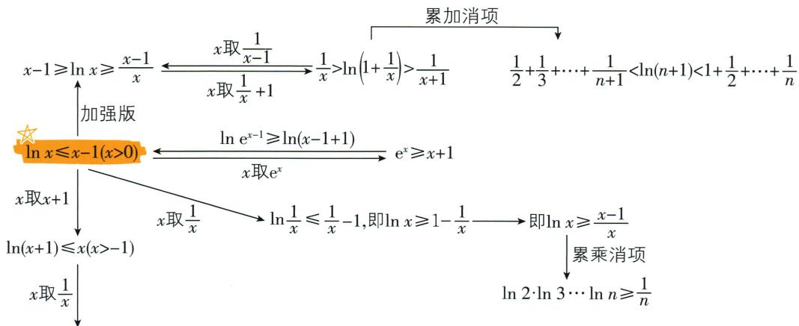

flowchart

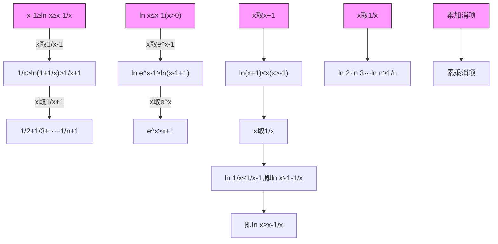

$\ln\left(\frac{1}{x}+1\right)<\frac{1}{x}$ ，即 $\ln(x+1)-\ln x<\frac{1}{x}\xrightarrow{\text{累加消项}}$ 证明调和级数不收敛: $1+\frac{1}{2}+\cdots+\frac{1}{n}>\ln(n+1)$

# 狂火重点

做自己的刷题英雄

新学期立个flag

# 刷题打卡

模拟题真题真题模拟题，

你日日准时准点重复再重复。

努力这条路很长，

我们愿意等你逆袭，

我们也愿意一直陪你当第一。

natural_image

Silhouette of a hiker standing on a mountain peak with mountainous background (no text or symbols)

数学

# 第四章

# 数列

4.1 数列的概念 …… (1)   
4.2 等差数列 …… (8)

4.2.1 等差数列的概念……（8）  
4.2.2 等差数列的前 n 项和公式……（14）

4.3 等比数列 …… (21)

4.3.1 等比数列的概念 …… (21)   
4.3.2 等比数列的前 n 项和公式 …… (27)

单元高难问题 1: 由递推公式推导通项公式 …… (32)  
单元高难问题 2: 数列求和 …… (35)  
4. 4\* 数学归纳法 …… (39)

natural_image

Illustration of two butterflies with blue wings and intersecting lines, enclosed in a green circular border (no text or symbols)

natural_image

Circular painting of a storm cloud with purple clouds against a red sky, no text or symbols present.

# 第五章

# 一元函数的导数及其应用

5.1 导数的概念及其意义 …… (42)  
5.2 导数的运算 …… (47)   
5.3 导数在研究函数中的应用 …… (51)

单元高难问题 3：导数的综合应用 …… (64)

# 当我用狂K时，我能用到什么？

# 知识全全get，重难拳拳K.O

◆ 基础深：全课时知识深层梳理，从预习到复习，基础稳扎稳打，体系了然于心。  
◆ 拓展实：29 个解题技巧尽数奉上，常看多练才能刻入 DNA，试试升级刷题思路吧！  
◆ 疑难清：高难问题也抵不住高能思维，14个方法打破学习瓶颈，多方位突围疑难！

# 4.1 数列的概念

# 1. 数列的含义、分类及表示

(1)数列的含义:按照确定的顺序排列的一列数.  
(2) 数列的分类

①按项数来分:有穷数列,无穷数列.   
②按数列特性来分:递增数列,递减数列,常数列,摆动数列.   
(3)数列的表示方法:通项公式法,列表法,图象法,递推公式法等.

2. 常用通项公式的求法 $\rightarrow$ 求 $a_{n}$ 时，都要检验 $a_{1}$

(1) 公式法: 根据 $a_{n}$ 与 $S_{n}$ ( $S_{n}$ 为数列 $\{a_{n}\}$ 的前 $n$ 项和) 的关系, 得 $a_{n} = \begin{cases} S_{1}, & n = 1, \\ S_{n} - S_{n-1}, & n \geqslant 2. \end{cases}$ . 若 $a_{1}$ 符合 $a_{n} (n \geqslant 2)$ , 则公式可合并.  
(2) 累加法: 适用于形如 $a_{n+1} = a_n + f(n) (n \in \mathbf{N}^*)$ 且数列 $\{f(n)\}$ 可求和的递推关系式.  
(3) 累乘法: 适用于形如 $a_{n+1} = f(n) a_n (n \in \mathbb{N}^*, a_n \neq 0)$ 且数列 $\{f(n)\}$ 可求积的递推关系式.  
(4) 猜想法: 对于无法用上述三种方法求解通项公式的数列, 可根据题中条件计算出数列的前几项, 观察规律, 猜测其通项公式并验证.

# 知识深层理解

# 问题1 怎样理解数列的概念？

提示 ① 概念中“一列数”指构成数列的项是数,且不止一个数;“确定的顺序”指这些数是有序的.

② $\{a_{n}\}$ 与 $a_{n}$ 是两个不同的概念: $\{a_{n}\}$ 表示数列 $a_{1}, a_{2}, \cdots, a_{n}, \cdots$ , 而 $a_{n}$ 只表示数列 $\{a_{n}\}$ 的第 n 项.  
③ 用符号 $\{a_{n}\}$ 表示数列时, 不要把 $\{a_{n}\}$ 看成一个集合. 数列 $\{a_{n}\}$ 的项是有序的, 而集合中的元素是无序的. 比如 1,2,3,4 与 2,1,3,4 代表不同的数列, 而集合 $\{1,2,3,4\}$ 与集合 $\{2,1,3,4\}$ 表示相同的集合. 数列 $\{a_{n}\}$ 中可以有相等的项, 而集合中的元素是互异的. 比如数列 1,1,1, 而集合只能写作 $\{1\}$ .

# 印象笔记

# 数列与集合的关键区别

(1) 数列中的数是有序的, 同样的一组数变了顺序就是另一个数列, 数列是项与项数 (顺序量) 间的函数.  
(2) 数列中的数可以相同.

# 问题2 数列可以分为哪几类？

# 提示 按项数来分

①有穷数列,如数列 $1,\frac{1}{2},\frac{1}{3},\cdots,\frac{1}{10}$ ;  
②无穷数列,如数列1,2,3,4,…

# 按数列特性来分

① 递增数列: 比如全体自然数按从小到大的顺序构成的数列 0,1,2,3,…, n,…;  
② 递减数列: 比如数列 6,5,4,3,2,1;  
③ 常数列: 比如数列 1, 1, 1, …, 1, …;  
④ 摆动数列: 比如数列 $-\frac{1}{2}, \frac{1}{4}, -\frac{1}{8}, \frac{1}{16}, \cdots, \left(-\frac{1}{2}\right)^{n}, \cdots.$

# 问题3 数列有哪些表示方法？

提示 数列是一类特殊的函数,所以可用表示函数的方法来表示数列,常用数列的表示方法有通项公式法、列表法、图象法和递推公式法等.

# 通项公式法

①数列的通项公式就是相应函数的解析式,与不是所有的函数关系都能用解析式表示相类似,并不是所有的数列都有通项公式;  
②有通项公式的一个数列,其表达形式可以是不唯一的,比如数列 $\{-1,1,-1,1,\cdots\}$ 的通项公式可以写为 $a_{n}=(-1)^{n}$ ,也可以写为 $a_{n}=\cos n\pi$ ;  
③要判断某一值是不是该数列中的项,只需令数列的通项公式等于该值,解相应的方程,若方程有正整数解,则该值是数列中的项;若方程无正整数解,则该值不是数列中的项.

# 列表法

①列表法可以清楚地反映出数列的许多具体的项,常用它来发现数列的规律或研究数列的性质等;  
②由于受某些条件的限制,列表法有时不能完整地反映数列的具体规律,所以并不是每一个数列都可以用列表法表示.

# 图象法

①数列可以看作是以正整数集 $N^{*}$ （或它的有限子集 $\{1,2,\cdots,n\}$ ）为定义域的函数 $a_{n}=f(n)$ 当自变量按照从小到大的顺序依次取值时所对应的一列函数值，所以可以以各项的序号为横坐标，对应的项为纵坐标，利用描点法作图来表示这个数列；  
②数列图象与一般函数图象的区别在于数列的图象是一系列离散的点；  
③数列是一类离散函数,它是刻画离散过程的重要数学模型.

# 印象笔记

对于有穷数列,要把末项(即有穷数列的最后一项)写出;对于无穷数列,无法写出末项,但要用“…”结尾.

摆动数列既不是递增数列,也不是递减数列.

从图象上看表示摆动数列的各点是上下摆动的,也就是前后项的大小关系不确定.

正确理解表格中相应变量之间的关系是列表法解决数列问题的关键所在.在实际应用中,往往可以把表格的信息转化为运算问题、判断性问题等加以分析与解决.

例如, $a_{n}=n(n+1)$ 为数列2,6,12,20,30,…的一个通项公式,用列表法可以表示为

<table><tr><td>n</td><td>1</td><td>2</td><td>3</td><td>4</td><td>5</td><td>...</td></tr><tr><td>an</td><td>2</td><td>6</td><td>12</td><td>20</td><td>30</td><td>...</td></tr></table>

用图象法表示如图所示.

# 问题4 什么是数列的递推公式？

# 提示 确定数列递推公式的条件

① 初始条件——“基础”,数列的第一项或前几项;

② 递推关系: 数列的任一项与它的前一项(或前几项)之间的关系, 并且这个关系可以用一个公式来表示.

如果以上两个条件缺少任何一个,数列的递推公式就不能确定.

# 数列的通项公式与递推公式的异同点

<table><tr><td></td><td>相同点</td><td>不同点</td></tr><tr><td>通项公式</td><td rowspan="2">均可确定一个数列,求出数列中的任意一项</td><td>给出n的值,可求出数列中的第n项an</td></tr><tr><td>递推公式</td><td>由前一项(或前几项),通过一次(或多次)运算,可求出第n项an</td></tr></table>

# 问题5 什么是数列的前 $n$ 项和公式？ $a_{n}$ 与 $S_{n}$ 有什么关系？

提示 ① 数列 $\{a_{n}\}$ 从第1项起到第n项止的各项之和,称为数列 $\{a_{n}\}$ 的前n项和,记作 $S_{n}$ ,即 $S_{n}=a_{1}+a_{2}+\cdots+a_{n}$ .如果数列 $\{a_{n}\}$ 的前n项和 $S_{n}$ 与它的序号n之间的对应关系可以用一个式子来表示,那么这个式子叫做这个数列的前n项和公式.

$$
② a _ {n} = \left\{ \begin{array}{l l} S _ {1}, n = 1, \\ S _ {n} - S _ {n - 1}, n \geqslant 2. \end{array} \right.
$$

# 应试拓展注意

# 拓展1 数列通项公式的基本求法

# 观察法

观察法就是观察数列前若干项的特征,横向看各项之间的关系,纵向看各项与项的序号之间的联系,寻找共同的构成规律,找出各项与项的序号 n 的函数关系,从而归纳出数列的通项公式的方法.

可以从下面几个角度入手:(1)各项的符号特征;(2)各项能否拆分;(3)分式的分子、分母的特征;(4)相邻项的变化规律.

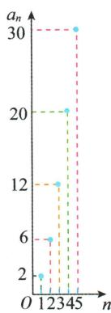

scatter

| n | an |
|---|---|
| 0 | 2 |
| 1 | 6 |
| 2 | 12 |
| 3 | 20 |
| 4 | 30 |
| 5 | 30 |
| 6 | 30 |
| 7 | 30 |
| 8 | 30 |
| 9 | 30 |
| 10 | 30 |
| 11 | 30 |
| 12 | 30 |
| 13 | 30 |
| 14 | 30 |
| 15 | 30 |
| 16 | 30 |
| 17 | 30 |
| 18 | 30 |
| 19 | 30 |
| 20 | 30 |
| 21 | 30 |
| 22 | 30 |
| 23 | 30 |
| 24 | 30 |
| 25 | 30 |
| 26 | 30 |
| 27 | 30 |
| 28 | 30 |
| 29 | 30 |
| 30 | 30 |
| 31 | 30 |
| 32 | 30 |
| 33 | 30 |
| 34 | 30 |
| 35 | 30 |
| 36 | 30 |
| 37 | 30 |
| 38 | 30 |
| 39 | 30 |
| 40 | 30 |
| 41 | 30 |
| 42 | 30 |
| 43 | 30 |
| 44 | 30 |
| 45 | 30 |
| 46 | 30 |
| 47 | 30 |
| 48 | 30 |
| 49 | 30 |
| 50 | 30 |
| 51 | 30 |
| 52 | 30 |
| 53 | 30 |
| 54 | 30 |
| 55 | 30 |
| 56 | 30 |
| 57 | 30 |
| 58 | 30 |
| 59 | 30 |
| 60 | 30 |
| 61 | 30 |
| 62 | 30 |
| 63 | 30 |
| 64 | 30 |
| 65 | 30 |
| 66 | 30 |
| 67 | 30 |
| 68 | 30 |
| 69 | 30 |
| 70 | 30 |
| 71 | 30 |
| 72 | 30 |
| 73 | 30 |
| 74 | 30 |
| 75 | 30 |
| 76 | 30 |
| 77 | 30 |
| 78 | 30 |
| 79 | 30 |
| 80 | 30 |
| 81 | 30 |
| 82 | 30 |
| 83 | 30 |
| 84 | 30 |
| 85 | 30 |
| 86 | 30 |
| 87 | 30 |
| 88 | 30 |
| 89 | 30 |
| 90 | 30 |
| 91 | 30 |
| 92 | 30 |
| 93 | 30 |
| 94 | 30 |
| 95 | 30 |
| 96 | 30 |
| 97 | 30 |
| 98 | 30 |
| 99 | 30 |
|12-45: The chart displays a_n values for each category. The x-axis represents 'n' and the y-axis represents 'an'. The data series are labeled as 'an'. The chart is grouped into three groups based on the label 'an', but the legend is not explicitly labeled in the image.

# 印象笔记

应重视函数思想的渗透,把函数的概念、图象、性质融入数列中,通过数列与函数知识的交汇,使所学习的知识网络不断优化与完善.

递推公式是表示数列的一种重要方法，但并不是所有的数列都有递推公式.

注意: 如果 $a_{1}$ 也满足当 $n \geqslant 2$ 时, $a_{n} = S_{n} - S_{n-1}$ 的式子, 那么数列 $\{a_{n}\}$ 的通项公式为 $a_{n} = S_{n} - S_{n-1}$ .

# 常见数列的通项 公式

(1) 数列 1,2,3,4,…
的通项公式是 $a_{n}=n$ $(n\in\mathbf{N}^{*})$ ;

(2) 数列 1,3,5,7, $\cdots$ 的通项公式是 $a_{n}=$ $2n-1(n\in\mathbf{N}^{*})$ ;

① 周期型

若 $a_{n + T} = a_n(T \in \mathbb{N}^*)$ ，则数列 $\{a_n\}$ 是周期为 $T$ 的周期数列，如数列 1,2,3,1,2,3,…是周期为 3 的周期数列.

② 循环型

如数列 9,99,999,9 999,…的通项公式是 $a_{n}=10^{n}-1$ .

③ 组合型

根据前面几类分别组合构造,如 $\frac{1}{2},\frac{1}{4},-\frac{5}{8},\frac{13}{16},\cdots$ 的各项分母分别为 $2^{1},2^{2},2^{3},2^{4},\cdots$ ,不考虑数的正负,容易看出第2,3,4项的分子分别比分母小3,因此可以把第1项变为 $-\frac{-1}{2}$ ,即原数列为 $-\frac{2^{1}-3}{2^{1}},\frac{2^{2}-3}{2^{2}},-\frac{2^{3}-3}{2^{3}},\frac{2^{4}-3}{2^{4}},\cdots$ ,因此数列的通项公式为 $a_{n}=(-1)^{n}\cdot\frac{2^{n}-3}{2^{n}}.$

累加法

一般地,对于形如 $a_{n+1} = a_n + f(n) (n \in \mathbf{N}^*)$ 且数列 $\{f(n)\}$ 可求和的递推关系式,宜采用累加法.这种方法也是等差数列的通项公式的求解方法.

【例 1】（累加法）在数列 $\{a_{n}\}$ 中，已知 $a_{1}=1, a_{n+1}=a_{n}+2$ ，求 $\{a_{n}\}$ 的通项公式.

分析:根据递推关系式,通过对应的等式累加,从而求得 $\{a_{n}\}$ 的通项公式.

解:由 $a_{n+1}=a_{n}+2$ ，得 $a_{n+1}-a_{n}=2$ ，则当 $n\geqslant2$ 时，有 $a_{n}-a_{n-1}=2, a_{n-1}-a_{n-2}=2, a_{n-2}-a_{n-3}=2,\cdots,a_{2}-a_{1}=2$ ，将以上 n-1 个等式等号两边对应相加，整理可得 $a_{n}-a_{1}=2(n-1)$ ，则有 $a_{n}=a_{1}+2(n-1)=2n-1(n\geqslant2), a_{1}=1$ 也符合该式，所以 $\{a_{n}\}$ 的通项公式为 $a_{n}=2n-1$ .

累乘法

一般地,对于形如 $a_{n+1}=f(n)a_{n}(n\in\mathbf{N}^{*},a_{n}\neq0)$ 且数列 $\{f(n)\}$ 可求积的递推关系式,宜采用累乘法.这种方法也是等比数列的通项公式的求解方法.

【例 2】（累乘法）在数列 $\{a_{n}\}$ 中，已知 $a_{1}=1, (n+1)a_{n+1}=na_{n}$ ，求 $\{a_{n}\}$ 的通项公式.

分析:根据递推关系式,通过对应的等式累乘,从而求得 $\{a_{n}\}$ 的通项公式.

解:由 $a_{1}=1,(n+1)a_{n+1}=na_{n}$ ，得 $a_{n}\neq0,\frac{a_{n+1}}{a_{n}}=\frac{n}{n+1}$ ，则当 $n\geqslant2$ 时，

有 $a_{n} = \frac{a_{n}}{1} = \frac{a_{n}}{a_{1}} = \frac{a_{n}}{a_{n - 1}}\cdot \frac{a_{n - 1}}{a_{n - 2}}\cdot \frac{a_{n - 2}}{a_{n - 3}}\cdot \dots \cdot \frac{a_2}{a_1} = \frac{n - 1}{n}\cdot \frac{n - 2}{n - 1}\cdot \frac{n - 3}{n - 2}\cdot \dots \cdot \frac{1}{2} = \frac{1}{n},$

$a_{1}=1$ 也符合上式,所以 $\{a_{n}\}$ 的通项公式为 $a_{n}=\frac{1}{n}$ .

猜想法

对于难以用以上各种方法求解通项公式的数列,常先由递推公式算出前几项,找出规律,通过归纳、猜想得出此数列的通项公式.

# 印象笔记

(3) 数列 2,4,6,8,…
的通项公式是 $a_{n}=$ $2n(n\in\mathbf{N}^{*})$ ;

(4) 数列 1,2,4,8,…
的通项公式是 $a_{n}=$ $2^{n-1}(n\in\mathbf{N}^{*})$ ;

(5) 数列 1, 4, 9,
16, …的通项公式是 $a_{n}=n^{2}(n\in\mathbf{N}^{*})$ ;

(6) 数列 $1, \frac{1}{2}, \frac{1}{3}, \frac{1}{4}, \cdots$ 的通项公式是 $a_{n}=\frac{1}{n}(n\in\mathbf{N}^{*})$ ;

(7) 数列 1, -1, 1, $-1,\cdots$ 的通项公式是 $a_{n}=(-1)^{n+1}$ 或 $a_{n}=(-1)^{n-1}(n\in\mathbf{N}^{*})$ .

注意 $(-1)^n$ 和 $(-1)^{n + 1}$ 与数列奇偶项的对应结合.

注意组合型数列的各个部分与对应序号之间的关系,通过观察其相同的规律来求解数列的通项公式.

常用数学归纳法解决问题,在4.4节学到.

# 拓展2 图形中的数列问题

# 印象笔记

① 从图形的结构特征入手分析归纳: 归纳出变化与不变化部分以及变化部分的规律;

②从图形的子图形数字入手归纳:将一些可数的有限图形转化为数字归纳.

【例 3】如图,一张长方形桌子可坐6人,按图中的方法把n张长方形桌子拼在一起可坐\_\_\_\_人.

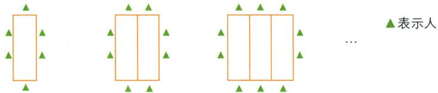

text_image

▲表示人

解析:我们可以把图形分成变化与不变化的两部分,再分析变化部分的规律.分析图形,我们发现每个图形左右的人数是不变化的,共4人,前后的人数是变化的,每增加一张长方形桌子就会多坐2人,依据这个规律,即可求得把n张长方形桌子拼在一起可坐 $(2n+4)$ 人.

答案: $2n + 4$

# 拓展3 数列的函数特性

数列是一类特殊的函数——数列可以看作是定义在正整数集(或其有限子集 $\{1,2,3,\cdots,n\}$ )上的函数当自变量按从小到大的顺序依次取值时所对应的一列函数值.数列的通项公式(若存在)体现了数列的项与其项数之间的对应关系,实质就是一个函数解析式,定义域为正整数集(或其有限子集),可以用解决函数问题的方法解决数列问题.

# 单调性问题

# 1 判断数列的单调性的方法

定义法:利用单调数列的定义判断数列的单调性.

作差法:对于数列中的任意相邻的两项 $a_{n+1}, a_{n}$ ，通过作差 $a_{n+1}-a_{n}$ ，判断其与0的大小关系，即可判断数列的单调性.

作商法:数列的各项非零且同号(同正或同负),对其任意相邻的两项 $a_{n+1},a_{n}$ ,通过作商 $\frac{a_{n+1}}{a_{n}}$ ,判断其与1的大小关系,即可判断数列的单调性.

函数法: 当 $a_{n}$ 表达式与所学过的函数解析式相似时, 可用函数的图象或复合函数判断单调性的方法来判断数列 $\{a_{n}\}$ 的单调性.

【例 4】已知函数 $f(x)=2^{x}-2^{-x}$ ，数列 $\{a_{n}\}$ 满足 $f(\log_{2}a_{n})=-2n$ .

(1)求数列 $\{a_{n}\}$ 的通项公式;  
(2) 讨论数列 $\{a_{n}\}$ 的单调性, 并证明你的结论.

解：(1) $\because f(x) = 2^{x} - 2^{-x}, f(\log_2 a_n) = -2n (a_n > 0), \therefore 2^{\log_2 a_n} - 2^{-\log_2 a_n} = -2n, \therefore a_n - \frac{1}{a_n} = -2n. \therefore a_n^2 + 2na_n - 1 = 0$ ，解得 $a_n = -n \pm \sqrt{n^2 + 1}$ . $\because a_n > 0, \therefore a_n = \sqrt{n^2 + 1} - n.$

首先要观察图形，寻找相邻的两个图形之间的变化；其次要把这些变化同图形的序号联系起来，发现其中的规律；最后归纳、猜想出通项公式，从而得解.

研究函数单调性的方法同样适用于数列,例如 $a_{n}=f(n)$ , $n\in N^{*}$ , 若 $f(n)$ 单调, 则 $\{a_{n}\}$ 一定有相同的单调性; 也可以由数列的图象判断, 只要每个点比它前面相邻的点高(即 $a_{n+1}>a_{n}$ ), 则图象呈上升趋势, 即 $\{a_{n}\}$ 单调递增 $\Leftrightarrow a_{n+1}>a_{n}$ 对任意 $n(n\in\mathbf{N}^{*})$ 都成立; 相反地, 有 $\{a_{n}\}$ 单调递减 $\Leftrightarrow a_{n+1}<a_{n}$ 对任意 $n(n\in\mathbf{N}^{*})$ 都成立.

(2) 方法一(作商法): $\because \frac{a_{n+1}}{a_n} = \frac{\sqrt{(n+1)^2 + 1} - (n+1)}{\sqrt{n^2 + 1} - n} = \frac{\sqrt{n^2 + 1} + n}{\sqrt{(n+1)^2 + 1} + (n+1)} < 1,$ $a_{n} > 0, \therefore a_{n+1} < a_{n}, \therefore$ 数列 $\{a_{n}\}$ 是递减数列.

方法二(函数法): $\because a_{n} = \sqrt{n^{2} + 1} - n = \frac{1}{\sqrt{n^{2} + 1} + n}$ , 且函数 $y = \sqrt{x^{2} + 1}, y = x$ 在 $[1, +\infty)$ 上均单调递增, $\therefore y = \sqrt{x^{2} + 1} + x$ 在 $[1, +\infty)$ 上单调递增, 且 $y > 0$ , $\therefore$ 函数 $y = \frac{1}{\sqrt{x^{2} + 1} + x}$ 在 $[1, +\infty)$ 上单调递减, $\therefore$ 数列 $\{a_{n}\}$ 是递减数列.

# ② 已知数列的单调性求参数的取值范围

已知数列为单调递增(减)数列,等价于对任意的 $n \in N^{*}$ 都有 $a_{n} < a_{n+1} (a_{n} > a_{n+1})$ 成立,从而转化为参数的不等式,解不等式,即可求出参数的取值范围.

【例 5】已知数列 $\{a_{n}\}$ 的通项公式为 $a_{n}=\frac{1}{n}$ ，其前 n 项和为 $S_{n}$ 。若 $S_{3n}-S_{n}>2m-3$ 对一切大于 1 的自然数 n 都成立，求实数 m 的取值范围。

分析: 利用数列 $\{a_{n}\}$ 的前 n 项和满足的不等关系, 结合函数的性质确定相应参数的值或取值范围.

解: 设 $b_{n}=S_{3n}-S_{n}, n>1$ 且 $n\in N^{*}$ ，则 $b_{n}=\frac{1}{n+1}+\frac{1}{n+2}+\cdots+\frac{1}{3n}$ ,

故有 $b_{n + 1} - b_n = \left(\frac{1}{n + 2} +\frac{1}{n + 3} +\dots +\frac{1}{3n + 3}\right) - \left(\frac{1}{n + 1} +\frac{1}{n + 2} +\dots +\frac{1}{3n}\right)$

$$
= \frac {1}{3 n + 1} + \frac {1}{3 n + 2} + \frac {1}{3 n + 3} - \frac {1}{n + 1} = \frac {9 n + 5}{(3 n + 1) (3 n + 2) (3 n + 3)} > 0,
$$

所以 $b_{n + 1} > b_n$ ，即数列 $\{b_n\}$ 单调递增.若 $b_{n} > 2m - 3$ 恒成立，则只要 $(b_{n})_{\min} > 2m - 3.$

又因为 $n > 1, n \in \mathbf{N}^*$ , 所以 $b_2 > 2m - 3$ . 又 $b_2 = \frac{19}{20}$ , 所以 $\frac{19}{20} > 2m - 3$ , 解得 $m < \frac{79}{40}$ .

所以实数 m 的取值范围为 $\left(-\infty, \frac{79}{40}\right)$ .

# 周期性问题

根据数列的递推公式,通过变形,发现数列中的项循环出现,从而确定该数列为周期数列,即可得相应的关系式.周期数列的递推公式一般形式为 $a_{n+k}=a_{n}(n\in\mathbf{N}^{*},k\geqslant2)$ .

【例6】已知数列 $\{a_{n}\}$ 中， $a_1 = 3, a_2 = 6, a_{n + 2} = a_{n + 1} - a_n$ ，求 $a_{29}$

解:依次写出各项:3,6,3,-3,-6,-3,3,6,3,…,则数列 $\{a_{n}\}$ 以6为周期循环,故 $a_{29}=a_{5}=-6$ .

# 拓展4 通项 $a_{n}$ 与其前 $n$ 项和 $S_{n}$ 的关系

对于任何一个数列, 它的前 n 项和 $S_{n}$ 和通项 $a_{n}$ 都有这样的关系: $a_{n} = \left\{\begin{aligned} S_{1}, & n=1, \\ S_{n}-S_{n-1}, & n\geqslant2.\end{aligned}\right.$ 若 $a_{1}$ 适合 $a_{n}(n\geqslant2)$ , 则用一个公式表示 $a_{n}$ ; 若 $a_{1}$ 不适合 $a_{n}(n\geqslant2)$ , 则要用分段函数表示 $a_{n}$ .

# 印象笔记

数列与生活息息相关,比如松果、凤梨、树叶的排列,蜻蜓的翅膀等都存在斐波那契数列(1,1,2,3,5,8,13,…)中的斐波那契数.在现代物理、化学等领域,数列也有着直接的应用.

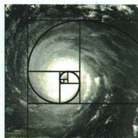

natural_image

Abstract spiral diagram with golden ratio grid and square cutouts, no text or symbols present

结合数列的特性，通过函数的相关性质解决对应的参数问题. 由于数列有别于一般函数, 具有其自身的特殊性, 有时会有独特的解决方法.

数列是一类特殊的函数,当然也存在着周期性问题.有些数列题目,表面上看似与周期无关,但实际上隐含着周期性,若不加以分析,则很难下手.若想到了周期,则问题迎刃而解.

一定要验证 n = 1 的情形.

【例7】已知数列 $\{a_{n}\}$ 的前 $n$ 项和 $S_{n} = 3^{n} + k$ ，求 $\{a_{n}\}$ 的通项公式.

解: 当 n=1 时, $a_{1}=S_{1}=3+k$ .

当 $n \geqslant 2$ 时, $a_{n} = S_{n} - S_{n-1} = (3^{n} + k) - (3^{n-1} + k) = 2 \times 3^{n-1}$ .

①当 k=-1 时， $a_{1}=3+(-1)=2$ ，符合 $a_{n}=2\times3^{n-1}$ ，此时 $a_{n}=2\times3^{n-1}$ ；

②当 $k \neq -1$ 时, $a_{n} = \begin{cases} 3 + k, & n = 1, \\ 2 \times 3^{n-1}, & n \geqslant 2. \end{cases}$

# 疑难突破提高

# 突破 求数列中的最大（小）项的方法

① 数列单调性法:通过研究 $\{a_{n}\}$ 的单调性来研究最大(小)项.

② 不等式组法: 先假设有最大(小)项. 不妨设 $a_{n}$ 最大, 则满足 $\left\{\begin{aligned}a_{n}&\geqslant a_{n-1},\\ a_{n}&\geqslant a_{n+1}\end{aligned}\right.$ $(n\geqslant2)$ , 解不等式组便可得到 n 的取值范围, 从而确定 n 的值; 求最小项用不等式组 $\left\{\begin{aligned}a_{n}&\leqslant a_{n-1},\\ a_{n}&\leqslant a_{n+1}\end{aligned}\right.$ $(n\geqslant2)$ 求得 n 的取值范围, 进而确定 n 的值.

【例8】已知 $a_{n} = \frac{9^{n}(n + 1)}{10^{n}} (n\in \mathbf{N}^{*})$ ，则数列 $\{a_{n}\}$ 中有没有最大项？如果有，求出最大项；如果没有，请说明理由.

解: 方法一(数列单调性法): $a_{n+1}-a_{n}=\frac{9^{n+1}(n+2)}{10^{n+1}}-\frac{9^{n}(n+1)}{10^{n}}=\frac{9^{n}}{10^{n+1}}(8-n)$ .

当 n<8 时, $a_{n+1}-a_{n}>0$ , 即 $a_{n+1}>a_{n}$ , 得 $\{a_{n}\}$ 在 $n\leqslant8$ 时单调递增;

当 n=8 时， $a_{n+1}-a_{n}=0$ ，即 $a_{n+1}=a_{n}$ ，得 $a_{8}=a_{9}$ ；

当 $n > 8$ 时， $a_{n + 1} - a_n < 0$ ，即 $a_{n + 1} < a_n$ ，得 $\{a_n\}$ 在 $n > 8$ 时单调递减.

所以数列 $\{a_{n}\}$ 的最大项是第8项和第9项，即 $a_8 = a_9 = \frac{9^9}{10^8}$ .

方法二(不等式组法): 设 $a_{n}$ 最大, 则 $\left\{\begin{aligned}a_{n}&\geqslant a_{n-1},\\ a_{n}&\geqslant a_{n+1}\end{aligned}\right.$ $(n\geqslant2)$ ,

即 $\left\{\begin{aligned}\frac{9^{n}(n+1)}{10^{n}}&\geqslant\frac{9^{n-1}\cdot n}{10^{n-1}},\\ \frac{9^{n}(n+1)}{10^{n}}&\geqslant\frac{9^{n+1}(n+2)}{10^{n+1}},\end{aligned}\right.$ 解得 $8\leqslant n\leqslant9.$

又因为 $n \in \mathbf{N}^*$ , 所以 $n = 8$ 或 9. 故 $\{a_n\}$ 的最大项为 $a_8 = a_9 = \frac{9^9}{10^8}$ .

利用数列单调性求最值步骤

1 相邻项 $a_{n}$ 与 $a_{n+1}$ 作差(商)并进行化简变形

2 判断差(商)与0(1)的大小,
得出 $\{a_{n}\}$ 单调性

3 求 $\{a_{n}\}$ 的最值

# 印象笔记

注意:有些时候需要先把 $a_{n}$ 换成 $S_{n}-S_{n-1}(n\geqslant2)$ ，将 $a_{n}$ 和 $S_{n}$ 的关系式转换成 $S_{n}$ 与 $S_{n-1}$ 的关系式，求出 $S_{n}$ 的表达式，再用 $a_{n}=\left\{\begin{aligned}&S_{1},n=1,\\&S_{n}-S_{n-1},n\geqslant2\end{aligned}\right.$ 求 $a_{n}$ .

要注意数列 $\{a_{n}\}$ 的特殊性(离散性)，由于 $\{a_{n}\}$ 的定义域是 $N^{*}$ 或 $N^{*}$ 的有限子集 $\{1,2,\cdots,n\}$ ，因而它的图象是一系列离散的点，而我们前面所研究过的基本初等函数的图象一般都是连续的。因此在解决问题时，要充分利用这一特殊性。

用作商法判断时注意数列的各项非零且同号.

用不等式组法列不等式时,要用“≥”不能用“>”,否则易丢答案.

# 本节与高考

本节知识是数列的基础内容,高考常以此作为载体考查数列的综合应用.本节知识在高考的选择题、填空题及解答题中均有出现,考查数列的通项公式与前n项和、数列与函数及数列与不等式等的综合应用.

# 4.2 等差数列

# 4.2.1 等差数列的概念

# 敲黑板

# 1. 等差数列的有关定义及通项公式

(1)等差数列的定义:从第2项起,每一项与它的前一项的差都等于同一个常数.  
(2)等差中项:三个数a,A,b组成等差数列,A叫做a与b的等差中项,且 $2A=a+b$ .   
(3) 通项公式: $a_{n} = a_{1} + (n - 1)d = a_{m} + (n - m)d (m \in \mathbf{N}^{*})$ 或 $a_{n} = pn + q(p, q$ 是常数).

# 2. 等差数列的判定

(1) 定义法: $a_{n+1} - a_n = d$ (常数) $(n \in \mathbf{N}^*) \Leftrightarrow \{a_n\}$ 是等差数列; $a_n - a_{n-1} = d$ (常数) $(n \geqslant 2, n \in \mathbf{N}^*) \Leftrightarrow \{a_n\}$ 是等差数列.  
(2) 等差中项法: $2a_{n+1} = a_n + a_{n+2} (n \in \mathbf{N}^*) \Leftrightarrow \{a_n\}$ 是等差数列.   
(3)通项公式法: $a_{n}=kn+b(k,b$ 是常数 $)\Leftrightarrow\{a_{n}\}$ 是等差数列.

# 3. 等差数列的常用性质 只能在小题中应用

若数列 $\{a_{n}\}$ 是公差为 $d$ 的等差数列，则

(1) 若 $m+n=p+q(m,n,p,q\in\mathbf{N}^{*})$ ，则 $a_{m}+a_{n}=a_{p}+a_{q}$ ，特别地，当 $m+n=2p$ 时， $a_{m}+a_{n}=2a_{p}$ ， $a_{p}$ 是 $a_{m}$ 和 $a_{n}$ 的等差中项；反之不一定成立，例如常数列  
(2) 数列 $\{a_{n}\}$ 中序号为等差数列的项 $a_{k}, a_{k+m}, a_{k+2m}, \cdots (k, m \in N^{*})$ 组成公差为 md 的等差数列；  
(3) 数列 $\{\lambda a_{n}+b\}$ ( $\lambda, b$ 为常数, $n \in N^{*}$ ) 是公差为 $\lambda d$ 的等差数列;  
(4) 若数列 $\{b_{n}\}$ 是等差数列, 则 $\{ka_{n} + pb_{n}\} (k, p$ 是常数, $n \in \mathbf{N}^{*})$ 也是等差数列.

# 知识深层理解

# 问题1 如何理解等差数列的概念？

提示 ① “从第2项起”是因为首项没有“前一项”.

②一个数列从第2项起,每一项与它的前一项的差都等于常数,这个数列也不一定是等差数列,因为当这些常数不同时,该数列不是等差数列,所以定义中强调“同一个常数”,注意不要漏掉这一条件.

# 印象笔记

注意定义中“每一项与它的前一项的差”这一运算要求，它的含义有两个，其一是强调作差的顺序，即后面的项减去前面的项，其二是强调这两项必须相邻.

③ 判断一个数列是不是等差数列, 只要看对于任意的正整数 $n, a_{n+1} - a_n$ 是不是同一常数, 切记不可通过计算 $a_2 - a_1, a_3 - a_2, a_4 - a_3$ 等几个有限的式子的值后, 根据它们都是同一常数就得出该数列为等差数列的结论, 因为由特殊到一般得出的结论不一定正确.

# 问题2 怎样理解与掌握等差数列的通项公式?

提示 ① 等差数列 $\{a_{n}\}$ 的通项公式为 $a_{n} = a_{1} + (n - 1)d(n\in \mathbf{N}^{*})$

当公差 $d \neq 0$ 时, $a_{n}$ 可以看成是关于 $n$ 的一次函数, $a_{n} = dn + a_{1} - d$ ;

当公差 d=0 时， $\{a_{n}\}$ 是常数列；

当公差 d>0 时， $\{a_{n}\}$ 是递增数列；

当公差 d<0 时， $\{a_{n}\}$ 是递减数列.

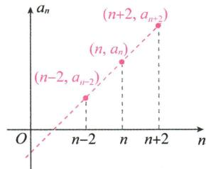

line

| n | a_n |
|---|---|
| n-2 | (n-2, a_{n-2}) |
| n | (n, a_n) |
| n+2 | (n+2, a_{n+2}) |

等差数列 $\{a_{n}\}$ 的图象都是同一直线上的一群离散的点,如图所示.

② 等差数列 $\{a_{n}\}$ 的通项公式 $a_{n}=a_{1}+(n-1)d$ 可推广为 $a_{n}=a_{m}+(n-m)d(n, m\in\mathbf{N}^{*})$ .

当 $n \neq m$ 时, 公式可变形为 $d = \frac{a_n - a_m}{n - m}$ ( $a_m, a_n$ 为数列中的项, $n$ 与 $m$ 的大小关系不确定).

③ 等差数列通项公式的应用主要有: ①由首项和公差求出等差数列中的任意一项; ②已知等差数列的任意两项, 确定等差数列中的其他任意一项.

# 应试拓展注意

# 拓展1 等差数列的判定方法

① 定义法: $a_{n+1} - a_n = d$ (常数) $(n \in \mathbf{N}^*) \Leftrightarrow \{a_n\}$ 是等差数列; $a_n - a_{n-1} = d$ (常数) $(n \geqslant 2, n \in \mathbf{N}^*) \Leftrightarrow \{a_n\}$ 是等差数列.  
② 等差中项法: $2a_{n+1} = a_n + a_{n+2} (n \in \mathbf{N}^*) \Leftrightarrow \{a_n\}$ 是等差数列.  
③ 通项公式法: $a_{n} = k n + b (k, b$ 为常数) $\Leftrightarrow \{a_{n}\}$ 是等差数列.

【例1】在数列 $\{a_{n}\}$ 中, $a_{1} = 1$ , 并且对于任意 $n \in \mathbf{N}^{*}$ , 都有 $a_{n+1} = \frac{a_{n}}{2a_{n} + 1}$ . 求证: 数列 $\left\{\frac{1}{a_n}\right\}$ 为等差数列.

证明: 因为 $a_{1}=1$ ，所以 $\frac{1}{a_{1}}=1$ 。又因为 $a_{n+1}=\frac{a_{n}}{2a_{n}+1}$ ，所以 $a_{n}\neq0(n\in\mathbf{N}^{*})$ 。

两边同时取倒数, 得 $\frac{1}{a_{n+1}} = \frac{2a_{n}}{a_{n}} + \frac{1}{a_{n}}$ , 所以 $\frac{1}{a_{n+1}} - \frac{1}{a_{n}} = 2$ .

所以数列 $\left\{\frac{1}{a_{n}}\right\}$ 是首项为1,公差为2的等差数列.

# 印象笔记

等差数列的定义可用数学符号语言描述为 $a_{n} - a_{n - 1} = d$ （常数）对任意的 $n\geqslant 2$ $n\in \mathbf{N}^*$ 均成立，或 $a_{n + 1} - a_n = d$ （常数）对任意的 $n\in \mathbf{N}^*$ 均成立，上述两式通常作为判断数列是不是等差数列的依据.

形如 $a_{n+1}=\frac{ma_{n}}{pa_{n}+q}$ $(a_{n}\neq0,pqm\neq0)$ 的递推公式,可以先求 $\left\{\frac{1}{a_{n}}\right\}$ 的通项公式再取其倒数,即可求得 $\{a_{n}\}$ 的通项公式.

对于形如 $ka_{n}a_{n+1}=a_{n}-a_{n+1}(a_{n}\neq0)$ 的递推关系式, 也可以采取类似本题的做法, 即两边同时除以 $a_{n}a_{n+1}$ , 得 $k=\frac{1}{a_{n+1}}-\frac{1}{a_{n}}$ , 从而构造出公差为 k 的等差数列 $\left\{\frac{1}{a_{n}}\right\}(n\in\mathbf{N}^{*})$ .

【例2】已知数列 $\{a_{n}\}$ 满足 $a_{1}+a_{2}+\cdots+a_{n}=n+\frac{n}{2}a_{n},n\in N^{*}$ ，试证明数列 $\{a_{n}\}$ 是等差数列.

证明: 因为 $a_{1}+a_{2}+\cdots+a_{n}=n+\frac{n}{2}a_{n}$ ，所以 $a_{1}+a_{2}+\cdots+a_{n+1}=n+1+\frac{n+1}{2}a_{n+1}$ ，

两式作差可得 $a_{n + 1} = 1 + \frac{n + 1}{2} a_{n + 1} - \frac{n}{2} a_n$ ，整理得 $(n - 1)a_{n + 1} = na_n - 2$ ①，

所以当 $n \geqslant 2$ 时， $(n - 2)a_{n} = (n - 1)a_{n - 1} - 2$ ②，

①-②得 $(n-1)a_{n+1}-(n-2)a_{n}=na_{n}-(n-1)a_{n-1}$ ,

整理得 $(n-1)a_{n+1}+(n-1)a_{n-1}=(2n-2)a_{n}$ .

又 $n \geqslant 2$ ，则有 $n - 1 \neq 0$ ，所以 $a_{n+1} + a_{n-1} = 2a_n (n \geqslant 2)$ ，

所以数列 $\{a_{n}\}$ 是等差数列.

# 拓展2 等差数列通项公式及特定项的求解方法与技巧

在实际求解过程中,可以利用等差数列通项公式的变形公式或一些巧妙的方法来处理问题.下面通过实例剖析几类常见的妙解.

# 设基本量法

等差数列的通项公式 $a_{n} = a_{1} + (n - 1)d$ 中有四个变量 $a_1, d, n, a_n$ ，若已知其中三个量就能得出另外一个量，也可设出 $a_1, d$ ，运用通项公式表示已知的项，列方程组求解.

# 利用变形公式求解

等差数列通项公式的四个非常有用的变形公式：

① $a_{n}=kn+b(n\in\mathbf{N}^{*},k,b$ 为常数），其中 k=d, $b=a_{1}-d$ ;  
② $a_{n}=a_{m}+(n-m)d(n,m\in\mathbf{N}^{*})$ ;   
③ $d=\frac{a_{n}-a_{m}}{n-m}(m\neq n,n,m\in\mathbf{N}^{*})$ ;   
4 $\frac{a_n - a_m}{n - m} = \frac{a_p - a_q}{p - q}$ ( $m \neq n, p \neq q, m, n, p, q \in \mathbf{N}^*$ ).

灵活利用等差数列通项公式的变形公式解决一些相应的问题,往往可以减少计算,方便快捷.

【例 3】已知 $\{a_{n}\}$ 为等差数列, $a_{15}=8, a_{60}=20$ , 求 $a_{75}$ .

解: 方法一(设基本量法): 设等差数列 $\{a_{n}\}$ 的公差为 d,

则由题意得 $\left\{\begin{aligned}a_{1}+14d&=8,\\ a_{1}+59d&=20,\end{aligned}\right.$ 解得 $\left\{\begin{aligned}a_{1}&=\frac{64}{15},\\ d&=\frac{4}{15}.\end{aligned}\right.$ $\therefore a_{75}=a_{1}+74d=\frac{64}{15}+74\times\frac{4}{15}=24.$

方法二(利用变形公式求解):设等差数列 $\{a_{n}\}$ 的公差为d,

$$
\because a _ {6 0} = a _ {1 5} + (6 0 - 1 5) d, \therefore d = \frac {2 0 - 8}{6 0 - 1 5} = \frac {4}{1 5}. \therefore a _ {7 5} = a _ {6 0} + (7 5 - 6 0) d = 2 0 + 1 5 \times \frac {4}{1 5} = 2 4.
$$

北京天坛的圜丘坛为古代祭天的场所，分上、中、下三层。上层中心有一块圆形石板（称为天心石），环绕天心石砌9块扇面形石板构成第一环，向外每环依次增加9块，下一层的第一环比上一层的最后一环多9块，向外每环依次也增加9块。

1 是方程思想的重要应用.

② 由于等差数列的通项公式是关于 n 的一次函数或常数函数, 它的图象在一条直线上, 而两点可以确定一条直线, 因此, 已知等差数列的两项就可以确定这个数列了.

方法三(公式法):已知 $\{a_{n}\}$ 是等差数列,可设 $a_{n}=kn+b$ .

由 $a_{15} = 8, a_{60} = 20$ 得 $\left\{ \begin{array}{l} 15k + b = 8, \\ 60k + b = 20, \end{array} \right.$ 解得 $\left\{ \begin{array}{l} k = \frac{4}{15}, \\ b = 4. \end{array} \right.$

$$
\therefore a _ {7 5} = 7 5 \times \frac {4}{1 5} + 4 = 2 4.
$$

# 拓展3 等差数列的性质

数列 $\{a_{n}\}$ 是公差为 $d$ 的等差数列.

① 性质 1: 若 $m + n = p + q (m, n, p, q \in \mathbf{N}^{*})$ , 则 $a_{m} + a_{n} = a_{p} + a_{q}$ .

特别地，①若 $m + n = 2k$ ，则 $a_{m} + a_{n} = 2a_{k}(m,n,k\in \mathbf{N}^{*})$

②若数列 $\{a_{n}\}$ 是有穷等差数列,则与首末两项等距离的两项之和都相等,且等于首末两项之和,即 $a_{1}+a_{n}=a_{2}+a_{n-1}=\cdots=a_{i+1}+a_{n-i}=\cdots$ .

② 性质 2: 数列 $\{\lambda a_{n}+b\}$ ( $\lambda, b$ 是常数) 是公差为 $\lambda d$ 的等差数列.

③ 性质 3: 若数列 $\{b_{n}\}$ 是等差数列, 则 $\{ka_{n} + mb_{n}\}$ (k, m 为常数, $n \in N^{*}$ ) 也是等差数列.

④ 性质 $4:a_{1}+a_{2}+a_{3},a_{4}+a_{5}+a_{6},a_{7}+a_{8}+a_{9},\cdots$ 仍成等差数列,公差为 9d.

⑤ 性质 5: 下标成等差数列且公差为 m 的项 $a_{k}, a_{k+m}, a_{k+2m}, \cdots (k, m \in N^{*})$ 组成公差为 md 的等差数列.

【例 4】在等差数列 $\{a_{n}\}$ 中, 已知 $a_{1}-a_{4}-a_{8}-a_{12}+a_{15}=2$ , 求 $a_{3}+a_{13}$ .

解:已知等式可以写成 $(a_{1}+a_{15})-(a_{4}+a_{12})-a_{8}=2$ ,

由性质 1, 知 $a_{1} + a_{15} = a_{4} + a_{12}$ , 所以 $a_{8} = -2$ .

又 $a_{3}+a_{13}=2a_{8}$ ，故 $a_{3}+a_{13}=-4$ .

【例5】已知等差数列 $\{a_{n}\}$ 中， $a_{1} + a_{4} + a_{7} = 39, a_{2} + a_{5} + a_{8} = 33$ ，则 $a_{3} + a_{6} + a_{9} = \_$ .

解析: 方法一: 由性质 4 知, 数列 $a_{1} + a_{4} + a_{7}, a_{2} + a_{5} + a_{8}, a_{3} + a_{6} + a_{9}$ 是等差数列, 所以 $2(a_{2} + a_{5} + a_{8}) = (a_{1} + a_{4} + a_{7}) + (a_{3} + a_{6} + a_{9})$ , 则 $a_{3} + a_{6} + a_{9} = 2 \times 33 - 39 = 27$ .

方法二:设等差数列 $\{a_{n}\}$ 的公差为d,则 $(a_{2}+a_{5}+a_{8})-(a_{1}+a_{4}+a_{7})=(a_{2}-a_{1})+(a_{5}-a_{4})+(a_{8}-a_{7})=3d=-6$ ,解得d=-2.

所以 $a_{3}+a_{6}+a_{9}=a_{2}+d+a_{5}+d+a_{8}+d=27.$

答案:27

# 拓展4 设等差数列中的项的方法

① 通项公式法: 即设 $a_{n}=a_{1}+(n-1)d$ .

② 对称设项法: 若所给等差数列有 $2n(n \in \mathbb{N}^{*})$ 项, 则可设为 $a-(2n-1)d,\cdots,a-3d,a-d,a+d,a+3d,\cdots,a+(2n-1)d$ , 数列的公差为 2d;

若所给等差数列有 $2n+1(n \in \mathbf{N}^{*})$ 项，则可设为 $a-nd, a-(n-1)d, \cdots, a-d, a, a+d, \cdots, a+(n-1)d, a+nd$ ，数列的公差为 d.

证明: 由 $\{a_{n}\}$ 是公差为 d 的等差数列, 得 $a_{m}=a_{1}+(m-1)d, a_{n}=a_{1}+(n-1)d, a_{p}=a_{1}+(p-1)d, a_{q}=a_{1}+(q-1)\cdot d$ , 又 $m+n=p+q$ , 则 $a_{m}+a_{n}=2a_{1}+(m+n-2)d=2a_{1}+(p+q-2)\cdot d=a_{p}+a_{q}$ .

4 证明: 对数列 $\left\{a_{3n-2}+a_{3n-1}+a_{3n}\right\}$ ，有 $\left(a_{3n+1}+a_{3n+2}+a_{3n+3}\right)-\left(a_{3n-2}+a_{3n-1}+a_{3n}\right)=\left(a_{3n+1}-a_{3n-2}\right)+\left(a_{3n+2}-a_{3n-1}\right)+\left(a_{3n+3}-a_{3n}\right)=3\times3d=9d$ ，故数列 $\left\{a_{3n-2}+a_{3n-1}+a_{3n}\right\}$ 是公差为 9d 的等差数列.

对于相同结构的式子对应着进行运算, 是一种常用的技巧.

对称设项法的优点是若有 n 个数构成等差数列, 则可利用对称设项法设出这个数列中的每一项, 且各项和为 na.

【例6】已知四个数成等差数列,它们的和为26,中间两项的积为40,求这四个数.

分析:设这四个数依次为 $a-3d, a-d, a+d, a+3d$ , 这样求解更为便利, 但必须注意此时的公差应为 2d.

解:设这四个数依次为 a-3d, a-d, $a+d$ , $a+3d$ ,

则由题意得 \( \left\{\begin{aligned}(a-3d)+(a-d)+(a+d)+(a+3d)&=26,\\(a-d)(a+d)&=40,\end{aligned}\right. \)

即 $\left\{\begin{aligned}4a&=26,\\ a^{2}-d^{2}&=40,\end{aligned}\right.$ 解得 $\left\{\begin{aligned}a&=\frac{13}{2},\\ d&=\frac{3}{2}\end{aligned}\right.$ 或 $\left\{\begin{aligned}a&=\frac{13}{2},\\ d&=-\frac{3}{2},\end{aligned}\right.$

所以所求四个数依次为2,5,8,11或11,8,5,2.

# 疑难突破提高

# 突破1 利用一次函数的性质解决等差数列问题

① 等差数列的图象是同一条直线上的一系列孤立的点,因此涉及等差数列中的项、过两点的直线斜率及数列的单调性等问题时,利用多点共线即可快速求解.  
② 已知 m, n, q 互不相等, 若 m, n, q 和 a, b, c 分别成等差数列, 则点 $(m, a)$ , $(n, b)$ , $(q, c)$ 共线, 反之也成立, 且 $\frac{a - b}{m - n} = \frac{a - c}{m - q} = \frac{b - c}{n - q} = k$ (k 为常数).

【例7】已知等差数列 $\{a_{n}\}$ , 若 $a_{p} = q, a_{q} = p (p, q \in \mathbf{N}^{*})$ 且 $p \neq q$ , 则 $a_{p + q} =$ \_\_\_\_.

解析:等差数列 $\{a_{n}\}$ 各项所对应的点 $A(p,a_{p}),B(q,a_{q}),C(p+q,a_{p+q})$ 在同一条直线上,所以 $k_{AB}=k_{AC}$ ,

所以 $\frac{a_q - a_p}{q - p} = \frac{a_{p + q} - a_p}{(p + q) - p}$ , 即 $\frac{p - q}{q - p} = \frac{a_{p + q} - q}{(p + q) - p}$ , 解得 $a_{p + q} = 0$ .

答案:0

# 突破2 构造等差数列求通项公式

运用去分母、添项、取倒数、取对数等方法, 将递推公式变形为 $f(n+1)-f(n)=A$ (A 为常数) 的形式, 根据等差数列的定义知 $\{f(n)\}$ 是等差数列, 先求出 $\{f(n)\}$ 的通项公式, 再根据 $f(n)$ 与 $a_{n}$ 的关系, 求出 $\{a_{n}\}$ 的通项公式. 常用构造方法如下:

# 定义法构造

利用等差数列的定义 $a_{n+1} - a_n = d (n \in \mathbf{N}^*)$ ，通过变换，构造等差数列.

# 印象笔记

两个等差数列的相同项组成的数列

若等差数列 $\{a_{n}\}$ , $\{b_{n}\}$ 的公差分别为 $d_{1}, d_{2}$ , 则数列 $\{a_{n}\}$ , $\{b_{n}\}$ 的相同项仍然构成一个等差数列, 其公差为 $d_{1}, d_{2}$ 的最小公倍数, 首项可通过观察 $\{a_{n}\}, \{b_{n}\}$ 的前几项找到第一个相同的项.

把等差数列的通项公式 $a_{n} = a_{1} + (n - 1)d$ 转化为 $a_{n} = nd + (a_{1} - d)$ ，并与 $y = kx + b$ 对照，知等差数列是特殊的一次函数，特殊在定义域为正整数集 $\mathbf{N}^{*}$ 或其子集，其图象是直线上的一些离散的点，由斜率公式 $k = \frac{y_2 - y_1}{x_2 - x_1}$ ( $x_{2} \neq x_{1}$ ) 不难联想到 $d = \frac{a_n - a_m}{n - m}$ ( $m, n \in \mathbf{N}^{*}$ 且 $m \neq n$ )，由此也可得到 $a_{n} = a_{m} + (n - m)d$ .

【例8】在数列 $\{a_{n}\}$ 中， $a_{1} = 3, na_{n+1} = (n + 2)a_{n} + 2n(n + 1)(n + 2)$ ，求 $\{a_{n}\}$ 的通项公式.

解: 原递推公式两边同时除以 $n(n+1)(n+2)$ ，得 $\frac{a_{n+1}}{(n+2)(n+1)}=\frac{a_{n}}{(n+1)n}+2.$ ①

令 $b_{n}=\frac{a_{n}}{(n+1)n}$ ②，则①式为 $b_{n+1}=b_{n}+2$ ，

所以数列 $\{b_{n}\}$ 是首项为 $b_{1} = \frac{a_{1}}{(1 + 1)\times 1} = \frac{3}{2}$ , 公差为 2 的等差数列.

所以 $b_{n} = \frac{3}{2} + 2(n - 1) = 2n - \frac{1}{2}$ . 代入②式, 得 $a_{n} = \frac{1}{2} n(n + 1)(4n - 1)$ .

故 $\{a_{n}\}$ 的通项公式是 $a_{n} = \frac{1}{2} n(n + 1)(4n - 1)$ .

# 转化递推公式构造

将递推公式转化为等差数列的常见形式,利用等差数列的通项公式求出包含 $a_{n}$ 的关系式,进而求出 $a_{n}$ .等差数列的常见形式:

① 若 $(a_{n+2}-a_{n+1})-(a_{n+1}-a_{n})=$ 常数,则数列 $\{a_{n+1}-a_{n}\}$ 是等差数列.  
② 若 $\frac{1}{a_{n+1}} - \frac{1}{a_n} =$ 常数, 则数列 $\left\{\frac{1}{a_n}\right\}$ 是等差数列.  
③ 若 $\frac{1}{a_{n+1}+c}-\frac{1}{a_{n}+c}=$ 常数, 则数列 $\left\{\frac{1}{a_{n}+c}\right\}$ 是等差数列.  
④ 若 $\sqrt{a_{n+1}} - \sqrt{a_{n}} =$ 常数，则数列 $\{\sqrt{a_{n}}\}$ 是等差数列.  
⑤ 若 $a_{n+1}^{2}-a_{n}^{2}=$ 常数, 则数列 $\{a_{n}^{2}\}$ 是等差数列.

【例9】已知数列 $\{a_{n}\}$ 满足 $a_1 = 4, a_n = 4 - \frac{4}{a_{n-1}} (n \geqslant 2, n \in \mathbf{N}^*)$ ，求数列 $\{a_{n}\}$ 的通项公式.

解: 因为 $a_{n}=4-\frac{4}{a_{n-1}}(n\geqslant2,n\in\mathbf{N}^{*})$ ，所以 $a_{n+1}-2=2-\frac{4}{a_{n}}=\frac{2(a_{n}-2)}{a_{n}}(n\in\mathbf{N}^{*})$ .

因为 $a_{1}=4$ ，所以 $a_{n}\neq2$ 。

所以 $\frac{1}{a_{n + 1} - 2} = \frac{a_n}{2(a_n - 2)} = \frac{1}{2} +\frac{1}{a_n - 2} (n\in \mathbf{N}^*)$ ，即 $\frac{1}{a_{n + 1} - 2} -\frac{1}{a_n - 2} = \frac{1}{2} (n\in \mathbf{N}^{*})$

所以数列 $\left\{\frac{1}{a_{n}-2}\right\}$ 是首项为 $\frac{1}{a_{1}-2}=\frac{1}{2}$ ，公差为 $\frac{1}{2}$ 的等差数列.

根据等差数列的通项公式可得 $\frac{1}{a_n - 2} = \frac{1}{2} +\frac{1}{2} (n - 1) = \frac{n}{2},$

所以 $a_{n}=2+\frac{2}{n}$ ，所以数列 $\{a_{n}\}$ 的通项公式为 $a_{n}=2+\frac{2}{n}$ .

# 突破3 等差数列在实际问题中的应用

对于一些实际应用的问题,关键是理解具体情境,设一些适当的数列 $\{a_{n}\}$ 或变量,让实际问题符号化,数学化,可以很好地发展提升数学抽象核心素养.

# 印象笔记

要想构造等差数列 $b_{n}=\frac{a_{n}}{(n+1)n}$ ，首先必须认真观察题设所给的递推关系式 $na_{n+1}=(n+2)a_{n}+2n(n+1)(n+2)$ ，然后与等差数列的定义式相对照，找出两者之间的关联.

先观察递推关系式 $a_{n}=4-\frac{4}{a_{n-1}}(n\geqslant2)$ 的特点,通过倒数关系转化关系式,变形整理得到数列 $\left\{\frac{1}{a_{n}-2}\right\}$ 是等差数列,再求解数列 $\{a_{n}\}$ 的通项公式,方法巧妙,需灵活掌握.

【例 10】《九章算术》是我国古代的数学名著,书中有如下问题:“今有五人分五钱,令上二人所得与下三人等.问各得几何?”其意思为已知甲、乙、丙、丁、戊五人分5钱,甲、乙两人所得与丙、丁、戊三人所得相同,且甲、乙、丙、丁、戊所得依次成等差数列.问五人各得多少钱?(“钱”是古代的一种重量单位).这个问题中,甲所得为()

A. $\frac{5}{4}$ 钱

B. $\frac{4}{3}$ 钱

C. $\frac{3}{2}$ 钱

D. $\frac{5}{3}$ 钱

解析:依据题意设甲、乙、丙、丁、戊五人所得钱数分别为 a-2d, a-d, a, $a+d$ , $a+2d$ , 则由题意可知 $a-2d+a-d=a+a+d+a+2d$ , 即 a=-6d.

又 $a-2d+a-d+a+a+d+a+2d=5a=5$ ，解得 a=1。

则 $a - 2d = a - 2 \times \left(-\frac{a}{6}\right) = \frac{4}{3} a = \frac{4}{3}$ . 故选 B.

答案:B

【关键方法】在利用数列方法解决实际问题时,一定要弄清首项、项数等关键量.

# 本节与高考

等差数列是数列中最基本的模型,在高考中主要考查等差数列的定义、性质及通项公式等的灵活运用.考查内容较基础,通常以选择题、填空题的形式出现,属于容易题或中等难度题;若以解答题的形式出现,则会与数列求和、不等式等相结合.

# 印象笔记

# 解决等差数列的实际应用题的步骤

①审题:仔细阅读材料,认真理解题意;

②建模: 将已知条件翻译成数列语言, 将实际问题转化为数学问题;

③判型: 判断该数列是否为等差数列模型;

④求解: 求出该问题的数学解;

⑤还原: 将所求的结果还原到实际问题中.

# 4.2.2 等差数列的前 $n$ 项和公式

1. 等差数列的前 $n$ 项和公式

等差数列 $\{a_{n}\}$ 的前 $n$ 项和 $S_{n} = na_{1} + \frac{n(n - 1)}{2} d = \frac{n(a_{1} + a_{n})}{2}$ .

2. 等差数列的前 $n$ 项和的常用性质

设等差数列 $\{a_{n}\}$ 的前 $n$ 项和为 $S_{n}$ , 公差为 $d$ .

(1) $\frac{S_{n}}{n}=a_{1}+(n-1)\times\frac{d}{2}$ ，所以 $\left\{\frac{S_{n}}{n}\right\}$ 是公差为 $\frac{d}{2}$ 的等差数列.

(2) 若等差数列 $\{a_{n}\}$ 的项数为 $2n (n \in \mathbf{N}^{*})$ ，则 $S_{\text{偶}} - S_{\text{奇}} = nd$ ，且 $\frac{S_{\text{偶}}}{S_{\text{奇}}} = \frac{a_{n+1}}{a_{n}}$ ；若等差数列 $\{a_{n}\}$ 的项数为 $2n - 1 (n \in \mathbf{N}^{*})$ ，则 $S_{\text{奇}} - S_{\text{偶}} = a_{n}$ ，且 $\frac{S_{\text{奇}}}{S_{\text{偶}}} = \frac{n}{n-1}$ .

(3) $S_{k},S_{2k}-S_{k},S_{3k}-S_{2k},\cdots$ 是公差为 $k^{2}d(k\in\mathbf{N}^{*})$ 的等差数列.

(4) 两个等差数列 $\{a_{n}\}, \{b_{n}\}$ 的前 $n$ 项和分别为 $S_{n}, T_{n}$ , 则 $\frac{a_{n}}{b_{n}} = \frac{S_{2n-1}}{T_{2n-1}}$ .

# 知识深层理解

# 问题1 怎样理解等差数列的前 $n$ 项和公式？

提示 ① 在推导等差数列 $\{a_{n}\}$ 的前 $n$ 项和公式 $S_{n} = \frac{n(a_{1} + a_{n})}{2}$ 时用到的方法称为倒序相加法. 根据等差数列的通项公式 $a_{n} = a_{1} + (n - 1)d$ , 得到 $S_{n} = na_{1} + \frac{n(n - 1)}{2} d$ .

② 等差数列 $\{a_{n}\}$ 的前 n 项和公式中, 涉及 $a_{1}, a_{n}, S_{n}, n, d$ 五个量. 通常已知其中三个量, 结合通项公式与前 n 项和公式, 可求另外两个量, 即“知三求二”的方程思想.  
③ 公式 $S_{n}=\frac{n(a_{1}+a_{n})}{2}$ 可结合等差数列的性质进行变形: $S_{n}=\frac{n(a_{1}+a_{n})}{2}=\frac{n(a_{2}+a_{n-1})}{2}=$ $\frac{n(a_{3}+a_{n-2})}{2}=\cdots=\frac{n(a_{m}+a_{n-m+1})}{2}$ ; 若 $a_{1}$ 与 $a_{n}$ 存在等差中项, 则 $S_{n}=\frac{n(a_{1}+a_{n})}{2}=na_{\frac{n+1}{2}}$ .  
④ $\{a_{n}\}$ 是等差数列的充要条件是 $S_{n}=An^{2}+Bn(A,B$ 是常数). 我们可以利用该结论判断一个数列是不是等差数列, 等差数列的首项为 $A+B$ , 公差为 2A.

# 问题2 等差数列的前 $n$ 项和公式有何函数特征？

提示 公式 $S_{n}=na_{1}+\frac{n(n-1)}{2}d$ 可变形为 $S_{n}=\frac{d}{2}n^{2}+\left(a_{1}-\frac{d}{2}\right)n.$

① 当 $d \neq 0$ 时, $S_{n}$ 可看成关于 n 的二次函数, 注意其常数项为 0. 点 $(n, S_{n})$ 是抛物线 $y = \frac{d}{2}x^{2} + \left(a_{1} - \frac{d}{2}\right)x$ 上一系列离散的点.  
② 当 $\left\{\begin{aligned}d&=0,\\ a_{1}&=0\end{aligned}\right.$ 时， $S_{n}=0,S_{n}$ 可看成关于 n 的常数函数。点 $(n,S_{n})$ 是 x 轴上一系列离散的点。  
③ 当 $\left\{\begin{aligned}d&=0,\\ a_{1}&\neq0\end{aligned}\right.$ 时， $S_{n}=a_{1}n,S_{n}$ 可看成关于 n 的一次函数。点 $(n,S_{n})$ 是直线 $y=a_{1}x$ 上一系列离散的点。  
④ $\frac{S_n}{n} = \frac{d}{2} n + \left(a_1 - \frac{d}{2}\right) (d \neq 0)$ , 则 $\frac{S_n}{n}$ 可看成关于 $n$ 的一次函数, $\left\{\frac{S_n}{n}\right\}$ 是公差为 $\frac{d}{2}$ 的等差数列.

# 应试拓展注意

# 拓展1 等差数列的求和策略

# 公式法求和

① 利用 $S_{n}=\frac{n(a_{1}+a_{n})}{2}$ 或 $S_{n}=na_{1}+\frac{n(n-1)}{2}d$ 直接求解.  
② 根据 $S_{n}=An^{2}+Bn(A,B$ 是常数)用待定系数法求解.

# 印象笔记

若一个数列满足任意的第 k 项与倒数第 k 项的和等于首项与末项的和, 则求该数列的前 n 项和时可用倒序相加法.

$\{a_{n}\}$ 是等差数列，则 $S_{n}$ 可以写成 $S_{n}=An^{2}+Bn(A,B$ 是常数）的形式，但并不意味着 $S_{n}$ 是二次函数，如若 $a_{n}=2$ ，则 $S_{n}=2n$ ；若 $S_{n}$ 是二次函数，也不能得到 $\{a_{n}\}$ 是等差数列.

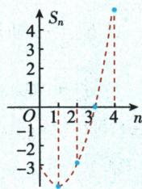

line

| n | S_n |
|---|-----|
| 0 | -3.0 |
| 1 | -2.5 |
| 2 | -2.0 |
| 3 | -1.5 |
| 4 | 4.0 |

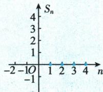

text_image

Sₙ
4
3
2
1
-2 -1O 1 2 3 4 n
-1

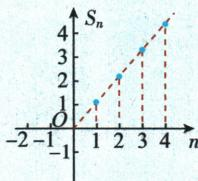

line

| n | S_n |
|---|---|
| -1 | 0 |
| 1 | 1 |
| 2 | 2 |
| 3 | 3 |
| 4 | 4 |

注意 $n \in \mathbf{N}^*$ , 与一般的二次函数不同, 在涉及求前 $n$ 项和的最值、参数时要特别注意.

【例1】已知等差数列 $\{a_{n}\}$ 中， $S_{3} = 21, S_{6} = 24$ ，求数列 $\{|a_{n}|\}$ 的前 $n$ 项和 $T_{n}$ .

分析:思路一:已知 $S_{3}$ 和 $S_{6}$ 的值,先利用等差数列的前 n 项和公式可求得首项 $a_{1}$ 与公差 d,再对数列的前若干项的正负进行判断,即可求出 $T_{n}$ .

思路二:设等差数列的前 n 项和公式为 $S_{n}=An^{2}+Bn$ ，可用待定系数法求得 A，B，得到 $a_{n}=2An-A+B$ ，之后同思路一.

解: 方法一: 设 $\{a_{n}\}$ 的公差为 d. 由公式 $S_{n}=na_{1}+\frac{n(n-1)}{2}d$ 及题意,

得 $\left\{\begin{aligned}3a_{1}+3d&=21,\\ 6a_{1}+15d&=24,\end{aligned}\right.$ 解得 $\left\{\begin{aligned}d&=-2,\\ a_{1}&=9.\end{aligned}\right.$ ∴ $a_{n}=9+(n-1)\times(-2)=-2n+11.$

数列 $\{a_{n}\}$ 的前 $n$ 项和为 $S_{n} = 9n + \frac{n(n - 1)}{2}\times (-2) = -n^{2} + 10n.$

由 $a_{n} = -2n + 11 > 0$ ，得 $n < \frac{11}{2} = 5.5$ ，故数列 $\{a_{n}\}$ 的前5项为正，其余各项为负

当 $n \leqslant 5$ 时, $T_{n} = -n^{2} + 10n$ ;

当 $n \geqslant 6$ 时， $T_{n} = 2S_{5} - S_{n} = 2 \times (-25 + 50) - (-n^{2} + 10n) = n^{2} - 10n + 50.$

故 $T_{n} = \left\{ \begin{array}{l} - n^{2} + 10n, n \leqslant 5, \\ n^{2} - 10n + 50, n \geqslant 6 \end{array} (n \in \mathbf{N}^{*})\right.$ .

方法二: 设 $S_{n}=An^{2}+Bn$ ，由 $S_{3}=21, S_{6}=24$ 得 $\left\{\begin{aligned}&9A+3B=21,\\ &36A+6B=24,\end{aligned}\right.$ 解得 $\left\{\begin{aligned}&A=-1,\\ &B=10,\end{aligned}\right.$

$\therefore S_{n} = -n^{2} + 10n$ ，当 $n = 1$ 时， $a_1 = S_1 = -1 + 10 = 9,\therefore S_n = \frac{n(a_1 + a_n)}{2} = -n^2 +10n,$

$\therefore a_{n} = -2n + 11.$ 下同方法一.

# 倒序相加法求和

在数列求和中,如果和式中到首尾距离相等的两项和有共性,那么常可考虑选用倒序相加法.(等差数列求和公式)

# 裂项相消法求和

裂项相消法求和实质上是把一个数列的每一项裂为两项的差, 即化为 $a_{n}=f(n)-f(n+1)$ 的形式, 从而达到数列求和的目的, 即得到 $S_{n}=f(1)-f(n+1)$ 的形式. 常见形如 $\frac{1}{(an+b)(cn+d)}$ 的式子, 若可分解为 $\frac{A}{an+b}-\frac{B}{cn+d}$ 的形式, 一般可用此法求解 $n$ 个此类式子的和.

【例2】设数列 $\{a_{n}\}$ 的前 $n$ 项和为 $S_{n}$ , 点 $\left(n, \frac{S_{n}}{n}\right) (n \in \mathbf{N}^{*})$ 均在函数 $y = 3x - 2$ 的图象上.

(1) 求证: 数列 $\{a_{n}\}$ 为等差数列;  
(2) 设 $T_{n}$ 是数列 $\left\{\frac{2}{a_n a_{n+1}}\right\}$ 的前 $n$ 项和, 求 $T_{n}$ .  
(1) 证明: 依题意得 $\frac{S_n}{n} = 3n - 2$ , 即 $S_n = 3n^2 - 2n$ , 可得 $a_1 = S_1 = 1$ .

# 印象笔记

已知 $a_1, a_n$ 和 $n$ , 用公式 $S_n = \frac{n(a_1 + a_n)}{2}$ ; 已知 $a_1, d$ 和 $n$ , 用公式 $S_n = a_1 n + \frac{n(n - 1)}{2} d$ .

由 $a_{n}$ 与 0 比较大小去绝对值, 运用分类讨论思想可求 $\{|a_{n}|\}$ 的前 n 项和.

# 常见的裂项公式

① $\frac{1}{n(n+1)}=\frac{1}{n}-\frac{1}{n+1}.$ ② $\frac{1}{n(n+1)(n+2)}=$ $\frac{1}{2}\left[\frac{1}{n(n+1)}-\frac{1}{(n+1)(n+2)}\right].$

③ $\frac{1}{(2n-1)(2n+1)}=$ $\frac{1}{2}\left(\frac{1}{2n-1}-\frac{1}{2n+1}\right)$ .

④ $\frac{1}{\sqrt{a}+\sqrt{b}}=\frac{1}{a-b}(\sqrt{a}-\sqrt{b})$ .

⑤若数列 $\{a_{n}\}$ 是公差为 $d(d\neq0)$ 的等差数列 $(a_{n}\neq0)$ ，则

$\frac{1}{a_n a_{n+1}} = \frac{1}{d} \left( \frac{1}{a_n} - \frac{1}{a_{n+1}} \right), \quad \frac{1}{a_n a_{n+k}} = \frac{1}{kd} \left( \frac{1}{a_n} - \frac{1}{a_{n+k}} \right).$

⑥ $\frac{2^{n}}{(2^{n}+1)(2^{n+1}+1)}=\frac{1}{2^{n}+1}-\frac{1}{2^{n+1}+1}$ .

当 $n \geqslant 2$ 时, $a_{n} = S_{n} - S_{n-1} = (3n^{2} - 2n) - [3(n - 1)^{2} - 2(n - 1)] = 6n - 5$ .

当 $n = 1$ 时, $a_{1} = 1$ 符合上式, $\therefore a_{n} = 6n - 5 (n \in \mathbf{N}^{*})$ . 又 $\because a_{n} - a_{n-1} = 6n - 5 - [6(n - 1) - 5] = 6 (n \geqslant 2), \therefore \{a_{n}\}$ 是以 1 为首项, 6 为公差的等差数列.

(2) 解: 由(1)知, $\frac{2}{a_{n}a_{n+1}}=\frac{2}{(6n-5)[6(n+1)-5]}=\frac{1}{3}\left(\frac{1}{6n-5}-\frac{1}{6n+1}\right)$ ,

$$
\therefore T _ {n} = \frac {1}{3} \left[ \left(1 - \frac {1}{7}\right) + \left(\frac {1}{7} - \frac {1}{1 3}\right) + \dots + \left(\frac {1}{6 n - 5} - \frac {1}{6 n + 1}\right) \right] = \frac {1}{3} \left(1 - \frac {1}{6 n + 1}\right) = \frac {2 n}{6 n + 1}.
$$

# 拓展2 等差数列的前 n 项和的性质 二级结论

设等差数列 $\{a_{n}\}$ 的公差为 $d$ ，前 $n$ 项和为 $S_{n}$

① 性质 $1: \frac{S_{n}}{n} = \frac{na_{1} + \frac{n(n - 1)d}{2}}{n} = a_{1} + \frac{n - 1}{2} d$ ，则 $\left\{\frac{S_n}{n}\right\}$ 是公差为 $\frac{d}{2}$ 的等差数列.

【例3】设 $\{a_{n}\}$ 为等差数列， $S_{n}$ 为数列 $\{a_{n}\}$ 的前 $n$ 项和，已知 $S_{7} = 7, S_{15} = 75$ ， $T_{n}$ 为数列 $\left\{\frac{S_{n}}{n}\right\}$ 的前 $n$ 项和，求 $T_{n}$ .

解:设等差数列 $\{a_{n}\}$ 的公差为d,则 $S_{n}=na_{1}+\frac{1}{2}n(n-1)d.$

因为 $S_{7}=7, S_{15}=75$ ，所以 $\left\{\begin{aligned}7a_{1}+21d=7,\\ 15a_{1}+105d=75,\end{aligned}\right.$ 解得 $\left\{\begin{aligned}a_{1}=-2,\\ d=1.\end{aligned}\right.$

由性质1,得数列 $\left\{\frac{S_n}{n}\right\}$ 是等差数列,其首项为-2,公差为 $\frac{1}{2}$ . 所以 $T_{n} = \frac{1}{4} n^{2} - \frac{9}{4} n$ .

② 性质 2: 若等差数列 $\{a_{n}\}$ 的项数为 $2n (n \in \mathbf{N}^{*})$ , 则 $S_{2n} = n(a_{n} + a_{n+1})(a_{n}, a_{n+1}$ 为中间两项), 且 $S_{偶} - S_{奇} = nd, \frac{S_{偶}}{S_{奇}} = \frac{a_{n+1}}{a_{n}}$ ;

若项数为 $2n - 1(n\in \mathbf{N}^{*})$ ，则 $S_{2n - 1} = (2n - 1)a_n(a_n$ 为中间项），且 $S_{\text{奇}} - S_{\text{偶}} = a_n$ $\frac{S_{\text{奇}}}{S_{\text{偶}}} = \frac{n}{n - 1}.$

【例 4】一个等差数列的前 12 项和为 354, 前 12 项中偶数项的和与奇数项的和之比为 32:27, 求公差 d.

解:由题意知 $\left\{\begin{aligned}S_{\text{奇}}+S_{\text{偶}}&=354,\\ \frac{S_{\text{偶}}}{S_{\text{奇}}}=\frac{32}{27}\end{aligned}\right.\Rightarrow\left\{\begin{aligned}S_{\text{奇}}&=162,\\ S_{\text{偶}}&=192.\end{aligned}\right.$

根据性质 2, 得 $S_{偶}-S_{奇}=6d=30$ , 解得 d=5.

③ 性质 3: 等差数列 $\{a_{n}\}$ 依次每 $k(k \in \mathbf{N}^{*})$ 项之和仍成等差数列, 即 $S_{k}, S_{2k} - S_{k}, S_{3k} - S_{2k}, \cdots$ 成等差数列, 其公差为 $k^{2}d$ .

【例 5】等差数列 $\{a_{n}\}$ 的前 m 项和为 30, 前 2m 项和为 100, 则它的前 3m 项和为 ( )

A. 130

B. 170

C. 210

D. 260

该结论揭示了数列 $\left\{\frac{S_{n}}{n}\right\}$ 是等差数列, 将与此相关的数列问题简化, 能够直接得到相关结果.

2 证明:(1)当项数为 2n 时,

$$
S _ {\mathrm{偶}} = a _ {2} + a _ {4} + \dots + a _ {2 n}
$$

$$
= \frac {n \left(a _ {2} + a _ {2 n}\right)}{2} = n a _ {n + 1},
$$

$$
S _ {\text { 奇 }} = a _ {1} + a _ {3} + \dots + a _ {2 n - 1}
$$

$$
= \frac {n \left(a _ {1} + a _ {2 n - 1}\right)}{2} = n a _ {n},
$$

故 $S_{\text{偶}} - S_{\text{奇}} = nd$

$$
\frac {S _ {\text {偶}}}{S _ {\text {奇}}} = \frac {a _ {n + 1}}{a _ {n}}.
$$

(2) 当项数为 2n - 1 时，

$$
S _ {\text { 奇 }} = a _ {1} + a _ {3} + \dots + a _ {2 n - 1}
$$

$$
= \frac {n \left(a _ {1} + a _ {2 n - 1}\right)}{2} = n a _ {n},
$$

$$
S _ {\text { 偶 }} = a _ {2} + a _ {4} + \dots + a _ {2 n - 2}
$$

$$
= \frac {(n - 1) (a _ {2} + a _ {2 n - 2})}{2}
$$

$$
= (n - 1) a _ {n},
$$

故 $S_{奇}-S_{偶}=a_{n},\frac{S_{奇}}{S_{偶}}=\frac{n}{n-1}.$

解析:根据等差数列的前 n 项和的性质,得 $2(S_{2m}-S_{m})=S_{m}+(S_{3m}-S_{2m})$ , 所以 $S_{3m}=3S_{2m}-3S_{m}=210$ .

答案:C

【例6】在等差数列 $\{a_{n}\}$ 中， $S_{10} = 100, S_{100} = 10$ ，求 $S_{110}$ .

解:方法一:根据性质3,得 $S_{10},S_{20}-S_{10},S_{30}-S_{20},\cdots,S_{100}-S_{90},S_{110}-S_{100},\cdots$ 成等差数列.设新数列的公差为d,由题意,得该数列的前10项和 $S_{100}=10\times100+\frac{10\times9}{2}d=$ 10,解得d=-22.所以该数列的前11项和 $S_{110}=11\times100+\frac{11\times10}{2}d=11\times100+\frac{11\times10}{2}\times(-22)=-110.$

方法二:根据性质1,得 $\left\{\frac{S_{n}}{n}\right\}$ 是等差数列,设公差为d.

令 $b_{n} = \frac{S_{n}}{n}$ 则 $b_{10} = \frac{S_{10}}{10} = 10, b_{100} = \frac{S_{100}}{100} = \frac{1}{10}$ , 所以 $b_{100} - b_{10} = 90d = -\frac{99}{10}$ , 得 $d = -\frac{11}{100}$ , 所以 $b_{110} = b_{100} + 10d = -1$ , 所以 $S_{110} = 110b_{110} = -110$ .

④ 性质 4: (1) 若 $S_{n}$ 是等差数列 $\{a_{n}\}$ 的前 $n$ 项和, 则 $S_{2n-1} = \frac{(2n-1)(a_{1}+a_{2n-1})}{2} = (2n-1)a_{n}, a_{n} = \frac{S_{2n-1}}{2n-1}$ .

(2) 若等差数列 $\{a_{n}\}, \{b_{n}\}$ 的前 $n$ 项和分别为 $S_{n}$ 与 $T_{n}$ , 则 $\frac{a_{n}}{b_{n}} = \frac{S_{2n - 1}}{T_{2n - 1}}, \frac{a_{m}}{b_{n}} = \frac{2n - 1}{2m - 1} \cdot \frac{S_{2m - 1}}{T_{2n - 1}}$ .

【例 7】在等差数列 $\{a_{n}\}$ 中, 若 $a_{2}+a_{7}+a_{12}=24$ , 求 $S_{13}$ 的值.

分析:根据等差数列的前 n 项和公式及等差数列的相关性质,运用整体思想解决问题.

解: 因为 $a_{2}+a_{12}=a_{1}+a_{13}=2a_{7}, a_{2}+a_{7}+a_{12}=24$ ,

所以 $a_{7}=8$ ，所以 $S_{13}=\frac{13(a_{1}+a_{13})}{2}=13a_{7}=13\times8=104.$

【例8】设等差数列 $\{a_{n}\},\{b_{n}\}$ 的前 $n$ 项和分别为 $S_{n}$ 与 $T_{n}$ , 且 $\frac{S_n}{T_n} = \frac{n + 2}{3n + 4}$ , 求 (1) $\frac{a_{17}}{b_{17}}$ ; (2) $\frac{a_{10}}{b_{11}}$ .

解:(1)由等差数列的性质得 $\frac{a_{n}}{b_{n}}=\frac{S_{2n-1}}{T_{2n-1}}=\frac{(2n-1)+2}{3(2n-1)+4}=\frac{2n+1}{6n+1}$ ，故 $\frac{a_{17}}{b_{17}}=\frac{35}{103}$ .

(2) 设 $S_{n}=kn(n+2)$ , $T_{n}=kn(3n+4)$ ，所以 $a_{10}=S_{10}-S_{9}=21k$ , $b_{11}=T_{11}-T_{10}=67k$ ，所以 $\frac{a_{10}}{b_{11}}=\frac{21}{67}$ .

⑤ 性质 5: 在等差数列 $\{a_{n}\}$ 中, $S_{n}$ 为其前 $n$ 项和. 若 $S_{m} = p, S_{n} = q$ , 则 $S_{n+m} = \frac{(S_{n} - S_{m})(n+m)}{n-m} = \frac{(q-p)(n+m)}{n-m}$ ( $n, m \in \mathbb{N}^{*}$ , 且 $n \neq m, p, q$ 为常数).

特别地，若 $S_{m} = n, S_{n} = m (m \neq n)$ ，则 $S_{n + m} = -(n + m)$ ；若 $S_{n} = S_{m} (m \neq n)$ ，则 $S_{m + n} = 0$ .

利用等差数列及其前 n 项和性质解题的方式并不唯一, 可根据题中条件灵活运用相关性质求解, 但注意不要混淆.

例 7 中虽然引入 $a_{1}, a_{13}$ ，但并未求出其值，这是“设而不求”的思想。求出 $a_{7}$ 后代入 $S_{13}$ 中，求出 $S_{13}$ 的值，这是“整体代换”的思想。在数列的计算问题中，要注意这两种思想的应用。

当两个等差数列的两个指定项的比值 $\frac{a_{m}}{b_{n}}$ 中的 $m\neq n$ 时,可利用前n项和的二次式特点进行求解.

【例9】设 $S_{n}$ 是等差数列 $\{a_{n}\}$ 的前 $n$ 项和.若 $\frac{S_3}{S_6} = \frac{1}{3}$ ，则 $\frac{S_6}{S_{12}} =$ （

A. $\frac{3}{10}$

B. $\frac{1}{3}$

C. $\frac{1}{8}$

D. $\frac{1}{9}$

解析:方法一:设数列 $\{a_{n}\}$ 的公差为d.由等差数列的前n项和公式,得 $\frac{S_{3}}{S_{6}}=\frac{3a_{1}+3d}{6a_{1}+15d}=\frac{1}{3}$ ，故 $a_{1}=2d$ 且 $d\neq0$ ，所以 $\frac{S_{6}}{S_{12}}=\frac{6a_{1}+15d}{12a_{1}+66d}=\frac{27d}{90d}=\frac{3}{10}$ .故选A.

方法二: 因为 $\frac{S_{3}}{S_{6}}=\frac{1}{3}$ ，设 $S_{3}=m(m\neq0)$ ，则 $S_{6}=3m$ .

由性质5,得 $S_{9}=S_{6+3}=\frac{(3m-m)\times(6+3)}{6-3}=6m$ ,

$S_{12} = S_{9 + 3} = \frac{(6m - m)\times(9 + 3)}{9 - 3} = 10m$ ，所以 $\frac{S_6}{S_{12}} = \frac{3m}{10m} = \frac{3}{10}.$

答案:A

# 疑难突破提高

# 突破 等差数列的前 $n$ 项和的最值问题

在等差数列中,经常会遇到求前 n 项和的最值问题.通过题目中给出的相关信息,结合相关的数列性质,确定前 n 项和的最大值或最小值问题,是函数性质的一种特殊表现.

# 邻项变号法(不等式法)

在等差数列中,求 $S_{n}$ 的最大(小)值,其思路是找出某一项,使这项及它前面的项皆取正(负)值或该项为零,而它后面的各项皆取负(正)值,则从第1项起到该项的各项的和为最大(小)值(若 $a_{n}=0$ , 则 $S_{n-1}=S_{n}$ 最大(小)),即

① 当 $a_1 > 0, d < 0$ 时，满足不等式组 $\left\{ \begin{array}{l} a_n \geqslant 0, \\ a_{n+1} < 0 \end{array} \right.$ 的项数 $n$ （正整数），使 $S_n$ 取得最大值；  
② 当 $a_{1}<0, d>0$ 时, 满足不等式组 $\left\{\begin{aligned}a_{n}&\leqslant0,\\ a_{n+1}&>0\end{aligned}\right.$ 的项数 n (正整数), 使 $S_{n}$ 取得最小值.

【例 10】在等差数列 $\{a_{n}\}$ 中, 已知 $a_{1}=13,3a_{2}=11a_{6}$ , 则数列 $\{a_{n}\}$ 的前 n 项和 $S_{n}$ 的最大值为 \_\_\_\_.

解析: 设 $\{a_{n}\}$ 的公差为 d. 由 $3a_{2}=11a_{6}$ 及 $a_{1}=13$ , 得 $3(13+d)=11(13+5d)$ , 解得 d=-2, 所以 $a_{n}=13+(n-1)\times(-2)=-2n+15$ .

由 $\left\{\begin{aligned}a_{n}&\geqslant0,\\ a_{n+1}&<0\end{aligned}\right.$ 得 $\left\{\begin{aligned}-2n+15&\geqslant0,\\ -2(n+1)+15&<0,\end{aligned}\right.$ 解得6.5<n≤7.5.

又因为 $n \in \mathbf{N}^*$ , 所以 $n = 7$ , 所以数列 $\{a_n\}$ 的前 7 项和 $S_7$ 最大.

方法二运用了性质5,减少了运算量,性质5体现了前n项和 $S_{n}$ 当n取不同值时之间的联系,可用公式推导证明.

在研究等差数列前 n 项和的最值时，若等差数列中存在值为 0 的项，则当前 k 项和取最大（小）值时，加上值为 0 的项（第 $k+1$ 项）后仍取最大（小）值，此时，数列的前 k 项和与前 $k+1$ 项和均为最大（小）值.

本题也可用图象法求解. $S_{n} = \frac{n(13 + 15 - 2n)}{2} = -n^{2} + 14n$ ，对应的二次函数图象开口向下，当 $n = 7$ 时， $S_{n}$ 取最大值49.

# 印象笔记

因为 $S_{7} = 13 \times 7 + \frac{7 \times 6}{2} \times (-2) = 49$ ，所以 $S_{n}$ 的最大值为 49.

答案:49

利用 $S_{n}$ 与二次函数的单调性判断

把等差数列的前 n 项和 $S_{n}$ 表示成关于 n 的二次函数, 利用配方法, 运用二次函数的知识求解等差数列的前 n 项和的最值问题. 注意项数 n 的取值为正整数.

【例 11】已知数列 $\{a_{n}\}$ 是一个等差数列, 且 $a_{2}=1, a_{5}=-5$ .

(1)求数列 $\{a_{n}\}$ 的通项公式;  
(2)求数列 $\{a_{n}\}$ 的前n项和 $S_{n}$ 的最大值.

解:(1)设等差数列 $\{a_{n}\}$ 的公差为d.由已知得 $d=\frac{a_{5}-a_{2}}{5-2}=\frac{-5-1}{5-2}=-2$ ,所以 $a_{n}=a_{2}+(n-2)d=1+(n-2)\times(-2)=-2n+5.$

(2)由(1)得 $a_1 = 3, S_n = 3n + \frac{n(n - 1)}{2} \times (-2) = -n^2 + 4n = -(n - 2)^2 + 4.$

所以当 n=2 时, 前 n 项和 $S_{n}$ 取得最大值, 最大值为 4.

利用 $S_{n}$ 与二次函数的图象判断

把等差数列的前 n 项和 $S_{n}$ 表示成关于 n 的二次函数, 利用二次函数所对应的抛物线性质加以确定相应的最值.

【例 12】已知在公差 d 小于 0 的等差数列 $\{a_{n}\}$ 中, $S_{8}=S_{18}$ , 此数列的前多少项和最大?

分析: 将 $S_{n}$ 表示成关于 n 的二次函数, 确定相应二次函数图象的对称轴与开口方向, 从而确定相应的最值.

解:由题可得 $S_{n}=na_{1}+\frac{n(n-1)}{2}d=\frac{1}{2}dn^{2}+\left(a_{1}-\frac{d}{2}\right)n.$

设 $f(x)=\frac{1}{2}dx^{2}+\left(a_{1}-\frac{d}{2}\right)x.$

因为 $f(8) = f(18), d < 0$ ，所以抛物线 $y = f(x)$ 的对称轴是直线 $x = 13$ ，且抛物线开口向下，所以 $\{S_n\}$ 的简图如图所示.

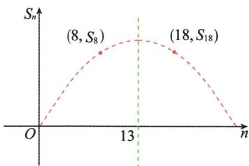

line

| Point | x-axis label | y-axis label |
|---|---|---|
| (8, S₈) | 8 | 0 |
| (18, S₁₈) | 18 | 0 |
O
13

故当 n=13 时, $S_{n}$ 有最大值, 即数列 $\{a_{n}\}$ 的前 13 项和最大.

# 本节与高考

等差数列的前 n 项和 $S_{n}$ 常结合数列的通项公式及性质进行考查,也常与函数相结合考查数列的单调性.在近几年的高考中,等差数列的前 n 项和多次出现在中等难度的试题中,既有选择题、填空题,也有解答题.灵活运用等差数列的前 n 项和公式及性质解决相关问题是高考考查的重点,学习时应注意运用函数的观点分析、处理有关等差数列的综合问题.

直接对等差数列的前 n 项和公式进行配方, 利用二次函数的知识求解前 n 项和的最值问题. 注意项数 n 的取值范围为正整数, 对于 $S_{n} = An^{2} + Bn (A \neq 0)$ , 并不一定当 $n = -\frac{B}{2A}$ 时取得最值, 而是若 $-\frac{B}{2A} \in N^{*}$ , 则 $n = -\frac{B}{2A}$ 时取得最值; 若 $-\frac{B}{2A} \notin N^{*}$ , n 取与 $-\frac{B}{2A}$ 最接近的正整数时取得最值.

这三种方法在研究等差数列的前 n 项和的最值问题中可以灵活应用,有时对于同一个题目,三种方法都适用,关键是根据题目条件选择最适当的方法加以分析与求解.通过不同方法的比较与渗透,提高知识的应用能力及分析问题、解决问题的能力.

# 4.3 等比数列

# 4.3.1 等比数列的概念

# 1. 等比数列的有关定义及公式

(1)等比数列的定义:一个数列从第2项起,每一项与它的前一项的比等于同一个常数.

$$
\text {   公比   } q (q \neq 0)
$$

(2)等比中项:a,G,b成等比数列,G叫做a与b的等比中项,且 $G^{2}=ab$ .   
(3)通项公式: $a_{n}=a_{1}q^{n-1}=a_{m}q^{n-m}(m,n\in\mathbf{N}^{*})$ 。只满足此式, 不能确定 $a,G,b$ 或等比数列

# 2. 等比数列的判定

(1) 定义法: $\frac{a_n}{a_{n-1}} = q (q \neq 0, n \geqslant 2, n \in \mathbb{N}^*, a_n \neq 0) \Leftrightarrow \{a_n\}$ 是等比数列;  
(2) 等比中项法: $a_{n}^{2} = a_{n-1} \cdot a_{n+1} (n \geqslant 2, n \in \mathbf{N}^{*}, a_{n} \neq 0) \Leftrightarrow \{a_{n}\}$ 是等比数列;  
(3)通项公式法: $a_{n}=k\cdot q^{n-1}(k\neq0,q\neq0,n\in\mathbf{N}^{*})\Leftrightarrow\{a_{n}\}$ 是首项为k,公比为q的等比数列.

# 3. 等比数列的常用性质 只能在小题中用

若数列 $\{a_{n}\}$ 是公比为 $q$ 的等比数列，

(1) 若 $m+n=r+s(m,n,r,s\in\mathbf{N}^{*})$ ，则 $a_{m}\cdot a_{n}=a_{r}\cdot a_{s}$ ; 反之不一定成立特别地，当 $m+n=2r$ 时， $a_{m}\cdot a_{n}=a_{r}^{2}$ .

(2) $a_{k},a_{k+m},a_{k+2m},\cdots$ 成公比为 $q^{m}$ 的等比数列.  
(3) 数列 $\{\lambda a_{n}\}$ ( $\lambda$ 为不等于零的常数) 是公比为 q 的等比数列.  
(4) 当 $a_{n}>0$ 时, 数列 $\{\lg a_{n}\}$ 是公差为 $\lg q$ 的等差数列.  
(5) 数列 $\left\{a_{n}^{2}\right\},\left\{\frac{1}{a_{n}}\right\},\left\{a_{n}^{r}\right\}(r\in\mathbf{Z})$ 是等比数列, 公比依次是 $q^{2},\frac{1}{q},q^{r}$ .

# 知识深层理解

# 问题1 如何理解等比数列的定义？

提示 由等差数列的定义知, 等差数列 $\{a_{n}\}$ 满足 $a_{2}-a_{1}=a_{3}-a_{2}=\cdots=a_{n}-a_{n-1}=\cdots=d$ , 其中 d 是与 n 无关的常数. 因此, 等比数列的定义可用数学符号语言描述为 $\frac{a_{n}}{a_{n-1}}=q(q\neq0)$ 对任意的 $n\geqslant2, n\in N^{*}$ 均成立, 或 $\frac{a_{n+1}}{a_{n}}=q(q\neq0)$ 对任意的 $n\in N^{*}$ 均成立, 上述两式通常作为判断数列是否为等比数列的依据.

# 问题2 是否存在既是等差数列又是等比数列的数列？

提示 存在. 当数列 $\{a_{n}\}$ 为非零常数列时, 它既是等差数列又是等比数列. 对

# 印象笔记

在定义中,我们规定 $q\neq0$ ,这是因为若q=0,则 $\frac{a_{n+1}}{a_{n}}=0$ ,所以 $a_{n+1}=0$ ,即数列中存在为0的项,于是 $\frac{a_{n+2}}{a_{n+1}}$ 就没有意义,因而也就不符合等比数列的定义.

于常数列,若它的各项都是零,则它只是等差数列,不是等比数列.因此,常数列必是等差数列,但不一定是等比数列.

# 问题32 和 8 的等比中项是 4 吗?

提示 不是. 若 a, G, b 成等比数列, 则其中任意一项均不为零, $\frac{G}{a} = \frac{b}{G} \Rightarrow G^{2} = ab \Rightarrow ab > 0 \Rightarrow a$ , b 同号, 且由 $G^{2} = ab$ 知 $G = \pm \sqrt{ab}$ , 所以同号非零的两个数的等比中项有两个, 是互为相反数的两个数, 因此 2 和 8 的等比中项是 $\pm 4$ . 但 “4 是 2 和 8 的等比中项” 这个说法是正确的, “-4 是 2 和 8 的等比中项” 也是正确的.

# 问题4 怎样理解与掌握等比数列的通项公式？

提示 等比数列 $\{a_{n}\}$ 的通项公式 $a_{n} = a_{1}q^{n - 1}(q\neq 0)$ 可以推广为 $a_{n} = a_{m}q^{n - m}(q\neq$ 0)，即已知等比数列的任意两项，都可以求出数列的任何一项.

# 用函数思想理解等比数列的通项公式

等比数列 $\{a_{n}\}$ 的通项公式 $a_{n} = a_{1}q^{n - 1}$ 可以改写为 $a_{n} = \frac{a_{1}}{q}\cdot q^{n}$ . 当 $q > 0$ 且 $q\neq 1$ 时， $y = q^x$ 是一个指数函数， $y = \frac{a_1}{q}\cdot q^x$ 是一个不为0的常数与指数函数的积，因此等比数列 $\{a_{n}\}$ 的图象是函数 $y = \frac{a_1}{q}\cdot q^x$ 的图象上的一系列离散的点.

由此可得到

① $\left\{\begin{aligned}a_{1}>0,\\ q>1\end{aligned}\right.$ 或 $\left\{\begin{aligned}a_{1}<0,\\ 0<q<1\end{aligned}\right.\Leftrightarrow\left\{a_{n}\right\}$ 为递增数列；

② $\left\{\begin{aligned}a_{1}&>0,\\ 0&<q<1\end{aligned}\right.$ 或 $\left\{\begin{aligned}a_{1}&<0,\\ q&>1\end{aligned}\right.\Leftrightarrow\left\{a_{n}\right\}$ 为递减数列；

③ $q=1 \Leftrightarrow \{a_{n}\}$ 为非零常数列；

④ $q<0\Leftrightarrow\{a_{n}\}$ 为摆动数列(它所有的奇数项同号,所有的偶数项同号,但奇数项与偶数项异号).

# 应试拓展注意

# 拓展1 等比数列的判定方法

# 定义法

根据等比数列的定义,如果数列 $\{a_{n}\}$ 满足关系式 $\frac{a_{n+1}}{a_{n}}=q(q\neq0,n\in\mathbf{N}^{*})$ ,那么该数列就是一个以q为公比的等比数列.

# 印象笔记

# 等差中项与等比中项的区别

(1)任意两数都存在等差中项,但并不是任意两数都存在等比中项,当且仅当两数同号且均不为0时才存在等比中项;
(2)任意两数的等差中项是唯一的,而若两数有等比中项,则等比中项有两个,且互为相反数.

例如, 以 1 为首项, 2 为公比的等比数列的通项公式为 $a_{n}=1\cdot2^{n-1}$ , 还可以写成 $a_{n}=\frac{1}{2}\cdot2^{n}$ , 其部分图象如图所示.

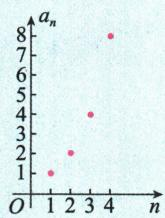

scatter

| n | a_n |
|---|-----|
| 1 | 1   |
| 2 | 2   |
| 3 | 4   |
| 4 | 8   |

当 q>0 时, 等比数列各项的符号相同; 当 q<0 时, 等比数列各项的符号正负交替.

【例1】已知数列 $\{a_{n}\}$ 满足 $a_1 = -2, a_{n+1} = 2a_n + 4$ .

(1) 证明: 数列 $\{a_{n}+4\}$ 是等比数列;

(2)求数列 $\{a_{n}\}$ 的通项公式.

(1) 证明: $\because a_{1} = -2, \therefore a_{1} + 4 = 2$ .

$$
\because a _ {n + 1} = 2 a _ {n} + 4, \therefore a _ {n} + 4 \neq 0, a _ {n + 1} + 4 = 2 a _ {n} + 8 = 2 (a _ {n} + 4), \therefore \frac {a _ {n + 1} + 4}{a _ {n} + 4} = 2,
$$

∴ 数列 $\{a_{n}+4\}$ 是以 2 为首项, 2 为公比的等比数列.

(2) 解: 由 (1) 知 $a_{n} + 4 = 2^{n}, \therefore a_{n} = 2^{n} - 4$ .

# 通项公式法

根据等比数列的通项公式,如果数列 $\{a_{n}\}$ 满足关系式 $a_{n}=k\cdot q^{n-1}(k\neq0,q\neq0,n\in\mathbf{N}^{*})$ ,那么该数列就是一个以k为首项,q为公比的等比数列.

【例 2】已知 $\{a_{n}\}$ 是各项均为正数的等差数列, $\lg a_{1}, \lg a_{2}, \lg a_{4}$ 成等差数列, 若 $b_{n} = \frac{1}{a_{2^{n}}}, n = 1, 2, 3, \cdots$ , 则 ( )

A. $\{b_{n}\}$ 为等差数列

B. $\{b_{n}\}$ 为等比数列

C. $\{a_{n}\}$ 为递增数列

D. $\{b_{n}\}$ 为递增数列

解析：∵ $\lg a_{1}, \lg a_{2}, \lg a_{4}$ 成等差数列，∴ $2\lg a_{2} = \lg a_{1} + \lg a_{4}$ ，即 $a_{2}^{2} = a_{1}a_{4}$ .

设等差数列 $\{a_{n}\}$ 的公差为 $d$ ，则 $(a_{1} + d)^{2} = a_{1}(a_{1} + 3d)$ ，即 $d^2 = a_1d$

当 $d = 0$ 时， $\{a_{n}\}$ 是一个各项均为正数的常数列，且 $a_{n} = a_{1}$ ，则 $b_{n} = \frac{1}{a_{1}}$

$\therefore \{b_{n}\}$ 是常数列,此时选项 C,D 均不成立.

当 $d \neq 0$ 时, $d = a_{1} > 0$ , $a_{n} = a_{1} + (n - 1)d = na_{1}$ , $a_{2^{n}} = 2^{n}a_{1}$ ,

$b_{n}=\frac{1}{a_{2^{n}}}=\frac{1}{a_{1}}\cdot\frac{1}{2^{n}}=\frac{1}{2a_{1}}\cdot\left(\frac{1}{2}\right)^{n-1},\therefore\left\{b_{n}\right\}$ 是首项为 $b_{1}=\frac{1}{2a_{1}}$ ，公比为 $\frac{1}{2}$ 的等比数列.此时， $\left\{a_{n}\right\}$ 为递增数列， $\left\{b_{n}\right\}$ 为递减数列.

综上， $\{b_{n}\}$ 是等比数列. 故选 B.

答案:B

# 等比中项公式法

根据等比数列的等比中项公式,如果数列 $\{a_{n}\}$ 满足关系式 $a_{n}^{2}=a_{n-1}\cdot a_{n+1}(n\in\mathbf{N}^{*},n\geqslant2,a_{n}\neq0)$ ,那么该数列就是一个等比数列,反之亦成立.

【例3】在正项等差数列 $\{a_{n}\}$ 中， $a_1^2 = 2a_5 - a_9$ ，且 $a_5 + a_6 + a_7 = 18$ ，则 （）

A. $a_1, a_2, a_3$ 成等比数列

B. $a_4, a_6, a_9$ 成等比数列

C. $a_{3}, a_{4}, a_{8}$ 成等比数列

D. $a_{2}, a_{3}, a_{6}$ 成等比数列

解析:设等差数列 $\{a_{n}\}$ 的公差为d,由题意得d>0.

由 $a_1^2 = 2a_5 - a_9$ ，得 $a_1^2 = a_1 + a_9 - a_9 = a_1.$

又因为 $a_{n}>0$ ，所以 $a_{1}=1$ 。

再由 $a_5 + a_6 + a_7 = 18$ ，得 $3a_{6} = 18, a_{6} = 6$ ，从而易得 $d = 1$ ，故 $a_{n} = n$ .

因为 $6^{2}=4\times9$ ，即 $a_{6}^{2}=a_{4}a_{9}$ ，所以 $a_{4},a_{6},a_{9}$ 成等比数列，故选 B.

答案:B

# 印象笔记

用定义法判断一个数列是否为等比数列时应注意以下几点：

(1) 任一项 $a_{n} \neq 0$ , 且 $q \neq 0$ .

(2) 切忌只通过计算 $\frac{a_{2}}{a_{1}}, \frac{a_{3}}{a_{2}}, \frac{a_{4}}{a_{3}}$ 等有限的几个项的比后，发现它们都是同一常数，就断言数列 $\{a_{n}\}$ 为等比数列.

利用数列的性质与等差、等比数列的有关知识, 将问题转化为有关通项公式的问题, 再加以判定.

等比数列中除首末两项外,任何一项都是其前后两项的等比中项,即 $a_{n}^{2}=a_{n-1}\cdot a_{n+1}(n\geqslant2,n\in\mathbf{N}^{*})$ .

由等比中项可知，等比数列的奇数项和偶数项的符号分别一致，需要注意此性质，在某些情况下可以利用此性质排除错解，避免多解.

# 拓展2等比数列的性质 二级结论

① 性质 1: 在等比数列 $\{a_{n}\}$ 中, 若 $m + n = r + s (m, n, r, s \in \mathbf{N}^{*})$ , 则 $a_{m} a_{n} = a_{r} a_{s}$ .

特别地, 在等比数列 $\{a_{n}\}$ 中, 若 $m + n = 2p$ , 则 $a_{m}a_{n} = a_{p}^{2}$ , 即当 $m, p, n (m, n, p \in \mathbf{N}^{*})$ 成等差数列时, $a_{m}, a_{p}, a_{n}$ 成等比数列.

一般地,如果 $t, k, p, \cdots, m, n, r, \cdots$ 皆为正整数,且 $t + k + p + \cdots = m + n + r + \cdots$ (两边的正整数个数相等),那么当 $\{a_{n}\}$ 为等比数列时, $a_{t}a_{k}a_{p}\cdot\cdots=a_{m}a_{n}a_{r}\cdot\cdots$ .

【例4】在正项等比数列 $\{a_{n}\}$ 中， $a_{1}a_{5} - 2a_{3}a_{5} + a_{3}a_{7} = 36, a_{2}a_{4} + 2a_{2}a_{6} + a_{4}a_{6} = 100$ ，求数列 $\{a_{n}\}$ 的通项公式.

解:设正项等比数列 $\{a_{n}\}$ 的公比为 $q(q>0)$ .

$$
\because a _ {1} a _ {5} = a _ {3} ^ {2}, a _ {3} a _ {7} = a _ {5} ^ {2}, \therefore a _ {3} ^ {2} - 2 a _ {3} a _ {5} + a _ {5} ^ {2} = 3 6,
$$

同理得 $a_3^2 + 2a_3a_5 + a_5^2 = 100, \therefore \begin{cases} (a_3 - a_5)^2 = 36, \\ (a_3 + a_5)^2 = 100. \end{cases}$

$\because a_{n} > 0, \therefore \left\{ \begin{array}{l} a_{3} - a_{5} = \pm 6, \\ a_{3} + a_{5} = 10, \end{array} \right.$ 解得 $\left\{ \begin{array}{l} a_{3} = 2, \\ a_{5} = 8 \end{array} \right.$ 或 $\left\{ \begin{array}{l} a_{3} = 8, \\ a_{5} = 2. \end{array} \right.$ 分别解得 $\left\{ \begin{array}{l} a_{1} = \frac{1}{2}, \\ q = 2 \end{array} \right.$ 或 $\left\{ \begin{array}{l} a_{1} = 32, \\ q = \frac{1}{2}. \end{array} \right.$

$\therefore a_{n} = a_{1}q^{n - 1} = 2^{n - 2}$ 或 $a_{n} = a_{1}q^{n - 1} = 2^{6 - n}$

② 性质2: 已知 $\{a_{n}\}$ 是公比为 q 的等比数列, 则数列 $\{\lambda a_{n}\}$ ( $\lambda$ 为不等于0的常数) 是公比为 q 的等比数列; 若 $\{b_{n}\}$ 是与 $\{a_{n}\}$ 项数相同且公比为 $q'$ 的等比数列, 则数列 $\{a_{n} b_{n}\}$ 是公比为 $qq'$ 的等比数列; 数列 $\left\{\frac{1}{a_{n}}\right\}$ 是公比为 $\frac{1}{q}$ 的等比数列; 数列 $\{|a_{n}|\}$ 是公比为 $|q|$ 的等比数列.

③ 性质 3: 若数列 $\{a_{n}\}$ 是各项均为正数, 公比为 q 的等比数列, 则数列 $\{\lg a_{n}\}$ 是公差为 $\lg q$ 的等差数列.

④ 性质 4: 在公比为 q 的等比数列 $\{a_{n}\}$ 中, 每隔 $k(k \in \mathbf{N}^{*})$ 项取出一项, 取出的数按原来顺序组成的新数列仍为等比数列且公比为 $q^{k+1}$ .

特别地,等比数列的奇数项、偶数项分别组成一个等比数列,新公比均为原公比的平方,即等比数列间隔一项的两项符号相同.

⑤ 性质 5: 等比数列 $\{a_{n}\}$ 中连续相邻两项的和或差 (不能为 0) 构成的数列 $\{a_{n} \pm a_{n+1}\}$ 是公比为 q 的等比数列.

【例 5】设 $\{a_{n}\}$ 是等比数列, 公比为 q, 则下列数列: ① $\{a_{n}a_{n+1}\}$ ; ② $\{a_{n}+a_{n+1}\}$ ; ③ $\{a_{n+1}-a_{n}\}$ ; ④ $\{a_{n}^{2}\}$ ; ⑤ $\left\{\frac{1}{a_{n}}\right\}$ ; ⑥ $\{a_{n}+3\}$ 中, 一定是等比数列的有 ( )

A. 3 个

B. 4 个

C. 5 个

D. 6 个

解析:① $\left\{a_{n}a_{n+1}\right\}$ 是首项为 $a_{1}a_{2}$ ，公比为 $q^{2}$ 的等比数列；

②当 $q \neq -1$ 时， $\{a_n + a_{n+1}\}$ 是等比数列，但当 $q = -1$ 时， $\{a_n + a_{n+1}\}$ 不是等比数列；

# 印象笔记

证明: $a_{m} \cdot a_{n} = a_{1}^{2} \cdot q^{m-1+n-1} = a_{1}^{2} \cdot q^{m+n-2} = a_{1}^{2} \cdot q^{r+s-2} = a_{1} \cdot q^{r-1} \cdot a_{1} \cdot q^{s-1} = a_{r}a_{s}.$

若 $\{a_{n}\}$ 是有穷等比数列, 则与首末两项等距离的两项之积都相等, 且等于首末两项之积.

直接利用所求项与已知项之间的关系,减少运算过程,使解题更为简便.

若 $\{a_{n}\}$ 是等差数列，公差为 $d$ ，则 $\{k^{a_n}\} (k > 0)$ 是公比为 $k^d$ 的等比数列.

③当 $q \neq 1$ 时， $\{a_{n+1}-a_{n}\}$ 是等比数列，但当 q=1 时， $\{a_{n+1}-a_{n}\}$ 不是等比数列；

④根据性质2知 $\{a_{n}^{2}\}$ 是首项为 $a_{1}^{2}$ ，公比为 $q^{2}$ 的等比数列；

⑤根据性质2知 $\left\{\frac{1}{a_{n}}\right\}$ 是首项为 $\frac{1}{a_{1}}$ ，公比为 $\frac{1}{q}$ 的等比数列；

⑥仅当 q=1 且 $a_{n}\neq-3$ 时， $\{a_{n}+3\}$ 是非零常数列，是等比数列，但当 $q\neq1$ 或 $\left\{\begin{aligned}q&=1,\\ a_{n}&=-3\end{aligned}\right.$ 时， $\{a_{n}+3\}$ 不是等比数列.

答案:A

⑥ 性质6: 公比为 $q$ 的等比数列 $\{a_{n}\}$ 的前 $n$ 项积记为 $T_{n}$ , 则 $T_{n} = a_{1}^{n} q^{\frac{n(n-1)}{2}}$ , 且 $T_{n}$ , $\frac{T_{2n}}{T_{n}}, \frac{T_{3n}}{T_{2n}}, \cdots$ 成等比数列, 其公比为 $q^{n^{2}}$ . 由此可得 $\left(\frac{T_{2n}}{T_{n}}\right)^{2} = T_{n} \cdot \frac{T_{3n}}{T_{2n}}$ , 即 $T_{3n} = \left(\frac{T_{2n}}{T_{n}}\right)^{3}$ .

【例6】等比数列 $\{a_{n}\}$ 中， $a_{1}a_{2}\cdots a_{10}=1, a_{11}a_{12}\cdots a_{20}=2$ ，求 $a_{21}a_{22}\cdots a_{30}$ 的值.

解: 方法一: 设等比数列 $\{a_{n}\}$ 的公比为 q. 因为 $a_{1}a_{2}\cdots a_{10}=1, a_{11}a_{12}\cdots a_{20}=(a_{1}a_{2}\cdots a_{10})q^{100}=2$ , 所以 $q^{100}=2$ , 所以 $a_{21}a_{22}\cdots a_{30}=(a_{11}a_{12}\cdots a_{20})q^{100}=4$ .

方法二: 设 $\{a_{n}\}$ 的前 n 项积为 $T_{n}$ . 由题意可知 $T_{10}=1, T_{20}=1\times2=2$ , 由性质 6, 得 $T_{30}=\left(\frac{T_{20}}{T_{10}}\right)^{3}=\left(\frac{2}{1}\right)^{3}=8$ , 所以 $a_{21}a_{22}\cdots a_{30}=\frac{T_{30}}{T_{20}}=4$ .

# 拓展3 设等比数列中的项的方法

① 通项公式法: 设 $a_{n}=a_{1}q^{n-1}$ ;  
② 对称设项法： $\cdots,\frac{a}{q^{2}},\frac{a}{q},a,aq,aq^{2},\cdots.$

当项数 n 为奇数时, 先设中间一个数为 a, 再以公比为 q 向两边对称地依次设项即可. 特别地, 如三个数成等比数列, 可设为 $\frac{a}{q}$ , a, aq.

当项数 n 为偶数且公比大于 0 时, 先设中间两个数为 $\frac{a}{q}$ 和 aq, 再以公比为 $q^{2}$ 向两边对称地依次设项即可. 如同号四个数成等比数列, 可设为 $\frac{a}{q^{3}}, \frac{a}{q}, aq, aq^{3}$ ; 同号六个数成等比数列, 可设为 $\frac{a}{q^{5}}, \frac{a}{q^{3}}, \frac{a}{q}, aq, aq^{3}, aq^{5}$ .

【例 7】已知四个数,前三个数成等差数列,后三个数成等比数列,中间两数之积为 16,第一个数和第四个数之积为 -128,求这四个数.

解:由中间两数之积为16可得后三个数同号,所以可设所求四个数依次为 $\frac{2a}{q}-aq,\frac{a}{q},aq,aq^{3}$ ,则由已知得 $\frac{a}{q}\cdot(aq)=16①,\left(\frac{2a}{q}-aq\right)\cdot(aq^{3})=-128②.$

由①得 $a^{2}=16$ ，所以 $a=\pm4$ 。  
由②得 $2a^{2}q^{2}-a^{2}q^{4}=-128.$

# 印象笔记

山西大同的辽金时代建筑华严寺的大雄宝殿共有9间，左右对称分布，最中间的是明间，宽度最大，然后向两边均依次是次间、次间、梢间、尽间。每间宽度从明间开始向左右两边均按相同的比例逐步递减。

若已知四个数成等比数列及这四个数的积时,一般不设为 $\frac{a}{q^{3}}$ , $\frac{a}{q}$ , aq, $aq^{3}$ , 因为这种设法使得四个数构成的等比数列的公比为 $q^{2}$ , 漏掉了公比为负数的情况.

将 $a^2 = 16$ 代入得 $q^4 - 2q^2 - 8 = 0$ , 解得 $q^2 = 4$ , 所以 $q = \pm 2$ .

因此所求的四个数依次为-4,2,8,32或4,-2,-8,-32.

# 疑难突破提高

# 突破 构造等比数列求通项公式

已知形如 $a_{n}=pa_{n-1}+q$ (其中 $p\neq1,pq\neq0,n\geqslant2,n\in N^{*}$ )，或者 $a_{n}=pa_{n-1}+f(n)(n\geqslant2,n\in N^{*})$ 的递推公式，求数列 $\{a_{n}\}$ 通项公式的问题，可以通过配凑构造等比数列求解.

① 对 $a_{n}=pa_{n-1}+q(p\neq1,pq\neq0,n\geqslant2,n\in\mathbf{N}^{*})$ 型递推公式，可转化为 $a_{n}-\frac{q}{1-p}=p\left(a_{n-1}-\frac{q}{1-p}\right)$ ，当 $a_{1}-\frac{q}{1-p}\neq0$ 时，数列 $\left\{a_{n}-\frac{q}{1-p}\right\}$ 为等比数列.

也可消去常数项，由 $a_{n} = pa_{n - 1} + q, a_{n - 1} = pa_{n - 2} + q (n \geqslant 3)$ ，两式相减得 $a_{n} - a_{n - 1} = p(a_{n - 1} - a_{n - 2})(n \geqslant 3)$ ，当 $a_{2} - a_{1} \neq 0$ 时，数列 $\{a_{n} - a_{n - 1}\}$ 为等比数列.

② 对于 $a_{n} = pa_{n - 1} + q^{n - 1}(pq\neq 0,p\neq q,n\geqslant 2,n\in \mathbf{N}^{*})$ 型递推公式，可转化为 $a_{n}-$ $\frac{q^n}{q - p} = p\left(a_{n - 1} - \frac{q^{n - 1}}{q - p}\right)$ ，或将递推公式两边同时除以 $q^n$ ，转化为 $\frac{a_n}{q^n} = \frac{p}{q}\cdot \frac{a_{n - 1}}{q^{n - 1}} +\frac{1}{q}$ 即为

① 中类型,或两边同时除以 $p^n$ , 转化为 $\frac{a_n}{p^n} = \frac{a_{n-1}}{p^{n-1}} + \frac{q^{n-1}}{p^n}$ , 再利用累加法求通项公式.

③ 对于 $a_{n}=pa_{n-1}+q^{n-1}+t(pqt\neq0,p\neq1,n\geqslant2,n\in\mathbf{N}^{*})$ 型递推公式, 可转化为 $a_{n}-\frac{t}{1-p}=p\left(a_{n-1}-\frac{t}{1-p}\right)+q^{n-1}$ , 即为 ② 中类型, 然后再求解.

【例8】已知数列 $\{a_{n}\}$ 的前 $n$ 项和为 $S_{n}$ , 满足 $S_{n} + 2n = 2a_{n}$ . 证明: 数列 $\{a_{n} + 2\}$ 是等比数列, 并求数列 $\{a_{n}\}$ 的通项公式.

解:由 $S_{n}+2n=2a_{n}$ ，得 $S_{n}=2a_{n}-2n$ ，

当 $n = 1$ 时， $S_{1} = 2a_{1} - 2$ ，解得 $a_{1} = 2$ ；当 $n \geqslant 2$ 且 $n \in \mathbf{N}^{*}$ 时， $S_{n-1} = 2a_{n-1} - 2(n-1)$ ，

$\therefore a_{n} = S_{n} - S_{n - 1} = 2a_{n} - 2a_{n - 1} - 2n + 2(n - 1)$ ，即 $a_{n} = 2a_{n - 1} + 2,\therefore a_{n} + 2 = 2(a_{n - 1} + 2),$

∴ 数列 $\{a_{n}+2\}$ 是以 $a_{1}+2=4$ 为首项, 2 为公比的等比数列.

$$
\therefore a _ {n} + 2 = 4 \cdot 2 ^ {n - 1} = 2 ^ {n + 1}, \therefore a _ {n} = 2 ^ {n + 1} - 2.
$$

【例9】已知数列 $\{a_{n}\}$ 满足 $a_1 = 3, a_{n+1} = 2a_n - n + 1$ . 证明: 数列 $\{a_{n} - n\}$ 为等比数列, 并求数列 $\{a_{n}\}$ 的通项公式.

解:由题意,当 $n \in N^{*}$ 时, $\frac{a_{n+1} - (n+1)}{a_n - n} = \frac{(2a_n - n+1) - (n+1)}{a_n - n} = 2$ ,

又∵ $a_{1}-1=2$ ,∴数列 $\{a_{n}-n\}$ 是首项为2,公比为2的等比数列,

$$
\therefore a _ {n} - n = 2 \cdot 2 ^ {n - 1} = 2 ^ {n}, \therefore a _ {n} = 2 ^ {n} + n.
$$

# 印象笔记

化归意识是指把待解决的问题转化、归纳为已有知识范围内可解问题的一种数学意识，包含化简复杂式子的意识、对数学表达式进行变形的意识、从目标入手进行分析的意识等。数列中诸多较复杂的问题都是通过转化与化归的方法解决的。

形如 $a_{n} = pa_{n - 1} + q$ $(p\neq 1,pq\neq 0,n\geqslant 2,$ $n\in \mathbf{N}^*$ )型递推公式，求 $\{a_n\}$ 的通项公式的步骤

(1) 将递推公式变形为 $a_{n}-\frac{q}{1-p}=p\left(a_{n-1}-\frac{q}{1-p}\right)$ ，当 $a_{1}-\frac{q}{1-p}\neq0$ 时， $\left\{a_{n}-\frac{q}{1-p}\right\}$ 是首项为 $a_{1}-\frac{q}{1-p}$ ，公比为 p 的等比数列；

(2) 写出 $\left\{a_{n}-\frac{q}{1-p}\right\}$ 的通项公式；

(3) 写出数列 $\{a_{n}\}$ 的通项公式.

# 本节与高考

等比数列与等差数列均为高考的重点内容,主要考查其基本概念、公式、性质,以及对这些知识的灵活运用.等比数列与其他数学知识及现实生活有着广泛的联系,所以高考会针对其概念、性质及应用问题进行考查.

# 印象笔记

# 4.3.2 等比数列的前 $n$ 项和公式

# 敲黑板

# 1. 等比数列的前 $n$ 项和公式

设等比数列 $\{a_{n}\}$ 的前n项和为 $S_{n}$ ，公比为q.
已知末项时用
当 q=1 时， $S_{n}=na_{1}$ ; 当 $q\neq1$ 时， $S_{n}=\frac{a_{1}(1-q^{n})}{1-q}=\frac{a_{1}-a_{n}q}{1-q}$ .

# 2. 等比数列的前 $n$ 项和的常用性质 已知项数时用

设数列 $\{a_{n}\}$ 是公比为q的等比数列, $S_{n}$ 为其前n项和.

(1) $S_{n+m}=S_{n}+q^{n}S_{m}=S_{m}+q^{m}S_{n}$ ; 当 $q\neq1$ 时, $\frac{S_{n}}{S_{m}}=\frac{1-q^{n}}{1-q^{m}}$ .  
(2) 若项数为 $2n (n \in \mathbf{N}^{*})$ ，则 $\frac{S_{\text{偶}}}{S_{\text{奇}}} = q$ ；若项数为 $2n + 1 (n \in \mathbf{N}^{*})$ ，则 $\frac{S_{\text{奇}} - a_{1}}{S_{\text{偶}}} = q$ .  
(3) 对数列 $S_{k}, S_{2k} - S_{k}, S_{3k} - S_{2k}, \cdots$ ，当 $q \neq -1$ 时为等比数列.

当 q=-1 时, 若 k 为偶数, 则不是等比数列; 若 k 为奇数, 则是公比为 -1 的等比数列.

# 知识深层理解

# 问题 如何理解等比数列的前 n 项和公式?

提示 ① 等比数列 $\{a_{n}\}$ 的前 $n$ 项和公式中涉及 $a_{1}, a_{n}, n, S_{n}, q$ 五个量，通常给出三个量结合通项公式与前 $n$ 项和公式可求其他两个量，即常说的“知三求二”.  
② $\{a_{n}\}$ 是等比数列的充要条件是 $S_{n}=A-Aq^{n}(A$ 是不等于零的常数). 等号右边是一个指数式与一个常数的和, 且指数式的系数与常数项互为相反数. 可以利用该结论判断一个数列是不是等比数列, 即数列 $\{a_{n}\}$ 为等比数列 $\Leftrightarrow S_{n}=A-Aq^{n}\left(A=\frac{a_{1}}{1-q}, a_{1}\neq0, q\neq0, q\neq1\right)$ .

一般地, 若数列 $\{a_{n}\}$ 的前 $n$ 项和 $S_{n} = a^{n} + b (a, b$ 为常数, $a \neq 1$ 且 $a \neq 0$ ), 则 $a_{n} = \left\{ \begin{array}{l} a + b, n = 1, \\ (a - 1)a^{n - 1}, n \geqslant 2. \end{array} \right.$ 当 $b = -1$ 时, 数列 $\{a_{n}\}$ 是以 $a - 1$ 为首项, $a$ 为公比的等比数列; 当 $b \neq -1$ 时, 数列 $\{a_{n}\}$ 不是等比数列, 但数列 $\{a_{n}\}$ 从第2项起, 构成一个等比数列. 在这里, 注意与等差数列前 $n$ 项和作类比.

若求等比数列的前 n 项和但公比 q 未知, 则需讨论 q=1 与 $q \neq 1$ 两种情况.

# 印象笔记

# 应试拓展注意

# 拓展1 等比数列前 n 项和的求和策略

# 直接利用公式

对公比为 q 的等比数列 $\{a_{n}\}$ ，直接利用等比数列的前 n 项和公式 $S_{n}=$ $\left\{\begin{aligned}&na_{1},q=1,\\&\frac{a_{1}-a_{n}q}{1-q}=\frac{a_{1}(1-q^{n})}{1-q},q\neq1\end{aligned}\right.$ 求和，是解决有关求和问题最常用的方法之一，关键是对公比进行分析，选择适当的公式求和.

【例1】已知 $\{a_{n}\}$ 是等比数列, $a_{2} = 2, a_{5} = \frac{1}{4}$ , 则 $a_{1}a_{2} + a_{2}a_{3} + \dots + a_{n}a_{n+1} =$ （）

A. $16(1 - 4^{-n})$

B. $16(1 - 2^{-n})$

C. $\frac{32}{3} (1 - 4^{-n})$

D. $\frac{32}{3} (1 - 2^{-n})$

解析:设等比数列 $\{a_{n}\}$ 的公比为 $q.\because a_{2}=2,a_{5}=\frac{1}{4},\therefore q^{3}=\frac{1}{8},\therefore q=\frac{1}{2},\therefore a_{1}=4.$

$\because \{a_{n}\}$ 是等比数列， $\therefore \{a_{n}a_{n + 1}\}$ 为等比数列，首项为 $a_1a_2 = 8$ ，公比为 $q^2 = \frac{1}{4}$

$$
\therefore a _ {1} a _ {2} + a _ {2} a _ {3} + \dots + a _ {n} a _ {n + 1} = \frac {8 \left(1 - \frac {1}{4 ^ {n}}\right)}{1 - \frac {1}{4}} = \frac {3 2}{3} (1 - 4 ^ {- n}).
$$

答案:C

# 错位相减法

利用等比数列求和公式的推导方法,一般可解决形如一个等差数列和一个等比数列对应项相乘所得数列的求和问题.这种方法主要用于求数列 $\{a_{n}\cdot b_{n}\}$ 的前n项和,其中 $\{a_{n}\},\{b_{n}\}$ 分别是等差数列和等比数列.

应用错位相减法的一般步骤:(1)两边同乘公比q,写出 $S_{n}$ 与 $qS_{n}$ 的表达式;(2)对乘公比前后的两个式子进行错位相减.要注意公比 $q\neq1$ 这一前提,如果不能确定公比q是否为1,应分两种情况讨论.

【例 2】 若数列 $\{a_{n}\}$ 的通项公式为 $a_{n}=(2n-1)\cdot3^{n}$ ，求此数列的前 n 项和 $S_{n}$ .

解: 已知 $S_{n}=1\times3^{1}+3\times3^{2}+5\times3^{3}+\cdots+(2n-1)\cdot3^{n}$ , ①

上式两边同时乘3,得 $3S_{n}=1\times3^{2}+3\times3^{3}+5\times3^{4}+\cdots+(2n-1)\cdot3^{n+1}$ .②

①-②, 得 $-2S_{n}=1\times3+(3-1)\times3^{2}+(5-3)\times3^{3}+\cdots+[2n-1)-(2n-3)]\cdot3^{n}-(2n-1)\cdot3^{n+1}$ ,

# 印象笔记

利用公式法求解等比数列的前 n 项和时,首先要弄清关键量——首项和公比,然后代入求和公式求解即可.

等比数列的通项公式和前 n 项和公式都与 $q^{n}$ 有关, 解题时注意运用整体思想, 可以把运算相关的 $q^{2}, q^{3}, q^{n}$ 看作一个整体进行求解.

错位的目的在于使幂指数相同的项对应,便于找出两式相减的结果.两式作差的结果要注意两点:①一般差式有 $n+1$ 项;②一般除第一项和最后一项外,中间n-1项构成等比数列.

即 $-2S_{n}=3+2\times(3^{2}+3^{3}+\cdots+3^{n})-(2n-1)\cdot3^{n+1}=3+2\times\frac{3^{2}(1-3^{n-1})}{1-3}-(2n-1)\cdot3^{n+1}=(2-2n)\cdot3^{n+1}-6$ ，所以 $S_{n}=(n-1)\cdot3^{n+1}+3$ .

# 分组求和法

若数列的通项公式可分解为几个容易求和的部分,则对数列的和式进行重新分组,分别求和,最终达到求数列前 n 项和的目的.

【例3】已知数列 $\{a_{n}\}$ 中， $a_{1} = \frac{5}{6}, a_{2} = \frac{19}{36}$ ，数列 $\{b_{n}\}$ 是公差为 $\frac{1}{4}$ 的等差数列，其中 $b_{n} = a_{n+1} - \frac{1}{3} a_{n}$ ，数列 $\{c_{n}\}$ 是公比为 $\frac{1}{3}$ 的等比数列，其中 $c_{n} = a_{n+1} - \frac{1}{2} a_{n}$ ，求数列 $\{a_{n}\}$ 的通项公式及前 $n$ 项和.

分析:利用等差数列 $\{b_{n}\}$ 和等比数列 $\{c_{n}\}$ 的通项公式可以列出关于 $a_{n+1}$ 和 $a_{n}$ 的两个等式,视它们为关于 $a_{n+1}$ 和 $a_{n}$ 的方程组,消去 $a_{n+1}$ 即可得 $a_{n}$ ,再根据 $a_{n}$ 求前n项和.

解： $\because a_{1} = \frac{5}{6},a_{2} = \frac{19}{36},\therefore b_{1} = \frac{19}{36} -\frac{1}{3}\times \frac{5}{6} = \frac{1}{4},c_{1} = \frac{19}{36} -\frac{1}{2}\times \frac{5}{6} = \frac{1}{3^{2}}.$

∵ 数列 $\{b_{n}\}$ 是公差为 $\frac{1}{4}$ 的等差数列, 数列 $\{c_{n}\}$ 是公比为 $\frac{1}{3}$ 的等比数列,

$\therefore \left\{ \begin{array}{l} b_{n} = \frac{1}{4} + (n - 1) \times \frac{1}{4}, \\ c_{n} = \frac{1}{3^{2}} \times \left( \frac{1}{3} \right)^{n - 1}, \end{array} \right.$ 即 $\left\{ \begin{array}{l} a_{n+1} - \frac{1}{3} a_{n} = \frac{n}{4}, \\ a_{n+1} - \frac{1}{2} a_{n} = \left( \frac{1}{3} \right)^{n + 1}, \end{array} \right.$ 消去 $a_{n+1}$ 得 $a_{n} = \frac{3}{2} n - \frac{2}{3^{n}}$ .

$$
\begin{array}{l} \therefore S _ {n} = a _ {1} + a _ {2} + a _ {3} + \dots + a _ {n} = \frac {3}{2} (1 + 2 + \dots + n) - 2 \left(\frac {1}{3} + \frac {1}{3 ^ {2}} + \frac {1}{3 ^ {3}} + \dots + \frac {1}{3 ^ {n}}\right) \\ = \frac {3}{2} \times \frac {n (n + 1)}{2} - 2 \times \frac {\frac {1}{3} \times \left(1 - \frac {1}{3 ^ {n}}\right)}{1 - \frac {1}{3}} = \frac {3}{4} n (n + 1) + \frac {1}{3 ^ {n}} - 1. \\ \end{array}
$$

# 拓展2 由等比数列前 $n$ 项和公式求数列通项公式

如果数列 $\{a_{n}\}$ 的前 $n$ 项和公式为 $S_{n} = k\cdot q^{n} - k (k\neq 0,q\neq 0$ 且 $q\neq 1,n\in \mathbf{N}^{*})$ ，那么该数列就是一个以 $k(q - 1)$ 为首项， $q$ 为公比的等比数列.

证明: 当 $n \geqslant 2, n \in N^{*}$ 时, $a_{n} = S_{n} - S_{n-1} = k(q-1) \cdot q^{n-1}$ , 当 n = 1 时, $a_{1} = S_{1} = k(q-1)$ 满足上式, 故 $a_{n} = k(q-1) \cdot q^{n-1}$ , 根据通项公式法, 则该数列是以 $k(q-1)$ 为首项, q 为公比的等比数列.

【例4】若数列 $\{a_{n}\}$ 的前 $n$ 项和为 $S_{n}$ , 且 $\lg (S_{n} + 1) = n$ , 则数列 $\{a_{n}\}$ （）

A. 是等差数列

B. 是等比数列

C. 既是等差数列也是等比数列

D. 既不是等差数列也不是等比数列

# 印象笔记

利用分组求和法求数列的前 n 项和常见的类型有两种：一是通项为两个公比不相等的等比数列的通项的和或差，可以分别用等比数列求和公式求和后再相加或相减；二是通项为一个等差数列的通项和一个等比数列的通项的和或差，可以分别用等差数列求和公式、等比数列求和公式求和后再相加或相减。

注意观察数列的特点和规律,在分析数列通项公式的基础上,将复杂数列的求和转化为简单数列的求和.

求解此类问题时，通常根据对应的前 n 项和公式，通过赋值具体求解，得出相应的通项公式，结合等比数列的定义加以判定。但有时利用等比数列的前 n 项和公式来直接判定更方便快捷。

解析: 设 $S_{n}=k\cdot q^{n}-k(k\neq0,q\neq0$ 且 $q\neq1,n\in N^{*}$ .

由 $\lg (S_n + 1) = n$ ，得 $S_{n} + 1 = 10^{n}$ ，则 $S_{n} = 10^{n} - 1$ ，则 $k = 1,q = 10.$

所以数列 $\{a_{n}\}$ 是一个以 $k(q - 1) = 1\times (10 - 1) = 9$ 为首项，10为公比的等比数列.

答案:B

# 拓展3 等比数列的前 n 项和的性质

① 性质 1: 等比数列 $\{a_{n}\}$ 的公比为 q, 前 n 项和为 $S_{n}$ . 对数列 $S_{k}, S_{2k} - S_{k}, S_{3k} - S_{2k}, \cdots$ , 当 $q \neq -1$ 时, 是公比为 $q^{k}$ 的等比数列. 当 q = -1 时, 若 k 为偶数, 则不是等比数列; 若 k 为奇数, 则是公比为 -1 的等比数列.

【例5】已知 $\{a_{n}\}$ 为等比数列，其前 $n$ 项和为 $S_{n}$ ，且 $S_{4} = 3, S_{12} - S_{8} = 12$ ，则 $S_{8} =$ （）

A.-3

B. 9

C.-3或9

D. -3 或 6

解析:由等比数列的前 n 项和的性质, 得 $q \neq -1, (S_{8}-S_{4})^{2} = S_{4}(S_{12}-S_{8}) = 3 \times 12 = 36$ , 所以 $S_{8}-S_{4} = \pm 6$ , 所以 $S_{8} = \pm 6 + 3 = -3$ 或 9.

设等比数列 $\{a_{n}\}$ 的公比为 $q$ .

因为 $S_{8} = (a_{1} + a_{2} + a_{3} + a_{4}) + (a_{5} + a_{6} + a_{7} + a_{8}) = (1 + q^{4})S_{4}, S_{4} > 0$ ，所以 $S_{8} > 0$ ，所以 $S_{8} = 9$ .

答案:B

② 性质 2: 若数列 $\{a_{n}\}$ 是公比为 q 的等比数列, $S_{n}$ 为其前 n 项和, 则

(1) $S_{n+m}=S_{n}+q^{n}S_{m}=S_{m}+q^{m}S_{n}$ ; 当公比 $q\neq1$ 时, $\frac{S_{n}}{S_{m}}=\frac{1-q^{n}}{1-q^{m}}$ .  
(2) 若项数为 $2n(n \in \mathbf{N}^*)$ ，则 $\frac{S_{\text{偶}}}{S_{\text{奇}}} = q$ ；若项数为 $2n + 1 (n \in \mathbf{N}^*)$ ，则 $\frac{S_{\text{奇}} - a_1}{S_{\text{偶}}} = q$ .

【例6】各项均为正数的等比数列 $\{a_{n}\}$ 的前 $n$ 项和为 $S_{n}$ . 若 $S_{n} = 2, S_{3n} = 14$ , 则 $S_{4n} = \_$ .

解析:设等比数列 $\{a_{n}\}$ 的公比为q,由题意得q>0.

方法一: 若 q=1, 则由 $S_{n}=na_{1}=2$ , 知 $S_{3n}=3na_{1}=6\neq14$ , 故 $q\neq1$ .

所以 $\frac{S_{3n}}{S_n} = \frac{1 - q^{3n}}{1 - q^n} = \frac{(1 - q^n)(1 + q^n + q^{2n})}{1 - q^n} = 1 + q^n +q^{2n} = \frac{14}{2} = 7$ ，解得 $q^n = 2$ 或 $q^n = -3$ （舍去）.

所以 $S_{4n}=S_{n}\cdot\frac{1-q^{4n}}{1-q^{n}}=2\times\frac{1-2^{4}}{1-2}=30.$

方法二:由题可知 $q \neq -1$ ，设 $S_{2n} = x$ ，则 $S_{n}, S_{2n} - S_{n}, S_{3n} - S_{2n}, S_{4n} - S_{3n}$ 成等比数列，所以 $(x - 2)^{2} = 2(14 - x)$ ，解得 x = -4 或 x = 6。因为 $\{a_{n}\}$ 各项均为正数，所以 x = 6。又因为 $(14 - 6)^{2} = (6 - 2) \times (S_{4n} - 14)$ ，所以 $S_{4n} - 14 = 16$ ，所以 $S_{4n} = 30$ 。

答案:30

# 印象笔记

① 证明: $q \neq 1$ , -1, 当 $n \geqslant 2$ 时,

$$
\frac {S _ {(n + 1) k} - S _ {n k}}{S _ {n k} - S _ {(n - 1) k}} =
$$

$$
\begin{array}{c} \frac {a _ {1} [ 1 - q ^ {(n + 1) k} ]}{1 - q} \frac {a _ {1} (1 - q ^ {n k})}{1 - q} \\ \frac {a _ {1} (1 - q ^ {n k})}{1 - q} \frac {a _ {1} [ 1 - q ^ {(n - 1) k} ]}{1 - q} \end{array}
$$

$$
= \frac {a _ {1} \left[ (1 - q ^ {n k} \cdot q ^ {k}) - (1 - q ^ {n k}) \right]}{a _ {1} \left\{\left[ 1 - q ^ {(n - 1) k} \cdot q ^ {k} \right] - \left[ 1 - q ^ {(n - 1) k} \right] \right\}}
$$

$$
= \frac {q ^ {n k} (1 - q ^ {k})}{q ^ {(n - 1) k} (1 - q ^ {k})} = q ^ {k},
$$

$$
\mathrm{又} \frac {S _ {2 k} - S _ {k}}{S _ {k}} =
$$

$$
\frac {\frac {a _ {1} \left(1 - q ^ {2 k} - 1 + q ^ {k}\right)}{1 - q}}{\frac {a _ {1} \left(1 - q ^ {k}\right)}{1 - q}} =
$$

$q^{k}$ ，且 $S_{k} \neq 0$ ，故 $S_{k}$ ， $S_{2k} - S_{k}, S_{3k} - S_{2k}, \cdots$ 是公比为 $q^{k}$ 的等比数列.

列方程组求解运算量较大,而利用等比数列的前 n 项和的性质求解简单易行,而易错之处在于误把 $S_{n}, S_{2n}, S_{3n}$ 当成等比数列求解,需加以注意.

在解决等比数列的求值问题时,如果结果有多个,一定要注意验证这些结果是否都能满足题意,也就是要注意隐含条件的挖掘.

【例 7】设 $\{a_{n}\}$ 是等比数列, 公比为3, 前80项之和为32, 则 $a_{2}+a_{4}+a_{6}+\cdots+a_{80}=$ ()

A. 16

B. 24

C. 20

D. 28

解析: 设 $a_{2}+a_{4}+a_{6}+\cdots+a_{80}=S,\because\{a_{n}\}$ 是公比为 3 的等比数列, ∴ 根据性质 2, 得 $\frac{S_{偶}}{S_{奇}}=\frac{a_{2}+a_{4}+\cdots+a_{80}}{a_{1}+a_{3}+\cdots+a_{79}}=3,\therefore a_{1}+a_{3}+\cdots+a_{79}=\frac{1}{3}S.\therefore S+\frac{1}{3}S=32$ , 解得 S=24.

答案:B

# 疑难突破提高

# 突破 等差数列与等比数列的交汇问题

等差数列与等比数列是两种特殊数列,它们有着各自的概念、性质、公式等,在实际应用中,经常会碰到两者之间的交汇问题.

# 公式的转化问题

【例8】已知 $\{a_{n}\}$ 是各项均为正数的等比数列， $\{b_{n}\}$ 是等差数列，且 $a_{1} = b_{1} = 1, b_{2} + b_{3} = 2a_{3}, a_{5} - 3b_{2} = 7.$

(1) 求 $\{a_{n}\}$ 和 $\{b_{n}\}$ 的通项公式；  
(2) 设 $c_{n}=a_{n}b_{n}, n \in N^{*}$ ，求数列 $\{c_{n}\}$ 的前 n 项和.

解:(1)设数列 $\{a_{n}\}$ 的公比为q,数列 $\{b_{n}\}$ 的公差为d,由题意知 $a_{n}>0,q>0$ .

由已知得 $\left\{\begin{aligned}&2q^{2}-3d=2,\\ &q^{4}-3d=10,\end{aligned}\right.$ 消去d,整理得 $q^{4}-2q^{2}-8=0.$

因为 q>0, 解得 q=2, 所以 d=2.

所以数列 $\{a_{n}\}$ 的通项公式为 $a_{n}=2^{n-1}, n\in N^{*}$ ;

数列 $\{b_{n}\}$ 的通项公式为 $b_{n}=2n-1,n\in N^{*}$ .

(2)由(1)可得 $c_{n}=(2n-1)\cdot2^{n-1}$ ，设 $\{c_{n}\}$ 的前n项和为 $S_{n}$ ，则

$$
S _ {n} = 1 \times 2 ^ {0} + 3 \times 2 ^ {1} + 5 \times 2 ^ {2} + \dots + (2 n - 3) \cdot 2 ^ {n - 2} + (2 n - 1) \cdot 2 ^ {n - 1},
$$

$$
2 S _ {n} = 1 \times 2 ^ {1} + 3 \times 2 ^ {2} + 5 \times 2 ^ {3} + \dots + (2 n - 3) \cdot 2 ^ {n - 1} + (2 n - 1) \cdot 2 ^ {n},
$$

上述两式相减, 得 $-S_{n}=1+2^{2}+2^{3}+\cdots+2^{n}-(2n-1)\cdot2^{n}$

$$
= 2 ^ {n + 1} - 3 - (2 n - 1) \cdot 2 ^ {n} = - (2 n - 3) \cdot 2 ^ {n} - 3,
$$

所以 $S_{n}=(2n-3)\cdot2^{n}+3,n\in\mathbf{N}^{*}$

# 类型的判断问题

【例9】（多选）若数列 $\{a_{n}\}$ 对任意 $n \geqslant 2 (n \in \mathbf{N}^{*})$ 满足 $(a_{n} - a_{n-1} - 2)(a_{n} - 2a_{n-1}) = 0$ ，则下列选项中关于数列 $\{a_{n}\}$ 的说法正确的是 （）

A. $\{a_{n}\}$ 可以是等差数列  
B. $\{a_{n}\}$ 可以是等比数列  
C. $\{a_{n}\}$ 可以既是等差又是等比数列  
D. $\{a_{n}\}$ 可以既不是等差又不是等比数列

# 印象笔记

解决等差、等比数列综合问题的关键在于运用它们的有关知识,理顺两类数列的关系,注意运用等差、等比数列的相关量表示数列中的有关项,还要注意等差、等比数列之间的转化.

在等差数列或等比数列的判断问题中,经常要根据各自的性质,通过对题目条件的整合,并结合对应的规律加以分析判断.

解析: 因为 $(a_{n}-a_{n-1}-2)(a_{n}-2a_{n-1})=0$ ，所以 $a_{n}-a_{n-1}-2=0$ 或 $a_{n}-2a_{n-1}=0$ ，即 $a_{n}-a_{n-1}=2$ 或 $a_{n}=2a_{n-1}, n\geqslant2.$ ①若 $a_{n}-a_{n-1}=2$ ，则 $\{a_{n}\}$ 是等差数列；②若 $a_{n}=2a_{n-1}$ 且 $a_{n}\neq0$ ，则 $\{a_{n}\}$ 是等比数列；③若 $a_{n}=0$ ，则 $\{a_{n}\}$ 是等差数列，但不是等比数列；④若 $a_{n}=\left\{\begin{aligned}&2n-1,n=1,2,\\ &5\cdot2^{n-3},n\geqslant3,n\in\mathbf{N}^{*}\end{aligned}\right.$ 则 $\{a_{n}\}$ 既不是等差又不是等比数列。故选 ABD.

答案: ABD

# 本节与高考

等比数列的前 $n$ 项和的相关应用是高考的必考考点, 历来都受高考命题者的青睐. 常考知识点为 (1) 基本量的计算, 如求首项、公比、项数、指定项、通项公式、求和等; (2) 与等差数列相交汇; (3) 与不等式证明或恒成立问题相交汇; (4) 与方程或函数 (零点) 等内容相交汇.

# 单元高难问题1：由递推公式推导通项公式

类型 1: $a_{n+1} - a_n = f(n)$ 型

① 若 $f(n)$ 为常数, 即 $a_{n+1} - a_n = d$ ( $d$ 为常数), 则数列 $\{a_n\}$ 为等差数列, $a_n = a_1 + (n-1)d$ .  
② 若 $f(n)$ 为关于 $n$ 的函数,用累加法求通项公式.

其中 $f(n)$ 可以是关于 n 的一次函数、二次函数、指数函数、分式函数.

若 $f(n)$ 是关于 n 的一次函数, 累加后可转化为等差数列求和;

若 $f(n)$ 是关于 n 的二次函数, 累加后可分组求和;

若 $f(n)$ 是关于 n 的指数函数, 累加后可转化为等比数列求和;

若 $f(n)$ 是关于 n 的分式函数, 累加后可裂项求和.

【例1】已知数列 $\{a_{n}\}$ 满足 $a_1 = 1, a_n = 3^{n-1} + a_{n-1} (n \geqslant 2)$ , 证明: $a_{n} = \frac{3^{n} - 1}{2}$ .

证明:由已知得 $a_{n}-a_{n-1}=3^{n-1}(n\geqslant2)$ , $\therefore a_{n}=(a_{n}-a_{n-1})+(a_{n-1}-a_{n-2})+\cdots+(a_{2}-a_{1})+a_{1}=3^{n-1}+3^{n-2}+\cdots+3+1=\frac{3^{n}-1}{2}(n\geqslant2)$ .

当 n=1 时, $a_{1}=1=\frac{3^{1}-1}{2}$ , 满足 $a_{n}=\frac{3^{n}-1}{2}$ , $\therefore a_{n}=\frac{3^{n}-1}{2}$ .

类型 2: $\frac{a_{n+1}}{a_n} = f(n)$ 型

① 当 $f(n)$ 为非零常数, 即 $\frac{a_{n+1}}{a_n}=q$ (其中 q 是不为 0 的常数) 时, 数列 $\{a_n\}$ 为等比数列, $a_n=a_1q^{n-1}$ .

② 当 $f(n)$ 为关于n的函数时,用累乘法.

# 印象笔记

累加法需注意细节,对 n=1 的情况单独分析.

求特定项时,如果通项公式不易求得,可以尝试根据数列的递推公式,写出前几项,观察规律,利用周期性求解.

【例2】在数列 $\{a_{n}\}$ 中， $a_{1} = 2, a_{n+1} = \frac{n + 1}{n} a_{n}$ ，求数列 $\{a_{n}\}$ 的通项公式.

解:由题意可得 $a_{n} \neq 0$ ，所以 $\frac{a_{n+1}}{a_{n}} = \frac{n+1}{n}$ ，则当 $n \geqslant 2$ 时，有 $\frac{a_{2}}{a_{1}} = \frac{2}{1}, \frac{a_{3}}{a_{2}} = \frac{3}{2}, \frac{a_{4}}{a_{3}} = \frac{4}{3}, \cdots, \frac{a_{n}}{a_{n-1}} = \frac{n}{n-1}$ ，把以上各式累乘，得 $\frac{a_{n}}{a_{1}} = n$ ，即 $a_{n} = 2n (n \geqslant 2)$ .

又因为 $a_{1}=2$ 也符合上式, 所以 $a_{n}=2n$ .

类型 3: $a_{n+1} + a_n = f(n)$ 和 $a_{n+1} \cdot a_n = f(n)$ 型

① 若 $f(n)$ 是常数, $a_{n+1} + a_n = d$ (d 为常数), 则数列 $\{a_n\}$ 为“等和数列”, 它是一个周期数列, 周期为 2, 其通项公式分奇数项和偶数项来讨论. $a_{n+1} \cdot a_n = p$ (p 为常数), 则数列 $\{a_n\}$ 为“等积数列”, 它是一个周期数列, 周期为 2, 其通项公式也分奇数项和偶数项来讨论.

② 若 $f(n)$ 为关于 $n$ 的函数（非常数），对于 $a_{n+1} + a_n = f(n)$ 型，可令 $b_n = (-1)^n a_n$ ，转化为 $b_{n+1} - b_n = (-1)^{n+1}a_{n+1} - (-1)^n a_n = (-1)^{n+1}(a_{n+1} + a_n) = (-1)^{n+1}f(n)$ ，通过累加来求出通项公式，或用逐差法（两式相减）得 $a_{n+1} - a_{n-1} = f(n) - f(n-1) (n \geqslant 2)$ ，分奇数项和偶数项来分别求通项公式。由 $a_{n+1} \cdot a_n = f(n)$ 可得 $a_n \cdot a_{n-1} = f(n-1) (n \geqslant 2)$ ，两式相除后，分奇数项和偶数项来分别求通项公式。

【例3】数列 $\{a_{n}\}$ 满足 $a_1 = 0, a_{n+1} + a_n = 2n$ ，求数列 $\{a_{n}\}$ 的通项公式.

解：∵ $a_{1}=0, a_{n+1}+a_{n}=2n, \therefore a_{2}=2, a_{n}+a_{n-1}=2(n-1) (n\geqslant2)$ ,

$\therefore a_{n + 1} - a_{n - 1} = 2(n \geqslant 2), \therefore$ 当 $n$ 为偶数时, $a_{n} = a_{2} + 2\left(\frac{n}{2} - 1\right) = n$ ;

当 $n$ 为奇数时， $a_{n} = a_{1} + 2\left(\frac{n + 1}{2} - 1\right) = n - 1.$

综上, $a_{n}=\begin{cases}n-1,n\text{为奇数},\\n,n\text{为偶数}.\end{cases}$

类型 4: $a_{n+1} = ca_n + d (c \neq 0)$ 型

① 当 c=1 时, 数列 $\{a_{n}\}$ 为等差数列.

② 当 $d=0, a_{n} \neq 0$ 时, 数列 $\{a_{n}\}$ 为等比数列.

③ 当 $c \neq 1$ 且 $d \neq 0$ 时, 数列 $\{a_{n}\}$ 为线性递推数列, 其通项公式可通过待定系数法构造等比数列来求.

【例 4】已知数列 $\{a_{n}\}$ 满足 $a_{1}=4, a_{n+1}=2a_{n}+3$ ，求数列 $\{a_{n}\}$ 的通项公式.

解: 设 $a_{n+1} + a = 2(a_n + a)$ , a 为待定系数, 展开得 $a_{n+1} = 2a_n + a$ , 与原式对比知 a = 3, 则有 $a_{n+1} + 3 = 2(a_n + 3)$ .

因为 $a_{1}+3=7$ ，所以 $\{a_{n}+3\}$ 是以 7 为首项，2 为公比的等比数列.

所以 $a_{n}+3=7\times2^{n-1}$ ，所以 $a_{n}=7\times2^{n-1}-3$ 。

已知数列中相邻两项的和的递推关系, 将 n 替换为 $n+1$ (或 n-1) 并将两式相减, 建立新的递推关系是解题的突破口. 解决本题时要注意, 数列 $\{a_{n}\}$ 的第 n 项或是奇数项中的第 $\frac{n+1}{2}$ 项, 或是偶数项中的第 $\frac{n}{2}$ 项.

当数列 $\{a_{n}\}$ 为非常数列时,也可以在递推关系式 $a_{n+1}=ca_{n}+d\quad(c\neq0)$ 中把n换成n-1有 $a_{n}=ca_{n-1}+d\quad(n\geqslant2)$ ,两式相减得 $a_{n+1}-a_{n}=c(a_{n}-a_{n-1})$ ,从而化为公比为c的等比数列 $\{a_{n+1}-a_{n}\}$ ,进而求得通项公式.

类型 5: $a_{n+1} = pa_n + f(n) (p \neq 0)$ 型

① 若 $f(n) = kn + b$ （其中 $k, b$ 是常数，且 $k \neq 0$ ），利用待定系数法构造等比数列来求解.

② 若 $f(n)=q^{n}$ (其中 q 是常数, 且 $q\neq0,1$ ).

当 p=1 时, 有 $a_{n+1}=a_{n}+q^{n}$ , 利用累加法求解.

当 $p \neq 1$ 时, 有 $a_{n+1} = pa_n + q^n$ , 求通项公式的方法有以下三种:

a. 两边同除以 $p^{n+1}$ , 得 $\frac{a_{n+1}}{p^{n+1}} = \frac{a_n}{p^n} + \frac{1}{p} \cdot \left( \frac{q}{p} \right)^n$ . 令 $b_n = \frac{a_n}{p^n}$ , 则可化为 $b_{n+1} - b_n = \frac{1}{p} \cdot \left( \frac{q}{p} \right)^n$ , 然后转化为类型 1, 用累加法求通项公式.

b. 两边同除以 $q^{n+1}$ , 得 $\frac{a_{n+1}}{q^{n+1}} = \frac{p}{q} \cdot \frac{a_n}{q^n} + \frac{1}{q}$ . 令 $b_n = \frac{a_n}{q^n}$ , 则可化为 $b_{n+1} = \frac{p}{q} \cdot b_n + \frac{1}{q}$ , 然后转化为类型 4 求解.

c. 待定系数法: 设 $a_{n+1} + \lambda \cdot q^{n+1} = p(a_n + \lambda \cdot q^n)$ ，通过比较系数，求出 $\lambda$ ，转化为等比数列求通项公式.

【例5】在数列 $\{a_{n}\}$ 中， $a_1 = 1, a_{n+1} = 3a_n + 2n$ ，求 $\{a_{n}\}$ 的通项公式.

解: 设 $a_{n+1} + kn + b = 3[a_n + k(n-1) + b]$ , k, b 为待定系数, 展开得 $a_{n+1} = 3a_n + 2kn + 2b - 3k$ , $\therefore k = 1$ , $b = \frac{3}{2}$ , $\therefore \left\{a_n + n + \frac{1}{2}\right\}$ 是首项为 $\frac{5}{2}$ , 公比为 3 的等比数列,

$$
\therefore a _ {n} + n + \frac {1}{2} = \frac {5}{2} \times 3 ^ {n - 1}, \therefore a _ {n} = \frac {5}{2} \times 3 ^ {n - 1} - n - \frac {1}{2}.
$$

类型 6: $a_{n+1} = \frac{pa_n}{ra_n + s} (p, r, s$ 为常数且 $prs \neq 0$ ) 型

已知数列递推公式的分母中含有通项公式的表达式,求解对应的通项公式时,往往可以通过观察表达式的特点,通过倒数关系加以转化,利用等差数列的性质分析相应的通项公式问题.

【例6】已知数列 $\{a_{n}\}$ 中， $a_{1} = 2, a_{n} = \frac{a_{n-1}}{2a_{n-1} + 1} (n \geqslant 2)$ ，求数列 $\{a_{n}\}$ 的通项公式.

解:由题意得 $a_{n}>0$ . 对 $a_{n}=\frac{a_{n-1}}{2a_{n-1}+1}(n\geqslant2)$ 的两边取倒数, 得 $\frac{1}{a_{n}}=\frac{1}{a_{n-1}}+2(n\geqslant2)$ , 则 $\frac{1}{a_{n}}-\frac{1}{a_{n-1}}=2(n\geqslant2)$ , $\therefore \frac{1}{a_{n}}=\frac{1}{a_{1}}+(n-1)\cdot2=2n-\frac{3}{2}, \therefore a_{n}=\frac{2}{4n-3}.$

类型 7: $a_{n+1} = pa_n^r (p, r$ 为常数)型

① 当 $p > 0, p \neq 1, a_{n} > 0$ 时, 用对数法. 对 $a_{n+1} = pa_{n}^{r}$ 的两边取对数, 有 $\log_p a_{n+1} = 1 + r\log_p a_n$ , 构造公比为 $r$ 的等比数列, 问题可解决.

② 当 p<0 时, 用迭代法. $a_{n+1}=pa_{n}^{r}=p(pa_{n-1}^{r})^{r}=p^{r+1}a_{n-1}^{r^{2}}=\cdots$ , 最后计算到只有 $a_{1}$ , 若 $a_{1}$ 已知 (或者由其他条件能够求出), 则问题可解.

拓展:斐波那契数列因意大利数学家莱昂纳多·斐波那契1202年以兔子繁殖为例子而引入,故又称为“兔子数列”,指的是这样一个数列:1,1,2,3,5,8,13,21,34,55,89,…,这个数列从第3项开始,每一项都等于前两项之和,该数列满足 $a_{1}=1,a_{2}=1,a_{n}=a_{n-1}+a_{n-2}(n\in\mathbf{N}^{*},n\geqslant3)$ .

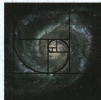

natural_image

Futuristic spiral diagram with golden ratio grid overlay (no text or symbols)

在斐波那契数列中：

(1) $a_{n} = \frac{\sqrt{5}}{5}$

$$
\left[ \left(\frac {1 + \sqrt {5}}{2}\right) ^ {n} - \left(\frac {1 - \sqrt {5}}{2}\right) ^ {n} \right],
$$

$$
S _ {n} = - 1 + \frac {\sqrt {5}}{5} \cdot
$$

$$
\left[ \left(\frac {1 + \sqrt {5}}{2}\right) ^ {n + 2} - \right.
$$

$$
\left. \left(\frac {1 - \sqrt {5}}{2}\right) ^ {n + 2} \right].
$$

(2) 第 $n+2$ 项等于前 n 项和加 1，即 $a_{n+2}=S_{n}+1$ .

(3) 前 n 个项数为奇数的斐波那契数之和等于第 2n 个斐波那契数, 即 $a_{1} + a_{3} + \cdots +$

【例7】设正项数列 $\{a_{n}\}$ 满足 $a_1 = 1, a_n = 2a_{n-1}^2 (n \geqslant 2)$ ，求数列 $\{a_{n}\}$ 的通项公式.

解: 对 $a_{n}=2a_{n-1}^{2}(n\geqslant2)$ 的两边取对数, 得 $\log_{2}a_{n}=1+2\log_{2}a_{n-1}(n\geqslant2)$ , 所以 $\log_{2}a_{n}+1=2(\log_{2}a_{n-1}+1)(n\geqslant2)$ .

设 $b_{n}=\log_{2}a_{n}+1$ ，则 $b_{n}=2b_{n-1}(n\geqslant2)$ .

因为 $b_{1}=\log_{2}a_{1}+1=1$ ，所以 $\{b_{n}\}$ 是以1为首项，2为公比的等比数列.

所以 $b_{n} = 1\times 2^{n - 1} = 2^{n - 1}$ ，即 $\log_2a_n + 1 = 2^{n - 1}$ ，所以 $\log_2a_n = 2^{n - 1} - 1$ ，所以 $a_{n} = 2^{2^{n - 1} - 1}$

# 印象笔记

$a_{2n-1}=a_{2n}$ ; 前 n 个项数为偶数的斐波那契数之和等于第 $2n+1$ 个斐波那契数减 1, 即 $a_{2}+a_{4}+\cdots+a_{2n}=a_{2n+1}-1$ .

(4) $a_{1}^{2}+a_{2}^{2}+a_{3}^{2}+\cdots+$ $a_{n}^{2}=a_{n}a_{n+1}.$

# 单元高难问题 2: 数列求和

数列求和问题一般转化为等差数列或等比数列的前 n 项和问题或已知公式的数列求和,不能转化的再根据数列通项公式的特点选择恰当的方法求解. 常见的求和方法如下.

# 公式法

① 公差为 d 的等差数列 $\{a_{n}\}$ 的前 n 项和 $S_{n}=\frac{n(a_{1}+a_{n})}{2}=na_{1}+\frac{n(n-1)d}{2}$ .  
② 公比为 $q$ 的等比数列 $\{a_{n}\}$ 的前 $n$ 项和 $S_{n} = \left\{ \begin{array}{l} na_{1}, q = 1, \\ \frac{a_{1}(1 - q^{n})}{1 - q} = \frac{a_{1} - a_{n}q}{1 - q}, q \neq 1. \end{array} \right.$

直接应用公式求和时,要注意公式的应用范围,如当等比数列公比为参数(字母)时,应对其是否为1进行讨论.

【例1】已知数列 $\{a_{n}\}$ 满足：当 $p + q = 11(p,q\in \mathbf{N}^{*},p < q)$ 时， $a_{p} + a_{q} = 2^{p}$ ，则 $\{a_{n}\}$ 的前10项和 $S_{10} =$ （）

A. 31

B. 62

C. 170

D. 1 023

解析: $S_{10}=(a_{1}+a_{10})+(a_{2}+a_{9})+(a_{3}+a_{8})+(a_{4}+a_{7})+(a_{5}+a_{6})=2^{1}+2^{2}+\cdots+2^{5}=$ $\frac{2\times(1-2^{5})}{1-2}=62.$

答案:B

# 倒序相加法

如果一个数列 $\{a_{n}\}$ 中与首末两端等“距离”的两项的和相等, 那么这个数列的前 $n$ 项和即可用倒序相加法求解, 即用正着写与倒着写的两个和式相加来求和.

【例2】已知 $f(x)=\frac{1}{2^{x}+\sqrt{2}}$ ，求 $f(-5)+f(-4)+\cdots+f(0)+\cdots+f(5)+f(6)$ 的值.

解: 设 $S=f(-5)+f(-4)+\cdots+f(0)+\cdots+f(5)+f(6)$ ,

则 $S=f(6)+f(5)+\cdots+f(0)+\cdots+f(-4)+f(-5)$ . 两式相加, 得

# 印象笔记

  
数列求和  
等差
等比
数列   
非等差、
等比数列  
公式法  
裂项相消法
倒序相加法  
错位相减法
分组求和法  
并项求和

# 常见数列求和

(1) $a_{n}=n,$

$$
S _ {n} = \frac {1}{2} n (n + 1).
$$

(2) $a_{n}=2n-1$ ,

$S_{n} = n^{2}$

(3) $a_{n}=2n$ ,

$$
S _ {n} = n ^ {2} + n.
$$

(4) $a_{n}=n^{2}$ ,

$$
S _ {n} = \frac {n (n + 1) (2 n + 1)}{6}.
$$

(5) $a_{n}=2^{n-1}$ ,

$$
S _ {n} = 2 ^ {n} - 1.
$$

(6) $a_{n}=n^{3}$ ,

$$
S _ {n} = \left[ \frac {n (n + 1)}{2} \right] ^ {2}.
$$

本题在解题时,需要先大胆将自变量进行分组,且验证每组自变量的和为定值.

$$
2 S = [ f (6) + f (- 5) ] + [ f (5) + f (- 4) ] + \dots + [ f (1) + f (0) ] + \dots + [ f (- 4) + f (5) ] + [ f (- 5) + f (6) ].
$$

$$
\because f (x) = \frac {1}{2 ^ {x} + \sqrt {2}}, \therefore f (1 - x) = \frac {1}{2 ^ {1 - x} + \sqrt {2}} = \frac {2 ^ {x}}{2 + \sqrt {2} \cdot 2 ^ {x}} = \frac {\frac {1}{\sqrt {2}} \cdot 2 ^ {x}}{\sqrt {2} + 2 ^ {x}},
$$

$$
\therefore f (x) + f (1 - x) = \frac {1}{2 ^ {x} + \sqrt {2}} + \frac {\frac {1}{\sqrt {2}} \cdot 2 ^ {x}}{\sqrt {2} + 2 ^ {x}} = \frac {\sqrt {2}}{2}, \therefore 2 S = 1 2 \times \frac {\sqrt {2}}{2} = 6 \sqrt {2}, \therefore S = 3 \sqrt {2}.
$$

# 裂项相消法

把数列的通项拆成两项之差,在求和时中间的一些项可以相互抵消,从而求得前 n 项和.

利用裂项相消法求和的注意事项：

① 抵消后并不一定只剩下第一项和最后一项,也有可能前面剩两项,后面也剩两项;  
② 将通项裂项后,有时需要调整前面的系数,使裂开的两项之差和系数之积与原通项相等.如:若 $\{a_{n}\}$ 是公差为 $d(d \neq 0)$ 的等差数列,则 $\frac{1}{a_{n}a_{n+1}} = \frac{1}{d} \left( \frac{1}{a_{n}} - \frac{1}{a_{n+1}} \right)$ , $\frac{1}{a_{n}a_{n+2}} = \frac{1}{2d} \left( \frac{1}{a_{n}} - \frac{1}{a_{n+2}} \right)$ .

【例3】设数列 $\{a_{n}\}$ 的前 $n$ 项和为 $S_{n},\left\{\frac{S_{n}}{n}\right\}$ 为等比数列，且 $a_1 = 1,a_1,a_2,a_3 - 3$ 成等差数列.

(1)求数列 $\{a_{n}\}$ 的通项公式;  
(2) 设 $b_{n} = \frac{a_{n}}{n + 1}$ ，数列 $\left\{\frac{b_{n}}{(b_{n} + 1)(b_{n + 1} + 1)}\right\}$ 的前 $n$ 项和为 $T_{n}$ ，证明： $T_{n} < \frac{2}{3}$ .

(1) 解: 因为 $a_{1}, a_{2}, a_{3}-3$ 成等差数列, 所以 $2a_{2}=a_{3}-2$ .

又 $\left\{\frac{S_n}{n}\right\}$ 为等比数列，所以 $1, \frac{S_2}{2}, \frac{S_3}{3}$ 成等比数列，

则 $\left(\frac{1 + a_2}{2}\right)^2 = \frac{1 + a_2 + a_3}{3}$ , 联立解得 $a_2 = -1$ 或 $a_2 = 3$ .

当 $a_2 = -1$ 时， $S_1 = 1, S_2 = 0, S_3 = 0$ ，此时 $1, \frac{S_2}{2}, \frac{S_3}{3}$ 不为等比数列，所以 $a_2 = -1$ 舍去，当 $a_2 = 3$ 时， $a_3 = 8$ ，

此时易知数列 $\left\{\frac{S_n}{n}\right\}$ 的公比为2，即 $\frac{S_n}{n} = 2^{n - 1}$ ，所以 $S_{n} = n\cdot 2^{n - 1}$

当 $n \geqslant 2$ 时, $a_{n} = S_{n} - S_{n-1} = (n + 1) \cdot 2^{n-2}$ , 且 $a_{1} = 1$ 也满足此式,

所以数列 $\{a_{n}\}$ 的通项公式为 $a_{n}=(n+1)\cdot2^{n-2}$ .

(2) 证明: 由(1)知, $a_{n} = (n + 1) \cdot 2^{n - 2}$ , 又 $b_{n} = \frac{a_{n}}{n + 1} = 2^{n - 2}$ ,

则 $\frac{b_n}{(b_n + 1)(b_{n + 1} + 1)} = \frac{2^{n - 2}}{(2^{n - 2} + 1)(2^{n - 1} + 1)}$ ，记 $c_{n} = \frac{2^{n - 2}}{(2^{n - 2} + 1)(2^{n - 1} + 1)}$

# 印象笔记

消项规律: 消项后前面剩几项, 后面就剩几项, 前面剩第几项, 后面就剩倒数第几项, 必要时可以多写出前、后几项, 看看哪些项消去了, 哪些项保留了, 避免漏项或多项.

# 二级结论 常见的

# 裂项技巧

类型一:等差型

① $\frac{1}{n(n+k)}$   
$= \frac{1}{k}\left(\frac{1}{n} -\frac{1}{n + k}\right)(k\neq 0).$   
特别注意 k = 1, $\frac{1}{n(n+1)}=\frac{1}{n}-\frac{1}{n+1};k=$   
-1, $\frac{1}{n(n - 1)} = \frac{1}{n - 1} -\frac{1}{n}$

② $\frac{1}{(kn-1)(kn+1)}=\frac{1}{2}\left(\frac{1}{kn-1}-\frac{1}{kn+1}\right)$ ,

如： $\frac{1}{4n^{2}-1}$ $=\frac{1}{2}\left(\frac{1}{2n-1}-\frac{1}{2n+1}\right)$

(尤其要注意不能丢系数 $\frac{1}{2}$ ).

类型二:无理型

$$
\begin{array}{l} \frac {1}{\sqrt {n + k} + \sqrt {n}} \\ = \frac {1}{k} (\sqrt {n + k} - \sqrt {n}) \\ \end{array}
$$

$$
(k \neq 0),
$$

$$
\text { 如 }: \frac {1}{\sqrt {n + 1} + \sqrt {n}}
$$

$$
= \sqrt {n + 1} - \sqrt {n}.
$$

类型三: 指数型

$$
\begin{array}{l} \frac {(a - 1) a ^ {n}}{(a ^ {n + 1} + k) (a ^ {n} + k)} \\ = \frac {1}{a ^ {n} + k} - \frac {1}{a ^ {n + 1} + k}, \\ \end{array}
$$

则 $c_{n} = \frac{1}{2^{n - 2} + 1} -\frac{1}{2^{n - 1} + 1},$

则 $T_{n} = \frac{1}{2^{-1} + 1} -\frac{1}{2^{0} + 1} +\frac{1}{2^{0} + 1} -\frac{1}{2^{1} + 1} +\dots +\frac{1}{2^{n - 2} + 1} -\frac{1}{2^{n - 1} + 1} = \frac{2}{3} -\frac{1}{2^{n - 1} + 1},$

因为 $\frac{1}{2^{n - 1} + 1} >0$ ，所以 $T_{n} = \frac{2}{3} -\frac{1}{2^{n - 1} + 1} <  \frac{2}{3}.$

# 错位相减法

如果一个数列的各项是由一个等差数列和一个等比数列的对应项之积构成的,那么这个数列的前 n 项和即可用错位相减法求解.在应用错位相减法时,注意观察未合并项的正负号.

用错位相减法求和的三个注意事项：

①要善于识别题目类型,特别是等比数列公比为负数的情形;

② 在写出“ $S_{n}$ ”与“ $qS_{n}$ ”的表达式时应特别注意将两式“错项对齐”以便下一步准确写出“ $S_{n}-qS_{n}$ ”的表达式；

③ 在应用错位相减法求和时,若等比数列的公比为参数,应分公比等于1和不等于1两种情况求解.

【例 4】求和: $S_{n}=1+3x+5x^{2}+7x^{3}+\cdots+(2n-1)x^{n-1}(x\neq0)$ .

解：∵ 通项 $a_{n}=(2n-1)x^{n-1}$ ，∴ 当 x=1 时， $a_{n}=2n-1$ ，∴ $S_{n}=n^{2}$ .

当 $x \neq 1$ 时，∵ $S_{n} = 1 + 3x + 5x^{2} + 7x^{3} + \cdots + (2n - 1)x^{n-1}(x \neq 0)$ ,

$$
\therefore x S _ {n} = x + 3 x ^ {2} + 5 x ^ {3} + 7 x ^ {4} + \dots + (2 n - 1) x ^ {n}.
$$

两式相减, 得 $(1-x)S_{n}=1+2x(1+x+x^{2}+\cdots+x^{n-2})-(2n-1)x^{n}$

$$
= 1 - (2 n - 1) x ^ {n} + \frac {2 x (1 - x ^ {n - 1})}{1 - x} = \frac {(2 n - 1) x ^ {n + 1} - (2 n + 1) x ^ {n} + (1 + x)}{1 - x},
$$

$$
\therefore S _ {n} = \frac {(2 n - 1) x ^ {n + 1} - (2 n + 1) x ^ {n} + (1 + x)}{(1 - x) ^ {2}}.
$$

# 分组求和法

把一个数列的每一项分成多项的和,将其转化为等差、等比或特殊数列,再利用公式求和.

【例5】求和： $S_{n}=1+\left(1+\frac{1}{2}\right)+\left(1+\frac{1}{2}+\frac{1}{2^{2}}\right)+\cdots+\left(1+\frac{1}{2}+\frac{1}{2^{2}}+\cdots+\frac{1}{2^{n-1}}\right)$

解: 因为通项 $a_{k}=1+\frac{1}{2}+\frac{1}{2^{2}}+\cdots+\frac{1}{2^{k-1}}=\frac{1-\frac{1}{2^{k}}}{1-\frac{1}{2}}=2-\frac{1}{2^{k-1}}(k=1,2,3,\cdots,n)$ ，所以可利用分组求和法将 $S_{n}$ 拆分成一个常数列（实质为等差数列）和一个等比数列，分别求和，即有 $S_{n}=(2-1)+\left(2-\frac{1}{2}\right)+\left(2-\frac{1}{2^{2}}\right)+\cdots+\left(2-\frac{1}{2^{n-1}}\right)=2n-\left(1+\frac{1}{2}+\frac{1}{2^{2}}+\cdots+\frac{1}{2^{n-1}}\right)=2n-2+\frac{1}{2^{n-1}}.$

# 印象笔记

如： $\frac{2^{n}}{(2^{n+1}+k)(2^{n}+k)}=\frac{1}{2^{n}+k}-\frac{1}{2^{n+1}+k}.$

类型四:通项裂项后为“+”型

如:① $(-1)^{n}\cdot\frac{2n+1}{n(n+1)}$ $=(-1)^{n}\left(\frac{1}{n}+\frac{1}{n+1}\right)$ ;

② $(-1)^{n}\frac{(3n+1)\cdot2^{n}}{n(n+1)}$ $=(-1)^{n}\left(\frac{2^{n}}{n}+\frac{2^{n+1}}{n+1}\right).$

本类型的典型标志：
通项为 $(-1)^{n}$ 乘一个分式的形式.

此种方法常用于求数列 $\{a_{n}\cdot b_{n}\}$ 的前n项和,其中 $\{a_{n}\}$ 为等差数列, $\{b_{n}\}$ 为等比数列.

若遇 $\left\{\frac{a_{n}}{b_{n}}\right\}$ 可先变形为 $\left\{a_{n}\cdot\frac{1}{b_{n}}\right\}$ ，其中 $\left\{a_{n}\right\}$ 为等差数列， $\left\{b_{n}\right\}$ 为等比数列.

# 分组求和法的基本步骤

①准确拆分,根据通项公式的特征,将其分解为可以直接求和的一些数列的和;
②分组求和,分别求出各个数列的和;
③得出结论,对拆分后每个数列的和进行求和,解决原数列的求和问题.

# 并项求和法

一个数列中的相邻两项或几项的和是同一常数,可两两(或多项)结合求解,则称为并项求和.形如 $a_{n}=(-1)^{n}f(n)$ ,可采用两项合并求解.例如, $a_{n}=(-1)^{n}n^{2}$ ,则 $S_{100}=100^{2}-99^{2}+98^{2}-97^{2}+\cdots+2^{2}-1^{2}=(100+99)+(98+97)+\cdots+(2+1)=\frac{(100+1)}{2}\times100=5050.$

【例6】已知数列 $\{a_{n}\}$ 的通项公式是 $a_{n} = (-1)^{n}(5n - 3)$ ，则 $a_{1} + a_{2} + a_{3} + \dots + a_{2021} =$ （）

A. 10 100

B. -10 100

C. 5 052

D. -5 052

解析:∵ $a_{n}=(-1)^{n}(5n-3)$ ,

$$
\therefore a _ {n} + a _ {n + 1} = (- 1) ^ {n} (5 n - 3) + (- 1) ^ {n + 1} [ 5 (n + 1) - 3 ] = (- 1) ^ {n + 1} \cdot 5,
$$

$\therefore a_{1}+a_{2}+a_{3}+\cdots+a_{2021}=(a_{1}+a_{2})+(a_{3}+a_{4})+\cdots+(a_{2019}+a_{2020})+a_{2021}=1010\times5+(-1)^{2021}(5\times2021-3)=-5052.$ 故选 D.

答案:D

【例 7】在等差数列 $\{a_{n}\}$ 中, 已知公差 d=2, $a_{2}$ 是 $a_{1}$ 与 $a_{4}$ 的等比中项.

(1)求数列 $\{a_{n}\}$ 的通项公式;  
(2) 设 $b_{n}=a_{\frac{n(n+1)}{2}}$ ，记 $T_{n}=-b_{1}+b_{2}-b_{3}+b_{4}-\cdots+(-1)^{n}b_{n}$ ，求 $T_{n}$ .

分析:(1)根据等差数列的性质和等比中项的定义,得到关于 $a_{1}$ 的方程,解方程,求出 $a_{1}$ 的值,从而得到数列 $\{a_{n}\}$ 的通项公式;

(2) 观察 $T_{n} = -b_{1} + b_{2} - b_{3} + b_{4} - \cdots + (-1)^{n} b_{n}$ 的特征, 把 n 分为奇数与偶数, 用分类讨论法求出 $T_{n}$ .

解:(1)因为 $a_{2}$ 是 $a_{1}$ 与 $a_{4}$ 的等比中项,所以 $a_{2}^{2}=a_{1}a_{4}$ .

因为等差数列 $\{a_{n}\}$ 的公差d=2,所以 $(a_{1}+2)^{2}=a_{1}(a_{1}+6)$ ,解得 $a_{1}=2$ .

所以数列 $\{a_{n}\}$ 的通项公式为 $a_{n} = 2 + (n - 1)\times 2 = 2n$

(2)由(1)知, $a_{n}=2n$ .因为 $b_{n}=a_{\frac{n(n+1)}{2}}$ ,所以 $b_{n}=2\times\frac{n(n+1)}{2}=n(n+1)$ .

因为 $T_{n}=-b_{1}+b_{2}-b_{3}+b_{4}-\cdots+(-1)^{n}b_{n}$

所以 $T_{n}=-1\times2+2\times3-3\times4+\cdots+(-1)^{n}\cdot n(n+1)$ .

因为 $b_{n+1}-b_{n}=2(n+1)$ ，所以当 n 为偶数时， $T_{n}=(-b_{1}+b_{2})+(-b_{3}+b_{4})+\cdots+$

$$
(- b _ {n - 1} + b _ {n}) = 4 + 8 + 1 2 + \dots + 2 n = \frac {\frac {n}{2} (4 + 2 n)}{2} = \frac {n (n + 2)}{2};
$$

当 n 为奇数时， $T_{n}=T_{n-1}-b_{n}=\frac{(n-1)(n+1)}{2}-n(n+1)=-\frac{(n+1)^{2}}{2}$ .

所以 $T_{n}=\left\{\begin{aligned}-\frac{(n+1)^{2}}{2},&n\text{为奇数,}\\ \frac{n(n+2)}{2},&n\text{为偶数.}\end{aligned}\right.$

# 印象笔记

(1) 当数列的通项公式中含有 $(-1)^{n}$ 或 $(-1)^{n+1}$ 等符号时, 也可以考虑将数列分组为奇数项数列和偶数项数列, 然后分组求和.

(2) 当数列通项公式满足 $a_{n} + a_{n+1} = f(n)$ 或 $a_{n} + a_{n+1} + a_{n+2} = f(n)$ 时，则可以考虑将相邻的两项或三项并为一组，然后对 $f(n)$ 求和.

利用并项求和法有时要对项数是奇数还是偶数进行讨论.

# 4.4\* 数学归纳法

# 敲黑板

# 数学归纳法

一般地,证明一个与正整数 n 有关的命题,可按下列步骤进行:

要证明的命题成立范围内最小的正整数，这个数不一定都是“1”

(1)(归纳奠基)证明当 $n = n_0 (n_0 \in \mathbf{N}^*)$ 时命题成立；  
(2)(归纳递推)以“当 $n = k (k \in \mathbf{N}^*, k \geqslant n_0)$ 时命题成立”为条件, 推出“当 $n = k + 1$ 时命题也成立”.

只要完成这两个步骤, 就可以断定命题对从 $n_{0}$ 开始的所有正整数 n 都成立, 这种证明方法称为数学归纳法.

# 知识深层理解

# 问题1 为什么要学习数学归纳法？

提示 归纳推理可以分为完全归纳法(枚举法)和不完全归纳法. 完全归纳法得到的结论是可靠的, 因为它考察了问题涉及的所有对象; 不完全归纳法得到的结论不一定可靠, 因为它只考察了某件事情的部分对象. 数学问题中, 有一类问题是与自然数有关的命题, 因为自然数有无限个, 我们不可能对自然数一一验证, 所以完全归纳是不可能的. 由于只对部分自然数验证得到的结论不一定可靠, 因此就要研究一种新的方法, 即数学归纳法.

# 问题2 数学归纳法的两个步骤之间有什么关系？

提示 记 $P(n)$ 是一个关于正整数 $n$ 的命题. 我们可以把用数学归纳法证明的形式改写如下:

条件:(1) $P(n_{0})$ 为真;(2)若 $P(k)(k\in\mathbf{N}^{*},k\geqslant n_{0})$ 为真,则 $P(k+1)$ 也为真.

结论: $P(n)$ 为真.

在数学归纳法的两步中,第一步验证(或证明)了当 $n=n_{0}$ 时结论成立,即命题 $P(n_{0})$ 为真;第二步是证明一种递推关系,实际上是要证明一个新命题:若 $P(k)$ 为真,则 $P(k+1)$ 也为真.

完成这两步,就有 $P(n_{0})$ 真, $P(n_{0}+1)$ 真…… $P(k)$ 真, $P(k+1)$ 真……. 从而完成证明.

# 应试拓展注意

# 拓展1 用数学归纳法证明等式、不等式

用数学归纳法证明与正整数有关的一些等式时,关键在于弄清等式两边的构成规律,弄清等式的两边各有多少项,项的多少与 n 的取值是否有关,尤其是由 n=k 到 $n=k+1$ 时等式的两边项的变化情况,然后正确写出归纳证明的步骤,使问题得

# 印象笔记

在地震学中,波动使岩石断层开始破裂倒塌,岩石层就如同排列整齐的扑克牌、积木,在一个相互联系的系统中,一个很小的初始能量就会产生一连串的反应,如同多米诺骨牌游戏,都体现了数学归纳法思想.

用数学归纳法时，“归纳奠基”和“归纳递推”两个步骤缺一不可.

(1) 应用数学归纳法证明数学命题时, 初始值 $n_{0}$ 不一定是 1, 要根据题目条件或具体问题确定初始值.

(2) 推证“当 $n=k+1$ 时, 命题成立”, 一定要用上“当 n=k 时, 命题成立”的结论, 否则就不是数学归纳法.

（3）解“归纳—猜想—证明”问题的关键是准确计算出前若干具体项，这是归纳、猜想的基础.

以证明.

用数学归纳法证明不等式的关键是由 $n = k$ 时命题成立推证 $n = k + 1$ 时命题也成立. 在归纳假设使用后可运用比较法、综合法、分析法、放缩法等来加以证明, 充分应用基本不等式、不等式的性质等放缩技巧, 使问题得以简化.

【例 1】用数学归纳法证明：

$$
1 \cdot n + 2 \cdot (n - 1) + 3 \cdot (n - 2) + \dots + n \cdot 1 = \frac {1}{6} n (n + 1) (n + 2), n \in \mathbf {N} ^ {*}.
$$

证明：①当 n=1 时，等式左边 =1，右边 $=\frac{1}{6}\times1\times2\times3=1$ ，所以等式成立.

②假设当 $n=k(k \in \mathbf{N}^{*})$ 时, 等式成立,

即 $1 \cdot k + 2 \cdot (k - 1) + 3 \cdot (k - 2) + \cdots + k \cdot 1 = \frac{1}{6} k (k + 1) (k + 2)$ ，则当 $n = k + 1$ 时，

$$
1 \cdot (k + 1) + 2 \cdot k + 3 \cdot (k - 1) + \dots + k \cdot 2 + (k + 1) \cdot 1
$$

$$
= (1 \cdot k + 1) + [ 2 \cdot (k - 1) + 2 ] + [ 3 \cdot (k - 2) + 3 ] + \dots + (k \cdot 1 + k) + (k + 1) \cdot 1
$$

$$
= 1 \cdot k + 2 \cdot (k - 1) + 3 \cdot (k - 2) + \dots + k \cdot 1 + [ 1 + 2 + 3 + \dots + k + (k + 1) ]
$$

$$
= \frac {1}{6} k (k + 1) (k + 2) + \frac {(k + 1) (k + 2)}{2}
$$

$$
= (k + 1) (k + 2) \left(\frac {1}{6} k + \frac {1}{2}\right) = \frac {1}{6} (k + 1) (k + 2) (k + 3).
$$

所以当 $n = k + 1$ 时, 等式也成立. 根据①②知, 对任意 $n \in \mathbf{N}^*$ , 等式成立.

# 拓展2 数学归纳法证明整除问题

用数学归纳法证明整除问题,由 k 过渡到 $k+1$ 时常使用“拼凑法”. 在证明 $n=k+1$ 命题成立时, 先将 $n=k+1$ 时的式子运用分拆、重组或者添加项等方式进行整理, 最终将其变成一个或多个部分的和, 其中每个部分都能被约定的数(或式子)整除, 从而由部分的整除性得出整体的整除性, 最终证得 $n=k+1$ 时命题也成立.

【例2】用数学归纳法证明： $(3n+1)7^{n}-1(n \in \mathbf{N}^{*})$ 能被9整除.

证明:方法一:令 $f(n)=(3n+1)7^{n}-1$ .

①当 n=1 时, $f(1)=(3\times1+1)\times7^{1}-1=27$ 能被9整除.

②假设当 $n = k (k \in \mathbf{N}^*)$ 时, $f(k)$ 能被9整除, 则 $f(k + 1) - f(k) = [(3k + 4) \cdot 7^{k + 1} - 1] - [(3k + 1) \cdot 7^k - 1] = 9(2k + 3) \cdot 7^k$ , 即 $f(k + 1) = f(k) + 9(2k + 3) \cdot 7^k$ 能被9整除.

∴ 当 $n=k+1$ 时, $f(k+1)$ 能被 9 整除. 由①②知, 命题对任何 $n \in N^{*}$ 都成立.

方法二:①令 $f(n)=(3n+1)7^{n}-1$ . 当 n=1 时, $f(1)=(3\times1+1)\times7^{1}-1=27$ 能被 9 整除.

②若 $n = k (k \in \mathbf{N}^*)$ 时命题成立，即 $f(k) = (3k + 1) \cdot 7^k - 1$ 能被9整除，则 $n = k + 1$ 时， $f(k + 1) = [3(k + 1) + 1] \cdot 7^{k + 1} - 1 = [(3k + 1) + 3](1 + 6) \cdot 7^k - 1 = (3k + 1) \cdot 7^k - 1 + (3k + 1) \times 6 \times 7^k + 21 \times 7^k = [(3k + 1) \cdot 7^k - 1] + 18k \cdot 7^k + 27 \times 7^k,$

∴ 当 $n=k+1$ 时, $f(k+1)$ 也能被 9 整除. 由①②知, 命题对任何 $n \in N^{*}$ 都成立.

数学归纳法是一种特殊的直接证明的方法,主要适用于证明一些与正整数 n (n 取无限多个正整数) 有关的数学命题,数学归纳法是非常有用的研究工具,它通过有限个步骤的推理,证明 n 取无限多个正整数的情形.

用数学归纳法证明整除问题,关键是在 $n = k + 1$ 时如何“凑”出归纳假设.

这两种证法的实质是相同的，令 $f(n)=(3n+1)7^{n}-1$ ，第一种证法是用 $f(k+1)-f(k)$ 求出 $f(k+1)$ 与 $f(k)$ 的差，因为这个差能被9整除，所以 $f(k+1)$ 能被9整除，而第二种证法是从 $f(k+1)$ 中凑出 $f(k)$ ，然后再证余下的部分也能被9整除.

# 疑难突破提高

# 突破 数列通项公式与数学归纳法

数列通项公式与数学归纳法的综合是数学归纳法部分学习的重要内容,本质是融合数列与数学归纳法,促进对数列部分的深入理解.

对于一些数列通项公式,一下子难以下手求解,可先算出数列的前几项,猜想出数列的一个通项公式,然后用数学归纳法证明.

【例3】已知数列 $\{a_{n}\}$ 的前 $n$ 项和 $S_{n}$ 满足 $S_{n} = \frac{a_{n}}{2} +\frac{1}{2a_{n}} -1$ ，且 $a_{n} > 0.$

(1) 求 $a_{1}, a_{2}, a_{3}$ ;   
(2)猜想 $\{a_{n}\}$ 的通项公式,并用数学归纳法证明.

解:(1)对任意的 $n \in N^{*}$ , $S_{n} = \frac{a_{n}}{2} + \frac{1}{2a_{n}} - 1$ , 且 $a_{n} > 0$ .

当 $n = 1$ 时， $a_1 = S_1 = \frac{a_1}{2} + \frac{1}{2a_1} - 1$ ，整理得 $a_1^2 + 2a_1 - 1 = 0$ ，且 $a_n > 0$ ，所以 $a_1 = \sqrt{2} - 1$ ；

当 $n = 2$ 时， $S_{2} = a_{1} + a_{2} = \frac{a_{2}}{2} + \frac{1}{2a_{2}} - 1$ ，整理得 $a_{2}^{2} + 2\sqrt{2} a_{2} - 1 = 0$ ，且 $a_{n} > 0$ ，所以 $a_{2} = \sqrt{3} - \sqrt{2}$ ；

当 $n = 3$ 时， $S_{3} = a_{1} + a_{2} + a_{3} = \frac{a_{3}}{2} + \frac{1}{2a_{3}} - 1$ ，整理得 $a_{3}^{2} + 2\sqrt{3} a_{3} - 1 = 0$ ，且 $a_{n} > 0$ ，所以 $a_{3} = 2 - \sqrt{3}$ .

(2)由(1)猜想 $a_{n}=\sqrt{n+1}-\sqrt{n}(n\in\mathbf{N}^{*})$ ，下面用数学归纳法加以证明：

①当 n=1 时,由(1)知 $a_{1}=\sqrt{2}-1$ 成立;  
②假设当 $n=k(k\in\mathbf{N}^{*})$ 时， $a_{k}=\sqrt{k+1}-\sqrt{k}$ 成立.

当 $n = k + 1$ 时， $a_{k+1} = S_{k+1} - S_k = \left(\frac{a_{k+1}}{2} + \frac{1}{2a_{k+1}} - 1\right) - \left(\frac{a_k}{2} + \frac{1}{2a_k} - 1\right) = \frac{a_{k+1}}{2} + \frac{1}{2a_{k+1}} - \sqrt{k+1}$ ，所以 $a_{k+1}^2 + 2\sqrt{k+1} a_{k+1} - 1 = 0$ ，且 $a_{k+1} > 0$

所以 $a_{k + 1} = \sqrt{k + 2} -\sqrt{k + 1}$ ，即当 $n = k + 1$ 时猜想也成立.

综上可知, $a_{n}=\sqrt{n+1}-\sqrt{n}$ 对任何 $n\in N^{*}$ 都成立.

# 本节与高考

数学归纳法是一种特殊的直接证明的方法,主要适用于证明一些与正整数 $n(n$ 取无限多个正整数)有关的数学命题.在高考中不作要求,可作为一种方法来解题,常与函数、导数、数列、不等式等相结合,以解答题的形式出现,综合性较强,难度偏大.

# 印象笔记

费马（Fermat）是17世纪法国著名的数学家，他曾认为，当 $n\in N$ 时， $2^{2^{n}}+1$ 一定都是质数，这是他观察当n=0,1,2,3,4时的值都是质数，提出猜想得到的。近一个世纪后，18世纪伟大的瑞士科学家欧拉（Euler）发现 $2^{2^{5}}+1=4\ 294\ 967\ 297=6\ 700\ 417\times641$ ，从而否定了费马的推测。没想到当n=5时这一结论便不成立了。

# 数列“归纳—猜想—证明”的一般环节

(1) 计算: 根据条件, 准确计算出前若干项, 这是归纳、猜想的前提;  
(2) 归纳、猜想: 通过观察、分析、比较、综合、联想, 猜想出一般的结论;  
(3) 证明: 对一般结论利用数学归纳法进行证明.

# 5.1 导数的概念及其意义

# 敲黑板

1. 平均变化率 一个整体符号，可正可负，不可为零

对于函数 $y=f(x)$ ，设自变量 x 从 $x_{0}$ 变化到 $x_{0}+\Delta x$ ，相应地，y 的变化量为 $\Delta y=f(x_{0}+\Delta x)-f(x_{0})$ ，函数 $y=f(x)$ 从 $x_{0}$ 到 $x_{0}+\Delta x$ 的平均变化率为 $\frac{\Delta y}{\Delta x}=\frac{f(x_{0}+\Delta x)-f(x_{0})}{\Delta x}$ . 可以为 0

2. 导数的概念（瞬时变化率）

如果当 $\Delta x \to 0$ 时, 平均变化率 $\frac{\Delta y}{\Delta x}$ 无限趋近于一个确定的值, 即 $\frac{\Delta y}{\Delta x}$ 有极限, 则称 $y = f(x)$ 在 $x = x_{0}$ 处可导, 并把这个确定的值叫做 $y = f(x)$ 在 $x = x_{0}$ 处的导数 (也称为瞬时变化率), 记作 $f'(x_{0})$ 或 $y' \mid_{x=x_{0}}$ , 即 $f'(x_{0}) = \lim_{\Delta x \to 0} \frac{\Delta y}{\Delta x} = \lim_{\Delta x \to 0} \frac{f(x_{0} + \Delta x) - f(x_{0})}{\Delta x}$ . ① 是平均变化率的极限; ② 须先求平均变化率;

3. 导数的几何意义

函数 $y = f(x)$ 在 $x = x_0$ 处的导数 $f'(x_0)$ 就是函数图象在点 $(x_0, f(x_0))$ 处切线的斜率 $k_0$ ，即 $k_0 = \lim_{\Delta x \to 0} \frac{f(x_0 + \Delta x) - f(x_0)}{\Delta x} = f'(x_0)$ ，切线方程为 $y - f(x_0) = f'(x_0)(x - x_0)$ .

# 知识深层理解

# 印象笔记

# 问题1 平均变化率的概念中符号 $\Delta x, \Delta y$ 各表示什么？ 它们的值能否为零？ 平均变化率的几何意义是什么？

提示 ① $\Delta x = x_{2} - x_{1}, \Delta y = f(x_{2}) - f(x_{1}), \Delta x$ 是一个整体符号, 而不是 $\Delta$ 与 $x$ 相乘.

② $\Delta x$ 的值可正、可负，但不能为 0； $\Delta y$ 的值可正、可负、可为 0。例如，当函数 $f(x)$ 为常数函数时， $\Delta y = 0$ 。  
③ 利用函数 $y=f(x)$ 的图象, 得到平均变化率的几何意义是函数图象上, 过 $A(x_{1},y_{1}), B(x_{2},y_{2})$ 两点的割线 AB 的斜率.

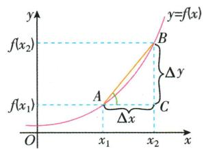

text_image

y
f(x₂)
B
Δy
f(x₁)
A
C
Δx
O
x₁
x₂
x
y=f(x)

如:位移的平均变化率即为平均速度.  
火车在匀加速启动过程中速度不断增加,速度的平均变化率不变.

问题2 函数 $y=f(x)$ 在 $x=x_{0}$ 处的瞬时变化率的几何意义是什么？

提示 如问题1图中,当点B沿着曲线向点A无限靠近时,割线AB的斜率就会无限逼近点A处切线的斜率,即当 $\Delta x$ 无限趋近于0时, $k_{AB}=\frac{f(x_{2})-f(x_{1})}{x_{2}-x_{1}}$ 无限趋近于点A处切线的斜率.所以函数 $y=f(x)$ 在 $x=x_{0}$ 处的瞬时变化率(即 $f'(x_{0})$ )的几何意义即为曲线 $y=f(x)$ 在点 $(x_{0},f(x_{0}))$ 处的切线的斜率.

问题3 曲线 $y=f(x)$ 在点 $P(x_{0},f(x_{0}))$ 处的切线方程是什么？曲线在某一点处的切线一定与曲线只有一个公共点吗？与曲线只有一个公共点的直线一定是曲线的切线吗？

提示 由导数的几何意义知曲线 $y = f(x)$ 在点 $P(x_0, f(x_0))$ 处的切线的斜率 $k = f'(x_0)$ ，所以曲线 $y = f(x)$ 在点 $P(x_0, f(x_0))$ 处的切线方程是 $y - f(x_0) = f'(x_0) \cdot (x - x_0)$ . 曲线在某一点处的切线不一定与曲线只有一个公共点，可以有多个甚至无数个，例如，曲线 $y = x^3$ 在点 $\left(\frac{1}{2}, \frac{1}{8}\right)$ 处的切线 $y = \frac{3}{4}x - \frac{1}{4}$ 与曲线 $y = x^3$ 有两个公共点，如图①；曲线 $y = \sin x$ 在点 $\left(\frac{\pi}{2}, 1\right)$ 处的切线方程为 $y = 1$ ，该切线与曲线 $y = \sin x$ 有无数个公共点，如图②. 同时，与曲线只有一个公共点的直线也不一定是曲线的切线. 例如，直线 $x = 1$ 与曲线 $y = \sin x$ 只有一个公共点，但直线 $x = 1$ 不是曲线 $y = \sin x$ 的切线，如图②.

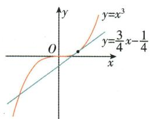

text_image

y
y=x³
O
y=3/4 x-1/4
x

图①

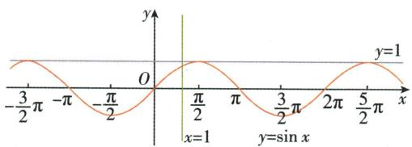

text_image

-3/2π -π -π/2 O π/2 π 3/2π 2π 5/2π x
y=1
x=1 y=sin x

图②

问题4 函数 $f(x)$ 的导数是什么？ $f'(x)$ 与 $f'(x_{0})$ 有什么区别？

提示 函数 $f(x)$ 的导数是其导函数的简称, 当 $x$ 变化时, $f'(x)$ 便是 $x$ 的一个函数; $f'(x_0)$ 是 $f(x)$ 在 $x = x_0$ 处的导数, 是 $f'(x)$ 在 $x = x_0$ 处的函数值, 也是曲线 $y = f(x)$ 在点 $(x_0, f(x_0))$ 处的切线的斜率, 是一个常量.

问题5 每一个函数在其定义域上都有导数吗？什么是可导函数？

提示 ① 并不是每个函数在其定义域上都有导数. 例如, 函数 $y = |x|$ 在 $x = 0$ 处的瞬时变化率 $\lim_{\Delta x \to 0} \frac{\Delta y}{\Delta x} = \lim_{\Delta x \to 0} \frac{f(0 + \Delta x) - f(0)}{\Delta x} = \lim_{\Delta x \to 0} \frac{|\Delta x|}{\Delta x}$ , 当 $\Delta x \to 0^{+}$ 时, 极限值为 1, 当 $\Delta x \to 0^{-}$ 时, 极限值为 -1, 因为 $\Delta x \to 0^{+}$ 时与 $\Delta x \to 0^{-}$ 时的极限不是同一个确定的值, 所以函数 $y = |x|$ 在 $x = 0$ 处的导数不存在.

② 如果函数 $y=f(x)$ 在区间 $(a,b)$ 内的每一点都有导数, 那么我们就说这个函数在区间 $(a,b)$ 上是可导函数.

大约自 1629 年起,法国数学家费马开始研究曲线的性质,其中包括作曲线的切线和求函数极值的方法. 17 世纪,大数学家牛顿、莱布尼茨等从不同的角度开始系统地研究微积分. 牛顿的微积分理论被称为“流数术”,他称变量为“流量”,称变量的变化率为“流数”,相当于我们所说的导数.

要深入体会切线定义中的运动变化思想:①两个不同的公共点→两公共点无限接近→两公共点重合(切点);②割线→切线.

函数 $y=f(x)$ 的导数 $f'(x)$ 反映了函数 $f(x)$ 的瞬时变化趋势，其正负号反映了变化的方向，其大小 $|f'(x)|$ 反映了变化的快慢， $|f'(x)|$ 越大，曲线在这点处的切线越“陡”.

在以后的学习中，如果没有特别说明，我们研究的函数都是可导函数.

# 应试拓展注意

# 拓展1 求函数的平均变化率

求函数 $y=f(x)$ 的平均变化率的步骤：

① 先求 $\Delta x = x_{2} - x_{1}, \Delta y = f(x_{2}) - f(x_{1})$ 的值；  
② 再求平均变化率 $\frac{\Delta y}{\Delta x}$ 的值.

【例1】函数 $f(x) = \sin x$ 在区间 $\left[0, \frac{\pi}{4}\right]$ 上的平均变化率为 \_\_\_\_.

解析: 函数 $y = f(x) = \sin x$ 在区间 $\left[0, \frac{\pi}{4}\right]$ 上的平均变化率为

$$
\frac {\Delta y}{\Delta x} = \frac {f \left(\frac {\pi}{4}\right) - f (0)}{\frac {\pi}{4} - 0} = \frac {\frac {\sqrt {2}}{2} - 0}{\frac {\pi}{4}} = \frac {2 \sqrt {2}}{\pi}.
$$

答案: $\frac{2\sqrt{2}}{\pi}$

# 拓展2 求瞬时速度及函数 $f(x)$ 在 $x = x_{0}$ 处的导数 $f'(x_{0})$

① 求函数 $f(x)$ 在 $x = x_{0}$ 处的导数时常用的方法：

(1) 利用 $f'(x_0) = \lim_{\Delta x \to 0} \frac{f(x_0 + \Delta x) - f(x_0)}{\Delta x}$ 直接求解；

(2) 先求函数 $f(x)$ 的导函数 $f'(x)$ ，再求 $f'(x_{0})$ 的值.

② 求极限时,需对式子进行变形,并注意 $\frac{\Delta y}{\Delta x}$ 中上下顺序的一致性,使之符合导数的定义式 $\lim_{\Delta x\to0}\frac{f(x_0+\Delta x)-f(x_0)}{\Delta x}=f'(x_0)$ ,然后求解.

【例2】如果某物体做运动方程为 $s=2(1-t^{2})$ 的直线运动 (s 的单位为 m, t 的单位为 s)，那么其在 1.2 s 时的瞬时速度为（）

A. -4.8 m/s

B. $-0.88 \mathrm{~m} / \mathrm{s}$

C. $0.88 \mathrm{~m} / \mathrm{s}$

D. $4. 8 \mathrm{~m} / \mathrm{s}$

解析:由题得 $\frac{\Delta s}{\Delta t}=\frac{2\left[1-(1.2+\Delta t)^{2}\right]-2\left(1-1.2^{2}\right)}{\Delta t}=-4.8-2\Delta t.$ 当 $\Delta t$ 趋近于 0 时, $\frac{\Delta s}{\Delta t}$ 趋近于 -4.8. 故物体在 t=1.2 s 时的瞬时速度为 -4.8 m/s.

答案:A

注意自变量与函数值的对应关系, 公式中, 若 $\Delta x = x_{2} - x_{1}$ , 则 $\Delta y = f(x_{2}) - f(x_{1})$ ; 若 $\Delta x = x_{1} - x_{2}$ , 则 $\Delta y = f(x_{1}) - f(x_{2})$ .

平均变化率的几何意义为过函数图象上两点的割线的斜率.

学习了导数的计算后，(2) 是我们求导数最常用、最有效的方法.

导数的物理意义： $s'(t_{0})$ 是在 $t=t_{0}$ 时刻的瞬时速度； $v'(t_{0})$ 是在 $t=t_{0}$ 时刻的加速度.

【例3】已知 $f(x)=\frac{1}{3}x^{3}+\frac{4}{3}$ ，则 $f'(2)=$ \_\_\_\_.

解析: 方法一: $f'(2)=\lim_{\Delta x \to 0} \frac{f(2+\Delta x)-f(2)}{\Delta x}=\lim_{\Delta x \to 0} \frac{\left[\frac{1}{3}\times(2+\Delta x)^{3}+\frac{4}{3}\right]-\left(\frac{1}{3}\times8+\frac{4}{3}\right)}{\Delta x}=$ $\lim_{\Delta x\to0}\frac{\frac{1}{3}\times\left[(2+\Delta x)^{3}-8\right]}{\Delta x}=\lim_{\Delta x\to0}\left[4+2\Delta x+\frac{1}{3}\left(\Delta x\right)^{2}\right]=4.$

方法二：∵ $f'(x) = \lim_{\Delta x \to 0} \frac{f(x + \Delta x) - f(x)}{\Delta x} = \lim_{\Delta x \to 0} \frac{\left[\frac{1}{3}(x + \Delta x)^3 + \frac{4}{3}\right] - \left(\frac{1}{3}x^3 + \frac{4}{3}\right)}{\Delta x} = \lim_{\Delta x \to 0} \frac{\frac{1}{3}[(x + \Delta x)^3 - x^3]}{\Delta x} = \lim_{\Delta x \to 0} \left[x^2 + x \cdot \Delta x + \frac{1}{3}(\Delta x)^2\right] = x^2, \therefore f'(2) = 2^2 = 4.$

答案:4

# 拓展3 导数的几何意义及其应用

“在某点”与“过某点”的区别

求曲线在点 P 处的切线方程时, 点 P 为切点; 求曲线过点 P 的切线方程时, 点 P 不一定为切点.

曲线 $y=f(x)$ 在某点处的切线方程的求法

① 求斜率,求出曲线 $y=f(x)$ 在点 $(x_{0},f(x_{0}))$ 处切线的斜率 $f'(x_{0})$ ;  
②写方程,用点斜式 $y-f(x_{0})=f'(x_{0})(x-x_{0})$ 写出切线方程;  
③变形式,将点斜式切线方程化为一般式切线方程.

曲线 $y=f(x)$ 过某点的切线方程的求法

① 设切点 $(x_{0},f(x_{0}))$ ；  
② 利用所设切点求斜率 $k, k = f'(x_0) = \lim_{\Delta x \to 0} \frac{f(x_0 + \Delta x) - f(x_0)}{\Delta x}$ ;  
③ 用点斜式 $y - f\left( {x}_{0}\right)  = {f}^{\prime }\left( {x}_{0}\right) \left( {x - {x}_{0}}\right)$ 写出切线方程；  
④ 根据已知点在切线上, 将已知点的坐标代入切线方程, 建立关于 $x_{0}$ 的方程, 解出 $x_{0}$ , 进而求出切点坐标;  
⑤ 将切点坐标代入切线方程,并将切线方程化为一般式.

【例4】已知曲线 $y = \frac{1}{3} x^3 + \frac{4}{3}$ .

(1) 求曲线在点 $P(2,4)$ 处的切线方程;  
(2)求曲线过点 $P(2,4)$ 的切线方程.

解:(1)∵ $P(2,4)$ 在曲线 $y=\frac{1}{3}x^{3}+\frac{4}{3}$ 上,由例3可知 $y'=x^{2}$ ,

∴ 曲线在点 $P(2,4)$ 处的切线的斜率为 $y'\big|_{x=2}=4$ .

∴ 曲线在点 $P(2,4)$ 处的切线方程为 $y-4=4(x-2)$ ，即 4x-y-4=0.

# 印象笔记

# 化简常用公式

① $(a + b)^{3} = a^{3} + 3a^{2}b + 3ab^{2} + b^{3}$   
② $(a - b)^{3} = a^{3} - 3a^{2}b + 3ab^{2} - b^{3}$   
③ $a^{3}-b^{3}=(a-b)(a^{2}+ab+b^{2})$ .

求曲线的切线方程时,注意“在某点”与“过某点”的区别.

切点既在曲线上，又在切线上，是求切线方程的解题关键.

(1) 若函数在某点处的导数存在, 则函数图象在该点处的切线斜率存在, 故切线一定存在;

若函数在某点处的导数不存在,则函数图象在该点处的切线斜率不存在,但切线不一定不存在.如函数 $f(x)=x^{\frac{1}{3}}$ 在x=0处的导数不存在,但函数 $f(x)$ 的图象在x=0处的切线存在,为y轴.

(2) 求切线时, 若曲线 $y = f(x)$ 在点 $P(x_{0}, f(x_{0}))$ 处的导数不存在, 则要考虑直线 $x = x_{0}$ 是否符合题意.

(2) 设曲线 $y = \frac{1}{3} x^3 + \frac{4}{3}$ 与过点 $P(2,4)$ 的切线相切于点 $A\left(x_0, \frac{1}{3} x_0^3 + \frac{4}{3}\right)$ ,

则由例3可知切线的斜率为 $y^\prime \big|_{x = x_0} = x_0^2$

∴ 切线方程为 $y-\left(\frac{1}{3}x_{0}^{3}+\frac{4}{3}\right)=x_{0}^{2}(x-x_{0})$ ，即 $y=x_{0}^{2}\cdot x-\frac{2}{3}x_{0}^{3}+\frac{4}{3}$ .

∵ 点 $P(2,4)$ 在切线上，∴ $4=2x_{0}^{2}-\frac{2}{3}x_{0}^{3}+\frac{4}{3}$ ，即 $x_{0}^{3}-3x_{0}^{2}+4=0$ .

$$
\therefore x _ {0} ^ {3} + x _ {0} ^ {2} - 4 x _ {0} ^ {2} + 4 = 0, \therefore x _ {0} ^ {2} (x _ {0} + 1) - 4 (x _ {0} + 1) (x _ {0} - 1) = 0,
$$

$\therefore (x_{0}+1)(x_{0}-2)^{2}=0$ , 解得 $x_{0}=-1$ 或 $x_{0}=2$ .

故所求的切线方程为 $x-y+2=0$ 或 $4x-y-4=0$ .

# 疑难突破提高

# 突破 利用导数的几何意义求解有关的公切线问题

公切线是与两曲线都相切的直线,注意切点不一定相同,可分别设切点,表示出两条切线,利用两切线重合建立等式关系.

【例5】已知函数 $f(x) = \ln x + 2$ 的导函数为 $f'(x) = \frac{1}{x}$ ，函数 $g(x) = \ln (x + 1)$ 的导函数为 $g'(x) = \frac{1}{x + 1}$ . 若直线 $y = kx + b$ 是曲线 $y = f(x)$ 的切线，也是曲线 $y = g(x)$ 的切线，求 $b$ 的值.

解:设直线 $y=kx+b$ 与曲线 $y=f(x)$ 相切于点 $P(x_{1},f(x_{1}))$ ，与曲线 $y=g(x)$ 相切于点 $Q(x_{2},g(x_{2}))$ ，

∴ 曲线 $y=f(x)$ 在点 P 处的切线方程为 $y-f(x_{1})=\frac{1}{x_{1}}(x-x_{1})$ ,

即 $y=\frac{1}{x_{1}}x+\ln x_{1}+1$ ;①

曲线 $y=g(x)$ 在点 Q 处的切线方程为 $y-g(x_{2})=\frac{1}{x_{2}+1}(x-x_{2})$ ,

即 $y=\frac{1}{x_{2}+1}x+\ln(x_{2}+1)-\frac{x_{2}}{x_{2}+1}.$ ②

∵ 两条切线重合, ∴ $\left\{\begin{aligned}\frac{1}{x_{1}} &= \frac{1}{x_{2}+1}, \\ \ln x_{1} + 1 &= \ln(x_{2}+1) - \frac{x_{2}}{x_{2}+1},\end{aligned}\right.$ 解得 $\left\{\begin{aligned}x_{1}&=\frac{1}{2},\\ x_{2}&=-\frac{1}{2},\end{aligned}\right.$

$$
\therefore b = \ln x _ {1} + 1 = 1 - \ln 2.
$$

# 本节与高考

高考对导数的概念及其几何意义的考查,既有选择题、填空题,又可以作为解答题的第一问出现.重在考查导数几何意义的应用,即切线问题,难度适中,是近几年高考考查的热点.

# 印象笔记

如图, 曲线在点 $A(x_{0}, y_{0})$ 处的切线只有一条 $l_{1}$ ; 而过点 $A(x_{0}, y_{0})$ 的切线有两条 $l_{1}, l_{2}$ , 此时点 A 可能是切点, 也可能不是切点.

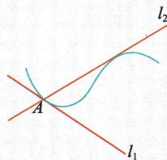

text_image

l₂
A
l₁

曲线 $y=f(x)$ 在点 $P(x_{0},y_{0})$ 处的切线要抓住三个信息

①点 P 在曲线上；  
②点 P 在切线上；  
③函数 $y=f(x)$ 在 $x=x_{0}$ 处的导数等于切线的斜率.

# 5.2 导数的运算

# 1. 基本初等函数的导数公式

(1) $f(x)=c$ (c为常数) $\Rightarrow f'(x)=0.$   
(2) $f(x)=x^{\alpha}(\alpha\in\mathbf{R},\text{且}\alpha\neq0)\Rightarrow f'(x)=\alpha x^{\alpha-1}.$   
(3) $f(x)=\sin x\Rightarrow f'(x)=\cos x.$   
(4) $f(x)=\cos x\Rightarrow f'(x)=-\sin x.$   
(5) $f(x)=a^{x}(a>0$ , 且 $a\neq1)\Rightarrow f'(x)=a^{x}\ln a$ ; 特别地, 若 $f(x)=\mathrm{e}^{x}$ , 则 $f'(x)=\mathrm{e}^{x}$ .  
(6) $f(x)=\log_{a}x(a>0,$ 且 $a\neq1)\Rightarrow f'(x)=\frac{1}{x\ln a};$ 特别地，若 $f(x)=\ln x,$ 则 $f'(x)=\frac{1}{x}.$

# 2. 导数的运算法则

(1) $[f(x)\pm g(x)]' = f'(x)\pm g'(x)$ ;   
(2) $\left[f(x)g(x)\right]'=f'(x)g(x)+f(x)g'(x)$ ，特别地，若c为常数，则 $\left[cf(x)\right]'=cf'(x)$ ;  
(3) $\left[\frac{f(x)}{g(x)}\right]' = \frac{f'(x)g(x) - f(x)g'(x)}{\left[g(x)\right]^2} (g(x) \neq 0).$

# 3. 简单复合函数的导数

# (1) 复合函数的概念

对于两个函数 $y=f(u)$ 和 $u=g(x)$ ，如果通过中间变量 u, y 可以表示成 x 的函数，那么称这个函数为函数 $y=f(u)$ 和 $u=g(x)$ 的复合函数，记作 $y=f(g(x))$ .

# (2) 复合函数的求导法则

对于由函数 $y = f(u)$ 和 $u = g(x)$ 复合而成的函数 $y = f(g(x))$ ，它的导数与函数 $y = f(u), u = g(x)$ 的导数间的关系为 $y_x' = y_u' \cdot u_x'$ ，即 $y$ 对 $x$ 的导数等于 $y$ 对 $u$ 的导数与 $u$ 对 $x$ 的导数的乘积.

# 知识深层理解

# 问题1 如何推导基本初等函数的导数公式？

提示 这些公式都是利用导数的概念推导出来的.

① 幂函数的导数公式: $(x^{\alpha})' = \alpha x^{\alpha - 1} (\alpha \in \mathbf{R}, \text{且 } \alpha \neq 0)$ , 此公式的推导需要用到选择性必修第三册中的二项式定理, 到时有兴趣的同学可以推导一下.  
② 指数函数、对数函数、三角函数导数公式的推导需要用到“两个重要极限”： $\lim_{x\to\infty}\left(1+\frac{1}{x}\right)^{x}=e,\lim_{x\to0}\frac{\sin x}{x}=1$ ，其推导过程不作要求，仅供了解.

# 印象笔记

# 求导常用公式

$$
\begin{array}{l} ① \left(\frac {1}{x}\right) ^ {\prime} = - \frac {1}{x ^ {2}}; \\ ② (\sqrt {x}) ^ {\prime} = \frac {1}{2 \sqrt {x}}. \\ \end{array}
$$

利用公式求导时,注意公式不要混用,如 $(a^{x})' = a^{x} \ln a$ ,而不是 $(a^{x})' = xa^{x-1}$ .

例如： $(\ln x)' = \lim_{\Delta x\to 0}\frac{\ln(x + \Delta x) - \ln x}{\Delta x} = \lim_{\Delta x\to 0}\left[\frac{1}{x}\ln \left(1 + \frac{\Delta x}{x}\right)^{\frac{x}{\Delta x}}\right] = \frac{1}{x};$

$$
\begin{array}{l} (\sin x) ^ {\prime} = \lim _ {\Delta x \rightarrow 0} \frac {\sin (x + \Delta x) - \sin x}{\Delta x} = \lim _ {\Delta x \rightarrow 0} \frac {2 \cos \frac {2 x + \Delta x}{2} \sin \frac {\Delta x}{2}}{\Delta x} \\ = \lim _ {\Delta x \rightarrow 0} \left[ \cos \left(x + \frac {\Delta x}{2}\right) \cdot \frac {\sin \frac {\Delta x}{2}}{\frac {\Delta x}{2}} \right] = \cos x. \\ \end{array}
$$

# 问题2 为什么要学习导数的运算法则？如何证明导数的运算法则？

提示 ① 如果两个已知函数的导数会求或易求,引进四则运算的求导法则,就能得到两个函数的和、差、积、商的导数,就可以将比较复杂的函数的导数问题化为会求或易求的函数的导数问题,从而使许多函数的求导过程得到简化.

②(1)证明： $[f(x) + g(x)]' = \lim_{\Delta x\to 0}\frac{[f(x + \Delta x) + g(x + \Delta x)] - [f(x) + g(x)]}{\Delta x}$

$$
= \lim _ {\Delta x \rightarrow 0} \frac {f (x + \Delta x) - f (x)}{\Delta x} + \lim _ {\Delta x \rightarrow 0} \frac {g (x + \Delta x) - g (x)}{\Delta x} = f ^ {\prime} (x) + g ^ {\prime} (x),
$$

故 $\left[f(x)+g(x)\right]'=f'(x)+g'(x)$ .

(2) 证明: $[f(x)g(x)]' = \lim_{\Delta x \to 0} \frac{f(x + \Delta x)g(x + \Delta x) - f(x)g(x)}{\Delta x}$

$$
\begin{array}{l} = \lim _ {\Delta x \rightarrow 0} \frac {f (x + \Delta x) g (x + \Delta x) - f (x) g (x + \Delta x) + f (x) g (x + \Delta x) - f (x) g (x)}{\Delta x} \\ = \lim _ {\Delta x \rightarrow 0} \left[ \frac {f (x + \Delta x) - f (x)}{\Delta x} \cdot g (x + \Delta x) \right] + \lim _ {\Delta x \rightarrow 0} \left[ \frac {g (x + \Delta x) - g (x)}{\Delta x} \cdot f (x) \right] \\ = f ^ {\prime} (x) g (x) + f (x) g ^ {\prime} (x), \\ \end{array}
$$

故 $\left[f(x)g(x)\right]'=f'(x)g(x)+f(x)g'(x)$ .

# 问题3 如何证明复合函数的求导法则？

提示 复合函数的求导法则也是利用导数的概念推导出来的.

证明:设 x 有增量 $\Delta x$ , 则对应的 u, y 分别有增量 $\Delta u, \Delta y$ , 当 $\Delta x \rightarrow 0$ 时, $\Delta u \rightarrow 0$ .

$$
\because \frac {\Delta y}{\Delta x} = \frac {\Delta y}{\Delta u} \cdot \frac {\Delta u}{\Delta x}, \text {且} \lim _ {\Delta x \to 0} \frac {\Delta y}{\Delta u} = \lim _ {\Delta u \to 0} \frac {\Delta y}{\Delta u},
$$

$\therefore \lim_{\Delta x \to 0} \frac{\Delta y}{\Delta x} = \lim_{\Delta x \to 0} \left( \frac{\Delta y}{\Delta u} \cdot \frac{\Delta u}{\Delta x} \right) = \lim_{\Delta x \to 0} \frac{\Delta y}{\Delta u} \cdot \lim_{\Delta x \to 0} \frac{\Delta u}{\Delta x} = \lim_{\Delta u \to 0} \frac{\Delta y}{\Delta u} \cdot \lim_{\Delta x \to 0} \frac{\Delta u}{\Delta x}$ , 即 $y_x' = y_u' \cdot u_x'$ .

# 应试拓展注意

# 拓展1 函数在某一点处的导数

求函数 $y=f(x)$ 在 $x=x_{0}$ 处的导数的步骤

求函数 $f(x)$ 的导数 $f'(x)$ $\rightarrow$ 将 $x=x_{0}$ 代入 $f'(x)$ $\rightarrow$ $y'\vert_{x=x_{0}}=f'(x_{0})$

印象笔记

导数的运算法则也都是利用导数的概念推导出来的,同样推导过程不作要求,但必须能灵活运用导数的运算法则.

推广： $[af(x)+bg(x)]' = af'(x) + bg'(x)(a,b$ 为常数).

利用导数的运算法则求导时,要特别注意除法公式中分子的运算符号,防止与乘法公式混淆.

推论: 若 $y=f(u)$ , $u=g(v), v=\varphi(x)$ 均可导, 则 $y=f(g(\varphi(x)))$ 也可导, 且 $y_{x}^{\prime}=y_{u}^{\prime}\cdot u_{v}^{\prime}\cdot v_{x}^{\prime}$ .

【例 1】(1) 已知函数 $f(x)=\mathrm{e}^{x}-\cos x+1$ (e 为自然对数的底数)，则 $f'(0)=$ ()

A. 0

B. 1

C. 2

D. e

(2) 若函数 $f(x)=\ln x-f'(-1)\cdot x^{2}+3x-4$ ，则 $f'(1)=$ \_\_\_\_.

(3) 已知 $f_{1}(x)=\sin x+\cos x$ ，记 $f_{2}(x)=f_{1}^{\prime}(x)$ ， $f_{3}(x)=f_{2}^{\prime}(x)$ ， $\cdots$ ， $f_{n}(x)=f_{n-1}^{\prime}(x)(n\in\mathbf{N}^{*},n\geqslant2)$ ，则 $f_{1}\left(\frac{\pi}{2}\right)+f_{2}\left(\frac{\pi}{2}\right)+\cdots+f_{2022}\left(\frac{\pi}{2}\right)=$ \_\_\_\_.

解析:(1)由已知可得 $f'(x)=\mathrm{e}^{x}+\sin x$ ,则 $f'(0)=\mathrm{e}^{0}+\sin 0=1$ .故选B.

(2) $\because f'(x)=\frac{1}{x}-2f'(-1)\cdot x+3,\therefore f'(-1)=-1+2f'(-1)+3,$

$$
\therefore f ^ {\prime} (- 1) = - 2, \therefore f ^ {\prime} (x) = \frac {1}{x} + 4 x + 3, \therefore f ^ {\prime} (1) = 1 + 4 + 3 = 8.
$$

(3) $f_{2}(x)=f_{1}^{\prime}(x)=\cos x-\sin x,f_{3}(x)=(\cos x-\sin x)^{\prime}=-\sin x-\cos x,$

$$
f _ {4} (x) = - \cos x + \sin x, f _ {5} (x) = \sin x + \cos x, \dots ,
$$

以此类推,可得出 $f_{n}(x)=f_{n+4}(x)$ , $n\in N^{*}$ ,又∵ $f_{1}(x)+f_{2}(x)+f_{3}(x)+f_{4}(x)=0$ ,

$$
\therefore f _ {1} \left(\frac {\pi}{2}\right) + f _ {2} \left(\frac {\pi}{2}\right) + \dots + f _ {2 0 2 2} \left(\frac {\pi}{2}\right) = 5 0 5 \times \left[ f _ {1} \left(\frac {\pi}{2}\right) + f _ {2} \left(\frac {\pi}{2}\right) + f _ {3} \left(\frac {\pi}{2}\right) + f _ {4} \left(\frac {\pi}{2}\right) \right] +
$$

$$
\left[ f _ {1} \left(\frac {\pi}{2}\right) + f _ {2} \left(\frac {\pi}{2}\right) \right] = 2 \cos \frac {\pi}{2} = 0.
$$

答案:(1)B (2)8 (3)0

# 拓展2 求导运算应遵循的两个原则

① 求导之前,应利用代数变形、三角恒等变换等对函数进行化简,然后求导,这样可以减少运算量,提高运算速度,减少差错;遇到函数的商的形式时,如能化简则化简,这样可避免使用商的求导法则,减少运算量.

②复合函数求导时,先确定复合关系,由外向内逐层求导,必要时可换元.

【例 2】 求下列函数的导数：

(1) $y = x - \sin \frac{x}{2} \cos \frac{x}{2};$

(2) $y=\sin^{2}\frac{x}{2};$

(3) $y = \mathrm{e}^{x}\cos x;$

(4) $y=\ln\sqrt{1+x^{2}}$ ;

(5) $y=\frac{\ln(2x+1)}{x}.$

解：(1) $\because y = x - \sin \frac{x}{2} \cos \frac{x}{2} = x - \frac{1}{2} \sin x, \therefore y' = \left(x - \frac{1}{2} \sin x\right)' = 1 - \frac{1}{2} \cos x.$

(2) $\because y = \sin^2\frac{x}{2} = \frac{1}{2} (1 - \cos x) = \frac{1}{2} -\frac{1}{2}\cos x,\therefore y' = -\frac{1}{2} (-\sin x) = \frac{1}{2}\sin x.$

(3) $y' = (e^x)' \cos x + e^x (\cos x)' = e^x \cos x - e^x \sin x.$

(4) $\because y=\ln\sqrt{1+x^{2}}=\frac{1}{2}\ln(1+x^{2})$ ,

$$
\therefore y ^ {\prime} = \frac {1}{2} \cdot \frac {1}{1 + x ^ {2}} \cdot (1 + x ^ {2}) ^ {\prime} = \frac {1}{2} \cdot \frac {1}{1 + x ^ {2}} \cdot 2 x = \frac {x}{1 + x ^ {2}}.
$$

# 印象笔记

# 求导公式的特点

(1) 常数函数的导数为零.  
(2) 幂函数求导降次.   
(3) 指数函数的导数为指数(型)函数.  
(4) 正弦函数和余弦函数的导数是与它们互余的三角函数（即分别为余弦函数和正弦函数），且余弦函数的导数都带负号.

注意 $f'(x_{0})$ 是一个确定的常数,同时要注意三角函数的周期性.

# 基本思路

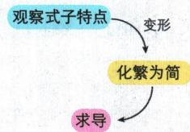

flowchart

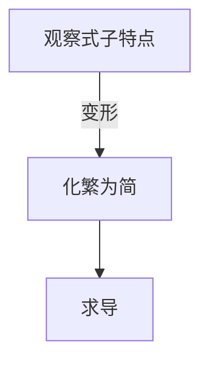

# 复合函数求导步骤

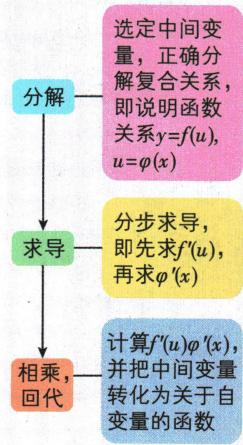

flowchart

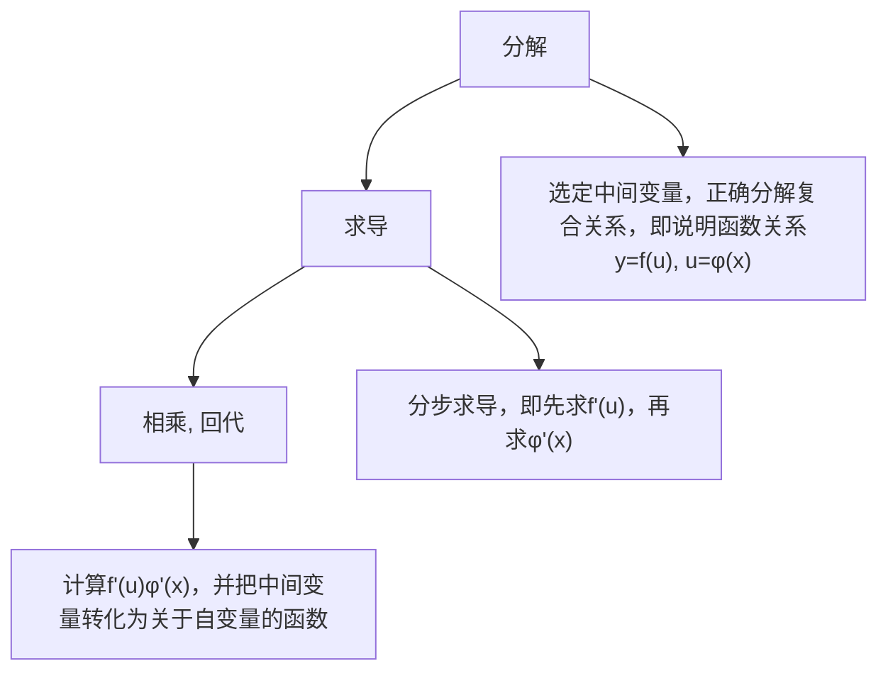

(5) $y' = \left[\frac{\ln(2x + 1)}{x}\right]' = \frac{[\ln(2x + 1)]'x - x'\ln(2x + 1)}{x^2}$

$$
= \frac {\frac {(2 x + 1) ^ {\prime}}{2 x + 1} \cdot x - \ln (2 x + 1)}{x ^ {2}} = \frac {\frac {2 x}{2 x + 1} - \ln (2 x + 1)}{x ^ {2}} = \frac {2 x - (2 x + 1) \ln (2 x + 1)}{(2 x + 1) x ^ {2}}.
$$

# 疑难突破提高

# 突破1 抽象函数的导数

求抽象函数的导数,常利用复合函数的求导法则,确定好复合关系,由外向内逐层求导.

【例3】已知函数 $f(x)$ 在R上满足 $f(x)=2f(2-x)-x^{2}+8x-8$ ，则曲线 $y=f(x)$ 在点 $(1,f(1))$ 处的切线方程为()

A. $y = 2x - 1$

B. y = x

C. y = 3x - 2

D. $y = -2x + 3$

解析： $\because f(x)=2f(2-x)-x^{2}+8x-8,\therefore f'(x)=-2f'(2-x)-2x+8,$

$$
\therefore f ^ {\prime} (1) = - 2 f ^ {\prime} (1) + 6, \therefore f ^ {\prime} (1) = 2. \because f (1) = 2 f (1) - 1, \therefore f (1) = 1.
$$

∴ 曲线 $y=f(x)$ 在点 $(1,f(1))$ 处的切线方程为 $y-1=2(x-1)$ ，即 y=2x-1.

答案:A

# 突破2 导数计算与其他知识的综合应用

导数计算常与函数的性质、切线的斜率和倾斜角等知识进行综合应用. 这需要我们结合函数的奇偶性、周期性, 以及二次函数求最值, 基本不等式求最值等知识综合解答.

【例4】已知函数 $f(x) = ax^4 + bx^2 + c$ ，若 $f'(1) = 2$ ，则 $f'(-1) =$ （）

A.-1

B.-2

C. 2

D. 0

解析: 方法一: 由 $f(x)=ax^{4}+bx^{2}+c$ , 得 $f'(x)=4ax^{3}+2bx$ .

因为 $f'(1)=2$ ，所以 $4a+2b=2$ 。

则 $f'(-1)=-4a-2b=-(4a+2b)=-2.$ 故选 B.

方法二: 易知 $f(x)$ 是偶函数, 则 $f'(x)$ 是奇函数, 所以 $f'(-1) = -f'(1) = -2$ .

答案:B

【例5】已知点 $P$ 在曲线 $y = \frac{4}{\mathrm{e}^x + 1}$ 上， $\alpha$ 为曲线在点 $P$ 处的切线的倾斜角，则 $\alpha$ 的取值范围是 （）

A. $\left[0, \frac{\pi}{4}\right)$

B. $\left[\frac{\pi}{4},\frac{\pi}{2}\right)$

C. $\left(\frac{\pi}{2},\frac{3\pi}{4}\right]$

D. $\left[\frac{3\pi}{4},\pi\right)$

对 $f(2-x)$ 求导时，应利用复合函数的求导法则. 注意分清复合函数的复合关系, 看是由哪些基本函数复合而成的, 选择适当的中间变量.

奇函数的导数是偶函数,偶函数的导数是奇函数.

解析: $y'=\frac{-4\mathrm{e}^{x}}{\left(\mathrm{e}^{x}+1\right)^{2}}=\frac{-4}{\mathrm{e}^{x}+\frac{1}{\mathrm{e}^{x}}+2}.\because\mathrm{e}^{x}+\frac{1}{\mathrm{e}^{x}}+2\geqslant4$ (当且仅当x=0时取等号),∴ $-1\leqslant$

$y'=\frac{-4}{\mathrm{e}^{x}+\frac{1}{\mathrm{e}^{x}}+2}<0,\therefore-1\leqslant\tan\alpha<0,\therefore\frac{3\pi}{4}\leqslant\alpha<\pi,\therefore\alpha$ 的取值范围是 $\left[\frac{3\pi}{4},\pi\right)$ .

# 印象笔记

基本不等式求最值时必须满足: 一正、二定、三相等.

答案:D

# 本节与高考

高考中主要考查基本初等函数的导数公式、导数的运算法则、复合函数的求导法则,考查学生的运算求解能力.能准确熟练地求出一个函数的导数,是研究导数在函数中的应用的前提,所以学好该部分内容至关重要.

# 5.3 导数在研究函数中的应用

# 敲黑板

1. 函数单调性与其导函数的关系

在某个区间 $(a, b)$ 内，

$f'(x)>0\Rightarrow$ 函数 $y=f(x)$ 在区间 $(a,b)$ 上单调递增； $f'(x)<0\Rightarrow$ 函数 $y=f(x)$ 在区间 $(a,b)$ 上单调递减.

反之，若 $f(x)$ 在区间 $(a,b)$ 上单调递增，则 $f'(x)\geqslant0$ 在 $(a,b)$ 上恒成立，且在区间 $(a,b)$ 的任意子区间上， $f'(x)$ 不恒等于0

2. 利用导数判断函数 $y=f(x)$ 单调性的一般步骤

(1)确定函数的定义域;→定义域优先

(2)解 ${f}^{\prime }\left( x\right)  = 0$ ; 常用方法：通分、因式分解等

(3)用函数 $f'(x)$ 的零点将 $f(x)$ 的定义域划分为若干个区间,列表给出 $f'(x)$ 在各区间上的正负,由此得出函数 $y=f(x)$ 在定义域内的单调性.

3. 函数极值的概念

以 $x = a$ 为中点的很小的区域

若函数 $y=f(x)$ 在点 x=a 处的函数值 $f(a)$ 比它在点 x=a 附近其他点处的函数值都小， $f'(a)=0$ ；而且在点 x=a 附近的左侧 $f'(x)<0$ ，右侧 $f'(x)>0$ ，则把 a 叫做函数 $y=f(x)$ 的极小值点， $f(a)$ 叫做函数 $y=f(x)$ 的

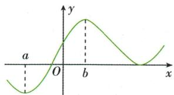

text_image

a
O
b
x
y

极小值.

在 $f\left( x\right)$ 可导的条件下, ${f}^{\prime }\left( a\right)  = 0$ 是 $f\left( x\right)$ 在 $x = a$ 处取得极值的必要不充分条件

若函数 $y = f(x)$ 在点 $x = b$ 处的函数值 $f(b)$ 比它在点 $x = b$ 附近其他点处的函数值都大， $f'(b) = 0$ ；而且在点 $x = b$ 附近的左侧 $f'(x) > 0$ ，右侧 $f'(x) < 0$ ，则把 $b$ 叫做函数 $y = f(x)$ 的极大值点， $f(b)$ 叫做函数 $y = f(x)$ 的极大值。

极小值点、极大值点统称为极值点,极小值和极大值统称为极值.

①取得极值时,极值点 $x$ 的值是实数,而不是一个点；  
②极值点必在区间内部，区间端点必不是极值点

4. 求函数 $y = f(x)$ 极值的方法

解方程 $f'(x)=0$ ，当 $f'(x_{0})=0$ 时：

如果在 $x = {x}_{0}$ 附近的左右两侧 ${f}^{\prime }\left( x\right)$ 的

符号相同,那么 $f\left( {x}_{0}\right)$ 不是极值

(1) 如果在 $x_{0}$ 附近的左侧 $f'(x)>0$ ，右侧 $f'(x)<0$ ，那么 $f(x_{0})$ 是极大值；  
(2) 如果在 $x_{0}$ 附近的左侧 $f'(x) < 0$ ，右侧 $f'(x) > 0$ ，那么 $f(x_{0})$ 是极小值.

5. 求函数 $y=f(x)$ 在区间 $[a,b]$ 上的最值的步骤

(1) 求函数 $y=f(x)$ 在区间 $(a,b)$ 上的极值；  
(2) 将函数 $y = f(x)$ 的各极值与端点处的函数值 $f(a), f(b)$ 比较, 其中最大的一个是最大值, 最小的一个是最小值.

# 知识深层理解

# 印象笔记

# 问题1 为什么可以用导数研究函数的单调性？

提示 函数的单调性在必修第一册中已经讲过,当时直接根据单调性的定义研究函数的单调性.导数是在研究变化现象中产生的,它是平均变化率的极限.我们可由函数的某段平均变化率 $\frac{f(x_{2})-f(x_{1})}{x_{2}-x_{1}}$ 逐步逼近函数在某点的瞬时变化率(导数);反过来,由函数在某点的瞬时变化率我们可以估计函数在这点附近的变化情况.当 $x_{1}\neq x_{2}$ 时,由函数的某段平均变化率 $\frac{f(x_{2})-f(x_{1})}{x_{2}-x_{1}}$ 的符号,可以比较函数 $f(x)$ 在 $x_{1},x_{2}$ 处的大小,进而确定函数的单调性.因此,导数可以作为研究函数单调性的工具,而且利用导数研究函数的单调性具有一般性.

# 问题2 若函数 $f(x)$ 在区间 $(a, b)$ 上可导，则 $f(x)$ 在区间 $(a, b)$ 上严格递增（递减）的充要条件是什么？

提示 $f(x)$ 在区间 $(a, b)$ 上严格递增（递减）的充要条件：

① $\forall x\in(a,b)$ ，都有 $f'(x)\geqslant0(f'(x)\leqslant0)$ ;  
②在区间 $(a,b)$ 的任意子区间上 $f'(x)$ 不恒等于零.

即由导数与函数的单调性的关系可得出如下结论：

①若函数 $f(x)$ 在区间 $(a,b)$ 内可导，且 $f'(x)$ 在 $(a,b)$ 的任意子区间内都不恒等于零，则当 $x\in(a,b)$ 时，

$f'(x) \geqslant 0 \Leftrightarrow$ 函数 $f(x)$ 在 $(a, b)$ 上单调递增；

$f'(x) \leqslant 0 \Leftrightarrow$ 函数 $f(x)$ 在 $(a, b)$ 上单调递减.

② $f'(x)>0(f'(x)<0)$ 在 $(a,b)$ 上成立是 $f(x)$ 在 $(a,b)$ 上单调递增(递减)的充分条件.

一般地,如果一个函数在某一范围内导数的绝对值较大,那么函数在这个范围内变化得较快,这时函数的图象就比较“陡峭”(向上或向下);反之,函数在这个范围内变化得较慢,函数的图象就比较“平缓”.

单调区间之间必须用“，”或“和”连接，不能用“∪”连接.例如，函数 $y=\frac{1}{x}$ 在 $(-∞,0)∪(0,+∞)$ 上单调递减，这种说法是错误的.

问题3 在“ $f(x)$ 在区间 $M$ 上单调递增”与“ $f(x)$ 的单调递增区间为 $N$ ”中，区间 $M$ 与区间 $N$ 有什么关系？

提示 若求函数的单调区间,先考虑函数的定义域,然后解不等式 $f'(x)>0$ (或 $f'(x)<0$ )(不要带等号),最后求二者的交集,把它写成区间;若已知函数 $y=f(x)$ 的单调递增(减)区间为N,则在区间N上 $f'(x)\geqslant0$ (或 $f'(x)\leqslant0$ )恒成立(必须带上等号).在“ $f(x)$ 在区间M上单调递增”与“ $f(x)$ 的单调递增区间为N”中,易知 $M\subseteq N$ ,我们也常用该结论求参数的取值范围.

问题4 导数值为 0 的点一定是可导函数的极值点吗？

提示 导数值为 0 的点不一定是可导函数的极值点, 可导函数 $y=f(x)$ 在一点的导数值为 0 是函数 $y=f(x)$ 在这点取得极值的必要不充分条件. 如: $y=x^{3}, y'=3x^{2}$ , 当 x=0 时 $y'=0$ , 但 x=0 不是 $y=x^{3}$ 的极值点.

问题5 极值与最值有什么区别？

提示 极值反映的是函数在某点附近的局部性质,最值是函数值中的最大或最小者,是函数在整个定义域内的性质;函数在其定义域内的最大值、最小值最多各有一个,最大值一定不小于最小值,而函数的极值可能没有,可能有一个,也可能有多个,并且极大值不一定比极小值大;函数的极值点一定是导函数的变号零点;最值应在极值点或区间端点处取得.

问题6 如何利用导数画出函数的大致图象？

提示 ① 求出函数 $f(x)$ 的定义域;

③用 $f'(x)$ 的零点将 $f(x)$ 的定义域划分为若干个区间,列表给出 $f'(x)$ 在各个区间上的正负,并得出 $f(x)$ 的单调性与极值;

②求导数 $f'(x)$ 及导函数 $f'(x)$ 的零点；  
④ 确定 $f(x)$ 的图象所经过的一些特殊点,以及图象的变化趋势;  
⑤ 画出 $f(x)$ 的大致图象.

如画出函数 $f(x)=\frac{x}{\mathrm{e}^{x}}$ 的图象.

(1) 函数 $f(x)=\frac{x}{\mathrm{e}^{x}}$ 的定义域为 R.  
(2) 求导得 $f'(x)=\frac{1-x}{\mathrm{e}^{x}}$ ，解 $f'(x)=0$ 得 x=1.  
(3) 当 x<1 时, $f'(x)>0$ , 当 x>1 时, $f'(x)<0$ ,

故函数 $f(x)$ 在 $(-∞,1)$ 上单调递增，在 $(1,+∞)$ 上单调递减，

当 x=1 时, 函数 $f(x)$ 取得极大值 $f(1)=\frac{1}{e}$ , 无极小值,

即 $f'(x)$ , $f(x)$ 随 x 的变化情况如表所示.

<table><tr><td>x</td><td>(-∞,1)</td><td>1</td><td>(1,+∞)</td></tr><tr><td>f&#x27;(x)</td><td>+</td><td>0</td><td>-</td></tr><tr><td>f(x)</td><td>单调递增</td><td> $\frac{1}{e}$ </td><td>单调递减</td></tr></table>

# 印象笔记

利用该结论求参数的取值范围时,一定要注意取“=”问题.

函数的极值点是函数单调区间的分界点.

(1) 最大(小)值是函数在端点处的函数值和极值中的最大(小)者.

(2) 函数 $f(x)$ 的极值点不能是区间的端点, 而最值点可以是区间的端点.

对于原函数,要注意其图象在哪个区间内上升、在哪个区间内下降;而对于导函数,则应注意其函数值在哪个区间内大于零、在哪个区间内小于零,并分析这些区间与原函数的单调区间是否一致.

(4) $f(0)=0$ ,且当x>1时, $f(x)>0$ 恒成立,因此当x>1时,随着x的增大, $f(x)$ 的图象在x轴的上方与x轴无限接近.

(5)画出函数 $f(x)$ 的大致图象如图所示.

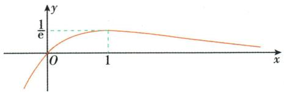

text_image

y
1/e
O
1
x

# 问题7 生活中常见的优化问题有哪些？怎样利用导数解决生活中的优化问题？

提示 ①生活中常见的优化问题有利润最大、用料最省、效率最高等.

② 利用导数解决生活中的优化问题的一般步骤:

(1) 分析实际问题中变量之间的关系, 找出实际问题的近似数学模型, 写出实际问题中变量之间的函数关系式 $y=f(x)$ , 并确定函数的定义域.

(2) 求函数 $y = f(x)$ 的导数 $f'(x)$ ，解方程 $f'(x) = 0$ .

(3) 比较函数在区间端点和使 $f'(x)=0$ 的点处的函数值的大小, 最大(小)者为最大(小)值.

(4)结合实际问题作答.

# 应试拓展注意

# 拓展1 导数与函数图象的联系

初等函数的图象是高考热点,判断函数图象问题可以根据函数的性质,如定义域、值域、特殊值、奇偶性等进行判断,但单调性往往是判断函数图象的关键,对一些较为复杂的函数,可以通过计算导函数与0的大小关系判断函数在某一区间的单调性,从而判断函数图象.

【例 1】已知函数 $f(x)$ 在定义域内可导, $f(x)$ 的图象如图所示, 则其导函数 $f'(x)$ 的图象可能是 ( )

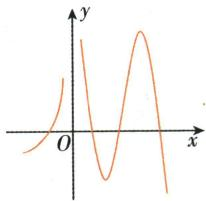

line

| x    | y     |
| ---- | ----- |
| 0    | 0     |
| 0.5  | 1     |
| 1    | -1    |
| 1.5  | 2     |

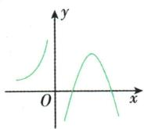  
A

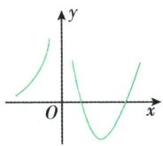  
B

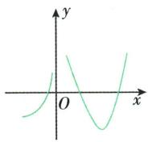  
C

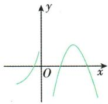  
D

解析:由 $f(x)$ 的图象可知,当 $x\in(-\infty,0)$ 时,函数 $f(x)$ 单调递增,则 $f'(x)\geqslant0$ ,故排除C,D;当 $x\in(0,+\infty)$ 时, $f(x)$ 先单调递减再单调递增最后单调递减,所以所对应的导数值应该先小于0,再大于0,最后小于0,故排除B.故选A.

答案:A

# 拓展2 利用导数研究函数的单调性

利用导数研究函数的单调性的关键在于求出函数 $f(x)$ 的导数 $f'(x)$ ，并准确判断导数 $f'(x)$ 的符号，当 $f'(x)$ 中含有参数时，需要进行分类讨论.

设出未知量,列出函数关系式,是解决优化问题的关键.

(1) 在求实际问题的最大(小)值时,一定要考虑实际问题的意义,不符合实际意义的值应舍去.

(2) 在实际问题中, 有时会遇到函数在区间内只有一个点满足 $f'(x) = 0$ 的情形. 如果函数在这点有极大 (小) 值, 那么不与端点处的函数值比较, 也可以知道这就是最大 (小) 值.
(3) 在解决实际问题时, 不仅要注意将问题中涉及的变量关系用函数表示, 还应确定函数关系式的定义域.

拓展:二阶导数 $y=f''(x)$ 是曲线切线斜率的变化率. 若 $f''(x)>0$ , 则切线的斜率递增, 函数 $f(x)$ 的图象呈下凸形, 如图中曲线 $y_{1}$ . 若 $f''(x)<0$ , 则切线的斜率递减, 函数 $f(x)$ 的图象呈上凸形, 如图中曲线 $y_{2}$ .

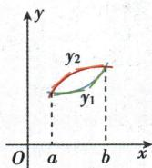

【例2】已知 $f(x) = a(x - \ln x) + \frac{2x - 1}{x^2}, a \in \mathbb{R}$ ，试讨论 $f(x)$ 的单调性.

解: $f(x)$ 的定义域为 $(0,+\infty)$ , $f'(x)=a\left(1-\frac{1}{x}\right)+\frac{2-2x}{x^{3}}=\frac{(x-1)(ax^{2}-2)}{x^{3}}$ .

若 $a \leqslant 0$ ，则当 $x \in (0,1)$ 时， $f'(x) > 0, f(x)$ 单调递增；

当 $x \in (1, +\infty)$ 时， $f'(x) < 0, f(x)$ 单调递减.

若 $a > 0, f'(x) = \frac{(x - 1)(ax^2 - 2)}{x^3} = \frac{a(x - 1)\left(x - \sqrt{\frac{2}{a}}\right)\left(x + \sqrt{\frac{2}{a}}\right)}{x^3}$ .

①当 $0 < a < 2$ 时， $\sqrt{\frac{2}{a}} > 1$ 。当 $x \in (0,1)$ 或 $x \in \left(\sqrt{\frac{2}{a}}, +\infty\right)$ 时， $f'(x) > 0, f(x)$ 单调递增；当 $x \in \left(1, \sqrt{\frac{2}{a}}\right)$ 时， $f'(x) < 0, f(x)$ 单调递减。

②当 $a = 2$ 时， $\sqrt{\frac{2}{a}} = 1$ . 当 $x \in (0, +\infty)$ 时， $f'(x) \geqslant 0$ 且 $f'(x)$ 不恒等于 $0, f(x)$ 单调递增.

③当 $a > 2$ 时， $0 < \sqrt{\frac{2}{a}} < 1$ . 当 $x \in \left(0, \sqrt{\frac{2}{a}}\right)$ 或 $x \in (1, +\infty)$ 时， $f'(x) > 0, f(x)$ 单调递增；当 $x \in \left(\sqrt{\frac{2}{a}}, 1\right)$ 时， $f'(x) < 0, f(x)$ 单调递减.

综上所述,当 $a \leqslant 0$ 时, 函数 $f(x)$ 在 $(0,1)$ 上单调递增, 在 $(1,+\infty)$ 上单调递减;

当 0 < a < 2 时， $f(x)$ 在 $(0,1)$ 上单调递增，在 $\left(1,\sqrt{\frac{2}{a}}\right)$ 上单调递减，在 $\left(\sqrt{\frac{2}{a}},+\infty\right)$ 上单调递增；当 a=2 时， $f(x)$ 在 $(0,+\infty)$ 上单调递增；当 a>2 时， $f(x)$ 在 $\left(0,\sqrt{\frac{2}{a}}\right)$ 上单调递增，在 $\left(\sqrt{\frac{2}{a}},1\right)$ 上单调递减，在 $(1,+\infty)$ 上单调递增.

# 拓展3 已知单调性求参数的取值范围

已知函数在某个区间上的单调性,求参数的取值范围,是近几年高考的热点问题,解决此类问题的主要依据就是导数与函数单调性的关系,其常用方法有三种:

① 利用充要条件将问题转化为恒成立问题, 即 $f'(x) \geqslant 0$ (或 $f'(x) \leqslant 0$ ) 在给定区间 $(a, b)$ 上恒成立, 且在区间 $(a, b)$ 的任意子区间上 $f'(x)$ 不恒等于 0, 然后转化为不等式恒成立问题;

② 利用子区间(即子集思想),先求出函数的单调递增或单调递减区间,然后利用所给区间是求出的区间的子集求参数;

③ 函数在某个区间存在单调区间可转化为不等式有解问题.

求含参函数 $y = f(x)$ 的单调区间, 实质上就是解含参数的不等式 $f'(x) > 0$ , $f'(x) < 0$ .

求函数的单调区间,应在函数的定义域的限制之下,分类的标准是导数对应方程的根与定义域中端点值的大小关系,有时也需讨论两根的大小关系.

若是区间含参数，
常用此方法求参数
的取值范围.

【例3】已知 $y=\frac{1}{3}x^{3}+bx^{2}+(b+2)x+3$ 在 R 上不是增函数, 求实数 b 的取值范围.

解: 若 $y' = x^{2} + 2bx + b + 2 \geqslant 0$ 恒成立, 则 $\Delta = 4b^{2} - 4(b + 2) \leqslant 0$ , 解得 $-1 \leqslant b \leqslant 2$ .

由题意知 $y' \geqslant 0$ 不恒成立, 故 b < -1 或 b > 2,

所以实数 b 的取值范围为 $(-∞, -1) ∪ (2, +∞)$ .

# 拓展4 利用导数求函数的极值与最值

① 对于解析式中含有参数的函数 $y=f(x)$ 求极值问题,一般要对方程 $f'(x)=0$ 的根的情况进行讨论. (1) 讨论方程的类型,如 $f'(x)=ax^{2}+bx+c=0$ 中 a 与 0 的关系; (2) 讨论方程在定义域内是否有根; (3) 在有根且多根的情况下, 讨论根的大小关系; (4) 讨论方程的根与定义域中端点值的大小关系.  
② 求解函数 $y=f(x)$ , $x\in[a,b]$ 的最值时, 要先求函数 $y=f(x)$ 在定义域 $[a,b]$ 内所有使 $f'(x)=0$ 的点, 再计算函数 $y=f(x)$ 在区间 $[a,b]$ 内所有使 $f'(x)=0$ 的点和区间端点处的函数值, 最后比较即得最值. 另外, 已知函数的最值求参数, 一般先用参数表示最值, 再列方程求解.

【例 4】已知函数 $f(x)=x^{3}+ax^{2}+bx-4$ 在点 $P(2,f(2))$ 处的切线方程为 y=x-4.

(1) 求 $a, b$ 的值;  
(2) 求 $f(x)$ 的极值.

解:(1)依题意可知,点 $P(2,f(2))$ 为切点,代入切线方程 y=x-4,可得 $f(2)=-2,\therefore f(2)=8+4a+2b-4=-2$ ,即 $2a+b=-3$ .

又由 $f(x) = x^3 + ax^2 + bx - 4$ ，得 $f'(x) = 3x^2 + 2ax + b$ ，由切线 $y = x - 4$ 的斜率可知 $f'(2) = 1, \therefore 12 + 4a + b = 1$ ，即 $4a + b = -11$ ，联立 $\begin{cases} 2a + b = -3, \\ 4a + b = -11, \end{cases}$ 解得 $\begin{cases} a = -4, \\ b = 5. \end{cases}$

(2)由(1)知 $f(x)=x^{3}-4x^{2}+5x-4$ ,

则 $f'(x)=3x^{2}-8x+5=(3x-5)(x-1)$ ,

令 $f'(x)=0$ , 得 $x=\frac{5}{3}$ 或 x=1.

当 x 变化时, $f(x)$ , $f'(x)$ 的变化情况如表:

求可导函数 $f(x)$ 极值的步骤  
1 确定函数的定义域,求导数 $f'(x)$   
2 求方程 $f'(x)=0$ 的根  
3 用方程 ${f}^{\prime }\left( x\right)  = 0$ 的根顺次将函数的定义域分成若干个开区间,并列表  
4 利用 $f'(x)$ 与 $f(x)$ 随 x 的变化情况表, 根据极值点左右两侧单调性的变化情况求极值

<table><tr><td>x</td><td>(-∞,1)</td><td>1</td><td>(1,5/3)</td><td>5/3</td><td>(5/3,+∞)</td></tr><tr><td>f&#x27;(x)</td><td>+</td><td>0</td><td>-</td><td>0</td><td>+</td></tr><tr><td>f(x)</td><td>单调递增</td><td>极大值</td><td>单调递减</td><td>极小值</td><td>单调递增</td></tr></table>

∴ $f(x)$ 的极大值为 $f(1) = -2$ ，极小值为 $f\left(\frac{5}{3}\right) = -\frac{58}{27}$ .

求方程 $f'(x)=0$ 的根时, 若有多个点使 $f'(x)=0$ , 则这些点必须是离散的.

可导函数的极值点一定是其导数为零的点；反之，导数为零的点不一定是该函数的极值点。因此，导数为零的点（又称驻点）仅是该点为极值点的必要条件，其充分条件是该点两侧的导数异号。

【例 5】已知函数 $f(x)=\ln x-mx(m\in\mathbf{R})$ .

(1) 若曲线 $y=f(x)$ 过点 $P(1,-1)$ ，求曲线 $y=f(x)$ 在点 P 处的切线方程；  
(2) 求函数 $f(x)$ 在区间 $[1, e]$ 上的最大值.

解:(1)因为点 $P(1,-1)$ 在曲线 $y=f(x)$ 上,所以 -m=-1, 解得 m=1.

所以 $f(x)=\ln x-x$ ，所以 $f'(x)=\frac{1}{x}-1$ ，

所以 $f'(1)=0$ ，即曲线 $y=f(x)$ 在点P处切线的斜率为0，所以切线方程为y=-1。

(2) $f'(x)=\frac{1}{x}-m=\frac{1-mx}{x}.$

①当 $m \leqslant 0$ 时，在 $x \in [1, \mathrm{e}]$ 时 $f'(x) > 0$ ，所以函数 $f(x)$ 在 $[1, \mathrm{e}]$ 上单调递增，则 $f(x)_{\max} = f(\mathrm{e}) = 1 - m\mathrm{e}$ ；  
②当 $\frac{1}{m} \geqslant \mathrm{e}$ , 即 $0 < m \leqslant \frac{1}{\mathrm{e}}$ 时, 在 $x \in [1, \mathrm{e}]$ 时 $f'(x) \geqslant 0$ 且 $f'(x)$ 不恒等于 0 , 所以函数 $f(x)$ 在 $[1, \mathrm{e}]$ 上单调递增, 则 $f(x)_{\max} = f(\mathrm{e}) = 1 - m\mathrm{e}$ ;  
③当 $1 < \frac{1}{m} < \mathrm{e}$ , 即 $\frac{1}{\mathrm{e}} < m < 1$ 时, 在 $x \in [1, \mathrm{e}]$ 时, 令 $f'(x) > 0$ , 解得 $1 \leqslant x < \frac{1}{m}$ ,

令 $f'(x)<0$ ，解得 $\frac{1}{m}<x\leqslant e$ 。所以函数 $f(x)$ 在 $\left[1,\frac{1}{m}\right)$ 上单调递增，在 $\left(\frac{1}{m},e\right]$ 上单调递减，则 $f(x)_{\max}=f\left(\frac{1}{m}\right)=-\ln m-1$ ；

④当 $0 < \frac{1}{m} \leqslant 1$ ，即 $m \geqslant 1$ 时，在 $x \in [1, e]$ 时 $f'(x) \leqslant 0$ 且 $f'(x)$ 不恒等于 0，所以函数 $f(x)$ 在 $[1, e]$ 上单调递减，则 $f(x)_{\max} = f(1) = -m$ .

综上, 当 $m \leqslant \frac{1}{e}$ 时, 在区间 $[1, e]$ 上, $f(x)_{\max} = 1 - me$ ; 当 $\frac{1}{e} < m < 1$ 时, 在区间 $[1, e]$ 上, $f(x)_{\max} = -\ln m - 1$ ; 当 $m \geqslant 1$ 时, 在区间 $[1, e]$ 上, $f(x)_{\max} = -m$ .

# 拓展5 根据函数的极值或最值求参数

① 已知函数的极值求参数问题的切入点是极值存在的条件: 极值点处的导数值为 0, 且极值点附近两侧的导数值异号.  
② 已知极值点的个数求参数可以转化为 $f'(x)=0$ 的解的个数问题, 且注意 $f'(x)=0$ 的解的附近两侧的导数值异号.  
③ 由函数的最值求参数是利用导数求最值的逆向运用,结合导数和极值求出最值,代入后即可求得参数值,当参数影响极值、最值的取值时,注意分类讨论.

【例6】 若函数 $f(x) = ax^{3} + 3x^{2} + b$ 在 $x = 2$ 处取得极值1, 则 $a - b =$ （）

A.-4

B.-3

C.-2

D. 2

解析:由题意, $x\in\mathbf{R},f'(x)=3ax^{2}+6x,f(x)$ 在x=2处取得极值1,

则 $\left\{\begin{aligned}f(2)&=2^{3}\times a+3\times2^{2}+b=1,\\ f'(2)&=3\times2^{2}\times a+6\times2=0,\end{aligned}\right.$ 解得 $\left\{\begin{aligned}a&=-1,\\ b&=-3,\end{aligned}\right.$ 经检验满足题意，

所以 $a-b=-1-(-3)=2$ ，故选 D.

答案:D

求函数 $f(x)$ 在区间 $[a, b]$ 内的最大值和最小值的思路

(1) 若 $f(x)$ 的解析式中不含参数，则只需对函数 $f(x)$ 求导，并求 $f'(x)=0$ 在区间 $(a,b)$ 内的根，再计算使导数等于零的根对应的函数值，把该函数值与 $f(a)$ ， $f(b)$ 比较，其中最大的一个是最大值，最小的一个是最小值.
(2) 若 $f(x)$ 的解析式中含有参数，则需对函数 $f(x)$ 求导，通过对参数分类讨论，判断函数的单调性，从而得到函数 $f(x)$ 的最值.

注意: 若求函数在无穷区间(或开区间)上的最值, 要研究其单调性和极值, 并通过单调性和极值情况, 画出函数的大致图象, 然后借助图象观察得到函数的最值.

注意是极值点时,在某些情况下,还要考虑是极大值点还是极小值点.

【例7】若函数 $f(x) = \frac{1}{2} x^2 - x + a \ln x$ 有两个不同的极值点,则实数 $a$ 的取值范围为 ( )

# 印象笔记

A. $\left(0,\frac{1}{4}\right)$

B. $\left(0,\frac{1}{2}\right)$

C. $\left(-\infty,\frac{1}{4}\right)$

D. $\left(-\infty,\frac{1}{4}\right]$

解析: 因为函数 $f(x)=\frac{1}{2}x^{2}-x+a\ln x$ 有两个不同的极值点, 所以 $f'(x)=x-1+\frac{a}{x}=\frac{x^{2}-x+a}{x}=0$ 有两个不同的正实数根, 即 $x^{2}-x+a=0$ 有两个不同的正实数根,

所以 $\left\{\begin{aligned}\Delta&=1-4a>0,\\ x_{1}+x_{2}&=1>0,\\ x_{1}x_{2}&=a>0,\end{aligned}\right.$ 解得 $0<a<\frac{1}{4}$ ，故选A.

答案:A

# 拓展6 利用导数解决实际问题

# 几何中的最值问题

解决面积、体积的最值问题,要正确引入变量,将面积或体积表示为变量的函数,结合实际问题确定定义域,利用导数求解函数的最值.

【例8】如图所示,四边形ABCD是边长为60cm的正方形硬纸片,切去黄色部分所示的四个全等的等腰直角三角形,再沿虚线折起,使得A,B,C,D四个点重合于图中的点P,正好形成一个正四棱柱形状的包装盒.E,F两

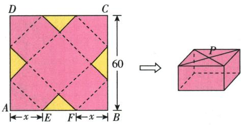

text_image

D
C
60
A←x→E
F←x→B
P

点在 $AB$ 上, 是被切去的一个等腰直角三角形斜边的两个端点. 设 $AE = FB = x \mathrm{~cm}$ .

(1)某广告商要求包装盒的侧面积 S(单位: $cm^{2}$ ) 最大,试问 x 应取何值?

(2)某厂商要求包装盒的容积 V(单位: $cm^{3}$ ) 最大,试问 x 应取何值?并求出此时包装盒的高与底面边长的比值.

解:设包装盒的高为 h cm, 底面边长为 a cm.

由已知得, $a=\sqrt{2}x,h=\frac{60-2x}{\sqrt{2}}=\sqrt{2}(30-x)$ ,0<x<30.

(1) $S=4ah=8x(30-x)=-8(x-15)^{2}+1\ 800$ ,所以当x=15时,S取得最大值.

(2)由题意得 $V=a^{2}h=2\sqrt{2}\left(-x^{3}+30x^{2}\right)$ ，则 $V'=6\sqrt{2}x(20-x)$ .

由 $V' = 0$ , 得 x = 0 (舍去) 或 x = 20.

当 $x \in (0,20)$ 时, $V' > 0$ ; 当 $x \in (20,30)$ 时, $V' < 0$ .

所以当 x=20 时, V 取得极大值, 也是最大值.

此时 $\frac{h}{a}=\frac{\sqrt{2}\times(30-20)}{\sqrt{2}\times20}=\frac{10\sqrt{2}}{20\sqrt{2}}=\frac{1}{2}$ ，即此时包装盒的高与底面边长的比值为 $\frac{1}{2}$ .

对于函数无极值的问题,往往转化为 $f'(x) \geqslant 0$ 或 $f'(x) \leqslant 0$ 在某区间内恒成立的问题,此时需注意不等式中的等号是否成立.

找出自变量和因变量,将实际问题中的变量关系转化为数学中的数量等式与不等式是解题的关键.

解决实际问题,一定要注意自变量的实际意义,准确确定定义域,建立函数模型后,用导数法求目标函数的最小值,同时要注意题目中给出数据的单位要统一.

# 用料最省、费用最低问题

解决实际生活中的用料最省、费用最低、损耗最小、最节省时间等问题,需要求相应函数 $y=f(x)$ 的最小值,此时先根据 $f'(x)=0$ 求出极小值点,再根据实际意义求出函数的最小值.

# 利润最大问题

① 经济生活中分析生产的成本与利润及利润增减的快慢,常以产量或单价为自变量建立函数关系式,利用导数来分析、研究、指导生产活动.

②关于利润问题常用的两个等量关系:(1)利润=收入-成本,(2)利润=每件产品的利润×销售件数.

# 疑难突破提高

# 突破1 利用导数证明不等式

利用导数证明 $f(x) > g(x)$ 在区间 D 上恒成立的基本方法

① 首先构造函数 $h(x)=f(x)-g(x)$ ，然后根据函数的单调性、最值等证明在区间 D 上 $h(x)>0$ ，其中一个重要技巧就是确定 $h(x)=0$ 时 x 的值，这往往是解决问题的突破口.

② 分别求 $f(x)_{\min}$ 和 $g(x)_{\max}$ ，利用 $f(x)_{\min} > g(x)_{\max} \Rightarrow f(x) > g(x)$ 在区间 D 上恒成立（注意： $f(x)_{\min} > g(x)_{\max}$ 是 $f(x) > g(x)$ 在区间 D 上恒成立的充分不必要条件）.

【例9】设函数 $f(x) = \ln (a - x)$ ，已知 $x = 0$ 是函数 $y = xf(x)$ 的极值点.

(1) 求 a;

(2) 设函数 $g(x)=\frac{x+f(x)}{xf(x)}$ ，证明： $g(x)<1$ .

(1) 解: $f(x)=\ln(a-x)\Rightarrow f'(x)=\frac{1}{x-a}, y=xf(x)\Rightarrow y'=\ln(a-x)+\frac{x}{x-a},$

又 x=0 是函数 $y=xf(x)$ 的极值点, 所以 $y'\mid_{x=0}=\ln a=0$ , 解得 a=1.

经检验,a=1 符合题意,所以 a=1.

(2) 证明: 由(1)得 $f(x)=\ln(1-x)$ , $g(x)=\frac{x+f(x)}{xf(x)}=\frac{x+\ln(1-x)}{x\ln(1-x)}$ , x<1 且 $x\neq0$ ,

当 $x \in (0,1)$ 时，要证 $g(x) = \frac{x + \ln(1 - x)}{x\ln(1 - x)} < 1$ ，因为 $x > 0, \ln(1 - x) < 0$ ，所以 $x\ln(1 - x) < 0$ ，即证 $x + \ln(1 - x) > x\ln(1 - x)$ ，化简得 $x + (1 - x)\ln(1 - x) > 0$ 。

同理, 当 $x \in (-\infty, 0)$ 时, 要证 $g(x) = \frac{x + \ln(1 - x)}{x \ln(1 - x)} < 1$ , 因为 x < 0, $\ln(1 - x) > 0$ , 所以 $x \ln(1 - x) < 0$ , 即证 $x + \ln(1 - x) > x \ln(1 - x)$ , 化简得 $x + (1 - x) \ln(1 - x) > 0$ .

令 $h(x) = x + (1 - x)\ln (1 - x)$ ，再令 $t = 1 - x$ ，则 $t\in (0,1)\cup (1, + \infty),x = 1 - t,$

令 $m(t)=1-t+t\ln t$ ，则 $m'(t)=-1+\ln t+1=\ln t$ ，

# 印象笔记

注意:(1) 正确给出函数关系式及定义域;

(2) 与实际问题相联系；  
(3)有些函数解析式含有参数时,需分类讨论.

二级结论（1）常见

的指数放缩: $e^{x} \geqslant x + 1$ (x = 0 时, 取“=”); $e^{x} \geqslant ex$ (x = 1 时, 取 “=”).

(2) 常见的对数放缩: $1 - \frac{1}{x} \leqslant \ln x \leqslant x - 1 (x > 0$ , 且 x = 1 时, 取 “ = ”); $\ln x \leqslant \frac{x}{e} (x = e \text{ 时, 取 “ = ”}); x \geqslant \ln (x + 1) (x = 0 \text{ 时, 取 “ = ”}).$

(3) 常见的三角函数
放缩: $x \in \left(0, \frac{\pi}{2}\right)$ , $\sin x < x < \tan x.$

通过分类讨论对不等式进行等价转化时,一定要注意转化前后的等价性.

# 利用导数证明不等式常见的方法

(1) 直接转化为函数的最值问题: 把证明 $f(x) < g(a)$ 转化为 $f(x)_{\max} < g(a)$ .  
(2) 移项作差构造函数法: 把不等式 $f(x) > g(x)$ 转化为 $f(x) - g(x) > 0$ ，进而构造函数 $h(x) = f(x) - g(x)$ .

当 $t \in (0,1)$ 时， $m'(t) < 0, m(t)$ 单调递减，假设 $m(1)$ 能取到，则 $m(1) = 0$ ，故 $m(t) > 0$ ；

当 $t \in (1, +\infty)$ 时, $m'(t) > 0$ , $m(t)$ 单调递增, 假设 $m(1)$ 能取到, 则 $m(1) = 0$ , 故 $m(t) > 0$ .

因此, $h(x)=x+(1-x)\ln(1-x)>0$ 在 $x\in(-\infty,0)\cup(0,1)$ 上恒成立.

综上所述, $g(x)=\frac{x+\ln(1-x)}{x\ln(1-x)}<1$ 在 $x\in(-\infty,0)\cup(0,1)$ 上恒成立.

【例10】已知函数 $f(x) = ae^{x}\ln x + \frac{be^{x - 1}}{x}$ ，曲线 $y = f(x)$ 在点(1, $f(1)$ )处的切线方程为 $y = e(x - 1) + 2$ .

(1) 求 a, b 的值;

(2) 证明: $f(x) > 1$ .

(1) 解: 函数 $f(x)$ 的定义域为 $(0, +\infty)$ , $f'(x) = a e^{x} \ln x + \frac{a}{x} e^{x} - \frac{b}{x^{2}} e^{x-1} + \frac{b}{x} e^{x-1}$ .

由题意可得 $\left\{\begin{aligned}f(1)&=2,\\ f'(1)&=e,\end{aligned}\right.$ 即 $\left\{\begin{aligned}b&=2,\\ ae-b+b&=e,\end{aligned}\right.$ 解得 $\left\{\begin{aligned}a&=1,\\ b&=2.\end{aligned}\right.$

(2) 证明: 由 (1) 知 $f(x) = \mathrm{e}^{x} \ln x + \frac{2\mathrm{e}^{x - 1}}{x}$ , 从而 $f(x) > 1$ 等价于 $x \ln x > x \mathrm{e}^{-x} - \frac{2}{\mathrm{e}}$ .

设函数 $g(x) = x\ln x$ ，则 $g'(x) = 1 + \ln x$ ，所以当 $x \in \left(0, \frac{1}{\mathrm{e}}\right)$ 时， $g'(x) < 0$ ，当 $x \in \left(\frac{1}{\mathrm{e}}, +\infty\right)$ 时， $g'(x) > 0$ ，故 $g(x)$ 在 $\left(0, \frac{1}{\mathrm{e}}\right)$ 上单调递减，在 $\left(\frac{1}{\mathrm{e}}, +\infty\right)$ 上单调递增，从而 $g(x)$ 在 $(0, +\infty)$ 上的最小值为 $g\left(\frac{1}{\mathrm{e}}\right) = -\frac{1}{\mathrm{e}}$ 。

设函数 $h(x)=xe^{-x}-\frac{2}{e}$ ，则 $h'(x)=\mathrm{e}^{-x}(1-x)$ ，所以当 $x\in(0,1)$ 时， $h'(x)>0$ ，当 $x\in(1,+\infty)$ 时， $h'(x)<0$ ，故 $h(x)$ 在 $(0,1)$ 上单调递增，在 $(1,+\infty)$ 上单调递减，从而 $h(x)$ 在 $(0,+\infty)$ 上的最大值为 $h(1)=-\frac{1}{e}$ .

因为 $g(x)$ 的最值与 $h(x)$ 的最值不在同一点处取得, 所以当 x > 0 时, $g(x) > h(x)$ , 即 $f(x) > 1$ 成立.

# 突破2 利用导数研究函数的零点、方程的根

① 利用导数研究函数的零点, 可利用导数判断函数的单调性, 借助零点存在定理判断; 另外, 也可将函数的零点问题转化为函数图象的交点问题, 利用数形结合来解决.

②研究方程根的情况,可以利用导数研究相应函数的单调性、极大值、极小值、变化趋势等,根据题目要求作出函数的图象,标明极值(或最值)的位置,通过数形结合思想去分析问题,可以使问题的求解变得直观清晰.

# 印象笔记

(3) 构造双函数法: 若直接构造函数求导, 难以判断符号, 导函数零点不易求得, 即函数单调性与极值点都不易获得, 可将不等式转化为 $f(x) > g(x)$ , 然后利用两函数的最值求解不等式.

(4) 换元法, 构造函数证明双变量函数不等式: 对于 $f(x_{1}, x_{2}) \geqslant A$ 的不等式, 可将函数式变为与 $\frac{x_{1}}{x_{2}}$ 或 $x_{1}x_{2}$ 有关的式子, 然后令 $t = \frac{x_{1}}{x_{2}}$ 或 $t = x_{1}x_{2}$ , 构造函数 $g(t)$ 求解.

(5)适当放缩构造函数法:一是根据已知条件适当放缩,二是利用常见的放缩结论,如 $\ln x \leqslant x - 1$ , $e^{x} \geqslant x + 1$ , $\ln x < x < e^{x}$ $(x > 0)$ , $\frac{x}{x + 1} \leqslant \ln(x + 1) \leqslant x(x > -1)$ .

(6) 构造“形似”函数: 对原不等式同解变形, 如移项、通分、取对数等, 把不等式左、右两边转化为结构相同的式子, 然后根据“相同结构”, 构造函数.

例 10 就是利用等价转化思想, 将不等式变形为两个函数的不等关系, 即构造双函数法.

【例 11】已知函数 $f(x)=\frac{x^{2}}{2}-k\ln x.$

(1) 若 $k \in R$ ，求 $f(x)$ 的单调区间；  
(2) 若 k>0，讨论 $f(x)$ 在 $(1,\sqrt{\mathrm{e}})$ 上的零点个数.

解：(1) $\because f(x) = \frac{x^2}{2} - k\ln x, x > 0, \therefore f'(x) = x - \frac{k}{x} = \frac{x^2 - k}{x}, x > 0.$

①当 $k \leqslant 0$ 时, 令 $f'(x) > 0$ , 得 x > 0, ∴ 函数 $f(x)$ 的单调递增区间是 $(0, +\infty)$ ;

②当 k>0 时, 令 $f'(x)>0$ 得函数 $f(x)$ 的单调递增区间是 $(\sqrt{k},+\infty)$ , 令 $f'(x)<0$ 得函数 $f(x)$ 的单调递减区间是 $(0,\sqrt{k})$ .

(2)由(1)得 k>0 时, $f(x)$ 在 $(\sqrt{k},+\infty)$ 上单调递增,在 $(0,\sqrt{k})$ 上单调递减.

①当 $\sqrt{e}<\sqrt{k}$ 时，e<k，函数 $f(x)$ 在 $(1,\sqrt{e})$ 上单调递减.

$\because f(\sqrt{\mathrm{e}}) = \frac{\mathrm{e} - k}{2} < 0, f(1) = \frac{1}{2} > 0, \therefore$ 函数 $f(x)$ 在 $(1, \sqrt{\mathrm{e}})$ 上有一个零点.

②当 $\sqrt{e}=\sqrt{k}$ 时,e=k,函数 $f(x)$ 在 $(1,\sqrt{e})$ 上单调递减.

$\because f(\sqrt{e})=\frac{e-k}{2}=0,\therefore$ 函数 $f(x)$ 在 $(1,\sqrt{e})$ 上没有零点.

③当 $1 < \sqrt{k} < \sqrt{\mathrm{e}}$ 时， $1 < k < \mathrm{e}$ ，函数 $f(x)$ 在 $(1, \sqrt{k})$ 上单调递减，在 $(\sqrt{k}, \sqrt{\mathrm{e}})$ 上单调递增。 $\because f(x)_{\min} = f(\sqrt{k}) = \frac{k}{2}(1 - \ln k) > 0, \therefore$ 函数 $f(x)$ 在 $(1, \sqrt{\mathrm{e}})$ 上没有零点.

④当 $\sqrt{k}\leqslant1$ 时, $0<k\leqslant1$ ,函数 $f(x)$ 在 $(1,\sqrt{\mathrm{e}})$ 上单调递增.

$\because f(1) = \frac{1}{2} > 0, \therefore$ 函数 $f(x)$ 在 $(1, \sqrt{\mathrm{e}})$ 上没有零点.

综上所述,当 k>e 时,函数 $f(x)$ 在 $(1,\sqrt{\mathrm{e}})$ 上有一个零点;

当 $0<k \leq e$ 时, 函数 $f(x)$ 在 $(1,\sqrt{e})$ 上没有零点.

【例 12】已知函数 $f(x)=ae^{2x}+(a-2)e^{x}-x$ .

(1) 讨论 $f(x)$ 的单调性;

(2) 若 $f(x)$ 有两个零点, 求实数 a 的取值范围.

解:(1)由题知 $f(x)$ 的定义域为 $\mathbf{R},f'(x)=2ae^{2x}+(a-2)e^{x}-1=(ae^{x}-1)(2e^{x}+1)$ .

①当 $a \leqslant 0$ 时, $ae^{x} - 1 < 0, 2e^{x} + 1 > 0$ , 从而 $f'(x) < 0$ 恒成立,

因此 $f(x)$ 在R上单调递减.

②当 a>0 时, 令 $f'(x)=0$ , 即 $ae^{x}-1=0$ , 解得 $x=-\ln a$ .

则 x 变化时, $f'(x)$ , $f(x)$ 的变化情况如表所示.

<table><tr><td>x</td><td>(-∞,-ln a)</td><td>-ln a</td><td>(-ln a,+∞)</td></tr><tr><td>f&#x27;(x)</td><td>-</td><td>0</td><td>+</td></tr><tr><td>f(x)</td><td>单调递减</td><td>极小值</td><td>单调递增</td></tr></table>

综上, 当 $a \leqslant 0$ 时, $f(x)$ 在 R 上单调递减; 当 a > 0 时, $f(x)$ 在 $(-∞, -ln a)$ 上单调递减, 在 $(-ln a, +∞)$ 上单调递增.

(2) 方法一: 由(1)知, 当 $a \leqslant 0$ 时, $f(x)$ 在 $\mathbf{R}$ 上单调递减, 故 $f(x)$ 在 $\mathbf{R}$ 上至多有一个零点, 不满足条件.

要区分开“零点”与“极值点”.

求解含参数的函数的零点个数,经常需对参数作分类讨论,而分类的标准取决于函数的单调性,可以根据极值点与区间的关系分类讨论.

证明函数有几个零点时,需要利用导数研究函数的单调性,确定分类讨论的标准,确定函数在每一个区间上的极值(最值)、端点函数值等性质,可以画出函数的大致图象.再利用零点存在定理,在每个单调区间 $(a,b)$ 内取值证明 $f(a)f(b)<0$ .

含参数的函数零点问题,若不能分离参数,则转化为函数极大值与极小值的正负问题.结合函数极值的符号判断零点个数,必要时可以运用数形结合思想.

当 $a > 0$ 时， $f(x)_{\min} = f(-\ln a) = 1 - \frac{1}{a} + \ln a.$ 令 $g(a) = 1 - \frac{1}{a} + \ln a (a > 0)$ ，

则 $g^{\prime}(a) = \frac{1}{a^{2}} +\frac{1}{a} >0$ ，从而 $g(a)$ 在 $(0, + \infty)$ 上单调递增，而 $g(1) = 0$ ，故当 $0 < a < 1$ 时， $g(a) <   0$ ，当 $a > 1$ 时， $g(a) > 0.$

若 $a > 1$ ，则 $f(x)_{\min} = 1 - \frac{1}{a} +\ln a > 0$ ，故 $f(x) > 0$ 恒成立，从而 $f(x)$ 无零点，不满足条件.

若 $a = 1$ ，则 $f(x)_{\min} = 1 - \frac{1}{a} +\ln a = 0$ ，故 $f(x) = 0$ 仅有一个实数根 $x = -\ln a = 0$ 不满足条件.

若 $0 < a < 1$ ，则 $f(x)_{\min} = 1 - \frac{1}{a} + \ln a < 0$ ，注意到 $-\ln a > 0, f(-1) = \frac{a}{e^2} + \frac{a}{e} + 1 - \frac{2}{e} > 0$ 故 $f(x)$ 在 $(-1, -\ln a)$ 上有一个零点。又 $\ln \left(\frac{3}{a} - 1\right) > \ln \frac{1}{a} = -\ln a$ ，且 $f\left(\ln \left(\frac{3}{a} - 1\right)\right) = e^{\ln \left(\frac{3}{a} - 1\right)}[a \cdot e^{\ln \left(\frac{3}{a} - 1\right)} + a - 2] - \ln \left(\frac{3}{a} - 1\right) = \left(\frac{3}{a} - 1\right)(3 - a + a - 2) - \ln \left(\frac{3}{a} - 1\right) = \frac{3}{a} - 1 - \ln \left(\frac{3}{a} - 1\right) > 0$ ，故 $f(x)$ 在 $(- \ln a, \ln \left(\frac{3}{a} - 1\right))$ 上有一个零点。

因为 $f(x)$ 在 $(-∞,-\ln a)$ 上单调递减，在 $(-ln a,+∞)$ 上单调递增，所以 $f(x)$ 在R上至多有两个零点，又 $f(x)$ 在 $(-1,-\ln a)$ 及 $\left(-\ln a,\ln\left(\frac{3}{a}-1\right)\right)$ 上各有一个零点，故 $f(x)$ 在R上恰有两个零点.

综上,实数 a 的取值范围为 $(0,1)$ .

方法二: 令 $f(x)=0$ , 即 $a\mathrm{e}^{2x}+(a-2)\mathrm{e}^{x}-x=0$ , 因为 $e^{2x}+e^{x}\neq0$ , 所以 $a=\frac{2e^{x}+x}{e^{2x}+e^{x}}$ .

$f(x)$ 有两个零点等价于直线 $y = a$ 与函数 $y = \frac{2\mathrm{e}^x + x}{\mathrm{e}^{2x} + \mathrm{e}^x}$ 的图象有两个交点.

设 $g(x) = \frac{2\mathrm{e}^x + x}{\mathrm{e}^{2x} + \mathrm{e}^x}$ , 则 $g'(x) = \frac{-2\mathrm{e}^{2x} + (1 - 2x)\mathrm{e}^x + 1 - x}{(\mathrm{e}^{2x} + \mathrm{e}^x)(\mathrm{e}^x + 1)} = -\frac{(2\mathrm{e}^x + 1)(\mathrm{e}^x + x - 1)}{(\mathrm{e}^{2x} + \mathrm{e}^x)(\mathrm{e}^x + 1)}.$

令 $g'(x)=0$ , 得 x=0.

当 $x \in (-\infty, 0)$ 时， $2\mathrm{e}^{x} + 1 > 0, \mathrm{e}^{x} + x - 1 < 1 + x - 1 = x < 0$ ，则 $g'(x) > 0$ ，故 $g(x)$ 在 $(- \infty, 0)$ 上单调递增；

当 $x \in (0, +\infty)$ 时， $2\mathrm{e}^{x} + 1 > 0, \mathrm{e}^{x} + x - 1 > 1 + x - 1 = x > 0$ ，则 $g'(x) < 0$ ，故 $g(x)$ 在 $(0, +\infty)$ 上单调递减.

所以当 x=0 时, $g(x)$ 取得最大值, 且 $g(x)_{\max}=1$ .

当 $x > 0$ 时， $g(x) > 0$ ，当 $x \to +\infty$ 时， $g(x) = \frac{2\mathrm{e}^x + x}{\mathrm{e}^{2x} + \mathrm{e}^x} = \frac{\frac{2}{\mathrm{e}^x} + \frac{x}{\mathrm{e}^{2x}}}{1 + \frac{1}{\mathrm{e}^x}} \to 0$ ；

# 印象笔记

根据函数零点情况求参数范围常用的方法

(1) 分类讨论法: 一般问题情境为没有固定区间, 求满足函数零点个数的参数范围, 通常解法为结合函数的单调性, 先确定参数分类的标准, 在每个小范围内研究零点的个数是否符合题意, 将满足题意的参数的各个小范围并在一起, 即为所求参数范围.

(2) 分离参数法: 一般问题情境为给出区间, 求满足函数零点个数的参数范围, 通常解法为从 $f(x)$ 中分离出参数, 然后利用求导的方法求出构造的新函数的最值, 最后根据题设条件构建关于参数的不等式, 确定参数范围.

方法二的求解思路采取分离参数法把零点个数问题转化为两个函数图象的交点个数问题.

当 $x < 0$ 时, $g(-1) = \frac{(2 - e)e}{1 + e} < 0$ , $g(x)$ 在 $(-1, 0)$ 上有且只有一个零点, 故 $g(x)$ 在 $\mathbf{R}$ 上有且只有一个零点.

作出 $g(x)$ 的大致图象, 如图中实线所示, 当 $a \in (0,1)$ 时, 直线 $y = a$ 与函数 $g(x) = \frac{2\mathrm{e}^x + x}{\mathrm{e}^{2x} + \mathrm{e}^x}$ 的图象有两个交点.

综上所述, 若 $f(x)$ 有两个零点, 则实数 a 的取值范围是 $(0,1)$ .

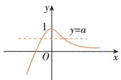

line

| x    | y     |
| ---- | ----- |
| 0    | 1     |
| >0   | 0     |

# 突破3 利用导数解决“恒成立”问题与“能成立”问题

① “恒成立”问题,要转化为最值问题来解决,“能成立”问题,要转化为有解问题来解决.在处理这类问题时,首先考虑分离参数.

(1) 若 $A < f(x)(A > f(x))$ 在区间 $D$ 上恒成立, 则等价于在区间 $D$ 上 $A < f(x)_{\min}(A > f(x)_{\max})$ .

(2) 若存在 $x \in D$ , 使得 $A < f(x) (A > f(x))$ 成立, 则等价于在区间 $D$ 上 $A < f(x)_{\max} (A > f(x)_{\min})$ . 如果不能分离参数或者参数分离后所形成的函数不易处理, 那么可以选择利用分类讨论求最值来处理.

② 对于“含有两个量词命题”的问题,例如:

(1) $\forall x_{1} \in D_{1}, \exists x_{2} \in D_{2}, f(x_{1}) = g(x_{2})$ ，若函数 $f(x)$ 的值域为 $C_{1}$ ，函数 $g(x)$ 的值域为 $C_{2}$ ，则该问题等价于 $C_{1} \subseteq C_{2}$ .  
(2) 若 $\forall x_{1} \in D_{1}, \forall x_{2} \in D_{2}$ , 都有 $f(x_{1}) \geqslant g(x_{2})$ 成立, 则可转化为 $f(x)_{\min} \geqslant g(x)_{\max}$ .  
(3) $\forall x_{1} \in D_{1}, \exists x_{2} \in D_{2}, f(x_{1}) > g(x_{2})$ ，可以采取分步转化的方法来处理。第一步先转化为 $\exists x_{2} \in D_{2}, f(x)_{\min} > g(x_{2})$ ，第二步再将该问题转化为 $f(x)_{\min} > g(x)_{\min}$ 。  
(4) 若 $\exists x_{1} \in D_{1}, \exists x_{2} \in D_{1}$ , 使得 $f(x_{1}) - f(x_{2}) \geqslant M$ 成立, 则可转化为 $M \leqslant f(x)_{\max} - f(x)_{\min}$ .

【例 13】已知 e 为自然对数的底数, 若对任意的 $x_{1} \in [0,1]$ , 总存在唯一的 $x_{2} \in [-1,1]$ , 使得 $2x_{1} + x_{2}^{2}e^{x_{2}} - a = 0$ 成立, 则实数 a 的取值范围是 ( )

A. $\left(1+\frac{1}{e},e\right]$

B. $\left[1+\frac{1}{e},e\right]$

C. $(1, \mathrm{e}]$

D. $\left(\frac{1}{e}+2,e\right]$

解析：∵ $2x_{1} + x_{2}^{2}e^{x_{2}} - a = 0$ , ∴ $x_{2}^{2}e^{x_{2}} = a - 2x_{1}$ .

设 $f(x)=a-2x,x\in[0,1]$ ,

则 $a - 2 \leqslant f(x) \leqslant a$ ，即 $f(x)$ 的值域为 $[a - 2, a]$ .

设 $g(x) = x^{2}\mathrm{e}^{x},x\in [-1,1]$ ，则 $g^{\prime}(x) = \mathrm{e}^{x}\cdot x\cdot (x + 2)$

∴ $g(x)$ 在 $[-1,0]$ 上单调递减，在 $[0,1]$ 上单调递增，且 $g(-1)=\frac{1}{e}, g(0)=0, g(1)=e.$ 函数 $y=g(x)$ 的图象如图所示.

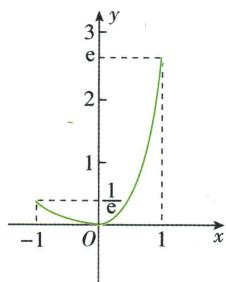

line

| x | y |
|---|---|
| -1 | 0.5 |
| 0 | 0 |
| 1 | 3 |

∵对任意的 $x_{1} \in [0,1]$ ，总存在唯一的 $x_{2} \in [-1,1]$ ，使得 $2x_{1} + x_{2}^{2}e^{x_{2}} - a = 0$ 成

对于“能成立”问题、“恒成立”问题、“含有两个量词命题”的问题,转化是一种重要的思维方法.

解决这类问题时，应该优先考虑分离参数法（数形结合法对客观题也要优先考虑），因为它可以避免对参数的分类讨论；另外，如果是涉及一次函数或二次函数的问题，有时利用它们本身的函数性质去解决问题；可能比分离参数法简单。是否用分离参数法，取决于分离后函数的复杂程度。

方程有唯一解的处理策略是“分离参数画图象”.

立, $\therefore\left[a-2,a\right]\subseteq\left(\frac{1}{e},e\right],\therefore\left\{\begin{aligned}a&\leqslant e,\\ a&-2>\frac{1}{e},\end{aligned}\right.$

解得 $\frac{1}{e}+2<a\leqslant e,\therefore$ 实数a的取值范围是 $\left(\frac{1}{e}+2,e\right]$ .

答案:D

# 本节与高考

导数是高中阶段研究函数的单调性、极值、最值、零点等的有力工具。在近几年的高考中，与导数有关的知识成为高考的重要内容，历年来受到命题者的青睐，是高考命题的重点和热点。在解答题中，导数常以压轴题的形式出现，重在考查学生的分类讨论思想、数形结合思想、转化与化归思想、函数与方程思想，考查学生的分析能力、运算求解能力，难度偏大，平时应多加练习。

# 单元高难问题 3: 导数的综合应用

# 难点1 构造函数解决不等式问题

对于一些用一般方法难以比较大小、证明或求解的不等式问题,可通过适当的变形,构造函数,将不等式问题转化为函数的最值问题,充分利用导数研究函数的单调性或最值,进而解答.

【例 1】 [全国乙理 2021·12,5 分] 设 $a=2\ln 1.01, b=\ln 1.02, c=\sqrt{1.04}-1$ ，则 （）

A. $a < b < c$

B. $b < c < a$

C. $b < a < c$

D. $c < a < b$

解析: $a = 2 \ln 1.01 = \ln 1.01^{2} = \ln 1.0201 > b$ .

令 $g(x)=\ln(1+x)-\sqrt{1+2x}+1$ , 则 b-c=g(0.02).

$$
g ^ {\prime} (x) = \frac {1}{1 + x} - \frac {1}{\sqrt {1 + 2 x}} = \frac {\sqrt {1 + 2 x} - (1 + x)}{(1 + x) \sqrt {1 + 2 x}},
$$

当 $x \geqslant 0$ 时, $1 + x = \sqrt{(1 + x)^2} \geqslant \sqrt{1 + 2x}$ ,

则 $g'(x) \leqslant 0, g(x)$ 在 $[0, +\infty)$ 上单调递减，则 $g(0.02) < g(0) = 0$ ，所以 b < c.

令 $f(x)=2\ln(1+x)-\sqrt{1+4x}+1$ ，则 $a-c=f(0.01)$ .

$f'(x)=\frac{2}{1+x}-\frac{2}{\sqrt{1+4x}}=2\cdot\frac{\sqrt{1+4x}-(1+x)}{(1+x)\sqrt{1+4x}}$ ，当 $0\leqslant x<2$ 时， $\sqrt{1+4x}\geqslant\sqrt{1+2x+x^{2}}=1+x$ ，则 $f'(x)\geqslant0,f(x)$ 在[0,2)上单调递增，所以 $f(0.01)>f(0)=0$ ，所以a>c.

综上，b<c<a. 故选 B.

答案:B

# 印象笔记

构造函数证明不等式的策略

(1) 转化为 $f(a) + g(a) \geqslant f(b) + g(b)$ 型: 寻找待证不等式的等价不等式, 把等价不等式转化为 $f(a) + g(a) \geqslant f(b) + g(b)$ 型, 观察此等价不等式左右两边的结构, 构造函数 $h(x) = f(x) + g(x)$ , 利用函数 $h(x)$ 的单调性证明不等式.

(2) 转化为 $f(x) \geqslant 0$ ( $\leqslant 0$ ) 型: 寻找待证不等式的等价不等式, 把不等式转化为 $f(x) \geqslant 0$ ( $\leqslant 0$ ) 型, 由此构造函数 $y = f(x)$ , 通过函数 $y = f(x)$ 的单调性和最值证明不等式.

【例 2】（多选）已知 a > b > 1, e 为自然对数的底数, 则下列不等式一定成立的是

A. $a\mathrm{e}^{a}>b\mathrm{e}^{b}$

B. $a \ln b > b \ln a$

C. $a \ln a > b \ln b$

D. $be^{a}>ae^{b}$

解析: 设 $f(x)=xe^{x}, x>1$ ，则 $f'(x)=(x+1)e^{x}>0$ 在 $(1,+\infty)$ 上恒成立，故函数 $f(x)$ 单调递增，则 $f(a)>f(b)$ ，即 $ae^{a}>be^{b}$ ，故 A 正确；

设 $g(x)=\frac{\ln x}{x}, x>1$ ，则 $g'(x)=\frac{1-\ln x}{x^{2}}$ ，易知函数 $g(x)$ 在 $(1, e)$ 上单调递增，在 $(e, +\infty)$ 上单调递减，故当 1<b<a<e 时， $g(a)>g(b)$ ，即 $\frac{\ln a}{a}>\frac{\ln b}{b}$ ，即 $a\ln b<b\ln a$ ，故 B 错误；

设 $h(x) = x\ln x, x > 1$ ，则 $h'(x) = \ln x + 1 > 0$ 在 $(1, +\infty)$ 上恒成立，故函数 $h(x)$ 单调递增，则 $h(a) > h(b)$ ，即 $a\ln a > b\ln b$ ，故 C 正确；

设 $k(x) = \frac{\mathrm{e}^x}{x}, x > 1$ ，则 $k'(x) = \frac{\mathrm{e}^x(x - 1)}{x^2} > 0$ 在 $(1, +\infty)$ 上恒成立，故函数 $k(x)$ 单调递增，因此 $k(a) > k(b)$ ，即 $\frac{\mathrm{e}^a}{a} > \frac{\mathrm{e}^b}{b}$ ，即 $b\mathrm{e}^a > a\mathrm{e}^b$ ，故D正确。故选ACD。

答案: ACD

【例3】(1) $f(x)$ 在R上的导函数为 $f'(x)$ ，且 $f'(x)>f(x)$ ，a>0(a为实数)，则下面的不等式成立的是()

A. $f(a) > \mathrm{e}^{a}f(0)$

B. $f(a) < \mathrm{e}^{a} f(0)$

C. $f(a) > f(0)$

D. $f(a) <   f(0)$

(2) 函数 $f(x)$ 的定义域为 R, $f(-1)=2$ , 对任意 $x \in \mathbf{R}, f'(x) > 2$ , 则 $f(x) > 2x + 4$ 的解集为 ( )

A. $(-1, 1)$

B. $(-1, +\infty)$

C. $(-∞,-1)$

D. $\mathbf{R}$

解析:(1)构造函数 $F(x)=\frac{f(x)}{\mathrm{e}^{x}}, x \in \mathbb{R}, F'(x)=\frac{f'(x)-f(x)}{\mathrm{e}^{x}}>0$ ，则 $F(x)$ 在 R 上单调递增。由 a>0 得 $F(a)>F(0)$ ，则 $\frac{f(a)}{\mathrm{e}^{a}}>\frac{f(0)}{\mathrm{e}^{0}}$ ，即 $f(a)>\mathrm{e}^{a}f(0)$ ，故选 A.

(2)构造函数 $F(x) = f(x) - 2x - 4, x \in \mathbf{R}$ ，则 $F'(x) = f'(x) - 2 > 2 - 2 = 0$ ，所以 $F(x)$ 在 $\mathbf{R}$ 上单调递增.

又因为 $F(-1) = f(-1) - 2 \times (-1) - 4 = 0$ ，所以 $f(x) > 2x + 4$ ，即 $f(x) - 2x - 4 > 0$ ，即 $F(x) > 0$ ，即 $F(x) > F(-1)$ ，所以 $x > -1$ ，故选B.

答案:(1)A (2)B

# 难点2 利用导数解决极值点偏移问题

利用导数解决极值点偏移问题中的类似于 $x_{1} + x_{2} > a$ 的问题的基本步骤

① 求导确定 $f(x)$ 的单调性, 得到 $x_{1}, x_{2}$ 的范围;

②构造函数 $F(x)=f(x)-f(a-x)$ ，求导后可得 $F(x)$ 恒正或恒负；

③ 得到 $f(x_{1})$ 与 $f(a-x_{1})$ 的大小关系, 将 $f(x_{1})$ 换为 $f(x_{2})$ ;

④ 根据 $x_{2}$ 与 $a - x_{1}$ 所处的范围, 结合 $f(x)$ 的单调性, 可得到 $x_{2}$ 与 $a - x_{1}$ 的大小关系, 由此证得结论.

观察式子的结构特征,构造适当的函数,是解决问题的关键.

# 二级结论 导数中构造函数的技巧

在借助函数单调性求解或者证明不等式、判断不等关系时,常需要构造新函数,研究新函数的单调性,从而求解.常用的构造技巧有:

(1) 对于条件 $f'(x) > k$ $(k \neq 0)$ ，可构造函数 $g(x)=f(x)-kx+b;$

(2) 对于条件 $xf'(x) + nf(x) > 0$ ，可构造函数 $g(x) = x^{n}f(x)$ ;

(3) 对于条件 $xf'(x) - nf(x) > 0$ ，可构造函数 $g(x)=\frac{f(x)}{x^{n}}(x\neq0)$ ;

(4) 对于条件 $f'(x) + kf(x) > 0$ ，可构造函数 $g(x)=\mathrm{e}^{kx}f(x)$ ;

(5)对于条件 $f'(x)-kf(x)>0$ ，可构造函数 $g(x)=\frac{f(x)}{\mathrm{e}^{kx}};$

(6) 对于条件 $f'(x)\tan x+f(x)>0,$ 可构造函数 $g(x)=f(x)\sin x;$

(7) 对于条件 $f'(x)\tan x-f(x)>0,$ 可构造函数 $g(x)=\frac{f(x)}{\sin x}(x\neq k\pi,k\in\mathbf{Z})$ ;

【例4】已知函数 $f(x) = x(1 - \ln x)$ .

(1) 讨论 $f(x)$ 的单调性;  
(2) 设 $a, b$ 为两个不相等的正数, 且 $b \ln a - a \ln b = a - b$ , 证明: $2 < \frac{1}{a} + \frac{1}{b} < e$ .

(1) 解: 由函数的解析式可得 $f'(x)=1-\ln x-1=-\ln x$ ,

∴ 当 $x \in (0,1)$ 时, $f'(x) > 0$ , $f(x)$ 单调递增;

当 $x \in (1, +\infty)$ 时, $f'(x) < 0$ , $f(x)$ 单调递减.

故 $f(x)$ 在 $(0,1)$ 上单调递增，在 $(1,+\infty)$ 上单调递减.

(2) 证明: 由 $b \ln a - a \ln b = a - b$ , 得 $-\frac{1}{a} \ln \frac{1}{a} + \frac{1}{b} \ln \frac{1}{b} = \frac{1}{b} - \frac{1}{a}$ ,

即 $\frac{1}{a}\left(1 - \ln \frac{1}{a}\right) = \frac{1}{b}\left(1 - \ln \frac{1}{b}\right)$ .

由(1)知 $f(x)$ 在 $(0,1)$ 上单调递增，在 $(1,+\infty)$ 上单调递减，

$$
\therefore f (x) _ {\max} = f (1) = 1, \text {且} f (\mathrm{e}) = 0.
$$

令 $x_{1} = \frac{1}{a}, x_{2} = \frac{1}{b}$ , 则 $x_{1}, x_{2}$ 为 $f(x) = k$ 的两个实数根, 其中 $k \in (0,1)$ .

不妨令 $x_{1} \in (0,1), x_{2} \in (1,\mathrm{e})$ ，则 $1 < 2 - x_{1} < 2$ .

先证 $2 < x_{1} + x_{2}$ ，即证 $x_{2} > 2 - x_{1}$ ，即证 $f(x_{2}) = f(x_{1}) < f(2 - x_{1})$

令 $h(x) = f(x) - f(2 - x), x \in (0,1)$ ，则 $h'(x) = -\ln x - \ln (2 - x) = -\ln [x(2 - x)] > 0$ ，故函数 $h(x)$ 单调递增， $\therefore h(x) < 0$ .

$\therefore f(x_{1}) <   f(2 - x_{1}),\therefore 2 <   x_{1} + x_{2}$ ，得证.

同理,要证 $x_{1}+x_{2}<e$ , 即证 $f(x_{2})=f(x_{1})>f(e-x_{1})$ .

令 $\varphi(x)=f(x)-f(\mathrm{e}-x)$ , $x\in(0,1)$ ,

则 $\varphi'(x) = -\ln[x(e-x)]$ ，令 $\varphi'(x_{0}) = 0$ ，

当 $x \in (0, x_{0})$ 时， $\varphi'(x) > 0, \varphi(x)$ 单调递增；

当 $x \in (x_0, 1)$ 时， $\varphi'(x) < 0, \varphi(x)$ 单调递减，

又当 $0 < x < \mathrm{e}$ 时， $f(x) > 0$ ，且 $f(\mathrm{e}) = 0, f(x)_{\max} = f(1)$ ，

故当 $x \to 0$ 时, $\varphi(0) > 0$ , $\varphi(1) = f(1) - f(e-1) > 0$ , $\therefore \varphi(x) > 0$ 恒成立,

$\therefore f(x) > f(e - x)$ 恒成立， $\therefore x_{1} + x_{2} <   e$ 得证.故 $2 <   \frac{1}{a} +\frac{1}{b} <  e$ 成立

【例5】已知函数 $f(x) = \ln x - ax^2 + (2 - a)x$ .

(1) 讨论 $f(x)$ 的单调性;  
(2) 设 $a > 0$ , 证明: 当 $0 < x < \frac{1}{a}$ 时, $f\left(\frac{1}{a} + x\right) > f\left(\frac{1}{a} - x\right)$ ;  
(3) 若函数 $y = f(x)$ 的图象与 $x$ 轴相交于 $A, B$ 两点, 线段 $AB$ 中点的横坐标为 $x_0$ , 证明: $f'(x_0) < 0$ .

# 印象笔记

(8) 对于条件 $f'(x) - f(x) \tan x > 0$ ，可构造函数 $g(x) = f(x) \cos x$ ;  
(9) 对于条件 $f'(x) + f(x) \tan x > 0$ ，可构造
函数 $g(x)=\frac{f(x)}{\cos x}$

$$
\left(x \neq \frac {\pi}{2} + k \pi , k \in \mathbf {Z}\right);
$$

(10) 对于条件 $f'(x) + f(x) \ln a > 0$ , 可构造函数 $g(x) = a^{x} f(x)$ ;  
(11) 对于条件 $f'(x)\ln x+\frac{f(x)}{x}>0,$ 可构造函数 $g(x)=f(x)\ln x;$   
(12) 对于条件 $\frac{f'(x)}{f(x)}>0$ , 可构造函数 $g(x)=\ln[f(x)]$ $(f(x)>0)$ 或 $g(x)=\ln[-f(x)](f(x)<0)$ .

(1) 利用同构关系将原问题转化为极值点偏移的问题.

(2) 构造对称差函数分别证明左右两侧的不等式.

(1) 解: 依题意, 函数 $f(x)$ 的定义域为 $(0, +\infty), f'(x) = \frac{1}{x} - 2ax + 2 - a = -\frac{(ax - 1)(2x + 1)}{x}$ .

当 $a \leqslant 0$ 时, $f'(x) > 0$ , 所以函数 $f(x)$ 在区间 $(0, +\infty)$ 上单调递增;

当 $a > 0$ 时，令 $f^{\prime}(x) = 0$ ，得 $x = \frac{1}{a}$ 则在区间 $\left(0, \frac{1}{a}\right)$ 上， $f^{\prime}(x) > 0$ ，函数 $f(x)$ 单调递增，在区间 $\left(\frac{1}{a}, +\infty\right)$ 上， $f^{\prime}(x) < 0$ ，函数 $f(x)$ 单调递减.

(2) 证明: 设 $h(x) = f\left(\frac{1}{a} + x\right) - f\left(\frac{1}{a} - x\right)$ , 则 $h(x) = \ln (1 + ax) - \ln (1 - ax) - 2ax$ ,

由 $h'(x)=\frac{a}{1+ax}+\frac{a}{1-ax}-2a=\frac{2a^{3}x^{2}}{1-a^{2}x^{2}}$ ，由于 $0<x<\frac{1}{a}$ ，且 a>0，故 $h'(x)>0$ ，函数 $h(x)$ 在 $\left(0,\frac{1}{a}\right)$ 上单调递增，所以 $h(x)>h(0)=f\left(\frac{1}{a}+0\right)-f\left(\frac{1}{a}-0\right)=0$ ，从而 $f\left(\frac{1}{a}+x\right)>f\left(\frac{1}{a}-x\right)$ .

(3) 证明: 在(1)中可知 $a \leqslant 0$ 时, 函数 $f(x)$ 至多有一个零点, 因此 $a > 0$ 满足题意, 此时函数 $f(x)$ 的极值也是最值, 从而应有 $f(x)_{\max} = f\left(\frac{1}{a}\right) > 0$ .

不妨设 A, B 两点的横坐标为 $x_{1}, x_{2}$ ，且 $0 < x_{1} < x_{2}$ ，则依题意有 $0 < x_{1} < \frac{1}{a} < x_{2}$ ，从而 $0 < \frac{1}{a} - x_{1} < \frac{1}{a} < \frac{2}{a} - x_{1}$ .

由(2)可得 $f\left(\frac{2}{a}-x_{1}\right)=f\left(\frac{1}{a}+\left(\frac{1}{a}-x_{1}\right)\right)>f\left(\frac{1}{a}-\left(\frac{1}{a}-x_{1}\right)\right)=f(x_{1})$

注意到 $f(x_{1})=f(x_{2})=0$ ，则有 $f\left(\frac{2}{a}-x_{1}\right)>f(x_{2})$ .

又 $x_{2}, \frac{2}{a} - x_{1} \in \left(\frac{1}{a}, +\infty\right)$ , 则由 (1) 知 $\frac{2}{a} - x_{1} < x_{2}$ , 于是 $x_{0} = \frac{x_{1} + x_{2}}{2} > \frac{1}{a}$ , 从而 $f'(x_{0}) < 0$ .

# 难点3 利用导数解决双变量问题

在处理双变量问题时,我们通常分析变量之间的联系,通过“消元” “减元”“换元”“整体代换”等方法将其转化为单变量的问题,从而将较为复杂的函数转化为一个简单的函数来处理,实现从未知向已知的转化,顺利解决问题.

【例6】已知函数 $f(x) = \frac{1}{x} - x + a\ln x$ .

(1) 讨论 $f(x)$ 的单调性；

(2) 若 $f(x)$ 存在两个极值点 $x_{1}, x_{2}$ ，证明： $\frac{f(x_{1}) - f(x_{2})}{x_{1} - x_{2}} < a - 2$ .

本题第(3)问本质上是证明 $x_0 = \frac{x_1 + x_2}{2} >\frac{1}{a}$

导数中双变量转化为单变量的解题思路

思路一: 当题目中给出或隐含两个变量的等量关系, 则可以通过这个等量关系进行代换消元, 从而转化为一个变量;

思路二: 当题目中两个变量不存在等量关系, 但可以通过等价变形将两个变量化为类似 $x_{1} + x_{2}, x_{1} - x_{2}$ ,

$x_{1}x_{2},\frac{x_{1}}{x_{2}}$ 这种整体结构,从而可以把双变量进行合二为一,转化为单变量问题.

(1) 解: $f(x)$ 的定义域为 $(0, +\infty)$ , $f'(x) = -\frac{1}{x^{2}} - 1 + \frac{a}{x} = -\frac{x^{2} - ax + 1}{x^{2}}$ .

①若 $a \leqslant 2$ ，则 $f'(x) \leqslant 0$ ，当且仅当 $a = 2, x = 1$ 时， $f'(x) = 0$ ，所以 $f(x)$ 在 $(0, +\infty)$ 上单调递减.

②若 a>2，令 $f'(x)=0$ 得 $x=\frac{a-\sqrt{a^{2}-4}}{2}$ 或 $x=\frac{a+\sqrt{a^{2}-4}}{2}$ .

当 $x \in \left(0, \frac{a - \sqrt{a^2 - 4}}{2}\right) \cup \left(\frac{a + \sqrt{a^2 - 4}}{2}, +\infty\right)$ 时， $f'(x) < 0$

当 $x \in \left(\frac{a - \sqrt{a^2 - 4}}{2}, \frac{a + \sqrt{a^2 - 4}}{2}\right)$ 时, $f'(x) > 0$ ,

所以 $f(x)$ 在 $\left(0, \frac{a - \sqrt{a^2 - 4}}{2}\right), \left(\frac{a + \sqrt{a^2 - 4}}{2}, +\infty\right)$ 上单调递减，在 $\left(\frac{a - \sqrt{a^2 - 4}}{2}, \frac{a + \sqrt{a^2 - 4}}{2}\right)$ 上单调递增.

(2) 证明: 由(1)知, $f(x)$ 存在两个极值点时 $a > 2$ .

因为 $f(x)$ 的两个极值点 $x_{1}, x_{2}$ 满足 $x^{2}-ax+1=0$ ，所以 $x_{1}x_{2}=1$ ，不妨设 $x_{1}<x_{2}$ ，则 $x_{2}>1$ .

因为 $\frac{f(x_1) - f(x_2)}{x_1 - x_2} = -\frac{1}{x_1x_2} - 1 + a\frac{\ln x_1 - \ln x_2}{x_1 - x_2} = -2 + a\frac{\ln x_1 - \ln x_2}{x_1 - x_2} = -2 + a\frac{-2\ln x_2}{\frac{1}{x_2} - x_2},$ 所以 $\frac{f(x_1) - f(x_2)}{x_1 - x_2} < a - 2$ 等价于 $\frac{1}{x_2} - x_2 + 2\ln x_2 < 0.$

设函数 $g(x) = \frac{1}{x} - x + 2\ln x$ ，由(1)知， $g(x)$ 在 $(0, +\infty)$ 上单调递减，又 $g(1) = 0$ ，从而当 $x \in (1, +\infty)$ 时， $g(x) < 0$ 。

所以 $\frac{1}{x_2} - x_2 + 2\ln x_2 < 0$ ，即 $\frac{f(x_1) - f(x_2)}{x_1 - x_2} < a - 2$ 成立.

【例 7】已知函数 $f(x)=x^{3}+k\ln x(k\in\mathbf{R})$ , $f'(x)$ 为 $f(x)$ 的导函数.

(1) 当 k=6 时，

(i) 求曲线 $y=f(x)$ 在点 $(1, f(1))$ 处的切线方程；

(ii) 求函数 $g(x) = f(x) - f'(x) + \frac{9}{x}$ 的单调区间和极值.

(2) 当 $k \geqslant -3$ 时, 求证: 对任意的 $x_{1}, x_{2} \in [1, +\infty)$ , 且 $x_{1} > x_{2}$ , 有 $\frac{f'(x_1) + f'(x_2)}{2} > \frac{f(x_1) - f(x_2)}{x_1 - x_2}$ .

(1) (i) 解: 当 k=6 时, $f(x)=x^{3}+6\ln x$ , $f'(x)=3x^{2}+\frac{6}{x}$ , 可得 $f(1)=1$ , $f'(1)=9$ , 所以曲线 $y=f(x)$ 在点 $(1,f(1))$ 处的切线方程为 $y-1=9(x-1)$ , 即 y=9x-8.

本题第(2)问求解时先利用一元二次方程根与系数的关系,找到两个变量的联系,将两个变量消元为一个变量后再求解.

与函数单调性有关的双变量问题

此类问题一般是给出含有 $x_{1}, x_{2}, f(x_{1}), f(x_{2})$ 的不等式，若能通过变形，把不等式两边转化为同源函数，利用函数单调性构造单调函数，再利用导数求解或者将不等式进行等价转化后构造函数，利用导数得函数的单调性、极值等性质求解.

(ii) 解: 依题意, $g(x)=x^{3}-3x^{2}+6\ln x+\frac{3}{x}, x \in (0,+\infty)$ .

从而可得 $g'(x)=3x^{2}-6x+\frac{6}{x}-\frac{3}{x^{2}}$ ，整理可得 $g'(x)=\frac{3(x-1)^{3}(x+1)}{x^{2}}$ ,

令 $g'(x)=0$ , 解得 x=1.

当 x 变化时, $g'(x)$ , $g(x)$ 的变化情况如表所示.

<table><tr><td>x</td><td>(0,1)</td><td>1</td><td>(1,+∞)</td></tr><tr><td>g&#x27;(x)</td><td>-</td><td>0</td><td>+</td></tr><tr><td>g(x)</td><td>单调递减</td><td>极小值</td><td>单调递增</td></tr></table>

所以函数 $g(x)$ 的单调递减区间为 $(0,1)$ ，单调递增区间为 $(1,+\infty)$ ; $g(x)$ 的极小值为 $g(1)=1$ ，无极大值.

(2) 证明: 由 $f(x) = x^3 + k \ln x$ , 得 $f'(x) = 3x^2 + \frac{k}{x}$ .

对任意的 $x_{1}, x_{2} \in [1, +\infty)$ ，且 $x_{1} > x_{2}$ ，令 $\frac{x_1}{x_2} = t(t > 1)$ ，则

$$
\begin{array}{l} \left(x _ {1} - x _ {2}\right) \left[ f ^ {\prime} \left(x _ {1}\right) + f ^ {\prime} \left(x _ {2}\right) \right] - 2 \left[ f \left(x _ {1}\right) - f \left(x _ {2}\right) \right] \\ = \left(x _ {1} - x _ {2}\right) \left(3 x _ {1} ^ {2} + \frac {k}{x _ {1}} + 3 x _ {2} ^ {2} + \frac {k}{x _ {2}}\right) - 2 \left(x _ {1} ^ {3} - x _ {2} ^ {3} + k \ln \frac {x _ {1}}{x _ {2}}\right) \\ = x _ {1} ^ {3} - x _ {2} ^ {3} - 3 x _ {1} ^ {2} x _ {2} + 3 x _ {1} x _ {2} ^ {2} + k \left(\frac {x _ {1}}{x _ {2}} - \frac {x _ {2}}{x _ {1}}\right) - 2 k \ln \frac {x _ {1}}{x _ {2}} \\ = x _ {2} ^ {3} \left(t ^ {3} - 3 t ^ {2} + 3 t - 1\right) + k \left(t - \frac {1}{t} - 2 \ln t\right). \tag {①} \\ \end{array}
$$

令 $h(x) = x - \frac{1}{x} - 2\ln x, x \in [1, +\infty)$ .

当 $x > 1$ 时， $h'(x) = 1 + \frac{1}{x^2} - \frac{2}{x} = \left(1 - \frac{1}{x}\right)^2 > 0$ ，由此可得 $h(x)$ 在 $(1, +\infty)$ 上单调递增，所以当 $t > 1$ 时， $h(t) > h(1)$ ，即 $t - \frac{1}{t} - 2\ln t > 0$ .

因为 $x_{2} \geqslant 1, t^{3} - 3t^{2} + 3t - 1 = (t - 1)^{3} > 0, k \geqslant -3$ ，所以 $x_{2}^{3}(t^{3} - 3t^{2} + 3t - 1) + k\left(t - \frac{1}{t} - 2\ln t\right) \geqslant t^{3} - 3t^{2} + 3t - 1 - 3\left(t - \frac{1}{t} - 2\ln t\right) = t^{3} - 3t^{2} + 6\ln t + \frac{3}{t} - 1.$ ②

由(1)(ii)可知,当t>1时, $g(t)>g(1)$ ,即 $t^{3}-3t^{2}+6\ln t+\frac{3}{t}>1$ ,

故 $t^3 - 3t^2 + 6\ln t + \frac{3}{t} - 1 > 0.$ ③

由①②③可得 $(x_{1}-x_{2})\left[f'(x_{1})+f'(x_{2})\right]-2\left[f(x_{1})-f(x_{2})\right]>0.$ 所以当 $k\geqslant-3$ 时，对任意的 $x_{1},x_{2}\in[1,+\infty)$ ，且 $x_{1}>x_{2}$ ，有 $\frac{f'(x_{1})+f'(x_{2})}{2}>\frac{f(x_{1})-f(x_{2})}{x_{1}-x_{2}}.$

令 $\frac{x_{1}}{x_{2}}=t$ ，通过换元，将原问题中两个变量的问题转化为与一个变量t有关的式子，然后构造新函数，利用新函数的性质证得题中的结论.

# 常用的转化技巧

(1) 比值代换: 假设 $\frac{x_{1}}{x_{2}}=t\Rightarrow x_{1}=tx_{2};$

(2) 对数减法: $\ln x_{1}-$ $\ln x_{2}=\ln\frac{x_{1}}{x_{2}};$

(3) 齐次分式：

$$
\frac {x _ {1} - x _ {2}}{x _ {1} + x _ {2}} = \frac {\frac {x _ {1}}{x _ {2}} - 1}{\frac {x _ {1}}{x _ {2}} + 1},
$$

$$
\frac {x _ {1} ^ {2} - x _ {2} ^ {2}}{x _ {1} x _ {2}} = \frac {\left(\frac {x _ {1}}{x _ {2}}\right) ^ {2} - 1}{\frac {x _ {1}}{x _ {2}}} \text {等}.
$$

# 难点4 导数中的指对同构问题

如果函数结构中同时包含指数式和对数式,通过适当的指对变形、配凑、调整不等式结构,同构为同一个函数,利用同构函数的单调性,把复杂的不等式转化为简单的不等式,问题将会迎刃而解.

# 指对同构的三种基本模型

① 积型: $ae^{a}<b\ln b \Rightarrow \left\{\begin{aligned}ae^{a}<(\ln b)e^{\ln b}, & \text{设 } f(x)=xe^{x}; \\ e^{a}\ln e^{a}<b\ln b, & \text{设 } f(x)=x\ln x; \\ a+\ln a<\ln b+\ln(\ln b)(a>0 \text{ 且 } b>1), & \text{设 } f(x)=x+\ln x.\end{aligned}\right.$   
② 商型: $\frac{\mathrm{e}^a}{a} < \frac{b}{\ln b} \Rightarrow \begin{cases} \frac{\mathrm{e}^a}{a} < \frac{\mathrm{e}^{\ln b}}{\ln b}, & \text{设 } f(x) = \frac{\mathrm{e}^x}{x}; \\ \frac{\mathrm{e}^a}{\ln \mathrm{e}^a} < \frac{b}{\ln b}, & \text{设 } f(x) = \frac{x}{\ln x}; \\ a - \ln a < \ln b - \ln (\ln b) (a > 0 \text{ 且 } b > 1), & \text{设 } f(x) = x - \ln x. \end{cases}$   
③ 和差型: $e^{a} \pm a > b \pm \ln b \Rightarrow \left\{\begin{aligned} e^{a} \pm a & > e^{\ln b} \pm \ln b, \\ e^{a} \pm \ln e^{a} & > b \pm \ln b, \end{aligned}\right.$ 设 $f(x) = e^{x} \pm x;$

【例8】已知函数 $f(x) = ae^{x - 1} - \ln x + \ln a$ .

(1) 当 a=e 时, 求曲线 $y=f(x)$ 在点 $(1,f(1))$ 处的切线与两坐标轴围成的三角形的面积;  
(2) 若 $f(x) \geqslant 1$ , 求实数 a 的取值范围.

解:(1)∵当a=e时, $f(x)=\mathrm{e}^{x}-\ln x+1,\therefore f'(x)=\mathrm{e}^{x}-\frac{1}{x},\therefore f'(1)=\mathrm{e}-1.$

$f(1)=\mathrm{e}+1,\therefore$ 切点坐标为 $(1,1+\mathrm{e})$ ,

∴ 曲线 $y=f(x)$ 在点 $(1,f(1))$ 处的切线方程为 $y-\mathrm{e}-1=(\mathrm{e}-1)(x-1)$ ，即 $y=(\mathrm{e}-1)x+2$ ，∴ 切线与两坐标轴的交点坐标分别为 $(0,2)$ ， $\left(\frac{-2}{\mathrm{e}-1},0\right)$ ，

∴ 所求三角形的面积为 $\frac{1}{2} \times 2 \times \left| \frac{-2}{e-1} \right| = \frac{2}{e-1}$ .

(2) $f(x)=ae^{x-1}-\ln x+\ln a=e^{\ln a+x-1}-\ln x+\ln a\geqslant1$ 等价于 $e^{\ln a+x-1}+\ln a+x-1\geqslant\ln x+x=e^{\ln x}+\ln x.$

令 $g(x)=\mathrm{e}^{x}+x$ , 上述不等式等价于 $g(\ln a+x-1)\geqslant g(\ln x)$ .

显然 $g(x)$ 为增函数， $\therefore \ln a + x - 1 \geqslant \ln x$ ，即 $\ln a \geqslant \ln x - x + 1$ .

令 $h(x)=\ln x-x+1$ , 则 $h'(x)=\frac{1}{x}-1=\frac{1-x}{x}$

易知在 $(0,1)$ 上， $h'(x)>0,h(x)$ 单调递增，

在 $(1,+\infty)$ 上, $h'(x)<0,h(x)$ 单调递减,

$$
\therefore h (x) _ {\max} = h (1) = 0,
$$

∴ $\ln a \geqslant 0$ , 即 $a \geqslant 1$ , ∴ 实数 a 的取值范围是 $[1, +\infty)$ .

# 印象笔记

同构式是指除了变量不同,其余均相同的表达式.

(1) 同构式在方程中的应用: 若方程 $f(a)=0$ 和 $f(b)=0$ 呈现同构特征, 则 a, b 可视为方程 $f(x)=0$ 的两个根.  
(2) 同构式在不等式中的应用: 若不等式的两侧呈现同构特征, 则可将相同的结构构造为一个函数, 进而和函数的单调性进行联系, 可比较大小或解不等式.

# 有关指对数的运算的恒等式

(1) 当 a > 0 且 $a \neq 1$ 时,有 $a^{\log_{a}x}=x(x>0)$ .  
(2) 当 a > 0 且 $a \neq 1$ 时,有 $\log_{a}a^{x}=x.$

再结合指数运算和对数运算的法则,可以得到下述结论(其中x>0):

$$
\begin{array}{l} (3) x \mathrm{e} ^ {x} = \mathrm{e} ^ {x + \ln x}; \\ x + \ln x = \ln (x e ^ {x}). \\ \end{array}
$$

$$
(4) \frac {\mathrm{e} ^ {x}}{x} = \mathrm{e} ^ {x - \ln x};
$$

$$
x - \ln x = \ln \frac {\mathrm{e} ^ {x}}{x}.
$$

$$
(5) x ^ {2} \mathrm{e} ^ {x} = \mathrm{e} ^ {x + 2 \ln x};
$$

$$
x + 2 \ln x = \ln \left(x ^ {2} \mathrm{e} ^ {x}\right).
$$

$$
(6) \frac {\mathrm{e} ^ {x}}{x ^ {2}} = \mathrm{e} ^ {x - 2 \ln x};
$$

$$
x - 2 \ln x = \ln \frac {\mathrm{e} ^ {x}}{x ^ {2}}.
$$

text_image

遇见，在人生紧要处

natural_image

Illustration of a desert landscape with animals, trees, and a red archway, featuring a large green circular overlay (no text or symbols)

有些鸟儿是注定不会被关在牢笼里的，它们的每一片羽毛都闪耀着自由的光辉

# 扫码获取更多学习资源

# “理想树图书”配套服务专属App

text_image

QR code image with green border, containing encoded data for scanning

- 扫码领取 -

# 包学习——学法资源库与AI学练提分平台

# 动书

# 原创动态教辅

各年级全科目600+动书，让知识动起来。知识不仅能读，还能观看，更可互动，让知识不再难懂。

# 一同学

# 真人原声视频

针对学习中的疑点、难点、常考点、专项突破点，提供分层级、分学习阶段的学力提升微视频、长视频。

# 学法

# 学科学习方法

汇总各学科日常学习与考试内容，知识总结与学法提炼。涨知识、扩视野、提能力。

# AI提分

# 个性学诊提分

为同学提供个性化的测试，收录错题错因，AI诊断学业水平、学习力，提供学习策略，一人一案。

natural_image

Cartoon illustration of a green backpack character with arms pointing (no text or symbols)

text_image

源库与AI学练提分平台
推荐 作文 学法 一同学 动书
年级 ▲ ○请输入搜索内容
三
推荐 作文 学法 一同学 动书
包学习 学习资源免费拿
指导视频766题
AI改作文 自测作业 学伴答疑 论学社区 活动公告
包头条 作文知识 每日一题 | 英语七大题型有哪…
动书 新学期抽奖活动，好运转转转
AI学诊
数学 物理 化学 生物 语文 英语
自选综合 单元完控 开始测诊
期中提分

