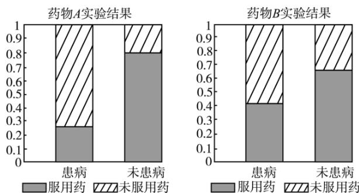
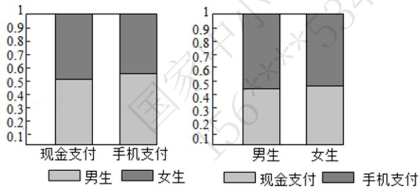
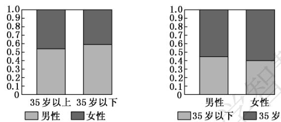

### 高中 数学 必修 第二册第七章 复数 7.2 复数的四则运算
### 一、单选题（共7题）
1. 【单选题】某工科院校对A、B两个专业的男、女生人数进行调查统计，得到以下表格：
<table><tr><td></td><td>专业A</td><td>专业B</td><td>合计</td></tr><tr><td>女生</td><td>12</td><td></td><td></td></tr><tr><td>男生</td><td></td><td>46</td><td>84</td></tr><tr><td>合计</td><td>50</td><td></td><td>100</td></tr></table>
如果认为工科院校中“性别”与“专业”有关，那么犯错误的概率不会超过（ ）
注：  $\chi^{2} = \frac{n(ad - bc)^{2}}{(a + b)(c + d)(a + c)(b + d)}$
<table><tr><td>P(χ²≥xa)</td><td>0.100</td><td>0.050</td><td>0.025</td><td>0.010</td><td>0.005</td></tr><tr><td>x a</td><td>2.706</td><td>3.841</td><td>5.024</td><td>6.635</td><td>7.879</td></tr></table>
$\quad$A.0.005
$\quad$B.0.01
$\quad$C.0.025
$\quad$D.0.05
2. 【单选题】某村庄对该村内50名老年人、年轻人每年是否体检的情况进行了调查，统计数据如表所示：
<table><tr><td></td><td>每年体检</td><td>每年未体检</td><td>合计</td></tr><tr><td>老年人</td><td>a</td><td>7</td><td>c</td></tr><tr><td>年轻人</td><td>6</td><td>b</td><td>d</td></tr><tr><td>合计</td><td>e</td><td>f</td><td>50</td></tr></table>
已知抽取的老年人、年轻人各25名，则对列联表数据的分析错误的是（）
$\quad$A.  $a = 18$
$\quad$B.  $b = 19$  
$\quad$C.  $c + d = 50$  
$\quad$D.  $e - f = 2$
3. 【单选题】有两个分类变量  $X$  ，  $Y$  ，其列联表如下所示，
<table><tr><td></td><td>Y1</td><td>Y2</td></tr><tr><td>X1</td><td>a</td><td>20 - a</td></tr><tr><td>X2</td><td>15 - a</td><td>30 + a</td></tr></table>
其中  $a$  ，15- a均为大于5的整数，若在犯错误的概率不超过0.05的前提下认为  $X$  ，Y有关，则a的值为（ ）
附：  $\chi^2 = \frac{n(ad - bc)^2}{(a + b)(c + d)(a + c)(b + d)}$  其中  $n = a + b + c + d$
<table><tr><td>P(χ²≥xa)</td><td>0.100</td><td>0.050</td><td>0.010</td><td>0.001</td></tr><tr><td>xa</td><td>2.706</td><td>3.841</td><td>6.635</td><td>10.828</td></tr></table>
$\quad$A.8 
$\quad$B.9 
$\quad$C.8或9 
$\quad$D.6或8
4. 【单选题】为考查A，B
两种药物预防某疾病的效果，进行动物实验，分别得到如下等高条形图：根据图中信息，在下列各项中，说法最佳的一项是（ ）

$\quad$A.药物B的预防效果优于药物A的预防效果
$\quad$B.药物A的预防效果优于药物B的预防效果
$\quad$C.药物A，  $B$  对该疾病均有显著的预防效果
$\quad$D.药物A，  $B$  对该疾病均没有预防效果
5. 【单选题】假设有两个分类变量  $X$  与  $Y$  ，它们的可能取值分别为  $\{x_{1},x_{2}\}$  和  $\{y_{1},y_{2}\}$  其  $2\times 2$  列联表为：
<table><tr><td></td><td>y1</td><td>y2</td></tr><tr><td>x1</td><td>10</td><td>18</td></tr><tr><td>x2</td><td>m</td><td>26</td></tr></table>
则当m取下面何值时，  $X$  与Y的关系最弱（
$\quad$A.8 
$\quad$B.9 
$\quad$C.14 
$\quad$D.19
6. 【单选题】为了解高校学生使用手机支付和现金支付的情况，抽取了部分学生作为样本，统计其喜欢的支付方式，并制作出如下等高条形图：

根据图中的信息，下列结论中不正确的是（
$\quad$A.样本中的男生数量多于女生数量
$\quad$B.样本中喜欢手机支付的数量多余现金支付的数量
$\quad$C.样本中多数男生喜欢手机支付
$\quad$D.样本中多数女生喜欢手机支付
7. 【单选题】在调查中发现480名男人中有38名患有色盲，520名女人中有6名患有色盲。下列说法正确的是（ ）
$\quad$A.男人、女人中患色盲的频率分别为0.038.0.006
$\quad$B. 男、女患色盲的概率分别为  $\frac{19}{240}$ ,  $\frac{3}{260}$ 
$\quad$C. 男人中患色盲的比例比女人中患色盲的比例大, 患色盲与性别是有关的
$\quad$D. 不能说明患色盲与性别是否有关
### 二、多选题（共3题）
8. 【多选题】(多选)为了解阅读量多少与幸福感强弱之间的关系, 一个调查机构根据所得到的数据, 绘制了如下的  $2 \times 2$  列联表 (个别数据暂用字母表示):
<table><tr><td></td><td>幸福感强</td><td>幸福感弱</td><td>总计</td></tr><tr><td>阅读量多</td><td>m</td><td>18</td><td>72</td></tr><tr><td>阅读量少</td><td>36</td><td>n</td><td>78</td></tr><tr><td>总计</td><td>90</td><td>60</td><td>150</td></tr></table>
计算得:  $\chi^{2} \approx 12.981$ , 参照下表:
<table><tr><td>P(χ²≥xa)</td><td>0.100</td><td>0.050</td><td>0.025</td><td>0.010</td><td>0.005</td></tr><tr><td>xα</td><td>2.706</td><td>3.841</td><td>5.024</td><td>6.635</td><td>7.879</td></tr></table>
对于下面的选项, 正确的为 ( )
$\quad$A. 根据小概率值  $\alpha = 0.010$  的独立性检验, 可以认为"阅读量多少与幸福感强弱无关"
$\quad$B.  $m = 52$
$\quad$C.根据小概率值  $\alpha = 0.005$
的独立性检验, 可以在犯错误的概率不超过  $0.5\%$  的前提下认为"阅读量多少与幸福感强弱有关"
$\quad$D.  $n = 42$
9. 【多选题】(多选)某机构通过抽样调查, 利用列联表和  $\chi^{2}$
统计量研究秃顶与患心脏病是否有关时, 零假设为  $H_{0}$
; 秃顶与患心脏病无关, 经查对临界值表知  $P(\chi^{2} \geq 2.706) \approx 0.1, P(\chi^{2} \geq 3.841) \approx 0.05$
,下列说法正确的是(
$\quad$A.若  $\chi^2 = 3.503$  ，当小概率值  $\alpha = 0.1$  时，推断  $H_{0}$  不成立，即认为“秃顶与患心脏病有关联”
$\quad$B.若  $\chi^2 = 3.503$  ，当小概率值  $\alpha = 0.05$  时，推断  $H_{0}$  不成立，即认为“秃顶与患心脏病有关联”
$\quad$C.若当小概率值  $\alpha = 0.05$  时推断  $H_{0}$  不成立，即认为“秃顶与患心脏病有关联”，是说某人秃顶，那么他有  $95\%$  的可能性患心脏病
$\quad$D.若当小概率值  $\alpha = 0.1$  时推断  $H_{0}$  不成立，是指在犯错误的概率不大于0.1的前提下，认为“秃顶与患心脏病有关联”
10. 【多选题】(多选)
2018年12月1日，贵阳市地铁1号线全线开通，在一定程度上缓解了市内交通的拥堵状况．为了了解市民对地铁1号线开通的关注情况，某调查机构在地铁开通后的某两天抽取了部分乘坐地铁的市民作为样本，分析其年龄和性别结构，并制作出如下等高条形图：

根据图中(35岁以上含35岁)的信息，下列结论中一定正确的是（
$\quad$A.样本中男性比女性更关注地铁1号线全线开通
$\quad$B.样本中多数女性是35岁以上
$\quad$C.样本中35岁以下的男性人数比35岁以上的女性人数多
$\quad$D.样本中35岁以上的人对地铁1号线的开通关注度更高
### 三、填空题（共2题）
11. 【填空题】某大学为了解喜欢看篮球赛是否与性别有关，随机调查了部分学生，在被调查的学生中，男生人数是女生人数的2倍，男生喜欢看篮球赛的人数占男生人数的  $\frac{5}{6}$ ，女生喜欢看篮球赛的人数占女生人数的  $\frac{1}{3}$ 。若被调查的男生人数为  $n$ ，在犯错误的概率不超过0.05的前提下认为喜欢看篮球赛与性别有关，则  $n$  的最小值为____。
附：  $\chi^2 = \frac{n(ad - bc)^2}{(a + b)(c + d)(a + c)(b + d)}$  其中  $n = a + b + c + d$
<table><tr><td>P(χ²≥xa)</td><td>0.100</td><td>0.050</td><td>0.010</td><td>0.001</td></tr><tr><td>x a</td><td>2.706</td><td>3.841</td><td>6.635</td><td>10.828</td></tr></table>
12. 【填空题】在吸烟与患肺病是否相关的判断中，有下面的说法：
$①$  若  $\chi^2\geq 6.635$
，则在犯错误的概率不超过0.01的前提下，认为吸烟与患肺病有关系，那么在100个吸烟的人中必有99人患有肺病；
$(2)$  从独立性检验可知在犯错误的概率不超过0.01的前提下，认为吸烟与患肺病有关系，若某人吸烟，则他有  $99\%$  的可能患有肺病；
$(3)$  从独立性检验可知在犯错误的概率不超过0.05的前提下，认为吸烟与患肺病有关系时，是指有  $5\%$  的可能性使得推断错误.
其中说法正确的是
### 四、复合题（共3题）
13. 【复合题】为研究患肺癌与是否吸烟有关，做了一次相关调查，其中部分数据丢失，但可以确定的是不吸烟人数与吸烟人数相同，吸烟患肺癌人数占吸烟总人数的  $\frac{4}{5}$ ；不吸烟的人数中，患肺癌与不患肺癌的比为1:4.
（1）【问答题】若吸烟不患肺癌的有4人，现从患肺癌的人中用分层抽样的方法抽取5人，再从这5人中随机抽取2人进行调查，求这两人都是吸烟患肺癌的概率；
(2）【问答题】在（1）的前提条件下，能不能在犯错误概率不超过0.001的前提下，认为患肺癌与吸烟有关？
附：  $\chi^2 = \frac{n(ad\cdot bc)^2}{(a + b)(c + d)(a + c)(b + d)}$  其中  $n = a + b + c + d$
<table><tr><td>P(χ²≥xa)</td><td>0.100</td><td>0.050</td><td>0.010</td><td>0.001</td></tr><tr><td>x a</td><td>2.706</td><td>3.841</td><td>6.635</td><td>10.828</td></tr></table>
14. 【复合题】为推动实施健康中国战略，树立国家大卫生、大健康观念，手机APP也推出了多款健康运动软件，如“微信运动”，某运动品牌公司280名员工均在微信好友群中参与了“微信运动”，且公司每月进行一次评比，对该月内每日运动都达到10000步及以上的员工
授予该月“运动达人”称号，其余员工均称为“参与者”。为了进一步了解员工们的运动情况，选取了员工们在3月份的运动数据进行分析，统计结果如下：
<table><tr><td></td><td>运动达人</td><td>参与者</td><td>合计</td></tr><tr><td>男员工</td><td>120</td><td></td><td>160</td></tr><tr><td>女员工</td><td></td><td>40</td><td></td></tr><tr><td>合计</td><td></td><td></td><td>280</td></tr></table>
附：  $\chi^{2} = \frac{n(ad - bc)^{2}}{(a + b)(c + d)(a + c)(b + d)}$
其中  $n = a + b + c + d$
<table><tr><td>P(χ²≥xa)</td><td>0.100</td><td>0.050</td><td>0.010</td><td>0.001</td></tr><tr><td>xa</td><td>2.706</td><td>3.841</td><td>6.635</td><td>10.828</td></tr></table>
(1)【问答题】请补充完  $2\times 2$  列联表；
(2)【问答题】根据  $2\times 2$
列联表判断是否有  $90\%$  的把握认为获得“运动达人”称号与性别有关？
15. 【复合题】甲、乙两台机床生产同种产品，产品按质量分为一级品和二级品，为了比较两台机床产品的质量，分别用两台机床各生产了200
件产品，产品的质量情况统计如下表：
<table><tr><td></td><td>一级品</td><td>二级品</td><td>合计</td></tr><tr><td>甲机床</td><td>150</td><td>50</td><td>200</td></tr><tr><td>乙机床</td><td>120</td><td>80</td><td>200</td></tr><tr><td>合计</td><td>270</td><td>130</td><td>400</td></tr></table>
附：  $\chi^{2} = \frac{n(ad - bc)^{2}}{(a + b)(c + d)(a + c)(b + d)}$
其中  $n = a + b + c + d$
<table><tr><td>P(χ²≥xa)</td><td>0.100</td><td>0.050</td><td>0.010</td><td>0.001</td></tr><tr><td>xa</td><td>2.706</td><td>3.841</td><td>6.635</td><td>10.828</td></tr></table>
(1)【问答题】甲机床、乙机床生产的产品中一级品的频率分别是多少？
(2)【问答题】根据  $\alpha = 0.050$
的独立性检验，能否认为甲机床的产品质量与乙机床的产品质量有差异？