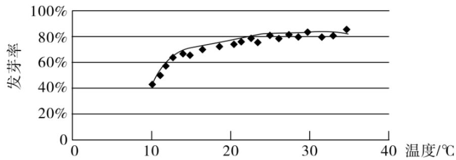
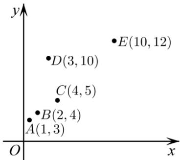
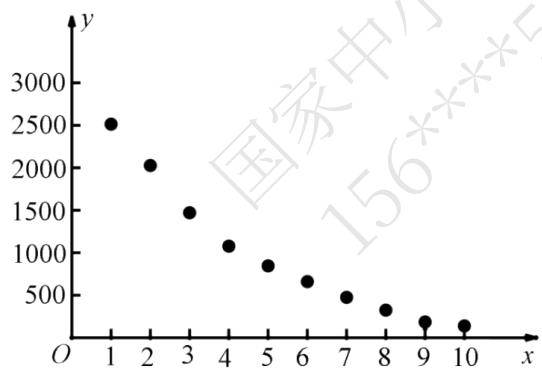

### 高中 数学 选择性必修 第二册第四章 数列 直接证明与间接证明
### 一、单选题（共4题）
1. 【单选题】给出下列说法：  $①$  回归直线  $\hat{y} = \hat{b} x + \hat{a}$  恒过样本点的中心  $(\vec{x},\vec{y})$ ，且至少过一个样本点；  $②$  两个变量相关性越强，则相关系数  $|r|$  就越接近1；  $③$  将一组数据的每个数据都加一个相同的常数后，方差不变；  $④$  在回归直线方程  $\hat{y} = 2 - 0.5x$  中，当解释变量  $x$  增加一个单位时，预报变量  $\hat{y}$  平均减少0.5个单位.其中说法正确的是（ ）A.  $①②④$ B.  $②③④$ C.  $①③④$ D.  $②④$
$\quad$A.  $①②④$  
$\quad$B.  $②③④$  
$\quad$C.  $①③④$  
$\quad$D.  $②④$
2. 【单选题】用模型  $y = c\mathbf{e}^{ax}$  拟合一组数据时，为了求出回归方程，设  $z = \ln y$ ，其变换后得到线性回归方程为  $z = 2x + \frac{1}{2}$ ，则  $c =$ （ ）A. 0.5B.  $e^{0.5}$ C. 2D.  $e^{2}$
$\quad$A.0.5 
$\quad$B.  $e^{0.5}$  
$\quad$C.2 
$\quad$D.  $e^{2}$
3. 【单选题】以下说法错误的是（
$\quad$A. 用样本相关系数  $r$  来刻画成对样本数据的相关程度时，若  $|r|$  越大，则成对样本数据的线性相关程度越强
$\quad$B. 经验回归方程  $\hat{y} = \hat{b} x + \hat{a}$  一定经过点  $(\vec{x},\vec{y})$ 
$\quad$C. 用残差平方和来刻画模型的拟合效果时，若残差平方和越小，则相应模型的拟合效果越好
$\quad$D. 用决定系数  $R^{2}$  来刻画模型的拟合效果时，若  $R^{2}$  越小，则相应模型的拟合效果越好
4. 【单选题】某校一个课外学习小组为研究某作物种子的发芽率  $y$  和温度  $x$ （单位：  $^\circ$  C）的关系，在20个不同的温度条件下进行种子发芽实验，由实验数据  $(x_{i}y_{i})(i = 1,2,\dots ,20)$  得到下面的散点图：

由此散点图，在  $10^{\circ}$  C至  $40^{\circ}$  C之间，下面四个回归方程类型中最适宜作为发芽率y和温度x的回归方程类型的是（ ）
$\quad$A.  $y = a + bx$  
$\quad$B.  $y = a + bx^{2}$  
$\quad$C.  $y = a + b\mathrm{e}^{x}$  
$\quad$D.  $y = a + b\ln x$
### 二、多选题（共3题）
5. 【多选题】已知  $x$  与  $y$  之间的四组数据如下表：
<table><tr><td>x</td><td>2</td><td>3</td><td>4</td><td>5</td></tr><tr><td>y</td><td>1.5</td><td>m</td><td>n</td><td>3.5</td></tr></table>
上表数据中  $y$  的平均值为2.5，若某同学对  $m$  赋了两个值，分别为2，2.5，得到两条回归直线的方程分别为  $\bar{y} = \hat{b}_I x + \hat{a}_I$ $\bar{y} = \hat{b}_2 x + \hat{a}_2$  ，对应的相关系数分别为  $r_I$ $r_2$  ，则（ ）
$\quad$A.两条回归直线的交点为(3.5,2.5) 
$\quad$B.  $\hat{a}_I > \hat{a}_2$  
$\quad$C.  $\hat{b}_I > \hat{b}_2$  
$\quad$D.  $r_I > r_2$
6. 【多选题】下列说法正确的是（
$\quad$A.对于独立性检验，随机变量  $x^{2}$  的观测值值越小，判定“两变量有关系”犯错误的概率越小
$\quad$B.在回归分析中，决定系数  $R^2$  越大，说明回归模型拟合的效果越好
$\quad$C.随机变量  $\xi \sim B(n,p)$  ，若  $E_{(x)} = 30$  ，  $D_{(x)} = 20$  ，则  $n = 45$  
$\quad$D.以  $\hat{y} = c e^{kx}$  拟合一组数据时，经  $z = lny$  代换后的线性回归方程为  $\hat{z} = 0.3x + 4$  ，则  $c = e^4$  ，  $k = 0.3$
7. 【多选题】如图，5个数据  $(x,y)$ ，去掉点  $D(3,10)$  后，下列说法正确的是（ ）

$\quad$A.相关系数  $r$  变大
$\quad$B.残差平方和变大
$\quad$C.变量  $\mathcal{X}$  与变量  $y$  呈正相关
$\quad$D.变量  $\mathcal{X}$  与变量  $y$  的相关性变强
### 三、填空题（共2题）
8. 【填空题】若有一组数据的总偏差平方和为100，决定系数  $R^2 = 0.75$ ，则其残差平方和为
9. 【填空题】  $x$  和  $y$  的散点图如图所示，则下列说法中所有正确命题的序号为

$①x$  ，  $y$  是负相关关系； $②x$  ，  $y$  之间不能建立线性回归方程； $(3)$  在该相关关系中，若用  $y = c_{I}e^{c_{2}x}$  拟合时的决定系数为  $R_{I}^{2}$  ，用  $\hat{y} = \hat{b} x + \hat{a}$  拟合时的决定系数为  $R_{2}^{2}$  ，则  $R_{I}^{2} > R_{2}^{2}$
### 四、复合题（共1题）
10. 【复合题】假设关于某种设备的使用年限  $x$  (单位：年)与所支出的维修费用  $y$  (单位：万元)有如下统计资料：
<table><tr><td>x</td><td>2</td><td>3</td><td>4</td><td>5</td><td>6</td></tr><tr><td>y</td><td>2.2</td><td>3.8</td><td>5.5</td><td>6.5</td><td>7.0</td></tr></table>
已知  $\sum_{5}^{i = 1}x_{i}^{2} = 90,\sum_{5}^{i = 1}y_{i}^{2}\approx 140.8,\sum_{5}^{i = 1}x_{i}y_{i} = 112.3,\sqrt{79}\approx 8.9,\sqrt{2}\approx 1.4.$
(1)【问答题】求  $\overline{x}$ $\overline{y}$
(2)【问答题】对  $x$ $y$  进行线性相关性检验.